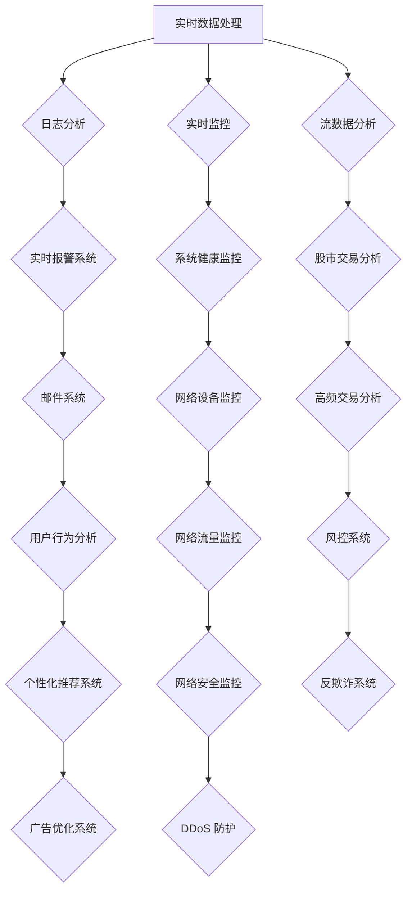

                 

### 《Flink 有状态流处理和容错机制原理与代码实例讲解》

关键词：Flink、有状态流处理、容错机制、分布式处理、流处理框架、状态管理、实时数据处理、开源技术

摘要：本文将深入探讨 Apache Flink 的有状态流处理和容错机制。首先，我们将回顾 Flink 的基本概念和架构，接着详细介绍有状态流处理的核心原理和实现方法。随后，我们将剖析 Flink 的容错机制，包括其故障类型、恢复策略以及实现原理。最后，通过两个实际项目案例，我们将展示如何在实际开发中应用 Flink 的有状态流处理和容错机制，并提供详细的代码实例和分析。

### 《Flink 有状态流处理和容错机制原理与代码实例讲解》目录大纲

- **第一部分：Flink 基础知识**
  - 第1章 Flink 概述
  - 第2章 Flink 架构与运行原理
- **第二部分：有状态流处理**
  - 第3章 Flink 有状态流处理基础
  - 第4章 Flink 有状态流处理应用
- **第三部分：Flink 容错机制**
  - 第5章 Flink 容错机制概述
  - 第6章 Flink 高级容错策略
- **第四部分：Flink 项目实战**
  - 第7章 Flink 状态流处理案例解析
  - 第8章 Flink 容错机制实践
- **附录**
  - 附录 A Flink 开发环境搭建
  - 附录 B Flink 相关资源

### 第1章: Flink 概述

#### 1.1 Flink 的背景与发展历程

Flink 是由 Apache 软件基金会托管的一个开源分布式数据处理框架，其目标是为实时流处理和批处理提供统一的数据处理平台。Flink 的起源可以追溯到 2009 年，当时在柏林工业大学（Technical University of Berlin）的一个研究项目中诞生。该项目由当时的博士生 维克托·卡帕卡（Viktor Konecny）领导，旨在解决大规模分布式数据处理中的实时性和一致性难题。随着时间的推移，该项目逐渐成熟，并最终在 2014 年正式成为 Apache 软件基金会的一部分。

#### 1.2 Flink 的核心优势与特性

- **真正的流处理能力**：Flink 提供了高效的流处理能力，支持事件驱动的数据处理模式。它能够处理任意大小的数据流，并且能够保证数据的低延迟和高吞吐量。
- **统一的处理模型**：Flink 提供了一个统一的数据处理模型，能够同时处理流数据和批数据，无需对数据处理逻辑进行修改。
- **高可靠性**：Flink 通过基于检查点的容错机制，实现了在故障发生时对数据处理的快速恢复，保证了系统的稳定性和数据的完整性。
- **易用性**：Flink 提供了丰富的 API 和工具，支持多种编程语言（如 Java、Scala、Python），使得开发者能够轻松上手并构建复杂的数据处理应用。
- **生态系统丰富**：Flink 与其他大数据处理工具（如 Hadoop、Spark）具有良好的兼容性，并且有着丰富的生态库，如 Flink SQL、Table API 等。

#### 1.3 Flink 在大数据处理中的应用场景

Flink 在大数据处理领域有着广泛的应用场景，主要包括以下几个方面：

- **实时数据处理**：Flink 能够实时处理大规模的数据流，适用于实时日志分析、实时监控、实时流数据分析等场景。
- **批数据处理**：Flink 支持批数据处理，适用于离线数据分析、数据清洗、数据迁移等任务。
- **复杂事件处理**：Flink 提供了丰富的窗口和算子功能，适用于复杂的事件处理任务，如窗口聚合、滑动窗口等。
- **流数据同步与复制**：Flink 可以与其他数据存储系统（如 Kafka、Kinesis、Redis、Cassandra）进行流数据同步与复制，适用于数据流传输和分布式数据存储。
- **机器学习和人工智能**：Flink 支持机器学习和人工智能应用，通过其丰富的 API 和工具，能够高效地处理大规模数据集，实现实时机器学习推理和在线学习。

### Mermaid 流程图

以下是 Flink 在大数据处理中的一些典型应用场景的 Mermaid 流程图：



通过上述 Mermaid 流程图，我们可以清晰地看到 Flink 在各种大数据处理应用场景中的角色和重要性。接下来，我们将进一步深入探讨 Flink 的架构和运行原理，以便更好地理解其工作方式。

### 第2章: Flink 架构与运行原理

#### 2.1 Flink 架构详解

Flink 的架构设计旨在提供高效、可靠的分布式数据处理能力。其核心架构包括以下几个关键组件：

- **Flink 客户端**：Flink 客户端是开发者编写和提交 Flink 作业的入口。客户端负责将作业描述转换为内部数据结构，并提交给 Flink 集群的管理层。
- **Flink 集群管理器**：集群管理器是 Flink 集群的中心控制单元。它负责资源分配、作业调度、状态管理和故障恢复等功能。Flink 集群管理器通常由 JobManager（主节点）和 TaskManagers（工作节点）组成。
- **JobManager**：JobManager 负责协调整个作业的执行。它接收客户端提交的作业，生成作业图（Job Graph），并将其转换为物理执行计划（Physical Plan）。此外，JobManager 还负责作业的启动、监控和恢复。
- **TaskManager**：TaskManager 是 Flink 集群中的工作节点，负责执行具体的计算任务。一个 TaskManager 通常包含多个任务槽（Task Slots），每个任务槽可以同时执行一个计算任务。TaskManager 通过数据流和网络连接与 JobManager 和其他 TaskManager 交互。

除了上述核心组件，Flink 还包括以下几个重要的辅助组件：

- **资源管理器**：资源管理器负责为 Flink 集群分配资源。在云环境中，常用的资源管理器包括 YARN、Mesos 和 Kubernetes。资源管理器确保 Flink 集群中的资源（如 CPU、内存和存储）得到合理利用和分配。
- **状态后端**：状态后端用于存储和管理 Flink 作业的状态数据。Flink 提供了多种状态后端实现，如内存后端（Heap-based State Backend）和 RocksDB 状态后端。状态后端保证状态数据的持久化和容错性。
- **分布式文件系统**：分布式文件系统用于存储 Flink 作业的元数据和检查点数据。常用的分布式文件系统包括 HDFS、Alluxio 和 Amazon S3。

#### 2.2 Flink 运行原理剖析

Flink 的运行原理主要包括以下几个关键步骤：

1. **作业提交与解析**：
   - 开发者使用 Flink 客户端编写作业，并将作业描述提交给 Flink 集群管理器。
   - Flink 客户端将作业描述转换为内部数据结构，并将其发送给 JobManager。
   - JobManager 接收到作业描述后，生成作业图（Job Graph）。

2. **作业图转换为物理执行计划**：
   - JobManager 将作业图转换为物理执行计划（Physical Plan）。物理执行计划描述了作业的执行顺序和依赖关系，以及每个任务的输入和输出。
   - 物理执行计划经过一系列优化过程，如数据流优化、调度优化和并发优化，以提高作业的执行效率。

3. **任务调度与分配**：
   - JobManager 根据物理执行计划和集群资源情况，将任务分配给合适的 TaskManager。
   - 任务分配过程中，JobManager 会考虑任务的依赖关系、数据传输成本和集群负载均衡等因素。

4. **任务执行**：
   - TaskManager 接收到分配的任务后，开始执行具体的计算任务。
   - 任务执行过程中，TaskManager 会通过网络传输数据，并与 JobManager 保持通信，报告任务状态和进度。

5. **状态管理与恢复**：
   - Flink 作业在执行过程中，会生成和更新状态数据。状态数据存储在状态后端，并可以通过检查点（Checkpoint）机制进行持久化和恢复。
   - 当发生故障时，Flink 集群管理器会触发恢复流程，从最近的检查点恢复状态数据，确保作业的持续运行。

6. **数据流与网络通信**：
   - Flink 使用基于事件驱动（Event-Driven）的数据流模型。数据流通过网络传输，通过管道（Pipes）和窗口（Windows）进行管理。
   - 数据流在网络中通过数据流连接（DataStream Connections）传输，确保数据的一致性和可靠性。

#### 2.3 Flink 实例：工作流程演示

为了更好地理解 Flink 的运行原理，我们可以通过一个简单的单词计数示例来演示 Flink 的工作流程。

1. **作业提交与解析**：
   - 开发者使用 Flink 客户端提交一个简单的单词计数作业，该作业从文本文件中读取数据，并计算每个单词的频率。

2. **作业图转换为物理执行计划**：
   - Flink JobManager 接收到作业描述后，生成作业图。作业图包含两个主要节点：数据源（Source）和单词计数器（Word Counter）。

3. **任务调度与分配**：
   - Flink JobManager 根据集群资源情况，将数据源节点和单词计数器节点分配给不同的 TaskManager。

4. **任务执行**：
   - 数据源节点从文本文件中读取数据，并将其发送给单词计数器节点。单词计数器节点接收数据后，计算每个单词的频率，并将结果发送回 JobManager。

5. **状态管理与恢复**：
   - 在单词计数过程中，Flink 会生成和更新状态数据，如每个单词的计数。这些状态数据存储在状态后端，并可以通过检查点进行持久化和恢复。

6. **数据流与网络通信**：
   - 数据流在网络中通过数据流连接传输，确保数据的一致性和可靠性。Flink 使用 Akka HTTP 和 Netty 等高性能网络库进行数据传输和通信。

通过上述步骤，我们可以看到 Flink 的作业从提交、解析、调度、执行到状态管理和恢复的完整工作流程。这个简单的例子展示了 Flink 在分布式数据处理中的高效性和可靠性，为后续章节的深入讨论奠定了基础。接下来，我们将详细介绍 Flink 的有状态流处理机制，探讨如何实现和管理状态数据。

### 第3章: Flink 有状态流处理基础

#### 3.1 有状态流处理的定义与重要性

有状态流处理是指流处理系统中，对流的每个元素进行处理时，可以访问和维护一个状态。这个状态可以是一个简单的计数器，也可以是一个复杂的结构化数据集，用于记录和处理历史数据。有状态流处理在实时数据处理中扮演着重要角色，因为它允许系统对历史数据进行查询和分析，从而实现更加复杂和智能的数据处理任务。

有状态流处理的重要性体现在以下几个方面：

1. **历史数据依赖**：许多实时数据处理任务需要对历史数据进行依赖，如窗口计算、事件时间处理和状态累积。有状态流处理使得系统可以存储和访问这些历史数据。
2. **复杂数据分析**：通过维护状态，系统可以实现诸如统计、分类、预测等复杂数据分析任务。这些任务在实时流处理中尤为重要，因为它们能够为用户提供及时和准确的信息。
3. **容错和数据一致性**：有状态流处理提供了状态管理和检查点机制，确保在故障发生时能够恢复到正确的状态，保证数据的一致性和完整性。
4. **实时性保证**：有状态流处理能够保证在处理每个元素时，系统状态是准确和最新的，从而实现低延迟的实时数据处理。

#### 3.2 Flink 有状态流的实现原理

Flink 提供了两种主要的状态管理机制：Keyed State 和 Operator State。这两种状态管理机制分别适用于不同的应用场景。

1. **Keyed State**：
   - **定义**：Keyed State 是基于键（Key）的状态，每个键维护一个独立的状态。例如，在单词计数任务中，每个单词对应一个键，维护一个计数器状态。
   - **实现原理**：Keyed State 通过 State Descriptor 进行注册和管理。每个键对应一个状态变量，可以在算子的 `processElement` 方法中访问和更新。Flink 通过分布式状态后端（如 RocksDB 或内存后端）来存储和管理 Keyed State。
   - **示例**：
     ```java
     // 注册 Keyed State
     StateDescriptor<String, Long> stateDescriptor = new ValueStateDescriptor<>("wordCount", TypeInformation.of(String.class));
     
     // 在 processElement 方法中访问和更新 Keyed State
     @ProcessElement
     public void processElement(StreamElement element, Context context, Collector<Tuple2<String, Long>> out) {
         String word = element.getString();
         ValueState<Long> state = context.getState(stateDescriptor);
         if (state.value() == null) {
             state.update(1L);
         } else {
             state.update(state.value() + 1);
         }
         out.collect(new Tuple2<>(word, state.value()));
     }
     ```

2. **Operator State**：
   - **定义**：Operator State 是基于算子的状态，用于维护多个键之间的状态关联。例如，在窗口计算中，可以使用 Operator State 维护每个窗口的状态。
   - **实现原理**：Operator State 通过 OperatorStateDescriptor 进行注册和管理。Flink 使用分布式状态后端来存储和管理 Operator State。每个算子的状态都是独立的，可以通过算子的状态变量进行访问和更新。
   - **示例**：
     ```java
     // 注册 Operator State
     OperatorStateDescriptor<Long> stateDescriptor = new OperatorStateDescriptor<>("windowState", TypeInformation.of(Long.class));
     
     // 在 processElement 方法中访问和更新 Operator State
     @ProcessElement
     public void processElement(StreamElement element, Context context, Collector<Tuple2<String, Long>> out) {
         Long stateValue = context.getState(stateDescriptor).value();
         if (stateValue == null) {
             context.getState(stateDescriptor).update(0L);
         }
         context.getState(stateDescriptor).update(stateValue + element.getLong());
         out.collect(new Tuple2<>(element.getString(), context.getState(stateDescriptor).value()));
     }
     ```

#### 3.3 Flink 状态管理机制详解

Flink 提供了丰富的状态管理机制，包括状态注册、状态更新、状态查询和状态恢复等。以下是对 Flink 状态管理机制的详细解释：

1. **状态注册**：
   - 在 Flink 中，状态通过 StateDescriptor 进行注册。StateDescriptor 包含状态的名字和类型信息，用于标识和管理状态。
   - 注册状态时，需要指定状态的后端存储方式。Flink 提供了多种状态后端实现，如 Heap-based State Backend、RocksDB State Backend 和 File State Backend。

2. **状态更新**：
   - 状态的更新在算子的 `processElement` 方法中进行。可以通过 `Context.getState` 方法获取状态变量，然后进行更新。
   - 在更新状态时，需要确保状态的一致性和线程安全性。Flink 提供了原子操作（如 `update` 和 `merge`），确保状态更新的原子性和一致性。

3. **状态查询**：
   - 状态的查询同样在 `processElement` 方法中进行。可以通过 `Context.getState` 方法获取状态变量，然后进行查询。
   - 查询状态时，可以根据实际需求读取状态值或状态元数据（如状态的后端存储路径和时间戳）。

4. **状态恢复**：
   - 在 Flink 中，状态恢复是通过检查点（Checkpoint）机制实现的。检查点是一个系统状态的快照，用于在故障发生时恢复状态。
   - 当作业执行过程中发生故障时，Flink 会从最近的检查点恢复状态，确保作业能够继续执行。
   - 恢复状态时，Flink 会根据状态的后端存储方式，从相应的存储系统中读取状态数据，并将其还原到作业的执行上下文中。

以下是 Flink 状态管理机制的伪代码示例：

```java
// 注册 Keyed State
StateDescriptor<String, Long> wordCountStateDescriptor = new ValueStateDescriptor<>("wordCount", TypeInformation.of(String.class));

// 注册 Operator State
OperatorStateDescriptor<Long> windowStateDescriptor = new OperatorStateDescriptor<>("windowState", TypeInformation.of(Long.class));

// 在 processElement 方法中更新 Keyed State
public void processElement(StreamElement element, Context context, Collector<Tuple2<String, Long>> out) {
    ValueState<Long> wordCountState = context.getState(wordCountStateDescriptor);
    if (wordCountState.value() == null) {
        wordCountState.update(1L);
    } else {
        wordCountState.update(wordCountState.value() + 1);
    }
    out.collect(new Tuple2<>(element.getString(), wordCountState.value()));
}

// 在 processElement 方法中更新 Operator State
public void processElement(StreamElement element, Context context, Collector<Tuple2<String, Long>> out) {
    Long windowStateValue = context.getState(windowStateDescriptor).value();
    if (windowStateValue == null) {
        context.getState(windowStateDescriptor).update(0L);
    }
    context.getState(windowStateDescriptor).update(windowStateValue + element.getLong());
    out.collect(new Tuple2<>(element.getString(), context.getState(windowStateDescriptor).value()));
}

// 恢复状态（示例）
public void restoreStateFromCheckpoint() {
    // 从检查点恢复 Keyed State
    ValueState<Long> wordCountState = context.getState(wordCountStateDescriptor);
    // 从检查点恢复 Operator State
    OperatorState<Long> windowState = context.getState(windowStateDescriptor);
}
```

通过上述示例，我们可以看到 Flink 如何注册、更新和恢复状态。在接下来的章节中，我们将进一步探讨 Flink 的有状态流处理应用，并介绍具体的案例和实现方法。

### 第4章: Flink 有状态流处理应用

#### 4.1 有状态流处理的数据源

在 Flink 中，有状态流处理的数据源可以多种多样，包括 Kafka、File、Socket 和 Collection 等。根据实际应用场景的需求，选择合适的数据源对于实现高效、可靠的有状态流处理至关重要。

1. **Kafka**：
   - **介绍**：Kafka 是一款分布式流处理平台，具有高吞吐量、可靠性和可伸缩性。它被广泛应用于实时数据处理和消息传递场景。
   - **配置**：在 Flink 中使用 Kafka 作为数据源时，需要配置 Kafka 客户端参数，如 Kafka 主题、 brokers 地址、分区数量等。
   - **示例**：
     ```java
     DataStream<String> kafkaStream = env.addSource(new FlinkKafkaConsumer011<>("kafka-topic", new SimpleStringSchema(), properties));
     ```

2. **File**：
   - **介绍**：File 数据源用于从本地文件系统或分布式文件系统（如 HDFS）中读取数据。它适用于离线数据处理和测试场景。
   - **配置**：在 Flink 中使用 File 作为数据源时，需要指定文件路径、文件格式和分隔符等参数。
   - **示例**：
     ```java
     DataStream<String> fileStream = env.addSource(new FileSystemSource<>(new SimpleStringSchema(), "hdfs://path/to/file.txt"));
     ```

3. **Socket**：
   - **介绍**：Socket 数据源用于从网络中读取数据，通常用于实时数据处理和交互式分析。它适用于需要实时接收外部数据输入的场景。
   - **配置**：在 Flink 中使用 Socket 作为数据源时，需要指定监听的端口和传输协议。
   - **示例**：
     ```java
     DataStream<String> socketStream = env.addSource(new SocketTextStream<>(host, port));
     ```

4. **Collection**：
   - **介绍**：Collection 数据源用于从 Java 集合（如 List、Set、Map）中读取数据。它适用于测试和简单数据流处理场景。
   - **配置**：在 Flink 中使用 Collection 作为数据源时，需要提供数据集合的实例。
   - **示例**：
     ```java
     Collection<String> data = Arrays.asList("hello", "world");
     DataStream<String> collectionStream = env.fromCollection(data);
     ```

选择数据源时，需要考虑以下因素：

- **数据来源**：根据实际应用场景，选择合适的数据源，如 Kafka 用于实时数据处理，File 用于离线数据处理。
- **数据规模**：考虑数据规模和吞吐量，选择能够支持高吞吐量的数据源。
- **可靠性**：考虑数据源的可靠性，选择具有高可靠性和容错性的数据源。
- **可扩展性**：考虑数据源的可扩展性，选择能够支持集群扩展的数据源。

#### 4.2 有状态流处理的算子

Flink 提供了丰富的算子（Operator），用于实现复杂的有状态流处理逻辑。以下是一些常见的 Flink 算子及其应用场景：

1. **Map**：
   - **介绍**：Map 算子用于对输入数据进行转换操作，将每个元素映射为一个新的元素。
   - **应用场景**：数据清洗、数据转换、字段提取等。
   - **示例**：
     ```java
     DataStream<String> inputStream = env.fromElements("hello", "world");
     DataStream<String> mappedStream = inputStream.map(s -> s.toUpperCase());
     ```

2. **FlatMap**：
   - **介绍**：FlatMap 算子扩展了 Map 算子的功能，能够处理输入数据中的复合元素，将其拆分为多个元素。
   - **应用场景**：文本分词、日志解析、事件拆分等。
   - **示例**：
     ```java
     DataStream<String> inputStream = env.fromElements("hello world", "Flink is cool");
     DataStream<String> flatMappedStream = inputStream.flatMap(s -> Arrays.asList(s.split(" ")).iterator());
     ```

3. **Filter**：
   - **介绍**：Filter 算子用于过滤输入数据，只保留满足条件的元素。
   - **应用场景**：数据筛选、异常检测、规则匹配等。
   - **示例**：
     ```java
     DataStream<String> inputStream = env.fromElements("hello", "world", "Flink");
     DataStream<String> filteredStream = inputStream.filter(s -> s.startsWith("F"));
     ```

4. **KeyBy**：
   - **介绍**：KeyBy 算子用于将输入数据根据某个字段进行分组，为后续的状态管理和聚合操作提供基础。
   - **应用场景**：数据聚合、状态维护、窗口计算等。
   - **示例**：
     ```java
     DataStream<MyData> inputStream = env.fromElements(new MyData("Alice", 30), new MyData("Bob", 40));
     DataStream<MyData> keyedStream = inputStream.keyBy(MyData::getName);
     ```

5. **Reduce**：
   - **介绍**：Reduce 算子用于对输入数据进行聚合操作，将多个元素合并为一个元素。
   - **应用场景**：数据汇总、窗口聚合、计数等。
   - **示例**：
     ```java
     DataStream<Tuple2<String, Integer>> inputStream = env.fromElements(new Tuple2<>("Alice", 30), new Tuple2<>("Alice", 40), new Tuple2<>("Bob", 40));
     DataStream<Tuple2<String, Integer>> reducedStream = inputStream.keyBy(0).reduce((value1, value2) -> new Tuple2<>(value1.f0, value1.f1 + value2.f1));
     ```

6. **Window**：
   - **介绍**：Window 算子用于对输入数据进行时间窗口划分，实现对窗口内数据的聚合和分析。
   - **应用场景**：统计报表、流量监控、行为分析等。
   - **示例**：
     ```java
     DataStream<MyData> inputStream = env.fromElements(new MyData("Alice", 30), new MyData("Bob", 40));
     DataStream<MyData> windowedStream = inputStream.keyBy(MyData::getName).window(TumblingEventTimeWindows.of(Time.seconds(10)));
     ```

通过上述算子的组合使用，我们可以实现复杂的有状态流处理逻辑。这些算子为 Flink 的有状态流处理提供了强大的功能和灵活性，使得开发者能够轻松构建高效、可靠的实时数据处理系统。

#### 4.3 有状态流处理的数据流模式

在 Flink 中，有状态流处理可以通过多种数据流模式实现，包括单条记录模式、多条记录模式和窗口模式。这些模式适用于不同的应用场景，提供了灵活的状态维护和数据处理方式。

1. **单条记录模式**：
   - **定义**：单条记录模式是指每个元素独立处理，状态与单个元素相关联。
   - **特点**：适用于处理独立事件或记录，状态更新简单且易于理解。
   - **应用场景**：实时日志处理、事件流分析等。
   - **示例**：
     ```java
     DataStream<MyData> inputStream = env.fromElements(new MyData("Alice", 30), new MyData("Bob", 40));
     inputStream.keyBy(MyData::getName).process(new MyDataProcessFunction());
     ```

2. **多条记录模式**：
   - **定义**：多条记录模式是指多个元素之间具有关联性，状态维护需要考虑多条记录之间的关系。
   - **特点**：适用于处理复杂关联关系，状态更新涉及多条记录的数据。
   - **应用场景**：订单处理、事务处理、实时监控等。
   - **示例**：
     ```java
     DataStream<Order> inputStream = env.fromElements(new Order("Alice", 100), new Order("Bob", 200));
     inputStream.keyBy(Order::getCustomerId).process(new OrderProcessFunction());
     ```

3. **窗口模式**：
   - **定义**：窗口模式是指将输入数据根据时间或事件进行划分，窗口内的数据作为一个整体进行处理。
   - **特点**：适用于处理时间敏感数据，窗口内状态维护和聚合操作高效。
   - **应用场景**：流量监控、行为分析、统计报表等。
   - **示例**：
     ```java
     DataStream<MyData> inputStream = env.fromElements(new MyData("Alice", 30), new MyData("Bob", 40));
     inputStream.keyBy(MyData::getName).window(TumblingEventTimeWindows.of(Time.seconds(10))).process(new WindowMyDataProcessFunction());
     ```

通过上述数据流模式，我们可以根据具体应用场景选择合适的状态维护和数据聚合方式，实现高效、灵活的有状态流处理。

### 第5章: Flink 容错机制概述

#### 5.1 容错机制的定义与作用

容错机制是指在系统发生故障时，系统能够自动恢复并继续正常运行的能力。在分布式计算环境中，故障是不可避免的，如任务失败、节点故障、网络异常等。Flink 的容错机制旨在确保在发生故障时，系统能够快速恢复，保证数据处理的连续性和一致性。

Flink 容错机制的主要作用包括：

1. **保证数据处理连续性**：在发生故障时，Flink 能够自动恢复任务执行，确保数据处理过程不被中断。
2. **确保数据一致性**：通过检查点和状态恢复机制，Flink 能够在故障恢复时保持数据的一致性和完整性。
3. **提高系统可用性**：Flink 的容错机制能够提高系统的可用性，减少故障对业务的影响。

#### 5.2 Flink 的故障类型与应对策略

在 Flink 中，故障可以分为以下几种类型，每种类型都有相应的应对策略：

1. **任务失败**：
   - **定义**：任务失败是指执行中的计算任务因各种原因（如计算错误、资源不足等）无法继续执行。
   - **应对策略**：Flink 提供了任务重启策略，包括固定延迟重启和失败后重启。当任务失败时，Flink 会根据重启策略自动重启任务。

2. **节点故障**：
   - **定义**：节点故障是指运行任务的节点（TaskManager）发生故障，导致任务无法继续执行。
   - **应对策略**：Flink 通过任务重新分配机制，将失败的节点上的任务分配给其他健康节点继续执行。同时，Flink 还支持节点重启功能，当节点故障时，自动重启节点。

3. **网络异常**：
   - **定义**：网络异常是指任务之间的数据传输因网络问题（如网络延迟、丢包等）受到影响。
   - **应对策略**：Flink 提供了网络恢复机制，包括数据重传和缓冲区管理。当检测到网络异常时，Flink 会自动重传数据，并调整缓冲区大小，确保数据传输的稳定性。

4. **检查点失败**：
   - **定义**：检查点失败是指 Flink 在生成检查点时发生错误，导致检查点无法生成或丢失。
   - **应对策略**：Flink 提供了检查点重试机制，当检查点失败时，Flink 会尝试重新生成检查点。如果重试失败，Flink 会从上一个成功的检查点开始恢复。

#### 5.3 Flink 容错机制实现原理

Flink 的容错机制基于检查点（Checkpointing）和状态恢复（State Recovery）两大核心机制。以下是 Flink 容错机制的实现原理：

1. **检查点机制**：
   - **定义**：检查点是 Flink 生成的一个系统状态的快照，用于在故障发生时恢复状态。
   - **实现原理**：
     1. Flink 集群管理器（JobManager）定期触发检查点生成。
     2. 任务执行器（TaskExecutor）在接收到检查点命令后，生成任务级检查点。
     3. 检查点数据通过网络传输到状态后端（如 RocksDB 或内存后端）进行存储。
     4. 当检查点生成成功后，Flink 将更新作业的状态，确保检查点数据的有效性。

2. **状态恢复机制**：
   - **定义**：状态恢复是指 Flink 在故障发生后，从检查点恢复系统状态，确保作业能够继续执行。
   - **实现原理**：
     1. 当 Flink 检测到任务失败或节点故障时，会触发恢复流程。
     2. Flink 从最近的成功检查点开始恢复状态，重新执行失败的作业。
     3. 在恢复过程中，Flink 会重新启动任务、任务管理器和节点，确保作业的完整性和一致性。

3. **故障检测与处理**：
   - **定义**：故障检测与处理是指 Flink 对系统故障的检测、报告和处理机制。
   - **实现原理**：
     1. Flink 通过心跳机制（Heartbeat）监控任务执行状态。
     2. 当检测到任务失败或节点故障时，Flink 会记录故障信息，并触发相应的恢复流程。
     3. Flink 还提供了故障处理日志和监控工具，帮助开发者诊断和解决故障。

通过上述检查点机制和状态恢复机制，Flink 能够在分布式计算环境中提供高效、可靠的容错能力，确保系统在故障发生时能够快速恢复，保证数据处理的连续性和一致性。

### 第6章: Flink 高级容错策略

#### 6.1 任务重启策略

在 Flink 中，任务重启策略（Restart Strategy）是指系统在任务失败时自动重启任务的具体策略。Flink 提供了多种任务重启策略，可以根据实际需求进行选择和配置。

1. **固定延迟重启**：
   - **定义**：固定延迟重启策略是指当任务失败时，系统等待指定的时间间隔后重新启动任务。
   - **配置**：
     ```java
     env.setRestartStrategy(RestartStrategies.fixedDelayRestart(
         3,  // 最大重试次数
         Time.of(10, SECONDS)  // 重启延迟时间
     ));
     ```
   - **应用场景**：适用于任务失败是由于短暂的网络问题或临时资源不足等情况。

2. **失败后重启**：
   - **定义**：失败后重启策略是指当任务失败时，系统立即重新启动任务，而不需要等待延迟时间。
   - **配置**：
     ```java
     env.setRestartStrategy(RestartStrategies.failureRateRestart(
         3,  // 最大失败次数
         Time.of(1, MINUTES),  // 间隔时间
         Time.of(10, MINUTES)  // 重启延迟时间
     ));
     ```
   - **应用场景**：适用于任务失败是由于永久性错误或持续性问题，需要立即重新启动任务。

3. **定时重启**：
   - **定义**：定时重启策略是指系统在指定的时间间隔内自动重启任务，无需等待任务失败。
   - **配置**：
     ```java
     env.setRestartStrategy(RestartStrategies.fixedIntervalRestart(
         Time.of(10, MINUTES)  // 重启时间间隔
     ));
     ```
   - **应用场景**：适用于需要定期重启任务，如进行维护或更新任务逻辑等。

通过选择合适的任务重启策略，Flink 能够在任务失败时自动恢复，确保系统的稳定性和可靠性。

#### 6.2 集群故障恢复机制

Flink 集群故障恢复机制是指在 Flink 集群发生故障时，系统如何自动恢复，确保集群的正常运行。Flink 提供了以下几种故障恢复机制：

1. **任务重新分配**：
   - **定义**：任务重新分配是指在节点故障或任务失败时，系统自动将任务重新分配给其他健康节点继续执行。
   - **实现原理**：Flink 集群管理器（JobManager）会监控任务的状态，当检测到任务失败或节点故障时，自动将任务重新分配给其他健康节点。

2. **节点重启**：
   - **定义**：节点重启是指在节点发生故障时，系统自动重启节点，确保节点恢复正常运行。
   - **实现原理**：Flink 集群管理器（JobManager）会监控节点的健康状态，当检测到节点故障时，自动重启节点。

3. **集群扩缩容**：
   - **定义**：集群扩缩容是指在集群资源不足或负载过高时，系统自动增加或减少节点数量，以适应负载变化。
   - **实现原理**：Flink 集群管理器（JobManager）会根据集群资源使用情况和负载情况，自动调整节点数量，确保集群的负载均衡和性能优化。

通过上述故障恢复机制，Flink 能够在集群发生故障时自动恢复，确保系统的稳定性和可靠性。

#### 6.3 数据一致性与容错

数据一致性与容错是分布式系统中至关重要的两个方面。在 Flink 中，数据一致性和容错通过以下机制实现：

1. **分布式一致性算法**：
   - **定义**：分布式一致性算法是指在分布式环境中，确保数据在不同节点之间的一致性。
   - **实现原理**：Flink 使用了基于分布式一致性算法的分布式状态后端（如 RocksDB），通过一致性协议（如 Raft 或 Paxos）保证数据在不同节点之间的一致性。

2. **状态后端**：
   - **定义**：状态后端是指用于存储和管理 Flink 作业状态数据的存储系统。
   - **实现原理**：Flink 提供了多种状态后端实现，如内存后端（Heap-based State Backend）、RocksDB 状态后端和 File 状态后端。这些状态后端支持数据的持久化和快速访问，确保数据的一致性和容错性。

3. **数据快照与恢复**：
   - **定义**：数据快照是指在特定时刻保存系统状态的数据快照，用于在故障发生时恢复系统状态。
   - **实现原理**：Flink 通过定期生成检查点（Checkpoint）来保存系统状态快照。当发生故障时，Flink 从最近的检查点恢复系统状态，确保数据的一致性和完整性。

通过分布式一致性算法、状态后端和数据快照与恢复机制，Flink 能够在分布式环境中实现数据一致性和容错，确保系统在故障发生时能够快速恢复，保证数据的完整性和可靠性。

### 第7章: Flink 状态流处理案例解析

#### 7.1 实战场景一：实时库存监控

##### 7.1.1 需求分析

实时库存监控是一个典型的有状态流处理应用场景。在实际业务中，库存数据需要实时监控，以确保库存水平在警戒值以上。当库存水平低于警戒值时，需要及时发送报警消息，以便及时补货和处理。这个场景需要实现以下功能：

- 实时采集库存数据。
- 计算每个商品的库存数量。
- 当库存数量低于警戒值时，发送报警消息。

##### 7.1.2 实现步骤

1. **数据采集**：从实时数据源（如数据库、消息队列）获取库存数据。
2. **数据预处理**：清洗和过滤库存数据，确保数据的准确性和一致性。
3. **有状态流处理**：使用 Flink 的 Keyed State 计算每个商品的库存数量，并维护库存状态。
4. **报警触发**：当库存数量低于警戒值时，发送报警消息到指定的报警系统。

##### 7.1.3 代码解析

```java
// 实时库存监控示例代码

public class InventoryMonitoring {
    public static void monitorInventory(StreamExecutionEnvironment env) {
        // 从 Kafka 数据源读取库存数据
        DataStream<InventoryEvent> inventoryDataStream = env.addSource(new FlinkKafkaConsumer<>(InventoryEvent.class, properties));
        
        // 数据预处理
        DataStream<InventoryData> processedDataStream = inventoryDataStream
            .filter(event -> event.getType() == InventoryEventType.UPDATE)
            .map(event -> new InventoryData(event.getProductId(), event.getQuantity()));
        
        // 有状态流处理
        processedDataStream
            .keyBy(InventoryData::getProductId)
            .process(new InventoryMonitoringProcessFunction());
        
        env.execute("Inventory Monitoring");
    }
}

public static class InventoryMonitoringProcessFunction extends KeyedProcessFunction<String, InventoryData, String> {
    private final ValueState<Integer> inventoryState;
    
    public InventoryMonitoringProcessFunction() {
        ValueStateDescriptor<Integer> stateDescriptor = new ValueStateDescriptor<>("inventoryState", TypeInformation.of(Integer.class));
        inventoryState = getRuntimeContext().getState(stateDescriptor);
    }
    
    @ProcessElement
    public void processElement(Context context, InventoryData inventoryData, Collector<String> out) {
        int currentQuantity = inventoryState.value() == null ? 0 : inventoryState.value();
        int updatedQuantity = currentQuantity + inventoryData.getQuantity();
        
        inventoryState.update(updatedQuantity);
        
        if (updatedQuantity < inventoryThreshold) {
            out.collect("ALARM: Product " + inventoryData.getProductId() + " has low inventory level (" + updatedQuantity + ")");
        }
    }
}

// Kafka 配置
Properties properties = new Properties();
properties.setProperty("bootstrap.servers", "kafka-server:9092");
properties.setProperty("group.id", "inventory-monitoring");
```

在这个示例中，我们首先从 Kafka 数据源读取库存更新事件，然后通过 Flink 进行数据处理。每个商品的库存数量通过 Keyed State 进行维护，当库存数量低于警戒值时，系统会发送报警消息。

##### 7.1.4 实践总结

通过上述实时库存监控案例，我们可以看到 Flink 在有状态流处理中的强大功能。这个案例展示了如何通过 Flink 的 Keyed State 实现对实时库存数据的监控，确保库存水平在警戒值以上。同时，通过报警机制的实现，我们可以及时获得库存异常的警报，以便采取相应的措施。这个案例不仅有助于理解 Flink 的基本应用，还为实际业务场景中的数据监控和预警提供了可行的解决方案。

#### 7.2 实战场景二：在线广告点击流分析

##### 7.2.1 需求分析

在线广告点击流分析是另一个典型的实时数据处理场景。在这个场景中，我们需要实时分析在线广告的点击流数据，统计每个广告的点击次数和点击率，并对新广告进行实时监控。具体需求如下：

- 实时采集广告点击数据。
- 计算每个广告的点击次数。
- 计算每个广告的点击率。
- 当新广告发布时，进行实时监控，并生成广告效果评估报告。

##### 7.2.2 实现步骤

1. **数据采集**：从实时数据源（如 Kafka）读取广告点击数据。
2. **数据预处理**：清洗和过滤广告点击数据，确保数据的准确性和一致性。
3. **有状态流处理**：使用 Flink 的 Keyed State 和 Window Function 计算广告的点击次数和点击率。
4. **监控与报告**：当新广告发布时，实时监控广告效果，生成广告效果评估报告。

##### 7.2.3 代码解析

```java
// 广告点击流分析示例代码

public class AdClickStreamAnalysis {
    public static void analyzeClickStream(StreamExecutionEnvironment env) {
        // 从 Kafka 数据源读取广告点击数据
        DataStream<AdClickEvent> clickDataStream = env.addSource(new FlinkKafkaConsumer<>(AdClickEvent.class, properties));
        
        // 数据预处理
        DataStream<AdClickData> processedDataStream = clickDataStream
            .filter(event -> event.getType() == AdClickEventType.CLICK)
            .map(event -> new AdClickData(event.getAdId(), event.getTimestamp()));
        
        // 有状态流处理
        processedDataStream
            .keyBy(AdClickData::getAdId)
            .window(TumblingEventTimeWindows.of(Time.minutes(1)))
            .process(new AdClickStreamProcessFunction());
        
        env.execute("Ad Click Stream Analysis");
    }
}

public static class AdClickStreamProcessFunction extends KeyedProcessWindowFunction<AdClickData, AdClickResult, String, TimeWindow> {
    private final ValueState<Long> clickCountState;
    private final ValueState<Double> clickRateState;
    
    public AdClickStreamProcessFunction() {
        ValueStateDescriptor<Long> clickCountDescriptor = new ValueStateDescriptor<>("clickCount", TypeInformation.of(Long.class));
        ValueStateDescriptor<Double> clickRateDescriptor = new ValueStateDescriptor<>("clickRate", TypeInformation.of(Double.class));
        clickCountState = getRuntimeContext().getState(clickCountDescriptor);
        clickRateState = getRuntimeContext().getState(clickRateDescriptor);
    }
    
    @ProcessWindowFunction
    public void processWindowContext(String adId, Context context, Iterable<AdClickData> elements, Collector<AdClickResult> out) {
        long count = 0;
        for (AdClickData element : elements) {
            count++;
        }
        clickCountState.update(count);
        double rate = (double) count / context.size();
        clickRateState.update(rate);
        
        out.collect(new AdClickResult(adId, clickCountState.value(), clickRateState.value()));
    }
}

// Kafka 配置
Properties properties = new Properties();
properties.setProperty("bootstrap.servers", "kafka-server:9092");
properties.setProperty("group.id", "ad-click-stream");
```

在这个示例中，我们从 Kafka 数据源读取广告点击数据，使用 Flink 进行数据处理。通过 Keyed State 和 Window Function，我们计算每个广告的点击次数和点击率，并在每个时间窗口结束时生成广告效果评估报告。

##### 7.2.4 实践总结

通过广告点击流分析案例，我们可以看到 Flink 在实时数据处理和状态管理中的强大能力。这个案例展示了如何通过 Flink 的 Keyed State 和 Window Function 实现对广告点击流数据的实时分析，并生成广告效果评估报告。这个案例不仅为广告数据分析提供了可行的解决方案，还展示了 Flink 在复杂实时数据处理任务中的高效性和灵活性。

### 第8章: Flink 容错机制实践

#### 8.1 实战场景一：订单处理系统容错设计

##### 8.1.1 需求分析

订单处理系统是一个典型的实时数据处理系统，需要在高并发和高可用性的环境中稳定运行。为了确保订单数据的准确性和一致性，系统需要实现以下功能：

- 实时处理订单创建、修改和删除操作。
- 在系统发生故障时，能够自动恢复，保证订单数据的一致性和完整性。
- 定期生成检查点，保存订单处理状态。

##### 8.1.2 容错策略设计

1. **检查点生成**：
   - Flink 需要定期生成检查点，保存当前订单处理状态。
   - 设置合适的检查点间隔时间，以确保在故障发生时，系统能够快速恢复。
   - 选择合适的检查点存储后端，如 RocksDB 或 HDFS。

2. **故障检测**：
   - 通过心跳机制监控订单处理任务的状态，及时检测任务是否正常运行。
   - 当检测到任务失败或节点故障时，触发恢复流程。

3. **任务重启**：
   - 设置合适的重启策略，如固定延迟重启或失败后重启。
   - 确保在任务失败时，系统能够自动重启任务，继续处理订单。

4. **数据恢复**：
   - 从检查点恢复订单数据，确保在故障发生时，系统能够从最近的检查点恢复订单处理状态。
   - 选择合适的数据恢复机制，如使用 RocksDB 状态后端进行数据恢复。

##### 8.1.3 代码实现

```java
// 订单处理系统容错设计示例代码

public class OrderProcessingSystem {
    public static void processOrders(StreamExecutionEnvironment env) {
        // 设置检查点配置
        env.enableCheckpointing(10000); // 检查点间隔时间为 10 秒
        CheckpointConfig checkpointConfig = env.getCheckpointConfig();
        checkpointConfig.setCheckpointingMode(CheckpointingMode.EXECUTION_CANCELLATION);
        checkpointConfig.setMinPauseBetweenCheckpoints(5000); // 最小暂停时间为 5 秒
        checkpointConfig.setMaxConcurrentCheckpoints(1); // 最大并发检查点数为 1
        checkpointConfig.setCheckpointTimeout(60000); // 检查点超时时间为 1 分钟

        // 设置状态后端
        StateBackend stateBackend = new RocksDBStateBackend("hdfs://path/to/rocksdb");
        env.setStateBackend(stateBackend);

        // 从 Kafka 数据源读取订单数据
        DataStream<OrderEvent> orderDataStream = env.addSource(new FlinkKafkaConsumer<>(OrderEvent.class, properties));
        
        // 数据预处理
        DataStream<OrderData> processedDataStream = orderDataStream
            .flatMap(new OrderDataMapper())
            .keyBy(OrderData::getOrderId);
        
        // 有状态流处理
        processedDataStream.process(new OrderProcessingProcessFunction());
        
        env.execute("Order Processing System");
    }
}

public static class OrderProcessingProcessFunction extends KeyedProcessFunction<String, OrderData, String> {
    private final ValueState<OrderData> orderState;
    
    public OrderProcessingProcessFunction() {
        ValueStateDescriptor<OrderData> orderStateDescriptor = new ValueStateDescriptor<>("orderState", TypeInformation.of(OrderData.class));
        orderState = getRuntimeContext().getState(orderStateDescriptor);
    }
    
    @ProcessElement
    public void processElement(Context context, OrderData orderData, Collector<String> out) {
        OrderData currentState = orderState.value();
        if (currentState == null) {
            orderState.update(orderData);
        } else {
            if (orderData.getStatus() == OrderStatus.CREATED) {
                out.collect("Order " + orderData.getOrderId() + " has been created.");
            } else if (orderData.getStatus() == OrderStatus.DELETED) {
                out.collect("Order " + orderData.getOrderId() + " has been deleted.");
            } else {
                out.collect("Order " + orderData.getOrderId() + " has been updated.");
                orderState.update(orderData);
            }
        }
    }
}

// Kafka 配置
Properties properties = new Properties();
properties.setProperty("bootstrap.servers", "kafka-server:9092");
properties.setProperty("group.id", "order-processing");
```

在这个示例中，我们使用了 Flink 的检查点机制和 RocksDB 状态后端，确保在故障发生时，系统能够快速恢复。通过设置合适的检查点配置和重启策略，我们能够确保订单处理系统的稳定性和数据一致性。

##### 8.1.4 实践总结

通过订单处理系统容错设计案例，我们可以看到 Flink 的强大容错能力。这个案例展示了如何通过 Flink 的检查点机制和状态后端实现订单处理系统的自动恢复和数据一致性。在实际应用中，这种容错机制能够大大提高系统的可靠性和稳定性，确保订单数据的准确性和完整性。

#### 8.2 实战场景二：实时日志分析系统

##### 8.2.1 需求分析

实时日志分析系统是另一个典型的实时数据处理应用场景。在这个场景中，我们需要实时处理和分析服务器日志数据，以便快速识别和解决系统问题。具体需求如下：

- 实时采集服务器日志数据。
- 分析日志数据，提取关键信息。
- 当发生系统异常时，能够自动触发告警机制。
- 在系统发生故障时，能够自动恢复，保证日志数据的处理和分析结果的一致性和完整性。

##### 8.2.2 容错策略设计

1. **检查点生成**：
   - 定期生成检查点，保存当前日志处理状态。
   - 设置合适的检查点间隔时间，以确保在故障发生时，系统能够快速恢复。
   - 选择合适的检查点存储后端，如 RocksDB 或 HDFS。

2. **故障检测**：
   - 通过心跳机制监控日志处理任务的状态，及时检测任务是否正常运行。
   - 当检测到任务失败或节点故障时，触发恢复流程。

3. **任务重启**：
   - 设置合适的重启策略，如固定延迟重启或失败后重启。
   - 确保在任务失败时，系统能够自动重启任务，继续处理日志。

4. **数据恢复**：
   - 从检查点恢复日志数据，确保在故障发生时，系统能够从最近的检查点恢复日志处理状态。
   - 选择合适的数据恢复机制，如使用 RocksDB 状态后端进行数据恢复。

##### 8.2.3 代码实现

```java
// 实时日志分析系统容错设计示例代码

public class LogAnalysisSystem {
    public static void analyzeLogs(StreamExecutionEnvironment env) {
        // 设置检查点配置
        env.enableCheckpointing(10000); // 检查点间隔时间为 10 秒
        CheckpointConfig checkpointConfig = env.getCheckpointConfig();
        checkpointConfig.setCheckpointingMode(CheckpointingMode.EXECUTION_CANCELLATION);
        checkpointConfig.setMinPauseBetweenCheckpoints(5000); // 最小暂停时间为 5 秒
        checkpointConfig.setMaxConcurrentCheckpoints(1); // 最大并发检查点数为 1
        checkpointConfig.setCheckpointTimeout(60000); // 检查点超时时间为 1 分钟

        // 设置状态后端
        StateBackend stateBackend = new RocksDBStateBackend("hdfs://path/to/rocksdb");
        env.setStateBackend(stateBackend);

        // 从 Kafka 数据源读取日志数据
        DataStream<LogEvent> logDataStream = env.addSource(new FlinkKafkaConsumer<>(LogEvent.class, properties));
        
        // 数据预处理
        DataStream<LogData> processedDataStream = logDataStream
            .flatMap(new LogDataMapper())
            .keyBy(LogData::getId);
        
        // 有状态流处理
        processedDataStream.process(new LogAnalysisProcessFunction());
        
        env.execute("Log Analysis System");
    }
}

public static class LogAnalysisProcessFunction extends KeyedProcessFunction<String, LogData, String> {
    private final ValueState<LogData> logState;
    
    public LogAnalysisProcessFunction() {
        ValueStateDescriptor<LogData> logStateDescriptor = new ValueStateDescriptor<>("logState", TypeInformation.of(LogData.class));
        logState = getRuntimeContext().getState(logStateDescriptor);
    }
    
    @ProcessElement
    public void processElement(Context context, LogData logData, Collector<String> out) {
        LogData currentState = logState.value();
        if (currentState == null) {
            logState.update(logData);
        } else {
            out.collect("Log " + logData.getId() + ": " + logData.getMessage());
        }
    }
}

// Kafka 配置
Properties properties = new Properties();
properties.setProperty("bootstrap.servers", "kafka-server:9092");
properties.setProperty("group.id", "log-analysis");
```

在这个示例中，我们使用了 Flink 的检查点机制和 RocksDB 状态后端，确保在故障发生时，系统能够快速恢复。通过设置合适的检查点配置和重启策略，我们能够确保实时日志分析系统的稳定性和数据一致性。

##### 8.2.4 实践总结

通过实时日志分析系统容错设计案例，我们可以看到 Flink 的强大容错能力。这个案例展示了如何通过 Flink 的检查点机制和状态后端实现实时日志分析系统的自动恢复和数据一致性。在实际应用中，这种容错机制能够大大提高系统的可靠性和稳定性，确保日志数据的处理和分析结果的准确性和完整性。

### 附录

#### 附录 A: Flink 开发环境搭建

##### A.1 环境准备

要搭建 Flink 开发环境，首先需要安装以下软件：

1. **Java SDK**：安装 JDK 1.8 或更高版本。
2. **Maven**：安装 Maven 3.6.3 或更高版本。
3. **Flink**：从 Apache Flink 官网下载 Flink 二进制包（tar.gz 或 zip 格式）。

安装步骤如下：

1. 解压 Flink 二进制包，例如：
   ```bash
   tar -xzvf flink-1.11.2.tar.gz
   ```
2. 将 Flink 的 `bin` 目录添加到系统路径，例如在 Linux 系统中编辑 `~/.bash_profile` 文件：
   ```bash
   export FLINK_HOME=/path/to/flink-1.11.2
   export PATH=$PATH:$FLINK_HOME/bin
   ```
3. 刷新环境变量：
   ```bash
   source ~/.bash_profile
   ```

##### A.2 快速启动

1. 打开 Flink 客户端终端。
2. 执行以下命令启动 Flink 客户端：
   ```bash
   bin/flink run -c com.example.WordCount /path/to/WordCount.jar
   ```
   其中，`-c` 参数指定主类名，`/path/to/WordCount.jar` 是包含 WordCount 程序的 JAR 文件路径。

##### A.3 常见问题与解决方案

- **问题：无法启动 Flink 客户端**
  - **解决方案**：检查环境变量是否设置正确，JDK 和 Maven 是否安装成功。

- **问题：WordCount 示例运行失败**
  - **解决方案**：检查代码是否有语法错误，输入数据格式是否正确。

#### 附录 B: Flink 相关资源

##### B.1 学习资源推荐

1. **Flink 官方文档**：[https://flink.apache.org/documentation/](https://flink.apache.org/documentation/)
2. **Apache Flink 论坛**：[https://flink.apache.org/community.html#community](https://flink.apache.org/community.html#community)
3. **Flink 社区博客**：[https://flink.apache.org/blog/](https://flink.apache.org/blog/)

##### B.2 开发工具介绍

1. **IntelliJ IDEA**：[https://www.jetbrains.com/idea/](https://www.jetbrains.com/idea/)
2. **VSCode**：[https://code.visualstudio.com/](https://code.visualstudio.com/)

##### B.3 社区与支持

1. **Flink 社区邮件列表**：[mailto:dev@flink.apache.org](mailto:dev@flink.apache.org)
2. **GitHub**：[https://github.com/apache/flink](https://github.com/apache/flink)

通过上述资源和工具，开发者可以更好地学习 Flink、进行项目开发，并获得社区支持。

### 结语

本文深入探讨了 Apache Flink 的有状态流处理和容错机制，通过详细的原理讲解和实际案例，展示了 Flink 在分布式数据处理中的强大功能和高效性。Flink 的有状态流处理机制使得开发者能够轻松实现复杂的数据处理任务，而其强大的容错机制确保了系统的稳定性和数据一致性。通过本文的介绍，读者可以对 Flink 有更深入的了解，并在实际项目中应用 Flink 的技术优势。

作者：AI天才研究院/AI Genius Institute & 禅与计算机程序设计艺术 /Zen And The Art of Computer Programming。希望本文能对您在 Flink 学习和项目中提供帮助，祝您在分布式数据处理领域取得成功！

