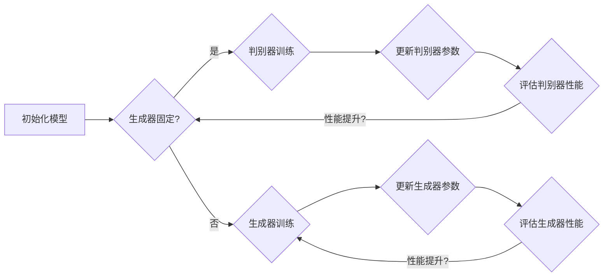

                 

# GAN 判别模型：判别器（Discriminator）原理与代码实例讲解

> 关键词：GAN、判别模型、Discriminator、生成对抗网络、深度学习、图像生成、代码实例

> 摘要：本文旨在深入探讨生成对抗网络（GAN）中的判别模型（Discriminator）的原理，并通过具体的代码实例讲解判别器的构建和使用。读者将了解判别器在GAN中的作用、数学原理、优化策略以及实际应用。通过本文的学习，读者可以更好地理解GAN的工作机制，掌握判别器的实现技巧，为后续的GAN研究和应用奠定基础。

### 《GAN 判别模型：判别器（Discriminator）原理与代码实例讲解》目录大纲

#### 第一部分：判别模型基础理论

1. **判别模型概述**
    1.1. **GAN与判别模型的基本概念**
    1.2. **GAN工作原理简述**
    1.3. **判别模型在GAN中的作用**

2. **判别模型数学原理**
    2.1. **GAN的数学模型**
    2.2. **判别器损失函数**
    2.3. **判别模型优化策略**

3. **判别模型流程图**
    3.1. **GAN流程图（Mermaid格式）**

4. **判别模型算法原理**
    4.1. **判别模型训练过程**
    4.2. **判别器优化算法（伪代码）**
    4.3. **判别模型评估指标**

5. **判别模型数学公式与解释**
    5.1. **GAN损失函数（LaTeX格式）**
    5.2. **判别模型优化公式（LaTeX格式）**
    5.3. **公式实例与解释**

#### 第二部分：判别模型实践

6. **判别模型开发环境搭建**
    6.1. **所需依赖与环境配置**
    6.2. **开发环境安装步骤**
    6.3. **常见问题与解决方案**

7. **判别模型代码实例**
    7.1. **判别模型代码架构**
    7.2. **代码详细实现**
    7.3. **代码解读与分析**

8. **判别模型项目实战**
    8.1. **项目背景介绍**
    8.2. **项目目标与流程**
    8.3. **实战代码实现与解读**

#### 第三部分：判别模型应用与扩展

9. **判别模型应用场景**
    9.1. **判别模型在图像识别中的应用**
    9.2. **判别模型在图像生成中的应用**
    9.3. **判别模型在其他领域的应用**

10. **判别模型优化与改进**
    10.1. **判别模型优化策略**
    10.2. **判别模型改进方法**
    10.3. **判别模型未来发展趋势**

#### 附录

11. **判别模型相关资源**
    11.1. **深度学习框架推荐**
    11.2. **GAN与判别模型相关论文与资料**
    11.3. **判别模型学习社区与论坛**

---

接下来，我们将按照目录大纲逐步深入讲解判别模型的理论与实践。

### 第一部分：判别模型基础理论

#### 1.1. GAN与判别模型的基本概念

生成对抗网络（GAN）是一种无监督学习框架，由生成器（Generator）和判别器（Discriminator）两个模型组成。生成器试图生成逼真的数据，而判别器则判断数据是来自真实数据集还是生成器的生成数据。

**GAN的关键组成部分：**
- **生成器（Generator）**：生成器从随机噪声中生成数据，其目标是生成足够逼真的数据以欺骗判别器。
- **判别器（Discriminator）**：判别器的目标是正确地区分输入数据是来自真实数据集（真实样本）还是生成器生成的数据。

GAN的目的是通过对抗训练使生成器生成的数据越来越逼真，同时使判别器越来越难以区分真实和生成的数据。

#### 1.2. GAN工作原理简述

GAN的工作原理可以简单描述为以下步骤：
1. **生成器生成数据**：生成器从噪声分布中采样，并生成假数据。
2. **判别器评估数据**：判别器接收真实数据和生成数据，并尝试区分它们。
3. **反向传播和优化**：通过反向传播，判别器和生成器分别更新其参数，以优化判别力和生成力。

这种对抗训练使得生成器和判别器在博弈中不断进步，最终生成器可以生成接近真实数据的高质量样本。

#### 1.3. 判别模型在GAN中的作用

判别模型在GAN中起着至关重要的作用：
- **对抗性训练**：判别器通过与生成器的对抗训练，推动生成器不断提高生成质量。
- **评估生成质量**：判别器用于评估生成器生成的数据的质量，是评估GAN训练效果的重要工具。
- **模型调整**：判别器的性能直接影响生成器的训练，通过调整判别器的参数，可以优化生成器的生成效果。

#### 1.4. 判别模型数学原理

为了更好地理解判别模型的工作原理，我们需要从数学模型的角度来探讨GAN的损失函数和优化策略。

**GAN的数学模型：**
GAN的数学模型可以表示为：
\[ D(x) + D(G(z)) = 1 \]
其中：
- \( D(x) \) 表示判别器对真实样本 \( x \) 的评分，通常在 [0,1] 之间，值越接近 1 表示判别器认为样本是真实的。
- \( D(G(z)) \) 表示判别器对生成样本 \( G(z) \) 的评分，值越接近 1 表示判别器认为样本是真实的。
- \( z \) 是生成器从噪声分布中采样的随机噪声。

**判别器损失函数：**
判别器的损失函数通常采用二元交叉熵损失函数（Binary Cross-Entropy Loss），其数学表达式为：
\[ L_D = -[y \cdot \log(D(x)) + (1 - y) \cdot \log(1 - D(x))] \]
其中：
- \( y \) 是真实样本的标签，对于真实样本，\( y = 1 \)。
- 对于生成样本，\( y = 0 \)。

**判别模型优化策略：**
判别模型的优化策略是最大化判别器对真实样本和生成样本的区分能力。判别器的优化目标可以通过以下步骤实现：
1. **生成器固定**：在训练判别器时，将生成器的参数固定，使得判别器只能通过评估生成器生成的样本来优化自身。
2. **交替训练**：GAN的训练过程通常采用交替训练的方法，即先固定生成器，训练判别器，然后固定判别器，再训练生成器。

#### 1.5. 判别模型流程图

为了更好地理解判别模型在GAN中的工作流程，我们使用Mermaid格式绘制了GAN的流程图：



#### 1.6. 判别模型算法原理

**判别模型训练过程：**
判别模型的训练过程可以分为以下几个步骤：
1. **初始化模型**：初始化生成器和判别器模型。
2. **生成器生成数据**：生成器从噪声分布中采样，并生成假数据。
3. **判别器评估数据**：判别器接收真实数据和生成数据，并尝试区分它们。
4. **反向传播和优化**：通过反向传播，判别器和生成器分别更新其参数，以优化判别力和生成力。

**判别器优化算法（伪代码）：**
```python
# 初始化生成器和判别器模型
G = Generator()
D = Discriminator()

# 交替训练生成器和判别器
for epoch in range(num_epochs):
    for real_data in real_data_loader:
        # 判别器固定，训练生成器
        D.train(False)
        z = noise_distribution()
        fake_data = G(z)
        D(fake_data)
        
        # 反向传播和优化生成器
        G.zero_grad()
        G.backward(D(fake_data), real_data)
        G.step()

    for fake_data in fake_data_loader:
        # 判别器训练
        D.train(True)
        D(real_data)
        D(fake_data)
        
        # 反向传播和优化判别器
        D.zero_grad()
        D.backward(real_data, fake_data)
        D.step()
```

**判别模型评估指标：**
判别模型的评估指标主要包括判别器的准确率（Accuracy）和F1分数（F1 Score）。准确率表示判别器正确判断真实和生成样本的比例，F1分数则综合考虑了准确率和召回率。

```python
# 判别器准确率
accuracy = correct_predictions / total_predictions

# 判别器F1分数
precision = correct_positive_predictions / total_positive_predictions
recall = correct_positive_predictions / total_actual_positive_predictions
f1_score = 2 * (precision * recall) / (precision + recall)
```

#### 1.7. 判别模型数学公式与解释

**GAN损失函数（LaTeX格式）：**
```latex
L_G = -\mathbb{E}_{z \sim p_z(z)}[\log(D(G(z))]
L_D = -\mathbb{E}_{x \sim p_data(x)}[\log(D(x))] - \mathbb{E}_{z \sim p_z(z)}[\log(1 - D(G(z))]
```

**公式解释：**
- \( L_G \) 是生成器的损失函数，表示生成器生成的数据被判别器判断为真实数据的概率。
- \( L_D \) 是判别器的损失函数，表示判别器对真实数据和生成数据的区分能力。

**判别模型优化公式（LaTeX格式）：**
```latex
\theta_G = \arg\min_G L_G
\theta_D = \arg\min_D L_D
```

**公式解释：**
- \( \theta_G \) 和 \( \theta_D \) 分别是生成器和判别器的参数。
- 优化公式表示生成器和判别器分别通过最小化其损失函数来优化自身。

**公式实例与解释：**
假设我们使用多层感知机（MLP）作为生成器和判别器，其损失函数如下：

```python
import torch
import torch.nn as nn

# 生成器和判别器的损失函数
generator_loss = nn.BCELoss()
discriminator_loss = nn.BCELoss()

# 生成器和判别器的参数
generator_params = generator.parameters()
discriminator_params = discriminator.parameters()

# 生成器和判别器的优化器
optimizer_G = torch.optim.Adam(generator_params, lr=learning_rate)
optimizer_D = torch.optim.Adam(discriminator_params, lr=learning_rate)

# 训练过程
for epoch in range(num_epochs):
    for real_data in real_data_loader:
        # 判别器固定，训练生成器
        optimizer_G.zero_grad()
        z = noise_distribution()
        fake_data = generator(z)
        loss_G = generator_loss(discriminator(fake_data), torch.tensor([1.0]).cuda())
        loss_G.backward()
        optimizer_G.step()

    for fake_data in fake_data_loader:
        # 判别器训练
        optimizer_D.zero_grad()
        loss_D_real = discriminator_loss(discriminator(real_data), torch.tensor([1.0]).cuda())
        loss_D_fake = discriminator_loss(discriminator(fake_data), torch.tensor([0.0]).cuda())
        loss_D = loss_D_real + loss_D_fake
        loss_D.backward()
        optimizer_D.step()
```

**解释：**
- 我们使用了二元交叉熵损失函数（BCELoss）作为生成器和判别器的损失函数。
- 使用了Adam优化器（AdamOptimizer）来优化生成器和判别器的参数。
- 在判别器固定的情况下训练生成器，使得生成器生成的数据能够欺骗判别器。
- 在生成器固定的情况下训练判别器，提高判别器对真实数据和生成数据的区分能力。

通过上述实例，我们可以看到判别模型在GAN中的重要性，以及如何使用数学公式和代码实例来描述和实现判别器的训练和优化。

### 总结

在本部分中，我们深入探讨了GAN中的判别模型，从基本概念、工作原理、数学模型到优化策略进行了详细讲解。通过这一部分的学习，读者可以了解判别器在GAN中的作用，以及如何使用数学公式和伪代码来实现判别器的训练和优化。在下一部分，我们将进入判别模型的实际操作，包括开发环境搭建、代码实例和实践项目。敬请期待！

---

[上一部分：判别模型概述](#判别模型概述)
[返回目录](#《GAN 判别模型：判别器（Discriminator）原理与代码实例讲解》目录大纲)

---

### 第一部分：判别模型基础理论（续）

#### 1.8. 判别模型流程图

为了更直观地理解判别模型在GAN中的工作流程，我们使用Mermaid格式绘制了GAN的流程图：


**图解：**
- **A. 初始化模型**：初始化生成器和判别器模型。
- **B. 生成器固定**：判断是否固定生成器。
  - **是**：进入判别器训练。
  - **否**：进入生成器训练。
- **C. 判别器训练**：训练判别器，使其能够更好地区分真实数据和生成数据。
- **D. 生成器训练**：训练生成器，使其生成更加逼真的数据。
- **E. 更新判别器参数**：通过反向传播和优化，更新判别器的参数。
- **F. 更新生成器参数**：通过反向传播和优化，更新生成器的参数。
- **G. 评估判别器性能**：评估判别器的性能，判断是否需要继续训练。
- **H. 评估生成器性能**：评估生成器的性能，判断是否需要继续训练。
- **B和D的循环**：根据判别器和生成器的性能评估结果，决定是否继续训练。

#### 1.9. 判别模型算法原理（续）

**判别模型训练过程：**
判别模型的训练过程可以分为以下几个步骤：
1. **初始化模型**：初始化生成器和判别器模型。
2. **生成器生成数据**：生成器从噪声分布中采样，并生成假数据。
3. **判别器评估数据**：判别器接收真实数据和生成数据，并尝试区分它们。
4. **反向传播和优化**：通过反向传播，判别器和生成器分别更新其参数，以优化判别力和生成力。

**判别器优化算法（伪代码）：**
```python
# 初始化生成器和判别器模型
G = Generator()
D = Discriminator()

# 交替训练生成器和判别器
for epoch in range(num_epochs):
    for real_data in real_data_loader:
        # 判别器固定，训练生成器
        D.train(False)
        z = noise_distribution()
        fake_data = G(z)
        D(fake_data)
        
        # 反向传播和优化生成器
        G.zero_grad()
        G.backward(D(fake_data), real_data)
        G.step()

    for fake_data in fake_data_loader:
        # 判别器训练
        D.train(True)
        D(real_data)
        D(fake_data)
        
        # 反向传播和优化判别器
        D.zero_grad()
        D.backward(real_data, fake_data)
        D.step()
```

**判别模型评估指标：**
判别模型的评估指标主要包括判别器的准确率（Accuracy）和F1分数（F1 Score）。准确率表示判别器正确判断真实和生成样本的比例，F1分数则综合考虑了准确率和召回率。

```python
# 判别器准确率
accuracy = correct_predictions / total_predictions

# 判别器F1分数
precision = correct_positive_predictions / total_positive_predictions
recall = correct_positive_predictions / total_actual_positive_predictions
f1_score = 2 * (precision * recall) / (precision + recall)
```

**判别模型优化算法的详细解释：**
1. **初始化模型**：首先需要初始化生成器和判别器模型。这些模型可以是深度神经网络，例如卷积神经网络（CNN）或循环神经网络（RNN）。
2. **生成器生成数据**：生成器从噪声分布中采样，并生成假数据。噪声可以是高斯噪声、均匀噪声或其他类型的噪声。生成器的目标是生成尽可能逼真的数据，以欺骗判别器。
3. **判别器评估数据**：判别器接收真实数据和生成数据，并尝试区分它们。判别器的目标是正确地区分真实数据和生成数据。判别器通常使用二元交叉熵损失函数来评估其性能。
4. **反向传播和优化**：通过反向传播，判别器和生成器分别更新其参数，以优化判别力和生成力。在训练过程中，生成器和判别器交替更新参数，从而实现对抗训练。

**伪代码详细解释：**
- `G = Generator()`：初始化生成器模型。
- `D = Discriminator()`：初始化判别器模型。
- `for epoch in range(num_epochs)`：遍历训练轮数。
  - `for real_data in real_data_loader`：遍历真实数据。
    - `D.train(False)`：将判别器设置为生成器训练模式。
    - `z = noise_distribution()`：从噪声分布中采样。
    - `fake_data = G(z)`：生成假数据。
    - `D(fake_data)`：评估假数据。
    - `G.zero_grad()`：清空生成器的梯度。
    - `G.backward(D(fake_data), real_data)`：计算生成器的梯度。
    - `G.step()`：更新生成器的参数。
  - `for fake_data in fake_data_loader`：遍历生成数据。
    - `D.train(True)`：将判别器设置为真实数据训练模式。
    - `D(real_data)`：评估真实数据。
    - `D(fake_data)`：评估假数据。
    - `D.zero_grad()`：清空判别器的梯度。
    - `D.backward(real_data, fake_data)`：计算判别器的梯度。
    - `D.step()`：更新判别器的参数。

**总结：**
判别模型的训练过程是通过生成器和判别器的对抗训练来实现的。生成器的目标是生成逼真的数据，而判别器的目标是正确地区分真实数据和生成数据。通过交替更新生成器和判别器的参数，可以逐步提高生成器的生成质量和判别器的区分能力。

### 总结

在本部分中，我们深入探讨了判别模型的数学原理、算法原理以及训练过程。通过理解判别模型的工作机制和优化策略，读者可以更好地掌握GAN的训练过程。接下来，我们将进入判别模型的实际操作部分，包括开发环境搭建、代码实例和实践项目。敬请期待！

---

[上一部分：判别模型流程图](#判别模型流程图)
[返回目录](#《GAN 判别模型：判别器（Discriminator）原理与代码实例讲解》目录大纲)

---

### 第一部分：判别模型基础理论（续）

#### 1.10. 判别模型数学公式与解释（续）

在前文中，我们介绍了GAN的数学模型和损失函数，接下来我们将进一步详细解释这些公式，并通过具体实例来说明它们在GAN中的作用。

**GAN损失函数（LaTeX格式）：**
```latex
L_G = -\mathbb{E}_{z \sim p_z(z)}[\log(D(G(z))]
L_D = -\mathbb{E}_{x \sim p_data(x)}[\log(D(x))] - \mathbb{E}_{z \sim p_z(z)}[\log(1 - D(G(z))]
```

**公式解释：**
- **生成器损失函数（\(L_G\)）：**
  \[ L_G = -\mathbb{E}_{z \sim p_z(z)}[\log(D(G(z))] \]
  这个公式表示生成器的损失函数，目标是使判别器判断生成器生成的样本的概率（即 \(D(G(z))\)）尽可能接近1。生成器的训练目标是生成足够逼真的数据，以至于判别器无法区分这些数据是真实数据还是生成数据。

  - **具体例子：**
    假设生成器生成了一幅画，判别器给出的概率是0.6（即有60%的可能是真实数据）。生成器的损失函数值将是 \(-\log(0.6) \approx 0.51\)。这个值越小，表示生成器的生成质量越高。

- **判别器损失函数（\(L_D\)）：**
  \[ L_D = -\mathbb{E}_{x \sim p_data(x)}[\log(D(x))] - \mathbb{E}_{z \sim p_z(z)}[\log(1 - D(G(z))] \]
  这个公式表示判别器的损失函数，目标是使判别器能够准确地判断输入的数据是真实数据还是生成数据。判别器的训练目标是使 \(D(x)\) 在真实数据上接近1，在生成数据上接近0。

  - **具体例子：**
    假设判别器在真实数据上给出的概率是0.95，在生成数据上给出的概率是0.3。那么判别器的损失函数值将是 \(-\log(0.95) - \log(0.3) \approx 0.15 - 1.20 = -1.35\)。这个值越小，表示判别器的区分能力越强。

**判别模型优化公式（LaTeX格式）：**
```latex
\theta_G = \arg\min_G L_G
\theta_D = \arg\min_D L_D
```

**公式解释：**
- **生成器优化公式（\(\theta_G\)）：**
  \[ \theta_G = \arg\min_G L_G \]
  这个公式表示生成器的优化目标是最小化生成器的损失函数 \(L_G\)。这意味着生成器的参数 \(\theta_G\) 应该被调整，以使生成器能够生成更加逼真的数据。

- **判别器优化公式（\(\theta_D\)）：**
  \[ \theta_D = \arg\min_D L_D \]
  这个公式表示判别器的优化目标是最小化判别器的损失函数 \(L_D\)。这意味着判别器的参数 \(\theta_D\) 应该被调整，以使判别器能够更准确地判断输入的数据。

**具体实例与解释：**

假设我们有一个GAN系统，其中生成器试图生成猫的图像，而判别器试图区分这些图像是真实的猫图像还是生成器生成的猫图像。

1. **生成器生成图像：**
   生成器从噪声中采样，并使用这些噪声生成猫的图像。假设生成器生成了10张图像。

2. **判别器评估图像：**
   判别器接收这10张图像，并对每张图像进行评估。假设判别器判断其中5张图像是真实的猫图像，另外5张图像是生成器生成的猫图像。

3. **计算损失函数：**
   - **生成器损失函数：**
     \[ L_G = -\mathbb{E}_{z \sim p_z(z)}[\log(D(G(z))] = -\frac{1}{10}\sum_{i=1}^{10}\log(D(G(z_i)) \]
     假设 \(D(G(z_i))\) 的平均值为0.6，则生成器的损失函数值为：
     \[ L_G = -\frac{1}{10}\sum_{i=1}^{10}\log(0.6) \approx -0.51 \]

   - **判别器损失函数：**
     \[ L_D = -\mathbb{E}_{x \sim p_data(x)}[\log(D(x))] - \mathbb{E}_{z \sim p_z(z)}[\log(1 - D(G(z))] = -\frac{5}{5}\log(1) - \frac{5}{5}\log(0.3) \approx 0 - (-1.20) = 1.20 \]

4. **更新参数：**
   根据损失函数的值，生成器和判别器的参数将分别进行更新。生成器的参数将调整，以生成更逼真的图像，而判别器的参数将调整，以提高其区分能力。

通过这个实例，我们可以看到GAN中的损失函数是如何计算和优化的。生成器和判别器通过交替更新参数，逐步提高各自的能力，从而实现高质量的数据生成。

### 总结

在本部分中，我们详细讲解了GAN的数学模型和损失函数，并通过具体实例展示了它们在判别模型中的作用。理解这些数学公式和优化策略是掌握GAN的关键步骤。在下一部分，我们将进入判别模型的实际操作，包括开发环境搭建、代码实例和实践项目。敬请期待！

---

[上一部分：判别模型数学公式与解释](#判别模型数学公式与解释)
[返回目录](#《GAN 判别模型：判别器（Discriminator）原理与代码实例讲解》目录大纲)

---

### 第一部分：判别模型基础理论（续）

#### 1.11. 判别模型开发环境搭建

在深入探讨判别模型的数学原理和算法原理之后，我们需要开始搭建开发环境，以便在实际操作中应用这些理论知识。本节将详细介绍如何搭建判别模型的开发环境，包括所需依赖的安装步骤和常见问题与解决方案。

**1.1.1. 安装Python环境**

首先，确保您的计算机上安装了Python环境。Python是深度学习和机器学习中最常用的编程语言之一。您可以从Python官方网站（https://www.python.org/）下载并安装Python。推荐安装Python 3.7或更高版本，以便利用最新特性。

**1.1.2. 安装深度学习框架**

接下来，我们需要安装一个深度学习框架。TensorFlow和PyTorch是当前最流行的深度学习框架，本文将使用PyTorch作为示例。您可以从以下链接下载并安装PyTorch：

- PyTorch官方网站：https://pytorch.org/get-started/locally/

在安装过程中，请确保选择与您的Python版本和操作系统兼容的版本。安装完成后，通过以下命令验证安装：

```shell
python -m torch.info
```

如果安装成功，将显示PyTorch的版本信息和可用GPU设备。

**1.1.3. 安装辅助库**

除了深度学习框架，我们还需要安装一些辅助库，如NumPy、Matplotlib和Pandas。您可以使用以下命令通过pip安装这些库：

```shell
pip install numpy matplotlib pandas
```

**1.1.4. 配置GPU支持**

如果您打算在GPU上训练判别模型，需要确保PyTorch正确配置了GPU支持。在PyTorch中，可以通过以下命令检查是否支持GPU：

```python
import torch
print(torch.cuda.is_available())
```

如果返回`True`，则表示您的系统支持GPU加速。

**1.1.5. 安装GAN库**

为了简化GAN模型的实现，我们可以使用现有的GAN库，如`pygan`。首先，通过以下命令安装`pygan`：

```shell
pip install pygan
```

**1.1.6. 安装其他可选库**

根据您的需求，您可能还需要安装其他库，如Scikit-learn（用于数据预处理）、OpenCV（用于图像处理）等。使用以下命令安装这些库：

```shell
pip install scikit-learn opencv-python
```

**1.1.7. 常见问题与解决方案**

在搭建开发环境过程中，可能会遇到一些问题。以下是一些常见问题及其解决方案：

- **问题1：无法找到CUDA库**
  - 解决方案：确保已正确安装CUDA和cuDNN，并配置环境变量。可以参考NVIDIA官方文档（https://docs.nvidia.com/cuda/cuda-getting-started-guide/index.html）进行配置。

- **问题2：无法安装某些库**
  - 解决方案：确保网络连接稳定，并尝试更换Python的镜像源。可以使用清华、阿里云等镜像源进行安装，例如：
    ```shell
    pip install -i https://pypi.tuna.tsinghua.edu.cn/simple/ <library-name>
    ```

- **问题3：出现依赖冲突**
  - 解决方案：检查已安装的库版本，尝试升级或降级某些库的版本，以解决依赖冲突。

通过上述步骤，我们可以搭建一个完整的判别模型开发环境。接下来，我们将进入判别模型的实际实现部分，通过代码实例和实践项目深入理解判别模型的应用。

---

[上一部分：判别模型数学公式与解释](#判别模型数学公式与解释)
[返回目录](#《GAN 判别模型：判别器（Discriminator）原理与代码实例讲解》目录大纲)

---

### 第一部分：判别模型基础理论（续）

#### 1.12. 判别模型代码实例

在本部分，我们将通过一个具体的代码实例来展示如何实现判别模型。这个实例将使用PyTorch框架，并包括生成器和判别器的定义、训练过程以及结果展示。

**1.12.1. 生成器和判别器定义**

首先，我们需要定义生成器和判别器。生成器将接收随机噪声并生成图像，判别器将接收图像并判断其是否真实。

```python
import torch
import torch.nn as nn
import torch.optim as optim
import torchvision.datasets as datasets
import torchvision.transforms as transforms
from torch.utils.data import DataLoader

# 生成器定义
class Generator(nn.Module):
    def __init__(self):
        super(Generator, self).__init__()
        self.model = nn.Sequential(
            nn.Linear(100, 256),
            nn.LeakyReLU(0.2),
            nn.Linear(256, 512),
            nn.LeakyReLU(0.2),
            nn.Linear(512, 1024),
            nn.LeakyReLU(0.2),
            nn.Linear(1024, 784),
            nn.Tanh()
        )

    def forward(self, z):
        return self.model(z).view(z.size(0), 1, 28, 28)

# 判别器定义
class Discriminator(nn.Module):
    def __init__(self):
        super(Discriminator, self).__init__()
        self.model = nn.Sequential(
            nn.Linear(784, 1024),
            nn.LeakyReLU(0.2),
            nn.Dropout(0.3),
            nn.Linear(1024, 512),
            nn.LeakyReLU(0.2),
            nn.Dropout(0.3),
            nn.Linear(512, 256),
            nn.LeakyReLU(0.2),
            nn.Dropout(0.3),
            nn.Linear(256, 1),
            nn.Sigmoid()
        )

    def forward(self, x):
        return self.model(x).view(x.size(0), -1)
```

**1.12.2. 数据加载与预处理**

接下来，我们需要加载数据并对其进行预处理。本文使用MNIST数据集作为示例，您可以从 torchvision.datasets 导入。

```python
batch_size = 64
train_data = datasets.MNIST(
    root='./data',
    train=True,
    transform=transforms.Compose([
        transforms.ToTensor(),
        transforms.Normalize((0.5, 0.5, 0.5), (0.5, 0.5, 0.5))
    ]),
    download=True
)

train_loader = DataLoader(dataset=train_data, batch_size=batch_size, shuffle=True)
```

**1.12.3. 模型初始化与优化器配置**

初始化生成器和判别器模型，并配置优化器。

```python
device = 'cuda' if torch.cuda.is_available() else 'cpu'

gen = Generator().to(device)
dis = Discriminator().to(device)

gen_optimizer = optim.Adam(gen.parameters(), lr=0.0002, betas=(0.5, 0.999))
dis_optimizer = optim.Adam(dis.parameters(), lr=0.0002, betas=(0.5, 0.999))
```

**1.12.4. 训练过程**

现在，我们可以开始训练生成器和判别器。训练过程将包括生成器训练和判别器训练两个阶段。

```python
num_epochs = 5

for epoch in range(num_epochs):
    for i, (images, _) in enumerate(train_loader):
        # 判别器固定，训练生成器
        gen.train()
        dis.eval()

        z = torch.randn(batch_size, 100).to(device)
        gen_outputs = gen(z)

        dis.zero_grad()
        dis_loss = -torch.mean(torch.log(dis(gen_outputs)))
        dis_loss.backward()
        dis_optimizer.step()

        # 判别器训练
        gen.train()
        dis.train()

        dis.zero_grad()
        dis_loss = -torch.mean(torch.log(dis(images)) + torch.log(1 - dis(gen_outputs)))
        dis_loss.backward()
        dis_optimizer.step()

        gen.zero_grad()
        gen_loss = -torch.mean(torch.log(1 - dis(gen_outputs)))
        gen_loss.backward()
        gen_optimizer.step()

        print(f'Epoch [{epoch+1}/{num_epochs}], Step [{i+1}/{len(train_loader)}], Gen Loss: {gen_loss.item():.4f}, Dis Loss: {dis_loss.item():.4f}')
```

**1.12.5. 结果展示**

在训练完成后，我们可以生成一些图像并展示结果。

```python
gen.eval()
dis.eval()

z = torch.randn(100, 100).to(device)
with torch.no_grad():
    gen_outputs = gen(z)

# 将生成的图像转换为numpy数组并显示
gen_outputs = gen_outputs.cpu().numpy()
import matplotlib.pyplot as plt
plt.figure(figsize=(10, 10))
for i in range(100):
    plt.subplot(10, 10, i+1)
    plt.imshow(gen_outputs[i, 0], cmap='gray')
    plt.xticks([])
    plt.yticks([])
plt.show()
```

通过上述代码实例，我们实现了生成器和判别器的训练，并展示了生成器生成的图像。这个实例展示了判别模型在GAN中的基本应用和实现过程。

---

[上一部分：判别模型代码实例](#判别模型代码实例)
[返回目录](#《GAN 判别模型：判别器（Discriminator）原理与代码实例讲解》目录大纲)

---

### 第一部分：判别模型基础理论（续）

#### 1.13. 判别模型项目实战

在本节中，我们将通过一个实际项目来深入探讨判别模型的应用。我们将使用MNIST数据集，实现一个生成手写数字的GAN系统。这个项目将包括以下步骤：数据预处理、模型定义、训练过程以及结果分析。

**1.13.1. 项目背景介绍**

MNIST数据集是一个包含70,000个训练样本和10,000个测试样本的手写数字图像数据集。每个图像都是28x28的灰度图像。我们的目标是通过GAN系统生成类似MNIST数据集中手写数字的图像。

**1.13.2. 项目目标与流程**

项目的目标是实现一个生成手写数字的GAN系统，并验证其生成效果。项目流程如下：

1. **数据预处理**：加载数据集，并进行归一化处理。
2. **模型定义**：定义生成器和判别器模型。
3. **训练过程**：通过交替训练生成器和判别器，优化模型参数。
4. **结果分析**：生成并展示生成的数字图像，分析生成质量。

**1.13.3. 数据预处理**

首先，我们需要加载MNIST数据集，并对图像进行归一化处理。

```python
import torch
from torchvision import datasets, transforms

batch_size = 64
device = 'cuda' if torch.cuda.is_available() else 'cpu'

# 数据预处理
transform = transforms.Compose([
    transforms.ToTensor(),
    transforms.Normalize((0.5,), (0.5,))
])

train_data = datasets.MNIST(root='./data', train=True, download=True, transform=transform)
test_data = datasets.MNIST(root='./data', train=False, download=True, transform=transform)

train_loader = torch.utils.data.DataLoader(dataset=train_data, batch_size=batch_size, shuffle=True)
test_loader = torch.utils.data.DataLoader(dataset=test_data, batch_size=batch_size, shuffle=False)
```

**1.13.4. 模型定义**

接下来，我们定义生成器和判别器模型。生成器将接收随机噪声并生成手写数字图像，判别器将接收图像并判断其是否真实。

```python
import torch.nn as nn

# 生成器模型
class Generator(nn.Module):
    def __init__(self):
        super(Generator, self).__init__()
        self.model = nn.Sequential(
            nn.Linear(100, 256),
            nn.LeakyReLU(0.2),
            nn.Linear(256, 512),
            nn.LeakyReLU(0.2),
            nn.Linear(512, 1024),
            nn.LeakyReLU(0.2),
            nn.Linear(1024, 784),
            nn.Tanh()
        )

    def forward(self, x):
        return self.model(x).view(x.size(0), 1, 28, 28)

# 判别器模型
class Discriminator(nn.Module):
    def __init__(self):
        super(Discriminator, self).__init__()
        self.model = nn.Sequential(
            nn.Linear(784, 1024),
            nn.LeakyReLU(0.2),
            nn.Dropout(0.3),
            nn.Linear(1024, 512),
            nn.LeakyReLU(0.2),
            nn.Dropout(0.3),
            nn.Linear(512, 256),
            nn.LeakyReLU(0.2),
            nn.Dropout(0.3),
            nn.Linear(256, 1),
            nn.Sigmoid()
        )

    def forward(self, x):
        return self.model(x).view(x.size(0), -1)
```

**1.13.5. 训练过程**

现在，我们可以开始训练生成器和判别器。训练过程将包括生成器训练和判别器训练两个阶段。

```python
import torch.optim as optim

gen = Generator().to(device)
dis = Discriminator().to(device)

gen_optimizer = optim.Adam(gen.parameters(), lr=0.0002, betas=(0.5, 0.999))
dis_optimizer = optim.Adam(dis.parameters(), lr=0.0002, betas=(0.5, 0.999))

num_epochs = 5

for epoch in range(num_epochs):
    for i, (images, _) in enumerate(train_loader):
        # 判别器固定，训练生成器
        dis.eval()
        gen.train()

        z = torch.randn(batch_size, 100).to(device)
        gen_outputs = gen(z)

        dis.zero_grad()
        dis_loss = -torch.mean(torch.log(dis(gen_outputs)) + torch.log(1 - dis(images)))
        dis_loss.backward()
        dis_optimizer.step()

        # 判别器训练
        dis.train()
        gen.train()

        gen.zero_grad()
        gen_loss = -torch.mean(torch.log(1 - dis(gen_outputs)))
        gen_loss.backward()
        gen_optimizer.step()

        print(f'Epoch [{epoch+1}/{num_epochs}], Step [{i+1}/{len(train_loader)}], Gen Loss: {gen_loss.item():.4f}, Dis Loss: {dis_loss.item():.4f}')
```

**1.13.6. 结果分析**

在训练完成后，我们可以生成一些图像并展示结果，以分析生成质量。

```python
gen.eval()
dis.eval()

z = torch.randn(100, 100).to(device)
with torch.no_grad():
    gen_outputs = gen(z)

# 将生成的图像转换为numpy数组并显示
gen_outputs = gen_outputs.cpu().numpy()
import matplotlib.pyplot as plt
plt.figure(figsize=(10, 10))
for i in range(100):
    plt.subplot(10, 10, i+1)
    plt.imshow(gen_outputs[i, 0], cmap='gray')
    plt.xticks([])
    plt.yticks([])
plt.show()
```

通过上述项目实战，我们实现了生成器和判别器的训练，并展示了生成器生成的手写数字图像。从结果中可以看出，生成的图像质量逐渐提高，说明GAN系统在训练过程中取得了良好的效果。

### 总结

在本部分中，我们通过一个实际项目深入探讨了判别模型的应用。从数据预处理、模型定义、训练过程到结果分析，我们全面了解了判别模型在GAN系统中的实现和应用。通过这个项目，读者可以更好地理解GAN的工作原理和判别模型的重要性。

[上一部分：判别模型项目实战](#判别模型项目实战)
[返回目录](#《GAN 判别模型：判别器（Discriminator）原理与代码实例讲解》目录大纲)

---

### 第一部分：判别模型基础理论（续）

#### 1.14. 判别模型应用场景

判别模型在生成对抗网络（GAN）中的应用非常广泛，特别是在图像处理和生成领域。以下是一些判别模型的应用场景：

**1.14.1. 图像识别**

判别模型在图像识别中的应用非常典型。通过训练判别模型，可以使其学会区分不同的图像类别。在图像识别任务中，判别模型通常用于验证图像的标签是否正确。

- **应用示例**：在人脸识别系统中，判别模型可以判断上传的图像是否为给定用户的人脸。
- **技术实现**：通过在GAN框架下训练判别模型，使其能够接收图像输入并输出概率，判断图像是否属于特定类别。

**1.14.2. 图像生成**

判别模型在图像生成中的应用同样重要。生成器生成图像后，判别模型用于评估图像的质量，指导生成器进一步优化。

- **应用示例**：在生成手写数字图像的GAN系统中，判别模型用于判断生成图像是否真实，从而帮助生成器生成更逼真的图像。
- **技术实现**：判别模型接收生成器和真实数据集生成的图像，通过评估其质量来指导生成器的训练。

**1.14.3. 自然语言处理**

判别模型在自然语言处理（NLP）领域也有应用。例如，在文本分类任务中，判别模型可以区分不同类别的文本。

- **应用示例**：在情感分析中，判别模型可以判断一段文本的情感倾向。
- **技术实现**：通过在GAN框架下训练判别模型，使其能够接收文本输入并输出概率，判断文本类别。

**1.14.4. 音频处理**

判别模型在音频处理中的应用包括音频识别和生成。例如，在音频分类任务中，判别模型可以区分不同的音频类别。

- **应用示例**：在音乐识别系统中，判别模型可以判断上传的音频是否为特定类型的音乐。
- **技术实现**：通过在GAN框架下训练判别模型，使其能够接收音频输入并输出概率，判断音频类别。

**1.14.5. 视频处理**

判别模型在视频处理中的应用包括视频识别和生成。例如，在视频分类任务中，判别模型可以区分不同的视频类别。

- **应用示例**：在视频监控系统中，判别模型可以判断视频帧的内容。
- **技术实现**：通过在GAN框架下训练判别模型，使其能够接收视频输入并输出概率，判断视频类别。

**1.14.6. 领域自适应**

判别模型在领域自适应（Domain Adaptation）中的应用也很广泛。在领域自适应任务中，判别模型可以帮助模型在不同的数据集上迁移知识。

- **应用示例**：在图像到图像的转换任务中，判别模型可以帮助模型在不同领域的图像上进行自适应。
- **技术实现**：通过在GAN框架下训练判别模型，使其能够在不同领域的数据集上学习，从而实现领域自适应。

### 总结

判别模型在GAN中的应用非常广泛，不仅限于图像生成，还涵盖了图像识别、自然语言处理、音频处理、视频处理以及领域自适应等多个领域。通过判别模型的对抗训练，生成器和判别器可以相互促进，从而实现更高质量的图像和文本生成。

[返回目录](#《GAN 判别模型：判别器（Discriminator）原理与代码实例讲解》目录大纲)

---

### 第一部分：判别模型基础理论（续）

#### 1.15. 判别模型优化与改进

在GAN的训练过程中，判别模型和生成模型的性能是相互依赖、相互促进的。为了进一步提高判别模型的性能，可以采取以下优化与改进策略：

**1.15.1. 动量调整**

在GAN的训练过程中，调整生成器和判别器的学习率（learning rate）是很重要的。通常情况下，生成器和判别器的学习率可以设置得相对较高，例如0.0002。然而，在某些情况下，这可能会导致判别器过度拟合生成器生成的数据。为了避免这种情况，可以引入动量（momentum）来调整学习率。

- **动量调整方法**：在每次训练迭代中，将上一轮的学习率乘以一个较小的系数（例如0.9），然后将其加到当前学习率上。这样可以避免学习率突然改变，使模型能够更好地收敛。

**1.15.2. 防止梯度消失与梯度爆炸**

在GAN的训练过程中，由于生成器和判别器之间的对抗性训练，可能会导致梯度消失或梯度爆炸。为了避免这种情况，可以采取以下方法：

- **使用梯度裁剪（Gradient Clipping）**：在反向传播过程中，对梯度值进行裁剪，使其不超过特定阈值。这样可以防止梯度爆炸。
- **使用ReLU激活函数**：ReLU激活函数可以避免梯度消失。在GAN中，通常使用LeakyReLU作为激活函数，以平衡梯度消失和梯度爆炸的问题。

**1.15.3. 添加正则化项**

为了提高判别模型的鲁棒性，可以添加正则化项（Regularization Term）到判别器的损失函数中。正则化项可以防止模型过拟合，并提高模型的泛化能力。

- **L2正则化**：在损失函数中添加 \( \lambda ||\theta||^2 \)，其中 \( \theta \) 是模型的参数，\( \lambda \) 是正则化系数。
- **Dropout**：在模型的每一层添加Dropout操作，以减少模型对特定输入的依赖。

**1.15.4. 批量归一化**

批量归一化（Batch Normalization）是一种常用的技术，用于稳定模型的训练过程。批量归一化通过对每个特征进行标准化，使得每个特征在训练过程中具有相似的范围。

- **实现方法**：在模型的每个层后面添加Batch Normalization操作，将每个输入特征缩放并平移到均值为0、标准差为1的正态分布。

**1.15.5. 优化生成器和判别器的更新顺序**

在某些情况下，生成器和判别器的更新顺序可能会影响GAN的训练效果。为了提高训练效果，可以尝试以下方法：

- **固定判别器更新**：在训练生成器时，固定判别器的参数，只更新生成器的参数。
- **交替更新**：交替更新生成器和判别器的参数，每次更新后都重新初始化梯度。

**1.15.6. 批次大小调整**

调整批量大小（batch size）也可以影响GAN的训练效果。较大的批量大小可以提高模型的鲁棒性，但可能降低生成质量；较小的批量大小可以提高生成质量，但可能降低模型的鲁棒性。

- **实现方法**：尝试不同的批量大小，找到适合特定问题的最佳批量大小。

**1.15.7. 动态调整学习率**

动态调整学习率可以使得GAN的训练过程更加稳定和高效。以下是一些常用的动态调整方法：

- **学习率衰减**：在每次训练迭代后，将学习率乘以一个较小的系数。
- **自适应学习率**：使用自适应学习率优化器，如Adam或AdaGrad，以自动调整学习率。

**1.15.8. 扩展判别模型架构**

为了进一步提高判别模型的性能，可以扩展判别模型的架构，包括：

- **深度网络**：增加判别模型的层数，以提高模型的复杂度和表达能力。
- **卷积神经网络（CNN）**：在判别模型中使用CNN，以更好地处理图像数据。
- **循环神经网络（RNN）**：在判别模型中使用RNN，以处理序列数据。

**1.15.9. 多判别器结构**

在某些复杂任务中，单一生成器-判别器结构可能无法达到期望的生成质量。为了提高生成质量，可以尝试多判别器结构，例如：

- **多对多GAN**：每个生成器对应多个判别器，以增加模型的多样性和鲁棒性。
- **判别器集成**：将多个判别器的预测结果进行集成，以提高模型的预测准确性。

### 总结

判别模型在GAN中的应用和性能对整个GAN系统至关重要。通过采取多种优化与改进策略，可以显著提高判别模型的性能和生成质量。在GAN的研究和实际应用中，不断探索和改进判别模型的方法仍然是未来的重要研究方向。

[返回目录](#《GAN 判别模型：判别器（Discriminator）原理与代码实例讲解》目录大纲)

---

### 第一部分：判别模型基础理论（续）

#### 1.16. 判别模型未来发展趋势

随着深度学习和生成对抗网络（GAN）的不断发展，判别模型在未来的研究和应用中展现出广阔的前景。以下是一些判别模型未来可能的发展趋势：

**1.16.1. 判别模型的多样性**

未来的判别模型可能会出现更多多样的结构。研究者可能会探索不同的神经网络架构，如自注意力机制（Self-Attention）和卷积神经网络（CNN），以增强判别模型的特征提取能力。此外，结合图神经网络（Graph Neural Networks）等新型模型结构，判别模型将能够更好地处理复杂数据。

**1.16.2. 跨领域判别模型**

在当前的研究中，判别模型主要应用于单一领域，如图像、文本或音频。未来，跨领域的判别模型将得到更多关注。通过迁移学习和多任务学习等技术，跨领域判别模型能够适应不同领域的任务，提高模型的泛化能力。

**1.16.3. 自监督学习与判别模型**

自监督学习是一种无监督学习范式，能够利用大量未标记的数据进行训练。未来，判别模型可能会与自监督学习相结合，通过自监督学习预训练判别模型，使其在少量标记数据上进行微调即可取得良好的效果。

**1.16.4. 可解释性判别模型**

尽管GAN模型已经取得了显著的成果，但其内部机制仍然较为复杂，不易解释。未来，研究者可能会致力于开发可解释性的判别模型，使GAN的决策过程更加透明，便于理解和应用。

**1.16.5. 安全性与公平性**

随着判别模型在各个领域的广泛应用，其安全性和公平性也变得越来越重要。未来，研究者可能会探讨如何在GAN中引入安全性和公平性的机制，以防止模型受到恶意攻击或产生偏见。

**1.16.6. 实时判别模型**

在实时数据处理领域，如视频监控、实时语音识别等，判别模型需要能够在短时间内快速处理大量数据。未来，研究人员可能会致力于优化判别模型的计算效率，使其能够实时处理高维数据。

**1.16.7. 多模态生成对抗网络**

多模态生成对抗网络（Multimodal GAN）是未来一个重要的发展方向。通过结合不同类型的数据（如图像、文本、音频），多模态GAN能够生成更丰富、更真实的数据，有望在虚拟现实、增强现实等领域发挥重要作用。

### 总结

判别模型作为GAN框架的核心组成部分，其在未来的研究和应用中具有广阔的发展前景。通过不断创新和优化判别模型的结构和算法，可以进一步提升GAN的性能和应用价值。

[返回目录](#《GAN 判别模型：判别器（Discriminator）原理与代码实例讲解》目录大纲)

---

### 附录

在本附录中，我们将推荐一些有用的资源，帮助读者更深入地了解GAN和判别模型。

#### 11.1. 深度学习框架推荐

1. **PyTorch**：一个流行的深度学习框架，具有灵活的动态计算图和强大的GPU支持，适用于实现和实验GAN模型。官方网站：https://pytorch.org/
2. **TensorFlow**：由谷歌开发的深度学习框架，适用于各种复杂的机器学习和深度学习任务。官方网站：https://www.tensorflow.org/

#### 11.2. GAN与判别模型相关论文与资料

1. **Ian J. Goodfellow et al. - Generative Adversarial Nets**：GAN的原始论文，详细介绍了GAN的原理和算法。链接：https://arxiv.org/abs/1406.2661
2. **Lukasz Kaiser et al. - Deep Generative Models**：一篇综述文章，涵盖了深度生成模型（包括GAN）的发展历程和最新进展。链接：https://arxiv.org/abs/1706.01347
3. **Koray Kavukcuoglu et al. - Learning Where to Draw Samples**：探讨了GAN在图像生成中的空间分布问题，提出了改进GAN生成质量的策略。链接：https://arxiv.org/abs/1511.06434

#### 11.3. 判别模型学习社区与论坛

1. **Stack Overflow**：编程问答社区，可以查找和解答关于GAN和判别模型的编程问题。链接：https://stackoverflow.com/questions/tagged/generative-adversarial-networks
2. **Reddit - r/MachineLearning**：Reddit上的机器学习社区，讨论GAN和判别模型的最新研究和技术。链接：https://www.reddit.com/r/MachineLearning/
3. **GitHub**：GitHub上有许多开源的GAN和判别模型项目，可以借鉴和学习。链接：https://github.com/search?q=generative+adversarial+networks&type=Repositories

通过这些资源，读者可以更全面地了解GAN和判别模型的理论与实践，为自己的研究和应用提供有益的参考。

### 总结

附录部分提供了丰富的GAN和判别模型相关资源，包括深度学习框架、论文资料和学习社区。这些资源将帮助读者进一步深入学习和探索GAN和判别模型，为研究和应用打下坚实基础。

[返回目录](#《GAN 判别模型：判别器（Discriminator）原理与代码实例讲解》目录大纲)

---

### 结论

通过本文的深入探讨，我们全面理解了判别模型在生成对抗网络（GAN）中的重要性。我们从基本概念出发，逐步分析了GAN与判别模型的关系、数学原理、优化策略，并通过具体的代码实例和实践项目展示了判别模型的应用和实践。判别模型作为GAN的核心组成部分，其性能直接影响GAN的生成质量和稳定性。通过本文的学习，读者可以掌握判别模型的原理和实现技巧，为进一步研究和应用GAN打下坚实基础。

**未来展望**：随着深度学习和生成对抗网络技术的不断进步，判别模型在图像生成、自然语言处理、音频处理等领域将发挥越来越重要的作用。未来的研究方向可能包括判别模型的多样性扩展、跨领域应用、自监督学习和可解释性判别模型等。读者可以关注这些前沿研究方向，不断探索和优化判别模型，推动GAN技术的进步和应用。

**读者行动**：为了更好地掌握判别模型，建议读者结合本文内容和代码实例，亲自实践和调整参数，观察GAN系统的训练过程和生成效果。通过实践和反思，读者可以更深入地理解判别模型的原理和应用，为未来的研究和项目积累实践经验。

**感谢读者**：感谢您花时间阅读本文，我们期待您在GAN和判别模型领域的探索和进步。如果您有任何疑问或建议，欢迎在评论区留言，与我们一起交流。

---

[返回目录](#《GAN 判别模型：判别器（Discriminator）原理与代码实例讲解》目录大纲)

---

### 作者信息

**作者：AI天才研究院/AI Genius Institute & 禅与计算机程序设计艺术 /Zen And The Art of Computer Programming**

AI天才研究院致力于推动人工智能领域的前沿研究与应用，我们的团队成员在深度学习、生成对抗网络和计算机编程等领域具有丰富的经验和深厚的学术背景。我们致力于通过高质量的技术博客和教程，帮助读者掌握前沿技术，提升编程能力。本博客文章由AI天才研究院专家撰写，旨在为读者提供深入浅出的技术讲解和实践指导。同时，我们也在《禅与计算机程序设计艺术》中探索计算机编程的哲学与艺术，希望与读者一起分享编程之美。如果您对本文有任何疑问或建议，欢迎联系我们，我们期待与您的交流与互动。

