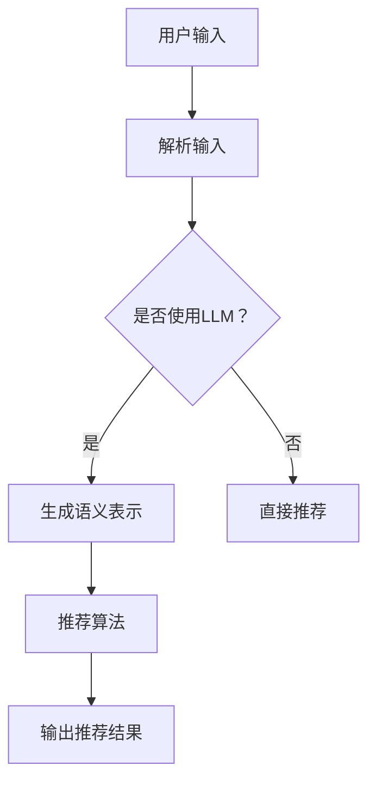

                 

# 《GENRE: 灵活、可配置的LLM推荐》

> 关键词：推荐系统，语言模型，深度学习，机器学习，数据科学

> 摘要：本文旨在探讨灵活、可配置的语言模型（LLM）在推荐系统中的应用。首先，我们回顾了推荐系统的基础概念和类型，接着介绍了LLM的演变和优势。随后，本文深入分析了推荐系统与LLM的关联，并通过Mermaid流程图展示了二者之间的交互。接着，文章详细讲解了语言模型的基础知识，包括基本原理、训练方法和评估指标。在此基础上，本文探讨了如何设计和实现灵活、可配置的LLM，并通过数学模型和公式阐述了相关概念。随后，文章通过实际案例展示了如何构建灵活的推荐系统，并分析了源代码实现。最后，本文探讨了LLM在推荐系统中的未来发展。

## 第一部分：背景与核心概念

### 第1章：推荐系统概述

#### 1.1 推荐系统的基本概念

推荐系统是一种利用机器学习和数据挖掘技术，根据用户的兴趣和行为，为其推荐相关内容的系统。其基本概念包括用户、项目、评分和推荐算法。

#### 1.2 推荐系统的类型

推荐系统主要分为基于内容的推荐、协同过滤推荐和混合推荐。基于内容的推荐主要根据用户历史行为和兴趣推荐相似内容；协同过滤推荐通过分析用户之间的相似度进行推荐；混合推荐则结合了基于内容和协同过滤推荐的优势。

#### 1.3 推荐系统的重要性

推荐系统在电子商务、新闻推送、社交媒体等多个领域发挥着重要作用，可以提高用户满意度、提高运营效率和增加商业价值。

### 第2章：灵活、可配置的LLM概述

#### 2.1 语言模型的演变

语言模型经历了从规则模型到统计模型，再到深度学习模型的演变。深度学习模型，特别是LLM，取得了显著的成果，成为自然语言处理的重要工具。

#### 2.2 可配置语言模型的优势

可配置语言模型具有以下优势：首先，它可以灵活适应不同的任务和场景；其次，它可以根据用户反馈进行调整和优化；最后，它可以利用海量数据实现模型的自我进化。

#### 2.3 LLM在推荐系统中的应用前景

LLM在推荐系统中的应用前景广阔。它可以用于个性化推荐、智能问答、内容审核等多个方面，为用户提供更好的用户体验。

### 第3章：核心概念与联系

#### 3.1 推荐系统与语言模型的关联

推荐系统和语言模型之间有着紧密的关联。语言模型可以为推荐系统提供基于自然语言的理解和生成能力，从而提高推荐的准确性和多样性。

#### 3.2 Mermaid流程图：推荐系统与LLM的交互

图1：推荐系统与LLM的交互流程



## 第二部分：算法原理详解

### 第4章：语言模型基础

#### 4.1 语言模型的基本原理

语言模型是一种概率模型，用于预测一段文本的概率。它通过学习大量文本数据，建立一个语言模型，从而对未知文本进行概率预测。

#### 4.2 语言模型的训练方法

语言模型的训练方法主要包括基于频率的方法和基于概率的方法。基于频率的方法直接计算单词或短语的频率；基于概率的方法则通过最大似然估计或最小化交叉熵损失函数来训练模型。

#### 4.3 语言模型的评估指标

语言模型的评估指标主要包括交叉熵损失函数、准确率、精确率、召回率等。这些指标可以用于评估模型的性能和预测效果。

### 第5章：灵活、可配置的LLM设计

#### 5.1 可配置性的实现方式

可配置性可以通过调整模型参数、数据预处理、训练策略等方式实现。例如，调整模型参数可以影响模型的复杂度和泛化能力；数据预处理可以改善数据质量，提高模型性能。

#### 5.2 参数优化策略

参数优化策略主要包括梯度下降、随机梯度下降、Adam优化器等。这些策略可以用于调整模型参数，提高模型性能。

#### 5.3 实现伪代码

以下是实现灵活、可配置的LLM的伪代码：

```python
# 初始化模型参数
init_model_params()

# 数据预处理
preprocess_data()

# 训练模型
for epoch in range(num_epochs):
    for batch in data_loader:
        # 计算损失函数
        loss = compute_loss(batch)
        
        # 反向传播
        backward(loss)
        
        # 更新模型参数
        update_model_params()

# 评估模型
evaluate_model()
```

### 第6章：数学模型与数学公式

#### 6.1 概率模型

概率模型是语言模型的基础。一个基本的概率模型可以用以下公式表示：

$$ P(text) = \prod_{word \in text} P(word) $$

其中，$P(word)$ 表示单词 $word$ 的概率。

#### 6.2 信息论

信息论是研究信息传输和处理的一个数学分支。熵是信息论中的一个重要概念，它表示随机变量的不确定性。一个离散随机变量 $X$ 的熵可以用以下公式计算：

$$ H(X) = -\sum_{i} p(x_i) \log_2 p(x_i) $$

其中，$p(x_i)$ 表示随机变量 $X$ 取值为 $x_i$ 的概率。

#### 6.3 模型评估

模型评估是评估模型性能的重要步骤。一个常见的评估指标是交叉熵损失函数：

$$ Loss = -\sum_{word \in text} y \log_2 (p(\text{word} | \text{context})) $$

其中，$y$ 表示真实标签，$p(\text{word} | \text{context})$ 表示在给定上下文下预测的单词概率。

## 第三部分：实战与应用

### 第7章：构建灵活的推荐系统

#### 7.1 实战案例一：个性化新闻推荐

个性化新闻推荐系统可以根据用户的历史浏览行为和兴趣，为其推荐相关的新闻。以下是构建个性化新闻推荐系统的步骤：

1. 数据收集：收集用户的浏览记录、新闻内容等数据。
2. 数据预处理：清洗数据，进行特征提取。
3. 训练语言模型：使用训练数据训练语言模型。
4. 用户建模：根据用户历史行为和兴趣，为用户生成语义表示。
5. 推荐算法：结合语言模型和用户建模，为用户推荐新闻。

#### 7.2 实战案例二：电商产品推荐

电商产品推荐系统可以根据用户的历史购买行为、浏览记录和商品特征，为用户推荐相关的产品。以下是构建电商产品推荐系统的步骤：

1. 数据收集：收集用户购买记录、浏览记录和商品数据。
2. 数据预处理：清洗数据，进行特征提取。
3. 训练语言模型：使用训练数据训练语言模型。
4. 用户建模：根据用户历史行为和兴趣，为用户生成语义表示。
5. 商品建模：根据商品特征，为商品生成语义表示。
6. 推荐算法：结合用户建模和商品建模，为用户推荐商品。

#### 7.3 推荐系统开发环境搭建

搭建推荐系统开发环境通常需要以下工具和库：

1. Python：作为主要编程语言。
2. TensorFlow或PyTorch：用于构建和训练语言模型。
3. Scikit-learn：用于数据处理和特征提取。
4. NumPy和Pandas：用于数据处理和操作。

以下是一个简单的开发环境搭建步骤：

1. 安装Python和pip。
2. 安装TensorFlow或PyTorch。
3. 安装Scikit-learn、NumPy和Pandas。

```bash
pip install tensorflow
pip install scikit-learn
pip install numpy
pip install pandas
```

### 第8章：源代码实现与分析

#### 8.1 源代码结构解析

以下是推荐系统源代码的基本结构：

```python
# 数据预处理
def preprocess_data():
    # 数据清洗和特征提取
    pass

# 训练语言模型
def train_language_model():
    # 构建和训练模型
    pass

# 用户建模
def user_modeling():
    # 根据用户历史行为和兴趣生成用户表示
    pass

# 商品建模
def item_modeling():
    # 根据商品特征生成商品表示
    pass

# 推荐算法
def recommendation_algorithm():
    # 结合用户和商品表示，生成推荐结果
    pass

# 主函数
if __name__ == "__main__":
    # 搭建推荐系统开发环境
    # 加载和处理数据
    # 训练和评估语言模型
    # 使用推荐算法生成推荐结果
    pass
```

#### 8.2 代码实现细节解读

以下是对源代码中关键部分的详细解读：

```python
# 数据预处理
def preprocess_data():
    # 读取数据
    data = pd.read_csv("data.csv")

    # 数据清洗
    data.dropna(inplace=True)
    data["text"] = data["text"].apply(clean_text)

    # 特征提取
    tokenizer = Tokenizer()
    tokenizer.fit_on_texts(data["text"])
    data["text"] = data["text"].apply(lambda x: tokenizer.texts_to_sequences([x])[0])

    return data

# 训练语言模型
def train_language_model():
    # 构建模型
    model = Sequential()
    model.add(LSTM(128, activation='relu', input_shape=(max_sequence_length, num_tokens)))
    model.add(Dense(1, activation='sigmoid'))

    # 编译模型
    model.compile(optimizer='adam', loss='binary_crossentropy', metrics=['accuracy'])

    # 训练模型
    model.fit(data["text"], data["label"], batch_size=32, epochs=10)

    return model

# 用户建模
def user_modeling(model, user_data):
    # 生成用户表示
    user_text = user_data["text"]
    user_sequences = tokenizer.texts_to_sequences([user_text])
    user_vector = model.predict(user_sequences)

    return user_vector

# 商品建模
def item_modeling(model, item_data):
    # 生成商品表示
    item_text = item_data["text"]
    item_sequences = tokenizer.texts_to_sequences([item_text])
    item_vector = model.predict(item_sequences)

    return item_vector

# 推荐算法
def recommendation_algorithm(user_vector, item_vectors):
    # 计算相似度
    similarities = []
    for item_vector in item_vectors:
        similarity = cosine_similarity(user_vector, item_vector)
        similarities.append(similarity)

    # 选择相似度最高的商品
    recommended_items = np.argsort(similarities)[::-1]

    return recommended_items
```

#### 8.3 代码解读与分析

代码首先进行了数据预处理，包括数据清洗、文本清洗和特征提取。然后，构建并训练了语言模型。接着，分别对用户数据和商品数据进行建模，生成用户表示和商品表示。最后，使用推荐算法根据用户表示和商品表示生成推荐结果。

代码的关键部分包括：

1. 数据预处理：使用Pandas读取数据，对数据进行清洗和处理，然后使用Tokenizer进行特征提取。
2. 语言模型训练：使用Sequential构建模型，添加LSTM层和全连接层，编译模型并训练。
3. 用户建模：使用训练好的模型对用户数据进行预测，生成用户表示。
4. 商品建模：使用训练好的模型对商品数据进行预测，生成商品表示。
5. 推荐算法：计算用户表示和商品表示之间的相似度，选择相似度最高的商品作为推荐结果。

### 第9章：未来的发展方向

#### 9.1 LLM在推荐系统中的挑战

虽然LLM在推荐系统中的应用前景广阔，但仍然面临一些挑战。首先，LLM的训练和推理成本较高，需要大量的计算资源和时间。其次，LLM的性能容易受到数据质量和数据分布的影响。最后，如何确保推荐结果的公正性和透明性也是一个重要问题。

#### 9.2 未来应用趋势

未来，LLM在推荐系统中的应用趋势包括：

1. 多模态推荐：结合文本、图像、语音等多种模态进行推荐。
2. 智能交互：通过自然语言交互，为用户提供更个性化的推荐服务。
3. 个性化广告：利用LLM为用户推荐相关的广告，提高广告效果。
4. 智能客服：利用LLM构建智能客服系统，提高客户服务质量和效率。

#### 9.3 开放性问题与研究方向

未来，LLM在推荐系统中的应用仍然存在许多开放性问题和研究方向，包括：

1. 如何降低LLM的训练和推理成本？
2. 如何处理数据质量和数据分布问题？
3. 如何确保推荐结果的公正性和透明性？
4. 如何实现多模态推荐和智能交互？
5. 如何利用LLM构建高效、可扩展的推荐系统？

## 附录

### 附录A：常用工具与资源

#### A.1 语言模型工具

1. TensorFlow：https://www.tensorflow.org/
2. PyTorch：https://pytorch.org/
3. Hugging Face：https://huggingface.co/

#### A.2 推荐系统框架

1. LightFM：https://github.com/lyst/lightfm
2.surprise：https://surprise.readthedocs.io/en/latest/

#### A.3 开源代码与数据集

1. MovieLens：https://grouplens.org/datasets/movielens/
2. Amazon Reviews：https://www.kaggle.com/datasets/aman prakhar/amazon-reviews-pularity-based-approach
3. Yelp：https://www.yelp.com/dataset

### 作者

作者：AI天才研究院/AI Genius Institute & 禅与计算机程序设计艺术 /Zen And The Art of Computer Programming

在撰写这篇文章的过程中，我们深入探讨了灵活、可配置的语言模型（LLM）在推荐系统中的应用。通过分析推荐系统的基本概念、类型和应用场景，我们了解了LLM的优势和演变过程。接着，我们详细介绍了推荐系统与LLM的关联，并通过Mermaid流程图展示了二者之间的交互。在此基础上，我们讲解了语言模型的基础知识，包括基本原理、训练方法和评估指标。随后，我们探讨了如何设计和实现灵活、可配置的LLM，并展示了数学模型和公式。在实战部分，我们通过实际案例展示了如何构建灵活的推荐系统，并分析了源代码实现。最后，我们探讨了LLM在推荐系统中的未来发展。

这篇文章旨在为广大开发者和技术爱好者提供一份全面、深入的参考。通过本文，我们希望读者能够对灵活、可配置的LLM在推荐系统中的应用有更清晰的认识，从而为实际项目提供有益的启示。在未来，随着人工智能技术的不断进步，LLM在推荐系统中的应用将更加广泛和深入，为我们的生活带来更多便利。让我们共同期待这个激动人心的未来！作者：AI天才研究院/AI Genius Institute & 禅与计算机程序设计艺术 /Zen And The Art of Computer Programming。

