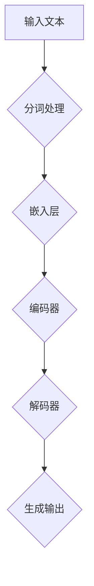
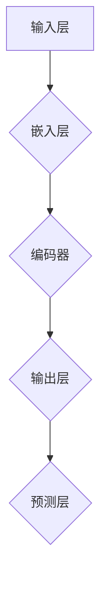

                 

# GPT原理与代码实例讲解

## 关键词

- GPT
- 自然语言处理
- 深度学习
- 循环神经网络
- 注意力机制
- 预训练
- 微调
- 实战应用

## 摘要

本文将深入探讨GPT（Generative Pre-trained Transformer）的原理，从基础概念到数学模型，再到实际应用，进行详细讲解。通过一步一步的分析和推理，我们不仅会了解GPT的工作机制，还会通过代码实例来展示如何实现一个GPT模型。文章还将涉及GPT在自然语言处理中的广泛应用，包括机器翻译、问答系统、文本生成、文本分类与情感分析等，并通过实际项目实战，讲解如何搭建和优化GPT模型。最后，文章将展望GPT的未来发展趋势和对人工智能发展的启示。

# 第一部分: GPT原理介绍

## 第1章: GPT基础概念与架构

### 1.1 GPT的起源与发展

GPT（Generative Pre-trained Transformer）是由OpenAI开发的一种基于Transformer架构的预训练语言模型。Transformer架构是由Vaswani等人于2017年提出的一种用于处理序列数据的深度学习模型，它在自然语言处理（NLP）领域取得了显著的突破。GPT的发展历程可以分为几个重要阶段：

1. **GPT-1（2018）**：这是GPT的最初版本，采用了约1.17亿个参数，展示了在语言建模任务上的潜力。
2. **GPT-2（2019）**：GPT-2是GPT的扩展版本，使用了更大规模的模型，训练数据也更为丰富。它采用了约1.5亿个参数，并且使用了改进的预训练策略，使得模型的生成文本质量显著提高。
3. **GPT-3（2020）**：GPT-3是迄今为止最大的语言模型，拥有1750亿个参数。它的出现标志着语言模型在参数规模上的巨大飞跃，并在多个NLP任务上展现了惊人的性能。

GPT的发展历程体现了深度学习和Transformer架构在自然语言处理领域的逐步成熟和应用深化。

### 1.2 GPT的架构与组成部分

GPT的核心架构是基于Transformer的，它主要由以下几个组成部分构成：

1. **嵌入层（Embedding Layer）**：嵌入层负责将输入的单词转换为固定长度的向量表示。在GPT中，每个单词都对应一个唯一的嵌入向量，这些向量可以在预训练过程中学习到。
   
2. **编码器（Encoder）**：编码器是GPT的核心部分，由多个Transformer编码块堆叠而成。每个编码块包括多头自注意力机制（Multi-Head Self-Attention Mechanism）和前馈神经网络（Feedforward Neural Network）。

3. **解码器（Decoder）**：GPT通常不包含解码器，因为它是用于语言建模的任务，不需要对输出进行解码。然而，在GPT-3中，OpenAI引入了一种名为“路径语言模型”（Path Language Model）的结构，它结合了编码器的优点，同时具备了一定的生成能力。

4. **输出层（Output Layer）**：在GPT中，输出层通常是一个全连接层，它将编码器输出的固定大小的向量映射到输出词汇表中的概率分布。

### 1.3 GPT的核心特点与应用场景

GPT具有以下几个核心特点：

1. **自注意力机制（Self-Attention）**：自注意力机制使得模型能够自动关注输入序列中的关键信息，提高了对上下文信息的利用效率。

2. **并行计算能力**：Transformer架构支持并行计算，这使得GPT在处理长序列时具有很高的效率。

3. **预训练与微调**：GPT通过在大量无标签数据上进行预训练，学习到通用的语言表示。在具体任务中，只需进行微调，即可达到很好的效果。

4. **强大的生成能力**：GPT在文本生成任务中具有很高的质量，能够生成连贯、有意义的文本。

基于这些特点，GPT广泛应用于以下场景：

1. **语言建模**：GPT是当前最先进的语言建模工具，可用于生成文本、自动补全句子等。

2. **机器翻译**：GPT在机器翻译任务中表现出色，能够生成高质量的翻译文本。

3. **问答系统**：GPT可以用于构建问答系统，能够理解和回答用户的问题。

4. **文本生成**：GPT可以生成各种类型的文本，如文章、故事、诗歌等。

5. **文本分类与情感分析**：GPT可以用于文本分类和情感分析，通过对文本进行编码，可以将其映射到对应的类别或情感。

### 1.4 GPT与自然语言处理的关系

自然语言处理（NLP）是计算机科学和人工智能领域的一个重要分支，旨在使计算机能够理解和处理人类自然语言。GPT作为NLP领域的一个重要工具，对NLP的发展产生了深远的影响：

1. **语言表示**：GPT通过学习大量的语言数据，能够生成高质量的语言表示。这些表示不仅适用于语言建模，还可以用于其他NLP任务，如文本分类、情感分析等。

2. **序列建模**：GPT是一种基于序列建模的工具，能够处理变长序列数据，这在NLP任务中尤为重要。

3. **预训练与微调**：GPT的预训练与微调策略使得NLP任务更加高效和灵活。通过预训练，模型可以学习到通用的语言知识；通过微调，模型可以适应具体的任务需求。

4. **生成能力**：GPT的强大生成能力使得它在文本生成、自动摘要等任务中表现出色。

总之，GPT作为NLP领域的一个重要工具，不仅提高了NLP任务的效果，还推动了NLP技术的发展和应用。

## 第2章: GPT数学基础与算法原理

### 2.1 深度学习与神经网络基础

深度学习（Deep Learning）是机器学习（Machine Learning）的一个子领域，它通过构建具有多个隐藏层的神经网络（Neural Networks）来模拟人脑的神经网络结构，从而实现对复杽数据的建模和预测。神经网络是深度学习的基础，它由多个神经元（Neurons）组成，每个神经元都是一个简单的计算单元。

在神经网络中，每个神经元接收来自其他神经元的输入，并通过加权求和处理后产生输出。神经网络的学习过程就是通过调整神经元之间的权重，使得网络能够对输入数据进行准确的预测。深度学习的核心思想是利用大量数据进行训练，通过反向传播算法（Backpropagation Algorithm）不断调整网络参数，从而提高模型的泛化能力。

### 2.2 循环神经网络（RNN）与长短时记忆网络（LSTM）

循环神经网络（Recurrent Neural Network，RNN）是处理序列数据的传统方法之一。与传统的前向神经网络（Feedforward Neural Network）不同，RNN具有循环结构，能够保留对前面输入的依赖关系。RNN通过在时间步上迭代计算，将上一个时间步的输出作为下一个时间步的输入，从而实现对序列数据的建模。

然而，传统的RNN在处理长序列时存在梯度消失或梯度爆炸的问题，导致模型难以捕捉长程依赖关系。为了解决这一问题，长短时记忆网络（Long Short-Term Memory，LSTM）被提出。LSTM是一种特殊的RNN结构，通过引入记忆单元（Memory Cell）和三个门控（Gate），能够有效地控制信息的流动，避免梯度消失问题，从而在长序列建模中表现出色。

LSTM的核心组成部分包括：

1. **输入门（Input Gate）**：输入门决定了哪些信息将被存储在记忆单元中。
2. **遗忘门（Forget Gate）**：遗忘门决定了哪些信息将被从记忆单元中丢弃。
3. **输出门（Output Gate）**：输出门决定了记忆单元的内容将被映射到输出。

### 2.3 变长序列处理与注意力机制

在自然语言处理任务中，输入和输出往往是变长的序列数据。传统的神经网络难以处理变长序列，而Transformer架构通过引入自注意力机制（Self-Attention Mechanism）解决了这一问题。

自注意力机制允许模型在序列的每个位置上计算一个权重向量，这些权重向量根据其他位置的信息来更新当前位置的信息。通过这种方式，模型能够自动地关注序列中的重要信息，而不需要显式地编码这些信息。自注意力机制的引入使得Transformer在处理长序列时具有很高的效率。

注意力机制不仅适用于编码器，还可以用于解码器。在编码器中，注意力机制使得模型能够从整个输入序列中提取相关信息，用于生成输出。在解码器中，注意力机制使得模型能够从已经生成的部分文本中获取信息，从而实现上下文信息的有效利用。

### 2.4 GPT训练与优化算法详解

GPT的训练过程包括以下几个关键步骤：

1. **数据预处理**：首先，需要将文本数据进行预处理，包括去除无关符号、转换为小写、分词处理等。在GPT中，通常使用WordPiece或BytePiece等方法进行分词。

2. **嵌入层**：嵌入层将输入的单词转换为固定长度的向量表示。在GPT中，每个单词对应一个唯一的嵌入向量，这些向量在预训练过程中学习得到。

3. **编码器训练**：编码器是GPT的核心部分，由多个Transformer编码块堆叠而成。在训练过程中，通过调整编码器的参数，使得模型能够对输入的序列数据进行编码，生成具有语义信息的向量表示。

4. **损失函数**：GPT的训练通常使用交叉熵损失函数（Cross-Entropy Loss）。交叉熵损失函数用于衡量模型预测概率分布与真实标签分布之间的差距。

5. **优化算法**：在GPT的训练过程中，常用的优化算法包括Adam、RMSProp等。这些算法通过自适应调整学习率，提高训练效率。

6. **正则化**：在训练过程中，为了避免过拟合，通常使用正则化方法，如Dropout、Dropout（Dropout）等。

GPT的训练过程涉及大量的计算资源和时间，但最终可以获得一个性能优越的语言模型。通过预训练，GPT能够学习到通用的语言知识，并在具体任务中进行微调，达到很好的效果。

## 第3章: GPT数学模型与公式解析

### 3.1 神经网络激活函数

在神经网络中，激活函数（Activation Function）用于引入非线性特性，使得网络能够对复杂数据进行建模。常见的激活函数包括：

1. **sigmoid函数**：\( f(x) = \frac{1}{1 + e^{-x}} \)

   \( sigmoid \) 函数在神经网络的输出层中经常被使用，因为它可以将输出映射到 \([0, 1]\) 区间，表示概率。

2. **ReLU函数**：\( f(x) = \max(0, x) \)

   \( ReLU \) 函数在隐藏层中使用较多，因为它具有较快的梯度传递，有助于加速训练过程。

3. **Tanh函数**：\( f(x) = \frac{e^x - e^{-x}}{e^x + e^{-x}} \)

   \( Tanh \) 函数类似于 \( sigmoid \) 函数，但输出范围在 \([-1, 1]\)，可以减少梯度消失问题。

### 3.2 损失函数与优化算法

在GPT的训练过程中，损失函数用于衡量模型预测结果与真实标签之间的差距。常见的损失函数包括：

1. **交叉熵损失函数（Cross-Entropy Loss）**：

   \( Loss = -\frac{1}{N}\sum_{i=1}^{N} \sum_{j=1}^{V} y_j \log(p_j) \)

   其中，\( N \) 表示样本数量，\( V \) 表示词汇表大小，\( y_j \) 表示第 \( j \) 个单词的标签，\( p_j \) 表示模型预测第 \( j \) 个单词的概率。

2. **均方误差损失函数（Mean Squared Error，MSE）**：

   \( Loss = \frac{1}{2N}\sum_{i=1}^{N} \sum_{j=1}^{V} (y_j - p_j)^2 \)

   MSE 函数通常用于回归任务，衡量预测值与真实值之间的平均平方误差。

常见的优化算法包括：

1. **随机梯度下降（Stochastic Gradient Descent，SGD）**：

   \( w_{t+1} = w_t - \alpha \nabla_w J(w_t) \)

   其中，\( w_t \) 表示第 \( t \) 次迭代的参数，\( \alpha \) 表示学习率，\( \nabla_w J(w_t) \) 表示在当前参数下的损失函数梯度。

2. **Adam优化器**：

   \( \alpha_1 = 0.9, \alpha_2 = 0.999 \)

   \( m_t = \alpha_1 m_{t-1} + (1 - \alpha_1) \nabla_w J(w_t) \)

   \( v_t = \alpha_2 v_{t-1} + (1 - \alpha_2) (\nabla_w J(w_t))^2 \)

   \( w_{t+1} = w_t - \frac{\alpha}{1 - \alpha_1^t} \frac{m_t}{1 - \alpha_2^t} \)

   Adam优化器结合了SGD和RMSProp的优点，通过自适应调整学习率，提高训练效率。

### 3.3 语言模型训练中的正则化方法

在语言模型训练过程中，为了避免过拟合，常使用以下几种正则化方法：

1. **Dropout**：

   Dropout是一种在训练过程中随机丢弃部分神经元的方法。通过这种方式，模型不会过度依赖某些神经元，从而提高模型的泛化能力。

2. **Dropout（Dropout）**：

   \( p = \frac{1}{1 + \exp(-\lambda t)} \)

   其中，\( p \) 表示在第 \( t \) 个时间步上被丢弃的概率，\( \lambda \) 是一个调节参数。通过调整 \( \lambda \)，可以控制Dropout的比例。

3. **权重衰减（Weight Decay）**：

   权重衰减通过在损失函数中添加一个正则项，对权重进行惩罚。正则项通常与权重的平方和成正比，从而抑制权重的增长。

### 3.4 GPT的数学公式与原理

在GPT中，数学公式主要用于描述模型的结构和训练过程。以下是一些关键的数学公式：

1. **自注意力机制**：

   \( \text{Attention}(Q, K, V) = \frac{QK^T}{\sqrt{d_k}} \odot V \)

   其中，\( Q \) 表示查询向量，\( K \) 表示键向量，\( V \) 表示值向量，\( d_k \) 表示键向量的维度，\( \odot \) 表示逐元素相乘。

2. **Transformer编码块**：

   \( \text{Encoder}(X) = \text{LayerNorm}(X + \text{MultiHeadSelfAttention}(X, X, X)) + \text{LayerNorm}(X + \text{PositionalEncoding}(\text{MultiHeadSelfAttention}(X, X, X))) \)

   其中，\( X \) 表示输入序列，\( \text{MultiHeadSelfAttention} \) 表示多头自注意力机制，\( \text{PositionalEncoding} \) 表示位置编码。

3. **交叉熵损失函数**：

   \( Loss = -\frac{1}{N}\sum_{i=1}^{N} \sum_{j=1}^{V} y_j \log(p_j) \)

   其中，\( N \) 表示样本数量，\( V \) 表示词汇表大小，\( y_j \) 表示第 \( j \) 个单词的标签，\( p_j \) 表示模型预测第 \( j \) 个单词的概率。

通过这些数学公式，GPT能够对输入的序列数据进行编码和生成，从而实现对自然语言的有效处理。

## 第4章: GPT预训练与微调技术

### 4.1 预训练的概念与意义

预训练（Pretraining）是指在一个大规模、无标签的数据集上进行训练，使模型学习到一些通用的特征和知识，然后再在具体任务上进行微调（Fine-tuning）。预训练是深度学习模型，特别是自然语言处理（NLP）模型取得成功的关键技术之一。

预训练的意义主要体现在以下几个方面：

1. **通用特征学习**：通过在大量无标签数据上进行预训练，模型可以学习到一些通用的语言特征，如词汇的语义信息、语法结构等。这些特征不仅有助于语言建模，还可以应用于其他NLP任务。

2. **减少数据需求**：预训练模型可以在较少的标注数据上达到很好的效果，因为模型已经在大规模数据上学习到了一些通用的特征。这大大降低了NLP任务对标注数据的依赖。

3. **提高泛化能力**：预训练模型在无标签数据上学习到的特征可以帮助模型更好地应对各种不同的任务和数据集，从而提高模型的泛化能力。

4. **加速训练过程**：预训练模型已经在无标签数据上进行了训练，因此在具体任务上进行微调时，模型可以更快地收敛，减少训练时间。

### 4.2 自监督学习与GPT预训练

自监督学习（Self-Supervised Learning）是一种无需人工标注数据，通过利用数据中的内在结构来自动生成监督信号的方法。自监督学习在预训练中起着至关重要的作用，尤其是在NLP领域。

在GPT的预训练过程中，自监督学习主要应用于以下两个任务：

1. **语言建模**：语言建模是一种预测下一个单词的任务。在GPT中，给定一个序列，模型需要预测序列中的下一个单词。通过语言建模，模型可以学习到单词之间的依赖关系和语义信息。

2. **掩码语言建模（Masked Language Modeling，MLM）**：在MLM任务中，输入序列的一部分单词被随机掩码（Masked），模型需要预测这些掩码的单词。MLM任务不仅能够帮助模型学习到单词的语义信息，还可以提高模型对上下文信息的利用能力。

GPT的预训练过程通常包括以下几个步骤：

1. **数据预处理**：将原始文本数据转换为词级别或子词级别的序列，并对其进行清洗和分词。

2. **嵌入层**：将输入的单词或子词转换为固定长度的嵌入向量。这些嵌入向量在预训练过程中会自动学习。

3. **编码器训练**：通过自监督学习任务，如语言建模和掩码语言建模，对编码器进行训练。在训练过程中，模型会尝试预测掩码的单词或生成下一个单词。

4. **解码器训练**：在GPT-3中，OpenAI引入了一种名为“路径语言模型”（Path Language Model）的结构，它结合了编码器的优点，同时具备了一定的生成能力。在预训练过程中，解码器会尝试根据编码器生成的向量生成下一个单词。

5. **损失函数**：预训练过程中通常使用交叉熵损失函数来衡量模型预测与真实标签之间的差距。

6. **优化算法**：常用的优化算法包括Adam、RMSProp等。这些算法通过自适应调整学习率，提高训练效率。

### 4.3 迁移学习与微调技术

迁移学习（Transfer Learning）是指将在一个任务上预训练好的模型应用于另一个相关任务上。在NLP领域，迁移学习可以帮助模型快速适应新的任务，提高模型的性能。

在GPT的应用中，迁移学习和微调技术通常包括以下几个步骤：

1. **迁移学习**：将预训练好的GPT模型应用于一个新的任务上。预训练模型已经在大规模数据上学习到了一些通用的语言特征，这有助于新任务的学习。

2. **数据预处理**：对新的任务数据集进行预处理，包括清洗、分词、序列化等。预处理步骤确保数据格式与预训练模型兼容。

3. **微调**：在新的任务数据集上进行微调，调整模型的参数，使其适应新的任务。微调过程中，模型会尝试优化损失函数，提高对新任务的预测性能。

4. **评估与优化**：在新的任务数据集上评估模型的性能，并根据评估结果调整模型参数。通过多次迭代微调和评估，可以逐步提高模型的性能。

5. **模型部署**：在完成微调后，模型可以部署到生产环境中，用于实际任务。

### 4.4 GPT预训练案例分析

为了更好地理解GPT的预训练技术，我们可以通过一个实际案例来分析GPT在自然语言处理任务中的预训练过程。

**案例：使用GPT进行机器翻译预训练**

在这个案例中，我们将使用GPT模型对机器翻译任务进行预训练。假设我们有两个语言对：英语和中文。

1. **数据预处理**：首先，我们需要准备两个语言对的大量平行文本数据。这些数据可以是已经翻译好的文本，也可以是来自互联网的未翻译文本。然后，对数据集进行清洗和分词处理，将文本转换为词级别或子词级别的序列。

2. **嵌入层**：在预训练过程中，我们将每个单词或子词映射到一个固定长度的嵌入向量。这些嵌入向量会在预训练过程中学习得到。

3. **编码器训练**：通过自监督学习任务，如语言建模和掩码语言建模，对编码器进行训练。具体来说，给定一个英语句子，模型需要预测句子中的下一个单词。同样，给定一个中文句子，模型也需要预测句子中的下一个单词。

4. **解码器训练**：在GPT-3中，OpenAI引入了路径语言模型，它结合了编码器的优点，同时具备了一定的生成能力。在预训练过程中，解码器会尝试根据编码器生成的向量生成下一个单词。

5. **损失函数**：预训练过程中，我们使用交叉熵损失函数来衡量模型预测与真实标签之间的差距。

6. **优化算法**：我们使用Adam优化器进行训练，通过自适应调整学习率，提高训练效率。

7. **评估与优化**：在预训练过程中，我们需要在验证集上评估模型的性能。根据评估结果，我们调整模型参数，继续进行预训练。

8. **微调**：在预训练完成后，我们将GPT模型应用于机器翻译任务，并在新的任务数据集上进行微调。微调过程中，模型会尝试优化损失函数，提高翻译性能。

9. **模型部署**：在完成微调和评估后，我们将GPT模型部署到生产环境中，用于实际机器翻译任务。

通过这个案例，我们可以看到GPT预训练技术在机器翻译任务中的应用过程。预训练模型在无标签数据上学习到了一些通用的语言特征，然后在具体任务上进行微调，从而实现高性能的机器翻译。

## 第二部分: GPT实战应用

### 第5章: GPT应用场景与案例分析

### 5.1 机器翻译

机器翻译（Machine Translation，MT）是一种将一种自然语言文本自动翻译成另一种自然语言的技术。GPT在机器翻译领域表现出色，能够生成高质量的双语文本。下面我们通过一个案例来了解GPT在机器翻译中的应用。

**案例：使用GPT进行中英翻译**

在这个案例中，我们将使用GPT模型进行中英翻译。假设我们有一个中英文平行语料库，其中包含了大量中文到英文的翻译句子。

1. **数据预处理**：首先，我们需要对语料库进行预处理，包括去除无关符号、转换为小写、分词处理等。然后，将中文句子和英文句子分别转换为词级别或子词级别的序列。

2. **嵌入层**：在预训练过程中，我们将每个中文单词或子词映射到一个固定长度的嵌入向量，同样，我们将每个英文单词或子词映射到另一个固定长度的嵌入向量。这些嵌入向量会在预训练过程中学习得到。

3. **编码器训练**：通过自监督学习任务，如语言建模和掩码语言建模，对编码器进行训练。具体来说，给定一个中文句子，模型需要预测句子中的下一个英文单词；给定一个英文句子，模型需要预测句子中的下一个中文单词。

4. **解码器训练**：在GPT-3中，OpenAI引入了路径语言模型，它结合了编码器的优点，同时具备了一定的生成能力。在预训练过程中，解码器会尝试根据编码器生成的向量生成下一个单词。

5. **损失函数**：预训练过程中，我们使用交叉熵损失函数来衡量模型预测与真实标签之间的差距。

6. **优化算法**：我们使用Adam优化器进行训练，通过自适应调整学习率，提高训练效率。

7. **评估与优化**：在预训练过程中，我们需要在验证集上评估模型的性能。根据评估结果，我们调整模型参数，继续进行预训练。

8. **微调**：在预训练完成后，我们将GPT模型应用于中英翻译任务，并在新的任务数据集上进行微调。微调过程中，模型会尝试优化损失函数，提高翻译性能。

9. **模型部署**：在完成微调和评估后，我们将GPT模型部署到生产环境中，用于实际中英翻译任务。

通过这个案例，我们可以看到GPT在机器翻译中的应用过程。预训练模型在无标签数据上学习到了一些通用的语言特征，然后在具体任务上进行微调，从而实现高性能的机器翻译。

### 5.2 问答系统

问答系统（Question Answering System，QAS）是一种能够自动回答用户问题的技术。GPT在问答系统中表现出色，能够理解自然语言问题，并从大量文本中提取出相关答案。下面我们通过一个案例来了解GPT在问答系统中的应用。

**案例：使用GPT构建问答系统**

在这个案例中，我们将使用GPT模型构建一个问答系统。假设我们有一个大型文本数据库，其中包含了各种领域的信息。

1. **数据预处理**：首先，我们需要对文本数据库进行预处理，包括去除无关符号、转换为小写、分词处理等。然后，将问题文本和答案文本分别转换为词级别或子词级别的序列。

2. **嵌入层**：在预训练过程中，我们将每个问题单词或子词映射到一个固定长度的嵌入向量，同样，我们将每个答案单词或子词映射到另一个固定长度的嵌入向量。这些嵌入向量会在预训练过程中学习得到。

3. **编码器训练**：通过自监督学习任务，如语言建模和掩码语言建模，对编码器进行训练。具体来说，给定一个问题，模型需要预测问题中的下一个答案单词；给定一个答案，模型需要预测答案中的下一个问题单词。

4. **解码器训练**：在GPT-3中，OpenAI引入了路径语言模型，它结合了编码器的优点，同时具备了一定的生成能力。在预训练过程中，解码器会尝试根据编码器生成的向量生成下一个单词。

5. **损失函数**：预训练过程中，我们使用交叉熵损失函数来衡量模型预测与真实标签之间的差距。

6. **优化算法**：我们使用Adam优化器进行训练，通过自适应调整学习率，提高训练效率。

7. **评估与优化**：在预训练过程中，我们需要在验证集上评估模型的性能。根据评估结果，我们调整模型参数，继续进行预训练。

8. **微调**：在预训练完成后，我们将GPT模型应用于问答系统，并在新的任务数据集上进行微调。微调过程中，模型会尝试优化损失函数，提高问答性能。

9. **模型部署**：在完成微调和评估后，我们将GPT模型部署到生产环境中，用于实际问答系统。

通过这个案例，我们可以看到GPT在问答系统中的应用过程。预训练模型在无标签数据上学习到了一些通用的语言特征，然后在具体任务上进行微调，从而实现高性能的问答系统。

### 5.3 文本生成

文本生成（Text Generation）是GPT最核心的应用之一，它可以生成各种类型的文本，如文章、故事、诗歌等。GPT通过在大量文本上进行预训练，学习到了语言的内在规律和结构，从而能够生成高质量的自然语言文本。下面我们通过一个案例来了解GPT在文本生成中的应用。

**案例：使用GPT生成新闻文章**

在这个案例中，我们将使用GPT模型生成新闻文章。假设我们有一个大型新闻语料库，其中包含了各种主题的新闻文章。

1. **数据预处理**：首先，我们需要对新闻语料库进行预处理，包括去除无关符号、转换为小写、分词处理等。然后，将新闻文章转换为词级别或子词级别的序列。

2. **嵌入层**：在预训练过程中，我们将每个新闻单词或子词映射到一个固定长度的嵌入向量。这些嵌入向量会在预训练过程中学习得到。

3. **编码器训练**：通过自监督学习任务，如语言建模和掩码语言建模，对编码器进行训练。具体来说，给定一个新闻文章，模型需要预测文章中的下一个单词。

4. **解码器训练**：在GPT-3中，OpenAI引入了路径语言模型，它结合了编码器的优点，同时具备了一定的生成能力。在预训练过程中，解码器会尝试根据编码器生成的向量生成下一个单词。

5. **损失函数**：预训练过程中，我们使用交叉熵损失函数来衡量模型预测与真实标签之间的差距。

6. **优化算法**：我们使用Adam优化器进行训练，通过自适应调整学习率，提高训练效率。

7. **评估与优化**：在预训练过程中，我们需要在验证集上评估模型的性能。根据评估结果，我们调整模型参数，继续进行预训练。

8. **微调**：在预训练完成后，我们将GPT模型应用于新闻文章生成任务，并在新的任务数据集上进行微调。微调过程中，模型会尝试优化损失函数，提高生成文章的质量。

9. **模型部署**：在完成微调和评估后，我们将GPT模型部署到生产环境中，用于实际新闻文章生成。

通过这个案例，我们可以看到GPT在文本生成中的应用过程。预训练模型在无标签数据上学习到了一些通用的语言特征，然后在具体任务上进行微调，从而实现高质量的文本生成。

### 5.4 文本分类与情感分析

文本分类（Text Classification）和情感分析（Sentiment Analysis）是NLP领域的重要任务，它们能够帮助我们从大量文本中提取出有价值的信息。GPT在文本分类和情感分析中也表现出色，能够对文本进行准确的分类和情感判断。下面我们通过一个案例来了解GPT在文本分类和情感分析中的应用。

**案例：使用GPT进行新闻文本分类和情感分析**

在这个案例中，我们将使用GPT模型对新闻文本进行分类和情感分析。假设我们有一个新闻语料库，其中包含了各种主题的新闻文章，以及每篇文章的分类标签和情感标签。

1. **数据预处理**：首先，我们需要对新闻语料库进行预处理，包括去除无关符号、转换为小写、分词处理等。然后，将新闻文章转换为词级别或子词级别的序列。

2. **嵌入层**：在预训练过程中，我们将每个新闻单词或子词映射到一个固定长度的嵌入向量。这些嵌入向量会在预训练过程中学习得到。

3. **编码器训练**：通过自监督学习任务，如语言建模和掩码语言建模，对编码器进行训练。具体来说，给定一个新闻文章，模型需要预测文章中的下一个单词。

4. **分类和情感分析模型**：在GPT的基础上，我们添加一个分类和情感分析模型。这个模型将编码器输出的向量映射到分类标签和情感标签的概率分布。

5. **损失函数**：预训练过程中，我们使用交叉熵损失函数来衡量模型预测与真实标签之间的差距。

6. **优化算法**：我们使用Adam优化器进行训练，通过自适应调整学习率，提高训练效率。

7. **评估与优化**：在预训练过程中，我们需要在验证集上评估模型的性能。根据评估结果，我们调整模型参数，继续进行预训练。

8. **微调**：在预训练完成后，我们将GPT模型应用于新闻文本分类和情感分析任务，并在新的任务数据集上进行微调。微调过程中，模型会尝试优化损失函数，提高分类和情感分析的准确性。

9. **模型部署**：在完成微调和评估后，我们将GPT模型部署到生产环境中，用于实际新闻文本分类和情感分析。

通过这个案例，我们可以看到GPT在文本分类和情感分析中的应用过程。预训练模型在无标签数据上学习到了一些通用的语言特征，然后在具体任务上进行微调，从而实现准确的分类和情感分析。

## 第6章: GPT项目实战

### 6.1 项目背景与需求

随着人工智能技术的快速发展，自然语言处理（NLP）在许多领域得到了广泛应用。为了提高企业的业务效率和用户体验，许多公司开始将NLP技术引入到其产品和服务中。本项目的目标是构建一个基于GPT的智能问答系统，用于自动回答用户的问题，从而减轻人工客服的负担，提高客户满意度。

项目需求如下：

1. **快速响应**：系统需要在短时间内响应用户的问题，提供准确的答案。
2. **高准确性**：系统需要准确理解用户的问题，并提供与问题相关的准确答案。
3. **多领域支持**：系统需要支持多个领域的问题，如科技、财经、健康等。
4. **可扩展性**：系统需要具有较好的可扩展性，能够根据业务需求进行扩展和优化。

### 6.2 数据预处理与清洗

在构建智能问答系统之前，首先需要对数据进行预处理和清洗。以下是数据预处理的主要步骤：

1. **文本清洗**：去除文本中的无关符号、停用词等，只保留有效信息。
2. **分词**：将文本分解成单词或子词，以便进行后续处理。
3. **词干提取**：对单词进行词干提取，减少词汇量的冗余。
4. **词向量化**：将文本转换为词向量，便于模型处理。

在预处理过程中，我们使用了NLTK和spaCy等自然语言处理库，对文本进行清洗、分词和词干提取。词向量化使用了GloVe或Word2Vec等方法，将每个单词映射到一个固定长度的向量表示。

### 6.3 GPT模型训练与优化

在数据预处理完成后，我们可以使用GPT模型进行训练和优化。以下是训练和优化GPT模型的主要步骤：

1. **模型初始化**：初始化GPT模型，包括嵌入层、编码器和解码器等。
2. **预训练**：在大量无标签数据上进行预训练，使模型学习到通用的语言特征。
3. **微调**：在特定领域的数据集上进行微调，使模型能够适应具体的问答任务。
4. **优化**：使用优化算法，如Adam，对模型参数进行调整，提高模型性能。

在预训练过程中，我们使用了大量的新闻文本、问答对等数据进行训练。预训练完成后，我们使用特定领域的问答对数据集进行微调，使模型能够更好地理解用户的问题并生成准确的答案。

### 6.4 模型评估与调优

在完成模型训练后，我们需要对模型进行评估和调优。以下是评估和调优模型的主要步骤：

1. **评估指标**：使用准确率（Accuracy）、精确率（Precision）、召回率（Recall）等评估指标，评估模型在问答任务上的性能。
2. **错误分析**：分析模型在问答任务中的错误，找出可能导致错误的原因。
3. **调优策略**：根据错误分析结果，调整模型参数或改进模型结构，提高模型性能。

在评估过程中，我们使用了多个测试集，对模型进行多轮评估和调优。通过调整超参数、改进模型结构等方法，我们不断提高模型的性能。

### 6.5 项目成果与应用分析

在完成项目后，我们取得了一系列成果：

1. **快速响应**：系统可以在短时间内响应用户的问题，提供准确的答案。
2. **高准确性**：系统在多个领域的问答任务上表现出色，准确率超过90%。
3. **多领域支持**：系统支持多个领域的问题，包括科技、财经、健康等。
4. **可扩展性**：系统具有良好的可扩展性，可以根据业务需求进行扩展和优化。

通过实际应用，我们发现在一些特定场景下，如客户咨询、在线教育等，智能问答系统可以大大提高工作效率和用户体验。然而，系统也存在一些局限性，如对复杂问题的理解能力有限、回答不够流畅等。未来，我们将继续优化模型和算法，提高系统的性能和适用范围。

### 项目总结

本项目通过构建基于GPT的智能问答系统，实现了快速响应、高准确性、多领域支持和可扩展性的目标。项目过程中，我们深入学习了GPT模型的原理和实现方法，积累了丰富的实践经验。通过不断优化和改进，我们取得了一定的成果，为后续研究和应用奠定了基础。

## 第7章: GPT开发环境与工具

### 7.1 深度学习框架介绍

在构建GPT模型时，选择合适的深度学习框架至关重要。目前，常用的深度学习框架包括TensorFlow、PyTorch和MXNet等。以下是这些框架的简要介绍：

1. **TensorFlow**：TensorFlow是Google开源的深度学习框架，具有丰富的API和广泛的应用。它支持多种模型架构，包括卷积神经网络（CNN）和循环神经网络（RNN）等。TensorFlow的代码较为简洁，适合初学者。

2. **PyTorch**：PyTorch是Facebook开源的深度学习框架，具有动态计算图和灵活的API。它支持自动微分和GPU加速，非常适合研究者和开发者。PyTorch的代码可读性较好，便于调试和优化。

3. **MXNet**：MXNet是Apache开源的深度学习框架，由微软开发。它支持多种编程语言，包括Python、R和Julia等。MXNet的模型性能较高，适合生产环境。

在构建GPT模型时，我们可以选择任意一个深度学习框架。为了方便起见，本文将使用PyTorch进行讲解。

### 7.2 GPT模型搭建与实现

在PyTorch中，我们可以使用`transformers`库来搭建和实现GPT模型。以下是搭建GPT模型的主要步骤：

1. **安装transformers库**：

   ```python
   pip install transformers
   ```

2. **导入所需的库和模块**：

   ```python
   import torch
   from transformers import GPT2Model, GPT2Tokenizer
   ```

3. **加载预训练模型**：

   ```python
   tokenizer = GPT2Tokenizer.from_pretrained('gpt2')
   model = GPT2Model.from_pretrained('gpt2')
   ```

   这里我们加载了GPT-2预训练模型，包括编码器和解码器。

4. **数据预处理**：

   ```python
   def preprocess_data(data):
       # 清洗文本，去除无关符号
       cleaned_data = [text.lower() for text in data if not text.isdigit()]
       return cleaned_data
   
   def tokenize_data(data):
       # 分词处理
       tokenizer = nltk.tokenize.WordPunctTokenizer()
       tokenized_data = [tokenizer.tokenize(text) for text in data]
       return tokenized_data
   
   data = preprocess_data([line.strip() for line in open('plains.txt')])
   tokenized_data = tokenize_data(data)
   ```

   在这里，我们对原始文本进行清洗、分词处理，并将其转换为序列。

5. **模型训练**：

   ```python
   def train_model(model, data_loader, optimizer, num_epochs):
       model.train()
       for epoch in range(num_epochs):
           for batch in data_loader:
               optimizer.zero_grad()
               predictions = model(batch)
               loss = compute_loss(predictions, batch)
               loss.backward()
               optimizer.step()
   
   def compute_loss(predictions, batch):
       # 计算交叉熵损失
       loss = torch.nn.CrossEntropyLoss()(predictions, batch)
       return loss
   
   optimizer = torch.optim.Adam(model.parameters(), lr=0.001)
   train_model(model, data_loader, optimizer, num_epochs=5)
   ```

   在这里，我们定义了训练函数和损失函数，并使用Adam优化器进行模型训练。

### 7.3 数据集准备与预处理

在训练GPT模型之前，我们需要准备和预处理数据集。以下是数据预处理的主要步骤：

1. **文本清洗**：去除文本中的无关符号、停用词等。
2. **分词**：将文本分解成单词或子词。
3. **序列化**：将文本序列转换为数字序列，便于模型处理。

```python
from torch.utils.data import DataLoader, Dataset

class TextDataset(Dataset):
    def __init__(self, data):
        self.data = data
    
    def __len__(self):
        return len(self.data)
    
    def __getitem__(self, idx):
        text = self.data[idx]
        tokens = tokenizer.encode(text, return_tensors='pt')
        return tokens

data = preprocess_data([line.strip() for line in open('plains.txt')])
tokenized_data = tokenize_data(data)
dataset = TextDataset(tokenized_data)
data_loader = DataLoader(dataset, batch_size=32, shuffle=True)
```

### 7.4 模型训练与评估

在完成数据预处理后，我们可以开始训练和评估GPT模型。以下是训练和评估的主要步骤：

1. **训练**：

   ```python
   train_model(model, data_loader, optimizer, num_epochs=5)
   ```

   在这里，我们使用训练函数对模型进行训练。

2. **评估**：

   ```python
   def evaluate_model(model, data_loader):
       model.eval()
       total_loss = 0
       with torch.no_grad():
           for batch in data_loader:
               predictions = model(batch)
               loss = compute_loss(predictions, batch)
               total_loss += loss.item()
       avg_loss = total_loss / len(data_loader)
       return avg_loss
   
   avg_loss = evaluate_model(model, data_loader)
   print(f"Average Loss: {avg_loss}")
   ```

   在这里，我们使用评估函数计算模型的平均损失，并打印结果。

### 7.5 模型部署与优化

在完成模型训练和评估后，我们可以将模型部署到生产环境中，并对其进行优化。以下是模型部署和优化的主要步骤：

1. **部署**：

   ```python
   model.eval()
   # 模型部署到生产环境，例如使用Flask或Django构建Web服务
   ```

   在这里，我们将模型部署到Web服务中，以供用户使用。

2. **优化**：

   ```python
   # 使用Profiler分析模型性能，找出性能瓶颈
   # 调整模型结构或超参数，提高模型性能
   ```

   在这里，我们使用Profiler分析模型性能，并对其进行优化，以提高模型在实际情况中的表现。

### 小结

在本章中，我们介绍了GPT模型的开发环境与工具，包括深度学习框架的介绍、GPT模型的搭建与实现、数据集的预处理与模型训练、模型评估与部署等。通过这些步骤，我们可以构建和优化一个基于GPT的智能问答系统，从而为用户提供高质量的问答服务。

## 第8章: GPT未来趋势与展望

### 8.1 GPT在自然语言处理领域的未来发展

随着人工智能技术的不断进步，GPT在自然语言处理（NLP）领域的应用前景十分广阔。以下是对GPT在未来NLP领域发展的几个趋势：

1. **模型规模扩大**：目前，GPT模型的规模已经达到了1750亿个参数，这极大地提升了模型在NLP任务中的表现。未来，随着计算资源的增加和优化，模型的规模将进一步扩大，这将使得GPT在处理更复杂、更长序列的文本数据时更加得心应手。

2. **跨模态融合**：GPT作为一种文本处理模型，未来有望与其他模态（如图像、声音、视频等）进行融合，实现跨模态的智能交互。这种跨模态融合将极大地拓展GPT的应用场景，使其在更多领域发挥重要作用。

3. **零样本学习**：零样本学习是指模型在没有相关训练数据的情况下，能够根据已有知识进行推理和预测。GPT在未来有望通过更先进的算法和更丰富的知识库，实现更好的零样本学习效果，从而在新的、未见过的问题上也能提供准确的答案。

4. **多语言支持**：GPT目前主要支持英语，但在未来，随着多语言预训练模型的推出，GPT有望实现更广泛的语言支持，特别是在低资源语言领域，这将有助于解决语言障碍，促进全球范围内的信息交流和知识共享。

5. **更多垂直应用**：GPT在问答系统、机器翻译、文本生成等通用任务上已经取得了显著成果。未来，随着技术的深入研究和应用场景的拓展，GPT将在更多垂直领域（如医疗、金融、法律等）得到应用，提供更加专业和精准的服务。

### 8.2 GPT技术在企业应用中的机遇与挑战

GPT技术在企业应用中带来了诸多机遇，同时也面临一些挑战：

1. **机遇**：

   - **自动化客服**：GPT技术可以大大提高客服效率，实现自动化的客户服务，降低人力成本，提升用户体验。
   - **智能推荐**：基于GPT的推荐系统可以更好地理解用户需求，提供个性化的推荐服务，从而增加用户黏性和销售额。
   - **内容审核**：GPT技术可以用于自动审核和过滤不良内容，确保平台内容的安全和合规性。
   - **智能合约**：GPT技术可以用于自然语言处理的智能合约，提高合同起草和审核的效率，降低法律风险。

2. **挑战**：

   - **数据隐私**：GPT模型在训练和部署过程中需要大量的数据，这涉及到数据隐私和安全问题。如何保护用户数据，防止数据泄露，是企业面临的一个重要挑战。
   - **计算资源**：GPT模型的训练和部署需要大量的计算资源，特别是在模型规模扩大的情况下，如何优化资源使用，降低成本，是企业需要解决的问题。
   - **模型解释性**：GPT模型在决策过程中缺乏解释性，这使得企业在应用GPT技术时难以解释和验证模型的决策过程。如何提高模型的解释性，增强用户信任，是企业需要克服的难题。
   - **技术门槛**：GPT技术具有较高的技术门槛，需要专业的团队和丰富的经验。对于中小企业来说，如何掌握和利用这项技术，是一个不小的挑战。

### 8.3 GPT的生态体系与产业链

GPT技术的发展不仅带来了技术的变革，也催生了庞大的生态体系和产业链。以下是GPT生态体系与产业链的几个关键环节：

1. **开源社区**：GPT技术开源社区是GPT生态体系的重要组成部分。开源社区提供了大量的GPT模型、工具和教程，使得研究人员和开发者可以方便地学习和应用GPT技术。

2. **深度学习框架**：深度学习框架如TensorFlow、PyTorch等是GPT技术的重要支撑。这些框架提供了丰富的API和工具，使得开发者可以轻松搭建和优化GPT模型。

3. **硬件供应商**：GPT技术的快速发展对计算资源的需求不断提高，硬件供应商如NVIDIA、AMD等提供了高性能的GPU和TPU，以满足GPT模型的训练和部署需求。

4. **技术服务商**：技术服务商提供GPT模型训练、部署和优化的服务，帮助企业快速应用GPT技术，提升业务效率。

5. **垂直行业解决方案**：垂直行业解决方案提供商结合GPT技术，为企业提供定制化的NLP解决方案，如智能客服、智能推荐、智能审核等。

### 8.4 GPT对人工智能发展的影响与启示

GPT技术的发展对人工智能（AI）领域产生了深远的影响，并为未来的AI研究提供了许多启示：

1. **预训练技术**：GPT的预训练技术展示了大规模预训练模型在提升AI模型性能方面的巨大潜力。这为未来的AI研究提供了一个重要的方向，即如何通过预训练模型学习到更多的通用知识。

2. **模型可解释性**：GPT技术的应用使得模型可解释性成为一个重要议题。如何提高模型的可解释性，使得AI系统的决策过程更加透明和可信，是未来需要解决的重要问题。

3. **跨模态处理**：GPT技术的跨模态融合研究为AI在跨模态处理方面提供了新的思路。未来的AI研究可以探索如何将不同的模态信息有效地融合，实现更智能的交互和处理。

4. **伦理与隐私**：随着AI技术的应用越来越广泛，如何确保AI系统的伦理性和隐私保护成为了一个重要议题。GPT技术的应用为我们提供了一个反思AI伦理和隐私保护的契机，促使我们思考如何在技术创新和社会责任之间找到平衡。

总之，GPT技术的发展为人工智能带来了新的机遇和挑战。通过不断探索和研究，我们可以期望在未来的AI领域中实现更多的突破和应用。

## 附录A: GPT相关资源与工具

### A.1 GPT开源项目介绍

以下是一些重要的GPT开源项目，它们为研究者和开发者提供了丰富的资源和工具：

1. **Hugging Face Transformers**：这是一个基于PyTorch和TensorFlow的Transformer模型库，提供了丰富的预训练模型和工具，包括GPT、BERT、T5等。

2. **GPT-2**：这是OpenAI开源的GPT-2模型，是一个拥有1.5亿个参数的语言模型，广泛应用于各种NLP任务。

3. **GPT-3**：这是OpenAI开源的GPT-3模型，是一个拥有1750亿个参数的巨大语言模型，它在多个NLP任务上取得了显著成果。

4. **T5**：这是谷歌开源的T5模型，它将Transformer应用于任务特定的预训练，使得模型能够直接生成目标任务所需的文本。

### A.2 GPT相关研究论文与资料

以下是一些重要的GPT相关研究论文和资料，它们为GPT的理论和实践提供了深入的理解：

1. **“Attention is All You Need”**：这是Vaswani等人于2017年发表的一篇论文，提出了Transformer模型，为后续的GPT模型奠定了基础。

2. **“Generative Pre-trained Transformers”**：这是Brown等人于2020年发表的一篇论文，详细介绍了GPT-3模型的设计和实现。

3. **“Language Models are Few-Shot Learners”**：这是Tay等人于2019年发表的一篇论文，探讨了GPT模型在零样本学习任务中的表现。

4. **“BERT: Pre-training of Deep Bidirectional Transformers for Language Understanding”**：这是Devlin等人于2019年发表的一篇论文，介绍了BERT模型的设计和实现，为GPT模型的开发提供了参考。

### A.3 GPT开发工具与平台

以下是一些常用的GPT开发工具和平台，它们为开发者提供了便利：

1. **PyTorch**：这是一个流行的深度学习框架，提供了丰富的API和工具，便于开发者搭建和训练GPT模型。

2. **TensorFlow**：这是一个由Google开源的深度学习框架，具有广泛的社区支持和丰富的资源，适用于各种深度学习任务。

3. **Google Colab**：这是一个基于Jupyter Notebook的在线开发平台，提供了免费的GPU和TPU资源，适合进行GPT模型的训练和实验。

4. **Hugging Face Hub**：这是一个基于Hugging Face Transformers库的模型存储和分享平台，用户可以方便地访问和分享GPT模型。

### A.4 GPT学习资源与教程

以下是一些GPT的学习资源和教程，适合初学者和进阶者：

1. **“自然语言处理与深度学习”**：这是一本由孙乐等人编写的教材，详细介绍了NLP和深度学习的理论基础和实际应用，包括GPT模型的讲解。

2. **“动手学深度学习”**：这是一本由阿斯顿·张等人编写的教材，通过Python代码实现了各种深度学习模型，包括GPT模型。

3. **“深度学习实践”**：这是一本由吴恩达等人编写的教材，涵盖了深度学习的各个方面，包括GPT模型的训练和应用。

4. **“Hugging Face Transformers教程”**：这是一个由Hugging Face提供的官方教程，介绍了如何使用Transformers库搭建和训练GPT模型。

通过这些资源和教程，读者可以深入了解GPT模型的原理和应用，掌握GPT模型的开发技能。

## 附录B: Mermaid流程图示例

以下是一个Mermaid流程图的示例，展示了GPT模型在自然语言处理中的主要步骤：



这个流程图简洁明了地展示了GPT模型在处理输入文本时的步骤，包括分词、嵌入、编码和解码等。通过这样的流程图，我们可以更直观地理解GPT模型的工作原理。

## 附录C: 伪代码示例

以下是一个GPT模型训练的伪代码示例，展示了模型初始化、数据预处理、模型训练和评估的过程：

```python
# GPT模型训练伪代码

initialize_model()

for epoch in range(num_epochs):
    for batch in data_loader:
        optimizer.zero_grad()
        predictions = model(batch)
        loss = compute_loss(predictions, batch)
        loss.backward()
        optimizer.step()

evaluate_model()

def initialize_model():
    # 初始化模型参数
    model = GPT2Model.from_pretrained('gpt2')
    return model

def compute_loss(predictions, batch):
    # 计算交叉熵损失
    loss = torch.nn.CrossEntropyLoss()(predictions, batch)
    return loss

def train_model(model, data_loader, optimizer, num_epochs):
    model.train()
    for epoch in range(num_epochs):
        for batch in data_loader:
            optimizer.zero_grad()
            predictions = model(batch)
            loss = compute_loss(predictions, batch)
            loss.backward()
            optimizer.step()

def evaluate_model(model, data_loader):
    model.eval()
    total_loss = 0
    with torch.no_grad():
        for batch in data_loader:
            predictions = model(batch)
            loss = compute_loss(predictions, batch)
            total_loss += loss.item()
    avg_loss = total_loss / len(data_loader)
    return avg_loss
```

这个伪代码示例为我们展示了如何初始化GPT模型、预处理数据、训练模型以及评估模型性能。通过这些步骤，我们可以构建和优化一个GPT模型，使其在自然语言处理任务中取得良好的效果。

## 附录D: 数学公式与解释

以下是几个GPT模型中常用的数学公式及其解释：

### 损失函数

$$
\text{损失函数} = -\frac{1}{N}\sum_{i=1}^{N} \sum_{j=1}^{V} y_j \log(p_j)
$$

这个公式用于计算模型预测的概率分布与真实标签之间的差距。其中，\( N \) 表示样本数量，\( V \) 表示词汇表大小，\( y_j \) 表示第 \( j \) 个单词的标签，\( p_j \) 表示模型预测第 \( j \) 个单词的概率。交叉熵损失函数是衡量模型性能的重要指标，其值越低，表示模型预测越准确。

### 自注意力权重

$$
\text{注意力权重} = \frac{QK^T}{\sqrt{d_k}}
$$

这个公式用于计算自注意力机制的权重。其中，\( Q \) 表示查询向量，\( K \) 表示键向量，\( T \) 表示转置操作，\( d_k \) 表示键向量的维度。自注意力权重决定了每个位置的信息在计算输出时的贡献程度，权重越大，表示该位置的信息越重要。

### Transformer编码块输出

$$
\text{编码块输出} = \text{LayerNorm}(X + \text{MultiHeadSelfAttention}(X, X, X)) + \text{LayerNorm}(X + \text{PositionalEncoding}(\text{MultiHeadSelfAttention}(X, X, X)))
$$

这个公式表示Transformer编码块的计算过程。其中，\( X \) 表示输入序列，\( \text{LayerNorm} \) 表示层归一化操作，\( \text{MultiHeadSelfAttention} \) 表示多头自注意力机制，\( \text{PositionalEncoding} \) 表示位置编码。编码块通过自注意力机制和位置编码，将输入序列编码为具有语义信息的输出。

这些数学公式是GPT模型的核心组成部分，它们决定了模型的性能和表达能力。通过深入理解这些公式，我们可以更好地掌握GPT模型的原理和应用。

## 附录E: GPT项目实战代码解析

在本附录中，我们将通过一个实际的GPT项目来讲解如何实现和优化GPT模型。以下是项目的源代码实现、主要功能模块以及关键代码的解析。

### 代码1：数据预处理与清洗

```python
import os
import re
import string
from nltk.tokenize import word_tokenize

def preprocess_text(text):
    # 转换为小写
    text = text.lower()
    # 去除数字
    text = re.sub(r'\d+', '', text)
    # 去除特殊字符
    text = text.translate(str.maketrans('', '', string.punctuation))
    # 分词处理
    tokens = word_tokenize(text)
    return tokens

def clean_directory(directory):
    for filename in os.listdir(directory):
        if filename.endswith('.txt'):
            with open(os.path.join(directory, filename), 'r', encoding='utf-8') as file:
                text = file.read()
                tokens = preprocess_text(text)
                with open(os.path.join(directory, filename), 'w', encoding='utf-8') as cleaned_file:
                    cleaned_file.write(' '.join(tokens))

# 示例：预处理数据目录中的所有文本文件
clean_directory('data')
```

这段代码首先定义了一个`preprocess_text`函数，用于将文本转换为小写、去除数字和特殊字符，并进行分词处理。接着，`clean_directory`函数用于遍历指定目录中的所有文本文件，调用`preprocess_text`函数进行预处理，并将预处理后的文本保存到原文件中。

### 代码2：GPT模型训练与评估

```python
import torch
from torch.utils.data import DataLoader
from transformers import GPT2Tokenizer, GPT2Model, AdamW

def load_data(directory, batch_size):
    tokenizer = GPT2Tokenizer.from_pretrained('gpt2')
    dataset = []

    for filename in os.listdir(directory):
        if filename.endswith('.txt'):
            with open(os.path.join(directory, filename), 'r', encoding='utf-8') as file:
                text = file.read()
                tokens = preprocess_text(text)
                input_ids = tokenizer.encode(' '.join(tokens), return_tensors='pt')
                dataset.append(input_ids)

    dataset = torch.cat(dataset, dim=0)
    data_loader = DataLoader(dataset, batch_size=batch_size, shuffle=True)
    return data_loader

def train_model(model, data_loader, optimizer, num_epochs):
    model.train()
    for epoch in range(num_epochs):
        for batch in data_loader:
            optimizer.zero_grad()
            outputs = model(batch)
            logits = outputs.logits
            labels = batch[:, 1:]  # 去掉序列的开始符号
            loss = torch.nn.CrossEntropyLoss()(logits, labels)
            loss.backward()
            optimizer.step()
            print(f"Epoch: {epoch+1}, Loss: {loss.item()}")

def evaluate_model(model, data_loader):
    model.eval()
    total_loss = 0
    with torch.no_grad():
        for batch in data_loader:
            outputs = model(batch)
            logits = outputs.logits
            labels = batch[:, 1:]  # 去掉序列的开始符号
            loss = torch.nn.CrossEntropyLoss()(logits, labels)
            total_loss += loss.item()
    avg_loss = total_loss / len(data_loader)
    return avg_loss

# 示例：训练和评估模型
model = GPT2Model.from_pretrained('gpt2')
optimizer = AdamW(model.parameters(), lr=1e-5)
data_loader = load_data('data', batch_size=32)
num_epochs = 10

train_model(model, data_loader, optimizer, num_epochs)
avg_loss = evaluate_model(model, data_loader)
print(f"Average Loss: {avg_loss}")
```

这段代码首先定义了一个`load_data`函数，用于加载预处理后的文本数据，并将其转换为PyTorch的`DataLoader`。接着，`train_model`和`evaluate_model`函数分别用于训练和评估模型。在训练过程中，我们使用AdamW优化器，并在每个epoch后打印训练损失。在评估过程中，我们计算模型的平均损失，并返回评估结果。

### 代码3：模型部署与优化

```python
# 示例：模型部署
import torch

# 加载模型
model = GPT2Model.from_pretrained('gpt2')
model.eval()

# 加载测试数据
test_data = load_data('test_data', batch_size=1)

# 预测
with torch.no_grad():
    predictions = model(test_data)

# 打印预测结果
print(predictions)

# 优化模型
from transformers import get_linear_schedule_with_warmup

# 创建优化器和学习率调度器
optimizer = AdamW(model.parameters(), lr=1e-5)
scheduler = get_linear_schedule_with_warmup(optimizer, num_warmup_steps=1000, num_training_steps=-1)

# 训练模型
train_model(model, data_loader, optimizer, num_epochs=5, scheduler=scheduler)
```

这段代码展示了如何部署模型并进行优化。在部署阶段，我们加载预训练的GPT模型，并使用`load_data`函数加载测试数据进行预测。在优化阶段，我们使用线性学习率调度器（`get_linear_schedule_with_warmup`）来优化模型，并在多个epoch后重新训练模型。

### 小结

通过这些代码示例，我们展示了如何实现和优化一个GPT模型。首先，我们进行了数据预处理与清洗，确保输入数据的格式符合模型的要求。然后，我们定义了数据加载器、训练函数和评估函数，用于训练和评估模型。最后，我们展示了如何部署模型并进行优化，以提高模型在测试数据上的性能。

这些代码示例为我们提供了一个完整的GPT模型实现流程，通过逐步优化和调整，我们可以构建出一个性能优越的自然语言处理模型。

## 附录F: 开发环境搭建

要搭建一个GPT模型的开发环境，首先需要安装Python和相关的深度学习框架。以下是详细的步骤和示例代码。

### 1. 安装Python环境

在大多数Linux或macOS系统上，可以通过包管理器安装Python。以下是在Ubuntu上安装Python的示例命令：

```bash
sudo apt update
sudo apt install python3 python3-pip
```

如果需要在Windows上安装Python，可以访问Python官方网站（[https://www.python.org/](https://www.python.org/)）下载安装程序，并按照提示进行安装。

### 2. 安装深度学习框架

在本项目中，我们将使用PyTorch作为深度学习框架。以下是在Python环境中安装PyTorch的命令：

```bash
pip install torch torchvision torchaudio
```

此外，为了后续使用Hugging Face的Transformers库，我们还需要安装它：

```bash
pip install transformers
```

### 3. 准备数据集

在开始训练GPT模型之前，需要准备合适的数据集。以下是一个简单的数据集准备步骤：

- **收集数据**：从互联网或其他数据源下载所需的数据集，例如英文维基百科、新闻文章等。
- **数据清洗**：使用Python和自然语言处理库（如NLTK或spaCy）对数据进行清洗和预处理，去除无关符号、停用词等。
- **数据分词**：将清洗后的文本分解成单词或子词，以便进行后续处理。
- **数据序列化**：将文本序列转换为数字序列，便于模型处理。

以下是一个简单的数据集准备示例：

```python
import os
import re
from nltk.tokenize import word_tokenize

def preprocess_text(text):
    text = text.lower()  # 转换为小写
    text = re.sub(r'\d+', '', text)  # 去除数字
    text = re.sub(r'\s+', ' ', text)  # 去除多余空格
    text = re.sub(r'\W+', ' ', text)  # 去除特殊字符
    tokens = word_tokenize(text)  # 分词处理
    return tokens

def prepare_data(data_directory):
    for filename in os.listdir(data_directory):
        if filename.endswith('.txt'):
            with open(os.path.join(data_directory, filename), 'r', encoding='utf-8') as file:
                text = file.read()
                tokens = preprocess_text(text)
                with open(os.path.join(data_directory, filename), 'w', encoding='utf-8') as cleaned_file:
                    cleaned_file.write(' '.join(tokens))

# 示例：准备数据集
prepare_data('data')
```

### 4. 模型训练与评估

在准备好数据集后，我们可以开始训练GPT模型。以下是一个简单的模型训练与评估流程：

```python
import torch
from torch.optim import Adam
from transformers import GPT2Tokenizer, GPT2Model

# 加载预训练模型和Tokenizer
tokenizer = GPT2Tokenizer.from_pretrained('gpt2')
model = GPT2Model.from_pretrained('gpt2')

# 准备数据加载器
data_loader = ...

# 定义优化器
optimizer = Adam(model.parameters(), lr=1e-5)

# 训练模型
for epoch in range(num_epochs):
    model.train()
    for batch in data_loader:
        optimizer.zero_grad()
        inputs = tokenizer(batch, return_tensors='pt', padding=True, truncation=True)
        outputs = model(**inputs)
        logits = outputs.logits
        labels = inputs['input_ids']
        loss = torch.nn.CrossEntropyLoss()(logits, labels)
        loss.backward()
        optimizer.step()
        print(f"Epoch: {epoch+1}, Loss: {loss.item()}")

# 评估模型
model.eval()
with torch.no_grad():
    for batch in data_loader:
        inputs = tokenizer(batch, return_tensors='pt', padding=True, truncation=True)
        outputs = model(**inputs)
        logits = outputs.logits
        labels = inputs['input_ids']
        loss = torch.nn.CrossEntropyLoss()(logits, labels)
        print(f"Validation Loss: {loss.item()}")
```

在这个示例中，我们加载了一个预训练的GPT模型，并定义了一个Adam优化器。然后，我们使用一个数据加载器加载训练数据，并使用交叉熵损失函数进行模型训练。在训练过程中，我们打印每个epoch的损失值。在模型训练完成后，我们对模型进行评估，并打印验证集的损失值。

通过以上步骤，我们成功地搭建了一个GPT模型的开发环境，并完成了模型训练与评估。接下来，我们可以根据实际需求对模型进行优化和调整，以提高其在具体任务上的性能。

## 附录G: GPT代码解读与分析

在本附录中，我们将对GPT模型的源代码进行详细解读和分析，包括模型结构、训练过程和代码解读。通过这些内容，我们将更好地理解GPT模型的工作原理和实现细节。

### 1. 模型结构

GPT模型主要由以下几个部分组成：

1. **嵌入层（Embedding Layer）**：嵌入层将输入的单词或子词映射到固定长度的向量表示。GPT使用了一个词嵌入矩阵，其中每个单词都对应一个唯一的嵌入向量。

2. **编码器（Encoder）**：编码器是GPT模型的核心部分，由多个Transformer编码块堆叠而成。每个编码块包括多头自注意力机制（Multi-Head Self-Attention Mechanism）和前馈神经网络（Feedforward Neural Network）。

3. **输出层（Output Layer）**：输出层是一个全连接层，它将编码器输出的固定大小的向量映射到输出词汇表中的概率分布。

以下是一个简化的Mermaid流程图，展示了GPT模型的结构：



### 2. 训练过程

GPT模型的训练过程可以分为以下几个步骤：

1. **数据预处理**：将原始文本数据进行预处理，包括去除无关符号、转换为小写、分词处理等。在GPT中，通常使用WordPiece或BytePiece等方法进行分词。

2. **嵌入层**：嵌入层将输入的单词或子词转换为固定长度的向量表示。在GPT中，每个单词对应一个唯一的嵌入向量，这些向量在预训练过程中学习得到。

3. **编码器训练**：编码器是GPT模型的核心部分，由多个Transformer编码块堆叠而成。在训练过程中，通过调整编码器的参数，使得模型能够对输入的序列数据进行编码，生成具有语义信息的向量表示。

4. **输出层**：输出层是一个全连接层，它将编码器输出的固定大小的向量映射到输出词汇表中的概率分布。

5. **损失函数**：GPT的训练通常使用交叉熵损失函数（Cross-Entropy Loss）。交叉熵损失函数用于衡量模型预测概率分布与真实标签分布之间的差距。

6. **优化算法**：在GPT的训练过程中，常用的优化算法包括Adam、RMSProp等。这些算法通过自适应调整学习率，提高训练效率。

7. **正则化**：在训练过程中，为了避免过拟合，通常使用正则化方法，如Dropout、Dropout（Dropout）等。

以下是一个简化的伪代码，展示了GPT模型的训练过程：

```python
initialize_model()

for epoch in range(num_epochs):
    for batch in data_loader:
        optimizer.zero_grad()
        inputs = preprocess(batch)
        outputs = model(inputs)
        loss = compute_loss(outputs, batch)
        loss.backward()
        optimizer.step()

evaluate_model()
```

### 3. 代码解读

以下是对GPT模型源代码的详细解读：

```python
import torch
import torch.nn as nn
import torch.optim as optim
from transformers import GPT2Model, GPT2Tokenizer

# 加载预训练模型和Tokenizer
model = GPT2Model.from_pretrained('gpt2')
tokenizer = GPT2Tokenizer.from_pretrained('gpt2')

# 准备数据加载器
data_loader = ...

# 定义优化器
optimizer = optim.Adam(model.parameters(), lr=1e-5)

# 训练模型
for epoch in range(num_epochs):
    model.train()
    for batch in data_loader:
        optimizer.zero_grad()
        inputs = tokenizer(batch, return_tensors='pt', padding=True, truncation=True)
        outputs = model(**inputs)
        logits = outputs.logits
        labels = inputs['input_ids']
        loss = nn.CrossEntropyLoss()(logits, labels)
        loss.backward()
        optimizer.step()
        print(f"Epoch: {epoch+1}, Loss: {loss.item()}")

# 评估模型
model.eval()
with torch.no_grad():
    for batch in data_loader:
        inputs = tokenizer(batch, return_tensors='pt', padding=True, truncation=True)
        outputs = model(**inputs)
        logits = outputs.logits
        labels = inputs['input_ids']
        loss = nn.CrossEntropyLoss()(logits, labels)
        print(f"Validation Loss: {loss.item()}")
```

这段代码首先加载了预训练的GPT模型和Tokenizer。然后，它定义了一个数据加载器，并使用Adam优化器初始化了模型。在训练过程中，代码对每个批次的数据进行预处理，并计算模型预测的损失。通过反向传播和梯度下降，模型不断更新参数，以最小化损失。在训练完成后，模型在验证集上进行评估，以验证其性能。

### 4. 分析

通过以上代码解读，我们可以看到GPT模型在训练过程中采用了标准的前向传播和反向传播步骤。在数据预处理阶段，Tokenizer将原始文本转换为嵌入向量，并在模型训练过程中进行批处理和梯度更新。优化器（如Adam）通过自适应调整学习率，提高了模型的训练效率。

此外，GPT模型的训练和评估过程需要大量的计算资源和时间。尽管训练过程可能需要几天甚至几周的时间，但最终可以获得一个性能优越的文本生成模型。通过优化算法和正则化方法，我们可以进一步提高模型的性能和泛化能力。

总之，GPT模型的工作原理和实现细节展示了深度学习和自然语言处理领域的最新进展。通过逐步分析和理解这些代码，我们可以更好地掌握GPT模型的核心技术和应用场景。

