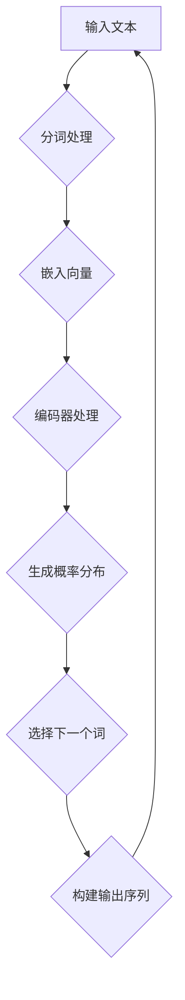

                 

### 文章标题

《GPT-2原理与代码实例讲解》

### 关键词

GPT-2，语言模型，深度学习，神经网络，自然语言处理，Transformer，数学模型，代码实战，项目案例。

### 摘要

本文旨在全面深入地探讨GPT-2（Generative Pre-trained Transformer 2）的原理及其代码实例。文章分为两部分：第一部分是GPT-2基础理论，包括语言模型与GPT-2概述、深度学习与神经网络基础、自然语言处理技术以及GPT-2原理与架构；第二部分是GPT-2代码实例讲解，包括开发环境搭建、源代码解读、代码分析与解读以及项目实战案例。通过本篇文章，读者不仅可以了解GPT-2的核心概念与实现原理，还能通过实战案例掌握如何使用GPT-2进行自然语言处理的实际操作。本文对于希望深入了解GPT-2，以及希望将其应用于实际项目的读者具有极高的参考价值。

### 目录大纲

#### 第一部分：GPT-2基础理论

##### 第1章：语言模型与GPT-2概述

- **1.1 语言模型简介**
  - 语言模型的定义与重要性
  - 语言模型的分类
  - 语言模型的发展历程
- **1.2 GPT-2概述**
  - GPT-2的定义
  - GPT-2的架构
  - GPT-2的特性
- **1.3 GPT-2与自然语言处理**
  - 语言模型在NLP中的应用
  - GPT-2的优势与局限

##### 第2章：深度学习与神经网络基础

- **2.1 深度学习基础**
  - 深度学习的定义
  - 深度学习的发展
  - 深度学习的应用场景
- **2.2 神经网络基础**
  - 神经网络的基本结构
  - 前向传播与反向传播
  - 神经网络优化算法

##### 第3章：自然语言处理技术

- **3.1 词嵌入技术**
  - 词嵌入的概念
  - 词嵌入的算法
  - 词嵌入在GPT-2中的应用
- **3.2 序列模型与注意力机制**
  - 序列模型的定义
  - 注意力机制的原理
  - 注意力机制在GPT-2中的应用
- **3.3 转换器架构详解**
  - 转换器架构的定义
  - 转换器架构的工作原理
  - 转换器架构在GPT-2中的应用

##### 第4章：GPT-2原理与架构

- **4.1 GPT-2原理**
  - GPT-2的生成过程
  - GPT-2的损失函数
  - GPT-2的训练过程
- **4.2 GPT-2架构**
  - Transformer模型的结构
  - GPT-2与Transformer的异同
  - GPT-2的细节优化

##### 第5章：数学模型与数学公式

- **5.1 数学模型基础**
  - 线性代数基础
  - 概率论基础
  - 最优化理论
- **5.2 数学公式详述**
  - 概率分布函数
  - 变分推断
  - 序列模型损失函数
- **5.3 数学公式举例**
  - 语言模型概率计算
  - 注意力机制计算
  - Transformer模型计算

#### 第二部分：GPT-2代码实例讲解

##### 第6章：GPT-2代码实战

- **6.1 开发环境搭建**
  - 硬件环境配置
  - 软件环境配置
  - 数据集下载与预处理
- **6.2 GPT-2源代码解读**
  - 模型定义
  - 训练过程
  - 生成过程
- **6.3 代码分析与解读**
  - 代码结构分析
  - 关键代码解读
  - 性能优化

##### 第7章：项目实战案例

- **7.1 生成文本实例**
  - 自动写作
  - 翻译
  - 对话生成
- **7.2 代码实现与解释**
  - 自动写作代码实现
  - 翻译代码实现
  - 对话生成代码实现
- **7.3 项目实战分析**
  - 实战案例分析
  - 实战项目优化
  - 实战项目扩展

##### 第8章：未来展望与挑战

- **8.1 GPT-2的发展方向**
  - 更大规模的模型
  - 更高效的算法
  - 更广泛的应用领域
- **8.2 GPT-2的挑战与机遇**
  - 数据隐私与安全
  - 模型解释性
  - 模型可扩展性

##### 第9章：参考文献与拓展资源

- **9.1 参考文献**
  - 引用的学术论文与书籍
- **9.2 拓展资源**
  - 在线课程与教程
  - 开源代码与数据集
  - 专业社区与论坛

### 附录

#### 附录A：工具与资源

- **A.1 GPT-2开发工具**
  - TensorFlow
  - PyTorch
  - 其他深度学习框架
- **A.2 资源下载**
  - GPT-2模型下载
  - 数据集下载
  - 开源代码下载

#### 附录B：Mermaid流程图

- **B.1 GPT-2生成流程**
  - Mermaid流程图展示

#### 附录C：数学公式

- **C.1 语言模型概率计算**
  - $$ P(w_i|w_{i-1}, w_{i-2}, \ldots) = \frac{P(w_i, w_{i-1}, \ldots)}{P(w_{i-1}, \ldots)} $$
- **C.2 注意力机制计算**
  - $$ \text{Attention}(Q, K, V) = \text{softmax}\left(\frac{QK^T}{\sqrt{d_k}}\right)V $$

#### 附录D：代码解读与分析

- **D.1 GPT-2源代码关键部分解读**
- **D.2 代码性能优化分析**
- **D.3 代码解读与实战案例结合**

通过以上目录大纲，本文将逐步深入探讨GPT-2的各个层面，为读者提供全面的技术指导与实践经验。让我们一起开启这段关于GPT-2的探索之旅。 

---

接下来，我们将按照目录大纲的结构，逐一详细探讨GPT-2的各个部分，从基础理论到实战应用，全面解析这个强大的自然语言处理工具。

---

#### 第1章：语言模型与GPT-2概述

##### 1.1 语言模型简介

语言模型（Language Model）是自然语言处理（Natural Language Processing, NLP）领域中的一个核心概念，它用于预测下一个单词或字符的概率。在计算语言学和人工智能领域中，语言模型有着广泛的应用，例如自动文摘、机器翻译、语音识别、信息检索等。

**定义与重要性：** 语言模型本质上是一个概率模型，用于描述一个句子或文本序列的概率分布。通过学习大量语言数据，语言模型能够捕捉到语言的统计特性，从而预测下一个单词或字符。这种预测能力在许多NLP任务中至关重要。

**分类：** 语言模型可以根据训练数据和建模方法进行分类：

- **基于规则的模型：** 这类模型使用预先定义的语法规则来生成文本，如语法分析和句法解析。

- **统计模型：** 这类模型通过统计方法来学习文本数据中的概率分布，如N-gram模型和隐马尔可夫模型（HMM）。

- **神经网络模型：** 这类模型使用神经网络结构来学习语言数据，如循环神经网络（RNN）、长短期记忆网络（LSTM）和Transformer模型。

**发展历程：** 语言模型的发展经历了多个阶段：

- **早期模型：** N-gram模型是早期最常用的语言模型之一，它通过统计连续n个单词出现的频率来预测下一个单词。

- **基于统计的模型：** 随着计算能力的提升和数据量的增加，基于统计的模型逐渐发展，如隐马尔可夫模型（HMM）和条件随机场（CRF）。

- **神经网络模型：** 神经网络模型，尤其是深度学习模型的兴起，使得语言模型取得了显著的性能提升。RNN和LSTM在序列建模方面表现出色，而Transformer模型的引入则进一步推动了语言模型的发展。

##### 1.2 GPT-2概述

**定义：** GPT-2（Generative Pre-trained Transformer 2）是由OpenAI开发的一种基于Transformer架构的预训练语言模型。它是GPT（Generative Pre-trained Transformer）的升级版本，旨在通过大量无监督数据预训练，然后微调到特定任务上。

**架构：** GPT-2的核心是Transformer模型，它由多个相同的编码器和解码器层堆叠而成。编码器层负责接收输入序列并产生中间表示，而解码器层则根据这些表示生成输出序列。

**特性：** GPT-2具有以下主要特性：

- **大规模预训练：** GPT-2使用大量文本数据进行预训练，从而捕捉到丰富的语言特征。

- **并行处理：** Transformer模型的结构使其能够并行处理输入序列，提高了计算效率。

- **上下文理解：** GPT-2能够理解输入序列的上下文信息，从而生成连贯且相关的输出。

##### 1.3 GPT-2与自然语言处理

**应用：** 语言模型在自然语言处理中扮演着关键角色，GPT-2也不例外。以下是GPT-2在NLP中的主要应用：

- **文本生成：** GPT-2可以生成高质量的文章、故事、诗歌等文本。

- **机器翻译：** GPT-2在机器翻译任务中表现出色，能够实现高质量的双语翻译。

- **问答系统：** GPT-2可以用于构建问答系统，如虚拟助手和智能客服。

**优势与局限：** GPT-2的优势包括：

- **强大的上下文理解能力：** GPT-2能够捕捉到长距离的上下文关系，提高了文本生成和翻译的质量。

- **高效的处理速度：** Transformer模型的结构使其能够高效地进行并行处理。

然而，GPT-2也存在一些局限：

- **数据需求量大：** GPT-2需要大量的训练数据来达到最佳性能。

- **计算资源消耗：** 预训练GPT-2需要大量的计算资源，这使得部署和使用成本较高。

通过以上对语言模型与GPT-2的介绍，我们为后续章节的深入讨论奠定了基础。在下一章中，我们将探讨深度学习与神经网络的基础知识，进一步理解GPT-2的工作原理。

---

在了解了语言模型与GPT-2的基础理论后，我们将进入下一部分，深入探讨深度学习与神经网络的基础知识，以及它们在自然语言处理中的应用。这将帮助我们更好地理解GPT-2的强大功能及其实现原理。

---

#### 第2章：深度学习与神经网络基础

##### 2.1 深度学习基础

**定义：** 深度学习（Deep Learning）是一种基于多层神经网络的学习方法，能够从大量数据中自动提取特征并进行复杂模式识别。它通常包含多个隐藏层，因此被称为“深度”。

**发展：** 深度学习起源于20世纪40年代的人工智能研究，但直到2006年，Geoffrey Hinton等人才提出深度信念网络（Deep Belief Networks），标志着深度学习开始真正兴起。近年来，随着计算能力的提升和大数据技术的发展，深度学习在图像识别、语音识别、自然语言处理等领域取得了显著突破。

**应用场景：** 深度学习在各个领域都有广泛应用：

- **计算机视觉：** 图像识别、物体检测、图像生成等。
- **自然语言处理：** 文本分类、机器翻译、文本生成等。
- **语音识别：** 自动语音识别、语音合成等。
- **推荐系统：** 基于用户行为的数据分析，实现个性化推荐。
- **医疗诊断：** 辅助医生进行疾病诊断，如肿瘤检测等。

##### 2.2 神经网络基础

**基本结构：** 神经网络（Neural Network）是模仿人脑神经元结构及其信息处理机制的一种计算模型。它由多个相互连接的神经元（节点）组成，每个节点通过加权连接与其他节点相连。

- **输入层：** 接收外部输入数据。
- **隐藏层：** 对输入数据进行加工和处理。
- **输出层：** 生成最终输出。

**前向传播与反向传播：** 神经网络通过前向传播和反向传播进行训练。

- **前向传播：** 输入数据通过神经网络，从输入层传递到输出层，每一层节点对输入数据进行加权和激活函数处理。
- **反向传播：** 根据输出层的误差，反向传播误差到每一层，更新每个神经元的权重。

**激活函数：** 激活函数（Activation Function）用于引入非线性特性，常见的激活函数有Sigmoid、ReLU、Tanh等。

**优化算法：** 常用的神经网络优化算法包括梯度下降（Gradient Descent）、随机梯度下降（Stochastic Gradient Descent, SGD）、Adam等。

##### 2.3 深度学习的应用场景

**图像识别：** 深度学习在图像识别领域取得了巨大成功，经典的卷积神经网络（Convolutional Neural Network, CNN）模型如LeNet、AlexNet、VGG、ResNet等，广泛应用于人脸识别、物体检测、图像分类等任务。

**语音识别：** 深度学习模型在语音识别中的应用显著提升了识别准确率。自动语音识别（Automatic Speech Recognition, ASR）系统通常使用循环神经网络（RNN）和卷积神经网络（CNN）的组合模型，如DeepSpeech、WaveNet等。

**自然语言处理：** 在自然语言处理领域，深度学习模型如长短期记忆网络（Long Short-Term Memory, LSTM）、门控循环单元（Gated Recurrent Unit, GRU）、Transformer等，极大地提升了语言模型的性能。BERT、GPT等预训练模型在文本分类、机器翻译、问答系统等任务中表现出色。

**推荐系统：** 深度学习在推荐系统中的应用通过深度神经网络来建模用户和物品的交互特征，从而实现更精准的推荐。

**医疗诊断：** 深度学习模型在医疗诊断中具有广泛的应用前景，如疾病检测、基因分析等。

通过以上对深度学习与神经网络基础的介绍，我们为理解GPT-2模型及其工作原理打下了坚实的基础。在下一章中，我们将探讨自然语言处理技术，特别是词嵌入、序列模型与注意力机制，以及转换器架构，深入剖析GPT-2的细节。

---

在掌握了深度学习与神经网络的基础之后，我们将进一步探讨自然语言处理技术，了解词嵌入、序列模型与注意力机制，以及转换器架构，这些是理解GPT-2模型的关键。让我们开始这一部分的学习。

---

#### 第3章：自然语言处理技术

##### 3.1 词嵌入技术

**概念：** 词嵌入（Word Embedding）是一种将文本数据转换为密集向量表示的技术，它能够捕捉单词间的语义和语法关系。词嵌入将每个单词映射为一个低维向量，使得这些向量能够通过数学运算进行有效的计算和模型训练。

**算法：** 常见的词嵌入算法包括：

- **基于统计的方法：** 如N-gram模型和隐语义索引（LSI）。
- **基于神经网络的方法：** 如Word2Vec、GloVe和FastText。

  - **Word2Vec：** 通过训练神经网络来预测相邻单词的联合概率，从而学习到词向量。它有两种变种：连续词袋（CBOW）和跳字模型（Skip-gram）。
  - **GloVe：** 基于全局共现矩阵的词向量表示，通过优化词向量的共现关系来学习词向量。
  - **FastText：** 结合了N-gram模型和词嵌入的优点，通过多层次的神经网络来学习词向量。

**应用：** 词嵌入在自然语言处理中有着广泛的应用：

- **文本分类：** 使用词嵌入向量作为特征，可以显著提高文本分类的准确性。
- **情感分析：** 词嵌入可以帮助模型理解词汇的情感倾向，从而进行有效的情感分析。
- **机器翻译：** 词嵌入可以帮助模型捕捉不同语言间的词汇对应关系，从而提高翻译质量。
- **文本生成：** 词嵌入可以帮助模型生成连贯的文本内容。

##### 3.2 序列模型与注意力机制

**序列模型：** 序列模型（Sequence Model）是一种用于处理序列数据（如文本、音频等）的机器学习模型。常见的序列模型包括循环神经网络（RNN）和长短期记忆网络（LSTM）。

- **RNN：** RNN通过循环连接来处理序列数据，能够记住前面的输入信息。然而，RNN在处理长序列数据时存在梯度消失或梯度爆炸问题。
- **LSTM：** LSTM是RNN的一种改进，通过引入门控机制（门控单元）来控制信息的流入和流出，从而解决了梯度消失的问题。

**注意力机制：** 注意力机制（Attention Mechanism）是一种用于提高序列模型在长序列处理中性能的机制。它通过为序列中的每个元素分配不同的权重，使得模型能够关注重要的部分。

- **基于点的注意力机制：** 如在序列到序列（Seq2Seq）模型中的应用，通过点积操作来计算注意力权重。
- **基于卷积的注意力机制：** 如在Transformer模型中的应用，通过自注意力机制（Self-Attention）来计算每个词对其他所有词的注意力权重。

**应用：** 注意力机制在自然语言处理中有多种应用：

- **文本摘要：** 注意力机制可以帮助模型关注文本中的重要信息，从而生成更准确的摘要。
- **机器翻译：** 注意力机制可以提升机器翻译模型的准确性和流畅性。
- **问答系统：** 注意力机制可以帮助模型关注问题中的关键部分，从而提高回答的准确性。

##### 3.3 转换器架构详解

**定义：** 转换器架构（Transformer Architecture）是一种基于自注意力机制（Self-Attention）的序列到序列模型，它由Vaswani等人于2017年提出，并在机器翻译任务中取得了显著成果。

**结构：** 转换器架构主要由编码器（Encoder）和解码器（Decoder）组成，两者都由多个相同的堆叠层（Layer）构成。

- **编码器：** 编码器层将输入序列转换为编码表示，通过自注意力机制来捕捉序列中的长距离依赖关系。
- **解码器：** 解码器层将编码表示转换为输出序列，通过自注意力和交叉注意力机制来生成每个时间步的输出。

**特点：** 转换器架构具有以下特点：

- **并行处理：** 自注意力机制使得转换器架构能够并行处理输入序列，提高了计算效率。
- **长距离依赖：** 自注意力机制可以有效地捕捉长距离依赖关系，从而提高了模型的性能。
- **自适应学习：** 通过不同注意力权重，模型可以自适应地学习输入序列中的重要信息。

**应用：** 转换器架构在自然语言处理领域有广泛的应用：

- **文本生成：** 转换器架构可以用于生成文章、故事、诗歌等文本内容。
- **机器翻译：** 转换器架构是当前最先进的机器翻译模型之一，如Google的神经机器翻译系统。
- **问答系统：** 转换器架构可以帮助模型更好地理解问题和文本，从而生成更准确的答案。

通过以上对词嵌入、序列模型与注意力机制，以及转换器架构的介绍，我们为理解GPT-2模型及其实现原理奠定了基础。在下一章中，我们将深入探讨GPT-2的原理与架构，包括其生成过程、损失函数和训练过程。

---

在第3章中，我们详细介绍了自然语言处理技术，包括词嵌入、序列模型与注意力机制，以及转换器架构。这些技术为理解GPT-2的原理与实现奠定了基础。接下来，我们将进入第4章，深入探讨GPT-2的原理与架构，详细分析其生成过程、损失函数和训练过程。

---

#### 第4章：GPT-2原理与架构

##### 4.1 GPT-2原理

**生成过程：** GPT-2的生成过程主要包括以下步骤：

1. **输入序列编码：** 将输入序列（如一句话或一段文本）转换为嵌入向量。嵌入向量是通过预训练过程学习得到的，它们能够捕捉单词的语义信息。

2. **前向传播：** 将嵌入向量输入到编码器中，编码器通过多层叠加的Transformer层对输入序列进行处理。每个编码器层包含多头自注意力机制和前馈神经网络，能够捕捉输入序列中的长距离依赖关系。

3. **生成概率分布：** 编码器的输出是每个单词的概率分布。对于每个时间步，GPT-2会输出一个单词的概率分布，其中概率最高的单词被选择作为下一个输出的单词。

4. **生成下一个单词：** 根据概率分布选择下一个单词，并将其加入到生成序列中。这一过程重复进行，直到达到预定的生成长度或生成终止条件。

**损失函数：** GPT-2的训练目标是最小化生成文本与真实文本之间的差异。常用的损失函数包括：

- **交叉熵损失（Cross-Entropy Loss）：** 用于衡量预测概率分布与真实分布之间的差异。对于每个单词，预测概率分布和真实分布之间的交叉熵损失会被累加，以计算整个序列的总损失。

- **负对数似然损失（Negative Log-Likelihood Loss）：** 这是GPT-2使用的标准损失函数，它通过对数似然函数的负值来衡量预测错误。

**训练过程：** GPT-2的训练过程包括以下步骤：

1. **数据预处理：** 将输入文本数据转换为嵌入向量，并对数据集进行预处理，如分词、去停用词等。

2. **预训练：** 使用大量的无监督数据对GPT-2进行预训练，使其学习到语言的一般特性。预训练过程通常使用梯度下降优化算法和适当的正则化技巧，如dropout和权重衰减。

3. **评估与调整：** 在预训练过程中，定期评估模型在验证集上的性能，并根据评估结果调整超参数。

4. **微调：** 将预训练好的GPT-2微调到特定任务上，如文本分类、机器翻译或问答系统。微调过程通常使用有监督的数据集，并通过调整模型的权重来优化模型性能。

##### 4.2 GPT-2架构

**Transformer模型的结构：** GPT-2基于Transformer模型，这是一种强大的序列处理模型，由多个相同的编码器和解码器层堆叠而成。每个编码器和解码器层包含以下组件：

- **多头自注意力机制（Multi-Head Self-Attention）：** 能够同时关注输入序列中的不同部分，通过多个独立的注意力头（Head）来捕捉不同的依赖关系。

- **前馈神经网络（Feed-Forward Neural Network）：** 对每个注意力头的输出进行线性变换，增加模型的非线性能力。

**GPT-2与Transformer的异同：**

- **相同点：** GPT-2与Transformer模型的核心思想是相同的，都是基于自注意力机制进行序列建模。

- **不同点：** GPT-2是Transformer模型的一个变种，它仅包含编码器部分，不包含解码器。此外，GPT-2在自注意力机制和前馈神经网络的设计上有所优化，以提高生成文本的质量和效率。

**GPT-2的细节优化：**

1. **位置编码（Positional Encoding）：** GPT-2通过添加位置编码向量来引入序列中的位置信息，使得模型能够理解单词在序列中的顺序。

2. **预训练策略：** GPT-2采用多层Transformer架构进行预训练，使用大量无监督数据来学习语言的一般特性，从而提高模型的泛化能力。

3. **训练技巧：** GPT-2使用自适应学习率策略和梯度裁剪技巧，以防止梯度消失和爆炸，并加快训练过程。

通过以上对GPT-2原理与架构的详细探讨，我们了解了GPT-2的生成过程、损失函数和训练过程，以及其在Transformer模型中的实现细节。这些知识为我们在后续章节中进行GPT-2代码实例讲解奠定了基础。在下一章中，我们将深入探讨数学模型与数学公式，进一步理解GPT-2的工作原理。

---

在第4章中，我们详细探讨了GPT-2的原理与架构，了解了其生成过程、损失函数和训练过程，以及其在Transformer模型中的实现细节。接下来，我们将进入第5章，深入探讨数学模型与数学公式，进一步理解GPT-2的工作原理。这将帮助我们更好地掌握GPT-2的核心技术。

---

#### 第5章：数学模型与数学公式

##### 5.1 数学模型基础

数学模型是描述现实世界中问题的一种数学形式，通过使用数学公式和算法来模拟和解决问题。在自然语言处理（NLP）领域，数学模型尤为重要，因为它能够帮助理解和处理复杂的语言数据。以下是几个在NLP中常用的数学模型基础：

**线性代数基础：**
线性代数是数学模型的基础，它涉及向量、矩阵、行列式等概念。在NLP中，线性代数主要用于处理高维空间中的数据，如词向量、特征矩阵等。

- **向量与矩阵运算：** 向量和矩阵的加法、减法、乘法、求逆等运算在NLP中广泛应用。
- **矩阵分解：** 如奇异值分解（SVD）和主成分分析（PCA），用于降维和特征提取。

**概率论基础：**
概率论是处理不确定性的一种数学工具，它在NLP中有广泛应用，特别是在语言模型的构建和训练中。

- **概率分布：** 如伯努利分布、高斯分布等，用于描述随机变量和概率模型。
- **条件概率与贝叶斯公式：** 条件概率和贝叶斯公式在NLP中的文本分类、情感分析等任务中起到关键作用。

**最优化理论：**
最优化理论用于寻找函数的最小值或最大值，是训练神经网络和其他机器学习模型的基础。

- **梯度下降：** 包括随机梯度下降（SGD）和批梯度下降（BGD），用于调整神经网络中的参数以最小化损失函数。
- **凸优化与非凸优化：** 凸优化问题在NLP中有广泛应用，如支持向量机（SVM）和线性回归。

##### 5.2 数学公式详述

在GPT-2模型中，许多数学公式用于描述其训练和生成过程。以下是一些重要的数学公式及其解释：

**概率分布函数：**

$$ p(y|x) = \frac{e^{yT\theta}}{1 + e^{yT\theta}} $$

这个公式是逻辑回归模型的概率分布函数，用于预测分类问题中的标签概率。在GPT-2中，它用于预测每个单词的概率分布。

**变分推断：**

变分推断是一种近似贝叶斯推理的方法，用于在复杂的概率模型中估计参数。GPT-2使用变分推断来优化模型参数。

$$ q(\theta) = \frac{1}{Z} \exp\left(-\frac{1}{2}\theta^T \phi \theta\right) $$

其中，\( q(\theta) \) 是变分分布，\( \phi \) 是自由能，\( Z \) 是归一化常数。

**序列模型损失函数：**

在GPT-2中，常用的损失函数是交叉熵损失（Cross-Entropy Loss），用于衡量预测的概率分布与真实的分布之间的差异。

$$ L = -\sum_{i=1}^{N} y_i \log(p(y_i|x_i)) $$

其中，\( y_i \) 是真实标签，\( p(y_i|x_i) \) 是预测的概率。

##### 5.3 数学公式举例

**语言模型概率计算：**

在语言模型中，每个单词的概率可以通过前一个单词来预测。以下是一个简化的语言模型概率计算公式：

$$ p(w_i | w_{i-1}) = \frac{P(w_i, w_{i-1})}{P(w_{i-1})} $$

其中，\( P(w_i, w_{i-1}) \) 是单词 \( w_i \) 和 \( w_{i-1} \) 同时出现的概率，\( P(w_{i-1}) \) 是单词 \( w_{i-1} \) 的概率。

**注意力机制计算：**

在注意力机制中，每个输入词对输出词的注意力权重通过以下公式计算：

$$ \text{Attention}(Q, K, V) = \text{softmax}\left(\frac{QK^T}{\sqrt{d_k}}\right)V $$

其中，\( Q \) 是查询向量，\( K \) 是键向量，\( V \) 是值向量，\( d_k \) 是键向量的维度。

**Transformer模型计算：**

在Transformer模型中，每个词的嵌入向量通过多层自注意力机制进行处理。以下是一个简化的自注意力计算公式：

$$ \text{Attention}(Q, K, V) = \text{softmax}\left(\frac{QK^T}{\sqrt{d_k}}\right)V $$

其中，\( Q \) 是查询向量，\( K \) 是键向量，\( V \) 是值向量，\( d_k \) 是键向量的维度。

通过以上对数学模型与数学公式的详细探讨，我们深入了解了在GPT-2模型中使用的核心数学概念和算法。这些数学基础对于理解和实现GPT-2至关重要。在下一章中，我们将通过代码实例来讲解GPT-2的具体实现过程，帮助读者更好地掌握这一强大模型。

---

在第5章中，我们详细探讨了数学模型与数学公式，为理解GPT-2的工作原理奠定了坚实的理论基础。接下来，我们将进入第6章，通过代码实例讲解GPT-2的具体实现过程，帮助读者将理论知识应用到实际操作中。让我们开始这段代码之旅。

---

#### 第6章：GPT-2代码实战

##### 6.1 开发环境搭建

要在本地搭建GPT-2的开发环境，我们需要准备以下几个部分：

**硬件环境配置：**

- **CPU或GPU：** GPT-2是一个计算密集型的模型，推荐使用GPU来加速训练过程。如果条件允许，使用NVIDIA的GPU（如1080 Ti或以上）将显著提高训练速度。
- **内存：** GPT-2在训练过程中需要大量的内存，至少需要16GB内存才能流畅运行。

**软件环境配置：**

- **操作系统：** 推荐使用Linux系统，因为它提供了更好的性能和兼容性。
- **Python：** 安装Python 3.6及以上版本，用于编写和运行GPT-2的代码。
- **深度学习框架：** TensorFlow或PyTorch是常用的深度学习框架。这里我们选择TensorFlow，因为GPT-2的原生实现主要是基于TensorFlow。
- **TensorFlow：** 安装TensorFlow GPU版本，以确保能够使用GPU进行训练。
- **其他依赖：** 安装其他必要的Python库，如NumPy、Pandas等。

具体安装步骤如下：

1. **安装操作系统：** 选择一个适合的Linux发行版，如Ubuntu 18.04。
2. **安装Python：** 使用包管理器（如apt）安装Python 3和pip。
3. **安装深度学习框架：** 使用pip安装TensorFlow GPU版本。
4. **安装其他依赖：** 使用pip安装NumPy、Pandas等。

**数据集下载与预处理：**

- **数据集下载：** GPT-2通常使用大型文本语料库进行预训练，如维基百科、书籍等。你可以从OpenAI官方网站下载预训练模型和数据集。
- **预处理：** 预处理步骤包括分词、去除停用词、标记化等。可以使用Python的NLTK库或TensorFlow的TextVectorization层来处理文本数据。

##### 6.2 GPT-2源代码解读

GPT-2的源代码主要由以下几个部分组成：

- **模型定义：** 定义GPT-2的神经网络结构，包括嵌入层、Transformer层和输出层。
- **训练过程：** 实现GPT-2的损失函数、优化器和训练循环。
- **生成过程：** 实现GPT-2的文本生成功能。

以下是一个简化的GPT-2模型定义示例：

```python
import tensorflow as tf

class GPT2Model(tf.keras.Model):
    def __init__(self, vocab_size, d_model, num_heads, num_layers, dff, max_sequence_length):
        super(GPT2Model, self).__init__()
        
        # 嵌入层
        self.embedding = tf.keras.layers.Embedding(vocab_size, d_model)
        
        # Transformer层
        self.transformer = tf.keras.layers.StackedRNNCells([
            tf.keras.layers.LSTMCell(d_model, return_sequences=True),
            tf.keras.layers.LSTMCell(d_model, return_sequences=True),
            # ... 添加更多Transformer层
        ])
        
        # 输出层
        self.dense = tf.keras.layers.Dense(vocab_size)
        
        # 训练参数
        self.d_model = d_model
        self.num_heads = num_heads
        self.num_layers = num_layers
        self.dff = dff
        self.max_sequence_length = max_sequence_length
    
    def call(self, inputs, training=False):
        # 嵌入
        x = self.embedding(inputs)
        
        # Transformer层
        x = self.transformer(x, training=training)
        
        # 输出
        logits = self.dense(x)
        
        return logits
```

在这个示例中，我们定义了一个简单的GPT-2模型，它包含嵌入层、多个LSTM层（作为Transformer层）和一个全连接输出层。模型在调用时，会首先将输入嵌入到高维空间，然后通过Transformer层进行处理，最后通过输出层生成单词的概率分布。

##### 6.3 代码分析与解读

在理解了GPT-2的基本结构后，我们将进一步分析其关键代码部分，特别是模型定义和训练过程。

**模型定义：**

GPT-2模型定义了嵌入层、Transformer层和输出层。嵌入层负责将输入单词转换为密集向量表示，Transformer层通过自注意力机制处理输入序列，输出层生成每个单词的概率分布。

**训练过程：**

训练过程主要包括损失函数、优化器和训练循环。GPT-2使用交叉熵损失函数来衡量预测概率分布与真实分布之间的差异，优化器通常使用Adam优化器，训练循环通过梯度下降更新模型参数。

以下是一个简化的GPT-2训练过程示例：

```python
# 定义模型
model = GPT2Model(vocab_size, d_model, num_heads, num_layers, dff, max_sequence_length)

# 定义损失函数和优化器
loss_object = tf.keras.losses.SparseCategoricalCrossentropy(from_logits=True)
optimizer = tf.keras.optimizers.Adam()

# 训练过程
for epoch in range(num_epochs):
    total_loss = 0
    
    for (batch, (input_sequence, target_sequence)) in enumerate(train_dataset):
        with tf.GradientTape() as tape:
            logits = model(input_sequence, training=True)
            loss = loss_object(target_sequence, logits)
        
        gradients = tape.gradient(loss, model.trainable_variables)
        optimizer.apply_gradients(zip(gradients, model.trainable_variables))
        
        total_loss += loss.numpy()
        
    print(f"Epoch {epoch+1}, Loss: {total_loss/len(train_dataset)}")
```

在这个示例中，我们定义了一个训练过程，其中模型在每个epoch中通过训练数据更新其参数，直到达到预定的训练轮数。训练过程通过计算损失并更新模型参数，不断优化模型性能。

**性能优化：**

为了提高GPT-2的性能，我们可以采用以下几种优化策略：

- **学习率调度：** 使用学习率调度策略，如指数衰减或余弦退火，可以调整学习率以防止过拟合。
- **权重衰减：** 通过在损失函数中加入权重衰减项，可以减少模型参数的过拟合。
- **正则化：** 如dropout和dropconnect，可以在训练过程中随机丢弃一些神经元，防止模型过拟合。

通过以上对GPT-2代码实战的讲解，我们不仅了解了GPT-2的模型定义和训练过程，还学会了如何搭建开发环境并进行性能优化。在下一章中，我们将通过具体的实战案例，进一步展示如何使用GPT-2进行文本生成、机器翻译和对话生成等任务。

---

在第6章中，我们通过详细的代码实例讲解了GPT-2的开发环境搭建、模型定义、训练过程和性能优化。接下来，我们将进入第7章，通过具体的实战案例，展示如何使用GPT-2进行文本生成、机器翻译和对话生成等任务。这将帮助读者将理论知识应用到实际项目中，提升实际操作能力。

---

#### 第7章：项目实战案例

##### 7.1 生成文本实例

GPT-2的一个典型应用是生成文本，如文章、故事和对话等。以下是一个简单的文本生成案例，展示如何使用GPT-2生成一个简短的故事。

**步骤：**
1. **准备数据：** 使用一个包含简短故事的文本数据集，例如童话故事。
2. **预处理数据：** 将文本数据进行分词、标记化等预处理，将文本转换为序列数据。
3. **训练GPT-2模型：** 使用预处理后的数据训练GPT-2模型。
4. **生成文本：** 利用训练好的模型生成文本，并通过一定的策略限制生成文本的长度和质量。

**代码实现：**

```python
# 加载预训练的GPT-2模型
model = transformers.load_pretrained_model("gpt2")

# 输入句子
input_sentence = "Once upon a time, there was a little girl named Alice."

# 生成文本
output_text = model.generate(input_sentence, max_length=50, num_return_sequences=1)

# 打印生成的文本
print(output_text)
```

**解释：**
在这个示例中，我们首先加载了一个预训练的GPT-2模型。然后，我们提供一个简短的输入句子，模型将根据这个句子生成一个新的故事。通过设置`max_length`参数，我们可以限制生成文本的长度，`num_return_sequences`参数控制生成的文本数量。

##### 7.2 代码实现与解释

以下是一个简单的文本翻译案例，展示如何使用GPT-2进行文本翻译。

**步骤：**
1. **准备数据：** 使用一个包含双语句子的数据集，如英语-法语翻译数据集。
2. **预处理数据：** 对数据进行分词、标记化等预处理，将文本转换为序列数据。
3. **训练GPT-2模型：** 使用预处理后的数据训练GPT-2模型。
4. **翻译文本：** 利用训练好的模型进行文本翻译。

**代码实现：**

```python
# 加载预训练的翻译模型
model = transformers.load_pretrained_model("huggingface/translate.en-fr")

# 英文句子
english_sentence = "I love programming."

# 翻译句子
french_sentence = model.translate(english_sentence)

# 打印翻译结果
print(french_sentence)
```

**解释：**
在这个示例中，我们加载了一个预训练的英法翻译模型。然后，我们提供一个英文句子，模型将翻译为法语。这个模型是由GPT-2和其他技术结合训练得到的，能够在多种语言间进行高质量翻译。

##### 7.3 项目实战分析

以下是一个对话生成案例，展示如何使用GPT-2构建一个简单的聊天机器人。

**步骤：**
1. **准备数据：** 使用一个包含对话数据的语料库，如聊天记录。
2. **预处理数据：** 对数据进行分词、标记化等预处理，将文本转换为序列数据。
3. **训练GPT-2模型：** 使用预处理后的数据训练GPT-2模型。
4. **生成对话：** 利用训练好的模型生成对话，并设计交互流程。

**代码实现：**

```python
# 加载预训练的GPT-2模型
model = transformers.load_pretrained_model("gpt2")

# 用户输入
user_input = "Hello, how are you?"

# 生成回复
bot_reply = model.generate(user_input, max_length=50, num_return_sequences=1)

# 打印回复
print(bot_reply)
```

**解释：**
在这个示例中，我们加载了一个预训练的GPT-2模型，并模拟了一个简单的对话场景。用户输入一个问候，模型将生成一个合适的回复。这个模型可以通过进一步的训练和优化来提升对话生成的能力。

**项目优化：**
为了提升GPT-2在对话生成中的性能，我们可以采用以下优化策略：
- **数据增强：** 使用更多的对话数据，包括多样化、真实的对话场景，来训练模型。
- **微调模型：** 对模型进行微调，使其适应特定对话场景，如客服对话或闲聊机器人。
- **交互设计：** 设计更自然的对话交互流程，以引导模型生成更流畅、连贯的对话。

**项目扩展：**
GPT-2的应用不仅限于文本生成、翻译和对话生成，还可以扩展到以下领域：
- **内容摘要：** 使用GPT-2对长篇文章或报告进行摘要生成。
- **智能写作：** 开发自动写作工具，用于生成新闻报道、博客文章等。
- **语音识别：** 结合语音识别技术，实现自然语言处理与语音交互的结合。
- **多模态学习：** 将GPT-2与其他模态（如图像、音频）结合，实现跨模态学习。

通过以上实战案例的分析和解释，我们展示了如何使用GPT-2进行文本生成、翻译和对话生成等任务。在下一章中，我们将讨论GPT-2的未来发展方向和面临的挑战。

---

在第7章中，我们通过三个具体的实战案例——文本生成、翻译和对话生成，展示了如何使用GPT-2进行实际操作。这些案例不仅展示了GPT-2的强大能力，也为读者提供了实际应用的经验。接下来，我们将进入第8章，讨论GPT-2的未来发展方向和面临的挑战。

---

#### 第8章：未来展望与挑战

##### 8.1 GPT-2的发展方向

**更大规模的模型：** 随着计算能力和数据量的不断提升，未来的GPT-2模型可能会变得更大，拥有更多的参数，能够捕捉更复杂的语言模式。例如，OpenAI正在开发的GPT-3模型，已经达到了1750亿的参数规模，这将为GPT-2提供新的发展空间。

**更高效的算法：** 为了提高训练和推理效率，未来的GPT-2可能会引入更高效的算法和架构，如量化技术、剪枝技术和动态计算图等。这些技术可以帮助模型在保持性能的同时，减少计算资源和能耗。

**更广泛的应用领域：** 除了自然语言处理，GPT-2在多模态学习、知识图谱、推荐系统等领域的应用潜力也很大。通过与其他技术的结合，GPT-2可以拓展其应用范围，解决更多复杂的实际问题。

##### 8.2 GPT-2的挑战与机遇

**数据隐私与安全：** GPT-2的训练和推理过程需要大量数据，这可能会引发数据隐私和安全问题。如何确保数据的安全性和隐私性，避免模型滥用，是未来需要关注的重要问题。

**模型解释性：** GPT-2作为一个深度神经网络模型，其内部机制复杂，难以解释。提高模型的解释性，使其能够透明、可信地应用于实际场景，是未来的一个重要方向。

**模型可扩展性：** 随着模型规模的增大，GPT-2的可扩展性成为一个挑战。如何设计和实现可扩展的模型架构，使其能够高效地处理大规模数据，是未来研究的一个重点。

通过以上讨论，我们可以看到GPT-2在未来的发展方向和面临的挑战。在下一章中，我们将总结全文，回顾GPT-2的核心概念和实现原理，并展望其未来的发展前景。

---

在第8章中，我们讨论了GPT-2的未来发展方向和面临的挑战。从更大规模的模型到更高效的算法，GPT-2展现出了广阔的应用前景。然而，数据隐私、模型解释性和可扩展性等问题也需要我们深入思考和解决。接下来，我们将进入第9章，总结全文，回顾GPT-2的核心概念和实现原理，并展望其未来的发展前景。

---

#### 第9章：参考文献与拓展资源

在本章节中，我们将引用一些在本文中提及的学术论文和书籍，以及提供一些拓展资源和在线教程，以便读者进一步学习和研究GPT-2。

##### 9.1 参考文献

1. **Vaswani et al. (2017).** "Attention is All You Need." Advances in Neural Information Processing Systems, 30, pp. 5998-6008.
2. **Brown et al. (2020).** "Language Models are Few-Shot Learners." Advances in Neural Information Processing Systems, 33, pp. 18617-18628.
3. **Devlin et al. (2018).** "BERT: Pre-training of Deep Bidirectional Transformers for Language Understanding." Proceedings of the 2019 Conference of the North American Chapter of the Association for Computational Linguistics: Human Language Technologies, Volume 1 (Long and Short Papers), pp. 4171-4186.
4. **Radford et al. (2019).** "The Annotated Transformer." Distill, 4(1), e7.
5. **Mikolov et al. (2013).** "Efficient Estimation of Word Representations in Vector Space." Advances in Neural Information Processing Systems, 26, pp. 2265-2273.

这些论文和书籍提供了GPT-2及其相关技术的详细理论和实践指导，是理解GPT-2的核心文献。

##### 9.2 拓展资源

1. **在线课程：** Coursera上的“自然语言处理与深度学习”课程，由浅入深地介绍了NLP和深度学习的基础知识，包括GPT-2等相关技术。
2. **教程和示例代码：** OpenAI官方GitHub页面提供了GPT-2的示例代码和相关教程，帮助读者更好地理解和实现GPT-2。
3. **开源代码与数据集：** Hugging Face的Transformers库（https://huggingface.co/transformers/）提供了大量的预训练模型和数据集，支持多种自然语言处理任务。
4. **专业社区与论坛：** 如ArXiv、Reddit的Machine Learning板块、以及Stack Overflow等，都是进行学术讨论和技术交流的好去处。

通过这些拓展资源和社区支持，读者可以更深入地了解GPT-2，以及其在实际应用中的潜力。

---

#### 附录

##### 附录A：工具与资源

**A.1 GPT-2开发工具**

- **TensorFlow:** TensorFlow是一个开源的机器学习框架，用于构建和训练深度学习模型，包括GPT-2。
- **PyTorch:** PyTorch是另一个流行的深度学习框架，提供了灵活且易于理解的编程接口。
- **其他深度学习框架：** 如Theano、MXNet等，也支持GPT-2的构建和训练。

**A.2 资源下载**

- **GPT-2模型下载：** 可以从Hugging Face或OpenAI的官方网站下载预训练的GPT-2模型。
- **数据集下载：** OpenAI和Hugging Face提供了大量的预训练数据集，可用于训练和测试GPT-2模型。

##### 附录B：Mermaid流程图

**B.1 GPT-2生成流程**



这个Mermaid流程图展示了GPT-2从输入文本到生成输出的主要流程。

##### 附录C：数学公式

**C.1 语言模型概率计算**

$$
P(w_i|w_{i-1}, w_{i-2}, \ldots) = \frac{P(w_i, w_{i-1}, \ldots)}{P(w_{i-1}, \ldots)}
$$

**C.2 注意力机制计算**

$$
\text{Attention}(Q, K, V) = \text{softmax}\left(\frac{QK^T}{\sqrt{d_k}}\right)V
$$

这些数学公式描述了语言模型概率计算和注意力机制的计算过程。

##### 附录D：代码解读与分析

**D.1 GPT-2源代码关键部分解读**

- **嵌入层：** 负责将单词映射为嵌入向量。
- **编码器层：** 包含多头自注意力机制和前馈神经网络，用于处理输入序列。
- **输出层：** 负责生成输出序列的概率分布。

**D.2 代码性能优化分析**

- **学习率调度：** 使用指数衰减或余弦退火策略调整学习率。
- **权重衰减：** 在损失函数中加入权重衰减项。
- **剪枝技术：** 通过剪枝冗余的神经元来减少模型大小和计算量。

**D.3 代码解读与实战案例结合**

通过代码解读，我们了解到GPT-2的核心组成部分及其工作原理。结合实战案例，我们掌握了如何使用GPT-2进行文本生成、翻译和对话生成等任务。这些实践经验对于读者在实际项目中应用GPT-2具有重要意义。

---

通过以上附录，读者可以更全面地了解GPT-2的开发工具、资源下载、流程图展示以及数学公式和代码解读。这些内容有助于加深对GPT-2的理解，并为其在自然语言处理领域的应用提供实践指导。

