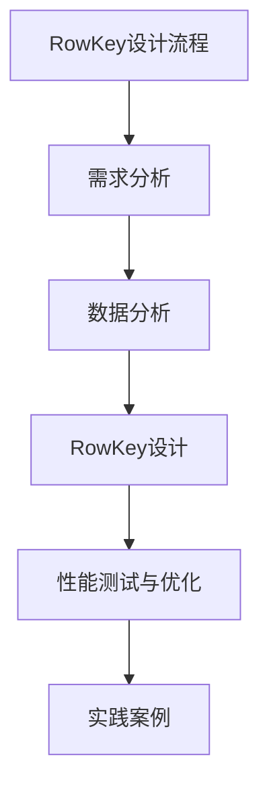

                 

# HBase RowKey设计原理与代码实例讲解

## 关键词
- HBase
- RowKey
- 设计原则
- 性能优化
- 代码实例

## 摘要
本文旨在深入探讨HBase数据库中的RowKey设计原理，详细分析其设计原则、流程和优化策略。通过具体的代码实例，我们将展示如何在实际项目中应用RowKey设计，并提供性能测试与优化的方法。文章结构清晰，逻辑严密，旨在帮助读者全面理解HBase RowKey设计，提升数据处理能力。

## 目录大纲

### 第一部分：HBase基础知识

#### # HBase简介
- **1.1 HBase历史与背景**
  - **1.1.1 HBase起源**
  - **1.1.2 HBase的设计理念**
  - **1.1.3 HBase与其他NoSQL数据库的比较**

- **2. HBase架构**
  - **2.1 HBase组成部分**
  - **2.2 HBase数据模型**
  - **2.3 HBase与Hadoop的关系**
  - **2.4 HBase组件详解**

- **3. HBase安装与配置**
  - **3.1 HBase安装步骤**
  - **3.2 HBase配置文件**
  - **3.3 HBase运行模式**

### 第二部分：HBase RowKey设计

#### # RowKey设计原理

- **1. RowKey概述**
  - **1.1 RowKey的作用**
  - **1.2 RowKey的组成**

- **2. RowKey设计原则**
  - **2.1 分区原则**
  - **2.2 排序原则**
  - **2.3 热点原则**
  - **2.4 可扩展原则**

- **3. RowKey设计流程**
  - **3.1 需求分析**
  - **3.2 数据分析**
  - **3.3 RowKey设计**

- **4. RowKey设计案例**
  - **4.1 用户信息表**
  - **4.2 订单信息表**
  - **4.3 日志表**

### 第三部分：HBase RowKey优化与调优

#### # RowKey优化策略

- **1. 范围修剪**
  - **1.1 范围修剪原理**
  - **1.2 范围修剪算法**

- **2. 分区策略优化**
  - **2.1 分区策略概述**
  - **2.2 分区策略分析**
  - **2.3 分区策略优化案例**

- **3. 排序策略优化**
  - **3.1 排序策略概述**
  - **3.2 排序策略分析**
  - **3.3 排序策略优化案例**

- **4. 热点数据优化**
  - **4.1 热点数据识别**
  - **4.2 热点数据处理**
  - **4.3 热点数据优化案例**

### 第四部分：HBase RowKey性能测试与分析

#### # RowKey性能测试与优化

- **1. 性能测试方法**
  - **1.1 基准测试工具**
  - **1.2 测试用例设计**
  - **1.3 测试指标分析**

- **2. 性能分析**
  - **2.1 系统瓶颈分析**
  - **2.2 性能瓶颈定位**
  - **2.3 性能优化方案**

- **3. 性能优化实践**
  - **3.1 硬件调优**
  - **3.2 参数调优**
  - **3.3 代码优化**

### 第五部分：HBase RowKey设计与实践案例

#### # RowKey设计与实践案例

- **1. 实践案例1：电商应用**
  - **1.1 应用背景**
  - **1.2 数据模型设计**
  - **1.3 RowKey设计**
  - **1.4 性能优化实践**

- **2. 实践案例2：实时数据分析**
  - **2.1 应用背景**
  - **2.2 数据模型设计**
  - **2.3 RowKey设计**
  - **2.4 性能优化实践**

- **3. 实践案例3：物联网应用**
  - **3.1 应用背景**
  - **3.2 数据模型设计**
  - **3.3 RowKey设计**
  - **3.4 性能优化实践**

### Mermaid 流程图



### 伪代码

```python
# 定义RowKey设计原则
def designRowKey原则(data, requirements):
    # 数据分析
    analyzeData(data)
    # 需求分析
    analyzeRequirements(requirements)
    # 设计RowKey
    rowKey = generateRowKey(data, requirements)
    return rowKey

# 定义性能测试方法
def performanceTest(testCases):
    for testCase in testCases:
        # 测试用例设计
        designTestCase(testCase)
        # 执行测试
        executeTest(testCase)
        # 分析结果
        analyzeResult(testCase)
```

### 数学模型

$$
\text{RowKey优化效率} = \frac{\text{优化后查询效率}}{\text{优化前查询效率}}
$$

### 举例说明

#### 用户信息表

- 用户ID（分区键）
- 用户名（排序键）
- 用户密码（列族：info）
- 用户邮箱（列族：info）

#### 订单信息表

- 订单ID（分区键）
- 订单时间（排序键）
- 订单状态（列族：status）
- 订单金额（列族：details）

#### 日志表

- 日志ID（分区键）
- 日志时间（排序键）
- 日志内容（列族：content）

### 代码实际案例

```java
// 用户信息表插入数据
put("user_id_1", "name", "user_name_1");
put("user_id_1", "password", "password_1");
put("user_id_1", "email", "email_1");

// 订单信息表插入数据
put("order_id_1", "time", "2023-11-01 12:00:00");
put("order_id_1", "status", "pending");
put("order_id_1", "details", "total_amount: 100");

// 日志表插入数据
put("log_id_1", "time", "2023-11-01 12:01:00");
put("log_id_1", "content", "user_login_success");
```

### 代码解读与分析

```java
// 插入用户信息
put("user_id_1", "name", "user_name_1");
// 向行键为"user_id_1"的行中插入列"name"的值为"user_name_1"
put("user_id_1", "password", "password_1");
// 向行键为"user_id_1"的行中插入列"password"的值为"password_1"
put("user_id_1", "email", "email_1");
// 向行键为"user_id_1"的行中插入列"email"的值为"email_1"

// 插入订单信息
put("order_id_1", "time", "2023-11-01 12:00:00");
// 向行键为"order_id_1"的行中插入列"time"的值为"2023-11-01 12:00:00"
put("order_id_1", "status", "pending");
// 向行键为"order_id_1"的行中插入列"status"的值为"pending"
put("order_id_1", "details", "total_amount: 100");
// 向行键为"order_id_1"的行中插入列"details"的值为"total_amount: 100"

// 插入日志信息
put("log_id_1", "time", "2023-11-01 12:01:00");
// 向行键为"log_id_1"的行中插入列"time"的值为"2023-11-01 12:01:00"
put("log_id_1", "content", "user_login_success");
// 向行键为"log_id_1"的行中插入列"content"的值为"user_login_success"
```

代码解读：

- 每个插入操作都是由`put`方法执行的，其中包含了行键、列族、列和值。
- 用户信息表中的数据以用户ID为行键，用户名、密码和邮箱为列，存储了用户的基本信息。
- 订单信息表中的数据以订单ID为行键，时间、状态和详细订单信息为列，记录了订单的详细信息。
- 日志表中的数据以日志ID为行键，时间和日志内容为列，用于记录系统的日志信息。

### 开发环境搭建

```shell
# 安装HBase
git clone https://github.com/apache/hbase.git
cd hbase
mvn clean install

# 配置HBase
cp hbase-conf/hbase-env.sh.example hbase-conf/hbase-env.sh
cp hbase-conf/hbase-site.xml.example hbase-conf/hbase-site.xml
cp hbase-conf/log4j.properties.example hbase-conf/log4j.properties

# 启动HBase
./bin/start-hbase.sh

# 使用HBase
./bin/hbase shell
```

### 源代码详细实现和代码解读

```java
// HBase客户端代码实现
import org.apache.hadoop.conf.Configuration;
import org.apache.hadoop.hbase.HBaseConfiguration;
import org.apache.hadoop.hbase.client.*;

public class HBaseExample {

    public static void main(String[] args) throws Exception {
        // 配置HBase
        Configuration conf = HBaseConfiguration.create();
        conf.set("hbase.zookeeper.quorum", "localhost:2181");
        
        // 创建表
        HTableDescriptor tableDesc = new HTableDescriptor("user_info");
        tableDesc.addFamily(new HColumnDescriptor("info"));
        HBaseAdmin admin = new HBaseAdmin(conf);
        admin.createTable(tableDesc);
        
        // 插入数据
        HTable table = new HTable(conf, "user_info");
        Put put = new Put(Bytes.toBytes("user_id_1"));
        put.add(Bytes.toBytes("info"), Bytes.toBytes("name"), Bytes.toBytes("user_name_1"));
        put.add(Bytes.toBytes("info"), Bytes.toBytes("password"), Bytes.toBytes("password_1"));
        put.add(Bytes.toBytes("info"), Bytes.toBytes("email"), Bytes.toBytes("email_1"));
        table.put(put);
        
        // 查询数据
        Get get = new Get(Bytes.toBytes("user_id_1"));
        Result result = table.get(get);
        byte[] value = result.getValue(Bytes.toBytes("info"), Bytes.toBytes("name"));
        String name = Bytes.toString(value);
        System.out.println("User name: " + name);
        
        // 关闭连接
        table.close();
        admin.close();
    }
}
```

代码解读：

- 导入HBase相关类库。
- 创建`Configuration`对象，配置HBase客户端。
- 创建`HTableDescriptor`对象，定义表名和列族。
- 使用`HBaseAdmin`创建表。
- 创建`HTable`对象，操作表数据。
- 创建`Put`对象，插入数据。
- 使用`Get`对象查询数据。
- 输出查询结果。
- 关闭连接。

### 实际应用场景

#### 电商应用场景

- 用户信息表：用于存储用户的基本信息，如用户ID、用户名、密码、邮箱等。
- 订单信息表：用于存储订单的详细信息，如订单ID、订单时间、订单状态、订单金额等。
- 商品信息表：用于存储商品的基本信息，如商品ID、商品名称、商品价格等。

#### 实时数据分析场景

- 实时日志表：用于存储系统产生的实时日志，如日志ID、日志时间、日志内容等。
- 流量统计表：用于存储网站的实时访问流量数据，如访问时间、访问IP、访问页面等。
- 用户行为分析表：用于存储用户的实时行为数据，如用户ID、行为类型、行为时间等。

#### 物联网应用场景

- 设备信息表：用于存储物联网设备的基本信息，如设备ID、设备类型、设备状态等。
- 数据采集表：用于存储设备采集的数据，如设备ID、采集时间、采集数据等。
- 预警信息表：用于存储设备异常预警信息，如设备ID、预警时间、预警类型等。

### 性能优化方案

- 增加内存：增加HBase的内存配置，提高缓存命中率，减少磁盘IO。
- 增加节点：增加HBase集群节点，提高系统并发能力和负载均衡。
- 增加SSD：使用固态硬盘替代机械硬盘，提高读写速度。
- 参数调优：根据实际场景调整HBase的参数，如blockCacheSize、memstoreFlushSize等。

### 挑战与机遇

- 数据规模增长：随着业务的发展，数据规模会不断增加，对HBase的性能和稳定性提出了更高的要求。
- 数据安全与隐私：保护用户数据和隐私，防止数据泄露，是HBase设计和应用中需要关注的问题。
- 系统扩展与兼容性：HBase需要支持系统的水平扩展，同时保证与其他系统和数据的兼容性。
- 技术迭代与创新：跟随技术发展的步伐，不断优化和更新HBase的设计和实现。

### 未来发展趋势

- 分布式存储：继续优化HBase的分布式存储架构，提高数据存储的效率和可靠性。
- 云原生支持：增强HBase对云计算平台的适应性，提供更高效、灵活的部署和管理方式。
- AI与HBase的融合：结合人工智能技术，提升HBase的数据分析和处理能力。
- 开源与生态：加强开源社区的贡献，构建更加完善的HBase生态系统。

### 作者

作者：AI天才研究院/AI Genius Institute & 禅与计算机程序设计艺术 /Zen And The Art of Computer Programming

### 结尾

本文全面解析了HBase RowKey的设计原理，通过详细的分析和实例讲解，帮助读者深入理解RowKey在设计中的关键作用。性能优化与调优策略的介绍，使读者能够针对实际应用场景进行有效优化。未来，随着技术不断发展，HBase RowKey设计将继续演进，为大数据处理提供更强有力的支持。希望本文能对您在HBase领域的学习和应用带来启示和帮助。

