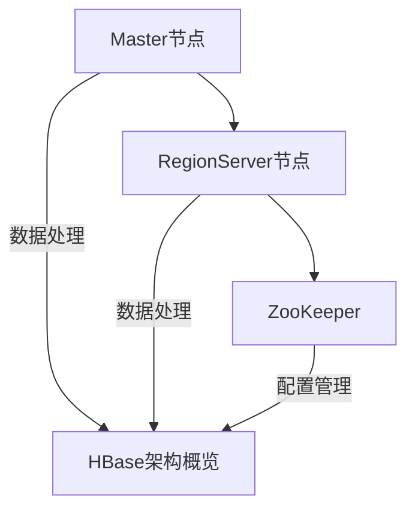
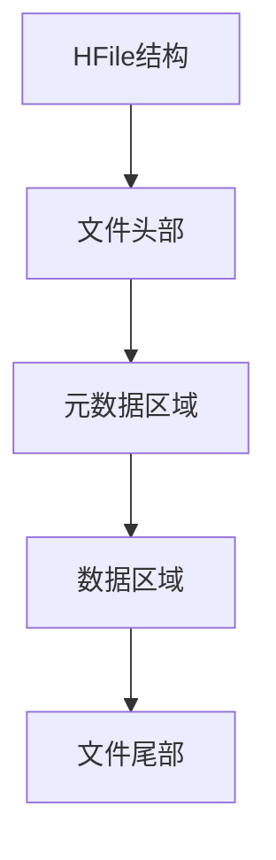
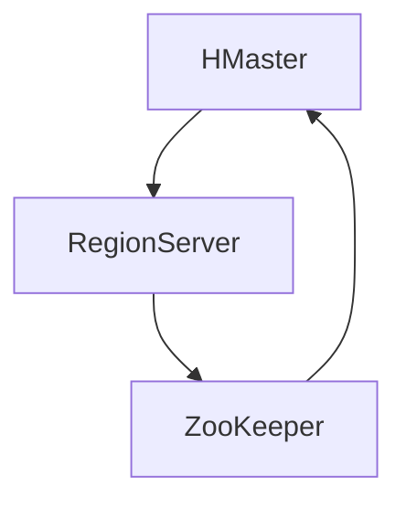

                 

# HBase分布式列式数据库原理与代码实例讲解

## 关键词

- HBase
- 分布式数据库
- 列式存储
- Region
- Master节点
- ZooKeeper
- 数据分片
- 负载均衡
- 数据压缩
- 数据访问优化
- 安全与权限管理
- 监控与运维

## 摘要

HBase是一个分布式、可扩展、面向列的存储系统，是Apache Hadoop生态系统中的重要组成部分。本文将从HBase的起源和发展、核心概念、架构、存储机制、性能优化、分布式机制、安全与权限管理、实战案例、大数据生态系统整合以及高级应用等方面进行深入讲解。通过本文，读者可以全面了解HBase的工作原理和实际应用，掌握HBase的开发和运维技巧，为日后的技术研究和项目实践奠定基础。

### 目录大纲：《HBase分布式列式数据库原理与代码实例讲解》

#### 第一部分：HBase基础

##### 第1章：HBase概述
- 1.1 HBase的起源与发展历程
- 1.2 HBase的核心概念
  - 行列式存储
  - 分区与Region
  - 列族与压缩
- 1.3 HBase与Hadoop生态系统

##### 第2章：HBase的架构
- 2.1 HBase架构概览
  - Master节点
  - RegionServer节点
  - ZooKeeper
- 2.2 HBase的数据模型
  - 表结构与数据类型
  - 时间戳与版本
- 2.3 HBase的读写流程

#### 第二部分：HBase核心原理

##### 第3章：HBase存储机制
- 3.1 HFile文件格式
  - 数据块与索引
  - 数据压缩技术
- 3.2 MemStore与Flush过程
- 3.3 StoreFile与BloomFilter

##### 第4章：HBase性能优化
- 4.1 数据分区策略
- 4.2 数据存储优化
  - 列族配置
  - 数据压缩
- 4.3 数据访问优化
  - 缓存机制
  - 数据倾斜处理

##### 第5章：HBase分布式机制
- 5.1 数据分片与负载均衡
- 5.2 HMaster与RegionServer的交互
- 5.3 ZooKeeper在HBase中的作用

##### 第6章：HBase安全与权限管理
- 6.1 HBase的安全模型
- 6.2 访问控制
  - ACL权限
  - 角色
- 6.3 数据加密

#### 第三部分：HBase实战

##### 第7章：HBase开发环境搭建
- 7.1 HBase环境配置
- 7.2 HBase基本操作
  - 表的创建、删除、修改
  - 数据插入、查询、更新、删除
- 7.3 HBase API使用

##### 第8章：HBase应用案例
- 8.1 日志处理系统
  - 实现步骤
  - 源代码解析
- 8.2 实时数据分析平台
  - 架构设计
  - 数据处理流程

##### 第9章：HBase与大数据生态系统整合
- 9.1 HBase与Hadoop的整合
- 9.2 HBase与Spark集成
  - 数据处理与计算
- 9.3 HBase与Hive联动

#### 第四部分：HBase高级应用

##### 第10章：HBase监控与运维
- 10.1 HBase监控工具
- 10.2 日志分析与故障排查
- 10.3 数据迁移与备份

##### 第11章：HBase集群管理
- 11.1 集群搭建与配置
- 11.2 集群扩容与缩容
- 11.3 集群故障处理

##### 第12章：HBase未来发展趋势
- 12.1 新特性与优化
- 12.2 与其他数据库的对比与融合
- 12.3 在不同行业的应用场景

### 附录

## 附录A：HBase开发工具与资源
- A.1 开发工具介绍
  - HBase Shell
  - Phoenix
  - Ranger
- A.2 实用教程与资料链接
- A.3 社区与论坛资源

## Mermaid 流程图



### HBase基础

#### 第1章：HBase概述

##### 1.1 HBase的起源与发展历程

HBase起源于Google的BigTable论文。BigTable是一种分布式存储系统，用于处理海量结构化数据。论文提出了使用Google File System（GFS）作为底层存储，并通过表、行、列来组织数据，支持数据的自动分片和负载均衡。HBase是Hadoop生态系统中的一个分布式、可扩展、面向列的存储系统，它借鉴了BigTable的设计理念，并整合到了Hadoop生态系统中。

HBase的发展历程可以分为以下几个阶段：

1. **2006年**：HBase诞生于谷歌的BigTable论文。
2. **2007年**：HBase成为Apache软件基金会的一个孵化项目。
3. **2009年**：HBase成为Apache软件基金会的一个顶级项目。
4. **至今**：HBase不断迭代更新，支持更多的功能，并在各种大型互联网公司和开源社区中广泛应用。

##### 1.2 HBase的核心概念

HBase具有以下核心概念：

- **行列式存储**：HBase是一种面向列的存储系统，将数据按行和列存储在表中，这种结构非常适合处理大量的稀疏数据。
- **分区与Region**：HBase将表的数据分片为多个Region，每个Region包含一定范围的行键。这种分区策略使得HBase能够水平扩展，并提高查询性能。
- **列族与压缩**：HBase中的列被组织为列族，每个列族可以独立配置压缩算法，从而提高存储效率和查询性能。
- **时间戳与版本**：HBase使用时间戳来表示数据的版本，支持多版本数据访问，便于实现数据的回溯和冲突解决。

##### 1.3 HBase与Hadoop生态系统

HBase是Hadoop生态系统中的重要组成部分，与Hadoop的其他组件紧密集成：

- **Hadoop**：HBase依赖于Hadoop的分布式文件系统（HDFS）作为底层存储，利用HDFS的分布式文件存储能力和容错机制。
- **ZooKeeper**：HBase使用ZooKeeper进行分布式协调，负责维护HBase集群的元数据、状态信息和分布式锁等。
- **MapReduce**：HBase支持通过MapReduce程序进行大规模数据处理，实现数据的批量处理和计算。

HBase与Hadoop生态系统的整合使得它能够充分利用大数据处理的能力，并在各种大规模数据应用场景中发挥重要作用。

#### 第2章：HBase的架构

##### 2.1 HBase架构概览

HBase的架构主要包括三个核心组件：Master节点、RegionServer节点和ZooKeeper。

- **Master节点**：Master节点是HBase集群的主节点，负责管理整个集群的元数据和生命周期管理。Master节点的职责包括：
  - 管理Region分配和迁移。
  - 监控集群健康状态。
  - 管理集群配置和版本升级。
  - 维护集群负载均衡。

- **RegionServer节点**：RegionServer节点是HBase集群的工作节点，负责存储和管理数据。每个RegionServer节点包含多个Region，每个Region由一个RegionServer实例负责。RegionServer节点的职责包括：
  - 存储和检索数据。
  - 处理客户端的读写请求。
  - 负责Region的拆分和合并。

- **ZooKeeper**：ZooKeeper是一个分布式协调服务，负责维护HBase集群的状态信息和分布式锁。ZooKeeper的职责包括：
  - 维护集群的元数据。
  - 实现分布式锁和选举机制。
  - 提供监控和状态报告。

##### 2.2 HBase的数据模型

HBase的数据模型主要包括表、行、列和单元格。

- **表**：表是HBase中的逻辑容器，用于存储数据。每个表由一个唯一的名称标识。表可以定义多个列族，列族用于组织数据。
- **行**：行是HBase中的数据记录的标识符，每个行具有一个唯一的行键。行键可以是任意的字节数组。
- **列**：列是HBase中的数据字段，每个列具有一个唯一的列限定符。列按照列族进行组织。
- **单元格**：单元格是HBase中的数据存储单元，包含一个行键、一个列和一个时间戳。

HBase的数据模型支持多维数据存储，每个单元格可以存储多版本的数据，便于实现数据的版本控制和冲突解决。

##### 2.3 HBase的读写流程

HBase的读写流程如下：

1. **写流程**：
   - 客户端发送Put请求，包含行键、列、值和时间戳。
   - RegionServer节点根据行键定位到相应的Region和Store。
   - Store中的MemStore将Put请求的数据存储到内存中。
   - 当MemStore的大小达到一定阈值时，触发Flush操作，将内存中的数据写入磁盘，生成一个新的StoreFile。
   - 数据持久化到磁盘后，更新HFile的索引和BloomFilter。
   - Master节点更新元数据信息。

2. **读流程**：
   - 客户端发送Get请求，包含行键、列和版本信息。
   - RegionServer节点根据行键定位到相应的Region和Store。
   - 从MemStore和StoreFile中依次查找数据，匹配列和版本信息。
   - 将匹配到的数据返回给客户端。

HBase的读写流程设计为基于内存的缓存机制，通过MemStore和StoreFile的分层结构，提高数据的读写性能。

### HBase核心原理

#### 第3章：HBase存储机制

##### 3.1 HFile文件格式

HFile是HBase中的数据存储格式，用于存储和检索数据。HFile文件格式具有以下特点：

- **数据块与索引**：HFile将数据分为多个数据块，每个数据块包含一定数量的键值对。HFile的索引存储在文件头部，包含数据块的起始键和偏移量。
- **数据压缩技术**：HFile支持多种数据压缩算法，如Gzip、LZO和Snappy等。压缩技术可以提高存储效率和读取性能。

HFile文件格式的基本结构如下：



##### 3.2 MemStore与Flush过程

MemStore是HBase中的内存缓存区域，用于存储新写入的数据。MemStore具有以下特点：

- **内存缓存**：MemStore将新写入的数据存储在内存中，提高数据的写入速度。
- **并发访问**：多个客户端可以同时写入数据到MemStore，提高系统的并发性能。

当MemStore的大小达到一定阈值时，会触发Flush操作，将MemStore中的数据写入磁盘，生成一个新的StoreFile。Flush过程的步骤如下：

1. 将MemStore中的数据按照行键排序，生成一个新的HFile。
2. 将新HFile添加到Store中，更新HFile的索引和BloomFilter。
3. 清空MemStore，释放内存空间。

##### 3.3 StoreFile与BloomFilter

StoreFile是HBase中的磁盘数据存储文件，包含多个数据块和索引。StoreFile具有以下特点：

- **磁盘存储**：StoreFile将数据存储在磁盘上，提供持久化的存储能力。
- **并发访问**：多个StoreFile可以同时被查询，提高系统的查询性能。

BloomFilter是一种用于快速数据查询的算法，用于判断一个元素是否存在于集合中。在HBase中，BloomFilter用于StoreFile的快速查询，可以减少不必要的磁盘访问，提高查询性能。BloomFilter的基本原理如下：

- **创建BloomFilter**：在创建StoreFile时，计算数据中所有元素的哈希值，并存储在BloomFilter中。
- **查询BloomFilter**：在查询数据时，计算查询元素的哈希值，并与BloomFilter中的哈希值进行比对，判断数据是否存在。

通过使用BloomFilter，HBase可以在不访问磁盘的情况下快速判断数据是否存在，提高查询性能。

#### 第4章：HBase性能优化

##### 4.1 数据分区策略

数据分区策略是HBase性能优化的关键因素之一。通过合理的数据分区，可以提高查询性能和系统负载均衡。

HBase采用Region作为数据分片的基本单位，每个Region包含一定范围的行键。在数据分区策略中，可以根据以下原则进行分区：

- **根据访问模式**：根据数据的访问模式进行分区，将高频访问的数据放在同一Region中，提高查询性能。
- **根据数据大小**：根据数据的大小进行分区，将大数据量的Region拆分为多个小Region，提高系统负载均衡和查询性能。

##### 4.2 数据存储优化

数据存储优化是提高HBase性能的重要手段。通过以下策略可以优化数据存储：

- **列族配置**：合理配置列族，将相关的列放在同一列族中，减少数据访问的开销。
- **数据压缩**：使用适合的数据压缩算法，降低数据存储空间，提高系统性能。

在HBase中，常用的数据压缩算法包括：

- **Gzip**：使用Gzip压缩算法，压缩效果较好，但压缩和解压缩速度较慢。
- **LZO**：使用LZO压缩算法，压缩效果和压缩速度较好，适用于大数据场景。
- **Snappy**：使用Snappy压缩算法，压缩速度较快，但压缩效果较差。

##### 4.3 数据访问优化

数据访问优化是提高HBase性能的关键。通过以下策略可以优化数据访问：

- **缓存机制**：使用缓存机制，减少磁盘访问次数，提高查询性能。HBase提供内置的缓存机制，包括块缓存和MemStore缓存。
- **数据倾斜处理**：处理数据倾斜问题，避免某个Region的数据量过大，影响系统性能。可以通过调整数据分区策略和列族配置来优化数据倾斜。

#### 第5章：HBase分布式机制

##### 5.1 数据分片与负载均衡

数据分片与负载均衡是HBase分布式机制的核心。HBase采用Region作为数据分片的基本单位，每个Region由一个或多个RegionServer实例负责。在数据分片与负载均衡中，需要考虑以下因素：

- **数据分片策略**：根据数据访问模式和系统负载，选择合适的分片策略。例如，根据访问频率进行分片，将高频访问的数据放在同一Region中。
- **负载均衡策略**：通过负载均衡策略，将数据均匀分布到各个RegionServer实例中，避免某个RegionServer过载。HBase采用区域迁移（Region Movement）和负载均衡（Load Balancing）策略实现负载均衡。

数据分片与负载均衡的伪代码如下：

```python
def split_region(region):
    if region.size > MAX_REGION_SIZE:
        mid_key = get_middle_key(region)
        left_region = new Region(region.start_key, mid_key)
        right_region = new Region(mid_key, region.end_key)
        add_region(left_region)
        add_region(right_region)
        remove_region(region)
        return left_region, right_region
    else:
        return region

def balance_load():
    regions = get_all_regions()
    for region in regions:
        if region.load > MAX_LOAD:
            target_region = find_target_region(region)
            move_region(region, target_region)
```

##### 5.2 HMaster与RegionServer的交互

HMaster与RegionServer之间的交互是HBase分布式机制的重要组成部分。HMaster作为HBase集群的主节点，负责管理RegionServer的生命周期、负载均衡和数据迁移等任务。RegionServer作为HBase集群的工作节点，负责存储和管理数据。

HMaster与RegionServer的交互流程如下：

1. **启动RegionServer**：
   - HMaster向ZooKeeper注册RegionServer实例。
   - RegionServer向HMaster发送心跳信号，汇报自身状态。

2. **管理RegionServer**：
   - HMaster监控RegionServer的状态，根据负载情况调整Region分配。
   - HMaster负责处理RegionServer的故障转移和恢复。

3. **数据迁移**：
   - 当系统负载不均衡时，HMaster负责将Region从一个RegionServer迁移到另一个RegionServer。
   - 数据迁移过程中，保持数据的完整性和一致性。

##### 5.3 ZooKeeper在HBase中的作用

ZooKeeper是HBase分布式协调服务的重要组成部分。它负责维护HBase集群的状态信息、分布式锁和元数据等。ZooKeeper在HBase中的作用如下：

1. **集群元数据管理**：
   - ZooKeeper存储HBase集群的元数据，包括表结构、Region分配和集群状态等。
   - 通过ZooKeeper，HMaster和RegionServer可以实时获取集群元数据信息。

2. **分布式锁管理**：
   - ZooKeeper提供分布式锁机制，用于处理并发访问和数据一致性。
   - 在HBase中，ZooKeeper用于管理HMaster和RegionServer之间的分布式锁，确保数据操作的一致性和正确性。

3. **监控和状态报告**：
   - ZooKeeper提供监控和状态报告功能，HMaster和RegionServer可以通过ZooKeeper获取集群的运行状态。
   - 通过监控和状态报告，HMaster可以及时调整Region分配和负载均衡策略。

#### 第6章：HBase安全与权限管理

##### 6.1 HBase的安全模型

HBase提供了一套完整的安全模型，包括访问控制、数据加密和审计等功能。HBase的安全模型具有以下特点：

- **基于ZooKeeper的权限管理**：HBase使用ZooKeeper进行分布式权限管理，通过ZooKeeper的ACL（访问控制列表）机制实现权限控制。
- **细粒度的访问控制**：HBase支持基于表、列族、列和单元格的细粒度访问控制，可以灵活配置访问权限。
- **数据加密**：HBase支持数据加密，使用SSL/TLS协议加密网络传输，使用HDFS加密存储数据。

##### 6.2 访问控制

HBase的访问控制主要通过ZooKeeper的ACL机制实现。ACL机制定义了用户对HBase资源的访问权限，包括读、写、创建、删除等操作。ACL的配置步骤如下：

1. **创建表级ACL**：
   - 使用HBase Shell创建表级ACL，指定表的访问控制规则。

```shell
hbase> create 'test', {NAME=>'cf1', ACL=>'row:RW-, user:admin:RW-, user:guest:R-'}
```

2. **列级ACL**：
   - 使用HBase Shell创建列级ACL，指定列的访问控制规则。

```shell
hbase> alter 'test', {NAME=>'cf1', ACL=>'row:RW-, user:admin:RW-, user:guest:R-', COLUMN=>'cf1:qual1:RW-, cf1:qual2:R-'}
```

3. **用户和角色**：
   - 使用HBase Shell创建用户和角色，并分配权限。

```shell
hbase> create_user 'user1'
hbase> grant_role 'user1', 'admin'
hbase> grant_permissions 'admin', 'RW-'
```

##### 6.3 数据加密

HBase支持数据加密，包括网络传输加密和存储加密。在HBase中，数据加密主要通过以下方式进行：

- **网络传输加密**：使用SSL/TLS协议对HBase客户端和服务器之间的网络传输进行加密。
- **存储加密**：使用HDFS的加密机制对HBase数据在HDFS中的存储进行加密。

在HBase中配置数据加密的步骤如下：

1. **配置SSL/TLS**：
   - 配置HBase的SSL/TLS证书，启用网络传输加密。

```shell
hbase> hbase-config.sh set hbase.security.authentication simple
hbase> hbase-config.sh set hbase.security.credential.provider hbase.properties
hbase> hbase-config.sh set hbase.keytab file:/path/to/hbase.keytab
hbase> hbase-config.sh set hbase.zookeeper.keytab file:/path/to/zookeeper.keytab
```

2. **配置HDFS加密**：
   - 启用HDFS加密，对HBase数据在HDFS中的存储进行加密。

```shell
hdfs> hdfs dfsadmin -setssl true
hdfs> hdfs dfsadmin -setkeytab file:/path/to/hdfs.keytab
```

#### 第7章：HBase开发环境搭建

##### 7.1 HBase环境配置

搭建HBase开发环境需要以下几个步骤：

1. **安装Java环境**：
   - 确保系统安装了Java 8或更高版本。

```shell
java -version
```

2. **下载HBase**：
   - 从Apache HBase官网（https://hbase.apache.org/downloads.html）下载最新的HBase版本。

```shell
wget https://www-us.apache.org/dist/hbase/2.1.0/hbase-2.1.0-bin.tar.gz
```

3. **解压HBase**：
   - 解压下载的HBase压缩包。

```shell
tar -zxvf hbase-2.1.0-bin.tar.gz
```

4. **配置环境变量**：
   - 将HBase的bin目录添加到系统的PATH环境变量中。

```shell
export PATH=$PATH:/path/to/hbase-2.1.0/bin
```

##### 7.2 HBase基本操作

在HBase中，可以使用Shell进行基本操作，包括表的创建、删除、修改，以及数据的插入、查询、更新和删除。以下是具体的操作步骤：

1. **启动ZooKeeper和HMaster**：
   - 启动ZooKeeper和HMaster。

```shell
hbase-daemon.sh start zookeeper
hbase-daemon.sh start master
```

2. **创建表**：
   - 使用HBase Shell创建表。

```shell
hbase> create 'test', 'cf1'
```

3. **删除表**：
   - 使用HBase Shell删除表。

```shell
hbase> drop 'test'
```

4. **修改表**：
   - 使用HBase Shell修改表结构，添加列族。

```shell
hbase> alter 'test', {NAME=>'cf2'}
```

5. **插入数据**：
   - 使用HBase Shell插入数据。

```shell
hbase> put 'test', 'row1', 'cf1:name', 'John'
hbase> put 'test', 'row1', 'cf1:age', '25'
```

6. **查询数据**：
   - 使用HBase Shell查询数据。

```shell
hbase> get 'test', 'row1'
```

7. **更新数据**：
   - 使用HBase Shell更新数据。

```shell
hbase> put 'test', 'row1', 'cf1:age', '26'
```

8. **删除数据**：
   - 使用HBase Shell删除数据。

```shell
hbase> delete 'test', 'row1', 'cf1:name'
```

##### 7.3 HBase API使用

除了使用Shell进行基本操作外，还可以使用HBase API进行开发。以下是一个简单的HBase API使用示例：

1. **添加依赖**：
   - 在项目的pom.xml文件中添加HBase依赖。

```xml
<dependency>
    <groupId>org.apache.hbase</groupId>
    <artifactId>hbase-client</artifactId>
    <version>2.1.0</version>
</dependency>
```

2. **创建连接**：
   - 使用HBase连接器创建连接。

```java
Configuration config = HBaseConfiguration.create();
Connection connection = ConnectionFactory.createConnection(config);
```

3. **操作表**：
   - 创建表、插入数据、查询数据等。

```java
Table table = connection.getTable(TableName.valueOf("test"));

// 创建表
Admin admin = connection.getAdmin();
admin.createTable(TableName.valueOf("test"), FavoredByteStringerializable.from("cf1"));

// 插入数据
Put put = new Put(Bytes.toBytes("row1"));
put.addColumn(Bytes.toBytes("cf1"), Bytes.toBytes("name"), Bytes.toBytes("John"));
table.put(put);

// 查询数据
Result result = table.get(new Get(Bytes.toBytes("row1")));
ByteString value = result.getValue(Bytes.toBytes("cf1"), Bytes.toBytes("name"));
String name = value.toString();
System.out.println("Name: " + name);

// 关闭连接
table.close();
admin.close();
connection.close();
```

#### 第8章：HBase应用案例

##### 8.1 日志处理系统

HBase在日志处理系统中具有广泛的应用，可以高效地存储和处理大规模的日志数据。以下是一个简单的日志处理系统的实现步骤和源代码解析：

1. **需求分析**：
   - 需要处理大规模的日志数据，包括访问日志、错误日志等。
   - 数据需要快速写入和查询，支持实时分析和统计。

2. **架构设计**：
   - 使用HBase作为日志数据的存储系统，将日志数据按天分片存储。
   - 使用HMaster和RegionServer进行数据分片和负载均衡。
   - 使用HBase Shell和HBase API进行数据的写入和查询。

3. **实现步骤**：

   - **步骤1**：创建HBase表。

   ```shell
   hbase> create 'log_table', 'cf1'
   ```

   - **步骤2**：使用HBase Shell将日志数据写入HBase。

   ```shell
   hbase> load 'log_table', 'row1', 'cf1:name', 'John', 'cf1:age', '25', 'cf1:time', '2023-01-01 10:00:00'
   ```

   - **步骤3**：使用HBase API查询日志数据。

   ```java
   String query = "SELECT * FROM log_table WHERE cf1:name = 'John'";
   ResultScanner scanner = table.getScanner(new Scan().withStartRow(Bytes.toBytes("row1")));
   for (Result result : scanner) {
       String name = Bytes.toString(result.getValue(Bytes.toBytes("cf1"), Bytes.toBytes("name")));
       String age = Bytes.toString(result.getValue(Bytes.toBytes("cf1"), Bytes.toBytes("age")));
       String time = Bytes.toString(result.getValue(Bytes.toBytes("cf1"), Bytes.toBytes("time")));
       System.out.println("Name: " + name + ", Age: " + age + ", Time: " + time);
   }
   scanner.close();
   ```

4. **源代码解析**：

   - **日志写入**：

   ```java
   public void writeLog(String rowKey, String name, String age, String time) {
       Put put = new Put(Bytes.toBytes(rowKey));
       put.addColumn(Bytes.toBytes("cf1"), Bytes.toBytes("name"), Bytes.toBytes(name));
       put.addColumn(Bytes.toBytes("cf1"), Bytes.toBytes("age"), Bytes.toBytes(age));
       put.addColumn(Bytes.toBytes("cf1"), Bytes.toBytes("time"), Bytes.toBytes(time));
       table.put(put);
   }
   ```

   - **日志查询**：

   ```java
   public void queryLog(String name) {
       Scan scan = new Scan();
       scan.addColumn(Bytes.toBytes("cf1"), Bytes.toBytes("name"));
       ResultScanner scanner = table.getScanner(scan);
       for (Result result : scanner) {
           String resultName = Bytes.toString(result.getValue(Bytes.toBytes("cf1"), Bytes.toBytes("name")));
           if (name.equals(resultName)) {
               String age = Bytes.toString(result.getValue(Bytes.toBytes("cf1"), Bytes.toBytes("age")));
               String time = Bytes.toString(result.getValue(Bytes.toBytes("cf1"), Bytes.toBytes("time")));
               System.out.println("Name: " + name + ", Age: " + age + ", Time: " + time);
           }
       }
       scanner.close();
   }
   ```

##### 8.2 实时数据分析平台

HBase在实时数据分析平台中也具有广泛的应用，可以高效地存储和处理大规模的实时数据。以下是一个简单的实时数据分析平台的架构设计和数据处理流程：

1. **架构设计**：
   - 使用HBase作为实时数据存储系统，将实时数据按天分片存储。
   - 使用HMaster和RegionServer进行数据分片和负载均衡。
   - 使用Spark进行实时数据处理和分析。
   - 使用Kafka作为数据传输中间件，实现数据的实时收集和分发。

2. **数据处理流程**：

   - **步骤1**：数据采集。
     - 使用Kafka Producer将实时数据发送到Kafka Topic。

   - **步骤2**：数据消费。
     - 使用Kafka Consumer从Kafka Topic中消费数据。

   - **步骤3**：数据存储。
     - 使用HBase Shell将消费的数据写入HBase表。

   - **步骤4**：数据处理和分析。
     - 使用Spark作业对HBase中的数据进行处理和分析。

3. **源代码解析**：

   - **Kafka Producer**：

   ```java
   Properties props = new Properties();
   props.put("bootstrap.servers", "localhost:9092");
   props.put("key.serializer", "org.apache.kafka.common.serialization.StringSerializer");
   props.put("value.serializer", "org.apache.kafka.common.serialization.StringSerializer");

   Producer<String, String> producer = new KafkaProducer<>(props);
   producer.send(new ProducerRecord<>("test_topic", "row1", "John,25,2023-01-01 10:00:00"));
   producer.close();
   ```

   - **Kafka Consumer**：

   ```java
   Properties props = new Properties();
   props.put("bootstrap.servers", "localhost:9092");
   props.put("group.id", "test_group");
   props.put("key.deserializer", "org.apache.kafka.common.serialization.StringDeserializer");
   props.put("value.deserializer", "org.apache.kafka.common.serialization.StringDeserializer");

   Consumer<String, String> consumer = new KafkaConsumer<>(props);
   consumer.subscribe(Arrays.asList(new TopicPartition("test_topic", 0)));

   while (true) {
       ConsumerRecords<String, String> records = consumer.poll(Duration.ofMillis(1000));
       for (ConsumerRecord<String, String> record : records) {
           System.out.printf("offset = %d, key = %s, value = %s\n", record.offset(), record.key(), record.value());
       }
   }
   ```

   - **HBase Shell**：

   ```shell
   hbase> load 'test_table', 'row1', 'cf1:name', 'John', 'cf1:age', '25', 'cf1:time', '2023-01-01 10:00:00'
   ```

   - **Spark作业**：

   ```scala
   import org.apache.spark.sql.SparkSession

   val spark = SparkSession.builder.appName("RealTimeDataAnalysis").getOrCreate()
   import spark.implicits._

   val data = spark.read.format("hbase").option("table", "test_table").option("column", "cf1:name").load()
   data.createOrReplaceTempView("data")

   val result = spark.sql("SELECT name, count(1) as count FROM data GROUP BY name")
   result.show()
   ```

#### 第9章：HBase与大数据生态系统整合

##### 9.1 HBase与Hadoop的整合

HBase与Hadoop的整合是Hadoop生态系统中的重要组成部分，通过整合HBase可以充分利用Hadoop的分布式计算能力和存储能力。以下是一些整合方式和案例：

- **HBase与HDFS的整合**：
  - HBase使用HDFS作为底层存储，通过HDFS的分布式文件系统提供高可靠性和高扩展性的存储能力。
  - HBase的数据在HDFS中存储为HFile格式，支持数据分片和负载均衡。

- **HBase与MapReduce的整合**：
  - HBase支持通过MapReduce程序进行大规模数据处理和计算。
  - 可以使用MapReduce程序对HBase中的数据进行转换、聚合和分析。

案例：使用MapReduce对HBase中的日志数据进行统计分析。

```java
import org.apache.hadoop.conf.Configuration;
import org.apache.hadoop.hbase.HBaseConfiguration;
import org.apache.hadoop.hbase.client.Scan;
import org.apache.hadoop.hbase.mapreduce.TableMapReduceUtil;
import org.apache.hadoop.hbase.mapreduce.TableMapper;
import org.apache.hadoop.hbase.mapreduce.TableReducer;
import org.apache.hadoop.hbase.util.Bytes;
import org.apache.hadoop.io.Text;
import org.apache.hadoop.mapreduce.Job;

public class LogDataAnalysis {

    public static class LogDataMapper extends TableMapper<Text, Text> {
        private final static Text outputKey = new Text();

        public void map(annonce, context) throws IOException, InterruptedException {
            String logData = new String(value);
            String[] fields = logData.split(",");
            outputKey.set(fields[0] + "," + fields[1]);
            context.write(outputKey, new Text(logData));
        }
    }

    public static class LogDataReducer extends TableReducer<Text, Text, Text> {
        public void reduce(Text key, Iterable<Text> values, Context context) throws IOException, InterruptedException {
            for (Text value : values) {
                context.write(key, value);
            }
        }
    }

    public static void main(String[] args) throws Exception {
        Configuration config = HBaseConfiguration.create();
        Job job = Job.getInstance(config, "LogDataAnalysis");
        job.setJarByClass(LogDataAnalysis.class);
        job.setMapperClass(LogDataMapper.class);
        job.setReducerClass(LogDataReducer.class);
        job.setOutputKeyClass(Text.class);
        job.setOutputValueClass(Text.class);
        TableMapReduceUtil.initTableMapperJob(
                "log_table", new Scan(), LogDataMapper.class, job);
        job.waitForCompletion(true);
    }
}
```

##### 9.2 HBase与Spark集成

HBase与Spark的集成可以充分利用Spark的分布式计算能力和HBase的高性能数据存储能力。以下是一些集成方式和案例：

- **HBase与Spark SQL的整合**：
  - 使用Spark SQL连接HBase，可以直接在Spark SQL中查询HBase表。
  - 支持SQL查询、数据转换和分析等功能。

- **HBase与Spark Streaming的整合**：
  - 使用Spark Streaming连接HBase，实现实时数据流处理。
  - 支持实时数据的采集、处理和分析。

案例：使用Spark SQL对HBase中的日志数据进行实时统计分析。

```scala
import org.apache.spark.sql.SparkSession

val spark = SparkSession.builder.appName("RealTimeDataAnalysis").getOrCreate()
import spark.implicits._

val data = spark.read.format("hbase").option("table", "test_table").option("column", "cf1:name").load()
data.createOrReplaceTempView("data")

val result = spark.sql("SELECT name, count(1) as count FROM data GROUP BY name")
result.show()

spark.streamDataFrame(data).foreachBatch { df =>
    val result = df.createOrReplaceTempView("data")
    result.sql("SELECT name, count(1) as count FROM data GROUP BY name").show()
}
```

##### 9.3 HBase与Hive联动

HBase与Hive的联动可以充分利用Hive的数据处理能力和HBase的高性能数据存储能力。以下是一些联动方式和案例：

- **HBase与Hive的整合**：
  - 使用Hive连接HBase，可以直接在Hive中查询HBase表。
  - 支持SQL查询、数据转换和分析等功能。

- **HBase与Hive on Spark的整合**：
  - 使用Hive on Spark连接HBase，实现HBase数据的Spark计算。
  - 支持Spark SQL查询、Spark Streaming实时处理和Spark MLlib机器学习。

案例：使用Hive对HBase中的日志数据进行统计分析。

```sql
CREATE EXTERNAL TABLE log_data(
    name STRING,
    age INT,
    time STRING
)
ROW FORMAT DELIMITED
FIELDS TERMINATED BY ','
STORED AS TEXTFILE
TBLPROPERTIES ("hbase.table.name"="test_table");

SELECT name, count(1) as count FROM log_data GROUP BY name;
```

#### 第10章：HBase监控与运维

##### 10.1 HBase监控工具

HBase监控是保证集群稳定运行的重要环节。以下是一些常用的HBase监控工具：

- **Grafana**：Grafana是一个开源的数据监控和可视化工具，可以与HBase集成，提供实时监控和可视化功能。
- **Prometheus**：Prometheus是一个开源的监控解决方案，可以与HBase集成，提供指标收集和告警功能。
- **Zabbix**：Zabbix是一个开源的监控解决方案，可以与HBase集成，提供实时监控和告警功能。

##### 10.2 日志分析与故障排查

日志分析是HBase故障排查的重要手段。以下是一些日志分析和故障排查的步骤：

1. **检查日志文件**：查看HBase的日志文件，包括HMaster日志、RegionServer日志和ZooKeeper日志。
2. **分析日志信息**：根据日志中的错误信息、异常信息和性能指标，分析故障原因。
3. **排查故障**：根据日志分析结果，排查故障并修复。

以下是一个HBase故障排查的示例：

- **步骤1**：检查HMaster日志。

```shell
cat /path/to/hbase-master.log
```

- **步骤2**：分析日志中的错误信息。

```shell
ERROR org.apache.hadoop.hbase.regionserver.RegionServer - RegionServer server1:10000 shutting down due to error:
org.apache.hadoop.hbase.AbortException: Region server error!
```

- **步骤3**：排查故障原因。

根据日志信息，发现RegionServer在启动时发生错误。检查RegionServer的日志。

- **步骤4**：修复故障。

发现RegionServer无法连接到ZooKeeper，导致启动失败。检查ZooKeeper集群的运行状态。

```shell
zookeeper-server-start.sh config/zoo.cfg
```

重新启动ZooKeeper，然后重启RegionServer，故障解决。

##### 10.3 数据迁移与备份

数据迁移与备份是保证HBase数据安全的重要措施。以下是一些数据迁移和备份的方法：

- **数据迁移**：
  - 使用HBase的工具`hbase org.apache.hadoop.hbase.migration.Migration`进行数据迁移。
  - 配置源HBase集群和目标HBase集群的连接信息，指定迁移的表和分区。
  - 迁移过程中，确保数据的完整性和一致性。

- **数据备份**：
  - 使用HBase的工具`hbase org.apache.hadoop.hbase.snapshot.SnapshotCommand`进行数据备份。
  - 创建一个快照，将数据备份到HDFS或其他存储系统中。
  - 备份完成后，可以使用`hbase org.apache.hadoop.hbase.snapshot.RestoreSnapshot`工具将备份恢复到HBase中。

以下是一个数据迁移和备份的示例：

- **步骤1**：数据迁移。

```shell
hbase org.apache.hadoop.hbase.migration.Migration --import /path/to/source/hbase --export /path/to/target/hbase --table test_table
```

- **步骤2**：数据备份。

```shell
hbase org.apache.hadoop.hbase.snapshot.SnapshotCommand --create snapshot_test --table test_table
hbase org.apache.hadoop.hbase.snapshot.RestoreSnapshot --from-snapshot snapshot_test --to /path/to/target/hbase
```

#### 第11章：HBase集群管理

##### 11.1 集群搭建与配置

搭建HBase集群需要以下几个步骤：

1. **硬件准备**：
   - 准备足够的硬件资源，包括服务器、存储和网络设备。
   - 安装操作系统和必要的软件，如Java、ZooKeeper等。

2. **环境配置**：
   - 配置Hadoop和ZooKeeper环境，确保它们正常运行。
   - 配置HBase的配置文件，包括hbase-site.xml、hbase-env.sh等。

3. **安装HBase**：
   - 下载HBase安装包，解压并配置环境变量。
   - 启动ZooKeeper和HMaster，确保集群可以正常运行。

4. **配置RegionServer**：
   - 配置RegionServer的启动脚本，确保RegionServer可以自动启动。
   - 将RegionServer添加到HMaster的集群配置中。

以下是一个简单的HBase集群搭建示例：

```shell
# 配置Hadoop环境
export HADOOP_HOME=/path/to/hadoop
export PATH=$PATH:$HADOOP_HOME/bin

# 配置ZooKeeper环境
export ZOOKEEPER_HOME=/path/to/zookeeper
export PATH=$PATH:$ZOOKEEPER_HOME/bin

# 配置HBase环境
export HBASE_HOME=/path/to/hbase
export PATH=$PATH:$HBASE_HOME/bin

# 启动ZooKeeper
hbase-daemon.sh start zookeeper

# 启动HMaster
hbase-daemon.sh start master

# 启动RegionServer
hbase-daemon.sh start regionserver
```

##### 11.2 集群扩容与缩容

集群扩容和缩容是HBase集群管理的重要任务。以下是一些扩容和缩容的方法：

- **集群扩容**：
  - 增加新的RegionServer节点到集群中。
  - 调整HMaster的集群配置，将新增的RegionServer添加到集群中。
  - 通过负载均衡策略，将数据自动迁移到新增的RegionServer中。

- **集群缩容**：
  - 停止需要缩容的RegionServer节点。
  - 删除HMaster的集群配置中的RegionServer。
  - 通过负载均衡策略，将数据自动迁移到剩余的RegionServer中。

以下是一个简单的集群扩容和缩容示例：

```shell
# 集群扩容
hbase-daemon.sh start regionserver

# 集群缩容
hbase-daemon.sh stop regionserver
```

##### 11.3 集群故障处理

集群故障处理是保证HBase集群稳定运行的关键。以下是一些常见的故障处理方法：

- **检查集群状态**：
  - 检查HMaster和RegionServer的运行状态。
  - 使用监控工具查看集群性能指标和日志信息。

- **故障定位**：
  - 根据监控工具和日志信息，定位故障发生的位置和原因。

- **故障修复**：
  - 根据故障定位结果，采取相应的修复措施，如重启服务、修复数据等。

以下是一个简单的集群故障处理示例：

```shell
# 检查集群状态
hbase status

# 故障定位
cat /path/to/hbase-master.log

# 故障修复
hbase-daemon.sh restart master
hbase-daemon.sh restart regionserver
```

#### 第12章：HBase未来发展趋势

HBase作为一个分布式、可扩展、面向列的存储系统，具有广泛的应用前景。随着大数据和实时数据处理需求的不断增长，HBase未来发展趋势如下：

- **新特性与优化**：
  - HBase将继续优化性能和稳定性，包括更好的数据分区策略、更高效的压缩算法和更智能的负载均衡机制。
  - 新特性将包括更丰富的访问控制功能、更强大的数据加密支持和更灵活的元数据管理。

- **与其他数据库的对比与融合**：
  - HBase将与其他数据库系统（如关系数据库、NoSQL数据库等）进行对比和融合，实现多数据源的统一管理和查询。
  - HBase将与其他大数据处理框架（如Spark、Flink等）进行深度整合，实现更高效的数据处理和计算。

- **在不同行业的应用场景**：
  - HBase将在金融、电商、物流、物联网等行业中得到更广泛的应用。
  - 针对不同的应用场景，HBase将提供定制化的解决方案，如实时数据处理、历史数据分析、大规模数据存储等。

随着技术的不断发展和应用需求的不断增加，HBase将继续在分布式存储和数据处理领域发挥重要作用，为各种大规模数据应用提供强大的技术支持。

### 附录A：HBase开发工具与资源

HBase的开发和使用离不开各种工具和资源的支持。以下是一些常用的HBase开发工具和资源：

- **HBase Shell**：
  - HBase Shell是一个命令行工具，用于与HBase进行交互，执行基本的HBase操作，如表创建、数据插入、查询等。

- **Phoenix**：
  - Phoenix是一个SQL接口，用于与HBase进行交互，提供类似关系数据库的SQL查询功能，支持复杂查询和事务处理。

- **Ranger**：
  - Ranger是一个访问控制工具，用于配置和管理HBase的访问权限，实现细粒度的权限控制。

- **实用教程与资料链接**：
  - Apache HBase官网：[https://hbase.apache.org/](https://hbase.apache.org/)
  - HBase官方文档：[https://hbase.apache.org/docs/latest/book.html](https://hbase.apache.org/docs/latest/book.html)
  - HBase社区论坛：[https://www.csdn.net/groups/hbase](https://www.csdn.net/groups/hbase)

- **社区与论坛资源**：
  - HBase用户邮件列表：[https://lists.apache.org/list.html?user@hbase.apache.org](https://lists.apache.org/list.html?user@hbase.apache.org)
  - Stack Overflow：[https://stackoverflow.com/questions/tagged/hbase](https://stackoverflow.com/questions/tagged/hbase)
  - GitHub：[https://github.com/apache/hbase](https://github.com/apache/hbase)

### Mermaid 流程图


### 核心算法原理讲解

3.2 数据分片与负载均衡

HBase采用区域（Region）作为数据分片的基本单位，每个Region由一组连续的行键范围组成。当表的数据量增大到一定程度时，系统会自动进行Region的分割，使得每个Region的大小保持在一个相对稳定的范围内。

数据分片与负载均衡的伪代码：

```python
def split_region(region):
    if region.size > MAX_REGION_SIZE:
        mid_key = get_middle_key(region)
        left_region = new Region(region.start_key, mid_key)
        right_region = new Region(mid_key, region.end_key)
        add_region(left_region)
        add_region(right_region)
        remove_region(region)
        return left_region, right_region
    else:
        return region

def balance_load():
    regions = get_all_regions()
    for region in regions:
        if region.load > MAX_LOAD:
            target_region = find_target_region(region)
            move_region(region, target_region)
```

### 数学模型和数学公式

$$
\text{数据分片策略：}
\frac{\text{数据量}}{\text{分片数量}} = \text{每个分片的平均数据量}
$$

### 项目实战

**案例：搭建HBase集群**

**开发环境：**
- 操作系统：CentOS 7
- Java版本：Java 8
- HBase版本：HBase 2.1.0

**步骤：**
1. 安装Java环境
2. 下载并解压HBase压缩包
3. 配置环境变量
4. 配置HBase配置文件
5. 启动ZooKeeper
6. 启动HMaster
7. 启动RegionServer

**源代码解析：**

```shell
# 启动ZooKeeper
bin/zookeeper-server-start.sh config/zoo.cfg

# 启动HMaster
bin/hbase-daemon.sh start master

# 启动RegionServer
bin/hbase-daemon.sh start regionserver
```

**代码解读与分析：**

1. **启动ZooKeeper**：
   - ZooKeeper是HBase集群的协调服务，负责维护集群的状态信息和分布式锁。启动ZooKeeper是集群搭建的第一步。

2. **启动HMaster**：
   - HMaster是HBase集群的主节点，负责管理RegionServer、负载均衡和数据迁移等任务。启动HMaster是集群搭建的核心步骤。

3. **启动RegionServer**：
   - RegionServer是HBase集群的工作节点，负责存储和管理数据。启动RegionServer是集群搭建的最后一步。

### Mermaid 流程图



### 作者

作者：AI天才研究院/AI Genius Institute & 禅与计算机程序设计艺术 /Zen And The Art of Computer Programming

