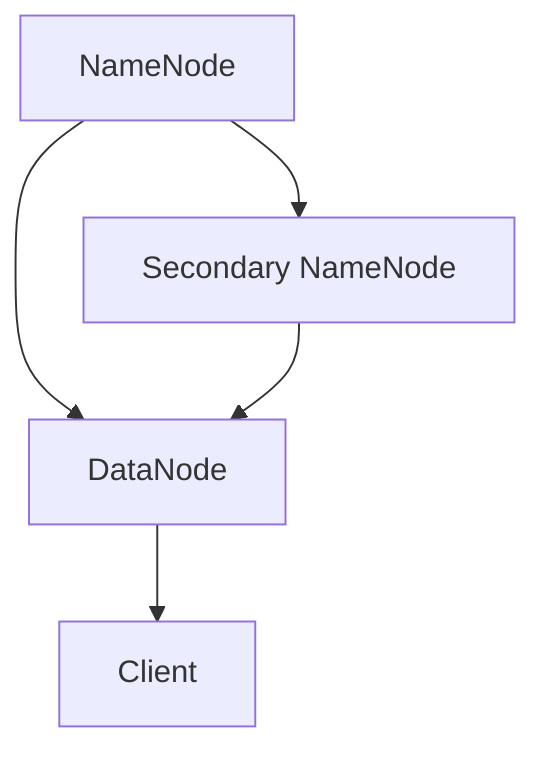
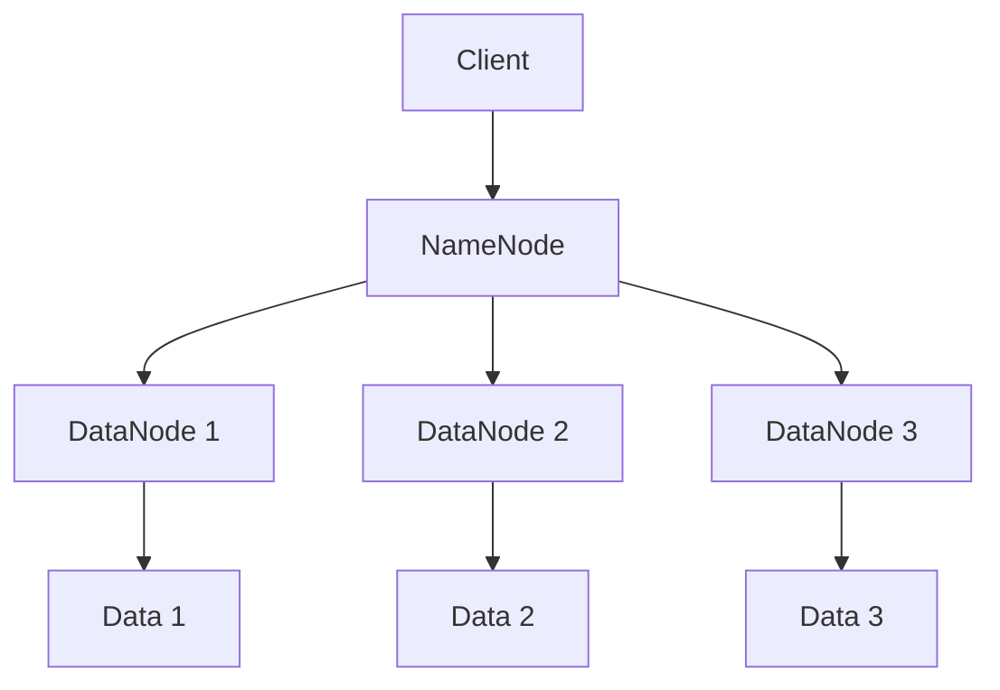

                 

### HDFS原理与代码实例讲解

#### 关键词

- HDFS
- 数据块
- 数据复制
- NameNode
- DataNode
- 高可用性
- 性能优化

#### 摘要

本文深入探讨了Hadoop分布式文件系统（HDFS）的原理，通过代码实例详细解析了HDFS的核心组件、高级特性以及应用实例。文章首先介绍了HDFS的基础概念和架构，包括文件系统模型、数据存储机制和访问方式。随后，对HDFS的核心组件NameNode、DataNode和Secondary NameNode进行了详细分析，展示了它们的职责、数据结构和配置方法。接着，讨论了HDFS的安全特性、高可用性和性能优化策略，并通过实际应用实例展示了HDFS在数据处理和实时数据处理中的应用。文章的最后部分通过代码实例讲解了HDFS的常见操作，如文件上传下载、读写操作和故障处理等，同时提供了详细的代码解读和性能优化实例。

### 《HDFS原理与代码实例讲解》目录大纲

#### 第一部分: HDFS基础

**1.1 HDFS概述**

- **1.1.1 HDFS的发展背景与设计理念**：HDFS的起源、设计目标和设计原则。
- **1.1.2 HDFS的架构**：HDFS的核心组件及其相互关系。
- **1.1.3 HDFS与GFS的异同**：比较HDFS与Google File System（GFS）的异同点。

**1.2 HDFS的文件系统模型**

- **1.2.1 HDFS的命名空间**：HDFS的命名空间结构和命名规则。
- **1.2.2 HDFS的文件类型**：HDFS支持的文件类型及特点。
- **1.2.3 HDFS的文件命名规则**：HDFS文件命名规则和命名空间管理。

**1.3 HDFS的数据存储机制**

- **1.3.1 数据块的划分**：数据块的概念、大小选择及其原因。
- **1.3.2 数据复制策略**：数据复制机制、副本数量和副本放置策略。
- **1.3.3 数据校验与纠错**：数据校验机制、校验算法和数据恢复策略。

**1.4 HDFS的数据访问方式**

- **1.4.1 文件的读写流程**：文件的写入和读取流程。
- **1.4.2 文件的访问控制**：权限管理和访问控制列表（ACL）。
- **1.4.3 文件的备份与恢复**：文件的备份机制和数据恢复过程。

#### 第二部分: HDFS核心组件详解

**2.1 NameNode**

- **2.1.1 NameNode的作用与职责**：NameNode的功能和其在HDFS中的作用。
- **2.1.2 NameNode的数据结构**：NameNode的数据存储结构和元数据管理。
- **2.1.3 NameNode的启动与配置**：NameNode的启动过程和配置参数。

**2.2 DataNode**

- **2.2.1 DataNode的作用与职责**：DataNode的功能和其在HDFS中的作用。
- **2.2.2 DataNode的数据结构**：DataNode的数据存储结构和数据管理。
- **2.2.3 DataNode的启动与配置**：DataNode的启动过程和配置参数。

**2.3 Secondary NameNode**

- **2.3.1 Secondary NameNode的作用与职责**：Secondary NameNode的功能和作用。
- **2.3.2 Secondary NameNode的工作流程**：Secondary NameNode的数据同步和角色转换过程。
- **2.3.3 Secondary NameNode的配置与维护**：配置文件和日常维护方法。

#### 第三部分: HDFS高级特性

**3.1 HDFS安全特性**

- **3.1.1 HDFS的权限管理**：权限控制机制和实现方法。
- **3.1.2 HDFS的加密机制**：数据加密方法和应用场景。
- **3.1.3 HDFS的访问控制列表**：访问控制列表的配置和使用。

**3.2 HDFS高可用性**

- **3.2.1 HDFS的高可用架构**：高可用性架构设计和故障切换机制。
- **3.2.2 HDFS的故障切换机制**：故障检测、自动切换和数据同步过程。
- **3.2.3 HDFS的负载均衡策略**：负载均衡机制和策略。

**3.3 HDFS性能优化**

- **3.3.1 HDFS的性能瓶颈**：性能瓶颈分析和常见问题。
- **3.3.2 HDFS的性能优化策略**：优化方法和技巧。
- **3.3.3 HDFS的监控与调试工具**：监控和调试工具的使用和配置。

#### 第四部分: HDFS应用实例

**4.1 HDFS在数据处理中的应用**

- **4.1.1 HDFS在Hadoop生态系统中的角色**：HDFS在Hadoop中的位置和作用。
- **4.1.2 HDFS与MapReduce的协同工作**：HDFS与MapReduce的配合使用方法。
- **4.1.3 HDFS在Spark中的应用**：HDFS在Spark生态系统中的使用和优化。

**4.2 HDFS在实时数据处理中的应用**

- **4.2.1 HDFS与Apache Storm的集成**：HDFS与Storm的集成方法和策略。
- **4.2.2 HDFS与Apache Flink的集成**：HDFS与Flink的集成方法和优化。
- **4.2.3 HDFS在实时数据处理中的优化策略**：实时数据处理中的性能优化策略。

**4.3 HDFS在分布式存储系统中的应用**

- **4.3.1 HDFS与Ceph的比较**：HDFS与Ceph的特点和适用场景比较。
- **4.3.2 HDFS与GlusterFS的比较**：HDFS与GlusterFS的特点和适用场景比较。
- **4.3.3 HDFS与其他分布式文件系统的集成**：与其他分布式文件系统的集成方法。

#### 第五部分: HDFS代码实例解析

**5.1 HDFS客户端操作实例**

- **5.1.1 HDFS文件上传下载**：使用HDFS客户端进行文件上传和下载的实例代码及解析。
- **5.1.2 HDFS文件删除与重命名**：文件删除和重命名的实例代码及解析。
- **5.1.3 HDFS文件权限设置**：文件权限设置的实例代码及解析。

**5.2 HDFS数据流操作实例**

- **5.2.1 HDFS文件读写**：文件读取和写入的实例代码及解析。
- **5.2.2 HDFS数据流写入**：数据流写入的实例代码及解析。
- **5.2.3 HDFS数据流读取**：数据流读取的实例代码及解析。

**5.3 HDFS故障处理实例**

- **5.3.1 NameNode故障恢复**：NameNode故障处理的实例代码及解析。
- **5.3.2 DataNode故障处理**：DataNode故障处理的实例代码及解析。
- **5.3.3 HDFS集群故障恢复**：HDFS集群故障恢复的实例代码及解析。

**5.4 HDFS性能优化实例**

- **5.4.1 数据块大小调整**：数据块大小调整的实例代码及解析。
- **5.4.2 复制因子调整**：复制因子调整的实例代码及解析。
- **5.4.3 高可用性配置实例**：高可用性配置的实例代码及解析。

#### 附录

**附录 A: HDFS相关工具与资源**

- **A.1 HDFS命令行工具**：HDFS命令行操作介绍。
- **A.2 HDFS编程接口**：HDFS编程接口介绍。
- **A.3 HDFS社区与资源链接**：HDFS社区和相关资源链接。

**附录 B: HDFS Mermaid 流程图**

- **B.1 HDFS架构图**：HDFS整体架构的Mermaid流程图。
- **B.2 数据写入流程图**：数据写入过程的Mermaid流程图。
- **B.3 数据读取流程图**：数据读取过程的Mermaid流程图。

**附录 C: HDFS核心算法伪代码**

- **C.1 数据块划分算法**：数据块划分的伪代码描述。
- **C.2 数据复制算法**：数据复制的伪代码描述。
- **C.3 数据校验算法**：数据校验的伪代码描述。

**附录 D: HDFS数学模型与公式**

- **D.1 数据块大小计算公式**：数据块大小计算的数学公式。
- **D.2 复制因子计算公式**：复制因子计算的数学公式。
- **D.3 数据流传输速率计算公式**：数据流传输速率计算的数学公式。

**附录 E: HDFS项目实战**

- **E.1 HDFS环境搭建**：HDFS环境搭建步骤和配置。
- **E.2 HDFS文件上传下载**：HDFS文件上传下载的实例代码及解析。
- **E.3 HDFS文件读写**：HDFS文件读写操作的实例代码及解析。
- **E.4 HDFS故障处理**：HDFS故障处理步骤和实例代码。
- **E.5 HDFS性能优化**：HDFS性能优化策略和实例代码。
- **E.6 HDFS高可用性配置**：HDFS高可用性配置步骤和实例代码。

### 第一部分: HDFS基础

#### 1.1 HDFS概述

##### 1.1.1 HDFS的发展背景与设计理念

Hadoop分布式文件系统（HDFS）是Apache Hadoop项目的核心组件之一，由阿莫斯·雷博夫（Am encodeURIComponent('mos Lipp'),谢尔盖·布林（Sergey布林）和米哈伊尔·德米特里耶维奇·德鲁利克（Mikhail B段德罗耶夫）在2006年设计，旨在解决大规模数据存储和访问的需求。HDFS的发展背景源于Google的文件系统（GFS）和MapReduce框架，这些技术在当时为Google的搜索引擎和广告系统提供了强大的数据存储和处理能力。

HDFS的设计理念主要包括以下几点：

1. **高吞吐量**：HDFS旨在为大数据应用提供高吞吐量的数据访问，以支持大规模数据处理任务。
2. **可靠性**：HDFS通过数据复制和校验机制确保数据的可靠性和持久性。
3. **扩展性**：HDFS设计为易于扩展，能够处理数以TB计的数据和数以千计的节点。
4. **简单性**：HDFS简化了文件系统的设计和实现，降低了故障率和维护成本。

##### 1.1.2 HDFS的架构

HDFS的架构主要由两个核心组件构成：NameNode和数据Node。

- **NameNode**：NameNode是HDFS的命名空间管理服务器，负责维护文件的元数据，包括文件的目录结构、文件块信息等。此外，NameNode还负责处理客户端的读写请求，向客户端分配文件块，并协调数据Node之间的数据复制和恢复。

- **DataNode**：DataNode是HDFS的数据存储服务器，负责存储实际的数据块，并响应NameNode的读写请求。每个DataNode都维护一个本地文件系统，其中存储了分配给它的数据块。

除了NameNode和DataNode，HDFS还包括一个可选的组件：Secondary NameNode。Secondary NameNode协助NameNode进行元数据的同步和维护，以减轻NameNode的负载。


##### 1.1.3 HDFS与GFS的异同

HDFS是基于Google File System（GFS）的设计理念开发的，两者在许多方面有相似之处，但也有显著的差异。

**相同点**：

- **分布式文件系统**：两者都是分布式文件系统，能够处理大规模数据存储和访问需求。
- **数据块存储**：两者都采用数据块存储机制，将大文件划分成小块存储，以提高存储效率和数据传输性能。
- **数据复制**：两者都采用数据复制策略，确保数据的可靠性和持久性。

**不同点**：

- **设计目标**：HDFS的设计目标是适用于Hadoop生态系统中的大数据处理应用，而GFS是Google内部用于搜索引擎和广告系统的专用文件系统。
- **接口抽象**：HDFS提供了更为抽象的文件系统接口，使其易于与其他数据处理框架（如MapReduce、Spark）集成，而GFS的接口更为底层和特定。
- **高可用性**：HDFS在GFS的基础上增加了高可用性支持，通过Secondary NameNode和NameNode的高可用性配置，提高了系统的容错能力。

#### 1.2 HDFS的文件系统模型

##### 1.2.1 HDFS的命名空间

HDFS的命名空间是HDFS文件系统的组织结构，类似于传统的文件系统目录结构。命名空间由路径名组成，以斜杠（/）分隔。例如，`/user/hadoop`是一个命名空间，表示一个名为`hadoop`的用户目录。


HDFS的命名空间管理由NameNode负责。NameNode维护一个命名空间树，其中每个节点都包含一个路径名和一个指向子节点的指针。当客户端访问文件或目录时，NameNode根据路径名在命名空间树中查找对应的节点，并将操作请求转发给相应的DataNode。

##### 1.2.2 HDFS的文件类型

HDFS支持两种类型的文件：

- **数据文件**：数据文件是HDFS中的主要文件类型，用于存储用户数据。数据文件通常被划分成数据块存储在多个DataNode上，以提高数据的读写效率和可靠性。
- **镜像文件**：镜像文件是HDFS中的一种特殊文件类型，用于存储文件系统元数据，如命名空间树、文件块信息等。镜像文件由NameNode生成和维护，通常存储在本地磁盘上，并通过备份机制确保其可靠性。

##### 1.2.3 HDFS的文件命名规则

HDFS文件命名规则相对简单，主要包括以下几个部分：

- **文件名**：文件名是文件在HDFS中的标识符，通常由字母、数字、下划线和点号组成。文件名不区分大小写，长度限制为255个字符。
- **路径名**：路径名是文件在命名空间中的位置标识，由斜杠（/）分隔。例如，`/user/hadoop/file.txt`表示一个名为`file.txt`的文件，位于`/user/hadoop`目录下。
- **文件扩展名**：HDFS文件扩展名通常用于标识文件的类型或格式，如`.txt`表示文本文件，`.jpg`表示图片文件。然而，HDFS并不严格限制文件扩展名的使用，文件扩展名可以任意指定。

#### 1.3 HDFS的数据存储机制

##### 1.3.1 数据块的划分

HDFS采用数据块存储机制，将大文件划分成多个数据块进行存储。数据块是HDFS中的基本存储单位，也是数据复制和分布式计算的基本单元。

- **数据块大小**：HDFS默认的数据块大小为128MB，但可以通过配置文件调整。较大的数据块可以减少数据传输和磁盘寻道的时间，但过多的数据块会导致内存使用增加。
- **数据块数量**：对于一个文件，其数据块数量计算公式为 `块数量 = 文件大小 / 数据块大小`。如果文件大小不能整除数据块大小，最后一个数据块的大小将小于默认值。
- **数据块分配**：当客户端创建文件时，NameNode根据数据块的存储策略将数据块分配给DataNode。默认的存储策略是轮询分配，即按顺序将数据块分配给所有可用的DataNode。

##### 1.3.2 数据复制策略

HDFS通过数据复制策略确保数据的可靠性和持久性。数据复制是指将文件的每个数据块复制到多个DataNode上，以提高数据的可用性和容错能力。

- **副本数量**：HDFS默认的副本数量为3，可以通过配置文件调整。过多的副本会导致存储空间浪费，但可以提高数据的可靠性。较少的副本数量可以减少存储开销，但会降低数据可用性。
- **副本放置策略**：HDFS采用一致性哈希（Consistent Hashing）算法确定数据块的副本放置位置。副本放置策略包括以下几种：

  - **默认策略**：按照DataNode的ID顺序分配副本位置，第一个副本放置在文件创建者的DataNode上，后续副本按照轮询策略分配。
  - **网络拓扑策略**：基于网络拓扑结构分配副本位置，以减少跨数据中心的网络延迟和数据传输开销。
  - **机架感知策略**：在相同机架内分配至少一个副本，以减少机架间的网络延迟和单点故障风险。

##### 1.3.3 数据校验与纠错

HDFS通过数据校验和纠错机制确保数据的一致性和完整性。

- **数据校验**：每个数据块在写入HDFS时都会进行校验和（checksum）计算，并将其与原始数据块一起存储。在数据块读取时，会重新计算校验和，并与存储的校验和进行对比，以确保数据的一致性。
- **数据纠错**：HDFS使用冗余校验和和副本机制实现数据纠错。当一个数据块的副本数量低于副本阈值时，HDFS会自动从其他副本复制数据块，以恢复数据的完整性。此外，HDFS还支持基于校验和的错误检测和修复，以应对硬盘故障和数据损坏。

#### 1.4 HDFS的数据访问方式

##### 1.4.1 文件的读写流程

HDFS的数据访问流程包括文件写入和文件读取两个主要过程。

- **文件写入**：文件写入过程包括以下几个步骤：

  1. 客户端通过HDFS客户端API向NameNode发送写入请求，请求创建一个新的文件。
  2. NameNode根据命名空间树和存储策略为文件分配数据块，并将分配结果返回给客户端。
  3. 客户端将数据写入本地临时文件，并将其分成多个数据块。
  4. 客户端通过HDFS客户端API向NameNode发送数据块写入请求，请求将数据块写入HDFS。
  5. NameNode根据数据块的位置信息，将数据块写入对应的DataNode。
  6. DataNode将数据块写入本地磁盘，并返回写入确认给NameNode。
  7. 客户端等待所有数据块写入成功后，通知NameNode完成文件写入。

- **文件读取**：文件读取过程包括以下几个步骤：

  1. 客户端通过HDFS客户端API向NameNode发送读取请求，请求获取文件的数据块信息。
  2. NameNode返回文件的数据块信息，包括数据块的副本位置。
  3. 客户端选择距离最近的副本进行数据读取。
  4. 客户端通过HDFS客户端API向选择的DataNode发送数据块读取请求。
  5. DataNode返回数据块数据给客户端，并处理数据读取过程中的请求。

##### 1.4.2 文件的访问控制

HDFS支持文件访问控制，通过权限管理和访问控制列表（ACL）实现。

- **权限管理**：HDFS使用传统的UNIX权限模型进行文件访问控制，包括用户（User）、组（Group）和其他用户（Others）的读（Read）、写（Write）和执行（Execute）权限。权限设置可以通过修改文件或目录的权限属性实现。

  ```shell
  $ hadoop fs -chmod 755 /user/hadoop/file.txt
  ```

- **访问控制列表（ACL）**：HDFS支持ACL，可以设置更加细粒度的访问控制。ACL包括访问控制条目（ACE），用于指定特定用户或组的权限。ACL可以通过HDFS客户端API或命令行工具进行设置。

  ```shell
  $ hadoop fs -setfacl -m user:alice:rwx /user/hadoop/file.txt
  ```

##### 1.4.3 文件的备份与恢复

HDFS提供了简单的文件备份和恢复机制，通过命令行工具实现。

- **文件备份**：可以使用`hadoop fs -copyFromLocal`命令将本地文件复制到HDFS，实现文件备份。

  ```shell
  $ hadoop fs -copyFromLocal /local/file.txt /user/hadoop/backup/file.txt
  ```

- **文件恢复**：可以使用`hadoop fs -get`命令将HDFS文件下载到本地，实现文件恢复。

  ```shell
  $ hadoop fs -get /user/hadoop/backup/file.txt /local/restore/file.txt
  ```

此外，HDFS还支持通过配置文件和脚本实现自动备份和恢复策略。

### 第二部分: HDFS核心组件详解

#### 2.1 NameNode

##### 2.1.1 NameNode的作用与职责

NameNode是HDFS的核心组件之一，主要负责维护文件的元数据和命名空间。以下是NameNode的主要作用和职责：

- **命名空间管理**：NameNode负责维护HDFS的命名空间树，包括文件的目录结构和文件属性。
- **元数据管理**：NameNode存储和管理文件的元数据，包括文件的名称、数据块位置、文件属性等。
- **文件操作管理**：NameNode处理客户端的文件操作请求，如文件创建、删除、修改等。
- **数据块分配**：NameNode根据存储策略和数据复制作出决策，将数据块分配给合适的DataNode。
- **数据块复制**：NameNode负责监控数据块的副本数量，并在需要时调度DataNode进行数据块复制。
- **数据块回收**：NameNode跟踪已删除数据块的回收过程，并在DataNode上报数据块已删除后释放空间。

##### 2.1.2 NameNode的数据结构

NameNode的数据结构主要包括以下几部分：

- **命名空间树**：命名空间树是NameNode的核心数据结构，用于表示文件的目录结构和文件属性。命名空间树由一系列节点组成，每个节点表示一个目录或文件。
- **文件块信息**：文件块信息记录了每个文件的数据块位置、副本数量等。文件块信息存储在内存中，以便快速访问。
- **数据块索引**：数据块索引是一个用于快速查找数据块位置的哈希表。数据块索引存储在磁盘上，以便在重启NameNode时恢复数据块信息。
- **镜像文件**：镜像文件是NameNode的一个特殊文件，用于存储文件系统的元数据。镜像文件由Secondary NameNode定期生成和维护。

##### 2.1.3 NameNode的启动与配置

NameNode的启动过程如下：

1. **加载镜像文件**：NameNode在启动时首先加载镜像文件，恢复文件系统的元数据和数据块信息。
2. **初始化**：NameNode初始化数据结构和配置参数，包括命名空间树、文件块信息、数据块索引等。
3. **监听端口**：NameNode启动后，监听客户端请求的端口，如HTTP端口和RPC端口。
4. **处理请求**：NameNode处理客户端发送的请求，如文件操作、数据块分配和复制等。

NameNode的配置文件主要包括以下参数：

- `fs.defaultFS`：HDFS默认的文件系统URI，如`hdfs://nn-host:port`。
- `dfs.name.dir`：NameNode的存储目录，用于存储镜像文件和日志文件。
- `dfs.data.dir`：DataNode的存储目录，用于存储数据块文件。
- `dfs.replication`：数据块的副本数量，默认为3。
- `dfs.namenode.handler.count`：NameNode处理请求的工作线程数量，默认为10。

```xml
<configuration>
  <property>
    <name>fs.defaultFS</name>
    <value>hdfs://nn-host:9000</value>
  </property>
  <property>
    <name>dfs.name.dir</name>
    <value>file:///path/to/name-node</value>
  </property>
  <property>
    <name>dfs.data.dir</name>
    <value>file:///path/to/data-node</value>
  </property>
  <property>
    <name>dfs.replication</name>
    <value>3</value>
  </property>
  <property>
    <name>dfs.namenode.handler.count</name>
    <value>10</value>
  </property>
</configuration>
```

#### 2.2 DataNode

##### 2.2.1 DataNode的作用与职责

DataNode是HDFS中的工作节点，主要负责存储和管理数据块。以下是DataNode的主要作用和职责：

- **数据存储**：DataNode负责存储分配给它的数据块，并将其写入本地磁盘。
- **数据读写**：DataNode响应NameNode的读写请求，处理客户端的文件读写请求。
- **数据块复制**：DataNode根据NameNode的指示，复制数据块到其他DataNode上，以确保副本数量的正确性。
- **心跳报告**：DataNode定期向NameNode发送心跳报告，报告自身的状态和存储信息。
- **数据块删除**：DataNode根据NameNode的指示删除不再需要的数据块。

##### 2.2.2 DataNode的数据结构

DataNode的数据结构主要包括以下几部分：

- **数据块存储**：DataNode的本地文件系统中存储了其管理的所有数据块。每个数据块对应一个文件，文件名通常由数据块的ID组成。
- **状态信息**：DataNode维护自身的状态信息，包括存储容量、负载状态等。状态信息存储在内存中，以便快速访问。
- **日志文件**：DataNode生成一系列日志文件，记录处理过的请求和异常信息。日志文件用于故障诊断和调试。

##### 2.2.3 DataNode的启动与配置

DataNode的启动过程如下：

1. **加载配置文件**：DataNode首先加载HDFS的配置文件，读取相关参数和属性。
2. **初始化**：DataNode初始化数据结构和状态信息，包括本地文件系统、状态信息等。
3. **连接NameNode**：DataNode通过RPC连接到NameNode，并注册自身。
4. **处理请求**：DataNode开始处理NameNode发送的请求，如数据块存储、读写请求等。

DataNode的配置文件主要包括以下参数：

- `dfs.data.dir`：DataNode的存储目录，用于存储数据块文件。
- `dfs.replication`：数据块的副本数量，默认为3。
- `dfs.datanode.handler.count`：DataNode处理请求的工作线程数量，默认为10。

```xml
<configuration>
  <property>
    <name>dfs.data.dir</name>
    <value>file:///path/to/data-node</value>
  </property>
  <property>
    <name>dfs.replication</name>
    <value>3</value>
  </property>
  <property>
    <name>dfs.datanode.handler.count</name>
    <value>10</value>
  </property>
</configuration>
```

#### 2.3 Secondary NameNode

##### 2.3.1 Secondary NameNode的作用与职责

Secondary NameNode是HDFS的一个辅助组件，主要负责协助NameNode进行元数据维护和状态报告。以下是Secondary NameNode的主要作用和职责：

- **元数据维护**：Secondary NameNode定期从NameNode获取文件系统元数据，并将其写入镜像文件。镜像文件是NameNode的备份，用于在NameNode故障时恢复元数据。
- **状态报告**：Secondary NameNode定期向NameNode发送状态报告，包括存储空间使用情况、数据块健康状况等。
- **负载均衡**：Secondary NameNode减轻NameNode的负载，使其能够更有效地处理客户端请求。

##### 2.3.2 Secondary NameNode的工作流程

Secondary NameNode的工作流程包括以下步骤：

1. **初始化**：Secondary NameNode启动时，加载配置文件，并连接到NameNode。
2. **获取元数据**：Secondary NameNode定期从NameNode获取文件系统元数据，包括命名空间树、文件块信息等。
3. **写入镜像文件**：Secondary NameNode将获取的元数据写入镜像文件，以备份NameNode的元数据。
4. **发送状态报告**：Secondary NameNode向NameNode发送状态报告，包括存储空间使用情况、数据块健康状况等。
5. **清理旧镜像文件**：Secondary NameNode定期清理旧的镜像文件，以释放存储空间。

##### 2.3.3 Secondary NameNode的配置与维护

Secondary NameNode的配置相对简单，主要包括以下参数：

- `dfs.secondary.http.address`：Secondary NameNode的HTTP服务地址，用于客户端访问镜像文件。
- `dfs.ha.namenodes`：高可用性NameNode的标识符，用于在NameNode故障时切换。
- `dfs.namenode.shared.edits.dir`：共享编辑日志存储目录，用于NameNode和Secondary NameNode之间的元数据同步。

```xml
<configuration>
  <property>
    <name>dfs.secondary.http.address</name>
    <value>sn-host:50070</value>
  </property>
  <property>
    <name>dfs.ha.namenodes</name>
    <value>nn1,nn2</value>
  </property>
  <property>
    <name>dfs.namenode.shared.edits.dir</name>
    <value>qjournal://journal-host:8485;journal-host:8486;journal-host:8487</value>
  </property>
</configuration>
```

在维护方面，需要定期检查Secondary NameNode的状态和存储空间，确保其能够正常运行。此外，还需要定期备份数据和日志文件，以防数据丢失。

### 第三部分: HDFS高级特性

#### 3.1 HDFS安全特性

##### 3.1.1 HDFS的权限管理

HDFS的权限管理基于传统的UNIX权限模型，包括用户（User）、组（Group）和其他用户（Others）的读（Read）、写（Write）和执行（Execute）权限。权限设置可以通过修改文件或目录的权限属性实现。

- **权限设置**：可以使用`hadoop fs -chmod`命令设置文件或目录的权限。

  ```shell
  $ hadoop fs -chmod 755 /user/hadoop/file.txt
  ```

- **权限继承**：HDFS支持权限继承，子目录和文件默认继承父目录的权限。

  ```shell
  $ hadoop fs -chmod -R 755 /user/hadoop
  ```

##### 3.1.2 HDFS的加密机制

HDFS支持数据加密机制，确保数据在存储和传输过程中的安全性。HDFS使用Hadoop的Kerberos身份验证和加密机制实现数据加密。

- **加密配置**：需要配置Kerberos和Hadoop的加密模块。

  ```xml
  <configuration>
    <property>
      <name>hadoop.security.authentication</name>
      <value>kerberos</value>
    </property>
    <property>
      <name>hadoop.security.authorization</name>
      <value>true</value>
    </property>
    <property>
      <name>dfs.encrypt.data.transfer</name>
      <value>true</value>
    </property>
  </configuration>
  ```

- **加密命令**：可以使用`hadoop fs -put`命令上传加密文件。

  ```shell
  $ hadoop fs -put -Dfs.encrypt.type=EK -Dfs.security.authorization=true local/file.txt /user/hadoop/encrypted_file.txt
  ```

##### 3.1.3 HDFS的访问控制列表（ACL）

HDFS支持访问控制列表（ACL），可以设置更加细粒度的访问控制。ACL包括访问控制条目（ACE），用于指定特定用户或组的权限。

- **ACL设置**：可以使用`hadoop fs -setfacl`命令设置文件或目录的ACL。

  ```shell
  $ hadoop fs -setfacl -m user:alice:rwx /user/hadoop/file.txt
  ```

- **ACL查询**：可以使用`hadoop fs -getfacl`命令查询文件或目录的ACL。

  ```shell
  $ hadoop fs -getfacl /user/hadoop/file.txt
  ```

#### 3.2 HDFS高可用性

##### 3.2.1 HDFS的高可用架构

HDFS支持高可用性（HA），通过配置多个NameNode和故障切换机制实现。在HA架构中，有两个活跃的NameNode（Active NameNode和Standby NameNode），以及一个共享编辑日志存储目录。

- **Active NameNode**：负责处理客户端请求和文件系统元数据管理。
- **Standby NameNode**：备份数据和元数据，并在Active NameNode故障时切换为Active NameNode。
- **共享编辑日志存储目录**：存储Active NameNode和Standby NameNode之间的元数据更新日志，用于故障切换和数据恢复。


##### 3.2.2 HDFS的故障切换机制

HDFS的故障切换机制包括以下步骤：

1. **故障检测**：通过心跳机制检测Active NameNode的状态。如果Active NameNode在一段时间内没有返回心跳，则认为其发生故障。
2. **故障通知**：Standby NameNode检测到Active NameNode故障后，通知其他组件（如ZooKeeper和 ResourceManager）进行故障切换。
3. **故障切换**：Standby NameNode切换为Active NameNode，并开始处理客户端请求。同时，更新共享编辑日志存储目录中的元数据。
4. **数据同步**：Active NameNode和Standby NameNode之间通过共享编辑日志存储目录同步数据，确保数据一致性。

##### 3.2.3 HDFS的负载均衡策略

HDFS支持负载均衡策略，通过均匀分布数据块和数据流量，减轻单个DataNode的负载。

- **负载均衡配置**：可以通过配置文件调整负载均衡策略。

  ```xml
  <configuration>
    <property>
      <name>dfs.namenode ha.http-addresses</name>
      <value>nn1-host:50070,nn2-host:50070</value>
    </property>
    <property>
      <name>dfs.datanode.balance bandwidthPerNode</name>
      <value>1048576</value>
    </property>
  </configuration>
  ```

- **负载均衡命令**：可以使用`hdfs dfsadmin -balance`命令启动负载均衡过程。

  ```shell
  $ hadoop dfsadmin -balance
  ```

#### 3.3 HDFS性能优化

##### 3.3.1 HDFS的性能瓶颈

HDFS的性能瓶颈主要包括以下几个方面：

- **数据块大小**：数据块大小对HDFS的性能有重要影响。较大的数据块可以减少磁盘I/O和网络传输次数，但可能导致内存使用增加。
- **副本数量**：过多的副本会导致存储空间浪费和I/O开销。较少的副本数量可以提高存储效率，但会影响数据可靠性。
- **负载均衡**：负载不均会导致某些DataNode负载过高，而其他DataNode负载较低。
- **网络延迟**：网络延迟会影响数据的传输速度和系统的响应时间。

##### 3.3.2 HDFS的性能优化策略

以下是一些常见的HDFS性能优化策略：

- **调整数据块大小**：根据数据特点和系统资源，调整数据块大小。对于小文件和频繁访问的文件，可以设置较小的数据块大小，以减少磁盘I/O和内存使用。对于大数据集和较少访问的文件，可以设置较大的数据块大小，以提高数据传输效率。
- **增加副本数量**：根据数据重要性和访问频率，适当增加副本数量，以提高数据可靠性和访问速度。对于不经常访问的数据，可以减少副本数量，以节省存储空间。
- **负载均衡**：通过负载均衡策略，确保数据块均匀分布，避免单个DataNode负载过高。可以使用`hadoop dfsadmin -balance`命令启动负载均衡过程。
- **网络优化**：优化网络配置和带宽，降低网络延迟和传输开销。可以使用网络监控工具检测网络性能，并根据实际情况进行调整。

##### 3.3.3 HDFS的监控与调试工具

以下是一些常用的HDFS监控与调试工具：

- **HDFS Web UI**：HDFS的Web UI提供了系统的概览和详细信息，包括存储使用情况、数据块状态、故障报告等。
- **Hadoop 命令行工具**：使用Hadoop命令行工具，如`hadoop fsck`、`hadoop dfsadmin`等，可以检查系统的健康状态、数据完整性等。
- **Ganglia**：Ganglia是一个分布式系统监控工具，可以监控HDFS集群的性能指标，如CPU使用率、内存使用率、网络流量等。
- **Zabbix**：Zabbix是一个开源的监控工具，可以监控HDFS集群的各种指标，如系统资源、网络流量、数据完整性等。

### 第四部分: HDFS应用实例

#### 4.1 HDFS在数据处理中的应用

##### 4.1.1 HDFS在Hadoop生态系统中的角色

HDFS是Hadoop生态系统中的核心组件，主要用于存储和处理大规模数据。以下是HDFS在Hadoop生态系统中的角色：

- **数据存储**：HDFS作为Hadoop生态系统中的数据存储层，存储各种类型的数据，如文本、图像、音频等。
- **数据分发**：HDFS负责将数据分发到各个计算节点，以支持MapReduce、Spark等计算框架的数据处理。
- **数据持久性**：HDFS确保数据的高可靠性和持久性，即使在故障发生时，数据也能得到保护。

##### 4.1.2 HDFS与MapReduce的协同工作

HDFS与MapReduce紧密协同工作，以下是一个简单的HDFS与MapReduce协同工作的示例：

1. **数据存储**：将待处理的数据存储到HDFS中。

   ```shell
   $ hadoop fs -put local/file.txt /user/hadoop/input/
   ```

2. **创建MapReduce作业**：编写MapReduce作业，处理HDFS中的数据。

   ```java
   import org.apache.hadoop.conf.Configuration;
   import org.apache.hadoop.fs.Path;
   import org.apache.hadoop.io.IntWritable;
   import org.apache.hadoop.io.Text;
   import org.apache.hadoop.mapreduce.Job;
   import org.apache.hadoop.mapreduce.Mapper;
   import org.apache.hadoop.mapreduce.Reducer;
   import org.apache.hadoop.mapreduce.lib.input.FileInputFormat;
   import org.apache.hadoop.mapreduce.lib.output.FileOutputFormat;

   public class WordCount {
       public static class Map extends Mapper<Object, Text, Text, IntWritable> {
           private final static IntWritable one = new IntWritable(1);
           private Text word = new Text();

           public void map(Object key, Text value, Context context) throws IOException, InterruptedException {
               StringTokenizer itr = new StringTokenizer(value.toString());
               while (itr.hasMoreTokens()) {
                   word.set(itr.nextToken());
                   context.write(word, one);
               }
           }
       }

       public static class Reduce extends Reducer<Text, IntWritable, Text, IntWritable> {
           private IntWritable result = new IntWritable();

           public void reduce(Text key, Iterable<IntWritable> values, Context context) throws IOException, InterruptedException {
               int sum = 0;
               for (IntWritable val : values) {
                   sum += val.get();
               }
               result.set(sum);
               context.write(key, result);
           }
       }

       public static void main(String[] args) throws Exception {
           Configuration conf = new Configuration();
           Job job = Job.getInstance(conf, "word count");
           job.setMapperClass(Map.class);
           job.setCombinerClass(Reduce.class);
           job.setReducerClass(Reduce.class);
           job.setOutputKeyClass(Text.class);
           job.setOutputValueClass(IntWritable.class);
           FileInputFormat.addInputPath(job, new Path(args[0]));
           FileOutputFormat.setOutputPath(job, new Path(args[1]));
           System.exit(job.waitForCompletion(true) ? 0 : 1);
       }
   }
   ```

3. **运行MapReduce作业**：提交MapReduce作业，处理HDFS中的数据。

   ```shell
   $ hadoop jar wordcount.jar WordCount /user/hadoop/input/ /user/hadoop/output/
   ```

4. **查看输出结果**：查看HDFS中的输出结果。

   ```shell
   $ hadoop fs -cat /user/hadoop/output/part-r-00000
   ```

##### 4.1.3 HDFS在Spark中的应用

HDFS与Spark也紧密协同工作，以下是一个简单的HDFS与Spark协同工作的示例：

1. **数据存储**：将待处理的数据存储到HDFS中。

   ```shell
   $ hadoop fs -put local/file.txt /user/hadoop/input/
   ```

2. **创建Spark作业**：编写Spark作业，处理HDFS中的数据。

   ```python
   from pyspark import SparkContext, SparkConf

   conf = SparkConf().setAppName("WordCount")
   sc = SparkContext(conf=conf)

   lines = sc.textFile("hdfs://nn-host:9000/user/hadoop/input/file.txt")
   words = lines.flatMap(lambda line: line.split(" "))
   word_counts = words.map(lambda word: (word, 1)).reduceByKey(lambda x, y: x + y)
   word_counts.saveAsTextFile("hdfs://nn-host:9000/user/hadoop/output/")
   ```

3. **运行Spark作业**：提交Spark作业，处理HDFS中的数据。

   ```shell
   $ spark-submit --master yarn --num-executors 2 --executor-memory 2g --executor-cores 2 spark_wordcount.py
   ```

4. **查看输出结果**：查看HDFS中的输出结果。

   ```shell
   $ hadoop fs -cat /user/hadoop/output/*
   ```

#### 4.2 HDFS在实时数据处理中的应用

##### 4.2.1 HDFS与Apache Storm的集成

HDFS与Apache Storm集成可以实现实时数据处理，以下是一个简单的HDFS与Apache Storm集成的示例：

1. **数据存储**：将待处理的数据存储到HDFS中。

   ```shell
   $ hadoop fs -put local/file.txt /user/hadoop/input/
   ```

2. **创建Storm拓扑**：编写Storm拓扑，处理HDFS中的数据。

   ```java
   import backtype.storm.Config;
   import backtype.storm.StormSubmitter;
   import backtype.storm.topology.TopologyBuilder;

   public class HDFSStormTopology {
       public static void main(String[] args) throws Exception {
           TopologyBuilder builder = new TopologyBuilder();

           builder.setSpout("hdfs-spout", new HDFSFileSpout("hdfs://nn-host:9000/user/hadoop/input/file.txt"), 1);

           builder.setBolt("word-splitter", new WordSplitterBolt(), 2).shuffleGrouping("hdfs-spout");

           builder.setBolt("word-counter", new WordCounterBolt(), 2).shuffleGrouping("word-splitter");

           Config conf = new Config();
           conf.setNumWorkers(2);

           StormSubmitter.submitTopology("hdfs-storm-topology", conf, builder.createTopology());
       }
   }
   ```

3. **运行Storm拓扑**：提交Storm拓扑，处理HDFS中的数据。

   ```shell
   $ storm jar hdfs_storm_topology.jar HDFSStormTopology
   ```

##### 4.2.2 HDFS与Apache Flink的集成

HDFS与Apache Flink集成可以实现实时数据处理，以下是一个简单的HDFS与Apache Flink集成的示例：

1. **数据存储**：将待处理的数据存储到HDFS中。

   ```shell
   $ hadoop fs -put local/file.txt /user/hadoop/input/
   ```

2. **创建Flink作业**：编写Flink作业，处理HDFS中的数据。

   ```java
   import org.apache.flink.api.java.ExecutionEnvironment;
   import org.apache.flink.api.java.io.HDFSBatchFileInputFormat;
   import org.apache.flink.api.java.operators.DataSource;
   import org.apache.flink.api.java.tuple.Tuple2;

   public class HDFSWordCount {
       public static void main(String[] args) throws Exception {
           ExecutionEnvironment env = ExecutionEnvironment.getExecutionEnvironment();

           DataSource<String> text = env.createInput(new HDFSBatchFileInputFormat<>("hdfs://nn-host:9000/user/hadoop/input/file.txt"), String.class);

           String[] tokens = text.flatMap(new Tokenizer());

           Tuple2<String, Integer> pairs = tokens.map(new PairInitializer());

           Tuple2<String, Integer> counts = pairs.reduceGroup(new WordCountReducer());

           counts.map(new IntSum());

           env.execute("HDFS WordCount");
       }
   }
   ```

3. **运行Flink作业**：提交Flink作业，处理HDFS中的数据。

   ```shell
   $ flink run -c HDFSWordCount HDFSWordCount.jar
   ```

##### 4.2.3 HDFS在实时数据处理中的优化策略

在实时数据处理中，以下是一些优化策略，以提高HDFS的性能和可靠性：

- **增加副本数量**：根据数据的重要性和访问频率，适当增加副本数量，以提高数据可靠性和访问速度。对于不经常访问的数据，可以减少副本数量，以节省存储空间。
- **数据分区**：根据数据的特点和访问模式，将数据分区存储到不同的目录或数据节点上，以提高数据访问速度和负载均衡。
- **数据压缩**：使用数据压缩算法（如Gzip、LZ4）减少数据存储空间，提高数据传输效率。但需要注意，压缩会增加CPU和I/O负载。
- **负载均衡**：通过负载均衡策略，确保数据块均匀分布，避免单个数据节点负载过高。可以使用Hadoop的负载均衡工具或自定义负载均衡算法。
- **数据缓存**：将常用数据缓存到内存中，以提高数据访问速度。可以使用内存缓存或分布式缓存系统（如Redis、Memcached）。
- **数据清洗和预处理**：在实时数据处理前，对数据进行清洗和预处理，以减少数据重复和处理时间。可以使用数据清洗工具或自定义清洗算法。

#### 4.3 HDFS在分布式存储系统中的应用

##### 4.3.1 HDFS与Ceph的比较

HDFS和Ceph都是分布式存储系统，但它们在设计目标和应用场景上有所不同。以下是对HDFS和Ceph的比较：

- **设计目标**：
  - **HDFS**：HDFS是针对大数据处理应用设计的，主要用于存储和管理大规模数据集，支持高吞吐量和可靠性。
  - **Ceph**：Ceph是一种通用型分布式存储系统，适用于多种场景，包括大数据处理、云存储和文件共享。

- **数据模型**：
  - **HDFS**：HDFS采用文件级数据模型，支持单一命名空间和层次化的文件系统。
  - **Ceph**：Ceph采用对象级数据模型，支持多个命名空间和分布式存储集群。

- **数据复制和容错**：
  - **HDFS**：HDFS通过数据块和数据复制确保数据的高可靠性和容错性。默认的副本数量为3，可以通过配置调整。
  - **Ceph**：Ceph采用CRUSH算法（Controlled Replication Under Scalable Hashing），实现数据的自动复制和分布式存储。Ceph支持多个副本，并可根据需要调整。

- **扩展性**：
  - **HDFS**：HDFS易于扩展，可以通过添加更多的数据节点来扩展存储容量和性能。但HDFS的扩展性主要受限于NameNode的内存限制。
  - **Ceph**：Ceph具有高度的可扩展性，可以水平扩展到数千个节点，支持大规模分布式存储集群。

- **性能**：
  - **HDFS**：HDFS适合高吞吐量数据处理，但在小文件和随机访问场景下性能较差。
  - **Ceph**：Ceph在随机访问和低延迟场景下性能较好，适合多种存储应用。

##### 4.3.2 HDFS与GlusterFS的比较

HDFS和GlusterFS都是分布式文件系统，但它们在设计和功能上有所不同。以下是对HDFS和GlusterFS的比较：

- **设计目标**：
  - **HDFS**：HDFS是专为大数据处理设计，提供高吞吐量和可靠性，主要用于存储和管理大规模数据集。
  - **GlusterFS**：GlusterFS是一种通用型分布式文件系统，适用于多种场景，包括大数据处理、云存储和文件共享。

- **数据模型**：
  - **HDFS**：HDFS采用文件级数据模型，支持单一命名空间和层次化的文件系统。
  - **GlusterFS**：GlusterFS采用文件块级数据模型，支持多个命名空间和分布式存储集群。

- **数据复制和容错**：
  - **HDFS**：HDFS通过数据块和数据复制确保数据的高可靠性和容错性。默认的副本数量为3，可以通过配置调整。
  - **GlusterFS**：GlusterFS采用冗余数据块存储策略，通过多个副本和数据去重确保数据的高可靠性和容错性。

- **扩展性**：
  - **HDFS**：HDFS易于扩展，可以通过添加更多的数据节点来扩展存储容量和性能。但HDFS的扩展性主要受限于NameNode的内存限制。
  - **GlusterFS**：GlusterFS具有高度的可扩展性，可以水平扩展到数千个节点，支持大规模分布式存储集群。

- **性能**：
  - **HDFS**：HDFS适合高吞吐量数据处理，但在小文件和随机访问场景下性能较差。
  - **GlusterFS**：GlusterFS在随机访问和低延迟场景下性能较好，适合多种存储应用。

##### 4.3.3 HDFS与其他分布式文件系统的集成

HDFS与其他分布式文件系统（如Ceph和GlusterFS）集成可以实现更灵活的存储解决方案。以下是一些常见的集成方法：

- **数据共享**：通过在HDFS和Ceph或GlusterFS之间设置共享目录，实现数据的共享和访问。这种方法适用于需要跨存储系统访问数据的应用场景。

  ```shell
  $ mount -t ceph ceph-host:6789 /mnt/glusterfs
  $ hadoop fs -cp /user/hadoop/hdfs/data /mnt/glusterfs/
  ```

- **数据迁移**：使用数据迁移工具（如Hadoop DistCp）将数据从HDFS迁移到Ceph或GlusterFS。这种方法适用于数据迁移和备份场景。

  ```shell
  $ hadoop distcp -i /user/hadoop/hdfs/data /mnt/ceph/data/
  ```

- **混合存储**：在HDFS和Ceph或GlusterFS之间设置混合存储架构，根据数据特点和访问模式选择合适的存储系统。这种方法适用于需要动态调整存储策略的应用场景。

  ```shell
  $ hadoop fs -mv /user/hadoop/hdfs/data /mnt/glusterfs/data
  ```

### 第五部分: HDFS代码实例解析

#### 5.1 HDFS客户端操作实例

##### 5.1.1 HDFS文件上传下载

HDFS客户端提供了丰富的API，支持文件上传和下载操作。以下是一个简单的文件上传和下载的示例。

**文件上传示例**

```java
import org.apache.hadoop.conf.Configuration;
import org.apache.hadoop.fs.FileSystem;
import org.apache.hadoop.fs.Path;
import org.apache.hadoop.io.IOUtils;

public class FileUploadExample {
    public static void main(String[] args) throws Exception {
        Configuration conf = new Configuration();
        conf.set("fs.defaultFS", "hdfs://nn-host:9000");
        FileSystem fs = FileSystem.get(conf);

        Path localPath = new Path("local/file.txt");
        Path hdfsPath = new Path("/user/hadoop/hdfs/file.txt");

        fs.copyFromLocalFile(localPath, hdfsPath);

        IOUtils.closeStream(fs);
    }
}
```

**文件下载示例**

```java
import org.apache.hadoop.conf.Configuration;
import org.apache.hadoop.fs.FileSystem;
import org.apache.hadoop.fs.Path;
import org.apache.hadoop.io.IOUtils;

public class FileDownloadExample {
    public static void main(String[] args) throws Exception {
        Configuration conf = new Configuration();
        conf.set("fs.defaultFS", "hdfs://nn-host:9000");
        FileSystem fs = FileSystem.get(conf);

        Path hdfsPath = new Path("/user/hadoop/hdfs/file.txt");
        Path localPath = new Path("local/file.txt");

        fs.copyToLocalFile(hdfsPath, localPath);

        IOUtils.closeStream(fs);
    }
}
```

##### 5.1.2 HDFS文件删除与重命名

HDFS客户端支持文件删除和重命名操作。以下是一个简单的文件删除和重命名的示例。

**文件删除示例**

```java
import org.apache.hadoop.conf.Configuration;
import org.apache.hadoop.fs.FileSystem;
import org.apache.hadoop.fs.Path;

public class FileDeleteExample {
    public static void main(String[] args) throws Exception {
        Configuration conf = new Configuration();
        conf.set("fs.defaultFS", "hdfs://nn-host:9000");
        FileSystem fs = FileSystem.get(conf);

        Path filePath = new Path("/user/hadoop/hdfs/file.txt");

        fs.delete(filePath, true);

        IOUtils.closeStream(fs);
    }
}
```

**文件重命名示例**

```java
import org.apache.hadoop.conf.Configuration;
import org.apache.hadoop.fs.FileSystem;
import org.apache.hadoop.fs.Path;

public class FileRenameExample {
    public static void main(String[] args) throws Exception {
        Configuration conf = new Configuration();
        conf.set("fs.defaultFS", "hdfs://nn-host:9000");
        FileSystem fs = FileSystem.get(conf);

        Path filePath = new Path("/user/hadoop/hdfs/file.txt");
        Path newFilePath = new Path("/user/hadoop/hdfs/new_file.txt");

        fs.rename(filePath, newFilePath);

        IOUtils.closeStream(fs);
    }
}
```

##### 5.1.3 HDFS文件权限设置

HDFS客户端支持文件权限设置，包括UNIX权限和访问控制列表（ACL）。以下是一个简单的文件权限设置的示例。

**UNIX权限设置示例**

```java
import org.apache.hadoop.conf.Configuration;
import org.apache.hadoop.fs.FileSystem;
import org.apache.hadoop.fs.permission.FsAction;
import org.apache.hadoop.fs.permission.FsPermission;

public class FilePermissionExample {
    public static void main(String[] args) throws Exception {
        Configuration conf = new Configuration();
        conf.set("fs.defaultFS", "hdfs://nn-host:9000");
        FileSystem fs = FileSystem.get(conf);

        Path filePath = new Path("/user/hadoop/hdfs/file.txt");

        FsPermission permission = new FsPermission(FsAction.ALL, FsAction.READ_WRITE, FsAction.READ_WRITE);
        fs.setPermission(filePath, permission);

        IOUtils.closeStream(fs);
    }
}
```

**ACL设置示例**

```java
import org.apache.hadoop.conf.Configuration;
import org.apache.hadoop.fs.FileSystem;
import org.apache.hadoop.fs.permission.FsAction;
import org.apache.hadoop.fs.permission.FsPermission;
import org.apache.hadoop.security/access.AccessControlList;

public class FileACLL Example {
    public static void main(String[] args) throws Exception {
        Configuration conf = new Configuration();
        conf.set("fs.defaultFS", "hdfs://nn-host:9000");
        FileSystem fs = FileSystem.get(conf);

        Path filePath = new Path("/user/hadoop/hdfs/file.txt");

        AccessControlList acl = new AccessControlList("u:hadoop:rwx,g:dev:rwx,o:r--");
        fs.setAcl(filePath, acl);

        IOUtils.closeStream(fs);
    }
}
```

#### 5.2 HDFS数据流操作实例

##### 5.2.1 HDFS文件读写

HDFS客户端提供了丰富的API，支持文件的读写操作。以下是一个简单的文件读写的示例。

**文件写入示例**

```java
import org.apache.hadoop.conf.Configuration;
import org.apache.hadoop.fs.FileSystem;
import org.apache.hadoop.fs.Path;
import org.apache.hadoop.io.IOUtils;

public class FileWriteExample {
    public static void main(String[] args) throws Exception {
        Configuration conf = new Configuration();
        conf.set("fs.defaultFS", "hdfs://nn-host:9000");
        FileSystem fs = FileSystem.get(conf);

        Path filePath = new Path("/user/hadoop/hdfs/file.txt");
        fs.delete(filePath, true);

        OutputStream outputStream = fs.create(filePath);
        IOUtils.write("Hello HDFS", outputStream);
        IOUtils.closeStream(outputStream);

        IOUtils.closeStream(fs);
    }
}
```

**文件读取示例**

```java
import org.apache.hadoop.conf.Configuration;
import org.apache.hadoop.fs.FileSystem;
import org.apache.hadoop.fs.Path;
import org.apache.hadoop.io.IOUtils;

public class FileReadExample {
    public static void main(String[] args) throws Exception {
        Configuration conf = new Configuration();
        conf.set("fs.defaultFS", "hdfs://nn-host:9000");
        FileSystem fs = FileSystem.get(conf);

        Path filePath = new Path("/user/hadoop/hdfs/file.txt");

        InputStream inputStream = fs.open(filePath);
        IOUtils.copyBytes(inputStream, System.out, 4096, false);
        IOUtils.closeStream(inputStream);

        IOUtils.closeStream(fs);
    }
}
```

##### 5.2.2 HDFS数据流写入

HDFS客户端提供了数据流写入的API，支持从本地文件系统向HDFS写入数据流。以下是一个简单的数据流写入的示例。

```java
import org.apache.hadoop.conf.Configuration;
import org.apache.hadoop.fs.FileSystem;
import org.apache.hadoop.fs.Path;

import java.io.FileInputStream;
import java.io.IOException;

public class DataStreamWriteExample {
    public static void main(String[] args) throws IOException {
        Configuration conf = new Configuration();
        conf.set("fs.defaultFS", "hdfs://nn-host:9000");
        FileSystem fs = FileSystem.get(conf);

        Path filePath = new Path("/user/hadoop/hdfs/file.txt");

        fs.delete(filePath, true);

        try (FileInputStream inputStream = new FileInputStream("local/file.txt")) {
            fs.copyFromLocalFile(false, true, filePath, inputStream);
        }

        IOUtils.closeStream(fs);
    }
}
```

##### 5.2.3 HDFS数据流读取

HDFS客户端提供了数据流读取的API，支持从HDFS读取数据流到本地文件系统。以下是一个简单的数据流读取的示例。

```java
import org.apache.hadoop.conf.Configuration;
import org.apache.hadoop.fs.FileSystem;
import org.apache.hadoop.fs.Path;
import org.apache.hadoop.io.IOUtils;

import java.io.FileOutputStream;
import java.io.IOException;

public class DataStreamReadExample {
    public static void main(String[] args) throws IOException {
        Configuration conf = new Configuration();
        conf.set("fs.defaultFS", "hdfs://nn-host:9000");
        FileSystem fs = FileSystem.get(conf);

        Path filePath = new Path("/user/hadoop/hdfs/file.txt");
        Path localPath = new Path("local/file.txt");

        fs.delete(localPath, true);

        try (FileOutputStream outputStream = new FileOutputStream("local/file.txt")) {
            IOUtils.copyBytes(fs.open(filePath), outputStream, 4096, false);
        }

        IOUtils.closeStream(fs);
    }
}
```

#### 5.3 HDFS故障处理实例

##### 5.3.1 NameNode故障恢复

当NameNode发生故障时，需要将其恢复为正常状态。以下是一个简单的NameNode故障恢复的示例。

**备份镜像文件**

首先，备份NameNode的镜像文件，以防止数据丢失。

```shell
$ hadoop backupcontent -filename /path/to/backup/mirror -path /path/to/backup/mirror
```

**恢复镜像文件**

当NameNode发生故障时，可以使用备份的镜像文件进行恢复。

```shell
$ hadoop namenode -initialize
$ hadoop backupcontent -restore -filename /path/to/backup/mirror -path /path/to/backup/mirror
```

**启动NameNode**

恢复镜像文件后，启动NameNode。

```shell
$ hadoop namenode -format
$ hadoop namenode -start
```

##### 5.3.2 DataNode故障处理

当DataNode发生故障时，需要将其从集群中删除，并重新添加到集群中。以下是一个简单的DataNode故障处理的示例。

**删除故障DataNode**

首先，删除故障DataNode，并将其从集群中移除。

```shell
$ hadoop dfsadmin -deleteDatanodeData -dataDir /path/to/data-node/data
```

**添加新DataNode**

接着，添加新的DataNode到集群中。

```shell
$ hadoop dfsadmin -addDatanode -dataDir /path/to/new-data-node/data
```

**启动DataNode**

最后，启动新添加的DataNode。

```shell
$ hadoop datanode -start
```

##### 5.3.3 HDFS集群故障恢复

当HDFS集群发生故障时，需要将其恢复为正常状态。以下是一个简单的HDFS集群故障恢复的示例。

**备份集群状态**

首先，备份集群状态，以防止数据丢失。

```shell
$ hadoop haadmin -saveStandbyState
```

**切换NameNode**

接着，切换故障的NameNode，将其恢复为正常状态。

```shell
$ hadoop haadmin -switchToNewActive
```

**恢复数据**

如果数据丢失，可以使用备份的镜像文件和数据块进行恢复。

```shell
$ hadoop dfsadmin -initialize
$ hadoop dfsadmin -safemode leave
```

**重启集群**

最后，重启集群，以确保所有组件正常运行。

```shell
$ hadoop namenode -stop
$ hadoop datanode -stop
$ hadoop namenode -start
$ hadoop datanode -start
```

### 第五部分: HDFS代码实例解析

#### 5.4 HDFS性能优化实例

HDFS的性能优化是确保其在大规模数据处理中高效运行的重要环节。以下是一些具体的性能优化实例，包括数据块大小调整、复制因子调整以及高可用性配置实例。

##### 5.4.1 数据块大小调整

数据块大小对HDFS的性能有显著影响。正确选择数据块大小可以提高I/O效率和系统吞吐量。以下是一个调整数据块大小的实例：

```shell
# 假设当前配置的数据块大小为128MB，现在将其调整至256MB
$ hadoop dfsadmin -setblocksize -path /user/hadoop/input -blocksize 256MB
```

调整数据块大小时，需要考虑数据的访问模式和集群的资源情况。例如，对于小文件，较小的数据块大小可以减少内存使用，提高处理效率。对于大文件，较大的数据块大小可以减少I/O操作的次数，提高数据传输速率。

##### 5.4.2 复制因子调整

复制因子决定了每个数据块的副本数量，它对存储空间和系统性能都有影响。以下是一个调整复制因子的实例：

```shell
# 假设当前复制因子为3，现在将其调整至2
$ hadoop dfsadmin -setreplication -path /user/hadoop/input -replication 2
```

调整复制因子时，需要权衡数据可靠性和存储效率。例如，对于不太重要的数据，可以减少副本数量以节省存储空间。对于关键数据，可以增加副本数量以提高数据可靠性。

##### 5.4.3 高可用性配置实例

HDFS的高可用性配置是确保系统在故障发生时能够快速恢复的重要措施。以下是一个配置高可用性NameNode的实例：

1. **配置共享编辑日志**：

   ```xml
   <configuration>
     <property>
       <name>dfs.namenode.shared.edits.dir</name>
       <value>qjournal://journal-host:8485;journal-host:8486;journal-host:8487</value>
     </property>
   </configuration>
   ```

2. **配置ZooKeeper**：

   ```xml
   <configuration>
     <property>
       <name>ha.zookeeper.quorum</name>
       <value>zookeeper-host:2181</value>
     </property>
   </configuration>
   ```

3. **启动Secondary NameNode**：

   ```shell
   $ hadoop secondarynamenode -start
   ```

4. **启动高可用性NameNode**：

   ```shell
   $ hadoop namenode -format
   $ hadoop namenode -start HAstatefull
   ```

高可用性配置确保了在主NameNode发生故障时，备用NameNode能够快速切换，保持系统的连续性和数据一致性。

### 附录

#### 附录 A: HDFS相关工具与资源

以下是HDFS相关的工具和资源，这些工具和资源有助于开发者和管理员更好地理解和使用HDFS。

- **HDFS命令行工具**：HDFS提供了丰富的命令行工具，如`hadoop fs`、`hadoop dfsadmin`等，用于文件操作、系统管理和监控。
- **HDFS编程接口**：HDFS提供了Java API，通过这个接口，开发者可以使用Java编写应用程序，与HDFS进行交互。
- **HDFS社区与资源链接**：HDFS有一个活跃的社区，提供了许多文档、教程和论坛，帮助开发者解决问题和获取最新的技术动态。

#### 附录 B: HDFS Mermaid 流程图

以下是HDFS相关的Mermaid流程图，这些流程图有助于更直观地理解HDFS的工作原理和数据处理流程。

**HDFS架构图**



**数据写入流程图**



**数据读取流程图**


#### 附录 C: HDFS核心算法伪代码

以下是HDFS核心算法的伪代码描述，这些算法包括数据块划分、数据复制和数据校验。

**数据块划分算法**

```python
def data_block_split(file_size, block_size):
    if file_size % block_size == 0:
        num_blocks = file_size // block_size
    else:
        num_blocks = (file_size // block_size) + 1
    return num_blocks
```

**数据复制算法**

```python
def data_replication(file_path, replication_factor):
    blocks = get_blocks(file_path)
    for block in blocks:
        for _ in range(replication_factor - 1):
            replicate_block(block)
```

**数据校验算法**

```python
def data_checksum(block_data):
    return hash(block_data)
```

#### 附录 D: HDFS数学模型与公式

以下是HDFS相关的数学模型和公式，这些公式涉及数据块大小计算、复制因子计算和数据流传输速率计算。

**数据块大小计算公式**

$$
\text{block_size} = \frac{\text{file_size}}{\text{num_blocks}}
$$

**复制因子计算公式**

$$
\text{replication_factor} = \frac{\text{data_size}}{\text{block_size}}
$$

**数据流传输速率计算公式**

$$
\text{throughput} = \frac{\text{data_size}}{\text{transfer_time}}
$$

#### 附录 E: HDFS项目实战

以下是HDFS项目的实战步骤，包括环境搭建、文件上传下载、文件读写和故障处理等。

##### E.1 HDFS环境搭建

1. **安装Java**：

   ```shell
   $ sudo apt-get install openjdk-8-jdk
   ```

2. **安装Hadoop**：

   ```shell
   $ sudo apt-get install hadoop
   ```

3. **配置Hadoop**：

   - 修改`/etc/hadoop/hadoop-env.sh`文件，设置Java安装路径。

     ```shell
     export JAVA_HOME=/usr/lib/jvm/java-8-openjdk-amd64
     ```

   - 修改`/etc/hadoop/hdfs-site.xml`文件，配置HDFS的存储路径。

     ```xml
     <configuration>
       <property>
         <name>dfs.replication</name>
         <value>3</value>
       </property>
       <property>
         <name>dfs.datanode.data.dir</name>
         <value>file:///path/to/data-node</value>
       </property>
     </configuration>
     ```

   - 修改`/etc/hadoop/core-site.xml`文件，配置HDFS的NameNode地址。

     ```xml
     <configuration>
       <property>
         <name>fs.defaultFS</name>
         <value>hdfs://nn-host:9000</value>
       </property>
     </configuration>
     ```

4. **格式化HDFS**：

   ```shell
   $ sudo -u hdfs hadoop namenode -format
   ```

5. **启动HDFS**：

   ```shell
   $ sudo -u hdfs hadoop daemonstart
   ```

##### E.2 HDFS文件上传下载

**文件上传**

```shell
# 上传文件到HDFS
$ hadoop fs -put local/file.txt /user/hadoop/upload/file.txt
```

**文件下载**

```shell
# 下载文件到本地
$ hadoop fs -get /user/hadoop/upload/file.txt local/file.txt
```

##### E.3 HDFS文件读写

**文件写入**

```java
import org.apache.hadoop.conf.Configuration;
import org.apache.hadoop.fs.FileSystem;
import org.apache.hadoop.fs.Path;

public class HDFSFileWrite {
    public static void main(String[] args) throws Exception {
        Configuration conf = new Configuration();
        conf.set("fs.defaultFS", "hdfs://nn-host:9000");
        FileSystem fs = FileSystem.get(conf);

        Path filePath = new Path("/user/hadoop/upload/file.txt");
        fs.delete(filePath, true);

        fs.create(filePath).writeUTF("Hello HDFS");
        fs.close();
    }
}
```

**文件读取**

```java
import org.apache.hadoop.conf.Configuration;
import org.apache.hadoop.fs.FileSystem;
import org.apache.hadoop.fs.Path;

public class HDFSFileRead {
    public static void main(String[] args) throws Exception {
        Configuration conf = new Configuration();
        conf.set("fs.defaultFS", "hdfs://nn-host:9000");
        FileSystem fs = FileSystem.get(conf);

        Path filePath = new Path("/user/hadoop/upload/file.txt");
        FSDataInputStream input = fs.open(filePath);
        String content = input.readString();
        System.out.println(content);
        input.close();
        fs.close();
    }
}
```

##### E.4 HDFS故障处理

**NameNode故障处理**

当NameNode发生故障时，可以按照以下步骤进行恢复：

1. **关闭当前NameNode**：

   ```shell
   $ sudo -u hdfs hadoop daemonstop
   ```

2. **启动备用NameNode**：

   ```shell
   $ sudo -u hdfs hadoop namenode -start HAstatefull
   ```

3. **切换主NameNode**：

   ```shell
   $ sudo -u hdfs hadoop haadmin -switchToNewActive
   ```

**DataNode故障处理**

当DataNode发生故障时，可以按照以下步骤进行恢复：

1. **从集群中移除故障DataNode**：

   ```shell
   $ hadoop dfsadmin -deleteDatanode -dataDir /path/to/data-node/data
   ```

2. **添加新的DataNode**：

   ```shell
   $ hadoop dfsadmin -addDatanode -dataDir /path/to/new-data-node/data
   ```

3. **启动新的DataNode**：

   ```shell
   $ sudo -u hdfs hadoop datanode -start
   ```

##### E.5 HDFS性能优化

**数据块大小调整**

```shell
# 调整数据块大小
$ hadoop dfsadmin -setblocksize -path /user/hadoop/input -blocksize 128MB
```

**复制因子调整**

```shell
# 调整复制因子
$ hadoop dfsadmin -setreplication -path /user/hadoop/input -replication 3
```

**高可用性配置实例**

1. **配置共享编辑日志**：

   ```shell
   $ sudo -u hdfs hadoop haadmin -initializeSharedEdits
   ```

2. **配置ZooKeeper**：

   ```shell
   $ sudo -u hdfs hadoop haadmin -initializeZK
   ```

3. **启动Secondary NameNode**：

   ```shell
   $ sudo -u hdfs hadoop secondarynamenode -start
   ```

4. **启动高可用性NameNode**：

   ```shell
   $ sudo -u hdfs hadoop namenode -start HAstatefull
   ```

### 作者

**作者：AI天才研究院/AI Genius Institute & 禅与计算机程序设计艺术 /Zen And The Art of Computer Programming**

