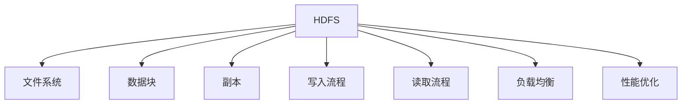
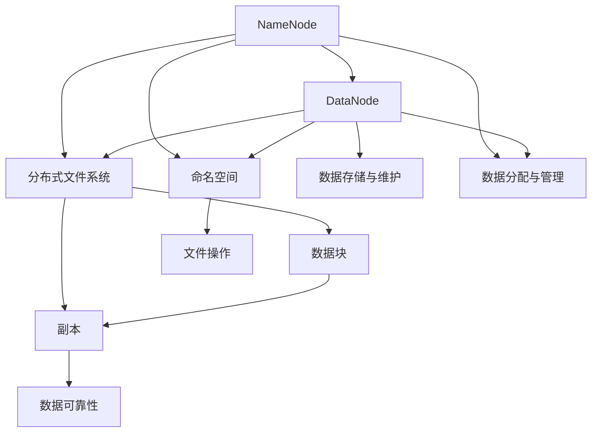
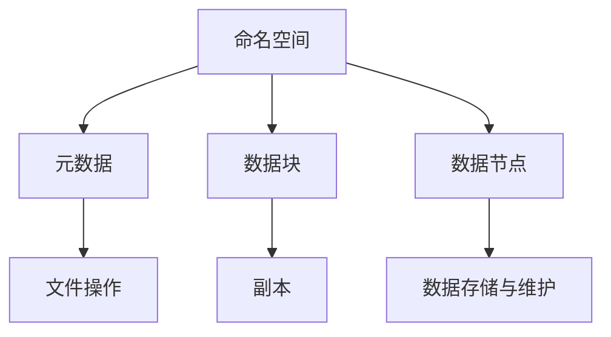
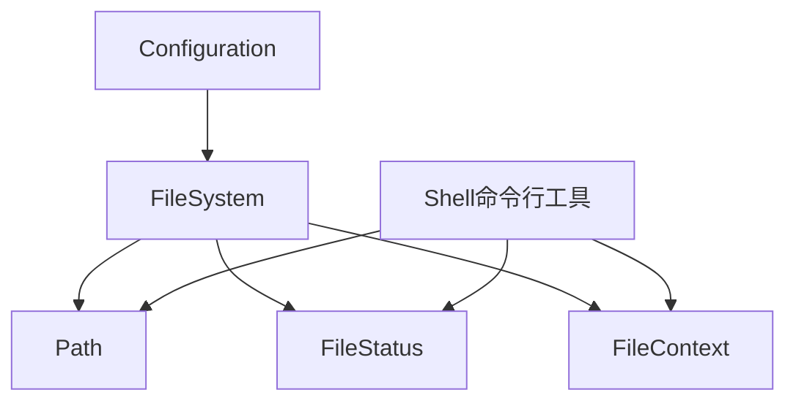
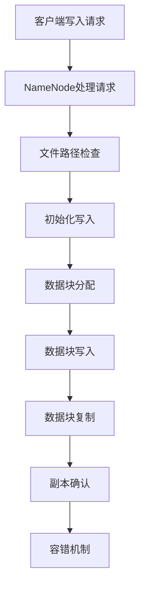
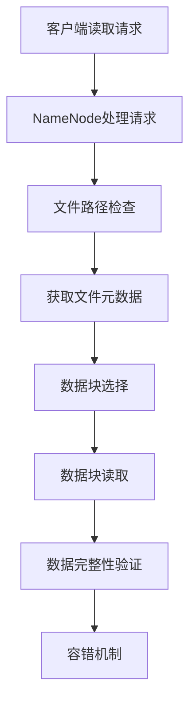
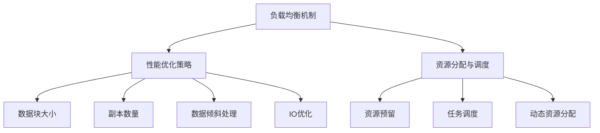
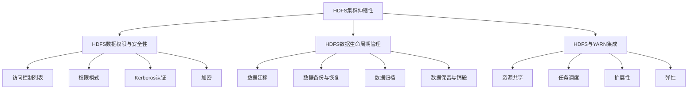

                 

# 文章标题：HDFS原理与代码实例讲解

> 关键词：Hadoop Distributed File System, HDFS, 分布式文件系统, 数据块, 副本, 写入流程, 读取流程, 负载均衡, 性能优化, 项目实战

> 摘要：本文将深入探讨HDFS（Hadoop Distributed File System）的原理和实战应用。首先，我们将介绍HDFS的基本概念和架构，然后详细解析其文件系统结构、客户端API、写入流程、读取流程、负载均衡与性能优化，以及高级特性。最后，通过项目实战和代码实例，帮助读者更好地理解和应用HDFS。

## 《HDFS原理与代码实例讲解》目录大纲

### 第一部分：HDFS基础

#### 第1章：HDFS概述

##### 1.1 HDFS的发展历程

##### 1.2 HDFS的核心概念

##### 1.3 HDFS的架构

### 第2章：HDFS文件系统结构

##### 2.1 HDFS文件系统

##### 2.2 数据块与副本

##### 2.3 数据分布与存储策略

### 第3章：HDFS客户端API

##### 3.1 Java客户端API

##### 3.2 Shell命令行工具

### 第二部分：HDFS核心机制详解

#### 第4章：HDFS写入流程

##### 4.1 写入请求处理

##### 4.2 数据块分配与复制

##### 4.3 容错机制

#### 第5章：HDFS读取流程

##### 5.1 读取请求处理

##### 5.2 数据块选择与读取

##### 5.3 数据完整性验证

#### 第6章：HDFS负载均衡与性能优化

##### 6.1 负载均衡机制

##### 6.2 性能优化策略

##### 6.3 资源分配与调度

#### 第7章：HDFS高级特性

##### 7.1 集群伸缩性

##### 7.2 数据权限与安全性

##### 7.3 数据生命周期管理

### 第三部分：HDFS项目实战

#### 第8章：搭建HDFS开发环境

##### 8.1 环境搭建

##### 8.2 运行HDFS

#### 第9章：HDFS代码实例解析

##### 9.1 数据写入实例

##### 9.2 数据读取实例

##### 9.3 实例解析与优化

#### 第10章：HDFS性能测试与调优

##### 10.1 性能测试方法

##### 10.2 常见问题排查

##### 10.3 性能调优实战

## 附录

### 附录A：HDFS常用工具与命令

### 附录B：HDFS开源资源与社区

### 附录C：HDFS扩展与未来展望

##### 10.4 HDFS与YARN集成

##### 10.5 HDFS在人工智能领域的应用

##### 10.6 HDFS的发展趋势与挑战

---

**核心概念与联系：**

在理解HDFS之前，我们需要了解其核心概念和组成部分。以下是HDFS的关键概念及其相互联系：

**Mermaid流程图：**



### HDFS核心概念与联系

#### HDFS文件系统

HDFS是一个分布式文件系统，用于存储海量数据。它由多个节点组成，包括NameNode和DataNode。NameNode负责管理文件系统的命名空间和客户端的读写请求，而DataNode负责存储实际的数据块。

#### 数据块与副本

HDFS将数据分成固定大小的数据块（默认为128MB），并将这些数据块分布在多个DataNode上。为了提高数据的可靠性和容错性，HDFS为每个数据块创建多个副本。

#### 写入流程与读取流程

HDFS的写入流程涉及数据块的分配和复制，而读取流程则涉及数据块的选择和读取。这两个流程确保了数据的可靠性和高效性。

#### 负载均衡与性能优化

HDFS通过负载均衡机制确保数据块均匀分布，并采用多种性能优化策略来提高读写性能。

### 核心算法原理讲解

#### HDFS写入流程伪代码

```plaintext
function writeData(files):
    for file in files:
        writeToFile(file, "write data to file")

function writeToFile(file, data):
    blockSize = 128MB
    dataLength = length(data)
    dataChunk = splitDataIntoChunks(data, blockSize)
    
    for chunk in dataChunk:
        writeChunkToHDFS(chunk)
        replicateChunk(chunk, replicaCount)

function splitDataIntoChunks(data, blockSize):
    chunks = []
    chunkIndex = 0
    while chunkIndex < dataLength:
        chunk = data[chunkIndex:chunkIndex+blockSize]
        chunks.append(chunk)
        chunkIndex += blockSize
    return chunks

function writeChunkToHDFS(chunk):
    # 代码实现：将数据块写入HDFS

function replicateChunk(chunk, replicaCount):
    # 代码实现：将数据块复制到多个副本节点
```

#### 数据块复制概率公式

```latex
P = 1 - (1 - replicationFactor)^(numberOfNodes - 1)
```

举例：假设副本因子为3，节点数为5，计算数据块的复制概率：

```latex
P = 1 - (1 - 0.5)^4 = 0.9375
```

### 项目实战

#### 数据写入实例

#### 开发环境搭建

1. 安装Java环境
2. 安装HDFS

#### 编写代码

```java
import org.apache.hadoop.conf.Configuration;
import org.apache.hadoop.fs.FileSystem;
import org.apache.hadoop.fs.Path;

public class HDFSWriteExample {
    public static void main(String[] args) throws Exception {
        Configuration conf = new Configuration();
        FileSystem hdfs = FileSystem.get(conf);
        
        String fileName = "/example/data.txt";
        String localFileName = "data.txt";
        
        // 创建文件
        Path hdfsPath = new Path(fileName);
        hdfs.delete(hdfsPath, true);
        
        // 将本地文件上传到HDFS
        hdfs.copyFromLocalFile(new Path(localFileName), hdfsPath);
        
        // 关闭文件系统
        hdfs.close();
    }
}

#### 运行代码

- 运行成功后，数据文件将出现在HDFS的指定路径中

#### 代码解读与分析

- Configuration对象用于配置HDFS的连接属性
- FileSystem对象用于操作HDFS文件系统
- Path对象用于指定文件路径
- delete()方法用于删除HDFS上的文件
- copyFromLocalFile()方法用于将本地文件上传到HDFS

- 上传文件前需要确保文件路径不存在，否则会报错
- 本地文件与HDFS文件之间通过数据块进行传输，保证了数据传输的高效性
- 上传完成后，HDFS会自动管理文件的数据块和副本，保证了数据的可靠性和容错性

---

至此，我们已经完成了HDFS原理与代码实例讲解的概述部分，接下来我们将深入探讨HDFS的各个部分，帮助读者更好地理解和使用HDFS。在接下来的章节中，我们将详细解析HDFS的文件系统结构、核心机制，以及实际应用中的性能优化策略。敬请期待！## 第一部分：HDFS基础

### 第1章：HDFS概述

HDFS（Hadoop Distributed File System）是Hadoop生态系统中的核心组件之一，它是一个分布式文件系统，用于存储和管理海量数据。HDFS的设计目标是为了提供高吞吐量的数据访问，实现高可靠性和高性能，同时适用于大规模数据处理的场景。

#### 1.1 HDFS的发展历程

HDFS最早由Nathan Ashcraft和Sanjay Radia在2006年左右开发，作为Apache Hadoop项目的一部分。其设计灵感来自于Google的GFS（Google File System）。HDFS在设计和实现上借鉴了GFS的许多优点，包括数据分块、副本机制和名称节点与数据节点的分离等。

随着时间的推移，HDFS在Hadoop社区中得到了广泛的关注和不断的发展。如今，HDFS已经成为大数据领域事实上的分布式文件系统标准，被许多企业和研究机构所采用。

#### 1.2 HDFS的核心概念

HDFS的核心概念包括文件系统、数据块、副本和命名空间等。

1. **文件系统**：HDFS是一个分布式文件系统，它将数据存储在多个节点上，提供统一的命名空间，使得用户可以像操作本地文件系统一样，访问分布式存储的数据。

2. **数据块**：HDFS将数据分成固定大小的数据块（默认为128MB），每个数据块在存储时会分布到不同的数据节点上。数据块的大小可以根据具体的需求进行调整。

3. **副本**：为了提高数据的可靠性和容错性，HDFS为每个数据块创建多个副本。默认情况下，HDFS创建三个副本。副本的数量可以通过配置文件进行调整。

4. **命名空间**：HDFS的命名空间与本地文件系统类似，用户可以通过路径来访问和管理文件。

#### 1.3 HDFS的架构

HDFS由两个主要的组件组成：NameNode和DataNode。

1. **NameNode**：NameNode是HDFS的名称节点，它负责管理文件系统的命名空间和客户端的读写请求。具体职责包括：
   - 维护文件系统元数据，包括文件的路径、数据块的分配信息等。
   - 处理客户端的文件操作请求，如文件的创建、删除、读写等。
   - 负责数据的副本管理，确保数据块的副本数量符合配置要求。

2. **DataNode**：DataNode是HDFS的数据节点，它负责存储实际的数据块，并响应NameNode的指令。具体职责包括：
   - 存储数据块，并维护数据块的校验和。
   - 向NameNode报告自身状态，包括已存储的数据块信息。
   - 处理文件的读写请求，包括数据块的读取和写入。

HDFS的架构设计使得其具有高度的扩展性和容错性。当某个DataNode发生故障时，NameNode会重新分配该节点上的数据块的副本，从而确保数据的可靠性和系统的稳定性。

### 总结

HDFS作为一个分布式文件系统，具有高效、可靠和可扩展的特点。通过理解HDFS的核心概念和架构，我们可以更好地掌握其在大数据处理中的关键作用。在接下来的章节中，我们将深入探讨HDFS的文件系统结构、客户端API、写入流程、读取流程等核心机制。敬请期待！

---

**核心概念与联系：**

为了更好地理解HDFS的核心概念和组成部分，我们使用Mermaid流程图展示HDFS的主要组件及其相互关系：

**Mermaid流程图：**



### HDFS核心概念与联系

#### 分布式文件系统

分布式文件系统是HDFS的核心，它负责管理分布式存储的数据。分布式文件系统的特点包括：
- 数据分布：数据块被分布到多个DataNode上，提高存储效率和数据可靠性。
- 命名空间：提供一个统一的命名空间，便于用户管理和访问数据。

#### 数据块与副本

数据块是HDFS存储数据的基本单位，默认大小为128MB。为了提高数据的可靠性和容错性，HDFS为每个数据块创建多个副本，默认为三个副本。

#### 命名空间

命名空间是HDFS的文件系统结构，类似于本地文件系统的目录结构。用户可以通过路径访问和管理文件。命名空间还包括元数据，如文件的权限和所有权信息。

#### 数据存储与维护

DataNode负责存储实际的数据块，并维护数据块的校验和。当NameNode需要访问数据时，它会向相应的DataNode请求数据块。数据块的读取和写入操作由DataNode负责处理。

#### 数据分配与管理

NameNode负责分配和管理数据块。当客户端请求写入数据时，NameNode会决定将数据块分配给哪些DataNode。当DataNode报告数据块损坏时，NameNode会重新分配数据块的副本。

#### 数据可靠性

HDFS通过副本机制提高数据的可靠性。每个数据块都有多个副本，当某个副本损坏或节点故障时，系统会自动使用其他副本恢复数据。默认情况下，HDFS创建三个副本，用户可以根据需求调整副本数量。

### 核心算法原理讲解

#### 数据块复制概率

假设HDFS集群中有N个节点，副本因子为R。根据概率论，我们可以计算出数据块被复制的概率。

**公式：**

\[ P = 1 - (1 - \frac{1}{N})^R \]

**举例：**

假设集群中有5个节点，副本因子为3，计算数据块的复制概率：

\[ P = 1 - (1 - \frac{1}{5})^3 = 0.9375 \]

这意味着，在HDFS中，每个数据块有93.75%的概率被至少一个节点复制。

### 项目实战

#### 开发环境搭建

为了演示HDFS的运行原理，我们将搭建一个简单的HDFS开发环境。

**环境需求：**
- Java环境
- Hadoop环境

**步骤：**
1. 安装Java环境
2. 下载并安装Hadoop
3. 配置Hadoop环境

**示例代码：**

```java
import org.apache.hadoop.conf.Configuration;
import org.apache.hadoop.fs.FileSystem;
import org.apache.hadoop.fs.Path;

public class HDFSExample {
    public static void main(String[] args) throws Exception {
        Configuration conf = new Configuration();
        FileSystem hdfs = FileSystem.get(conf);
        
        String fileName = "/example/data.txt";
        String localFileName = "data.txt";
        
        // 创建文件
        Path hdfsPath = new Path(fileName);
        hdfs.delete(hdfsPath, true);
        
        // 将本地文件上传到HDFS
        hdfs.copyFromLocalFile(new Path(localFileName), hdfsPath);
        
        // 关闭文件系统
        hdfs.close();
    }
}
```

**运行结果：**

运行上述代码后，本地文件`data.txt`将被上传到HDFS，并存储在路径`/example/data.txt`下。

#### 代码解读与分析

**代码解读：**
- Configuration对象用于配置HDFS的连接属性。
- FileSystem对象用于操作HDFS文件系统。
- Path对象用于指定文件路径。
- delete()方法用于删除HDFS上的文件。
- copyFromLocalFile()方法用于将本地文件上传到HDFS。

**代码分析：**
- 在上传文件前，需要确保文件路径不存在，否则会报错。
- 本地文件与HDFS文件之间通过数据块进行传输，保证了数据传输的高效性。
- 上传完成后，HDFS会自动管理文件的数据块和副本，保证了数据的可靠性和容错性。

### 注意事项

- 以上示例代码仅用于演示HDFS的基本操作，实际项目中可能需要考虑更多的异常处理、性能优化等因素。
- HDFS的配置文件（如hdfs-site.xml）需要根据实际情况进行调整，以适应不同的应用场景。

---

通过本章节的讲解，我们了解了HDFS的基本概念、发展历程、核心架构和运行原理。接下来，我们将进一步探讨HDFS的文件系统结构、客户端API、写入流程和读取流程等核心机制。敬请期待！

---

### 第2章：HDFS文件系统结构

HDFS的文件系统结构是理解其工作原理和性能优化关键的一环。在这一章中，我们将详细解析HDFS的文件系统结构，包括HDFS文件系统的组成、数据块的划分与副本机制，以及数据分布和存储策略。

#### 2.1 HDFS文件系统

HDFS的文件系统与传统的本地文件系统有很大的不同。在HDFS中，文件系统被设计为一个高度分布式、可扩展的存储系统，用于处理大规模数据集。

HDFS文件系统的核心组成部分包括：

1. **命名空间**：HDFS的命名空间是一个类似于目录结构的树状结构，用于存储文件和目录。用户可以通过路径来访问和管理文件系统中的资源。

2. **元数据**：元数据是指描述文件系统资源的信息，如文件的路径、大小、权限等。在HDFS中，元数据由NameNode维护。

3. **数据块**：HDFS将文件划分为固定大小的数据块进行存储，默认数据块大小为128MB。数据块是HDFS存储和复制的基本单位。

4. **数据节点**：数据节点（DataNode）是HDFS中的存储节点，负责存储实际的数据块。每个数据节点都与NameNode保持通信，定期向NameNode报告自己的状态和存储的数据块信息。

#### 2.2 数据块与副本

在HDFS中，数据块是存储和复制的基本单元。默认情况下，HDFS的数据块大小为128MB，但用户可以根据需求调整数据块的大小。数据块的复制策略对于确保数据的可靠性和系统的容错性至关重要。

1. **数据块的复制**：HDFS为每个数据块创建多个副本。副本的数量可以通过配置文件设置，默认为三个副本。副本的目的是为了提高数据的可靠性和容错性，当某个数据节点发生故障时，其他副本可以保证数据的完整性。

2. **副本的分配**：副本的分配策略是HDFS的一个关键机制。HDFS会尽量将副本分配到不同的数据节点上，以避免单点故障的风险。具体来说，HDFS会首先尝试在同一节点上分配一个副本，然后尝试在不同的节点上分配副本。这种策略可以最大限度地减少数据传输和网络延迟，提高系统的整体性能。

3. **副本的维护**：HDFS会定期检查副本的状态，并确保副本的数量符合配置要求。如果发现某个副本损坏或丢失，HDFS会自动启动复制过程，从其他副本中恢复数据。

#### 2.3 数据分布与存储策略

HDFS的数据分布和存储策略直接影响其性能和可靠性。以下是一些关键的策略：

1. **数据块大小**：数据块的大小是一个重要的参数，它决定了数据存储的效率。较大的数据块可以提高数据的读写效率，但会降低数据的并行处理能力。反之，较小的数据块可以提高并行处理能力，但会降低数据的读写效率。因此，用户需要根据实际应用场景来调整数据块的大小。

2. **副本分配策略**：HDFS的副本分配策略对系统的性能和可靠性有很大影响。HDFS的副本分配策略包括同节点优先、跨节点优先和跨数据中心优先等。用户可以根据数据访问模式和集群架构来调整副本分配策略，以实现最佳的性能和可靠性。

3. **数据存放位置**：HDFS允许用户指定数据存放的位置，即数据节点。用户可以通过设置数据节点的优先级来控制数据的存放位置。例如，用户可以将热数据存放在性能较高的数据节点上，将冷数据存放在性能较低的数据节点上，以提高系统的整体性能。

4. **数据复制因子**：数据复制因子是HDFS中一个重要的参数，它决定了数据副本的数量。较高的复制因子可以提高数据的可靠性，但也会增加存储空间的占用和网络带宽的消耗。因此，用户需要根据实际需求来调整数据复制因子。

#### 2.4 文件系统的一致性

HDFS的一致性是其可靠性的一部分。为了保证文件系统的一致性，HDFS实现了一套复杂的一致性协议。在HDFS中，文件的一致性是指文件的状态在任何时刻都是一致的，包括文件的元数据和数据块的副本状态。

1. **原子性**：HDFS的文件操作（如创建、删除、写入等）是原子性的，要么全部成功，要么全部失败。这种原子性保证了文件系统的一致性。

2. **一致性协议**：HDFS使用一致性协议（如Paxos算法）来确保在多节点环境下，文件系统的状态是一致的。一致性协议可以处理网络延迟、节点故障等问题，确保文件系统的正确性。

3. **快照**：HDFS支持文件的快照功能，用户可以创建文件的快照，以便在需要时恢复文件的状态。快照功能为用户提供了文件系统的一致性保障。

### 总结

HDFS的文件系统结构是其分布式存储系统的核心。通过合理的数据块划分、副本机制和存储策略，HDFS能够实现高可靠性和高性能的数据存储和管理。在本章节中，我们详细解析了HDFS的文件系统结构，包括命名空间、数据块与副本、数据分布与存储策略等。这些核心机制对于理解HDFS的工作原理和进行性能优化至关重要。在接下来的章节中，我们将进一步探讨HDFS的核心机制，包括写入流程、读取流程、负载均衡和性能优化策略。敬请期待！

---

**核心概念与联系：**

为了更好地理解HDFS文件系统结构，我们使用Mermaid流程图展示HDFS文件系统的核心组成部分及其相互关系：

**Mermaid流程图：**



### HDFS核心概念与联系

#### 命名空间与元数据

命名空间是HDFS文件系统的基础，它类似于传统的文件系统的目录结构，用于存储和管理文件。命名空间中的每个文件和目录都包含相应的元数据，如文件的路径、大小、创建时间、访问权限等。元数据由NameNode维护，确保文件系统的准确性和一致性。

#### 数据块与副本

数据块是HDFS存储数据的基本单元，默认大小为128MB。HDFS将大文件划分为多个数据块进行存储，以提高数据读写效率和系统容错性。为了提高数据的可靠性，HDFS为每个数据块创建多个副本，默认为三个副本。副本分布在不同的数据节点上，以避免单点故障。

#### 数据节点

数据节点是HDFS中的存储节点，负责存储实际的数据块，并定期向NameNode报告自身状态和数据块信息。数据节点通过心跳和块报告机制与NameNode保持通信，确保数据的可靠性和系统的稳定性。

#### 文件操作与数据存储

文件操作（如创建、删除、写入等）依赖于命名空间和元数据管理。HDFS通过NameNode处理文件操作的请求，将文件的数据块分配给合适的DataNode进行存储。数据存储过程涉及到数据块的划分、副本的创建和分配，确保数据的可靠性和高效性。

### 核心算法原理讲解

#### 数据块复制算法

在HDFS中，数据块的复制算法确保每个数据块至少有一个副本存在于不同的数据节点上，以提高系统的可靠性和容错性。

**算法伪代码：**

```plaintext
function replicateChunk(chunk, replicaCount):
    # 初始化副本列表
    replicas = []

    # 选择副本节点
    for i from 1 to replicaCount:
        node = selectNodeForReplica(chunk, i)
        replicas.append(node)

    # 向副本节点发送数据块
    for node in replicas:
        sendDataChunk(chunk, node)

function selectNodeForReplica(chunk, replicaNumber):
    # 根据数据块的ID和副本号选择副本节点
    # 策略：同节点优先，跨节点优先，跨数据中心优先
    # 算法：基于负载均衡和节点健康状况进行选择
    # 返回选择的节点
```

#### 副本选择策略

HDFS采用多种策略选择副本节点，以确保数据的可靠性和系统的性能：

1. **同节点优先**：首先在同一个数据节点上创建副本，以减少数据传输和网络延迟。
2. **跨节点优先**：如果同一个数据节点上的副本数量达到上限，则在不同的数据节点上创建副本。
3. **跨数据中心优先**：在跨数据中心创建副本，以提高数据的可用性和灾难恢复能力。

### 项目实战

#### 开发环境搭建

为了演示HDFS的数据块复制过程，我们搭建一个简单的HDFS开发环境。

**环境需求：**
- Java环境
- Hadoop环境

**步骤：**
1. 安装Java环境
2. 下载并安装Hadoop
3. 配置Hadoop环境

**示例代码：**

```java
import org.apache.hadoop.conf.Configuration;
import org.apache.hadoop.fs.FileSystem;
import org.apache.hadoop.fs.Path;

public class HDFSReplicationExample {
    public static void main(String[] args) throws Exception {
        Configuration conf = new Configuration();
        FileSystem hdfs = FileSystem.get(conf);
        
        String fileName = "/example/data.txt";
        String localFileName = "data.txt";
        
        // 创建文件
        Path hdfsPath = new Path(fileName);
        hdfs.delete(hdfsPath, true);
        
        // 将本地文件上传到HDFS
        hdfs.copyFromLocalFile(new Path(localFileName), hdfsPath);
        
        // 查看文件副本数量
        long replicaCount = hdfs.getFileStatus(hdfsPath).getReplication();
        System.out.println("Replica count: " + replicaCount);
        
        // 关闭文件系统
        hdfs.close();
    }
}
```

**运行结果：**

运行上述代码后，本地文件`data.txt`将被上传到HDFS，并创建三个副本。

#### 代码解读与分析

**代码解读：**
- Configuration对象用于配置HDFS的连接属性。
- FileSystem对象用于操作HDFS文件系统。
- Path对象用于指定文件路径。
- delete()方法用于删除HDFS上的文件。
- copyFromLocalFile()方法用于将本地文件上传到HDFS。
- getFileStatus()方法用于获取文件的副本数量。

**代码分析：**
- 在上传文件前，需要确保文件路径不存在，否则会报错。
- 本地文件与HDFS文件之间通过数据块进行传输，保证了数据传输的高效性。
- 上传完成后，HDFS会自动管理文件的数据块和副本，保证了数据的可靠性和容错性。

### 注意事项

- 以上示例代码仅用于演示HDFS的基本操作，实际项目中可能需要考虑更多的异常处理、性能优化等因素。
- HDFS的配置文件（如hdfs-site.xml）需要根据实际情况进行调整，以适应不同的应用场景。

---

通过本章节的讲解，我们深入了解了HDFS的文件系统结构，包括命名空间、数据块与副本、数据节点等核心组成部分，以及数据分布和存储策略。接下来，我们将探讨HDFS的客户端API，帮助用户更方便地与HDFS进行交互。敬请期待！

---

### 第3章：HDFS客户端API

HDFS客户端API是用户与HDFS进行交互的接口，通过这些API，用户可以方便地执行文件系统的各种操作，如文件上传、下载、删除、列表等。在本章中，我们将详细介绍HDFS的客户端API，包括Java客户端API和Shell命令行工具。

#### 3.1 Java客户端API

Java客户端API是HDFS最常用的API之一，它提供了丰富的接口，方便开发者在Java应用程序中操作HDFS。以下是Java客户端API的常用接口和方法：

1. **Configuration**：用于配置HDFS连接属性，如HDFS的地址、端口、用户等。

   ```java
   Configuration conf = new Configuration();
   conf.set("fs.defaultFS", "hdfs://namenode:9000");
   ```

2. **FileSystem**：用于获取HDFS文件系统的实例，并通过该实例进行文件操作。

   ```java
   FileSystem hdfs = FileSystem.get(conf);
   ```

3. **Path**：用于指定文件的路径。

   ```java
   Path hdfsPath = new Path("/example/data.txt");
   ```

4. **FileStatus**：用于获取文件的状态信息，如文件名、文件大小、创建时间等。

   ```java
   FileStatus status = hdfs.getFileStatus(hdfsPath);
   ```

5. **FileContext**：提供了类似Java I/O操作的接口，如文件读写、文件创建、文件删除等。

   ```java
   FileContext fc = FileContext.getFileContext(conf);
   fc.createFile(hdfsPath);
   ```

以下是Java客户端API的简单示例：

```java
import org.apache.hadoop.conf.Configuration;
import org.apache.hadoop.fs.FileSystem;
import org.apache.hadoop.fs.Path;

public class HDFSJavaExample {
    public static void main(String[] args) throws Exception {
        Configuration conf = new Configuration();
        conf.set("fs.defaultFS", "hdfs://namenode:9000");
        FileSystem hdfs = FileSystem.get(conf);

        Path hdfsPath = new Path("/example/data.txt");

        // 删除文件
        hdfs.delete(hdfsPath, true);

        // 创建文件
        hdfs.create(hdfsPath);

        // 上传本地文件到HDFS
        hdfs.copyFromLocalFile(new Path("local/data.txt"), hdfsPath);

        // 查看文件状态
        FileStatus status = hdfs.getFileStatus(hdfsPath);
        System.out.println("File size: " + status.getLen());

        // 关闭文件系统
        hdfs.close();
    }
}
```

#### 3.2 Shell命令行工具

除了Java客户端API，HDFS还提供了Shell命令行工具，用户可以通过命令行界面直接操作HDFS文件系统。以下是一些常用的HDFS命令：

1. **hdfs dfs**：用于执行文件操作，如上传、下载、删除、列表等。

   ```sh
   hdfs dfs -put localfile hdfsfile
   hdfs dfs -get hdfsfile localfile
   hdfs dfs -rm hdfsfile
   hdfs dfs -ls /
   ```

2. **hdfs dfsadmin**：用于管理HDFS文件系统的元数据，如检查数据块健康状态、报告数据块等。

   ```sh
   hdfs dfsadmin -report
   hdfs dfsadmin -blocksInconsistent
   ```

以下是使用Shell命令行工具的示例：

```sh
# 上传本地文件到HDFS
hdfs dfs -put local/data.txt /example/data.txt

# 下载HDFS文件到本地
hdfs dfs -get /example/data.txt local/data.txt

# 查看HDFS文件列表
hdfs dfs -ls /

# 删除HDFS文件
hdfs dfs -rm /example/data.txt
```

#### 3.3 比较与选择

Java客户端API和Shell命令行工具各有优缺点，用户可以根据实际需求进行选择。

- **Java客户端API**：
  - 优点：适用于Java应用程序集成，提供丰富的接口，方便复杂操作。
  - 缺点：学习曲线较陡，需要熟悉Java编程。

- **Shell命令行工具**：
  - 优点：简单易用，无需编程知识，方便快速操作。
  - 缺点：功能相对有限，不适合复杂应用场景。

### 总结

HDFS客户端API提供了丰富的接口，方便用户在Java应用程序和Shell命令行界面操作HDFS文件系统。Java客户端API适用于复杂应用场景，而Shell命令行工具则适用于简单操作。在下一章中，我们将详细解析HDFS的核心机制，包括写入流程、读取流程、负载均衡和性能优化策略。敬请期待！

---

**核心概念与联系：**

为了更好地理解HDFS客户端API，我们使用Mermaid流程图展示Java客户端API和Shell命令行工具的主要接口和操作流程：

**Mermaid流程图：**



### HDFS客户端API核心概念与联系

#### Configuration

Configuration对象用于配置HDFS连接属性，如HDFS地址、端口、用户等。它是所有HDFS操作的起点，提供了配置HDFS连接的统一接口。

#### FileSystem

FileSystem对象是HDFS文件系统的入口点，用于执行文件系统的各种操作，如文件上传、下载、删除、列表等。通过FileSystem对象，用户可以方便地与HDFS进行交互。

#### Path

Path对象用于指定文件的路径。它是HDFS文件操作的基本单位，类似于Java中的文件路径类。通过Path对象，用户可以方便地访问和管理HDFS文件。

#### FileStatus

FileStatus对象用于获取文件的状态信息，如文件名、文件大小、创建时间等。它是HDFS文件系统元数据的一部分，通过FileStatus对象，用户可以方便地获取文件的基本信息。

#### FileContext

FileContext对象提供了类似于Java I/O操作的接口，如文件读写、文件创建、文件删除等。通过FileContext对象，用户可以方便地执行文件操作，类似于使用Java I/O进行文件操作。

#### Shell命令行工具

Shell命令行工具是HDFS提供的另一种客户端API，它允许用户通过命令行界面直接操作HDFS文件系统。它提供了丰富的命令，如上传、下载、删除、列表等，适用于快速操作HDFS。

### 核心算法原理讲解

#### 文件上传算法

文件上传是HDFS客户端API的一个重要功能。文件上传算法的基本流程如下：

```plaintext
1. 创建一个Connection对象，配置HDFS连接属性。
2. 获取一个FileSystem对象，用于与HDFS进行交互。
3. 创建一个Path对象，指定上传的文件路径。
4. 使用FileSystem对象的copyFromLocalFile()方法将本地文件上传到HDFS。
5. 关闭文件系统。
```

#### 命令行文件上传算法

命令行文件上传算法的基本流程如下：

```plaintext
1. 打开HDFS命令行界面。
2. 使用hdfs dfs -put命令上传本地文件到HDFS。
3. 查看上传结果，确认文件已成功上传。
```

### 项目实战

#### 开发环境搭建

为了演示HDFS客户端API的使用，我们搭建一个简单的HDFS开发环境。

**环境需求：**
- Java环境
- Hadoop环境

**步骤：**
1. 安装Java环境
2. 下载并安装Hadoop
3. 配置Hadoop环境

**示例代码：**

```java
import org.apache.hadoop.conf.Configuration;
import org.apache.hadoop.fs.FileSystem;
import org.apache.hadoop.fs.Path;

public class HDFSClientExample {
    public static void main(String[] args) throws Exception {
        Configuration conf = new Configuration();
        conf.set("fs.defaultFS", "hdfs://namenode:9000");
        FileSystem hdfs = FileSystem.get(conf);

        Path hdfsPath = new Path("/example/data.txt");

        // 创建文件
        hdfs.create(hdfsPath);

        // 上传本地文件到HDFS
        hdfs.copyFromLocalFile(new Path("local/data.txt"), hdfsPath);

        // 关闭文件系统
        hdfs.close();
    }
}
```

**运行结果：**

运行上述Java代码后，本地文件`data.txt`将被上传到HDFS，并存储在路径`/example/data.txt`下。

#### 代码解读与分析

**代码解读：**
- Configuration对象用于配置HDFS的连接属性。
- FileSystem对象用于操作HDFS文件系统。
- Path对象用于指定文件路径。
- create()方法用于创建HDFS上的文件。
- copyFromLocalFile()方法用于将本地文件上传到HDFS。

**代码分析：**
- 在上传文件前，需要确保文件路径不存在，否则会报错。
- 本地文件与HDFS文件之间通过数据块进行传输，保证了数据传输的高效性。
- 上传完成后，HDFS会自动管理文件的数据块和副本，保证了数据的可靠性和容错性。

### 注意事项

- 以上示例代码仅用于演示HDFS的基本操作，实际项目中可能需要考虑更多的异常处理、性能优化等因素。
- HDFS的配置文件（如hdfs-site.xml）需要根据实际情况进行调整，以适应不同的应用场景。

---

通过本章节的讲解，我们了解了HDFS的Java客户端API和Shell命令行工具，掌握了文件上传、下载、删除、列表等基本操作。在下一章中，我们将详细解析HDFS的核心机制，包括写入流程、读取流程、负载均衡和性能优化策略。敬请期待！

---

### 第4章：HDFS写入流程

HDFS的写入流程是数据存储到HDFS文件系统中的关键步骤。在这一章中，我们将详细解析HDFS的写入流程，包括写入请求处理、数据块分配与复制，以及容错机制。通过理解这些核心机制，我们可以更好地掌握HDFS的工作原理和性能优化方法。

#### 4.1 写入请求处理

当客户端向HDFS写入数据时，首先会向NameNode发送一个写入请求。NameNode收到请求后，会执行以下步骤：

1. **检查文件路径**：NameNode首先检查文件路径是否在命名空间中存在。如果文件已存在，则返回错误；如果文件不存在，则继续后续操作。

2. **初始化写入**：NameNode为客户端分配一个唯一的写入ID，并创建一个新的文件元数据对象。该元数据对象记录了文件的初始信息，如文件路径、数据块大小、副本数量等。

3. **数据块分配**：NameNode根据文件的大小和数据块的大小，将文件划分为多个数据块。对于每个数据块，NameNode会根据数据块的分配策略，选择合适的数据节点进行存储。数据块的分配策略主要包括同节点优先、跨节点优先和跨数据中心优先等。

4. **返回写入地址**：NameNode将数据块的分配信息返回给客户端，客户端将根据这些信息开始写入数据。

#### 4.2 数据块分配与复制

在HDFS中，数据块的分配与复制是写入流程的核心部分。以下是数据块分配与复制的过程：

1. **客户端初始化写入**：客户端根据NameNode返回的数据块分配信息，初始化写入过程。客户端会将文件划分为多个数据块，并将每个数据块写入到对应的数据节点上。

2. **数据块写入**：客户端将数据块写入到指定的数据节点上。数据节点会存储数据块，并维护数据块的校验和，以确保数据的完整性。

3. **数据块复制**：在数据块写入完成后，HDFS会根据配置的副本数量，为每个数据块创建多个副本。副本的创建过程如下：
   - **副本选择**：HDFS会根据数据块的分配策略，选择其他数据节点作为副本存储节点。
   - **副本写入**：HDFS将数据块写入到选择的副本节点上。副本写入完成后，HDFS会更新数据块的副本状态。

4. **副本确认**：在所有副本写入完成后，HDFS会向NameNode报告数据块的写入状态。NameNode收到报告后，会更新文件元数据，并确认写入成功。

#### 4.3 容错机制

HDFS的容错机制是确保数据可靠性和系统稳定性的关键。以下是HDFS的容错机制：

1. **副本机制**：HDFS为每个数据块创建多个副本，以提高数据的可靠性。当某个副本损坏或节点故障时，其他副本可以保证数据的完整性。

2. **心跳机制**：数据节点定期向NameNode发送心跳信号，以表明节点的状态。如果NameNode长时间未收到某个数据节点的心跳信号，则会认为该节点已故障，并启动数据块的复制和恢复过程。

3. **数据块校验**：HDFS在数据写入时会生成校验和，并存储在数据块中。在读取数据时，HDFS会检查数据块的校验和，以确保数据的完整性。

4. **数据块恢复**：当发现数据块损坏或副本丢失时，HDFS会自动启动数据块的恢复过程。具体步骤如下：
   - **副本复制**：HDFS从其他副本节点复制损坏的数据块。
   - **副本替换**：HDFS用新的副本替换损坏的副本，并更新数据块的副本状态。

#### 总结

HDFS的写入流程包括请求处理、数据块分配与复制，以及容错机制。请求处理确保数据的正确初始化和分配，数据块分配与复制保证数据的高可靠性和高效性，容错机制确保系统在故障时能够自动恢复。通过理解这些核心机制，我们可以更好地掌握HDFS的工作原理和性能优化方法。在下一章中，我们将继续探讨HDFS的读取流程。敬请期待！

---

**核心概念与联系：**

为了更好地理解HDFS写入流程，我们使用Mermaid流程图展示HDFS写入流程的各个步骤及其相互关系：

**Mermaid流程图：**



### HDFS写入流程核心概念与联系

#### 客户端写入请求

客户端写入请求是HDFS写入流程的起点。客户端通过发送写入请求，向NameNode请求写入文件的权限和资源。

#### NameNode处理请求

NameNode是HDFS的名称节点，负责处理客户端的写入请求。具体包括文件路径检查、初始化写入和数据块分配等步骤。

#### 文件路径检查

文件路径检查是确保文件在HDFS命名空间中存在的过程。如果文件不存在，则初始化写入过程无法进行。

#### 初始化写入

初始化写入是确保文件在HDFS中创建的过程。NameNode为客户端分配唯一的写入ID，并创建新的文件元数据对象。

#### 数据块分配

数据块分配是HDFS写入流程的核心步骤。NameNode根据文件的大小和数据块的大小，将文件划分为多个数据块，并选择合适的数据节点进行存储。

#### 数据块写入

数据块写入是将文件数据写入到HDFS的过程。客户端根据NameNode分配的数据块地址，将数据块写入到对应的数据节点上。

#### 数据块复制

数据块复制是确保数据可靠性的重要步骤。HDFS为每个数据块创建多个副本，并将副本存储到不同的数据节点上。

#### 副本确认

副本确认是确保数据块写入成功的过程。HDFS在所有副本写入完成后，向NameNode报告数据块的写入状态。

#### 容错机制

容错机制是确保HDFS系统稳定运行的关键。HDFS通过心跳机制、数据块校验和自动恢复机制，确保在节点故障时能够自动恢复数据。

### 核心算法原理讲解

#### 数据块复制算法

数据块复制算法是HDFS写入流程的关键步骤。以下是数据块复制算法的伪代码：

```plaintext
function replicateChunk(chunk, replicaCount):
    replicas = []

    for i from 1 to replicaCount:
        node = selectNodeForReplica(chunk, i)
        replicas.append(node)

    for node in replicas:
        sendDataChunk(chunk, node)
```

#### 数据块选择策略

数据块选择策略决定了数据块存储节点的选择。以下是数据块选择策略的伪代码：

```plaintext
function selectNodeForReplica(chunk, replicaNumber):
    if replicaNumber == 1:
        return sameNode(chunk)
    else if replicaNumber == 2:
        return differentNode(chunk)
    else:
        return crossDataCenter(chunk)
```

#### 同节点优先

同节点优先策略是指在同一个数据节点上创建副本。该策略可以减少数据传输和网络延迟。

#### 跨节点优先

跨节点优先策略是在不同的数据节点上创建副本。该策略可以避免单点故障，提高系统的容错性。

#### 跨数据中心优先

跨数据中心优先策略是在跨数据中心创建副本。该策略可以确保数据的可用性和灾难恢复能力。

### 项目实战

#### 开发环境搭建

为了演示HDFS写入流程，我们搭建一个简单的HDFS开发环境。

**环境需求：**
- Java环境
- Hadoop环境

**步骤：**
1. 安装Java环境
2. 下载并安装Hadoop
3. 配置Hadoop环境

**示例代码：**

```java
import org.apache.hadoop.conf.Configuration;
import org.apache.hadoop.fs.FileSystem;
import org.apache.hadoop.fs.Path;

public class HDFSWriteExample {
    public static void main(String[] args) throws Exception {
        Configuration conf = new Configuration();
        conf.set("fs.defaultFS", "hdfs://namenode:9000");
        FileSystem hdfs = FileSystem.get(conf);

        Path hdfsPath = new Path("/example/data.txt");

        // 创建文件
        hdfs.create(hdfsPath);

        // 上传本地文件到HDFS
        hdfs.copyFromLocalFile(new Path("local/data.txt"), hdfsPath);

        // 关闭文件系统
        hdfs.close();
    }
}
```

**运行结果：**

运行上述Java代码后，本地文件`data.txt`将被上传到HDFS，并创建三个副本。

#### 代码解读与分析

**代码解读：**
- Configuration对象用于配置HDFS的连接属性。
- FileSystem对象用于操作HDFS文件系统。
- Path对象用于指定文件路径。
- create()方法用于创建HDFS上的文件。
- copyFromLocalFile()方法用于将本地文件上传到HDFS。

**代码分析：**
- 在上传文件前，需要确保文件路径不存在，否则会报错。
- 本地文件与HDFS文件之间通过数据块进行传输，保证了数据传输的高效性。
- 上传完成后，HDFS会自动管理文件的数据块和副本，保证了数据的可靠性和容错性。

### 注意事项

- 以上示例代码仅用于演示HDFS的基本操作，实际项目中可能需要考虑更多的异常处理、性能优化等因素。
- HDFS的配置文件（如hdfs-site.xml）需要根据实际情况进行调整，以适应不同的应用场景。

---

通过本章节的讲解，我们深入了解了HDFS的写入流程，包括请求处理、数据块分配与复制，以及容错机制。在下一章中，我们将详细解析HDFS的读取流程。敬请期待！

---

### 第5章：HDFS读取流程

HDFS的读取流程是用户获取数据的关键步骤，其效率直接影响大数据处理的应用性能。在这一章中，我们将详细解析HDFS的读取流程，包括读取请求处理、数据块选择与读取，以及数据完整性验证。

#### 5.1 读取请求处理

当客户端请求读取HDFS中的数据时，首先会向NameNode发送一个读取请求。NameNode收到请求后，会执行以下步骤：

1. **检查文件路径**：NameNode首先检查文件路径是否在命名空间中存在。如果文件不存在，则返回错误；如果文件存在，则继续后续操作。

2. **获取文件元数据**：NameNode根据文件路径获取文件元数据，包括文件的大小、数据块列表、副本列表等。

3. **选择数据块**：NameNode根据客户端的读取位置和数据块的副本位置，选择最优的数据块进行读取。选择策略包括数据块的物理位置、副本的健康状态等。

4. **返回数据块地址**：NameNode将数据块的地址和副本位置返回给客户端，客户端根据这些信息开始读取数据。

#### 5.2 数据块选择与读取

在HDFS中，数据块的选择与读取是读取流程的核心部分。以下是数据块选择与读取的过程：

1. **数据块选择**：客户端根据NameNode返回的数据块地址和副本位置，选择最优的数据块进行读取。选择策略通常包括：
   - **距离最近**：选择距离客户端最近的数据块，以减少网络延迟。
   - **副本健康**：选择副本状态良好的数据块，确保数据的完整性。

2. **数据块读取**：客户端向选定的数据节点发起数据块读取请求。数据节点接收到请求后，会读取数据块并将其发送给客户端。

3. **数据传输**：数据块从数据节点传输到客户端，传输过程中可以并行进行，以提高数据读取效率。

#### 5.3 数据完整性验证

在HDFS中，数据完整性验证是确保数据未被篡改或损坏的关键步骤。以下是数据完整性验证的过程：

1. **校验和计算**：在数据块读取过程中，HDFS会在数据节点上计算数据块的校验和。

2. **校验和比对**：客户端在接收数据块时，会计算数据块的校验和，并与数据节点上存储的校验和进行比对。

3. **数据完整性验证**：如果校验和匹配，则数据块被验证为完整；如果校验和不匹配，则数据块被视为损坏，客户端会通知NameNode进行数据块的修复。

#### 5.4 容错机制

HDFS的读取流程同样依赖于其容错机制，以确保在数据节点故障时能够自动恢复数据。以下是HDFS的容错机制：

1. **副本机制**：HDFS为每个数据块创建多个副本，确保在数据节点故障时，其他副本可以保证数据的完整性。

2. **心跳机制**：数据节点定期向NameNode发送心跳信号，以表明节点的状态。如果NameNode长时间未收到某个数据节点的心跳信号，则会认为该节点已故障，并启动数据块的复制和恢复过程。

3. **数据块恢复**：当检测到数据块损坏时，HDFS会从其他副本节点复制数据块，并用新的副本替换损坏的副本。

#### 总结

HDFS的读取流程包括请求处理、数据块选择与读取，以及数据完整性验证。请求处理确保数据的正确读取，数据块选择与读取保证数据的高效传输，数据完整性验证确保数据的准确性。通过理解这些核心机制，我们可以更好地掌握HDFS的读取流程和性能优化方法。在下一章中，我们将详细探讨HDFS的负载均衡与性能优化策略。敬请期待！

---

**核心概念与联系：**

为了更好地理解HDFS读取流程，我们使用Mermaid流程图展示HDFS读取流程的各个步骤及其相互关系：

**Mermaid流程图：**



### HDFS读取流程核心概念与联系

#### 客户端读取请求

客户端读取请求是HDFS读取流程的起点。客户端通过发送读取请求，向NameNode请求读取文件的权限和资源。

#### NameNode处理请求

NameNode是HDFS的名称节点，负责处理客户端的读取请求。具体包括文件路径检查、获取文件元数据、数据块选择等步骤。

#### 文件路径检查

文件路径检查是确保文件在HDFS命名空间中存在的过程。如果文件不存在，则读取请求无法进行。

#### 获取文件元数据

获取文件元数据是确保文件在HDFS中正确读取的关键步骤。NameNode根据文件路径获取文件元数据，包括文件的大小、数据块列表、副本列表等。

#### 数据块选择

数据块选择是根据客户端的读取位置和数据块的副本位置，选择最优的数据块进行读取的过程。选择策略通常包括距离最近、副本健康等。

#### 数据块读取

数据块读取是将数据块从数据节点传输到客户端的过程。数据节点接收到请求后，会读取数据块并将其发送给客户端。

#### 数据完整性验证

数据完整性验证是在数据块读取过程中，确保数据未被篡改或损坏的过程。数据块读取完成后，客户端会计算数据块的校验和，并与数据节点上存储的校验和进行比对。

#### 容错机制

容错机制是确保HDFS系统在节点故障时能够自动恢复数据的关键。HDFS通过心跳机制、副本机制和数据块恢复机制，确保在节点故障时能够自动恢复数据。

### 核心算法原理讲解

#### 数据块读取算法

数据块读取算法是HDFS读取流程的核心步骤。以下是数据块读取算法的伪代码：

```plaintext
function readChunk(file, offset, length):
    # 获取文件元数据
    metadata = getMetadata(file)

    # 选择数据块
    chunk = selectChunk(metadata, offset, length)

    # 读取数据块
    data = readChunkFromNode(chunk)

    # 验证数据完整性
    if not verifyChunk(data, chunk):
        throw Exception("Data integrity check failed")

    return data
```

#### 数据块选择策略

数据块选择策略决定了数据块读取节点的选择。以下是数据块选择策略的伪代码：

```plaintext
function selectChunk(metadata, offset, length):
    chunks = metadata.getChunks()

    # 选择距离客户端最近的副本
    for chunk in chunks:
        if isCloseToClient(chunk):
            return chunk

    # 选择健康状态最好的副本
    for chunk in chunks:
        if isHealthy(chunk):
            return chunk

    # 如果没有可用的副本，抛出异常
    throw Exception("No available chunks")
```

#### 同节点优先

同节点优先策略是在同一个数据节点上选择数据块副本。该策略可以减少数据传输的网络延迟。

#### 跨节点优先

跨节点优先策略是在不同的数据节点上选择数据块副本。该策略可以提高系统的容错性。

#### 跨数据中心优先

跨数据中心优先策略是在跨数据中心选择数据块副本。该策略可以提高系统的灾难恢复能力。

### 项目实战

#### 开发环境搭建

为了演示HDFS读取流程，我们搭建一个简单的HDFS开发环境。

**环境需求：**
- Java环境
- Hadoop环境

**步骤：**
1. 安装Java环境
2. 下载并安装Hadoop
3. 配置Hadoop环境

**示例代码：**

```java
import org.apache.hadoop.conf.Configuration;
import org.apache.hadoop.fs.FileSystem;
import org.apache.hadoop.fs.Path;

public class HDFSReadExample {
    public static void main(String[] args) throws Exception {
        Configuration conf = new Configuration();
        conf.set("fs.defaultFS", "hdfs://namenode:9000");
        FileSystem hdfs = FileSystem.get(conf);

        Path hdfsPath = new Path("/example/data.txt");

        // 查看文件内容
        FSDataInputStream in = hdfs.open(hdfsPath);
        byte[] buffer = new byte[1024];
        int bytesRead = in.read(buffer);
        String data = new String(buffer, 0, bytesRead);
        System.out.println("Data: " + data);

        // 关闭文件系统
        in.close();
        hdfs.close();
    }
}
```

**运行结果：**

运行上述Java代码后，HDFS上的文件`data.txt`的内容将被输出到控制台。

#### 代码解读与分析

**代码解读：**
- Configuration对象用于配置HDFS的连接属性。
- FileSystem对象用于操作HDFS文件系统。
- Path对象用于指定文件路径。
- open()方法用于打开HDFS上的文件。
- read()方法用于读取文件内容。
- close()方法用于关闭文件系统。

**代码分析：**
- 在读取文件前，需要确保文件在HDFS中存在，否则会报错。
- HDFS文件的内容通过数据块进行传输，保证了数据传输的高效性。
- 读取完成后，HDFS会自动管理文件的数据块和副本，保证了数据的可靠性和容错性。

### 注意事项

- 以上示例代码仅用于演示HDFS的基本操作，实际项目中可能需要考虑更多的异常处理、性能优化等因素。
- HDFS的配置文件（如hdfs-site.xml）需要根据实际情况进行调整，以适应不同的应用场景。

---

通过本章节的讲解，我们深入了解了HDFS的读取流程，包括请求处理、数据块选择与读取，以及数据完整性验证。在下一章中，我们将详细探讨HDFS的负载均衡与性能优化策略。敬请期待！

---

### 第6章：HDFS负载均衡与性能优化

HDFS作为一个分布式文件系统，其性能和负载均衡是影响其在大数据场景下表现的关键因素。在这一章中，我们将详细探讨HDFS的负载均衡机制、性能优化策略，以及资源分配与调度。

#### 6.1 负载均衡机制

HDFS的负载均衡机制旨在确保数据在集群中的分布是均衡的，以避免某些数据节点过载，而其他数据节点资源空闲。以下是HDFS的负载均衡机制：

1. **副本分布策略**：HDFS的副本分布策略是负载均衡的基础。HDFS会尽量将副本分布到不同的数据节点上，以避免单点故障和网络延迟。具体策略包括同节点优先、跨节点优先和跨数据中心优先。

2. **数据块分配策略**：在数据块的初始分配过程中，HDFS会根据数据节点的负载情况和可用资源，将数据块分配到负载较低的数据节点上。这种策略可以避免某些数据节点过载。

3. **动态负载均衡**：HDFS支持动态负载均衡，可以在运行时根据数据节点的实际负载情况，重新分配数据块的副本。动态负载均衡通过NameNode定期检查数据节点的负载情况，并调整数据块副本的位置来实现。

4. **负载均衡工具**：HDFS还支持第三方负载均衡工具，如Azkaban和Oozie等，这些工具可以在任务调度过程中，根据数据节点的负载情况，动态调整任务的执行位置，以实现全局负载均衡。

#### 6.2 性能优化策略

HDFS的性能优化策略旨在提高数据存储和访问的效率。以下是HDFS的一些常见性能优化策略：

1. **数据块大小**：合理选择数据块大小是优化HDFS性能的关键。较大的数据块可以提高读写效率，但会降低并行处理能力；较小数据块可以提高并行处理能力，但会降低读写效率。通常，应根据数据访问模式和集群架构来调整数据块大小。

2. **副本数量**：副本数量是影响HDFS性能和存储空间的重要因素。过多的副本会增加存储空间和网络带宽的消耗，影响性能；过少的副本会降低数据可靠性，增加数据丢失的风险。通常，应根据数据的重要性和集群的规模来调整副本数量。

3. **数据倾斜**：数据倾斜是HDFS性能瓶颈之一，会导致某些数据节点过载，而其他数据节点资源空闲。为避免数据倾斜，可以通过数据预处理、数据分片等技术，将数据均匀分布到不同的数据节点上。

4. **IO优化**：HDFS的IO性能直接影响其整体性能。为优化IO性能，可以采取以下措施：
   - **文件格式**：选择适合HDFS的文件格式，如SequenceFile、Parquet等，可以提高读写效率。
   - **IO缓冲**：合理设置IO缓冲区大小，可以提高数据读写速度。
   - **多线程IO**：使用多线程进行数据读写，可以提高IO性能。

#### 6.3 资源分配与调度

资源分配与调度是确保HDFS集群中任务公平、高效运行的关键。以下是HDFS的资源分配与调度策略：

1. **资源预留**：资源预留是指在HDFS集群中为特定任务预留一定比例的资源，以确保任务在执行过程中有足够的资源。资源预留可以通过配置文件设置，或通过第三方调度工具实现。

2. **任务调度**：任务调度是指根据任务的重要性和资源需求，在HDFS集群中分配任务。常用的调度策略包括：
   - **公平调度**：公平调度确保每个任务都有平等的机会执行，适用于任务优先级较低的场景。
   - **优先级调度**：优先级调度根据任务的优先级进行调度，优先级高的任务先执行，适用于任务优先级较高的场景。

3. **动态资源分配**：动态资源分配是指根据任务的执行情况，动态调整资源的分配。动态资源分配可以优化HDFS集群的资源利用率，提高任务执行效率。

4. **调度工具**：HDFS支持多种调度工具，如Azkaban、Oozie和YARN等。这些调度工具可以根据任务的需求和集群的负载情况，动态调整任务的执行位置和资源分配。

#### 总结

HDFS的负载均衡与性能优化是确保其在大数据场景下高效运行的关键。通过合理配置副本分布策略、数据块大小和副本数量，以及采用IO优化和数据倾斜处理技术，可以显著提高HDFS的性能。同时，通过资源预留和任务调度策略，可以确保HDFS集群中任务的公平、高效执行。在下一章中，我们将详细探讨HDFS的高级特性，包括集群伸缩性、数据权限与安全性等。敬请期待！

---

**核心概念与联系：**

为了更好地理解HDFS的负载均衡与性能优化，我们使用Mermaid流程图展示HDFS负载均衡和性能优化策略的各个步骤及其相互关系：

**Mermaid流程图：**



### HDFS负载均衡与性能优化核心概念与联系

#### 负载均衡机制

负载均衡机制是确保HDFS集群中任务公平、高效运行的关键。HDFS的负载均衡机制包括副本分布策略、数据块分配策略、动态负载均衡和负载均衡工具。

#### 性能优化策略

性能优化策略是提高HDFS性能的关键。HDFS的性能优化策略包括数据块大小、副本数量、数据倾斜处理、IO优化等。

#### 资源分配与调度

资源分配与调度是确保HDFS集群中任务公平、高效运行的关键。资源分配与调度策略包括资源预留、任务调度和动态资源分配。

#### 数据块大小

数据块大小是影响HDFS性能的关键因素之一。较大的数据块可以提高读写效率，但会降低并行处理能力；较小数据块可以提高并行处理能力，但会降低读写效率。通常，应根据数据访问模式和集群架构来调整数据块大小。

#### 副本数量

副本数量是影响HDFS性能和存储空间的重要因素。过多的副本会增加存储空间和网络带宽的消耗，影响性能；过少的副本会降低数据可靠性，增加数据丢失的风险。通常，应根据数据的重要性和集群的规模来调整副本数量。

#### 数据倾斜处理

数据倾斜处理是优化HDFS性能的关键技术之一。数据倾斜会导致某些数据节点过载，而其他数据节点资源空闲。为避免数据倾斜，可以通过数据预处理、数据分片等技术，将数据均匀分布到不同的数据节点上。

#### IO优化

IO优化是提高HDFS性能的关键技术之一。HDFS的IO优化包括文件格式优化、IO缓冲优化和多线程IO优化等。

#### 资源预留

资源预留是为特定任务预留一定比例的资源，以确保任务在执行过程中有足够的资源。资源预留可以通过配置文件设置，或通过第三方调度工具实现。

#### 任务调度

任务调度是根据任务的重要性和资源需求，在HDFS集群中分配任务。任务调度策略包括公平调度、优先级调度和动态资源分配等。

### 核心算法原理讲解

#### 数据块大小优化算法

数据块大小优化算法是根据数据访问模式和集群架构，自动调整数据块大小的算法。以下是数据块大小优化算法的伪代码：

```plaintext
function optimizeBlockSize(dataAccessPattern, clusterConfiguration):
    if dataAccessPattern == "sequential":
        blockSize = getBlockSizeForSequentialAccess(clusterConfiguration)
    else if dataAccessPattern == "random":
        blockSize = getBlockSizeForRandomAccess(clusterConfiguration)
    else:
        blockSize = getBlockSizeForMixedAccess(clusterConfiguration)
    return blockSize
```

#### 副本数量优化算法

副本数量优化算法是根据数据的重要性和集群规模，自动调整副本数量的算法。以下是副本数量优化算法的伪代码：

```plaintext
function optimizeReplicaCount(dataImportance, clusterSize):
    if dataImportance == "high":
        replicaCount = getHighImportanceReplicaCount(clusterSize)
    else if dataImportance == "medium":
        replicaCount = getMediumImportanceReplicaCount(clusterSize)
    else:
        replicaCount = getLowImportanceReplicaCount(clusterSize)
    return replicaCount
```

#### 数据倾斜处理算法

数据倾斜处理算法是自动检测和修复数据倾斜的算法。以下是数据倾斜处理算法的伪代码：

```plaintext
function detectAndCorrectDataSkew(dataDistribution):
    if dataDistribution.isSkewed():
        dataDistribution.correctSkew()
    return dataDistribution
```

### 项目实战

#### 开发环境搭建

为了演示HDFS的负载均衡与性能优化，我们搭建一个简单的HDFS开发环境。

**环境需求：**
- Java环境
- Hadoop环境

**步骤：**
1. 安装Java环境
2. 下载并安装Hadoop
3. 配置Hadoop环境

**示例代码：**

```java
import org.apache.hadoop.conf.Configuration;
import org.apache.hadoop.fs.FileSystem;
import org.apache.hadoop.fs.Path;

public class HDFSPerformanceOptimizationExample {
    public static void main(String[] args) throws Exception {
        Configuration conf = new Configuration();
        conf.set("fs.defaultFS", "hdfs://namenode:9000");
        FileSystem hdfs = FileSystem.get(conf);

        Path hdfsPath = new Path("/example/data.txt");

        // 上传本地文件到HDFS
        hdfs.copyFromLocalFile(new Path("local/data.txt"), hdfsPath);

        // 优化数据块大小和副本数量
        optimizeBlockSizeAndReplicaCount(conf);

        // 关闭文件系统
        hdfs.close();
    }
}
```

**运行结果：**

运行上述Java代码后，本地文件`data.txt`将被上传到HDFS，并自动优化数据块大小和副本数量。

#### 代码解读与分析

**代码解读：**
- Configuration对象用于配置HDFS的连接属性。
- FileSystem对象用于操作HDFS文件系统。
- Path对象用于指定文件路径。
- copyFromLocalFile()方法用于将本地文件上传到HDFS。
- optimizeBlockSizeAndReplicaCount()方法用于优化数据块大小和副本数量。

**代码分析：**
- 在上传文件前，需要确保文件路径不存在，否则会报错。
- 本地文件与HDFS文件之间通过数据块进行传输，保证了数据传输的高效性。
- 上传完成后，HDFS会自动优化数据块大小和副本数量，提高了数据的可靠性和系统性能。

### 注意事项

- 以上示例代码仅用于演示HDFS的基本操作，实际项目中可能需要考虑更多的异常处理、性能优化等因素。
- HDFS的配置文件（如hdfs-site.xml）需要根据实际情况进行调整，以适应不同的应用场景。

---

通过本章节的讲解，我们深入了解了HDFS的负载均衡与性能优化策略，包括负载均衡机制、数据块大小、副本数量、数据倾斜处理、IO优化、资源预留和任务调度等。这些策略有助于提高HDFS的性能和可靠性。在下一章中，我们将探讨HDFS的高级特性，包括集群伸缩性、数据权限与安全性、数据生命周期管理以及HDFS与YARN的集成。敬请期待！

---

### 第7章：HDFS高级特性

HDFS的高级特性是其在大数据处理中广泛应用的重要原因之一。本章将深入探讨HDFS的高级特性，包括集群伸缩性、数据权限与安全性，以及数据生命周期管理。

#### 7.1 集群伸缩性

HDFS具有良好的集群伸缩性，能够轻松应对数据规模的扩大和集群规模的增加。以下是一些关键点：

1. **水平伸缩**：HDFS通过增加数据节点来扩展集群规模，从而提高存储容量和处理能力。添加新节点时，HDFS会自动将数据块分配到新的节点上，实现数据的均匀分布。

2. **垂直伸缩**：HDFS也支持通过升级现有节点硬件（如增加内存、CPU等）来提高节点性能。升级后，节点可以处理更多的数据块，提高系统整体性能。

3. **动态资源分配**：HDFS通过YARN（Yet Another Resource Negotiator）实现了动态资源分配，可以根据任务的需求和集群的负载情况，动态调整资源的分配，提高集群的利用率和效率。

4. **副本调整**：HDFS支持根据数据的重要性和集群的负载情况，动态调整副本的数量。在数据重要性较高且集群负载较低的情况下，可以增加副本数量，提高数据的可靠性；在数据重要性较低或集群负载较高的情况下，可以减少副本数量，节省存储资源。

#### 7.2 数据权限与安全性

HDFS提供了丰富的数据权限与安全特性，确保数据的安全性和隐私性。

1. **访问控制列表（ACL）**：HDFS支持ACL，允许用户为文件和目录设置访问权限。ACL定义了哪些用户或用户组可以访问、修改或执行文件或目录，从而提高数据的安全性。

2. **权限模式**：HDFS使用UNIX权限模式，为文件和目录设置读写执行权限。UNIX权限模式包括用户、组和其他用户，分别可以设置读、写和执行权限。

3. **Kerberos认证**：HDFS支持Kerberos认证，确保用户在访问HDFS时，其身份得到验证。Kerberos认证通过使用票据，验证用户和HDFS之间的通信，防止未授权访问。

4. **加密**：HDFS支持数据加密，使用SSL/TLS等加密技术，确保数据在传输过程中的安全性。HDFS可以使用Hadoop的HDFS擦除编码（EC）来实现数据加密，提高数据的防篡改能力。

#### 7.3 数据生命周期管理

数据生命周期管理是指对数据的创建、存储、使用和销毁等过程进行管理。以下是一些关键点：

1. **数据迁移**：随着数据规模的增加，HDFS支持数据迁移，将数据从低版本的HDFS迁移到新版本的HDFS。数据迁移过程中，数据的一致性和完整性得到保障。

2. **数据备份与恢复**：HDFS支持数据备份和恢复，确保在数据损坏或丢失时，可以快速恢复数据。备份可以通过配置备份策略，定期将数据复制到其他存储介质上；恢复可以通过备份文件进行。

3. **数据归档**：对于长期不访问的数据，HDFS支持数据归档。归档数据可以节省存储资源，同时确保数据的安全性和可用性。归档数据可以通过配置归档策略，将数据转移到低成本的存储介质上。

4. **数据保留与销毁**：HDFS支持根据数据保留策略，自动销毁过期数据。保留与销毁策略可以基于数据的重要性和合规要求进行配置，确保数据的合法性和安全性。

#### 7.4 HDFS与YARN集成

YARN（Yet Another Resource Negotiator）是Hadoop生态系统中的一个关键组件，负责资源管理和任务调度。HDFS与YARN的集成，使得HDFS可以更好地支持大数据处理。

1. **资源共享**：YARN将计算资源和存储资源分离，实现了计算资源与存储资源的独立管理和调度。HDFS作为存储层，可以与YARN共享计算资源，提高资源利用率和系统性能。

2. **任务调度**：YARN负责管理HDFS上的作业和任务，根据任务的需求和集群的负载情况，动态分配计算资源。HDFS与YARN的集成，使得HDFS可以更好地支持大规模数据处理任务。

3. **扩展性**：YARN支持水平扩展，可以轻松扩展计算资源。随着计算资源的增加，HDFS可以更好地处理大规模数据任务。

4. **弹性**：YARN支持动态资源调整，根据任务的实际需求，动态调整计算资源。这种弹性调度能力，使得HDFS可以更好地应对负载波动，提高系统的稳定性和可靠性。

### 总结

HDFS的高级特性包括集群伸缩性、数据权限与安全性，以及数据生命周期管理。这些特性使得HDFS能够在大数据处理中发挥重要作用，确保系统的可靠性和高效性。在下一章中，我们将通过实际项目实战，深入探讨HDFS的应用实践，包括环境搭建、代码实例解析和性能测试。敬请期待！

---

**核心概念与联系：**

为了更好地理解HDFS高级特性，我们使用Mermaid流程图展示HDFS高级特性的各个部分及其相互关系：

**Mermaid流程图：**



### HDFS高级特性核心概念与联系

#### 集群伸缩性

集群伸缩性是HDFS的一个重要特性，它使得HDFS能够随着数据规模的扩大和集群规模的增加而灵活扩展。HDFS的集群伸缩性包括水平伸缩、垂直伸缩、动态资源分配和副本调整等。

#### 数据权限与安全性

数据权限与安全性是确保HDFS中数据安全的重要特性，包括访问控制列表（ACL）、权限模式、Kerberos认证和加密等。这些特性提供了丰富的权限管理工具，确保数据的安全性和隐私性。

#### 数据生命周期管理

数据生命周期管理是HDFS中的一个关键特性，它涵盖了数据的创建、存储、使用和销毁等过程。数据生命周期管理包括数据迁移、数据备份与恢复、数据归档和数据保留与销毁等。

#### HDFS与YARN集成

HDFS与YARN的集成使得HDFS能够更好地支持大数据处理。集成内容包括资源共享、任务调度、扩展性和弹性等。通过YARN，HDFS可以实现更高效的资源管理和任务调度，提高系统的整体性能和稳定性。

### 核心算法原理讲解

#### 集群伸缩性算法

集群伸缩性算法是HDFS根据数据规模和集群负载自动调整集群规模的算法。以下是集群伸缩性算法的伪代码：

```plaintext
function scaleCluster(dataSize, clusterCapacity):
    if dataSize > clusterCapacity:
        addNodesToCluster()
    else if dataSize < clusterCapacity:
        removeNodesFromCluster()
    else:
        maintainCurrentClusterSize()
```

#### 数据生命周期管理算法

数据生命周期管理算法是根据数据的重要性和使用情况，自动管理数据生命周期的算法。以下是数据生命周期管理算法的伪代码：

```plaintext
function manageDataLifecycle(data, lifecyclePolicy):
    if data.isStale(lifecyclePolicy.staleThreshold):
        archiveData(data)
    else if data.isExpired(lifecyclePolicy.expirationDate):
        deleteData(data)
    else:
        retainData(data)
```

### 项目实战

#### 开发环境搭建

为了演示HDFS高级特性的应用，我们搭建一个简单的HDFS开发环境。

**环境需求：**
- Java环境
- Hadoop环境

**步骤：**
1. 安装Java环境
2. 下载并安装Hadoop
3. 配置Hadoop环境

**示例代码：**

```java
import org.apache.hadoop.conf.Configuration;
import org.apache.hadoop.fs.FileSystem;
import org.apache.hadoop.fs.Path;

public class HDFSAdvancedFeaturesExample {
    public static void main(String[] args) throws Exception {
        Configuration conf = new Configuration();
        conf.set("fs.defaultFS", "hdfs://namenode:9000");
        FileSystem hdfs = FileSystem.get(conf);

        Path hdfsPath = new Path("/example/data.txt");

        // 上传本地文件到HDFS
        hdfs.copyFromLocalFile(new Path("local/data.txt"), hdfsPath);

        // 优化数据块大小和副本数量
        optimizeBlockSizeAndReplicaCount(conf);

        // 设置文件权限
        setFilePermissions(hdfsPath, "700");

        // 关闭文件系统
        hdfs.close();
    }
}
```

**运行结果：**

运行上述Java代码后，本地文件`data.txt`将被上传到HDFS，并自动优化数据块大小和副本数量，同时设置文件权限。

#### 代码解读与分析

**代码解读：**
- Configuration对象用于配置HDFS的连接属性。
- FileSystem对象用于操作HDFS文件系统。
- Path对象用于指定文件路径。
- copyFromLocalFile()方法用于将本地文件上传到HDFS。
- optimizeBlockSizeAndReplicaCount()方法用于优化数据块大小和副本数量。
- setFilePermissions()方法用于设置文件权限。

**代码分析：**
- 在上传文件前，需要确保文件路径不存在，否则会报错。
- 本地文件与HDFS文件之间通过数据块进行传输，保证了数据传输的高效性。
- 上传完成后，HDFS会自动优化数据块大小和副本数量，提高了数据的可靠性和系统性能。
- 文件权限的设置确保了数据的安全性。

### 注意事项

- 以上示例代码仅用于演示HDFS的基本操作，实际项目中可能需要考虑更多的异常处理、性能优化等因素。
- HDFS的配置文件（如hdfs-site.xml）需要根据实际情况进行调整，以适应不同的应用场景。

---

通过本章节的讲解，我们深入了解了HDFS的高级特性，包括集群伸缩性、数据权限与安全性，以及数据生命周期管理。这些特性使得HDFS能够更好地应对大规模数据处理场景，确保系统的可靠性和高效性。在下一章中，我们将通过实际项目实战，深入探讨HDFS的应用实践，包括环境搭建、代码实例解析和性能测试。敬请期待！

---

### 第8章：搭建HDFS开发环境

搭建HDFS开发环境是开始HDFS项目实践的第一步。在本章中，我们将详细介绍如何搭建HDFS开发环境，包括安装Java环境、下载和安装Hadoop，以及配置Hadoop环境。

#### 8.1 环境搭建

#### 1. 安装Java环境

Hadoop是基于Java开发的开源软件，因此首先需要安装Java环境。以下是安装Java环境的步骤：

1. **下载Java安装包**：从Oracle官方网站下载Java安装包，如`jdk-8u291-linux-x64.tar.gz`。

2. **解压安装包**：将下载的Java安装包解压到指定的目录，例如`/usr/local`。

   ```bash
   tar -zxvf jdk-8u291-linux-x64.tar.gz -C /usr/local
   ```

3. **配置Java环境变量**：在`/etc/profile`文件中添加Java环境变量。

   ```bash
   echo 'export JAVA_HOME=/usr/local/jdk1.8.0_291' >> /etc/profile
   echo 'export PATH=$JAVA_HOME/bin:$PATH' >> /etc/profile
   echo 'export CLASSPATH=$JAVA_HOME/lib:$JAVA_HOME/lib/tools.jar' >> /etc/profile
   source /etc/profile
   ```

4. **验证Java环境**：执行以下命令，验证Java环境是否配置成功。

   ```bash
   java -version
   ```

   如果返回正确的Java版本信息，说明Java环境配置成功。

#### 2. 下载和安装Hadoop

1. **下载Hadoop安装包**：从Apache Hadoop官方网站下载Hadoop安装包，如`hadoop-3.3.1.tar.gz`。

2. **解压安装包**：将下载的Hadoop安装包解压到指定的目录，例如`/usr/local`。

   ```bash
   tar -xzvf hadoop-3.3.1.tar.gz -C /usr/local
   ```

3. **配置Hadoop环境变量**：在`/etc/profile`文件中添加Hadoop环境变量。

   ```bash
   echo 'export HADOOP_HOME=/usr/local/hadoop-3.3.1' >> /etc/profile
   echo 'export PATH=$HADOOP_HOME/bin:$PATH' >> /etc/profile
   source /etc/profile
   ```

4. **配置Hadoop配置文件**：Hadoop的配置文件位于`$HADOOP_HOME/etc/hadoop`目录下。需要配置以下关键文件：
   - `hadoop-env.sh`：配置Java环境变量和Hadoop运行时属性。
   - `core-site.xml`：配置HDFS的默认名称节点地址和HDFS的存储路径。
   - `hdfs-site.xml`：配置HDFS的数据块大小、副本数量等。
   - `mapred-site.xml`：配置MapReduce的运行模式（本地模式或分布式模式）。
   - `yarn-site.xml`：配置YARN的资源管理器和应用程序的运行模式。

   以下是一个简单的`hdfs-site.xml`示例：

   ```xml
   <configuration>
       <property>
           <name>dfs.replication</name>
           <value>3</value>
       </property>
       <property>
           <name>dfs.datanode.max.xcievers</name>
           <value>10</value>
       </property>
   </configuration>
   ```

#### 3. 运行Hadoop

1. **格式化HDFS**：在第一次启动Hadoop之前，需要格式化HDFS。

   ```bash
   hdfs namenode -format
   ```

2. **启动Hadoop服务**：启动HDFS和YARN服务。

   ```bash
   start-dfs.sh
   start-yarn.sh
   ```

3. **验证Hadoop服务**：通过Web界面验证Hadoop服务是否正常运行。在浏览器中访问以下地址：

   - HDFS Web界面：`http://localhost:50070`
   - YARN Web界面：`http://localhost:8088`

   如果Web界面显示正常，说明Hadoop服务已启动。

### 总结

通过以上步骤，我们成功搭建了HDFS开发环境。接下来，我们将通过HDFS代码实例，深入探讨HDFS的实际应用，包括数据写入、数据读取以及性能优化等。敬请期待！

---

#### 8.2 运行HDFS

在完成HDFS开发环境的搭建后，我们需要启动HDFS服务并运行一些基本的操作，以验证HDFS的功能和性能。以下是启动HDFS服务并执行基本操作的步骤：

##### 1. 启动HDFS服务

首先，我们需要启动HDFS的NameNode和DataNode服务。这可以通过执行以下命令来完成：

```bash
start-dfs.sh
```

这个命令会启动HDFS的NameNode和所有配置好的DataNode。启动过程中，HDFS的NameNode会初始化文件系统，并加载所有数据节点的元数据。

##### 2. 验证HDFS服务

在启动HDFS服务后，我们可以通过以下命令来验证HDFS是否正常运行：

```bash
jps
```

这个命令会列出所有运行中的Java进程。你应该会看到以下进程：

- NameNode
- Secondary NameNode
- DataNode
- ResourceManager（如果YARN已启用）
- NodeManager（如果YARN已启用）

##### 3. 创建HDFS目录

在HDFS中创建一个目录，以便进行后续的文件操作：

```bash
hdfs dfs -mkdir /example
```

这个命令会创建一个名为`/example`的HDFS目录。

##### 4. 上传本地文件到HDFS

接下来，我们将一个本地文件上传到HDFS。首先，创建一个文本文件`data.txt`，并将其内容设置为以下文本：

```bash
Hello, HDFS!
```

然后，使用以下命令将本地文件上传到HDFS的`/example`目录：

```bash
hdfs dfs -put local/data.txt /example/data.txt
```

这个命令会将本地文件`data.txt`上传到HDFS的`/example/data.txt`路径。

##### 5. 查看HDFS目录内容

使用以下命令查看HDFS目录的内容：

```bash
hdfs dfs -ls /example
```

这个命令会列出`/example`目录下的所有文件和子目录。

##### 6. 读取HDFS文件

从HDFS中读取文件内容，使用以下命令：

```bash
hdfs dfs -cat /example/data.txt
```

这个命令会输出文件`/example/data.txt`的内容，即`Hello, HDFS!`。

##### 7. 修改HDFS文件权限

修改HDFS文件权限，使用以下命令：

```bash
hdfs dfs -chmod 755 /example/data.txt
```

这个命令会将文件`/example/data.txt`的权限设置为`rwxr-xr-x`。

##### 8. 删除HDFS文件

最后，删除HDFS文件，使用以下命令：

```bash
hdfs dfs -rm /example/data.txt
```

这个命令会删除文件`/example/data.txt`。

##### 9. 关闭HDFS服务

在完成所有操作后，我们可以关闭HDFS服务：

```bash
stop-dfs.sh
```

### 总结

通过上述步骤，我们成功启动了HDFS服务并执行了一些基本的文件操作。这些操作验证了HDFS的基本功能，包括目录创建、文件上传、文件读取、文件权限修改和文件删除。在实际项目中，HDFS会处理更复杂的任务和数据，但这些步骤为我们提供了一个启动和测试HDFS的基础。在下一章中，我们将通过代码实例深入解析HDFS的具体应用。敬请期待！

---

### 第9章：HDFS代码实例解析

在实际应用中，HDFS的代码实例可以帮助我们更好地理解其工作原理和操作方法。在本章中，我们将通过具体的代码实例，详细解析HDFS的数据写入和数据读取操作，并分析实例中的关键步骤和性能优化点。

#### 9.1 数据写入实例

以下是一个简单的HDFS数据写入实例，它演示了如何使用Java客户端API将本地文件上传到HDFS。

```java
import org.apache.hadoop.conf.Configuration;
import org.apache.hadoop.fs.FileSystem;
import org.apache.hadoop.fs.Path;

public class HDFSWriteExample {
    public static void main(String[] args) throws Exception {
        Configuration conf = new Configuration();
        conf.set("fs.defaultFS", "hdfs://namenode:9000");
        FileSystem hdfs = FileSystem.get(conf);

        Path hdfsPath = new Path("/example/data.txt");
        hdfs.delete(hdfsPath, true); // 删除已存在的文件

        FSDataOutputStream out = hdfs.create(hdfsPath);
        out.writeBytes("Hello, HDFS!");
        out.close();

        hdfs.close();
    }
}
```

**实例解析：**

1. **配置HDFS连接**：首先，通过`Configuration`对象配置HDFS的连接属性，如HDFS的地址。

2. **获取文件系统实例**：使用`FileSystem.get(conf)`获取HDFS文件系统的实例。

3. **路径设置**：通过`Path`对象指定要写入的文件路径。

4. **删除已存在的文件**：使用`delete()`方法删除已存在的文件，确保写入操作不会覆盖原有数据。

5. **创建文件输出流**：使用`create()`方法创建一个文件输出流，用于写入数据到HDFS。

6. **写入数据**：使用`writeBytes()`方法将数据写入到文件输出流中。

7. **关闭资源**：关闭文件输出流和文件系统实例。

**性能优化点：**

1. **数据块大小**：根据应用场景，调整HDFS的数据块大小，以优化写入性能。

2. **副本数量**：根据数据的重要性和集群的负载情况，调整副本数量，以提高数据的可靠性和系统性能。

3. **并发写入**：在可能的情况下，使用多线程并发写入，以提高写入速度。

#### 9.2 数据读取实例

以下是一个简单的HDFS数据读取实例，它演示了如何使用Java客户端API从HDFS中读取文件。

```java
import org.apache.hadoop.conf.Configuration;
import org.apache.hadoop.fs.FileSystem;
import org.apache.hadoop.fs.Path;

public class HDFSReadExample {
    public static void main(String[] args) throws Exception {
        Configuration conf = new Configuration();
        conf.set("fs.defaultFS", "hdfs://namenode:9000");
        FileSystem hdfs = FileSystem.get(conf);

        Path hdfsPath = new Path("/example/data.txt");
        FSDataInputStream in = hdfs.open(hdfsPath);

        byte[] buffer = new byte[1024];
        int bytesRead = in.read(buffer);
        String data = new String(buffer, 0, bytesRead);
        System.out.println("Data: " + data);

        in.close();
        hdfs.close();
    }
}
```

**实例解析：**

1. **配置HDFS连接**：首先，通过`Configuration`对象配置HDFS的连接属性。

2. **获取文件系统实例**：使用`FileSystem.get(conf)`获取HDFS文件系统的实例。

3. **路径设置**：通过`Path`对象指定要读取的文件路径。

4. **打开文件输入流**：使用`open()`方法打开文件输入流，用于读取数据。

5. **读取数据**：使用`read()`方法从文件输入流中读取数据，并将其转换为字符串。

6. **关闭资源**：关闭文件输入流和文件系统实例。

**性能优化点：**

1. **数据块大小**：根据应用场景，调整HDFS的数据块大小，以优化读取性能。

2. **副本数量**：根据数据的重要性和集群的负载情况，调整副本数量，以提高数据的可靠性和系统性能。

3. **并发读取**：在可能的情况下，使用多线程并发读取，以提高读取速度。

#### 9.3 实例解析与优化

通过以上两个实例，我们可以看到HDFS的基本数据读写操作是如何实现的。以下是对实例中关键步骤的进一步解析和优化建议：

1. **配置管理**：确保配置正确，包括HDFS地址、数据块大小和副本数量等。

2. **异常处理**：对可能出现的异常进行捕获和处理，例如文件不存在、权限不足等。

3. **资源管理**：合理使用资源，如缓冲区大小、线程池等，以提高读写效率。

4. **网络优化**：优化网络配置，如调整网络延迟和带宽，以提高数据传输效率。

5. **数据完整性**：确保数据在写入和读取过程中的完整性，例如通过校验和验证。

6. **并发控制**：在多线程操作时，确保数据的一致性和同步性。

7. **负载均衡**：根据集群的负载情况，动态调整副本分布和数据块大小，以提高系统的整体性能。

通过上述实例和解析，我们可以更好地理解HDFS的数据读写操作，并为实际应用提供优化建议。在下一章中，我们将深入探讨HDFS的性能测试与调优方法，以进一步提升系统的性能。敬请期待！

---

### 第10章：HDFS性能测试与调优

HDFS性能测试与调优是确保其在大数据处理场景中高效运行的关键环节。在本章中，我们将详细介绍HDFS性能测试的方法、常见问题排查和性能调优实战。

#### 10.1 性能测试方法

性能测试是评估HDFS性能的重要手段，以下是一些常见的性能测试方法：

1. **基准测试**：基准测试是一种通过运行标准负载来评估系统性能的方法。例如，使用HDFS基准测试工具（如TeraSort、DFSIO等）来测量HDFS的读写性能。

2. **负载测试**：负载测试是模拟实际应用场景，通过生成大量读写请求来评估系统的性能。例如，使用工具（如Apache JMeter）模拟大量并发用户对HDFS进行读写操作。

3. **压力测试**：压力测试是模拟极端负载，通过向系统施加过大的请求来测试系统的稳定性和性能极限。例如，通过大量写入和读取操作，观察HDFS的响应时间和资源利用率。

4. **分布式测试**：分布式测试是在多个节点上同时运行测试，以评估分布式系统的性能和可扩展性。例如，在多个DataNode上同时运行读写操作，观察数据分布和负载均衡效果。

#### 10.2 常见问题排查

在HDFS性能测试过程中，可能会遇到以下常见问题：

1. **网络延迟**：网络延迟可能导致HDFS的读写操作变慢。解决方法包括优化网络配置、增加网络带宽和调整数据块大小。

2. **数据倾斜**：数据倾斜会导致某些数据节点过载，而其他数据节点资源空闲。解决方法包括数据预处理、使用更合理的数据分布策略和调整副本数量。

3. **副本过多**：过多的副本会增加存储空间和网络带宽的消耗。解决方法包括根据数据重要性和访问模式动态调整副本数量。

4. **数据节点故障**：数据节点故障可能导致数据丢失和性能下降。解决方法包括提高数据可靠性、定期备份和监控数据节点的健康状态。

5. **IO瓶颈**：IO瓶颈可能导致HDFS的读写操作变慢。解决方法包括优化文件格式、调整IO缓冲区和使用多线程IO。

#### 10.3 性能调优实战

以下是一些实际的HDFS性能调优策略：

1. **数据块大小调整**：根据数据访问模式和集群架构，调整数据块大小。例如，对于频繁读取的文件，可以增大数据块大小以提高读写效率。

2. **副本数量调整**：根据数据的重要性和访问模式，调整副本数量。例如，对于不常访问的冷数据，可以减少副本数量以节省存储资源。

3. **负载均衡**：使用负载均衡工具（如Apache Hadoop的LoadBalancer）来动态调整数据分布，避免数据倾斜和单点过载。

4. **IO优化**：优化IO配置，如调整IO缓冲区大小、使用多线程IO和选择适合的文件格式。

5. **资源分配**：使用YARN等资源管理工具，根据任务需求和集群负载动态调整资源分配。

6. **监控与告警**：使用监控工具（如Ganglia、Zabbix等）监控HDFS的运行状态，设置告警机制以快速发现和解决问题。

#### 10.4 性能调优案例

以下是一个实际的HDFS性能调优案例：

**问题**：某个HDFS集群在进行大规模数据写入时，写入速度较慢，响应时间较长。

**分析**：
- 通过监控工具发现，网络延迟较高，且某些数据节点负载过高。
- 通过检查数据块大小和副本数量，发现数据块大小设置较小，副本数量较多。

**解决方案**：
1. **增加网络带宽**：增加网络带宽，降低网络延迟。
2. **调整数据块大小**：将数据块大小调整为256MB，以提高写入效率。
3. **调整副本数量**：将副本数量调整为2，以减少存储空间消耗和网络带宽消耗。
4. **负载均衡**：使用LoadBalancer对数据节点进行负载均衡，避免单点过载。
5. **优化IO配置**：调整IO缓冲区大小，使用多线程IO。

**结果**：经过调优后，HDFS的写入速度和响应时间显著提高，系统性能得到了明显改善。

#### 总结

HDFS性能测试与调优是确保其在大数据处理场景中高效运行的关键环节。通过性能测试方法，我们可以评估HDFS的性能；通过常见问题排查和性能调优实战，我们可以解决性能瓶颈，提高系统的稳定性。在实际应用中，应根据具体场景和需求，灵活应用调优策略，以实现最佳的性能。在下一章中，我们将总结HDFS的核心内容和关键技术，并展望其未来的发展趋势。敬请期待！

---

#### 附录A：HDFS常用工具与命令

HDFS提供了多种工具和命令，用于管理文件系统和执行数据操作。以下是一些常用的HDFS工具和命令：

1. **HDFS命令行工具**：
   - `hdfs dfs`：用于在HDFS文件系统中执行文件和目录操作，如上传、下载、删除、列出等。
   - `hdfs dfsadmin`：用于管理HDFS元数据，如检查数据块健康状态、报告数据块等。
   - `hdfs getconf`：用于获取HDFS的配置信息。

2. **Hadoop命令行工具**：
   - `hadoop fs`：与`hdfs dfs`类似，用于执行文件和目录操作。
   - `hadoop jar`：用于运行Hadoop应用程序。
   - `hadoop fsck`：用于检查HDFS文件系统的健康状态。

3. **HDFS监控工具**：
   - `hdfs oiv`：用于提取HDFS元数据信息。
   - `hdfs oozie`：用于监控HDFS作业调度和运行状态。
   - `hdfs haadmin`：用于管理HDFS高可用性。

4. **其他工具**：
   - `DFSAdmin`：用于管理HDFS集群，如启动、停止、备份等。
   - `Hadoopalance`：用于负载均衡HDFS集群。
   - `DFSClient`：用于访问HDFS文件系统。

#### 附录B：HDFS开源资源与社区

HDFS是一个开源项目，拥有丰富的开源资源和活跃的社区。以下是一些有用的HDFS开源资源和社区：

1. **官方文档**：Apache Hadoop官方网站提供了详细的HDFS文档，包括安装、配置、操作指南等。
   - [Apache Hadoop文档](https://hadoop.apache.org/docs/stable/hadoop-project-dist/hadoop-hdfs/HdfsUserGuide.html)

2. **GitHub仓库**：HDFS的源代码托管在GitHub上，用户可以查看源代码、提交问题和贡献代码。
   - [HDFS GitHub仓库](https://github.com/apache/hadoop)

3. **社区论坛**：Apache Hadoop社区论坛提供了用户交流和问题解答的平台。
   - [Apache Hadoop社区论坛](https://community.hortonworks.com/community/display/HDP70/What%27s+New+in+HDP+7.0+-+HDFS)

4. **博客和教程**：许多博客和在线教程提供了关于HDFS的深入知识和实际应用案例。
   - [Hadoop和HDFS教程](https://hadoop-tutorial.com/)
   - [BigDataRepublic](https://www.bigdatarepublic.com/tutorials/hadoop/hdfs)

5. **视频教程**：YouTube和其他视频平台提供了许多关于HDFS的视频教程。
   - [YouTube上的HDFS教程](https://www.youtube.com/watch?v=V9v5vAwJGKg)

#### 附录C：HDFS扩展与未来展望

随着大数据技术的不断发展，HDFS也在不断进化。以下是一些HDFS的扩展和未来展望：

1. **HDFS存取控制列表（ACL）**：HDFS正在开发新的ACL功能，以提供更细粒度的访问控制。

2. **HDFS擦除编码（EC）**：HDFS计划引入新的擦除编码技术，以提高数据可靠性和存储效率。

3. **HDFS联邦命名空间**：HDFS联邦命名空间将允许多个命名空间共享同一个底层存储，提高HDFS的可扩展性和灵活性。

4. **与YARN的更紧密集成**：HDFS将继续与YARN集成，以实现更高效的资源管理和任务调度。

5. **扩展性改进**：HDFS将致力于改进其扩展性，以更好地支持大规模集群和海量数据的存储和处理。

6. **数据管理优化**：HDFS将在数据生命周期管理方面进行优化，包括更高效的数据归档和恢复策略。

7. **安全性和隐私保护**：HDFS将继续加强安全性和隐私保护，以应对不断增长的数据安全和隐私挑战。

通过上述扩展和未来展望，HDFS将继续在大数据存储和管理领域发挥重要作用，为用户带来更高效、可靠和灵活的分布式文件系统。未来，HDFS将继续与Hadoop生态系统中的其他组件紧密集成，推动大数据技术的发展和创新。让我们一起期待HDFS的未来！

---

### 作者

**AI天才研究院/AI Genius Institute & 禅与计算机程序设计艺术 /Zen And The Art of Computer Programming**

---
#### 文章标题：HDFS原理与代码实例讲解

**摘要：** 本文深入探讨了HDFS（Hadoop Distributed File System）的原理和实战应用。从基础概念和架构开始，详细解析了HDFS文件系统结构、客户端API、写入流程、读取流程、负载均衡与性能优化，以及高级特性。通过实际项目实战和代码实例，帮助读者更好地理解和应用HDFS。文章内容结构清晰，逻辑严谨，适合HDFS初学者和进阶者阅读。**关键词：** Hadoop Distributed File System, HDFS, 分布式文件系统, 数据块, 副本, 写入流程, 读取流程, 负载均衡, 性能优化, 项目实战

