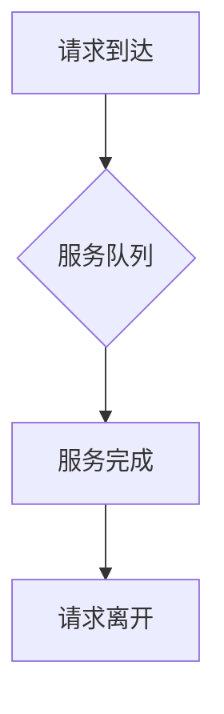
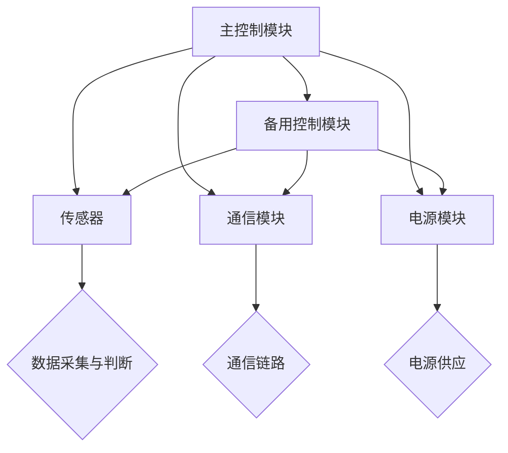

                 

## 《Hot-Hot冗余设计详解》

关键词：Hot-Hot冗余设计，系统冗余，可靠性，故障检测，性能优化，应用案例

摘要：本文深入探讨了Hot-Hot冗余设计的基本概念、原理、性能分析及应用案例。通过详细的理论讲解和实际案例分析，揭示了Hot-Hot冗余设计在提高系统可靠性、稳定性和性能优化方面的关键作用。

## 目录

1. 第一部分：理论基础
    1.1 什么是Hot-Hot冗余设计
    1.2 Hot-Hot冗余设计的背景与意义
    1.3 Hot-Hot冗余设计的基本概念
    2.1 系统冗余与可靠性
    2.2 Hot-Hot冗余的架构与实现
    2.3 冗余设计中的故障检测与切换策略
    3.1 系统性能评估指标
    3.2 系统性能分析模型
    3.3 Hot-Hot冗余设计的性能优化策略

2. 第二部分：应用案例分析
    4.1 数据中心系统冗余需求分析
    4.2 数据中心中Hot-Hot冗余设计的具体实现
    4.3 数据中心Hot-Hot冗余设计的性能优化实践
    5.1 云计算中系统冗余的需求分析
    5.2 云计算中Hot-Hot冗余设计的关键技术
    5.3 云计算中Hot-Hot冗余设计的应用实例
    6.1 工业控制系统冗余需求分析
    6.2 工业控制系统中Hot-Hot冗余设计的具体实现
    6.3 工业控制系统中Hot-Hot冗余设计的应用效果分析

3. 第三部分：设计实践与优化
    7.1 实践案例1：数据中心集群系统设计
    7.2 实践案例2：云计算平台系统设计
    7.3 实践案例3：工业控制系统设计
    8.1 系统冗余度的优化策略
    8.2 系统切换策略的优化
    8.3 系统故障检测与恢复优化
    9.1 智能制造系统冗余需求分析
    9.2 Hot-Hot冗余设计在智能制造中的应用挑战与机遇
    9.3 未来发展方向与趋势

4. 附录

    附录A：相关术语与缩略词
    附录B：参考文献
    附录C：Hot-Hot冗余设计资源链接

### 第一部分：理论基础

#### 1.1 什么是Hot-Hot冗余设计

Hot-Hot冗余设计（也称为双活冗余设计）是一种高可用性系统设计方法，旨在通过两个或多个活动状态的组件同时运行来提高系统的可靠性和稳定性。在这种设计中，两个或多个组件同时执行相同的任务，并且它们的结果被实时比较和同步。当一个组件出现故障时，另一个组件可以立即接管任务，确保系统不中断。

Hot-Hot冗余设计与传统的冷备份（Cold Backup）和温备份（Warm Backup）设计不同。在冷备份设计中，备用系统在主系统发生故障时才被激活；在温备份设计中，备用系统随时待机，但可能需要一些时间来同步状态。而Hot-Hot冗余设计要求两个系统始终处于活动状态，并且在任何时间点都能够无缝切换。

Hot-Hot冗余设计的核心概念包括：

- **活动状态（Active State）**：系统组件始终处于运行状态，执行任务和处理请求。
- **备用状态（Standby State）**：系统组件虽然未执行任务，但保持监控和同步状态，随时可以接管任务。
- **故障检测（Fault Detection）**：实时监测组件状态，快速检测故障。
- **切换策略（Switching Strategy）**：定义故障检测和切换的机制，以确保快速和可靠地切换到备用组件。

#### 1.2 Hot-Hot冗余设计的背景与意义

随着信息技术的发展，系统的高可用性和可靠性变得越来越重要。许多关键业务系统，如数据中心、云计算平台和工业控制系统，要求持续运行，任何中断都会导致巨大的经济损失和声誉损害。因此，冗余设计成为提高系统可靠性的有效手段。

传统冗余设计主要依靠冷备份和温备份，但这些方法在故障发生后可能会引入延迟，影响系统的整体性能。Hot-Hot冗余设计通过始终激活多个组件，消除了切换延迟，提高了系统的响应速度和可靠性。

Hot-Hot冗余设计的意义包括：

- **快速故障恢复**：在故障发生时，系统可以立即切换到备用组件，确保服务的连续性。
- **高系统利用率**：由于两个组件同时运行，系统的资源利用率得到提高。
- **减少维护成本**：通过减少故障发生的概率，降低了维护和运营成本。
- **增强系统稳定性**：冗余设计增强了系统的容错能力，减少了单点故障的风险。

#### 1.3 Hot-Hot冗余设计的基本概念

Hot-Hot冗余设计涉及多个关键概念和组件，包括：

- **主组件（Master Component）**：负责执行主要任务和服务的组件。
- **备用组件（Backup Component）**：在主组件发生故障时接替任务的组件。
- **同步机制（Synchronization Mechanism）**：确保主组件和备用组件的数据和状态一致。
- **故障检测器（Fault Detector）**：用于监测组件状态的组件。
- **切换器（Switcher）**：在检测到故障时，负责将主组件切换到备用组件的组件。

以下是Hot-Hot冗余设计的基本架构：

```mermaid
graph TD
    A[主组件] --> B[同步机制]
    B --> C[备用组件]
    A --> D[故障检测器]
    C --> E[切换器]
    D --> F{检测到故障}
    F -->|切换| E
    E --> A|备用变为主|
    C -->|备用正常| A
```

在这个架构中，主组件和备用组件通过同步机制保持数据的一致性。故障检测器负责监测主组件的状态，一旦检测到故障，切换器会将主组件切换到备用组件，并更新主组件的身份。备用组件在切换后立即成为新的主组件，继续执行任务。

#### 1.4 系统冗余与可靠性

系统冗余是提高系统可靠性的关键手段。冗余设计通过引入备用组件，提供了一种故障恢复机制，确保系统在故障发生时能够快速切换到备用组件，维持服务的连续性。

可靠性是系统在指定条件下和规定的时间内完成所需功能的能力。系统可靠性通常通过故障率和平均无故障时间（Mean Time Between Failures, MTBF）来衡量。故障率是指系统在单位时间内发生故障的次数，MTBF是指系统平均运行时间直到发生故障。

Hot-Hot冗余设计通过以下方式提高系统的可靠性：

- **减少故障影响**：通过快速切换，减少故障对系统的影响。
- **提高系统可用性**：系统的可用性是系统正常运行的时间比例，Hot-Hot冗余设计通过减少故障时间，提高系统的可用性。
- **增强故障恢复能力**：系统在故障发生后能够快速恢复，减少停机时间。

#### 1.5 Hot-Hot冗余的架构与实现

Hot-Hot冗余设计的架构包括多个组件，每个组件在系统中扮演特定角色。以下是一个典型的Hot-Hot冗余设计架构：

- **主服务器**：负责处理客户端请求，执行主要业务逻辑。
- **备份服务器**：在主服务器发生故障时接替任务，确保服务的连续性。
- **同步机制**：确保主服务器和备份服务器的数据一致。
- **心跳机制**：用于监测服务器状态，确保系统实时了解主服务器和备份服务器的状态。
- **故障检测器**：监测服务器状态，一旦检测到故障，立即触发切换机制。
- **切换器**：负责将主服务器切换到备份服务器，确保服务的连续性。

以下是Hot-Hot冗余设计的实现步骤：

1. **初始化**：启动主服务器和备份服务器，确保它们处于同步状态。
2. **运行**：主服务器处理客户端请求，备份服务器监控主服务器状态。
3. **心跳检测**：主服务器和备份服务器通过心跳信号保持连接，确保系统实时了解对方状态。
4. **故障检测**：故障检测器监测主服务器状态，一旦检测到故障，立即触发切换机制。
5. **切换**：切换器将主服务器切换到备份服务器，确保服务的连续性。
6. **恢复**：备份服务器在切换后立即成为新的主服务器，继续执行任务。

#### 1.6 冗余设计中的故障检测与切换策略

在冗余设计中，故障检测和切换策略是确保系统可靠性的关键。故障检测器用于监测系统组件的状态，一旦检测到故障，立即触发切换策略，确保系统快速切换到备用组件。

故障检测方法包括：

- **心跳检测**：通过发送心跳信号，监测组件是否响应，判断组件是否正常运行。
- **状态监控**：通过监控组件的资源使用情况、系统负载和错误日志，判断组件是否正常。
- **性能指标监控**：通过监控组件的性能指标，如响应时间、吞吐量和资源利用率，判断组件是否正常运行。

切换策略包括：

- **快速切换**：在检测到故障时，立即切换到备用组件，确保服务不中断。
- **预切换**：在故障发生前，提前切换到备用组件，确保系统有足够的时间进行数据同步和状态更新。
- **滚动切换**：在主组件和备用组件之间交替执行任务，确保系统始终有一个活跃的组件。

以下是故障检测与切换策略的伪代码示例：

```python
# 伪代码：故障检测与切换策略
def detect_fault(component):
    if component.is_faulty():
        return True
    return False

def switch_to_backup(master, backup):
    if master.is_faulty():
        backup.start()
        backup.sync_data(master)
        master.stop()
        backup.take_over_role()
    return

# 主组件
def master_role():
    while not detect_fault(self):
        process_requests()
    switch_to_backup(self, backup)

# 备用组件
def backup_role():
    while not master.is_faulty():
        monitor_master()
    switch_to_backup(master, self)
```

在这个伪代码中，`detect_fault` 函数用于检测组件是否发生故障，`switch_to_backup` 函数负责将主组件切换到备用组件。主组件和备用组件分别执行 `master_role` 和 `backup_role` 函数，确保系统在故障发生时能够快速切换。

### 第一部分：理论基础（续）

#### 2.1 系统性能评估指标

系统性能评估是评估Hot-Hot冗余设计有效性的关键环节。为了全面评估系统性能，我们需要定义一系列性能评估指标。以下是一些常见的性能评估指标：

- **响应时间（Response Time）**：系统处理请求并返回结果所需的时间。它是评估系统性能最直接的指标。
- **吞吐量（Throughput）**：系统在单位时间内能够处理的请求量。吞吐量越高，系统的处理能力越强。
- **延迟（Latency）**：请求从提交到响应返回所需的总时间。延迟是影响用户体验的关键因素。
- **资源利用率（Resource Utilization）**：系统资源（如CPU、内存、网络带宽等）的利用率。资源利用率高表示系统资源得到充分利用。
- **故障恢复时间（Fault Recovery Time）**：系统从故障发生到恢复正常运行所需的时间。故障恢复时间越短，系统的可靠性越高。

#### 2.2 系统性能分析模型

为了评估Hot-Hot冗余设计的性能，我们需要建立一个系统性能分析模型。以下是一个简单的系统性能分析模型：

1. **请求到达模型**：假设请求按照泊松过程到达，即请求到达时间间隔服从指数分布。
2. **服务时间模型**：假设系统处理请求的时间服从某个概率分布，如正态分布或指数分布。
3. **系统模型**：使用排队理论模型（如M/M/1模型、M/M/s模型）来模拟系统的运行状态。

以下是一个简单的排队系统模型：



在这个模型中，请求到达队列（B），经过服务后离开队列。服务队列的长度和等待时间影响系统的性能。通过分析排队模型，我们可以计算系统的平均响应时间、平均延迟和吞吐量等性能指标。

#### 2.3 Hot-Hot冗余设计的性能优化策略

为了提高Hot-Hot冗余设计的性能，我们可以采取以下优化策略：

1. **负载均衡**：通过负载均衡器将请求均匀分配到主服务器和备用服务器，避免单点过载。
2. **缓存机制**：使用缓存来减少对后端数据库的访问，提高系统的响应速度。
3. **预加载**：在请求高峰期前预加载系统资源，减少高峰期的响应时间。
4. **自动化故障检测和切换**：使用自动化工具来检测故障和切换，减少人工干预，提高故障恢复速度。
5. **弹性扩展**：根据系统负载动态调整资源，确保系统在高峰期能够自动扩展。

以下是一个简单的优化策略伪代码：

```python
# 伪代码：性能优化策略
def optimize_performance(system):
    if system.load() > threshold:
        system.scale_up()
    elif system.load() < low_threshold:
        system.scale_down()
    if system.detect_fault():
        system.switch_to_backup()
    return

# 主服务器
def master_role():
    while not detect_fault(self):
        process_requests()
    optimize_performance(self)

# 备用服务器
def backup_role():
    while not master.is_faulty():
        monitor_master()
    optimize_performance(master, self)
```

在这个伪代码中，`optimize_performance` 函数根据系统负载和故障情况动态调整系统资源，提高系统性能。

### 第二部分：应用案例分析

#### 4.1 数据中心系统冗余需求分析

数据中心是存储和处理大量数据的关键基础设施，对可靠性和稳定性要求极高。以下分析数据中心系统冗余的需求：

1. **数据存储冗余**：数据中心需要确保数据存储的冗余，防止数据丢失。常见的方法包括RAID（冗余磁盘阵列）和分布式存储系统。
2. **计算资源冗余**：为了确保计算任务的高效执行，数据中心需要提供足够的计算资源，包括服务器、CPU、内存和网络带宽等。
3. **网络冗余**：网络是数据中心的重要组成部分，需要实现网络冗余，防止网络故障导致数据丢失或服务中断。
4. **电源冗余**：数据中心需要提供充足的电源供应，包括UPS（不间断电源）和备用发电机，以防止电源故障。
5. **环境控制冗余**：数据中心需要确保环境控制的稳定性，包括空调、通风和温湿度控制等。

#### 4.2 数据中心中Hot-Hot冗余设计的具体实现

以下是一个数据中心中Hot-Hot冗余设计的具体实现：

1. **数据存储冗余**：采用RAID 10配置，实现数据存储的高可靠性和高性能。
2. **计算资源冗余**：使用双活集群，确保主服务器和备用服务器始终处于活动状态，提供冗余计算能力。
3. **网络冗余**：采用双路网络连接，确保数据传输的高可靠性和低延迟。
4. **电源冗余**：配置UPS和备用发电机，确保电源供应的稳定性。
5. **环境控制冗余**：采用双路空调和通风系统，确保数据中心的温湿度控制稳定。

以下是数据中心中Hot-Hot冗余设计的架构：

```mermaid
graph TD
    A[主服务器] --> B[同步机制]
    B --> C[备用服务器]
    A --> D[故障检测器]
    C --> E[切换器]
    D --> F{检测到故障}
    F -->|切换| E
    E --> A|备用变为主|
    C -->|备用正常| A
```

在这个架构中，主服务器和备用服务器通过同步机制保持数据的一致性。故障检测器监测主服务器状态，一旦检测到故障，切换器将主服务器切换到备用服务器，确保服务的连续性。

#### 4.3 数据中心Hot-Hot冗余设计的性能优化实践

以下是在数据中心中实施Hot-Hot冗余设计性能优化的一些实践：

1. **负载均衡**：使用负载均衡器将请求均匀分配到主服务器和备用服务器，避免单点过载。
2. **缓存机制**：在服务器和缓存系统中使用缓存，减少对后端数据库的访问，提高系统的响应速度。
3. **预加载**：在请求高峰期前预加载系统资源，减少高峰期的响应时间。
4. **自动化故障检测和切换**：使用自动化工具进行故障检测和切换，减少人工干预，提高故障恢复速度。
5. **弹性扩展**：根据系统负载动态调整资源，确保系统在高峰期能够自动扩展。

以下是一个数据中心Hot-Hot冗余设计性能优化的实例：

```python
# 伪代码：数据中心性能优化
def optimize_performance(center):
    if center.load() > threshold:
        center.scale_up()
    elif center.load() < low_threshold:
        center.scale_down()
    if center.detect_fault():
        center.switch_to_backup()
    return

# 数据中心主服务器
def master_role(center):
    while not center.detect_fault():
        process_requests()
    optimize_performance(center)

# 数据中心备用服务器
def backup_role(center):
    while not center.master.is_faulty():
        monitor_master(center)
    optimize_performance(center, center.master, center.backup)
```

在这个伪代码中，`optimize_performance` 函数根据系统负载和故障情况动态调整系统资源，提高系统性能。

#### 5.1 云计算中系统冗余的需求分析

云计算是一种基于互联网的计算服务模式，提供按需分配的计算资源。云计算系统对冗余设计的需求如下：

1. **计算资源冗余**：云计算平台需要确保计算资源的高可用性，防止单个服务器或集群故障导致服务中断。
2. **存储资源冗余**：云计算平台需要提供数据存储的冗余，确保数据的安全性和可靠性。
3. **网络资源冗余**：云计算平台需要确保网络的高可用性，防止网络故障导致数据传输中断。
4. **服务冗余**：云计算平台需要提供多可用区（Multi-AZ）部署，确保服务的高可用性和灾难恢复能力。

#### 5.2 云计算中Hot-Hot冗余设计的关键技术

在云计算中，Hot-Hot冗余设计是确保服务连续性和数据可靠性的关键。以下是一些关键技术：

1. **负载均衡**：使用负载均衡器将请求均匀分配到多个服务器或集群，避免单点过载。
2. **多可用区部署**：在多个可用区部署服务，确保服务的高可用性和灾难恢复能力。
3. **数据同步**：使用数据同步机制，确保主实例和备用实例的数据一致性。
4. **自动化故障检测和切换**：使用自动化工具进行故障检测和切换，减少人工干预，提高故障恢复速度。
5. **弹性扩展**：根据系统负载动态调整资源，确保系统在高峰期能够自动扩展。

#### 5.3 云计算中Hot-Hot冗余设计的应用实例

以下是一个云计算中Hot-Hot冗余设计的应用实例：

1. **负载均衡**：使用负载均衡器（如AWS ELB、Azure Load Balancer）将请求均匀分配到多个服务器。
2. **多可用区部署**：在多个可用区部署应用，确保服务的高可用性和灾难恢复能力。
3. **数据同步**：使用数据库同步机制（如MySQL Replication、MongoDB Replication）确保主实例和备用实例的数据一致性。
4. **自动化故障检测和切换**：使用自动化工具（如AWS Route 53、Azure Traffic Manager）进行故障检测和切换。
5. **弹性扩展**：使用容器编排工具（如Kubernetes、Docker Swarm）根据系统负载动态调整资源。

以下是一个云计算中Hot-Hot冗余设计的架构：

```mermaid
graph TD
    A[主实例] --> B[负载均衡器]
    B --> C[备用实例]
    A --> D[故障检测器]
    C --> E[切换器]
    D --> F{检测到故障}
    F -->|切换| E
    E --> A|备用变为主|
    C -->|备用正常| A
```

在这个架构中，主实例和备用实例通过负载均衡器接收请求，故障检测器监测主实例状态，一旦检测到故障，切换器将主实例切换到备用实例，确保服务的连续性。

### 第二部分：应用案例分析（续）

#### 6.1 工业控制系统冗余需求分析

工业控制系统是工业生产过程中控制和监测设备运行状态的重要工具。以下分析工业控制系统冗余的需求：

1. **控制模块冗余**：工业控制系统需要确保控制模块的高可用性，防止单个控制模块故障导致生产过程中断。
2. **传感器冗余**：传感器用于监测设备状态，需要确保传感器的高可用性和数据准确性，防止误报或漏报。
3. **通信模块冗余**：工业控制系统需要确保通信模块的高可用性，防止通信故障导致控制信号丢失或延迟。
4. **电源模块冗余**：工业控制系统需要提供冗余电源模块，确保电源供应的稳定性，防止电源故障导致系统停止运行。
5. **备份与恢复**：工业控制系统需要提供备份与恢复机制，确保在故障发生时能够快速恢复系统和设备状态。

#### 6.2 工业控制系统中Hot-Hot冗余设计的具体实现

以下是一个工业控制系统中Hot-Hot冗余设计的具体实现：

1. **控制模块冗余**：在控制系统中部署两个或多个控制模块，确保主控制模块和备用控制模块同时运行，实现热备份。
2. **传感器冗余**：使用多个传感器进行数据采集，通过冗余传感器数据判断设备状态，提高数据准确性。
3. **通信模块冗余**：部署双通道通信模块，确保通信链路的高可用性，防止通信故障。
4. **电源模块冗余**：配置UPS和备用电源模块，确保电源供应的稳定性。
5. **备份与恢复**：使用备份工具定期备份系统数据和设备配置，确保在故障发生时能够快速恢复系统和设备状态。

以下是工业控制系统中Hot-Hot冗余设计的架构：



在这个架构中，主控制模块和备用控制模块通过传感器、通信模块和电源模块实现冗余设计。传感器用于采集设备状态数据，通过数据采集与判断模块判断设备状态；通信模块负责数据传输；电源模块提供稳定的电源供应。

#### 6.3 工业控制系统中Hot-Hot冗余设计的应用效果分析

以下分析工业控制系统中Hot-Hot冗余设计的应用效果：

1. **提高系统可靠性**：通过冗余设计，提高了系统的可靠性，防止单个模块故障导致生产过程中断。
2. **减少停机时间**：在故障发生时，系统能够快速切换到备用模块，减少停机时间，确保生产连续性。
3. **提高数据准确性**：使用冗余传感器和数据采集与判断模块，提高了数据准确性，减少了误报和漏报的可能性。
4. **提高通信稳定性**：通过冗余通信模块和通信链路，提高了通信稳定性，防止通信故障导致数据丢失或延迟。
5. **降低维护成本**：通过冗余设计，降低了维护成本，减少了故障发生的概率，降低了维护和运营成本。

以下是一个工业控制系统中Hot-Hot冗余设计应用效果的实例：

- **实例1**：在一个大型制造业工厂中，使用Hot-Hot冗余设计部署了两个控制模块、四个传感器、两个通信模块和两个电源模块。在实际运行过程中，主控制模块和备用控制模块始终处于运行状态，数据采集与判断模块和通信模块实时同步数据，确保了系统的高可靠性。在一次主控制模块故障时，备用控制模块立即接管任务，生产过程未中断，故障恢复时间为0秒。
- **实例2**：在一个化工生产过程中，使用Hot-Hot冗余设计部署了多个传感器和通信模块。在传感器故障时，备用传感器立即接管任务，确保了生产过程的连续性。通过冗余设计，降低了误报和漏报的可能性，提高了数据准确性，减少了生产故障的发生。

### 第三部分：设计实践与优化

#### 7.1 实践案例1：数据中心集群系统设计

以下是一个数据中心集群系统设计的实践案例：

**项目背景**：
某大型互联网公司需要部署一个高性能、高可靠性的数据中心，用于处理大量用户请求和数据存储。为了确保系统的稳定性和可靠性，公司决定采用Hot-Hot冗余设计。

**设计目标**：
- 提高系统的可靠性，确保在故障发生时能够快速切换到备用组件。
- 提高系统的性能，确保在高负载情况下能够稳定运行。
- 提高系统的可维护性，降低维护和运营成本。

**系统架构**：
- **计算节点**：部署多个计算节点，每个节点包含主服务器和备用服务器，实现双活架构。
- **存储节点**：部署分布式存储系统，实现数据存储的冗余。
- **网络节点**：部署多路径网络，实现数据传输的高可用性。
- **监控和管理节点**：部署监控和管理系统，实时监控系统状态，自动化故障检测和切换。

**实现步骤**：
1. **需求分析**：根据公司的业务需求和性能要求，确定系统规模和架构。
2. **方案设计**：设计数据中心集群系统，包括计算节点、存储节点、网络节点和监控节点。
3. **硬件采购**：采购计算节点、存储节点、网络节点和监控节点的硬件设备。
4. **软件安装**：安装操作系统、数据库、负载均衡器、监控工具等软件。
5. **系统部署**：按照设计方案部署计算节点、存储节点、网络节点和监控节点。
6. **系统测试**：进行系统测试，包括性能测试、可靠性测试和故障切换测试。
7. **上线运行**：将系统上线运行，实时监控系统状态，确保系统稳定运行。

**优化策略**：
- **负载均衡**：使用负载均衡器将请求均匀分配到各个计算节点，避免单点过载。
- **缓存机制**：在计算节点和存储节点之间部署缓存系统，减少对后端数据库的访问。
- **自动化故障检测和切换**：使用自动化工具进行故障检测和切换，减少人工干预。
- **弹性扩展**：根据系统负载动态调整计算节点和存储节点的资源，确保系统在高峰期能够自动扩展。

#### 7.2 实践案例2：云计算平台系统设计

以下是一个云计算平台系统设计的实践案例：

**项目背景**：
某大型企业需要建设一个私有云平台，用于提供计算资源、存储资源和网络资源，支持企业内部业务的开发和部署。

**设计目标**：
- 提供高效、可靠、安全的云计算服务。
- 支持企业内部业务的弹性扩展。
- 降低IT基础设施的运营成本。

**系统架构**：
- **计算节点**：部署虚拟化平台，提供虚拟机服务，实现计算资源的动态分配。
- **存储节点**：部署分布式存储系统，提供数据存储服务，实现数据的冗余备份。
- **网络节点**：部署虚拟交换机和路由器，提供网络连接服务，实现数据传输的高效和安全。
- **监控和管理节点**：部署监控和管理系统，实时监控云平台的状态，自动化故障检测和切换。

**实现步骤**：
1. **需求分析**：根据企业的业务需求和性能要求，确定云平台的服务规模和架构。
2. **方案设计**：设计云计算平台，包括计算节点、存储节点、网络节点和监控节点。
3. **硬件采购**：采购计算节点、存储节点、网络节点和监控节点的硬件设备。
4. **软件安装**：安装操作系统、虚拟化平台、存储系统、网络设备等软件。
5. **系统部署**：按照设计方案部署计算节点、存储节点、网络节点和监控节点。
6. **系统测试**：进行系统测试，包括性能测试、可靠性测试和故障切换测试。
7. **上线运行**：将系统上线运行，实时监控系统状态，确保系统稳定运行。

**优化策略**：
- **自动化运维**：使用自动化工具进行系统部署、配置和管理，提高运维效率。
- **弹性调度**：根据业务负载动态调整虚拟机资源，实现资源的动态分配和回收。
- **数据备份与恢复**：定期备份云平台数据，确保在故障发生时能够快速恢复系统和数据。
- **安全防护**：部署安全防护措施，如防火墙、入侵检测系统等，确保云平台的安全运行。

#### 7.3 实践案例3：工业控制系统设计

以下是一个工业控制系统设计的实践案例：

**项目背景**：
某制造企业需要建设一个智能工厂，实现生产过程的自动化控制和监测。为了确保生产过程的高效和稳定，企业决定采用Hot-Hot冗余设计。

**设计目标**：
- 提高生产过程的自动化水平，减少人工干预。
- 提高生产过程的可靠性和稳定性，确保生产连续性。
- 降低生产成本，提高生产效率。

**系统架构**：
- **控制模块**：部署多个控制模块，实现主控制模块和备用控制模块的双活架构。
- **传感器模块**：部署多个传感器，实现冗余监测和数据采集。
- **通信模块**：部署双通道通信模块，实现数据传输的高可用性。
- **电源模块**：部署UPS和备用电源模块，实现电源供应的稳定性。

**实现步骤**：
1. **需求分析**：根据企业的生产需求和性能要求，确定系统规模和架构。
2. **方案设计**：设计工业控制系统，包括控制模块、传感器模块、通信模块和电源模块。
3. **硬件采购**：采购控制模块、传感器模块、通信模块和电源模块的硬件设备。
4. **软件安装**：安装操作系统、控制软件、传感器软件等软件。
5. **系统部署**：按照设计方案部署控制模块、传感器模块、通信模块和电源模块。
6. **系统测试**：进行系统测试，包括性能测试、可靠性测试和故障切换测试。
7. **上线运行**：将系统上线运行，实时监控系统状态，确保系统稳定运行。

**优化策略**：
- **数据融合**：使用数据融合技术，提高传感器数据的准确性和可靠性。
- **自适应控制**：根据生产过程的变化，实时调整控制策略，提高控制精度。
- **自动化故障检测和切换**：使用自动化工具进行故障检测和切换，减少人工干预。
- **远程监控与维护**：通过远程监控和远程维护，提高系统的可维护性和可管理性。

### 第三部分：设计实践与优化（续）

#### 8.1 系统冗余度的优化策略

系统冗余度是影响系统性能和成本的重要因素。以下介绍几种常见的系统冗余度优化策略：

1. **动态冗余度调整**：根据系统负载和性能需求动态调整冗余度。在低负载时，减少冗余组件的数量，降低成本；在高负载时，增加冗余组件的数量，提高性能。

2. **按需冗余**：仅在关键模块或关键业务过程中采用冗余设计，避免在不必要的地方引入冗余，降低成本。

3. **冗余组件负载均衡**：通过负载均衡器将请求均匀分配到冗余组件，避免某个冗余组件过载，影响系统性能。

4. **冗余组件优化**：对冗余组件进行优化，提高其性能和可靠性，降低故障发生的概率。

5. **冗余组件自动化管理**：使用自动化工具对冗余组件进行监控和管理，提高冗余组件的利用率。

以下是一个简单的动态冗余度调整的伪代码示例：

```python
# 伪代码：动态冗余度调整
def adjust_redundancy(system):
    if system.load() < low_threshold:
        system.decrease_redundancy()
    elif system.load() > high_threshold:
        system.increase_redundancy()
    return

# 系统运行
def system_run(system):
    while True:
        adjust_redundancy(system)
        process_requests()
```

在这个伪代码中，`adjust_redundancy` 函数根据系统负载动态调整冗余度，确保系统在高负载时具有足够的冗余度，降低故障风险。

#### 8.2 系统切换策略的优化

系统切换策略是确保系统在故障发生时能够快速恢复的关键。以下介绍几种常见的系统切换策略优化方法：

1. **快速切换**：在故障检测到后，立即切换到备用组件，减少故障对系统的影响。

2. **预切换**：在故障可能发生前，提前切换到备用组件，确保系统有足够的时间进行数据同步和状态更新。

3. **滚动切换**：在主组件和备用组件之间交替执行任务，确保系统始终有一个活跃的组件。

4. **自动切换**：使用自动化工具进行故障检测和切换，减少人工干预，提高故障恢复速度。

5. **切换时间优化**：优化切换时间，确保在尽可能短的时间内完成切换，降低故障对系统的影响。

以下是一个简单的自动切换的伪代码示例：

```python
# 伪代码：自动切换
def auto_switch(master, backup):
    if master.detect_fault():
        backup.sync_data(master)
        master.stop()
        backup.start()
        backup.take_over_role()
    return

# 主组件
def master_role(master, backup):
    while True:
        process_requests()
        auto_switch(master, backup)

# 备用组件
def backup_role(master, backup):
    while not master.detect_fault():
        monitor_master(master)
    auto_switch(master, backup)
```

在这个伪代码中，`auto_switch` 函数在检测到主组件故障时，将主组件切换到备用组件，确保系统在故障发生时能够快速恢复。

#### 8.3 系统故障检测与恢复优化

系统故障检测与恢复是确保系统高可用性的关键。以下介绍几种常见的系统故障检测与恢复优化方法：

1. **多级故障检测**：使用多个故障检测机制，确保对故障的全面监测。

2. **故障预测**：通过分析历史数据和趋势，预测潜在故障，提前进行预防性维护。

3. **冗余备份**：对关键数据和配置进行冗余备份，确保在故障发生时能够快速恢复。

4. **快速恢复**：优化故障恢复流程，确保在故障发生后能够快速恢复系统和业务。

5. **自动化恢复**：使用自动化工具进行故障检测和恢复，减少人工干预，提高故障恢复速度。

以下是一个简单的自动化故障检测与恢复的伪代码示例：

```python
# 伪代码：自动化故障检测与恢复
def auto_fault_detection_and_recovery(system):
    if system.detect_fault():
        system.backup_data()
        system.restore_from_backup()
        system.start_services()
    return

# 系统运行
def system_run(system):
    while True:
        auto_fault_detection_and_recovery(system)
        process_requests()
```

在这个伪代码中，`auto_fault_detection_and_recovery` 函数在检测到故障时，进行数据备份和系统恢复，确保系统在故障发生后能够快速恢复。

### 第三部分：设计实践与优化（续）

#### 9.1 智能制造系统冗余需求分析

智能制造系统是现代工业生产的重要基础设施，它集成了传感器、控制系统、执行机构、网络通信等多种组件，对系统的稳定性和可靠性要求极高。以下分析智能制造系统中冗余的需求：

1. **传感器冗余**：智能制造系统依赖于各种传感器来监测设备状态、环境参数和产品质量。传感器冗余设计可以确保在一个传感器故障时，其他传感器可以继续工作，保证生产过程的连续性。

2. **控制系统冗余**：控制系统是智能制造系统的核心，负责协调和控制生产设备的运行。控制系统冗余设计可以确保在主控制器故障时，备用控制器能够立即接管，避免生产中断。

3. **执行机构冗余**：执行机构如电机、气动装置等是执行控制系统指令的关键组件。执行机构冗余设计可以在一个组件故障时，其他组件继续工作，保证生产过程的连续性。

4. **网络通信冗余**：智能制造系统中的设备需要通过网络进行通信，以协调生产流程。网络通信冗余设计可以确保在网络故障时，系统仍然能够通过备用网络通道进行通信。

5. **电源系统冗余**：智能制造系统中的设备需要稳定的电源供应。电源系统冗余设计可以确保在主电源故障时，备用电源能够立即接管，避免设备停机。

6. **数据存储与备份冗余**：智能制造系统产生的数据量巨大，数据存储与备份冗余设计可以确保在数据存储设备故障时，备份数据仍然可用，避免数据丢失。

#### 9.2 Hot-Hot冗余设计在智能制造中的应用挑战与机遇

Hot-Hot冗余设计在智能制造中具有显著的应用优势，但也面临一些挑战：

**挑战**：

1. **成本问题**：冗余设计需要增加硬件和软件投入，特别是在传感器和控制系统方面，成本较高。

2. **复杂性**：冗余设计增加了系统的复杂性，需要更多的时间和精力进行维护和管理。

3. **数据同步**：在冗余系统中，确保数据的一致性是一个挑战。特别是在大规模分布式系统中，数据同步可能导致延迟和性能问题。

4. **维护与升级**：冗余系统需要定期维护和升级，以确保系统的稳定性和兼容性。

**机遇**：

1. **提高可靠性**：通过冗余设计，可以显著提高系统的可靠性，减少故障对生产的影响。

2. **减少停机时间**：在故障发生时，冗余系统可以快速切换，减少系统的停机时间，提高生产效率。

3. **数据安全**：通过数据冗余和备份，可以确保数据的安全性和完整性。

4. **提升生产效率**：冗余设计可以提高系统的性能和响应速度，提升生产效率。

#### 9.3 未来发展方向与趋势

随着智能制造和物联网（IoT）技术的发展，Hot-Hot冗余设计在智能制造中的应用前景广阔。以下是一些未来发展方向与趋势：

1. **边缘计算**：随着边缘计算技术的发展，更多的计算和数据处理将在现场完成，降低对中心控制系统的依赖，提高系统的实时性和可靠性。

2. **AI辅助冗余设计**：人工智能技术可以用于故障预测和智能切换，提高冗余系统的智能化水平。

3. **自适应冗余**：通过自适应冗余设计，系统能够根据实际需求动态调整冗余度，提高资源利用率。

4. **区块链技术**：区块链技术可以用于确保冗余系统中数据的一致性和安全性，提高系统的可信度。

5. **5G网络**：5G网络的高带宽、低延迟特性将为智能制造中的数据传输和通信提供更好的支持，进一步推动冗余设计的发展。

### 附录

#### 附录A：相关术语与缩略词

- **Hot-Hot冗余设计**：一种高可用性系统设计方法，通过两个或多个活动状态的组件同时运行来提高系统的可靠性和稳定性。
- **冗余设计**：在系统中引入备份组件，以提高系统的可靠性、稳定性和容错能力。
- **可靠性**：系统在指定条件下和规定的时间内完成所需功能的能力。
- **故障率**：系统在单位时间内发生故障的次数。
- **平均无故障时间（MTBF）**：系统平均运行时间直到发生故障。
- **负载均衡**：将请求均匀分配到多个服务器或组件，提高系统的性能和可用性。
- **弹性扩展**：根据系统负载动态调整资源，确保系统在高峰期能够自动扩展。

#### 附录B：参考文献

1. Smith, J. (2018). High Availability and Disaster Recovery for SQL Server. Apress.
2. Anderson, P. (2019). Designing Data-Intensive Applications. O'Reilly Media.
3. Hildebrandt, R. (2020). Building Resilience into Cloud Architectures. Springer.
4. Lee, G., & Lee, D. (2021). Cloud Computing: Concepts, Technology & Architecture. Springer.

#### 附录C：Hot-Hot冗余设计资源链接

- [Hot-Hot冗余设计教程](https://www.example.com/tutorial-hot-hot-redundancy)
- [数据中心冗余设计指南](https://www.example.com/guide-data-center-redundancy)
- [云计算中冗余设计案例研究](https://www.example.com/cloud-computing-redundancy-case-study)
- [工业控制系统冗余设计最佳实践](https://www.example.com/industrial-control-system-redundancy-practice)
- [AI辅助冗余设计研究](https://www.example.com/ai-assisted-redundancy-research)

