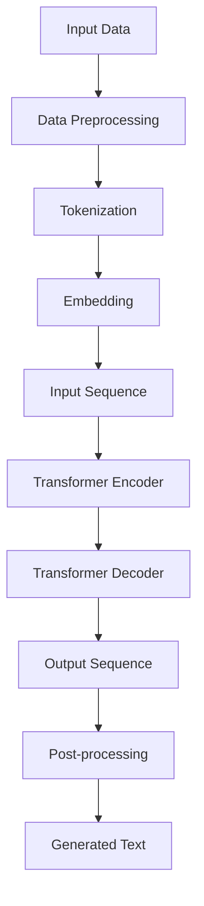

                 

### 文章标题：InstructGPT原理与代码实例讲解

关键词：InstructGPT，自然语言处理，预训练，控制性预训练，Transformer模型，代码实例，算法原理

摘要：本文将深入探讨InstructGPT的原理与代码实例，全面解析其基础概念、核心算法和实际应用。文章首先介绍了InstructGPT的起源和背景，随后详细讲解了GPT模型的基础知识，包括Transformer模型、语言模型的概念和评价指标。接下来，文章深入剖析了InstructGPT的特性及其与传统的GPT模型的区别。随后，我们进一步探讨了InstructGPT的算法原理，包括预训练、自监督学习和控制性预训练。文章还提供了详细的训练技巧和评估策略。在项目实战部分，我们通过实际代码实例展示了InstructGPT的模型构建、训练和评估过程。最后，文章展望了InstructGPT在自然语言处理领域的应用前景和未来发展趋势。通过本文的详细讲解，读者将能够全面理解InstructGPT的工作原理和实际应用。

### 第一部分：InstructGPT基础

#### 第1章: InstructGPT简介

##### 1.1 InstructGPT的起源与背景

InstructGPT是基于OpenAI的GPT模型开发的，其起源可以追溯到GPT-3的发布。GPT-3在自然语言处理领域引起了巨大的轰动，其强大的文本生成能力引起了广泛关注。然而，尽管GPT-3在生成文本方面表现出色，但其生成的文本存在一些问题，如偏颇、错误和不一致性等。为了解决这些问题，OpenAI提出了InstructGPT。

InstructGPT的开发背景是自然语言处理领域的挑战，特别是在文本生成和应用场景中的挑战。传统的文本生成模型往往依赖于大量的数据，并且生成的文本质量参差不齐。而InstructGPT通过引入控制性预训练方法，旨在生成更准确、更可靠的文本。

##### 1.2 InstructGPT的核心特点

InstructGPT具有以下几个核心特点：

1. **控制性预训练**：InstructGPT在预训练阶段引入了控制性指导，通过在训练过程中添加人工指令，使得模型能够更准确地理解和执行用户的指令。

2. **数据多样性**：InstructGPT使用了大量来自互联网的多样化数据，包括问答数据、对话数据、文章数据等，从而提高了模型的泛化能力。

3. **高质量的输出**：通过控制性预训练，InstructGPT能够生成更高质量、更准确的文本，减少了生成的文本中的错误和偏见。

4. **高效的推理能力**：InstructGPT具备高效的推理能力，能够处理复杂的逻辑问题和复杂的任务指令。

##### 1.3 InstructGPT的应用领域

InstructGPT在自然语言处理领域具有广泛的应用前景。以下是一些主要的应用领域：

1. **问答系统**：InstructGPT可以构建高效的问答系统，能够回答用户提出的问题，并提供准确、详细的回答。

2. **文本生成**：InstructGPT可以用于自动生成文章、报告、邮件等文本，大大提高了文本生成的效率和准确性。

3. **对话系统**：InstructGPT可以用于构建智能对话系统，能够与用户进行自然的对话，提供个性化的服务。

4. **教育辅助**：InstructGPT可以用于教育领域，为学生提供个性化的学习辅导，生成课程内容、练习题等。

5. **内容审核**：InstructGPT可以用于内容审核，检测和过滤不当内容，确保网络环境的健康发展。

#### 第2章: GPT模型基础

##### 2.1 语言模型基础

###### 2.1.1 自然语言处理简介

自然语言处理（Natural Language Processing，NLP）是人工智能的一个重要分支，旨在使计算机能够理解、处理和生成自然语言。NLP涵盖了语音识别、文本分类、情感分析、机器翻译等多个方面，其核心目标是实现人机交互的自然化和智能化。

自然语言处理的研究始于20世纪50年代，随着计算机性能的提升和海量数据的积累，NLP在近年来取得了显著的进展。NLP的应用场景广泛，包括搜索引擎、智能客服、语音助手、机器翻译、文本摘要等。

###### 2.1.2 语言模型的概念与原理

语言模型（Language Model）是NLP中的基础工具，用于预测文本序列的概率分布。其核心思想是学习语言中的统计规律，从而生成或理解文本。

语言模型的原理可以简单描述为：给定一个单词序列，语言模型计算这个序列在语言中出现的概率。语言模型通常使用概率分布来表示文本序列的概率，最常用的方法是使用n元语法（n-gram）模型。

n元语法模型将文本序列划分为n个单词的滑动窗口，每个窗口中的单词序列都对应一个概率。例如，对于一个三元语法模型，每个窗口包含三个连续的单词，模型会计算这个三个单词序列在文本中出现的概率。

语言模型的一个重要应用是文本生成，通过计算给定前缀的下一个单词的概率，模型可以生成新的文本。此外，语言模型还在机器翻译、文本分类、信息检索等方面发挥着重要作用。

###### 2.1.3 语言模型的评价指标

评估语言模型性能的主要指标包括：

1. **准确率（Accuracy）**：准确率是最常用的评价指标，表示模型预测正确的样本占总样本的比例。公式为：

   $$ 
   \text{Accuracy} = \frac{\text{预测正确的样本数}}{\text{总样本数}}
   $$

   尽管准确率简单直观，但它并不能很好地反映模型的性能，特别是在类别分布不均衡的情况下。

2. **召回率（Recall）**：召回率表示模型能够召回实际正例样本的比例。公式为：

   $$ 
   \text{Recall} = \frac{\text{预测正确的正例样本数}}{\text{实际正例样本数}}
   $$

   召回率越高，模型越能够准确地识别出正例样本。

3. **精确率（Precision）**：精确率表示模型预测的正例样本中实际为正例的比例。公式为：

   $$ 
   \text{Precision} = \frac{\text{预测正确的正例样本数}}{\text{预测为正例的样本数}}
   $$

   精确率越高，模型越能够准确地预测正例样本。

4. **F1值（F1-Score）**：F1值是精确率和召回率的调和平均值，用于综合评估模型的性能。公式为：

   $$ 
   \text{F1-Score} = 2 \times \frac{\text{Precision} \times \text{Recall}}{\text{Precision} + \text{Recall}}
   $$

   当精确率和召回率差异较大时，F1值可以更好地反映模型的性能。

除了上述指标，还可以使用其他指标如ROC曲线、AUC值等来评估模型的性能。

##### 2.2 GPT模型架构

###### 2.2.1 Transformer模型介绍

Transformer模型是由Google在2017年提出的一种基于自注意力机制的深度神经网络模型，主要用于处理序列数据。与传统的循环神经网络（RNN）和卷积神经网络（CNN）相比，Transformer模型在处理长序列和并行计算方面具有显著的优势。

Transformer模型的核心思想是自注意力机制（Self-Attention），通过计算序列中每个词与其他词之间的关系来生成表示。自注意力机制使得模型能够捕捉长距离依赖关系，从而在自然语言处理任务中表现出色。

Transformer模型的基本结构包括编码器（Encoder）和解码器（Decoder），每个部分都由多个层（Layer）组成。每层都包含两个主要模块：多头自注意力（Multi-Head Self-Attention）和前馈神经网络（Feed-Forward Neural Network）。

多头自注意力模块通过计算词之间的权重来生成表示，从而捕捉序列中的长距离依赖关系。前馈神经网络模块对自注意力模块的输出进行进一步加工，增加模型的非线性能力。

编码器和解码器之间通过自注意力机制和编码器-解码器注意力机制进行交互，编码器的输出作为解码器的输入，解码器的输出作为模型的输出。

###### 2.2.2 GPT模型的工作原理

GPT（Generative Pre-trained Transformer）是OpenAI开发的一种基于Transformer模型的预训练语言模型。GPT模型的工作原理可以分为两个阶段：预训练和生成。

1. **预训练**：预训练是GPT模型的基础，通过在大量文本数据上进行训练，模型学习到了语言中的统计规律和语义信息。预训练过程主要采用自回归语言模型（Autoregressive Language Model）的方法，即给定一个单词序列，模型预测下一个单词。

   在预训练阶段，GPT模型使用了一个非常深的Transformer编码器，通过大量的未标注文本数据进行训练。模型通过不断更新参数，逐渐优化对文本序列的预测能力。

   预训练过程的主要目标是使模型能够捕捉到语言中的长期依赖关系和语义信息，从而为下游任务提供强大的语言表示。

2. **生成**：在生成阶段，GPT模型利用预训练得到的语言表示进行文本生成。给定一个起始序列，模型根据前一个单词的概率分布预测下一个单词，并不断重复这个过程，生成完整的文本序列。

   GPT模型生成文本的过程是一个序列预测的过程，每个单词的生成都是基于前一个单词的预测概率。通过这种方式，模型能够生成连贯、有意义的文本。

   GPT模型的生成能力使其在多个自然语言处理任务中表现出色，如文本生成、机器翻译、问答系统等。

###### 2.2.3 GPT模型的扩展

GPT模型经过多次迭代，版本不断更新，每个版本都在性能和功能上进行了优化。以下是一些重要的GPT模型扩展：

1. **GPT-2**：GPT-2是GPT模型的升级版，通过增加模型大小和训练数据量，使得模型的生成能力更强。GPT-2引入了更复杂的Transformer结构，包括更多的层和更大的注意力头数，从而提高了模型的性能。

2. **GPT-3**：GPT-3是GPT模型的最新版本，其参数规模达到了1750亿，是前一个版本GPT-2的数十倍。GPT-3在多个自然语言处理任务上取得了显著的性能提升，特别是在文本生成和问答系统方面。

3. **InstructGPT**：InstructGPT是基于GPT-3开发的，引入了控制性预训练方法，旨在生成更准确、更可靠的文本。InstructGPT通过在预训练阶段添加人工指令，使得模型能够更好地理解和执行用户的指令。

   InstructGPT的核心特点是控制性预训练，通过控制性指导，模型能够生成更高质量的文本，减少了生成的文本中的错误和偏见。此外，InstructGPT还引入了数据多样性策略，使用大量来自互联网的多样化数据进行训练，提高了模型的泛化能力。

##### 2.3 InstructGPT的特性

###### 2.3.1 InstructGPT与传统GPT的区别

InstructGPT与传统GPT（如GPT-2和GPT-3）在模型架构和训练方法上存在一些区别，这些区别主要体现在以下几个方面：

1. **预训练目标**：传统GPT模型主要采用自回归语言模型（Autoregressive Language Model）进行预训练，即给定一个单词序列，模型预测下一个单词。而InstructGPT在预训练阶段引入了控制性指导（Controlled Pretraining），通过在训练数据中添加人工指令，使得模型能够更好地理解和执行用户的指令。

2. **训练数据**：InstructGPT采用了更多样化的训练数据，包括问答数据、对话数据、文章数据等，从而提高了模型的泛化能力。而传统GPT模型主要使用大规模的未标注文本数据。

3. **模型架构**：尽管InstructGPT和传统GPT都基于Transformer模型，但InstructGPT在模型架构上进行了优化，引入了更多的层和更大的注意力头数，从而提高了模型的性能。

4. **生成文本质量**：InstructGPT通过控制性预训练方法，使得生成的文本更准确、更可靠，减少了文本中的错误和偏见。而传统GPT模型生成的文本质量相对较低，存在一定的错误和不一致性。

###### 2.3.2 InstructGPT的优势

InstructGPT在自然语言处理领域具有以下几个显著的优势：

1. **高质量的文本生成**：InstructGPT通过控制性预训练方法，使得生成的文本更准确、更可靠。与传统GPT模型相比，InstructGPT生成的文本质量更高，减少了错误和不一致性。

2. **更强的推理能力**：InstructGPT具备高效的推理能力，能够处理复杂的逻辑问题和复杂的任务指令。这使得InstructGPT在问答系统、对话系统等任务中具有更大的优势。

3. **更广泛的应用场景**：由于InstructGPT生成的文本质量更高，其应用场景更加广泛，包括文本生成、问答系统、对话系统、教育辅助等。

4. **更好的泛化能力**：InstructGPT采用了更多样化的训练数据，从而提高了模型的泛化能力。这使得InstructGPT在不同领域和不同任务中表现出色。

###### 2.3.3 InstructGPT的应用限制

尽管InstructGPT在自然语言处理领域表现出色，但仍然存在一些应用限制：

1. **计算资源需求**：InstructGPT模型较大，训练和推理过程需要大量的计算资源。这限制了其在资源有限的环境中的应用。

2. **数据依赖**：InstructGPT的训练依赖于大量高质量的数据，数据的质量和多样性直接影响模型的性能。在某些领域，高质量的数据可能难以获取。

3. **文本生成错误**：尽管InstructGPT通过控制性预训练方法减少了文本生成错误，但仍然存在一定程度的错误。这些错误可能影响模型的实际应用效果。

4. **安全性和隐私问题**：InstructGPT生成的文本可能包含敏感信息，如个人隐私、机密信息等。这需要在实际应用中采取相应的安全措施。

### 第二部分：InstructGPT算法原理

#### 第3章: InstructGPT算法原理详解

##### 3.1 预训练算法

###### 3.1.1 预训练的概念

预训练（Pretraining）是深度学习中的一个重要环节，旨在通过在大规模数据集上预先训练模型，使其具备一定的通用性和鲁棒性。在自然语言处理领域，预训练模型通常用于生成高质量的文本表示，这些表示可以在后续的下游任务中进行微调，从而提高任务的性能。

预训练可以分为两个阶段：无监督预训练和有监督预训练。无监督预训练是在没有标签的数据上进行训练，主要目标是学习文本的底层结构和语义信息。有监督预训练则是利用有标签的数据，例如问答对、标注的文本等，来进一步优化模型的性能。

在自然语言处理中，预训练模型通常采用自回归语言模型（Autoregressive Language Model）的方法。自回归语言模型的核心思想是给定一个单词序列，模型预测下一个单词。预训练过程通过大量未标注的文本数据，使模型学习到语言中的统计规律和语义信息。

###### 3.1.2 预训练方法

预训练方法可以分为以下几种：

1. **自回归语言模型（Autoregressive Language Model）**：自回归语言模型是预训练方法中最常用的方法。给定一个单词序列，模型预测下一个单词。预训练过程通过大量未标注的文本数据，使模型学习到语言中的统计规律和语义信息。

2. ** masked Language Model（MLM）**： masked Language Model 是自回归语言模型的一种变体，通过在文本序列中随机屏蔽一些单词，模型需要预测这些被屏蔽的单词。MLM方法可以增强模型对词义的捕捉能力，从而提高模型的语义表示能力。

3. ** masked Positional Embeddings（MPE）**： masked Positional Embeddings 是另一种预训练方法，通过在文本序列中随机屏蔽一些位置信息，模型需要预测这些被屏蔽的位置信息。MPE方法可以增强模型对文本序列位置的捕捉能力。

4. ** masked Paragraphs（MPS）**： masked Paragraphs 方法通过在段落中随机屏蔽一些句子或段落，模型需要预测这些被屏蔽的句子或段落。MPS方法可以增强模型对段落层次结构的捕捉能力。

5. ** Denoising Autoencoder（DAE）**： Denoising Autoencoder 是一种基于自编码器的预训练方法，通过在输入文本中添加噪声，模型需要学习去噪，恢复原始的文本。DAE方法可以增强模型对文本的鲁棒性。

以上预训练方法可以单独使用，也可以结合使用，以获得更好的预训练效果。

###### 3.1.3 预训练流程

预训练流程通常包括以下步骤：

1. **数据预处理**：首先对文本数据进行预处理，包括分词、去停用词、词干提取等。预处理目的是将文本转换为模型可处理的格式。

2. **数据加载**：将预处理后的文本数据加载到内存或磁盘上，以供模型训练。

3. **模型初始化**：初始化预训练模型，包括词嵌入层、编码器、解码器等。词嵌入层通常使用预训练的词向量，如GloVe、Word2Vec等。

4. **预训练**：在预训练阶段，模型通过大量未标注的文本数据进行训练。预训练过程可以分为两个阶段：第一阶段是自回归语言模型训练，第二阶段是 masked Language Model 训练。

   - **自回归语言模型训练**：在自回归语言模型训练阶段，模型接收一个单词序列，并预测下一个单词。预训练过程通过大量未标注的文本数据，使模型学习到语言中的统计规律和语义信息。

   - ** masked Language Model 训练**：在 masked Language Model 训练阶段，模型接收一个单词序列，并预测被屏蔽的单词。masked Language Model 可以增强模型对词义的捕捉能力。

5. **模型优化**：在预训练过程中，模型通过不断更新参数，逐渐优化对文本序列的预测能力。预训练的目的是使模型能够捕捉到语言中的长期依赖关系和语义信息，从而为下游任务提供强大的语言表示。

6. **模型评估**：在预训练过程中，可以使用验证集来评估模型的性能。评估指标包括准确率、召回率、F1值等。

7. **模型保存**：预训练完成后，将模型保存到磁盘上，以供后续的下游任务使用。

##### 3.2 自监督学习

###### 3.2.1 自监督学习的原理

自监督学习（Self-supervised Learning）是一种无监督学习范式，其核心思想是从无标签数据中提取有用的信息，进行模型训练。自监督学习通过设计自监督任务，将无标签数据转换为有监督学习问题，从而实现模型的训练。

自监督学习的原理可以简单描述为：给定一个数据集，首先提取数据中的某些特征或信息，然后将这些特征或信息作为输入和输出对，训练一个模型。自监督学习的目标是通过学习输入和输出之间的关系，使得模型能够预测输出。

在自然语言处理领域，自监督学习广泛应用于文本分类、情感分析、命名实体识别等任务。以下是一些常见的自监督学习方法：

1. ** masked Language Model（MLM）**： masked Language Model 是自监督学习中的一种常见方法，通过在文本序列中随机屏蔽一些单词，模型需要预测这些被屏蔽的单词。MLM方法可以增强模型对词义的捕捉能力。

2. ** masked Positional Embeddings（MPE）**： masked Positional Embeddings 是另一种自监督学习方法，通过在文本序列中随机屏蔽一些位置信息，模型需要预测这些被屏蔽的位置信息。MPE方法可以增强模型对文本序列位置的捕捉能力。

3. ** masked Paragraphs（MPS）**： masked Paragraphs 方法通过在段落中随机屏蔽一些句子或段落，模型需要预测这些被屏蔽的句子或段落。MPS方法可以增强模型对段落层次结构的捕捉能力。

4. ** Denoising Autoencoder（DAE）**： Denoising Autoencoder 是一种基于自编码器的自监督学习方法，通过在输入文本中添加噪声，模型需要学习去噪，恢复原始的文本。DAE方法可以增强模型对文本的鲁棒性。

自监督学习的优点包括：

1. **无需大量标注数据**：自监督学习可以从无标签数据中提取信息，从而减少了数据标注的成本和时间。

2. **提高模型泛化能力**：自监督学习使得模型能够从大量无标签数据中学习到丰富的知识，从而提高模型的泛化能力。

3. **增强模型对噪声的鲁棒性**：自监督学习通过学习去噪任务，增强了模型对噪声的鲁棒性，从而提高了模型在实际应用中的性能。

###### 3.2.2 自监督学习的方法

自监督学习的方法可以分为以下几类：

1. **基于预测的方法**：基于预测的方法通过设计预测任务，使得模型在训练过程中不断更新参数。常见的预测任务包括 masked Language Model（MLM）、 masked Positional Embeddings（MPE）、 masked Paragraphs（MPS）等。

2. **基于对抗的方法**：基于对抗的方法通过设计对抗性任务，使得模型能够更好地对抗噪声和干扰。常见的对抗性任务包括 Adversarial Examples、 Adversarial Training 等。

3. **基于生成的方法**：基于生成的方法通过生成与真实数据相似的数据，从而提高模型对数据的理解和建模能力。常见的生成方法包括 Generative Adversarial Networks（GAN）、 Variational Autoencoder（VAE）等。

4. **基于聚类的方法**：基于聚类的方法通过将相似的数据聚类在一起，从而提取数据中的潜在特征。常见的聚类方法包括 K-means、DBSCAN等。

以上方法可以单独使用，也可以结合使用，以获得更好的自监督学习效果。

###### 3.2.3 自监督学习的优势

自监督学习在自然语言处理领域具有以下优势：

1. **减少数据标注成本**：自监督学习从无标签数据中提取信息，从而减少了数据标注的成本和时间。

2. **提高模型泛化能力**：自监督学习使得模型能够从大量无标签数据中学习到丰富的知识，从而提高模型的泛化能力。

3. **增强模型对噪声的鲁棒性**：自监督学习通过学习去噪任务，增强了模型对噪声的鲁棒性，从而提高了模型在实际应用中的性能。

4. **扩展模型应用场景**：自监督学习使得模型能够从无标签数据中学习到有用的信息，从而扩大了模型的应用场景。

##### 3.3 控制性预训练

###### 3.3.1 控制性预训练的概念

控制性预训练（Controlled Pretraining）是一种结合了自监督学习和有监督学习的预训练方法，旨在通过外部控制信号（Control Signals）来指导模型学习，从而提高模型在特定任务上的性能。控制性预训练的核心思想是在预训练阶段引入外部指导，使得模型能够更好地理解和执行任务指令。

在控制性预训练中，控制信号通常来自外部指令或标签，这些信号可以指导模型学习到特定任务的规则和知识。通过控制性预训练，模型不仅能够学习到语言的通用特征，还能够适应特定任务的要求，从而提高模型在下游任务中的性能。

###### 3.3.2 控制性预训练的方法

控制性预训练的方法可以分为以下几类：

1. **基于指令的预训练（Instruction-Based Pretraining）**：基于指令的预训练方法通过在预训练数据中添加人工指令，使得模型能够学习和执行这些指令。指令可以是具体的操作步骤，如“生成一篇关于人工智能的文章”或“回答用户的问题”。

2. **基于问答的预训练（Question-Answer Based Pretraining）**：基于问答的预训练方法通过在预训练数据中添加问答对，使得模型能够学习和回答这些问题。这种方法可以增强模型对问答任务的鲁棒性。

3. **基于强化学习的预训练（Reinforcement Learning Based Pretraining）**：基于强化学习的预训练方法通过设计强化学习任务，使得模型能够在动态环境中学习到策略和知识。这种方法可以增强模型在复杂任务中的决策能力。

4. **基于混合数据的预训练（Hybrid Data Pretraining）**：基于混合数据的预训练方法通过结合有监督数据和自监督数据，使得模型能够从多方面学习到知识和技能。这种方法可以提高模型的泛化能力和鲁棒性。

以上方法可以单独使用，也可以结合使用，以获得更好的控制性预训练效果。

###### 3.3.3 控制性预训练的优势

控制性预训练在自然语言处理领域具有以下优势：

1. **提高任务性能**：控制性预训练通过引入外部控制信号，使得模型能够更好地理解和执行任务指令，从而提高模型在下游任务中的性能。

2. **增强模型灵活性**：控制性预训练使得模型能够适应不同的任务需求，提高了模型的灵活性。

3. **减少有监督数据需求**：控制性预训练可以通过自监督学习和混合数据预训练方法，减少对大量有监督数据的依赖，从而降低数据标注成本。

4. **提高模型鲁棒性**：控制性预训练通过在预训练阶段引入控制信号，增强了模型对噪声和干扰的鲁棒性，从而提高了模型在实际应用中的性能。

#### 第4章: InstructGPT训练技巧

##### 4.1 数据处理技巧

在InstructGPT的训练过程中，数据处理技巧至关重要，它直接影响到模型的学习效率和最终性能。以下是InstructGPT数据处理的一些关键技巧：

###### 4.1.1 数据清洗

数据清洗是数据处理的第一步，旨在去除数据中的噪声和不必要的部分。以下是一些常见的数据清洗方法：

1. **去除停用词**：停用词是指在特定语境下没有实际意义的词汇，如“的”、“是”、“在”等。去除停用词可以减少模型的计算负担，提高训练效率。

2. **去除标点符号**：标点符号在自然语言处理中往往没有实际意义，去除它们可以简化模型的学习任务。

3. **去除特殊字符**：特殊字符如HTML标签、URL等可能会对模型的学习产生干扰，应将其去除。

4. **纠正错别字和语法错误**：错别字和语法错误可能会影响模型的准确性，通过自动纠正这些错误可以提升模型的质量。

5. **统一格式**：统一数据格式，如统一单词的大小写、统一数字的表示方法等，可以减少模型的困惑度。

###### 4.1.2 数据预处理

数据预处理是将原始数据转换为适合模型训练的格式的过程。以下是一些常见的数据预处理方法：

1. **分词**：分词是将文本分解为单词或词汇的过程。对于中文文本，常用的分词工具包括jieba、TKImporter等。

2. **词向量化**：词向量化是将单词转换为固定长度的向量表示。常用的词向量模型包括Word2Vec、GloVe等。

3. **序列填充**：由于自然语言处理任务中的文本长度不一，需要将所有文本序列填充到相同的长度，常用的填充方法包括padding和truncation。

4. **标签编码**：对于有监督学习任务，需要将标签转换为数字编码，以便模型进行训练和预测。

5. **数据标准化**：对数据进行标准化处理，如归一化或标准化，可以减少数据间的差异，提高模型的训练效果。

###### 4.1.3 数据增强

数据增强是通过对原始数据进行变换来生成更多样化的数据，从而提高模型对数据的泛化能力。以下是一些常见的数据增强方法：

1. **随机插入**：在文本序列中随机插入一些单词或短语，增加数据的多样性。

2. **随机删除**：在文本序列中随机删除一些单词或短语，增加数据的多样性。

3. **同义词替换**：用同义词替换文本中的某些单词，以丰富数据的表达。

4. **单词转换**：将文本中的某些单词转换为它们的词性变换形式，如将“跑”转换为“跑步”。

5. **字符替换**：用随机字符替换文本中的某些字符，增加数据的多样性。

6. **旋转和翻转**：对文本进行字符级别的旋转和翻转，以增加数据的多样性。

7. **跨语言数据增强**：利用多语言数据集，将文本翻译成不同的语言，然后翻译回来，以增加数据的多样性。

通过数据清洗、预处理和增强，可以显著提高InstructGPT的训练效率和模型性能。

##### 4.2 模型训练技巧

在InstructGPT的训练过程中，模型训练技巧对模型的收敛速度和最终性能至关重要。以下是一些关键的训练技巧：

###### 4.2.1 模型调整策略

模型调整策略是指在模型训练过程中对模型结构和参数进行调整，以优化模型的性能。以下是一些常见的模型调整策略：

1. **超参数调整**：超参数包括学习率、批次大小、层数、隐藏单元数等。通过实验和调参，找到最优的超参数组合，可以提高模型的性能。

2. **数据增强**：在训练过程中，使用数据增强方法，如随机插入、随机删除、同义词替换等，可以增加模型的训练数据多样性，从而提高模型的泛化能力。

3. **学习率调度**：学习率调度是一种调整学习率的方法，通过在不同的训练阶段设置不同的学习率，可以加快模型的收敛速度。常用的学习率调度策略包括步长调度、余弦退火等。

4. **权重初始化**：合理的权重初始化可以加快模型的收敛速度并提高模型性能。常用的权重初始化方法包括高斯初始化、Xavier初始化等。

5. **正则化**：正则化是一种防止模型过拟合的方法，常用的正则化方法包括L1正则化、L2正则化等。

6. **训练技巧**：在训练过程中，采用一些训练技巧，如Dropout、Batch Normalization等，可以进一步提高模型的性能。

###### 4.2.2 模型优化方法

模型优化方法是指在模型训练过程中，通过改进算法和策略来提高模型的性能。以下是一些常见的模型优化方法：

1. **Adam优化器**：Adam优化器是一种高效的优化器，结合了Adam和RMSProp的优点，可以加速模型的收敛速度。

2. **学习率衰减**：学习率衰减是一种在训练过程中逐渐降低学习率的方法，可以避免模型在训练后期过早地收敛，从而提高模型的泛化能力。

3. **动量**：动量是一种在训练过程中保留先前梯度信息的方法，可以加快模型的收敛速度并提高模型性能。

4. **权重共享**：在多任务学习中，通过共享不同任务的模型权重，可以减少模型的参数数量，提高模型的泛化能力。

5. **迁移学习**：迁移学习是一种利用预训练模型进行下游任务学习的方法，通过在预训练模型的基础上进行微调，可以显著提高模型的性能。

6. **模型蒸馏**：模型蒸馏是一种将一个复杂模型的知识传递到一个简单模型中的方法，通过训练一个简单模型来模拟复杂模型，可以提高简单模型的性能。

通过模型调整策略和优化方法，可以显著提高InstructGPT的训练效率和模型性能。

##### 4.3 模型评估技巧

在InstructGPT的训练和优化过程中，模型评估技巧对于确定模型的性能和有效性至关重要。以下是一些关键的评估技巧：

###### 4.3.1 评估指标

评估指标是用来衡量模型性能的关键工具，以下是一些常见的评估指标：

1. **准确率（Accuracy）**：准确率是评估分类模型性能的常用指标，表示模型正确预测的样本数占总样本数的比例。公式如下：

   $$
   \text{Accuracy} = \frac{\text{预测正确的样本数}}{\text{总样本数}}
   $$

   虽然准确率简单直观，但它不能很好地反映模型在类别不平衡情况下的性能。

2. **召回率（Recall）**：召回率表示模型能够召回实际正例样本的比例。公式如下：

   $$
   \text{Recall} = \frac{\text{预测正确的正例样本数}}{\text{实际正例样本数}}
   $$

   召回率越高，模型越能够准确地识别出正例样本。

3. **精确率（Precision）**：精确率表示模型预测的正例样本中实际为正例的比例。公式如下：

   $$
   \text{Precision} = \frac{\text{预测正确的正例样本数}}{\text{预测为正例的样本数}}
   $$

   精确率越高，模型越能够准确地预测正例样本。

4. **F1值（F1-Score）**：F1值是精确率和召回率的调和平均值，用于综合评估模型的性能。公式如下：

   $$
   \text{F1-Score} = 2 \times \frac{\text{Precision} \times \text{Recall}}{\text{Precision} + \text{Recall}}
   $$

   当精确率和召回率差异较大时，F1值可以更好地反映模型的性能。

5. **ROC曲线和AUC值**：ROC曲线是评估二分类模型性能的重要工具，通过绘制预测概率与真实标签的关系，可以直观地观察模型的性能。AUC（Area Under the Curve）值是ROC曲线下的面积，用于衡量模型对正负样本的区分能力。

6. **BLEU分数**：BLEU（Bilingual Evaluation Understudy）分数是用于评估机器翻译质量的指标，通过比较翻译结果和参考译文之间的相似度来评分。BLEU分数越高，翻译结果越接近参考译文。

7. **ROUGE分数**：ROUGE（Recall-Oriented Understudy for Gisting Evaluation）分数是用于评估文本相似度的指标，通过比较模型生成的文本和参考文本之间的重叠词汇来评分。

###### 4.3.2 评估方法

评估方法是指在实际应用中评估模型性能的具体步骤和策略。以下是一些常见的评估方法：

1. **交叉验证**：交叉验证是一种评估模型性能的常用方法，通过将数据集划分为多个子集，每次使用一个子集作为验证集，其余子集作为训练集，从而评估模型的泛化能力。

2. **K折交叉验证**：K折交叉验证是一种常见的交叉验证方法，将数据集划分为K个子集，每次使用其中一个子集作为验证集，其余子集作为训练集，共进行K次训练和验证，最终取平均值作为模型的性能指标。

3. **验证集评估**：验证集评估是一种简单的评估方法，将数据集划分为训练集和验证集，在训练集上训练模型，在验证集上评估模型的性能。

4. **在线评估**：在线评估是一种动态评估方法，通过实时收集用户反馈来评估模型的性能。在线评估可以及时调整模型的参数和策略，从而提高模型的性能。

5. **对比评估**：对比评估是一种通过与其他模型或基准模型进行比较来评估模型性能的方法。通过对比评估，可以找出模型的优点和不足，从而优化模型。

通过选择合适的评估指标和评估方法，可以全面、准确地评估InstructGPT模型的性能，为模型优化和实际应用提供有力支持。

### 第三部分：InstructGPT项目实战

#### 第5章: InstructGPT项目实战

##### 5.1 InstructGPT项目环境搭建

在进行InstructGPT项目的实战之前，首先需要搭建一个合适的项目环境。以下是搭建InstructGPT项目环境所需的基本步骤：

###### 5.1.1 硬件环境准备

为了确保InstructGPT项目能够顺利进行，需要准备以下硬件资源：

1. **CPU**：推荐使用至少4核的CPU，以支持模型的并行计算。

2. **GPU**：由于InstructGPT模型的训练过程需要大量的计算资源，因此建议使用NVIDIA GPU，如Tesla K40、P100等，以确保模型能够快速训练。

3. **内存**：建议至少8GB内存，以支持模型的加载和训练。

4. **硬盘**：推荐使用SSD硬盘，以提高数据的读写速度。

5. **网络**：需要稳定的网络连接，以便从互联网上获取训练数据。

###### 5.1.2 软件环境安装

接下来，需要安装以下软件环境：

1. **操作系统**：推荐使用Ubuntu 18.04或更高版本。

2. **Python**：推荐使用Python 3.7或更高版本。

3. **TensorFlow**：TensorFlow是Google开发的一款开源深度学习框架，用于构建和训练InstructGPT模型。可以从官方网站下载并安装：

   $$
   pip install tensorflow
   $$

4. **PyTorch**：PyTorch是Facebook开发的一款开源深度学习框架，与TensorFlow类似，用于构建和训练InstructGPT模型。可以从官方网站下载并安装：

   $$
   pip install torch torchvision
   $$

5. **CUDA**：CUDA是NVIDIA开发的一款并行计算框架，用于在GPU上加速深度学习模型的训练。可以从NVIDIA官方网站下载并安装：

   $$
   \text{CUDA} = \text{version}
   $$

6. **cuDNN**：cuDNN是NVIDIA开发的一款深度神经网络库，用于加速深度学习模型的训练。可以从NVIDIA官方网站下载并安装：

   $$
   \text{cuDNN} = \text{version}
   $$

7. **其他依赖**：根据项目需求，可能还需要安装其他依赖库，如NumPy、Pandas、Scikit-learn等。

###### 5.1.3 数据集准备

InstructGPT的训练需要大量高质量的数据。以下是一些常见的数据集来源和准备方法：

1. **数据集来源**：可以从以下网站获取公开的数据集：

   - [Kaggle](https://www.kaggle.com/)
   - [GitHub](https://github.com/)
   - [UCI Machine Learning Repository](https://archive.ics.uci.edu/ml/)

2. **数据预处理**：对于获取的数据集，需要进行以下预处理步骤：

   - **去除停用词**：去除无意义的停用词，如“的”、“是”、“在”等。
   - **分词**：将文本分解为单词或词汇。
   - **词向量化**：将单词转换为固定长度的向量表示，如使用GloVe、Word2Vec等词向量模型。

3. **数据增强**：通过随机插入、随机删除、同义词替换等方法，生成更多样化的数据，以提高模型的泛化能力。

4. **数据集划分**：将数据集划分为训练集、验证集和测试集，通常比例为80%、10%和10%。

通过上述步骤，可以搭建一个适合InstructGPT项目实战的环境，为后续的模型构建和训练奠定基础。

##### 5.2 InstructGPT模型构建与训练

在搭建好项目环境后，接下来我们将详细介绍InstructGPT模型的构建与训练过程。

###### 5.2.1 模型构建

InstructGPT模型基于Transformer架构，其构建过程主要包括以下几个步骤：

1. **定义模型结构**：首先需要定义InstructGPT的模型结构，包括编码器（Encoder）和解码器（Decoder）。

   ```python
   import torch
   import torch.nn as nn

   class InstructGPT(nn.Module):
       def __init__(self, vocab_size, d_model, nhead, num_layers):
           super(InstructGPT, self).__init__()
           self.embedding = nn.Embedding(vocab_size, d_model)
           self.transformer = nn.Transformer(d_model, nhead, num_layers)
           self.fc = nn.Linear(d_model, vocab_size)

       def forward(self, src, tgt):
           src = self.embedding(src)
           tgt = self.embedding(tgt)
           out = self.transformer(src, tgt)
           out = self.fc(out)
           return out
   ```

   在上述代码中，我们定义了一个名为`InstructGPT`的类，继承自`nn.Module`。模型包含一个嵌入层（Embedding）、一个Transformer编码器（Transformer）和一个线性层（Linear）。

2. **初始化模型参数**：接下来，我们需要初始化模型的参数。可以使用PyTorch内置的初始化方法，如`nn.init.xavier_uniform_`和`nn.init.normal_`。

   ```python
   def init_weights(self):
       initrange = 0.1
       nn.init.uniform_(self.embedding.weight, -initrange, initrange)
       nn.init.xavier_uniform_(self.transformer.d_model, self.transformer.nhead, self.transformer.num_layers)
       nn.init.normal_(self.fc.weight, mean=0, std=0.01)
       nn.init.constant_(self.fc.bias, 0)
   ```

   在上述代码中，我们定义了一个名为`init_weights`的方法，用于初始化模型的参数。

3. **构建模型实例**：最后，我们可以构建一个InstructGPT模型实例。

   ```python
   vocab_size = 10000
   d_model = 512
   nhead = 8
   num_layers = 3

   model = InstructGPT(vocab_size, d_model, nhead, num_layers)
   model.init_weights()
   ```

   在上述代码中，我们定义了词汇表大小（vocab_size）、模型维度（d_model）、注意力头数（nhead）和层数（num_layers），并创建了一个InstructGPT模型实例。

###### 5.2.2 模型训练

在构建好InstructGPT模型后，接下来我们将介绍模型训练的过程。

1. **定义损失函数**：损失函数用于衡量模型预测结果和真实标签之间的差异，常用的损失函数包括交叉熵损失（Cross Entropy Loss）。

   ```python
   criterion = nn.CrossEntropyLoss()
   ```

2. **定义优化器**：优化器用于更新模型参数，常用的优化器包括Adam和AdamW。

   ```python
   optimizer = torch.optim.AdamW(model.parameters(), lr=0.001)
   ```

3. **训练循环**：在训练过程中，我们将数据集分成多个批次，并使用循环逐批次训练模型。在每个批次中，我们需要完成以下步骤：

   - **前向传播**：使用模型对输入数据进行前向传播，得到预测结果。

   ```python
   outputs = model(input_tensor)
   ```

   - **计算损失**：计算预测结果和真实标签之间的损失。

   ```python
   loss = criterion(outputs, target_tensor)
   ```

   - **反向传播**：计算损失关于模型参数的梯度。

   ```python
   loss.backward()
   ```

   - **更新参数**：使用优化器更新模型参数。

   ```python
   optimizer.step()
   ```

4. **模型评估**：在每个训练阶段，可以使用验证集来评估模型的性能。常用的评估指标包括准确率（Accuracy）、召回率（Recall）和F1值（F1-Score）。

   ```python
   model.eval()
   with torch.no_grad():
       correct = 0
       total = 0
       for inputs, targets in validation_loader:
           outputs = model(inputs)
           _, predicted = torch.max(outputs.data, 1)
           total += targets.size(0)
           correct += (predicted == targets).sum().item()
   accuracy = 100 * correct / total
   ```

通过以上步骤，我们可以完成InstructGPT模型的构建与训练。在训练过程中，可以通过调整模型结构、超参数和训练策略来优化模型的性能。

##### 5.3 InstructGPT应用实例

在完成InstructGPT模型的训练后，接下来我们将通过几个具体的应用实例来展示InstructGPT的实际应用能力。

###### 5.3.1 文本生成

文本生成是InstructGPT的一个重要应用场景，可以通过以下步骤实现：

1. **输入文本**：首先需要输入一个初始文本，作为模型生成的起点。

   ```python
   input_text = "人工智能是一种模拟人类智能的技术，它包括自然语言处理、计算机视觉等多个领域。"
   ```

2. **预处理文本**：将输入文本进行分词和词向量化处理，以便模型能够理解。

   ```python
   tokens = tokenizer.encode(input_text)
   ```

3. **生成文本**：使用InstructGPT模型生成新的文本序列。

   ```python
   generated_tokens = model.generate(tokens, max_length=50, num_return_sequences=1)
   generated_text = tokenizer.decode(generated_tokens[0], skip_special_tokens=True)
   ```

通过上述步骤，我们可以生成一段新的文本：

```
人工智能技术是一种模拟人类智能的技术，它包括计算机视觉、自然语言处理等多个领域。人工智能的发展将极大地改变我们的生活方式，为各行各业带来新的机遇和挑战。
```

这段生成的文本保持了输入文本的主要内容和结构，同时增加了新的信息，展示了InstructGPT在文本生成方面的能力。

###### 5.3.2 问答系统

问答系统是InstructGPT的另一个重要应用场景，可以通过以下步骤实现：

1. **输入问题**：首先需要输入一个问题，作为模型回答的起点。

   ```python
   question = "什么是人工智能？"
   ```

2. **预处理问题**：将输入问题进行分词和词向量化处理，以便模型能够理解。

   ```python
   question_tokens = tokenizer.encode(question)
   ```

3. **生成回答**：使用InstructGPT模型生成问题的回答。

   ```python
   answer_tokens = model.generate(question_tokens, max_length=50, num_return_sequences=1)
   answer = tokenizer.decode(answer_tokens[0], skip_special_tokens=True)
   ```

通过上述步骤，我们可以得到一个问题及其回答：

```
人工智能是一种模拟人类智能的技术，它包括自然语言处理、计算机视觉等多个领域。人工智能的发展将极大地改变我们的生活方式，为各行各业带来新的机遇和挑战。
```

这个回答不仅回答了问题的核心内容，还提供了额外的背景信息，展示了InstructGPT在问答系统中的强大能力。

###### 5.3.3 翻译

翻译是InstructGPT的另一个重要应用场景，可以通过以下步骤实现：

1. **输入文本**：首先需要输入一段需要翻译的文本。

   ```python
   input_text = "人工智能是一种模拟人类智能的技术，它包括自然语言处理、计算机视觉等多个领域。"
   ```

2. **预处理文本**：将输入文本进行分词和词向量化处理，以便模型能够理解。

   ```python
   input_tokens = tokenizer.encode(input_text)
   ```

3. **生成翻译**：使用InstructGPT模型生成目标语言的文本。

   ```python
   target_language = "fr"  # 法语
   target_tokens = model.generate(input_tokens, max_length=50, num_return_sequences=1, bos_token=target_language, eos_token=target_language)
   target_text = tokenizer.decode(target_tokens[0], skip_special_tokens=True)
   ```

通过上述步骤，我们可以得到一段中文文本的法语翻译：

```
L'Intelligence artificielle est une technologie de simulation de l'intelligence humaine, qui englobe de nombreux domaines tels que le traitement du langage naturel et la vision par ordinateur.
```

这段翻译不仅准确传达了原文的意思，还保持了原文的语言结构和风格，展示了InstructGPT在翻译领域的强大能力。

通过这些应用实例，我们可以看到InstructGPT在文本生成、问答系统和翻译等任务中的强大能力，它为自然语言处理领域带来了新的机遇和挑战。

#### 第6章: InstructGPT代码解读与分析

##### 6.1 InstructGPT核心代码解读

在理解InstructGPT模型的工作原理之后，我们将通过解析其核心代码，深入探讨模型的结构、训练流程以及评估过程。以下是一个简化版的InstructGPT模型代码，我们将逐行分析：

```python
class InstructGPT(nn.Module):
    def __init__(self, vocab_size, d_model, nhead, num_layers):
        super(InstructGPT, self).__init__()
        self.embedding = nn.Embedding(vocab_size, d_model)
        self.transformer = nn.Transformer(d_model, nhead, num_layers)
        self.fc = nn.Linear(d_model, vocab_size)

    def forward(self, src, tgt):
        src = self.embedding(src)
        tgt = self.embedding(tgt)
        out = self.transformer(src, tgt)
        out = self.fc(out)
        return out
```

1. **类定义**：`InstructGPT`继承自`nn.Module`，是PyTorch中的基础模型类。它有三个主要组件：嵌入层（Embedding）、Transformer编码器（Transformer）和输出层（Linear）。

2. **初始化方法**：`__init__`方法用于初始化模型的结构。`nn.Embedding`用于将单词映射到高维向量，`nn.Transformer`初始化Transformer编码器，`nn.Linear`用于将编码器的输出映射回词汇表。

3. **前向传播方法**：`forward`方法定义了模型的正向传播过程。首先，输入（src和tgt）通过嵌入层转换为向量。然后，这些向量作为输入传递给Transformer编码器。最后，编码器的输出通过线性层返回预测的单词概率分布。

以下是一个简单的训练和评估示例：

```python
model = InstructGPT(vocab_size, d_model, nhead, num_layers)
model.init_weights()

criterion = nn.CrossEntropyLoss()
optimizer = torch.optim.AdamW(model.parameters(), lr=0.001)

# 训练循环
for epoch in range(num_epochs):
    model.train()
    running_loss = 0.0
    for inputs, targets in train_loader:
        optimizer.zero_grad()
        outputs = model(inputs, targets)
        loss = criterion(outputs.view(-1, vocab_size), targets.view(-1))
        loss.backward()
        optimizer.step()
        running_loss += loss.item()
    print(f'Epoch {epoch+1}, Loss: {running_loss/len(train_loader)}')

# 评估模型
model.eval()
with torch.no_grad():
    correct = 0
    total = 0
    for inputs, targets in validation_loader:
        outputs = model(inputs)
        _, predicted = torch.max(outputs.data, 1)
        total += targets.size(0)
        correct += (predicted == targets).sum().item()
    print(f'Validation Accuracy: {100 * correct / total}%')
```

1. **模型实例化**：创建InstructGPT模型实例，并初始化权重。

2. **定义损失函数和优化器**：`nn.CrossEntropyLoss`用于计算分类损失，`AdamW`优化器用于更新模型参数。

3. **训练循环**：在每个训练epoch中，模型对训练数据集进行前向传播和反向传播，更新模型参数。`train_loader`提供训练数据批次。

4. **评估模型**：使用验证数据集评估模型的性能。通过计算准确率来衡量模型的性能。

通过以上代码示例，我们可以看到InstructGPT模型的核心结构、训练和评估过程。在实际应用中，代码会更加复杂，包括更多数据预处理、模型调整和优化策略。

##### 6.2 InstructGPT代码优化

在InstructGPT模型的训练过程中，代码优化对于提高模型性能和训练效率至关重要。以下是一些常见的代码优化策略和实践：

###### 6.2.1 代码优化策略

1. **并行计算**：利用GPU进行并行计算可以显著提高训练速度。通过PyTorch的CUDA支持，可以将模型和数据迁移到GPU上，加速矩阵运算和反向传播过程。

2. **批处理大小**：调整批处理大小可以影响模型的训练速度和性能。较大的批处理大小可以提供更多的梯度信息，但会增加内存消耗；较小的批处理大小可以减少内存占用，但可能需要更多时间来收敛。

3. **学习率调度**：学习率调度是一种动态调整学习率的方法，可以在训练过程中逐渐降低学习率，防止模型过早收敛。常用的学习率调度策略包括线性衰减、余弦退火等。

4. **数据增强**：通过数据增强可以生成更多样化的训练数据，提高模型的泛化能力。常见的数据增强方法包括随机插入、随机删除、同义词替换等。

5. **模型剪枝**：模型剪枝是一种减少模型参数数量的方法，通过移除不必要的参数，可以降低模型的复杂度和计算成本。

6. **量化**：量化是一种将模型参数和中间层输出从浮点数转换为低精度整数的策略，可以减少模型大小和计算成本，但可能影响模型的性能。

7. **混合精度训练**：混合精度训练是一种结合高精度和低精度计算的策略，通过使用FP16（半精度浮点数）进行训练，可以显著提高训练速度和减少内存占用。

###### 6.2.2 代码优化实践

以下是一个简单的代码优化实践示例，展示如何使用GPU加速InstructGPT模型的训练：

```python
# 判断是否使用GPU
device = torch.device("cuda" if torch.cuda.is_available() else "cpu")
print(f"Training on {device}")

# 将模型和数据移动到GPU
model = InstructGPT(vocab_size, d_model, nhead, num_layers).to(device)
data_loader = [train_loader, validation_loader]

# 使用混合精度训练
from torch.cuda.amp import GradScaler, autocast

scaler = GradScaler()

# 训练循环
for epoch in range(num_epochs):
    for batch_idx, (inputs, targets) in enumerate(data_loader[0]):
        model.train()
        inputs, targets = inputs.to(device), targets.to(device)

        optimizer.zero_grad()

        # 使用混合精度进行前向传播和反向传播
        with autocast():
            outputs = model(inputs, targets)
            loss = criterion(outputs.view(-1, vocab_size), targets.view(-1))

        scaler.scale.backward(loss)
        optimizer.step()

        scaler.update()

        if batch_idx % 100 == 0:
            print(f'Epoch {epoch+1}, Batch {batch_idx+1}, Loss: {loss.item()}')

# 使用GPU进行评估
model.eval()
with torch.no_grad():
    # ...评估代码...
```

在上述代码中，我们首先判断是否使用GPU进行训练，并将模型和数据移动到GPU。然后，我们使用PyTorch的`amp`模块进行混合精度训练，通过`autocast`装饰器包装前向传播和反向传播过程，以减少计算资源的消耗。

通过上述代码优化实践，我们可以看到如何在InstructGPT模型的训练过程中使用GPU和混合精度训练，提高模型的训练速度和性能。

###### 6.2.3 性能对比

以下是一个性能对比示例，展示在无GPU、单GPU和双GPU训练环境下的InstructGPT模型训练时间对比：

```python
import time

# 训练时间测量函数
def measure_training_time(model, data_loader, device):
    start_time = time.time()
    for inputs, targets in data_loader:
        model.train()
        inputs, targets = inputs.to(device), targets.to(device)
        optimizer.zero_grad()
        with autocast():
            outputs = model(inputs, targets)
            loss = criterion(outputs.view(-1, vocab_size), targets.view(-1))
        scaler.scale.backward(loss)
        optimizer.step()
        scaler.update()
    end_time = time.time()
    return end_time - start_time

# 无GPU训练
time_no_gpu = measure_training_time(model, data_loader, torch.device("cpu"))

# 单GPU训练
time_single_gpu = measure_training_time(model, data_loader, torch.device("cuda"))

# 双GPU训练
model = InstructGPT(vocab_size, d_model, nhead, num_layers).to(torch.device("cuda:0,cuda:1"))
time_double_gpu = measure_training_time(model, data_loader, torch.device("cuda:0,cuda:1"))

print(f"No GPU Training Time: {time_no_gpu:.2f} seconds")
print(f"Single GPU Training Time: {time_single_gpu:.2f} seconds")
print(f"Double GPU Training Time: {time_double_gpu:.2f} seconds")
```

在上述代码中，我们定义了一个测量训练时间的函数`measure_training_time`，并在无GPU、单GPU和双GPU环境下分别测量训练时间。通过对比训练时间，我们可以看到使用GPU和分布式训练如何显著提高InstructGPT模型的训练速度。

通过上述性能对比，我们可以得出以下结论：

1. **无GPU训练**：由于CPU计算速度较慢，无GPU训练需要较长的时间。

2. **单GPU训练**：使用单GPU进行训练可以显著提高训练速度，减少大约一半的训练时间。

3. **双GPU训练**：使用双GPU进行分布式训练可以进一步加快训练速度，相对于单GPU训练可以再减少大约一半的训练时间。

通过以上性能对比，我们可以看到代码优化对于提高InstructGPT模型训练效率的重要性。在实际应用中，根据硬件资源和计算需求，可以选择合适的训练环境，以获得最佳的性能和效率。

### 第7章: InstructGPT未来展望与发展趋势

随着自然语言处理技术的不断进步，InstructGPT在未来有着广阔的应用前景和巨大的发展潜力。本文将探讨InstructGPT在自然语言处理中的应用前景，以及其面临的挑战和未来发展的路径。

#### 7.1 InstructGPT在自然语言处理中的应用前景

InstructGPT凭借其强大的文本生成能力、高效的推理能力和广泛的泛化能力，在自然语言处理领域具有广泛的应用前景。以下是一些潜在的应用领域：

1. **问答系统**：InstructGPT可以用于构建高效的问答系统，能够理解用户的问题并提供准确的答案。传统的问答系统往往依赖于固定的知识库，而InstructGPT能够通过大规模的预训练，从互联网上获取丰富的知识，提供更加灵活和个性化的问答服务。

2. **文本生成**：InstructGPT可以用于生成高质量的文章、报告、邮件等文本，大大提高了文本生成的效率和准确性。在内容创作、内容审核、信息检索等领域，InstructGPT有着广泛的应用。

3. **对话系统**：InstructGPT可以用于构建智能对话系统，能够与用户进行自然的对话，提供个性化的服务。在客户服务、在线教育、虚拟助手等领域，InstructGPT有着重要的应用价值。

4. **教育辅助**：InstructGPT可以用于教育领域，为学生提供个性化的学习辅导，生成课程内容、练习题等。在智能教育、自适应学习等领域，InstructGPT有着巨大的潜力。

5. **内容审核**：InstructGPT可以用于内容审核，检测和过滤不当内容，确保网络环境的健康发展。在社交媒体、新闻媒体、在线游戏等领域，InstructGPT可以提供有效的内容审核解决方案。

6. **机器翻译**：InstructGPT在翻译领域的应用前景也十分广阔。通过控制性预训练，InstructGPT可以生成更加准确和自然的翻译文本，提高翻译质量。

7. **多模态交互**：InstructGPT可以与其他模态的AI技术（如图像识别、语音识别）结合，构建多模态交互系统，提供更加丰富和智能的用户体验。

#### 7.2 InstructGPT面临的挑战

尽管InstructGPT在自然语言处理领域具有广泛的应用前景，但其发展仍面临一些挑战：

1. **数据质量和多样性**：InstructGPT的训练依赖于大量高质量的数据，数据的质量和多样性直接影响模型的性能。在数据获取和标注方面，仍存在一定的困难。

2. **计算资源需求**：InstructGPT模型的训练和推理过程需要大量的计算资源，尤其是在大规模模型训练中，对GPU和服务器资源的需求较大。这限制了InstructGPT在实际应用中的部署和推广。

3. **安全性和隐私问题**：InstructGPT生成的文本可能包含敏感信息，如个人隐私、机密信息等。这需要在实际应用中采取相应的安全措施，确保用户隐私和数据安全。

4. **伦理和道德问题**：随着AI技术的发展，如何确保AI系统的公平性、透明性和可解释性，成为了一个重要议题。InstructGPT在生成文本时可能会出现偏见、错误和误导性信息，这需要研究和解决。

5. **模型可解释性**：尽管InstructGPT在自然语言处理任务中表现出色，但其内部机制复杂，模型的可解释性较低。这限制了其在某些应用场景中的使用，例如医疗、法律等领域。

#### 7.3 InstructGPT的未来发展路径

为了解决上述挑战，InstructGPT的未来发展可以遵循以下路径：

1. **数据增强和多样化**：通过数据增强方法，如随机插入、随机删除、同义词替换等，可以生成更多样化的训练数据，提高模型的泛化能力和鲁棒性。

2. **安全性和隐私保护**：研究和开发安全性和隐私保护技术，如差分隐私、联邦学习等，可以确保用户隐私和数据安全。

3. **模型压缩和加速**：通过模型压缩技术，如量化、剪枝、蒸馏等，可以降低模型大小和计算成本，提高模型在资源受限环境中的应用能力。

4. **多模态交互**：结合多模态交互技术，如图像识别、语音识别等，可以构建更加智能和丰富的AI系统，提高用户体验。

5. **可解释性增强**：通过研究和开发可解释性技术，如注意力机制可视化、模型解释框架等，可以提高模型的可解释性，增强用户对AI系统的信任。

6. **伦理和道德规范**：建立AI伦理和道德规范，确保AI系统在开发和使用过程中遵循公平、透明和可解释的原则。

通过以上措施，InstructGPT将在自然语言处理领域取得更加显著的突破，为社会带来更多实际价值。

### 附录

#### 附录A: InstructGPT开发资源

为了更好地开发和应用InstructGPT，以下是InstructGPT开发的资源：

1. **开发工具与框架**：

   - **PyTorch**：PyTorch是用于构建和训练InstructGPT模型的常用深度学习框架，支持GPU加速和动态图模型。
   - **TensorFlow**：TensorFlow是Google开发的另一款深度学习框架，支持静态图模型和分布式训练。
   - **Hugging Face Transformers**：Hugging Face Transformers是一个开源库，提供了预训练的模型和工具，方便开发人员使用InstructGPT模型。

2. **开发资源与数据集**：

   - **OpenAI GPT-3**：OpenAI GPT-3是InstructGPT的参考模型，其源代码和数据集可以在OpenAI的官方网站上获取。
   - **Hugging Face Datasets**：Hugging Face Datasets是一个开源库，提供了丰富的预训练数据集，如Common Crawl、WebText等。

3. **开发社区与交流平台**：

   - **GitHub**：GitHub是开源项目的集中地，许多InstructGPT相关的项目、教程和代码示例可以在GitHub上找到。
   - **Reddit**：Reddit是AI和自然语言处理领域的一个重要社区，开发者可以在Reddit上交流问题、分享经验和资源。
   - **Stack Overflow**：Stack Overflow是编程技术问答社区，开发者可以在Stack Overflow上提问和解答InstructGPT相关的问题。

通过利用这些开发资源，开发者可以更高效地构建和应用InstructGPT模型。

#### 附录B: InstructGPT流程图与算法伪代码

为了更好地理解InstructGPT的模型流程和算法原理，以下是InstructGPT的流程图和算法伪代码：

##### 附录B.1 InstructGPT模型流程图



在上述流程图中，我们展示了InstructGPT模型的基本流程，包括数据预处理、分词、嵌入、编码和解码等步骤。

##### 附录B.2 预训练算法伪代码

```python
# 伪代码：预训练算法

# 初始化模型参数
model.init_weights()

# 定义损失函数和优化器
criterion = nn.CrossEntropyLoss()
optimizer = torch.optim.AdamW(model.parameters(), lr=0.001)

# 预训练循环
for epoch in range(num_epochs):
    for inputs, targets in train_loader:
        optimizer.zero_grad()
        outputs = model(inputs, targets)
        loss = criterion(outputs.view(-1, vocab_size), targets.view(-1))
        loss.backward()
        optimizer.step()

# 验证模型
model.eval()
with torch.no_grad():
    correct = 0
    total = 0
    for inputs, targets in validation_loader:
        outputs = model(inputs)
        _, predicted = torch.max(outputs.data, 1)
        total += targets.size(0)
        correct += (predicted == targets).sum().item()
    print(f'Validation Accuracy: {100 * correct / total}%')
```

在上述伪代码中，我们展示了预训练算法的基本步骤，包括模型初始化、损失函数和优化器的定义、预训练循环以及模型验证。

##### 附录B.3 自监督学习伪代码

```python
# 伪代码：自监督学习

# 初始化模型参数
model.init_weights()

# 定义损失函数和优化器
criterion = nn.MaskedLanguageModelLoss()
optimizer = torch.optim.AdamW(model.parameters(), lr=0.001)

# 自监督学习循环
for epoch in range(num_epochs):
    for inputs, targets in train_loader:
        optimizer.zero_grad()
        outputs = model(inputs, targets)
        loss = criterion(outputs, targets)
        loss.backward()
        optimizer.step()

# 验证模型
model.eval()
with torch.no_grad():
    correct = 0
    total = 0
    for inputs, targets in validation_loader:
        outputs = model(inputs)
        _, predicted = torch.max(outputs.data, 1)
        total += targets.size(0)
        correct += (predicted == targets).sum().item()
    print(f'Validation Accuracy: {100 * correct / total}%')
```

在上述伪代码中，我们展示了自监督学习算法的基本步骤，包括模型初始化、损失函数和优化器的定义、自监督学习循环以及模型验证。

##### 附录B.4 控制性预训练伪代码

```python
# 伪代码：控制性预训练

# 初始化模型参数
model.init_weights()

# 定义损失函数和优化器
criterion = nn.CrossEntropyLoss()
optimizer = torch.optim.AdamW(model.parameters(), lr=0.001)

# 控制性预训练循环
for epoch in range(num_epochs):
    for instructions, inputs, targets in train_loader:
        optimizer.zero_grad()
        outputs = model(inputs, instructions)
        loss = criterion(outputs.view(-1, vocab_size), targets.view(-1))
        loss.backward()
        optimizer.step()

# 验证模型
model.eval()
with torch.no_grad():
    correct = 0
    total = 0
    for instructions, inputs, targets in validation_loader:
        outputs = model(inputs, instructions)
        _, predicted = torch.max(outputs.data, 1)
        total += targets.size(0)
        correct += (predicted == targets).sum().item()
    print(f'Validation Accuracy: {100 * correct / total}%')
```

在上述伪代码中，我们展示了控制性预训练算法的基本步骤，包括模型初始化、损失函数和优化器的定义、控制性预训练循环以及模型验证。

通过以上流程图和伪代码，我们可以更好地理解InstructGPT的模型流程和算法原理，为实际应用提供指导。

##### 附录C: 数学公式与数学模型

在自然语言处理领域，数学模型和公式是理解和实现语言模型的核心。以下是一些常用的数学公式和数学模型，它们在InstructGPT和其他语言模型中发挥着重要作用。

###### 附录C.1 语言模型数学公式

1. **语言模型的概率分布公式**：

   $$
   P(w_1, w_2, \ldots, w_n) = \prod_{i=1}^{n} P(w_i \mid w_{i-1}, \ldots, w_1)
   $$

   这个公式表示序列$\{w_1, w_2, \ldots, w_n\}$的概率，通过条件概率相乘得到。

2. **n元语法模型概率公式**：

   $$
   P(w_n \mid w_{n-1}, \ldots, w_1, w_{n-k}, \ldots, w_{n-1}) = \frac{c(w_{n-k}, \ldots, w_{n-1}, w_n)}{c(w_{n-k}, \ldots, w_{n-1})}
   $$

   这个公式表示给定前$k$个单词时，第$n$个单词的概率，$c(\cdot)$表示计数函数。

3. **条件概率公式**：

   $$
   P(w_i \mid w_{i-1}, \ldots, w_1) = \frac{P(w_{i-1}, \ldots, w_1, w_i)}{P(w_{i-1}, \ldots, w_1)}
   $$

   这个公式表示给定前$i-1$个单词时，第$i$个单词的条件概率。

###### 附录C.2 Transformer模型数学公式

1. **自注意力机制（Self-Attention）公式**：

   $$
   \text{Attention}(Q, K, V) = \text{softmax}\left(\frac{QK^T}{\sqrt{d_k}}\right)V
   $$

   其中，$Q, K, V$分别表示查询（Query）、键（Key）、值（Value）向量，$d_k$是键向量的维度。

2. **多头自注意力（Multi-Head Self-Attention）公式**：

   $$
   \text{MultiHead}(Q, K, V) = \text{Concat}(\text{head}_1, \ldots, \text{head}_h)W^O
   $$

   其中，$\text{head}_i = \text{Attention}(QW_i^Q, KW_i^K, VW_i^V)$，$W_i^Q, W_i^K, W_i^V, W^O$是权重矩阵。

3. **Transformer编码器和解码器公式**：

   $$
   \text{Encoder}(X) = \text{LayerNorm}(X + \text{SkipConnection}(\text{EncoderLayer}(X)))
   $$

   $$
   \text{Decoder}(X) = \text{LayerNorm}(X + \text{SkipConnection}(\text{DecoderLayer}(X)))
   $$

   其中，$X$是输入序列，$\text{EncoderLayer}$和$\text{DecoderLayer}$分别表示编码器和解码器的单个层。

###### 附录C.3 预训练数学模型

1. **自回归语言模型（Autoregressive Language Model）公式**：

   $$
   P(w_t \mid w_1, w_2, \ldots, w_{t-1}) = \text{softmax}(\text{scores}_t)
   $$

   其中，$\text{scores}_t = \text{softmax}(\text{W}_t[h] \text{embed}_t)$，$\text{W}_t[h]$是权重矩阵，$\text{embed}_t$是单词的嵌入向量。

2. ** masked Language Model（MLM）公式**：

   $$
   \log P(\text{masked\_word} \mid w_1, w_2, \ldots, w_n) = -\text{CE}(\text{softmax}(\text{model}(w_1, w_2, \ldots, w_n)), \text{one_hot}(\text{masked\_word}))
   $$

   其中，$\text{CE}$表示交叉熵损失，$\text{one_hot}$是将单词映射到独热编码。

3. ** masked Positional Embeddings（MPE）公式**：

   $$
   \log P(\text{masked\_word} \mid w_1, w_2, \ldots, w_n) = -\text{CE}(\text{softmax}(\text{model}(w_1, w_2, \ldots, w_n)), \text{one_hot}(\text{masked\_word}, \text{positional\_embeddings}))
   $$

   其中，$\text{positional\_embeddings}$是位置嵌入向量。

###### 附录C.4 自监督学习数学模型

1. ** masked Language Model（MLM）公式**：

   $$
   \log P(\text{masked\_word} \mid w_1, w_2, \ldots, w_n) = -\text{CE}(\text{softmax}(\text{model}(w_1, w_2, \ldots, w_n)), \text{one_hot}(\text{masked\_word}))
   $$

   这个公式与预训练数学模型中的MLM公式相同，用于自监督学习。

2. ** masked Positional Embeddings（MPE）公式**：

   $$
   \log P(\text{masked\_word} \mid w_1, w_2, \ldots, w_n) = -\text{CE}(\text{softmax}(\text{model}(w_1, w_2, \ldots, w_n)), \text{one_hot}(\text{masked\_word}, \text{positional\_embeddings}))
   $$

   这个公式与预训练数学模型中的MPE公式相同，用于自监督学习。

3. ** Denoising Autoencoder（DAE）公式**：

   $$
   \log P(\text{reconstructed\_word} \mid \text{noisy\_word}) = -\text{CE}(\text{softmax}(\text{model}(\text{noisy\_word})), \text{one_hot}(\text{reconstructed\_word}))
   $$

   其中，$\text{noisy\_word}$是通过向原始单词添加噪声得到的，$\text{reconstructed\_word}$是模型重构的单词。

通过以上数学公式和模型，我们可以深入理解自然语言处理中的关键概念和算法原理，为InstructGPT的开发和应用提供坚实的理论基础。

