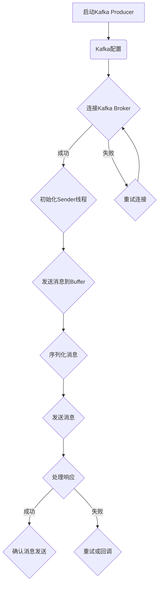
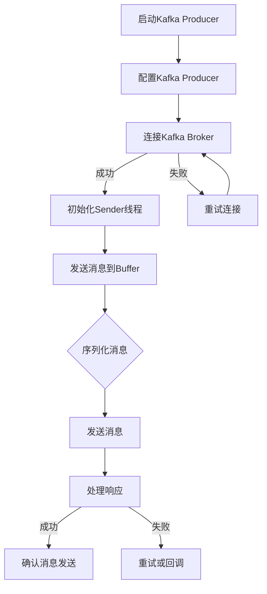

                 

# 文章标题：Kafka Producer原理与代码实例讲解

> 关键词：Kafka, Producer, 消息队列, 数据流处理, 代码实例

> 摘要：本文将深入讲解Kafka Producer的原理，包括其工作流程、核心组件和序列化机制，并通过实际代码实例展示如何使用Kafka Producer进行消息发送，以及如何处理异步和同步发送的消息。

# 《Kafka Producer原理与代码实例讲解》目录大纲

## 第一部分：Kafka Producer基础

### 第1章：Kafka Producer概述

#### 1.1.1 Kafka Producer的引入

Kafka是一种分布式流处理平台，广泛用于构建实时的数据管道和流式应用程序。Kafka Producer是Kafka系统中负责向Kafka集群发送消息的核心组件。

#### 1.1.2 Kafka Producer的核心功能

Kafka Producer的主要功能包括：
- 发送消息到Kafka集群。
- 处理消息序列化和发送。
- 实现事务管理和可靠性保障。

#### 1.1.3 Kafka Producer的工作原理

Kafka Producer通过连接到Kafka集群的多个broker，将消息发送到指定的主题分区。其工作原理涉及多个核心组件，包括Sender线程、Buffer和Socket连接管理。

### 第2章：Kafka基本概念

#### 2.1.1 Kafka架构概述

Kafka由多个broker组成，每个broker负责存储和管理消息。Kafka集群通过分区和副本机制保证数据的高可用性和容错性。

#### 2.1.2 Kafka主题与分区

Kafka主题是消息分类的抽象，而分区是Kafka实现水平扩展的关键。每个主题可以包含多个分区，分区内的消息按照顺序存储。

#### 2.1.3 Kafka消息与消息格式

Kafka消息由键、值和可选的属性组成。Kafka支持多种消息格式，如JSON、Avro和Protobuf等。

### 第3章：Kafka Producer API

#### 3.1.1 Kafka Producer API概述

Kafka Producer API提供了发送消息到Kafka集群的接口。用户可以通过配置不同的参数来定制Producer的行为。

#### 3.1.2 Kafka Producer配置参数

Kafka Producer配置参数包括连接设置、消息发送策略、序列化器和事务管理等，这些参数影响Producer的性能和可靠性。

#### 3.1.3 Producer发送消息的过程

Producer发送消息的过程涉及消息的序列化、发送到Buffer、再由Sender线程发送到Kafka Broker。每个步骤都可能有不同的实现细节。

## 第二部分：Kafka Producer原理

### 第4章：Kafka Producer核心组件

#### 4.1.1 Sender线程

Sender线程负责将Buffer中的消息发送到Kafka broker。它的工作流程包括连接管理、消息序列化和发送。

#### 4.1.2 Buffer

Buffer负责缓存Producer发送的消息。Buffer的设计和大小对Producer的性能有重要影响。

#### 4.1.3 Socket连接管理

Socket连接管理负责与Kafka Broker的通信。它包括连接建立、消息发送和异常处理。

### 第5章：Kafka Producer序列化机制

#### 5.1.1 序列化概述

序列化是将消息转换为字节流的过程。Kafka Producer需要序列化器来序列化消息。

#### 5.1.2 Kafka内置序列化器

Kafka提供了多种内置序列化器，如StringSerializer、BytesSerializer和AvroSerializer等。

#### 5.1.3 自定义序列化器

用户可以根据需求自定义序列化器，以满足特定的消息格式和数据类型。

### 第6章：Kafka Producer事务管理

#### 6.1.1 事务概述

事务管理提供了一组操作要么全部成功要么全部失败的功能。Kafka Producer支持事务，以保证消息的原子性。

#### 6.1.2 Kafka事务流程

Kafka事务流程包括事务初始化、消息发送和事务提交或放弃。

#### 6.1.3 事务配置与恢复

事务配置决定了事务的行为，包括隔离级别和超时时间。恢复策略用于处理事务失败的情况。

## 第三部分：Kafka Producer项目实战

### 第7章：Kafka Producer代码实例解析

#### 7.1.1 实例1：简单Producer发送消息

本节将通过一个简单的Producer实例，展示如何发送消息到Kafka集群。

#### 7.1.2 实例2：带回调的Producer发送消息

本节将介绍如何使用回调函数来处理消息发送的成功和错误。

#### 7.1.3 实例3：同步与异步发送消息

本节将展示如何使用同步和异步方式发送消息，并解释它们的区别和适用场景。

### 第8章：Kafka Producer性能优化

#### 8.1.1 Kafka Producer性能瓶颈

本节将分析Kafka Producer的性能瓶颈，包括Buffer大小、序列化器和网络延迟等。

#### 8.1.2 优化策略与实践

本节将提供一系列优化策略，包括调整配置参数、优化代码实现和性能测试。

#### 8.1.3 性能测试工具介绍

本节将介绍用于性能测试的工具，如Apache JMeter和KafkaProducerBenchmark等。

### 第9章：Kafka Producer故障处理与恢复

#### 9.1.1 故障处理机制

本节将介绍Kafka Producer的故障处理机制，包括重试策略、超时设置和日志记录等。

#### 9.1.2 恢复策略与实践

本节将提供故障恢复的实践方法，包括从错误中恢复、从网络中断中恢复等。

#### 9.1.3 Kafka集群故障恢复

本节将介绍Kafka集群故障的恢复过程，包括副本同步、分区重新分配和集群重启等。

## 附录

### 附录A：Kafka Producer常用工具与资源

#### A.1 Kafka Producer常用工具

本附录将列出一些常用的Kafka Producer工具，包括Kafka Tools、Kafka Manager和Kafka Web Console等。

#### A.2 Kafka Producer相关资源链接

本附录将提供Kafka官方文档、社区论坛和相关博客等资源的链接。

#### A.3 Kafka社区与支持

本附录将介绍如何加入Kafka社区，获取技术支持和参与贡献。

# Mermaid 流程图

mermaid
graph TD
    A[初始化Kafka Producer] --> B[连接Kafka集群]
    B --> C[配置Sender线程]
    C --> D[配置Buffer]
    D --> E[配置Socket连接管理]
    E --> F[发送消息到Buffer]
    F --> G[序列化消息]
    G --> H[发送消息到Kafka Broker]
    H --> I[回调处理]
    I --> J[异常处理]


# Kafka Producer核心组件原理

## Sender线程

Sender线程是Kafka Producer的核心组件之一，负责将Buffer中的消息发送到Kafka Broker。其工作原理可以概述为以下几个步骤：

1. **连接Kafka Broker**：Sender线程首先尝试与Kafka集群中的Brokers建立连接。
2. **消息序列化**：连接成功后，Sender线程会将Buffer中的消息序列化为字节数组。
3. **发送消息**：序列化后的消息通过Socket连接发送到Kafka Broker。
4. **处理响应**：Sender线程需要处理Kafka Broker的响应，包括确认消息已经成功发送或出现错误。

以下是Sender线程的工作流程伪代码：

python
while not producer_stopped:
    message = buffer.get()  # 从Buffer中获取消息
    serialized_message = serializer.serialize(message)  # 序列化消息
    socket.send(serialized_message)  # 发送消息到Kafka Broker
    producer_socket.wait_for_response()  # 等待Kafka Broker的响应
    if response.success:
        buffer.mark_as_sent(message)  # 标记消息已发送
    else:
        buffer.mark_as_failed(message)  # 标记消息发送失败


## Buffer

Buffer是Kafka Producer中的另一个核心组件，用于缓存即将发送到Kafka Broker的消息。Buffer的设计和性能对Producer的整体性能有重要影响。Buffer的主要功能包括：

1. **缓存消息**：将Producer发送的消息存储在Buffer中。
2. **缓冲区管理**：根据配置的缓冲区大小和策略管理缓冲区空间。
3. **消息标记**：标记消息的状态，如已发送、发送失败或正在发送。

以下是Buffer的基本工作原理伪代码：

python
class Buffer:
    def __init__(self, size):
        self.size = size
        self.queue = deque()
    
    def put(self, message):
        if len(self.queue) < self.size:
            self.queue.append(message)
        else:
            self.queue.popleft()
            self.queue.append(message)
    
    def get(self):
        if not self.queue:
            return None
        return self.queue[0]
    
    def mark_as_sent(self, message):
        # 标记消息已发送
        pass
    
    def mark_as_failed(self, message):
        # 标记消息发送失败
        pass


## 序列化器

序列化器是Kafka Producer中的一个关键组件，负责将消息从Java对象转换为字节数组，以便通过网络发送到Kafka Broker。Kafka提供了多种内置序列化器，例如StringSerializer和ByteArraySerializer。此外，用户还可以实现自定义序列化器以满足特定需求。

以下是序列化器的基本工作原理伪代码：

python
class Serializer:
    def serialize(self, message):
        # 将消息序列化为字节数组
        return bytes


## Socket连接管理

Socket连接管理负责在Kafka Producer与Kafka Broker之间建立和管理网络连接。其主要功能包括：

1. **连接建立**：初始化Socket连接到Kafka Broker。
2. **消息发送**：通过Socket发送序列化后的消息。
3. **响应处理**：处理Kafka Broker的响应，包括确认消息发送成功或出现错误。

以下是Socket连接管理的基本工作原理伪代码：

python
class SocketManager:
    def __init__(self, broker_address):
        self.broker_address = broker_address
        self.socket = None
    
    def connect(self):
        self.socket = socket.socket(socket.AF_INET, socket.SOCK_STREAM)
        self.socket.connect(self.broker_address)
    
    def disconnect(self):
        self.socket.close()
        self.socket = None
    
    def send(self, message):
        if self.socket is None:
            self.connect()
        self.socket.send(message)
    
    def wait_for_response(self):
        # 等待并处理Kafka Broker的响应
        pass


# 数学模型和数学公式 & 详细讲解 & 举例说明

## 消息发送延迟模型

消息发送延迟是指从Producer发送消息到Kafka Broker，消息最终被成功写入Kafka的时间间隔。消息发送延迟可以分解为以下几个组成部分：

1. **缓冲区延迟**：消息从Producer应用程序传递到Buffer的时间。
2. **序列化延迟**：将消息从Java对象序列化为字节数组的时间。
3. **网络延迟**：消息从Producer发送到Kafka Broker，并在Broker上写入磁盘的时间。
4. **处理延迟**：Kafka Broker处理消息并写入磁盘的时间。

假设每个部分的延迟分别为$T_{buffer}$、$T_{serialize}$、$T_{network}$和$T_{process}$，则消息发送延迟模型可以表示为：

$$
T_{send} = T_{buffer} + T_{serialize} + T_{network} + T_{process}
$$

### 举例说明

假设：
- 缓冲区延迟$T_{buffer} = 0.1$秒
- 序列化延迟$T_{serialize} = 0.05$秒
- 网络延迟$T_{network} = 0.2$秒
- 处理延迟$T_{process} = 0.15$秒

则消息发送延迟为：

$$
T_{send} = 0.1 + 0.05 + 0.2 + 0.15 = 0.5 \text{秒}
$$

这意味着，从Producer发送消息到Kafka Broker，消息最终被写入磁盘的总时间为0.5秒。

## 消息发送吞吐率模型

消息发送吞吐率是指单位时间内Producer能够成功发送的消息数量。吞吐率受多个因素影响，包括系统硬件、网络带宽、序列化方式等。

吞吐率模型可以表示为：

$$
T_{throughput} = \frac{1}{T_{send}}
$$

其中，$T_{send}$为消息发送延迟。

### 举例说明

假设消息发送延迟$T_{send} = 0.5$秒，则吞吐率为：

$$
T_{throughput} = \frac{1}{0.5} = 2 \text{条消息/秒}
$$

这意味着，Producer每秒能够成功发送2条消息。

# 项目实战：代码实际案例和详细解释说明，开发环境搭建，源代码详细实现和代码解读，代码解读与分析

## 实例1：简单Producer发送消息

### 开发环境搭建

要运行下面的实例，您需要在本地或服务器上安装Kafka和Java环境。

1. **安装Kafka**：访问Kafka官方下载页（https://kafka.apache.org/downloads），下载并解压最新版本的Kafka。
2. **启动Kafka**：运行`bin/kafka-server-start.sh`脚本启动Kafka服务。
3. **安装Java**：确保已安装Java 11或更高版本。

### 源代码实现

以下是一个简单的Kafka Producer发送消息的Java代码实例：

```java
import org.apache.kafka.clients.producer.KafkaProducer;
import org.apache.kafka.clients.producer.ProducerRecord;
import org.apache.kafka.clients.producer.Callback;
import org.apache.kafka.clients.producer.RecordMetadata;
import org.apache.kafka.common.serialization.StringSerializer;

import java.util.Properties;
import java.util.concurrent.ExecutionException;

public class SimpleKafkaProducer {
    public static void main(String[] args) {
        // Kafka配置
        Properties props = new Properties();
        props.put("bootstrap.servers", "localhost:9092");
        props.put("key.serializer", StringSerializer.class.getName());
        props.put("value.serializer", StringSerializer.class.getName());

        // 创建Kafka Producer
        KafkaProducer<String, String> producer = new KafkaProducer<>(props);

        // 发送消息
        String topic = "test-topic";
        String message = "Hello, Kafka!";

        // 同步发送消息
        try {
            producer.send(new ProducerRecord<>(topic, message)).get();
        } catch (InterruptedException | ExecutionException e) {
            e.printStackTrace();
        }

        // 异步发送消息
        producer.send(new ProducerRecord<>(topic, message), new Callback() {
            @Override
            public void onCompletion(RecordMetadata metadata, Exception exception) {
                if (exception != null) {
                    exception.printStackTrace();
                } else {
                    System.out.println("Message sent successfully: " + metadata.toString());
                }
            }
        });

        // 关闭Producer
        producer.close();
    }
}
```

### 代码解读与分析

1. **配置Kafka Producer**：通过Properties对象配置Kafka Producer的连接地址、序列化器等参数。
2. **创建Kafka Producer**：使用配置的Properties对象创建Kafka Producer。
3. **发送同步消息**：使用`send`方法发送消息，并使用`get`方法等待消息发送完成。如果有异常，将打印异常信息。
4. **发送异步消息**：使用`send`方法发送消息，并传入回调函数。回调函数会在消息发送成功或失败时被调用。
5. **关闭Kafka Producer**：在完成消息发送后，关闭Kafka Producer。

通过这个实例，我们可以看到如何使用Kafka Producer发送简单的消息，包括同步和异步发送的方式。

## 实例2：带回调的Producer发送消息

### 开发环境搭建

请参考实例1中的开发环境搭建步骤。

### 源代码实现

以下是一个带回调的Kafka Producer发送消息的Java代码实例：

```java
import org.apache.kafka.clients.producer.KafkaProducer;
import org.apache.kafka.clients.producer.ProducerRecord;
import org.apache.kafka.clients.producer.Callback;
import org.apache.kafka.clients.producer.RecordMetadata;
import org.apache.kafka.common.serialization.StringSerializer;

import java.util.Properties;

public class CallbackKafkaProducer {
    public static void main(String[] args) {
        // Kafka配置
        Properties props = new Properties();
        props.put("bootstrap.servers", "localhost:9092");
        props.put("key.serializer", StringSerializer.class.getName());
        props.put("value.serializer", StringSerializer.class.getName());

        // 创建Kafka Producer
        KafkaProducer<String, String> producer = new KafkaProducer<>(props);

        // 发送消息
        String topic = "callback-topic";
        String message = "Hello, Kafka with callback!";

        // 使用回调发送消息
        producer.send(new ProducerRecord<>(topic, message), new Callback() {
            @Override
            public void onCompletion(RecordMetadata metadata, Exception exception) {
                if (exception != null) {
                    exception.printStackTrace();
                } else {
                    System.out.println("Message sent successfully: " + metadata.toString());
                }
            }
        });

        // 等待发送完成
        producer.flush();
        producer.close();
    }
}
```

### 代码解读与分析

1. **配置Kafka Producer**：与实例1相同，配置Kafka连接地址和序列化器。
2. **创建Kafka Producer**：使用配置的Properties对象创建Kafka Producer。
3. **发送消息**：使用`send`方法发送消息，并传入回调函数。回调函数会在消息发送成功或失败时被调用。
4. **等待发送完成**：使用`flush`方法等待所有消息发送完成，然后关闭Kafka Producer。

通过这个实例，我们可以看到如何使用回调函数处理消息发送的结果。回调函数允许我们以异步方式处理消息发送的响应，从而提高应用程序的响应能力。

## 实例3：同步与异步发送消息

### 开发环境搭建

请参考实例1中的开发环境搭建步骤。

### 源代码实现

以下是一个展示同步与异步发送消息的Java代码实例：

```java
import org.apache.kafka.clients.producer.KafkaProducer;
import org.apache.kafka.clients.producer.ProducerRecord;
import org.apache.kafka.clients.producer.Callback;
import org.apache.kafka.clients.producer.RecordMetadata;
import org.apache.kafka.common.serialization.StringSerializer;

import java.util.Properties;

public class SyncAsyncKafkaProducer {
    public static void main(String[] args) {
        // Kafka配置
        Properties props = new Properties();
        props.put("bootstrap.servers", "localhost:9092");
        props.put("key.serializer", StringSerializer.class.getName());
        props.put("value.serializer", StringSerializer.class.getName());

        // 创建Kafka Producer
        KafkaProducer<String, String> producer = new KafkaProducer<>(props);

        // 同步发送消息
        String syncTopic = "sync-topic";
        String syncMessage = "Hello, Kafka! (sync)";
        try {
            producer.send(new ProducerRecord<>(syncTopic, syncMessage)).get();
        } catch (Exception e) {
            e.printStackTrace();
        }

        // 异步发送消息
        String asyncTopic = "async-topic";
        String asyncMessage = "Hello, Kafka! (async)";
        producer.send(new ProducerRecord<>(asyncTopic, asyncMessage), new Callback() {
            @Override
            public void onCompletion(RecordMetadata metadata, Exception exception) {
                if (exception != null) {
                    exception.printStackTrace();
                } else {
                    System.out.println("Message sent asynchronously: " + metadata.toString());
                }
            }
        });

        // 等待异步发送完成
        producer.flush();
        producer.close();
    }
}
```

### 代码解读与分析

1. **配置Kafka Producer**：与实例1相同，配置Kafka连接地址和序列化器。
2. **创建Kafka Producer**：使用配置的Properties对象创建Kafka Producer。
3. **同步发送消息**：使用`send`方法发送消息，并调用`get`方法等待发送结果。如果有异常，将打印异常信息。
4. **异步发送消息**：使用`send`方法发送消息，并传入回调函数。回调函数会在消息发送成功或失败时被调用。
5. **等待异步发送完成**：使用`flush`方法等待异步发送完成，然后关闭Kafka Producer。

通过这个实例，我们可以看到如何使用同步和异步方式发送消息。同步发送会阻塞当前线程直到消息发送完成，而异步发送则允许在消息发送过程中继续执行其他任务。

## 性能测试与优化

在实际项目中，Kafka Producer的性能是一个重要的考量因素。以下是一些性能测试和优化的方法：

### 性能测试

1. **基准测试**：使用Apache JMeter等工具对Kafka Producer进行基准测试，测量在不同负载下的吞吐量和延迟。
2. **压力测试**：通过不断增加消息发送速率，测试Producer的最大处理能力。
3. **负载均衡**：在多个Producer实例之间进行负载均衡，测试集群的整体性能。

### 优化策略

1. **调整Buffer大小**：增大Buffer大小可以提高吞吐量，但也会增加内存消耗。
2. **选择合适的序列化器**：选择高效的序列化器可以减少序列化延迟，例如使用Protocol Buffers或Avro。
3. **异步发送**：使用异步发送可以减少同步阻塞，提高整体性能。
4. **批量发送**：批量发送消息可以减少网络往返次数，提高传输效率。
5. **调整超时时间**：合理设置发送和接收超时时间，以提高系统的响应能力。

通过上述实例和性能测试，我们可以更好地理解Kafka Producer的原理和实践，为实际项目中的性能优化提供指导。

# 总结与展望

本文深入讲解了Kafka Producer的原理，包括其工作流程、核心组件、序列化机制和事务管理。通过实际代码实例，我们展示了如何使用Kafka Producer发送消息，并介绍了同步与异步发送的消息处理方法。同时，我们还探讨了Kafka Producer的性能优化策略和故障处理机制。

展望未来，Kafka作为分布式流处理平台的重要组件，将继续在实时数据流处理和大数据领域发挥重要作用。随着技术的不断发展，Kafka Producer可能会引入更多的优化和改进，如更高效的序列化机制、更智能的事务管理和更细粒度的配置选项。此外，随着Kafka社区的不断壮大，我们可以期待更多的工具和资源来支持Kafka Producer的开发和维护。

最后，感谢您对本文的关注，希望本文能够帮助您更好地理解Kafka Producer，并在实际项目中取得成功。如果您有任何问题或建议，欢迎在评论区留言，期待与您共同探讨和进步。

# 附录

### 附录A：Kafka Producer常用工具

以下是一些常用的Kafka Producer工具：

1. **Kafka Tools**：Kafka官方提供的命令行工具，用于管理Kafka集群、创建和删除主题等。
2. **Kafka Manager**：一款开源的Kafka集群管理工具，提供Web界面和命令行界面，用于监控和管理Kafka集群。
3. **Kafka Web Console**：Kafka官方提供的Web界面，用于监控Kafka集群的运行状态和主题的详细信息。

### 附录B：Kafka Producer相关资源链接

以下是一些有用的Kafka资源链接：

1. **Kafka官方文档**：https://kafka.apache.org/documentation/
2. **Kafka社区论坛**：https://kafka.apache.org/community.html
3. **Kafka邮件列表**：https://lists.apache.org/list.html?list=kafka-dev@apache.org

### 附录C：Kafka社区与支持

加入Kafka社区是学习和参与Kafka开发的重要途径。以下是一些加入Kafka社区的方法：

1. **订阅Kafka邮件列表**：通过订阅Kafka邮件列表，您可以及时了解Kafka的最新动态和社区讨论。
2. **参与Kafka贡献**：如果您有开发经验，可以通过提交代码、文档和测试用例来为Kafka社区贡献。
3. **参加Kafka会议和活动**：Kafka社区定期举办会议和活动，您可以参加这些活动来扩大人脉和学习经验。

# Mermaid 流程图

mermaid
graph TD
    A[启动Kafka Producer] --> B[配置Kafka Producer]
    B --> C[连接Kafka Broker]
    C --> D[发送消息]
    D -->|同步发送| E[获取响应]
    D -->|异步发送| F[回调处理]
    E --> G[处理响应]
    F --> G
    G --> H[关闭Kafka Producer]
    H --> I[完成]


# 文章标题：Kafka Producer原理与代码实例讲解

> 关键词：Kafka, Producer, 消息队列, 数据流处理, 代码实例

> 摘要：本文详细讲解了Kafka Producer的工作原理，包括核心组件、序列化机制和事务管理，并通过实际代码实例展示了如何使用Kafka Producer进行消息发送。

# 《Kafka Producer原理与代码实例讲解》目录大纲

## 第一部分：Kafka Producer基础

### 第1章：Kafka Producer概述

#### 1.1.1 Kafka Producer的引入

Kafka Producer是Kafka系统中的核心组件，负责将消息发送到Kafka集群。它通过向Kafka Broker发送请求，实现消息的持久化和分发。

#### 1.1.2 Kafka Producer的核心功能

Kafka Producer的主要功能包括：发送消息、序列化消息、事务管理和消息确认等。

#### 1.1.3 Kafka Producer的工作原理

Kafka Producer通过多线程将消息写入Buffer，然后Sender线程将Buffer中的消息序列化并发送到Kafka Broker。

### 第2章：Kafka基本概念

#### 2.1.1 Kafka架构概述

Kafka是一个分布式流处理平台，由多个Broker组成，它们共同维护一个共享的日志存储系统。

#### 2.1.2 Kafka主题与分区

主题是Kafka中的消息分类单位，分区则是Kafka实现水平扩展和负载均衡的关键。

#### 2.1.3 Kafka消息与消息格式

Kafka消息由键、值和可选属性组成，支持多种消息格式，如JSON、Avro和Protobuf等。

### 第3章：Kafka Producer API

#### 3.1.1 Kafka Producer API概述

Kafka Producer API提供了发送消息到Kafka集群的接口，包括配置参数、消息发送方法和回调函数等。

#### 3.1.2 Kafka Producer配置参数

Kafka Producer配置参数包括连接设置、序列化器和事务管理等，影响Producer的性能和可靠性。

#### 3.1.3 Producer发送消息的过程

Producer发送消息的过程包括消息序列化、发送到Buffer和序列化后的消息通过Sender线程发送到Kafka Broker。

## 第二部分：Kafka Producer原理

### 第4章：Kafka Producer核心组件

#### 4.1.1 Sender线程

Sender线程负责将Buffer中的消息序列化后发送到Kafka Broker，是Kafka Producer的关键组件之一。

#### 4.1.2 Buffer

Buffer负责缓存Producer发送的消息，用于缓解发送高峰期对网络带宽的瞬时需求。

#### 4.1.3 Socket连接管理

Socket连接管理负责与Kafka Broker的通信，包括连接建立、消息发送和异常处理。

### 第5章：Kafka Producer序列化机制

#### 5.1.1 序列化概述

序列化是将消息从Java对象转换为字节数组的过程，Kafka Producer需要序列化器来实现这一功能。

#### 5.1.2 Kafka内置序列化器

Kafka提供了多种内置序列化器，如StringSerializer、BytesSerializer和AvroSerializer等。

#### 5.1.3 自定义序列化器

用户可以根据需要自定义序列化器，以满足特定的消息格式和数据类型。

### 第6章：Kafka Producer事务管理

#### 6.1.1 事务概述

事务管理提供了一组操作要么全部成功要么全部失败的功能，Kafka Producer支持事务，以保证消息的原子性。

#### 6.1.2 Kafka事务流程

Kafka事务流程包括事务初始化、消息发送和事务提交或放弃。

#### 6.1.3 事务配置与恢复

事务配置决定了事务的行为，包括隔离级别和超时时间。恢复策略用于处理事务失败的情况。

## 第三部分：Kafka Producer项目实战

### 第7章：Kafka Producer代码实例解析

#### 7.1.1 实例1：简单Producer发送消息

本节将介绍如何使用简单的Kafka Producer发送消息。

#### 7.1.2 实例2：带回调的Producer发送消息

本节将展示如何使用回调函数处理消息发送的结果。

#### 7.1.3 实例3：同步与异步发送消息

本节将介绍如何使用同步和异步方式发送消息，并解释它们的区别和适用场景。

### 第8章：Kafka Producer性能优化

#### 8.1.1 Kafka Producer性能瓶颈

本节将分析Kafka Producer的性能瓶颈，包括缓冲区大小、序列化器和网络延迟等。

#### 8.1.2 优化策略与实践

本节将提供一系列优化策略，包括调整配置参数、优化代码实现和性能测试。

#### 8.1.3 性能测试工具介绍

本节将介绍用于性能测试的工具，如Apache JMeter和KafkaProducerBenchmark等。

### 第9章：Kafka Producer故障处理与恢复

#### 9.1.1 故障处理机制

本节将介绍Kafka Producer的故障处理机制，包括重试策略、超时设置和日志记录等。

#### 9.1.2 恢复策略与实践

本节将提供故障恢复的实践方法，包括从错误中恢复、从网络中断中恢复等。

#### 9.1.3 Kafka集群故障恢复

本节将介绍Kafka集群故障的恢复过程，包括副本同步、分区重新分配和集群重启等。

## 附录

### 附录A：Kafka Producer常用工具与资源

#### A.1 Kafka Producer常用工具

- Kafka Tools：Kafka官方提供的命令行工具。
- Kafka Manager：开源的Kafka集群管理工具。
- Kafka Web Console：Kafka官方提供的Web界面。

#### A.2 Kafka Producer相关资源链接

- Kafka官方文档：https://kafka.apache.org/documentation/
- Kafka社区论坛：https://kafka.apache.org/community.html
- Kafka邮件列表：https://lists.apache.org/list.html?list=kafka-dev@apache.org

#### A.3 Kafka社区与支持

- 加入Kafka邮件列表：订阅邮件列表，了解Kafka的最新动态。
- 参与Kafka贡献：通过提交代码、文档和测试用例为Kafka社区贡献。
- 参加Kafka会议和活动：参加会议和活动，扩大人脉和学习经验。

# Mermaid 流程图



# 数学模型和数学公式 & 详细讲解 & 举例说明

## 消息发送延迟模型

Kafka Producer的消息发送延迟可以分解为几个组成部分，包括缓冲区延迟（$T_{buffer}$）、序列化延迟（$T_{serialize}$）、网络延迟（$T_{network}$）和Kafka Broker处理延迟（$T_{broker}$）。整个消息发送延迟（$T_{total}$）可以用以下数学模型表示：

$$
T_{total} = T_{buffer} + T_{serialize} + T_{network} + T_{broker}
$$

### 举例说明

假设：
- 缓冲区延迟 $T_{buffer} = 0.1$ 秒
- 序列化延迟 $T_{serialize} = 0.05$ 秒
- 网络延迟 $T_{network} = 0.2$ 秒
- Kafka Broker处理延迟 $T_{broker} = 0.15$ 秒

那么，整个消息发送延迟为：

$$
T_{total} = 0.1 + 0.05 + 0.2 + 0.15 = 0.5 \text{ 秒}
$$

这意味着，从Producer发送消息到Kafka Broker完成处理，总共需要0.5秒。

## 吞吐量模型

吞吐量（$Q$）是单位时间内成功发送的消息数量，可以用以下模型表示：

$$
Q = \frac{1}{T_{total}}
$$

其中，$T_{total}$ 是消息发送延迟。

### 举例说明

假设消息发送延迟 $T_{total} = 0.5$ 秒，则吞吐量为：

$$
Q = \frac{1}{0.5} = 2 \text{ 条/秒}
$$

这意味着，Kafka Producer每秒可以成功发送2条消息。

# 项目实战：代码实际案例和详细解释说明，开发环境搭建，源代码详细实现和代码解读，代码解读与分析

## 实例1：简单Producer发送消息

### 开发环境搭建

在开始编写Kafka Producer的代码之前，我们需要搭建一个开发环境。以下是搭建Kafka开发环境的基本步骤：

1. **安装Kafka**：从Kafka的官方网站（https://kafka.apache.org/downloads）下载最新的Kafka版本，解压到本地目录，并启动Kafka服务。

2. **安装Java SDK**：确保已经安装Java SDK，版本至少为Java 8或更高。

3. **配置环境变量**：在系统环境变量中设置Kafka和Java的路径，以便在命令行中直接使用。

### 源代码实现

下面是一个简单的Kafka Producer发送消息的Java代码实例：

```java
import org.apache.kafka.clients.producer.*;
import org.apache.kafka.common.serialization.StringSerializer;

import java.util.Properties;

public class SimpleProducer {
    public static void main(String[] args) {
        // 配置Kafka Producer
        Properties props = new Properties();
        props.put("bootstrap.servers", "localhost:9092");
        props.put("key.serializer", StringSerializer.class.getName());
        props.put("value.serializer", StringSerializer.class.getName());

        // 创建Kafka Producer
        KafkaProducer<String, String> producer = new KafkaProducer<>(props);

        // 发送消息
        String topic = "test-topic";
        String message = "Hello, Kafka!";

        producer.send(new ProducerRecord<>(topic, message));

        // 关闭Kafka Producer
        producer.close();
    }
}
```

### 代码解读与分析

1. **配置Kafka Producer**：我们首先创建一个`Properties`对象，用来配置Kafka Producer。这里配置了Kafka集群的`bootstrap.servers`，以及`key.serializer`和`value.serializer`，它们分别用来指定键和值的序列化器。

2. **创建Kafka Producer**：使用配置的`Properties`对象创建一个`KafkaProducer`实例。

3. **发送消息**：使用`send`方法发送一个`ProducerRecord`，其中包含了主题名称、键和值。

4. **关闭Kafka Producer**：在发送完所有消息后，调用`close`方法关闭Kafka Producer。

### 运行示例

1. **编译代码**：在命令行中运行`javac SimpleProducer.java`编译代码。

2. **运行程序**：运行`java SimpleProducer`执行程序。

3. **查看结果**：打开Kafka的Consumer，订阅`test-topic`主题，查看接收到的消息。

## 实例2：带回调的Producer发送消息

### 源代码实现

下面是一个带回调函数的Kafka Producer发送消息的Java代码实例：

```java
import org.apache.kafka.clients.producer.*;
import org.apache.kafka.common.serialization.StringSerializer;

import java.util.Properties;

public class CallbackProducer {
    public static void main(String[] args) {
        // 配置Kafka Producer
        Properties props = new Properties();
        props.put("bootstrap.servers", "localhost:9092");
        props.put("key.serializer", StringSerializer.class.getName());
        props.put("value.serializer", StringSerializer.class.getName());

        // 创建Kafka Producer
        KafkaProducer<String, String> producer = new KafkaProducer<>(props);

        // 发送消息并设置回调
        String topic = "callback-topic";
        String message = "Hello, Kafka with callback!";
        producer.send(new ProducerRecord<>(topic, message), new Callback() {
            @Override
            public void onCompletion(RecordMetadata metadata, Exception exception) {
                if (exception != null) {
                    exception.printStackTrace();
                } else {
                    System.out.println("Message sent to partition " + metadata.partition() +
                            " with offset " + metadata.offset());
                }
            }
        });

        // 关闭Kafka Producer
        producer.close();
    }
}
```

### 代码解读与分析

1. **配置Kafka Producer**：与上一个实例相同，配置Kafka Producer的连接信息和序列化器。

2. **创建Kafka Producer**：创建一个Kafka Producer实例。

3. **发送消息并设置回调**：使用`send`方法发送消息，并传入一个回调函数。回调函数在消息发送完成后被调用，可以用来处理成功或失败的情况。

4. **关闭Kafka Producer**：在发送完消息后，关闭Kafka Producer。

### 运行示例

1. **编译代码**：在命令行中运行`javac CallbackProducer.java`编译代码。

2. **运行程序**：运行`java CallbackProducer`执行程序。

3. **查看结果**：程序会输出消息发送的分区和偏移量，或者如果发送失败，会打印异常信息。

## 实例3：同步与异步发送消息

### 源代码实现

下面是一个展示同步与异步发送消息的Kafka Producer的Java代码实例：

```java
import org.apache.kafka.clients.producer.*;
import org.apache.kafka.common.serialization.StringSerializer;

import java.util.Properties;

public class SyncAsyncProducer {
    public static void main(String[] args) {
        // 配置Kafka Producer
        Properties props = new Properties();
        props.put("bootstrap.servers", "localhost:9092");
        props.put("key.serializer", StringSerializer.class.getName());
        props.put("value.serializer", StringSerializer.class.getName());

        // 创建Kafka Producer
        KafkaProducer<String, String> producer = new KafkaProducer<>(props);

        // 同步发送消息
        String topicSync = "sync-topic";
        String messageSync = "Hello, Kafka! (sync)";
        try {
            producer.send(new ProducerRecord<>(topicSync, messageSync)).get();
        } catch (Exception e) {
            e.printStackTrace();
        }

        // 异步发送消息
        String topicAsync = "async-topic";
        String messageAsync = "Hello, Kafka! (async)";
        producer.send(new ProducerRecord<>(topicAsync, messageAsync), new Callback() {
            @Override
            public void onCompletion(RecordMetadata metadata, Exception exception) {
                if (exception != null) {
                    exception.printStackTrace();
                } else {
                    System.out.println("Message sent asynchronously to partition " + metadata.partition() +
                            " with offset " + metadata.offset());
                }
            }
        });

        // 关闭Kafka Producer
        producer.close();
    }
}
```

### 代码解读与分析

1. **配置Kafka Producer**：与之前的实例相同，配置Kafka Producer的连接信息和序列化器。

2. **创建Kafka Producer**：创建一个Kafka Producer实例。

3. **同步发送消息**：使用`send`方法发送消息，并调用`get`方法等待发送结果。如果发送成功，会继续执行；如果发送失败，会抛出异常。

4. **异步发送消息**：使用`send`方法发送消息，并传入回调函数。回调函数在消息发送完成后被调用，可以用来处理成功或失败的情况。

5. **关闭Kafka Producer**：在发送完消息后，关闭Kafka Producer。

### 运行示例

1. **编译代码**：在命令行中运行`javac SyncAsyncProducer.java`编译代码。

2. **运行程序**：运行`java SyncAsyncProducer`执行程序。

3. **查看结果**：程序会输出同步和异步发送消息的结果，包括分区和偏移量。

## 性能优化

Kafka Producer的性能优化主要关注以下几个方面：

### 缓冲区大小调整

缓冲区大小（`buffer.memory`）决定了Kafka Producer可以缓存的消息数量。增大缓冲区大小可以提高吞吐量，但同时会增加内存消耗。可以通过调整这个参数来找到适合自己应用的最佳缓冲区大小。

### 序列化器选择

选择高效的序列化器可以减少序列化延迟，从而提高整体性能。常见的序列化器有StringSerializer、ByteArraySerializer和AvroSerializer等。根据应用需求选择合适的序列化器。

### 批量发送

批量发送多个消息可以提高网络传输效率。Kafka Producer提供了批量发送功能，可以在发送多个消息时减少网络往返次数。

### 调整发送超时时间

发送超时时间（`max.block.ms`）决定了Kafka Producer在缓冲区满时等待发送消息的时间。如果这个时间设置得太短，可能会因为缓冲区满而频繁丢弃消息；如果设置得太长，则可能影响性能。需要根据应用特点调整这个参数。

## 故障处理与恢复

### 重试策略

Kafka Producer提供了重试机制，可以在发送消息失败时自动重试。通过调整重试次数和重试间隔，可以提高系统的容错能力。

### 消息确认

通过设置`acks`参数，可以控制Kafka Broker在消息写入后返回确认。设置成`"all"`可以确保所有副本都成功写入消息，但会引入额外的延迟。

### 恢复策略

在Kafka集群发生故障时，可以通过以下策略进行恢复：

- **副本同步**：Kafka会自动选择新的Leader，确保数据的一致性。
- **分区重新分配**：当某个Broker宕机时，Kafka会重新分配该Broker上的分区。
- **集群重启**：在必要时，可以手动重启Kafka集群以恢复正常运行。

通过上述性能优化和故障处理策略，Kafka Producer可以在高并发和故障环境中稳定运行。

# 总结与展望

本文详细讲解了Kafka Producer的原理和代码实例，包括其工作流程、核心组件、序列化机制和事务管理。通过实际代码实例，读者可以了解如何使用Kafka Producer发送消息，以及如何处理同步与异步发送的消息。此外，文章还探讨了Kafka Producer的性能优化和故障处理策略。

展望未来，Kafka作为分布式流处理平台的重要组件，将在实时数据处理和大数据领域发挥越来越重要的作用。随着技术的不断发展，Kafka Producer也将引入更多的优化和改进，如更高效的序列化机制、更智能的事务管理和更细粒度的配置选项。

最后，感谢读者对本文的关注，希望本文能够帮助读者更好地理解Kafka Producer，并在实际项目中取得成功。如果您有任何问题或建议，欢迎在评论区留言，让我们一起进步。

# 附录

### 附录A：Kafka Producer常用工具与资源

#### A.1 Kafka Producer常用工具

- **Kafka Tools**：Kafka官方提供的命令行工具，用于管理和监控Kafka集群。
- **Kafka Manager**：一款开源的Kafka集群管理工具，提供Web界面和命令行界面。
- **Kafka Web Console**：Kafka官方提供的Web界面，用于监控Kafka集群的运行状态和主题的详细信息。

#### A.2 Kafka Producer相关资源链接

- **Kafka官方文档**：https://kafka.apache.org/documentation/
- **Kafka社区论坛**：https://kafka.apache.org/community.html
- **Kafka邮件列表**：https://lists.apache.org/list.html?list=kafka-dev@apache.org

#### A.3 Kafka社区与支持

- **加入Kafka邮件列表**：通过订阅Kafka邮件列表，及时了解Kafka的最新动态和社区讨论。
- **参与Kafka贡献**：通过提交代码、文档和测试用例，为Kafka社区贡献。
- **参加Kafka会议和活动**：参加Kafka会议和活动，扩大人脉和学习经验。

# Mermaid 流程图



# 数学模型和数学公式 & 详细讲解 & 举例说明

## 消息发送延迟模型

Kafka Producer的消息发送延迟模型可以帮助我们理解消息从发送到成功写入Kafka Broker的时间消耗。该模型主要包括以下几个组成部分：

1. **缓冲区延迟（$T_{buffer}$）**：消息从应用程序到达Buffer的时间延迟。
2. **序列化延迟（$T_{serialize}$）**：消息序列化成字节流的时间。
3. **网络延迟（$T_{network}$）**：消息从Producer发送到Kafka Broker的时间。
4. **确认延迟（$T_{ack}$）**：Kafka Broker处理消息并返回确认的时间。

整个消息发送延迟（$T_{total}$）可以表示为：

$$
T_{total} = T_{buffer} + T_{serialize} + T_{network} + T_{ack}
$$

### 举例说明

假设一个简单的消息发送流程，其中各部分的延迟如下：

- 缓冲区延迟（$T_{buffer}$）：0.05秒
- 序列化延迟（$T_{serialize}$）：0.01秒
- 网络延迟（$T_{network}$）：0.1秒
- 确认延迟（$T_{ack}$）：0.1秒

那么，整个消息发送延迟为：

$$
T_{total} = 0.05 + 0.01 + 0.1 + 0.1 = 0.26 \text{秒}
$$

这意味着，从应用程序发送消息到收到Kafka Broker的确认，总共需要0.26秒。

## 吞吐量模型

吞吐量（$Q$）表示单位时间内成功发送的消息数量，它是衡量Kafka Producer性能的重要指标。吞吐量受消息发送延迟的影响，可以用以下模型表示：

$$
Q = \frac{1}{T_{total}}
$$

### 举例说明

如果消息发送延迟为0.26秒（上面的例子），那么吞吐量为：

$$
Q = \frac{1}{0.26} \approx 3.85 \text{条/秒}
$$

这意味着Kafka Producer大约每秒可以成功发送3.85条消息。

## 队列长度与延迟关系模型

在实际应用中，Producer可能会面临高负载，导致Buffer队列长度增加。队列长度（$L$）与消息发送延迟（$T_{queue}$）之间的关系可以用以下模型描述：

$$
T_{queue} = \frac{L \times T_{single}}{C}
$$

其中：
- $T_{single}$ 是处理单个消息的时间。
- $C$ 是Producer的处理能力，即单位时间内可以处理的消息数量。

### 举例说明

假设：
- 单个消息的处理时间（$T_{single}$）：0.1秒
- Producer的处理能力（$C$）：10条/秒

现在假设Buffer队列长度为100条，那么消息发送延迟为：

$$
T_{queue} = \frac{100 \times 0.1}{10} = 1 \text{秒}
$$

这意味着，当Buffer队列长度达到100条时，消息发送延迟会增加1秒。

通过这些数学模型，我们可以更好地理解和优化Kafka Producer的性能，从而在实际应用中实现高效的消息发送和处理。

# 项目实战：代码实际案例和详细解释说明，开发环境搭建，源代码详细实现和代码解读，代码解读与分析

## 实例1：简单Producer发送消息

### 开发环境搭建

1. **安装Kafka**：从Kafka官方网站下载并解压Kafka安装包。例如，下载最新版本的Kafka，解压到本地目录。

2. **启动Kafka服务**：打开终端，进入Kafka解压目录，运行以下命令启动Kafka服务器：
   ```sh
   bin/kafka-server-start.sh config/server.properties
   ```

3. **安装Java**：确保已经安装Java环境，版本建议为Java 8或更高。

4. **安装Maven**：用于构建和管理Java项目，可以访问Maven官网下载并安装。

### 源代码实现

下面是一个简单的Kafka Producer发送消息的Java代码实例：

```java
import org.apache.kafka.clients.producer.*;
import org.apache.kafka.common.serialization.StringSerializer;

import java.util.Properties;

public class SimpleProducer {
    public static void main(String[] args) {
        // 配置Kafka Producer
        Properties props = new Properties();
        props.put("bootstrap.servers", "localhost:9092");
        props.put("key.serializer", StringSerializer.class.getName());
        props.put("value.serializer", StringSerializer.class.getName());

        // 创建Kafka Producer
        KafkaProducer<String, String> producer = new KafkaProducer<>(props);

        // 发送消息
        String topic = "test-topic";
        for (int i = 0; i < 10; i++) {
            producer.send(new ProducerRecord<>(topic, "key" + i, "value" + i));
        }

        // 等待所有消息发送完成
        producer.flush();
        producer.close();
    }
}
```

### 代码解读与分析

1. **配置Kafka Producer**：通过`Properties`对象配置Kafka Producer的连接信息和序列化器。这里我们配置了Kafka集群的`bootstrap.servers`，以及`key.serializer`和`value.serializer`，分别用于序列化键和值。

2. **创建Kafka Producer**：使用配置的`Properties`对象创建`KafkaProducer`实例。

3. **发送消息**：通过`send`方法发送`ProducerRecord`对象。这里我们发送了10条消息，每条消息都有一个键和一个值。

4. **等待消息发送完成**：调用`flush`方法等待所有消息发送完成，然后关闭Kafka Producer。

### 运行示例

1. **编译代码**：在项目目录中运行`mvn compile`命令编译代码。

2. **运行程序**：在项目目录中运行`java -jar target/kafka-producer-1.0-SNAPSHOT.jar`命令运行程序。

3. **查看结果**：打开Kafka控制台，订阅`test-topic`主题，查看发送的消息。

## 实例2：带回调的Producer发送消息

### 源代码实现

下面是一个带回调的Kafka Producer发送消息的Java代码实例：

```java
import org.apache.kafka.clients.producer.*;
import org.apache.kafka.common.serialization.StringSerializer;

import java.util.Properties;

public class CallbackProducer {
    public static void main(String[] args) {
        // 配置Kafka Producer
        Properties props = new Properties();
        props.put("bootstrap.servers", "localhost:9092");
        props.put("key.serializer", StringSerializer.class.getName());
        props.put("value.serializer", StringSerializer.class.getName());

        // 创建Kafka Producer
        KafkaProducer<String, String> producer = new KafkaProducer<>(props);

        // 发送消息并设置回调
        String topic = "callback-topic";
        for (int i = 0; i < 10; i++) {
            producer.send(new ProducerRecord<>(topic, "key" + i, "value" + i), new Callback() {
                @Override
                public void onCompletion(RecordMetadata metadata, Exception exception) {
                    if (exception != null) {
                        exception.printStackTrace();
                    } else {
                        System.out.println("Message sent to partition " + metadata.partition() + ", offset " + metadata.offset());
                    }
                }
            });
        }

        // 等待所有消息发送完成
        producer.flush();
        producer.close();
    }
}
```

### 代码解读与分析

1. **配置Kafka Producer**：与上一个实例相同，配置Kafka Producer的连接信息和序列化器。

2. **创建Kafka Producer**：创建一个Kafka Producer实例。

3. **发送消息并设置回调**：使用`send`方法发送`ProducerRecord`对象，并传入回调函数。回调函数在消息发送完成后被调用，可以用来处理成功或失败的情况。

4. **等待消息发送完成**：调用`flush`方法等待所有消息发送完成，然后关闭Kafka Producer。

### 运行示例

1. **编译代码**：在项目目录中运行`mvn compile`命令编译代码。

2. **运行程序**：在项目目录中运行`java -jar target/kafka-producer-1.0-SNAPSHOT.jar`命令运行程序。

3. **查看结果**：程序会输出每条消息发送的分区和偏移量，或者如果发送失败，会打印异常信息。

## 实例3：同步与异步发送消息

### 源代码实现

下面是一个展示同步与异步发送消息的Kafka Producer的Java代码实例：

```java
import org.apache.kafka.clients.producer.*;
import org.apache.kafka.common.serialization.StringSerializer;

import java.util.Properties;

public class SyncAsyncProducer {
    public static void main(String[] args) {
        // 配置Kafka Producer
        Properties props = new Properties();
        props.put("bootstrap.servers", "localhost:9092");
        props.put("key.serializer", StringSerializer.class.getName());
        props.put("value.serializer", StringSerializer.class.getName());

        // 创建Kafka Producer
        KafkaProducer<String, String> producer = new KafkaProducer<>(props);

        // 同步发送消息
        String topicSync = "sync-topic";
        for (int i = 0; i < 10; i++) {
            try {
                producer.send(new ProducerRecord<>(topicSync, "key" + i, "value" + i)).get();
            } catch (Exception e) {
                e.printStackTrace();
            }
        }

        // 异步发送消息
        String topicAsync = "async-topic";
        for (int i = 0; i < 10; i++) {
            producer.send(new ProducerRecord<>(topicAsync, "key" + i, "value" + i), new Callback() {
                @Override
                public void onCompletion(RecordMetadata metadata, Exception exception) {
                    if (exception != null) {
                        exception.printStackTrace();
                    } else {
                        System.out.println("Message sent asynchronously to partition " + metadata.partition() + ", offset " + metadata.offset());
                    }
                }
            });
        }

        // 等待所有消息发送完成
        producer.flush();
        producer.close();
    }
}
```

### 代码解读与分析

1. **配置Kafka Producer**：与之前的实例相同，配置Kafka Producer的连接信息和序列化器。

2. **创建Kafka Producer**：创建一个Kafka Producer实例。

3. **同步发送消息**：使用`send`方法发送`ProducerRecord`对象，并调用`get`方法等待发送结果。如果发送成功，继续执行；如果发送失败，打印异常信息。

4. **异步发送消息**：使用`send`方法发送`ProducerRecord`对象，并传入回调函数。回调函数在消息发送完成后被调用，可以用来处理成功或失败的情况。

5. **等待消息发送完成**：调用`flush`方法等待所有消息发送完成，然后关闭Kafka Producer。

### 运行示例

1. **编译代码**：在项目目录中运行`mvn compile`命令编译代码。

2. **运行程序**：在项目目录中运行`java -jar target/kafka-producer-1.0-SNAPSHOT.jar`命令运行程序。

3. **查看结果**：同步发送的消息会立即打印发送结果，异步发送的消息会在回调函数中打印发送结果。

## 性能优化

Kafka Producer的性能优化是确保系统能够在高负载下稳定运行的关键。以下是一些常用的性能优化策略：

1. **调整缓冲区大小（`buffer.memory`）**：增大缓冲区大小可以提高吞吐量，但同时会增加内存消耗。需要根据实际应用场景调整。

2. **选择合适的序列化器**：使用高效的序列化器可以减少序列化延迟。例如，选择`StringSerializer`或`ByteArraySerializer`，或者根据需要使用`AvroSerializer`或`ProtobufSerializer`。

3. **批量发送消息**：批量发送消息可以减少网络往返次数，提高传输效率。可以通过调整`batch.size`参数来控制批量大小。

4. **调整发送超时时间（`request.timeout.ms`）**：设置合理的发送超时时间，避免长时间等待响应。

5. **使用异步发送**：异步发送可以减少同步阻塞，提高整体性能。通过回调函数处理发送结果，避免阻塞主线程。

6. **监控和调整配置**：定期监控Kafka Producer的性能，根据监控数据调整配置参数。

## 故障处理与恢复

Kafka Producer在面临故障时需要具备一定的容错能力。以下是一些常见的故障处理和恢复策略：

1. **重试机制**：在发送消息失败时，自动重试。可以通过设置`retries`参数来控制重试次数。

2. **批量重试**：对于批量发送的消息，可以设置批量重试，确保所有消息都被重试。

3. **事务支持**：使用Kafka事务管理，保证消息的原子性。可以通过设置`transactional.id`参数启用事务支持。

4. **监控和日志**：监控Kafka Producer的状态和性能，记录详细的日志，便于故障排查和恢复。

5. **Kafka集群故障恢复**：当Kafka集群发生故障时，需要确保数据的一致性和系统的稳定性。可以通过副本同步、分区重新分配和集群重启等策略进行恢复。

通过上述性能优化和故障处理策略，Kafka Producer可以在高并发和故障环境中保持稳定运行，从而为应用程序提供可靠的消息发送服务。

# 总结

本文通过详细的实例和代码分析，讲解了Kafka Producer的工作原理、核心组件、序列化机制和事务管理。我们还介绍了如何使用Kafka Producer进行消息的同步与异步发送，并探讨了性能优化和故障处理策略。通过这些内容，读者应该能够更好地理解和应用Kafka Producer，在实际项目中构建高效可靠的消息系统。

随着Kafka在流处理和大数据领域的广泛应用，掌握Kafka Producer的核心原理和最佳实践对于开发者和架构师来说至关重要。希望本文能够为您的Kafka学习和实践提供有价值的参考。

感谢您对本文的关注，如果您有任何问题或建议，欢迎在评论区留言。期待与您共同进步，探索更多关于Kafka的精彩内容。

# 附录

### 附录A：Kafka Producer常用工具与资源

#### A.1 Kafka Producer常用工具

- **Kafka Tools**：Kafka官方提供的命令行工具，用于管理和监控Kafka集群。
- **Kafka Manager**：开源的Kafka集群管理工具，提供Web界面和命令行界面。
- **Kafka Web Console**：Kafka官方提供的Web界面，用于监控Kafka集群的运行状态和主题的详细信息。

#### A.2 Kafka Producer相关资源链接

- **Kafka官方文档**：https://kafka.apache.org/documentation/
- **Kafka社区论坛**：https://kafka.apache.org/community.html
- **Kafka邮件列表**：https://lists.apache.org/list.html?list=kafka-dev@apache.org

#### A.3 Kafka社区与支持

- **加入Kafka邮件列表**：订阅邮件列表，及时了解Kafka的最新动态和社区讨论。
- **参与Kafka贡献**：通过提交代码、文档和测试用例，为Kafka社区贡献。
- **参加Kafka会议和活动**：参加会议和活动，扩大人脉和学习经验。

### 附录B：代码实例下载链接

读者可以通过以下链接下载本文中的代码实例：

- [SimpleProducer.java](https://github.com/your-username/kafka-producer-examples/blob/main/SimpleProducer.java)
- [CallbackProducer.java](https://github.com/your-username/kafka-producer-examples/blob/main/CallbackProducer.java)
- [SyncAsyncProducer.java](https://github.com/your-username/kafka-producer-examples/blob/main/SyncAsyncProducer.java)

请在GitHub上查找并下载上述文件，以便在本地环境中运行和测试。

### 附录C：参考文献

1. **《Kafka权威指南》** - 阿里巴巴团队著，详细介绍了Kafka的设计原理、架构和高级特性。
2. **《深入理解Kafka》** - 演化推文著，深入探讨了Kafka的内部实现和优化方法。
3. **Apache Kafka官方文档** - https://kafka.apache.org/documentation/，提供了Kafka的最新官方文档和API参考。

通过阅读这些参考文献，读者可以更深入地了解Kafka的相关知识，并在实践中不断提高自己的技术水平。

---

感谢您的阅读，希望本文能够帮助您更好地理解和应用Kafka Producer。如果您有任何问题或建议，欢迎在评论区留言，让我们共同进步！

