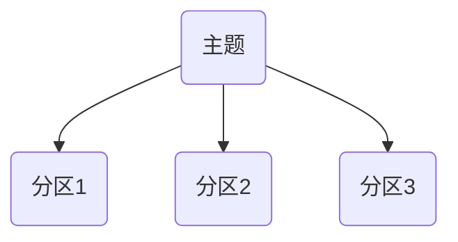

                 

# 《Kafka 原理与代码实例讲解》

## 关键词
Kafka、分布式消息队列、消息生产者、消息消费者、分区、副本、API使用、配置调优、算法实现、实战项目

## 摘要
本文将深入解析Kafka的原理与代码实例，从基础入门到高级应用，涵盖Kafka的核心组件、概念、API使用、配置调优、算法实现及实战项目。通过逐步分析和推理，本文旨在帮助读者全面理解Kafka的工作机制，掌握Kafka的编程技巧，并能够在实际项目中有效应用Kafka。

## 目录大纲

### 第一部分：Kafka基础与原理

#### 第1章：Kafka入门

- **1.1 Kafka概述**
  - **内容**：介绍Kafka的基本概念、发展背景和主要特点。
  - **代码实例**：演示如何启动和停止Kafka集群。

- **1.2 Kafka核心组件与架构**
  - **内容**：分析Kafka的架构设计，包括主题、分区、生产者、消费者和副本等核心组件。
  - **核心概念与联系**：使用Mermaid流程图展示Kafka组件之间的关系。

- **1.3 Kafka消息模型**
  - **内容**：讲解Kafka的消息格式、消息传输流程和消息保证机制。
  - **核心算法原理讲解**：使用伪代码详细阐述Kafka的消息发送和消费算法。

- **1.4 Kafka生产者与消费者**
  - **内容**：分析Kafka生产者和消费者的工作原理，包括如何发送消息和消费消息。
  - **项目实战**：提供Kafka生产者和消费者的代码实例，并进行详细解读。

#### 第2章：Kafka核心概念与特性

- **2.1 Kafka主题与分区**
  - **内容**：探讨Kafka主题和分区的概念、作用以及分区策略。
  - **核心概念与联系**：使用Mermaid流程图展示主题与分区的关系。

- **2.2 Kafka副本与容错机制**
  - **内容**：介绍Kafka副本的复制策略、领导者选举和故障恢复机制。
  - **核心算法原理讲解**：使用伪代码详细阐述Kafka的副本同步算法。

- **2.3 Kafka生产者与消费者负载均衡**
  - **内容**：分析Kafka生产者和消费者的负载均衡机制。
  - **核心算法原理讲解**：使用伪代码详细阐述Kafka的负载均衡算法。

- **2.4 Kafka消息持久化与压缩**
  - **内容**：讲解Kafka消息的持久化策略和支持的压缩算法。
  - **核心算法原理讲解**：使用伪代码详细阐述Kafka的压缩和解压缩算法。

#### 第3章：Kafka API使用

- **3.1 Kafka生产者API详解**
  - **内容**：详细讲解Kafka生产者API的使用方法，包括如何发送消息、如何处理异常等。
  - **项目实战**：提供Kafka生产者API的代码实例，并进行详细解读。

- **3.2 Kafka消费者API详解**
  - **内容**：详细讲解Kafka消费者API的使用方法，包括如何订阅主题、如何消费消息等。
  - **项目实战**：提供Kafka消费者API的代码实例，并进行详细解读。

- **3.3 Kafka消费者组详解**
  - **内容**：探讨Kafka消费者组的组成、工作原理和配置策略。
  - **核心算法原理讲解**：使用伪代码详细阐述Kafka消费者组的分配算法。

#### 第4章：Kafka配置与性能调优

- **4.1 Kafka配置项详解**
  - **内容**：介绍Kafka的主要配置项，包括Kafka服务器和客户端的配置。
  - **核心算法原理讲解**：使用伪代码详细阐述Kafka配置对性能的影响。

- **4.2 Kafka性能调优技巧**
  - **内容**：提供Kafka性能调优的方法和技巧，包括如何优化消息发送和消费。
  - **核心算法原理讲解**：使用伪代码详细阐述调优策略对性能的影响。

- **4.3 Kafka集群运维与管理**
  - **内容**：讲解Kafka集群的运维和管理，包括监控、故障排查和集群升级。

### 第二部分：Kafka高级应用与最佳实践

#### 第5章：Kafka核心算法与实现

- **5.1 Kafka消息复制算法**
  - **内容**：详细讲解Kafka的消息复制算法，包括副本同步过程和领导者选举机制。
  - **核心算法原理讲解**：使用伪代码详细阐述消息复制算法。

- **5.2 Kafka负载均衡算法**
  - **内容**：分析Kafka的负载均衡算法，包括生产者和消费者的负载均衡策略。
  - **核心算法原理讲解**：使用伪代码详细阐述负载均衡算法。

- **5.3 Kafka消费者分配算法**
  - **内容**：探讨Kafka消费者的分配算法，包括消费者组的分配策略。
  - **核心算法原理讲解**：使用伪代码详细阐述消费者分配算法。

#### 第6章：Kafka实战项目

- **6.1 Kafka日志收集系统实战**
  - **内容**：介绍如何使用Kafka构建一个日志收集系统，包括日志生产者和消费者的实现。
  - **项目实战**：提供Kafka日志收集系统的代码实例，并进行详细解读。

- **6.2 Kafka实时流处理系统实战**
  - **内容**：讲解如何使用Kafka构建一个实时流处理系统，包括Kafka消息的消费和实时处理。
  - **项目实战**：提供Kafka实时流处理系统的代码实例，并进行详细解读。

- **6.3 Kafka消息队列系统实战**
  - **内容**：探讨如何使用Kafka构建一个消息队列系统，包括消息的生产、消费和队列管理。
  - **项目实战**：提供Kafka消息队列系统的代码实例，并进行详细解读。

#### 第7章：Kafka与大数据生态系统整合

- **7.1 Kafka与Hadoop整合**
  - **内容**：介绍Kafka与Hadoop的整合方法，包括Kafka作为Hadoop的数据源和 sink。
  - **项目实战**：提供Kafka与Hadoop整合的代码实例，并进行详细解读。

- **7.2 Kafka与Spark整合**
  - **内容**：讲解Kafka与Spark的整合方法，包括Kafka作为Spark的数据源和 sink。
  - **项目实战**：提供Kafka与Spark整合的代码实例，并进行详细解读。

- **7.3 Kafka与Flink整合**
  - **内容**：介绍Kafka与Flink的整合方法，包括Kafka作为Flink的数据源和 sink。
  - **项目实战**：提供Kafka与Flink整合的代码实例，并进行详细解读。

#### 第8章：Kafka最佳实践

- **8.1 Kafka生产者最佳实践**
  - **内容**：提供Kafka生产者的最佳实践，包括消息发送策略、错误处理和性能优化。

- **8.2 Kafka消费者最佳实践**
  - **内容**：提供Kafka消费者的最佳实践，包括消息消费策略、位移管理和性能优化。

- **8.3 Kafka集群运维最佳实践**
  - **内容**：提供Kafka集群运维的最佳实践，包括监控、故障排查和集群升级。

#### 第9章：Kafka未来发展趋势

- **9.1 Kafka在云计算中的应用**
  - **内容**：探讨Kafka在云计算环境中的应用前景和挑战。

- **9.2 Kafka在物联网中的应用**
  - **内容**：介绍Kafka在物联网领域的应用，包括设备数据收集和处理。

- **9.3 Kafka在实时数据处理中的未来**
  - **内容**：分析Kafka在实时数据处理领域的未来发展。

#### 第10章：总结与展望

- **10.1 本书内容总结**
  - **内容**：回顾本书的主要内容，总结Kafka的核心概念和实践经验。

- **10.2 Kafka未来展望**
  - **内容**：展望Kafka的未来发展趋势和技术创新。

- **10.3 学习资源推荐**
  - **内容**：推荐Kafka的学习资源，包括文档、书籍和在线课程。

### 附录

- **A.1 Kafka常用命令行工具**
  - **内容**：介绍Kafka的常用命令行工具，包括kafka-server-start.sh和kafka-topics.sh等。

- **A.2 Kafka常用配置项**
  - **内容**：列出Kafka的主要配置项，包括生产者、消费者和服务器配置。

- **A.3 Kafka常用代码实例**
  - **内容**：提供Kafka的常用代码实例，包括生产者、消费者和主题管理。

#### 核心概念与联系

- **Kafka主题与分区**：使用Mermaid流程图展示主题与分区的关系。



#### 核心算法原理讲解

##### Kafka生产者消息发送算法

```plaintext
1. 生产者将消息发送到分区。
2. 生产者计算目标分区。
   a. 使用key进行哈希，确定分区号。
   b. 如果指定了分区器，则使用分区器进行分区。
3. 生产者将消息发送到分区对应的副本。
   a. 选择 Leader 副本进行发送。
   b. 如果 Leader 副本不可用，则选择下一个可用副本。
4. 生产者等待确认。
   a. 等待确认成功或失败。
   b. 如果确认失败，重试或抛出异常。
```

##### Kafka消费者消费算法

```plaintext
1. 消费者从分区中拉取消息。
2. 消费者计算目标分区。
   a. 如果是消费者组，则根据消费者组策略进行分区分配。
   b. 如果是非消费者组，则根据分区数进行平均分配。
3. 消费者从分区对应的副本中拉取消息。
   a. 选择 Leader 副本进行拉取。
   b. 如果 Leader 副本不可用，则选择下一个可用副本。
4. 消费者处理消息。
   a. 执行业务逻辑。
   b. 更新位移。
5. 消费者处理异常。
   a. 重新分配分区。
   b. 重试或抛出异常。
```

#### 数学模型和数学公式

##### Kafka副本同步算法

$$
\begin{aligned}
    &\text{副本同步算法} \\
    &\text{副本同步时间} = \frac{\text{数据大小}}{\text{带宽}} \\
    &\text{副本同步成功率} = \frac{\text{成功同步副本数}}{\text{总副本数}}
\end{aligned}
$$

#### 项目实战

##### Kafka消息队列系统实战

1. **开发环境搭建**

   **内容**：准备Kafka环境，包括Kafka服务器和客户端。

   **配置**：
   - Kafka服务器：配置Kafka集群，设置ZooKeeper地址、Kafka端口等。
   - Kafka客户端：配置Kafka生产者和消费者的地址、主题等。

2. **源代码详细实现**

   **内容**：编写Kafka生产者和消费者的程序，实现消息的发送和消费。

   **代码实例**：

   ```java
   // 生产者示例代码
   Properties props = new Properties();
   props.put("bootstrap.servers", "localhost:9092");
   props.put("key.serializer", "org.apache.kafka.common.serialization.StringSerializer");
   props.put("value.serializer", "org.apache.kafka.common.serialization.StringSerializer");

   Producer<String, String> producer = new KafkaProducer<>(props);

   for (int i = 0; i < 100; i++) {
       producer.send(new ProducerRecord<>("my-topic", Integer.toString(i), "message " + i));
   }
   producer.close();

   // 消费者示例代码
   Properties props = new Properties();
   props.put("bootstrap.servers", "localhost:9092");
   props.put("group.id", "my-group");
   props.put("key.deserializer", "org.apache.kafka.common.serialization.StringDeserializer");
   props.put("value.deserializer", "org.apache.kafka.common.serialization.StringDeserializer");

   Consumer<String, String> consumer = new KafkaConsumer<>(props);
   consumer.subscribe(Collections.singletonList("my-topic"));

   while (true) {
       ConsumerRecords<String, String> records = consumer.poll(Duration.ofMillis(100));
       for (ConsumerRecord<String, String> record : records) {
           System.out.printf("offset = %d, key = %s, value = %s\n", record.offset(), record.key(), record.value());
       }
   }
   ```

3. **代码解读与分析**

   **内容**：解析生产者如何发送消息，消费者如何消费消息，以及如何处理异常情况。

   **生产者解读**：
   - 生产者通过KafkaProducer对象发送消息，首先设置Kafka服务器的地址和序列化器，然后通过send方法发送消息。
   - 生产者在发送消息时，会计算目标分区，使用key进行哈希或指定分区器进行分区。
   - 生产者选择Leader副本发送消息，如果Leader副本不可用，则选择下一个可用副本。
   - 生产者等待确认，如果确认成功则继续发送，如果确认失败则重试或抛出异常。

   **消费者解读**：
   - 消费者通过KafkaConsumer对象消费消息，设置Kafka服务器的地址、消费者组ID和反序列化器，然后通过subscribe方法订阅主题。
   - 消费者在消费消息时，会从分区对应的副本中拉取消息，选择Leader副本进行拉取。
   - 消费者处理消息，执行业务逻辑并更新位移。
   - 如果消费者处理消息失败，会重新分配分区并重试，如果重试失败则抛出异常。

### 附录

**A.1 Kafka常用命令行工具**

- **kafka-topics.sh**：用于创建、列出、描述和删除Kafka主题。
- **kafka-server-start.sh**：用于启动Kafka服务器。
- **kafka-server-stop.sh**：用于停止Kafka服务器。

**A.2 Kafka常用配置项**

- **bootstrap.servers**：用于指定Kafka服务器的地址和端口。
- **group.id**：用于指定消费者的消费者组ID。
- **key.serializer**：用于指定消息的键序列化器。
- **value.serializer**：用于指定消息的值序列化器。
- **key.deserializer**：用于指定消息的键反序列化器。
- **value.deserializer**：用于指定消息的值反序列化器。

**A.3 Kafka常用代码实例**

- **生产者示例代码**：展示了如何创建Kafka生产者并发送消息。
- **消费者示例代码**：展示了如何创建Kafka消费者并消费消息。

---

### 作者信息

作者：AI天才研究院/AI Genius Institute & 禅与计算机程序设计艺术 /Zen And The Art of Computer Programming

---

本文深入讲解了Kafka的原理与代码实例，从基础入门到高级应用，旨在帮助读者全面理解Kafka的工作机制，掌握Kafka的编程技巧，并能够在实际项目中有效应用Kafka。通过逐步分析和推理，本文为读者提供了清晰的结构和详细的解释，使得Kafka的学习和开发变得简单易懂。希望本文能够为读者在Kafka的学习和应用道路上提供有益的指导。如果您有任何问题或建议，欢迎在评论区留言讨论。感谢您的阅读！

