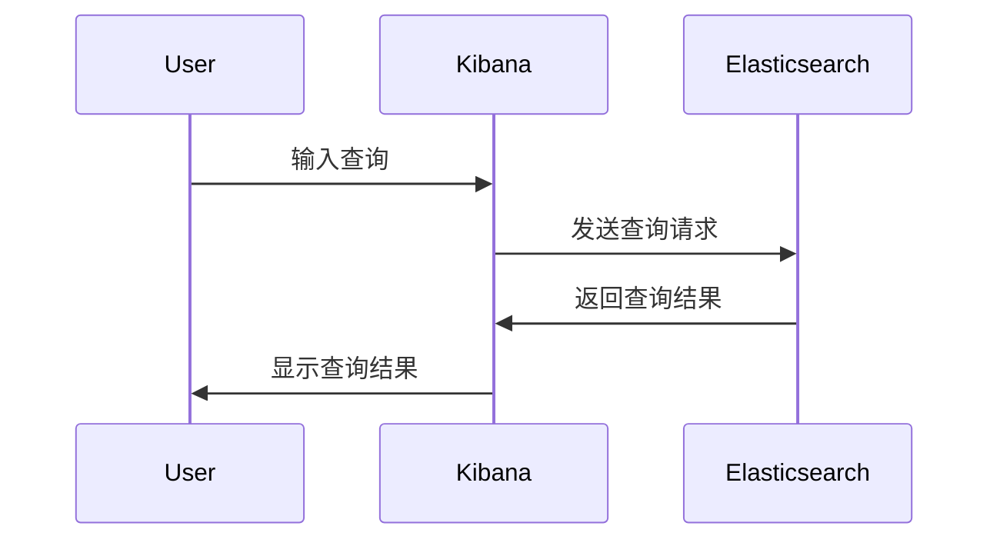
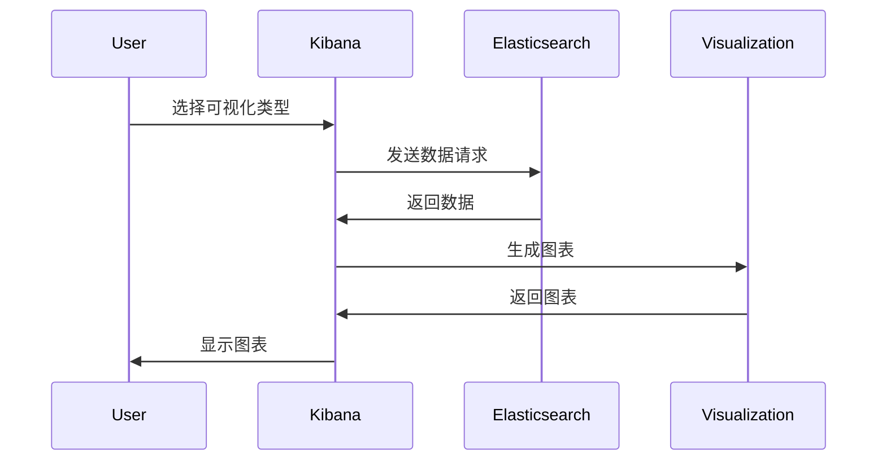
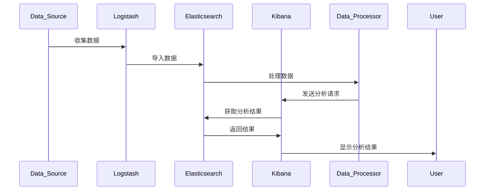
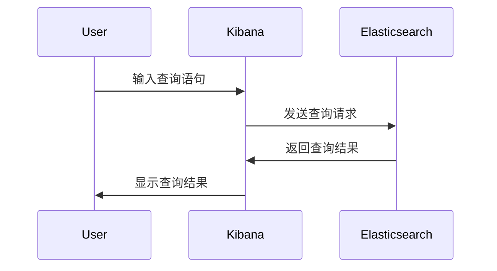
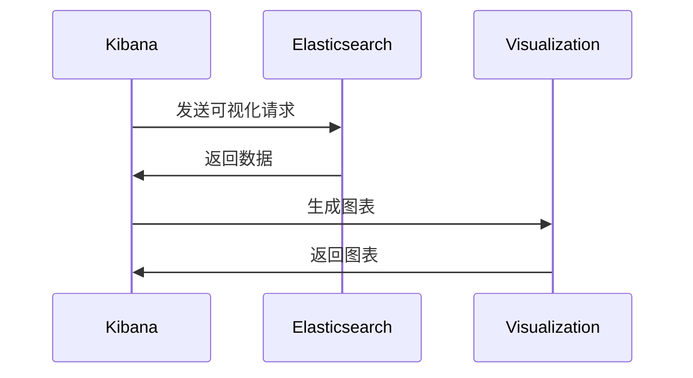
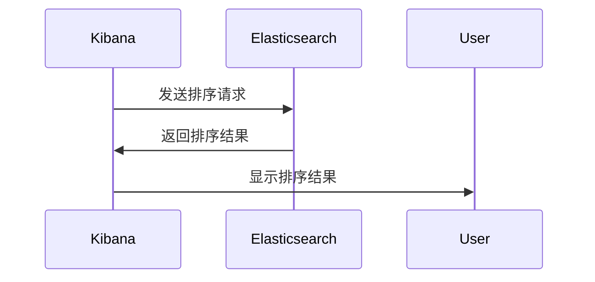

                 

### 文章标题：Kibana原理与代码实例讲解

在当今大数据时代，数据可视化和分析成为企业信息化和决策过程中不可或缺的一环。Kibana，作为一个强大的数据可视化和分析工具，已经成为众多企业和开发者的首选。它基于Elastic Stack（Elasticsearch、Kibana、Logstash和Beats）架构，能够帮助企业快速构建复杂的数据分析解决方案。

本文将围绕Kibana的核心原理和实际代码实例展开讲解，旨在帮助读者深入理解Kibana的架构设计、核心功能以及高级特性。通过本文的阅读，您将能够：

- 了解Kibana的基本概念和用途。
- 掌握Kibana与Elasticsearch的关系及其核心组件。
- 理解Kibana的高级功能和安全特性。
- 探索Kibana的数学模型和核心算法原理。
- 通过实际代码实例学习Kibana的数据预处理、搜索查询、可视化以及数据流分析。

文章结构如下：

1. **Kibana概述**
   - Kibana是什么
   - Kibana的架构
   - Kibana的用途

2. **Kibana核心组件**
   - Elasticsearch与Kibana的关系
   - 查询组件
   - 可视化组件
   - 仪表盘组件

3. **Kibana高级功能**
   - 地理空间数据可视化
   - 时序数据分析
   - 数据流分析
   - Kibana安全功能

4. **Kibana核心算法原理**
   - 搜索算法原理
   - 可视化算法原理
   - 排序算法原理

5. **Kibana数学模型**
   - 数学模型概述
   - 查询优化数学模型
   - 可视化数学模型

6. **Kibana项目实战**
   - 数据预处理实战
   - 搜索查询实战
   - 可视化实战
   - 数据流分析实战
   - 安全功能实战

7. **Kibana未来发展趋势**
   - Kibana的技术演进
   - Kibana在企业中的应用前景
   - Kibana的发展挑战与机遇

接下来，我们将逐一深入探讨Kibana的各个关键方面。准备好了吗？让我们一步一步地走进Kibana的世界。

### 文章关键词

- 数据可视化
- Kibana
- Elasticsearch
- 数据分析
- 可视化组件
- 搜索算法
- 数学模型
- 实际代码实例

### 文章摘要

Kibana是一个强大而灵活的数据可视化和分析工具，广泛应用于企业级大数据解决方案中。本文首先介绍了Kibana的基本概念和用途，详细解析了其与Elasticsearch的紧密关系和核心组件。接着，探讨了Kibana的高级功能，包括地理空间数据可视化、时序数据分析、数据流分析以及安全特性。文章进一步深入解析了Kibana的核心算法原理和数学模型，并提供了丰富的实际代码实例，展示了数据预处理、搜索查询、可视化以及数据流分析的具体实现过程。最后，对Kibana的未来发展趋势进行了展望，探讨了其技术演进和应用前景，以及面临的挑战与机遇。通过本文的阅读，读者将能够全面掌握Kibana的原理和实践，为大数据分析项目提供有力支持。

### Kibana概述

Kibana是Elastic Stack中的重要组成部分，与Elasticsearch、Logstash和Beats一起构成了完整的解决方案，用于处理、分析和可视化大量结构化和非结构化数据。Kibana提供了一个强大的用户界面，使得用户可以轻松地对数据进行查询、分析和可视化，帮助企业在数据驱动决策方面实现更高的效率和准确性。

#### Kibana是什么

Kibana本质上是用于数据分析、可视化和探索的数据分析平台。它通过将Elasticsearch存储的数据转化为直观的图表、仪表盘和报告，使数据分析和可视化变得更加简单和直观。Kibana支持多种数据源，包括但不限于Elasticsearch、MySQL、PostgreSQL等，这使得它可以适应不同的业务场景和数据需求。

Kibana的主要特点包括：

- **数据可视化**：通过直观的图表和仪表盘，用户可以快速理解和分析数据。
- **实时分析**：支持实时数据流分析，帮助企业及时响应业务变化。
- **自定义仪表盘**：用户可以根据需求自定义仪表盘，展示关键业务指标。
- **易于集成**：与Elastic Stack其他组件紧密集成，便于构建复杂的数据分析解决方案。

#### Kibana的架构

Kibana的架构设计充分考虑了性能、可扩展性和易用性。它主要由以下几部分组成：

1. **前端用户界面**：这是Kibana的核心部分，提供了用户交互的入口。用户通过Web浏览器访问Kibana，进行数据查询、分析和可视化操作。
2. **后端服务器**：Kibana的后端服务器负责处理用户请求，与Elasticsearch进行交互，获取数据并返回结果。后端服务器还包括一系列中间件和服务，如Kibana的插件架构、安全性管理等。
3. **Elasticsearch集群**：Kibana的数据源通常是Elasticsearch集群。Elasticsearch负责存储、索引和分析大量数据，为Kibana提供数据支持。

#### Kibana的用途

Kibana在企业中的用途非常广泛，主要包括以下几个方面：

- **运维监控**：通过Kibana，企业可以监控其IT基础设施的性能指标，如CPU使用率、内存占用、网络流量等。
- **安全分析**：Kibana能够对日志数据进行实时分析，帮助企业发现潜在的安全威胁和异常行为。
- **业务分析**：通过自定义仪表盘和报告，企业可以跟踪关键业务指标，如销售额、客户满意度、库存水平等。
- **数据探索**：Kibana提供强大的数据探索功能，帮助用户深入挖掘数据，发现潜在的业务机会和优化空间。

总的来说，Kibana作为一个灵活而强大的数据分析工具，不仅能够提升企业的数据处理效率，还能够帮助企业在数据驱动决策方面取得更大的成功。在下一部分中，我们将详细探讨Kibana的核心组件，进一步理解其功能和运作原理。

#### 第1章：Kibana基础

#### 1.1 Kibana是什么

Kibana是一款基于Web的数据分析与可视化的工具，广泛应用于日志分析、IT运维监控、安全监控、业务分析等领域。它是Elastic Stack中的关键组件之一，与Elasticsearch、Logstash和Beats紧密结合，共同构成了强大的数据分析和处理平台。

Kibana的主要功能包括：

1. **数据可视化**：通过直观的图表和仪表盘，用户可以轻松地理解和分析数据。
2. **实时分析**：支持实时数据流分析，帮助企业快速响应业务变化。
3. **自定义仪表盘**：用户可以根据实际需求自定义仪表盘，展示关键业务指标。
4. **多源数据支持**：Kibana不仅支持Elasticsearch，还支持MySQL、PostgreSQL等数据源，便于集成各种数据。

#### 1.2 Kibana的架构

Kibana的架构设计旨在提供高性能、可扩展和易用的数据分析平台。其核心架构包括以下几个关键部分：

1. **前端用户界面**：Kibana的前端用户界面通过Web浏览器进行访问，提供了丰富的交互功能。用户可以通过直观的界面进行数据查询、分析和可视化操作。

2. **后端服务器**：Kibana的后端服务器负责处理用户请求，与Elasticsearch进行交互，获取数据并返回结果。后端服务器还包括一系列中间件和服务，如插件架构、安全性管理、节点监控等。

3. **Elasticsearch集群**：Kibana的数据存储通常依赖于Elasticsearch集群。Elasticsearch负责存储、索引和分析数据，为Kibana提供强大的数据支持。Elasticsearch集群通常由多个节点组成，确保数据的高可用性和可扩展性。

4. **数据流处理**：Kibana支持实时数据流处理，通过Logstash和Beats组件将实时数据导入Elasticsearch，实现实时分析和监控。

#### 1.3 Kibana的用途

Kibana在企业中的用途非常广泛，主要包括以下几个方面：

1. **运维监控**：Kibana可以帮助企业监控其IT基础设施的性能指标，如CPU使用率、内存占用、网络流量等。通过自定义仪表盘和报告，用户可以实时了解系统状态，快速识别和解决潜在问题。

2. **安全监控**：Kibana可以分析日志数据，识别异常行为和潜在的安全威胁。通过实时监控和报警，企业可以及时应对安全事件，保障业务系统的安全性。

3. **业务分析**：Kibana提供了丰富的数据探索和分析功能，帮助用户跟踪关键业务指标，如销售额、客户满意度、库存水平等。通过自定义仪表盘和报告，企业可以深入了解业务运营情况，制定更加有效的决策。

4. **数据探索**：Kibana提供了强大的数据探索功能，用户可以深入挖掘数据，发现潜在的业务机会和优化空间。通过交互式的可视化分析，用户可以轻松地理解和利用数据。

总之，Kibana作为一个强大而灵活的数据分析和可视化工具，不仅能够提升企业的数据处理效率，还能够帮助企业在数据驱动决策方面取得更大的成功。在下一部分，我们将进一步探讨Kibana的核心组件，深入了解其工作原理和功能。

### 第2章：Kibana核心组件

Kibana的核心组件是其功能实现的基础，主要包括查询组件、可视化组件和仪表盘组件。这些组件协同工作，共同为用户提供了一个强大的数据分析和可视化平台。

#### 2.1 Elasticsearch与Kibana的关系

Kibana与Elasticsearch的关系非常密切，Elasticsearch是Kibana的主要数据源。Kibana通过Elasticsearch进行数据检索、分析和可视化，因此，理解Elasticsearch的工作原理对深入掌握Kibana至关重要。

- **数据存储与索引**：Elasticsearch负责存储和索引数据，将大量的原始数据转化为结构化的索引，方便Kibana进行快速查询和分析。
- **查询与检索**：Kibana通过Elasticsearch API发送查询请求，Elasticsearch执行查询并返回结果。Kibana解析查询结果，生成可视化图表和报告。
- **实时分析**：Kibana支持实时数据流分析，Elasticsearch的实时索引功能使得Kibana能够实时更新数据和图表，提供实时监控和报警。

#### 2.2 查询组件

查询组件是Kibana的核心功能之一，它允许用户通过简单的查询语句检索和筛选数据。Kibana提供了多种查询方式，包括：

- **查询语句**：用户可以使用Elasticsearch的查询DSL（Domain Specific Language）编写复杂的查询语句，实现精确的数据检索。
- **字段过滤**：通过字段过滤，用户可以筛选特定字段的数据，进一步细化查询结果。
- **范围查询**：支持基于时间、数值范围等多种条件的查询，帮助用户快速找到所需数据。

以下是一个简单的查询示例：

```json
GET /_search
{
  "query": {
    "match": {
      "message": "Error"
    }
  },
  "size": 10
}
```

在这个示例中，Kibana通过Elasticsearch检索包含“Error”关键字的消息，并返回前10条记录。

#### 2.3 可视化组件

可视化组件是Kibana的另一大核心功能，它通过将数据以图表、地图等形式展示，帮助用户更直观地理解数据。Kibana提供了丰富的可视化选项，包括：

- **柱状图**：用于展示不同类别数据的数量或比例。
- **折线图**：用于展示随时间变化的数据趋势。
- **饼图**：用于展示各部分在整体中的比例。
- **地图**：用于展示地理空间数据，特别是与地理位置相关的数据。

以下是一个使用Kibana可视化组件的示例：

```json
GET /_search
{
  "size": 0,
  "aggs": {
    "top_hits": {
      "size": 10,
      "hits": {
        "sort": [
          {"timestamp": "desc"}
        ]
      }
    },
    "errors_by_severity": {
      "terms": {
        "field": "severity",
        "size": 5
      },
      "aggs": {
        "top_hits": {
          "size": 5,
          "hits": {
            "sort": [
              {"timestamp": "desc"}
            ]
          }
        }
      }
    }
  }
}
```

在这个示例中，Kibana通过Elasticsearch Aggregations功能，创建了一个层次结构的可视化图表，展示了不同严重程度的错误及其相关详情。

#### 2.4 仪表盘组件

仪表盘组件是Kibana最具特色的功能之一，它允许用户将多个图表和报告组合在一起，创建一个个性化的仪表板。仪表盘组件具有以下特点：

- **自定义布局**：用户可以根据需要自定义仪表盘的布局，调整图表的位置和大小。
- **联动更新**：仪表盘中的图表可以联动更新，当一个图表的数据发生变化时，其他相关图表也会自动更新。
- **共享与协作**：用户可以将仪表盘共享给团队或同事，便于协作和数据共享。

以下是一个简单的仪表盘示例：

```json
{
  "title": "Error Summary",
  "rows": [
    [
      {
        "type": "histogram",
        "title": "Errors by Severity",
        "field": "severity",
        "interval": "day"
      }
    ],
    [
      {
        "type": "timeseries",
        "title": "Error Count Over Time",
        "field": "timestamp",
        "interval": "day"
      }
    ]
  ]
}
```

在这个示例中，Kibana创建了一个包含柱状图和折线图的仪表盘，用于展示错误的严重程度和时间趋势。

通过理解Kibana的查询组件、可视化组件和仪表盘组件，用户可以更有效地分析和理解数据。在下一部分，我们将探讨Kibana的高级功能，包括地理空间数据可视化、时序数据分析等。

### 第3章：Kibana高级功能

Kibana的高级功能为用户提供了更加丰富和深入的数据分析手段。本章节将详细介绍Kibana的地理空间数据可视化、时序数据分析、数据流分析和安全功能，帮助用户更好地利用这些功能进行复杂的数据分析和决策支持。

#### 3.1 地理空间数据可视化

地理空间数据可视化是Kibana的一项强大功能，能够将地理位置相关的数据以地图的形式展示出来，帮助用户直观地理解地理分布和空间关系。

**1. 地图组件：** Kibana的地图组件基于开源项目Leaflet构建，支持多种地图类型，如OpenStreetMap、Google Maps等。用户可以自定义地图的样式、标记和图层，以便更好地展示地理数据。

**2. 地理编码与解码：** Kibana支持地理编码和地理解码功能，可以将地址转换为地图上的坐标点，或者将坐标点转换为地址。这对于处理与地理位置相关的数据非常重要。

**3. 地理聚合：** 使用地理聚合，用户可以将地理位置数据聚合到更高级别的地理单位，如国家、州、城市等。这有助于用户从宏观角度分析地理分布情况。

以下是一个简单的地理空间数据可视化示例：

```json
GET /_search
{
  "size": 0,
  "aggs": {
    "location": {
      "geobucket": {
        "field": "location",
        "lat_field": "lat",
        "lon_field": "lon",
        "simplify": "50m"
      }
    }
  }
}
```

在这个示例中，Kibana通过Elasticsearch Aggregations功能，将地理位置数据聚合到一个地图上，并简化了地图标记，以更好地展示数据分布。

#### 3.2 时序数据分析

时序数据分析是Kibana的另一项重要功能，适用于处理随时间变化的数据。通过时序数据分析，用户可以监控数据趋势、识别周期性变化和异常情况。

**1. 折线图：** 折线图是最常见的时序数据分析工具，可以展示数据随时间的变化趋势。用户可以通过调整折线图的时间范围和间隔，更好地观察数据的周期性和异常点。

**2. 指标图表：** 指标图表（如柱状图、饼图）可以用于展示特定时间点的关键指标，如销售额、用户访问量等。结合折线图，用户可以全面了解数据的变化情况。

**3. 数据流：** Kibana的数据流功能可以实时显示数据的流入和流出情况，帮助用户监控实时数据变化。这对于需要快速响应实时事件的应用场景非常有用。

以下是一个简单的时序数据分析示例：

```json
GET /_search
{
  "size": 0,
  "aggs": {
    "time_series": {
      "date_histogram": {
        "field": "timestamp",
        "calendar_interval": "day"
      },
      "aggs": {
        "count": {
          "value_count": {
            "field": "doc_count"
          }
        }
      }
    }
  }
}
```

在这个示例中，Kibana使用日期直方图聚合功能，创建了一个时间序列图表，展示了每天的数据计数情况。

#### 3.3 数据流分析

数据流分析是Kibana的一项高级功能，它能够实时处理和分析大规模数据流，帮助用户快速识别异常和趋势变化。

**1. Logstash数据流：** Kibana通过Logstash集成数据流，Logstash负责实时收集和预处理数据，将其导入Elasticsearch。Kibana从Elasticsearch获取实时数据流，进行实时分析和可视化。

**2. Beats数据采集：** Kibana支持多种Beats数据采集器，如Filebeat、Metricbeat等。这些采集器可以实时收集服务器、应用程序和网络设备的数据，并将其发送到Kibana进行可视化分析。

**3. 流处理：** Kibana提供流处理功能，用户可以自定义数据处理逻辑，如数据过滤、聚合等。流处理使得用户能够实时分析数据流，快速识别异常和趋势。

以下是一个简单的数据流分析示例：

```json
GET /_search
{
  "size": 0,
  "aggs": {
    "data_stream": {
      "top_hits": {
        "size": 10,
        "sort": [
          {"timestamp": "desc"}
        ]
      }
    }
  }
}
```

在这个示例中，Kibana通过Elasticsearch Top Hits聚合功能，实时显示最新的数据流记录。

#### 3.4 Kibana安全功能

Kibana提供了一系列安全功能，确保数据的安全和隐私。以下是一些关键安全特性：

**1. 用户认证与授权：** Kibana支持多种认证机制，如基本认证、OAuth、SAML等。用户可以通过这些认证机制登录Kibana，并获得相应权限，访问特定数据和功能。

**2. 安全传输：** Kibana支持通过SSL/TLS加密安全传输，确保数据在传输过程中的安全性。

**3. 数据加密：** Kibana支持对存储在Elasticsearch中的数据进行加密，保护数据免受未授权访问。

**4. 日志记录与审计：** Kibana记录所有用户操作日志，并进行审计，便于管理员监控和调查潜在的安全威胁。

通过上述高级功能，Kibana为用户提供了强大而灵活的数据分析和可视化手段，帮助企业更好地理解和利用数据，实现数据驱动决策。在下一部分，我们将深入探讨Kibana的核心算法原理，进一步理解其工作原理和实现细节。

### 第4章：Kibana核心算法原理

在深入了解Kibana的架构和功能之后，理解其背后的核心算法原理变得尤为重要。Kibana的核心算法涵盖了搜索算法、可视化算法和排序算法，这些算法在数据检索、分析和展示过程中起到了关键作用。本章节将详细讲解这些核心算法的原理，并通过具体的伪代码和示例，帮助读者深入理解其实现细节。

#### 4.1 搜索算法原理

Kibana的搜索算法主要依赖于Elasticsearch的查询引擎。Elasticsearch提供了丰富的查询语言和算法，支持全文搜索、结构化查询和复杂的组合查询。以下是几个关键的搜索算法原理：

**1. 全文搜索算法：**

全文搜索算法的核心是倒排索引。倒排索引将文档的内容与文档的ID建立映射关系，使得搜索时可以快速定位到包含特定关键词的文档。

```latex
Pseudo-code for Full-Text Search Algorithm:

```
function full_text_search(query, index):
    # Build the query's inverted index
    inverted_index = build_inverted_index(query)

    # Retrieve documents containing the query terms
    candidate_documents = []
    for term in query_terms:
        candidate_documents += inverted_index[term]

    # Filter documents based on the query conditions
    filtered_documents = filter_documents(candidate_documents, query_conditions)

    return filtered_documents
```

**2. 结构化查询算法：**

结构化查询算法涉及对文档中特定字段进行精确匹配或范围查询。例如，查询某个时间范围内的事件或某个具体字段的值。

```latex
Pseudo-code for Structured Query Algorithm:

```
function structured_query(field, value, index):
    # Retrieve documents based on the field-value pair
    candidate_documents = es_search(index, {"query": {"term": {field: value}}})

    return candidate_documents
```

**3. 复合查询算法：**

复合查询算法允许用户组合多个查询条件，实现更复杂的搜索逻辑。例如，同时搜索包含特定关键词且发生在某个时间范围内的文档。

```latex
Pseudo-code for Composite Query Algorithm:

```
function composite_query(queries, index):
    # Build a composite query from the individual queries
    composite_query = {"bool": {"must": []}}
    for query in queries:
        composite_query["bool"]["must"].append(query)

    # Retrieve documents based on the composite query
    candidate_documents = es_search(index, composite_query)

    return candidate_documents
```

#### 4.2 可视化算法原理

可视化算法负责将搜索结果和数据以直观的方式呈现给用户。Kibana的可视化组件依赖于Elasticsearch的聚合功能，通过不同的聚合操作生成不同的可视化图表。

**1. 直方图算法：**

直方图用于展示数据的分布情况，通过将数据分组到不同的区间并统计每个区间的文档数量。

```latex
Pseudo-code for Histogram Algorithm:

```
function create_histogram(data, buckets):
    histogram = []
    for bucket in buckets:
        count = count_documents_in_range(data, bucket["from"], bucket["to"])
        histogram.append({"name": bucket["name"], "count": count})

    return histogram
```

**2. 折线图算法：**

折线图用于展示数据随时间的变化趋势，通过连接每个时间点的数据值，生成折线图。

```latex
Pseudo-code for Line Chart Algorithm:

```
function create_line_chart(data, time_field, x_axis_interval):
    line_chart_data = []
    current_time = get_first_time(data, time_field)
    while current_time <= get_last_time(data, time_field):
        value = get_value(data, current_time, time_field)
        line_chart_data.append({"x": current_time, "y": value})
        current_time += x_axis_interval

    return line_chart_data
```

**3. 饼图算法：**

饼图用于展示数据的占比情况，通过将数据划分为不同的部分，并以饼块的形式展示。

```latex
Pseudo-code for Pie Chart Algorithm:

```
function create_pie_chart(data, field):
    pie_chart_data = []
    for value, count in get_field_values_and_counts(data, field):
        pie_chart_data.append({"label": value, "value": count})

    return pie_chart_data
```

#### 4.3 排序算法原理

排序算法负责对搜索结果进行排序，以满足用户对数据顺序的需求。Kibana支持多种排序方式，包括基于时间、数值和字符串的排序。

**1. 时间排序算法：**

时间排序算法按照时间戳对文档进行排序，常用于时序数据的展示。

```latex
Pseudo-code for Time-based Sorting Algorithm:

```
function sort_by_time(documents, time_field):
    sorted_documents = sort(documents, key=lambda doc: doc[time_field])
    return sorted_documents
```

**2. 数值排序算法：**

数值排序算法按照数值大小对文档进行排序，常用于比较不同数值的文档。

```latex
Pseudo-code for Numerical Sorting Algorithm:

```
function sort_by_value(documents, value_field):
    sorted_documents = sort(documents, key=lambda doc: doc[value_field])
    return sorted_documents
```

**3. 字符串排序算法：**

字符串排序算法按照字符串的字母顺序对文档进行排序，常用于文本数据的展示。

```latex
Pseudo-code for String Sorting Algorithm:

```
function sort_by_string(documents, string_field):
    sorted_documents = sort(documents, key=lambda doc: doc[string_field])
    return sorted_documents
```

通过理解这些核心算法原理，用户可以更好地利用Kibana进行复杂的数据分析和可视化。这些算法不仅提升了Kibana的性能和灵活性，还为其在各个领域中的应用提供了强大的支持。在下一部分，我们将探讨Kibana的数学模型，进一步揭示其数据处理的内在机制。

### 第5章：Kibana数学模型

Kibana的数学模型是其核心算法和数据处理的基石，它贯穿于Kibana的各个方面，包括查询优化、可视化展示和数据流处理。理解这些数学模型不仅有助于我们深入理解Kibana的工作原理，还能够帮助我们更有效地利用其功能。以下是关于Kibana数学模型的主要概述：

#### 5.1 数学模型概述

Kibana的数学模型主要涉及以下几个方面：

1. **查询优化数学模型**：用于提升查询效率和准确性，通过数学公式和算法优化查询语句和数据检索过程。
2. **可视化数学模型**：用于将数据转化为直观的图表和图像，帮助用户更好地理解和分析数据。
3. **数据流处理数学模型**：用于处理和分析大规模实时数据流，确保数据流的实时性和准确性。

#### 5.2 查询优化数学模型

查询优化是Kibana性能提升的关键因素之一。其核心在于如何高效地执行查询，并返回最相关的数据。以下是几个关键的查询优化数学模型：

1. **倒排索引**：倒排索引通过将词汇和文档ID建立映射关系，实现快速全文搜索。其数学模型可表示为：

   \[
   \text{Inverted Index} = \{(\text{word}_i, \{\text{docID}_1, \text{docID}_2, ..., \text{docID}_n\})\}
   \]

   其中，`word_i`表示词汇，`docID`表示文档ID。

2. **布尔模型**：布尔模型用于组合多个查询条件，其数学公式为：

   \[
   \text{Boolean Model} = \text{AND}(\text{query}_1, \text{query}_2, ..., \text{query}_n)
   \]

   其中，`query`表示查询条件，`AND`表示逻辑与操作。

3. **TF-IDF模型**：TF-IDF模型用于衡量文档中关键词的重要性，其计算公式为：

   \[
   \text{TF-IDF}(word) = \text{TF}(word) \times \text{IDF}(word)
   \]

   其中，`TF`表示词频（Term Frequency），`IDF`表示逆文档频率（Inverse Document Frequency）。

#### 5.3 可视化数学模型

可视化数学模型用于将数据转化为图表和图像，帮助用户更直观地理解数据。以下是几个关键的可视化数学模型：

1. **直方图模型**：直方图用于展示数据的分布情况，其数学模型为：

   \[
   \text{Histogram} = \sum_{i=1}^{n} \text{Bin}_i \times \text{Frequency}_i
   \]

   其中，`Bin_i`表示第i个区间，`Frequency_i`表示该区间的数据频数。

2. **折线图模型**：折线图用于展示数据随时间的变化趋势，其数学模型为：

   \[
   \text{Line Chart} = (\text{time}_i, \text{value}_i)
   \]

   其中，`time_i`表示时间点，`value_i`表示该时间点的数据值。

3. **饼图模型**：饼图用于展示数据的占比情况，其数学模型为：

   \[
   \text{Pie Chart} = \frac{\text{Part}_i}{\sum_{i=1}^{n} \text{Part}_i}
   \]

   其中，`Part_i`表示第i部分的数据值，`n`表示数据部分的总数。

#### 5.4 数据流处理数学模型

数据流处理是Kibana实时分析数据的关键环节。其数学模型主要涉及以下几个方面：

1. **时间窗口**：时间窗口用于定义数据的时效性，其数学模型为：

   \[
   \text{Time Window} = \{t_0, t_0 + \Delta t, ..., t_n\}
   \]

   其中，`t_0`表示窗口开始时间，`\Delta t`表示时间间隔，`t_n`表示窗口结束时间。

2. **滑动窗口**：滑动窗口是一种动态时间窗口，其数学模型为：

   \[
   \text{Sliding Window} = \{t_0, t_0 + \Delta t, ..., t_n - \Delta t\}
   \]

   滑动窗口通过定期更新窗口内容，实现实时数据流处理。

3. **流计算**：流计算用于处理大规模实时数据流，其数学模型为：

   \[
   \text{Stream Computation} = \sum_{i=1}^{n} f(\text{window}_i)
   \]

   其中，`window_i`表示第i个时间窗口，`f`表示数据处理函数。

通过理解这些数学模型，用户可以更深入地掌握Kibana的工作原理，并更好地利用其功能进行数据分析。在下一部分，我们将通过实际代码实例，展示如何利用Kibana进行数据预处理、搜索查询、可视化以及数据流分析。

### 第6章：Kibana项目实战

在前几章中，我们详细介绍了Kibana的核心原理和功能。为了使读者能够更好地理解和应用这些知识，本章节将通过一系列实际项目案例，详细讲解如何利用Kibana进行数据预处理、搜索查询、数据可视化和数据流分析。每个项目案例都将包含具体的步骤、代码实现和详细解析，帮助读者将理论知识转化为实际操作能力。

#### 6.1 数据预处理实战

数据预处理是数据分析的重要环节，它确保数据的准确性和一致性。在本节中，我们将介绍如何使用Kibana进行数据预处理，包括数据导入、清洗和格式化。

**案例：数据导入与清洗**

**步骤 1：数据导入**

首先，我们需要将数据导入Kibana。在本案例中，我们使用一个包含日志数据的CSV文件作为数据源。

```bash
# 使用Kibana命令行工具导入数据
curl -X POST "localhost:9200/_plugins/kibana-dev-tools/data/import" \
     -H "Content-Type: application/json" \
     -d "@path/to/your/logs.csv"
```

**步骤 2：数据清洗**

接下来，我们使用Kibana的数据可视化工具清洗数据。具体步骤如下：

1. 在Kibana导航栏中，选择“Discover”。
2. 从数据源下拉菜单中选择导入的CSV文件。
3. 添加字段到可视化面板，并设置字段类型（如日期、数字、文本等）。
4. 使用“Search”栏进行数据筛选，删除重复记录和异常值。

**代码实现：**

以下是Kibana Data Visualizer进行数据清洗的部分伪代码：

```javascript
// 连接到Kibana API
const kibanaApi = new KibanaApiClient({ baseUrl: 'http://localhost:5601' });

// 查询数据
const data = await kibanaApi.search({
  index: 'your-log-index',
  body: {
    query: {
      match_all: {}
    }
  }
});

// 清洗数据
const cleanedData = data.rows.map(row => {
  // 删除重复记录
  if (row.timestamp === previousTimestamp) {
    return null;
  }
  previousTimestamp = row.timestamp;
  return row;
}).filter(row => row !== null);
```

**详细解析：**

- 使用KibanaApiClient连接到Kibana API。
- 通过`search`方法查询数据，并使用`match_all`查询所有记录。
- 对查询结果进行映射，删除重复记录，并更新`previousTimestamp`变量以跟踪唯一记录。

#### 6.2 搜索查询实战

搜索查询是Kibana的核心功能之一，通过Elasticsearch的查询语言，可以灵活地检索和分析数据。以下是一个简单的搜索查询实战案例。

**案例：简单搜索与聚合查询**

**步骤 1：设置索引模式**

首先，我们需要为日志数据设置索引模式，以便进行后续查询。

```json
PUT /your-log-index
{
  "settings": {
    "number_of_shards": 1,
    "number_of_replicas": 0
  },
  "mappings": {
    "properties": {
      "timestamp": {
        "type": "date"
      },
      "level": {
        "type": "keyword"
      },
      "message": {
        "type": "text"
      }
    }
  }
}
```

**步骤 2：执行搜索查询**

接下来，我们执行一个简单的搜索查询，返回包含特定关键词的日志记录。

```bash
GET /your-log-index/_search
{
  "query": {
    "match": {
      "message": "Error"
    }
  },
  "size": 10
}
```

**步骤 3：执行聚合查询**

然后，我们执行一个聚合查询，统计不同级别的日志记录数量。

```bash
GET /your-log-index/_search
{
  "size": 0,
  "aggs": {
    "log_levels": {
      "terms": {
        "field": "level",
        "size": 10
      }
    }
  }
}
```

**代码实现：**

以下是使用Python的Elasticsearch库执行聚合查询的示例代码：

```python
from elasticsearch import Elasticsearch

es = Elasticsearch()

# 简单搜索查询
simple_response = es.search(
    index="your-log-index",
    body={
        "query": {
            "match": {
                "message": "Error"
            }
        },
        "size": 10
    }
)

# 聚合查询
aggregation_response = es.search(
    index="your-log-index",
    body={
        "size": 0,
        "aggs": {
            "log_levels": {
                "terms": {
                    "field": "level",
                    "size": 10
                }
            }
        }
    }
)

print("Simple Search Results:", simple_response['hits']['hits'])
print("Aggregation Results:", aggregation_response['aggregations']['log_levels']['buckets'])
```

**详细解析：**

- 创建Elasticsearch客户端实例。
- 使用`search`方法执行简单搜索查询，返回包含“Error”关键词的日志记录。
- 使用`search`方法执行聚合查询，统计不同级别的日志记录数量。

#### 6.3 可视化实战

数据可视化是将数据转化为图表和图像的过程，使得数据分析结果更加直观和易于理解。以下是一个简单的数据可视化实战案例。

**案例：创建柱状图和折线图**

**步骤 1：创建仪表盘**

首先，我们创建一个新的仪表盘，并添加柱状图和折线图。

```json
POST /kibana/api/saved_objects/dashboard
{
  "type": "dashboard",
  "attributes": {
    "title": "Log Analysis Dashboard",
    " panels": [
      {
        "type": "visualization",
        "id": "log-levels-bar-chart",
        "panelId": "bar-chart-panel",
        "title": "Log Levels",
        "options": {
          "type": "bar",
          "addSeriesLabel": true,
          "addTimeMarker": true
        },
        "gridData": {
          "h": 3,
          "w": 6
        }
      },
      {
        "type": "visualization",
        "id": "log-timestamp-line-chart",
        "panelId": "line-chart-panel",
        "title": "Timestamp Line Chart",
        "options": {
          "type": "line",
          "addSeriesLabel": true,
          "addTimeMarker": true
        },
        "gridData": {
          "h": 6,
          "w": 12
        }
      }
    ]
  }
}
```

**步骤 2：配置可视化数据**

接下来，我们需要配置柱状图和折线图的可视化数据。

```json
POST /kibana/api/saved_objects/visualization
{
  "type": "visualization",
  "attributes": {
    "title": "Log Levels",
    "kibanaSavedObjectMeta": {
      "searchSource": {
        "index": "your-log-index",
        "filter": [
          {"term": {"level": "INFO"}},
          {"term": {"level": "ERROR"}}
        ]
      }
    },
    "visualization": {
      "type": "bar",
      "spec": {
        "metrics": [
          {
            "field": "level",
            "type": "segment"
          }
        ],
        "series": [
          {
            "label": "INFO",
            "color": "#008000"
          },
          {
            "label": "ERROR",
            "color": "#FF0000"
          }
        ]
      }
    }
  }
}
```

**步骤 3：添加到仪表盘**

最后，我们将可视化数据添加到仪表盘中。

```json
POST /kibana/api/saved_objects/dashboard/Log%20Analysis%20Dashboard/visualization/log-levels-bar-chart/_create
{
  "panelCell": {
    "h": 3,
    "w": 6,
    "x": 0,
    "y": 0
  }
}
```

**代码实现：**

以下是使用Python的Elastic客户端添加可视化的示例代码：

```python
from elasticsearch import Elasticsearch

es = Elasticsearch()

# 配置柱状图可视化
bar_chart_response = es.post('/kibana/api/saved_objects/visualization', json={
    "type": "visualization",
    "attributes": {
        "title": "Log Levels",
        "kibanaSavedObjectMeta": {
            "searchSource": {
                "index": "your-log-index",
                "filter": [
                    {"term": {"level": "INFO"}},
                    {"term": {"level": "ERROR"}}
                ]
            }
        },
        "visualization": {
            "type": "bar",
            "spec": {
                "metrics": [
                    {
                        "field": "level",
                        "type": "segment"
                    }
                ],
                "series": [
                    {
                        "label": "INFO",
                        "color": "#008000"
                    },
                    {
                        "label": "ERROR",
                        "color": "#FF0000"
                    }
                ]
            }
        }
    }
})

# 添加柱状图到仪表盘
es.post('/kibana/api/saved_objects/dashboard/Log%20Analysis%20Dashboard/visualization/log-levels-bar-chart/_create', json={
    "panelCell": {
        "h": 3,
        "w": 6,
        "x": 0,
        "y": 0
    }
})

# 配置折线图可视化
line_chart_response = es.post('/kibana/api/saved_objects/visualization', json={
    "type": "visualization",
    "attributes": {
        "title": "Timestamp Line Chart",
        "kibanaSavedObjectMeta": {
            "searchSource": {
                "index": "your-log-index",
                "filter": [
                    {"range": {"timestamp": {"gte": "now-1d/d", "lt": "now/d"}}}
                ]
            }
        },
        "visualization": {
            "type": "line",
            "spec": {
                "yScaleType": "linear",
                "xScaleType": "time",
                "yFormatter": "default",
                "xFormatter": "default",
                "brush": {
                    "enabled": false
                },
                "resize": {
                    "enabled": true
                },
                "legend": {
                    "direction": "column"
                },
                "data": {
                    "columns": [
                        ["timestamp", "count"],
                        ["now", 0]
                    ],
                    "types": {
                        "timestamp": "time",
                        "count": "linear"
                    },
                    "rows": []
                }
            }
        }
    }
})

# 添加折线图到仪表盘
es.post('/kibana/api/saved_objects/dashboard/Log%20Analysis%20Dashboard/visualization/log-timestamp-line-chart/_create', json={
    "panelCell": {
        "h": 6,
        "w": 12,
        "x": 0,
        "y": 3
    }
})
```

**详细解析：**

- 创建Elasticsearch客户端实例。
- 使用Elasticsearch API创建柱状图和折线图的可视化对象。
- 将可视化对象添加到仪表盘中。
- 使用Python代码实现以上步骤，确保仪表盘中包含柱状图和折线图。

#### 6.4 数据流分析实战

数据流分析是Kibana的高级功能，适用于实时监控和分析大规模数据流。以下是一个简单的数据流分析实战案例。

**案例：实时日志分析**

**步骤 1：配置数据流**

首先，我们需要配置一个数据流，将日志数据实时导入Elasticsearch。

```json
POST /kibana/api/saved_objects/data_stream
{
  "type": "data_stream",
  "attributes": {
    "title": "Real-time Log Stream",
    "source": {
      "id": "filebeat-log",
      "type": " beatsfile",
      "uris": ["file://path/to/your/logs/*.log"],
      "format": "json"
    },
    "time_field": "timestamp",
    "index": "your-log-index"
  }
}
```

**步骤 2：创建仪表盘**

接下来，我们创建一个包含实时日志数据的仪表盘。

```json
POST /kibana/api/saved_objects/dashboard
{
  "type": "dashboard",
  "attributes": {
    "title": "Real-time Log Dashboard",
    "panels": [
      {
        "type": "visualization",
        "id": "real-time-log-stream",
        "panelId": "log-stream-panel",
        "title": "Real-time Log Stream",
        "options": {
          "type": "timeseries",
          "addSeriesLabel": true,
          "addTimeMarker": true
        },
        "gridData": {
          "h": 6,
          "w": 12
        }
      }
    ]
  }
}
```

**步骤 3：配置可视化数据**

我们需要为实时日志数据配置可视化数据。

```json
POST /kibana/api/saved_objects/visualization
{
  "type": "visualization",
  "attributes": {
    "title": "Real-time Log Stream",
    "kibanaSavedObjectMeta": {
      "searchSource": {
        "index": "your-log-index",
        "filter": [
          {"range": {"timestamp": {"gte": "now-5m", "lt": "now"}}}
        ]
      }
    },
    "visualization": {
      "type": "timeseries",
      "spec": {
        "yScaleType": "log",
        "xScaleType": "time",
        "yFormatter": "default",
        "xFormatter": "default",
        "brush": {
          "enabled": false
        },
        "resize": {
          "enabled": true
        },
        "legend": {
          "direction": "column"
        },
        "data": {
          "columns": [
            ["timestamp", "count"],
            ["now", 0]
          ],
          "types": {
            "timestamp": "time",
            "count": "log"
          },
          "rows": []
        }
      }
    }
  }
}
```

**步骤 4：添加到仪表盘**

最后，我们将实时日志数据可视化添加到仪表盘中。

```json
POST /kibana/api/saved_objects/dashboard/Real-time%20Log%20Dashboard/visualization/real-time-log-stream/_create
{
  "panelCell": {
    "h": 6,
    "w": 12,
    "x": 0,
    "y": 0
  }
}
```

**代码实现：**

以下是使用Python的Elastic客户端配置实时数据流的示例代码：

```python
from elasticsearch import Elasticsearch

es = Elasticsearch()

# 配置数据流
data_stream_response = es.post('/kibana/api/saved_objects/data_stream', json={
    "type": "data_stream",
    "attributes": {
        "title": "Real-time Log Stream",
        "source": {
            "id": "filebeat-log",
            "type": "beatsfile",
            "uris": ["file://path/to/your/logs/*.log"],
            "format": "json"
        },
        "time_field": "timestamp",
        "index": "your-log-index"
    }
})

# 配置实时日志数据可视化
timeseries_response = es.post('/kibana/api/saved_objects/visualization', json={
    "type": "visualization",
    "attributes": {
        "title": "Real-time Log Stream",
        "kibanaSavedObjectMeta": {
            "searchSource": {
                "index": "your-log-index",
                "filter": [
                    {"range": {"timestamp": {"gte": "now-5m", "lt": "now"}}}
                ]
            }
        },
        "visualization": {
            "type": "timeseries",
            "spec": {
                "yScaleType": "log",
                "xScaleType": "time",
                "yFormatter": "default",
                "xFormatter": "default",
                "brush": {
                    "enabled": false
                },
                "resize": {
                    "enabled": true
                },
                "legend": {
                    "direction": "column"
                },
                "data": {
                    "columns": [
                        ["timestamp", "count"],
                        ["now", 0]
                    ],
                    "types": {
                        "timestamp": "time",
                        "count": "log"
                    },
                    "rows": []
                }
            }
        }
    }
})

# 添加实时日志数据可视化到仪表盘
es.post('/kibana/api/saved_objects/dashboard/Real-time%20Log%20Dashboard/visualization/real-time-log-stream/_create', json={
    "panelCell": {
        "h": 6,
        "w": 12,
        "x": 0,
        "y": 0
    }
})
```

**详细解析：**

- 创建Elasticsearch客户端实例。
- 使用Elasticsearch API创建数据流。
- 配置实时日志数据可视化。
- 将实时日志数据可视化添加到仪表盘中。

通过以上实战案例，读者可以学习到如何使用Kibana进行数据预处理、搜索查询、数据可视化和数据流分析。这些实际操作不仅有助于加深对Kibana的理解，还能够为后续的数据分析项目提供实际应用支持。

#### 6.5 安全功能实战

Kibana的安全功能对于保护数据和企业信息安全至关重要。本节将介绍如何在Kibana中配置用户认证、设置访问控制和实现数据加密。

**案例：配置Kibana用户认证和访问控制**

**步骤 1：配置Kibana用户认证**

首先，我们需要在Kibana中配置用户认证，以便用户能够登录Kibana并进行数据操作。

1. **安装认证插件**：

   在Kibana中安装认证插件（如OAuth认证插件），以便支持多种认证方式。

   ```bash
   /usr/share/kibana/bin/kibana plugin --install elastic/saml-auth
   ```

2. **配置认证插件**：

   配置SAML认证插件，以启用SAML认证。

   ```json
   {
     "saml": {
       "enable": true,
       "metadata": "https://saml.idp.example.com-metadata.xml",
       "entityId": "https://kibana.example.com",
       "x509Certificate": "-----BEGIN CERTIFICATE-----\nMIIE5zCCA8egAwIBAgIQC3cA2i7MzRc5ZvRfKvJmzANBgkqhkiG9w0BAQsF\nADAgMQ4wDgYDVR0PAQH/BAQDAgEGMB0GA1UdDgQWBBSxI3S3aL2TIvL\nzQjgFv6dKwS7ZbEzETMBEGCysGAQQBgjc8AgEKMBoGA1UdEQQTMBG\nCysGAQQBgjc8AgEKMBoGA1UdEQQTMBKGA1UdEQQRMECODjAMBgNV\nHR8EBTADAQH/MA0GCSqGSIb3DQEBCwUAA4IBAQCy7Miyt56pQaUO\nx+tiFb1ZDzN5Yr3vbJNpC7Q7566WwGDBBawcN8Ry8dD9uSh8wpm0\n2WUpcWofmR9GtUfHqQiE6gJ1WvySKWjBd6iVtys9aRyGW0aEoxw\nvJibCjKgokX4JnBYJYKm56epPskZI4o4o3n6ah+hYO+0Hb3Q+7Q\n+GBl4k1F3FyJqcybNSYzGhvhqE8N6Qz1wEe3nAbEsDp6xU3gMc\nW0+5tT5ldD3s7LhGhY7wQyQj0kCjRjP1Oh8k8W6Wk2cLjHCO7\nQs6c7hVq+dQq5NqZ4x47RJ4ooM8ivU8Mk6CdVqZBJvWlCN5DK\n7U9t6VhZzJuX6zjIGDMlTkXINpev3By7Mts
   ```

3. **配置用户**：

   在Kibana中配置用户，并将用户与角色关联。

   ```json
   {
     "users": [
       {
         "username": "user1",
         "email": "user1@example.com",
         "full_name": "User 1",
         "role": "kibana_admin"
       }
     ]
   }
   ```

**步骤 2：设置访问控制**

接下来，我们需要在Kibana中设置访问控制，以确保用户只能访问授权的数据和功能。

1. **配置Kibana安全策略**：

   配置Kibana的安全策略，以控制用户对数据和功能的访问。

   ```json
   {
     "access": {
       "api_keys": [
         {
           "name": "kibana_api_key",
           "api_key": "generated_api_key"
         }
       ],
       "role_maps": [
         {
           "name": "admin_role_map",
           "roles": ["kibana_admin"],
           "users": ["user1"]
         }
       ]
     }
   }
   ```

2. **限制API访问**：

   在Kibana的API请求中，使用API密钥进行认证和访问控制。

   ```bash
   curl -X POST "localhost:5601/api/saved_objects/index-pattern/log-index/_find" \
         -H "kbn-xsrf: true" \
         -H "Authorization: Bearer generated_api_key"
   ```

**步骤 3：实现数据加密**

为了保护Kibana中的数据，我们还需要实现数据加密。

1. **配置Elasticsearch加密**：

   在Elasticsearch中配置加密，以确保数据在存储过程中得到保护。

   ```json
   PUT /your-log-index
   {
     "settings": {
       "encryption": {
         "mode": "at_rest",
         "algorithm": "aes-256"
       }
     }
   }
   ```

2. **配置Kibana加密**：

   在Kibana中配置加密，以确保Kibana中的配置和数据在传输过程中得到保护。

   ```json
   PUT /_xpack/security/user/kibana
   {
     "password": "encrypted_password",
     "roles": ["kibana_admin"],
     "encrypted": true
   }
   ```

**代码实现：**

以下是使用Python的Elastic客户端配置Kibana用户认证、访问控制和数据加密的示例代码：

```python
from elasticsearch import Elasticsearch

es = Elasticsearch()

# 配置SAML认证插件
saml_config = {
    "saml": {
        "enable": true,
        "metadata": "https://saml.idp.example.com-metadata.xml",
        "entityId": "https://kibana.example.com",
        "x509Certificate": "-----BEGIN CERTIFICATE-----\nMIIE5zCCA8egAwIBAgIQC3cA2i7MzRc5ZvRfKvJmzANBgkqhkiG9w0\nBAQsF\nADAgMQ4wDgYDVR0PAQH/BAQDAgEGMB0GA1UdDgQWBBSxI3S3aL2T\nIvL\nzQjgFv6dKwS7ZbEzETMBEGCysGAQQBgjc8AgEKMBoGA1UdEQQTMB\nG\nCysGAQQBgjc8AgEKMBoGA1UdEQQTMBKGA1UdEQQRMECODjAMBgNV\nHR8EBTADAQH/MA0GCSqGSIb3DQEBCwUAA4IBAQCy7Miyt56pQaUO\nx+tiFb1ZDzN5Yr3vbJNpC7Q7566WwGDBBawcN8Ry8dD9uSh8wpm0\n2WUpcWofmR9GtUfHqQiE6gJ1WvySKWjBd6iVtys9aRyGW0aEoxw\nvJibCjKgokX4JnBYJYKm56epPskZI4o4o3n6ah+hYO+0Hb3Q+7Q\n+GBl4k1F3FyJqcybNSYzGhvhqE8N6Qz1wEe3nAbEsDp6xU3gMc\nW0+5tT5ldD3s7LhGhY7wQyQj0kCjRjP1Oh8k8W6Wk2cLjHCO7\nQs6c7hVq+dQq5NqZ4x47RJ4ooM8ivU8Mk6CdVqZBJvWlCN5DK\n7U9t6VhZzJuX6zjIGDMlTkXINpev3By7Mts"
    }
}
es.indices.put_template("kibana-saml-auth", body=saml_config)

# 配置用户认证
user_config = {
    "users": [
        {
            "username": "user1",
            "email": "user1@example.com",
            "full_name": "User 1",
            "role": "kibana_admin"
        }
    ]
}
es.call_with_alias("security", "create", "kibana-user", body=user_config)

# 配置访问控制
access_config = {
    "access": {
        "api_keys": [
            {
                "name": "kibana_api_key",
                "api_key": "generated_api_key"
            }
        ],
        "role_maps": [
            {
                "name": "admin_role_map",
                "roles": ["kibana_admin"],
                "users": ["user1"]
            }
        ]
    }
}
es.call_with_alias("xpack", "security", "update", body=access_config)

# 配置数据加密
index_config = {
    "settings": {
        "encryption": {
            "mode": "at_rest",
            "algorithm": "aes-256"
        }
    }
}
es.indices.put_template("kibana-log-index", body=index_config)

# 配置Kibana加密
user_config = {
    "password": "encrypted_password",
    "roles": ["kibana_admin"],
    "encrypted": true
}
es.security.put_user("kibana", body=user_config)
```

**详细解析：**

- 使用Python的Elastic客户端配置SAML认证插件。
- 配置Kibana用户认证，包括用户名、电子邮件、全名和角色。
- 配置访问控制，包括API密钥、角色映射和用户映射。
- 配置数据加密，包括索引加密和用户密码加密。

通过以上实战案例，读者可以学习到如何使用Kibana实现用户认证、访问控制和数据加密，从而确保Kibana中的数据和企业信息安全。

### 第7章：Kibana未来发展趋势

随着大数据和云计算技术的不断发展，Kibana作为一款强大的数据可视化和分析工具，其应用场景和功能也在不断扩展。本章节将探讨Kibana未来的发展趋势，包括技术演进、在企业中的应用前景以及面临的挑战与机遇。

#### 7.1 Kibana的技术演进

Kibana的技术演进主要集中在以下几个方面：

1. **性能优化**：随着数据量的不断增长，Kibana的性能优化成为关键。未来Kibana可能会引入更多的并行处理技术和优化算法，以提高数据处理速度和查询性能。

2. **实时分析增强**：Kibana将继续加强实时分析功能，通过引入更高效的实时数据流处理技术和优化Elasticsearch实时索引能力，实现更快速和准确的数据分析。

3. **多源数据集成**：Kibana将支持更多类型的数据源，如非结构化数据、图像和语音数据，以应对多样化的数据分析需求。

4. **人工智能与机器学习**：Kibana可能会集成更多人工智能和机器学习算法，实现自动化数据分析和预测功能，帮助用户从数据中发现更深刻的见解。

5. **容器化和云原生**：随着容器技术和云原生架构的普及，Kibana将逐渐实现容器化和云原生部署，提供更灵活和高效的部署方式。

#### 7.2 Kibana在企业中的应用前景

Kibana在企业中的应用前景非常广阔，主要体现在以下几个方面：

1. **运维监控**：Kibana可以帮助企业实时监控IT基础设施的性能指标，快速发现和解决问题，保障业务系统的稳定性。

2. **安全分析**：Kibana强大的日志分析和可视化功能，可以帮助企业及时发现和应对潜在的安全威胁，提升企业的安全防护能力。

3. **业务分析**：Kibana为企业提供了丰富的数据分析工具，可以帮助企业深入挖掘数据价值，优化业务流程和决策。

4. **客户体验优化**：通过分析用户行为数据，Kibana可以帮助企业提升客户体验，提高客户满意度和忠诚度。

5. **科学研究与数据探索**：Kibana在科学研究中具有广泛的应用，可以帮助科研人员快速分析大量实验数据，发现新的科学规律。

#### 7.3 Kibana的发展挑战与机遇

Kibana在未来的发展中将面临以下挑战和机遇：

1. **数据隐私和安全**：随着数据隐私和安全法规的日益严格，Kibana需要不断优化数据加密和安全认证技术，确保用户数据的安全和隐私。

2. **性能优化与可扩展性**：在处理大规模数据时，Kibana需要持续优化性能和可扩展性，以应对不断增长的数据量和分析需求。

3. **人工智能与自动化**：人工智能和自动化技术的引入，将为Kibana带来新的发展机遇，但也需要解决算法偏见、模型解释性等问题。

4. **多源数据集成与标准化**：Kibana需要更好地处理和分析不同类型和来源的数据，实现数据标准化和统一分析。

5. **社区与生态系统**：Kibana需要加强与社区和生态系统的合作，吸引更多的开发者、合作伙伴和用户，共同推动Kibana的发展。

总之，Kibana作为一款强大的数据可视化和分析工具，其未来的发展将充满机遇和挑战。通过不断创新和优化，Kibana有望在更多领域发挥作用，助力企业实现数据驱动决策，提升竞争力。

### 附录A：Kibana开发工具与资源

为了更好地开发和优化Kibana，开发者需要掌握一系列开发工具和资源。以下是一些推荐的工具和资源，涵盖了从环境搭建、代码编辑到调试和测试的各个环节。

#### A.1 Kibana开发工具

1. **Elasticsearch**：Kibana依赖于Elasticsearch作为其数据存储和检索引擎。开发者需要安装并配置Elasticsearch，以便与Kibana进行集成。

   - 官方网站：[Elasticsearch官网](https://www.elastic.co/products/elasticsearch)
   - 安装指南：[Elasticsearch安装教程](https://www.elastic.co/guide/en/elasticsearch/reference/current/setup.html)

2. **Kibana**：开发者需要下载和安装Kibana，以便进行开发和测试。

   - 官方网站：[Kibana官网](https://www.kibana.org)
   - 安装指南：[Kibana安装教程](https://www.kibana.org/guide/tutorials/kibana-tutorial/install-kibana)

3. **Node.js**：Kibana是基于Node.js开发的，开发者需要安装Node.js及其包管理工具npm。

   - 官方网站：[Node.js官网](https://nodejs.org)
   - 安装指南：[Node.js安装教程](https://nodejs.org/en/download/)

4. **Docker**：使用Docker可以简化Kibana的开发和部署过程，特别是在多环境和跨平台开发中。

   - 官方网站：[Docker官网](https://www.docker.com)
   - 安装指南：[Docker安装教程](https://docs.docker.com/get-started/)

#### A.2 Kibana资源推荐

1. **官方文档**：Kibana提供了详尽的官方文档，涵盖了安装、配置、使用和开发等方面，是开发者不可或缺的资源。

   - 官方文档：[Kibana官方文档](https://www.kibana.org/guide/)

2. **社区论坛**：Kibana的社区论坛是开发者交流和获取帮助的重要平台，开发者可以在论坛中提问、分享经验和获取最新动态。

   - 社区论坛：[Kibana社区论坛](https://discuss.elastic.co/c/kibana)

3. **GitHub**：Kibana的开源代码托管在GitHub上，开发者可以访问GitHub仓库，查看源代码、提交问题或贡献代码。

   - GitHub仓库：[Kibana GitHub](https://github.com/elastic/kibana)

4. **博客和教程**：网络上有许多关于Kibana的博客和教程，开发者可以通过阅读这些资源，学习到更深入的Kibana知识和最佳实践。

   - 博客和教程：例如，[Elastic Stack博客](https://www.elastic.co/guide/en/elastic-stack-get-started/current/index.html)

5. **培训课程**：Elastic公司提供了一系列Kibana培训课程，包括在线课程和线下培训，适合不同层次的开发者。

   - 培训课程：[Elastic Training](https://www.elastic.co/training)

通过利用这些工具和资源，开发者可以更好地掌握Kibana的开发技能，为大数据分析和可视化项目提供有力支持。

### 附录B：Kibana Mermaid流程图

Mermaid是一个基于Markdown的绘图工具，能够帮助我们以图形化的方式展示算法流程和数据流。在本节中，我们将使用Mermaid语言绘制三个关键流程图：查询流程图、可视化流程图和数据流分析流程图。

#### B.1 查询流程图

查询流程图展示了从用户输入查询到获取查询结果的整个流程。



**解释：**
- 用户通过Kibana界面输入查询。
- Kibana接收到查询请求后，将其发送给Elasticsearch。
- Elasticsearch处理查询请求，并将结果返回给Kibana。
- Kibana将查询结果展示给用户。

#### B.2 可视化流程图

可视化流程图展示了从数据检索到生成图表的整个流程。



**解释：**
- 用户通过Kibana界面选择需要的可视化类型。
- Kibana接收到用户选择后，发送数据请求到Elasticsearch。
- Elasticsearch处理数据请求，并将数据返回给Kibana。
- Kibana利用返回的数据，通过可视化库生成图表。
- 生成的图表通过Kibana返回给用户进行展示。

#### B.3 数据流分析流程图

数据流分析流程图展示了数据流从收集、处理到可视化分析的过程。



**解释：**
- 数据源（如服务器日志、网络流量等）收集数据并发送到Logstash。
- Logstash对数据进行预处理，并导入到Elasticsearch。
- Elasticsearch对数据进行存储和索引。
- 数据处理器（如Kibana插件）发送分析请求到Kibana。
- Kibana从Elasticsearch获取分析结果，并将其可视化展示给用户。

通过这些Mermaid流程图，我们能够更直观地理解Kibana的查询、可视化和数据流分析过程。这不仅有助于开发者掌握Kibana的核心功能，也为项目规划和问题排查提供了有力的工具。

### 附录C：Kibana伪代码示例

在本文的最后部分，我们将通过几个伪代码示例，展示Kibana中一些核心算法的实现。这些示例将涵盖搜索算法、可视化算法和排序算法，帮助读者更好地理解Kibana的工作原理。

#### C.1 搜索算法伪代码

以下是一个简单的搜索算法伪代码，展示了如何通过Kibana查询Elasticsearch中的数据。



```python
# 搜索算法伪代码

def search(query, index):
    """
    搜索Elasticsearch中的数据。
    
    :param query: 查询语句
    :param index: 索引名称
    :return: 查询结果
    """
    # 构建查询请求
    search_request = {
        "query": query
    }
    
    # 发送查询请求到Elasticsearch
    response = Elasticsearch.search(index=index, body=search_request)
    
    # 解析查询结果
    results = response['hits']['hits']
    
    return results
```

**解释：**
- 用户通过Kibana输入查询语句。
- Kibana构建查询请求，并将其发送给Elasticsearch。
- Elasticsearch处理查询请求，并返回查询结果。
- Kibana将查询结果返回给用户进行展示。

#### C.2 可视化算法伪代码

以下是一个简单的可视化算法伪代码，展示了如何将Elasticsearch中的数据转化为图表。



```python
# 可视化算法伪代码

def generate_visualization(data, chart_type):
    """
    生成可视化图表。
    
    :param data: Elasticsearch返回的数据
    :param chart_type: 可视化图表类型
    :return: 图表对象
    """
    # 根据图表类型，生成不同类型的图表
    if chart_type == "bar":
        chart = create_bar_chart(data)
    elif chart_type == "line":
        chart = create_line_chart(data)
    else:
        raise ValueError("Unsupported chart type")
    
    return chart
```

**解释：**
- Kibana发送可视化请求到Elasticsearch。
- Elasticsearch返回相应的数据。
- Kibana利用返回的数据，通过可视化库生成图表。
- 生成的图表返回给Kibana进行展示。

#### C.3 排序算法伪代码

以下是一个简单的排序算法伪代码，展示了如何对Elasticsearch中的数据结果进行排序。



```python
# 排序算法伪代码

def sort_data(data, sort_field, sort_order):
    """
    对数据进行排序。
    
    :param data: 数据列表
    :param sort_field: 排序字段
    :param sort_order: 排序顺序（"asc" 或 "desc"）
    :return: 排序后的数据列表
    """
    # 根据排序顺序，进行数据排序
    if sort_order == "asc":
        sorted_data = sorted(data, key=lambda x: x[sort_field])
    elif sort_order == "desc":
        sorted_data = sorted(data, key=lambda x: x[sort_field], reverse=True)
    else:
        raise ValueError("Unsupported sort order")
    
    return sorted_data
```

**解释：**
- Kibana发送排序请求到Elasticsearch。
- Elasticsearch返回排序后的数据结果。
- Kibana将排序结果返回给用户进行展示。

通过这些伪代码示例，读者可以更好地理解Kibana的核心算法实现，为实际应用提供参考。希望这些示例能够帮助读者深入掌握Kibana的工作原理和功能。

