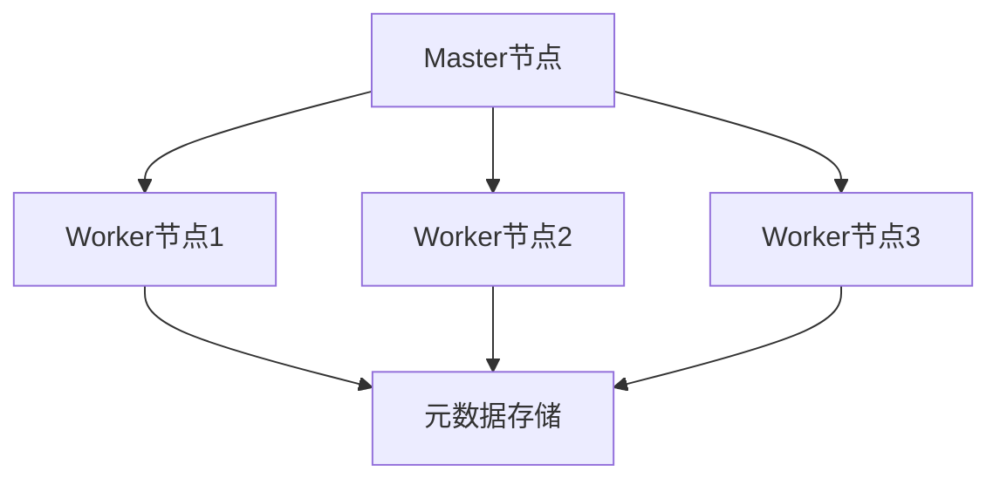

                 

# 《Kylin原理与代码实例讲解》

> 关键词：Kylin、数据建模、查询优化、数学模型、代码实例

> 摘要：本文旨在深入讲解Kylin的原理及其代码实例，包括基本原理、核心概念与架构、数据建模与设计、查询优化、数学模型与公式，以及环境搭建与配置、核心代码实现、项目实战、性能调优和最佳实践等。通过本文的详细解读，读者可以全面了解Kylin的工作机制，掌握其在数据建模和查询优化方面的应用技巧，为实际项目开发提供有力支持。

## 第一部分：Kylin基本原理

### 第1章：Kylin概述

#### 1.1.1 Kylin背景

Kylin是一款开源的大数据查询引擎，旨在解决海量数据实时查询的问题。随着大数据技术的发展，数据量呈爆炸性增长，传统的数据库系统在面对大规模数据查询时，往往表现不佳。Kylin通过构建预先计算好的索引，实现了对海量数据的快速查询。其设计初衷是为大数据场景下的实时分析提供高性能的查询服务。

#### 1.1.2 Kylin主要功能与特点

- **多维数据建模**：Kylin支持多维数据建模，可以方便地组织和管理数据，实现多维数据分析。

- **实时查询**：Kylin通过预先计算好索引，实现了对海量数据的实时查询，查询延迟可以低至毫秒级。

- **高性能**：Kylin采用MPP（Massively Parallel Processing）架构，支持分布式计算，可以高效地处理大规模数据。

- **易用性**：Kylin提供了简洁的接口和丰富的文档，便于开发者快速上手和使用。

### 第2章：Kylin核心概念与架构

#### 2.1.1 数据建模

数据建模是Kylin的核心概念之一。通过数据建模，可以将原始数据转换为适用于Kylin查询的结构化数据。数据建模包括以下步骤：

1. **事实表设计**：事实表包含业务数据，如销售额、订单数等。

2. **维度表设计**：维度表包含业务数据的相关维度，如时间、地点、产品等。

3. **预聚合设计**：预聚合设计是根据查询需求，对事实表和维度表进行预计算，以加速查询。

#### 2.1.2 架构原理

Kylin采用MPP（Massively Parallel Processing）架构，支持分布式计算。其核心架构包括以下组件：

1. **Master节点**：Master节点负责协调各个计算节点的工作，包括任务分配、状态监控等。

2. **Worker节点**：Worker节点负责执行具体的计算任务，如数据建模、查询执行等。

3. **元数据存储**：元数据存储用于存储Kylin的元数据信息，如表结构、索引信息等。

4. **数据存储**：数据存储用于存储Kylin的数据，可以是HDFS、HBase等。

#### 2.1.3 Mermaid流程图：Kylin核心架构



### 第3章：Kylin数据建模与设计

#### 3.1.1 数据建模步骤

1. **需求分析**：明确业务需求，确定需要查询的数据表和维度。

2. **事实表设计**：设计事实表，确定数据字段和数据类型。

3. **维度表设计**：设计维度表，确定维度字段和数据类型。

4. **预聚合设计**：根据查询需求，设计预聚合表，确定预聚合字段和聚合函数。

5. **模型验证**：验证数据建模的正确性，确保数据模型满足业务需求。

#### 3.1.2 数据建模最佳实践

- **简单性原则**：数据模型应尽量简单，避免复杂的关联关系和冗余数据。

- **灵活性原则**：数据模型应具有灵活性，能够适应业务变化。

- **可扩展性原则**：数据模型应具备良好的可扩展性，便于后续维护和优化。

### 第4章：Kylin查询优化

#### 4.1.1 查询优化原理

Kylin的查询优化主要包括以下几个方面：

1. **预聚合**：通过预聚合，将部分查询转化为对预聚合数据的查询，减少计算量。

2. **缓存**：利用缓存技术，减少重复查询的执行次数。

3. **索引**：通过索引技术，加速查询的执行速度。

#### 4.1.2 伪代码：查询优化算法

```python
def optimize_query(query):
    # 预聚合
    preagg_query = preaggregate(query)

    # 缓存查询
    cached_result = check_cache(query)

    if cached_result:
        return cached_result

    # 索引查询
    index_query = index_search(preagg_query)

    return index_query
```

### 第5章：Kylin数学模型与公式

#### 5.1.1 数学模型详解

Kylin的数学模型主要包括以下几个方面：

1. **聚合函数**：如SUM、COUNT、AVG等。

2. **度量值**：度量值是用于计算的数据值，如销售额、订单数等。

3. **维度**：维度是用于分类和筛选的数据，如时间、地点、产品等。

#### 5.1.2 数学公式与解释

$$
SUM(\text{销售额}) = \sum_{\text{订单}} \text{销售额}
$$

$$
AVG(\text{订单数}) = \frac{\sum_{\text{订单}} \text{订单数}}{\text{订单总数}}
$$

#### 5.1.3 举例说明：数学模型应用案例

假设有如下数据表：

| 订单ID | 销售额 | 订单数 |
|--------|--------|--------|
| 1      | 100    | 1      |
| 2      | 200    | 2      |
| 3      | 300    | 3      |

根据上述数据，可以计算出：

$$
SUM(\text{销售额}) = 100 + 200 + 300 = 600
$$

$$
AVG(\text{订单数}) = \frac{1 + 2 + 3}{3} = 2
$$

## 第二部分：Kylin代码实例讲解

### 第6章：Kylin环境搭建与配置

#### 6.1.1 开发环境搭建

1. **安装Java**：Kylin需要Java运行环境，建议安装Java 8及以上版本。

2. **安装Hadoop**：Kylin依赖于Hadoop生态，需要安装Hadoop环境。

3. **安装HBase**：Kylin的元数据存储在HBase中，需要安装HBase。

4. **下载Kylin**：从Kylin的官方网站下载最新的Kylin版本。

5. **解压并启动**：解压下载的Kylin压缩包，并启动Kylin。

#### 6.1.2 配置详解

1. **配置文件**：Kylin的配置文件位于`conf`目录下，包括`kylin-site.xml`、`hadoop-env.sh`等。

2. **元数据存储**：配置HBase连接信息，如Zookeeper地址、HBase表名等。

3. **数据存储**：配置HDFS连接信息，如HDFS命名空间等。

### 第7章：Kylin核心代码实现

#### 7.1.1 源代码详细解读

1. **数据建模**：Kylin的数据建模主要通过`kylin-controller`模块实现。

2. **查询执行**：Kylin的查询执行主要通过`kylin-query`模块实现。

3. **缓存管理**：Kylin的缓存管理主要通过`kylin-cube`模块实现。

#### 7.1.2 代码实现与分析

1. **数据建模**：数据建模主要通过`MetadataManager`和`ProjectManager`实现。

   ```java
   public class MetadataManager {
       public void createProject(String projectName, String projectDesc) {
           // 创建项目
       }
       
       public void createTable(String tableName, List<Column> columns) {
           // 创建表
       }
   }
   ```

2. **查询执行**：查询执行主要通过`QueryAction`和`QueryExecutor`实现。

   ```java
   public class QueryAction {
       public ResultSet executeQuery(Query query) {
           // 执行查询
       }
   }
   
   public class QueryExecutor {
       public ResultSet execute(Query query) {
           // 执行查询
       }
   }
   ```

3. **缓存管理**：缓存管理主要通过`CacheManager`实现。

   ```java
   public class CacheManager {
       public void put(String key, Object value) {
           // 存入缓存
       }
       
       public Object get(String key) {
           // 获取缓存
       }
   }
   ```

### 第8章：Kylin项目实战

#### 8.1.1 实战案例

1. **搭建Kylin环境**：按照第6章的步骤搭建Kylin环境。

2. **数据建模**：设计事实表和维度表，并进行预聚合设计。

3. **查询优化**：针对查询需求，进行查询优化。

4. **性能调优**：对Kylin进行性能调优，优化查询性能。

#### 8.1.2 实战解析

1. **数据建模**：以电商订单数据为例，设计事实表和维度表。

   ```sql
   CREATE TABLE fact_orders (
       order_id STRING,
       user_id STRING,
       product_id STRING,
       sale_amount BIGINT,
       order_date STRING,
       PRIMARY KEY (order_id)
   );

   CREATE TABLE dim_users (
       user_id STRING,
       user_name STRING,
       PRIMARY KEY (user_id)
   );

   CREATE TABLE dim_products (
       product_id STRING,
       product_name STRING,
       category_id STRING,
       PRIMARY KEY (product_id)
   );
   ```

2. **查询优化**：针对常见的订单查询，进行查询优化。

   ```sql
   SELECT
       SUM(sale_amount) AS total_sales,
       COUNT(*) AS total_orders
   FROM
       fact_orders
   WHERE
       order_date = '2022-01-01'
   GROUP BY
       user_id;
   ```

3. **性能调优**：通过调整Kylin的配置，优化查询性能。

   ```xml
   <property>
       <name>kylin.query.cache-enabled</name>
       <value>true</value>
   </property>
   ```

### 第9章：Kylin性能调优

#### 9.1.1 性能调优方法

1. **预聚合**：合理设计预聚合，减少查询时的计算量。

2. **缓存**：利用缓存技术，减少重复查询的执行次数。

3. **索引**：合理设计索引，加速查询的执行速度。

4. **配置优化**：调整Kylin的配置，优化系统性能。

#### 9.1.2 调优实战

1. **预聚合调优**：对常见的查询进行预聚合，减少查询时的计算量。

   ```sql
   CREATE CUBE fact_orders_cube
   AS SELECT
       user_id,
       SUM(sale_amount) AS total_sales
   FROM
       fact_orders
   GROUP BY
       user_id
   ```

2. **缓存调优**：启用Kylin的缓存功能，减少重复查询的执行次数。

   ```xml
   <property>
       <name>kylin.query.cache-enabled</name>
       <value>true</value>
   </property>
   ```

3. **索引调优**：为常用的查询字段创建索引，加速查询的执行速度。

   ```sql
   CREATE INDEX ON fact_orders (user_id);
   ```

### 第10章：Kylin最佳实践

#### 10.1.1 设计最佳实践

1. **数据建模**：遵循简单性、灵活性和可扩展性原则，设计数据模型。

2. **查询优化**：针对查询需求，进行查询优化。

3. **性能调优**：定期进行性能调优，优化系统性能。

#### 10.1.2 优化最佳实践

1. **预聚合**：对常用的查询进行预聚合，减少计算量。

2. **缓存**：启用缓存功能，减少查询延迟。

3. **索引**：为常用的查询字段创建索引，提高查询性能。

## 附录

### 附录A：Kylin资源与工具

#### A.1.1 Kylin官方文档

Kylin的官方文档提供了详细的安装、配置和使用指南，是学习Kylin的重要资源。

#### A.1.2 常用工具介绍

- **Eclipse**：Kylin的IDE，用于开发Kylin应用程序。

- **IntelliJ IDEA**：Kylin的开发环境，适用于Java编程。

#### A.1.3 开源项目推荐

- **Apache Kylin**：Kylin的官方GitHub仓库，包含源代码、文档和社区贡献。

- **KylinSQL**：Kylin的SQL接口，支持多种SQL查询。

### 致谢

感谢您阅读本文，希望本文对您了解Kylin原理及其应用有所帮助。如需进一步了解Kylin，请参阅相关资源和开源项目。

---

**作者：AI天才研究院/AI Genius Institute & 禅与计算机程序设计艺术 /Zen And The Art of Computer Programming**

