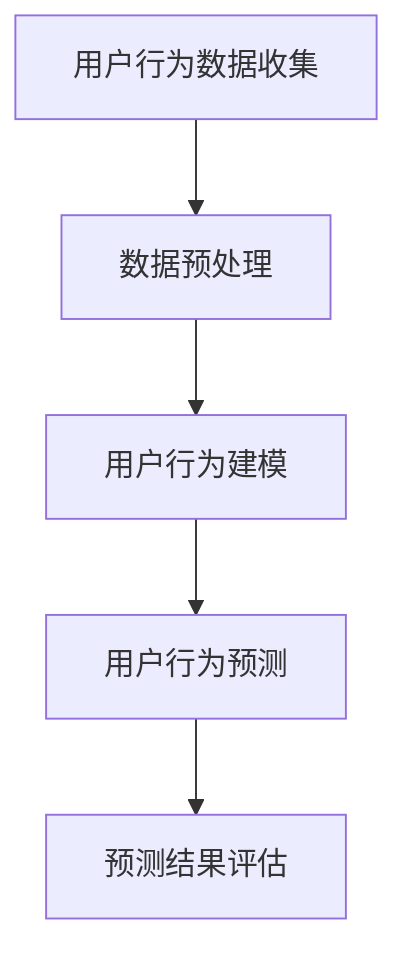

                 

# 文章标题：LLM在社交媒体分析中的应用：洞察用户行为

## 关键词
- LLM
- 社交媒体分析
- 用户行为预测
- 情感分析
- 实战案例

## 摘要
本文深入探讨了长短期记忆网络（LLM）在社交媒体分析中的应用。通过对其概念、优势和应用场景的详细阐述，本文揭示了LLM在社交媒体数据分析中的关键作用，包括用户行为分析、舆情监测和社交媒体互动分析。此外，文章通过案例实战展示了LLM在实际项目中的应用效果，并提出了社交媒体分析的未来发展趋势和策略。

## 引言
在数字化时代，社交媒体已成为人们生活中不可或缺的一部分。从微博、推特到Facebook和Instagram，用户在社交媒体上发布的内容不仅反映了个人的兴趣和观点，也为企业提供了宝贵的数据资源。因此，如何有效地分析这些海量的社交媒体数据，以获取用户洞察、监测舆情趋势和优化营销策略，成为了当前数据科学和人工智能领域的一个重要课题。

长短期记忆网络（Long-Short Term Memory，简称LLM）作为一种强大的递归神经网络，因其能够捕获长距离依赖和强大的序列建模能力，在处理文本数据方面表现出色。本文将详细探讨LLM在社交媒体分析中的应用，旨在为数据科学家和人工智能研究者提供有价值的参考和启示。

### 第一部分：LLM在社交媒体分析中的应用基础

#### 第1章：LLM与社交媒体分析概述

##### 1.1 LLM的概念与优势

LLM是一种特殊的递归神经网络，由Hochreiter和Schmidhuber于1997年首次提出。与传统的递归神经网络（RNN）相比，LLM具有更有效的长期依赖记忆能力，能够更好地处理长序列数据。

**优势：**
- **序列建模能力：** LLM能够对序列数据进行建模，适用于处理包含时间信息的文本数据，如用户发布的内容、评论和点赞记录等。
- **记忆机制：** LLM通过门控机制（gate mechanism）来控制信息的流入和流出，具有更强的长期依赖记忆能力，能够更好地捕捉上下文信息。
- **并行计算：** LLM的训练可以通过大规模并行计算来加速，提高训练效率。

##### 1.2 社交媒体分析概述

社交媒体分析是指利用技术手段对社交媒体上的数据进行分析，以了解用户行为、舆情趋势等。其核心目的是从海量的社交媒体数据中提取有价值的信息，为产品迭代、营销策略制定和品牌建设提供支持。

**重要性：**
- **用户洞察：** 社交媒体分析可以帮助企业深入了解用户需求、行为和偏好，从而优化产品功能和用户体验。
- **营销策略：** 通过分析社交媒体上的用户互动和反馈，企业可以制定更精准的营销策略，提升品牌影响力和用户忠诚度。

##### 1.3 LLM在社交媒体分析中的应用

LLM在社交媒体分析中的应用场景广泛，包括用户行为分析、舆情监测和智能客服等。

**应用场景：**
- **用户行为分析：** 利用LLM分析用户发布的内容、点赞、评论等行为，预测用户偏好和兴趣。
- **舆情监测：** 利用LLM对社交媒体上的评论、话题进行分类和情感分析，了解公众观点和舆情趋势。
- **智能客服：** 利用LLM构建智能客服系统，实现自动回复和问题解决。

##### 1.4 社交媒体分析挑战与机遇

**挑战：**
- **数据质量：** 社交媒体数据质量参差不齐，需要预处理和清洗。
- **实时性：** 社交媒体数据更新速度快，需要实时分析处理。
- **隐私保护：** 需要确保用户隐私和数据安全。

**机遇：**
- **技术创新：** 随着LLM技术的发展，社交媒体分析能力不断提高。
- **商业应用：** 社交媒体分析为企业提供更多商业机会。

### 第二部分：LLM在社交媒体分析中的核心技术

#### 第2章：LLM基础技术

##### 2.1 LLM架构

LLM的基本架构包括输入层、隐藏层和输出层。输入层接收序列数据，隐藏层通过递归方式处理序列数据，输出层生成最终的预测结果。

**常见架构：**
- **GRU（门控循环单元）：** 改进了RNN，能够更好地处理长距离依赖。
- **LSTM（长短期记忆）：** 也是一种能够处理长距离依赖的RNN。
- **Transformer：** 引入了自注意力机制，在处理长文本方面表现出色。

##### 2.2 LLM训练与优化

**训练过程：**
- **数据预处理：** 清洗和标准化输入数据。
- **训练目标：** 输出层的预测标签。
- **损失函数：** 采用交叉熵损失函数。

**优化策略：**
- **批量大小：** 控制每次更新的样本数量。
- **学习率调度：** 使用学习率衰减策略。
- **正则化：** 采用L2正则化、Dropout等方法防止过拟合。

##### 2.3 LLM在文本处理中的应用

**文本分类：** 利用LLM对文本进行分类，如情感分析、主题分类等。

**文本生成：** 利用LLM生成文章、摘要、回复等。

**命名实体识别：** 利用LLM识别文本中的命名实体，如人名、地名等。

### 第三部分：社交媒体分析应用实战

#### 第3章：用户行为分析

##### 3.1 用户行为数据收集

**数据来源：** 社交媒体平台，如微博、推特、Facebook等。

**数据类型：** 文本、图片、视频、音频等。

##### 3.2 用户行为建模

**模型选择：** 采用LSTM或GRU等循环神经网络。

**特征提取：**
- **文本特征：** 采用词向量表示，如Word2Vec、GloVe等。
- **图像特征：** 采用卷积神经网络提取图像特征。

##### 3.3 用户行为预测

**预测目标：** 用户行为类型，如点赞、评论、分享等。

**评估指标：**
- **准确率：** 预测正确的样本占总样本的比例。
- **精确率与召回率：** 分别表示预测为正样本的准确性和所有正样本中预测为正样本的比例。

#### 第4章：舆情监测

##### 4.1 舆情数据收集

**数据来源：** 社交媒体平台，如微博、推特、Facebook等。

**数据类型：** 文本、图片、视频、音频等。

##### 4.2 舆情分类

**模型选择：** 采用Transformer等大型预训练模型。

**特征提取：**
- **文本特征：** 采用BERT、GPT等预训练模型提取。
- **图像特征：** 采用卷积神经网络提取。

##### 4.3 舆情趋势分析

**分析目标：** 舆情变化趋势、热点话题等。

**评估指标：**
- **趋势准确率：** 预测正确的趋势占总趋势的比例。
- **话题识别率：** 预测正确的话题占总话题的比例。

#### 第5章：社交媒体互动分析

##### 5.1 互动数据收集

**数据来源：** 社交媒体平台，如微博、推特、Facebook等。

**数据类型：** 文本、图片、视频、音频等。

##### 5.2 互动建模

**模型选择：** 采用LSTM或GRU等循环神经网络。

**特征提取：**
- **文本特征：** 采用词向量表示，如Word2Vec、GloVe等。
- **图像特征：** 采用卷积神经网络提取。

##### 5.3 互动分析

**分析目标：** 用户之间的互动关系、互动内容等。

**评估指标：**
- **互动准确率：** 预测正确的互动占总互动的比例。
- **互动质量：** 通过用户互动内容的情感分析、话题分析等评估。

### 第四部分：案例实战

#### 第6章：社交媒体分析项目实战

##### 6.1 项目背景

**项目简介：** 本项目旨在利用LLM技术对社交媒体平台上的用户行为进行分析，以预测用户对特定话题的偏好。

**项目需求：** 
1. 收集用户在社交媒体上的发布内容、评论和点赞数据。
2. 使用LLM技术对用户行为进行建模和预测。
3. 根据预测结果优化产品功能和营销策略。

##### 6.2 技术选型

**算法选型：** 
- 采用LSTM模型进行用户行为预测。
- 使用BERT模型提取文本特征。

**环境搭建：** 
- Python编程语言。
- TensorFlow和Keras库。

##### 6.3 数据处理

**数据收集：** 
- 从微博、推特等社交媒体平台收集用户数据。

**数据预处理：** 
- 清洗数据，去除噪音和无关信息。
- 标准化文本数据，如统一文本格式和分词。

##### 6.4 模型训练

**模型训练：** 
- 使用收集到的用户数据对LSTM模型进行训练。
- 调整模型参数，优化模型性能。

**模型评估：** 
- 使用交叉验证方法评估模型性能。
- 评估指标包括准确率、精确率、召回率等。

##### 6.5 应用实现

**应用部署：** 
- 将训练好的模型部署到生产环境中。
- 通过API接口提供用户行为预测服务。

**效果评估：** 
- 通过实际应用评估模型的预测效果。
- 根据评估结果优化模型和产品功能。

### 第五部分：社交媒体分析的未来发展

#### 第7章：社交媒体分析的未来发展趋势

##### 7.1 技术趋势

随着人工智能和大数据技术的发展，社交媒体分析的未来将更加智能化和自动化。

**人工智能：** 
- 深度学习和强化学习等人工智能技术将在社交媒体分析中发挥更大作用。
- 自适应算法和智能推荐系统将进一步提升用户体验。

**大数据：** 
- 社交媒体数据量将持续增长，大数据技术将帮助更好地挖掘和分析这些数据。

##### 7.2 应用前景

**商业应用：** 
- 社交媒体分析将为企业提供更精准的市场洞察和用户画像。
- 企业可以通过社交媒体分析优化产品和服务，提高客户满意度。

**社会影响：** 
- 社交媒体分析有助于政府和社会组织监测舆情，预防和应对突发事件。
- 社交媒体分析将推动媒体行业的变革，提升新闻传播的效率和质量。

##### 7.3 发展策略

**技术创新：** 
- 加大对人工智能和大数据技术的研究投入，推动社交媒体分析技术的创新。
- 开发跨学科的融合技术，如将计算机视觉和自然语言处理相结合。

**产业合作：** 
- 促进不同行业之间的合作，共同推动社交媒体分析技术的发展。
- 建立社交媒体分析产业链，实现资源共享和互利共赢。

### 附录

#### 附录A：LLM常用工具与资源

**开源框架：** 
- TensorFlow
- PyTorch
- Keras

**数据集：** 
- Twitter Sentiment
- Yelp Reviews
- Common Crawl

**技术论文：** 
- "A Theoretically Grounded Application of Dropout in Recurrent Neural Networks"
- "Improving Language Understanding by Generative Pre-Training"
- "Bert: Pre-training of Deep Bidirectional Transformers for Language Understanding"

#### 附录B：示例Mermaid流程图

**用户行为分析流程：**


#### 附录C：示例伪代码

**用户行为预测模型：**
```python
# 初始化模型
model = Sequential()
model.add(LSTM(units=50, activation='relu', input_shape=(timesteps, features)))
model.add(Dense(units=1, activation='sigmoid'))

# 编译模型
model.compile(optimizer='adam', loss='binary_crossentropy', metrics=['accuracy'])

# 训练模型
model.fit(X_train, y_train, epochs=10, batch_size=64)

# 评估模型
predictions = model.predict(X_test)
print("Accuracy:", accuracy_score(y_test, predictions))
```

#### 附录D：示例数学模型和公式

**情感分析模型：**
$$
\text{Sentiment} = f(\text{Text}, \text{Model Parameters}) \\
P(\text{Positive}|\text{Text}, \text{Model}) = \frac{e^{\theta^T \cdot \text{Embedding}(\text{Text})}}{1 + e^{\theta^T \cdot \text{Embedding}(\text{Text})}}
$$

**公式解释：**
- $\text{Sentiment}$：情感分析结果。
- $\text{Text}$：输入文本。
- $\text{Model Parameters}$：模型参数。
- $\theta$：模型参数。
- $\text{Embedding}(\text{Text})$：文本的词向量表示。

#### 附录E：代码解读与分析

**用户行为预测代码：**
```python
# 导入所需库
import numpy as np
from keras.models import Sequential
from keras.layers import LSTM, Dense

# 初始化模型
model = Sequential()
model.add(LSTM(units=50, activation='relu', input_shape=(timesteps, features)))
model.add(Dense(units=1, activation='sigmoid'))

# 编译模型
model.compile(optimizer='adam', loss='binary_crossentropy', metrics=['accuracy'])

# 训练模型
model.fit(X_train, y_train, epochs=10, batch_size=64)

# 评估模型
predictions = model.predict(X_test)
print("Accuracy:", accuracy_score(y_test, predictions))
```

**代码解读：**
- **模型初始化：**
  - `LSTM(units=50, activation='relu', input_shape=(timesteps, features))`：添加一个具有50个单元的LSTM层，使用ReLU激活函数，输入形状为（时间步数，特征数）。
  - `Dense(units=1, activation='sigmoid')`：添加一个输出层，具有一个单元，使用Sigmoid激活函数，用于二分类。

- **模型编译：**
  - `compile(optimizer='adam', loss='binary_crossentropy', metrics=['accuracy'])`：使用Adam优化器，二分类交叉熵损失函数，并计算准确率。

- **模型训练：**
  - `fit(X_train, y_train, epochs=10, batch_size=64)`：训练模型10个周期，每个批量包含64个样本。

- **模型评估：**
  - `predictions = model.predict(X_test)`：使用测试数据预测。
  - `print("Accuracy:", accuracy_score(y_test, predictions))`：打印模型的准确率。

### 作者信息

**作者：** AI天才研究院/AI Genius Institute & 禅与计算机程序设计艺术 /Zen And The Art of Computer Programming**

