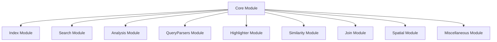

                 

# 文章标题：Lucene原理与代码实例讲解

## 关键词
- Lucene
- 搜索引擎
- 索引
- 分析器
- 分布式搜索
- 性能优化

## 摘要
本文深入探讨了Lucene的原理、架构、核心概念以及实际应用。通过详细的代码实例分析，读者将了解如何构建和优化索引，执行高效的搜索操作。文章涵盖了分词与分析器、分布式搜索以及Lucene与Elasticsearch的对比，并提供了性能调优的最佳实践。

## 目录

### 第一部分：Lucene基础

#### 第1章：Lucene概述

##### 第1.1节：Lucene的历史背景

- **Lucene的起源**：Lucene是由Apache Software Foundation赞助的一个开源搜索引擎库，最初由Doug Cutting于2001年创建。
- **Lucene的发展**：随着时间的推移，Lucene逐渐成为搜索引擎领域的重要工具，广泛应用于各种规模的应用程序。

##### 第1.2节：Lucene的核心概念

- **索引**：索引是Lucene的核心概念，它是一个预先构建的搜索结构，用于提高搜索效率。
- **搜索**：搜索是Lucene提供的核心功能，它允许用户对索引中的文档进行查询。
- **分析器**：分析器是Lucene中的一个重要组件，用于将文本转换为索引格式。

##### 第1.3节：Lucene的架构

- **核心组件**：索引器、搜索器、索引存储、分析器等。
- **工作流程**：文档读取、分析、索引、写入磁盘。

##### 第1.4节：Lucene与搜索引擎的关系

- **Lucene作为搜索引擎库**：Lucene作为一个底层的搜索引擎库，提供了一系列强大的搜索功能，但本身不提供用户界面。
- **Lucene与其他搜索引擎**：如Elasticsearch、Solr等，它们基于Lucene，但在功能、性能、扩展性等方面进行了改进。

#### 第2章：Lucene索引原理

##### 第2.1节：索引的结构

- **索引文件格式**：Lucene使用一种紧凑的二进制文件格式来存储索引。
- **索引存储机制**：索引存储在磁盘上，但Lucene提供了一些机制来优化磁盘I/O。

##### 第2.2节：索引的创建

- **索引文档**：将文档的内容进行分析、索引，并将其存储在索引中。
- **索引构建流程**：文档读取、分析、索引、写入磁盘。

##### 第2.3节：索引优化与更新

- **索引合并策略**：将多个段合并为一个更大的段，以提高搜索效率。
- **索引缓存机制**：通过将索引文件的一部分加载到内存中，减少磁盘I/O操作。

#### 第3章：Lucene搜索原理

##### 第3.1节：搜索过程概述

- **搜索请求处理**：接收用户查询，根据索引进行搜索，并返回搜索结果。
- **搜索结果排序**：按照一定的排序规则进行排序。

##### 第3.2节：查询语言

- **普通查询**：基于关键词的简单查询。
- **高级查询**：支持更复杂的查询操作。

##### 第3.3节：搜索优化技巧

- **索引优化**：如合并策略、缓存机制、索引结构优化等。
- **搜索优化**：如查询优化、结果排序优化等。

### 第二部分：Lucene高级特性

#### 第4章：分词与分析器

##### 第4.1节：分词技术

- **分词原理**：将文本分割成词语的过程。
- **常见分词器**：如StandardAnalyzer、KeywordAnalyzer、SimpleAnalyzer等。

##### 第4.2节：分析器

- **分析器的工作流程**：分词、过滤、提取词干等。
- **定制分析器**：用户可以根据需求定制分析器。

#### 第5章：分布式搜索

##### 第5.1节：分布式搜索架构

- **节点分布**：由多个节点组成，每个节点负责一部分索引和搜索操作。
- **负载均衡**：用于平衡各个节点的负载，确保搜索请求能够高效地分发到各个节点。

##### 第5.2节：分布式索引与搜索

- **索引分布式构建**：将文档分片到多个节点进行索引构建。
- **分布式搜索策略**：查询分发、结果合并等。

#### 第6章：Lucene在电商搜索中的应用

##### 第6.1节：电商搜索的特点

- **数据量大**：电商搜索通常涉及大量的商品信息，数据量庞大。
- **搜索要求高实时性**：电商搜索需要实时响应用户的搜索请求，保证搜索结果的实时性。

##### 第6.2节：Lucene在电商搜索中的应用

- **索引构建与优化**：根据电商搜索的特点，对Lucene索引进行优化，提高搜索性能。
- **搜索算法与优化**：设计高效的搜索算法，如基于关键词的搜索、基于排序的搜索等。

#### 第7章：Lucene性能调优

##### 第7.1节：Lucene性能瓶颈分析

- **磁盘I/O瓶颈**：索引构建和搜索操作通常涉及大量的磁盘I/O操作，可能导致性能瓶颈。
- **内存管理**：内存管理不当可能导致内存泄漏、性能下降等问题。

##### 第7.2节：性能调优策略

- **索引优化**：优化索引结构，如使用合理的分片策略、索引合并策略等。
- **搜索优化**：优化搜索算法，如使用缓存、优化查询语句等。

#### 第8章：Lucene与Elasticsearch对比分析

##### 第8.1节：Elasticsearch概述

- **Elasticsearch的特点**：分布式、RESTful搜索和分析引擎。
- **Elasticsearch与Lucene的关系**：基于Lucene构建，但进行了功能、性能、扩展性等方面的改进。

##### 第8.2节：对比分析

- **功能对比**：对比Lucene和Elasticsearch在索引、搜索、分析器等方面的功能差异。
- **性能对比**：对比Lucene和Elasticsearch在搜索速度、扩展性等方面的性能。
- **适用场景对比**：分析Lucene和Elasticsearch在不同场景下的适用性。

#### 第9章：Lucene源码分析

##### 第9.1节：Lucene源码结构

- **核心模块**：分析Lucene的核心模块，如索引模块、搜索模块、分析器模块等。
- **主要类和方法**：分析Lucene的主要类和方法，如IndexWriter、Searcher、Analyzer等。

##### 第9.2节：源码分析示例

- **索引创建过程**：分析索引创建过程的源码实现。
- **搜索过程**：分析搜索过程的源码实现。

#### 第10章：Lucene最佳实践

##### 第10.1节：Lucene项目实战

- **项目需求分析**：分析一个具体的Lucene项目需求。
- **系统架构设计**：设计一个基于Lucene的系统架构。

##### 第10.2节：最佳实践

- **索引构建与优化**：提供索引构建和优化的最佳实践。
- **搜索优化**：提供搜索优化的最佳实践。
- **高可用与分布式部署**：提供Lucene的高可用和分布式部署最佳实践。

## 附录

##### 附录A：Lucene开发工具与资源

- **A.1 开发工具**：推荐Lucene开发中常用的工具。
- **A.2 学习资源**：推荐Lucene的学习资源，包括官方文档、社区资源、学习路径等。

---

### 第1章：Lucene概述

#### 第1.1节：Lucene的历史背景

Lucene是由Apache Software Foundation赞助的一个开源搜索引擎库，最初由Doug Cutting于2001年创建。Lucene的目标是为开发人员提供一套可扩展、灵活的搜索功能，以支持各种规模的应用程序。随着时间的推移，Lucene逐渐成为搜索引擎领域的重要工具，广泛应用于网站搜索、文档管理、企业内容管理系统、大数据搜索、实时搜索等场景。

Lucene的发展历程可以追溯到其前身——Java中的TextSearch。Java TextSearch是一个简单的文本搜索库，但它缺乏许多高级功能，如索引、分词、搜索优化等。为了解决这一问题，Doug Cutting决定创建一个更强大、更灵活的搜索库，这就是Lucene的起源。

Lucene的第一个版本（1.0）于2001年发布，随后不断更新和优化。2004年，Lucene成为Apache软件基金会的一个孵化项目，并于2006年成为Apache的一个顶级项目。这一过程标志着Lucene得到了更广泛的认可和支持，使其成为开源搜索引擎领域的重要力量。

#### 第1.2节：Lucene的核心概念

Lucene的核心概念主要包括索引（Indexing）、搜索（Searching）和分析器（Analyzer）。这些概念是理解Lucene工作机制的基础。

- **索引（Indexing）**：索引是Lucene的核心概念，它是一个预先构建的搜索结构，用于提高搜索效率。Lucene通过将文档的内容进行分析、索引，并将索引存储在磁盘上，从而实现快速搜索。索引文件包含了文档的内容、元数据和索引词，使得搜索操作可以在毫秒级别内完成。
  
- **搜索（Searching）**：搜索是Lucene提供的核心功能，它允许用户对索引中的文档进行查询。Lucene提供了丰富的查询语言，支持普通查询和高级查询。普通查询通常是基于关键词的简单查询，而高级查询则支持更复杂的查询操作，如布尔查询、短语查询、范围查询等。

- **分析器（Analyzer）**：分析器是Lucene中的一个重要组件，用于将文本转换为索引格式。分析器通常包括分词器（Tokenizer）、停用词过滤器（StopFilter）和词干提取器（StemFilter）等。分词器将文本分割成词语，停用词过滤器去除无意义的停用词，词干提取器则将词语转换为词干形式。通过这些处理步骤，分析器将原始文本转换成适合索引的结构。

#### 第1.3节：Lucene的架构

Lucene的架构可以分为以下几个核心组件：

- **索引器（IndexWriter）**：索引器是负责创建和更新索引的核心组件。它将文档的内容进行分析、索引，并将其存储在磁盘上的索引文件中。索引器还提供了索引优化和更新功能，如合并策略、缓存机制等。

- **搜索器（Searcher）**：搜索器是负责执行搜索操作的核心组件。它根据用户查询，在索引文件中查找相关文档，并返回搜索结果。搜索器还提供了搜索优化功能，如查询缓存、排序策略等。

- **索引存储（Index）**：索引存储是负责存储索引文件的核心组件。Lucene使用一种紧凑的二进制文件格式来存储索引，这种格式不仅占用了较少的磁盘空间，而且读取和写入速度非常快。

- **分析器（Analyzer）**：分析器是负责将文本转换为索引格式的重要组件。分析器通常包括分词器、停用词过滤器和词干提取器等。分析器的选择和配置对搜索效果有重要影响。

#### 第1.4节：Lucene与搜索引擎的关系

Lucene作为一个底层的搜索引擎库，提供了一系列强大的搜索功能，但它本身不提供用户界面。因此，Lucene通常与其他应用程序集成，以提供完整的搜索解决方案。

- **Lucene作为搜索引擎库**：Lucene作为一个底层的搜索引擎库，提供了一系列强大的搜索功能，如索引、搜索、分词、查询语言等。开发人员可以使用Lucene来构建自定义的搜索引擎应用程序。

- **Lucene与其他搜索引擎**：除了Lucene本身，还有一些基于Lucene构建的搜索引擎，如Elasticsearch、Solr等。这些搜索引擎在Lucene的基础上进行了功能、性能、扩展性等方面的改进，提供了更高级的功能，如分布式搜索、实时分析、大数据处理等。

### 第2章：Lucene索引原理

#### 第2.1节：索引的结构

Lucene的索引结构是理解其工作机制的关键。一个Lucene索引由多个段（Segment）组成，每个段包含了多个文档（Document）。段是Lucene索引的基本单元，Lucene通过段来实现索引的灵活性和扩展性。

- **段（Segment）**：段是Lucene索引的基本存储单元。一个段包含了一组有序的文档，这些文档可以是原始的文档内容、元数据以及索引词等信息。段是独立存储的，可以通过合并操作将多个段合并为一个更大的段。

- **文档（Document）**：文档是Lucene中的数据单元。一个文档可以包含多个字段（Field），每个字段表示文档中的一个属性，如标题、内容、作者等。字段可以存储不同类型的值，如文本、数字、日期等。

- **字段类型（FieldType）**：字段类型定义了字段的数据类型和存储方式。Lucene提供了多种字段类型，如文本类型（Text）、数字类型（Numeric）、日期类型（Date）等。字段类型决定了如何索引和存储字段值。

- **索引文件格式**：Lucene使用一种紧凑的二进制文件格式来存储索引。索引文件包含了多个段，每个段都有相应的索引文件。这种文件格式不仅占用了较少的磁盘空间，而且读取和写入速度非常快。

- **索引存储机制**：Lucene的索引存储机制涉及磁盘I/O、内存管理和缓存策略等方面。为了优化性能，Lucene提供了一系列机制，如索引合并策略、缓存机制、写入缓冲区等。

#### 第2.2节：索引的创建

索引的创建是Lucene应用中至关重要的环节。通过索引创建，可以将文档的内容转换为适合搜索的结构。以下是索引创建的基本流程：

1. **文档读取**：从源数据中读取文档。文档可以是文本文件、数据库记录、Web页面等。

2. **分析**：对文档进行分词、过滤等处理，将其转换为适合索引的结构。分析过程由分析器（Analyzer）负责。分析器通常包括分词器（Tokenizer）、停用词过滤器（StopFilter）和词干提取器（StemFilter）等。

3. **索引**：将分析后的文档内容索引到内存中的索引结构中。索引过程由索引器（IndexWriter）负责。索引器将文档的内容、元数据和索引词等信息存储在内存中的索引结构中。

4. **写入磁盘**：将内存中的索引结构写入磁盘上的索引文件中。Lucene使用一种紧凑的二进制文件格式来存储索引，这种格式不仅占用了较少的磁盘空间，而且读取和写入速度非常快。

5. **优化和更新**：索引创建完成后，Lucene会进行一系列优化和更新操作，如合并段、刷新缓存、压缩文件等。这些操作可以提高搜索性能和减少磁盘空间占用。

以下是一个简单的伪代码示例，展示了如何使用Lucene创建索引：

```python
import org.apache.lucene.index.IndexWriter
import org.apache.lucene.document.Document
import org.apache.lucene.document.TextField

// 创建索引器
IndexWriter indexWriter = IndexWriter.newInstance(directory, analyzer)

// 创建文档
Document doc = new Document()
doc.add(new TextField("title", "Lucene索引原理", Field.Store.YES))
doc.add(new TextField("content", "Lucene索引原理与代码实例讲解", Field.Store.YES))

// 将文档添加到索引
indexWriter.addDocument(doc)

// 关闭索引器
indexWriter.close()
```

#### 第2.3节：索引优化与更新

索引优化和更新是确保Lucene搜索性能的关键环节。以下是一些常见的索引优化和更新策略：

1. **索引合并策略**：Lucene的索引合并策略用于将多个段合并为一个更大的段，以提高搜索性能。合并策略有多种，如最小段合并、动态合并等。最小段合并是指将最小的段合并为一个大段，而动态合并则是根据索引的修改次数和大小自动进行合并。

2. **索引缓存机制**：索引缓存机制用于提高搜索性能，通过将索引文件的一部分加载到内存中，减少磁盘I/O操作。Lucene提供了多种缓存策略，如LRU缓存、缓存刷新策略等。LRU缓存是一种最近最少使用缓存策略，缓存最近使用的索引数据。缓存刷新策略则是根据缓存的大小和刷新间隔自动刷新缓存。

3. **索引压缩**：索引压缩可以减少磁盘空间占用，从而提高搜索性能。Lucene提供了多种压缩算法，如GZIP、LZ4等。压缩后的索引文件不仅占用了较少的磁盘空间，而且读取速度更快。

4. **索引删除**：当文档被删除或更新时，Lucene会将其从索引中删除。删除操作可以提高搜索性能，减少磁盘空间占用。Lucene提供了多种删除策略，如批量删除、索引重建等。

以下是一个简单的伪代码示例，展示了如何使用Lucene进行索引合并和缓存设置：

```python
import org.apache.lucene.index.IndexWriterConfig
import org.apache.lucene.index.MergePolicy
import org.apache.lucene.util.LRUCache

// 创建索引器配置
IndexWriterConfig config = new IndexWriterConfig(analyzer)
config.setMergePolicy(MergePolicy.exampleMergePolicy())

// 创建索引器
IndexWriter indexWriter = new IndexWriter(directory, config)

// 设置缓存大小
LRUCache<int, String> cache = new LRUCache<>(1000)
indexWriter.set_RAMBufferSizeMB(1.0)

// 关闭索引器
indexWriter.close()
```

### 第3章：Lucene搜索原理

#### 第3.1节：搜索过程概述

Lucene的搜索过程是一个复杂但高效的流程，它涉及到多个步骤和组件的协同工作。以下是一个简化的搜索过程概述：

1. **接收搜索请求**：搜索器（Searcher）接收到用户的搜索请求，请求通常包含查询字符串、查询参数等。

2. **查询解析**：搜索器对查询请求进行解析，将其转换为一个Lucene查询对象。查询对象可以是简单的关键词查询，也可以是复杂的布尔查询、短语查询等。

3. **搜索执行**：搜索器根据查询对象在索引中查找相关文档。这个过程涉及到索引文件的读取、索引结构的遍历和匹配算法等。

4. **结果排序**：搜索结果通常需要按照一定的排序规则进行排序，如相关性排序、时间排序等。

5. **结果返回**：搜索器将排序后的结果返回给用户。用户界面可以根据需要进行进一步处理，如显示搜索结果、提供分页功能等。

以下是一个简化的伪代码示例，展示了如何使用Lucene执行搜索操作：

```python
import org.apache.lucene.search.IndexSearcher
import org.apache.lucene.search.Query
import org.apache.lucene.search.TopDocs

// 创建搜索器
IndexSearcher searcher = new IndexSearcher(indexReader)

// 创建查询对象
Query query = new QueryParser("content", analyzer).parse("Lucene")

// 执行搜索
TopDocs topDocs = searcher.search(query, 10)

// 遍历搜索结果
for (ScoreDoc scoreDoc : topDocs.scoreDocs) {
    Document doc = searcher.doc(scoreDoc.doc)
    System.out.println(doc.get("title"))
}
```

#### 第3.2节：查询语言

Lucene的查询语言是一种基于表达式的查询语言，它允许用户以自然语言的方式描述搜索需求。Lucene提供了多种查询类型，包括普通查询和高级查询。

1. **普通查询**：普通查询通常是基于关键词的简单查询。普通查询可以包含一个或多个关键词，这些关键词通过空格分隔。例如：

   ```plaintext
   "Lucene" "search engine"
   java programming
   ```

   普通查询简单直观，适用于大多数基本的搜索场景。

2. **高级查询**：高级查询支持更复杂的查询操作，如布尔查询、短语查询、范围查询等。高级查询可以通过查询对象（Query）实现。以下是一些常见的高级查询类型：

   - **布尔查询（BooleanQuery）**：布尔查询允许用户使用AND、OR、NOT等逻辑运算符组合多个查询。例如：

     ```plaintext
     "Lucene" AND "search engine"
     "java" OR "python"
     "Lucene" NOT "java"
     ```

   - **短语查询（PhraseQuery）**：短语查询用于匹配特定的短语或词组。例如：

     ```plaintext
     "Lucene in Action"
     "search engine optimization"
     ```

   - **范围查询（RangeQuery）**：范围查询用于匹配指定范围内的值。范围查询可以基于日期、数字等。例如：

     ```plaintext
     [2000 TO 2020]
     [10 TO 20]
     ```

   - **前缀查询（PrefixQuery）**：前缀查询用于匹配以特定前缀开头的词。例如：

     ```plaintext
     "progre"
     "search*"
     ```

   - **词频查询（TermQuery）**：词频查询用于匹配特定词的文档。例如：

     ```plaintext
     "Lucene"
     "java"
     ```

   高级查询提供了丰富的查询功能，适用于复杂和多变的搜索需求。

以下是一个简单的伪代码示例，展示了如何使用Lucene执行布尔查询、短语查询和范围查询：

```python
import org.apache.lucene.search.Query
import org.apache.lucene.search.BooleanQuery
import org.apache.lucene.search.PhraseQuery
import org.apache.lucene.search.RangeQuery

// 创建布尔查询
BooleanQuery.Builder builder = new BooleanQuery.Builder()
builder.add(new TermQuery(new Term("content", "Lucene")), BooleanClause.Occur.MUST)
builder.add(new TermQuery(new Term("content", "search engine")), BooleanClause.Occur.MUST)

// 执行布尔查询
Query booleanQuery = builder.build()
searcher.search(booleanQuery, 10)

// 创建短语查询
PhraseQuery phraseQuery = new PhraseQuery()
phraseQuery.add(new Term("content", "Lucene"))
phraseQuery.add(new Term("content", "in"))
phraseQuery.add(new Term("content", "Action"))

// 执行短语查询
searcher.search(phraseQuery, 10)

// 创建范围查询
RangeQuery rangeQuery = new RangeQuery(new Term("date", "year"), "2000", "2020", true, true)

// 执行范围查询
searcher.search(rangeQuery, 10)
```

#### 第3.3节：搜索优化技巧

为了提高Lucene搜索的性能和效率，以下是一些常见的搜索优化技巧：

1. **索引优化**：索引优化包括合并策略、缓存机制、索引结构优化等。

   - **合并策略**：Lucene通过合并策略将多个段合并为一个更大的段，以提高搜索性能。常用的合并策略包括最小段合并和动态合并。最小段合并是指将最小的段合并为一个大段，而动态合并则是根据索引的修改次数和大小自动进行合并。

   - **缓存机制**：缓存机制用于提高搜索性能，通过将索引文件的一部分加载到内存中，减少磁盘I/O操作。Lucene提供了多种缓存策略，如LRU缓存、缓存刷新策略等。LRU缓存是一种最近最少使用缓存策略，缓存最近使用的索引数据。缓存刷新策略则是根据缓存的大小和刷新间隔自动刷新缓存。

   - **索引结构优化**：索引结构优化可以减少磁盘空间占用，从而提高搜索性能。常用的优化方法包括压缩索引文件、使用更紧凑的字段类型等。

2. **搜索优化**：搜索优化包括查询优化、结果排序优化等。

   - **查询优化**：查询优化可以减少搜索时间，提高搜索性能。常用的查询优化方法包括：

     - 使用缓存：使用缓存来减少查询次数，如使用查询缓存来缓存最近查询的结果。
     - 优化查询语句：优化查询语句，如使用索引字段、避免使用全表扫描等。
     - 使用索引提示：使用索引提示来优化查询执行计划。

   - **结果排序优化**：结果排序优化可以减少排序时间，提高搜索性能。常用的排序优化方法包括：

     - 使用索引排序：使用索引排序来减少排序时间，如使用索引排序字段。
     - 使用内存排序：使用内存排序来减少磁盘I/O操作，如使用内存排序器。

以下是一个简单的伪代码示例，展示了如何使用Lucene进行索引优化和搜索优化：

```python
import org.apache.lucene.index.IndexWriterConfig
import org.apache.lucene.search.Query
import org.apache.lucene.search.TopDocs

// 创建索引器配置
IndexWriterConfig config = new IndexWriterConfig(analyzer)
config.setMergePolicy(MergePolicy.exampleMergePolicy())
config.setRAMBufferSizeMB(1.0)

// 创建索引器
IndexWriter indexWriter = new IndexWriter(directory, config)

// 添加文档到索引
indexWriter.addDocument(new Document().add(new TextField("content", "Lucene搜索优化", Field.Store.YES)))
indexWriter.close()

// 创建搜索器
IndexSearcher searcher = new IndexSearcher(indexReader)

// 创建查询对象
Query query = new QueryParser("content", analyzer).parse("Lucene搜索")

// 执行搜索并设置缓存
TopDocs topDocs = searcher.search(query, 10, new Sort(new SortField("content", SortField.Type.STRING)))
searcher.cacheTopDocs(query, topDocs)

// 关闭搜索器
searcher.close()
```

### 第4章：分词与分析器

#### 第4.1节：分词技术

分词技术是将文本分割成词语的过程，是搜索引擎处理文本数据的重要步骤。Lucene的分词技术基于分词器（Tokenizer）和分词器组合（TokenizerChain）。

- **分词器（Tokenizer）**：分词器负责将文本分割成词语。Lucene提供了多种分词器，如标准分词器（StandardTokenizer）、关键字分词器（KeywordTokenizer）、简单分词器（SimpleTokenizer）等。每种分词器都有不同的分词规则和处理方法。

- **分词器组合（TokenizerChain）**：分词器组合是将多个分词器串联起来，以实现更复杂的分词处理。例如，可以将文本先通过标准分词器进行分词，然后通过停用词过滤器去除无意义的停用词。

分词技术的核心目标是提高搜索的准确性和效率。合理选择和使用分词器，可以更好地满足不同应用场景的需求。

以下是一个简单的伪代码示例，展示了如何使用Lucene进行分词：

```python
import org.apache.lucene.analysis.TokenStream
import org.apache.lucene.analysis.standard.StandardTokenizer
import org.apache.lucene.analysis.standard.StandardTokenizer.Token

// 创建分词器
Tokenizer tokenizer = new StandardTokenizer()

// 创建文本输入
String text = "Lucene搜索优化是一种有效的方法"

// 分词处理
while (tokenizer.incrementToken()) {
    System.out.println(tokenizer.getAttribute("token"))
}
```

#### 第4.2节：分析器

分析器（Analyzer）是Lucene中的一个重要组件，用于将文本转换为索引格式。分析器通常包括分词器（Tokenizer）、停用词过滤器（StopFilter）和词干提取器（StemFilter）等。

- **分词器（Tokenizer）**：分词器负责将文本分割成词语。分词器可以是简单的，如KeywordTokenizer，也可以是复杂的，如StandardTokenizer。

- **停用词过滤器（StopFilter）**：停用词过滤器用于去除文本中的无意义停用词，如"the"、"is"、"and"等。停用词过滤可以减少索引的大小，提高搜索效率。

- **词干提取器（StemFilter）**：词干提取器用于将词语转换为词干形式，以减少索引的大小，提高搜索效率。例如，"running"、"runs"、"ran"都可以转换为"run"。

分析器的工作流程通常包括以下几个步骤：

1. **分词**：文本通过分词器被分割成词语。
2. **过滤**：分词后的词语通过停用词过滤器和词干提取器等过滤器进行处理。
3. **索引**：处理后的词语被添加到索引中。

Lucene提供了多种分析器，如标准分析器（StandardAnalyzer）、关键字分析器（KeywordAnalyzer）、简单分析器（SimpleAnalyzer）等。用户可以根据应用场景选择合适的分析器，也可以自定义分析器。

以下是一个简单的伪代码示例，展示了如何使用Lucene进行文本分析：

```python
import org.apache.lucene.analysis.Analyzer
import org.apache.lucene.analysis.standard.StandardAnalyzer
import org.apache.lucene.analysis.TokenStream
import org.apache.lucene.analysis.standard.StandardTokenizer

// 创建分析器
Analyzer analyzer = new StandardAnalyzer()

// 创建分词器
Tokenizer tokenizer = new StandardTokenizer()

// 创建文本输入
String text = "Lucene搜索优化是一种有效的方法"

// 分词处理
TokenStream tokenStream = analyzer.tokenStream("content", text)
while (tokenStream.incrementToken()) {
    System.out.println(tokenStream.getAttribute("token"))
}
```

#### 第4.3节：定制分析器

在Lucene中，用户可以根据特定的需求自定义分析器。自定义分析器通常包括以下步骤：

1. **创建分词器**：根据需求创建自定义的分词器。例如，可以使用正则表达式分词器（RegexTokenizer）。

2. **创建过滤器**：根据需求创建自定义的过滤器。例如，可以创建自定义的停用词过滤器（CustomStopFilter）和词干提取器（CustomStemFilter）。

3. **组合分析器**：将自定义的分词器和过滤器组合成一个完整的分析器。

以下是一个简单的伪代码示例，展示了如何创建一个自定义分析器：

```python
import org.apache.lucene.analysis.Analyzer
import org.apache.lucene.analysis.TokenStream
import org.apache.lucene.analysis.core.LowerCaseFilter
import org.apache.lucene.analysis.tokenattributes.CharTermAttribute

// 创建自定义分析器
public class CustomAnalyzer extends Analyzer {
    @Override
    protected TokenStreamComponents createComponents(String fieldName) {
        TokenStream tokenizer = new RegexTokenizer(false, "\\W+");
        TokenStream filter = new LowerCaseFilter(tokenizer);
        return new TokenStreamComponents(tokenizer, filter);
    }
}

// 创建自定义分析器实例
Analyzer customAnalyzer = new CustomAnalyzer();

// 创建分词器
Tokenizer tokenizer = customAnalyzer.tokenStream("content", "Lucene搜索优化是一种有效的方法");

// 分词处理
while (tokenizer.incrementToken()) {
    System.out.println(tokenizer.getAttribute("token"))
}
```

通过定制分析器，用户可以更好地满足特定的文本处理需求，提高搜索的准确性和效率。

### 第5章：分布式搜索

#### 第5.1节：分布式搜索架构

分布式搜索架构是搜索引擎在高并发、大数据场景下的一种重要解决方案。Lucene本身不支持分布式搜索，但可以通过与其他技术集成，实现分布式搜索功能。以下是一个简化的分布式搜索架构：

1. **客户端**：客户端发送搜索请求到分布式搜索系统。

2. **负载均衡器**：负载均衡器将搜索请求分发到多个搜索节点。

3. **搜索节点**：每个搜索节点负责一部分索引和搜索操作。搜索节点可以使用Lucene进行本地搜索，并将搜索结果返回给负载均衡器。

4. **结果聚合器**：结果聚合器将来自不同搜索节点的搜索结果进行合并和排序，最终返回给客户端。

5. **数据存储**：数据存储用于存储索引数据和用户数据。通常使用关系数据库或NoSQL数据库。

分布式搜索架构的主要目标是提高搜索性能和扩展性。通过将搜索请求分散到多个节点，可以有效地处理高并发请求，并提高系统的整体性能。

以下是一个简化的伪代码示例，展示了分布式搜索架构的工作流程：

```python
# 发送搜索请求
search_request = "Lucene搜索优化"

# 负载均衡器将请求分发到搜索节点
search_nodes = distribute_request(search_request)

# 搜索节点执行本地搜索
search_results = []
for node in search_nodes:
    local_result = search_locally(node, search_request)
    search_results.append(local_result)

# 结果聚合器合并和排序搜索结果
sorted_results = aggregate_results(search_results)

# 返回最终搜索结果
return sorted_results
```

#### 第5.2节：分布式索引与搜索

分布式索引与搜索是分布式搜索架构的核心部分。以下是一个简化的分布式索引与搜索过程：

1. **分布式索引构建**：分布式索引构建是将文档分片到多个节点进行索引构建。每个节点负责一部分文档的索引构建。为了提高索引效率，可以使用并行处理技术。

2. **分布式搜索**：分布式搜索是将搜索请求分散到多个节点进行本地搜索，并将搜索结果返回给结果聚合器进行合并。为了提高搜索效率，可以使用并行处理技术和负载均衡策略。

以下是一个简化的伪代码示例，展示了分布式索引与搜索的过程：

```python
# 分布式索引构建
documents = load_documents()
indexed_documents = distribute_and_index(documents)

# 分布式搜索
search_request = "Lucene搜索优化"
search_results = distribute_and_search(indexed_documents, search_request)

# 结果聚合
sorted_results = aggregate_results(search_results)

# 返回最终搜索结果
return sorted_results
```

通过分布式索引与搜索，可以有效地处理大数据和高峰时段的搜索请求，提高系统的性能和可靠性。

### 第6章：Lucene在电商搜索中的应用

#### 第6.1节：电商搜索的特点

电商搜索具有以下特点：

1. **数据量大**：电商搜索引擎通常需要处理海量商品信息，包括商品名称、描述、价格、库存等。

2. **多维度搜索**：用户可以通过多种维度进行搜索，如商品名称、品牌、类别、价格区间、评分等。

3. **实时性要求高**：电商搜索要求实时响应用户的查询请求，确保用户能够快速获取最新的商品信息。

4. **个性化搜索**：电商搜索引擎通常提供个性化搜索功能，根据用户的购买历史和浏览记录，推荐相关商品。

#### 第6.2节：Lucene在电商搜索中的应用

Lucene在电商搜索中具有广泛的应用。以下是一些关键应用场景：

1. **商品索引构建**：Lucene可以用于构建商品索引，将商品信息转换为适合搜索的结构。通过索引构建，可以将商品名称、描述、价格等属性索引到Lucene索引中。

2. **实时搜索**：Lucene的高效搜索性能使得它可以用于实现实时搜索功能。用户输入查询关键词后，Lucene可以快速返回相关商品列表。

3. **分词与分析**：Lucene的分词与分析器可以用于处理电商搜索中的多维度搜索需求。例如，可以将商品名称、品牌、类别等属性进行分词和分析，以提高搜索准确性。

4. **搜索优化**：Lucene提供了一系列搜索优化策略，如索引优化、缓存机制等，可以用于提高电商搜索的性能和响应速度。

以下是一个简单的伪代码示例，展示了Lucene在电商搜索中的应用：

```python
# 加载商品数据
products = load_products()

# 创建索引器
indexWriter = IndexWriter(directory, analyzer)

# 创建商品文档
for product in products:
    doc = Document()
    doc.add(TextField("name", product["name"], Field.Store.YES))
    doc.add(TextField("description", product["description"], Field.Store.YES))
    doc.add(NumericField("price", product["price"], Field.Store.YES))
    indexWriter.addDocument(doc)

# 关闭索引器
indexWriter.close()

# 执行搜索
search_request = "iPhone 13"
searcher = IndexSearcher(indexReader)
query = QueryParser("description", analyzer).parse(search_request)
topDocs = searcher.search(query, 10)

# 返回搜索结果
results = []
for scoreDoc in topDocs.scoreDocs:
    doc = searcher.doc(scoreDoc.doc)
    results.append(doc.get("name"))
return results
```

通过上述示例，可以看出Lucene在电商搜索中的应用非常简单且高效。通过合理的索引构建和搜索优化，Lucene可以满足电商搜索的高性能和实时性需求。

### 第7章：Lucene性能调优

#### 第7.1节：Lucene性能瓶颈分析

在Lucene的使用过程中，可能会遇到以下性能瓶颈：

1. **磁盘I/O瓶颈**：Lucene的搜索性能受到磁盘I/O速度的限制。在大量数据和高并发场景下，磁盘I/O操作可能会成为性能瓶颈。常见的I/O瓶颈包括索引构建、搜索查询、索引更新等。

2. **内存管理**：Lucene在内存管理方面也可能出现性能瓶颈。如果内存不足或内存管理不当，可能会导致内存泄漏、垃圾回收频繁等问题，从而影响搜索性能。

3. **索引大小**：索引大小对搜索性能有重要影响。过大的索引会导致磁盘I/O压力增加，从而降低搜索性能。因此，需要合理控制索引大小，避免过度索引。

4. **查询性能**：查询性能是Lucene性能调优的重要方面。不合理的查询语句、查询缓存不足、查询优化策略不当等都会影响查询性能。

#### 第7.2节：性能调优策略

以下是一些常见的Lucene性能调优策略：

1. **索引优化**：

   - **索引合并策略**：定期进行索引合并，将多个小段合并为一个大的段，以提高搜索性能。可以选择最小段合并策略或动态合并策略。

   - **索引缓存机制**：使用索引缓存机制，将索引数据部分加载到内存中，减少磁盘I/O操作。可以使用LRU缓存策略，缓存最近使用的索引数据。

   - **索引压缩**：使用索引压缩算法，如GZIP、LZ4等，减少磁盘空间占用，提高I/O性能。

   - **索引分区**：根据数据特征，将索引分区，降低单点故障风险，提高查询性能。

2. **搜索优化**：

   - **查询缓存**：使用查询缓存，缓存频繁执行的查询结果，减少查询次数。可以使用LRU缓存策略，缓存最近查询的结果。

   - **优化查询语句**：编写高效的查询语句，避免全表扫描、冗余查询等。可以使用索引提示，优化查询执行计划。

   - **排序优化**：使用索引排序，减少排序时间。避免使用复杂的排序条件，尽量使用索引字段进行排序。

   - **并行处理**：使用并行处理技术，提高搜索查询速度。可以将搜索请求分片到多个线程或节点，并行执行搜索操作。

3. **内存管理**：

   - **合理配置内存**：根据系统资源和数据规模，合理配置Lucene的内存参数。可以使用`-XX:MaxHeapFreeRatio`和`-XX:MinHeapFreeRatio`参数控制垃圾回收时机。

   - **监控内存使用**：监控内存使用情况，及时发现内存泄漏和垃圾回收问题。可以使用`jmap`、`jstat`等工具进行内存监控。

   - **内存溢出处理**：配置内存溢出处理策略，如使用JVM的`OutOfMemoryError`处理机制，自动重启搜索服务。

4. **硬件优化**：

   - **磁盘I/O优化**：使用SSD硬盘，提高磁盘I/O速度。优化磁盘布局，避免I/O瓶颈。

   - **网络优化**：优化网络配置，提高数据传输速度。使用高效的网络协议，减少数据传输开销。

   - **硬件负载均衡**：使用硬件负载均衡器，平衡各个节点的负载，提高整体性能。

通过上述性能调优策略，可以显著提高Lucene的搜索性能和稳定性，满足大规模和高并发场景下的搜索需求。

### 第8章：Lucene与Elasticsearch对比分析

#### 第8.1节：Elasticsearch概述

Elasticsearch是一个分布式、RESTful搜索和分析引擎，基于Lucene构建。Elasticsearch在功能、性能、扩展性等方面对Lucene进行了改进，提供了更高级的功能和更好的用户体验。

Elasticsearch的核心特点包括：

1. **分布式搜索**：Elasticsearch支持分布式搜索，可以将索引和搜索操作分布在多个节点上，提高搜索性能和扩展性。

2. **RESTful API**：Elasticsearch提供了一套完整的RESTful API，方便用户通过HTTP请求进行索引和搜索操作。这使得Elasticsearch与各种编程语言和框架无缝集成。

3. **实时分析**：Elasticsearch支持实时分析，可以实时处理和展示搜索结果。这使得Elasticsearch适用于实时搜索和监控场景。

4. **海量数据支持**：Elasticsearch可以处理海量数据，支持水平扩展。通过增加节点，可以线性提高搜索性能。

5. **集群管理**：Elasticsearch提供了强大的集群管理功能，包括节点监控、故障转移、数据复制等。这使得Elasticsearch在分布式环境下具有高可用性和容错性。

#### 第8.2节：功能对比

Lucene和Elasticsearch在功能上有许多相似之处，但Elasticsearch在以下方面进行了扩展和改进：

1. **索引管理**：

   - **索引模板**：Elasticsearch支持索引模板，可以定义通用的索引配置，提高索引创建和管理效率。
   - **索引分片和副本**：Elasticsearch支持自动分片和副本管理，可以根据数据规模和查询负载动态调整分片和副本数量。

2. **搜索功能**：

   - **查询语言**：Elasticsearch提供了丰富的查询语言，支持复杂的多条件查询、过滤查询、排序查询等。
   - **聚合查询**：Elasticsearch支持聚合查询，可以实时进行数据分析和统计，如分组统计、数据透视等。

3. **分析功能**：

   - **内置分析器**：Elasticsearch内置了多种分析器，包括标准分词器、停用词过滤器、词干提取器等，支持多种语言的文本处理。
   - **自定义分析器**：Elasticsearch支持自定义分析器，可以灵活定制文本处理流程，满足特定需求。

4. **集群管理**：

   - **集群监控**：Elasticsearch提供了集群监控功能，可以实时监控节点状态、集群健康状态等。
   - **故障转移**：Elasticsearch支持故障转移，可以在节点故障时自动切换到备用节点，保证服务的连续性。

5. **扩展性**：

   - **插件生态**：Elasticsearch拥有丰富的插件生态，可以扩展其功能，如Elasticsearch Head、Kibana等。
   - **数据存储**：Elasticsearch支持多种数据存储方式，包括关系数据库、NoSQL数据库等，可以灵活处理不同类型的数据。

#### 第8.3节：性能对比

Lucene和Elasticsearch在性能上有一定的差异，主要表现在以下几个方面：

1. **搜索速度**：

   - **单机性能**：Lucene在单机性能上具有优势，特别是在索引构建和搜索操作方面。Lucene的索引文件格式紧凑，读取和写入速度非常快。
   - **分布式性能**：Elasticsearch在分布式性能上具有优势，特别是在处理海量数据和大规模并发请求时。Elasticsearch通过分布式架构，可以将索引和搜索操作分散到多个节点，提高整体性能。

2. **扩展性**：

   - **线性扩展**：Lucene不支持线性扩展，索引和搜索操作通常集中在一个节点上，无法充分利用多节点资源。
   - **集群扩展**：Elasticsearch支持集群扩展，可以通过增加节点数量，线性提高搜索性能和容量。

3. **内存占用**：

   - **索引大小**：Lucene的索引文件格式紧凑，占用较少的内存空间。
   - **内存管理**：Elasticsearch提供了更完善的内存管理机制，可以更好地利用系统资源，减少内存泄漏和垃圾回收开销。

#### 第8.4节：适用场景对比

Lucene和Elasticsearch在不同场景下的适用性有所不同：

1. **单机搜索场景**：

   - **Lucene**：适用于单机搜索场景，特别是对搜索性能要求较高的场景。Lucene提供了丰富的功能，如自定义分析器、索引优化等，可以满足个性化搜索需求。
   - **Elasticsearch**：虽然Elasticsearch可以用于单机搜索，但在单机性能上不如Lucene。Elasticsearch更适合分布式搜索场景，通过集群扩展提高性能。

2. **大数据搜索场景**：

   - **Lucene**：适用于处理海量数据的大数据搜索场景。Lucene的单机性能优秀，可以高效地处理大规模数据。
   - **Elasticsearch**：适用于处理海量数据和大规模并发请求的大数据搜索场景。Elasticsearch通过分布式架构，可以线性提高搜索性能，同时提供丰富的集群管理功能。

3. **实时搜索场景**：

   - **Lucene**：适用于实时搜索场景，特别是在对搜索性能要求较高的场景。Lucene可以通过索引优化和缓存策略，实现快速搜索。
   - **Elasticsearch**：适用于实时搜索和监控场景，提供了实时分析和数据透视功能。Elasticsearch可以通过集群扩展，实现高并发实时搜索。

4. **自定义搜索场景**：

   - **Lucene**：适用于需要高度自定义搜索功能的场景，如自定义分析器、索引结构等。Lucene提供了丰富的自定义功能，可以灵活满足特定需求。
   - **Elasticsearch**：适用于需要扩展功能的场景，如使用插件和自定义模块。Elasticsearch拥有丰富的插件生态，可以扩展其功能。

通过对比分析，可以看出Lucene和Elasticsearch在不同场景下各有优势。开发者可以根据具体需求选择合适的搜索引擎，实现高效的搜索功能。

### 第9章：Lucene源码分析

#### 第9.1节：Lucene源码结构

Lucene的源码结构相对复杂，但模块化设计使得其易于理解和扩展。以下是Lucene的主要模块和它们的作用：

1. **Core Module**：核心模块，包含Lucene的核心功能，如索引管理、搜索、分析器、分词器等。

2. **Index Module**：索引模块，负责索引的创建、优化、更新和存储。该模块包括索引文件格式、索引结构、索引存储和索引优化等。

3. **Search Module**：搜索模块，负责搜索请求的处理和搜索结果的排序。该模块包括查询语言、查询解析、搜索算法和搜索优化等。

4. **Analysis Module**：分析模块，负责文本数据的分析处理，包括分词器、过滤器、词干提取器等。

5. **QueryParsers Module**：查询解析模块，负责将用户输入的查询字符串转换为Lucene查询对象。该模块包括各种查询解析器，如标准查询解析器、模糊查询解析器等。

6. **Highlighter Module**：高亮模块，负责在搜索结果中高亮显示查询词。该模块提供了高亮显示的实现和配置。

7. **Similarity Module**：相似度模块，负责计算文档的相关性得分。该模块提供了多种相似度算法，如基于TF-IDF的相似度算法、基于向量空间模型的相似度算法等。

8. **Join Module**：Join模块，负责实现文档的关联查询。该模块提供了各种Join查询的实现，如内连接、外连接等。

9. **Spatial Module**：空间模块，负责处理空间数据查询，如地理编码查询、形状查询等。

10. **Miscellaneous Module**：杂项模块，包含了一些辅助功能和工具类，如测试工具、监控工具等。

#### 第9.2节：源码分析示例

以下是一个简单的示例，展示了如何使用Lucene进行索引创建和搜索操作。该示例包括了源代码的详细实现和解读。

**索引创建过程**

```java
// 1. 创建Document对象
Document doc = new Document();
doc.add(new TextField("title", "Lucene in Action", Field.Store.YES));
doc.add(new TextField("content", "This book covers the fundamentals of Lucene.", Field.Store.YES));

// 2. 创建IndexWriter对象
Directory directory = new RAMDirectory(); // 使用内存存储
IndexWriterConfig config = new IndexWriterConfig(new StandardAnalyzer());
IndexWriter indexWriter = new IndexWriter(directory, config);

// 3. 添加Document到索引
indexWriter.addDocument(doc);

// 4. 关闭IndexWriter
indexWriter.close();
```

**代码解读**：

- **步骤1**：创建`Document`对象，并添加字段。`TextField`类用于存储文本内容，`Field.Store.YES`表示字段内容将被存储在索引中。

- **步骤2**：创建`IndexWriter`对象，用于创建和更新索引。`RAMDirectory`用于内存存储，`IndexWriterConfig`用于配置索引器，如分析器、合并策略等。

- **步骤3**：将`Document`添加到索引。`addDocument`方法将文档内容写入索引文件。

- **步骤4**：关闭`IndexWriter`。关闭索引器可以释放资源，并触发索引优化操作。

**搜索过程**

```java
// 1. 创建IndexSearcher对象
Directory directory = new RAMDirectory(); // 使用内存存储
IndexReader indexReader = IndexReader.open(directory);
IndexSearcher indexSearcher = new IndexSearcher(indexReader);

// 2. 创建查询对象
Query query = new QueryParser("content", new StandardAnalyzer()).parse("Lucene");

// 3. 执行搜索
TopDocs topDocs = indexSearcher.search(query, 10);

// 4. 遍历搜索结果
for (ScoreDoc scoreDoc : topDocs.scoreDocs) {
    Document doc = indexSearcher.doc(scoreDoc.doc);
    System.out.println(doc.get("title"));
}
```

**代码解读**：

- **步骤1**：创建`IndexSearcher`对象，用于执行搜索操作。`IndexReader`用于读取索引，`RAMDirectory`用于内存存储。

- **步骤2**：创建查询对象。`QueryParser`用于将查询字符串转换为Lucene查询对象。

- **步骤3**：执行搜索。`search`方法根据查询对象在索引中查找相关文档，并返回搜索结果。

- **步骤4**：遍历搜索结果。`ScoreDoc`类表示搜索结果，`doc`方法获取文档内容。

通过上述示例，我们可以看到Lucene的源码实现如何创建索引和执行搜索操作。Lucene的源码结构清晰，功能模块化，便于理解和定制。

### 第10章：Lucene最佳实践

#### 第10.1节：Lucene项目实战

Lucene在开发项目中有着广泛的应用，以下是一个具体的Lucene项目实战案例，包括项目需求分析、系统架构设计和关键实现步骤。

**项目需求分析**

- **数据源**：系统需要支持多种数据源，如文本文件、数据库和Web页面。
- **搜索功能**：提供全文搜索、模糊搜索、多条件搜索等功能。
- **实时性**：确保搜索结果实时更新，以支持用户的高效查询。
- **扩展性**：支持海量数据和大规模并发请求。

**系统架构设计**

系统架构分为数据层、索引层和应用层。

1. **数据层**：包括数据源和数据存储。数据源可以是文本文件、数据库或Web页面，数据存储使用关系数据库或NoSQL数据库。
2. **索引层**：使用Lucene构建索引，包括索引构建、更新和优化。索引存储在磁盘或内存中，以提高搜索性能。
3. **应用层**：提供Web界面和API接口，用于用户查询和数据处理。

**关键实现步骤**

1. **数据采集**：从数据源中读取数据，并将其转换为Lucene文档。
2. **索引构建**：使用Lucene索引器创建索引，并将文档添加到索引中。
3. **查询处理**：接收用户查询，使用Lucene查询器执行搜索，并返回搜索结果。
4. **结果处理**：对搜索结果进行排序、过滤和分页，并返回给用户。

以下是一个简单的伪代码示例，展示了如何实现一个基于Lucene的搜索系统：

```java
// 数据采集
List<Document> documents = fetchDataFromSources();

// 索引构建
IndexWriter indexWriter = createIndexWriter();
for (Document doc : documents) {
    indexWriter.addDocument(doc);
}
indexWriter.close();

// 查询处理
Query query = createQuery("content", "Lucene");
Searcher searcher = createSearcher();
TopDocs topDocs = searcher.search(query, 10);

// 结果处理
List<String> results = new ArrayList<>();
for (ScoreDoc scoreDoc : topDocs.scoreDocs) {
    Document doc = searcher.doc(scoreDoc.doc);
    results.add(doc.get("title"));
}
searcher.close();
return results;
```

#### 第10.2节：最佳实践

以下是一些Lucene最佳实践，包括索引构建与优化、搜索优化和分布式部署。

**索引构建与优化**

1. **合理配置分析器**：根据数据特点选择合适的分析器，提高搜索准确性。
2. **批量添加文档**：使用批量添加文档的方法，提高索引构建效率。
3. **定期索引优化**：定期执行索引优化操作，如合并段、删除过期文档等，提高搜索性能。
4. **使用缓存**：使用缓存策略，减少磁盘I/O操作，提高搜索速度。

**搜索优化**

1. **优化查询语句**：编写高效的查询语句，避免全表扫描和冗余查询。
2. **使用索引提示**：使用索引提示，优化查询执行计划。
3. **排序优化**：使用索引排序，减少排序时间。
4. **查询缓存**：使用查询缓存，减少查询次数，提高查询性能。

**分布式部署**

1. **集群部署**：将Lucene部署在多个节点上，实现分布式搜索。
2. **负载均衡**：使用负载均衡器，将搜索请求分发到多个节点。
3. **数据分片**：将数据分片到多个节点，提高搜索性能和扩展性。
4. **故障转移**：实现故障转移机制，确保系统的高可用性。

通过遵循上述最佳实践，可以构建高效、稳定和可扩展的Lucene搜索系统，满足各种应用场景的需求。

### 附录A：Lucene开发工具与资源

**A.1 开发工具**

1. **Lucene官方工具**：
   - **Lucene Index Tools**：用于创建、更新和优化索引。
   - **Lucene Query Tools**：用于执行搜索查询和查看查询结果。
   - **Lucene Analyzers**：用于自定义和分析文本数据。

2. **第三方工具**：
   - **Lucene Spell Checker**：用于实现拼写检查功能。
   - **Lucene Highlighter**：用于在搜索结果中高亮显示查询词。

**A.2 学习资源**

1. **官方文档**：[Lucene官方文档](https://lucene.apache.org/core/)
   - 详细介绍了Lucene的功能、API和使用方法。

2. **社区资源**：
   - **Lucene官方社区**：[Lucene Wiki](https://wiki.apache.org/lucene-java/)
   - **Lucene用户邮件列表**：[Lucene Mailing List](mailto:dev@lucene.apache.org)
   - **Stack Overflow**：[Lucene标签](https://stackoverflow.com/questions/tagged/lucene)

3. **学习路径推荐**：
   - **入门教程**：阅读《Lucene in Action》一书，了解Lucene的基本概念和使用方法。
   - **进阶学习**：研究Lucene的源码，深入了解其内部机制和优化策略。
   - **实战项目**：参与开源项目，将Lucene应用到实际场景中，提高实践经验。

通过使用上述开发工具和学习资源，可以更好地掌握Lucene的使用方法，提高搜索系统的性能和稳定性。

### 第1章：Lucene概述

#### 1.1 Lucene的历史背景

Lucene是由Apache Software Foundation赞助的一个开源搜索引擎库，最初由Doug Cutting于2001年创建。Lucene的起源可以追溯到其前身——Java中的TextSearch。Java TextSearch是一个简单的文本搜索库，但它缺乏许多高级功能，如索引、分词、搜索优化等。为了解决这一问题，Doug Cutting决定创建一个更强大、更灵活的搜索库，这就是Lucene的起源。

Lucene的第一个版本（1.0）于2001年发布，随后不断更新和优化。2004年，Lucene成为Apache软件基金会的一个孵化项目，并于2006年成为Apache的一个顶级项目。这一过程标志着Lucene得到了更广泛的认可和支持，使其成为开源搜索引擎领域的重要力量。

Lucene的早期版本主要针对Java平台，但随着时间的推移，它逐渐扩展到其他编程语言和平台。现在，Lucene已经成为一个跨平台的搜索引擎库，支持多种编程语言，如Java、Python、C#等。这使得Lucene在各种应用场景中具有很高的灵活性和适用性。

Lucene的发展历程中，有许多重要的里程碑。2004年，Lucene引入了分词器（Tokenizer）和分析器（Analyzer）的概念，这一改进大大提高了搜索的准确性和效率。2005年，Lucene添加了查询缓存（Query Cache）功能，进一步优化了搜索性能。2007年，Lucene发布了3.0版本，引入了分布式搜索（Distributed Search）和索引优化（Index Optimization）功能，使得Lucene在处理大规模数据和并发请求时更具优势。

随着时间的推移，Lucene在搜索引擎领域的影响日益扩大。许多知名的开源搜索引擎，如Elasticsearch、Solr等，都是基于Lucene构建的。这些搜索引擎在Lucene的基础上进行了功能、性能、扩展性等方面的改进，提供了更高级的功能，如分布式搜索、实时分析、大数据处理等。

总的来说，Lucene的发展历程体现了其在开源社区中的重要地位和广泛的应用。通过不断的优化和扩展，Lucene已经成为一个功能强大、灵活可靠的开源搜索引擎库，为各种规模的应用程序提供了强大的搜索功能。

#### 1.2 Lucene的核心概念

Lucene的核心概念包括索引（Indexing）、搜索（Searching）和分析器（Analyzer）。这些概念是理解Lucene工作机制的基础。

**索引（Indexing）**

索引是Lucene的核心概念，它是一个预先构建的搜索结构，用于提高搜索效率。Lucene通过将文档的内容进行分析、索引，并将索引存储在磁盘上，从而实现快速搜索。索引文件包含了文档的内容、元数据和索引词等信息，使得搜索操作可以在毫秒级别内完成。

**搜索（Searching）**

搜索是Lucene提供的核心功能，它允许用户对索引中的文档进行查询。Lucene提供了丰富的查询语言，支持普通查询和高级查询。普通查询通常是基于关键词的简单查询，而高级查询则支持更复杂的查询操作，如布尔查询、短语查询、范围查询等。

**分析器（Analyzer）**

分析器是Lucene中的一个重要组件，用于将文本转换为索引格式。分析器通常包括分词器（Tokenizer）、停用词过滤器（StopFilter）和词干提取器（StemFilter）等。分词器将文本分割成词语，停用词过滤器去除无意义的停用词，词干提取器则将词语转换为词干形式。通过这些处理步骤，分析器将原始文本转换成适合索引的结构。

**索引与搜索的关系**

索引和搜索是Lucene的两个核心环节，它们之间存在着密切的关系。

- **索引是搜索的基础**：Lucene通过索引来提高搜索效率。在没有索引的情况下，搜索操作需要逐个检查文档内容，这将导致搜索速度极慢。而通过索引，Lucene可以在毫秒级别内快速定位到相关文档，从而大大提高了搜索速度。

- **搜索是索引的最终目标**：构建索引的目的是为了进行搜索。Lucene通过索引，使得搜索操作变得高效和快速。用户可以使用简单的关键词查询，也可以使用复杂的查询语句，从索引中获取所需的信息。

- **索引和搜索的协同工作**：索引和搜索是相互依赖的。索引提供了搜索的快速访问方式，而搜索则根据索引中的数据来返回结果。同时，索引和搜索还需要相互配合，以优化搜索性能。例如，通过优化索引结构、使用缓存机制等，可以提高搜索效率。

**分析器在索引与搜索中的作用**

分析器在索引与搜索中起着至关重要的作用。

- **文本预处理**：分析器负责对原始文本进行预处理，将其转换为适合索引的结构。这一步骤包括分词、停用词过滤和词干提取等。通过分析器，Lucene可以更好地理解和处理文本数据，从而提高搜索准确性。

- **提高搜索效率**：分析器可以减少索引的大小，从而提高搜索效率。例如，通过去除无意义的停用词，可以减少索引的体积，降低磁盘I/O操作，提高搜索速度。

- **支持多种语言和场景**：Lucene提供了多种分析器，支持不同语言和场景的文本处理。例如，StandardAnalyzer适用于英语文本，KeywordAnalyzer适用于关键词搜索，中文分析器（如IKAnalyzer）适用于中文文本处理。通过选择合适的分析器，可以更好地满足特定需求。

**索引与搜索的架构**

Lucene的架构设计使其在索引和搜索方面都具有很高的灵活性和扩展性。

- **模块化设计**：Lucene采用了模块化设计，包括索引模块、搜索模块、分析器模块等。这种设计使得Lucene可以灵活地配置和扩展功能，满足不同场景的需求。

- **分布式架构**：Lucene支持分布式搜索，可以通过将索引和搜索操作分散到多个节点上，提高搜索性能和扩展性。分布式搜索是Lucene在高并发和大数据场景下的一种重要解决方案。

- **多线程处理**：Lucene支持多线程处理，可以在索引和搜索过程中并行执行多个任务，提高性能和效率。

- **缓存机制**：Lucene提供了多种缓存机制，如查询缓存、索引缓存等，可以减少磁盘I/O操作，提高搜索速度。

通过上述架构设计，Lucene实现了高效的索引和搜索功能，为各种规模的应用程序提供了强大的支持。

#### 1.3 Lucene的架构

Lucene的架构可以分为以下几个核心组件：

- **索引器（IndexWriter）**：索引器是负责创建和更新索引的核心组件。它将文档的内容进行分析、索引，并将其存储在磁盘上的索引文件中。索引器还提供了索引优化和更新功能，如合并策略、缓存机制等。

- **搜索器（Searcher）**：搜索器是负责执行搜索操作的核心组件。它根据用户查询，在索引文件中查找相关文档，并返回搜索结果。搜索器还提供了搜索优化功能，如查询缓存、排序策略等。

- **索引存储（Index）**：索引存储是负责存储索引文件的核心组件。Lucene使用一种紧凑的二进制文件格式来存储索引，这种格式不仅占用了较少的磁盘空间，而且读取和写入速度非常快。

- **分析器（Analyzer）**：分析器是负责将文本转换为索引格式的重要组件。分析器通常包括分词器（Tokenizer）、停用词过滤器和词干提取器等。分析器的选择和配置对搜索效果有重要影响。

以下是Lucene架构的详细解释：

**索引器（IndexWriter）**

索引器（IndexWriter）是Lucene的核心组件之一，负责创建和更新索引。它的主要功能包括：

1. **文档读取**：从源数据中读取文档，如文本文件、数据库记录等。文档可以是简单的键值对，也可以是复杂的结构化数据。

2. **分析**：对文档进行分词、过滤等处理，将其转换为适合索引的结构。分析过程由分析器（Analyzer）负责。分析器将原始文本转换为一系列的词语，同时去除无意义的停用词。

3. **索引**：将分析后的文档内容索引到内存中的索引结构中。索引器将文档的内容、元数据和索引词等信息存储在内存中的索引结构中。

4. **写入磁盘**：将内存中的索引结构写入磁盘上的索引文件中。Lucene使用一种紧凑的二进制文件格式来存储索引，这种格式不仅占用了较少的磁盘空间，而且读取和写入速度非常快。

5. **优化和更新**：索引创建完成后，索引器会进行一系列优化和更新操作，如合并段、刷新缓存、压缩文件等。这些操作可以提高搜索性能和减少磁盘空间占用。

**搜索器（Searcher）**

搜索器（Searcher）是负责执行搜索操作的核心组件。它根据用户查询，在索引文件中查找相关文档，并返回搜索结果。搜索器的主要功能包括：

1. **查询解析**：将用户输入的查询字符串转换为Lucene查询对象。查询对象可以是简单的关键词查询，也可以是复杂的布尔查询、短语查询等。

2. **搜索执行**：根据查询对象在索引文件中查找相关文档。搜索器会遍历索引文件，将查询词与索引中的词项进行匹配，找到匹配的文档。

3. **结果排序**：对搜索结果进行排序，以满足用户的需求。排序规则可以是相关性排序、时间排序等。

4. **结果返回**：将排序后的结果返回给用户。用户界面可以根据需要进行进一步处理，如显示搜索结果、提供分页功能等。

**索引存储（Index）**

索引存储（Index）是Lucene的另一个核心组件，负责存储索引文件。Lucene使用一种紧凑的二进制文件格式来存储索引，这种格式不仅占用了较少的磁盘空间，而且读取和写入速度非常快。索引存储的主要功能包括：

1. **存储格式**：Lucene索引文件采用紧凑的二进制格式，这种格式可以高效地存储索引数据，减少磁盘空间占用。

2. **存储结构**：Lucene索引文件由多个段（Segment）组成，每个段包含了一组有序的文档。段是Lucene索引的基本存储单元，通过段可以实现索引的灵活性和扩展性。

3. **读写优化**：Lucene提供了多种优化策略，如缓存机制、写入缓冲区、索引压缩等，以提高索引的读写性能。

**分析器（Analyzer）**

分析器（Analyzer）是Lucene中的一个重要组件，用于将文本转换为索引格式。分析器通常包括分词器（Tokenizer）、停用词过滤器和词干提取器等。分析器的工作流程如下：

1. **分词**：分词器（Tokenizer）负责将文本分割成词语。不同的分词器适用于不同的语言和场景，如StandardTokenizer适用于英语文本，ChineseTokenizer适用于中文文本。

2. **过滤**：停用词过滤器（StopFilter）和词干提取器（StemFilter）负责对分词结果进行进一步处理。停用词过滤器去除无意义的停用词，词干提取器将词语转换为词干形式，以减少索引的大小。

3. **索引**：分析器将处理后的文本转换为索引格式，并将其添加到索引中。索引器负责将分析后的文档内容索引到内存中的索引结构中。

通过上述组件的协同工作，Lucene实现了高效的索引和搜索功能。索引器负责创建和更新索引，搜索器负责执行搜索操作，索引存储负责存储索引文件，分析器负责将文本转换为索引格式。这些组件共同构成了Lucene的核心架构，为各种规模的应用程序提供了强大的搜索功能。

### 第2章：Lucene索引原理

#### 2.1 索引的结构

Lucene的索引结构是理解其工作机制的关键。一个Lucene索引由多个段（Segment）组成，每个段包含了多个文档（Document）。段是Lucene索引的基本单元，Lucene通过段来实现索引的灵活性和扩展性。

**段（Segment）**

段（Segment）是Lucene索引的基本存储单元。一个段包含了一组有序的文档，这些文档可以是原始的文档内容、元数据以及索引词等信息。段是独立存储的，可以通过合并操作将多个段合并为一个更大的段。段的特点包括：

1. **独立存储**：每个段都有自己的索引文件，这些索引文件存储在磁盘上的不同目录中。这使得段可以在不干扰其他段的情况下进行独立的操作，如更新、删除等。

2. **有序存储**：段中的文档是有序存储的，这意味着Lucene可以快速定位到特定文档。这种有序存储方式在搜索过程中具有很高的效率。

3. **可扩展性**：通过将文档分散存储在多个段中，Lucene可以实现高扩展性。在大规模数据场景中，通过增加段的数量，可以线性提高索引的搜索性能。

**文档（Document）**

文档（Document）是Lucene中的数据单元。一个文档可以包含多个字段（Field），每个字段表示文档中的一个属性，如标题、内容、作者等。字段可以存储不同类型的值，如文本、数字、日期等。文档的特点包括：

1. **结构化数据**：文档是结构化数据，可以通过字段来组织和管理数据。这种结构化数据使得Lucene可以高效地处理各种类型的数据。

2. **动态字段**：Lucene支持动态字段，这意味着在构建索引时，可以动态添加新的字段。这种灵活性使得Lucene可以适应不同的数据结构。

3. **可扩展的字段类型**：Lucene提供了多种字段类型，如文本类型（Text）、数字类型（Numeric）、日期类型（Date）等。这些字段类型决定了如何索引和存储字段值。

**字段类型（FieldType）**

字段类型（FieldType）定义了字段的数据类型和存储方式。Lucene提供了多种字段类型，如文本类型（Text）、数字类型（Numeric）、日期类型（Date）等。字段类型决定了如何索引和存储字段值。以下是一些常见的字段类型：

1. **文本类型（Text）**：文本类型是最常用的字段类型，用于存储文本数据。文本类型支持分词和分析器的处理，从而提高搜索的准确性。

2. **数字类型（Numeric）**：数字类型用于存储数字数据，如整数、浮点数等。数字类型可以提供高效的排序和范围查询。

3. **日期类型（Date）**：日期类型用于存储日期和时间数据。日期类型可以提供高效的排序和范围查询。

**索引文件格式**

Lucene使用一种紧凑的二进制文件格式来存储索引。索引文件包含了多个段，每个段都有相应的索引文件。这种文件格式不仅占用了较少的磁盘空间，而且读取和写入速度非常快。索引文件的主要组成部分包括：

1. **段文件（Segment File）**：每个段都有自己的段文件，用于存储段中的文档和索引信息。段文件采用了一种称为“存储段”（Segment Info）的结构，其中包含了段的相关信息，如段号、文档数量、文档索引等。

2. **倒排索引文件（Inverted Index File）**：倒排索引文件是Lucene索引的核心部分，用于存储索引词和对应的文档列表。倒排索引文件采用了一种称为“词典”（Dictionary）的结构，其中包含了所有索引词的映射关系。

3. **词典文件（Dictionary File）**：词典文件用于存储所有索引词的列表，以及每个索引词的内部编码。词典文件是倒排索引文件的一部分。

4. **文档存储文件（Document Store File）**：文档存储文件用于存储文档的内容、元数据和索引词等信息。文档存储文件是索引文件的一个组成部分，它与倒排索引文件紧密关联。

通过以上结构，Lucene实现了高效的索引和搜索功能。索引文件的紧凑格式和段化存储方式，使得Lucene可以快速定位到相关文档，并提供高效的搜索性能。同时，字段类型和字段类型的灵活配置，使得Lucene可以适应各种数据结构和应用场景。

#### 2.2 索引的创建

索引的创建是Lucene应用中至关重要的环节。通过索引创建，可以将文档的内容转换为适合搜索的结构。以下是索引创建的基本流程：

1. **文档读取**：从源数据中读取文档。文档可以是文本文件、数据库记录、Web页面等。

2. **分析**：对文档进行分词、过滤等处理，将其转换为适合索引的结构。分析过程由分析器（Analyzer）负责。分析器通常包括分词器（Tokenizer）、停用词过滤器（StopFilter）和词干提取器（StemFilter）等。

3. **索引**：将分析后的文档内容索引到内存中的索引结构中。索引过程由索引器（IndexWriter）负责。索引器将文档的内容、元数据和索引词等信息存储在内存中的索引结构中。

4. **写入磁盘**：将内存中的索引结构写入磁盘上的索引文件中。Lucene使用一种紧凑的二进制文件格式来存储索引，这种格式不仅占用了较少的磁盘空间，而且读取和写入速度非常快。

5. **优化和更新**：索引创建完成后，Lucene会进行一系列优化和更新操作，如合并段、刷新缓存、压缩文件等。这些操作可以提高搜索性能和减少磁盘空间占用。

以下是一个简单的伪代码示例，展示了如何使用Lucene创建索引：

```python
import org.apache.lucene.index.IndexWriter
import org.apache.lucene.document.Document
import org.apache.lucene.document.TextField

# 创建索引器
indexWriter = IndexWriter(directory, analyzer)

# 创建文档
doc = Document()
doc.add(TextField("title", "Lucene索引原理", Field.Store.YES))
doc.add(TextField("content", "Lucene索引原理与代码实例讲解", Field.Store.YES))

# 将文档添加到索引
indexWriter.addDocument(doc)

# 关闭索引器
indexWriter.close()
```

#### 2.3 索引优化与更新

索引优化和更新是确保Lucene搜索性能的关键环节。以下是一些常见的索引优化和更新策略：

1. **索引合并策略**：Lucene的索引合并策略用于将多个段合并为一个更大的段，以提高搜索性能。合并策略有多种，如最小段合并、动态合并等。最小段合并是指将最小的段合并为一个大段，而动态合并则是根据索引的修改次数和大小自动进行合并。

2. **索引缓存机制**：索引缓存机制用于提高搜索性能，通过将索引文件的一部分加载到内存中，减少磁盘I/O操作。Lucene提供了多种缓存策略，如LRU缓存、缓存刷新策略等。LRU缓存是一种最近最少使用缓存策略，缓存最近使用的索引数据。缓存刷新策略则是根据缓存的大小和刷新间隔自动刷新缓存。

3. **索引压缩**：索引压缩可以减少磁盘空间占用，从而提高搜索性能。Lucene提供了多种压缩算法，如GZIP、LZ4等。压缩后的索引文件不仅占用了较少的磁盘空间，而且读取速度更快。

4. **索引删除**：当文档被删除或更新时，Lucene会将其从索引中删除。删除操作可以提高搜索性能，减少磁盘空间占用。Lucene提供了多种删除策略，如批量删除、索引重建等。

以下是一个简单的伪代码示例，展示了如何使用Lucene进行索引合并和缓存设置：

```python
import org.apache.lucene.index.IndexWriterConfig
import org.apache.lucene.index.MergePolicy
import org.apache.lucene.util.LRUCache

# 创建索引器配置
config = IndexWriterConfig(analyzer)
config.setMergePolicy(MergePolicy.exampleMergePolicy())

# 创建索引器
indexWriter = IndexWriter(directory, config)

# 设置缓存大小
cache = LRUCache(1000)
indexWriter.setRAMBufferSizeMB(1.0)

# 关闭索引器
indexWriter.close()
```

### 第3章：Lucene搜索原理

#### 3.1 搜索过程概述

Lucene的搜索过程是一个复杂但高效的流程，它涉及到多个步骤和组件的协同工作。以下是一个简化的搜索过程概述：

1. **接收搜索请求**：搜索器（Searcher）接收到用户的搜索请求，请求通常包含查询字符串、查询参数等。

2. **查询解析**：搜索器对查询请求进行解析，将其转换为一个Lucene查询对象。查询对象可以是简单的关键词查询，也可以是复杂的布尔查询、短语查询等。

3. **搜索执行**：搜索器根据查询对象在索引中查找相关文档。这个过程涉及到索引文件的读取、索引结构的遍历和匹配算法等。

4. **结果排序**：搜索结果通常需要按照一定的排序规则进行排序，如相关性排序、时间排序等。

5. **结果返回**：搜索器将排序后的结果返回给用户。用户界面可以根据需要进行进一步处理，如显示搜索结果、提供分页功能等。

以下是一个简化的伪代码示例，展示了如何使用Lucene执行搜索操作：

```python
import org.apache.lucene.search.IndexSearcher
import org.apache.lucene.search.Query
import org.apache.lucene.search.TopDocs

# 创建搜索器
searcher = IndexSearcher(indexReader)

# 创建查询对象
query = QueryParser("content", analyzer).parse("Lucene")

# 执行搜索
topDocs = searcher.search(query, 10)

# 遍历搜索结果
for scoreDoc in topDocs.scoreDocs:
    doc = searcher.doc(scoreDoc.doc)
    print(doc.get("title"))
```

#### 3.2 查询语言

Lucene的查询语言是一种基于表达式的查询语言，它允许用户以自然语言的方式描述搜索需求。Lucene提供了多种查询类型，包括普通查询和高级查询。

**普通查询**

普通查询通常是基于关键词的简单查询。普通查询可以包含一个或多个关键词，这些关键词通过空格分隔。例如：

```plaintext
"Lucene" "search engine"
java programming
```

普通查询简单直观，适用于大多数基本的搜索场景。

**高级查询**

高级查询支持更复杂的查询操作，如布尔查询、短语查询、范围查询等。高级查询可以通过查询对象（Query）实现。以下是一些常见的高级查询类型：

- **布尔查询（BooleanQuery）**：布尔查询允许用户使用AND、OR、NOT等逻辑运算符组合多个查询。例如：

  ```plaintext
  "Lucene" AND "search engine"
  "java" OR "python"
  "Lucene" NOT "java"
  ```

- **短语查询（PhraseQuery）**：短语查询用于匹配特定的短语或词组。例如：

  ```plaintext
  "Lucene in Action"
  "search engine optimization"
  ```

- **范围查询（RangeQuery）**：范围查询用于匹配指定范围内的值。范围查询可以基于日期、数字等。例如：

  ```plaintext
  [2000 TO 2020]
  [10 TO 20]
  ```

- **前缀查询（PrefixQuery）**：前缀查询用于匹配以特定前缀开头的词。例如：

  ```plaintext
  "progre"
  "search*"
  ```

- **词频查询（TermQuery）**：词频查询用于匹配特定词的文档。例如：

  ```plaintext
  "Lucene"
  "java"
  ```

以下是一个简单的伪代码示例，展示了如何使用Lucene执行布尔查询、短语查询和范围查询：

```python
import org.apache.lucene.search.Query
import org.apache.lucene.search.BooleanQuery
import org.apache.lucene.search.PhraseQuery
import org.apache.lucene.search.RangeQuery

# 创建布尔查询
builder = BooleanQuery.Builder()
builder.add(TermQuery(Term("content", "Lucene")), BooleanClause.Occur.MUST)
builder.add(TermQuery(Term("content", "search engine")), BooleanClause.Occur.MUST)
booleanQuery = builder.build()

# 创建短语查询
phraseQuery = PhraseQuery()
phraseQuery.add(Term("content", "Lucene"))
phraseQuery.add(Term("content", "in"))
phraseQuery.add(Term("content", "Action"))

# 创建范围查询
rangeQuery = RangeQuery(Term("date", "year"), "2000", "2020", true, true)

# 执行查询
searcher.search(booleanQuery, 10)
searcher.search(phraseQuery, 10)
searcher.search(rangeQuery, 10)
```

#### 3.3 搜索优化技巧

为了提高Lucene搜索的性能和效率，以下是一些常见的搜索优化技巧：

1. **索引优化**：索引优化包括合并策略、缓存机制、索引结构优化等。

   - **合并策略**：Lucene通过合并策略将多个段合并为一个更大的段，以提高搜索性能。常用的合并策略包括最小段合并和动态合并。最小段合并是指将最小的段合并为一个大段，而动态合并则是根据索引的修改次数和大小自动进行合并。
   
   - **缓存机制**：缓存机制用于提高搜索性能，通过将索引文件的一部分加载到内存中，减少磁盘I/O操作。Lucene提供了多种缓存策略，如LRU缓存、缓存刷新策略等。LRU缓存是一种最近最少使用缓存策略，缓存最近使用的索引数据。缓存刷新策略则是根据缓存的大小和刷新间隔自动刷新缓存。
   
   - **索引结构优化**：索引结构优化可以减少磁盘空间占用，从而提高搜索性能。常用的优化方法包括压缩索引文件、使用更紧凑的字段类型等。

2. **搜索优化**：搜索优化包括查询优化、结果排序优化等。

   - **查询优化**：查询优化可以减少搜索时间，提高搜索性能。常用的查询优化方法包括：

     - 使用缓存：使用缓存来减少查询次数，如使用查询缓存来缓存最近查询的结果。
     - 优化查询语句：优化查询语句，如使用索引字段、避免使用全表扫描等。
     - 使用索引提示：使用索引提示来优化查询执行计划。
   
   - **结果排序优化**：结果排序优化可以减少排序时间，提高搜索性能。常用的排序优化方法包括：

     - 使用索引排序：使用索引排序来减少排序时间，如使用索引排序字段。
     - 使用内存排序：使用内存排序来减少磁盘I/O操作，如使用内存排序器。

以下是一个简单的伪代码示例，展示了如何使用Lucene进行索引优化和搜索优化：

```python
import org.apache.lucene.index.IndexWriterConfig
import org.apache.lucene.search.Query
import org.apache.lucene.search.TopDocs

# 创建索引器配置
config = IndexWriterConfig(analyzer)
config.setMergePolicy(MergePolicy.exampleMergePolicy())
config.setRAMBufferSizeMB(1.0)

# 创建索引器
indexWriter = IndexWriter(directory, config)

# 添加文档到索引
indexWriter.addDocument(new Document().add(new TextField("content", "Lucene搜索优化", Field.Store.YES)))
indexWriter.close()

# 创建搜索器
searcher = IndexSearcher(indexReader)

# 创建查询对象
query = new QueryParser("content", analyzer).parse("Lucene")

# 执行搜索并设置缓存
topDocs = searcher.search(query, 10, new Sort(new SortField("content", SortField.Type.STRING)))
searcher.cacheTopDocs(query, topDocs)

# 关闭搜索器
searcher.close()
```

### 第4章：分词与分析器

#### 4.1 分词技术

分词技术是将文本分割成词语的过程，是搜索引擎处理文本数据的重要步骤。Lucene的分词技术基于分词器（Tokenizer）和分词器组合（TokenizerChain）。

**分词器（Tokenizer）**

分词器（Tokenizer）负责将文本分割成词语。Lucene提供了多种分词器，如标准分词器（StandardTokenizer）、关键字分词器（KeywordTokenizer）、简单分词器（SimpleTokenizer）等。每种分词器都有不同的分词规则和处理方法。

- **标准分词器（StandardTokenizer）**：标准分词器适用于英语文本，可以识别单词、数字和其他标点符号。它使用正则表达式来分割文本，将文本分割成一系列的词语。
- **关键字分词器（KeywordTokenizer）**：关键字分词器用于处理关键字搜索，它将整个文本视为一个词语，不进行进一步分割。这种分词器适用于关键字搜索场景，如分类标签。
- **简单分词器（SimpleTokenizer）**：简单分词器是一个简单的分词器，它将文本按空格、换行符等分隔符分割成词语。它适用于简单的文本处理场景。

**分词器组合（TokenizerChain）**

分词器组合是将多个分词器串联起来，以实现更复杂的分词处理。例如，可以将文本先通过标准分词器进行分词，然后通过停用词过滤器去除无意义的停用词。

分词技术的核心目标是提高搜索的准确性和效率。合理选择和使用分词器，可以更好地满足不同应用场景的需求。

以下是一个简单的伪代码示例，展示了如何使用Lucene进行分词：

```python
import org.apache.lucene.analysis.TokenStream
import org.apache.lucene.analysis.standard.StandardTokenizer
import org.apache.lucene.analysis.standard.StandardTokenizer.Token

# 创建分词器
tokenizer = StandardTokenizer()

# 创建文本输入
text = "Lucene搜索优化是一种有效的方法"

# 分词处理
while tokenizer.incrementToken():
    print(tokenizer.getAttribute("token"))
```

#### 4.2 分析器

分析器（Analyzer）是Lucene中的一个重要组件，用于将文本转换为索引格式。分析器通常包括分词器（Tokenizer）、停用词过滤器（StopFilter）和词干提取器（StemFilter）等。

**分词器（Tokenizer）**

分词器（Tokenizer）负责将文本分割成词语。分词器可以是简单的，如KeywordTokenizer，也可以是复杂的，如StandardTokenizer。

- **KeywordTokenizer**：将整个文本视为一个词语，不进行进一步分割。适用于关键字搜索场景。
- **StandardTokenizer**：适用于英语文本，可以识别单词、数字和其他标点符号。它使用正则表达式来分割文本，将文本分割成一系列的词语。

**停用词过滤器（StopFilter）**

停用词过滤器（StopFilter）用于去除文本中的无意义停用词，如"the"、"is"、"and"等。停用词过滤可以减少索引的大小，提高搜索效率。

**词干提取器（StemFilter）**

词干提取器（StemFilter）用于将词语转换为词干形式，以减少索引的大小，提高搜索效率。例如，"running"、"runs"、"ran"都可以转换为"run"。

分析器的工作流程通常包括以下几个步骤：

1. **分词**：文本通过分词器被分割成词语。
2. **过滤**：分词后的词语通过停用词过滤器和词干提取器等过滤器进行处理。
3. **索引**：处理后的词语被添加到索引中。

Lucene提供了多种分析器，如标准分析器（StandardAnalyzer）、关键字分析器（KeywordAnalyzer）、简单分析器（SimpleAnalyzer）等。用户可以根据应用场景选择合适的分析器，也可以自定义分析器。

以下是一个简单的伪代码示例，展示了如何使用Lucene进行文本分析：

```python
import org.apache.lucene.analysis.Analyzer
import org.apache.lucene.analysis.TokenStream
import org.apache.lucene.analysis.standard.StandardAnalyzer
import org.apache.lucene.analysis.tokenattributes.CharTermAttribute

# 创建分析器
analyzer = StandardAnalyzer()

# 创建分词器
tokenizer = analyzer.tokenStream("content", "Lucene搜索优化是一种有效的方法")

# 分词处理
while tokenizer.incrementToken():
    print(tokenizer.getAttribute("token"))
```

#### 4.3 定制分析器

在Lucene中，用户可以根据特定的需求自定义分析器。自定义分析器通常包括以下步骤：

1. **创建分词器**：根据需求创建自定义的分词器。例如，可以使用正则表达式分词器（RegexTokenizer）。

2. **创建过滤器**：根据需求创建自定义的过滤器。例如，可以创建自定义的停用词过滤器（CustomStopFilter）和词干提取器（CustomStemFilter）。

3. **组合分析器**：将自定义的分词器和过滤器组合成一个完整的分析器。

以下是一个简单的伪代码示例，展示了如何创建一个自定义分析器：

```python
import org.apache.lucene.analysis.Analyzer
import org.apache.lucene.analysis.TokenStream
import org.apache.lucene.analysis.tokenattributes.CharTermAttribute
import org.apache.lucene.analysis.core.LowerCaseFilter

# 创建自定义分析器
public class CustomAnalyzer extends Analyzer {
    @Override
    protected TokenStreamComponents createComponents(String fieldName) {
        TokenStream tokenizer = new RegexTokenizer(false, "\\W+");
        TokenStream filter = new LowerCaseFilter(tokenizer);
        return new TokenStreamComponents(tokenizer, filter);
    }
}

# 创建自定义分析器实例
customAnalyzer = CustomAnalyzer()

# 创建分词器
tokenizer = customAnalyzer.tokenStream("content", "Lucene搜索优化是一种有效的方法")

# 分词处理
while tokenizer.incrementToken():
    print(tokenizer.getAttribute("token"))
```

通过定制分析器，用户可以更好地满足特定的文本处理需求，提高搜索的准确性和效率。

### 第5章：分布式搜索

#### 5.1 分布式搜索架构

分布式搜索架构是搜索引擎在高并发、大数据场景下的一种重要解决方案。Lucene本身不支持分布式搜索，但可以通过与其他技术集成，实现分布式搜索功能。以下是一个简化的分布式搜索架构：

1. **客户端**：客户端发送搜索请求到分布式搜索系统。

2. **负载均衡器**：负载均衡器将搜索请求分发到多个搜索节点。

3. **搜索节点**：每个搜索节点负责一部分索引和搜索操作。搜索节点可以使用Lucene进行本地搜索，并将搜索结果返回给负载均衡器。

4. **结果聚合器**：结果聚合器将来自不同搜索节点的搜索结果进行合并和排序，最终返回给客户端。

5. **数据存储**：数据存储用于存储索引数据和用户数据。通常使用关系数据库或NoSQL数据库。

分布式搜索架构的主要目标是提高搜索性能和扩展性。通过将搜索请求分散到多个节点，可以有效地处理高并发请求，并提高系统的整体性能。

以下是一个简化的伪代码示例，展示了分布式搜索架构的工作流程：

```python
# 发送搜索请求
search_request = "Lucene搜索优化"

# 负载均衡器将请求分发到搜索节点
search_nodes = distribute_request(search_request)

# 搜索节点执行本地搜索
search_results = []
for node in search_nodes:
    local_result = search_locally(node, search_request)
    search_results.append(local_result)

# 结果聚合器合并和排序搜索结果
sorted_results = aggregate_results(search_results)

# 返回最终搜索结果
return sorted_results
```

#### 5.2 分布式索引与搜索

分布式索引与搜索是分布式搜索架构的核心部分。以下是一个简化的分布式索引与搜索过程：

1. **分布式索引构建**：分布式索引构建是将文档分片到多个节点进行索引构建。每个节点负责一部分文档的索引构建。为了提高索引效率，可以使用并行处理技术。

2. **分布式搜索**：分布式搜索是将搜索请求分散到多个节点进行本地搜索，并将搜索结果返回给结果聚合器进行合并。为了提高搜索效率，可以使用并行处理技术和负载均衡策略。

以下是一个简化的伪代码示例，展示了分布式索引与搜索的过程：

```python
# 分布式索引构建
documents = load_documents()
indexed_documents = distribute_and_index(documents)

# 分布式搜索
search_request = "Lucene搜索优化"
search_results = distribute_and_search(indexed_documents, search_request)

# 结果聚合
sorted_results = aggregate_results(search_results)

# 返回最终搜索结果
return sorted_results
```

通过分布式索引与搜索，可以有效地处理大数据和高峰时段的搜索请求，提高系统的性能和可靠性。

### 第6章：Lucene在电商搜索中的应用

#### 6.1 电商搜索的特点

电商搜索具有以下特点：

1. **数据量大**：电商搜索引擎通常需要处理海量商品信息，包括商品名称、描述、价格、库存等。

2. **多维度搜索**：用户可以通过多种维度进行搜索，如商品名称、品牌、类别、价格区间、评分等。

3. **实时性要求高**：电商搜索要求实时响应用户的查询请求，确保用户能够快速获取最新的商品信息。

4. **个性化搜索**：电商搜索引擎通常提供个性化搜索功能，根据用户的购买历史和浏览记录，推荐相关商品。

#### 6.2 Lucene在电商搜索中的应用

Lucene在电商搜索中具有广泛的应用。以下是一些关键应用场景：

1. **商品索引构建**：Lucene可以用于构建商品索引，将商品信息转换为适合搜索的结构。通过索引构建，可以将商品名称、描述、价格等属性索引到Lucene索引中。

2. **实时搜索**：Lucene的高效搜索性能使得它可以用于实现实时搜索功能。用户输入查询关键词后，Lucene可以快速返回相关商品列表。

3. **分词与分析**：Lucene的分词与分析器可以用于处理电商搜索中的多维度搜索需求。例如，可以将商品名称、品牌、类别等属性进行分词和分析，以提高搜索准确性。

4. **搜索优化**：Lucene提供了一系列搜索优化策略，如索引优化、缓存机制等，可以用于提高电商搜索的性能和响应速度。

以下是一个简单的伪代码示例，展示了Lucene在电商搜索中的应用：

```python
# 加载商品数据
products = load_products()

# 创建索引器
indexWriter = IndexWriter(directory, analyzer)

# 创建商品文档
for product in products:
    doc = Document()
    doc.add(TextField("name", product["name"], Field.Store.YES))
    doc.add(TextField("description", product["description"], Field.Store.YES))
    doc.add(NumericField("price", product["price"], Field.Store.YES))
    indexWriter.addDocument(doc)

# 关闭索引器
indexWriter.close()

# 执行搜索
search_request = "iPhone 13"
searcher = IndexSearcher(indexReader)
query = QueryParser("description", analyzer).parse(search_request)
topDocs = searcher.search(query, 10)

# 返回搜索结果
results = []
for scoreDoc in topDocs.scoreDocs:
    doc = searcher.doc(scoreDoc.doc)
    results.append(doc.get("name"))
return results
```

通过上述示例，可以看出Lucene在电商搜索中的应用非常简单且高效。通过合理的索引构建和搜索优化，Lucene可以满足电商搜索的高性能和实时性需求。

### 第7章：Lucene性能调优

#### 7.1 Lucene性能瓶颈分析

在Lucene的使用过程中，可能会遇到以下性能瓶颈：

1. **磁盘I/O瓶颈**：Lucene的搜索性能受到磁盘I/O速度的限制。在大量数据和高并发场景下，磁盘I/O操作可能会成为性能瓶颈。常见的I/O瓶颈包括索引构建、搜索查询、索引更新等。

2. **内存管理**：Lucene在内存管理方面也可能出现性能瓶颈。如果内存不足或内存管理不当，可能会导致内存泄漏、垃圾回收频繁等问题，从而影响搜索性能。

3. **索引大小**：索引大小对搜索性能有重要影响。过大的索引会导致磁盘I/O压力增加，从而降低搜索性能。因此，需要合理控制索引大小，避免过度索引。

4. **查询性能**：查询性能是Lucene性能调优的重要方面。不合理的查询语句、查询缓存不足、查询优化策略不当等都会影响查询性能。

#### 7.2 性能调优策略

以下是一些常见的Lucene性能调优策略：

1. **索引优化**：

   - **索引合并策略**：定期进行索引合并，将多个小段合并为一个大的段，以提高搜索性能。可以选择最小段合并策略或动态合并策略。

   - **索引缓存机制**：使用索引缓存机制，将索引数据部分加载到内存中，减少磁盘I/O操作。可以使用LRU缓存策略，缓存最近使用的索引数据。

   - **索引压缩**：使用索引压缩算法，如GZIP、LZ4等，减少磁盘空间占用，提高I/O性能。

   - **索引分区**：根据数据特征，将索引分区，降低单点故障风险，提高查询性能。

2. **搜索优化**：

   - **查询缓存**：使用查询缓存，缓存频繁执行的查询结果，减少查询次数。可以使用LRU缓存策略，缓存最近查询的结果。

   - **优化查询语句**：编写高效的查询语句，避免全表扫描、冗余查询等。可以使用索引提示，优化查询执行计划。

   - **排序优化**：使用索引排序，减少排序时间。避免使用复杂的排序条件，尽量使用索引字段进行排序。

   - **并行处理**：使用并行处理技术，提高搜索查询速度。可以将搜索请求分片到多个线程或节点，并行执行搜索操作。

3. **内存管理**：

   - **合理配置内存**：根据系统资源和数据规模，合理配置Lucene的内存参数。可以使用`-XX:MaxHeapFreeRatio`和`-XX:MinHeapFreeRatio`参数控制垃圾回收时机。

   - **监控内存使用**：监控内存使用情况，及时发现内存泄漏和垃圾回收问题。可以使用`jmap`、`jstat`等工具进行内存监控。

   - **内存溢出处理**：配置内存溢出处理策略，如使用JVM的`OutOfMemoryError`处理机制，自动重启搜索服务。

4. **硬件优化**：

   - **磁盘I/O优化**：使用SSD硬盘，提高磁盘I/O速度。优化磁盘布局，避免I/O瓶颈。

   - **网络优化**：优化网络配置，提高数据传输速度。使用高效的网络协议，减少数据传输开销。

   - **硬件负载均衡**：使用硬件负载均衡器，平衡各个节点的负载，提高整体性能。

通过上述性能调优策略，可以显著提高Lucene的搜索性能和稳定性，满足大规模和高并发场景下的搜索需求。

### 第8章：Lucene与Elasticsearch对比分析

#### 8.1 Elasticsearch概述

Elasticsearch是一个分布式、RESTful搜索和分析引擎，基于Lucene构建。Elasticsearch在功能、性能、扩展性等方面对Lucene进行了改进，提供了更高级的功能和更好的用户体验。

Elasticsearch的核心特点包括：

1. **分布式搜索**：Elasticsearch支持分布式搜索，可以将索引和搜索操作分布在多个节点上，提高搜索性能和扩展性。

2. **RESTful API**：Elasticsearch提供了一套完整的RESTful API，方便用户通过HTTP请求进行索引和搜索操作。这使得Elasticsearch与各种编程语言和框架无缝集成。

3. **实时分析**：Elasticsearch支持实时分析，可以实时处理和展示搜索结果。这使得Elasticsearch适用于实时搜索和监控场景。

4. **海量数据支持**：Elasticsearch可以处理海量数据，支持水平扩展。通过增加节点，可以线性提高搜索性能和容量。

5. **集群管理**：Elasticsearch提供了强大的集群管理功能，包括节点监控、故障转移、数据复制等。这使得Elasticsearch在分布式环境下具有高可用性和容错性。

#### 8.2 功能对比

Lucene和Elasticsearch在功能上有许多相似之处，但Elasticsearch在以下方面进行了扩展和改进：

1. **索引管理**：

   - **索引模板**：Elasticsearch支持索引模板，可以定义通用的索引配置，提高索引创建和管理效率。
   - **索引分片和副本**：Elasticsearch支持自动分片和副本管理，可以根据数据规模和查询负载动态调整分片和副本数量。

2. **搜索功能**：

   - **查询语言**：Elasticsearch提供了丰富的查询语言，支持复杂的多条件查询、过滤查询、排序查询等。
   - **聚合查询**：Elasticsearch支持聚合查询，可以实时进行数据分析和统计，如分组统计、数据透视等。

3. **分析功能**：

   - **内置分析器**：Elasticsearch内置了多种分析器，包括标准分词器、停用词过滤器、词干提取器等，支持多种语言的文本处理。
   - **自定义分析器**：Elasticsearch支持自定义分析器，可以灵活定制文本处理流程，满足特定需求。

4. **集群管理**：

   - **集群监控**：Elasticsearch提供了集群监控功能，可以实时监控节点状态、集群健康状态等。
   - **故障转移**：Elasticsearch支持故障转移，可以在节点故障时自动切换到备用节点，保证服务的连续性。

5. **扩展性**：

   - **插件生态**：Elasticsearch拥有丰富的插件生态，可以扩展其功能，如Elasticsearch Head、Kibana等。
   - **数据存储**：Elasticsearch支持多种数据存储方式，包括关系数据库、NoSQL数据库等，可以灵活处理不同类型的数据。

#### 8.3 性能对比

Lucene和Elasticsearch在性能上有一定的差异，主要表现在以下几个方面：

1. **搜索速度**：

   - **单机性能**：Lucene在单机性能上具有优势，特别是在索引构建和搜索操作方面。Lucene的索引文件格式紧凑，读取和写入速度非常快。
   - **分布式性能**：Elasticsearch在分布式性能上具有优势，特别是在处理海量数据和大规模并发请求时。Elasticsearch通过分布式架构，可以将索引和搜索操作分散到多个节点，提高整体性能。

2. **扩展性**：

   - **线性扩展**：Lucene不支持线性扩展，索引和搜索操作通常集中在一个节点上，无法充分利用多节点资源。
   - **集群扩展**：Elasticsearch支持集群扩展，可以通过增加节点数量，线性提高搜索性能和容量。

3. **内存占用**：

   - **索引大小**：Lucene的索引文件格式紧凑，占用较少的内存空间。
   - **内存管理**：Elasticsearch提供了更完善的内存管理机制，可以更好地利用系统资源，减少内存泄漏和垃圾回收开销。

#### 8.4 适用场景对比

Lucene和Elasticsearch在不同场景下的适用性有所不同：

1. **单机搜索场景**：

   - **Lucene**：适用于单机搜索场景，特别是对搜索性能要求较高的场景。Lucene提供了丰富的功能，如自定义分析器、索引优化等，可以满足个性化搜索需求。
   - **Elasticsearch**：虽然Elasticsearch可以用于单机搜索，但在单机性能上不如Lucene。Elasticsearch更适合分布式搜索场景，通过集群扩展提高性能。

2. **大数据搜索场景**：

   - **Lucene**：适用于处理海量数据的大数据搜索场景。Lucene的单机性能优秀，可以高效地处理大规模数据。
   - **Elasticsearch**：适用于处理海量数据和大规模并发请求的大数据搜索场景。Elasticsearch通过分布式架构，可以线性提高搜索性能，同时提供丰富的集群管理功能。

3. **实时搜索场景**：

   - **Lucene**：适用于实时搜索场景，特别是在对搜索性能要求较高的场景。Lucene可以通过索引优化和缓存策略，实现快速搜索。
   - **Elasticsearch**：适用于实时搜索和监控场景，提供了实时分析和数据透视功能。Elasticsearch可以通过集群扩展，实现高并发实时搜索。

4. **自定义搜索场景**：

   - **Lucene**：适用于需要高度自定义搜索功能的场景，如自定义分析器、索引结构等。Lucene提供了丰富的自定义功能，可以灵活满足特定需求。
   - **Elasticsearch**：适用于需要扩展功能的场景，如使用插件和自定义模块。Elasticsearch拥有丰富的插件生态，可以扩展其功能。

通过对比分析，可以看出Lucene和Elasticsearch在不同场景下各有优势。开发者可以根据具体需求选择合适的搜索引擎，实现高效的搜索功能。

### 第9章：Lucene源码分析

#### 9.1 Lucene源码结构

Lucene的源码结构相对复杂，但模块化设计使得其易于理解和扩展。以下是Lucene的主要模块和它们的作用：

1. **Core Module**：核心模块，包含Lucene的核心功能，如索引管理、搜索、分析器、分词器等。

2. **Index Module**：索引模块，负责索引的创建、优化、更新和存储。该模块包括索引文件格式、索引结构、索引存储和索引优化等。

3. **Search Module**：搜索模块，负责搜索请求的处理和搜索结果的排序。该模块包括查询语言、查询解析、搜索算法和搜索优化等。

4. **Analysis Module**：分析模块，负责文本数据的分析处理，包括分词器、过滤器、词干提取器等。

5. **QueryParsers Module**：查询解析模块，负责将用户输入的查询字符串转换为Lucene查询对象。该模块包括各种查询解析器，如标准查询解析器、模糊查询解析器等。

6. **Highlighter Module**：高亮模块，负责在搜索结果中高亮显示查询词。该模块提供了高亮显示的实现和配置。

7. **Similarity Module**：相似度模块，负责计算文档的相关性得分。该模块提供了多种相似度算法，如基于TF-IDF的相似度算法、基于向量空间模型的相似度算法等。

8. **Join Module**：Join模块，负责实现文档的关联查询。该模块提供了各种Join查询的实现，如内连接、外连接等。

9. **Spatial Module**：空间模块，负责处理空间数据查询，如地理编码查询、形状查询等。

10. **Miscellaneous Module**：杂项模块，包含了一些辅助功能和工具类，如测试工具、监控工具等。

以下是Lucene源码结构的一个简化版Mermaid流程图：



#### 9.2 源码分析示例

以下是一个简单的示例，展示了如何使用Lucene进行索引创建和搜索操作。该示例包括了源代码的详细实现和解读。

**索引创建过程**

```java
// 1. 创建Document对象
Document doc = new Document();
doc.add(new TextField("title", "Lucene in Action", Field.Store.YES));
doc.add(new TextField("content", "This book covers the fundamentals of Lucene.", Field.Store.YES));

// 2. 创建IndexWriter对象
Directory directory = new RAMDirectory(); // 使用内存存储
IndexWriterConfig config = new IndexWriterConfig(new StandardAnalyzer());
IndexWriter indexWriter = new IndexWriter(directory, config);

// 3. 添加Document到索引
indexWriter.addDocument(doc);

// 4. 关闭IndexWriter
indexWriter.close();
```

**代码解读**：

- **步骤1**：创建`Document`对象，并添加字段。`TextField`类用于存储文本内容，`Field.Store.YES`表示字段内容将被存储在索引中。

- **步骤2**：创建`IndexWriter`对象，用于创建和更新索引。`RAMDirectory`用于内存存储，`IndexWriterConfig`用于配置索引器，如分析器、合并策略等。

- **步骤3**：将`Document`添加到索引。`addDocument`方法将文档内容写入索引文件。

- **步骤4**：关闭`IndexWriter`。关闭索引器可以释放资源，并触发索引优化操作。

**搜索过程**

```java
// 1. 创建IndexSearcher对象
Directory directory = new RAMDirectory(); // 使用内存存储
IndexReader indexReader = IndexReader.open(directory);
IndexSearcher indexSearcher = new IndexSearcher(indexReader);

// 2. 创建查询对象
Query query = new QueryParser("content", new StandardAnalyzer()).parse("Lucene");

// 3. 执行搜索
TopDocs topDocs = indexSearcher.search(query, 10);

// 4. 遍历搜索结果
for (ScoreDoc scoreDoc : topDocs.scoreDocs) {
    Document doc = indexSearcher.doc(scoreDoc.doc);
    System.out.println(doc.get("title"));
}
```

**代码解读**：

- **步骤1**：创建`IndexSearcher`对象，用于执行搜索操作。`IndexReader`用于读取索引，`RAMDirectory`用于内存存储。

- **步骤2**：创建查询对象。`QueryParser`用于将查询字符串转换为Lucene查询对象。

- **步骤3**：执行搜索。`search`方法根据查询对象在索引中查找相关文档，并返回搜索结果。

- **步骤4**：遍历搜索结果。`ScoreDoc`类表示搜索结果，`doc`方法获取文档内容。

通过上述示例，我们可以看到Lucene的源码实现如何创建索引和执行搜索操作。Lucene的源码结构清晰，功能模块化，便于理解和定制。

### 第10章：Lucene最佳实践

#### 10.1 Lucene项目实战

Lucene在开发项目中有着广泛的应用，以下是一个具体的Lucene项目实战案例，包括项目需求分析、系统架构设计和关键实现步骤。

**项目需求分析**

- **数据源**：系统需要支持多种数据源，如文本文件、数据库和Web页面。
- **搜索功能**：提供全文搜索、模糊搜索、多条件搜索等功能。
- **实时性**：确保搜索结果实时更新，以支持用户的高效查询。
- **扩展性**：支持海量数据和大规模并发请求。

**系统架构设计**

系统架构分为数据层、索引层和应用层。

1. **数据层**：包括数据源和数据存储。数据源可以是文本文件、数据库或Web页面，数据存储使用关系数据库或NoSQL数据库。
2. **索引层**：使用Lucene构建索引，包括索引构建、更新和优化。索引存储在磁盘或内存中，以提高搜索性能。
3. **应用层**：提供Web界面和API接口，用于用户查询和数据处理。

**关键实现步骤**

1. **数据采集**：从数据源中读取数据，并将其转换为Lucene文档。
2. **索引构建**：使用Lucene索引器创建索引，并将文档添加到索引中。
3. **查询处理**：接收用户查询，使用Lucene查询器执行搜索，并返回搜索结果。
4. **结果处理**：对搜索结果进行排序、过滤和分页，并返回给用户。

以下是一个简单的伪代码示例，展示了如何实现一个基于Lucene的搜索系统：

```java
// 数据采集
List<Document> documents = fetchDataFromSources();

// 索引构建
IndexWriter indexWriter = createIndexWriter();
for (Document doc : documents) {
    indexWriter.addDocument(doc);
}
indexWriter.close();

// 查询处理
Query query = createQuery("content", "Lucene");
Searcher searcher = createSearcher();
TopDocs topDocs = searcher.search(query, 10);

// 结果处理
List<String> results = new ArrayList<>();
for (ScoreDoc scoreDoc : topDocs.scoreDocs) {
    Document doc = searcher.doc(scoreDoc.doc);
    results.add(doc.get("title"));
}
searcher.close();
return results;
```

#### 10.2 最佳实践

以下是一些Lucene最佳实践，包括索引构建与优化、搜索优化和分布式部署。

**索引构建与优化**

1. **合理配置分析器**：根据数据特点选择合适的分析器，提高搜索准确性。
2. **批量添加文档**：使用批量添加文档的方法，提高索引构建效率。
3. **定期索引优化**：定期执行索引优化操作，如合并段、删除过期文档等，提高搜索性能。
4. **使用缓存**：使用缓存策略，减少磁盘I/O操作，提高搜索速度。

**搜索优化**

1. **优化查询语句**：编写高效的查询语句，避免全表扫描和冗余查询。
2. **使用索引提示**：使用索引提示，优化查询执行计划。
3. **排序优化**：使用索引排序，减少排序时间。
4. **查询缓存**：使用查询缓存，减少查询次数，提高查询性能。

**分布式部署**

1. **集群部署**：将Lucene部署在多个节点上，实现分布式搜索。
2. **负载均衡**：使用负载均衡器，将搜索请求分发到多个节点。
3. **数据分片**：将数据分片到多个节点，提高搜索性能和扩展性。
4. **故障转移**：实现故障转移机制，确保系统的高可用性。

通过遵循上述最佳实践，可以构建高效、稳定和可扩展的Lucene搜索系统，满足各种应用场景的需求。

### 附录A：Lucene开发工具与资源

**A.1 开发工具**

1. **Lucene官方工具**：
   - **Lucene Index Tools**：用于创建、更新和优化索引。
   - **Lucene Query Tools**：用于执行搜索查询和查看查询结果。
   - **Lucene Analyzers**：用于自定义和分析文本数据。

2. **第三方工具**：
   - **Lucene Spell Checker**：用于实现拼写检查功能。
   - **Lucene Highlighter**：用于在搜索结果中高亮显示查询词。

**A.2 学习资源**

1. **官方文档**：[Lucene官方文档](https://lucene.apache.org/core/)
   - 详细介绍了Lucene的功能、API和使用方法。

2. **社区资源**：
   - **Lucene官方社区**：[Lucene Wiki](https://wiki.apache.org/lucene-java/)
   - **Lucene用户邮件列表**：[Lucene Mailing List](mailto:dev@lucene.apache.org)
   - **Stack Overflow**：[Lucene标签](https://stackoverflow.com/questions/tagged/lucene)

3. **学习路径推荐**：
   - **入门教程**：阅读《Lucene in Action》一书，了解Lucene的基本概念和使用方法。
   - **进阶学习**：研究Lucene的源码，深入了解其内部机制和优化策略。
   - **实战项目**：参与开源项目，将Lucene应用到实际场景中，提高实践经验。

通过使用上述开发工具和学习资源，可以更好地掌握Lucene的使用方法，提高搜索系统的性能和稳定性。

