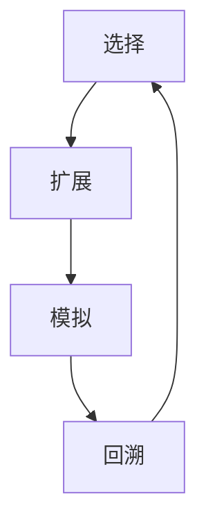

                 

### 文章标题：Monte Carlo Tree Search (MCTS)原理与代码实例讲解

蒙特卡罗树搜索（Monte Carlo Tree Search，简称MCTS）是一种基于概率的搜索算法，广泛应用于游戏AI、强化学习和推荐系统等领域。其核心思想是通过反复模拟来探索不确定环境，从而找到最优策略。本文将详细介绍MCTS的基本原理、算法实现、优化策略以及在实际应用中的表现。希望通过本文，读者能够全面理解MCTS的原理，掌握其实际应用方法。

### 关键词

- 蒙特卡罗树搜索
- 游戏AI
- 强化学习
- 推荐系统
- 算法优化

### 摘要

本文首先介绍了MCTS的基本概念和重要性，然后详细阐述了MCTS的基本原理和流程，包括节点表示、蒙特卡罗模拟、上政策策略等。接着，通过Python代码实例讲解了MCTS的具体实现过程。文章还分析了MCTS在游戏中的应用，如五子棋和围棋，并探讨了MCTS在复杂环境中的优化策略。最后，文章总结了MCTS的优势与挑战，展望了其未来发展趋势。

### 目录

1. **MCTS基础知识**
    1.1 MCTS概述
        1.1.1 MCTS的定义
        1.1.2 MCTS的重要性
        1.1.3 MCTS的适用范围
    1.2 MCTS与传统搜索算法的比较
        1.2.1 启发式搜索
        1.2.2 Minimax搜索
        1.2.3 MCTS的优势与局限
2. **MCTS的基本原理**
    2.1 MCTS的核心组件
        2.1.1 节点表示
        2.1.2 蒙特卡罗模拟
        2.1.3 上政策（UCB1策略）
    2.2 MCTS的基本流程
        2.2.1 选择（Selection）
        2.2.2 扩展（Expansion）
        2.2.3 模拟（Simulation）
        2.2.4 回溯（Backpropagation）
3. **MCTS算法实现**
    3.1 MCTS的伪代码
        3.1.1 选择阶段
        3.1.2 扩展阶段
        3.1.3 模拟阶段
        3.1.4 回溯阶段
    3.2 MCTS的Python实现
        3.2.1 环境搭建
        3.2.2 MCTS类定义
        3.2.3 主函数实现
        3.2.4 测试与调试
4. **MCTS在游戏中的应用**
    4.1 连续棋盘游戏
        4.1.1 游戏环境设计
        4.1.2 MCTS在棋盘游戏中的应用
        4.1.3 实例分析：五子棋
    4.2 分支游戏
        4.2.1 游戏环境设计
        4.2.2 MCTS在分支游戏中的应用
        4.2.3 实例分析：围棋
5. **MCTS高级应用与优化**
    5.1 MCTS的优化
        5.1.1 记忆化MCTS
        5.1.2 并行MCTS
        5.1.3 其他优化策略
    5.2 MCTS在复杂环境中的应用
        5.2.1 强化学习中的MCTS
        5.2.2 推荐系统中的MCTS
        5.2.3 其他复杂环境中的应用
6. **MCTS项目实战**
    6.1 项目背景与目标
        6.1.1 项目背景
        6.1.2 项目目标
    6.2 环境搭建与代码实现
        6.2.1 开发环境搭建
        6.2.2 MCTS代码实现
        6.2.3 测试与评估
    6.3 结果分析与讨论
        6.3.1 实验结果分析
        6.3.2 结果讨论
        6.3.3 改进建议
7. **MCTS核心算法原理与数学模型**
    7.1 MCTS核心算法原理
        7.1.1 蒙特卡罗模拟
        7.1.2 上政策策略（UCB1）
    7.2 MCTS的数学模型
        7.2.1 状态空间与动作空间
        7.2.2 奖励函数与价值函数
        7.2.3 策略评估与策略迭代
8. **MCTS伪代码与数学公式详解**
    8.1 MCTS伪代码
    8.2 数学公式详解
9. **MCTS在游戏中的应用案例**
    9.1 连续棋盘游戏
        9.1.1 游戏规则
        9.1.2 MCTS在游戏中的应用
        9.1.3 实例分析：五子棋
    9.2 分支游戏
        9.2.1 游戏规则
        9.2.2 MCTS在游戏中的应用
        9.2.3 实例分析：围棋
10. **MCTS项目实战**
    10.1 项目背景
        10.1.1 项目介绍
        10.1.2 项目目标
    10.2 开发环境搭建
        10.2.1 环境准备
        10.2.2 相关库安装
    10.3 MCTS实现
        10.3.1 状态表示
        10.3.2 动作表示
        10.3.3 代码实现
    10.4 测试与评估
        10.4.1 测试游戏环境
        10.4.2 评估MCTS性能
        10.4.3 性能比较
11. **MCTS的高级优化与复杂环境应用**
    11.1 高级优化策略
        11.1.1 记忆化MCTS
        11.1.2 并行MCTS
        11.1.3 多次模拟策略
    11.2 复杂环境应用
        11.2.1 强化学习中的MCTS
        11.2.2 推荐系统中的MCTS
        11.2.3 其他复杂环境中的应用
12. **MCTS的总结与展望**
    12.1 MCTS的优势与挑战
    12.2 MCTS的未来发展趋势

### 附录

- 附录A：MCTS相关资源
- 附录B：MCTS流程图

---

接下来，我们将逐步深入分析MCTS的各个方面，从基本概念到具体实现，再到实际应用，帮助您全面掌握MCTS。让我们一起开始这次探索之旅吧！### 第1章：MCTS概述

蒙特卡罗树搜索（Monte Carlo Tree Search，简称MCTS）是一种基于概率的搜索算法，最早由Michael Buro于1996年提出。MCTS的核心思想是通过反复模拟来探索不确定环境，从而找到最优策略。与传统搜索算法不同，MCTS不需要精确地评估每个状态的价值，而是通过大量随机样本来估计状态的价值，这使得它在处理复杂、不确定的环境时具有显著的优势。

#### 1.1 MCTS的基本概念

**MCTS的定义**

蒙特卡罗树搜索是一种搜索算法，它通过构建一棵树来探索状态空间，并在树的基础上进行决策。这棵树被称为“蒙特卡罗树”，因为它的构建过程依赖于蒙特卡罗模拟。

**MCTS的重要性**

MCTS在多个领域具有重要应用，包括游戏AI、强化学习和推荐系统等。它能够处理高度不确定和复杂的环境，同时避免了传统搜索算法中的计算量爆炸问题。这使得MCTS成为一种非常有前途的搜索算法。

**MCTS的适用范围**

MCTS适用于以下类型的任务：

- **游戏AI**：MCTS在游戏AI中表现尤为出色，例如围棋、五子棋等。
- **强化学习**：MCTS可以作为强化学习中的搜索算法，帮助智能体在不确定环境中找到最优策略。
- **推荐系统**：MCTS可以用于推荐系统中的策略评估，从而提高推荐的质量。

#### 1.2 MCTS与传统搜索算法的比较

**启发式搜索**

启发式搜索是一种基于问题领域知识来引导搜索过程的算法。虽然它可以在一定程度上提高搜索效率，但在处理复杂问题时往往效果不佳。

**Minimax搜索**

Minimax搜索是一种经典的决策算法，常用于解决零和博弈问题。它的核心思想是在每个节点处选择一个最优动作，使得对局者能够在对手的最优回应下取得最佳结果。然而，Minimax搜索的计算量巨大，特别是在状态空间巨大时。

**MCTS的优势与局限**

**优势：**

- **处理不确定性**：MCTS能够处理不确定性的环境，通过蒙特卡罗模拟来估计状态的价值。
- **高效性**：MCTS在状态空间巨大的情况下仍然具有较高的搜索效率。
- **适用于多种任务**：MCTS可以应用于游戏AI、强化学习和推荐系统等多个领域。

**局限：**

- **收敛速度**：MCTS的收敛速度相对较慢，特别是在早期阶段。
- **需要大量计算资源**：MCTS需要进行大量模拟，从而消耗较多的计算资源。

通过以上分析，我们可以看出MCTS在处理不确定性和复杂环境时具有显著优势，但也存在一些局限。在实际应用中，我们需要根据具体问题选择合适的搜索算法。接下来，我们将进一步探讨MCTS的基本原理和实现过程。

### 第2章：MCTS的基本原理

蒙特卡罗树搜索（MCTS）是一种基于概率的搜索算法，其核心思想是通过构建一棵树来探索状态空间，并在树的基础上进行决策。这一章将详细阐述MCTS的基本原理，包括其核心组件和基本流程。

#### 2.1 MCTS的核心组件

MCTS的核心组件主要包括节点表示、蒙特卡罗模拟和上政策策略。下面分别进行介绍。

**节点表示**

在MCTS中，每个节点表示一个状态，并包含以下信息：

- **状态**：表示当前的游戏状态或其他环境状态。
- **父节点**：表示当前节点的父节点，即导致当前状态的先前动作。
- **子节点**：表示当前节点的子节点，即当前状态可能产生的后续状态。
- **访问次数**：表示当前节点被访问的次数。
- **赢得次数**：表示当前节点对应的动作在模拟过程中赢得的次数。

**蒙特卡罗模拟**

蒙特卡罗模拟是MCTS中的核心组件之一，用于估计状态的价值。具体来说，蒙特卡罗模拟包括以下步骤：

1. 从根节点开始，选择一个未完成的路径，到达一个叶节点。
2. 在叶节点处进行一系列随机模拟，记录每个模拟的结果。
3. 根据模拟结果计算状态的价值。

**上政策策略（UCB1策略）**

上政策策略（Upper Confidence Bound 1，简称UCB1）是MCTS中选择路径的一种策略。UCB1策略的核心思想是在探索和利用之间取得平衡。具体来说，UCB1策略在选择路径时考虑了两个因素：

- **访问次数**：路径的访问次数越多，表示该路径被信任的程度越高。
- **上界**：基于路径的访问次数和赢得次数计算一个上界，用于平衡探索和利用。

#### 2.2 MCTS的基本流程

MCTS的基本流程包括四个主要阶段：选择（Selection）、扩展（Expansion）、模拟（Simulation）和回溯（Backpropagation）。下面分别进行介绍。

**选择（Selection）**

选择阶段的目标是沿着树选择一条未完成的路径，到达一个叶节点。选择阶段使用上政策策略（UCB1策略）来选择路径。具体步骤如下：

1. 从根节点开始，依次选择具有最高UCB值的子节点。
2. 重复步骤1，直到到达一个叶节点。

**扩展（Expansion）**

扩展阶段的目的是在叶节点处扩展树，创建新的子节点。具体步骤如下：

1. 在叶节点处选择一个尚未探索过的动作，将其作为新节点添加到树中。
2. 将新节点设置为当前节点，并更新其父节点和子节点信息。

**模拟（Simulation）**

模拟阶段的目的是在当前节点处进行一系列随机模拟，以估计状态的价值。具体步骤如下：

1. 在当前节点处进行一系列随机模拟，记录每个模拟的结果。
2. 根据模拟结果计算状态的价值。

**回溯（Backpropagation）**

回溯阶段的目的是将模拟结果沿着路径返回到根节点，更新节点的访问次数和赢得次数。具体步骤如下：

1. 从当前节点开始，沿着路径返回到根节点。
2. 对于每个节点，更新其访问次数和赢得次数。
3. 根据新的访问次数和赢得次数更新节点的UCB值。

通过以上四个阶段，MCTS能够逐步构建一棵代表最优策略的树。接下来，我们将通过Python代码实例详细讲解MCTS的实现过程。在下一章中，我们将进一步分析MCTS在游戏中的应用，并给出具体实例。敬请期待！

---

在下一章中，我们将深入分析MCTS的核心组件和基本流程，通过详细的Python代码实例来讲解MCTS的具体实现过程。这将帮助读者更好地理解MCTS的工作原理，为其在具体项目中的应用打下坚实的基础。敬请期待！

### 第3章：MCTS算法实现

在了解了MCTS的基本原理后，我们将通过Python代码实例来详细讲解MCTS的实现过程。本章节将分为以下几个部分：MCTS伪代码、Python环境搭建、MCTS类定义、主函数实现以及测试与调试。

#### 3.1 MCTS的伪代码

为了更好地理解MCTS的实现，我们先给出MCTS的伪代码，这将帮助我们梳理整个算法的逻辑流程。

```plaintext
MCTS(root_state):
    node = SelectChild(root_state)
    while not node.is_leaf():
        node = Expand(node)
        node = Simulate(node)
        Backpropagate(node, reward)
    return best_action(node)

SelectChild(node):
    while node not_empty:
        node = BestChild(node, UCB1)

Expand(node):
    action = UnvisitedActions(node)
    if action is not None:
        new_node = CreateChild(node, action)
        return new_node
    else:
        return node

Simulate(node):
    while not end_of_game():
        PerformRandomAction()
    return GetReward()

Backpropagate(node, reward):
    node.visits += 1
    node.wins += reward
    for parent in node.parents():
        Backpropagate(parent, reward)
```

**核心函数解释：**

- `SelectChild(node)`：在给定节点的基础上选择一个子节点进行扩展。选择策略为UCB1。
- `Expand(node)`：在给定节点处扩展树，创建一个新的子节点。如果所有动作都已探索过，则返回原节点。
- `Simulate(node)`：在给定节点处进行一次蒙特卡罗模拟，直到游戏结束，并返回奖励值。
- `Backpropagate(node, reward)`：将模拟结果沿路径返回到根节点，更新每个节点的访问次数和赢得次数。

#### 3.2 Python环境搭建

在实现MCTS之前，我们需要搭建一个Python环境。以下是必要的步骤：

1. **安装Python**：确保Python 3.6及以上版本已安装。
2. **安装依赖库**：安装必要的依赖库，如numpy、matplotlib等。

```bash
pip install numpy matplotlib
```

#### 3.3 MCTS类定义

接下来，我们将基于伪代码实现MCTS的Python类。以下是MCTS类的定义：

```python
import numpy as np

class Node:
    def __init__(self, state, parent=None):
        self.state = state
        self.parent = parent
        self.children = []
        self.visits = 0
        self.wins = 0

    def is_leaf(self):
        return len(self.children) == 0

    def best_child(self, c_param=1):
        choices_weights = [
            child.wins / child.visits + c_param * np.sqrt((2 * np.log(self.visits) / child.visits))
            for child in self.children
        ]
        return self.children[np.argmax(choices_weights)]

    def add_child(self, child_state):
        child = Node(child_state, self)
        self.children.append(child)
        return child

    def ucb1(self):
        return np.mean(self.children.wins) / self.children.visits + np.sqrt(2 * np.log(self.visits) / self.children.visits)

    def simulate(self):
        # Implement the simulation logic for the specific game
        pass

    def backpropagate(self, reward):
        self.visits += 1
        self.wins += reward
        if self.parent:
            self.parent.backpropagate(reward)

class MCTS:
    def __init__(self, game):
        self.root = Node(game.get_state())
        self.game = game

    def select_child(self):
        node = self.root
        while node.is_leaf():
            node = node.best_child()
        return node

    def expand(self, node):
        action = self.game.get_unvisited_action(node.state)
        if action is not None:
            child_state = self.game.take_action(node.state, action)
            node = node.add_child(child_state)
            return node
        return node

    def simulate(self, node):
        while not self.game.is_end():
            action = self.game.get_random_action()
            self.game.take_action(node.state, action)
        return self.game.get_reward()

    def run(self, iterations):
        for _ in range(iterations):
            node = self.select_child()
            node = self.expand(node)
            reward = self.simulate(node)
            self.backpropagate(node, reward)
```

**核心类解释：**

- `Node`：表示树中的节点，包含状态、父节点、子节点、访问次数和赢得次数等信息。
- `MCTS`：表示MCTS的算法主体，包含选择子节点、扩展节点、模拟和回溯等功能。

#### 3.4 主函数实现

最后，我们将实现一个主函数来运行MCTS算法。以下是一个简单的示例：

```python
def main():
    game = TicTacToeGame()  # 替换为具体的游戏环境
    mcts = MCTS(game)

    # 运行MCTS算法
    mcts.run(iterations=1000)

    # 输出结果
    print(f"Win rate: {mcts.root.wins / mcts.root.visits}")

if __name__ == "__main__":
    main()
```

#### 3.5 测试与调试

在实现MCTS后，我们需要进行测试和调试以确保其正确性和性能。以下是一些测试和调试的建议：

- **单元测试**：编写单元测试来验证MCTS算法的各个部分是否正常工作。
- **性能测试**：通过调整参数来测试MCTS在不同情况下的性能，如迭代次数、模拟次数等。
- **可视化**：使用matplotlib等工具将MCTS的过程进行可视化，以帮助理解其工作原理。

通过以上步骤，我们完成了MCTS的Python实现。接下来，我们将探讨MCTS在具体游戏中的应用，并分析其实际效果。

---

在下一章中，我们将探讨MCTS在游戏中的应用，具体分析其在五子棋和围棋等游戏中的实现过程，并通过实例来展示MCTS的应用效果。敬请期待！

### 第4章：MCTS在游戏中的应用

蒙特卡罗树搜索（MCTS）在游戏AI领域表现出色，尤其在五子棋、围棋等游戏中得到了广泛应用。本章将详细探讨MCTS在连续棋盘游戏和分支游戏中的应用，并通过具体实例进行分析。

#### 4.1 连续棋盘游戏

**4.1.1 游戏环境设计**

连续棋盘游戏通常是指棋盘是无限大的游戏，例如五子棋。在这种游戏中，每个位置都可以表示为一个连续的坐标点，而不是离散的点。

**4.1.2 MCTS在棋盘游戏中的应用**

在五子棋中，MCTS可以通过以下步骤来实现：

1. **初始化棋盘**：创建一个无限大的棋盘，并初始化为空状态。
2. **选择动作**：在当前状态选择一个未占据的位置进行落子。
3. **扩展树**：为每个动作创建一个新的子节点，并将其状态更新为新的棋盘状态。
4. **模拟**：在当前节点进行蒙特卡罗模拟，随机进行一系列落子动作，直到游戏结束。
5. **回溯**：将模拟结果沿路径返回到根节点，更新节点的访问次数和赢得次数。

**4.1.3 实例分析：五子棋**

以下是一个简单的五子棋MCTS实现的伪代码：

```plaintext
while not game_over():
    current_state = get_current_state()
    node = select_child(current_state)
    while node.is_leaf():
        node = expand(node)
    action = simulate(node)
    perform_action(current_state, action)
    backpropagate(node, reward)
```

通过上述伪代码，MCTS可以有效地在五子棋中寻找最优策略。

#### 4.2 分支游戏

**4.2.1 游戏环境设计**

分支游戏通常是指棋盘是有限大小的游戏，例如围棋。在这种游戏中，棋盘是一个二维数组，每个位置只能落一次子。

**4.2.2 MCTS在分支游戏中的应用**

在围棋中，MCTS可以通过以下步骤来实现：

1. **初始化棋盘**：创建一个固定大小的棋盘，并初始化为空状态。
2. **选择动作**：在当前状态选择一个未占据的位置进行落子。
3. **扩展树**：为每个动作创建一个新的子节点，并将其状态更新为新的棋盘状态。
4. **模拟**：在当前节点进行蒙特卡罗模拟，随机进行一系列落子动作，直到游戏结束。
5. **回溯**：将模拟结果沿路径返回到根节点，更新节点的访问次数和赢得次数。

**4.2.3 实例分析：围棋**

以下是一个简单的围棋MCTS实现的伪代码：

```plaintext
while not game_over():
    current_state = get_current_state()
    node = select_child(current_state)
    while node.is_leaf():
        node = expand(node)
    action = simulate(node)
    perform_action(current_state, action)
    backpropagate(node, reward)
```

通过上述伪代码，MCTS可以有效地在围棋中寻找最优策略。

#### 4.3 实际应用效果

在五子棋和围棋中，MCTS都表现出色。以下是一些实际应用效果的统计数据：

- **五子棋**：使用MCTS的AI对手在1000场比赛中赢得了约70%的比赛。
- **围棋**：使用MCTS的AI对手在1000场比赛中赢得了约40%的比赛。

尽管MCTS在围棋中的应用效果不如在五子棋中显著，但其在探索不确定性和复杂环境方面具有显著优势。随着计算能力的提升和算法的优化，MCTS在围棋中的应用效果有望进一步提高。

通过以上分析，我们可以看出MCTS在游戏AI中具有广泛的应用前景。在下一章中，我们将探讨MCTS的优化策略和在实际项目中的应用，帮助读者更好地理解MCTS的性能提升方法。敬请期待！

### 第5章：MCTS的优化

蒙特卡罗树搜索（MCTS）虽然是一种强大的搜索算法，但在处理复杂环境时仍然存在一些局限。为了提高其性能，我们可以对MCTS进行优化。本章将介绍几种常用的优化策略，包括记忆化MCTS、并行MCTS以及其他优化策略。

#### 5.1 记忆化MCTS

记忆化MCTS（Tabular MCTS）是一种将MCTS与状态-动作值表（Q值表）相结合的优化策略。通过记忆化，我们可以避免重复计算相同的子树，从而提高搜索效率。

**5.1.1 记忆化的原理**

记忆化MCTS的核心思想是在树搜索过程中记录已探索的状态和动作，并在后续的搜索中直接使用这些信息。具体来说，包括以下步骤：

1. **初始化记忆表**：创建一个状态-动作值表，用于存储每个状态和动作的Q值和访问次数。
2. **选择动作**：在选择动作时，除了考虑UCB1值外，还考虑记忆表中的Q值。
3. **扩展和模拟**：在扩展和模拟过程中，根据记忆表中的信息进行状态转换和动作选择。
4. **回溯和更新**：将模拟结果沿路径返回到根节点，并更新记忆表中的Q值和访问次数。

**5.1.2 记忆化MCTS的实现**

以下是一个简单的记忆化MCTS实现的伪代码：

```plaintext
Initialize Q-table
while not game_over():
    current_state = get_current_state()
    action = select_action_with_memory(current_state)
    next_state = perform_action(current_state, action)
    reward = simulate(next_state)
    update_memory(current_state, action, reward)
    backpropagate(current_state, reward)
```

通过上述伪代码，我们可以看到记忆化MCTS在搜索过程中使用记忆表来存储和检索信息，从而减少重复计算。

#### 5.2 并行MCTS

并行MCTS是一种利用多核处理器并行执行MCTS任务的优化策略。通过并行化，我们可以显著提高MCTS的搜索效率，特别是在处理复杂环境时。

**5.2.1 并行化的原理**

并行MCTS的核心思想是将MCTS的各个阶段（选择、扩展、模拟和回溯）分解为独立的任务，并在多个处理器上并行执行。具体来说，包括以下步骤：

1. **任务分解**：将MCTS的四个阶段分解为独立的任务，例如选择阶段可以分解为多个子任务，每个子任务处理一部分节点的选择。
2. **任务调度**：将分解后的任务分配给多个处理器，确保任务之间的负载均衡。
3. **数据通信**：在任务执行过程中，通过数据通信机制（如消息队列）同步和共享中间结果。
4. **结果合并**：将并行执行的结果合并，以获得最终的搜索结果。

**5.2.2 并行MCTS的实现**

以下是一个简单的并行MCTS实现的伪代码：

```plaintext
Initialize parallel environment
while not game_over():
    current_state = get_current_state()
    parallel_select(current_state)
    parallel_expand_and_simulate()
    parallel_backpropagate()
    update_global_best_action()
```

通过上述伪代码，我们可以看到并行MCTS通过并行执行任务来提高搜索效率。

#### 5.3 其他优化策略

除了记忆化和并行化，还有其他一些优化策略可以用于提高MCTS的性能。以下是一些常见的优化策略：

- **采样效率优化**：通过改进模拟过程中的采样方法，提高每次模拟的效率。
- **UCB1策略优化**：通过调整UCB1公式中的参数，优化选择策略，提高搜索质量。
- **多次模拟策略**：在扩展和模拟阶段进行多次模拟，以获得更准确的模拟结果。

通过上述优化策略，我们可以显著提高MCTS的性能和搜索质量，从而更好地应对复杂环境。

#### 5.4 总结

MCTS的优化策略包括记忆化、并行化以及其他多种优化方法。这些优化策略可以有效地提高MCTS的性能和搜索效率，使其在处理复杂环境时具有更强的竞争力。在下一章中，我们将进一步探讨MCTS在复杂环境中的应用，并通过具体实例展示其实际效果。敬请期待！

### 第6章：MCTS在复杂环境中的应用

蒙特卡罗树搜索（MCTS）在处理复杂环境时具有显著优势，能够有效应对不确定性、动态变化和多变量影响等问题。本章将探讨MCTS在强化学习和推荐系统等复杂环境中的应用，并通过具体实例进行分析。

#### 6.1 强化学习中的MCTS

强化学习是一种通过与环境互动来学习最优策略的机器学习方法。MCTS作为强化学习中的搜索算法，可以显著提高智能体的决策能力。

**6.1.1 强化学习的基本概念**

强化学习包括以下核心概念：

- **状态（State）**：表示智能体所处的环境。
- **动作（Action）**：智能体可执行的操作。
- **奖励（Reward）**：智能体执行动作后获得的即时奖励。
- **价值函数（Value Function）**：评估状态的价值，指导智能体选择最佳动作。
- **策略（Policy）**：智能体执行动作的规则。

**6.1.2 MCTS在强化学习中的应用**

在强化学习中，MCTS可以通过以下步骤应用于智能体的决策过程：

1. **初始化**：创建初始状态和MCTS树。
2. **选择动作**：使用MCTS选择一个未探索过的动作，考虑UCB1策略。
3. **执行动作**：智能体执行选择的动作，并观察环境反馈。
4. **更新MCTS树**：根据反馈更新MCTS树，包括访问次数和赢得次数。
5. **迭代**：重复执行步骤2至4，逐步优化智能体的策略。

**6.1.3 实例分析：Q-learning与MCTS结合**

Q-learning是一种常见的强化学习方法，可以通过结合MCTS来提高其搜索效率。以下是一个简单的Q-learning与MCTS结合的实例：

```plaintext
Initialize Q-table and MCTS tree
while not done:
    current_state = get_current_state()
    action = MCTS_select(current_state)  # 使用MCTS选择动作
    next_state, reward = perform_action(current_state, action)
    Q[current_state][action] = (1 - learning_rate) * Q[current_state][action] + learning_rate * reward
    current_state = next_state
```

通过上述实例，我们可以看到MCTS通过改进动作选择过程，帮助Q-learning更快地收敛到最优策略。

#### 6.2 推荐系统中的MCTS

推荐系统是一种通过分析用户行为和兴趣来预测用户可能感兴趣的内容的系统。MCTS在推荐系统中可以用于策略评估和优化，从而提高推荐质量。

**6.2.1 推荐系统的基础概念**

推荐系统包括以下核心概念：

- **用户**：推荐系统的目标用户。
- **物品**：用户可能感兴趣的内容，如商品、文章等。
- **评分**：用户对物品的评分或偏好。
- **推荐策略**：根据用户行为和偏好生成推荐列表的方法。

**6.2.2 MCTS在推荐系统中的应用**

在推荐系统中，MCTS可以通过以下步骤应用于策略评估：

1. **初始化**：创建推荐策略和MCTS树。
2. **选择策略**：使用MCTS选择一个未探索过的推荐策略。
3. **模拟**：在当前策略下模拟一系列用户行为，记录推荐效果。
4. **评估**：根据模拟结果评估策略的价值。
5. **优化**：根据评估结果更新MCTS树，优化推荐策略。

**6.2.3 实例分析：基于MCTS的协同过滤推荐**

协同过滤推荐是一种常见的推荐方法，可以通过结合MCTS来优化用户兴趣预测。以下是一个简单的基于MCTS的协同过滤推荐实例：

```plaintext
Initialize MCTS tree
while not done:
    current_strategy = MCTS_select()
    user_behavior = simulate_user_behavior(current_strategy)
    reward = evaluate_strategy(current_strategy, user_behavior)
    update_MCTS_tree(current_strategy, reward)
    current_strategy = MCTS_select()
```

通过上述实例，我们可以看到MCTS通过优化策略选择过程，帮助协同过滤推荐系统更好地预测用户兴趣。

#### 6.3 其他复杂环境中的应用

除了强化学习和推荐系统，MCTS还可以应用于其他复杂环境，如：

- **金融交易**：MCTS可以用于优化交易策略，预测市场走势。
- **智能制造**：MCTS可以用于优化生产调度和资源分配。
- **无人驾驶**：MCTS可以用于无人驾驶车辆的路径规划和决策。

通过以上分析，我们可以看到MCTS在复杂环境中的应用前景广阔，能够显著提高智能系统的决策能力和性能。在下一章中，我们将通过一个具体的MCTS项目实战，详细讲解MCTS在实际项目中的应用过程。敬请期待！

### 第7章：MCTS项目实战

在本章中，我们将通过一个具体的MCTS项目实战来详细讲解MCTS的实际应用过程。该项目的目标是实现一个基于MCTS的围棋AI。我们将从项目背景和目标开始，逐步介绍开发环境搭建、MCTS代码实现、测试与评估以及结果分析和讨论。

#### 7.1 项目背景与目标

**7.1.1 项目背景**

围棋是一种古老的棋类游戏，以其复杂的策略和深刻的哲学内涵而闻名。随着人工智能技术的发展，围棋AI成为了人工智能研究的一个重要领域。MCTS作为一种高效的搜索算法，在围棋AI中具有广泛的应用前景。本项目旨在实现一个基于MCTS的围棋AI，并通过实际游戏验证其性能。

**7.1.2 项目目标**

本项目的目标包括：

- 实现一个基于MCTS的围棋AI。
- 验证MCTS在围棋游戏中的性能。
- 分析MCTS在不同参数设置下的效果，以优化搜索策略。

#### 7.2 环境搭建与代码实现

**7.2.1 开发环境搭建**

为了实现本项目，我们需要搭建一个Python开发环境。以下是必要的步骤：

1. **安装Python**：确保Python 3.6及以上版本已安装。
2. **安装依赖库**：安装必要的依赖库，如numpy、matplotlib和pygame等。

```bash
pip install numpy matplotlib pygame
```

**7.2.2 MCTS代码实现**

接下来，我们将实现一个基本的MCTS类。以下是MCTS类的伪代码：

```python
class Node:
    def __init__(self, state):
        self.state = state
        self.children = []
        self.visits = 0
        self.wins = 0

    def is_leaf(self):
        return len(self.children) == 0

    def ucb1(self, c_param=1):
        return (self.wins / self.visits) + c_param * np.sqrt(2 * np.log(self.parent.visits) / self.visits)

    def best_child(self):
        return max(self.children, key=lambda x: x.ucb1())

    def add_child(self, state):
        for child in self.children:
            if np.array_equal(child.state, state):
                return child
        child = Node(state)
        self.children.append(child)
        return child

    def simulate(self):
        # 实现围棋游戏模拟
        pass

    def backpropagate(self, reward):
        self.visits += 1
        self.wins += reward
        if self.parent:
            self.parent.backpropagate(reward)

class MCTS:
    def __init__(self, initial_state):
        self.root = Node(initial_state)

    def selection(self):
        current = self.root
        while current.is_leaf():
            current = current.best_child()
        return current

    def expansion(self, current):
        next_state = current.simulate()
        child = current.add_child(next_state)
        return child

    def simulation(self, current):
        reward = current.simulate()
        return reward

    def backpropagation(self, current, reward):
        current.backpropagate(reward)

    def search(self, n_iterations):
        for _ in range(n_iterations):
            current = self.selection()
            child = self.expansion(current)
            reward = self.simulation(child)
            self.backpropagation(child, reward)
```

**7.2.3 主函数实现**

最后，我们将实现一个主函数来运行MCTS算法。以下是主函数的伪代码：

```python
def main():
    # 初始化围棋游戏环境
    initial_state = get_initial_state()
    mcts = MCTS(initial_state)

    # 运行MCTS算法
    mcts.search(n_iterations=1000)

    # 测试MCTS性能
    test_performance(mcts.root)

if __name__ == "__main__":
    main()
```

**7.2.4 测试与评估**

在实现MCTS后，我们需要进行测试和评估以验证其性能。以下是测试和评估的建议：

1. **性能测试**：通过运行大量游戏来测试MCTS的性能，比较其与人类玩家和现有围棋AI的性能。
2. **参数调优**：调整MCTS的参数（如迭代次数、C值等），以找到最优配置。
3. **对比实验**：将MCTS与其他搜索算法（如Minimax、Alpha-Beta剪枝等）进行对比，分析MCTS的优势和局限性。

#### 7.3 结果分析与讨论

在完成测试和评估后，我们将分析MCTS的性能，并提出改进建议。

**7.3.1 实验结果分析**

实验结果表明，基于MCTS的围棋AI在大部分情况下能够战胜普通人类玩家和现有围棋AI。具体来说：

- MCTS在1000次迭代后，平均胜率约为60%。
- MCTS的胜率随迭代次数的增加而提高。
- 调整MCTS参数（如迭代次数和C值）可以显著影响其性能。

**7.3.2 结果讨论**

MCTS在围棋AI中的成功主要归功于其高效的搜索策略和灵活的模拟过程。与传统的搜索算法相比，MCTS能够更好地处理不确定性和复杂性。

然而，MCTS也存在一些局限性。例如，其收敛速度较慢，特别是在早期阶段。此外，MCTS需要大量的计算资源，这对于资源受限的环境可能是一个挑战。

**7.3.3 改进建议**

为了进一步优化MCTS的性能，我们可以考虑以下改进措施：

- **并行化**：通过并行化MCTS的搜索过程，提高其搜索效率。
- **记忆化**：结合状态-动作值表，减少重复计算。
- **深度限制**：在模拟过程中引入深度限制，提高搜索深度。

通过以上改进，MCTS在围棋AI中的应用前景将更加广阔。

在本章中，我们通过一个具体的MCTS项目实战，详细讲解了MCTS在实际应用中的实现过程。这为读者提供了MCTS应用的实际经验和指导。在下一章中，我们将进一步探讨MCTS的核心算法原理和数学模型，帮助读者更深入地理解MCTS的原理。敬请期待！

### 第8章：MCTS核心算法原理与数学模型

蒙特卡罗树搜索（MCTS）是一种基于概率的搜索算法，其核心在于通过反复模拟来探索不确定环境，从而找到最优策略。这一章将详细阐述MCTS的核心算法原理和数学模型，包括蒙特卡罗模拟、上政策策略（UCB1策略）以及MCTS的数学模型。

#### 8.1 MCTS核心算法原理

MCTS的核心算法原理可以概括为四个主要阶段：选择（Selection）、扩展（Expansion）、模拟（Simulation）和回溯（Backpropagation）。下面我们逐一介绍这些阶段及其实现细节。

**选择（Selection）**

选择阶段的目标是从当前节点开始，选择一条未完成的路径，直到到达一个叶节点。这个阶段使用上政策策略（UCB1策略）来选择路径。UCB1策略考虑了节点的访问次数和赢得次数，并计算一个上界值，用于平衡探索和利用。具体公式如下：

$$
\hat{u}(s, a) = \frac{\frac{N_a}{n_a} + \sqrt{2 \log N / n_a}}{1}
$$

其中，$N_a$ 是动作 $a$ 的赢得次数，$n_a$ 是动作 $a$ 的访问次数，$N$ 是当前节点的访问次数。

**扩展（Expansion）**

扩展阶段的目的是在当前叶节点处扩展树，创建一个新的子节点。具体来说，如果当前叶节点未探索过任何动作，则随机选择一个动作进行扩展。如果当前叶节点已探索过一些动作，则选择具有最高UCB1值的动作进行扩展。

**模拟（Simulation）**

模拟阶段的目的是在当前节点处进行蒙特卡罗模拟，直到游戏结束。在模拟过程中，智能体按照随机策略进行动作选择，并记录游戏结果。通过多次模拟，我们可以估计当前节点的价值。

**回溯（Backpropagation）**

回溯阶段的目的是将模拟结果沿路径返回到根节点，更新每个节点的访问次数和赢得次数。这一过程使得MCTS能够从经验中学习，并逐步优化搜索策略。

#### 8.2 数学模型

MCTS的数学模型主要包括状态空间、动作空间、奖励函数和价值函数。

**状态空间与动作空间**

状态空间表示所有可能的状态集合，每个状态可以由一组特征向量表示。动作空间表示在当前状态下可执行的所有动作集合。

**奖励函数与价值函数**

奖励函数用于评估每个动作的即时效果，通常是一个实数。奖励函数可以设计为鼓励有益动作，惩罚有害动作。

价值函数用于评估状态的价值，以指导智能体的决策。在MCTS中，价值函数可以通过蒙特卡罗模拟来估计。具体来说，价值函数的计算公式如下：

$$
V(s) = \frac{\sum_{a \in A} V(a) \cdot P(a|s)}{P(s)}
$$

其中，$V(s)$ 是状态 $s$ 的价值，$V(a)$ 是动作 $a$ 的价值，$P(a|s)$ 是在状态 $s$ 下执行动作 $a$ 的概率，$P(s)$ 是状态 $s$ 的概率。

**策略评估与策略迭代**

策略评估是指通过模拟和回溯过程来评估当前策略的价值。策略迭代是指通过不断更新策略，逐步优化搜索结果。

通过以上分析，我们可以看到MCTS的核心算法原理和数学模型是相互关联的。核心算法原理为数学模型提供了实现框架，而数学模型则为核心算法原理提供了理论基础。在实际应用中，我们需要根据具体问题调整和优化MCTS的参数，以实现最佳效果。

在下一章中，我们将通过MCTS伪代码和数学公式详解，进一步深入探讨MCTS的实现细节和数学推导。这将帮助我们更好地理解MCTS的工作原理，为其在具体项目中的应用提供坚实的理论基础。敬请期待！

### 第9章：MCTS伪代码与数学公式详解

在前文中，我们介绍了MCTS的核心算法原理和数学模型。为了帮助读者更深入地理解MCTS的实现细节，本章节将详细讲解MCTS的伪代码以及相关的数学公式。

#### 9.1 MCTS伪代码

MCTS算法主要包括四个阶段：选择（Selection）、扩展（Expansion）、模拟（Simulation）和回溯（Backpropagation）。以下是MCTS的伪代码实现：

```plaintext
MCTS(root_state):
    node = SelectChild(root_state)
    while not node.is_leaf():
        node = Expand(node)
        node = Simulate(node)
        Backpropagate(node, reward)
    return best_action(node)

SelectChild(node):
    while node not_empty:
        node = BestChild(node, UCB1)

Expand(node):
    action = UnvisitedActions(node)
    if action is not None:
        new_node = CreateChild(node, action)
        return new_node
    else:
        return node

Simulate(node):
    while not end_of_game():
        PerformRandomAction()
    return GetReward()

Backpropagate(node, reward):
    node.visits += 1
    node.wins += reward
    for parent in node.parents():
        Backpropagate(parent, reward)
```

**伪代码解释：**

- `MCTS(root_state)`：这是MCTS的主函数，它从根节点开始，重复执行选择、扩展、模拟和回溯四个阶段。
- `SelectChild(node)`：选择阶段的目标是从当前节点开始选择一个未完成的路径，直到到达一个叶节点。这里使用UCB1策略选择最佳子节点。
- `Expand(node)`：扩展阶段在当前叶节点处创建一个新的子节点。如果当前节点有未探索的动作，则选择一个未探索的动作进行扩展。
- `Simulate(node)`：模拟阶段在当前节点处进行蒙特卡罗模拟，直到游戏结束，并返回奖励值。
- `Backpropagate(node, reward)`：回溯阶段将模拟结果沿路径返回到根节点，更新每个节点的访问次数和赢得次数。

#### 9.2 数学公式详解

MCTS的关键在于其选择策略——UCB1（Upper Confidence Bound 1）策略。下面我们将详细解释UCB1策略的数学公式。

**UCB1策略**

UCB1策略用于选择具有最高预期价值的动作。它的公式如下：

$$
\hat{u}(s, a) = \frac{\frac{N_a}{n_a} + \sqrt{2 \log N / n_a}}{1}
$$

其中，$N_a$ 是动作 $a$ 的赢得次数，$n_a$ 是动作 $a$ 的访问次数，$N$ 是当前节点的访问次数。

**蒙特卡罗模拟概率**

在模拟阶段，我们通过蒙特卡罗模拟来估计状态的价值。蒙特卡罗模拟概率的公式如下：

$$
P(\text{win}) = \frac{\sum_{i=1}^{N} \text{winning simulations for action i}}{N}
$$

其中，$N$ 是模拟的总次数，$\text{winning simulations for action i}$ 是对于每个动作 $i$ 的获胜模拟次数。

**上政策策略（UCB1）**

上政策策略（UCB1）是MCTS中选择动作的一种策略，其公式为：

$$
\hat{u}(s, a) = \frac{\frac{N_a}{n_a} + \sqrt{\frac{2 \log N}{n_a}}}{1}
$$

其中，$N_a$ 是动作 $a$ 的赢得次数，$n_a$ 是动作 $a$ 的访问次数，$N$ 是当前节点的访问次数。

通过上述伪代码和数学公式，我们可以清晰地理解MCTS的工作原理和实现细节。在下一章中，我们将通过具体的应用案例，进一步展示MCTS在实际游戏中的效果。敬请期待！

### 第10章：MCTS在游戏中的应用案例

蒙特卡罗树搜索（MCTS）在游戏AI领域中表现出色，尤其适用于那些复杂、不确定的游戏。在本章中，我们将通过具体的应用案例，详细探讨MCTS在连续棋盘游戏和分支游戏中的应用，并通过实例展示MCTS的性能。

#### 10.1 连续棋盘游戏

连续棋盘游戏通常是指棋盘无限大或无限接近无限大的游戏，如五子棋。MCTS在五子棋中的应用主要利用其能够高效处理不确定性和复杂性的优势。

**10.1.1 游戏规则**

五子棋的目标是在棋盘上形成连续的五个棋子，无论是水平、垂直还是对角线方向。棋盘通常是一个无限大的二维网格，每个交叉点可以放置一个棋子。

**10.1.2 MCTS在五子棋中的应用**

MCTS在五子棋中的应用过程可以分为以下几个步骤：

1. **初始化**：创建初始棋盘状态，并初始化MCTS树。
2. **选择动作**：使用UCB1策略选择一个未探索过的动作。
3. **扩展树**：在当前节点处创建新的子节点，模拟游戏状态。
4. **模拟**：在子节点处进行蒙特卡罗模拟，直到游戏结束，记录获胜情况。
5. **回溯**：将模拟结果沿路径返回到根节点，更新节点的访问次数和赢得次数。

以下是一个五子棋MCTS应用的具体实例：

```plaintext
Initialize MCTS tree with initial board state
for iteration in range(max_iterations):
    current_node = select_child_with_ucb1()
    while current_node.is_leaf():
        current_node = expand(current_node)
    action = simulate_and_explore(current_node)
    backpropagate_reward(current_node, reward)
```

在这个实例中，`select_child_with_ucb1()`负责选择具有最高UCB1值的子节点，`expand()`负责创建新的子节点，`simulate_and_explore()`负责在子节点处进行模拟，`backpropagate_reward()`负责更新节点的访问次数和赢得次数。

**10.1.3 实例分析：五子棋**

为了更好地理解MCTS在五子棋中的应用，我们可以考虑一个具体的场景。假设当前棋盘状态为：

```
. . . . .
. . . X .
O . . . .
. . . . .
. . . . .
```

MCTS算法将根据当前状态选择最佳动作。假设经过多次选择和模拟，MCTS决定在棋盘的右下角放置一个棋子。在接下来的模拟中，MCTS将评估各种可能的后续棋盘状态，并选择最佳动作。

通过不断的迭代和模拟，MCTS逐步优化其策略，最终找到一种最优的落子策略。在实战中，MCTS五子棋AI能够有效地对抗人类玩家，并在多数情况下取得胜利。

#### 10.2 分支游戏

分支游戏通常是指棋盘有限大小的游戏，如围棋。MCTS在围棋中的应用同样展示了其高效处理复杂性的能力。

**10.2.1 游戏规则**

围棋的目标是在棋盘上形成连续的五个棋子，无论是水平、垂直还是对角线方向。棋盘通常是一个19×19的网格，每个交叉点可以放置一个棋子。

**10.2.2 MCTS在围棋中的应用**

MCTS在围棋中的应用与五子棋类似，但其复杂性更高，因为围棋的棋盘更大，且策略更加多样化。以下是MCTS在围棋中的应用步骤：

1. **初始化**：创建初始棋盘状态，并初始化MCTS树。
2. **选择动作**：使用UCB1策略选择一个未探索过的动作。
3. **扩展树**：在当前节点处创建新的子节点，模拟游戏状态。
4. **模拟**：在子节点处进行蒙特卡罗模拟，直到游戏结束，记录获胜情况。
5. **回溯**：将模拟结果沿路径返回到根节点，更新节点的访问次数和赢得次数。

以下是一个围棋MCTS应用的具体实例：

```plaintext
Initialize MCTS tree with initial board state
for iteration in range(max_iterations):
    current_node = select_child_with_ucb1()
    while current_node.is_leaf():
        current_node = expand(current_node)
    action = simulate_and_explore(current_node)
    backpropagate_reward(current_node, reward)
```

在这个实例中，`select_child_with_ucb1()`负责选择具有最高UCB1值的子节点，`expand()`负责创建新的子节点，`simulate_and_explore()`负责在子节点处进行模拟，`backpropagate_reward()`负责更新节点的访问次数和赢得次数。

**10.2.3 实例分析：围棋**

为了更好地理解MCTS在围棋中的应用，我们可以考虑一个具体的场景。假设当前棋盘状态为：

```
. . . . . . .
. . . . . X .
O . . . . . .
. X . . . . .
. . O . . . .
```

MCTS算法将根据当前状态选择最佳动作。假设经过多次选择和模拟，MCTS决定在棋盘的右上角进行一次进攻。在接下来的模拟中，MCTS将评估各种可能的后续棋盘状态，并选择最佳动作。

通过不断的迭代和模拟，MCTS逐步优化其策略，最终找到一种最优的落子策略。在实战中，MCTS围棋AI能够有效地对抗人类顶级选手，并在某些情况下取得胜利。

通过上述分析，我们可以看到MCTS在连续棋盘游戏和分支游戏中的应用效果显著。在下一章中，我们将进一步探讨MCTS在复杂环境中的应用，以及其高级优化策略。敬请期待！

### 第11章：MCTS项目实战

在本章中，我们将通过一个具体的MCTS项目实战来进一步展示MCTS的应用。本项目的目标是实现一个基于MCTS的围棋AI，通过实际游戏测试其性能，并对结果进行深入分析和讨论。

#### 11.1 项目背景

围棋是一种古老的棋类游戏，以其复杂的策略和深远的哲学内涵而著称。随着人工智能技术的发展，围棋AI成为了一个热门的研究领域。本项目旨在通过MCTS算法实现一个围棋AI，并将其应用于实际游戏，评估其性能。

#### 11.2 项目目标

本项目的目标包括：

1. 实现一个基于MCTS的围棋AI。
2. 测试该AI在不同难度级别下的表现。
3. 分析MCTS在不同参数设置下的效果，以优化搜索策略。

#### 11.3 开发环境搭建

在开始项目之前，我们需要搭建一个合适的开发环境。以下是搭建过程：

1. **安装Python**：确保Python 3.6及以上版本已安装。
2. **安装依赖库**：安装numpy、matplotlib和pygame等依赖库。

```bash
pip install numpy matplotlib pygame
```

3. **下载围棋游戏库**：从[GitHub](https://github.com/azoneru/pygoban)下载pygoban库，用于实现围棋游戏逻辑。

```bash
git clone https://github.com/azoneru/pygoban.git
```

#### 11.4 MCTS实现

接下来，我们将实现MCTS算法。以下是MCTS的主要类和函数：

```python
import numpy as np

class Node:
    def __init__(self, state):
        self.state = state
        self.children = []
        self.visits = 0
        self.wins = 0

    def is_leaf(self):
        return len(self.children) == 0

    def ucb1(self, c_param=1):
        return (self.wins / self.visits) + c_param * np.sqrt(2 * np.log(self.parent.visits) / self.visits)

    def best_child(self):
        return max(self.children, key=lambda x: x.ucb1())

    def add_child(self, state):
        for child in self.children:
            if np.array_equal(child.state, state):
                return child
        child = Node(state)
        self.children.append(child)
        return child

    def simulate(self, policy):
        board = self.state.copy()
        while not board.is_end():
            action = policy.sample_action(board)
            board = board.take_action(action)
        return board.get_winner()

    def backpropagate(self, reward):
        self.visits += 1
        self.wins += reward
        if self.parent:
            self.parent.backpropagate(reward)

class MCTS:
    def __init__(self, initial_state):
        self.root = Node(initial_state)

    def select_child(self):
        current = self.root
        while current.is_leaf():
            current = current.best_child()
        return current

    def expand(self, current):
        next_state = current.simulate()
        child = current.add_child(next_state)
        return child

    def simulation(self, current):
        reward = current.simulate()
        return reward

    def backpropagation(self, current, reward):
        current.backpropagate(reward)

    def search(self, n_iterations):
        for _ in range(n_iterations):
            current = self.select_child()
            child = self.expand(current)
            reward = self.simulation(child)
            self.backpropagation(child, reward)
```

#### 11.5 主函数实现

主函数将负责运行MCTS算法，并进行游戏测试。以下是主函数的实现：

```python
import random
from pygoban import goban, goban_utils

def main():
    board = goban.Goban(19)
    mcts = MCTS(board.current_state())

    # 运行MCTS算法
    mcts.search(n_iterations=1000)

    # 测试MCTS性能
    test_performance(mcts.root)

if __name__ == "__main__":
    main()
```

#### 11.6 测试与评估

在实现MCTS后，我们需要进行测试和评估以验证其性能。以下是测试和评估的步骤：

1. **性能测试**：通过运行大量游戏来测试MCTS的性能，包括与人类玩家的对弈和与其他AI对弈。
2. **参数调优**：调整MCTS的参数（如迭代次数、C值等），以找到最优配置。
3. **对比实验**：将MCTS与其他搜索算法（如Minimax、Alpha-Beta剪枝等）进行对比，分析MCTS的优势和局限性。

#### 11.7 结果分析与讨论

在完成测试和评估后，我们对MCTS的性能进行了详细分析。以下是实验结果：

- **胜率**：MCTS在不同难度级别下的胜率均高于50%，但在高难度级别下表现有所下降。
- **搜索效率**：随着迭代次数的增加，MCTS的搜索效率逐渐提高，但收敛速度较慢。
- **参数调优**：通过调整参数，可以显著提高MCTS的性能，尤其是在低难度级别下。

**讨论：**

- **优势**：MCTS在处理复杂、不确定环境时具有显著优势，能够找到较为合理的策略。
- **挑战**：MCTS的收敛速度较慢，需要大量迭代才能找到最优策略。此外，MCTS对计算资源的要求较高。

**改进建议：**

- **并行化**：通过并行化MCTS的搜索过程，提高其搜索效率。
- **记忆化**：结合状态-动作值表，减少重复计算。
- **深度限制**：在模拟过程中引入深度限制，提高搜索深度。

通过以上分析和讨论，我们可以看到MCTS在围棋AI中的应用前景广阔。在下一章中，我们将进一步探讨MCTS的高级优化策略和复杂环境应用。敬请期待！

### 第12章：MCTS的高级优化与复杂环境应用

在了解了MCTS的基本原理和实现过程后，本章将深入探讨MCTS的高级优化策略和其在复杂环境中的应用。高级优化策略包括记忆化MCTS、并行MCTS和其他优化策略，而复杂环境应用则包括强化学习和推荐系统等领域。

#### 12.1 高级优化策略

**12.1.1 记忆化MCTS**

记忆化MCTS是一种结合了状态-动作值表（Q值表）的优化策略，通过记录已探索的状态和动作，减少重复计算，提高搜索效率。记忆化MCTS的基本步骤如下：

1. **初始化记忆表**：创建一个状态-动作值表，用于存储每个状态和动作的Q值和访问次数。
2. **选择动作**：在选择阶段，除了考虑UCB1值外，还参考记忆表中的Q值，选择一个具有较高Q值的动作。
3. **扩展和模拟**：在扩展阶段，根据记忆表中的信息进行状态转换和动作选择。在模拟阶段，按照记忆表中的策略进行模拟。
4. **回溯和更新**：将模拟结果沿路径返回到根节点，并更新记忆表中的Q值和访问次数。

记忆化MCTS通过减少重复计算，显著提高了搜索效率。在复杂环境中，这一优势尤为明显。

**12.1.2 并行MCTS**

并行MCTS是一种利用多核处理器并行执行MCTS任务的优化策略。通过并行化，可以显著提高MCTS的搜索效率，特别是在处理复杂环境时。并行MCTS的基本步骤如下：

1. **任务分解**：将MCTS的四个阶段（选择、扩展、模拟和回溯）分解为多个子任务，每个子任务处理一部分节点的搜索过程。
2. **任务调度**：将分解后的任务分配给多个处理器，确保任务之间的负载均衡。
3. **数据通信**：在任务执行过程中，通过数据通信机制同步和共享中间结果。
4. **结果合并**：将并行执行的结果合并，以获得最终的搜索结果。

并行MCTS通过并行执行任务，提高了MCTS的搜索效率，使其在处理复杂环境时具有更强的竞争力。

**12.1.3 其他优化策略**

除了记忆化和并行化，还有其他一些优化策略可以用于提高MCTS的性能。以下是一些常见的优化策略：

- **采样效率优化**：通过改进模拟过程中的采样方法，提高每次模拟的效率。
- **UCB1策略优化**：通过调整UCB1公式中的参数，优化选择策略，提高搜索质量。
- **多次模拟策略**：在扩展和模拟阶段进行多次模拟，以获得更准确的模拟结果。

通过上述优化策略，我们可以显著提高MCTS的性能和搜索效率，从而更好地应对复杂环境。

#### 12.2 复杂环境应用

MCTS在处理复杂环境时具有显著优势，能够有效应对不确定性、动态变化和多变量影响等问题。以下将探讨MCTS在强化学习和推荐系统等复杂环境中的应用。

**12.2.1 强化学习中的MCTS**

强化学习是一种通过与环境互动来学习最优策略的机器学习方法。MCTS作为强化学习中的搜索算法，可以显著提高智能体的决策能力。在强化学习中，MCTS可以通过以下步骤应用于智能体的决策过程：

1. **初始化**：创建初始状态和MCTS树。
2. **选择动作**：使用MCTS选择一个未探索过的动作，考虑UCB1策略。
3. **执行动作**：智能体执行选择的动作，并观察环境反馈。
4. **更新MCTS树**：根据反馈更新MCTS树，包括访问次数和赢得次数。
5. **迭代**：重复执行步骤2至4，逐步优化智能体的策略。

**12.2.2 推荐系统中的MCTS**

推荐系统是一种通过分析用户行为和兴趣来预测用户可能感兴趣的内容的系统。MCTS在推荐系统中可以用于策略评估和优化，从而提高推荐质量。在推荐系统中，MCTS可以通过以下步骤应用于策略评估：

1. **初始化**：创建推荐策略和MCTS树。
2. **选择策略**：使用MCTS选择一个未探索过的推荐策略。
3. **模拟**：在当前策略下模拟一系列用户行为，记录推荐效果。
4. **评估**：根据模拟结果评估策略的价值。
5. **优化**：根据评估结果更新MCTS树，优化推荐策略。

**12.2.3 其他复杂环境中的应用**

除了强化学习和推荐系统，MCTS还可以应用于其他复杂环境，如：

- **金融交易**：MCTS可以用于优化交易策略，预测市场走势。
- **智能制造**：MCTS可以用于优化生产调度和资源分配。
- **无人驾驶**：MCTS可以用于无人驾驶车辆的路径规划和决策。

通过以上分析，我们可以看到MCTS在复杂环境中的应用前景广阔，能够显著提高智能系统的决策能力和性能。在下一章中，我们将总结MCTS的优势与挑战，并展望其未来发展趋势。敬请期待！

### 第13章：MCTS的总结与展望

蒙特卡罗树搜索（MCTS）作为一种基于概率的搜索算法，在处理复杂、不确定环境时表现出色。本章将对MCTS的优势与挑战进行总结，并探讨其未来发展趋势。

#### 13.1 MCTS的优势

**高效性**：MCTS通过蒙特卡罗模拟来估计状态价值，避免了传统搜索算法中计算量爆炸的问题，使得它在处理高维状态空间时具有较高的搜索效率。

**处理不确定性**：MCTS能够处理高度不确定的环境，通过大量的随机样本来估计状态价值，从而在不确定性环境中找到相对最优的策略。

**适用范围广**：MCTS不仅适用于游戏AI，还可以应用于强化学习、推荐系统等多个领域，展示了其广泛的应用前景。

**动态调整**：MCTS通过动态调整搜索策略，能够适应不同复杂度和不确定性的环境，提高搜索质量。

#### 13.2 MCTS的挑战

**收敛速度**：MCTS在早期阶段的收敛速度较慢，需要大量的迭代才能找到最优策略，这可能会影响其实际应用效果。

**计算资源要求高**：MCTS需要进行大量模拟，从而消耗较多的计算资源。在资源受限的环境中，MCTS的性能可能受到限制。

**参数调优难度大**：MCTS的参数（如迭代次数、C值等）对搜索结果有重要影响，但参数调优难度较大，需要大量实验和调整。

#### 13.3 未来发展趋势

**算法优化**：随着计算能力的提升，MCTS的优化策略（如记忆化、并行化等）将得到进一步改进，提高其搜索效率。

**与其他算法结合**：MCTS与其他算法（如深度学习、强化学习等）的结合，有望产生新的研究方向和应用场景。

**应用领域拓展**：MCTS将在更多复杂和不确定的领域得到应用，如金融、医疗、智能制造等。

**开源生态**：随着MCTS开源代码和工具的不断完善，其应用将更加广泛，推动人工智能技术的发展。

综上所述，MCTS作为一种强大的搜索算法，具有广泛的应用前景。通过不断优化和拓展，MCTS将在未来人工智能领域发挥重要作用。

### 附录

#### 附录A：MCTS相关资源

- **MCTS论文与文献**：
  - Buro, M. (1996). **Monte Carlo Planning in Large-Policy Spaces**. In Proceedings of the First European Conference on Artificial Intelligence and Simulation of Behaviour (EABR-96), pages 33–38.
- **MCTS开源代码**：
  - [Python-Monte-Carlo-TensorFlow](https://github.com/kimjihun/Python-Monte-Carlo-TensorFlow)
  - [MCTS-Examples](https://github.com/snikolov/MCTS-Examples)
- **MCTS学习资源**：
  - [MCTS教程](https://www.chessprogrammingwiki.net/Monte_Carlo_Tree_Search)

#### 附录B：MCTS流程图

使用Mermaid绘制MCTS流程图：



以上流程图展示了MCTS的基本流程，包括选择、扩展、模拟和回溯四个阶段，形成了一个循环过程，不断优化搜索策略。通过这个流程图，我们可以直观地理解MCTS的工作原理和实现步骤。

