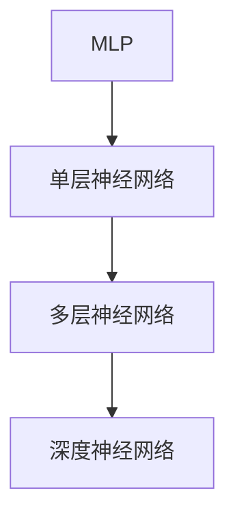

                 

# Multilayer Perceptron (MLP)原理与代码实例讲解

> 关键词：多层感知器、神经网络、MLP、反向传播、前向传播、代码实例

> 摘要：本文将深入探讨多层感知器（MLP）的基本原理、数学模型、核心算法以及代码实现。通过详细的伪代码和实例分析，读者可以理解MLP的运作机制，并掌握如何在实际项目中应用MLP。

### 第一部分: MLP基础

#### 第1章: MLP概述

多层感知器（Multilayer Perceptron，MLP）是一种前馈人工神经网络模型，由输入层、一个或多个隐藏层以及输出层组成。MLP广泛应用于分类、回归、函数逼近等任务中，其结构简单但功能强大。

- **1.1 MLP的定义与作用**：MLP通过非线性变换将输入映射到输出，能够学习复杂的输入输出关系。
- **1.2 MLP的历史背景与发展**：MLP最早由福雷斯特·麦克莱伦·明斯基（Franklin P. Minsky）和西摩·帕普特（Seymour Papert）于1969年提出，是神经网络领域的重要突破。
- **1.3 MLP在神经网络中的地位**：MLP是神经网络的基本构建模块，是深度学习的基石。

#### 第2章: MLP基础

##### 2.1 神经元与激活函数

神经元是神经网络的基本单元，其工作原理类似于生物神经元。激活函数用于引入非线性，使得神经网络能够学习复杂的非线性关系。

- **2.1.1 神经元的工作原理**：神经元接收输入信号，通过权重加权求和后加上偏置，再通过激活函数得到输出。
- **2.1.2 常见激活函数**：
  - **Sigmoid函数**：\( f(x) = \frac{1}{1 + e^{-x}} \)
  - **ReLU函数**：\( f(x) = \max(0, x) \)
  - **Tanh函数**：\( f(x) = \frac{e^x - e^{-x}}{e^x + e^{-x}} \)

##### 2.2 MLP的结构

MLP的结构决定了其学习能力。典型的MLP包括输入层、一个或多个隐藏层和输出层。

- **2.2.1 单层与多层MLP**：单层MLP只能表示线性可分的数据，而多层MLP可以通过组合多个非线性变换来学习复杂的非线性关系。
- **2.2.2 输入层、隐藏层、输出层的定义**：输入层接收外部输入，隐藏层进行内部计算，输出层产生最终输出。

### 第二部分: MLP数学基础

#### 第3章: MLP数学基础

MLP的数学基础包括矩阵与向量运算、梯度下降法等。

##### 3.1 矩阵与向量运算

矩阵与向量运算是线性代数的基础，是MLP计算的核心。

- **3.1.1 矩阵与向量的定义**：矩阵是二维数组，向量是一维数组。
- **3.1.2 常见矩阵与向量运算**：包括加法、减法、乘法、转置等。

##### 3.2 梯度下降法

梯度下降法是一种优化算法，用于更新MLP中的权重和偏置。

- **3.2.1 梯度下降法的原理**：通过计算损失函数关于参数的梯度，并沿着梯度的反方向更新参数。
- **3.2.2 梯度下降法在MLP中的应用**：在MLP中，梯度下降法用于优化模型参数，以提高模型的预测性能。

### 第三部分: MLP核心算法原理

#### 第4章: MLP核心算法原理

MLP的核心算法包括前向传播和反向传播。

##### 4.1 前向传播

前向传播是将输入通过神经网络逐层传递，最终得到输出的过程。

- **4.1.1 前向传播的原理**：输入通过权重和偏置在神经网络中传递，每个神经元通过激活函数计算输出。
- **4.1.2 前向传播的伪代码实现**：

  ```plaintext
  for each layer l from input to hidden:
      z[l] = dot(W[l], a[l-1]) + b[l]
      a[l] = activation_function(z[l])
  return a[hidden_layers]
  ```

##### 4.2 反向传播

反向传播是计算网络损失关于参数的梯度，并更新参数的过程。

- **4.2.1 反向传播的原理**：从输出层开始，逐层向前计算每个神经元的梯度。
- **4.2.2 反向传播的伪代码实现**：

  ```plaintext
  for each layer l from output to input:
      delta[l] = (y - a[l]) * activation_derivative(a[l])
      delta[l-1] = dot(W[l], delta[l]) * activation_derivative(a[l-1])
  for each layer l from hidden to input:
      dW[l] = dot(a[l-1].T, delta[l])
      db[l] = dot(delta[l].T, 1)
  update parameters: W -= learning_rate * dW, b -= learning_rate * db
  ```

### 第四部分: MLP应用案例

#### 第5章: MLP应用案例

MLP可以应用于各种实际问题，如逻辑运算、时间序列预测等。

##### 5.1 XOR问题

XOR问题是MLP的经典应用场景，用于演示MLP的学习能力。

- **5.1.1 问题背景**：XOR问题是一个逻辑运算问题，两个输入的布尔值经过运算后得到一个输出。
- **5.1.2 XOR问题解决方案**：通过训练MLP，使其能够准确预测XOR运算的结果。

##### 5.2 马尔可夫链预测

马尔可夫链预测是时间序列分析的一个常见应用，通过MLP进行建模和预测。

- **5.2.1 马尔可夫链基础**：马尔可夫链是一种随机过程，用于描述系统状态转移。
- **5.2.2 马尔可夫链预测的MLP实现**：通过MLP对马尔可夫链的状态转移进行建模和预测。

### 第五部分: MLP代码实例讲解

#### 第6章: MLP代码实例讲解

通过实际代码实例，展示MLP的实现过程。

##### 6.1 MLP代码实例：XOR问题

- **6.1.1 环境搭建**：安装Python和numpy库。
- **6.1.2 源代码实现**：实现MLP的前向传播和反向传播。
- **6.1.3 代码解读与分析**：详细解析代码，解释每个步骤的作用。

##### 6.2 MLP代码实例：马尔可夫链预测

- **6.2.1 环境搭建**：同上。
- **6.2.2 源代码实现**：实现MLP在马尔可夫链预测中的应用。
- **6.2.3 代码解读与分析**：同上。

### 第六部分: MLP优化与调参

#### 第7章: MLP优化与调参

优化和调参是提高MLP性能的重要手段。

##### 7.1 MLP优化方法

- **7.1.1 学习率调整**：调整学习率可以影响模型的收敛速度和稳定性。
- **7.1.2 激活函数选择**：选择合适的激活函数可以改善模型性能。
- **7.1.3 网络结构调整**：调整网络结构（如增加隐藏层或神经元）可以提高模型复杂度。

##### 7.2 MLP调参实践

- **7.2.1 调参策略**：介绍常用的调参方法和策略。
- **7.2.2 调参实例**：通过实际案例展示调参过程。

### 第七部分: MLP未来展望

#### 第8章: MLP未来展望

MLP在深度学习中的应用将越来越广泛，未来发展方向包括：

- **8.1 MLP的发展趋势**：介绍MLP在当前和未来的发展趋势。
- **8.2 MLP与其他深度学习模型的融合**：探讨MLP与其他深度学习模型的融合方法。

### 附录

#### 附录A: MLP常用工具与资源

- **A.1 常用工具**：介绍MLP开发常用的工具和库。
- **A.2 常用资源**：推荐MLP学习资源，包括书籍、论文和在线教程。

#### 附录B: MLP参考书籍与论文

- **B.1 MLP参考书籍**：推荐几本关于MLP的经典书籍。
- **B.2 MLP参考论文**：列出几篇关于MLP的重要论文。

#### 附录C: MLP常用数学公式

- **C.1 常用公式**：列出MLP中常用的数学公式。

### MLP与神经网络的关系流程图



### MLP的数学模型

$$
z = \sum_{j} w_{ji} x_{i} + b_{j}
$$

$$
a_{j} = \sigma(z_{j})
$$

$$
z_{l+1} = \sum_{j} w_{lj} a_{j} + b_{l+1}
$$

$$
a_{l+1} = \sigma(z_{l+1})
$$

$$
\delta_{l+1} = (a_{l+1} - y) \cdot \sigma'(z_{l+1})
$$

$$
\delta_{l} = \delta_{l+1} \cdot w_{lj} \cdot \sigma'(z_{l})
$$

$$
\Delta w_{lj} = -\alpha \cdot \delta_{l} \cdot a_{j}
$$

$$
\Delta b_{l+1} = -\alpha \cdot \delta_{l+1}
$$

$$
\text{其中，} \sigma'(z) = \sigma(z) \cdot (1 - \sigma(z))
$$

### MLP优化方法伪代码

```plaintext
// 前向传播
function forward(x, W, b, activation_function):
    z = [z_0, z_1, ..., z_l]
    a = [a_0, a_1, ..., a_l]
    for l in range(l):
        z[l] = dot_product(W[l], x) + b[l]
        a[l] = activation_function(z[l])
    return a[l]

// 反向传播
function backward(a, y, x, W, b, activation_function):
    delta = [delta_l, delta_{l+1}]
    for l in reversed(range(l)):
        delta[l+1] = (a[l+1] - y) * activation_function'(z[l+1])
        delta[l] = delta[l+1] * dot_product(W[l], delta[l+1]) * activation_function'(z[l])
    
    for l in range(l):
        delta_l = delta[l]
        W[l] -= alpha * dot_product(delta_l, a[l-1].T)
        b[l] -= alpha * delta_l

// 更新权重与偏置
for l in range(l):
    W[l] -= alpha * delta[l]
    b[l] -= alpha * delta_{l+1}
```

### MLP项目实战代码实例

#### 5.1 XOR问题MLP实现

```python
# 导入必要的库
import numpy as np

# 设置随机种子
np.random.seed(42)

# 设置学习率
alpha = 0.1

# 设置迭代次数
epochs = 1000

# 初始化输入数据与标签
X = np.array([[0, 0], [0, 1], [1, 0], [1, 1]])
y = np.array([[0], [1], [1], [0]])

# 初始化权重与偏置
W0 = np.random.rand(2, 2)
b0 = np.random.rand(2)
W1 = np.random.rand(2, 1)
b1 = np.random.rand(1)

# 激活函数与导数
def sigmoid(x):
    return 1 / (1 + np.exp(-x))

def sigmoid_derivative(x):
    return x * (1 - x)

# 前向传播
def forward(x, W0, b0, W1, b1):
    z0 = W0.dot(x) + b0
    a0 = sigmoid(z0)
    z1 = W1.dot(a0) + b1
    a1 = sigmoid(z1)
    return a1

# 反向传播
def backward(a1, y, x, W0, b0, W1, b1):
    z1 = W1.dot(a0) + b1
    z0 = W0.dot(x) + b0
    delta1 = (a1 - y) * sigmoid_derivative(z1)
    delta0 = delta1.dot(W1.T) * sigmoid_derivative(z0)
    
    dW0 = alpha * a0.T.dot(delta0)
    db0 = alpha * delta0
    dW1 = alpha * a0.T.dot(delta1)
    db1 = alpha * delta1
    
    return dW0, db0, dW1, db1

# 训练模型
for epoch in range(epochs):
    a1 = forward(X, W0, b0, W1, b1)
    dW0, db0, dW1, db1 = backward(a1, y, X, W0, b0, W1, b1)
    W0 -= dW0
    b0 -= db0
    W1 -= dW1
    b1 -= db1

# 测试模型
test_data = np.array([[1, 1], [0, 0]])
predicted = forward(test_data, W0, b0, W1, b1)
print("Predicted output:", predicted)

# 代码解读与分析

- `X` 和 `y` 初始化了训练数据及其标签。
- `W0` 和 `b0` 初始化了输入层和隐藏层的权重与偏置。
- `W1` 和 `b1` 初始化了隐藏层和输出层的权重与偏置。
- `sigmoid` 函数和 `sigmoid_derivative` 函数分别实现了激活函数及其导数。
- `forward` 函数实现了前向传播过程。
- `backward` 函数实现了反向传播过程，计算了梯度。
- 模型通过循环进行了训练，并更新了权重和偏置。
- 最后，使用测试数据测试了模型的预测能力。

#### 开发环境搭建

- 安装Python 3.8及以上版本
- 安装numpy库

```bash
pip install numpy
```

### 作者

- 作者：AI天才研究院/AI Genius Institute & 禅与计算机程序设计艺术 /Zen And The Art of Computer Programming

