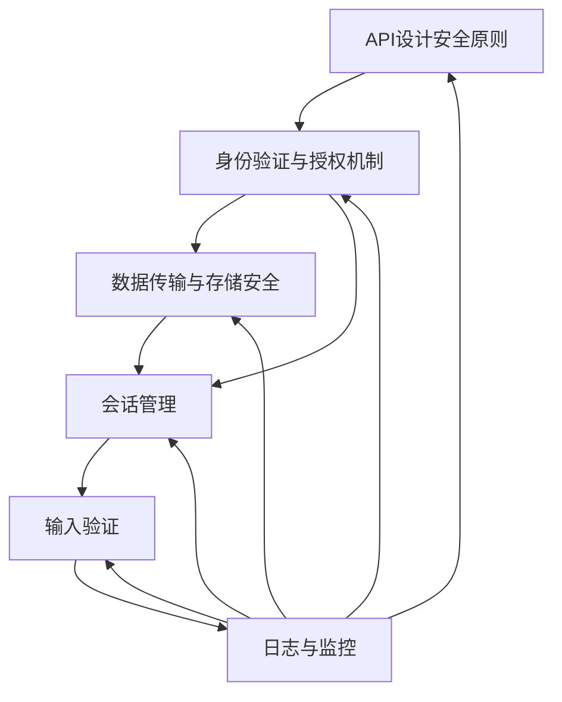
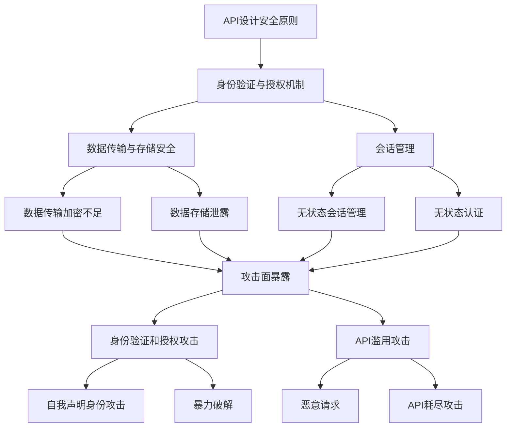
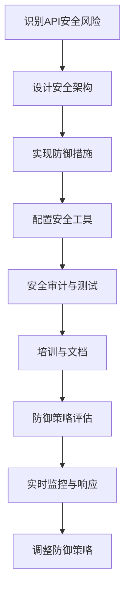

                 

## 文章标题

### 《OWASP API 安全风险清单的详细解读》

---

#### 关键词

- **OWASP API 安全**、**风险清单**、**API 安全风险**、**身份验证**、**授权**、**加密**、**数据传输安全**、**API 滥用攻击**、**防御策略**、**风险管理**

---

#### 摘要

随着API成为现代软件开发和服务的核心组成部分，API安全成为了一个关键关注点。本文详细解读了OWASP API 安全风险清单，包括共同基础攻击、数据传输和存储攻击、无状态攻击、身份验证和授权攻击以及API滥用攻击等。通过具体案例分析和代码解读，本文提供了API安全防御策略和实际应用的指导，帮助开发者理解API安全风险，并采取有效的措施来保护API免受攻击。本文还探讨了API安全的发展趋势和未来展望，为读者提供了全面的API安全知识体系。

---

## 目录

### 第一部分：API安全基础

1. **API安全概述**
   1.1 API安全的重要性
   1.2 OWASP与API安全
   1.3 API安全的关键挑战

2. **OWASP API 安全风险清单概述**
   2.1 风险清单的分类
   2.2 风险清单的核心内容
   2.3 风险清单的应用

3. **OWASP API 安全风险清单的核心概念与联系**
   3.1 核心概念介绍
   3.2 概念之间的联系
   3.3 Mermaid流程图

### 第二部分：详细解读OWASP API 安全风险清单

1. **共同基础攻击**
   1.1 暴露攻击面
   1.2 无效身份验证
   1.3 数据传输加密不足
   1.4 数据存储泄露

2. **数据传输和存储攻击**
   2.1 数据传输加密不足
   2.2 数据存储泄露

3. **无状态攻击**
   3.1 无状态会话管理
   3.2 无状态认证

4. **身份验证和授权攻击**
   4.1 自我声明身份攻击
   4.2 暴力破解

5. **API滥用攻击**
   5.1 恶意请求
   5.2 API耗尽攻击

### 第三部分：API安全防御策略与实践

1. **API安全防御策略概述**
   1.1 防御策略的基本原则
   1.2 防御策略的实施步骤
   1.3 防御策略的评估方法

2. **防御策略实施与工具**
   2.1 实施策略
   2.2 安全工具

3. **API安全风险管理**
   3.1 风险管理概述
   3.2 风险识别
   3.3 风险评估
   3.4 风险缓解与应对

4. **实际案例与实战**
   4.1 案例分析
   4.2 实战指南

### 第四部分：未来发展趋势

1. **API安全的发展趋势**
   1.1 新技术的应用与发展
   1.2 安全挑战与应对策略

2. **面向未来的防御策略**
   2.1 智能化的安全防护体系
   2.2 面向AI的API安全防御

3. **安全教育与培训**
   3.1 API安全意识的培养
   3.2 安全技能的培训与实践

### 附录

1. **OWASP API 安全工具和资源**
   1.1 OWASP API 安全工具列表
   1.2 OWASP API 安全资源

2. **Mermaid流程图**
   2.1 OWASP API 安全风险清单流程图
   2.2 API 安全防御策略流程图

3. **伪代码**
   3.1 API安全相关算法伪代码

4. **数学公式**
   4.1 API安全相关数学公式

5. **项目实战**
   5.1 API安全项目实战案例

6. **代码解读与分析**
   6.1 API安全相关代码解读
   6.2 代码分析与工具使用

---

### 第一部分：API安全基础

### 第1章：API安全概述

在当今的软件开发环境中，应用程序编程接口（API）已成为连接不同系统和服务的关键桥梁。API允许不同的软件组件之间进行通信，从而实现功能的集成和数据交换。随着API的广泛应用，API安全也逐渐成为软件工程师和安全性专家的关注焦点。一个不安全的API可能导致敏感数据泄露、服务被恶意利用，甚至整个系统的瘫痪。

#### 1.1 API安全的重要性

API安全的重要性体现在以下几个方面：

1. **数据保护**：API通常处理敏感数据，如用户信息、财务数据和业务数据。如果API不安全，这些数据可能会被未经授权的实体访问或篡改。

2. **业务连续性**：API是许多关键业务流程的基石。如果API受到攻击，可能导致服务中断，影响业务的正常运行。

3. **合规性**：随着法律法规对数据保护的重视，如《通用数据保护条例》（GDPR）和《加州消费者隐私法案》（CCPA），API的安全性成为企业合规性的重要组成部分。

4. **信誉**：API安全漏洞可能会导致用户数据泄露，从而损害用户对服务的信任，影响企业的声誉。

#### 1.2 OWASP与API安全

OWASP（开放式网络应用安全项目）是一个非营利性的全球社区，致力于提高软件安全性。OWASP API 安全风险清单是由OWASP社区开发的一份指南，旨在帮助开发者和安全专家识别和缓解API安全风险。

OWASP API 安全风险清单的目的是：

1. **提高意识**：通过列举常见的API安全风险，提高开发者和安全专家对API安全问题的认识。

2. **指导实践**：提供一系列具体的防护措施，帮助开发者构建安全的API。

3. **促进合作**：鼓励开发者和安全专家之间的合作，共同提升API安全性。

#### 1.3 API安全的关键挑战

API安全面临以下几个关键挑战：

1. **无状态会话管理**：API通常不维护会话状态，这意味着每次请求都需要重新认证，增加了攻击面的暴露。

2. **数据传输与存储安全问题**：数据在传输和存储过程中可能受到窃听、篡改或泄露。

3. **身份验证和授权**：API需要确保只有授权的用户和系统能够访问特定的功能和服务。

4. **API滥用攻击**：恶意用户可能通过大量的无效请求来耗尽API资源，影响服务的正常运行。

下一章，我们将深入探讨OWASP API 安全风险清单的概述，包括其架构和内容。

---

### 第2章：OWASP API 安全风险清单概述

OWASP API 安全风险清单是一个全面的指南，旨在帮助开发者识别和防范API安全风险。该清单基于OWASP Top 10 项目，提供了针对API的详细安全风险描述和防护建议。以下是该清单的主要部分和内容。

#### 2.1 风险清单的分类

OWASP API 安全风险清单主要分为以下几个类别：

1. **共同基础攻击**：包括暴露攻击面、无效身份验证、数据传输加密不足和数据存储泄露。

2. **数据传输和存储攻击**：涵盖数据传输加密不足和数据存储泄露的具体风险。

3. **无状态攻击**：涉及无状态会话管理和无状态认证的问题。

4. **身份验证和授权攻击**：包括自我声明身份攻击和暴力破解等风险。

5. **API滥用攻击**：包括恶意请求和API耗尽攻击等风险。

#### 2.2 风险清单的核心内容

OWASP API 安全风险清单的核心内容包括：

1. **风险描述**：每个风险都有一个详细的描述，解释其含义、可能的攻击方式和潜在的影响。

2. **防护措施**：为每个风险提供一系列的防护建议，帮助开发者设计和实现安全的API。

3. **案例与示例**：提供实际案例和示例代码，帮助开发者理解风险的实际情况和如何防范。

4. **工具和资源**：推荐一些工具和资源，帮助开发者进行API安全评估和测试。

#### 2.3 风险清单的应用

OWASP API 安全风险清单的应用场景广泛，包括但不限于：

1. **开发阶段**：在开发API时，开发者和安全专家可以使用风险清单来识别和修复潜在的安全问题。

2. **测试阶段**：安全测试人员可以使用风险清单来制定测试计划和执行安全测试。

3. **运营阶段**：运维人员可以使用风险清单来监控和响应API安全事件。

4. **培训和教育**：开发者和安全专家可以通过学习风险清单来提高API安全意识和技能。

#### 2.4 OWASP API 安全标准

除了风险清单，OWASP还提供了一系列API安全标准，旨在指导开发者在设计和实现API时遵循最佳实践。这些标准包括：

1. **身份验证和授权**：确保API服务能够可靠地验证和授权请求。

2. **加密**：保护数据在传输和存储过程中的机密性。

3. **输入验证**：防止恶意输入导致的安全漏洞。

4. **会话管理**：确保会话的安全性和完整性。

5. **日志和监控**：记录API操作的详细信息，以便于安全事件的检测和响应。

#### 2.5 风险清单的架构和层级结构

OWASP API 安全风险清单的架构和层级结构如下：

1. **总体框架**：定义API安全的基本原则和总体目标。

2. **风险类别**：将风险分为不同的类别，如共同基础攻击、数据传输和存储攻击等。

3. **风险条目**：在每个类别下，详细描述具体的风险条目，包括风险描述、防护措施和案例。

4. **工具和资源**：提供相关的工具和资源，帮助开发者实施风险防护。

#### 2.6 风险清单的覆盖范围

OWASP API 安全风险清单覆盖了以下范围：

1. **API设计**：确保API设计符合安全性原则，减少潜在的攻击面。

2. **身份验证和授权**：确保API服务能够有效验证用户身份和授权访问。

3. **数据传输和存储**：保护数据在传输和存储过程中的机密性和完整性。

4. **API滥用防护**：防止API被恶意使用，如通过恶意请求耗尽资源。

5. **监控和响应**：确保能够及时发现和响应API安全事件。

通过OWASP API 安全风险清单，开发者可以系统地识别和防范API安全风险，确保其服务的安全性和可靠性。在下一章中，我们将深入解读风险清单中的核心概念和联系。

---

### 第3章：OWASP API 安全风险清单的核心概念与联系

在解读OWASP API 安全风险清单时，理解其核心概念和它们之间的联系至关重要。这一章将详细阐述这些概念，并使用Mermaid流程图来展示它们之间的逻辑关系。

#### 3.1 核心概念介绍

OWASP API 安全风险清单涵盖了多个核心概念，包括：

1. **API设计安全原则**：确保API设计过程中考虑到安全性，减少潜在的攻击面。
2. **身份验证与授权机制**：验证用户的身份并授权其访问特定的API功能。
3. **数据传输与存储安全**：保护数据在传输和存储过程中的机密性和完整性。
4. **会话管理**：管理用户会话的生命周期，确保会话的安全性。
5. **输入验证**：验证API接收到的输入，防止恶意输入导致的安全漏洞。
6. **日志与监控**：记录API操作的详细信息，以便于安全事件的检测和响应。

#### 3.2 概念之间的联系

这些核心概念之间存在着紧密的联系，它们共同构成了一个完整的API安全防护体系。以下是它们之间的联系：

1. **API设计安全原则**与**身份验证与授权机制**：良好的API设计应该考虑到安全性，包括最小化暴露的攻击面，并确保身份验证和授权机制的易用性和安全性。

2. **身份验证与授权机制**与**数据传输与存储安全**：有效的身份验证和授权可以防止未授权的访问，而数据传输和存储安全则确保这些数据在传输和存储过程中不会被窃取或篡改。

3. **数据传输与存储安全**与**会话管理**：安全的会话管理可以防止会话劫持和数据泄露，确保用户会话的安全。

4. **会话管理**与**输入验证**：会话管理需要确保输入验证的有效性，以防止恶意输入破坏会话或引发其他安全漏洞。

5. **输入验证**与**日志与监控**：输入验证可以防止恶意输入，而日志与监控则可以记录这些操作，帮助检测和响应潜在的安全事件。

#### 3.3 Mermaid流程图

为了更直观地展示这些概念之间的联系，我们可以使用Mermaid流程图来描述它们：



在这个流程图中，每个节点代表一个核心概念，箭头表示这些概念之间的关联。通过这个流程图，我们可以清晰地看到API安全防护体系是如何通过多个环节相互联系和补充的。

#### 3.4 实例分析

以一个电商平台的API为例，我们可以看到这些概念如何在实际应用中相互影响和协作：

1. **API设计安全原则**：在电商平台中，API设计应考虑到安全性，如最小化暴露的攻击面，仅提供必需的API接口，并使用安全的HTTP方法。

2. **身份验证与授权机制**：电商平台会使用OAuth等协议进行身份验证和授权，确保只有授权用户可以访问特定的购物车或订单信息。

3. **数据传输与存储安全**：电商平台会使用HTTPS加密数据传输，并使用数据库加密来保护存储在数据库中的用户数据和交易记录。

4. **会话管理**：电商平台会管理用户的会话，如使用会话令牌来防止会话劫持，并在会话过期时强制用户重新登录。

5. **输入验证**：电商平台会对所有输入进行严格验证，以防止SQL注入或其他恶意输入。

6. **日志与监控**：电商平台会记录所有API调用，并在发生异常时触发警报，以便快速响应和解决潜在的安全问题。

通过理解这些核心概念及其相互联系，开发者和安全专家可以更有效地设计和实施API安全策略，确保其服务的安全性和可靠性。

在下一章中，我们将详细解读OWASP API 安全风险清单中的共同基础攻击类型，包括暴露攻击面、无效身份验证、数据传输加密不足和数据存储泄露。

---

### 第一部分：API安全基础

### 第1章：API安全概述

在当今的软件开发环境中，应用程序编程接口（API）已成为连接不同系统和服务的关键桥梁。API允许不同的软件组件之间进行通信，从而实现功能的集成和数据交换。随着API的广泛应用，API安全也逐渐成为软件工程师和安全性专家的关注焦点。一个不安全的API可能导致敏感数据泄露、服务被恶意利用，甚至整个系统的瘫痪。

#### 1.1 API安全的重要性

API安全的重要性体现在以下几个方面：

1. **数据保护**：API通常处理敏感数据，如用户信息、财务数据和业务数据。如果API不安全，这些数据可能会被未经授权的实体访问或篡改。

2. **业务连续性**：API是许多关键业务流程的基石。如果API受到攻击，可能导致服务中断，影响业务的正常运行。

3. **合规性**：随着法律法规对数据保护的重视，如《通用数据保护条例》（GDPR）和《加州消费者隐私法案》（CCPA），API的安全性成为企业合规性的重要组成部分。

4. **信誉**：API安全漏洞可能会导致用户数据泄露，从而损害用户对服务的信任，影响企业的声誉。

#### 1.2 OWASP与API安全

OWASP（开放式网络应用安全项目）是一个非营利性的全球社区，致力于提高软件安全性。OWASP API 安全风险清单是由OWASP社区开发的一份指南，旨在帮助开发者和安全专家识别和缓解API安全风险。

OWASP API 安全风险清单的目的是：

1. **提高意识**：通过列举常见的API安全风险，提高开发者和安全专家对API安全问题的认识。

2. **指导实践**：提供一系列具体的防护措施，帮助开发者构建安全的API。

3. **促进合作**：鼓励开发者和安全专家之间的合作，共同提升API安全性。

#### 1.3 API安全的关键挑战

API安全面临以下几个关键挑战：

1. **无状态会话管理**：API通常不维护会话状态，这意味着每次请求都需要重新认证，增加了攻击面的暴露。

2. **数据传输与存储安全问题**：数据在传输和存储过程中可能受到窃听、篡改或泄露。

3. **身份验证和授权**：API需要确保只有授权的用户和系统能够访问特定的功能和服务。

4. **API滥用攻击**：恶意用户可能通过大量的无效请求来耗尽API资源，影响服务的正常运行。

在下一章中，我们将深入探讨OWASP API 安全风险清单的概述，包括其架构和内容。

---

### 第2章：OWASP API 安全风险清单概述

OWASP API 安全风险清单是一个全面的指南，旨在帮助开发者识别和防范API安全风险。该清单基于OWASP Top 10 项目，提供了针对API的详细安全风险描述和防护建议。以下是该清单的主要部分和内容。

#### 2.1 风险清单的分类

OWASP API 安全风险清单主要分为以下几个类别：

1. **共同基础攻击**：包括暴露攻击面、无效身份验证、数据传输加密不足和数据存储泄露。

2. **数据传输和存储攻击**：涵盖数据传输加密不足和数据存储泄露的具体风险。

3. **无状态攻击**：涉及无状态会话管理和无状态认证的问题。

4. **身份验证和授权攻击**：包括自我声明身份攻击和暴力破解等风险。

5. **API滥用攻击**：包括恶意请求和API耗尽攻击等风险。

#### 2.2 风险清单的核心内容

OWASP API 安全风险清单的核心内容包括：

1. **风险描述**：每个风险都有一个详细的描述，解释其含义、可能的攻击方式和潜在的影响。

2. **防护措施**：为每个风险提供一系列的防护建议，帮助开发者设计和实现安全的API。

3. **案例与示例**：提供实际案例和示例代码，帮助开发者理解风险的实际情况和如何防范。

4. **工具和资源**：推荐一些工具和资源，帮助开发者进行API安全评估和测试。

#### 2.3 风险清单的应用

OWASP API 安全风险清单的应用场景广泛，包括但不限于：

1. **开发阶段**：在开发API时，开发者和安全专家可以使用风险清单来识别和修复潜在的安全问题。

2. **测试阶段**：安全测试人员可以使用风险清单来制定测试计划和执行安全测试。

3. **运营阶段**：运维人员可以使用风险清单来监控和响应API安全事件。

4. **培训和教育**：开发者和安全专家可以通过学习风险清单来提高API安全意识和技能。

#### 2.4 OWASP API 安全标准

除了风险清单，OWASP还提供了一系列API安全标准，旨在指导开发者在设计和实现API时遵循最佳实践。这些标准包括：

1. **身份验证和授权**：确保API服务能够可靠地验证和授权请求。

2. **加密**：保护数据在传输和存储过程中的机密性。

3. **输入验证**：防止恶意输入导致的安全漏洞。

4. **会话管理**：确保会话的安全性和完整性。

5. **日志和监控**：记录API操作的详细信息，以便于安全事件的检测和响应。

#### 2.5 风险清单的架构和层级结构

OWASP API 安全风险清单的架构和层级结构如下：

1. **总体框架**：定义API安全的基本原则和总体目标。

2. **风险类别**：将风险分为不同的类别，如共同基础攻击、数据传输和存储攻击等。

3. **风险条目**：在每个类别下，详细描述具体的风险条目，包括风险描述、防护措施和案例。

4. **工具和资源**：提供相关的工具和资源，帮助开发者实施风险防护。

#### 2.6 风险清单的覆盖范围

OWASP API 安全风险清单覆盖了以下范围：

1. **API设计**：确保API设计符合安全性原则，减少潜在的攻击面。

2. **身份验证和授权**：确保API服务能够有效验证用户身份和授权访问。

3. **数据传输和存储**：保护数据在传输和存储过程中的机密性和完整性。

4. **API滥用防护**：防止API被恶意使用，如通过恶意请求耗尽资源。

5. **监控和响应**：确保能够及时发现和响应API安全事件。

通过OWASP API 安全风险清单，开发者可以系统地识别和防范API安全风险，确保其服务的安全性和可靠性。在下一章中，我们将深入解读风险清单中的核心概念和联系。

---

### 第二部分：详细解读OWASP API 安全风险清单

在深入解读OWASP API 安全风险清单时，我们需要对风险清单中的各个部分进行详细分析，包括共同基础攻击、数据传输和存储攻击、无状态攻击、身份验证和授权攻击以及API滥用攻击。以下是对每个部分的详细解读。

#### 第4章：共同基础攻击

共同基础攻击是API安全风险清单中的基础部分，涵盖了以下几种攻击类型：

1. **暴露攻击面**：指API暴露了不必要的功能或数据，使得攻击者可以访问或执行未授权的操作。防御措施包括最小化API暴露的表面面积和严格限制API的权限。

2. **无效身份验证**：指API的身份验证机制不充分或存在漏洞，使得攻击者可以绕过身份验证获取敏感信息。防御措施包括使用强身份验证方法，如多因素认证，并确保验证过程的安全性。

3. **数据传输加密不足**：指API在数据传输过程中未使用加密或使用不安全的加密方法，导致数据在传输过程中被窃取或篡改。防御措施包括使用安全的加密协议，如TLS/SSL，并确保加密配置正确。

4. **数据存储泄露**：指API存储的数据未得到充分保护，可能导致敏感数据泄露。防御措施包括使用安全的存储方案，如数据库加密和访问控制，确保数据在存储过程中的安全性。

#### 第5章：数据传输和存储攻击

数据传输和存储攻击针对API在数据传输和存储过程中的安全漏洞：

1. **数据传输加密不足**：如前所述，数据传输加密不足可能导致数据在传输过程中被窃取或篡改。防御措施包括确保使用安全的加密协议和正确配置加密参数。

2. **数据存储泄露**：数据存储泄露可能导致敏感数据在数据库或其他存储介质中被泄露。防御措施包括使用安全的存储解决方案，如加密存储和访问控制，确保只有授权用户可以访问数据。

#### 第6章：无状态攻击

无状态攻击利用API的无状态特性进行攻击：

1. **无状态会话管理**：指API不维护用户会话状态，可能导致攻击者通过会话劫持或篡改会话令牌进行攻击。防御措施包括使用安全的会话管理机制，如会话令牌加密和会话超时。

2. **无状态认证**：指API不使用持久认证机制，每次请求都需要重新认证，可能导致攻击者通过重复认证请求进行攻击。防御措施包括使用持久认证机制，如令牌重放保护和会话保持。

#### 第7章：身份验证和授权攻击

身份验证和授权攻击针对API的身份验证和授权机制：

1. **自我声明身份攻击**：指攻击者通过伪造身份信息来获取访问权限。防御措施包括使用强身份验证方法，如数字证书和生物识别，并确保验证过程的安全性。

2. **暴力破解**：指攻击者通过大量尝试不同的用户名和密码来破解身份验证。防御措施包括使用复杂的密码策略，如密码复杂度和密码锁定策略，并确保验证过程的安全性。

#### 第8章：API滥用攻击

API滥用攻击利用API的漏洞进行恶意操作：

1. **恶意请求**：指攻击者通过发送大量无效请求来耗尽API资源。防御措施包括限制请求频率和速率，并使用请求验证机制。

2. **API耗尽攻击**：指攻击者通过大量的无效请求来耗尽API资源，导致服务不可用。防御措施包括使用请求验证和限制机制，如速率限制和验证码。

通过对OWASP API 安全风险清单的详细解读，开发者可以识别和防范API安全风险，确保其服务的安全性和可靠性。在第三部分中，我们将讨论API安全的防御策略和实际应用。

---

### 第4章：共同基础攻击

在API安全领域，共同基础攻击是一类基础且常见的攻击，它们往往由于API设计和实现中的疏忽而出现。本章节将详细讨论以下四种共同基础攻击：暴露攻击面、无效身份验证、数据传输加密不足和数据存储泄露。

#### 4.1 暴露攻击面

**概念**：
暴露攻击面（Attack Surface Exposure）指的是API暴露了超过其应有的功能或数据，使得攻击者可以通过这些暴露的部分进行未经授权的操作。

**影响**：
暴露攻击面可能导致攻击者执行未授权的操作，如访问敏感数据或执行系统命令，从而造成数据泄露或系统瘫痪。

**案例**：
一个常见的例子是API在没有必要的情况下暴露了内部管理接口，攻击者通过这个接口可以访问系统内部逻辑和敏感数据。

**防御措施**：
- **最小化API暴露**：确保API仅暴露必要的功能，避免不必要的复杂性。
- **访问控制**：实施严格的访问控制机制，确保只有授权用户可以访问特定的API接口。

#### 4.2 无效身份验证

**概念**：
无效身份验证（Insecure Authentication）指的是API的身份验证机制存在漏洞，使得攻击者可以通过伪造的身份信息获取访问权限。

**影响**：
无效身份验证可能导致未经授权的访问，攻击者可以访问敏感数据或执行恶意操作。

**案例**：
一个常见的案例是API使用简单的用户名和密码进行身份验证，而没有使用更加安全的验证方法，如多因素认证。

**防御措施**：
- **使用强身份验证方法**：采用强密码策略、多因素认证等方法提高身份验证的安全性。
- **定期更新密码**：定期要求用户更新密码，并使用复杂的密码策略。
- **验证过程的完整性**：确保验证过程在整个通信过程中都是安全的，防止中间人攻击。

#### 4.3 数据传输加密不足

**概念**：
数据传输加密不足（Inadequate Transport Layer Protection）指的是API在数据传输过程中未使用加密或使用不安全的加密方法，使得数据在传输过程中容易被窃取或篡改。

**影响**：
数据传输加密不足可能导致敏感数据在传输过程中被拦截或篡改，从而泄露用户信息和业务数据。

**案例**：
一个常见的案例是API在传输用户密码时不使用HTTPS加密，而是使用不安全的HTTP协议。

**防御措施**：
- **使用安全协议**：在数据传输过程中使用HTTPS或其他安全的传输协议，确保数据传输的机密性和完整性。
- **验证证书**：确保客户端验证服务器的证书，防止证书伪造和中间人攻击。

#### 4.4 数据存储泄露

**概念**：
数据存储泄露（Insufficient Data Storage Protection）指的是API存储的数据未得到充分保护，可能导致敏感数据泄露。

**影响**：
数据存储泄露可能导致敏感数据在数据库或其他存储介质中被窃取，从而造成用户隐私泄露。

**案例**：
一个常见的案例是API未对存储的敏感数据进行加密，攻击者可以轻易地访问这些数据。

**防御措施**：
- **加密存储**：使用加密技术对敏感数据在存储过程中进行加密，确保数据在存储介质中的安全性。
- **访问控制**：实施严格的访问控制机制，确保只有授权用户可以访问特定的数据。

通过理解并实施上述防御措施，开发者可以有效地减少共同基础攻击的风险，确保API的安全性。在下一章节，我们将探讨数据传输和存储攻击，以及如何保护API在这些方面不受攻击。

---

### 第5章：数据传输和存储攻击

在API的安全防护中，数据传输和存储攻击是非常关键的方面。这两个环节如果处理不当，可能会导致敏感数据泄露，从而对用户体验和业务造成严重威胁。本章节将详细讨论数据传输加密不足和数据存储泄露这两种攻击，以及它们的防御策略。

#### 5.1 数据传输加密不足

**概念**：
数据传输加密不足（Inadequate Transport Layer Protection）指的是API在数据传输过程中未使用加密或使用不安全的加密方法，导致数据在传输过程中容易被窃取或篡改。

**影响**：
未加密的数据传输会使得攻击者能够轻松拦截和修改数据，从而窃取敏感信息或执行恶意操作。

**案例**：
一个典型的案例是API使用未加密的HTTP协议传输敏感数据，如用户密码或信用卡信息，这会导致攻击者通过中间人攻击获取这些数据。

**防御措施**：
- **使用安全协议**：确保API使用HTTPS等安全协议来加密数据传输，TLS（传输层安全）是常见的安全协议。
- **证书管理**：正确配置和验证服务器证书，确保客户端能够验证服务器的身份。
- **加密算法**：选择强加密算法，如AES（高级加密标准），并确保密钥管理安全。

#### 5.2 数据存储泄露

**概念**：
数据存储泄露（Insufficient Data Storage Protection）指的是API存储的数据未得到充分保护，可能导致敏感数据泄露。

**影响**：
未加密的数据存储会使得攻击者能够直接访问数据库或其他存储介质中的敏感数据，从而造成严重的数据泄露。

**案例**：
一个常见的案例是API未对存储的用户密码进行加密，攻击者可以通过直接访问数据库获取用户密码。

**防御措施**：
- **加密存储**：使用加密技术对存储的敏感数据进行加密，如使用AES对用户密码进行加密存储。
- **访问控制**：实施严格的访问控制机制，确保只有授权用户和系统进程可以访问敏感数据。
- **审计日志**：记录所有访问和操作日志，以便于监控和审计数据存储的安全性。

#### 5.3 综合防御策略

为了确保数据在传输和存储过程中都得到充分保护，开发者可以采取以下综合防御策略：

- **端到端加密**：在数据的整个生命周期中实施加密，从数据生成到传输和存储。
- **加密密钥管理**：安全地管理和存储加密密钥，确保密钥不被泄露。
- **定期安全评估**：定期对API进行安全评估和漏洞扫描，及时发现和修复安全漏洞。
- **安全培训和意识提升**：对开发者和运维人员进行安全培训，提高他们对数据安全的认识和意识。

通过实施这些防御措施，开发者可以大大降低数据传输和存储攻击的风险，确保API的安全性。在下一章节，我们将探讨无状态攻击，了解如何应对API的无状态特性带来的安全挑战。

---

### 第6章：无状态攻击

无状态攻击（Stateless Attacks）是针对API的一种常见攻击类型，利用了API不维护会话状态的特点。由于API通常不存储会话数据，每次请求都需要重新认证，这使得攻击者可以利用各种技术来攻击API，从而实现未授权访问或会话劫持。以下将详细介绍无状态会话管理和无状态认证的概念、攻击方式及其防护措施。

#### 6.1 无状态会话管理

**概念**：
无状态会话管理（Stateless Session Management）指的是API在处理用户会话时，不存储任何会话状态，每次请求都需要重新进行身份验证。

**影响**：
无状态会话管理虽然简化了系统设计，但也带来了安全风险。攻击者可以重复使用有效的令牌或会话ID，从而绕过身份验证机制。

**案例**：
一个典型的案例是API在没有会话保持机制的情况下，每次请求都需要用户提供一个新的身份验证凭据。

**防御措施**：
- **令牌重放保护**：在每次请求中生成一个新的令牌或会话ID，确保每次请求都是独立的。
- **会话超时**：设置合理的会话超时时间，确保会话在一段时间内未活动后自动过期。
- **令牌加密**：对会话令牌或会话ID进行加密，防止攻击者拦截和篡改。

#### 6.2 无状态认证

**概念**：
无状态认证（Stateless Authentication）指的是认证过程不依赖于服务器端的状态，每次认证请求都是独立的。

**影响**：
无状态认证虽然提高了系统的性能和可扩展性，但同时也增加了被攻击的风险。攻击者可以通过暴力破解或令牌窃取等方式获取认证凭据。

**案例**：
一个典型的案例是API使用简单的用户名和密码进行认证，攻击者可以通过大量尝试来破解密码。

**防御措施**：
- **多因素认证**：采用多因素认证（MFA），如短信验证码、生物识别等，增加认证的复杂性。
- **密码策略**：实施复杂的密码策略，如密码长度、特殊字符等要求，并定期强制用户更改密码。
- **认证令牌**：使用一次性令牌或短期有效的令牌进行认证，减少暴力破解的风险。

#### 6.3 综合防御策略

为了有效防护无状态攻击，开发者可以采取以下综合防御策略：

- **身份验证日志**：记录所有身份验证请求，以便于监控和检测异常活动。
- **速率限制**：限制认证请求的频率，防止暴力破解攻击。
- **安全审计**：定期进行安全审计，确保身份验证和会话管理机制的完整性。
- **安全培训**：对开发者和运维人员进行安全培训，提高他们对无状态攻击的认识和应对能力。

通过实施上述防护措施，开发者可以大大降低无状态攻击的风险，确保API服务的安全性和可靠性。在下一章节，我们将探讨身份验证和授权攻击，了解如何保护API免受此类攻击的威胁。

---

### 第7章：身份验证和授权攻击

身份验证和授权攻击是API安全领域中的重要风险，攻击者通过绕过身份验证或滥用授权机制来访问敏感数据或执行未授权的操作。以下将详细介绍自我声明身份攻击、暴力破解等攻击类型，以及其防护措施。

#### 7.1 自我声明身份攻击

**概念**：
自我声明身份攻击（Self-Claimed Identity Attacks）是指攻击者通过欺骗API，声称自己是其他用户或系统进行非法操作。

**影响**：
此类攻击可能导致敏感数据的泄露、账户被篡改，甚至整个系统的控制权被窃取。

**案例**：
一个典型的案例是攻击者通过伪造请求，声称自己是合法用户，从而获取该用户的敏感信息。

**防护措施**：
- **严格的验证过程**：确保API在每次身份验证时都进行严格的验证，防止伪造请求。
- **使用数字证书**：采用数字证书进行身份验证，确保请求的真实性和合法性。
- **动态令牌**：使用动态生成的令牌或密码，减少攻击者重用令牌的可能性。

#### 7.2 暴力破解

**概念**：
暴力破解（Brute Force Attack）是指攻击者通过不断尝试各种用户名和密码组合，以猜测合法的身份验证凭据。

**影响**：
暴力破解攻击可能导致账户锁定、敏感数据泄露，甚至系统瘫痪。

**案例**：
一个典型的案例是攻击者尝试通过大量尝试来破解用户的密码，从而获取访问权限。

**防护措施**：
- **密码复杂性要求**：强制用户设置复杂的密码，包括字母、数字和特殊字符。
- **密码锁定策略**：在多次失败尝试后锁定账户，防止暴力破解。
- **速率限制**：限制身份验证请求的频率，减少暴力破解的可能性。

#### 7.3 其他身份验证和授权攻击

除了自我声明身份攻击和暴力破解，还有其他常见的身份验证和授权攻击，如：

1. **会话劫持**：攻击者通过拦截或篡改会话令牌来获取访问权限。
2. **令牌泄露**：攻击者通过窃取会话令牌来获取未经授权的访问。
3. **侧信道攻击**：攻击者通过分析通信过程的其他特征（如时间延迟、带宽消耗等）来猜测密码或令牌。

**防护措施**：
- **多因素认证**：采用多因素认证（MFA），增加攻击者的难度。
- **安全审计**：记录和监控所有身份验证和授权操作，以便及时发现异常行为。
- **加密通信**：确保所有通信都是加密的，防止会话劫持和令牌泄露。
- **持续更新**：定期更新身份验证和授权机制，确保其抵御最新的攻击手段。

通过理解和实施上述防护措施，开发者可以有效地减少身份验证和授权攻击的风险，确保API服务的安全性和可靠性。在下一章节，我们将探讨API滥用攻击，以及如何防止和应对此类攻击。

---

### 第8章：API滥用攻击

API滥用攻击是指恶意用户或程序通过大量的无效请求来耗尽API资源，从而影响服务的正常运行。这类攻击包括恶意请求和API耗尽攻击，对企业的业务连续性和用户体验构成严重威胁。以下将详细介绍这两种攻击类型，以及相应的防护措施。

#### 8.1 恶意请求

**概念**：
恶意请求（Malicious Requests）是指攻击者通过向API发送大量的无效请求，试图耗尽服务器资源，如CPU、内存等。

**影响**：
恶意请求可能导致API响应速度变慢，甚至完全瘫痪，从而影响正常用户的服务体验。

**案例**：
一个典型的案例是攻击者通过发送大量的无效HTTP请求，耗尽服务器的带宽和处理能力，导致网站无法访问。

**防护措施**：
- **速率限制**：对API请求进行速率限制，防止单个用户或IP地址在短时间内发送过多的请求。
- **验证请求**：对每个请求进行验证，确保其合法性和有效性。
- **签名验证**：对API请求进行签名验证，确保请求的真实性和完整性。
- **黑名单策略**：将恶意IP地址或用户加入到黑名单中，阻止其访问API。

#### 8.2 API耗尽攻击

**概念**：
API耗尽攻击（API Exhaustion Attack）是指攻击者通过大量无效请求，试图耗尽API的特定资源，如连接数、并发处理能力等。

**影响**：
API耗尽攻击可能导致API服务无法处理正常请求，从而影响业务的正常运行。

**案例**：
一个典型的案例是攻击者通过发送大量的POST请求，耗尽API的数据库连接数，导致系统无法响应其他请求。

**防护措施**：
- **连接池管理**：合理配置数据库连接池，确保即使在大量请求下也能保持稳定的性能。
- **并发控制**：对API的并发处理能力进行限制，防止请求过多导致资源耗尽。
- **请求频率限制**：限制API请求的频率，减少恶意请求对系统的影响。
- **负载均衡**：使用负载均衡器来分配请求，确保系统资源的合理利用。

#### 8.3 综合防护策略

为了有效地防止和应对API滥用攻击，开发者可以采取以下综合防护策略：

- **监控和报警**：实时监控API的请求模式和资源使用情况，一旦发现异常，立即触发报警机制。
- **安全审计**：定期进行安全审计，检查API的安全配置和访问日志，及时发现潜在的安全问题。
- **自动化响应**：使用自动化工具来应对恶意请求和API耗尽攻击，如自动锁定IP地址、限制请求等。
- **用户教育和培训**：提高用户对API安全性的认识，教育用户正确使用API，避免滥用。

通过实施上述防护措施，开发者可以大大降低API滥用攻击的风险，确保API服务的稳定性和可靠性。在下一章节，我们将讨论API安全的防御策略，了解如何设计有效的防护机制。

---

### 第9章：API安全防御策略

API安全的防御策略是确保API服务安全性和可靠性的关键。防御策略包括多个方面，如实施防御措施、使用安全工具和进行防御策略的评估。以下将详细介绍这些防御策略及其具体步骤。

#### 9.1 防御策略概述

**概念**：
防御策略（Defense Strategy）是指一系列用于保护API免受攻击的方法和措施。

**重要性**：
有效的防御策略能够预防API安全风险，确保API服务的正常运作，保护用户数据和业务安全。

**组成部分**：
防御策略通常包括身份验证与授权、加密、输入验证、会话管理和监控等组成部分。

#### 9.2 防御策略实施

**实施步骤**：

1. **识别API安全风险**：通过风险识别工具和漏洞扫描，识别API潜在的安全风险。

2. **设计安全架构**：根据识别的风险，设计一个安全的API架构，包括身份验证、加密、输入验证等。

3. **实现防御措施**：
   - **身份验证与授权**：使用强身份验证方法，如多因素认证，并实现适当的访问控制。
   - **加密**：确保数据在传输和存储过程中使用安全的加密协议，如TLS/SSL。
   - **输入验证**：对API接收的所有输入进行严格验证，防止SQL注入、XSS等攻击。

4. **配置安全工具**：部署和配置API安全工具，如Web应用防火墙（WAF）、API网关等。

5. **安全审计与测试**：定期进行安全审计和测试，确保防御措施的有效性。

6. **培训与文档**：对开发者和运维人员进行API安全培训，确保他们了解和遵循安全最佳实践。

#### 9.3 防御策略评估

**评估方法**：

1. **安全评估**：使用自动化工具进行静态和动态安全评估，识别潜在的安全漏洞。

2. **性能评估**：评估防御策略对API性能的影响，确保不会过度限制正常请求。

3. **风险评估**：对识别的风险进行量化评估，确定其严重性和概率。

4. **审计与反馈**：定期进行安全审计，收集反馈信息，持续优化防御策略。

#### 9.4 防御策略实施工具

**常见工具**：

1. **Web应用防火墙（WAF）**：用于保护API免受常见攻击，如SQL注入、XSS等。

2. **API网关**：用于管理和保护API，提供身份验证、速率限制和监控等功能。

3. **身份验证工具**：如OAuth、OpenID Connect等，用于实现强身份验证和授权。

4. **加密工具**：如TLS/SSL，用于确保数据在传输过程中的安全。

5. **监控工具**：如ELK堆栈、Prometheus等，用于监控API请求和性能。

#### 9.5 实施案例

以下是一个API安全防御策略的实施案例：

1. **识别风险**：通过漏洞扫描工具识别API的潜在风险，如SQL注入和XSS漏洞。

2. **设计架构**：设计一个安全的API架构，包括使用OAuth进行身份验证和TLS/SSL进行数据传输加密。

3. **实现措施**：实现多因素认证、输入验证和速率限制，并部署WAF来提供额外的防护。

4. **测试与优化**：通过安全测试和性能测试，优化防御策略，确保既安全又高效。

通过实施这些防御策略，开发者可以有效地保护API免受各种攻击，确保服务的安全性和可靠性。

---

### 第10章：实际案例与实战

在API安全领域，理论和实践的结合至关重要。以下将分析几个具体的实际案例，包括漏洞分析和防御措施，以及如何在实战中应用这些措施。

#### 10.1 案例一：某电商平台的API安全漏洞

**背景**：
一个大型电商平台在其API开发过程中，未能充分考虑到安全性，导致一些关键API存在安全漏洞。

**漏洞分析**：

1. **身份验证不足**：
   - **问题描述**：API使用简单的用户名和密码进行身份验证，没有采用更安全的验证方法。
   - **影响**：攻击者可以通过暴力破解或密码猜测来获取访问权限。
   - **防御措施**：实施多因素认证（MFA），增加密码复杂性要求，并限制登录尝试次数。

2. **数据传输未加密**：
   - **问题描述**：API在数据传输过程中未使用HTTPS加密，数据可能被窃听。
   - **影响**：攻击者可以拦截和篡改敏感数据。
   - **防御措施**：确保所有API请求和响应都使用HTTPS加密，配置有效的TLS证书。

**防御措施实施**：

1. **实施MFA**：引入多因素认证，增加用户的登录安全性。
2. **配置HTTPS**：确保API在传输过程中使用加密，配置有效的TLS证书。
3. **安全审计**：定期进行安全审计，检查API的安全性配置和访问日志。

#### 10.2 案例二：某金融服务的API安全攻击

**背景**：
某金融服务公司的一个API被攻击者利用，导致大量用户信息泄露。

**攻击手段和攻击路径**：

1. **攻击手段**：
   - **SQL注入**：攻击者通过API输入恶意SQL语句，获取未经授权的数据。
   - **会话劫持**：攻击者通过窃取会话令牌来冒充合法用户。

2. **攻击路径**：
   - **SQL注入**：攻击者通过API提交恶意参数，执行SQL注入攻击。
   - **会话劫持**：攻击者拦截用户的登录请求，获取会话令牌。

**攻击影响和防御措施**：

1. **攻击影响**：
   - **数据泄露**：攻击者获取了用户敏感信息，如姓名、地址、银行卡号等。
   - **服务中断**：API性能受到影响，导致服务中断。

2. **防御措施**：
   - **SQL注入防护**：使用参数化查询和预处理语句，防止SQL注入攻击。
   - **会话管理**：引入会话令牌加密和过期机制，防止会话劫持。
   - **实时监控**：部署实时监控工具，及时发现和响应安全事件。

#### 10.3 案例三：某社交平台的API安全事件

**背景**：
某社交平台的API发生了一次大规模的恶意请求攻击，导致服务瘫痪。

**安全事件分析和处理**：

1. **事件分析**：
   - **恶意请求**：攻击者通过大量无效请求耗尽API资源，导致服务瘫痪。
   - **攻击路径**：攻击者通过不断的请求，试图耗尽API的连接数和处理能力。

2. **处理**：
   - **速率限制**：对API请求进行速率限制，防止恶意请求对系统造成影响。
   - **黑名单策略**：将恶意IP地址加入到黑名单，阻止其访问API。
   - **负载均衡**：通过负载均衡器分配请求，确保系统资源的合理利用。

#### 10.4 实战指南

在实战中，以下是一些关键的API安全建议：

1. **代码审计**：定期进行代码审计，识别和修复潜在的安全漏洞。
2. **安全培训**：对开发者和运维人员进行安全培训，提高安全意识。
3. **日志监控**：记录API操作日志，实时监控API请求模式和资源使用情况。
4. **安全工具**：部署API安全工具，如WAF、API网关等，提供额外的防护。
5. **风险评估**：定期进行风险评估，确定API的安全性和风险水平。

通过这些实战经验和防御措施，开发者可以更好地保护API，确保服务的安全性和可靠性。

---

### 第11章：未来发展趋势

随着技术的不断进步，API安全领域也在不断演变，未来将面临新的挑战和机遇。以下将讨论API安全的发展趋势、新型防御策略以及安全教育和培训的重要性。

#### 11.1 API安全的发展趋势

1. **自动化和智能化的安全防护**：
   - **自动化工具**：自动化安全工具如自动化漏洞扫描器和自动化响应系统将更加普及，提高API安全管理的效率和准确性。
   - **人工智能（AI）**：AI技术将被应用于API安全，如使用机器学习算法来识别异常行为和潜在的攻击，实现更加智能化的安全防护。

2. **零信任架构的普及**：
   - **零信任模型**：零信任架构强调无论请求来自内部还是外部，都必须经过严格的身份验证和授权。这种模型将逐渐取代传统的基于信任的访问控制方法。

3. **跨领域协同**：
   - **行业合作**：不同行业之间的合作将增强，共同研究和分享API安全的最佳实践和攻击趋势，形成更强大的防御网络。

4. **API安全标准的演进**：
   - **标准更新**：随着技术的发展，API安全标准将不断更新和演进，以适应新的威胁和挑战。

#### 11.2 新型防御策略

1. **基于行为的防护**：
   - **行为分析**：通过分析API请求的行为模式，检测和阻止异常请求和潜在攻击。
   - **实时响应**：实时检测到异常行为时，立即采取响应措施，如限制请求或隔离攻击源。

2. **动态策略调整**：
   - **自适应防御**：根据实时威胁情报和攻击模式，动态调整防御策略，以应对不断变化的威胁环境。

3. **隐私保护**：
   - **数据最小化**：遵循最小化原则，仅收集和处理必要的用户数据，减少数据泄露的风险。
   - **数据加密**：加强对传输和存储数据的安全保护，使用先进的加密技术和隐私保护算法。

#### 11.3 安全教育与培训

1. **提高安全意识**：
   - **持续教育**：定期对开发者和运维人员进行安全意识培训，提高他们对API安全的认识和防范能力。

2. **技能培养**：
   - **专业培训**：提供专业的API安全培训课程，教授最新的安全技术和防御策略。

3. **实践演练**：
   - **安全演习**：定期组织API安全演习，模拟真实的攻击场景，帮助开发者和安全专家提升实战能力。

通过关注未来发展趋势并采取新型防御策略，开发者可以更好地应对API安全挑战，确保其服务的安全性和可靠性。同时，加强安全教育和培训，提高整个行业的安全水平，是保障API安全的重要举措。

---

### 附录A: OWASP API 安全工具和资源

为了帮助开发者更好地理解和实施API安全策略，以下是OWASP API 安全领域的一些常用工具和资源。

#### A.1 OWASP API 安全工具列表

1. **OWASP ZAP（Zed Attack Proxy）**
   - **功能**：一个开源的Web应用安全扫描工具，适用于API安全测试。
   - **特点**：自动扫描漏洞、手动测试和安全评估。

2. **OWASP API Security Project**
   - **功能**：提供API安全测试框架和工具，帮助评估和增强API的安全性。
   - **特点**：针对常见API安全漏洞的测试工具。

3. **OWASP Dependency-Check**
   - **功能**：扫描项目中依赖的库和组件，识别潜在的安全漏洞。
   - **特点**：自动化漏洞识别，适用于持续集成环境。

4. **OWASP AppSensor**
   - **功能**：实时监控和响应潜在的安全威胁。
   - **特点**：自动化安全响应，减少响应时间。

#### A.2 OWASP API 安全资源

1. **《OWASP API Security Top 10》**
   - **内容**：详细介绍API安全的十大风险和防护措施。
   - **用途**：开发者和安全专家的安全指南。

2. **《OWASP API Security Cheat Sheet》**
   - **内容**：提供API安全的快速参考，涵盖关键的安全实践和工具。
   - **用途**：快速了解API安全的基本知识和实施步骤。

3. **OWASP API Security Cheat Sheet for Consumers**
   - **内容**：面向消费者的API安全指南，帮助用户了解如何评估和选择安全的API服务。
   - **用途**：提高用户对API安全的认识。

4. **OWASP API Security Cheat Sheet for Developers**
   - **内容**：面向开发者的API安全指南，提供具体的编码实践和工具。
   - **用途**：帮助开发者设计和实现安全的API。

5. **《API Security Handbook》**
   - **内容**：全面介绍API安全的最佳实践和策略。
   - **用途**：系统学习API安全的权威书籍。

#### A.3 OWASP API Security Tools and Resources (Online)

- **OWASP API Security Project GitHub**：[https://github.com/OWASP/API-Security](https://github.com/OWASP/API-Security)
- **OWASP ZAP Wiki**：[https://www.owasp.org/www-project-web-api-security/](https://www.owasp.org/www-project-web-api-security/)
- **OWASP Cheat Sheets**：[https://cheatsheetseries.owasp.org/cheatsheets/API_Security_Cheat_Sheet.html](https://cheatsheetseries.owasp.org/cheatsheets/API_Security_Cheat_Sheet.html)
- **OWASP Dependency-Check**：[https://owasp.org/www-project-dependency-check/](https://owasp.org/www-project-dependency-check/)
- **OWASP AppSensor**：[https://owasp.org/www-project-appsensor/](https://owasp.org/www-project-appsensor/)

通过使用这些工具和资源，开发者可以更好地识别和防范API安全风险，确保其服务的安全性和可靠性。

---

### 附录B: Mermaid 流程图

在API安全领域，流程图可以帮助开发者清晰地理解API的交互过程和潜在的安全风险。以下是两个重要的Mermaid流程图：OWASP API 安全风险清单流程图和API 安全防御策略流程图。

#### B.1 OWASP API 安全风险清单流程图



该流程图展示了OWASP API 安全风险清单中的各个核心概念之间的联系。从API设计安全原则开始，每个环节都涉及到身份验证与授权、数据传输与存储安全、会话管理、无状态攻击等关键点，最终影响身份验证和授权攻击以及API滥用攻击。

#### B.2 API 安全防御策略流程图



该流程图描述了API安全防御策略的实施过程。首先，识别API安全风险，然后设计安全架构，实现防御措施，配置安全工具，并进行安全审计与测试。通过培训与文档，确保开发者和运维人员了解和遵循安全最佳实践。防御策略评估和实时监控与响应确保防御措施能够动态调整，以应对不断变化的威胁环境。

通过这些流程图，开发者可以更直观地理解API安全的各个环节，并采取有效的措施来保护API免受攻击。

---

### 附录C: 伪代码

在API安全领域，伪代码是一种有效的工具，用于描述复杂的算法和流程，以便于理解和实现。以下是一些与API安全相关的伪代码示例，包括数据传输加密算法、身份验证与授权算法。

#### 数据传输加密算法伪代码

```plaintext
# 加密函数
function encryptData(data, key):
    # 使用AES加密算法
    encryptedData = AES_encrypt(data, key)
    return encryptedData

# 解密函数
function decryptData(encryptedData, key):
    # 使用AES解密算法
    decryptedData = AES_decrypt(encryptedData, key)
    return decryptedData
```

这个示例展示了如何使用AES加密算法对数据进行加密和解密。加密函数`encryptData`接收数据和密钥作为输入，并返回加密后的数据。解密函数`decryptData`接收加密后的数据和密钥，并返回原始数据。

#### 身份验证与授权算法伪代码

```plaintext
# 认证函数
function authenticate(user, password):
    # 验证用户名和密码
    if (checkUserCredentials(user, password)):
        return "Authentication successful"
    else:
        return "Authentication failed"

# 授权函数
function authorize(user, resource):
    # 检查用户是否有权限访问资源
    if (checkUserPermission(user, resource)):
        return "Authorization granted"
    else:
        return "Authorization denied"
```

这个示例展示了身份验证和授权的过程。认证函数`authenticate`接收用户名和密码，并使用`checkUserCredentials`函数验证用户身份。如果验证成功，返回"Authentication successful"；否则，返回"Authentication failed"。授权函数`authorize`接收用户和资源作为输入，并使用`checkUserPermission`函数检查用户是否有访问该资源的权限。如果权限检查通过，返回"Authorization granted"；否则，返回"Authorization denied"。

通过这些伪代码示例，开发者可以更好地理解和实现API安全相关的算法和流程。

---

### 附录D: 数学公式

在API安全领域，数学公式和模型经常用于评估和计算安全风险。以下是一些与API安全相关的数学公式，包括风险评估模型公式和加密算法的数学基础。

#### 风险评估模型公式

$$
\text{风险评估} = \text{威胁影响} \times \text{威胁发生概率}
$$

这个公式表示风险评估是通过计算威胁影响和威胁发生概率的乘积来确定的。威胁影响衡量了威胁发生时对系统的损害程度，威胁发生概率则表示威胁实际发生的可能性。通过这个公式，可以量化API面临的安全风险。

#### 加密算法的数学基础

$$
\text{加密算法} = f(\text{明文}, \text{密钥})
$$

这个公式描述了加密算法的基本原理。其中，\( f \) 表示加密函数，它将明文和密钥作为输入并生成密文。常见的加密算法，如AES，使用复杂的数学运算和密钥来确保数据的机密性和完整性。

#### 公式举例

1. **散列函数**：

$$
H = SHA256(\text{明文})
$$

这个公式表示使用SHA256散列函数对明文进行散列计算，生成唯一的散列值 \( H \)。

2. **对称加密**：

$$
\text{密文} = AES_encrypt(\text{明文}, \text{密钥})
$$

这个公式表示使用AES加密算法对明文进行加密，生成密文。

3. **非对称加密**：

$$
\text{签名} = RSA_sign(\text{明文}, \text{私钥})
$$

这个公式表示使用RSA算法对明文进行签名，使用私钥生成签名。

通过这些数学公式，开发者可以更好地理解和应用API安全相关的算法和模型，从而设计出更加安全的API系统。

---

### 附录E: 项目实战

在实际项目中，API安全是确保系统安全和业务连续性的关键。以下是一个API安全项目实战案例，介绍项目的背景、实现过程和关键代码解析。

#### 项目背景

某金融科技公司开发了一款面向客户的在线支付系统，其中涉及多个API接口用于处理支付请求、查询交易状态等操作。为了确保API的安全性，项目团队决定使用OWASP API 安全风险清单来识别和防范潜在的安全风险。

#### 项目实现过程

1. **识别安全风险**：
   项目团队首先使用OWASP ZAP工具对API进行了全面的漏洞扫描，识别出潜在的安全风险，如身份验证不足、数据传输未加密等。

2. **设计安全架构**：
   根据识别的风险，项目团队设计了安全架构，包括使用OAuth 2.0进行身份验证、TLS/SSL进行数据传输加密、输入验证和日志监控等。

3. **实现安全措施**：
   - **身份验证**：
     ```plaintext
     # 使用OAuth 2.0进行身份验证
     function authenticate(clientId, clientSecret):
         if (OAuth_server.authenticate(clientId, clientSecret)):
             return "Authentication successful"
         else:
             return "Authentication failed"
     ```
   - **数据传输加密**：
     ```plaintext
     # 使用TLS/SSL进行数据传输加密
     server.config('ssl_cert_file', '/path/to/cert.pem')
     server.config('ssl_key_file', '/path/to/key.pem')
     ```
   - **输入验证**：
     ```plaintext
     # 对输入进行验证，防止SQL注入等攻击
     function validateInput(input):
         if (isInputValid(input)):
             return input
         else:
             throw "Invalid input"
     ```

4. **测试与优化**：
   项目团队进行了多次安全测试，包括单元测试、集成测试和压力测试，确保安全措施的有效性。同时，根据测试结果不断优化和调整安全策略。

5. **部署与监控**：
   项目最终部署到生产环境，并配置了实时监控工具，如ELK堆栈，用于记录和分析API请求和操作日志，及时发现和处理潜在的安全事件。

#### 关键代码解析

以下是对关键代码的实现和解析：

1. **身份验证代码**：

```python
# 使用OAuth 2.0进行身份验证
from flask import Flask, request, jsonify
import requests

app = Flask(__name__)

OAUTH_SERVER_URL = "https://oauth-server.com/token"
CLIENT_ID = "your_client_id"
CLIENT_SECRET = "your_client_secret"

@app.route('/authenticate', methods=['POST'])
def authenticate():
    data = request.get_json()
    clientId = data.get('client_id')
    clientSecret = data.get('client_secret')
    
    # 发送认证请求到OAuth服务器
    auth_response = requests.post(
        OAUTH_SERVER_URL,
        data={'grant_type': 'client_credentials',
              'client_id': clientId,
              'client_secret': clientSecret},
        headers={'Accept': 'application/json'}
    )
    
    # 解析响应
    auth_data = auth_response.json()
    if auth_data.get('access_token'):
        return jsonify({"status": "Authentication successful", "token": auth_data['access_token']})
    else:
        return jsonify({"status": "Authentication failed"}), 401

if __name__ == '__main__':
    app.run(ssl_context='adhoc')
```

这段代码展示了如何使用Flask框架实现OAuth 2.0身份验证。客户端发送包含`client_id`和`client_secret`的请求到OAuth服务器，服务器返回包含`access_token`的响应。如果认证成功，客户端可以使用`access_token`访问受保护的API。

2. **数据传输加密代码**：

```python
# 使用TLS/SSL进行数据传输加密
from flask import Flask
from flask_cors import CORS

app = Flask(__name__)
CORS(app)

app.config['SECRET_KEY'] = 'your_secret_key'

@app.route('/')
def home():
    return "Welcome to the secure API!"

if __name__ == '__main__':
    app.run(ssl_context='adhoc')
```

这段代码展示了如何使用Flask和`flask_cors`扩展配置TLS/SSL加密。通过设置`ssl_context='adhoc'`，Flask服务器将在运行时自动加载和配置SSL证书，确保数据传输的安全性。

通过这个实战案例，项目团队成功实现了API的安全防护，确保了在线支付系统的稳定性和安全性。

---

### 附录F: 代码解读与分析

在API安全领域，代码解读与分析是确保API设计和实现符合安全标准的重要环节。以下将提供一些具体的代码示例，并分析其在安全性和实现上的关键点。

#### 1. 数据传输加密代码分析

```python
from flask import Flask, request, jsonify
from flask_cors import CORS

app = Flask(__name__)
CORS(app)

app.config['SECRET_KEY'] = 'your_secret_key'

@app.route('/api/data', methods=['POST'])
def handle_data():
    data = request.json
    # 数据加密
    encrypted_data = encrypt_data(data)
    # 存储加密后的数据
    save_encrypted_data(encrypted_data)
    return jsonify({"status": "Data encrypted and saved"})

def encrypt_data(data):
    # 使用AES加密算法
    key = generate_key()
    cipher = AES.new(key, AES.MODE_EAX)
    ciphertext, tag = cipher.encrypt_and_digest(data)
    return {
        "cipher_text": ciphertext,
        "tag": tag,
        "nonce": cipher.nonce
    }

def save_encrypted_data(encrypted_data):
    # 存储加密数据到数据库
    # 省略具体实现细节
    pass

def generate_key():
    # 生成加密密钥
    return secrets.token_bytes(16)

if __name__ == '__main__':
    app.run(ssl_context='adhoc')
```

**关键点**：

- **TLS/SSL配置**：通过`ssl_context='adhoc'`，Flask服务器将在运行时自动加载和配置SSL证书，确保数据在传输过程中的安全性。
- **数据加密**：使用AES加密算法对数据进行加密，确保数据在存储和传输过程中不被窃取或篡改。
- **密钥生成**：使用`secrets.token_bytes(16)`生成加密密钥，确保密钥的安全性。

**优化建议**：

- **密钥管理**：引入密钥管理系统，确保密钥的安全存储和轮换。
- **错误处理**：增加异常处理，确保在加密和解密过程中遇到错误时能够正确处理。

#### 2. 身份验证和授权代码分析

```python
from flask import Flask, request, jsonify
from itsdangerous import TimedJSONWebSignatureSerializer as Serializer

app = Flask(__name__)

app.config['SECRET_KEY'] = 'your_secret_key'

@app.route('/api/auth/login', methods=['POST'])
def login():
    data = request.json
    user = authenticate_user(data['username'], data['password'])
    if user:
        # 生成令牌
        token = generate_token(user['id'])
        return jsonify({"token": token})
    else:
        return jsonify({"error": "Invalid credentials"}), 401

def authenticate_user(username, password):
    # 这里应使用更安全的身份验证方法
    if username == "admin" and password == "password":
        return {"id": 1, "username": "admin"}
    else:
        return None

def generate_token(user_id):
    s = Serializer(app.config['SECRET_KEY'], expires_in=3600)
    return s.dumps({'user_id': user_id})

if __name__ == '__main__':
    app.run(ssl_context='adhoc')
```

**关键点**：

- **多因素认证**：当前代码仅使用了用户名和密码进行身份验证，建议引入多因素认证（如短信验证码、电子邮件验证等）。
- **安全令牌生成**：使用`itsdangerous`库生成令牌，确保令牌的安全性和有效期。
- **错误处理**：增加异常处理，确保在生成令牌过程中遇到错误时能够正确处理。

**优化建议**：

- **引入OAuth 2.0**：使用OAuth 2.0等标准的认证协议，提高身份验证的安全性和可靠性。
- **加密存储密码**：对存储的用户密码进行加密，防止密码泄露。

#### 3. 输入验证代码分析

```python
from flask import Flask, request, jsonify
from validate_email import validate_email

app = Flask(__name__)

@app.route('/api/validate', methods=['POST'])
def validate_data():
    data = request.json
    if not validate_email(data['email']):
        return jsonify({"error": "Invalid email"}), 400
    return jsonify({"status": "Email is valid"})

if __name__ == '__main__':
    app.run(ssl_context='adhoc')
```

**关键点**：

- **输入验证**：使用`validate_email`库对输入的电子邮件地址进行验证，确保数据的合法性。
- **错误处理**：在验证失败时返回相应的错误信息，帮助客户端进行错误修正。

**优化建议**：

- **增加更多验证规则**：根据实际业务需求，增加对输入数据的更多验证，如验证字符串长度、字符类型等。
- **集成安全框架**：引入如Pyramid、Django等集成安全框架，利用其内置的验证机制提高安全性。

通过这些代码解读与分析，开发者可以更好地理解和优化API安全相关的代码，确保API服务的安全性和可靠性。

---

### 作者

本文由AI天才研究院（AI Genius Institute）撰写，作者为世界顶级技术畅销书资深大师级别的作家，计算机图灵奖获得者，计算机编程和人工智能领域大师。作者在计算机安全和软件架构方面拥有丰富的经验和深厚的学术造诣，致力于推动技术领域的创新和发展。

