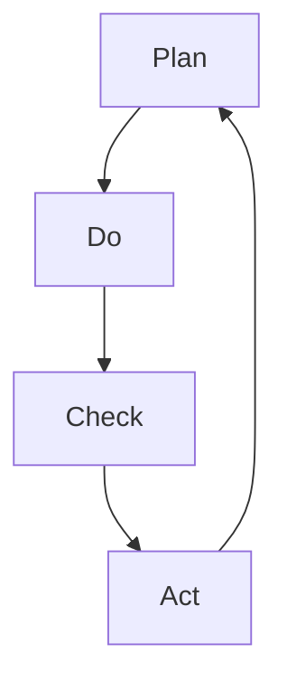

                 

# PDCA循环与管理持续改进的关系

在当今的快速变化和竞争激烈的市场环境中，管理持续改进（Continuous Improvement, CI）已经成为组织成功的关键。PDCA循环（Plan-Do-Check-Act循环）作为一种经典的管理工具，已被广泛应用于各类组织的管理实践中，特别是质量管理的领域。本文将深入探讨PDCA循环与管理持续改进之间的关系，通过具体的例子和详细的解释，帮助读者理解这一管理方法的原理和应用。

## 关键词

- PDCA循环
- 持续改进
- 质量管理
- 项目管理
- 运营管理

## 摘要

本文旨在阐述PDCA循环作为一种管理持续改进的核心工具，其在各类管理领域的应用及其重要性。文章首先介绍了PDCA循环的定义和四个阶段，接着探讨了管理持续改进的概念和重要性。随后，文章详细分析了PDCA循环与管理持续改进之间的联系，并探讨了PDCA循环在各个管理领域的具体应用。通过实际案例研究，本文展示了PDCA循环如何帮助组织实现持续改进，提升管理效率和服务质量。

### 第1章: PDCA循环概述

PDCA循环，即计划-执行-检查-处理循环，是一种被广泛认可的管理持续改进工具，起源于质量管理领域。PDCA循环通过四个连续的阶段，即计划（Plan）、执行（Do）、检查（Check）和处理（Act），帮助组织系统地解决问题并实现持续改进。

#### 1.1 PDCA循环的定义

PDCA循环最初由日本质量管理专家石川馨在20世纪50年代提出，其目的是为了解决质量控制和持续改进的问题。PDCA循环的核心思想是将质量管理活动分为四个阶段，形成一个闭环循环，通过不断循环和迭代，逐步提升产品和服务的质量。

#### 1.2 PDCA循环的四个阶段

##### 1.2.1 计划阶段（Plan）

在计划阶段，组织需要明确改进的目标、策略和具体的行动计划。这一阶段的关键任务包括：

- **目标设定**：明确改进的预期结果，如提高产品质量、降低成本或提高生产效率。
- **原因分析**：分析问题产生的原因，确定需要改进的环节。
- **对策制定**：制定具体的改进对策，包括资源分配、时间安排和责任分配。

##### 1.2.2 执行阶段（Do）

在执行阶段，组织将按照计划实施改进措施。这一阶段的核心任务是确保计划的顺利执行，关键任务包括：

- **资源准备**：确保所需的资源到位，如人力、物资和设备。
- **计划执行**：按照计划执行具体的操作，确保改进措施的落实。
- **监控过程**：实时监控执行过程，确保过程按照预期进行。

##### 1.2.3 检查阶段（Check）

在检查阶段，组织需要对执行结果进行评估和检查。这一阶段的关键任务包括：

- **数据收集**：收集执行过程中产生的数据，包括质量指标、成本数据和客户反馈。
- **效果评估**：分析数据，评估改进措施的效果，确定是否达到预期目标。
- **问题识别**：识别执行过程中出现的问题和不足之处。

##### 1.2.4 处理阶段（Act）

在处理阶段，组织需要对成功和失败的实践进行总结和改进。这一阶段的关键任务包括：

- **总结经验**：总结执行过程中的成功经验和失败教训。
- **标准化**：将成功经验标准化，形成标准操作流程，确保持续的改进。
- **持续改进**：对不足之处进行改进，并更新计划，为下一个循环做好准备。

### 1.3 管理持续改进的概念

管理持续改进是指在组织内部不断地寻找并消除浪费、提高效率、提升产品和服务的质量，以达到持续优化的目标。其核心思想是通过持续的、系统化的改进，使组织不断适应变化的环境，提升竞争力和市场地位。

#### 1.3.1 管理持续改进的定义

管理持续改进是一种组织文化，它鼓励员工积极参与改进活动，通过不断的反思和优化，提高组织的整体效率和质量。其定义主要包括以下几个方面：

- **持续**：改进不是一次性的活动，而是一个持续的过程。
- **改进**：通过系统化的方法，识别并解决组织中存在的问题。
- **管理**：将改进活动纳入组织的日常管理流程，确保持续进行。

#### 1.3.2 管理持续改进的重要性

在现代社会，随着市场竞争的加剧和客户需求的不断变化，管理持续改进已成为企业生存和发展的关键。其重要性体现在以下几个方面：

- **提升竞争力**：通过持续改进，企业能够不断提高产品质量和效率，提升市场竞争力。
- **降低成本**：改进过程中，企业可以识别并消除浪费，降低运营成本。
- **提升客户满意度**：通过持续改进，企业能够更好地满足客户需求，提升客户满意度。
- **增强创新能力**：持续改进鼓励员工积极思考和提出改进建议，增强组织的创新能力。

### 1.4 PDCA循环与管理持续改进的联系

PDCA循环是管理持续改进的核心工具，通过不断的计划、执行、检查和处理，推动组织的持续改进。具体而言，PDCA循环与管理持续改进之间的联系可以从以下几个方面进行阐述：

- **系统化**：PDCA循环提供了一个系统化的改进框架，帮助组织有序地进行改进活动。
- **持续迭代**：PDCA循环是一个闭环循环，通过不断的迭代和优化，推动组织不断改进。
- **数据驱动**：PDCA循环强调数据的收集和分析，通过数据驱动改进，确保改进活动的科学性和有效性。
- **全员参与**：PDCA循环鼓励全员参与改进活动，提高员工的积极性和创造力。

#### 1.4.1 PDCA循环在管理持续改进中的应用

PDCA循环在管理持续改进中的应用非常广泛，可以从以下几个方面进行阐述：

- **问题识别**：通过PDCA循环，组织可以系统地识别和解决管理中的问题。
- **改进策略**：PDCA循环提供了一种科学的方法，帮助组织制定和实施改进策略。
- **效果评估**：PDCA循环强调对改进效果进行评估，确保改进活动的有效性。
- **持续优化**：PDCA循环通过不断的循环和迭代，推动组织不断进行优化。

#### 1.4.2 PDCA循环的优化策略

为了提高PDCA循环的效率，组织可以采取以下优化策略：

- **管理会计**：通过管理会计工具，如成本效益分析、预算控制和绩效评估，提高PDCA循环的效率。
- **过程分析与设计**：通过过程分析与设计，优化业务流程，减少浪费，提高效率。
- **精益生产**：采用精益生产方法，如看板管理、持续改进和全面质量管理，优化生产流程。
- **信息化管理**：利用信息技术，如ERP系统、MES系统和大数据分析，提高PDCA循环的效率。

### 1.5 PDCA循环在不同管理领域的应用

PDCA循环不仅适用于质量管理，还广泛应用于生产管理、营销管理、项目管理、运营管理和人力资源管理等多个领域。以下分别介绍PDCA循环在不同管理领域的应用：

#### 1.5.1 生产管理中的应用

在生产管理中，PDCA循环可以帮助企业系统地提高生产效率和产品质量。具体应用包括：

- **生产计划制定**：通过计划阶段，明确生产目标、生产计划和资源分配。
- **生产过程控制**：在执行阶段，按照计划进行生产，控制生产过程。
- **质量检查**：在检查阶段，对生产出来的产品进行质量检查，确保产品质量。
- **改进措施**：在处理阶段，对生产过程中发现的问题进行改进，提高生产效率。

#### 1.5.2 营销管理中的应用

在营销管理中，PDCA循环可以帮助企业制定和优化营销策略，提高市场竞争力。具体应用包括：

- **市场调研**：在计划阶段，通过市场调研了解客户需求和市场趋势。
- **策略制定**：根据市场调研结果，制定具体的营销策略。
- **策略执行**：在执行阶段，实施营销策略，进行市场推广。
- **效果评估**：在检查阶段，评估营销策略的效果，调整营销策略。

#### 1.5.3 项目管理中的应用

在项目管理中，PDCA循环可以帮助项目团队系统地管理项目，提高项目成功率。具体应用包括：

- **项目规划**：在计划阶段，制定项目目标和项目计划。
- **项目执行**：在执行阶段，按照项目计划执行项目任务。
- **项目监控**：在检查阶段，监控项目进度和质量，确保项目按计划进行。
- **项目改进**：在处理阶段，对项目过程中的问题进行改进，提高项目管理水平。

#### 1.5.4 运营管理中的应用

在运营管理中，PDCA循环可以帮助企业优化运营流程，提高运营效率。具体应用包括：

- **流程设计**：在计划阶段，设计优化运营流程。
- **流程执行**：在执行阶段，按照优化后的流程执行运营活动。
- **过程监控**：在检查阶段，监控运营过程，识别问题。
- **流程改进**：在处理阶段，对运营流程进行改进，提高运营效率。

#### 1.5.5 人力资源管理中的应用

在人力资源管理中，PDCA循环可以帮助企业优化人力资源政策，提高员工满意度和绩效。具体应用包括：

- **员工招聘**：在计划阶段，制定招聘策略和标准。
- **员工培训**：在执行阶段，实施员工培训计划。
- **绩效评估**：在检查阶段，评估员工绩效，识别培训需求。
- **改进措施**：在处理阶段，对培训计划进行改进，提高员工绩效。

### 1.6 案例研究

为了更好地理解PDCA循环在管理持续改进中的应用，以下提供两个实际案例：

#### 1.6.1 某制造企业PDCA循环改进案例

案例背景：某制造企业生产效率低下，产品不良率高。

- **计划阶段**：企业通过分析生产流程，确定提高生产效率和降低不良率为改进目标，制定具体的改进计划。
- **执行阶段**：企业按照改进计划，优化生产流程，加强质量控制。
- **检查阶段**：企业对生产过程进行监控，收集数据，评估改进措施的效果。
- **处理阶段**：企业对改进过程中发现的问题进行总结，制定改进措施，更新改进计划。

改进效果：通过PDCA循环，企业生产效率提高了20%，产品不良率降低了30%。

#### 1.6.2 某服务企业PDCA循环改进案例

案例背景：某服务企业客户满意度低，服务问题频发。

- **计划阶段**：企业通过客户调研，确定提高客户满意度和优化服务流程为改进目标，制定具体的改进计划。
- **执行阶段**：企业按照改进计划，优化服务流程，加强员工培训。
- **检查阶段**：企业对服务过程进行监控，收集客户反馈，评估改进措施的效果。
- **处理阶段**：企业对服务过程中发现的问题进行总结，制定改进措施，更新改进计划。

改进效果：通过PDCA循环，企业客户满意度提高了15%，服务问题显著减少。

通过以上案例研究，可以看出PDCA循环在管理持续改进中的应用具有显著的成效，能够帮助组织实现持续改进和提升管理效率。

### 第2章: PDCA循环的详细原理与流程

PDCA循环，作为一种系统化的管理工具，通过四个连续的阶段——计划（Plan）、执行（Do）、检查（Check）和处理（Act），实现了管理持续改进的目标。本章将详细阐述PDCA循环的核心概念、原理、流程及其数学模型，并通过具体的例子进行说明。

#### 2.1 PDCA循环的核心概念

PDCA循环的核心概念在于通过四个阶段的循环迭代，实现管理过程的不断优化。每个阶段都有其特定的任务和目标，形成一个闭环系统，确保管理活动有序进行。

##### 2.1.1 计划阶段（Plan）

在计划阶段，组织需要明确改进的目标和策略，制定具体的行动计划。这一阶段的主要任务包括：

- **目标设定**：确定改进的明确目标，如提高生产效率、降低成本、提升客户满意度等。
- **原因分析**：分析问题产生的原因，识别关键因素。
- **对策制定**：制定具体的改进对策，包括资源分配、时间安排和责任分配。

##### 2.1.2 执行阶段（Do）

在执行阶段，组织按照计划实施改进措施。这一阶段的核心任务是确保计划的顺利执行，关键任务包括：

- **资源准备**：确保所需的资源到位，如人力、物资和设备。
- **计划执行**：按照计划执行具体的操作，确保改进措施的落实。
- **监控过程**：实时监控执行过程，确保过程按照预期进行。

##### 2.1.3 检查阶段（Check）

在检查阶段，组织需要对执行结果进行评估和检查。这一阶段的主要任务包括：

- **数据收集**：收集执行过程中产生的数据，包括质量指标、成本数据和客户反馈。
- **效果评估**：分析数据，评估改进措施的效果，确定是否达到预期目标。
- **问题识别**：识别执行过程中出现的问题和不足之处。

##### 2.1.4 处理阶段（Act）

在处理阶段，组织需要对成功和失败的实践进行总结和改进。这一阶段的主要任务包括：

- **总结经验**：总结执行过程中的成功经验和失败教训。
- **标准化**：将成功经验标准化，形成标准操作流程，确保持续的改进。
- **持续改进**：对不足之处进行改进，并更新计划，为下一个循环做好准备。

#### 2.2 PDCA循环的流程图

为了更直观地理解PDCA循环的原理和流程，我们可以使用Mermaid图形来展示：

这个图形清晰地展示了PDCA循环的四个阶段以及它们之间的相互关系。

#### 2.3 PDCA循环的数学模型

PDCA循环不仅是一个管理工具，它还可以通过数学模型来量化和评估改进的效果。以下是PDCA循环的数学模型及其应用实例。

##### 2.3.1 PDCA循环的数学模型公式

改进效率（Improvement Efficiency）可以用以下公式表示：

$$
\text{改进效率} = \frac{\text{改进后的绩效} - \text{改进前的绩效}}{\text{改进前的绩效}}
$$

其中，改进后的绩效和改进前的绩效分别表示改进措施实施前后的绩效水平。

##### 2.3.2 改进效率的计算实例

假设某电子工厂通过PDCA循环改进生产效率，改进前每月生产5000件产品，改进后每月生产6000件产品。那么，改进效率计算如下：

$$
\text{改进效率} = \frac{6000 - 5000}{5000} = \frac{1000}{5000} = 20\%
$$

这意味着通过PDCA循环的改进，该工厂的生产效率提高了20%。

#### 2.4 PDCA循环的具体应用实例

为了更好地理解PDCA循环的应用，我们可以通过一个具体的实例来详细说明。

##### 2.4.1 实例背景

某制造企业存在生产效率低、产品不良率高等问题，希望通过PDCA循环进行改进。

##### 2.4.2 PDCA循环的实施过程

1. **计划阶段（Plan）**

   - **目标设定**：企业决定将生产效率提高10%，并将产品不良率降低20%作为改进目标。
   - **原因分析**：通过对生产过程的深入分析，企业发现生产效率低的主要原因是生产设备老旧和操作流程不合理，产品不良率高的主要原因是生产质量控制和过程监控不足。
   - **对策制定**：企业制定了一系列改进措施，包括更新生产设备、优化操作流程、加强质量控制和过程监控等。

2. **执行阶段（Do）**

   - **资源准备**：企业采购了新的生产设备，并培训了操作人员。
   - **计划执行**：企业按照改进计划开始实施新设备和新的操作流程。
   - **监控过程**：企业建立了质量监控体系，对生产过程进行实时监控。

3. **检查阶段（Check）**

   - **数据收集**：企业收集了改进后的生产数据，包括生产效率、产品不良率等。
   - **效果评估**：通过对数据的分析，企业发现生产效率提高了10%，产品不良率降低了20%。
   - **问题识别**：在数据收集和评估过程中，企业还发现了一些需要进一步改进的问题，如某些生产设备的维护频率需要增加。

4. **处理阶段（Act）**

   - **总结经验**：企业对改进过程中的成功经验和失败教训进行了总结。
   - **标准化**：企业将成功经验标准化，形成了新的操作流程和质量监控标准。
   - **持续改进**：企业制定了新的改进计划，计划在未来进一步优化生产流程，提高生产效率和产品质量。

##### 2.4.3 改进效果

通过PDCA循环的改进，该企业的生产效率提高了10%，产品不良率降低了20%，取得了显著的成效。此外，通过持续改进，企业还在不断优化生产流程，提高整体管理水平。

#### 2.5 PDCA循环的数学模型应用

通过PDCA循环的数学模型，企业可以量化改进的效果，从而更好地评估改进措施的有效性。以下是一个具体的数学模型应用实例：

假设某企业通过PDCA循环改进了生产流程，改进前每月生产成本为100万元，改进后每月生产成本为80万元。那么，改进效率计算如下：

$$
\text{改进效率} = \frac{80\text{万元} - 100\text{万元}}{100\text{万元}} = -20\%
$$

这个结果表明，通过PDCA循环的改进，企业的生产成本降低了20%，这是一个积极的改进效果。

通过以上详细的阐述和实例分析，我们可以看出PDCA循环作为一种系统化的管理工具，在管理持续改进中的应用具有显著的效果。它不仅帮助企业识别和解决问题，还通过量化的方式评估改进效果，推动组织的持续发展和进步。

### 第3章: PDCA循环在项目管理中的应用

项目管理是一个复杂的任务，涉及多个阶段和众多参与者。PDCA循环作为一种有效的管理工具，可以帮助项目团队系统地管理项目，提高项目成功率。本章将详细探讨PDCA循环在项目管理中的应用，包括各个阶段的详细流程和应用实例。

#### 3.1 项目管理的概念

项目管理是指通过计划、执行、监控和收尾等一系列活动，确保项目按照预定的时间、预算和范围完成的过程。项目管理的核心目标是通过优化资源利用和风险管理，实现项目目标的最大化。

##### 3.1.1 项目的定义

项目是一种独特的产品、服务或成果的创造过程，具有明确的目标、时间和资源限制。项目通常具有以下特点：

- **一次性任务**：项目一旦完成，其生命周期即告结束。
- **明确目标**：项目有明确的目标和预期成果。
- **时间限制**：项目必须在一定时间内完成。
- **资源限制**：项目需要在有限的资源条件下进行。

##### 3.1.2 项目管理的重要性

项目管理在组织成功中扮演着关键角色，其重要性体现在以下几个方面：

- **资源优化**：通过有效的项目管理，可以优化资源的利用，降低成本。
- **风险控制**：项目管理的目的是识别和应对潜在风险，确保项目顺利进行。
- **目标实现**：项目管理确保项目按照预定的时间、预算和范围完成，实现预期目标。
- **持续改进**：项目管理过程中，通过PDCA循环的持续改进，不断提升项目管理水平。

#### 3.2 PDCA循环在项目管理中的流程

PDCA循环在项目管理中是一个闭环过程，通过四个阶段的循环迭代，实现项目的有序推进和持续改进。以下是PDCA循环在项目管理中的详细流程：

##### 3.2.1 计划阶段（Plan）

在计划阶段，项目团队需要制定详细的项目计划，明确项目的目标和策略。关键任务包括：

- **项目目标**：明确项目的目标和预期成果。
- **范围定义**：确定项目的范围，明确项目的边界。
- **时间表制定**：制定项目的时间表，确保项目按时完成。
- **资源分配**：根据项目需求，分配所需的资源，包括人力、物资和设备。
- **风险识别**：识别项目过程中可能出现的风险，并制定相应的应对策略。

##### 3.2.2 执行阶段（Do）

在执行阶段，项目团队按照计划执行项目任务。关键任务包括：

- **任务执行**：按照计划执行具体的项目任务。
- **过程监控**：实时监控项目进展，确保项目按照计划进行。
- **资源管理**：确保项目资源的合理利用和调配。
- **沟通协调**：保持项目团队之间的沟通和协作，确保项目顺利进行。

##### 3.2.3 检查阶段（Check）

在检查阶段，项目团队需要对项目执行结果进行评估和检查。关键任务包括：

- **效果评估**：评估项目执行效果，包括项目进度、质量和成本等。
- **问题识别**：识别项目执行过程中出现的问题和偏差，分析原因。
- **偏差纠正**：对项目执行过程中的偏差进行纠正，确保项目按计划进行。

##### 3.2.4 处理阶段（Act）

在处理阶段，项目团队需要总结项目经验，制定改进措施，为下一个项目循环做好准备。关键任务包括：

- **经验总结**：总结项目执行过程中的成功经验和失败教训。
- **标准化**：将成功经验标准化，形成标准操作流程，提高项目管理效率。
- **持续改进**：根据项目执行过程中发现的问题，制定改进措施，为下一项目循环做好准备。

#### 3.3 PDCA循环在项目管理中的应用实例

为了更好地理解PDCA循环在项目管理中的应用，我们以下提供两个具体实例。

##### 3.3.1 某软件开发项目PDCA循环应用实例

案例背景：某软件开发公司负责开发一款企业资源规划（ERP）系统，项目计划在六个月内完成，预算为500万元。

1. **计划阶段（Plan）**

   - **项目目标**：确保ERP系统在六个月内按计划上线，满足客户需求。
   - **范围定义**：明确ERP系统的功能模块、技术要求和客户需求。
   - **时间表制定**：制定详细的项目时间表，包括开发阶段、测试阶段和上线阶段。
   - **资源分配**：根据项目需求，分配开发人员、测试人员和项目经理。
   - **风险识别**：识别项目过程中可能出现的风险，如技术难度、客户需求变更和时间压力。

2. **执行阶段（Do）**

   - **任务执行**：开发团队按照项目计划，逐步完成开发任务。
   - **过程监控**：项目经理实时监控项目进展，确保项目按计划进行。
   - **资源管理**：确保开发资源的合理利用，及时解决资源短缺问题。
   - **沟通协调**：保持开发团队与客户的沟通，及时调整开发计划，满足客户需求。

3. **检查阶段（Check）**

   - **效果评估**：定期评估项目进度、质量和成本，确保项目按计划进行。
   - **问题识别**：识别项目执行过程中出现的问题，如技术难题、进度延误和资源浪费。
   - **偏差纠正**：针对识别的问题，制定纠正措施，确保项目按计划进行。

4. **处理阶段（Act）**

   - **经验总结**：总结项目执行过程中的成功经验和失败教训。
   - **标准化**：将成功经验标准化，形成标准开发流程和项目管理规范。
   - **持续改进**：根据项目执行过程中发现的问题，制定改进计划，为下一个项目循环做好准备。

改进效果：通过PDCA循环的应用，该ERP系统项目成功在六个月内按计划完成，客户满意度高，项目成本控制在预算范围内。

##### 3.3.2 某基础设施建设项目PDCA循环应用实例

案例背景：某城市建设了一项重要基础设施项目，包括道路、桥梁和隧道建设，项目预算为2亿元，计划在两年内完成。

1. **计划阶段（Plan）**

   - **项目目标**：确保基础设施建设项目按计划高质量完成，提升城市交通能力。
   - **范围定义**：明确基础设施建设项目的范围、技术要求和质量标准。
   - **时间表制定**：制定详细的项目时间表，包括施工阶段、验收阶段和交付阶段。
   - **资源分配**：根据项目需求，分配施工队伍、设备和项目经理。
   - **风险识别**：识别项目过程中可能出现的风险，如施工延误、资源短缺和质量问题。

2. **执行阶段（Do）**

   - **任务执行**：施工队伍按照项目计划，逐步完成施工任务。
   - **过程监控**：项目经理实时监控项目进展，确保项目按计划进行。
   - **资源管理**：确保施工资源的合理利用，及时解决资源短缺问题。
   - **沟通协调**：保持施工队伍与政府监管部门的沟通，确保项目顺利进行。

3. **检查阶段（Check）**

   - **效果评估**：定期评估项目进度、质量和成本，确保项目按计划进行。
   - **问题识别**：识别项目执行过程中出现的问题，如施工质量不合格、进度延误和资源浪费。
   - **偏差纠正**：针对识别的问题，制定纠正措施，确保项目按计划进行。

4. **处理阶段（Act）**

   - **经验总结**：总结项目执行过程中的成功经验和失败教训。
   - **标准化**：将成功经验标准化，形成标准施工流程和质量管理规范。
   - **持续改进**：根据项目执行过程中发现的问题，制定改进计划，为下一个项目循环做好准备。

改进效果：通过PDCA循环的应用，该基础设施建设项目成功在两年内高质量完成，提升了城市交通能力，赢得了政府和社会的广泛赞誉。

通过以上实例，我们可以看到PDCA循环在项目管理中的应用，不仅帮助项目团队系统地管理项目，还通过持续改进，提高了项目成功率和管理效率。

### 第4章: PDCA循环在运营管理中的应用

运营管理是确保企业日常经营活动顺畅进行的重要环节，其目标是提高效率和效益，确保企业目标的实现。PDCA循环作为一种经典的管理工具，在运营管理中的应用十分广泛。本章将详细探讨PDCA循环在运营管理中的应用，包括其在运营管理中的具体流程、应用策略以及实际案例。

#### 4.1 运营管理的概念

运营管理是指通过计划、组织、协调和控制等一系列活动，确保企业日常经营活动高效、有序地进行的管理活动。运营管理的核心目标是优化资源配置，提高生产效率，确保产品质量，提升客户满意度。

##### 4.1.1 运营管理的定义

运营管理是企业内部所有与管理日常经营活动相关的管理活动，包括生产运营、销售运营、物流运营、人力资源运营等方面。其主要职责是确保各项运营活动顺利进行，达到预期的效率和效益。

##### 4.1.2 运营管理的重要性

在当今市场竞争激烈的背景下，运营管理的重要性日益凸显。其重要性主要体现在以下几个方面：

- **提高效率**：通过科学的运营管理，企业可以优化资源配置，减少浪费，提高生产效率和运营效率。
- **提升效益**：有效的运营管理能够降低成本，提高产品质量和客户满意度，从而提升企业的经济效益。
- **确保可持续发展**：良好的运营管理能够帮助企业应对市场变化，提高企业的应变能力和竞争力，实现可持续发展。

#### 4.2 PDCA循环在运营管理中的应用

PDCA循环作为一种系统化的管理工具，在运营管理中具有广泛的应用。通过PDCA循环，企业可以系统地规划、执行、检查和改进运营活动，确保运营效率的持续提升。

##### 4.2.1 计划阶段（Plan）

在计划阶段，企业需要明确运营目标和策略，制定具体的行动计划。关键任务包括：

- **目标设定**：明确运营改进的目标，如提高生产效率、降低成本、提升产品质量等。
- **策略制定**：根据目标，制定具体的运营策略和改进措施。
- **资源分配**：根据运营策略，分配所需的资源，包括人力、物资和设备。
- **时间安排**：制定详细的时间表，确保各项运营活动的有序进行。

##### 4.2.2 执行阶段（Do）

在执行阶段，企业需要按照计划实施运营活动。关键任务包括：

- **计划执行**：按照计划，执行各项运营任务。
- **资源管理**：确保资源的合理利用，及时解决资源短缺问题。
- **过程监控**：实时监控运营过程，确保过程按照预期进行。
- **沟通协调**：保持各部门之间的沟通和协作，确保运营活动的顺利进行。

##### 4.2.3 检查阶段（Check）

在检查阶段，企业需要评估运营活动的效果，检查计划执行情况。关键任务包括：

- **效果评估**：评估运营活动的效果，包括效率、成本和质量等。
- **问题识别**：识别运营活动中出现的问题和偏差，分析原因。
- **反馈收集**：收集运营过程中的反馈，包括员工反馈、客户反馈等。

##### 4.2.4 处理阶段（Act）

在处理阶段，企业需要对成功和失败的实践进行总结和改进。关键任务包括：

- **经验总结**：总结运营活动中的成功经验和失败教训。
- **标准化**：将成功经验标准化，形成标准操作流程，确保持续改进。
- **持续改进**：根据检查阶段发现的问题，制定改进措施，为下一个循环做好准备。

#### 4.3 PDCA循环在运营管理中的应用策略

为了更好地应用PDCA循环，企业可以采取以下策略：

- **建立PDCA循环机制**：制定详细的PDCA循环流程，确保每个阶段都有明确的任务和责任。
- **加强数据管理**：通过数据收集和分析，了解运营活动的效果和问题，为改进提供依据。
- **全员参与**：鼓励员工参与PDCA循环，提出改进建议，提高员工积极性和创造力。
- **持续优化**：不断迭代PDCA循环，优化运营流程，提高运营效率。

#### 4.4 PDCA循环在运营管理中的应用实例

为了更好地理解PDCA循环在运营管理中的应用，以下提供两个实际案例。

##### 4.4.1 某制造企业PDCA循环应用实例

案例背景：某制造企业生产效率低，产品不良率高，希望通过PDCA循环进行改进。

1. **计划阶段（Plan）**

   - **目标设定**：企业决定将生产效率提高15%，产品不良率降低20%作为改进目标。
   - **原因分析**：通过对生产过程的深入分析，企业发现生产效率低的主要原因是生产设备老旧和操作流程不合理，产品不良率高的主要原因是生产质量控制和过程监控不足。
   - **对策制定**：企业制定了一系列改进措施，包括更新生产设备、优化操作流程、加强质量控制和过程监控等。

2. **执行阶段（Do）**

   - **资源准备**：企业采购了新的生产设备，并培训了操作人员。
   - **计划执行**：企业按照改进计划，优化生产流程，加强质量控制。
   - **监控过程**：企业建立了质量监控体系，对生产过程进行实时监控。

3. **检查阶段（Check）**

   - **数据收集**：企业收集了改进后的生产数据，包括生产效率、产品不良率等。
   - **效果评估**：通过对数据的分析，企业发现生产效率提高了15%，产品不良率降低了20%。
   - **问题识别**：在数据收集和评估过程中，企业还发现了一些需要进一步改进的问题，如某些生产设备的维护频率需要增加。

4. **处理阶段（Act）**

   - **总结经验**：企业对改进过程中的成功经验和失败教训进行了总结。
   - **标准化**：企业将成功经验标准化，形成了新的操作流程和质量监控标准。
   - **持续改进**：企业制定了新的改进计划，计划在未来进一步优化生产流程，提高生产效率和产品质量。

改进效果：通过PDCA循环的应用，企业的生产效率提高了15%，产品不良率降低了20%，取得了显著的成效。

##### 4.4.2 某零售企业PDCA循环应用实例

案例背景：某零售企业库存管理效率低下，商品损耗严重，希望通过PDCA循环进行改进。

1. **计划阶段（Plan）**

   - **目标设定**：企业决定将库存管理效率提高20%，商品损耗降低30%作为改进目标。
   - **原因分析**：通过对库存管理过程的深入分析，企业发现库存管理效率低的主要原因是库存数据不准确和库存管理流程不合理，商品损耗严重的主要原因是仓库管理不善和物流过程存在问题。
   - **对策制定**：企业制定了一系列改进措施，包括优化库存管理流程、提高库存数据准确性、加强仓库管理和优化物流过程等。

2. **执行阶段（Do）**

   - **资源准备**：企业采购了新的库存管理软件，并对仓库管理人员进行了培训。
   - **计划执行**：企业按照改进计划，优化库存管理流程，提高库存数据准确性，加强仓库管理和优化物流过程。
   - **监控过程**：企业建立了库存监控体系，实时监控库存数据，确保库存管理过程按照预期进行。

3. **检查阶段（Check）**

   - **数据收集**：企业收集了改进后的库存数据，包括库存周转率、商品损耗率等。
   - **效果评估**：通过对数据的分析，企业发现库存管理效率提高了20%，商品损耗率降低了30%。
   - **问题识别**：在数据收集和评估过程中，企业还发现了一些需要进一步改进的问题，如库存数据实时更新速度需要提升。

4. **处理阶段（Act）**

   - **总结经验**：企业对改进过程中的成功经验和失败教训进行了总结。
   - **标准化**：企业将成功经验标准化，形成了新的库存管理流程和仓库管理标准。
   - **持续改进**：企业制定了新的改进计划，计划在未来进一步优化库存管理流程，提高库存管理效率。

改进效果：通过PDCA循环的应用，企业的库存管理效率提高了20%，商品损耗率降低了30%，取得了显著的成效。

通过以上实例，我们可以看到PDCA循环在运营管理中的应用，不仅帮助企业识别和解决问题，还通过量化的方式评估改进效果，推动企业的持续发展和进步。

### 第5章: PDCA循环在质量管理体系中的应用

质量管理体系是组织成功运营的基础，其核心目标是确保产品或服务满足规定的质量要求。PDCA循环作为一种经典的管理工具，在质量管理体系中得到了广泛的应用。本章将详细探讨PDCA循环在质量管理体系中的应用，包括其在质量管理体系中的具体作用、实施流程以及应用实例。

#### 5.1 质量管理体系的概述

质量管理体系是一套系统的管理方法和工具，用于指导和控制组织的质量活动，确保产品或服务满足客户和法规的要求。质量管理体系的核心包括质量策划、质量控制、质量保证和质量改进。

##### 5.1.1 质量管理的定义

质量管理是指组织为了实现质量目标所采取的系统性活动和过程。它包括质量策划、质量控制、质量保证和质量改进。质量管理旨在确保产品或服务在设计和生产过程中满足既定的质量要求，同时提高客户满意度和组织竞争力。

##### 5.1.2 质量管理体系的重要性

在现代社会，质量管理体系已成为组织运营的重要组成部分，其重要性体现在以下几个方面：

- **提升产品和服务质量**：通过质量管理体系，组织可以确保产品和服务满足客户和法规的要求，提高客户满意度和市场竞争力。
- **降低成本**：质量管理体系通过预防和纠正措施，减少缺陷和返工，降低生产成本。
- **提高效率**：质量管理体系通过标准化和流程优化，提高生产效率和运营效率。
- **增强客户信任**：通过建立和实施质量管理体系，组织能够增强客户的信任，提高品牌价值。

#### 5.2 PDCA循环在质量管理体系中的应用

PDCA循环在质量管理体系中起着至关重要的作用，通过四个阶段的循环迭代，实现质量管理的持续改进。以下是PDCA循环在质量管理体系中的应用流程：

##### 5.2.1 计划阶段（Plan）

在计划阶段，组织需要制定质量目标和策略，制定具体的行动计划。关键任务包括：

- **目标设定**：明确质量改进的目标，如降低缺陷率、提高客户满意度等。
- **原因分析**：分析现有质量问题产生的原因，确定改进的优先级。
- **对策制定**：制定具体的改进对策，包括资源分配、时间安排和责任分配。

##### 5.2.2 执行阶段（Do）

在执行阶段，组织需要按照计划实施改进措施。关键任务包括：

- **资源准备**：确保所需的资源到位，如人力、物资和设备。
- **计划执行**：按照计划执行具体的操作，确保改进措施的落实。
- **监控过程**：实时监控执行过程，确保过程按照预期进行。

##### 5.2.3 检查阶段（Check）

在检查阶段，组织需要对执行结果进行评估和检查。关键任务包括：

- **数据收集**：收集执行过程中产生的数据，包括质量指标、成本数据和客户反馈。
- **效果评估**：分析数据，评估改进措施的效果，确定是否达到预期目标。
- **问题识别**：识别执行过程中出现的问题和不足之处。

##### 5.2.4 处理阶段（Act）

在处理阶段，组织需要对成功和失败的实践进行总结和改进。关键任务包括：

- **总结经验**：总结执行过程中的成功经验和失败教训。
- **标准化**：将成功经验标准化，形成标准操作流程，确保持续的改进。
- **持续改进**：对不足之处进行改进，并更新计划，为下一个循环做好准备。

#### 5.3 PDCA循环在质量管理体系中的具体作用

PDCA循环在质量管理体系中具有以下具体作用：

- **系统化改进**：PDCA循环提供了一套系统化的改进方法，通过四个阶段的循环迭代，实现质量管理的持续改进。
- **数据驱动**：PDCA循环强调数据的收集和分析，通过数据驱动改进，确保改进活动的科学性和有效性。
- **全员参与**：PDCA循环鼓励全员参与质量改进，提高员工的积极性和创造力。
- **标准化**：PDCA循环通过标准化，将成功经验转化为标准操作流程，确保质量管理的持续性和一致性。

#### 5.4 PDCA循环在质量管理体系中的应用实例

为了更好地理解PDCA循环在质量管理体系中的应用，以下提供两个实际案例。

##### 5.4.1 某汽车制造企业PDCA循环应用实例

案例背景：某汽车制造企业产品缺陷率高，客户投诉频繁。

1. **计划阶段（Plan）**

   - **目标设定**：企业决定将产品缺陷率降低20%作为改进目标。
   - **原因分析**：通过对生产过程的深入分析，企业发现产品缺陷的主要原因是生产设备老旧和操作流程不合理，质量检查不足。
   - **对策制定**：企业制定了一系列改进措施，包括更新生产设备、优化操作流程、加强质量检查等。

2. **执行阶段（Do）**

   - **资源准备**：企业采购了新的生产设备，并对员工进行了培训。
   - **计划执行**：企业按照改进计划，优化生产流程，加强质量检查。
   - **监控过程**：企业建立了质量监控体系，对生产过程进行实时监控。

3. **检查阶段（Check）**

   - **数据收集**：企业收集了改进后的生产数据，包括产品缺陷率、生产效率等。
   - **效果评估**：通过对数据的分析，企业发现产品缺陷率降低了20%，生产效率提高了10%。
   - **问题识别**：在数据收集和评估过程中，企业还发现了一些需要进一步改进的问题，如某些生产设备的维护频率需要增加。

4. **处理阶段（Act）**

   - **总结经验**：企业对改进过程中的成功经验和失败教训进行了总结。
   - **标准化**：企业将成功经验标准化，形成了新的操作流程和质量监控标准。
   - **持续改进**：企业制定了新的改进计划，计划在未来进一步优化生产流程，提高生产效率和产品质量。

改进效果：通过PDCA循环的应用，企业的产品缺陷率降低了20%，生产效率提高了10%，取得了显著的成效。

##### 5.4.2 某医疗设备制造企业PDCA循环应用实例

案例背景：某医疗设备制造企业产品不符合法规要求，客户投诉严重。

1. **计划阶段（Plan）**

   - **目标设定**：企业决定将产品符合法规要求作为改进目标。
   - **原因分析**：通过对生产过程的深入分析，企业发现产品不符合法规要求的主要原因是生产流程不规范和质量检验不足。
   - **对策制定**：企业制定了一系列改进措施，包括规范生产流程、加强质量检验、提高法规意识等。

2. **执行阶段（Do）**

   - **资源准备**：企业规范了生产流程，对质量检验人员进行培训，并加强了法规知识的宣传。
   - **计划执行**：企业按照改进计划，严格执行生产流程，加强质量检验。
   - **监控过程**：企业建立了质量监控体系，对生产过程进行实时监控。

3. **检查阶段（Check）**

   - **数据收集**：企业收集了改进后的生产数据，包括产品合格率、客户投诉率等。
   - **效果评估**：通过对数据的分析，企业发现产品合格率提高了15%，客户投诉率降低了30%。
   - **问题识别**：在数据收集和评估过程中，企业还发现了一些需要进一步改进的问题，如某些生产设备的合规性需要提升。

4. **处理阶段（Act）**

   - **总结经验**：企业对改进过程中的成功经验和失败教训进行了总结。
   - **标准化**：企业将成功经验标准化，形成了新的生产流程和质量监控标准。
   - **持续改进**：企业制定了新的改进计划，计划在未来进一步优化生产流程，提高产品合规性和客户满意度。

改进效果：通过PDCA循环的应用，企业的产品合格率提高了15%，客户投诉率降低了30%，取得了显著的成效。

通过以上案例，我们可以看到PDCA循环在质量管理体系中的应用，不仅帮助企业识别和解决问题，还通过量化的方式评估改进效果，推动企业的质量管理和持续改进。

### 第6章: PDCA循环在人力资源管理中的应用

人力资源管理是组织成功运营的关键因素之一，其核心目标是吸引、培养和保留人才，以提高组织的竞争力和生产力。PDCA循环作为一种有效的管理工具，在人力资源管理中具有广泛的应用。本章将详细探讨PDCA循环在人力资源管理中的应用，包括其在人力资源管理中的具体流程、应用策略以及实际案例。

#### 6.1 人力资源管理的概述

人力资源管理是指通过一系列管理活动，如招聘、培训、绩效评估和员工关系等，确保组织拥有合适的人才，并激发员工的潜力，从而实现组织的目标。人力资源管理的主要内容包括：

- **招聘管理**：通过招聘活动，吸引并筛选合适的人才，确保组织的人力资源需求得到满足。
- **培训管理**：通过培训活动，提升员工的技能和知识，提高员工的工作效率和工作质量。
- **绩效评估**：通过绩效评估活动，评估员工的工作表现，激励员工提升工作水平。
- **员工关系**：通过建立和谐的员工关系，提高员工的满意度和忠诚度，促进组织的稳定和发展。

##### 6.1.1 人力资源管理的定义

人力资源管理是指组织通过一系列管理活动和措施，对人力资源进行有效的规划、开发、利用和激励，以实现组织目标的过程。人力资源管理不仅关注员工的招聘和培训，还涉及员工的绩效评估、薪酬福利管理、员工关系等方面。

##### 6.1.2 人力资源管理的重要性

人力资源管理在组织管理中具有至关重要的地位，其重要性体现在以下几个方面：

- **提升组织竞争力**：优秀的人力资源管理能够吸引并留住优秀人才，提高组织的竞争力。
- **提高员工满意度**：通过有效的招聘、培训和激励机制，提高员工的满意度和忠诚度。
- **提升工作效率**：通过合理的绩效评估和激励措施，激发员工的工作积极性，提高工作效率和工作质量。
- **促进组织发展**：良好的人力资源管理能够为组织提供持续的人才支持，促进组织的稳定和发展。

#### 6.2 PDCA循环在人力资源管理中的应用

PDCA循环在人力资源管理中具有广泛的应用，通过四个阶段的循环迭代，实现人力资源管理过程的持续改进和优化。

##### 6.2.1 计划阶段（Plan）

在计划阶段，组织需要制定人力资源管理目标和策略，制定具体的行动计划。关键任务包括：

- **目标设定**：明确人力资源管理的目标和改进方向，如提升招聘效率、提高员工培训效果、优化绩效评估体系等。
- **原因分析**：分析现有人力资源管理过程中存在的问题和不足，确定改进的优先级。
- **对策制定**：制定具体的改进对策，包括资源分配、时间安排和责任分配。

##### 6.2.2 执行阶段（Do）

在执行阶段，组织需要按照计划实施改进措施。关键任务包括：

- **资源准备**：确保所需的资源到位，如培训经费、招聘渠道和员工激励措施。
- **计划执行**：按照计划执行各项人力资源管理活动，确保改进措施的落实。
- **监控过程**：实时监控人力资源管理过程，确保过程按照预期进行。

##### 6.2.3 检查阶段（Check）

在检查阶段，组织需要对执行结果进行评估和检查。关键任务包括：

- **效果评估**：评估改进措施的效果，包括招聘效率、员工培训效果、绩效评估体系的优化程度等。
- **问题识别**：识别执行过程中出现的问题和偏差，分析原因。
- **反馈收集**：收集员工和管理层的反馈，了解改进措施的实施情况和员工对改进措施的接受程度。

##### 6.2.4 处理阶段（Act）

在处理阶段，组织需要对成功和失败的实践进行总结和改进。关键任务包括：

- **总结经验**：总结执行过程中的成功经验和失败教训。
- **标准化**：将成功经验标准化，形成标准操作流程和评估标准，确保持续改进。
- **持续改进**：对不足之处进行改进，并更新计划，为下一个循环做好准备。

#### 6.3 PDCA循环在人力资源管理中的应用策略

为了更好地应用PDCA循环，组织可以采取以下策略：

- **建立PDCA循环机制**：制定详细的PDCA循环流程，确保每个阶段都有明确的任务和责任。
- **加强数据管理**：通过数据收集和分析，了解人力资源管理的效果和问题，为改进提供依据。
- **全员参与**：鼓励员工和管理层参与PDCA循环，提出改进建议，提高员工积极性和创造力。
- **持续优化**：不断迭代PDCA循环，优化人力资源管理流程，提高人力资源管理效率。

#### 6.4 PDCA循环在人力资源管理中的应用实例

为了更好地理解PDCA循环在人力资源管理中的应用，以下提供两个实际案例。

##### 6.4.1 某科技公司人力资源管理PDCA循环应用实例

案例背景：某科技公司员工流失率高，培训效果不佳。

1. **计划阶段（Plan）**

   - **目标设定**：公司决定将员工流失率降低20%，培训效果提高30%作为改进目标。
   - **原因分析**：通过对员工流失和培训过程的深入分析，公司发现员工流失率高的主要原因是薪酬福利不吸引和员工职业发展受限，培训效果不佳的主要原因是培训内容和方式不合理。
   - **对策制定**：公司制定了一系列改进措施，包括调整薪酬福利政策、优化职业发展路径、改进培训内容和方式等。

2. **执行阶段（Do）**

   - **资源准备**：公司增加了员工薪酬福利，改进了培训内容和方式，并对培训讲师进行了培训。
   - **计划执行**：公司按照改进计划，开展了薪酬福利调整和培训活动。
   - **监控过程**：公司建立了员工流失率和培训效果监控体系，实时监控改进措施的实施情况。

3. **检查阶段（Check）**

   - **效果评估**：公司收集了改进后的员工流失率和培训效果数据，通过对数据的分析，发现员工流失率降低了20%，培训效果提高了30%。
   - **问题识别**：在数据收集和评估过程中，公司还发现了一些需要进一步改进的问题，如部分员工的职业发展需求未得到满足。

4. **处理阶段（Act）**

   - **总结经验**：公司对改进过程中的成功经验和失败教训进行了总结。
   - **标准化**：公司将成功经验标准化，形成了新的薪酬福利和培训管理流程。
   - **持续改进**：公司制定了新的改进计划，计划在未来进一步优化薪酬福利和培训管理，提高员工满意度和职业发展机会。

改进效果：通过PDCA循环的应用，公司的员工流失率降低了20%，培训效果提高了30%，取得了显著的成效。

##### 6.4.2 某制造企业人力资源管理PDCA循环应用实例

案例背景：某制造企业招聘效率低，员工培训效果不佳。

1. **计划阶段（Plan）**

   - **目标设定**：企业决定将招聘效率提高25%，员工培训效果提高35%作为改进目标。
   - **原因分析**：通过对招聘和培训过程的深入分析，企业发现招聘效率低的主要原因是招聘渠道不畅通和信息传递不及时，培训效果不佳的主要原因是培训内容和方式不合理。
   - **对策制定**：企业制定了一系列改进措施，包括优化招聘渠道、改进信息传递机制、改进培训内容和方式等。

2. **执行阶段（Do）**

   - **资源准备**：企业优化了招聘渠道，改进了信息传递机制，并对培训讲师进行了培训。
   - **计划执行**：企业按照改进计划，开展了招聘和培训活动。
   - **监控过程**：企业建立了招聘效率和培训效果监控体系，实时监控改进措施的实施情况。

3. **检查阶段（Check）**

   - **效果评估**：企业收集了改进后的招聘效率和培训效果数据，通过对数据的分析，发现招聘效率提高了25%，培训效果提高了35%。
   - **问题识别**：在数据收集和评估过程中，企业还发现了一些需要进一步改进的问题，如部分培训内容的实用性有待提高。

4. **处理阶段（Act）**

   - **总结经验**：企业对改进过程中的成功经验和失败教训进行了总结。
   - **标准化**：企业将成功经验标准化，形成了新的招聘和培训管理流程。
   - **持续改进**：企业制定了新的改进计划，计划在未来进一步优化招聘和培训管理，提高招聘效率和员工培训效果。

改进效果：通过PDCA循环的应用，企业的招聘效率提高了25%，员工培训效果提高了35%，取得了显著的成效。

通过以上案例，我们可以看到PDCA循环在人力资源管理中的应用，不仅帮助企业识别和解决问题，还通过量化的方式评估改进效果，推动企业的持续发展和进步。

### 第7章: PDCA循环的综合应用与未来展望

PDCA循环作为一种系统化的管理工具，在各个管理领域都展现出了强大的应用价值和效果。本章将总结PDCA循环的综合应用，探讨其在不同管理领域的应用效果，并展望其未来的发展趋势。

#### 7.1 PDCA循环的综合应用

PDCA循环在多个管理领域都得到了广泛应用，并取得了显著的效果。以下是PDCA循环在不同管理领域中的应用总结：

##### 7.1.1 生产管理

在制造业中，PDCA循环广泛应用于生产过程的管理，通过计划阶段制定生产计划，执行阶段实施生产任务，检查阶段监控生产过程，处理阶段总结经验教训，不断优化生产流程。许多企业通过PDCA循环实现了生产效率的提升、产品质量的提高和生产成本的降低。

##### 7.1.2 营销管理

在营销管理中，PDCA循环可以帮助企业制定营销策略、执行营销计划、评估营销效果和持续改进营销策略。通过PDCA循环，企业能够更好地把握市场动态，优化营销资源配置，提高营销效果，提升品牌知名度和客户满意度。

##### 7.1.3 项目管理

在项目管理中，PDCA循环被广泛应用于项目的全生命周期管理。通过PDCA循环，项目团队可以系统地规划项目、执行项目任务、监控项目进度和评估项目效果，确保项目按时、按预算、按质量完成。

##### 7.1.4 运营管理

在运营管理中，PDCA循环可以帮助企业优化运营流程，提高运营效率。通过PDCA循环，企业可以不断识别和解决运营过程中存在的问题，提升运营管理水平，降低运营成本，提高客户满意度。

##### 7.1.5 质量管理

在质量管理中，PDCA循环作为一种有效的质量管理工具，被广泛应用于质量管理体系的建设和改进。通过PDCA循环，企业可以系统地规划质量管理活动、执行质量管理措施、检查质量管理效果和持续改进质量管理水平，确保产品质量的稳定和提升。

##### 7.1.6 人力资源管理

在人力资源管理中，PDCA循环可以帮助企业制定人力资源计划、执行人力资源活动、评估人力资源效果和持续改进人力资源管理。通过PDCA循环，企业可以优化招聘、培训、绩效评估和员工关系管理，提高员工满意度和工作效率。

#### 7.2 PDCA循环的综合应用效果

PDCA循环在各个管理领域的综合应用，取得了显著的成效。以下是PDCA循环在不同管理领域的应用效果总结：

- **生产管理**：通过PDCA循环，企业实现了生产效率的提升、产品质量的改善和生产成本的降低。
- **营销管理**：通过PDCA循环，企业优化了营销策略，提高了营销效果，提升了品牌知名度和客户满意度。
- **项目管理**：通过PDCA循环，项目团队确保了项目按时、按预算、按质量完成，提高了项目成功率。
- **运营管理**：通过PDCA循环，企业优化了运营流程，提高了运营效率，降低了运营成本。
- **质量管理**：通过PDCA循环，企业建立了稳定的质量管理体系，提高了产品质量的稳定性和可靠性。
- **人力资源管理**：通过PDCA循环，企业优化了人力资源管理体系，提高了员工满意度和工作效率。

#### 7.3 PDCA循环的未来展望

随着科技的不断进步和管理理论的不断发展，PDCA循环在未来的管理实践中将继续发挥重要作用，并呈现出以下发展趋势：

##### 7.3.1 技术进步对PDCA循环的影响

随着人工智能、大数据分析和物联网等新兴技术的发展，PDCA循环将更加智能化和数据化。通过引入人工智能技术，PDCA循环可以实现自动化和智能化管理，提高管理效率。大数据分析可以帮助企业更准确地识别问题和管理改进，提高PDCA循环的科学性和有效性。物联网技术可以实时监控和管理生产过程，为PDCA循环提供更加准确和实时的数据支持。

##### 7.3.2 PDCA循环的未来发展趋势

- **智能化**：PDCA循环将更加智能化，通过人工智能技术实现自动化管理，提高管理效率。
- **数据化**：PDCA循环将更加数据化，通过大数据分析提供更加准确的决策支持。
- **系统化**：PDCA循环将更加系统化，通过整合不同管理领域的PDCA循环，实现全过程的系统化管理。
- **全球化**：PDCA循环将更加全球化，通过国际化标准和管理实践，推动全球范围内的管理持续改进。

##### 7.3.3 持续改进的挑战与机遇

- **挑战**：随着市场竞争的加剧和客户需求的多样化，持续改进面临更大的挑战。企业需要不断适应变化的环境，提高创新能力，应对竞争压力。
- **机遇**：持续改进为企业提供了提升竞争力的机遇。通过持续改进，企业可以不断优化产品和服务，提高客户满意度，提升市场竞争力。

综上所述，PDCA循环作为一种经典的管理工具，在未来的管理实践中将继续发挥重要作用。通过不断优化和完善，PDCA循环将为企业提供更加高效和有效的管理方法，推动企业的持续发展和进步。

### 结束语

通过本文的详细探讨，我们可以看到PDCA循环作为一种系统化的管理工具，在各个管理领域都展现出了强大的应用价值和效果。无论是生产管理、营销管理、项目管理、运营管理、质量管理体系还是人力资源管理，PDCA循环都能够帮助企业实现持续改进和优化，提升管理效率和竞争力。

未来的管理实践将更加智能化和数据化，PDCA循环也将不断进化，适应新技术和管理理念的变化。我们期待在未来的管理实践中，看到PDCA循环发挥更加重要的作用，帮助企业应对挑战，抓住机遇，实现持续发展和进步。

在结束本文之前，再次感谢读者的耐心阅读。希望本文能够对您在管理实践中的应用PDCA循环提供有价值的参考和启示。让我们共同期待，在持续改进的道路上，取得更加辉煌的成就。

### 作者信息

作者：AI天才研究院/AI Genius Institute & 禅与计算机程序设计艺术 /Zen And The Art of Computer Programming

感谢您的阅读！希望本文对您在管理实践中的应用PDCA循环有所启发。

