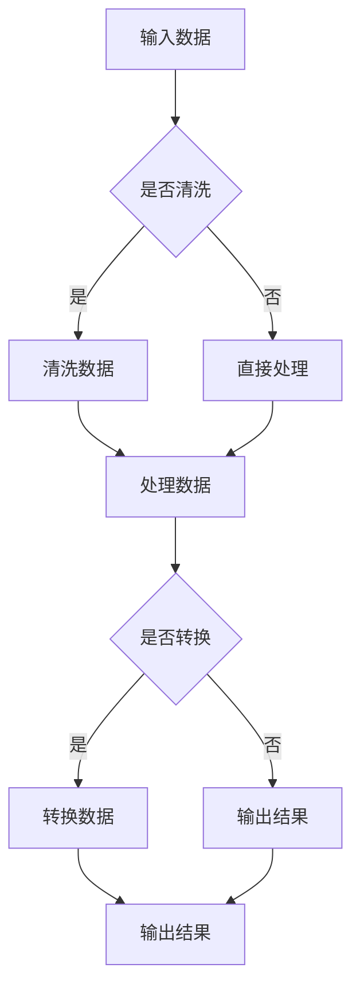

                 

# 《Pig Latin脚本原理与代码实例讲解》

> 关键词：Pig Latin，Hadoop，数据处理，脚本编程，数据类型，聚合操作，逻辑回归模型

> 摘要：本文将深入探讨Pig Latin脚本原理，从基础概念、架构与组件、数据类型、脚本编程、高级特性、脚本优化、实战应用等方面进行详细讲解，并通过实际案例解析Pig Latin脚本在实际项目中的应用，帮助读者全面掌握Pig Latin脚本编程技巧。

## 《Pig Latin脚本原理与代码实例讲解》目录大纲

### 第一部分：Pig Latin基础

1. Pig Latin概述
   1.1 Pig Latin简介
   1.2 Pig Latin的发展历程
   1.3 Pig Latin的应用场景

2. Pig Latin架构与组件
   2.1 Pig Latin架构
   2.2 Pig Latin核心组件
   2.3 Pig Latin与Hadoop的关系

3. Pig Latin数据类型
   3.1 基本数据类型
   3.2 复杂数据类型
   3.3 数据类型的转换与操作

### 第二部分：Pig Latin脚本编程

4. Pig Latin基础语法
   4.1 数据加载与存储
   4.2 脚本结构
   4.3 常用运算符

5. Pig Latin高级特性
   5.1 分组与聚合
   5.2 联合与拆分
   5.3 数据流控制

6. Pig Latin脚本优化
   6.1 脚本性能优化
   6.2 数据处理优化
   6.3 Pig Latin最佳实践

### 第三部分：Pig Latin实战应用

7. Pig Latin在实际项目中的应用
   7.1 数据清洗
   7.2 数据转换
   7.3 数据分析

8. Pig Latin脚本案例解析
   8.1 案例一：用户行为分析
   8.2 案例二：日志处理
   8.3 案例三：数据汇总

9. Pig Latin脚本开发工具与环境
   9.1 Pig Latin开发工具
   9.2 Pig Latin运行环境
   9.3 Pig Latin代码实例解析

## 附录

10. Pig Latin常用函数与操作符
   10.1 常用函数
   10.1.1 字符串处理函数
   10.1.2 数学计算函数
   10.1.3 日期和时间函数

   10.2 操作符
   10.2.1 算数运算符
   10.2.2 比较运算符
   10.2.3 逻辑运算符

### Mermaid 流程图



## Pig Latin核心算法原理讲解

### 聚合操作

#### 定义

聚合操作是对一个或多个数据集进行汇总操作，生成单个结果。在Pig Latin中，聚合操作通常用于对数据集进行分组和计算汇总统计。

#### 伪代码

```python
GROUP BY key {
    sum("field1");
    avg("field2");
    max("field3");
    min("field4");
}
```

#### 举例说明

```latex
$$
输入数据：
id, value
1, 10
1, 20
2, 30
2, 40

聚合结果：
GROUP BY id
id, sum(value), avg(value), max(value), min(value)
1, 30, 20, 20, 10
2, 70, 35, 40, 30
$$
```

### 逻辑回归模型

#### 定义

逻辑回归是一种用于分类问题的预测模型，其输出概率值并进行分类。逻辑回归模型通过参数估计来实现对未知样本的分类。

#### 数学公式

```latex
$$
P(Y=1 | X) = \frac{1}{1 + e^{-(\beta_0 + \beta_1 x_1 + \beta_2 x_2 + ... + \beta_n x_n})}
$$
```

#### 举例说明

```plaintext
输入特征：
x1, x2, x3
1, 2, 3

模型参数：
β0 = 0
β1 = 1
β2 = 1
β3 = 1

预测结果：
P(Y=1) = 1 / (1 + e^{-(0 + 1*1 + 1*2 + 1*3)}) = 1 / (1 + e^{-6}) ≈ 0.9999
因为P(Y=1)接近1，所以预测类别为1。
```

### 项目实战

#### 数据清洗案例

##### 背景

一个电子商务网站需要对其销售数据集进行清洗，以便进行分析。

##### 开发环境

使用Pig Latin和Hadoop生态系统进行数据处理。

##### 步骤

1. 数据加载：将销售数据导入HDFS。
2. 数据预处理：去除无效数据和异常值。
3. 数据转换：将数据转换为适合分析的结构。
4. 数据存储：将清洗后的数据存储到HDFS或Hive表中。

##### 源代码实现

```pig
-- 加载数据
data = LOAD '/user/data/sales_data.csv' USING PigStorage(',') AS (id:chararray, date:chararray, product:chararray, quantity:int, price:float);

-- 去除无效数据
valid_data = FILTER data BY id matches '^[0-9]+$' AND quantity > 0 AND price > 0;

-- 转换数据格式
transformed_data = FOREACH valid_data GENERATE id, TO_DATE(date, 'yyyy-MM-dd') AS date, product, quantity, price;

-- 存储数据
STORE transformed_data INTO '/user/data/clean_sales_data' USING PigStorage(',');
```

##### 代码解读与分析

1. 数据加载：使用LOAD操作加载CSV格式的销售数据。
2. 数据预处理：使用FILTER操作去除无效数据和异常值。
3. 数据转换：使用FOREACH操作将日期字段转换为日期类型。
4. 数据存储：使用STORE操作将清洗后的数据存储到指定的路径中。

### Pig Latin常用函数与操作符

#### 常用函数

- **字符串处理函数**：`CONCAT`, `SUBSTRING`, `LOWER`, `UPPER`, `LENGTH`
- **数学计算函数**：`ABS`, `SQRT`, `POWER`, `MAX`, `MIN`
- **日期和时间函数**：`DATE`, `TIMESTAMP`, `TO_DATE`, `DATEDIFF`

#### 操作符

- **算数运算符**：`+`, `-`, `*`, `/`
- **比较运算符**：`==`, `!=`, `<`, `>`, `<=`, `>=`
- **逻辑运算符**：`AND`, `OR`, `NOT`

---

以上是《Pig Latin脚本原理与代码实例讲解》的完整目录大纲。每个章节都包含了核心概念、算法原理、数学公式、项目实战以及常用函数和操作符的讲解。这个大纲可以帮助读者全面了解Pig Latin的基础知识、脚本编程以及在实际项目中的应用。

在接下来的章节中，我们将详细讲解Pig Latin的各个部分，帮助读者深入理解并掌握Pig Latin脚本编程技巧。让我们开始这段深入探索之旅吧！

