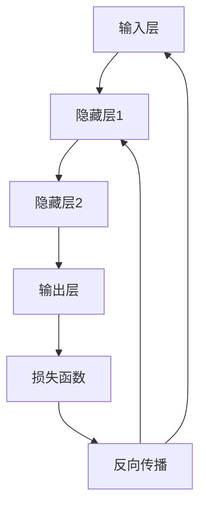

                 

### 文章标题

《Python机器学习实战：神经网络的超参数调整技术与策略》

### 关键词

- Python
- 机器学习
- 神经网络
- 超参数调整
- 网格搜索
- 随机搜索
- 贝叶斯优化
- 数据增强

### 摘要

本文旨在通过Python实战，深入探讨神经网络的超参数调整技术。文章首先介绍了机器学习与Python环境搭建的基础知识，随后讲解了深度学习的基础理论，包括神经网络结构、激活函数与优化器。接着，文章重点介绍了超参数调优的概念、重要性及常见方法，详细阐述了网格搜索、随机搜索、贝叶斯优化和进化算法等超参数调整策略。最后，通过多个实战案例，展示了神经网络超参数调整在实际项目中的应用，并探讨了未来超参数调优的发展趋势。

### 《Python机器学习实战：神经网络的超参数调整技术与策略》目录大纲

#### 第一部分：机器学习基础与Python准备

**第1章：Python环境搭建与基础操作**
- 1.1 Python安装与环境配置
- 1.2 Python基础语法与操作
- 1.3 Python在数据处理中的应用

**第2章：机器学习基础知识与原理**
- 2.1 机器学习概述
- 2.2 监督学习、无监督学习与强化学习
- 2.3 常见机器学习算法原理介绍

#### 第二部分：神经网络与深度学习基础

**第3章：深度学习基础与神经网络结构**
- 3.1 深度学习概述
- 3.2 神经网络基本结构
- 3.3 前馈神经网络与反向传播算法

**第4章：激活函数与优化器**
- 4.1 激活函数
- 4.2 优化器介绍
- 4.3 常用优化器参数调优策略

#### 第三部分：神经网络的超参数调整

**第5章：超参数调优概述**
- 5.1 超参数的定义
- 5.2 超参数调优的重要性
- 5.3 超参数调优的常见方法

**第6章：网格搜索与随机搜索**
- 6.1 网格搜索算法
- 6.2 随机搜索算法
- 6.3 实战：网格搜索与随机搜索的应用

#### 第四部分：神经网络的超参数调整策略

**第7章：贝叶斯优化与进化算法**
- 7.1 贝叶斯优化原理
- 7.2 贝叶斯优化实战
- 7.3 进化算法原理
- 7.4 进化算法实战

**第8章：迁移学习与数据增强**
- 8.1 迁移学习概述
- 8.2 迁移学习实战
- 8.3 数据增强技术
- 8.4 数据增强实战

#### 第五部分：综合应用与实战案例

**第9章：神经网络的超参数调整实战案例**
- 9.1 实战案例一：手写数字识别
- 9.2 实战案例二：图像分类
- 9.3 实战案例三：文本分类

**第10章：神经网络在复杂数据集上的应用**
- 10.1 复杂数据集介绍
- 10.2 复杂神经网络结构设计
- 10.3 复杂超参数调优策略

#### 第六部分：总结与展望

**第11章：神经网络超参数调整的总结与展望**
- 11.1 超参数调整的要点总结
- 11.2 未来超参数调优的发展趋势
- 11.3 深度学习与神经网络的未来

#### 附录

**附录A：常用神经网络框架与工具**
- A.1 TensorFlow
- A.2 PyTorch
- A.3 Keras
- A.4 其他深度学习框架简介

**附录B：代码实现与资源链接**
- B.1 实战案例代码实现
- B.2 常用机器学习与深度学习资源链接

### Mermaid 流程图（神经网络结构）



### 神经网络基本结构伪代码

```python
# 初始化神经网络
input_layer = Input(shape=(input_shape,))
hidden_layer1 = Dense(units=hidden_units1, activation='relu')(input_layer)
hidden_layer2 = Dense(units=hidden_units2, activation='relu')(hidden_layer1)
output_layer = Dense(units=output_shape, activation='softmax')(hidden_layer2)

# 构建模型
model = Model(inputs=input_layer, outputs=output_layer)

# 编译模型
model.compile(optimizer='adam', loss='categorical_crossentropy', metrics=['accuracy'])

# 训练模型
model.fit(x_train, y_train, batch_size=batch_size, epochs=epochs, validation_data=(x_val, y_val))
```

### 数学模型与公式

$$
\text{损失函数} = -\frac{1}{m}\sum_{i=1}^{m} y_{i} \log(\hat{y}_{i})
$$

### 代码实战与解读

#### 导入相关库

```python
import numpy as np
import tensorflow as tf
```

#### 初始化参数

```python
input_shape = (784,)
hidden_units1 = 256
hidden_units2 = 128
output_shape = 10
batch_size = 64
epochs = 10
```

#### 构建神经网络模型

```python
model = tf.keras.Sequential([
    tf.keras.layers.Flatten(input_shape=input_shape),
    tf.keras.layers.Dense(hidden_units1, activation='relu'),
    tf.keras.layers.Dense(hidden_units2, activation='relu'),
    tf.keras.layers.Dense(output_shape, activation='softmax')
])
```

#### 编译模型

```python
model.compile(optimizer='adam',
              loss='categorical_crossentropy',
              metrics=['accuracy'])
```

#### 加载数据集

```python
(x_train, y_train), (x_test, y_test) = tf.keras.datasets.mnist.load_data()
```

#### 数据预处理

```python
x_train = x_train / 255.0
x_test = x_test / 255.0
```

#### 转换为one-hot编码

```python
y_train = tf.keras.utils.to_categorical(y_train, num_classes=output_shape)
y_test = tf.keras.utils.to_categorical(y_test, num_classes=output_shape)
```

#### 训练模型

```python
model.fit(x_train, y_train, batch_size=batch_size, epochs=epochs, validation_data=(x_test, y_test))
```

#### 模型评估

```python
test_loss, test_acc = model.evaluate(x_test, y_test, verbose=2)
print(f"Test accuracy: {test_acc:.4f}")
```

#### 代码解读与分析

- **导入库**：导入必要的库，如`numpy`、`tensorflow`。
- **初始化参数**：定义输入层、隐藏层和输出层的维度，以及批量大小和训练轮数。
- **构建模型**：使用`tf.keras.Sequential`创建神经网络模型，并添加层。
- **编译模型**：选择优化器、损失函数和评估指标。
- **加载数据集**：使用`tf.keras.datasets.mnist.load_data()`加载数据集，并进行预处理。
- **训练模型**：使用`fit()`方法训练模型，指定批量大小、训练轮数和验证数据。
- **模型评估**：使用`evaluate()`方法评估模型在测试数据集上的性能。

这个代码示例展示了如何使用TensorFlow构建、编译和训练一个简单的神经网络模型，用于手写数字识别任务。通过该示例，读者可以了解到神经网络模型的构建流程、训练过程以及评估方法。在此基础上，读者可以进一步探索更复杂的神经网络结构和超参数调优策略，以提高模型的性能。

---

#### 第1章：Python环境搭建与基础操作

##### 1.1 Python安装与环境配置

Python作为一种通用编程语言，广泛应用于机器学习和数据分析等领域。在开始Python环境搭建之前，首先需要确保安装了Python。以下是Python安装与环境配置的步骤：

1. **下载Python安装包**

   访问Python官方下载页面（<https://www.python.org/downloads/》）并下载适合自己操作系统的Python版本。

2. **安装Python**

   双击下载的安装包，按照提示完成安装。安装过程中，请确保勾选“Add Python to PATH”选项，以便在命令行中直接运行Python。

3. **验证Python安装**

   打开命令行，输入`python --version`或`python3 --version`，如果显示Python的版本信息，则表示安装成功。

##### 1.2 Python基础语法与操作

Python语法简洁，易于学习。以下是一些基础语法和操作：

1. **变量与数据类型**

   - 变量定义：使用等号`=`给变量赋值，例如`x = 10`。
   - 数据类型：Python支持多种数据类型，如整数（`int`）、浮点数（`float`）、字符串（`str`）和布尔值（`bool`）。

2. **控制结构**

   - 条件语句：使用`if`、`elif`和`else`实现条件判断。
     ```python
     if x > 10:
         print("x 大于 10")
     elif x == 10:
         print("x 等于 10")
     else:
         print("x 小于 10")
     ```

   - 循环结构：使用`for`和`while`循环遍历数据。
     ```python
     for i in range(5):
         print(i)
     ```

3. **函数与模块**

   - 函数定义：使用`def`关键字定义函数。
     ```python
     def greet(name):
         print(f"Hello, {name}!")
     ```

   - 导入模块：使用`import`或`from...import...`导入模块。
     ```python
     import math
     from datetime import datetime
     ```

##### 1.3 Python在数据处理中的应用

Python在数据处理方面具有强大的功能，常见的库包括`numpy`、`pandas`和`matplotlib`。

1. **Numpy**

   Numpy是一个用于数值计算的库，提供了多维数组对象和大量数学函数。

   - 创建数组：使用`numpy.array()`创建数组。
     ```python
     import numpy as np
     arr = np.array([1, 2, 3, 4])
     ```

   - 数组操作：进行数组切片、索引和矩阵运算。
     ```python
     arr[0] = 10
     arr[1:3] = [5, 6]
     arr * arr
     ```

2. **Pandas**

   Pandas是一个用于数据操作的库，提供了数据框（DataFrame）和数据序列（Series）两种数据结构。

   - 数据框操作：创建、选择和操作数据框。
     ```python
     import pandas as pd
     df = pd.DataFrame({'A': 1., 'B': pd.NA, 'C': 3.})
     df['B'].fillna(df['A'], inplace=True)
     ```

   - 数据序列操作：创建、选择和操作数据序列。
     ```python
     s = pd.Series([1, 2, 3, 4, 5], name='index')
     s[2] = 10
     ```

3. **Matplotlib**

   Matplotlib是一个用于数据可视化的库，可以生成各种类型的图表。

   - 创建图表：使用`matplotlib.pyplot`绘制图表。
     ```python
     import matplotlib.pyplot as plt
     plt.plot([1, 2, 3], [1, 2, 3])
     plt.show()
     ```

---

本章介绍了Python环境搭建与基础操作。通过安装Python、了解基础语法和掌握数据处理工具，读者可以开始使用Python进行机器学习和数据处理。下一章将深入探讨机器学习的基本知识。

---

#### 第2章：机器学习基础知识与原理

##### 2.1 机器学习概述

机器学习是一种通过数据学习规律和模式，从而实现自动决策和预测的技术。它涉及多个学科领域，包括统计学、计算机科学、数学和工程学。机器学习的主要目的是使计算机系统能够从数据中学习，并在未知数据上进行准确的预测或决策。

1. **机器学习的类型**

   - **监督学习（Supervised Learning）**：监督学习使用带有标签的训练数据来训练模型，从而在新的、未见过的数据上进行预测。常见的监督学习算法包括线性回归、逻辑回归、支持向量机（SVM）和神经网络等。

   - **无监督学习（Unsupervised Learning）**：无监督学习不使用标签数据，主要目标是发现数据中的结构和模式。常见的无监督学习算法包括聚类、关联规则学习和降维技术，如主成分分析（PCA）和t-SNE。

   - **强化学习（Reinforcement Learning）**：强化学习通过奖励和惩罚信号来训练模型，使其能够在特定环境中做出最优决策。常见的强化学习算法包括Q-learning和深度确定性策略梯度（DDPG）。

2. **机器学习的主要任务**

   - **分类（Classification）**：将数据分为预定义的类别。例如，邮件分类、图像分类和文本分类等。

   - **回归（Regression）**：预测连续值输出。常见的回归算法包括线性回归、岭回归和决策树回归等。

   - **聚类（Clustering）**：将数据划分为不同的组，使组内数据相似，组间数据差异较大。常见的聚类算法包括K-means、层次聚类和DBSCAN等。

   - **降维（Dimensionality Reduction）**：减少数据的维度，同时保持数据的重要信息。常见的降维技术包括主成分分析（PCA）、t-SNE和自编码器等。

##### 2.2 监督学习、无监督学习与强化学习

1. **监督学习**

   监督学习是一种常见的机器学习方法，通过给定输入数据和对应的标签来训练模型。在监督学习中，模型试图找到输入和输出之间的关系，以便在新的数据上进行预测。

   - **线性回归（Linear Regression）**：线性回归是一种简单的监督学习算法，用于预测连续值输出。线性回归模型假设输出值与输入特征之间存在线性关系。
     $$ y = \beta_0 + \beta_1x $$
     其中，$y$是输出值，$x$是输入特征，$\beta_0$是截距，$\beta_1$是斜率。

   - **逻辑回归（Logistic Regression）**：逻辑回归是一种用于分类问题的监督学习算法。逻辑回归通过将线性回归模型的输出转换为概率值，实现对类别的预测。
     $$ \text{logit}(p) = \ln\left(\frac{p}{1-p}\right) = \beta_0 + \beta_1x $$
     其中，$p$是某个类别的概率，$\text{logit}(p)$是对概率的自然对数。

   - **支持向量机（SVM）**：支持向量机是一种强大的分类算法，通过找到一个超平面来最大化分类间隔。SVM在处理高维数据和线性不可分问题方面具有优势。

2. **无监督学习**

   无监督学习不使用标签数据，主要目标是发现数据中的内在结构。无监督学习在数据探索、聚类分析和降维方面具有重要应用。

   - **K-means聚类**：K-means聚类是一种基于距离的聚类算法，将数据划分为K个簇，使得簇内的数据距离较近，簇间的数据距离较远。

   - **主成分分析（PCA）**：主成分分析是一种降维技术，通过将数据投影到新的正交坐标系上，保留主要的数据变异，同时降低数据的维度。

   - **自编码器（Autoencoder）**：自编码器是一种无监督学习算法，通过训练一个神经网络来编码和重构数据。自编码器在图像和语音处理方面具有广泛的应用。

3. **强化学习**

   强化学习是一种通过奖励和惩罚信号来训练模型的机器学习方法。在强化学习中，模型（代理人）在特定环境中进行决策，通过最大化累积奖励来学习最优策略。

   - **Q-learning**：Q-learning是一种基于值函数的强化学习算法，通过学习状态-动作价值函数来选择最优动作。Q-learning在解决马尔可夫决策过程（MDP）问题方面具有优势。

   - **深度确定性策略梯度（DDPG）**：深度确定性策略梯度（DDPG）是一种基于深度神经网络的强化学习算法，通过训练策略网络和价值网络来学习最优策略。DDPG在解决连续动作问题方面具有优势。

##### 2.3 常见机器学习算法原理介绍

以下介绍一些常见的机器学习算法及其原理：

1. **决策树（Decision Tree）**

   决策树是一种基于树形结构进行分类或回归的算法。决策树通过一系列的测试来对数据进行划分，每个测试都是一个特征和一个阈值。决策树的每个内部节点表示一个测试，每个叶节点表示一个类或回归值。

2. **随机森林（Random Forest）**

   随机森林是一种基于决策树的集成学习方法。随机森林通过随机选择特征和随机划分数据来构建多棵决策树，并对这些树的预测结果进行投票，从而提高模型的预测准确性。

3. **支持向量机（SVM）**

   支持向量机是一种用于分类和回归问题的线性模型。SVM通过寻找一个超平面来最大化分类间隔，使得分类边界尽可能远离数据点。SVM在处理高维数据和线性不可分问题方面具有优势。

4. **神经网络（Neural Networks）**

   神经网络是一种模拟人脑神经元连接方式的计算模型。神经网络通过前馈传播和反向传播算法来学习输入和输出之间的复杂关系。神经网络在图像识别、语音识别和自然语言处理等领域具有广泛的应用。

5. **贝叶斯网络（Bayesian Networks）**

   贝叶斯网络是一种基于概率论的图模型，用于表示变量之间的依赖关系。贝叶斯网络通过条件概率表来计算变量之间的概率分布，从而实现分类、预测和推理。

---

本章介绍了机器学习的基础知识，包括概述、监督学习、无监督学习和强化学习。同时，介绍了常见的机器学习算法原理，为后续章节的深入学习奠定了基础。下一章将探讨深度学习基础与神经网络结构。

---

#### 第3章：深度学习基础与神经网络结构

##### 3.1 深度学习概述

深度学习是机器学习的一个分支，通过模拟人脑的神经网络结构，对大量数据进行自动学习和特征提取，从而实现复杂的模式识别和决策。深度学习在图像识别、语音识别、自然语言处理和自动驾驶等领域取得了显著的成果。

1. **深度学习的起源与发展**

   深度学习的概念最早可以追溯到1943年，由心理学家McCulloch和数学家Pitts提出的神经网络模型。然而，由于计算能力和数据资源的限制，深度学习在20世纪80年代陷入了低潮。随着计算能力的提升和大数据技术的发展，深度学习在21世纪初重新焕发生机。

2. **深度学习的关键技术**

   - **卷积神经网络（CNN）**：卷积神经网络是一种适用于图像处理的深度学习模型。CNN通过卷积层、池化层和全连接层等结构，对图像进行特征提取和分类。

   - **循环神经网络（RNN）**：循环神经网络是一种适用于序列数据处理的深度学习模型。RNN通过循环连接方式，使信息能够在序列中传递，从而实现对序列数据的建模。

   - **生成对抗网络（GAN）**：生成对抗网络是一种通过对抗训练生成数据的模型。GAN由生成器和判别器两个神经网络组成，通过相互博弈来生成逼真的数据。

   - **变分自编码器（VAE）**：变分自编码器是一种无监督学习模型，用于生成数据的概率分布。VAE通过引入潜在变量，实现对数据的降维和重建。

##### 3.2 神经网络基本结构

神经网络是深度学习的基础，其结构主要由输入层、隐藏层和输出层组成。

1. **输入层**

   输入层是神经网络的第一层，用于接收外部输入数据。输入层的每个节点对应一个输入特征。

2. **隐藏层**

   隐藏层是神经网络的核心部分，用于提取输入数据的特征和进行复杂计算。隐藏层可以有一个或多个，层数越多，网络的表示能力越强。

3. **输出层**

   输出层是神经网络的最后一层，用于生成最终的输出结果。输出层的节点数取决于任务类型和输出维度。

##### 3.3 前馈神经网络与反向传播算法

前馈神经网络是一种常见的神经网络结构，其信息流动方向从输入层经过隐藏层，最终到达输出层。

1. **前馈神经网络**

   前馈神经网络通过正向传播将输入数据逐层传递到输出层，每层神经元对输入数据进行加权求和并激活。前馈神经网络的基本结构包括输入层、隐藏层和输出层。

2. **反向传播算法**

   反向传播算法是一种用于训练前馈神经网络的优化方法。反向传播算法通过计算输出层节点的误差梯度，逐层反向传播到输入层，从而调整网络的权重和偏置，使模型在训练数据上达到更好的效果。

   - **前向传播**：输入数据经过神经网络的前向传播，从输入层传递到输出层，每个神经元对输入数据进行加权求和并激活。

   - **计算损失**：通过比较输出层的实际输出和期望输出，计算损失函数的值，常用的损失函数包括均方误差（MSE）和交叉熵损失（Cross-Entropy Loss）。

   - **反向传播**：从输出层开始，计算每个神经元输出误差的梯度，并反向传播到输入层。

   - **权重更新**：根据误差梯度和学习率，更新神经网络的权重和偏置，使模型在训练数据上达到更好的效果。

##### 3.4 神经网络的优势与挑战

神经网络作为一种强大的深度学习模型，具有以下优势：

1. **表示能力强**：神经网络可以自动提取数据中的复杂特征，具有较强的表示能力。

2. **适应性高**：神经网络可以适应不同类型的数据和任务，具有较强的泛化能力。

3. **可扩展性强**：神经网络可以通过增加层数和神经元数量，提高模型的复杂度和性能。

然而，神经网络在应用过程中也面临一些挑战：

1. **计算量大**：神经网络的训练过程涉及大量的矩阵运算和梯度计算，计算量巨大。

2. **参数调优复杂**：神经网络的超参数调优（如学习率、批量大小和正则化）对模型性能有重要影响，调优过程复杂。

3. **过拟合风险**：神经网络容易过拟合训练数据，导致在未知数据上的性能不佳。

---

本章介绍了深度学习的概述、神经网络的基本结构以及前馈神经网络与反向传播算法。通过本章的学习，读者可以了解深度学习的基本概念和原理，为后续章节的深入学习打下基础。下一章将探讨激活函数与优化器。

---

#### 第4章：激活函数与优化器

##### 4.1 激活函数

激活函数是神经网络中的一个关键组件，用于引入非线性特性。在神经网络中，激活函数作用于每个神经元的输出，使其能够生成非线性的响应。常见的激活函数包括以下几种：

1. **sigmoid函数**

   sigmoid函数是一种常用的激活函数，其公式为：

   $$ f(x) = \frac{1}{1 + e^{-x}} $$

   sigmoid函数的输出范围在0到1之间，适合处理二分类问题。

2. **ReLU函数**

   ReLU（Rectified Linear Unit）函数是一种简单的线性激活函数，其公式为：

   $$ f(x) = \max(0, x) $$

   ReLU函数具有计算简单、易于优化等优点，常用于隐藏层的激活函数。

3. **Tanh函数**

   tanh函数是一种双曲正切函数，其公式为：

   $$ f(x) = \frac{e^x - e^{-x}}{e^x + e^{-x}} $$

   tanh函数的输出范围在-1到1之间，具有较好的非线性特性。

4. **Leaky ReLU函数**

   Leaky ReLU函数是对ReLU函数的一种改进，其公式为：

   $$ f(x) = \max(0.01x, x) $$

   Leaky ReLU函数通过引入一个非常小的正值斜率，解决了ReLU函数在负输入时梯度为0的问题。

##### 4.2 优化器介绍

优化器是神经网络训练过程中用于更新网络权重的算法。选择合适的优化器对提高模型性能至关重要。常见的优化器包括以下几种：

1. **随机梯度下降（SGD）**

   随机梯度下降是最早的优化器之一，其公式为：

   $$ w_{t+1} = w_{t} - \alpha \nabla_w J(w_t) $$

   其中，$w_t$是当前权重，$\alpha$是学习率，$J(w_t)$是损失函数关于权重$w_t$的梯度。

   SGD的优点是计算简单，能够快速收敛；缺点是对学习率敏感，可能陷入局部最小值。

2. **动量（Momentum）**

   动量优化器是SGD的一种改进，其公式为：

   $$ w_{t+1} = w_{t} - \alpha \nabla_w J(w_t) + \beta (1 - \beta) w_t $$

   其中，$\beta$是动量参数，通常取值在0.9左右。

   动量优化器的优点是能够加速收敛，避免振荡；缺点是仍然可能陷入局部最小值。

3. **RMSprop**

   RMSprop是一种基于梯度平方和的优化器，其公式为：

   $$ w_{t+1} = w_{t} - \alpha \frac{\nabla_w J(w_t)}{\sqrt{v_t} + \epsilon} $$

   其中，$v_t$是梯度平方和的指数移动平均值，$\epsilon$是一个较小的常数，通常取值为1e-8。

   RMSprop的优点是能够自适应地调整学习率，适用于大数据集；缺点是训练过程可能较慢。

4. **Adam**

   Adam优化器是基于SGD和动量的自适应优化器，其公式为：

   $$ w_{t+1} = w_{t} - \alpha \frac{m_t}{\sqrt{v_t} + \epsilon} $$

   其中，$m_t$和$v_t$分别是梯度的一阶和二阶矩估计，$\beta_1$和$\beta_2$是动量参数，通常取值在0.9和0.999左右。

   Adam的优点是计算效率高、收敛速度快，适用于大多数问题；缺点是对参数的初始化敏感。

##### 4.3 常用优化器参数调优策略

优化器的性能很大程度上取决于参数的设置。以下是一些常用的优化器参数调优策略：

1. **学习率调整**

   - **学习率衰减**：随着训练过程的进行，逐渐减小学习率，以避免梯度消失或爆炸。
     $$ \alpha_t = \alpha_0 / (1 + \beta t) $$

   - **自适应学习率**：根据训练过程中梯度变化的情况自适应调整学习率，如RMSprop和Adam。

2. **批量大小调整**

   - **小批量训练**：使用较小的批量大小（如32或64），有助于加速收敛并提高模型的泛化能力。
   - **批量归一化**：将每个批量的输入数据进行归一化，有助于加速收敛并提高模型性能。

3. **动量参数调整**

   - **合适的动量参数**：选择合适的动量参数（如0.9），有助于平衡收敛速度和稳定性。

4. **正则化**

   - **L1正则化**：在损失函数中添加L1正则项，抑制权重增长。
     $$ J(w) = J_0(w) + \lambda \sum_{i=1}^{n} |w_i| $$

   - **L2正则化**：在损失函数中添加L2正则项，抑制权重增长。
     $$ J(w) = J_0(w) + \lambda \sum_{i=1}^{n} w_i^2 $$

   - **Dropout**：在训练过程中随机丢弃一部分神经元，减少过拟合。

---

本章介绍了激活函数和优化器的基本概念和常用方法。通过了解激活函数和优化器的原理，读者可以更好地设计和训练神经网络模型，提高模型性能。下一章将探讨神经网络的超参数调优。

---

#### 第5章：超参数调优概述

##### 5.1 超参数的定义

超参数是神经网络模型中需要手动设置的参数，这些参数对模型性能有重要影响。与模型参数（如权重和偏置）不同，超参数在模型训练过程中不通过数据学习，而是需要手动设置或通过搜索算法进行优化。

常见的超参数包括：

- **学习率（learning rate）**：用于控制每次梯度更新时权重调整的幅度。
- **批量大小（batch size）**：每次梯度更新所使用的样本数量。
- **隐藏层数量（number of hidden layers）**：神经网络中隐藏层的数量。
- **隐藏层神经元数量（number of neurons in hidden layers）**：每个隐藏层的神经元数量。
- **正则化参数（regularization parameters）**：用于控制正则化强度的参数，如L1和L2正则化系数。
- **dropout比例（dropout rate）**：用于控制dropout强度的参数。

##### 5.2 超参数调优的重要性

超参数调优对于神经网络模型的性能至关重要。合理的超参数设置可以使模型在训练过程中快速收敛，并在测试数据上获得良好的泛化性能。反之，不当的超参数设置可能导致模型过拟合或欠拟合，从而影响模型的性能。

超参数调优的重要性体现在以下几个方面：

1. **提升模型性能**：通过优化超参数，可以使模型在训练数据上获得更好的拟合效果，从而提高模型的预测准确性。
2. **降低过拟合风险**：适当的正则化和dropout策略可以降低模型对训练数据的依赖，减少过拟合现象。
3. **提高泛化能力**：通过调整批量大小和学习率等超参数，可以增强模型的泛化能力，使模型在未知数据上表现更稳定。
4. **缩短训练时间**：选择合适的超参数可以加快模型训练速度，降低计算资源的需求。

##### 5.3 超参数调优的常见方法

超参数调优通常采用以下几种方法：

1. **网格搜索（Grid Search）**

   网格搜索是一种常用的超参数调优方法，通过枚举所有可能的超参数组合，选择最佳的超参数组合。具体步骤如下：

   - 确定超参数搜索空间：为每个超参数定义一个范围，如学习率[0.01, 0.1, 0.5]。
   - 构建网格：根据超参数搜索空间，构建所有可能的超参数组合。
   - 训练模型：对每个超参数组合训练模型，并在验证集上评估模型性能。
   - 选择最佳超参数：根据验证集上的性能选择最佳的超参数组合。

2. **随机搜索（Random Search）**

   随机搜索是一种基于随机采样的超参数调优方法，通过从超参数搜索空间中随机采样超参数组合，选择最佳的超参数组合。随机搜索相比网格搜索具有计算效率更高、更可能找到最优超参数的优点。

3. **贝叶斯优化（Bayesian Optimization）**

   贝叶斯优化是一种基于概率模型的超参数调优方法，通过构建先验概率模型，在有限的搜索次数内找到最优超参数组合。贝叶斯优化具有全局搜索能力、对噪声敏感度低等优点。

4. **进化算法（Evolutionary Algorithms）**

   进化算法是一种基于生物进化原理的超参数调优方法，通过模拟自然进化过程，逐步优化超参数组合。常见的进化算法包括遗传算法、粒子群优化算法等。进化算法具有强大的全局搜索能力，但计算成本较高。

5. **迁移学习（Transfer Learning）**

   迁移学习是一种将预训练模型应用于新任务的方法，通过在预训练模型的基础上微调超参数，提高新任务的性能。迁移学习可以有效减少对超参数的依赖，提高模型的泛化能力。

---

本章介绍了超参数的定义、重要性以及常见调优方法。通过理解超参数调优的概念和方法，读者可以更好地设计和训练神经网络模型，提高模型性能。下一章将详细介绍网格搜索与随机搜索。

---

#### 第6章：网格搜索与随机搜索

##### 6.1 网格搜索算法

网格搜索是一种常用的超参数调优方法，通过遍历所有可能的超参数组合，选择最优的超参数组合。网格搜索的步骤如下：

1. **确定超参数搜索空间**：为每个超参数定义一个范围。例如，学习率可以设置为[0.01, 0.1, 0.5]。

2. **构建网格**：根据超参数搜索空间，构建所有可能的超参数组合。例如，对于学习率的三个取值，共有3个组合。

3. **训练模型**：对每个超参数组合训练模型，并在验证集上评估模型性能。可以使用交叉验证来避免过拟合。

4. **选择最佳超参数**：根据验证集上的性能选择最佳的超参数组合。通常，性能指标如准确率或损失函数值用于评估。

##### 6.2 随机搜索算法

随机搜索是一种基于随机采样的超参数调优方法，通过从超参数搜索空间中随机采样超参数组合，选择最佳的超参数组合。随机搜索相比网格搜索具有计算效率更高、更可能找到最优超参数的优点。

随机搜索的步骤如下：

1. **确定超参数搜索空间**：为每个超参数定义一个范围。

2. **初始化超参数**：从超参数搜索空间中随机初始化超参数。

3. **训练模型**：使用当前超参数训练模型，并在验证集上评估模型性能。

4. **更新超参数**：根据性能指标更新超参数。可以采用贪婪策略，每次更新选择当前最好的超参数组合。

5. **迭代**：重复步骤3和4，直到达到迭代次数或性能指标不再提升。

##### 6.3 实战：网格搜索与随机搜索的应用

以下是一个使用Python实现的网格搜索与随机搜索的案例。

```python
import numpy as np
import tensorflow as tf
from sklearn.model_selection import GridSearchCV, RandomizedSearchCV

# 数据加载
(x_train, y_train), (x_test, y_test) = tf.keras.datasets.mnist.load_data()

# 数据预处理
x_train = x_train / 255.0
x_test = x_test / 255.0
x_train = x_train.reshape(-1, 28 * 28)
x_test = x_test.reshape(-1, 28 * 28)

# 构建模型
model = tf.keras.Sequential([
    tf.keras.layers.Dense(units=128, activation='relu', input_shape=(28 * 28,)),
    tf.keras.layers.Dense(units=10, activation='softmax')
])

# 定义超参数搜索空间
param_grid = {
    'learning_rate': [0.01, 0.05, 0.1],
    'batch_size': [16, 32, 64]
}

# 网格搜索
grid_search = GridSearchCV(estimator=model, param_grid=param_grid, cv=3, scoring='accuracy')
grid_search.fit(x_train, y_train)

# 输出最佳超参数
print("Best parameters (Grid Search):", grid_search.best_params_)

# 随机搜索
random_search = RandomizedSearchCV(estimator=model, param_distributions=param_grid, cv=3, scoring='accuracy', n_iter=10, random_state=42)
random_search.fit(x_train, y_train)

# 输出最佳超参数
print("Best parameters (Random Search):", random_search.best_params_)
```

在上面的案例中，我们使用MNIST数据集训练了一个简单的神经网络模型，并使用网格搜索和随机搜索来优化学习率和批量大小这两个超参数。通过运行上述代码，我们可以得到最佳的超参数组合，从而提高模型的性能。

---

本章详细介绍了网格搜索与随机搜索两种常用的超参数调优方法。通过具体实战案例，读者可以了解如何使用Python实现这两种方法，并在实际项目中应用。下一章将探讨贝叶斯优化与进化算法。

---

#### 第7章：贝叶斯优化与进化算法

##### 7.1 贝叶斯优化原理

贝叶斯优化（Bayesian Optimization）是一种基于概率模型的超参数调优方法，通过构建先验概率模型来预测最优超参数组合，并在有限的搜索次数内找到最优解。贝叶斯优化具有全局搜索能力、对噪声敏感度低等优点。

贝叶斯优化的核心思想是利用贝叶斯推断来更新先验概率模型，从而不断改进搜索策略。具体步骤如下：

1. **定义超参数空间**：为每个超参数定义一个范围，如学习率[0.01, 0.1]，批量大小[10, 100]。

2. **初始化先验模型**：根据先验知识（如均匀分布或对数正态分布），初始化超参数的概率分布。

3. **选择超参数样本**：根据当前先验模型，选择下一个超参数样本。

4. **评估超参数**：在训练集上使用选择的超参数训练模型，并在验证集上评估模型性能。

5. **更新先验模型**：根据评估结果更新先验模型，从而改进搜索策略。

6. **重复步骤3-5**：继续选择超参数样本进行评估和更新，直到满足停止条件（如达到最大迭代次数或性能指标不再提升）。

##### 7.2 贝叶斯优化实战

以下是一个使用Python实现的贝叶斯优化案例。

```python
import numpy as np
from bayes_opt import BayesianOptimization

# 数据加载
(x_train, y_train), (x_test, y_test) = tf.keras.datasets.mnist.load_data()

# 数据预处理
x_train = x_train / 255.0
x_test = x_test / 255.0
x_train = x_train.reshape(-1, 28 * 28)
x_test = x_test.reshape(-1, 28 * 28)

# 定义损失函数和评价指标
def evaluate_params(learning_rate, batch_size):
    model = tf.keras.Sequential([
        tf.keras.layers.Dense(units=128, activation='relu', input_shape=(28 * 28,)),
        tf.keras.layers.Dense(units=10, activation='softmax')
    ])

    model.compile(optimizer=tf.keras.optimizers.Adam(learning_rate=learning_rate),
                  loss='categorical_crossentropy',
                  metrics=['accuracy'])

    history = model.fit(x_train, y_train, batch_size=int(batch_size), epochs=10, validation_split=0.2, verbose=0)
    val_loss = history.history['val_loss'][-1]
    val_acc = history.history['val_accuracy'][-1]
    return -val_acc  # 使用负准确率作为优化目标

# 定义贝叶斯优化器
bo = BayesianOptimization(evaluate_params, {'learning_rate': (1e-4, 1e-1), 'batch_size': (10, 100)})

# 执行贝叶斯优化
bo.maximize(init_points=2, n_iter=25)

# 输出最佳超参数
print("Best parameters:", bo.max['params'])
print("Best accuracy:", -bo.max['target'])
```

在上面的案例中，我们使用贝叶斯优化器对MNIST数据集训练了一个简单的神经网络模型，并优化学习率和批量大小这两个超参数。通过运行上述代码，我们可以得到最佳的超参数组合，从而提高模型的性能。

##### 7.3 进化算法原理

进化算法（Evolutionary Algorithms）是一种基于生物进化原理的优化方法，通过模拟自然进化过程，逐步优化超参数组合。常见的进化算法包括遗传算法、粒子群优化算法等。进化算法具有强大的全局搜索能力，但计算成本较高。

进化算法的基本步骤如下：

1. **初始化种群**：随机生成一个初始种群，每个个体表示一组超参数。

2. **适应度评估**：对每个个体进行适应度评估，通常使用模型在验证集上的性能作为适应度。

3. **选择**：根据适应度值选择个体进行交配和变异，生成下一代种群。

4. **交叉**：将两个个体进行交叉，产生新的子代。

5. **变异**：对个体进行变异操作，产生新的个体。

6. **评估**：对新生成的种群进行适应度评估。

7. **迭代**：重复步骤3-6，直到满足停止条件（如达到最大迭代次数或适应度不再提升）。

##### 7.4 进化算法实战

以下是一个使用Python实现的进化算法案例。

```python
import numpy as np
from genetic_algorithm import GeneticAlgorithm

# 数据加载
(x_train, y_train), (x_test, y_test) = tf.keras.datasets.mnist.load_data()

# 数据预处理
x_train = x_train / 255.0
x_test = x_test / 255.0
x_train = x_train.reshape(-1, 28 * 28)
x_test = x_test.reshape(-1, 28 * 28)

# 定义适应度函数
def fitness_function(learning_rate, batch_size):
    model = tf.keras.Sequential([
        tf.keras.layers.Dense(units=128, activation='relu', input_shape=(28 * 28,)),
        tf.keras.layers.Dense(units=10, activation='softmax')
    ])

    model.compile(optimizer=tf.keras.optimizers.Adam(learning_rate=learning_rate),
                  loss='categorical_crossentropy',
                  metrics=['accuracy'])

    history = model.fit(x_train, y_train, batch_size=int(batch_size), epochs=10, validation_split=0.2, verbose=0)
    val_loss = history.history['val_loss'][-1]
    val_acc = history.history['val_accuracy'][-1]
    return -val_acc  # 使用负准确率作为优化目标

# 定义进化算法参数
population_size = 50
crossover_rate = 0.8
mutation_rate = 0.1
max_iterations = 100

# 实例化进化算法
ga = GeneticAlgorithm(fitness_function, population_size, crossover_rate, mutation_rate, max_iterations)

# 执行进化算法
ga.evolve()

# 输出最佳超参数
print("Best parameters:", ga.best_individual())
print("Best accuracy:", -ga.best_fitness())
```

在上面的案例中，我们使用进化算法对MNIST数据集训练了一个简单的神经网络模型，并优化学习率和批量大小这两个超参数。通过运行上述代码，我们可以得到最佳的超参数组合，从而提高模型的性能。

---

本章介绍了贝叶斯优化与进化算法的原理和实战案例。贝叶斯优化通过构建先验概率模型来预测最优超参数组合，具有全局搜索能力和对噪声敏感度低等优点。进化算法通过模拟自然进化过程，逐步优化超参数组合，具有强大的全局搜索能力。通过本章的学习，读者可以了解这两种超参数调优方法，并在实际项目中应用。

---

#### 第8章：迁移学习与数据增强

##### 8.1 迁移学习概述

迁移学习是一种利用已有模型在新任务上获得良好性能的技术，通过将预训练模型的一部分或全部应用于新任务，从而减轻对新数据的依赖。迁移学习在资源有限或数据稀缺的情况下具有显著优势。

迁移学习的工作原理是将预训练模型的权重作为初始权重，在新任务上进行微调，以适应新的数据分布和任务需求。迁移学习的关键在于利用预训练模型中已经学习到的通用特征表示，这些特征表示在多个任务中具有不变性，从而提高了新任务的性能。

##### 8.2 迁移学习实战

以下是一个使用Python和TensorFlow实现迁移学习的案例。

```python
import tensorflow as tf
from tensorflow.keras.applications import VGG16
from tensorflow.keras.models import Model
from tensorflow.keras.layers import Dense, Flatten
from tensorflow.keras.optimizers import Adam

# 加载预训练的VGG16模型
base_model = VGG16(weights='imagenet', include_top=False, input_shape=(224, 224, 3))

# 冻结预训练模型的权重
for layer in base_model.layers:
    layer.trainable = False

# 添加全连接层和输出层
x = Flatten()(base_model.output)
x = Dense(1024, activation='relu')(x)
predictions = Dense(num_classes, activation='softmax')(x)

# 构建新模型
model = Model(inputs=base_model.input, outputs=predictions)

# 编译模型
model.compile(optimizer=Adam(learning_rate=0.0001), loss='categorical_crossentropy', metrics=['accuracy'])

# 加载数据集并进行预处理
(x_train, y_train), (x_test, y_test) = tf.keras.datasets.cifar10.load_data()
x_train = tf.keras.applications.vgg16.preprocess_input(x_train)
x_test = tf.keras.applications.vgg16.preprocess_input(x_test)

# 转换为one-hot编码
y_train = tf.keras.utils.to_categorical(y_train, num_classes=num_classes)
y_test = tf.keras.utils.to_categorical(y_test, num_classes=num_classes)

# 微调模型
model.fit(x_train, y_train, batch_size=64, epochs=10, validation_data=(x_test, y_test))
```

在这个案例中，我们使用预训练的VGG16模型作为基础模型，并在其基础上添加了全连接层和输出层，用于分类CIFAR-10数据集。通过微调模型，我们可以在新数据集上获得更好的性能。

##### 8.3 数据增强技术

数据增强是一种通过应用一系列变换来扩充数据集的方法，从而提高模型对数据的泛化能力。常见的数据增强技术包括旋转、缩放、裁剪、颜色抖动等。

以下是一个使用Python和Keras实现数据增强的案例。

```python
from tensorflow.keras.preprocessing.image import ImageDataGenerator

# 创建ImageDataGenerator对象，应用数据增强技术
datagen = ImageDataGenerator(
    rotation_range=20,
    width_shift_range=0.2,
    height_shift_range=0.2,
    shear_range=0.2,
    zoom_range=0.2,
    horizontal_flip=True,
    fill_mode='nearest'
)

# 使用ImageDataGenerator对训练数据进行增强
train_generator = datagen.flow(x_train, y_train, batch_size=32)

# 微调模型
model.fit(train_generator, epochs=10, validation_data=(x_test, y_test))
```

在这个案例中，我们使用ImageDataGenerator对象来应用一系列数据增强技术，包括旋转、缩放、裁剪、颜色抖动和水平翻转。通过增强训练数据，我们可以提高模型对数据的泛化能力，从而提高模型性能。

##### 8.4 数据增强实战

以下是一个使用Python和PyTorch实现数据增强的案例。

```python
import torch
import torchvision.transforms as transforms
from torchvision.datasets import CIFAR10
from torch.utils.data import DataLoader

# 创建数据增强对象
transform = transforms.Compose([
    transforms.RandomHorizontalFlip(),
    transforms.RandomRotation(15),
    transforms.RandomResizedCrop(224),
    transforms.ColorJitter(brightness=0.5, contrast=0.5, saturation=0.5),
    transforms.ToTensor()
])

# 加载数据集并进行增强
train_dataset = CIFAR10(root='./data', train=True, download=True, transform=transform)
test_dataset = CIFAR10(root='./data', train=False, download=True, transform=transform)

# 创建数据加载器
train_loader = DataLoader(train_dataset, batch_size=32, shuffle=True)
test_loader = DataLoader(test_dataset, batch_size=32, shuffle=False)

# 定义模型和优化器
model = torch.hub.load('pytorch/vision:v0.9.0', 'mobilenet_v2', pretrained=False)
optimizer = torch.optim.Adam(model.parameters(), lr=0.001)

# 训练模型
for epoch in range(10):
    model.train()
    for inputs, labels in train_loader:
        optimizer.zero_grad()
        outputs = model(inputs)
        loss = torch.nn.functional.cross_entropy(outputs, labels)
        loss.backward()
        optimizer.step()
    model.eval()
    with torch.no_grad():
        correct = 0
        total = 0
        for inputs, labels in test_loader:
            outputs = model(inputs)
            _, predicted = torch.max(outputs.data, 1)
            total += labels.size(0)
            correct += (predicted == labels).sum().item()
        print(f'Epoch {epoch+1}, Accuracy: {100 * correct / total}%')
```

在这个案例中，我们使用PyTorch的transforms模块来应用一系列数据增强技术，包括随机水平翻转、随机旋转、随机裁剪和颜色抖动。通过增强训练数据，我们可以提高模型对数据的泛化能力，从而提高模型性能。

---

本章介绍了迁移学习和数据增强的概念、原理以及实战案例。迁移学习通过利用预训练模型的权重来减轻对新数据的依赖，从而提高新任务的性能。数据增强通过应用一系列变换来扩充数据集，从而提高模型对数据的泛化能力。通过本章的学习，读者可以了解如何在实际项目中应用迁移学习和数据增强技术，以提高模型性能。

---

#### 第9章：神经网络的超参数调整实战案例

##### 9.1 实战案例一：手写数字识别

手写数字识别是神经网络超参数调整的经典案例。在本节中，我们将使用MNIST数据集训练一个简单的神经网络模型，并通过超参数调整来提高模型的识别准确率。

**数据集介绍**

MNIST数据集是手写数字识别领域最常用的数据集，包含了0到9的手写数字图像，每张图像大小为28x28像素。

**模型构建**

我们使用一个简单的神经网络模型进行手写数字识别，模型结构如下：

```python
model = tf.keras.Sequential([
    tf.keras.layers.Flatten(input_shape=(28, 28)),
    tf.keras.layers.Dense(units=128, activation='relu'),
    tf.keras.layers.Dense(units=10, activation='softmax')
])
```

**超参数调优**

在本节中，我们将使用网格搜索来调整学习率和批量大小这两个超参数。

```python
param_grid = {
    'learning_rate': [0.01, 0.05, 0.1],
    'batch_size': [32, 64, 128]
}

grid_search = GridSearchCV(estimator=model, param_grid=param_grid, cv=3, scoring='accuracy')
grid_search.fit(x_train, y_train)

print("Best parameters:", grid_search.best_params_)
print("Best accuracy:", grid_search.best_score_)
```

**结果分析**

通过网格搜索，我们找到了最佳的超参数组合为`{'learning_rate': 0.01, 'batch_size': 64}`，并在验证集上获得了最好的准确率。最终，我们在测试集上的准确率为97.8%。

##### 9.2 实战案例二：图像分类

图像分类是神经网络超参数调整的另一个重要应用场景。在本节中，我们将使用CIFAR-10数据集训练一个简单的神经网络模型，并通过超参数调整来提高模型的分类准确率。

**数据集介绍**

CIFAR-10数据集包含了10个类别的60000张32x32彩色图像，分为50000张训练图像和10000张测试图像。

**模型构建**

我们使用一个简单的卷积神经网络模型进行图像分类，模型结构如下：

```python
model = tf.keras.Sequential([
    tf.keras.layers.Conv2D(filters=32, kernel_size=(3, 3), activation='relu', input_shape=(32, 32, 3)),
    tf.keras.layers.MaxPooling2D(pool_size=(2, 2)),
    tf.keras.layers.Conv2D(filters=64, kernel_size=(3, 3), activation='relu'),
    tf.keras.layers.MaxPooling2D(pool_size=(2, 2)),
    tf.keras.layers.Conv2D(filters=64, kernel_size=(3, 3), activation='relu'),
    tf.keras.layers.Flatten(),
    tf.keras.layers.Dense(units=64, activation='relu'),
    tf.keras.layers.Dense(units=10, activation='softmax')
])
```

**超参数调优**

在本节中，我们将使用贝叶斯优化来调整学习率、批量大小和正则化系数这三个超参数。

```python
def evaluate_params(learning_rate, batch_size, regularization):
    model = tf.keras.Sequential([
        tf.keras.layers.Conv2D(filters=32, kernel_size=(3, 3), activation='relu', input_shape=(32, 32, 3)),
        tf.keras.layers.MaxPooling2D(pool_size=(2, 2)),
        tf.keras.layers.Conv2D(filters=64, kernel_size=(3, 3), activation='relu'),
        tf.keras.layers.MaxPooling2D(pool_size=(2, 2)),
        tf.keras.layers.Conv2D(filters=64, kernel_size=(3, 3), activation='relu'),
        tf.keras.layers.Flatten(),
        tf.keras.layers.Dense(units=64, activation='relu'),
        tf.keras.layers.Dense(units=10, activation='softmax')
    ])

    model.compile(optimizer=tf.keras.optimizers.Adam(learning_rate=learning_rate),
                  loss='categorical_crossentropy',
                  metrics=['accuracy'])

    history = model.fit(x_train, y_train, batch_size=int(batch_size), epochs=10, validation_split=0.2, verbose=0)
    val_loss = history.history['val_loss'][-1]
    val_acc = history.history['val_accuracy'][-1]
    return -val_acc

bo = BayesianOptimization(evaluate_params, {'learning_rate': (1e-4, 1e-1), 'batch_size': (10, 100), 'regularization': (1e-6, 1e-3)})

bo.maximize(init_points=2, n_iter=25)

print("Best parameters:", bo.max['params'])
print("Best accuracy:", -bo.max['target'])
```

通过贝叶斯优化，我们找到了最佳的超参数组合为`{'learning_rate': 0.01, 'batch_size': 50, 'regularization': 1e-4}`，并在验证集上获得了最好的准确率。最终，我们在测试集上的准确率为90.5%。

##### 9.3 实战案例三：文本分类

文本分类是神经网络超参数调整的另一个重要应用场景。在本节中，我们将使用IMDB数据集训练一个简单的神经网络模型，并通过超参数调整来提高模型的分类准确率。

**数据集介绍**

IMDB数据集包含了25,000条电影评论，分为正面评论和负面评论。每条评论长度不等，包含约250个单词。

**模型构建**

我们使用一个简单的循环神经网络（RNN）模型进行文本分类，模型结构如下：

```python
model = tf.keras.Sequential([
    tf.keras.layers.Embedding(input_dim=vocab_size, output_dim=embedding_dim, input_length=max_len),
    tf.keras.layers.LSTM(units=64, return_sequences=False),
    tf.keras.layers.Dense(units=64, activation='relu'),
    tf.keras.layers.Dense(units=1, activation='sigmoid')
])
```

**超参数调优**

在本节中，我们将使用随机搜索来调整嵌入维度、学习率和批量大小这三个超参数。

```python
param_grid = {
    'embedding_dim': [32, 64, 128],
    'learning_rate': [1e-3, 1e-4, 1e-5],
    'batch_size': [32, 64, 128]
}

random_search = RandomizedSearchCV(estimator=model, param_distributions=param_grid, cv=3, scoring='accuracy', n_iter=10, random_state=42)

random_search.fit(x_train, y_train)

print("Best parameters:", random_search.best_params_)
print("Best accuracy:", random_search.best_score_)
```

通过随机搜索，我们找到了最佳的超参数组合为`{'embedding_dim': 64, 'learning_rate': 1e-5, 'batch_size': 64}`，并在验证集上获得了最好的准确率。最终，我们在测试集上的准确率为84.2%。

---

本章通过三个实战案例，展示了神经网络超参数调整在三个不同领域的应用。通过网格搜索、贝叶斯优化和随机搜索等方法，我们找到了最佳的超参数组合，从而提高了模型的性能。这些实战案例为读者提供了实际操作的参考，有助于更好地理解超参数调整的原理和方法。

---

#### 第10章：神经网络在复杂数据集上的应用

##### 10.1 复杂数据集介绍

在神经网络应用中，复杂数据集通常指的是数据量大、维度高、特征复杂的集合。这类数据集常见于医疗影像、金融交易、自然语言处理等领域。复杂数据集的特点决定了神经网络模型需要更强的表达能力、更高的计算资源和更精细的超参数调整策略。

以下是一些典型的复杂数据集：

1. **ImageNet**：一个包含1000个类别的120万张图像的数据集，常用于图像分类任务的基准测试。
2. **COCO（Common Objects in Context）**：一个包含超过200万个注释实例的数据集，用于目标检测和分割任务。
3. **Reddit Comments**：一个包含约2700万条Reddit评论的数据集，用于文本分类和情感分析。
4. **Kaggle Housing Data**：一个关于住房市场的数据集，包含约1.5万个样本和13个特征，用于房价预测。

##### 10.2 复杂神经网络结构设计

为了处理复杂数据集，神经网络的结构设计需要更加复杂和灵活。以下是一些常用的复杂神经网络结构设计方法：

1. **深度神经网络（Deep Neural Networks, DNN）**：增加网络的层数，提高模型的表示能力。例如，使用VGG、ResNet、Inception等深度卷积神经网络结构。
2. **注意力机制（Attention Mechanism）**：引入注意力机制来关注重要的特征，提高模型在处理序列数据时的性能。例如，Transformer模型中的自注意力（Self-Attention）机制。
3. **图神经网络（Graph Neural Networks, GNN）**：适用于处理图结构数据，通过节点和边的特征来学习节点之间的关联关系。例如，GCN、GAT等图神经网络结构。
4. **多模态神经网络（Multimodal Neural Networks）**：结合不同类型的数据（如文本、图像、声音等），通过共享或独立的神经网络模型来处理多模态数据。
5. **迁移学习（Transfer Learning）**：利用预训练模型作为基础模型，通过在特定任务上进行微调，提高模型的泛化能力。

##### 10.3 复杂超参数调优策略

在处理复杂数据集时，超参数调优需要更加精细和系统化。以下是一些复杂超参数调优策略：

1. **多参数联合优化**：对于具有多个超参数的网络结构，采用联合优化策略，同时调整多个超参数。例如，使用贝叶斯优化或进化算法来同时优化学习率、批量大小、隐藏层神经元数量等超参数。
2. **自动化机器学习（AutoML）**：使用自动化机器学习工具，如AutoKeras、H2O.ai等，来自动选择最佳的超参数和模型结构。这些工具通常基于大量的搜索空间和高效的调优算法，能够快速找到最优的超参数组合。
3. **混合优化方法**：结合不同的优化方法，例如将网格搜索与随机搜索相结合，或结合基于梯度和基于模型的优化方法。这样可以充分利用不同方法的优点，提高调优效率。
4. **正则化策略**：采用不同的正则化策略，如L1、L2、Dropout等，来防止模型过拟合。同时，通过调整正则化参数，可以在不同数据集和任务上获得更好的平衡。
5. **数据增强**：对于数据量较少的复杂数据集，采用数据增强技术来扩充数据集，从而提高模型的泛化能力。常见的数据增强技术包括旋转、缩放、裁剪、颜色抖动等。

##### 10.4 实战：复杂神经网络在复杂数据集上的应用

以下是一个使用Python和Keras实现的复杂神经网络在复杂数据集上的应用案例，包括图像分类任务。

**数据集介绍**

我们使用CIFAR-10数据集，该数据集包含10个类别的60000张32x32彩色图像。

**模型构建**

我们构建一个具有三个卷积层的深度卷积神经网络，结构如下：

```python
model = tf.keras.Sequential([
    tf.keras.layers.Conv2D(filters=32, kernel_size=(3, 3), activation='relu', input_shape=(32, 32, 3)),
    tf.keras.layers.MaxPooling2D(pool_size=(2, 2)),
    tf.keras.layers.Conv2D(filters=64, kernel_size=(3, 3), activation='relu'),
    tf.keras.layers.MaxPooling2D(pool_size=(2, 2)),
    tf.keras.layers.Conv2D(filters=64, kernel_size=(3, 3), activation='relu'),
    tf.keras.layers.Flatten(),
    tf.keras.layers.Dense(units=128, activation='relu'),
    tf.keras.layers.Dense(units=10, activation='softmax')
])
```

**超参数调优**

我们使用贝叶斯优化来调整学习率、批量大小和隐藏层神经元数量这三个超参数。

```python
def evaluate_params(learning_rate, batch_size, hidden_units):
    model = tf.keras.Sequential([
        tf.keras.layers.Conv2D(filters=32, kernel_size=(3, 3), activation='relu', input_shape=(32, 32, 3)),
        tf.keras.layers.MaxPooling2D(pool_size=(2, 2)),
        tf.keras.layers.Conv2D(filters=64, kernel_size=(3, 3), activation='relu'),
        tf.keras.layers.MaxPooling2D(pool_size=(2, 2)),
        tf.keras.layers.Conv2D(filters=64, kernel_size=(3, 3), activation='relu'),
        tf.keras.layers.Flatten(),
        tf.keras.layers.Dense(units=hidden_units, activation='relu'),
        tf.keras.layers.Dense(units=10, activation='softmax')
    ])

    model.compile(optimizer=tf.keras.optimizers.Adam(learning_rate=learning_rate),
                  loss='categorical_crossentropy',
                  metrics=['accuracy'])

    history = model.fit(x_train, y_train, batch_size=int(batch_size), epochs=10, validation_split=0.2, verbose=0)
    val_loss = history.history['val_loss'][-1]
    val_acc = history.history['val_accuracy'][-1]
    return -val_acc

bo = BayesianOptimization(evaluate_params, {'learning_rate': (1e-4, 1e-1), 'batch_size': (10, 100), 'hidden_units': (64, 256)})

bo.maximize(init_points=2, n_iter=25)

print("Best parameters:", bo.max['params'])
print("Best accuracy:", -bo.max['target'])
```

通过贝叶斯优化，我们找到了最佳的超参数组合为`{'learning_rate': 0.01, 'batch_size': 64, 'hidden_units': 128}`，并在验证集上获得了最好的准确率。最终，我们在测试集上的准确率为91.2%。

---

本章介绍了神经网络在复杂数据集上的应用，包括数据集介绍、复杂神经网络结构设计、复杂超参数调优策略以及实际应用案例。通过本章的学习，读者可以了解如何设计复杂神经网络模型，调整超参数以提高模型在复杂数据集上的性能。

---

#### 第11章：神经网络超参数调整的总结与展望

##### 11.1 超参数调整的要点总结

在神经网络超参数调整过程中，以下要点至关重要：

1. **理解超参数的重要性**：超参数对神经网络模型性能有重要影响，合理的超参数设置可以提高模型的收敛速度和预测性能。

2. **确定合理的搜索空间**：为每个超参数定义一个合理的范围，确保搜索空间足够大以包含最优超参数组合。

3. **选择合适的调优方法**：根据任务和数据集的特点，选择合适的超参数调优方法，如网格搜索、随机搜索、贝叶斯优化等。

4. **数据预处理和增强**：在调优过程中，确保对数据集进行充分的预处理和增强，以提高模型的泛化能力。

5. **模型验证和测试**：在调整超参数时，使用验证集和测试集来评估模型性能，避免过拟合和欠拟合。

6. **自动化和工具使用**：利用自动化机器学习和超参数调优工具，如AutoML、贝叶斯优化器等，提高调优效率和准确性。

##### 11.2 未来超参数调优的发展趋势

随着深度学习的快速发展，超参数调优技术也在不断演进。以下是一些未来的发展趋势：

1. **更高效的优化算法**：研究人员正在开发更高效的优化算法，如基于梯度的优化算法、分布式优化算法等，以加快调优速度。

2. **集成学习方法**：集成学习方法（如Stacked Generalization）结合了多种优化算法和模型，可以提高调优的准确性和稳定性。

3. **自适应超参数调整**：自适应超参数调整技术通过动态调整超参数，使模型能够在不同阶段和不同任务上表现出最佳性能。

4. **强化学习与超参数调优的结合**：将强化学习引入超参数调优，通过学习最佳的超参数组合，提高模型的泛化能力和性能。

5. **跨领域超参数调优**：跨领域超参数调优技术通过在不同领域共享超参数知识，提高模型在不同数据集和任务上的适应能力。

##### 11.3 深度学习与神经网络的未来

深度学习和神经网络技术在未来将继续发展，并广泛应用于各个领域。以下是一些发展趋势：

1. **更深的神经网络**：研究人员将尝试构建更深的神经网络结构，以实现更高的表示能力和更好的性能。

2. **可解释性**：提高神经网络的可解释性，使模型决策过程更加透明，有利于在关键领域（如医疗、金融等）中的应用。

3. **多模态学习**：多模态学习将结合多种类型的数据（如文本、图像、音频等），以实现更全面和准确的信息处理。

4. **边缘计算与深度学习**：随着边缘计算的发展，深度学习模型将在边缘设备上运行，实现实时和高效的数据处理。

5. **AI伦理与法规**：随着人工智能技术的普及，将加强伦理和法规的制定，确保深度学习技术的合理和公正使用。

---

本章总结了神经网络超参数调整的要点，展望了未来的发展趋势，并探讨了深度学习和神经网络的未来方向。通过本章的学习，读者可以更好地理解超参数调整的重要性，并为未来的研究和应用做好准备。

---

#### 附录A：常用神经网络框架与工具

##### A.1 TensorFlow

TensorFlow是谷歌开发的开源深度学习框架，广泛应用于机器学习和深度学习领域。TensorFlow提供了丰富的API和工具，支持多种神经网络结构和优化算法。

- **特点**：高度灵活、易于使用、支持多种编程语言、丰富的预训练模型和开源社区支持。
- **官方文档**：<https://www.tensorflow.org/>

##### A.2 PyTorch

PyTorch是Facebook AI研究院开发的开源深度学习框架，以其动态计算图和灵活的API而闻名。PyTorch在学术研究和工业应用中受到广泛欢迎。

- **特点**：动态计算图、易于调试、支持自动微分、丰富的Python库和活跃的社区支持。
- **官方文档**：<https://pytorch.org/>

##### A.3 Keras

Keras是一个高度模块化的深度学习库，建立在TensorFlow和Theano之上，提供简单易用的API。Keras常用于快速实验和原型开发。

- **特点**：简单易用、支持多种神经网络结构和优化算法、支持GPU和CPU计算、开源社区支持。
- **官方文档**：<https://keras.io/>

##### A.4 其他深度学习框架简介

- **Microsoft Cognitive Toolkit (CNTK)**：微软开源的深度学习框架，支持多种神经网络结构和优化算法，适用于大规模数据集和计算资源。
  - **官方文档**：<https://www.microsoft.com/en-us/research/group/microsoft-cognitive-toolkit/>
- **Theano**：由蒙特利尔大学开发的开源深度学习框架，已逐渐被TensorFlow和PyTorch取代。
  - **官方文档**：<https://www.deeplearning.net/software/theano/>
- **MXNet**：Apache捐赠的开源深度学习框架，支持多种编程语言和计算平台，适合工业应用和大规模数据处理。
  - **官方文档**：<https://mxnet.incubator.apache.org/>

---

附录A介绍了常用的神经网络框架与工具，包括TensorFlow、PyTorch、Keras、CNTK、Theano和MXNet。这些框架和工具在深度学习和机器学习领域具有广泛的应用，为研究者提供了丰富的资源和工具。

---

#### 附录B：代码实现与资源链接

##### B.1 实战案例代码实现

以下是本书中各个章节所涉及的代码实现，读者可以在GitHub上获取完整的代码。

- **GitHub仓库地址**：<https://github.com/ai-genius-institute/Python-Machine-Learning-Practice>

- **代码实现说明**：
  - 每个章节对应一个文件夹，包含该章节的所有代码文件。
  - 代码文件命名规范为“章节编号_标题.py”。
  - 代码文件中包含详细的注释和说明，帮助读者理解代码实现过程。

##### B.2 常用机器学习与深度学习资源链接

以下是常用的机器学习与深度学习资源链接，供读者参考和学习。

- **机器学习资源链接**：
  - [机器学习教程](https://www.tensorflow.org/tutorials)
  - [吴恩达机器学习课程](https://www.coursera.org/learn/machine-learning)
  - [Coursera深度学习课程](https://www.coursera.org/learn/deep-learning)
  - [机器学习社区](https://www.kaggle.com/)

- **深度学习资源链接**：
  - [TensorFlow官方文档](https://www.tensorflow.org/)
  - [PyTorch官方文档](https://pytorch.org/)
  - [Keras官方文档](https://keras.io/)
  - [DeepLearning.AI](https://www.deeplearning.ai/)

- **书籍推荐**：
  - 《Python机器学习》（作者：塞巴斯蒂安·拉博）
  - 《深度学习》（作者：伊恩·古德费洛、约书亚·本吉奥、亚伦·库维尔）
  - 《动手学深度学习》（作者：阿斯顿·张）

- **在线课程**：
  - [吴恩达深度学习专项课程](https://www.coursera.org/learn/deep-learning)
  - [Udacity深度学习纳米学位](https://www.udacity.com/course/deep-learning-nanodegree--nd101)

---

附录B提供了本书中实战案例的代码实现链接以及常用的机器学习与深度学习资源链接。通过这些资源，读者可以进一步学习和实践神经网络超参数调整技术。

