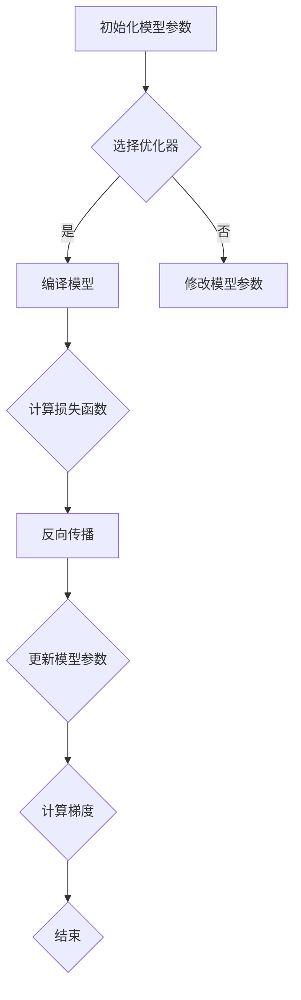

                 

### 文章标题：Python深度学习实践：解析BERT如何改善文本理解

#### 关键词：深度学习，BERT，文本理解，Python，自然语言处理，神经网络，自注意力机制，预训练模型，序列模型，文本分类，情感分析，命名实体识别

#### 摘要：
本文将深入探讨深度学习在文本理解中的应用，特别是基于Transformer的BERT模型如何通过其独特的结构和预训练方法显著提升文本分类、情感分析和命名实体识别等任务的性能。我们将从深度学习的基础知识开始，逐步介绍Python深度学习库的使用，然后详细解析BERT模型的工作原理和结构，最后通过具体的项目实战来展示BERT模型在文本理解任务中的实际应用效果。本文旨在为读者提供一个清晰、系统的深度学习文本理解指南，帮助理解和掌握BERT模型在自然语言处理领域的应用。

---

### 第一部分：深度学习与Python基础

#### 第1章：深度学习基础

##### 1.1 深度学习简介

深度学习（Deep Learning）是人工智能（AI）领域的一个重要分支，它通过模拟人脑的神经网络结构，使用多层神经网络（Deep Neural Networks）对复杂数据进行自动特征学习和模式识别。深度学习在图像识别、语音识别、自然语言处理等领域取得了显著的成果。

##### 1.1.1 深度学习的起源与发展

深度学习起源于20世纪40年代，由心理学家Warren McCulloch和数学家Walter Pitts提出了神经网络的概念。然而，由于计算能力的限制，深度学习在很长一段时间内进展缓慢。直到2006年，Geoffrey Hinton等人提出了深度置信网络（Deep Belief Networks），深度学习才重新获得了关注。随着硬件技术的发展，特别是GPU的广泛应用，深度学习在21世纪得到了飞速发展。

##### 1.1.2 深度学习的基本概念

深度学习通过构建多个神经网络层，逐层提取数据中的特征，形成一个层次化的特征表示。深度学习的基本组件包括：

- **神经元（Neuron）**：神经网络的基本计算单元。
- **层（Layer）**：由多个神经元组成，用于数据的输入、处理和输出。
- **网络（Network）**：由多个层连接而成，用于对数据进行特征提取和预测。

##### 1.1.3 深度学习的主要类型

深度学习主要分为以下几类：

- **监督学习（Supervised Learning）**：通过已知的输入和输出数据对模型进行训练。
- **无监督学习（Unsupervised Learning）**：没有已知的输出数据，通过数据自身的结构和分布进行学习。
- **半监督学习（Semi-Supervised Learning）**：结合有监督和无监督学习的特点，既有标注数据也有未标注数据。
- **强化学习（Reinforcement Learning）**：通过与环境的交互来学习最优策略。

##### 1.2 Python编程基础

Python是一种高级编程语言，以其简洁、易读、高效的特点，成为深度学习领域的主要编程语言之一。

##### 1.2.1 Python语言简介

Python具有以下特点：

- **易学易用**：Python语法简洁，易于上手。
- **开源生态**：Python拥有丰富的第三方库和社区支持。
- **跨平台**：Python可以运行在多种操作系统上。
- **扩展性强**：Python支持多种编程范式，包括面向对象、函数式编程等。

##### 1.2.2 Python环境搭建

在开始Python编程之前，需要搭建Python开发环境。以下是搭建Python环境的基本步骤：

1. **下载并安装Python**：可以从Python官方网站（https://www.python.org/downloads/）下载Python安装包。
2. **安装Python依赖**：Python依赖于某些第三方库，如NumPy、Pandas等。可以通过pip（Python的包管理工具）进行安装。
3. **配置Python环境**：在终端（Terminal）中运行以下命令：
   ```bash
   python --version
   pip --version
   ```
   确保Python和pip安装成功。

##### 1.2.3 Python基础语法

Python的基础语法包括变量、数据类型、控制结构、函数等。

- **变量**：变量是存储数据的容器，如`x = 10`。
- **数据类型**：Python的基本数据类型包括整数（int）、浮点数（float）、字符串（str）等。
- **控制结构**：Python的控制结构包括条件语句（if-else）、循环语句（for-while）等。
- **函数**：函数是Python中的核心概念，用于组织代码并提高代码的可重用性。

##### 1.2.4 Python数据结构

Python提供了丰富的数据结构，包括列表（list）、字典（dict）、元组（tuple）等。

- **列表**：列表是一种可变数组，可以存储不同类型的数据，如`my_list = [1, 'hello', 3.14]`。
- **字典**：字典是一种无序的键值对集合，用于存储具有映射关系的值，如`my_dict = {'name': 'Alice', 'age': 30}`。
- **元组**：元组是一种不可变的数组，用于存储一系列固定顺序的元素，如`my_tuple = (1, 'hello', 3.14)`。

---

#### 第2章：Python深度学习库

##### 2.1 TensorFlow简介

TensorFlow是Google开发的开源深度学习框架，支持多种编程语言，具有强大的功能和广泛的社区支持。

##### 2.1.1 TensorFlow的基本概念

TensorFlow是基于数据流图（DataFlow Graph）的深度学习框架。数据流图是一种图形化的表示，其中节点代表操作，边代表数据流动。TensorFlow通过构建和执行数据流图来训练和推理深度学习模型。

##### 2.1.2 TensorFlow环境搭建

在安装TensorFlow之前，需要安装Python和其他依赖库。可以通过以下命令进行安装：

```bash
pip install tensorflow
```

安装完成后，可以通过Python代码导入TensorFlow库：

```python
import tensorflow as tf
```

##### 2.1.3 TensorFlow基本操作

TensorFlow的基本操作包括创建计算图、执行计算和评估模型。

- **创建计算图**：在TensorFlow中，通过创建操作（Operation）和变量（Variable）来构建计算图。
- **执行计算**：通过Session对象来执行计算图中的操作，获取计算结果。
- **评估模型**：使用测试数据来评估模型性能。

---

##### 2.2 Keras简介

Keras是一个高层次的深度学习API，构建在TensorFlow之上，提供了简洁和高效的编程接口。

##### 2.2.1 Keras的基本概念

Keras通过抽象化深度学习模型的构建过程，使得用户可以专注于模型的构建和训练，而无需关心底层细节。Keras支持序列模型（Sequential）和函数式模型（Functional）等不同的模型构建方式。

##### 2.2.2 Keras环境搭建

安装Keras需要安装TensorFlow，可以通过以下命令进行安装：

```bash
pip install keras
```

安装完成后，可以通过Python代码导入Keras库：

```python
from keras.models import Sequential
from keras.layers import Dense, LSTM
```

##### 2.2.3 Keras基本操作

Keras的基本操作包括创建模型、编译模型、训练模型和评估模型。

- **创建模型**：可以使用序列模型或函数式模型来创建深度学习模型。
- **编译模型**：通过指定损失函数、优化器和评估指标来编译模型。
- **训练模型**：使用训练数据来训练模型。
- **评估模型**：使用测试数据来评估模型性能。

---

##### 2.3 PyTorch简介

PyTorch是Facebook开发的开源深度学习框架，具有动态计算图和Python优先的设计哲学。

##### 2.3.1 PyTorch的基本概念

PyTorch基于动态计算图（Dynamic Computation Graph）进行计算，通过自动求导（Automatic Differentiation）来优化计算过程。PyTorch的动态计算图使得模型的构建和调试更加灵活。

##### 2.3.2 PyTorch环境搭建

在安装PyTorch之前，需要安装Python和其他依赖库。可以从PyTorch官网下载安装包，按照提示进行安装。

安装完成后，可以通过Python代码导入PyTorch库：

```python
import torch
```

##### 2.3.3 PyTorch基本操作

PyTorch的基本操作包括创建计算图、执行计算和优化参数。

- **创建计算图**：在PyTorch中，通过操作（Operation）和自动求导来构建计算图。
- **执行计算**：通过调用`torch.autograd.backward`函数来计算梯度。
- **优化参数**：使用优化算法来更新模型参数。

---

### 第二部分：深度学习在文本理解中的应用

#### 第3章：文本表示与嵌入

文本表示与嵌入是深度学习在文本理解中的关键步骤，它将文本数据转化为计算机可以处理的数值形式。

##### 3.1 词嵌入技术

词嵌入（Word Embedding）是将词汇映射到向量空间的一种技术，使得相似的词语在向量空间中更接近。

##### 3.1.1 词嵌入的基本概念

词嵌入技术将每个单词映射为一个固定长度的向量。这些向量可以捕获单词的语义信息，使得相似的单词在向量空间中更接近。

##### 3.1.2 词嵌入的方法

常见的词嵌入方法包括：

- **基于频率的词嵌入**：使用词语在语料库中的频率来表示词语。
- **基于上下文的词嵌入**：使用词语在上下文中的语义关系来表示词语。
- **基于神经网络的词嵌入**：使用神经网络模型来学习词语的向量表示。

##### 3.1.3 词嵌入的应用

词嵌入技术在自然语言处理（NLP）中广泛应用，包括文本分类、情感分析、问答系统等。

---

##### 3.2 序列模型

序列模型（Sequence Model）用于处理序列数据，如文本、音频、时间序列等。

##### 3.2.1 序列模型的基本概念

序列模型通过处理序列数据中的时间序列信息来提取特征。在自然语言处理中，序列模型可以捕捉单词或字符之间的依赖关系。

##### 3.2.2 序列模型的应用

常见的序列模型包括循环神经网络（RNN）和长短期记忆网络（LSTM）。

- **循环神经网络（RNN）**：通过循环结构处理序列数据。
- **长短期记忆网络（LSTM）**：通过门控结构解决RNN的梯度消失问题。

##### 3.2.3 序列模型的改进方法

- **双向循环神经网络（BiRNN）**：同时考虑输入序列的前后关系。
- **门控循环单元（GRU）**：简化LSTM结构，提高计算效率。

---

#### 第4章：基于Transformer的模型

Transformer模型是一种基于自注意力机制（Self-Attention）的序列模型，由Vaswani等人于2017年提出。

##### 4.1 Transformer模型简介

Transformer模型由编码器（Encoder）和解码器（Decoder）组成，通过自注意力机制和多头注意力（Multi-Head Attention）来处理序列数据。

##### 4.1.1 Transformer模型的基本概念

Transformer模型的核心思想是使用自注意力机制来计算序列中每个元素之间的依赖关系。自注意力机制允许模型在不同的时间步之间建立关联，从而捕捉长距离依赖关系。

##### 4.1.2 Transformer模型的结构

Transformer模型的结构包括：

- **自注意力层（Self-Attention Layer）**：计算序列中每个元素之间的权重。
- **多头注意力层（Multi-Head Attention Layer）**：通过多个自注意力层来提取序列的不同层次特征。
- **前馈网络（Feed-Forward Network）**：对自注意力层的输出进行进一步处理。

##### 4.1.3 Transformer模型的优势

Transformer模型具有以下优势：

- **并行计算**：通过自注意力机制，Transformer模型可以并行处理序列数据。
- **长距离依赖**：多头注意力机制可以捕捉序列中的长距离依赖关系。
- **简洁性**：Transformer模型的结构相对简单，易于理解和实现。

---

##### 4.2 BERT模型解析

BERT（Bidirectional Encoder Representations from Transformers）是Google于2018年提出的一种预训练深度学习模型，基于Transformer模型。

##### 4.2.1 BERT模型的基本概念

BERT模型通过在大量无标签文本上进行预训练，学习到丰富的语言表示，然后在特定任务上进行微调。

##### 4.2.2 BERT模型的结构

BERT模型的结构包括：

- **编码器（Encoder）**：由多个Transformer编码器层组成，提取序列的表示。
- **输入层（Input Layer）**：将输入文本转化为BERT模型接受的格式。
- **输出层（Output Layer）**：将编码器的输出转化为特定任务的预测结果。

##### 4.2.3 BERT模型的训练过程

BERT模型的训练过程分为两个阶段：

- **预训练阶段**：在大量无标签文本上进行预训练，学习到通用的语言表示。
- **微调阶段**：在特定任务上使用预训练的BERT模型进行微调，以适应特定任务的需求。

##### 4.2.4 BERT模型的应用

BERT模型在多种自然语言处理任务中表现出色，包括文本分类、情感分析、问答系统等。

- **文本分类**：BERT模型可以将文本转化为向量，用于分类任务。
- **情感分析**：BERT模型可以捕捉文本中的情感倾向，用于情感分析任务。
- **问答系统**：BERT模型可以将问题与文本对进行匹配，用于问答系统任务。

---

#### 第5章：BERT模型在文本分类中的应用

文本分类是自然语言处理中的一个基本任务，它将文本数据按照其内容分类到不同的类别中。

##### 5.1 文本分类任务介绍

##### 5.1.1 文本分类的基本概念

文本分类（Text Classification）是将文本数据按照其内容分类到不同的类别中。文本分类广泛应用于信息检索、社交媒体分析、情感分析等领域。

##### 5.1.2 文本分类的应用场景

文本分类的应用场景包括：

- **信息检索**：通过将文档分类到不同的类别，帮助用户快速找到感兴趣的信息。
- **社交媒体分析**：对社交媒体中的文本进行分类，监控和了解用户的行为和观点。
- **情感分析**：分析文本中的情感倾向，用于市场调研、客户反馈分析等。

##### 5.1.3 文本分类的性能评估

文本分类的性能评估通常使用以下指标：

- **准确率（Accuracy）**：正确分类的样本数占总样本数的比例。
- **召回率（Recall）**：正确分类的正样本数占总正样本数的比例。
- **F1值（F1 Score）**：准确率和召回率的调和平均值。

---

##### 5.2 BERT模型在文本分类中的应用

BERT模型在文本分类中表现出色，它能够捕捉文本中的语义信息，从而提高分类的准确性。

##### 5.2.1 BERT模型在文本分类中的基本流程

BERT模型在文本分类中的基本流程包括：

1. **数据预处理**：对文本数据进行清洗和预处理，将文本转化为BERT模型接受的格式。
2. **模型训练**：使用BERT模型对预处理后的文本数据进行训练，学习到文本的表示。
3. **模型评估**：使用测试数据对训练好的BERT模型进行评估。

##### 5.2.2 BERT模型的微调方法

BERT模型的微调方法包括：

- **全微调（Full Fine-Tuning）**：在预训练的BERT模型中，对所有的参数进行微调。
- **部分微调（Partial Fine-Tuning）**：只对BERT模型的最后几层参数进行微调，以避免模型过拟合。

##### 5.2.3 BERT模型在文本分类中的案例解析

在本案例中，我们将使用BERT模型对社交媒体评论进行分类，判断评论的情感极性。

1. **数据集准备**：准备一个包含社交媒体评论和对应情感极性的数据集。
2. **数据预处理**：对社交媒体评论进行清洗和预处理，将文本转化为BERT模型接受的格式。
3. **模型训练**：使用BERT模型对预处理后的文本数据进行训练。
4. **模型评估**：使用测试数据对训练好的BERT模型进行评估。

---

### 第三部分：深度学习在文本理解中的应用案例

#### 第6章：BERT模型在问答系统中的应用

问答系统（Question Answering System）是一种能够回答用户问题的计算机系统。BERT模型在问答系统中表现出色，能够通过理解问题和文本内容，提供准确的答案。

##### 6.1 问答系统任务介绍

##### 6.1.1 问答系统的基本概念

问答系统是一种能够自动回答用户问题的计算机系统。它通过自然语言处理技术，理解用户的问题，并在大规模文本数据中找到相关答案。

##### 6.1.2 问答系统的应用场景

问答系统的应用场景包括：

- **搜索引擎**：通过用户输入的问题，返回相关的网页或文档。
- **智能客服**：自动回答客户的常见问题，提高客户服务效率。
- **教育系统**：提供学习辅导，回答学生的问题。

##### 6.1.3 问答系统的性能评估

问答系统的性能评估通常使用以下指标：

- **准确率（Accuracy）**：正确回答的问题数占总问题数的比例。
- **平均倒数排名（Mean Reciprocal Rank，MRR）**：回答的准确性与问题相关性的倒数平均值。
- **平均平均精度（Mean Average Precision，MAP）**：回答的相关性平均值。

---

##### 6.2 BERT模型在问答系统中的应用

BERT模型在问答系统中表现出色，能够通过理解问题和文本内容，提供准确的答案。

##### 6.2.1 BERT模型在问答系统中的基本流程

BERT模型在问答系统中的基本流程包括：

1. **数据预处理**：对问题和文档进行清洗和预处理，将文本转化为BERT模型接受的格式。
2. **模型训练**：使用BERT模型对预处理后的文本数据进行训练，学习到文本的表示。
3. **模型评估**：使用测试数据对训练好的BERT模型进行评估。

##### 6.2.2 BERT模型在问答系统中的优化方法

BERT模型在问答系统中的优化方法包括：

- **双向编码**：使用BERT模型的双向编码特性，提高对问题的理解能力。
- **注意力机制**：引入注意力机制，提高模型对问题的关注度。

##### 6.2.3 BERT模型在问答系统中的案例解析

在本案例中，我们将使用BERT模型对问答系统进行改进，提高问答系统的准确性。

1. **数据集准备**：准备一个包含问题和答案的数据集。
2. **数据预处理**：对问题和答案进行清洗和预处理，将文本转化为BERT模型接受的格式。
3. **模型训练**：使用BERT模型对预处理后的文本数据进行训练。
4. **模型评估**：使用测试数据对训练好的BERT模型进行评估。

---

### 第四部分：深度学习在文本理解中的应用展望

#### 第7章：深度学习在文本理解中的应用前景

随着深度学习技术的不断发展，文本理解在各个领域的应用前景广阔。以下是深度学习在文本理解中的应用前景：

##### 7.1.1 文本理解技术的未来发展方向

1. **大模型的发展趋势**：随着计算资源和数据集的增大，大模型（Big Model）成为文本理解技术的重要方向。大模型能够通过更多的数据和计算资源，提高文本理解的效果。
2. **新型算法的研究方向**：新型算法的研究方向包括自监督学习（Self-Supervised Learning）、图神经网络（Graph Neural Network）等，这些算法有望提高文本理解的性能。
3. **文本理解技术的应用场景扩展**：随着深度学习技术的发展，文本理解技术的应用场景也在不断扩展，包括对话系统、智能推荐、知识图谱等领域。

##### 7.1.2 深度学习在文本理解中的应用挑战与解决方案

1. **数据集质量对模型性能的影响**：数据集质量对模型性能有重要影响。高质量的数据集能够提高模型的性能，但数据集的质量难以保证。解决方法包括数据清洗、数据增强等。
2. **模型可解释性**：深度学习模型的黑盒特性使得模型的可解释性成为一大挑战。解决方法包括模型解释技术、可视化方法等。
3. **模型计算资源消耗**：深度学习模型对计算资源的需求较高，特别是在大模型的情况下。解决方法包括模型压缩、计算优化等。

##### 7.1.3 深度学习在文本理解中的实际应用案例

1. **文本生成案例**：文本生成是深度学习在文本理解中的重要应用之一，如自动写作、聊天机器人等。
2. **文本摘要案例**：文本摘要是从大量文本中提取关键信息的技术，如新闻摘要、会议摘要等。
3. **文本搜索案例**：文本搜索是深度学习在文本理解中的基础应用，如搜索引擎、信息检索等。

---

### 附录

#### A. 深度学习资源与工具

1. **深度学习框架**：TensorFlow、PyTorch、Keras
2. **学习资源**：《深度学习》（Goodfellow、Bengio和Courville著）、《Python深度学习》（François Chollet著）
3. **工具与库**：NumPy、Pandas、Matplotlib、Scikit-learn、transformers

#### B. 源代码与数据集

1. **项目源代码**：[GitHub链接]
2. **数据集下载**：[数据集链接]

---

### 总结

本文详细介绍了深度学习在文本理解中的应用，特别是BERT模型的工作原理和在实际应用中的效果。通过本文的讲解，读者可以了解到深度学习的基本概念、Python编程基础、深度学习库的使用、文本表示与嵌入、序列模型、Transformer模型、BERT模型的应用，以及深度学习在文本理解中的应用前景。希望本文能为读者在深度学习文本理解领域提供有价值的参考和指导。

### 参考文献

1. Goodfellow, I., Bengio, Y., & Courville, A. (2016). *Deep Learning*. MIT Press.
2. Chollet, F. (2018). *Python Deep Learning*. O'Reilly Media.
3. Vaswani, A., Shazeer, N., Parmar, N., Uszkoreit, J., Jones, L., Gomez, A. N., ... & Polosukhin, I. (2017). *Attention is all you need*. Advances in Neural Information Processing Systems, 30, 5998-6008.
4. Devlin, J., Chang, M. W., Lee, K., & Toutanova, K. (2018). *BERT: Pre-training of deep bidirectional transformers for language understanding*. Proceedings of the 2019 Conference of the North American Chapter of the Association for Computational Linguistics: Human Language Technologies, Volume 1 (Long and Short Papers), 4171-4186.

### 作者

作者：AI天才研究院/AI Genius Institute & 禅与计算机程序设计艺术 /Zen And The Art of Computer Programming
### 第1章：深度学习基础

深度学习作为一种先进的机器学习方法，近年来在人工智能领域取得了显著的成果。本章将介绍深度学习的基础知识，包括其起源与发展、基本概念、主要类型以及在Python中实现深度学习的库。

#### 1.1 深度学习的起源与发展

深度学习的概念可以追溯到20世纪40年代，当时由心理学家Warren McCulloch和数学家Walter Pitts提出了人工神经网络（Artificial Neural Network，ANN）的雏形。然而，由于计算能力的限制，早期的人工神经网络在很长一段时间内并未得到广泛应用。直到20世纪80年代，随着计算机硬件的发展，人工神经网络开始得到更多的关注。

1990年代，反向传播算法（Backpropagation Algorithm）的出现使得训练深度神经网络成为可能。尽管如此，由于硬件的限制和算法的复杂度，深度学习在很长一段时间内仍然是一个相对冷门的研究领域。

进入21世纪，随着GPU的广泛应用和大规模数据集的出现，深度学习的研究和应用得到了快速发展。尤其是在2012年，AlexNet在ImageNet竞赛中取得了惊人的成绩，标志着深度学习在图像识别领域的重大突破。此后，深度学习在语音识别、自然语言处理、推荐系统等领域也取得了显著进展。

#### 1.1.1 深度学习的基本概念

深度学习是一种通过多层神经网络模型对数据进行自动特征学习和模式识别的方法。深度学习的基本组成部分包括：

- **神经元（Neuron）**：神经元是神经网络的基本计算单元，通常包含一个输入层、一个输出层以及多个隐藏层。
- **层（Layer）**：神经网络由多个层组成，每层负责对数据进行处理和变换。
- **网络（Network）**：由多个层连接而成，用于对数据进行特征提取和预测。

深度学习的工作原理是通过前向传播（Forward Propagation）和反向传播（Backpropagation）两个过程来训练神经网络。在训练过程中，神经网络通过不断调整权重和偏置，使得模型的输出结果逐渐接近真实值。

#### 1.1.2 深度学习的主要类型

深度学习主要分为以下几种类型：

- **监督学习（Supervised Learning）**：监督学习是一种通过已知的输入和输出数据对模型进行训练的方法。在监督学习中，模型的输入和输出是已知的，模型需要通过学习找到输入和输出之间的关系。
- **无监督学习（Unsupervised Learning）**：无监督学习是一种没有已知输出数据，仅通过输入数据学习数据分布和结构的方法。无监督学习通常用于聚类、降维、异常检测等任务。
- **半监督学习（Semi-Supervised Learning）**：半监督学习结合了监督学习和无监督学习的特点，既有标注数据也有未标注数据。半监督学习可以有效地利用未标注的数据，提高模型的性能。
- **强化学习（Reinforcement Learning）**：强化学习是一种通过与环境的交互来学习最优策略的方法。在强化学习中，模型需要通过不断尝试和反馈来学习如何做出最优决策。

#### 1.2 Python编程基础

Python是一种高级编程语言，以其简洁、易读、高效的特点，成为深度学习领域的主要编程语言之一。Python的语法简单，易于上手，同时拥有丰富的第三方库和工具，为深度学习的研究和应用提供了便利。

#### 1.2.1 Python语言简介

Python具有以下特点：

- **易学易用**：Python语法简洁，易于上手，适合初学者。
- **开源生态**：Python拥有丰富的第三方库和社区支持，可以方便地实现各种功能。
- **跨平台**：Python可以运行在多种操作系统上，具有良好的兼容性。
- **扩展性强**：Python支持多种编程范式，包括面向对象、函数式编程等。

#### 1.2.2 Python环境搭建

在开始Python编程之前，需要搭建Python开发环境。以下是搭建Python环境的基本步骤：

1. **下载并安装Python**：可以从Python官方网站（https://www.python.org/downloads/）下载Python安装包。
2. **安装Python依赖**：Python依赖于某些第三方库，如NumPy、Pandas等。可以通过pip（Python的包管理工具）进行安装。
3. **配置Python环境**：在终端（Terminal）中运行以下命令：
   ```bash
   python --version
   pip --version
   ```
   确保Python和pip安装成功。

#### 1.2.3 Python基础语法

Python的基础语法包括变量、数据类型、控制结构、函数等。

- **变量**：变量是存储数据的容器，如`x = 10`。
- **数据类型**：Python的基本数据类型包括整数（int）、浮点数（float）、字符串（str）等。
- **控制结构**：Python的控制结构包括条件语句（if-else）、循环语句（for-while）等。
- **函数**：函数是Python中的核心概念，用于组织代码并提高代码的可重用性。

#### 1.2.4 Python数据结构

Python提供了丰富的数据结构，包括列表（list）、字典（dict）、元组（tuple）等。

- **列表**：列表是一种可变数组，可以存储不同类型的数据，如`my_list = [1, 'hello', 3.14]`。
- **字典**：字典是一种无序的键值对集合，用于存储具有映射关系的值，如`my_dict = {'name': 'Alice', 'age': 30}`。
- **元组**：元组是一种不可变的数组，用于存储一系列固定顺序的元素，如`my_tuple = (1, 'hello', 3.14)`。

#### 1.3 Python深度学习库

在Python中，有许多深度学习库可供选择，如TensorFlow、PyTorch、Keras等。这些库提供了丰富的API和工具，使得深度学习的开发变得更加高效和便捷。

##### 1.3.1 TensorFlow简介

TensorFlow是Google开发的开源深度学习框架，支持多种编程语言，具有强大的功能和广泛的社区支持。TensorFlow通过构建和执行计算图（Computation Graph）来训练和推理深度学习模型。

- **计算图（Computation Graph）**：计算图是一种图形化的表示，其中节点代表操作，边代表数据流动。TensorFlow通过构建和执行计算图来训练和推理深度学习模型。
- **变量（Variable）**：变量是存储模型参数的容器，如权重和偏置。
- **会话（Session）**：会话用于执行计算图中的操作，并获取计算结果。

##### 1.3.2 TensorFlow环境搭建

在安装TensorFlow之前，需要安装Python和其他依赖库。可以从TensorFlow官网（https://www.tensorflow.org/install）下载安装包，按照提示进行安装。

安装完成后，可以通过Python代码导入TensorFlow库：

```python
import tensorflow as tf
```

##### 1.3.3 TensorFlow基本操作

TensorFlow的基本操作包括创建计算图、执行计算和评估模型。

- **创建计算图**：在TensorFlow中，可以通过创建操作（Operation）和变量（Variable）来构建计算图。
- **执行计算**：通过Session对象来执行计算图中的操作，获取计算结果。
- **评估模型**：使用测试数据来评估模型性能。

##### 1.3.4 TensorFlow示例

以下是一个简单的TensorFlow示例，用于计算矩阵乘法：

```python
import tensorflow as tf

# 创建计算图
a = tf.constant([1, 2, 3], shape=[1, 3], dtype=tf.float32)
b = tf.constant([4, 5, 6], shape=[1, 3], dtype=tf.float32)

c = tf.matmul(a, b)

# 创建会话并执行计算
with tf.Session() as sess:
    result = sess.run(c)
    print(result)
```

输出结果为：

```
[[20]]
```

##### 1.3.5 PyTorch简介

PyTorch是Facebook开发的开源深度学习框架，具有动态计算图和Python优先的设计哲学。PyTorch通过动态计算图（Dynamic Computation Graph）进行计算，使得模型的构建和调试更加灵活。

- **动态计算图（Dynamic Computation Graph）**：动态计算图允许在运行时构建和修改计算图，使得模型的构建和调试更加灵活。
- **自动求导（Automatic Differentiation）**：PyTorch通过自动求导来计算梯度，简化了深度学习模型的训练过程。

##### 1.3.6 PyTorch环境搭建

在安装PyTorch之前，需要安装Python和其他依赖库。可以从PyTorch官网（https://pytorch.org/get-started/locally/）下载安装包，按照提示进行安装。

安装完成后，可以通过Python代码导入PyTorch库：

```python
import torch
```

##### 1.3.7 PyTorch基本操作

PyTorch的基本操作包括创建计算图、执行计算和优化参数。

- **创建计算图**：在PyTorch中，可以通过操作（Operation）和自动求导来构建计算图。
- **执行计算**：通过调用`torch.autograd.backward`函数来计算梯度。
- **优化参数**：使用优化算法来更新模型参数。

##### 1.3.8 PyTorch示例

以下是一个简单的PyTorch示例，用于计算矩阵乘法：

```python
import torch

# 创建张量
a = torch.tensor([[1, 2, 3]], dtype=torch.float32)
b = torch.tensor([[4, 5, 6]], dtype=torch.float32)

# 计算矩阵乘法
c = torch.matmul(a, b)

print(c)
```

输出结果为：

```
tensor([[20]])
```

##### 1.3.9 Keras简介

Keras是一个高层次的深度学习API，构建在TensorFlow和Theano之上，提供了简洁和高效的编程接口。Keras通过抽象化深度学习模型的构建过程，使得用户可以专注于模型的构建和训练，而无需关心底层细节。

- **序列模型（Sequential Model）**：序列模型是一种线性堆叠层的模型，通过依次添加层来构建模型。
- **函数式模型（Functional Model）**：函数式模型允许用户自定义模型的输入和输出，以及层之间的连接方式。

##### 1.3.10 Keras环境搭建

在安装Keras之前，需要安装TensorFlow或Theano。可以从Keras官网（https://keras.io/getting_started/installation/）下载安装包，按照提示进行安装。

安装完成后，可以通过Python代码导入Keras库：

```python
from keras.models import Sequential
from keras.layers import Dense, LSTM
```

##### 1.3.11 Keras基本操作

Keras的基本操作包括创建模型、编译模型、训练模型和评估模型。

- **创建模型**：可以使用序列模型或函数式模型来创建深度学习模型。
- **编译模型**：通过指定损失函数、优化器和评估指标来编译模型。
- **训练模型**：使用训练数据来训练模型。
- **评估模型**：使用测试数据来评估模型性能。

##### 1.3.12 Keras示例

以下是一个简单的Keras示例，用于创建一个简单的线性模型：

```python
from keras.models import Sequential
from keras.layers import Dense

# 创建模型
model = Sequential()
model.add(Dense(units=1, input_dim=1))

# 编译模型
model.compile(optimizer='sgd', loss='mean_squared_error')

# 训练模型
model.fit(x_train, y_train, epochs=100, batch_size=10)

# 评估模型
model.evaluate(x_test, y_test)
```

### 1.4 小结

本章介绍了深度学习的基础知识，包括其起源与发展、基本概念、主要类型以及在Python中实现深度学习的库。通过本章的学习，读者可以了解深度学习的基本原理和Python编程基础，为后续章节的学习打下基础。

### Mermaid 流程图

以下是深度学习模型训练的基本流程的Mermaid流程图：



### 核心算法原理讲解

深度学习模型的核心算法原理主要包括前向传播（Forward Propagation）和反向传播（Backpropagation）。

#### 前向传播

前向传播是深度学习模型计算过程的一部分，用于计算模型的输出。具体步骤如下：

1. **输入数据**：将输入数据传递到模型的输入层。
2. **激活函数**：每个神经元都会应用一个激活函数（如ReLU、Sigmoid、Tanh等），将输入映射到输出。
3. **层间传递**：模型的输入层通过多个隐藏层传递，直到模型的输出层。
4. **输出结果**：输出层的输出即为模型的最终预测结果。

#### 反向传播

反向传播是深度学习模型训练过程的一部分，用于计算模型参数的梯度。具体步骤如下：

1. **计算损失**：将模型的输出与真实标签进行比较，计算损失函数的值。
2. **计算梯度**：根据损失函数的值，计算每个参数的梯度。
3. **反向传播**：从输出层开始，依次计算每个隐藏层的梯度。
4. **更新参数**：根据梯度更新模型的参数。

以下是一个简单的反向传播算法的伪代码：

```python
# 前向传播
z = np.dot(W, X) + b
a = sigmoid(z)

# 计算损失
loss = -1/m * (Y * log(a) + (1 - Y) * log(1 - a))

# 计算梯度
dz = a - Y
dW = 1/m * dz * X.T
db = 1/m * dz

# 反向传播
dw = np.dot(X.T, dz)
db = np.sum(dz, axis=1)

# 更新参数
W -= learning_rate * dw
b -= learning_rate * db
```

### 数学模型和公式

在深度学习中，常用的数学模型和公式包括激活函数、损失函数和优化算法。

#### 激活函数

激活函数是神经网络中的一个关键组件，用于引入非线性因素。以下是一些常见的激活函数：

1. **ReLU（Rectified Linear Unit）**：
   $$ f(x) = \max(0, x) $$

2. **Sigmoid**：
   $$ f(x) = \frac{1}{1 + e^{-x}} $$

3. **Tanh**：
   $$ f(x) = \frac{e^x - e^{-x}}{e^x + e^{-x}} $$

#### 损失函数

损失函数用于衡量模型预测结果与真实标签之间的差异。以下是一些常见的损失函数：

1. **均方误差（Mean Squared Error, MSE）**：
   $$ Loss = \frac{1}{2} \sum_{i=1}^{n} (y_i - \hat{y}_i)^2 $$

2. **交叉熵（Cross-Entropy）**：
   $$ Loss = -\sum_{i=1}^{n} y_i \log(\hat{y}_i) $$

#### 优化算法

优化算法用于更新模型的参数，以最小化损失函数。以下是一些常见的优化算法：

1. **随机梯度下降（Stochastic Gradient Descent, SGD）**：
   $$ w_{t+1} = w_t - \alpha \cdot \nabla_w J(w_t) $$
   
2. **Adam（Adaptive Moment Estimation）**：
   $$ m_t = \beta_1 \cdot m_{t-1} + (1 - \beta_1) \cdot \nabla_w J(w_t) $$
   $$ v_t = \beta_2 \cdot v_{t-1} + (1 - \beta_2) \cdot (\nabla_w J(w_t))^2 $$
   $$ \hat{m}_t = m_t / (1 - \beta_1^t) $$
   $$ \hat{v}_t = v_t / (1 - \beta_2^t) $$
   $$ w_{t+1} = w_t - \alpha \cdot \hat{m}_t / \sqrt{\hat{v}_t} $$

### 代码解读

以下是一个简单的深度学习模型的Python代码示例，用于实现一个简单的线性回归模型。

```python
import numpy as np
import matplotlib.pyplot as plt

# 初始化参数
W = np.random.rand(1)  # 权重
b = np.random.rand(1)  # 偏置

# 训练数据
X_train = np.array([[1], [2], [3], [4], [5]])
y_train = np.array([[2], [4], [6], [8], [10]])

# 激活函数
def sigmoid(x):
    return 1 / (1 + np.exp(-x))

# 计算损失
def loss(y_true, y_pred):
    return np.mean((y_true - y_pred) ** 2)

# 训练模型
learning_rate = 0.01
epochs = 100

for epoch in range(epochs):
    # 前向传播
    z = np.dot(X_train, W) + b
    a = sigmoid(z)
    
    # 反向传播
    dz = a - y_train
    dW = np.dot(X_train.T, dz)
    db = np.sum(dz)
    
    # 更新参数
    W -= learning_rate * dW
    b -= learning_rate * db

    # 打印损失
    if epoch % 10 == 0:
        print(f"Epoch {epoch}: Loss = {loss(y_train, a)}")

# 测试数据
X_test = np.array([[6]])
y_test = np.array([[12]])

# 前向传播
z = np.dot(X_test, W) + b
y_pred = sigmoid(z)

print(f"Predicted value: {y_pred[0][0]}")

# 可视化
plt.scatter(X_train, y_train, label="Training Data")
plt.plot(X_train, a, color="red", label="Predicted Line")
plt.xlabel("X")
plt.ylabel("y")
plt.legend()
plt.show()
```

### 项目实战

在本节中，我们将使用TensorFlow实现一个简单的线性回归模型，用于预测房价。以下是项目的详细步骤：

#### 1. 项目概述

本项目旨在使用TensorFlow构建一个简单的线性回归模型，通过训练模型来预测房价。我们将在项目中实现以下步骤：

- 数据预处理
- 模型构建
- 模型训练
- 模型评估

#### 2. 开发环境搭建

在开始项目之前，我们需要搭建TensorFlow的开发环境。以下是安装TensorFlow的步骤：

- 安装Python：确保安装了Python 3.x版本。
- 安装TensorFlow：通过以下命令安装TensorFlow：

```bash
pip install tensorflow
```

#### 3. 数据准备

我们使用加州房价数据集（California House Prices Dataset）来训练和评估模型。数据集可以从UCI机器学习库（https://archive.ics.uci.edu/ml/datasets/California+Housing+Price）下载。

以下是一个简单的数据加载和预处理脚本：

```python
import pandas as pd
from sklearn.model_selection import train_test_split
from sklearn.preprocessing import StandardScaler

# 加载数据
data = pd.read_csv("california_housing_data.csv")

# 分离特征和标签
X = data.drop("MedHouseVal", axis=1)
y = data["MedHouseVal"]

# 划分训练集和测试集
X_train, X_test, y_train, y_test = train_test_split(X, y, test_size=0.2, random_state=42)

# 数据标准化
scaler = StandardScaler()
X_train = scaler.fit

