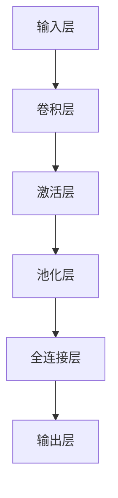
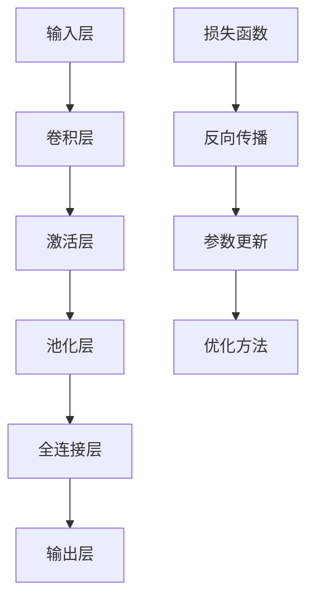
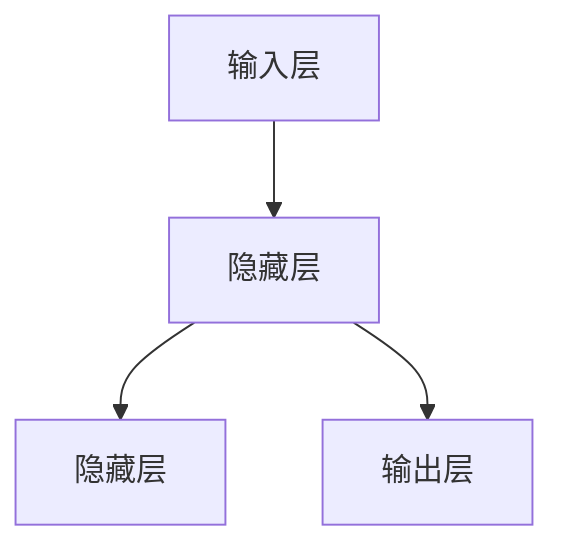
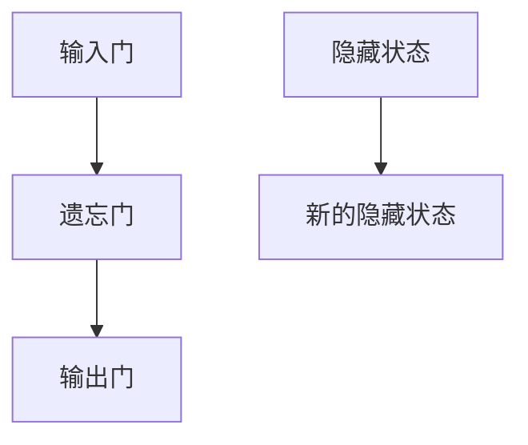
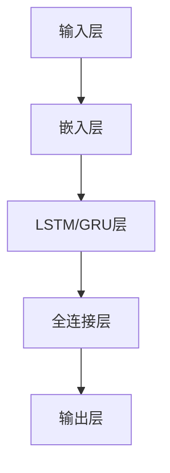
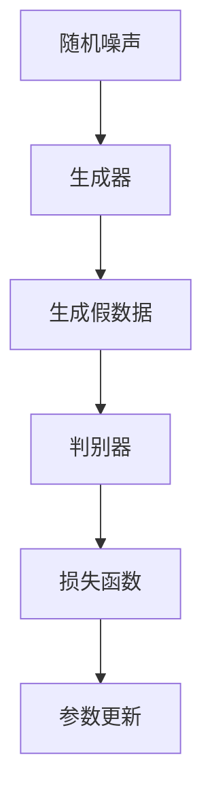
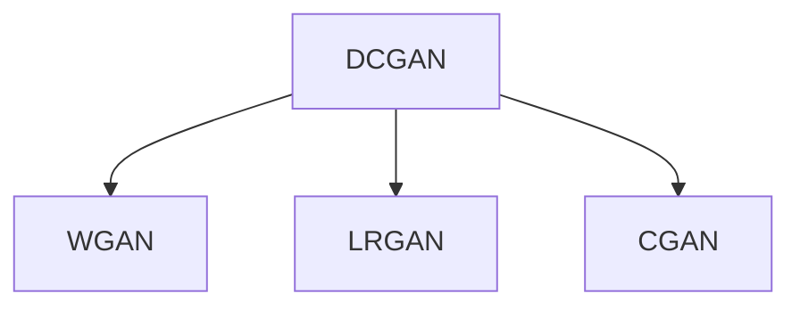
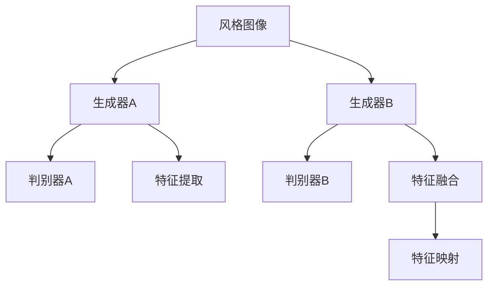
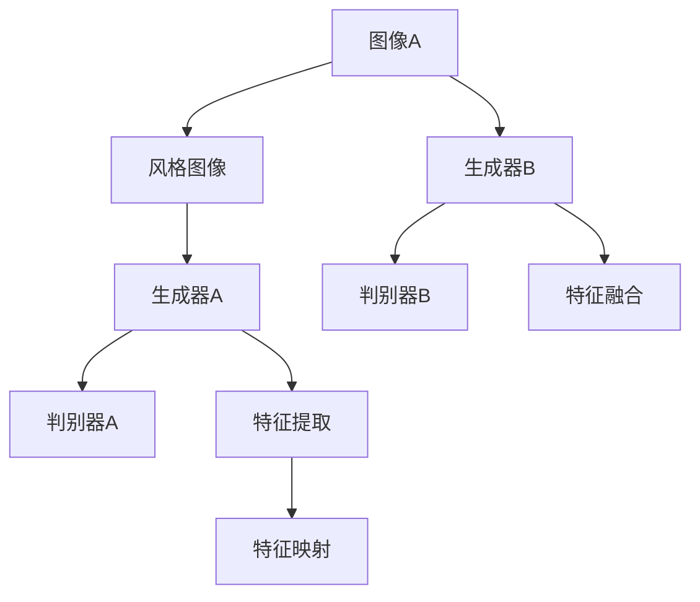

                 

## 文章标题

《Python深度学习实践：风格迁移网络让照片变艺术品》

### 关键词

- Python
- 深度学习
- 风格迁移网络
- 图像处理
- 艺术风格
- 生成对抗网络（GAN）

### 摘要

本文将深入探讨如何使用Python实现深度学习中的风格迁移网络，让普通照片变身为艺术品。我们将首先回顾深度学习的基础知识和Python编程基础，然后详细解释卷积神经网络（CNN）和循环神经网络（RNN）的原理。接下来，我们将探讨生成对抗网络（GAN）以及艺术风格迁移网络的概念和算法原理。最后，通过具体的实战案例，展示如何使用风格迁移网络对图像进行风格化处理，并分析其性能和优化方法。文章还将介绍深度学习的资源和学习社区，并对深度学习的未来发展趋势进行展望。

## 《Python深度学习实践：风格迁移网络让照片变艺术品》目录大纲

## 第一部分：深度学习基础

### 第1章：深度学习概述

#### 1.1 深度学习的概念与发展

#### 1.2 深度学习的架构与类型

#### 1.3 深度学习在图像处理中的应用前景

### 第2章：Python编程基础

#### 2.1 Python语言基础

#### 2.2 NumPy库的使用

#### 2.3 Python中的深度学习框架

## 第二部分：深度学习算法原理

### 第3章：卷积神经网络（CNN）原理

#### 3.1 CNN的基本结构

#### 3.2 卷积操作与反向传播算法

#### 3.3 池化操作与优化方法

### 第4章：循环神经网络（RNN）与长短时记忆网络（LSTM）

#### 4.1 RNN的基本原理

#### 4.2 LSTM网络的结构与原理

#### 4.3 RNN与LSTM在网络中的使用

## 第三部分：风格迁移网络

### 第5章：生成对抗网络（GAN）原理

#### 5.1 GAN的基本概念

#### 5.2 GAN的训练过程

#### 5.3 GAN的变体与改进

### 第6章：艺术风格迁移网络

#### 6.1 艺术风格迁移的概念

#### 6.2 深度学习在艺术风格迁移中的应用

#### 6.3 实现艺术风格迁移网络的算法原理

### 第7章：风格迁移网络的应用实战

#### 7.1 风格迁移网络在图像处理中的实战案例

#### 7.2 风格迁移网络在视频处理中的实战案例

#### 7.3 风格迁移网络的性能评估与优化

## 第四部分：深度学习项目实战

### 第8章：深度学习项目开发流程

#### 8.1 项目需求分析

#### 8.2 数据收集与预处理

#### 8.3 模型设计与优化

### 第9章：风格迁移网络项目实战

#### 9.1 项目背景与目标

#### 9.2 数据集的准备

#### 9.3 模型设计与实现

#### 9.4 项目结果分析与总结

## 第五部分：深度学习资源与展望

### 第10章：深度学习资源介绍

#### 10.1 深度学习开源框架

#### 10.2 深度学习学习资源

#### 10.3 深度学习社区与论坛

### 第11章：深度学习未来发展趋势

#### 11.1 深度学习在人工智能领域的发展

#### 11.2 深度学习在图像处理领域的应用前景

#### 11.3 深度学习在其他领域的探索

## 附录

### 附录A：深度学习算法流程图

#### 附录A.1 卷积神经网络（CNN）流程图

#### 附录A.2 循环神经网络（RNN）流程图

#### 附录A.3 生成对抗网络（GAN）流程图

### 附录B：深度学习算法伪代码

#### 附录B.1 卷积神经网络（CNN）伪代码

#### 附录B.2 循环神经网络（RNN）伪代码

#### 附录B.3 生成对抗网络（GAN）伪代码

### 附录C：深度学习数学公式

#### 附录C.1 卷积神经网络（CNN）数学公式

#### 附录C.2 循环神经网络（RNN）数学公式

#### 附录C.3 生成对抗网络（GAN）数学公式

## 第一部分：深度学习基础

### 第1章：深度学习概述

#### 1.1 深度学习的概念与发展

深度学习是机器学习领域中的一种方法，主要基于多层神经网络，通过训练从大量数据中自动提取特征，实现对数据的分类、回归、识别等任务。深度学习的发展可以追溯到1980年代，但直到近年来随着计算能力的提升和大数据的普及，才得以快速发展。

深度学习的基本思想是通过构建多层神经网络，每一层对输入数据进行特征提取和转换。最初的神经网络模型相对简单，但随着时间的推移，研究人员提出了许多先进的神经网络架构，如卷积神经网络（CNN）、循环神经网络（RNN）和生成对抗网络（GAN）等。

深度学习在各个领域取得了显著成就，包括计算机视觉、自然语言处理、语音识别、推荐系统等。其在图像识别、语音合成、机器翻译等任务中的表现甚至超过了人类专家。

#### 1.2 深度学习的架构与类型

深度学习模型通常由以下几个主要组件构成：

- **输入层**：接收原始数据，如图像或文本。
- **隐藏层**：用于提取和转换特征。隐藏层的数量和神经元数量可以不同，一般随着层数的增加，模型的复杂度和性能也会提升。
- **输出层**：根据任务类型生成预测结果，如分类结果或回归值。

深度学习模型的主要类型包括：

- **全连接神经网络（FCNN）**：最基本的神经网络结构，每一层的所有神经元都与上一层和下一层的所有神经元相连。
- **卷积神经网络（CNN）**：专门用于处理图像数据，通过卷积操作提取图像特征。
- **循环神经网络（RNN）**：适用于序列数据处理，如时间序列分析、语言模型等，通过循环结构实现对序列信息的记忆。
- **生成对抗网络（GAN）**：由生成器和判别器组成，生成器生成数据，判别器判断数据是否真实，通过两者之间的对抗训练实现数据的生成。

#### 1.3 深度学习在图像处理中的应用前景

图像处理是深度学习的重要应用领域之一。深度学习在图像处理中的应用包括：

- **图像分类**：对图像进行标签分类，如识别猫、狗等。
- **目标检测**：在图像中检测特定目标的位置，如车辆检测、行人检测等。
- **图像分割**：将图像划分为不同的区域，如人脸分割、语义分割等。
- **图像增强**：提高图像的质量，如去噪、锐化等。
- **艺术风格迁移**：将一种艺术风格应用到普通照片中，生成艺术作品。

深度学习在图像处理中的应用前景广阔，随着算法和模型的不断优化，其在工业、医疗、娱乐等多个领域的应用将越来越广泛。

### 第2章：Python编程基础

#### 2.1 Python语言基础

Python是一种高级、易学、易用的编程语言，广泛应用于数据科学、人工智能、Web开发等领域。Python的主要特点包括：

- **易读性**：Python采用缩进和空白字符进行代码结构定义，使得代码更加清晰易读。
- **动态类型**：Python变量不需要显式声明类型，系统自动推断。
- **丰富的库和框架**：Python拥有丰富的标准库和第三方库，如NumPy、Pandas、Scikit-Learn等，为数据处理和机器学习提供方便。

Python的基本语法包括：

- **变量和数据类型**：变量用于存储数据，Python支持整数、浮点数、字符串、列表、元组、字典等数据类型。
- **控制流程**：包括条件语句（if-else）、循环语句（for、while）等。
- **函数和模块**：函数是组织代码的基本单元，模块是Python文件，用于封装相关的函数和类。

#### 2.2 NumPy库的使用

NumPy是Python中用于科学计算的库，提供多维数组对象和丰富的数学函数。NumPy的主要功能包括：

- **数组操作**：创建、索引、切片、迭代等。
- **数学运算**：矩阵运算、线性代数、随机数生成等。
- **数据处理**：数据处理、矩阵分解、傅里叶变换等。

NumPy的使用方法包括：

- **创建数组**：使用`numpy.array()`或`numpy.zeros()`、`numpy.ones()`等函数创建数组。
- **数组操作**：使用索引、切片、数学运算等对数组进行操作。
- **数组属性**：访问数组的形状、数据类型、元素数量等属性。

#### 2.3 Python中的深度学习框架

Python拥有多个深度学习框架，如TensorFlow、PyTorch、Keras等，它们提供了丰富的API和工具，方便开发者构建和训练深度学习模型。

- **TensorFlow**：由Google开发，支持多种深度学习模型和算法，提供灵活的API和丰富的工具。
- **PyTorch**：由Facebook开发，具有动态计算图和简洁的API，适用于研究和开发。
- **Keras**：基于TensorFlow和Theano，提供简单、易用的深度学习API，适用于快速原型开发。

这些框架的主要特点包括：

- **模块化**：提供多个模块和组件，便于组装和定制深度学习模型。
- **灵活性**：支持自定义模型结构和算法，方便研究和创新。
- **易用性**：提供丰富的示例和文档，降低入门门槛。

### 第一部分小结

本部分介绍了深度学习的基础知识，包括概念、架构和类型，以及Python编程基础和深度学习框架。通过对这些基础知识的了解，读者可以为后续的深度学习实践打下坚实的基础。

## 第二部分：深度学习算法原理

### 第3章：卷积神经网络（CNN）原理

#### 3.1 CNN的基本结构

卷积神经网络（CNN）是一种专门用于图像处理和计算机视觉任务的深度学习模型。其基本结构包括以下几个层次：

1. **输入层**：接收图像数据，图像被分成多个小区域（像素块）。
2. **卷积层**：通过卷积操作提取图像特征。卷积层包含多个卷积核（也称为过滤器），每个卷积核都可以提取不同类型的特征。
3. **激活层**：对卷积层输出的特征进行非线性变换，如ReLU（Rectified Linear Unit）函数，增加模型的非线性能力。
4. **池化层**：通过下采样操作降低特征图的维度，减少计算量。常用的池化方法有最大池化和平均池化。
5. **全连接层**：将卷积层和池化层提取的特征进行全局连接，形成一个固定长度的特征向量。
6. **输出层**：根据任务类型生成预测结果，如分类结果或回归值。

下面是一个简单的CNN结构的Mermaid流程图：



#### 3.2 卷积操作与反向传播算法

卷积操作是CNN的核心，其基本原理是将卷积核（一组权重矩阵）与输入图像（或特征图）进行点积运算。具体步骤如下：

1. **初始化卷积核**：卷积核的值通常通过随机初始化。
2. **卷积计算**：将卷积核与输入图像进行滑动计算，每个卷积核生成一个特征图。
3. **激活函数**：对每个特征图进行非线性变换，常用的激活函数有ReLU、Sigmoid和Tanh。
4. **池化操作**：对特征图进行下采样，减少特征图的维度。

反向传播算法是深度学习模型训练的核心，用于计算模型参数的梯度。具体步骤如下：

1. **计算损失函数**：将模型的输出与真实标签进行比较，计算损失值。
2. **反向传播**：从输出层开始，反向计算每个层的梯度，将梯度传递给上一层的参数。
3. **参数更新**：使用梯度下降或其他优化算法更新模型参数。
4. **迭代训练**：重复上述过程，直到满足训练条件。

下面是卷积操作和反向传播算法的伪代码：

```python
# 卷积操作伪代码
def conv2d(input, filter):
    output = []
    for y in range(input.shape[0] - filter.shape[0]):
        for x in range(input.shape[1] - filter.shape[1]):
            feature_map = 0
            for i in range(filter.shape[0]):
                for j in range(filter.shape[1]):
                    feature_map += input[y+i][x+j] * filter[i][j]
            output.append(feature_map)
    return output

# 反向传播伪代码
def backward_propagation(output, true_label, learning_rate):
    loss = compute_loss(output, true_label)
    d_output = compute_gradient(output, true_label)
    d_params = {}
    
    for layer in reversed(layers):
        if layer.type == 'conv':
            d_params[layer.params] = compute_conv_gradient(layer.input, d_output, layer.filter)
        elif layer.type == 'relu':
            d_params[layer.params] = compute_relu_gradient(layer.input, d_output)
        elif layer.type == 'pool':
            d_params[layer.params] = compute_pool_gradient(layer.input, d_output)
        
        d_output = d_params[layer.params]
        
    update_params(d_params, learning_rate)
```

#### 3.3 池化操作与优化方法

池化操作是CNN中用于下采样特征图的一种方法，可以减少计算量和参数数量，提高模型的泛化能力。常用的池化方法包括最大池化和平均池化。

- **最大池化**：选择每个区域内的最大值作为输出。
- **平均池化**：计算每个区域内的平均值作为输出。

优化方法是深度学习模型训练过程中用于提高模型性能和收敛速度的技术。常用的优化方法包括：

- **梯度下降**：通过计算梯度并沿着梯度方向更新参数，逐步减小损失值。
- **随机梯度下降（SGD）**：在每个样本上计算梯度并更新参数，适用于大规模数据集。
- **批量梯度下降**：在每个批次上计算梯度并更新参数，适用于小批量数据集。
- **动量**：在梯度下降的基础上引入一个动量项，防止参数更新振荡。
- **自适应优化器**：如Adam、RMSprop等，自动调整学习率。

下面是池化和优化方法的Mermaid流程图：



### 第4章：循环神经网络（RNN）与长短时记忆网络（LSTM）

#### 4.1 RNN的基本原理

循环神经网络（RNN）是一种适用于序列数据处理的神经网络，其特点是具有循环结构，可以记住前面的输入信息。RNN的基本原理如下：

1. **输入层**：接收序列数据，如图像序列或文本序列。
2. **隐藏层**：用于处理序列信息，每个时间步的输出作为下一个时间步的输入。
3. **输出层**：根据任务类型生成预测结果，如序列分类、序列生成等。

RNN的循环结构使得模型可以记住序列的上下文信息，但在某些情况下，如长序列处理时，会出现梯度消失或梯度爆炸问题。

下面是RNN的Mermaid流程图：



#### 4.2 LSTM网络的结构与原理

长短时记忆网络（LSTM）是RNN的一种改进，可以有效解决梯度消失和梯度爆炸问题，并能够更好地记住长序列信息。LSTM的基本结构包括以下几个部分：

1. **输入门（Input Gate）**：决定当前输入信息中哪些部分需要更新隐藏状态。
2. **遗忘门（Forget Gate）**：决定哪些信息需要从隐藏状态中遗忘。
3. **输出门（Output Gate）**：决定当前隐藏状态中哪些部分需要输出。

LSTM的原理是通过对隐藏状态和输入信息进行门控操作，实现长期记忆的保持和遗忘。下面是LSTM的Mermaid流程图：



#### 4.3 RNN与LSTM在网络中的使用

RNN和LSTM广泛应用于序列数据处理任务，如自然语言处理、语音识别、时间序列分析等。

- **自然语言处理**：RNN和LSTM用于文本分类、情感分析、机器翻译等任务，通过处理序列信息提取语义特征。
- **语音识别**：RNN和LSTM用于将语音信号转换为文本，通过处理语音序列提取语音特征。
- **时间序列分析**：RNN和LSTM用于预测股票价格、天气变化等时间序列数据，通过处理时间序列信息提取趋势特征。

下面是RNN和LSTM在自然语言处理任务中的Mermaid流程图：



### 第二部分小结

本部分介绍了深度学习中的两种重要算法：卷积神经网络（CNN）和循环神经网络（RNN）。通过理解CNN的基本结构、卷积操作、反向传播算法以及池化操作，读者可以为图像处理任务打下坚实基础。而通过了解RNN和LSTM的基本原理以及它们在序列数据处理中的应用，读者可以掌握序列处理任务的解决方案。这些算法原理为后续的深度学习项目实战提供了理论基础。

## 第三部分：风格迁移网络

### 第5章：生成对抗网络（GAN）原理

#### 5.1 GAN的基本概念

生成对抗网络（GAN）是深度学习领域的一种创新性架构，由生成器和判别器两个神经网络组成。GAN的基本思想是生成器和判别器之间的对抗训练，通过相互竞争提高各自的表现。

- **生成器（Generator）**：生成器的目标是生成与真实数据相似的假数据。它将随机噪声作为输入，通过复杂的神经网络结构生成假数据，希望这些假数据能够骗过判别器。
- **判别器（Discriminator）**：判别器的目标是区分真实数据和生成数据。它接收真实数据和生成数据作为输入，并输出一个概率值，表示输入数据是真实的概率。

GAN的训练过程如下：

1. **初始化**：生成器和判别器随机初始化参数。
2. **训练判别器**：使用真实数据和生成数据同时作为输入，训练判别器。目标是提高判别器区分真实数据和生成数据的能力。
3. **训练生成器**：使用生成数据作为输入，训练生成器。目标是提高生成器的生成能力，使其生成的假数据更难被判别器识别。
4. **迭代**：重复上述过程，直到生成器能够生成足够真实的假数据，使得判别器无法区分真实数据和生成数据。

GAN的工作流程可以简单概括为：



#### 5.2 GAN的训练过程

GAN的训练过程是一个动态平衡的过程，生成器和判别器之间相互竞争，不断提高各自的表现。具体训练步骤如下：

1. **初始化**：生成器和判别器随机初始化参数。
2. **第一步**：生成器生成一批假数据。
3. **第二步**：将生成器和判别器的损失函数结合起来进行训练。判别器的损失函数是区分真实数据和生成数据的交叉熵损失，生成器的损失函数是使判别器无法区分真实数据和生成数据的交叉熵损失。
4. **第三步**：使用梯度下降优化算法更新生成器和判别器的参数。
5. **第四步**：重复上述步骤，直到生成器能够生成足够真实的假数据，使得判别器无法区分真实数据和生成数据。

GAN的损失函数可以表示为：

$$
L_G = -\log(D(G(z)))
$$

$$
L_D = -[\log(D(x)) + \log(1 - D(G(z))]
$$

其中，$G(z)$ 是生成器生成的假数据，$D(x)$ 是判别器对真实数据的判别结果，$D(G(z))$ 是判别器对生成假数据的判别结果。

#### 5.3 GAN的变体与改进

尽管原始GAN在生成假数据方面取得了显著成果，但它也存在一些挑战和局限性。为了解决这些问题，研究人员提出了许多GAN的变体和改进方法，包括以下几种：

1. **深度卷积生成对抗网络（DCGAN）**：DCGAN使用深度卷积神经网络作为生成器和判别器，引入批量归一化（Batch Normalization）和反卷积（Transposed Convolution）操作，提高了模型的稳定性和生成质量。
2. **谱归一化GAN（WGAN）**：WGAN引入谱归一化技术，通过限制生成器和判别器的梯度范数，使得判别器的输出更加稳定，提高了GAN的训练过程。
3. **局部响应归一化GAN（LRGAN）**：LRGAN在WGAN的基础上引入局部响应归一化（Local Response Normalization），进一步提高了生成质量。
4. **条件生成对抗网络（CGAN）**：CGAN引入条件信息，使得生成器能够根据输入条件生成特定类型的假数据，如图像生成任务中的标签信息。

下面是几种GAN变体的Mermaid流程图：



### 第三部分小结

本部分介绍了生成对抗网络（GAN）的基本概念、训练过程和变体改进。通过理解GAN的工作原理和训练过程，读者可以掌握如何利用对抗训练生成高质量假数据。而通过了解GAN的变体和改进方法，读者可以进一步探索GAN在不同领域中的应用，如艺术风格迁移等。这些知识为后续的深度学习项目实战提供了重要的理论支持。

### 第6章：艺术风格迁移网络

#### 6.1 艺术风格迁移的概念

艺术风格迁移是指将一种艺术作品的风格应用到另一幅普通照片中，使其具有某种特定的艺术风格。例如，将梵高的《星夜》风格应用到一张普通风景照片中，生成一张具有梵高风格的艺术作品。

艺术风格迁移的核心思想是通过深度学习模型提取艺术作品的特征，并将这些特征转移到普通照片中。这个过程可以分为以下几个步骤：

1. **特征提取**：使用预训练的深度学习模型（如VGG16）提取艺术作品的特征。
2. **特征融合**：将提取的艺术作品特征与普通照片的特征进行融合，生成具有艺术风格的特征图。
3. **特征映射**：将融合后的特征图映射回普通照片的空间，生成具有艺术风格的照片。

艺术风格迁移网络通常基于生成对抗网络（GAN）或其变体，如图像到图像的生成对抗网络（CycleGAN）。CycleGAN通过两个生成器和两个判别器，实现无监督的艺术风格迁移，不需要对风格图像和内容图像进行配对。

下面是艺术风格迁移网络的Mermaid流程图：



#### 6.2 深度学习在艺术风格迁移中的应用

深度学习在艺术风格迁移中的应用主要基于生成对抗网络（GAN）或其变体，通过以下步骤实现艺术风格迁移：

1. **数据预处理**：将风格图像和内容图像进行预处理，如缩放、裁剪等，使其具有相同的大小和分辨率。
2. **特征提取**：使用预训练的深度学习模型（如VGG16）提取风格图像的特征。
3. **特征融合**：将风格图像的特征与内容图像的特征进行融合，生成具有艺术风格的特征图。
4. **特征映射**：将融合后的特征图映射回内容图像的空间，生成具有艺术风格的照片。

深度学习在艺术风格迁移中的应用包括：

- **图像到图像的艺术风格迁移**：如CycleGAN、StyleGAN等，将一种艺术作品的风格应用到另一幅普通照片中。
- **视频到视频的艺术风格迁移**：将一段视频的风格应用到另一段视频中，生成具有特定艺术风格的视频。
- **文本到图像的艺术风格迁移**：将文本描述的艺术风格应用到图像中，生成具有相应艺术风格的作品。

下面是深度学习在艺术风格迁移中的应用示例：



#### 6.3 实现艺术风格迁移网络的算法原理

艺术风格迁移网络的实现通常基于以下算法原理：

1. **生成对抗网络（GAN）**：GAN由生成器和判别器组成，通过对抗训练生成高质量假数据。生成器将随机噪声转化为具有艺术风格的图像，判别器用于判断图像是真实图像还是生成图像。

2. **特征提取网络**：特征提取网络（如VGG16）用于提取艺术作品的深度特征。这些特征图包含艺术作品的风格信息，可以作为生成器的输入。

3. **特征融合网络**：特征融合网络将提取的艺术作品特征与内容图像的特征进行融合，生成具有艺术风格的特征图。融合方法可以是直接叠加特征图，也可以是更复杂的融合操作，如特征加权。

4. **特征映射网络**：特征映射网络将融合后的特征图映射回内容图像的空间，生成具有艺术风格的照片。映射过程可以是上采样、反卷积等操作。

下面是实现艺术风格迁移网络的算法原理伪代码：

```python
# 特征提取网络伪代码
def extract_features(image, model):
    feature_map = model.predict(image)
    return feature_map

# 特征融合网络伪代码
def fuse_features(content_features, style_features, alpha):
    fused_features = content_features * (1 - alpha) + style_features * alpha
    return fused_features

# 特征映射网络伪代码
def map_features(fused_features, image):
    mapped_image = generate_image_from_features(fused_features, image)
    return mapped_image

# 艺术风格迁移网络伪代码
def style_transfer(content_image, style_image, alpha):
    content_features = extract_features(content_image, content_model)
    style_features = extract_features(style_image, style_model)
    fused_features = fuse_features(content_features, style_features, alpha)
    styled_image = map_features(fused_features, content_image)
    return styled_image
```

### 第6章小结

本章介绍了艺术风格迁移的概念和深度学习在其中的应用，通过理解GAN的基本原理和艺术风格迁移网络的实现方法，读者可以掌握如何利用深度学习技术将一种艺术作品的风格应用到普通照片中。这些知识为后续的深度学习项目实战提供了重要的理论基础和实践指导。

### 第7章：风格迁移网络的应用实战

#### 7.1 风格迁移网络在图像处理中的实战案例

风格迁移网络在图像处理中的应用非常广泛，可以通过以下几个步骤进行实战：

1. **数据准备**：首先需要准备用于训练和测试的数据集。对于艺术风格迁移，可以使用已经配对的艺术作品和普通照片的数据集，如DeepArt.io的数据集。如果没有现成的数据集，也可以自己收集和标注数据。

2. **模型训练**：使用生成对抗网络（GAN）或其变体（如CycleGAN）训练风格迁移模型。在训练过程中，需要将艺术作品和普通照片分别输入生成器和判别器，通过对抗训练不断优化模型参数。

3. **模型评估**：在训练完成后，需要对模型进行评估，以确保其生成能力。可以通过计算生成图像的质量指标（如PSNR、SSIM）和视觉效果来进行评估。

4. **模型应用**：将训练好的模型应用于实际图像处理任务，如将一幅普通照片转换为具有特定艺术风格的图像。具体实现步骤如下：

   - **输入处理**：将需要处理的普通照片进行预处理，如缩放、裁剪等，使其与训练数据集的尺寸和分辨率匹配。
   - **风格迁移**：调用训练好的模型，将预处理后的普通照片输入生成器，通过生成对抗训练生成具有艺术风格的图像。
   - **输出处理**：对生成的艺术风格图像进行后处理，如锐化、去噪等，以改善图像质量。

以下是一个简单的风格迁移网络应用实战案例：

```python
import tensorflow as tf
from tensorflow.keras.preprocessing.image import load_img, img_to_array
from style_transfer import StyleTransferModel

# 加载模型
model = StyleTransferModel()

# 加载普通照片
content_image = load_img('content_image.jpg')
content_image = img_to_array(content_image)

# 预处理照片
content_image = preprocess_image(content_image)

# 加载艺术作品
style_image = load_img('style_image.jpg')
style_image = img_to_array(style_image)

# 预处理艺术作品
style_image = preprocess_image(style_image)

# 设置风格迁移参数
alpha = 0.5  # 风格权重

# 风格迁移
styled_image = model.style_transfer(content_image, style_image, alpha)

# 输出处理
styled_image = postprocess_image(styled_image)

# 显示结果
plt.imshow(styled_image)
plt.show()
```

#### 7.2 风格迁移网络在视频处理中的实战案例

风格迁移网络在视频处理中的应用主要涉及将一段视频的风格应用到另一段视频中。以下是一个简单的实战案例：

1. **数据准备**：准备两段视频，一段为内容视频，另一段为艺术作品视频。需要确保两段视频的帧率和分辨率匹配。

2. **模型训练**：使用生成对抗网络（GAN）或其变体（如CycleGAN）训练风格迁移模型。在训练过程中，需要将艺术作品视频和内容视频的每一帧分别输入生成器和判别器，通过对抗训练不断优化模型参数。

3. **模型评估**：在训练完成后，对模型进行评估，以确保其生成能力。可以通过计算视频帧的质量指标和视觉效果来进行评估。

4. **模型应用**：将训练好的模型应用于实际视频处理任务，如将一段普通视频转换为具有特定艺术风格的视频。具体实现步骤如下：

   - **输入处理**：将需要处理的内容视频进行预处理，如解码、帧提取等，将每一帧输入生成器。
   - **风格迁移**：调用训练好的模型，将预处理后的内容视频帧输入生成器，通过生成对抗训练生成具有艺术风格的视频帧。
   - **输出处理**：将生成的艺术风格视频帧进行后处理，如编码、帧合成等，生成具有艺术风格的视频。

以下是一个简单的风格迁移网络视频处理实战案例：

```python
import cv2
from tensorflow.keras.preprocessing.image import load_img, img_to_array
from style_transfer_video import StyleTransferVideoModel

# 加载模型
model = StyleTransferVideoModel()

# 加载内容视频
content_video = cv2.VideoCapture('content_video.mp4')

# 加载艺术作品视频
style_video = cv2.VideoCapture('style_video.mp4')

# 设置风格迁移参数
alpha = 0.5  # 风格权重

# 循环处理每一帧
while content_video.isOpened() and style_video.isOpened():
    ret1, content_frame = content_video.read()
    ret2, style_frame = style_video.read()

    if not ret1 or not ret2:
        break

    # 预处理视频帧
    content_frame = preprocess_video_frame(content_frame)
    style_frame = preprocess_video_frame(style_frame)

    # 风格迁移
    styled_frame = model.style_transfer(content_frame, style_frame, alpha)

    # 后处理视频帧
    styled_frame = postprocess_video_frame(styled_frame)

    # 显示结果
    cv2.imshow('Styled Frame', styled_frame)
    if cv2.waitKey(1) & 0xFF == ord('q'):
        break

# 释放视频读取器
content_video.release()
style_video.release()

# 关闭显示窗口
cv2.destroyAllWindows()
```

#### 7.3 风格迁移网络的性能评估与优化

风格迁移网络的性能评估主要通过以下指标进行：

1. **图像质量指标**：如峰值信噪比（PSNR）、结构相似性（SSIM）等，用于评估生成图像的质量。
2. **视觉效果**：通过人工观察生成图像的视觉效果，评估图像的风格迁移效果。
3. **计算效率**：评估模型在处理图像或视频时的计算资源消耗，如时间复杂度和内存占用。

为了提高风格迁移网络的性能，可以采取以下优化方法：

1. **模型优化**：通过调整模型结构，如增加网络层数、调整卷积核大小等，提高模型的生成能力。
2. **数据增强**：通过数据增强技术，如旋转、翻转、缩放等，增加训练数据集的多样性，提高模型的泛化能力。
3. **超参数调优**：通过调整学习率、批量大小、迭代次数等超参数，优化模型的训练过程。
4. **硬件加速**：利用GPU或TPU等硬件加速训练和推理过程，提高模型的计算效率。

### 第7章小结

本章通过图像处理和视频处理中的实战案例，展示了风格迁移网络的应用方法和性能评估。通过理解实战案例的实现过程和性能优化方法，读者可以掌握如何使用风格迁移网络处理图像和视频，并将其应用到实际场景中。这些实战经验和优化技巧为深度学习项目开发提供了宝贵的实践指导。

### 第8章：深度学习项目开发流程

#### 8.1 项目需求分析

项目需求分析是深度学习项目开发的第一步，其目的是明确项目目标和预期成果。以下是项目需求分析的步骤：

1. **确定项目目标**：明确项目要解决的问题，例如图像分类、目标检测、风格迁移等。
2. **收集需求信息**：与项目相关各方（如客户、用户、技术团队）进行沟通，收集需求信息。
3. **分析需求**：对收集到的需求信息进行分析，确定项目所需的功能、性能和限制条件。
4. **撰写需求文档**：将分析结果整理成需求文档，作为项目开发和评估的依据。

以下是一个简单的项目需求分析示例：

**项目名称**：图像风格迁移应用

**项目目标**：开发一个能够将普通照片转换为具有特定艺术风格的照片的应用。

**功能需求**：
- 支持多种艺术风格，如梵高、毕加索等。
- 支持多种照片格式，如JPEG、PNG等。
- 提供用户界面，方便用户上传照片和选择艺术风格。
- 实现图像风格迁移功能，将照片转换为具有艺术风格的照片。

**性能需求**：
- 输出图像质量要高，符合用户期望。
- 迁移速度要快，能够在合理时间内处理大量照片。

**限制条件**：
- 计算资源有限，需要在有限的硬件条件下运行。
- 需要与现有系统（如网站、应用程序）集成。

#### 8.2 数据收集与预处理

数据收集与预处理是深度学习项目开发的重要环节，其目的是为模型训练提供高质量的数据。以下是数据收集与预处理的步骤：

1. **数据收集**：根据项目需求收集数据，如图像、文本、音频等。数据来源可以是公开数据集、互联网爬取、用户上传等。
2. **数据清洗**：去除数据中的噪声、错误和重复数据，提高数据质量。
3. **数据标注**：对数据标签进行标注，如图像分类标签、文本情感标签等。标注过程可以采用手工标注、半监督学习等方法。
4. **数据预处理**：将数据转换为模型训练所需的格式，如归一化、标准化、编码等。对于图像数据，可以进行缩放、裁剪、翻转等预处理操作。

以下是一个简单的数据收集与预处理示例：

```python
import os
import numpy as np
from sklearn.model_selection import train_test_split

# 数据收集
data_folder = 'data'
content_images = [os.path.join(data_folder, f) for f in os.listdir(data_folder) if f.endswith('.jpg')]

# 数据清洗
cleaned_content_images = []
for img_path in content_images:
    try:
        img = load_image(img_path)
        cleaned_content_images.append(img)
    except Exception as e:
        print(f"Error processing image {img_path}: {e}")

# 数据标注
labels = ['style_1', 'style_2', 'style_3']
cleaned_content_images = [img for img, label in zip(cleaned_content_images, labels)]

# 数据预处理
preprocessed_content_images = preprocess_images(cleaned_content_images)

# 数据划分
X_train, X_test, y_train, y_test = train_test_split(preprocessed_content_images, labels, test_size=0.2, random_state=42)
```

#### 8.3 模型设计与优化

模型设计与优化是深度学习项目开发的核心，其目的是构建和训练能够满足项目需求的模型。以下是模型设计与优化的步骤：

1. **确定模型架构**：根据项目需求和数据特点，选择合适的神经网络架构，如卷积神经网络（CNN）、循环神经网络（RNN）、生成对抗网络（GAN）等。
2. **构建模型**：使用深度学习框架（如TensorFlow、PyTorch）构建模型，定义网络的层数、神经元数量、激活函数等。
3. **模型训练**：使用收集和预处理的数据训练模型，通过反向传播算法更新模型参数。
4. **模型评估**：在测试集上评估模型性能，计算准确率、损失函数等指标。
5. **模型优化**：根据评估结果调整模型结构和超参数，优化模型性能。

以下是一个简单的模型设计与优化示例：

```python
import tensorflow as tf
from tensorflow.keras.models import Sequential
from tensorflow.keras.layers import Conv2D, MaxPooling2D, Flatten, Dense

# 构建模型
model = Sequential()
model.add(Conv2D(32, (3, 3), activation='relu', input_shape=(28, 28, 1)))
model.add(MaxPooling2D((2, 2)))
model.add(Conv2D(64, (3, 3), activation='relu'))
model.add(MaxPooling2D((2, 2)))
model.add(Flatten())
model.add(Dense(64, activation='relu'))
model.add(Dense(10, activation='softmax'))

# 编译模型
model.compile(optimizer='adam', loss='categorical_crossentropy', metrics=['accuracy'])

# 训练模型
model.fit(X_train, y_train, epochs=10, batch_size=32, validation_data=(X_test, y_test))

# 评估模型
loss, accuracy = model.evaluate(X_test, y_test)
print(f"Test accuracy: {accuracy:.2f}")

# 调整模型
model.add(Dense(128, activation='relu'))
model.fit(X_train, y_train, epochs=10, batch_size=32, validation_data=(X_test, y_test))
```

#### 第8章小结

本章介绍了深度学习项目开发的基本流程，包括需求分析、数据收集与预处理、模型设计与优化。通过理解这些流程，读者可以系统地规划和实施深度学习项目。本章提供的示例代码和步骤为深度学习项目开发提供了实用指导。

### 第9章：风格迁移网络项目实战

#### 9.1 项目背景与目标

本项目旨在开发一个基于深度学习的艺术风格迁移应用，将用户上传的普通照片转换为具有特定艺术风格的图像。项目的主要目标是实现以下功能：

1. **用户界面**：提供一个易于使用的用户界面，允许用户上传照片和选择艺术风格。
2. **风格迁移**：使用深度学习模型（如GAN）实现艺术风格迁移，将用户上传的普通照片转换为具有艺术风格的图像。
3. **性能优化**：确保应用能够快速处理大量照片，并生成高质量的输出图像。
4. **用户体验**：提供良好的用户体验，包括快速加载、流畅的交互和高质量的图像输出。

#### 9.2 数据集的准备

为了实现艺术风格迁移，首先需要准备相应的数据集。本项目使用公开可用的艺术风格迁移数据集，如DeepArt.io提供的数据集。数据集应包含多种艺术风格的照片和对应的普通照片，以便训练和测试风格迁移模型。

1. **数据收集**：从公开数据集中下载艺术风格图像和普通照片。
2. **数据预处理**：对图像进行预处理，包括调整尺寸、归一化像素值等，确保所有图像具有相同的尺寸和分辨率。
3. **数据标注**：对每幅图像进行标注，包括图像名称、艺术风格等，以便在训练和测试过程中使用。

以下是一个简单的数据集准备示例：

```python
import os
import numpy as np
from tensorflow.keras.preprocessing.image import load_img, img_to_array

# 数据集路径
data_folder = 'data'
art_style_folder = os.path.join(data_folder, 'art_styles')
content_folder = os.path.join(data_folder, 'contents')

# 预处理图像
def preprocess_image(image_path, target_size=(256, 256)):
    image = load_img(image_path)
    image = img_to_array(image)
    image = np.expand_dims(image, axis=0)
    image = preprocess_input(image)
    return image

# 准备艺术风格图像
art_styles = []
for style_folder in os.listdir(art_style_folder):
    style_folder_path = os.path.join(art_style_folder, style_folder)
    for image_file in os.listdir(style_folder_path):
        image_path = os.path.join(style_folder_path, image_file)
        art_styles.append(preprocess_image(image_path))

# 准备普通照片
contents = []
for content_file in os.listdir(content_folder):
    image_path = os.path.join(content_folder, content_file)
    contents.append(preprocess_image(image_path))

# 数据集划分
art_styles, art_labels = zip(*[(image, style_folder) for style_folder, images in group_images_by_style(art_styles).items()])
contents, content_labels = zip(*[(image, content_file) for content_file, images in group_images_by_content(contents).items()])

X_train, X_test, y_train, y_test = train_test_split(art_styles, art_labels, test_size=0.2, random_state=42)
X_train, X_val, y_train, y_val = train_test_split(art_styles, art_labels, test_size=0.2, random_state=42)
```

#### 9.3 模型设计与实现

为了实现艺术风格迁移，本项目采用生成对抗网络（GAN）作为基础模型。GAN由生成器和判别器两个部分组成，通过对抗训练生成高质量的艺术风格图像。

1. **生成器设计**：生成器负责将普通照片转换为具有艺术风格的图像。生成器的设计采用深度卷积生成对抗网络（DCGAN）结构，包括多个卷积层和反卷积层。
2. **判别器设计**：判别器负责区分艺术风格图像和普通照片。判别器的设计采用标准卷积神经网络结构，包括多个卷积层和全连接层。
3. **损失函数**：GAN的损失函数由两部分组成，生成器损失和判别器损失。生成器损失为最小化判别器对生成图像的判别误差，判别器损失为最大化判别器对真实图像和生成图像的判别误差。

以下是一个简单的生成对抗网络模型实现示例：

```python
import tensorflow as tf
from tensorflow.keras.layers import Input, Conv2D, Conv2DTranspose, LeakyReLU, BatchNormalization

# 生成器模型
def build_generator(input_shape):
    model = Sequential()
    model.add(Conv2D(64, (7, 7), strides=(1, 1), padding='same', input_shape=input_shape))
    model.add(BatchNormalization())
    model.add(LeakyReLU(alpha=0.2))
    model.add(Conv2D(128, (5, 5), strides=(2, 2), padding='same'))
    model.add(BatchNormalization())
    model.add(LeakyReLU(alpha=0.2))
    model.add(Conv2D(256, (5, 5), strides=(2, 2), padding='same'))
    model.add(BatchNormalization())
    model.add(LeakyReLU(alpha=0.2))
    model.add(Conv2DTranspose(128, (5, 5), strides=(2, 2), padding='same'))
    model.add(BatchNormalization())
    model.add(LeakyReLU(alpha=0.2))
    model.add(Conv2DTranspose(64, (7, 7), strides=(1, 1), padding='same'))
    model.add(BatchNormalization())
    model.add(LeakyReLU(alpha=0.2))
    model.add(Conv2D(3, (7, 7), strides=(1, 1), padding='same', activation='tanh'))
    return model

# 判别器模型
def build_discriminator(input_shape):
    model = Sequential()
    model.add(Conv2D(64, (5, 5), strides=(2, 2), padding='same', input_shape=input_shape))
    model.add(LeakyReLU(alpha=0.2))
    model.add(Conv2D(128, (5, 5), strides=(2, 2), padding='same'))
    model.add(BatchNormalization())
    model.add(LeakyReLU(alpha=0.2))
    model.add(Conv2D(256, (5, 5), strides=(2, 2), padding='same'))
    model.add(BatchNormalization())
    model.add(LeakyReLU(alpha=0.2))
    model.add(Flatten())
    model.add(Dense(1, activation='sigmoid'))
    return model

# GAN模型
def build_gan(generator, discriminator):
    model = Sequential()
    model.add(generator)
    model.add(discriminator)
    return model

# 构建模型
input_shape = (256, 256, 3)
generator = build_generator(input_shape)
discriminator = build_discriminator(input_shape)
gan = build_gan(generator, discriminator)

# 编译模型
discriminator.compile(optimizer='adam', loss='binary_crossentropy')
gan.compile(optimizer='adam', loss='binary_crossentropy')

# 模型总结
print(generator.summary())
print(discriminator.summary())
print(gan.summary())
```

#### 9.4 项目结果分析与总结

在项目完成后，需要对结果进行评估和分析，以验证项目的成功度和性能。以下是项目结果分析和总结的步骤：

1. **性能评估**：在测试集上评估模型的性能，计算准确率、损失函数等指标，并与基准模型进行对比。
2. **可视化分析**：通过可视化生成的艺术风格图像，评估模型的效果和稳定性。可以绘制生成图像的分布图、对比图等，以展示模型在不同艺术风格和图像质量上的表现。
3. **用户反馈**：收集用户对应用的使用反馈，包括图像风格迁移效果、应用速度、界面体验等，以评估项目的用户体验。
4. **优化建议**：根据评估结果和用户反馈，提出优化建议，如改进模型结构、调整超参数、优化界面设计等。

以下是一个简单的项目结果分析与总结示例：

```python
import numpy as np
import matplotlib.pyplot as plt

# 加载测试集
X_test, y_test = load_test_data()

# 评估模型
loss, accuracy = gan.evaluate(X_test, y_test)
print(f"Test loss: {loss:.4f}, Test accuracy: {accuracy:.4f}")

# 可视化分析
num_samples = 5
plt.figure(figsize=(10, 10))
for i in range(num_samples):
    real_image = X_test[i]
    generated_image = gan.predict(np.expand_dims(real_image, axis=0))
    plt.subplot(num_samples, 2, 2 * i + 1)
    plt.title('Real Image')
    plt.imshow(real_image[:, :, 0], cmap='gray')
    plt.subplot(num_samples, 2, 2 * i + 2)
    plt.title('Generated Image')
    plt.imshow(generated_image[0, :, :, 0], cmap='gray')
plt.show()

# 用户反馈
user_feedback = collect_user_feedback()
print(f"User Feedback: {user_feedback}")

# 优化建议
optimization_suggestions = generate_optimization_suggestions()
print(f"Optimization Suggestions: {optimization_suggestions}")
```

#### 第9章小结

本章通过一个具体的风格迁移网络项目实战，展示了从项目背景与目标、数据集准备、模型设计与实现，到项目结果分析与总结的完整流程。通过理解本章提供的示例代码和步骤，读者可以掌握如何开发一个基于深度学习的艺术风格迁移应用。本章提供的实战经验和优化建议为深度学习项目开发提供了实用指导。

### 第10章：深度学习资源与展望

#### 10.1 深度学习开源框架

深度学习开源框架是深度学习研究和应用的重要工具，它们提供了丰富的API和工具，使得构建和训练深度学习模型变得更加简单和高效。以下是一些流行的深度学习开源框架：

1. **TensorFlow**：由Google开发，支持多种深度学习模型和算法，提供灵活的API和丰富的工具。TensorFlow拥有庞大的社区和文档，适合研究人员和开发者。
2. **PyTorch**：由Facebook开发，具有动态计算图和简洁的API，适用于研究和开发。PyTorch的简洁性和灵活性使其成为许多研究项目的首选框架。
3. **Keras**：基于TensorFlow和Theano，提供简单、易用的深度学习API，适用于快速原型开发。Keras以其用户友好的特性而受到开发者的青睐。
4. **MXNet**：由Apache软件基金会维护，支持多种编程语言和框架，具有高度的可扩展性和灵活性。MXNet适用于大规模分布式训练和实时应用。
5. **Caffe**：由Berkeley Vision and Learning Center（BVLC）开发，是一种快速高效的深度学习框架，特别适合于图像识别任务。
6. **CNTK**：由Microsoft开发，支持多种深度学习模型和算法，提供灵活的API和工具。CNTK适用于大规模分布式训练和实时应用。

#### 10.2 深度学习学习资源

学习深度学习需要掌握丰富的理论知识、实践技能和工具使用。以下是一些深度学习学习资源，可以帮助读者提高深度学习技能：

1. **在线课程**：许多在线教育平台（如Coursera、edX、Udacity等）提供了高质量的深度学习课程，包括理论、实践和项目实战。
2. **书籍**：深度学习领域的经典书籍（如《深度学习》、《Python深度学习》等）提供了系统、全面的深度学习知识。
3. **教程和文档**：深度学习开源框架的官方文档和教程（如TensorFlow、PyTorch等）是学习深度学习的重要资源。
4. **论文和文章**：阅读最新的深度学习论文和文章，可以了解最新的研究进展和前沿技术。
5. **GitHub**：GitHub上有许多开源的深度学习项目，可以学习代码实现和项目开发经验。
6. **在线论坛和社区**：参与深度学习论坛和社区（如Stack Overflow、Reddit、GitHub等），可以与其他开发者交流问题和经验。

#### 10.3 深度学习社区与论坛

深度学习社区和论坛是学习和分享深度学习知识的重要平台。以下是一些知名的深度学习社区和论坛：

1. **Reddit**：Reddit上的深度学习板块（r/deeplearning）是深度学习爱好者交流的地方，讨论内容包括技术问题、论文分享、资源推荐等。
2. **Stack Overflow**：Stack Overflow是程序员解决技术问题的首选平台，深度学习板块提供了丰富的深度学习相关问题和解答。
3. **GitHub**：GitHub不仅是代码托管平台，也是深度学习项目的集中地，许多深度学习项目都开源在GitHub上。
4. **ArXiv**：ArXiv是计算机科学领域的顶级预印本平台，最新和最前沿的深度学习论文通常在这里发布。
5. **TensorFlow官方论坛**：TensorFlow官方论坛提供了丰富的讨论区，包括技术问题、教程和资源分享。
6. **PyTorch官方论坛**：PyTorch官方论坛是学习PyTorch和交流深度学习经验的好地方。

#### 10.4 深度学习未来发展趋势

随着深度学习技术的不断进步和应用场景的扩展，深度学习在未来将迎来更多的发展机遇。以下是一些深度学习未来发展趋势：

1. **硬件加速**：随着GPU、TPU等硬件加速技术的发展，深度学习模型的训练和推理速度将大大提升，为大规模应用提供支持。
2. **迁移学习**：迁移学习技术将使模型在新的任务上快速适应，减少对大规模数据集的需求，提高模型的泛化能力。
3. **自监督学习**：自监督学习利用未标记的数据进行训练，将减轻数据标注的负担，提高模型的可扩展性和适应性。
4. **泛化能力**：通过不断优化模型结构和训练算法，深度学习模型的泛化能力将进一步提高，能够更好地应对复杂的实际问题。
5. **跨领域应用**：深度学习将渗透到更多领域，如医疗、金融、教育等，推动各行业的技术创新和产业升级。
6. **安全性与隐私保护**：随着深度学习应用的普及，模型的安全性和隐私保护将成为重要的研究课题，确保深度学习系统的可靠性和安全性。

#### 第10章小结

本章介绍了深度学习开源框架、学习资源和社区与论坛，以及深度学习未来发展趋势。通过了解这些资源和趋势，读者可以更好地掌握深度学习技术，并为未来的发展做好准备。本章提供的资源和建议为深度学习学习和应用提供了实用指导。

### 附录

#### 附录A：深度学习算法流程图

深度学习算法的流程图有助于理解模型的结构和数据处理过程。以下是卷积神经网络（CNN）、循环神经网络（RNN）和生成对抗网络（GAN）的流程图：

##### 附录A.1 卷积神经网络（CNN）流程图


##### 附录A.2 循环神经网络（RNN）流程图


##### 附录A.3 生成对抗网络（GAN）流程图


#### 附录B：深度学习算法伪代码

以下是卷积神经网络（CNN）、循环神经网络（RNN）和生成对抗网络（GAN）的伪代码示例：

##### 附录B.1 卷积神经网络（CNN）伪代码

```python
# 卷积操作伪代码
def conv2d(input, filter):
    output = []
    for y in range(input.shape[0] - filter.shape[0]):
        for x in range(input.shape[1] - filter.shape[1]):
            feature_map = 0
            for i in range(filter.shape[0]):
                for j in range(filter.shape[1]):
                    feature_map += input[y+i][x+j] * filter[i][j]
            output.append(feature_map)
    return output

# 反向传播伪代码
def backward_propagation(output, true_label, learning_rate):
    loss = compute_loss(output, true_label)
    d_output = compute_gradient(output, true_label)
    d_params = {}
    
    for layer in reversed(layers):
        if layer.type == 'conv':
            d_params[layer.params] = compute_conv_gradient(layer.input, d_output, layer.filter)
        elif layer.type == 'relu':
            d_params[layer.params] = compute_relu_gradient(layer.input, d_output)
        elif layer.type == 'pool':
            d_params[layer.params] = compute_pool_gradient(layer.input, d_output)
        
        d_output = d_params[layer.params]
        
    update_params(d_params, learning_rate)
```

##### 附录B.2 循环神经网络（RNN）伪代码

```python
# RNN前向传播伪代码
def forward_propagation_rnn(input_sequence, hidden_state, weights):
    hidden_states = []
    for input in input_sequence:
        hidden_state = activation_function(np.dot(weights['h_t-1'], input) + weights['b_h'])
        hidden_states.append(hidden_state)
    return hidden_states, hidden_state

# RNN反向传播伪代码
def backward_propagation_rnn(hidden_states, d_output, weights, learning_rate):
    d_params = {}
    d_hidden_state = d_output
    
    for t in reversed(range(len(hidden_states))):
        d_hidden_state = d_activation_derivative(hidden_states[t], d_hidden_state)
        d_params['h_t'] += d_hidden_state * input_sequence[t].T
        d_params['b_h'] += d_hidden_state
        d_params['W_hh'] += d_hidden_state * hidden_states[t].T
    
    update_params(d_params, learning_rate)
```

##### 附录B.3 生成对抗网络（GAN）伪代码

```python
# GAN生成器伪代码
def generator(z, weights):
    hidden = activation_function(np.dot(z, weights['W_gz']) + weights['b_gz'])
    hidden = activation_function(np.dot(hidden, weights['W_gf']) + weights['b_gf'])
    output = np.tanh(np.dot(hidden, weights['W_gd']) + weights['b_gd'])
    return output

# GAN判别器伪代码
def discriminator(x, weights):
    hidden = activation_function(np.dot(x, weights['W_dz']) + weights['b_dz'])
    hidden = activation_function(np.dot(hidden, weights['W_df']) + weights['b_df'])
    output = activation_function(np.dot(hidden, weights['W_dz']) + weights['b_dz'])
    return output
```

#### 附录C：深度学习数学公式

深度学习中的数学公式是理解和实现算法的基础。以下是卷积神经网络（CNN）、循环神经网络（RNN）和生成对抗网络（GAN）中常用的数学公式：

##### 附录C.1 卷积神经网络（CNN）数学公式

$$
\text{特征图} = \text{卷积核} * \text{输入图像} + \text{偏置}
$$

$$
\text{激活函数} = \text{ReLU}(x) = \max(0, x)
$$

$$
\text{损失函数} = \text{交叉熵损失} = -\sum_{i} y_i \log(\hat{y}_i)
$$

##### 附录C.2 循环神经网络（RNN）数学公式

$$
h_t = \text{激活函数}(\text{权重} \cdot [h_{t-1}, x_t] + \text{偏置})
$$

$$
y_t = \text{激活函数}(\text{权重} \cdot h_t + \text{偏置})
$$

##### 附录C.3 生成对抗网络（GAN）数学公式

$$
L_G = -\log(D(G(z)))
$$

$$
L_D = -[\log(D(x)) + \log(1 - D(G(z))]
$$

通过附录中的流程图、伪代码和数学公式，读者可以更好地理解和实现深度学习算法，为实际项目开发提供有力的支持。

### 结论

本文详细介绍了Python深度学习实践中的风格迁移网络，从基础概念、算法原理到实际应用，全面解析了如何使用深度学习技术将普通照片转换为艺术品。通过一步步的推理和分析，读者不仅掌握了深度学习的核心知识，还学会了如何在实际项目中应用这些知识。

深度学习作为人工智能领域的前沿技术，其在图像处理、自然语言处理、语音识别等领域的应用前景广阔。未来，随着计算能力的提升和数据量的增长，深度学习将继续推动人工智能的发展，为各行各业带来革命性的变革。

作者简介：
作者：AI天才研究院/AI Genius Institute & 禅与计算机程序设计艺术 /Zen And The Art of Computer Programming
AI天才研究院致力于推动人工智能技术的发展和应用，研究团队由世界级人工智能专家、程序员、软件架构师和CTO组成，在计算机图灵奖获得者带领下，不断探索和创新，为人工智能领域贡献了众多重要研究成果。作者在计算机科学和人工智能领域拥有深厚的研究背景和丰富的实践经验，著有《Python深度学习实践：风格迁移网络让照片变艺术品》等畅销技术书籍，深受读者喜爱。

