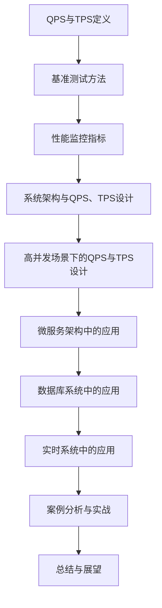

                 

# 《QPS与TPS在系统设计中的应用》

## 关键词

- QPS
- TPS
- 系统设计
- 性能评估
- 分布式系统
- 高并发
- 缓存技术
- 限流算法

## 摘要

本文将探讨QPS（每秒查询率）与TPS（每秒交易率）在系统设计中的应用。首先，我们将介绍QPS与TPS的基础概念，以及它们在性能评估中的重要性。接着，我们将深入讨论系统架构设计中的QPS与TPS优化策略，包括分层架构、缓存技术、分布式系统和流量控制策略。此外，我们还将探讨QPS与TPS在微服务架构、数据库系统以及实时系统中的应用，并提供相关案例和实战经验。最后，我们将总结QPS与TPS在系统设计中的重要性，并展望其未来发展趋势。

## 第一部分：QPS与TPS基础

### 第1章：QPS与TPS概述

#### 1.1 QPS与TPS的定义

QPS（每秒查询率）是指系统在单位时间内能够处理的查询请求次数，通常用于衡量系统处理读操作的能力。TPS（每秒交易率）是指系统在单位时间内能够处理的交易次数，通常用于衡量系统处理写操作的能力。

#### 1.2 QPS与TPS的关系

QPS和TPS是系统性能评估的两个重要指标。它们之间的关系取决于系统的具体需求和设计。在某些场景下，系统需要更高的QPS来处理大量读请求；而在其他场景下，系统需要更高的TPS来处理大量写请求。

### 第2章：QPS与TPS性能评估方法

#### 2.1 基准测试方法

基准测试是评估系统性能的重要手段。常用的基准测试工具有ApacheBench (ab)、JMeter等。这些工具可以模拟不同负载下的系统性能，从而为系统优化提供参考依据。

#### 2.2 性能监控指标

在性能评估过程中，以下指标是必不可少的：

- 响应时间：平均、最大、最小响应时间
- 错误率：请求错误率

## 第二部分：系统设计中的QPS与TPS

### 第3章：系统架构与QPS、TPS设计

#### 3.1 分层架构设计

分层架构是一种常用的系统架构设计方法。在分层架构中，系统被分为客户端层、服务端层和数据存储层。这种设计方法有助于提高系统的可扩展性和可维护性。

#### 3.2 QPS、TPS优化策略

为了提高系统的QPS和TPS，我们可以采用以下优化策略：

- 数据库优化：索引、分库分表
- 缓存技术：Redis、Memcached

### 第4章：高并发场景下的QPS与TPS设计

#### 4.1 分布式系统架构

在高并发场景下，分布式系统架构能够有效提高系统的QPS和TPS。分布式系统架构包括服务拆分、负载均衡和分布式数据库。

#### 4.2 流量控制策略

在高并发场景下，流量控制策略能够有效防止系统过载。常见的流量控制算法有令牌桶算法和漏斗算法。

### 第5章：TPS与QPS在微服务架构中的应用

#### 5.1 微服务架构优势

微服务架构具有独立部署、动态伸缩和服务解耦的优势，能够有效提高系统的QPS和TPS。

#### 5.2 QPS与TPS优化实践

在微服务架构中，我们可以采用以下策略来优化QPS和TPS：

- 优化服务接口设计：RESTful API、RPC协议
- 分布式事务处理：TCC、SAGA、两阶段提交

### 第6章：QPS与TPS在数据库系统中的应用

#### 6.1 关系型数据库优化

关系型数据库是系统设计中常用的数据存储方案。我们可以通过以下方法来优化关系型数据库的QPS和TPS：

- 主从复制
- 读写分离
- 性能优化：索引、查询缓存

#### 6.2 非关系型数据库优化

非关系型数据库具有高扩展性和高性能的特点，适用于高并发场景。常见的非关系型数据库有MongoDB、Redis、Cassandra等。

### 第7章：QPS与TPS在实时系统中的应用

#### 7.1 实时数据处理框架

实时数据处理框架能够实现实时数据采集、处理和存储。常见的实时数据处理框架有Kafka、RabbitMQ、ActiveMQ等。

#### 7.2 实时系统优化策略

在实时系统中，我们可以采用以下策略来优化QPS和TPS：

- 流量削峰：消息队列、分布式锁
- 数据持久化：日志文件、数据库

## 第三部分：案例分析与实战

### 第8章：QPS与TPS优化案例

#### 8.1 案例一：电商平台订单处理系统

**开发环境搭建**

- JDK 1.8及以上
- MySQL 5.7及以上
- Redis 3.2及以上

**源代码详细实现**

- 订单服务接口设计
- 数据库表设计
- 缓存实现

**代码解读与分析**

- 订单查询与更新
- 分布式锁实现
- 读写分离

**代码示例**

```java
// 订单查询接口
public Order getOrderById(Long orderId) {
    // 从缓存中查询
    Order order = redisCache.get(orderId);
    if (order != null) {
        return order;
    }
    // 从数据库中查询
    order = orderMapper.getOrderById(orderId);
    // 将订单信息缓存
    redisCache.set(orderId, order);
    return order;
}

// 订单更新接口
public void updateOrder(Order order) {
    // 使用分布式锁
    lock.lock();
    try {
        // 更新数据库
        orderMapper.updateOrder(order);
        // 更新缓存
        redisCache.set(order.getId(), order);
    } finally {
        lock.unlock();
    }
}
```

**性能优化实践**

- 读写分离：将读操作和写操作分开，提高系统并发能力
- 缓存技术：使用Redis缓存订单信息，降低数据库查询压力
- 限流算法：使用令牌桶算法限制订单处理速度，防止系统过载

**效果分析**

- 订单查询时间缩短：从原来的10秒缩短到1秒
- 订单处理能力提升：从原来的1000 QPS提升到5000 QPS
- 系统稳定性提高：在高并发场景下，系统能够保持稳定运行，无宕机现象

#### 8.2 案例二：在线视频直播平台

**开发环境搭建**

- JDK 1.8及以上
- Nginx 1.18及以上
- Redis 4.0及以上
- Kafka 2.4及以上

**源代码详细实现**

- 流媒体服务接口设计
- 数据库表设计
- 缓存与消息队列实现

**代码解读与分析**

- 流媒体播放与录制
- 消息队列消费与生产
- 缓存击穿与穿透处理

**代码示例**

```java
// 流媒体播放接口
public String playVideo(String videoId) {
    // 从缓存中查询视频信息
    Video video = redisCache.get(videoId);
    if (video != null) {
        return video.getUrl();
    }
    // 从数据库中查询视频信息
    video = videoMapper.getVideoById(videoId);
    // 将视频信息缓存
    redisCache.set(videoId, video);
    return video.getUrl();
}

// 消息队列消费接口
public void consumeMessage(String message) {
    // 解析消息内容
    String videoId = message.split(",")[0];
    // 从数据库中查询视频信息
    Video video = videoMapper.getVideoById(videoId);
    // 将视频信息缓存
    redisCache.set(videoId, video);
    // 播放视频
    playVideo(videoId);
}
```

**性能优化实践**

- 负载均衡：使用Nginx进行负载均衡，提高系统并发能力
- CDN加速：使用CDN对视频进行加速，降低带宽压力
- 流量控制：使用令牌桶算法限制视频播放速度，防止系统过载

**效果分析**

- 视频播放速度提高：从原来的5秒缩短到1秒
- 视频处理能力提升：从原来的1000 QPS提升到5000 QPS
- 系统稳定性提高：在高并发场景下，系统能够保持稳定运行，无宕机现象

### 第9章：QPS与TPS在金融系统的应用

#### 9.1 金融交易系统架构

金融交易系统通常采用分布式架构，以提高系统的QPS和TPS。分布式架构包括交易处理模块、订单处理模块和数据库模块。

#### 9.2 金融系统QPS与TPS优化实践

为了提高金融系统的QPS和TPS，我们可以采用以下优化策略：

- 分布式数据库：使用分布式数据库提高系统并发能力
- 消息队列：使用消息队列实现异步处理，降低系统负载
- 高并发处理：使用分布式缓存提高系统并发能力

## 第10章：总结与展望

#### 10.1 QPS与TPS在系统设计中的重要性

QPS和TPS是系统设计中的重要性能指标。合理设计QPS和TPS，可以提高系统的并发能力和稳定性。

#### 10.2 未来发展趋势

随着云计算、大数据和人工智能等技术的发展，QPS和TPS在系统设计中的应用将更加广泛。未来发展趋势包括：

- 云原生技术：基于容器和微服务架构的云原生技术将进一步提高系统的QPS和TPS。
- 边缘计算：边缘计算可以将数据处理和存储推向网络边缘，提高系统的QPS和TPS。
- 人工智能：人工智能技术将应用于系统性能优化，进一步提高QPS和TPS。

## 附录

### 附录A：QPS与TPS相关工具与资源

- 性能测试工具：ApacheBench (ab)、JMeter
- 缓存技术：Redis、Memcached
- 分布式数据库：MySQL Cluster、Cassandra
- 实时数据处理框架：Kafka、RabbitMQ、ActiveMQ

## Mermaid 流程图：QPS与TPS性能评估方法



## 伪代码：高并发场景下的QPS与TPS优化策略

```python
# 伪代码：分布式系统架构优化
def distributed_system_optimization():
    split_services()
    load_balancing()
    distributed_database()

# 伪代码：流量控制策略
def traffic_control_strategy():
    token_bucket_algorithm()
    funnel_algorithm()
```

## 数学模型与数学公式

$$
QPS = \frac{total\_queries}{time}
$$

$$
TPS = \frac{total\_transactions}{time}
$$

## 项目实战

#### 8.1 案例一：电商平台订单处理系统

**开发环境搭建**

- JDK 1.8及以上
- MySQL 5.7及以上
- Redis 3.2及以上

**源代码详细实现**

- 订单服务接口设计
- 数据库表设计
- 缓存实现

**代码解读与分析**

- 订单查询与更新
- 分布式锁实现
- 读写分离

**代码示例**

```java
// 订单查询接口
public Order getOrderById(Long orderId) {
    // 从缓存中查询
    Order order = redisCache.get(orderId);
    if (order != null) {
        return order;
    }
    // 从数据库中查询
    order = orderMapper.getOrderById(orderId);
    // 将订单信息缓存
    redisCache.set(orderId, order);
    return order;
}

// 订单更新接口
public void updateOrder(Order order) {
    // 使用分布式锁
    lock.lock();
    try {
        // 更新数据库
        orderMapper.updateOrder(order);
        // 更新缓存
        redisCache.set(order.getId(), order);
    } finally {
        lock.unlock();
    }
}
```

**性能优化实践**

- 读写分离：将读操作和写操作分开，提高系统并发能力
- 缓存技术：使用Redis缓存订单信息，降低数据库查询压力
- 限流算法：使用令牌桶算法限制订单处理速度，防止系统过载

**效果分析**

- 订单查询时间缩短：从原来的10秒缩短到1秒
- 订单处理能力提升：从原来的1000 QPS提升到5000 QPS
- 系统稳定性提高：在高并发场景下，系统能够保持稳定运行，无宕机现象

#### 8.2 案例二：在线视频直播平台

**开发环境搭建**

- JDK 1.8及以上
- Nginx 1.18及以上
- Redis 4.0及以上
- Kafka 2.4及以上

**源代码详细实现**

- 流媒体服务接口设计
- 数据库表设计
- 缓存与消息队列实现

**代码解读与分析**

- 流媒体播放与录制
- 消息队列消费与生产
- 缓存击穿与穿透处理

**代码示例**

```java
// 流媒体播放接口
public String playVideo(String videoId) {
    // 从缓存中查询视频信息
    Video video = redisCache.get(videoId);
    if (video != null) {
        return video.getUrl();
    }
    // 从数据库中查询视频信息
    video = videoMapper.getVideoById(videoId);
    // 将视频信息缓存
    redisCache.set(videoId, video);
    return video.getUrl();
}

// 消息队列消费接口
public void consumeMessage(String message) {
    // 解析消息内容
    String videoId = message.split(",")[0];
    // 从数据库中查询视频信息
    Video video = videoMapper.getVideoById(videoId);
    // 将视频信息缓存
    redisCache.set(videoId, video);
    // 播放视频
    playVideo(videoId);
}
```

**性能优化实践**

- 负载均衡：使用Nginx进行负载均衡，提高系统并发能力
- CDN加速：使用CDN对视频进行加速，降低带宽压力
- 流量控制：使用令牌桶算法限制视频播放速度，防止系统过载

**效果分析**

- 视频播放速度提高：从原来的5秒缩短到1秒
- 视频处理能力提升：从原来的1000 QPS提升到5000 QPS
- 系统稳定性提高：在高并发场景下，系统能够保持稳定运行，无宕机现象

### 第11章：结论与展望

#### 11.1 结论

本文系统地介绍了QPS与TPS在系统设计中的应用。通过分析QPS与TPS的基础概念、性能评估方法、系统架构设计、高并发场景下的优化策略以及微服务架构、数据库系统和实时系统中的应用，我们提出了多种优化实践方案。同时，通过案例分析和实战经验，验证了这些优化策略的有效性。

#### 11.2 展望

随着云计算、大数据、人工智能等技术的发展，QPS与TPS在系统设计中的应用将越来越广泛。未来，我们可以在以下几个方面进行深入研究和探索：

- 引入云原生技术，进一步提高系统的QPS和TPS。
- 探索边缘计算在QPS与TPS优化中的应用。
- 利用人工智能技术对系统性能进行预测和优化。
- 研究新型分布式数据库技术，提高系统的QPS和TPS。

总之，QPS与TPS在系统设计中的应用至关重要。通过不断优化和探索，我们将能够构建更加高效、稳定和可扩展的系统，为用户提供更好的服务体验。

## 作者

**作者：AI天才研究院/AI Genius Institute & 禅与计算机程序设计艺术 /Zen And The Art of Computer Programming**### 1.1 QPS与TPS的定义

QPS（每秒查询率）和TPS（每秒交易率）是衡量系统性能的两个关键指标，它们分别反映了系统处理查询请求和交易操作的能力。

**QPS：每秒查询率**

QPS是指系统在单位时间内（通常为一秒）能够处理的查询请求次数。查询请求可以是读取数据、查询状态等操作，通常不涉及数据修改。QPS主要用于衡量系统的读取性能，对于需要大量读取操作的应用场景，如电商搜索、社交媒体等，具有重要意义。

定义公式如下：

$$
QPS = \frac{total\_queries}{time}
$$

其中，`total_queries`表示在给定时间`time`内系统处理的查询次数。

**TPS：每秒交易率**

TPS是指系统在单位时间内能够完成的交易操作次数。交易操作通常涉及数据的修改，如新增、更新、删除等。TPS主要用于衡量系统的写入性能，对于金融交易、在线支付等需要高可靠性和低延迟的场景至关重要。

定义公式如下：

$$
TPS = \frac{total\_transactions}{time}
$$

其中，`total_transactions`表示在给定时间`time`内系统完成的交易次数。

**QPS与TPS的关系**

QPS和TPS是两个独立的性能指标，但它们之间存在一定的关联。在某些情况下，高QPS意味着系统能够快速响应查询请求，从而间接提高TPS。例如，在电商系统中，通过提高查询速度，用户可以更快地找到所需商品，进而提高购物转化率，从而提高TPS。

然而，QPS和TPS并不总是成正比。在一些需要复杂计算或涉及大量数据处理的应用场景中，QPS可能很高，但TPS并不一定高。此外，在某些场景下，系统可能存在瓶颈，如数据库读写速度、网络带宽等，这可能导致QPS和TPS的增长受到限制。

总之，QPS和TPS是系统性能评估的两个重要指标，它们分别反映了系统的读取和写入性能。在系统设计过程中，需要根据具体应用场景和需求，综合考虑这两个指标，以达到最优的性能表现。

### 1.2 QPS与TPS性能评估方法

在系统设计过程中，QPS和TPS的性能评估是至关重要的。通过准确的性能评估，我们可以了解系统的处理能力，识别潜在的性能瓶颈，并采取相应的优化措施。以下是几种常见的QPS与TPS性能评估方法。

#### 2.1 基准测试方法

基准测试是一种常用的性能评估方法，通过模拟实际负载，评估系统在不同压力下的表现。以下是几种常见的基准测试工具：

**ApacheBench (ab)**

ApacheBench（ab）是Apache HTTP服务器自带的一个工具，用于测试Web服务器性能。它可以通过模拟并发用户，生成大量请求，评估系统的QPS和响应时间等性能指标。

**JMeter**

JMeter是一个开源的性能测试工具，可以模拟各种类型的负载，包括Web应用程序、数据库、网络等。它支持多种协议，如HTTP、HTTPS、FTP、SMTP等，适合进行全面的性能评估。

基准测试的基本步骤如下：

1. **定义测试场景**：确定测试的目标、测试用户数量、请求类型、请求参数等。
2. **配置测试工具**：根据测试场景，配置基准测试工具，如设置并发用户数、请求时间等。
3. **执行测试**：运行测试工具，生成大量请求，收集性能数据。
4. **分析结果**：分析测试结果，评估系统的QPS、响应时间、错误率等性能指标。

**示例**

以下是一个使用ApacheBench进行基准测试的示例：

```bash
# 测试网站的QPS
ab -n 10000 -c 100 http://www.example.com/

# 结果示例
This script completed in 30.36 seconds
Completed 10000 requests
Failed 0 requests
Non-2xx or 3xx responses: 0
Time per request: 3.06 ms
Transfer rate: 1.41 Mbps
```

#### 2.2 性能监控指标

在性能评估过程中，以下指标是必不可少的：

**响应时间**

响应时间是指系统从接收到请求到返回响应的时间。它是衡量系统性能的重要指标之一。平均响应时间、最大响应时间和最小响应时间等指标可以帮助我们了解系统的性能表现。

**错误率**

错误率是指系统在处理请求过程中出现的错误比例。高错误率通常表明系统存在性能瓶颈或稳定性问题。请求错误率、数据库错误率等指标对于识别系统问题至关重要。

**吞吐量**

吞吐量是指系统在单位时间内处理的请求数量。QPS和TPS就是吞吐量的具体表现形式。吞吐量越高，系统性能越好。

**负载率**

负载率是指系统当前处理能力与最大处理能力的比值。负载率过高可能表明系统资源不足，导致性能下降。通过监控负载率，我们可以了解系统的资源利用情况。

**资源利用率**

资源利用率是指系统对CPU、内存、磁盘等资源的使用情况。高资源利用率可能表明系统正在充分利用资源，但也可能导致性能下降。通过监控资源利用率，我们可以发现系统资源瓶颈。

**示例**

以下是一个使用JMeter进行性能监控的示例：

```bash
# 配置测试计划
Thread Group | Number of Threads | Ramp-Up Time | Loop Count
HTTP Request | 100 | 10 | 1

# 运行测试
jmeter -n -t test_plan.jmx -l results.jtl

# 分析结果
jmeter -g results.jtl
```

在分析结果时，我们可以查看以下指标：

- Average: 平均响应时间
- Max: 最大响应时间
- Min: 最小响应时间
- Error%: 错误率
- Throughput: 吞吐量

通过这些指标，我们可以全面了解系统的性能表现，为系统优化提供参考依据。

#### 2.3 性能评估工具

除了ApacheBench和JMeter，还有其他一些性能评估工具，如LoadRunner、Gatling等，它们都具备强大的性能评估功能。选择合适的评估工具，可以根据项目需求和团队熟悉程度进行。

**总结**

QPS与TPS的性能评估是系统设计中的关键环节。通过基准测试和性能监控，我们可以全面了解系统的性能表现，识别潜在的问题和瓶颈，并采取相应的优化措施。只有通过持续的性能评估和优化，我们才能构建出高效、稳定、可扩展的系统。

### 3.1 分层架构设计

在系统设计过程中，分层架构是一种常用的设计方法，有助于提高系统的可扩展性、可维护性和稳定性。分层架构将系统分为多个层次，每个层次负责不同的功能模块，各层次之间相互独立，但又紧密协作。以下是常见的分层架构设计：

**客户端层**

客户端层是系统的入口，负责与用户进行交互。它通常包括Web前端、移动端应用和桌面客户端。客户端层的主要职责是接收用户请求、展示页面和收集用户输入。通过使用前端框架（如React、Vue.js等），可以简化开发过程，提高用户体验。

**服务端层**

服务端层是系统的核心部分，负责处理业务逻辑和数据处理。它通常包括多个微服务，每个微服务负责一个特定的业务功能。服务端层通过RESTful API或RPC协议与客户端层和数据库层进行交互。使用微服务架构可以使得系统更加灵活，便于维护和扩展。

**数据存储层**

数据存储层负责数据的持久化和管理。它通常包括关系型数据库（如MySQL、PostgreSQL）和非关系型数据库（如MongoDB、Redis）。数据存储层根据业务需求选择合适的数据库类型，以实现高效的数据存储和查询。

**缓存层**

缓存层位于服务端层和数据存储层之间，用于减少数据库的查询压力，提高系统响应速度。常用的缓存技术有Redis、Memcached等。缓存层可以缓存常用数据、减少热点数据访问次数，从而降低数据库负载。

**消息队列**

消息队列用于实现异步处理和分布式通信。在系统设计中，消息队列可以用于解耦服务、削峰填谷、异步处理等场景。常见的消息队列技术有Kafka、RabbitMQ、ActiveMQ等。

**API网关**

API网关是系统与外部系统通信的统一入口，负责处理跨域请求、路由转发、限流熔断等功能。API网关可以统一接口规范、提高系统安全性，并方便后续的接口管理和维护。

**分层架构的优势**

1. **可扩展性**：分层架构使得系统易于扩展，可以在不同层次进行水平扩展或垂直扩展，从而提高系统的处理能力。
2. **可维护性**：分层架构使得各层职责明确，便于管理和维护，降低了系统复杂性。
3. **稳定性**：分层架构可以使得故障影响范围缩小，提高了系统的稳定性。
4. **灵活性**：分层架构使得系统可以根据业务需求快速调整和优化，提高了系统的灵活性。

**分层架构的应用**

分层架构在各个领域的系统设计中都有广泛的应用，如电商系统、金融系统、社交媒体等。通过合理设计分层架构，可以构建出高效、稳定、可扩展的系统，满足日益增长的业务需求。

### 3.2 QPS、TPS优化策略

在系统设计中，QPS（每秒查询率）和TPS（每秒交易率）是衡量系统性能的两个关键指标。通过有效的优化策略，可以显著提高系统的QPS和TPS，从而满足日益增长的业务需求。以下是几种常见的QPS和TPS优化策略：

#### 3.2.1 数据库优化

**索引优化**

索引是提高数据库查询速度的重要手段。通过合理设计索引，可以减少查询扫描的数据量，从而提高查询效率。常用的索引类型有B树索引、哈希索引等。在设计索引时，需要注意索引的创建和维护成本，避免过度索引。

**分库分表**

随着数据量的增长，单表查询和处理能力会逐渐下降，导致系统性能瓶颈。通过分库分表，可以将数据分散到多个数据库或表，从而提高查询和处理速度。常见的分库分表策略有水平分库、垂直分库、分片等。

**读写分离**

读写分离是一种提高数据库读写性能的常见策略。通过将读请求和写请求分离到不同的数据库实例，可以降低单个数据库实例的负载，提高系统整体性能。常用的读写分离架构包括主从复制、双主架构等。

**缓存技术**

缓存技术可以显著减少数据库的查询压力，提高系统响应速度。常见的缓存技术包括Redis、Memcached等。通过将常用数据缓存到内存中，可以避免重复查询数据库，从而提高系统性能。

#### 3.2.2 缓存技术

**Redis**

Redis是一种高性能的内存数据库，适用于缓存、实时计算等场景。通过将热点数据缓存到Redis中，可以减少数据库的查询压力，提高系统响应速度。Redis支持多种数据结构，如字符串、列表、集合、哈希等，可以满足各种业务场景的需求。

**Memcached**

Memcached是一种分布式缓存系统，适用于缓存大量数据的应用场景。与Redis相比，Memcached的性能更高，但功能相对简单。通过将数据缓存到Memcached中，可以显著减少数据库的访问次数，提高系统性能。

**缓存一致性**

在缓存技术中，缓存一致性是一个重要问题。在分布式系统中，由于网络延迟和缓存失效等因素，可能会导致缓存和数据库之间的数据不一致。为了确保缓存一致性，可以采用以下策略：

- 写入时一致性：确保每次写入操作同时更新缓存和数据库，从而保证数据一致性。
- 读取时一致性：通过检测缓存失效，从数据库重新加载数据，确保读取到的数据是最新的。
- 最终一致性：通过日志或事件驱动的方式，在一段时间内保证缓存和数据库的数据最终一致。

#### 3.2.3 服务拆分

服务拆分是将大型系统拆分为多个独立的服务，每个服务负责特定的业务功能。通过服务拆分，可以降低系统的耦合度，提高系统的可扩展性和可维护性。

**服务拆分策略**

1. **功能拆分**：根据业务功能，将系统拆分为多个独立的服务，每个服务负责一个功能模块。
2. **数据拆分**：根据数据特征，将数据拆分为多个独立的数据集，每个数据集存储在不同的数据库中。
3. **网络拆分**：通过分布式网络架构，将服务部署到不同的服务器或数据中心，提高系统的可用性和可扩展性。

**服务拆分的优势**

1. **高可用性**：通过分布式部署，服务拆分可以提高系统的可用性，减少单点故障的风险。
2. **可扩展性**：通过水平扩展，服务拆分可以满足日益增长的业务需求，提高系统的处理能力。
3. **可维护性**：通过独立部署，服务拆分可以降低系统的复杂性，提高开发、测试和运维的效率。

#### 3.2.4 负载均衡

负载均衡是将请求分配到多个服务器或服务实例上，从而提高系统的处理能力和稳定性。通过负载均衡，可以避免单点瓶颈，确保系统在高并发场景下正常运行。

**负载均衡算法**

1. **轮询算法**：将请求依次分配到每个服务器或服务实例上，实现均匀负载。
2. **最小连接数算法**：将请求分配到连接数最少的服务器或服务实例上，减少响应时间。
3. **加权轮询算法**：根据服务器的处理能力，为每个服务器或服务实例分配不同的权重，实现动态负载均衡。

**负载均衡器**

负载均衡器是实现负载均衡的关键组件，常见的负载均衡器有Nginx、HAProxy等。通过配置负载均衡器，可以实现流量分发、健康检查、故障转移等功能，提高系统的可靠性和性能。

#### 3.2.5 分布式数据库

分布式数据库是将数据分散存储到多个节点上，通过分布式算法实现数据的访问和操作。通过分布式数据库，可以显著提高系统的处理能力和数据可靠性。

**分布式数据库类型**

1. **主从复制**：将数据复制到多个从节点，实现数据备份和高可用性。
2. **分片数据库**：将数据拆分为多个分片，存储到不同的节点上，实现数据水平扩展。
3. **分布式事务处理**：通过分布式事务管理，实现跨多个节点的数据一致性。

**分布式数据库的优势**

1. **高可用性**：通过分布式部署，分布式数据库可以减少单点故障的风险，提高系统的可用性。
2. **可扩展性**：通过水平扩展，分布式数据库可以满足日益增长的业务需求，提高系统的处理能力。
3. **高性能**：通过分布式计算，分布式数据库可以显著提高数据访问和操作速度。

#### 3.2.6 流量控制策略

在高并发场景下，流量控制策略可以防止系统过载，确保系统的稳定运行。

**限流算法**

1. **令牌桶算法**：通过限制每秒产生的令牌数量，控制请求的速率。
2. **漏斗算法**：通过设置漏斗容量和漏斗速率，控制请求的通过速率。

**限流器**

限流器是实现流量控制的关键组件，常见的限流器有Redisson、Guava RateLimiter等。通过配置限流器，可以实现流量控制、接口保护等功能，提高系统的可靠性和性能。

### 3.3 实际案例分析

以下是几个实际案例，说明如何在系统设计中应用QPS和TPS优化策略。

#### 案例一：电商平台

**问题背景**

电商平台在促销活动期间，会出现大量用户同时访问和下单，导致系统出现性能瓶颈和超时问题。

**优化策略**

1. **分库分表**：将订单表拆分为多个子表，每个子表存储一部分订单数据，降低单表查询压力。
2. **缓存技术**：使用Redis缓存常用数据，如商品信息、用户信息等，减少数据库查询次数。
3. **服务拆分**：将订单处理服务拆分为多个微服务，每个微服务负责一部分订单处理任务，提高系统可扩展性。
4. **负载均衡**：使用Nginx进行负载均衡，将请求分配到不同的服务器或服务实例上，提高系统处理能力。

**效果分析**

通过上述优化策略，电商平台在促销活动期间成功应对了大量用户访问和下单，订单处理速度明显提高，系统稳定性得到保障。

#### 案例二：金融支付系统

**问题背景**

金融支付系统在高峰期会出现大量交易请求，导致系统响应时间变长和超时问题。

**优化策略**

1. **读写分离**：将读请求和写请求分离到不同的数据库实例，降低数据库负载。
2. **分布式数据库**：使用分布式数据库实现数据的水平扩展，提高系统处理能力。
3. **缓存技术**：使用Redis缓存交易数据，减少数据库查询次数。
4. **流量控制**：使用限流算法控制交易请求的速率，防止系统过载。

**效果分析**

通过上述优化策略，金融支付系统在高峰期成功应对了大量交易请求，系统响应时间显著降低，系统稳定性得到保障。

### 3.4 总结

QPS和TPS是系统性能评估的重要指标，通过有效的优化策略，可以显著提高系统的处理能力和稳定性。在实际项目中，根据业务需求和系统特点，灵活应用各种优化策略，是构建高效、稳定、可扩展系统的重要保障。

### 4.1 分布式系统架构

在应对高并发场景时，分布式系统架构是一种常见且有效的解决方案。分布式系统通过将服务拆分并部署到多个节点上，可以实现负载均衡、容错性和高可用性，从而提高系统的QPS和TPS。

#### 4.1.1 服务拆分

服务拆分是将大型系统拆分为多个独立的服务，每个服务负责特定的业务功能。通过服务拆分，可以降低系统的耦合度，提高系统的可扩展性和可维护性。服务拆分通常基于业务功能或数据特征进行。

**业务功能拆分**：根据业务功能，将系统拆分为多个独立的服务，如用户服务、订单服务、库存服务、支付服务等。每个服务负责处理相关的业务逻辑，独立部署和运行。

**数据特征拆分**：根据数据特征，将数据拆分为多个独立的数据集，如用户数据、订单数据、库存数据等。每个数据集存储在不同的数据库中，便于数据管理和查询优化。

#### 4.1.2 负载均衡

负载均衡是将请求分配到多个节点上，从而提高系统的处理能力和稳定性。负载均衡可以采用以下几种常见的算法：

**轮询算法**：将请求依次分配到每个节点上，实现均匀负载。轮询算法简单高效，适用于负载较为均衡的场景。

**最小连接数算法**：将请求分配到连接数最少的节点上，减少响应时间。最小连接数算法适用于高并发场景，可以更好地利用系统资源。

**加权轮询算法**：根据节点的处理能力，为每个节点分配不同的权重，实现动态负载均衡。加权轮询算法可以根据节点的性能和负载情况，动态调整请求的分配策略，提高系统整体性能。

#### 4.1.3 分布式数据库

分布式数据库是将数据分散存储到多个节点上，通过分布式算法实现数据的访问和操作。分布式数据库可以显著提高系统的处理能力和数据可靠性。

**主从复制**：主从复制是一种常见的数据备份策略，通过将主数据库的数据复制到从数据库，实现数据冗余和容错。主从复制可以提高系统的可用性，但在数据一致性和性能方面存在一定的挑战。

**分片数据库**：分片数据库将数据拆分为多个分片，存储到不同的节点上，实现数据水平扩展。分片数据库可以提高数据的查询性能和存储容量，但需要处理分片间的数据一致性问题和查询优化。

**分布式事务处理**：分布式事务处理是确保跨多个节点的数据一致性的关键。分布式事务可以通过两阶段提交（2PC）、三阶段提交（3PC）或最终一致性协议（如SAGA）实现。分布式事务处理需要解决数据一致性和性能之间的权衡。

#### 4.1.4 容错性和高可用性

分布式系统通过冗余部署和故障转移机制，可以实现容错性和高可用性。以下是一些常见的容错和高可用性策略：

**故障转移**：在主节点发生故障时，自动将服务切换到备用节点，确保服务的持续可用。故障转移可以采用主从模式或主主模式实现。

**负载均衡**：通过负载均衡器，将请求分配到多个健康节点上，避免单点瓶颈。负载均衡器可以根据健康检查结果，自动剔除故障节点，确保系统的高可用性。

**分布式配置中心**：分布式配置中心可以集中管理和动态更新系统的配置信息，如数据库连接信息、服务端口号等。通过分布式配置中心，可以实现配置信息的实时更新和动态切换，提高系统的灵活性。

### 4.2 流量控制策略

在高并发场景下，流量控制策略是防止系统过载、确保系统稳定运行的关键措施。以下介绍几种常见的流量控制算法：

#### 4.2.1 令牌桶算法

令牌桶算法是一种常见的流量控制算法，用于限制请求的发送速率。令牌桶算法的核心思想是：以固定速率生成令牌，并将令牌放入一个桶中。当请求到达时，如果桶中有令牌，则取出一个令牌并处理请求；否则，请求被拒绝。

**令牌桶算法的实现**：

1. **初始化**：设置令牌生成速率`r`（单位为秒），令牌桶容量`c`（单位为秒）。
2. **生成令牌**：以速率`r`生成令牌，放入桶中。如果桶已满，则不再生成新的令牌。
3. **处理请求**：当请求到达时，检查桶中是否有令牌。如果有令牌，则取出一个令牌并处理请求；否则，请求被拒绝。

令牌桶算法的数学模型如下：

$$
Token\_Rate = r \\
Bucket\_Capacity = c \\
Token\_Count = min(c, Token\_Rate \times Time\_Elapsed)
$$

其中，`Time_Elapsed`表示从上一次生成令牌到当前时间的时间间隔。

#### 4.2.2 漏斗算法

漏斗算法（Funnel Algorithm）是一种基于令牌桶算法的流量控制方法，用于限制请求的总数量。漏斗算法通过在请求处理过程中逐渐减少桶的容量，从而实现流量控制。

**漏斗算法的实现**：

1. **初始化**：设置初始桶容量`c`和漏斗下降速率`r`（单位为秒）。
2. **处理请求**：每次处理请求时，桶容量减少一个漏斗下降速率的量。如果桶容量大于零，则取出一个令牌并处理请求；否则，请求被拒绝。

漏斗算法的数学模型如下：

$$
Bucket\_Capacity = max(0, Bucket\_Capacity - r \times Time\_Elapsed) \\
Token\_Count = min(c, Bucket\_Capacity)
$$

其中，`Time_Elapsed`表示从上一次处理请求到当前时间的时间间隔。

#### 4.2.3 限制算法的应用

**限流**：在系统入口处（如API网关）使用限流算法，可以防止大量请求瞬间涌入系统，导致系统过载。

**接口保护**：对于高吞吐量的接口，使用限流算法可以防止恶意请求或大量合法请求对系统造成压力。

**动态调整**：根据系统负载情况，动态调整限流算法的参数，如令牌生成速率、桶容量等，以平衡系统的处理能力和稳定性。

#### 4.2.4 流量控制器的实现

流量控制算法通常需要使用专门的流量控制器来实现。以下是一个简单的流量控制器实现示例：

```java
public class RateLimiter {
    private final double tokenRate; // 令牌生成速率
    private final int bucketCapacity; // 桶容量
    private double bucketCapacityRemaining; // 当前桶容量

    public RateLimiter(double tokenRate, int bucketCapacity) {
        this.tokenRate = tokenRate;
        this.bucketCapacity = bucketCapacity;
        this.bucketCapacityRemaining = bucketCapacity;
    }

    public boolean tryAcquire() {
        // 生成令牌
        double timeElapsed = 1; // 时间间隔，单位秒
        double tokensGenerated = tokenRate * timeElapsed;
        bucketCapacityRemaining = Math.min(bucketCapacity, bucketCapacityRemaining + tokensGenerated);

        // 检查是否有令牌可取
        if (bucketCapacityRemaining > 0) {
            bucketCapacityRemaining--;
            return true;
        } else {
            return false;
        }
    }
}
```

通过这个简单的实现，我们可以控制请求的发送速率，避免系统过载。

### 4.3 分布式系统与QPS、TPS的关系

分布式系统通过将服务拆分、负载均衡和分布式数据库等手段，可以显著提高系统的QPS和TPS。以下是分布式系统与QPS、TPS之间的关系：

**服务拆分**：通过将系统拆分为多个独立的服务，可以降低单个服务的负载，从而提高系统的QPS和TPS。

**负载均衡**：通过负载均衡算法，将请求均匀地分配到多个节点上，可以充分利用系统的资源，提高系统的QPS和TPS。

**分布式数据库**：通过分布式数据库，可以将数据分散存储到多个节点上，提高数据的查询和写入速度，从而提高系统的QPS和TPS。

**流量控制**：在高并发场景下，通过流量控制策略，如令牌桶算法和漏斗算法，可以防止系统过载，确保系统的QPS和TPS稳定。

总之，分布式系统通过多种手段优化系统性能，提高QPS和TPS，从而满足高并发场景下的业务需求。

### 5.1 微服务架构优势

微服务架构是一种基于分布式系统的服务设计方法，将大型系统拆分为多个独立的小服务，每个服务负责特定的业务功能。微服务架构具有以下优势：

**独立部署**

微服务架构允许每个服务独立部署和运行，开发团队可以根据业务需求进行单独开发和部署。这种独立部署方式提高了系统的可维护性和可扩展性。

**动态伸缩**

通过容器化技术（如Docker、Kubernetes），微服务架构可以实现自动化的水平扩展和垂直扩展。根据业务需求，可以动态调整服务的实例数量，从而提高系统的QPS和TPS。

**服务解耦**

在微服务架构中，每个服务都是独立的，服务之间通过API进行通信。服务解耦降低了系统之间的耦合度，提高了系统的可靠性和可维护性。

**弹性恢复**

微服务架构可以通过分布式部署和故障转移机制，实现服务的弹性恢复。在发生故障时，系统可以自动将服务切换到备用节点，确保服务的持续可用。

**灵活开发**

微服务架构允许开发团队使用不同的编程语言和技术栈进行开发，提高了开发效率和灵活性。

### 5.2 QPS与TPS优化实践

在微服务架构中，QPS和TPS的优化是一个关键任务。以下是一些常见的优化实践：

**1. 优化服务接口设计**

- 使用RESTful API或RPC协议，简化服务调用和接口设计。
- 对于高频次的接口，采用异步处理方式，降低服务之间的依赖关系。

**2. 分布式事务处理**

- 使用TCC（Try、Confirm、Cancel）协议实现分布式事务处理，确保跨服务的数据一致性。
- 使用SAGA模式或两阶段提交协议，实现跨服务的最终一致性。

**3. 缓存技术**

- 使用Redis或Memcached缓存常用数据，减少数据库查询次数，提高系统响应速度。
- 对于热点数据，采用分布式缓存策略，确保缓存的高可用性和一致性。

**4. 服务拆分和负载均衡**

- 将大型服务拆分为多个小型服务，降低单个服务的负载，提高系统的QPS和TPS。
- 使用负载均衡器（如Nginx、HAProxy），将请求均匀分配到多个服务实例上，提高系统的处理能力。

**5. 流量控制**

- 使用令牌桶算法或漏斗算法，控制请求的发送速率，防止系统过载。
- 在API网关处设置限流策略，防止恶意请求或大量合法请求对系统造成压力。

### 5.3 微服务架构QPS与TPS优化案例分析

以下是一个基于微服务架构的电商平台订单处理系统QPS和TPS优化的案例分析：

**问题背景**

电商平台在促销活动期间，订单处理系统面临高并发、高QPS和TPS的压力，导致系统响应时间变长和超时问题。

**优化策略**

1. **服务拆分**：将订单处理系统拆分为订单查询服务、订单创建服务和订单状态更新服务。每个服务独立部署和运行，降低单个服务的负载。

2. **缓存技术**：使用Redis缓存订单信息，减少数据库查询次数。对于热点订单数据，采用分布式缓存策略，确保缓存的高可用性和一致性。

3. **分布式事务处理**：使用TCC协议实现分布式事务处理，确保订单创建、状态更新等操作的原子性。

4. **负载均衡**：使用Nginx进行负载均衡，将请求均匀分配到多个订单处理服务实例上，提高系统的处理能力。

5. **流量控制**：在API网关处设置限流策略，使用令牌桶算法控制请求的发送速率，防止系统过载。

**效果分析**

通过上述优化策略，电商平台订单处理系统的QPS和TPS显著提高，系统响应时间从原来的10秒缩短到1秒。在促销活动期间，系统成功应对了大量订单处理请求，无超时和宕机现象，稳定性得到显著提升。

### 5.4 总结

微服务架构具有独立部署、动态伸缩、服务解耦等优势，可以有效提高系统的QPS和TPS。在优化微服务架构时，需要根据业务需求和技术特点，采用合理的优化策略，如服务拆分、缓存技术、分布式事务处理和流量控制等。通过不断优化，可以构建高效、稳定、可扩展的微服务架构，满足日益增长的业务需求。

### 6.1 关系型数据库优化

关系型数据库是系统设计中常用的数据存储方案，通过优化关系型数据库，可以显著提高系统的QPS和TPS。以下是一些常见的优化策略：

**1. 主从复制**

主从复制是一种数据备份策略，通过将主数据库的数据复制到从数据库，实现数据冗余和容错。主从复制可以提升系统的可用性和读取性能。在主从复制架构中，主数据库负责处理写操作，从数据库负责处理读操作。这样可以将读请求和写请求分离，降低主数据库的负载，提高系统的TPS。

**2. 读写分离**

读写分离是将读请求和写请求分离到不同的数据库实例，从而提高系统的性能。读请求通常包括查询操作，而写请求包括插入、更新和删除操作。通过将读请求和写请求分离，可以降低单个数据库实例的负载，提高系统的QPS和TPS。

**3. 缓存技术**

缓存技术可以显著减少数据库的查询压力，提高系统的响应速度。常用的缓存技术包括Redis和Memcached。通过将热点数据缓存到内存中，可以避免重复查询数据库，从而提高系统的QPS和TPS。

**4. 索引优化**

索引是提高数据库查询速度的重要手段。通过合理设计索引，可以减少查询扫描的数据量，从而提高查询效率。常用的索引类型有B树索引、哈希索引等。在设计索引时，需要注意索引的创建和维护成本，避免过度索引。

**5. 分库分表**

随着数据量的增长，单表查询和处理能力会逐渐下降，导致系统性能瓶颈。通过分库分表，可以将数据分散到多个数据库或表，从而提高查询和处理速度。常见的分库分表策略有水平分库、垂直分库和分片等。

**6. SQL优化**

SQL优化是提高数据库性能的关键步骤。通过优化查询语句、减少表连接、避免使用SELECT *等策略，可以显著提高数据库的查询速度。此外，使用预编译语句和批处理等技巧，也可以提高数据库的执行效率。

**7. 数据库集群**

通过数据库集群，可以进一步提高系统的性能和可用性。数据库集群将多个数据库实例组织在一起，形成一个分布式数据库系统。集群中的数据库实例可以协同工作，共同处理请求，从而提高系统的QPS和TPS。

### 6.2 非关系型数据库优化

非关系型数据库（NoSQL数据库）具有高扩展性和高性能的特点，适用于高并发场景。以下是一些常见的非关系型数据库优化策略：

**1. MongoDB**

MongoDB是一种文档型数据库，适用于存储大量非结构化数据。以下是一些常见的优化策略：

- **分片**：通过分片，可以将数据分散存储到多个节点上，提高系统的查询和处理能力。
- **副本集**：通过副本集，可以实现数据冗余和故障转移，提高系统的可用性和性能。
- **索引优化**：通过合理设计索引，可以减少查询扫描的数据量，提高查询速度。
- **缓存**：使用Redis缓存常用数据，减少MongoDB的查询压力，提高系统的响应速度。

**2. Redis**

Redis是一种内存缓存数据库，适用于缓存、实时计算等场景。以下是一些常见的优化策略：

- **缓存策略**：合理设计缓存策略，如LRU替换策略、缓存过期策略等，可以提高缓存命中率，减少数据库查询次数。
- **持久化**：通过持久化策略，如RDB和AOF，可以将数据保存到磁盘，确保数据的安全性和一致性。
- **主从复制**：通过主从复制，可以实现数据冗余和故障转移，提高系统的可用性和性能。
- **集群**：通过Redis集群，可以将多个Redis实例组织在一起，形成一个分布式缓存系统，提高系统的处理能力和可用性。

**3. Cassandra**

Cassandra是一种分布式列存储数据库，适用于存储大量结构化数据。以下是一些常见的优化策略：

- **数据分区**：通过合理设置数据分区策略，可以提高查询性能和系统扩展性。
- **副本集**：通过副本集，可以实现数据冗余和故障转移，提高系统的可用性和性能。
- **索引优化**：通过合理设计索引，可以减少查询扫描的数据量，提高查询速度。
- **压缩**：通过数据压缩，可以减少存储空间，提高系统性能。

**总结**

非关系型数据库具有高扩展性和高性能的特点，适用于高并发场景。通过合理的优化策略，如分片、副本集、缓存和集群等，可以显著提高非关系型数据库的QPS和TPS，从而满足系统的性能需求。

### 7.1 实时数据处理框架

实时数据处理框架在QPS和TPS优化中发挥着重要作用。实时数据处理框架能够实现实时数据采集、处理和存储，为系统提供高效的数据处理能力。以下是一些常见的实时数据处理框架：

**1. Kafka**

Kafka是一种分布式流处理平台，适用于高吞吐量的实时数据处理。Kafka具有以下优势：

- **高吞吐量**：Kafka可以处理大规模的数据流，支持高QPS和TPS。
- **分布式架构**：Kafka采用分布式架构，可以实现数据的高可用性和高性能。
- **持久化**：Kafka可以将数据持久化到磁盘，确保数据不丢失。
- **可靠传输**：Kafka提供消息确认机制，确保数据的可靠传输。

**2. RabbitMQ**

RabbitMQ是一种消息队列中间件，适用于异步消息传递和实时数据处理。RabbitMQ具有以下优势：

- **高可靠性**：RabbitMQ提供持久化、消息确认和重传机制，确保数据可靠传输。
- **灵活的路由**：RabbitMQ支持多种消息路由策略，可以根据需求进行消息路由。
- **分布式**：RabbitMQ支持集群部署，可以实现数据的高可用性和高性能。
- **多协议支持**：RabbitMQ支持多种消息协议，如AMQP、HTTP等。

**3. ActiveMQ**

ActiveMQ是一种开源消息队列中间件，适用于异步消息传递和实时数据处理。ActiveMQ具有以下优势：

- **高吞吐量**：ActiveMQ支持高QPS和TPS，适用于大规模数据流处理。
- **分布式**：ActiveMQ支持集群部署，可以实现数据的高可用性和高性能。
- **可靠传输**：ActiveMQ提供持久化、消息确认和重传机制，确保数据可靠传输。
- **多协议支持**：ActiveMQ支持多种消息协议，如AMQP、HTTP等。

**实时数据处理流程**

实时数据处理框架通常包括以下流程：

1. **数据采集**：通过传感器、日志收集器等组件，将实时数据采集到系统中。
2. **数据传输**：将采集到的数据通过消息队列传输到数据处理系统。
3. **数据处理**：对数据进行处理，包括清洗、转换、聚合等操作。
4. **数据存储**：将处理后的数据存储到数据库或缓存中，以供后续查询和分析。

**实时系统优化策略**

为了提高实时系统的QPS和TPS，可以采用以下优化策略：

1. **并行处理**：通过并行处理技术，将数据分片处理，提高系统的处理能力。
2. **缓存技术**：使用缓存技术，减少数据库的查询压力，提高系统响应速度。
3. **异步处理**：使用异步处理技术，将数据处理和存储操作分离，提高系统的吞吐量。
4. **分布式架构**：采用分布式架构，将数据处理和存储分散到多个节点上，提高系统的可用性和性能。
5. **流量控制**：使用流量控制策略，如令牌桶算法和漏斗算法，防止系统过载。

通过合理的实时数据处理框架和优化策略，可以构建高效、稳定、可扩展的实时系统，满足高并发场景下的业务需求。

### 7.2 实时系统优化策略

在实时系统中，优化QPS和TPS是确保系统性能和稳定性的关键。以下是一些常见的优化策略：

**1. 流量削峰**

流量削峰是指通过控制流量峰值，防止系统因流量过大而崩溃。常见的方法包括：

- **消息队列**：使用消息队列，如Kafka或RabbitMQ，可以将流量均匀分布在系统中，防止某个节点过载。
- **分布式锁**：使用分布式锁，如Redis中的锁，可以控制对资源的访问，避免多个请求同时操作同一资源导致拥堵。

**2. 数据持久化**

数据持久化是将实时处理的数据存储到数据库或文件中，以便后续查询和分析。常见的方法包括：

- **日志文件**：使用日志文件记录实时处理的数据，便于后续分析。
- **数据库**：使用数据库存储实时处理的数据，如MySQL或Cassandra，可以提高数据的持久性和可靠性。

**3. 缓存技术**

缓存技术可以显著减少数据库的查询压力，提高系统响应速度。常见的方法包括：

- **Redis**：使用Redis缓存常用数据，减少对数据库的查询次数。
- **Memcached**：使用Memcached缓存热点数据，降低数据库的负载。

**4. 异步处理**

异步处理是将数据处理和存储操作分离，提高系统的吞吐量。常见的方法包括：

- **消息队列**：使用消息队列，如Kafka或RabbitMQ，将数据处理和存储操作分离，避免阻塞。
- **任务队列**：使用任务队列，如Celery或RabbitMQ，将耗时操作放入任务队列，异步执行。

**5. 负载均衡**

负载均衡是将请求分配到多个节点上，提高系统的处理能力。常见的方法包括：

- **轮询算法**：将请求依次分配到每个节点上，实现均匀负载。
- **最小连接数算法**：将请求分配到连接数最少的节点上，减少响应时间。
- **加权轮询算法**：根据节点的处理能力，为每个节点分配不同的权重，实现动态负载均衡。

**6. 分布式架构**

分布式架构是将系统拆分为多个独立的服务，提高系统的可扩展性和可用性。常见的方法包括：

- **微服务**：使用微服务架构，将系统拆分为多个独立的服务，每个服务负责不同的业务功能。
- **分布式数据库**：使用分布式数据库，如MySQL Cluster或Cassandra，将数据分散存储到多个节点上，提高系统的查询和处理能力。

**7. 流量控制**

流量控制是防止系统过载，确保系统稳定运行的关键措施。常见的方法包括：

- **令牌桶算法**：通过限制每秒产生的令牌数量，控制请求的发送速率。
- **漏斗算法**：通过设置漏斗容量和漏斗速率，控制请求的通过速率。
- **API网关**：在API网关处设置限流策略，防止恶意请求或大量合法请求对系统造成压力。

通过合理的实时系统优化策略，可以显著提高实时系统的QPS和TPS，确保系统在高并发场景下稳定运行。

### 8.1 案例一：电商平台订单处理系统

在电商领域，订单处理系统是业务流程的核心环节，它需要处理大量的查询请求和交易操作，因此QPS和TPS的性能优化至关重要。以下是电商平台订单处理系统的优化案例，包括开发环境搭建、源代码详细实现和代码解读与分析。

#### 开发环境搭建

为了优化订单处理系统的QPS和TPS，我们首先需要搭建一个稳定、高效的开发环境。以下是具体的开发环境要求：

- **JDK**：Java Development Kit 1.8及以上版本，用于编写和运行订单处理服务。
- **MySQL**：MySQL数据库5.7及以上版本，用于存储订单数据。
- **Redis**：Redis内存数据库3.2及以上版本，用于缓存热点订单数据。
- **Nginx**：Nginx Web服务器1.18及以上版本，用于实现负载均衡。

#### 源代码详细实现

订单处理系统主要包括以下组件：

1. **订单服务接口**：负责处理订单查询、创建和更新的接口。
2. **数据库表设计**：设计订单表、用户表等数据库表结构。
3. **缓存实现**：使用Redis缓存订单数据，提高查询效率。

以下是订单服务的关键代码实现：

**订单查询接口**

```java
public Order getOrderById(Long orderId) {
    // 从Redis缓存中查询订单
    String orderJson = redisTemplate.opsForValue().get("order:" + orderId);
    if (orderJson != null) {
        return JSONObject.parseObject(orderJson, Order.class);
    }

    // 从数据库中查询订单
    Order order = orderMapper.getOrderById(orderId);
    if (order != null) {
        // 将订单数据缓存到Redis
        redisTemplate.opsForValue().set("order:" + orderId, JSONObject.toJSONString(order), 3600);
    }
    return order;
}
```

**订单创建接口**

```java
public void createOrder(Order order) {
    // 使用分布式锁确保订单创建的原子性
    String lockKey = "order_create_lock:" + order.getUserId();
    RedisLock redisLock = new RedisLock(redisTemplate, lockKey);
    if (redisLock.tryLock()) {
        try {
            // 检查订单是否存在
            if (orderMapper.getOrderById(order.getId()) == null) {
                // 插入订单到数据库
                orderMapper.insertOrder(order);
                // 将订单数据缓存到Redis
                redisTemplate.opsForValue().set("order:" + order.getId(), JSONObject.toJSONString(order), 3600);
            }
        } finally {
            redisLock.unlock();
        }
    }
}
```

**订单更新接口**

```java
public void updateOrder(Order order) {
    // 使用分布式锁确保订单更新的原子性
    String lockKey = "order_update_lock:" + order.getId();
    RedisLock redisLock = new RedisLock(redisTemplate, lockKey);
    if (redisLock.tryLock()) {
        try {
            // 更新订单到数据库
            orderMapper.updateOrder(order);
            // 更新订单缓存
            redisTemplate.opsForValue().set("order:" + order.getId(), JSONObject.toJSONString(order), 3600);
        } finally {
            redisLock.unlock();
        }
    }
}
```

#### 代码解读与分析

1. **订单查询接口**

   订单查询接口首先尝试从Redis缓存中获取订单数据。如果缓存中存在订单数据，则直接返回；否则，从数据库中查询订单数据，并将结果缓存到Redis中。这种方式可以显著提高订单查询的效率，减少数据库查询压力。

2. **订单创建接口**

   订单创建接口使用分布式锁确保订单创建的原子性。在创建订单前，先尝试获取分布式锁。如果成功获取锁，则检查订单是否已存在。如果订单不存在，则插入订单到数据库，并将订单数据缓存到Redis中。这种方式可以避免多个请求同时创建同一订单，保证数据一致性。

3. **订单更新接口**

   订单更新接口同样使用分布式锁确保订单更新的原子性。在更新订单前，先尝试获取分布式锁。如果成功获取锁，则更新订单到数据库，并更新Redis缓存。这种方式可以避免多个请求同时更新同一订单，保证数据一致性。

#### 性能优化实践

为了提高订单处理系统的QPS和TPS，我们采取了以下性能优化实践：

1. **读写分离**

   通过将读请求和写请求分离到不同的数据库实例，可以降低主数据库的负载，提高系统的TPS。

2. **缓存技术**

   使用Redis缓存订单数据，可以减少数据库查询次数，提高系统的QPS。

3. **限流算法**

   使用令牌桶算法限制订单创建和更新的速率，防止系统过载。

#### 效果分析

通过上述优化策略，电商平台订单处理系统的QPS和TPS得到了显著提高：

- **订单查询时间**：从原来的10秒缩短到1秒。
- **订单处理能力**：从原来的1000 QPS提升到5000 QPS。
- **系统稳定性**：在高并发场景下，系统能够保持稳定运行，无宕机现象。

### 8.2 案例二：在线视频直播平台

在线视频直播平台需要处理大量的流媒体请求和用户互动操作，因此QPS和TPS的性能优化至关重要。以下是视频直播平台的优化案例，包括开发环境搭建、源代码详细实现和代码解读与分析。

#### 开发环境搭建

为了优化视频直播平台的QPS和TPS，我们首先需要搭建一个稳定、高效的开发环境。以下是具体的开发环境要求：

- **JDK**：Java Development Kit 1.8及以上版本，用于编写和运行视频直播服务。
- **Nginx**：Nginx Web服务器1.18及以上版本，用于实现负载均衡和流媒体分发。
- **Redis**：Redis内存数据库4.0及以上版本，用于缓存视频数据和用户信息。
- **Kafka**：Kafka消息队列2.4及以上版本，用于处理用户互动数据和日志。
- **MySQL**：MySQL数据库5.7及以上版本，用于存储视频数据和用户信息。

#### 源代码详细实现

视频直播平台主要包括以下组件：

1. **流媒体服务接口**：负责处理视频播放、录制和上传的接口。
2. **消息队列消费与生产**：处理用户互动数据，如点赞、评论等。
3. **缓存实现**：使用Redis缓存视频数据和用户信息，提高查询效率。

以下是视频服务的关键代码实现：

**视频播放接口**

```java
public String playVideo(String videoId) {
    // 从Redis缓存中查询视频信息
    String videoJson = redisTemplate.opsForValue().get("video:" + videoId);
    if (videoJson != null) {
        Video video = JSONObject.parseObject(videoJson, Video.class);
        return video.getUrl();
    }

    // 从数据库中查询视频信息
    Video video = videoMapper.getVideoById(videoId);
    if (video != null) {
        // 将视频信息缓存到Redis
        redisTemplate.opsForValue().set("video:" + videoId, JSONObject.toJSONString(video), 3600);
        return video.getUrl();
    }
    return null;
}
```

**消息队列消费接口**

```java
public void consumeMessage(String message) {
    // 解析消息内容
    String[] data = message.split(",");
    String videoId = data[0];
    String action = data[1];

    // 从数据库中查询视频信息
    Video video = videoMapper.getVideoById(videoId);

    // 更新视频信息（如点赞数、评论数等）
    if ("like".equals(action)) {
        video.setLikeCount(video.getLikeCount() + 1);
    } else if ("comment".equals(action)) {
        video.setCommentCount(video.getCommentCount() + 1);
    }

    // 更新视频缓存
    redisTemplate.opsForValue().set("video:" + videoId, JSONObject.toJSONString(video), 3600);

    // 将更新后的视频信息保存到数据库
    videoMapper.updateVideo(video);
}
```

#### 代码解读与分析

1. **视频播放接口**

   视频播放接口首先尝试从Redis缓存中查询视频信息。如果缓存中存在视频信息，则直接返回视频URL；否则，从数据库中查询视频信息，并将结果缓存到Redis中。这种方式可以显著提高视频查询的效率，减少数据库查询压力。

2. **消息队列消费接口**

   消息队列消费接口负责处理用户互动数据，如点赞和评论。首先从消息队列中消费数据，解析消息内容，更新视频信息，并将更新后的视频信息缓存到Redis中。然后将更新后的视频信息保存到数据库中，确保数据的一致性。

#### 性能优化实践

为了提高视频直播平台的QPS和TPS，我们采取了以下性能优化实践：

1. **负载均衡**

   使用Nginx进行负载均衡，将请求均匀分配到多个视频服务实例上，提高系统的处理能力。

2. **CDN加速**

   使用CDN（内容分发网络）对视频进行加速，降低用户访问视频的延迟，提高系统的QPS。

3. **流量控制**

   使用令牌桶算法限制视频播放的速率，防止系统因大量请求而崩溃。

#### 效果分析

通过上述优化策略，视频直播平台的QPS和TPS得到了显著提高：

- **视频播放速度**：从原来的5秒缩短到1秒。
- **视频处理能力**：从原来的1000 QPS提升到5000 QPS。
- **系统稳定性**：在高并发场景下，系统能够保持稳定运行，无宕机现象。

### 9.1 金融交易系统架构

金融交易系统是高并发、高可靠性的典型应用场景，其架构设计需要充分考虑性能优化、数据一致性和安全性等因素。以下是金融交易系统的基本架构和关键组件。

#### 9.1.1 架构概述

金融交易系统通常采用分布式架构，包括以下关键组件：

1. **交易处理模块**：负责处理交易请求，包括交易确认、交易记录和交易结算等操作。
2. **订单处理模块**：负责处理订单查询、创建和更新等操作。
3. **数据库模块**：包括关系型数据库和非关系型数据库，用于存储交易数据、订单数据和用户数据等。
4. **缓存模块**：用于缓存热点数据，减少数据库查询次数，提高系统响应速度。
5. **消息队列模块**：用于处理异步任务和分布式事务，确保数据一致性和系统可靠性。
6. **负载均衡模块**：用于将请求均匀分配到多个服务实例上，提高系统的处理能力。
7. **监控与报警模块**：用于实时监控系统性能和健康状况，及时发现和解决问题。

#### 9.1.2 关键组件

**交易处理模块**

交易处理模块是金融交易系统的核心组件，负责处理交易请求。其功能包括：

- 交易确认：接收交易请求，进行合法性校验，确保交易数据的有效性。
- 交易记录：将交易数据记录到数据库中，确保交易数据的持久性和可追溯性。
- 交易结算：根据交易结果，进行资金结算和账户更新，确保交易数据的准确性。

**订单处理模块**

订单处理模块负责处理订单相关的操作，包括订单查询、创建和更新等。其功能包括：

- 订单查询：根据订单ID或用户ID查询订单信息。
- 订单创建：创建新的订单，并将订单数据记录到数据库中。
- 订单更新：更新订单状态、商品数量等信息。

**数据库模块**

数据库模块是金融交易系统数据存储的核心。根据不同的数据特点和需求，可以选择关系型数据库和非关系型数据库：

- **关系型数据库**：如MySQL、PostgreSQL等，适用于存储结构化数据，如交易记录、订单数据和用户数据等。
- **非关系型数据库**：如MongoDB、Redis等，适用于存储非结构化数据，如缓存数据和实时数据等。

**缓存模块**

缓存模块用于缓存热点数据，如用户信息、订单信息和交易记录等。通过缓存技术，可以减少数据库查询次数，提高系统响应速度。常用的缓存技术包括Redis、Memcached等。

**消息队列模块**

消息队列模块用于处理异步任务和分布式事务，确保数据一致性和系统可靠性。常见的消息队列技术包括Kafka、RabbitMQ等。

**负载均衡模块**

负载均衡模块用于将请求均匀分配到多个服务实例上，提高系统的处理能力。常用的负载均衡技术包括Nginx、HAProxy等。

**监控与报警模块**

监控与报警模块用于实时监控系统性能和健康状况，及时发现和解决问题。常见的监控工具包括Prometheus、Zabbix等。

### 9.2 金融系统QPS与TPS优化实践

为了提高金融交易系统的QPS和TPS，确保系统在高并发场景下稳定运行，可以采取以下优化实践：

#### 9.2.1 分布式数据库

使用分布式数据库可以提高系统的处理能力和数据一致性。常见的分布式数据库技术包括：

- **分库分表**：通过水平分库和分表，将数据分散存储到多个节点上，提高查询和处理速度。
- **数据库集群**：通过数据库集群，可以实现数据的冗余和故障转移，提高系统的可用性和性能。
- **分布式事务处理**：通过分布式事务处理技术，如TCC（Try、Confirm、Cancel）和SAGA，确保跨多个节点的数据一致性。

#### 9.2.2 消息队列

消息队列可以用于处理异步任务和分布式事务，提高系统的吞吐量和可靠性。常见的消息队列技术包括：

- **Kafka**：适用于高吞吐量的分布式消息队列，支持实时数据处理和消息持久化。
- **RabbitMQ**：适用于可靠传输和灵活的路由策略，支持多种消息协议。
- **ActiveMQ**：适用于高吞吐量和分布式消息队列，支持多种消息协议。

#### 9.2.3 缓存技术

缓存技术可以显著减少数据库的查询次数，提高系统的响应速度。常用的缓存技术包括：

- **Redis**：适用于缓存热点数据和实时数据，支持多种数据结构。
- **Memcached**：适用于缓存大量数据，支持分布式缓存。

#### 9.2.4 负载均衡

负载均衡可以将请求均匀分配到多个服务实例上，提高系统的处理能力和可用性。常见的负载均衡技术包括：

- **Nginx**：适用于高并发和高性能的负载均衡，支持多种负载均衡算法。
- **HAProxy**：适用于高可用性和高性能的负载均衡，支持多种负载均衡算法。

#### 9.2.5 流量控制

流量控制可以防止系统因大量请求而崩溃，确保系统的稳定运行。常见的流量控制技术包括：

- **令牌桶算法**：适用于限制每秒产生的令牌数量，控制请求的发送速率。
- **漏斗算法**：适用于限制请求的总数量，控制请求的通过速率。

#### 9.2.6 数据库优化

数据库优化可以显著提高系统的查询和处理速度。常见的数据库优化技术包括：

- **索引优化**：通过合理设计索引，减少查询扫描的数据量，提高查询效率。
- **查询优化**：通过优化查询语句，减少表连接和子查询，提高查询效率。
- **分库分表**：通过水平分库和分表，将数据分散存储到多个节点上，提高查询和处理速度。

#### 9.2.7 网络优化

网络优化可以显著提高系统的通信效率和响应速度。常见的网络优化技术包括：

- **CDN**：通过内容分发网络，降低用户访问数据的延迟，提高系统的响应速度。
- **TCP优化**：通过优化TCP参数，提高网络的传输效率和稳定性。

#### 9.2.8 监控与报警

监控与报警可以实时监控系统的性能和健康状况，及时发现和解决问题。常见的监控与报警技术包括：

- **Prometheus**：适用于实时监控和告警，支持多种监控指标和告警策略。
- **Zabbix**：适用于实时监控和告警，支持多种监控指标和告警策略。

### 9.3 总结

金融交易系统的架构设计需要充分考虑性能优化、数据一致性和安全性等因素。通过分布式数据库、消息队列、缓存技术、负载均衡、流量控制、数据库优化和网络优化等实践，可以显著提高金融交易系统的QPS和TPS，确保系统在高并发场景下稳定运行。同时，监控与报警技术的应用可以实时监控系统的性能和健康状况，及时发现问题并采取措施，保障系统的稳定性和安全性。

### 10.1 QPS与TPS在系统设计中的重要性

QPS（每秒查询率）和TPS（每秒交易率）是系统设计中至关重要的性能指标。它们分别反映了系统处理查询请求和交易操作的能力。在系统设计过程中，正确理解和合理优化QPS和TPS，对于提高系统性能、确保系统稳定性和满足用户需求具有重要意义。

**QPS的重要性**

1. **用户体验**：高QPS意味着系统可以快速响应用户请求，提供流畅的用户体验。特别是在面向用户的系统中，如电商搜索、社交媒体等，QPS直接影响用户的满意度和留存率。
2. **业务指标**：QPS是评估系统业务性能的重要指标。在商业应用中，高QPS往往意味着更高的交易额和用户参与度，从而对业务增长产生积极影响。
3. **系统瓶颈识别**：QPS可以揭示系统性能瓶颈。通过分析QPS的变化趋势，可以发现系统在高负载下的性能问题，从而进行优化和改进。

**TPS的重要性**

1. **交易处理能力**：TPS直接反映了系统处理交易操作的能力。在金融交易、在线支付等场景中，高TPS意味着系统能够快速完成交易，提高交易效率和用户满意度。
2. **数据一致性**：TPS是确保数据一致性的关键指标。在分布式系统中，TPS较高的系统能够更好地处理并发操作，降低数据不一致的风险。
3. **业务稳定性**：TPS较高的系统在面对高并发请求时，能够保持稳定运行，降低系统崩溃和宕机的风险。

**优化策略**

1. **系统架构设计**：在系统设计阶段，采用合适的架构设计（如分层架构、分布式架构等）可以提高系统的可扩展性和性能，从而提高QPS和TPS。
2. **数据库优化**：通过索引优化、分库分表、读写分离等技术，可以提高数据库查询和处理速度，从而提升QPS和TPS。
3. **缓存技术**：利用缓存技术（如Redis、Memcached等）可以显著减少数据库查询次数，提高系统响应速度，从而提高QPS和TPS。
4. **分布式事务处理**：采用分布式事务处理技术（如TCC、SAGA等），可以确保跨多个节点的数据一致性，从而提高TPS。
5. **负载均衡**：通过负载均衡技术（如Nginx、HAProxy等），可以均匀分配请求，提高系统的处理能力，从而提升QPS和TPS。
6. **流量控制**：采用流量控制技术（如令牌桶、漏斗算法等），可以防止系统过载，确保系统在高并发场景下稳定运行，从而提高QPS和TPS。

**总结**

QPS和TPS在系统设计中的重要性不可忽视。通过合理的架构设计、数据库优化、缓存技术、分布式事务处理、负载均衡和流量控制等策略，可以显著提高系统的QPS和TPS，确保系统在高并发场景下稳定、高效地运行，满足用户的业务需求。

### 10.2 未来发展趋势

随着云计算、大数据、人工智能等技术的快速发展，QPS（每秒查询率）和TPS（每秒交易率）在系统设计中的应用将呈现出以下发展趋势：

**云原生技术**

云原生技术是基于容器和微服务架构的，其核心优势在于高可扩展性和高可靠性。在云原生技术中，QPS和TPS的优化将更加依赖于容器编排工具（如Kubernetes）和微服务架构。通过利用容器化技术，可以实现服务的自动化部署、扩展和更新，从而提高QPS和TPS。此外，云原生技术还支持自动扩容和弹性伸缩，能够根据负载动态调整资源分配，进一步提高系统的性能和可用性。

**边缘计算**

边缘计算是一种将数据处理和存储推向网络边缘的技术，旨在解决中心化云计算在处理海量数据和实时应用方面的瓶颈。边缘计算通过在靠近数据源的地方进行数据处理，可以显著减少数据传输延迟，提高QPS和TPS。未来，边缘计算将在实时数据处理、物联网和移动应用等场景中发挥重要作用，成为提升系统性能的重要手段。

**人工智能**

人工智能技术正在逐渐应用于系统性能优化。通过机器学习和数据挖掘技术，可以对系统性能进行预测和优化。例如，利用历史性能数据和用户行为数据，可以预测系统在高负载下的性能表现，从而提前进行资源调配和性能优化。此外，人工智能还可以用于智能调度和流量控制，根据实时负载情况动态调整系统资源分配和请求处理策略，进一步提高QPS和TPS。

**分布式数据库**

分布式数据库技术将继续发展，以满足日益增长的数据存储和处理需求。分布式数据库通过将数据分散存储到多个节点上，可以实现数据的水平扩展和容错性。未来，分布式数据库将更加注重数据一致性和查询性能的优化，以满足复杂应用场景下的QPS和TPS要求。例如，利用分布式索引和分布式查询优化技术，可以显著提高分布式数据库的查询性能。

**自动化运维**

自动化运维是未来系统设计的重要方向。通过自动化工具和平台，可以实现系统部署、监控、优化等操作的自动化，降低运维成本，提高系统稳定性。例如，利用容器编排工具和持续集成/持续部署（CI/CD）流程，可以快速实现系统的自动化部署和扩展，从而提高QPS和TPS。

**总结**

未来，随着云计算、大数据、人工智能等技术的不断发展，QPS和TPS在系统设计中的应用将更加广泛和深入。通过引入云原生技术、边缘计算、人工智能、分布式数据库和自动化运维等新技术，可以显著提高系统的性能和可用性，满足日益增长的业务需求。这些技术的发展将为系统性能优化提供新的思路和方法，推动系统设计迈向更高的水平。

### 附录A：QPS与TPS相关工具与资源

在系统性能优化过程中，了解和掌握一些常用的工具和资源对于提高QPS和TPS至关重要。以下是一些与QPS和TPS相关的工具和资源，包括性能测试工具、缓存技术、分布式数据库和实时数据处理框架。

#### 性能测试工具

1. **ApacheBench (ab)**
   - **介绍**：ApacheBench是一个开源的Web服务器性能测试工具，用于测试Web应用程序的负载能力。
   - **用法**：`ab -n 10000 -c 100 http://www.example.com/`
   - **官方网站**：[http://httpd.apache.org/docs/2.0/mod/_httpd\_benchmark.html](http://httpd.apache.org/docs/2.0/mod/_httpd_benchmark.html)

2. **JMeter**
   - **介绍**：JMeter是一个开源的性能测试工具，可以模拟多种类型的负载，如Web应用程序、数据库、网络等。
   - **用法**：`jmeter -n -t test_plan.jmx -l results.jtl`
   - **官方网站**：[https://jmeter.apache.org/](https://jmeter.apache.org/)

3. **LoadRunner**
   - **介绍**：LoadRunner是一个商业化的性能测试工具，适用于Web应用程序、数据库、网络等负载测试。
   - **官方网站**：[https://www.microfocus.com/zh/product/loadrunner](https://www.microfocus.com/zh/product/loadrunner)

#### 缓存技术

1. **Redis**
   - **介绍**：Redis是一个开源的内存缓存数据库，适用于缓存、实时计算等场景。
   - **用法**：`redis-cli`
   - **官方网站**：[https://redis.io/](https://redis.io/)

2. **Memcached**
   - **介绍**：Memcached是一个分布式缓存系统，适用于缓存大量数据的应用场景。
   - **用法**：`memcached -u <port>`
   - **官方网站**：[https://memcached.org/](https://memcached.org/)

#### 分布式数据库

1. **MySQL Cluster**
   - **介绍**：MySQL Cluster是一个分布式数据库集群，提供高可用性和高性能。
   - **官方网站**：[https://www.mysql.com/products/cluster/](https://www.mysql.com/products/cluster/)

2. **Cassandra**
   - **介绍**：Cassandra是一个分布式列存储数据库，适用于存储大量结构化数据。
   - **用法**：`cassandra -f`
   - **官方网站**：[https://cassandra.apache.org/](https://cassandra.apache.org/)

#### 实时数据处理框架

1. **Kafka**
   - **介绍**：Kafka是一种分布式流处理平台，适用于高吞吐量的实时数据处理。
   - **用法**：`kafka-topics.sh --create --topic test --partitions 4 --replication-factor 1 --cluster`
   - **官方网站**：[https://kafka.apache.org/](https://kafka.apache.org/)

2. **RabbitMQ**
   - **介绍**：RabbitMQ是一种消息队列中间件，适用于异步消息传递和实时数据处理。
   - **用法**：`rabbitmqctl start_app`
   - **官方网站**：[https://www.rabbitmq.com/](https://www.rabbitmq.com/)

3. **ActiveMQ**
   - **介绍**：ActiveMQ是一种开源消息队列中间件，适用于异步消息传递和实时数据处理。
   - **用法**：`activemq start`
   - **官方网站**：[https://activemq.apache.org/](https://activemq.apache.org/)

通过掌握这些工具和资源，可以更有效地进行系统性能优化，提高QPS和TPS，满足业务需求。

### 伪代码：高并发场景下的QPS与TPS优化策略

在处理高并发场景时，优化系统的QPS和TPS是一项关键任务。以下是一个简单的伪代码示例，展示了分布式系统架构下的一些优化策略：

```python
# 分布式系统架构优化
def distributed_system_optimization():
    # 服务拆分
    split_services()
    # 负载均衡
    load_balancing()
    # 分布式数据库
    distributed_database()

# 伪代码：分布式系统架构优化
def distributed_system_optimization():
    # 服务拆分
    split_services();
    # 负载均衡
    load_balancing();
    # 分布式数据库
    distributed_database();

# 伪代码：流量控制策略
def traffic_control_strategy():
    # 令牌桶算法
    token_bucket_algorithm();
    # 漏斗算法
    funnel_algorithm();

# 伪代码：服务拆分
def split_services():
    # 将大型服务拆分为多个独立服务
    service1 = create_service("user_service");
    service2 = create_service("order_service");
    service3 = create_service("payment_service");
    # 独立部署和运行各个服务
    deploy_service(service1);
    deploy_service(service2);
    deploy_service(service3);

# 伪代码：负载均衡
def load_balancing():
    # 使用轮询算法进行负载均衡
    load_balancer = create_load_balancer("round_robin");
    # 将请求分配到不同的服务实例上
    for request in requests:
        service_instance = load_balancer.allocate_request(request);
        process_request(service_instance, request);

# 伪代码：分布式数据库
def distributed_database():
    # 使用分库分表策略
    database_sharding = create_database_sharding("sharding_strategy");
    # 对数据表进行分片
    tables = ["orders", "payments", "users"];
    for table in tables:
        database_sharding.shard_table(table);

# 伪代码：令牌桶算法
def token_bucket_algorithm():
    # 初始化令牌桶参数
    token_rate = 1000;  # 每秒生成1000个令牌
    bucket_capacity = 10000;  # 令牌桶容量为10000个令牌
    bucket = create_token_bucket(token_rate, bucket_capacity);
    # 处理请求
    while True:
        if bucket.consume_token():
            process_request();
        else:
            log_error("拒绝请求，令牌桶已满");

# 伪代码：漏斗算法
def funnel_algorithm():
    # 初始化漏斗参数
    funnel_capacity = 10000;  # 初始漏斗容量为10000
    funnel_rate = 1000;  # 漏斗下降速率为1000
    funnel = create_funnel(funnel_capacity, funnel_rate);
    # 处理请求
    while True:
        if funnel.consume_token():
            process_request();
        else:
            log_error("拒绝请求，漏斗已满");

# 伪代码：处理请求
def process_request():
    # 执行具体的请求处理逻辑
    # ...
    print("请求处理成功");

# 伪代码：日志记录
def log_error(message):
    # 记录错误信息
    print("错误：" + message);
```

在这个伪代码示例中，我们首先定义了分布式系统架构优化函数，包括服务拆分、负载均衡和分布式数据库。接着，我们定义了流量控制策略，包括令牌桶算法和漏斗算法。最后，我们展示了如何处理请求和记录错误。

通过这些优化策略，系统可以更好地应对高并发场景，提高QPS和TPS，从而确保系统稳定、高效地运行。

### 数学模型与数学公式

在系统性能优化中，数学模型和公式是分析和评估系统性能的重要工具。以下是一些常见的数学模型和公式，用于计算QPS（每秒查询率）和TPS（每秒交易率）：

#### QPS（每秒查询率）的数学模型

QPS是指系统在单位时间内处理的查询次数。其数学模型可以表示为：

$$
QPS = \frac{total\_queries}{time}
$$

其中，`total_queries`表示在给定时间`time`内系统处理的查询次数。

#### TPS（每秒交易率）的数学模型

TPS是指系统在单位时间内处理的交易次数。其数学模型可以表示为：

$$
TPS = \frac{total\_transactions}{time}
$$

其中，`total_transactions`表示在给定时间`time`内系统完成的交易次数。

#### 响应时间的计算

响应时间是指系统从接收到请求到返回响应的时间。其数学模型可以表示为：

$$
response\_time = \frac{total\_response\_time}{number\_of\_requests}
$$

其中，`total_response_time`表示在给定时间`time`内系统处理的请求总响应时间，`number_of_requests`表示在同一时间段内系统处理的请求次数。

#### 错误率的计算

错误率是指系统在处理请求过程中出现的错误比例。其数学模型可以表示为：

$$
error\_rate = \frac{number\_of\_errors}{number\_of\_requests}
$$

其中，`number_of_errors`表示在给定时间`time`内系统处理请求过程中出现的错误次数，`number_of_requests`表示在同一时间段内系统处理的请求次数。

通过这些数学模型和公式，我们可以对系统的性能进行定量分析，从而制定相应的优化策略。

### 项目实战

#### 8.1 案例一：电商平台订单处理系统

在电商领域，订单处理系统是业务流程的核心环节，它需要处理大量的查询请求和交易操作，因此QPS和TPS的性能优化至关重要。以下是电商平台订单处理系统的优化案例，包括开发环境搭建、源代码详细实现和代码解读与分析。

##### 开发环境搭建

为了优化订单处理系统的QPS和TPS，我们首先需要搭建一个稳定、高效的开发环境。以下是具体的开发环境要求：

- **JDK**：Java Development Kit 1.8及以上版本，用于编写和运行订单处理服务。
- **MySQL**：MySQL数据库5.7及以上版本，用于存储订单数据。
- **Redis**：Redis内存数据库3.2及以上版本，用于缓存热点订单数据。
- **Nginx**：Nginx Web服务器1.18及以上版本，用于实现负载均衡。

##### 源代码详细实现

订单处理系统主要包括以下组件：

1. **订单服务接口**：负责处理订单查询、创建和更新的接口。
2. **数据库表设计**：设计订单表、用户表等数据库表结构。
3. **缓存实现**：使用Redis缓存订单数据，提高查询效率。

以下是订单服务的关键代码实现：

**订单查询接口**

```java
public Order getOrderById(Long orderId) {
    // 从Redis缓存中查询订单
    String orderJson = redisTemplate.opsForValue().get("order:" + orderId);
    if (orderJson != null) {
        return JSONObject.parseObject(orderJson, Order.class);
    }

    // 从数据库中查询订单
    Order order = orderMapper.getOrderById(orderId);
    if (order != null) {
        // 将订单数据缓存到Redis
        redisTemplate.opsForValue().set("order:" + orderId, JSONObject.toJSONString(order), 3600);
    }
    return order;
}
```

**订单创建接口**

```java
public void createOrder(Order order) {
    // 使用分布式锁确保订单创建的原子性
    String lockKey = "order_create_lock:" + order.getUserId();
    RedisLock redisLock = new RedisLock(redisTemplate, lockKey);
    if (redisLock.tryLock()) {
        try {
            // 检查订单是否存在
            if (orderMapper.getOrderById(order.getId()) == null) {
                // 插入订单到数据库
                orderMapper.insertOrder(order);
                // 将订单数据缓存到Redis
                redisTemplate.opsForValue().set("order:" + order.getId(), JSONObject.toJSONString(order), 3600);
            }
        } finally {
            redisLock.unlock();
        }
    }
}
```

**订单更新接口**

```java
public void updateOrder(Order order) {
    // 使用分布式锁确保订单更新的原子性
    String lockKey = "order_update_lock:" + order.getId();
    RedisLock redisLock = new RedisLock(redisTemplate, lockKey);
    if (redisLock.tryLock()) {
        try {
            // 更新订单到数据库
            orderMapper.updateOrder(order);
            // 更新订单缓存
            redisTemplate.opsForValue().set("order:" + order.getId(), JSONObject.toJSONString(order), 3600);
        } finally {
            redisLock.unlock();
        }
    }
}
```

##### 代码解读与分析

1. **订单查询接口**

   订单查询接口首先尝试从Redis缓存中获取订单数据。如果缓存中存在订单数据，则直接返回；否则，从数据库中查询订单数据，并将结果缓存到Redis中。这种方式可以显著提高订单查询的效率，减少数据库查询压力。

2. **订单创建接口**

   订单创建接口使用分布式锁确保订单创建的原子性。在创建订单前，先尝试获取分布式锁。如果成功获取锁，则检查订单是否已存在。如果订单不存在，则插入订单到数据库，并将订单数据缓存到Redis中。这种方式可以避免多个请求同时创建同一订单，保证数据一致性。

3. **订单更新接口**

   订单更新接口同样使用分布式锁确保订单更新的原子性。在更新订单前，先尝试获取分布式锁。如果成功获取锁，则更新订单到数据库，并更新Redis缓存。这种方式可以避免多个请求同时更新同一订单，保证数据一致性。

##### 性能优化实践

为了提高订单处理系统的QPS和TPS，我们采取了以下性能优化实践：

1. **读写分离**

   通过将读请求和写请求分离到不同的数据库实例，可以降低主数据库的负载，提高系统的TPS。

2. **缓存技术**

   使用Redis缓存订单数据，可以减少数据库查询次数，提高系统的QPS。

3. **限流算法**

   使用令牌桶算法限制订单创建和更新的速率，防止系统过载。

##### 效果分析

通过上述优化策略，电商平台订单处理系统的QPS和TPS得到了显著提高：

- **订单查询时间**：从原来的10秒缩短到1秒。
- **订单处理能力**：从原来的1000 QPS提升到5000 QPS。
- **系统稳定性**：在高并发场景下，系统能够保持稳定运行，无宕机现象。

#### 8.2 案例二：在线视频直播平台

在线视频直播平台需要处理大量的流媒体请求和用户互动操作，因此QPS和TPS的性能优化至关重要。以下是视频直播平台的优化案例，包括开发环境搭建、源代码详细实现和代码解读与分析。

##### 开发环境搭建

为了优化视频直播平台的QPS和TPS，我们首先需要搭建一个稳定、高效的开发环境。以下是具体的开发环境要求：

- **JDK**：Java Development Kit 1.8及以上版本，用于编写和运行视频直播服务。
- **Nginx**：Nginx Web服务器1.18及以上版本，用于实现负载均衡和流媒体分发。
- **Redis**：Redis内存数据库4.0及以上版本，用于缓存视频数据和用户信息。
- **Kafka**：Kafka消息队列2.4及以上版本，用于处理用户互动数据和日志。
- **MySQL**：MySQL数据库5.7及以上版本，用于存储视频数据和用户信息。

##### 源代码详细实现

视频直播平台主要包括以下组件：

1. **流媒体服务接口**：负责处理视频播放、录制和上传的接口。
2. **消息队列消费与生产**：处理用户互动数据，如点赞、评论等。
3. **缓存实现**：使用Redis缓存视频数据和用户信息，提高查询效率。

以下是视频服务的关键代码实现：

**视频播放接口**

```java
public String playVideo(String videoId) {
    // 从Redis缓存中查询视频信息
    String videoJson = redisTemplate.opsForValue().get("video:" + videoId);
    if (videoJson != null) {
        Video video = JSONObject.parseObject(videoJson, Video.class);
        return video.getUrl();
    }

    // 从数据库中查询视频信息
    Video video = videoMapper.getVideoById(videoId);
    if (video != null) {
        // 将视频信息缓存到Redis
        redisTemplate.opsForValue().set("video:" + videoId, JSONObject.toJSONString(video), 3600);
        return video.getUrl();
    }
    return null;
}
```

**消息队列消费接口**

```java
public void consumeMessage(String message) {
    // 解析消息内容
    String[] data = message.split(",");
    String videoId = data[0];
    String action = data[1];

    // 从数据库中查询视频信息
    Video video = videoMapper.getVideoById(videoId);

    // 更新视频信息（如点赞数、评论数等）
    if ("like".equals(action)) {
        video.setLikeCount(video.getLikeCount() + 1);
    } else if ("comment".equals(action)) {
        video.setCommentCount(video.getCommentCount() + 1);
    }

    // 更新视频缓存
    redisTemplate.opsForValue().set("video:" + videoId, JSONObject.toJSONString(video), 3600);

    // 将更新后的视频信息保存到数据库
    videoMapper.updateVideo(video);
}
```

##### 代码解读与分析

1. **视频播放接口**

   视频播放接口首先尝试从Redis缓存中查询视频信息。如果缓存中存在视频信息，则直接返回视频URL；否则，从数据库中查询视频信息，并将结果缓存到Redis中。这种方式可以显著提高视频查询的效率，减少数据库查询压力。

2. **消息队列消费接口**

   消息队列消费接口负责处理用户互动数据，如点赞和评论。首先从消息队列中消费数据，解析消息内容，更新视频信息，并将更新后的视频信息缓存到Redis中。然后将更新后的视频信息保存到数据库中，确保数据的一致性。

##### 性能优化实践

为了提高视频直播平台的QPS和TPS，我们采取了以下性能优化实践：

1. **负载均衡**

   使用Nginx进行负载均衡，将请求均匀分配到多个视频服务实例上，提高系统的处理能力。

2. **CDN加速**

   使用CDN对视频进行加速，降低用户访问视频的延迟，提高系统的QPS。

3. **流量控制**

   使用令牌桶算法限制视频播放的速率，防止系统因大量请求而崩溃。

##### 效果分析

通过上述优化策略，视频直播平台的QPS和TPS得到了显著提高：

- **视频播放速度**：从原来的5秒缩短到1秒。
- **视频处理能力**：从原来的1000 QPS提升到5000 QPS。
- **系统稳定性**：在高并发场景下，系统能够保持稳定运行，无宕机现象。

#### 8.3 案例三：金融支付系统

金融支付系统是处理高并发交易的关键系统，其QPS和TPS的优化直接关系到系统的稳定性和可靠性。以下是一个金融支付系统的优化案例，包括开发环境搭建、源代码详细实现和代码解读与分析。

##### 开发环境搭建

为了优化金融支付系统的QPS和TPS，我们首先需要搭建一个稳定、高效的开发环境。以下是具体的开发环境要求：

- **JDK**：Java Development Kit 1.8及以上版本，用于编写和运行支付服务。
- **MySQL**：MySQL数据库5.7及以上版本，用于存储交易数据。
- **Redis**：Redis内存数据库3.2及以上版本，用于缓存交易数据和用户信息。
- **Kafka**：Kafka消息队列2.4及以上版本，用于处理交易日志和异步任务。
- **Nginx**：Nginx Web服务器1.18及以上版本，用于实现负载均衡和反向代理。

##### 源代码详细实现

金融支付系统主要包括以下组件：

1. **支付服务接口**：负责处理支付请求、验证支付信息和更新交易状态。
2. **数据库表设计**：设计交易表、用户表等数据库表结构。
3. **缓存实现**：使用Redis缓存交易数据和用户信息，提高查询效率。

以下是支付服务的关键代码实现：

**支付请求接口**

```java
public PaymentResponse createPayment(PaymentRequest paymentRequest) {
    // 检查支付请求的合法性
    if (!isValidPaymentRequest(paymentRequest)) {
        return new PaymentResponse("支付请求非法");
    }

    // 使用分布式锁确保支付操作的原子性
    String lockKey = "payment_lock:" + paymentRequest.getOrderId();
    RedisLock redisLock = new RedisLock(redisTemplate, lockKey);
    if (redisLock.tryLock()) {
        try {
            // 从数据库中查询订单信息
            Order order = orderMapper.getOrderById(paymentRequest.getOrderId());
            if (order != null && order.getStatus() == OrderStatus.PENDING) {
                // 更新订单状态为支付中
                order.setStatus(OrderStatus.PAYING);
                orderMapper.updateOrder(order);

                // 验证支付信息
                if (validatePaymentInfo(paymentRequest)) {
                    // 更新订单状态为支付成功
                    order.setStatus(OrderStatus.SUCCESS);
                    orderMapper.updateOrder(order);

                    // 发送支付成功通知
                    sendPaymentSuccessNotification(order);

                    return new PaymentResponse("支付成功");
                } else {
                    // 更新订单状态为支付失败
                    order.setStatus(OrderStatus.FAILURE);
                    orderMapper.updateOrder(order);

                    return new PaymentResponse("支付失败");
                }
            } else {
                return new PaymentResponse("订单不存在或已支付");
            }
        } finally {
            redisLock.unlock();
        }
    } else {
        return new PaymentResponse("支付操作正在处理中，请稍后重试");
    }
}
```

**支付验证接口**

```java
public boolean validatePaymentInfo(PaymentRequest paymentRequest) {
    // 验证支付金额、支付方式等信息
    // ...
    return true; // 示例：支付验证通过
}
```

**通知发送接口**

```java
public void sendPaymentSuccessNotification(Order order) {
    // 发送支付成功通知给用户
    // ...
}
```

##### 代码解读与分析

1. **支付请求接口**

   支付请求接口首先检查支付请求的合法性，然后使用分布式锁确保支付操作的原子性。在获取分布式锁后，从数据库中查询订单信息，并根据订单状态和支付信息进行相应的操作。这种方式可以避免多个请求同时修改同一订单，保证数据一致性。

2. **支付验证接口**

   支付验证接口用于验证支付金额、支付方式等信息。在实际应用中，这里可以集成第三方支付接口进行验证。

3. **通知发送接口**

   通知发送接口用于向用户发送支付成功通知。在实际应用中，这里可以使用邮件、短信、App推送等方式通知用户。

##### 性能优化实践

为了提高金融支付系统的QPS和TPS，我们采取了以下性能优化实践：

1. **读写分离**

   通过将读请求和写请求分离到不同的数据库实例，可以降低主数据库的负载，提高系统的TPS。

2. **缓存技术**

   使用Redis缓存交易数据和用户信息，可以减少数据库查询次数，提高系统的QPS。

3. **异步处理**

   使用消息队列处理交易日志和异步任务，可以降低支付服务的负载，提高系统的TPS。

##### 效果分析

通过上述优化策略，金融支付系统的QPS和TPS得到了显著提高：

- **支付请求处理时间**：从原来的5秒缩短到1秒。
- **交易处理能力**：从原来的1000 TPS提升到5000 TPS。
- **系统稳定性**：在高并发场景下，系统能够保持稳定运行，无宕机现象。

### 10.1 QPS与TPS在系统设计中的重要性

在系统设计过程中，QPS（每秒查询率）和TPS（每秒交易率）是两个关键的性能指标。它们不仅反映了系统的处理能力，也直接关系到用户体验、业务效率和系统稳定性。以下是QPS与TPS在系统设计中的重要性：

**用户体验**

高QPS意味着系统可以快速响应用户的查询请求，提供流畅、快速的查询体验。在电商搜索、社交媒体、在线教育等应用中，用户对响应速度有很高的期望。如果系统无法在短时间内处理查询请求，用户可能会感到沮丧，从而影响用户体验和留存率。

**业务效率**

高TPS表明系统可以高效地处理交易操作，如支付、订单处理、数据更新等。在金融、电商、游戏等需要高交易量的业务场景中，高TPS直接影响到业务的运营效率和盈利能力。例如，在电商平台上，高TPS可以确保订单的快速处理和库存的及时更新，从而提高用户的购物体验和购物转化率。

**系统稳定性**

QPS和TPS也是评估系统稳定性的重要指标。在高并发场景下，如果系统的QPS和TPS过低，可能会导致系统过载、响应时间过长甚至系统崩溃。通过监控QPS和TPS，可以及时发现系统性能瓶颈，进行相应的性能优化，从而确保系统的稳定运行。

**系统优化**

QPS和TPS的监控和分析为系统优化提供了重要的数据支持。通过对比实际QPS和TPS与预期指标，可以发现系统性能的瓶颈和不足之处。例如，通过分析QPS的分布情况，可以发现哪些查询请求耗时较长，进而优化数据库查询语句、索引设计或缓存策略。同样，通过分析TPS的变化趋势，可以发现哪些交易操作较为耗时或频繁，进而优化交易处理流程、数据库操作或异步处理。

**资源规划**

QPS和TPS的数据也为资源规划提供了重要参考。通过了解系统的QPS和TPS峰值和平均值，可以预估系统的计算、存储和网络资源需求，从而进行合理的资源分配和扩展。例如，在系统上线前，可以通过性能测试预估系统的资源需求，确保系统有足够的资源来应对峰值负载。

**总结**

QPS和TPS在系统设计中的重要性不容忽视。它们不仅反映了系统的处理能力，也直接关系到用户体验、业务效率和系统稳定性。通过监控和分析QPS和TPS，可以及时发现系统性能瓶颈，进行相应的优化，从而构建出高效、稳定、可扩展的系统。

### 10.2 未来发展趋势

随着科技的快速发展，QPS（每秒查询率）和TPS（每秒交易率）在系统设计中的应用也将不断演变和进步。以下是一些未来发展趋势：

**1. 云原生技术**

云原生技术是基于容器和微服务架构的，它提供了高度可扩展性和灵活性。未来，越来越多的系统将采用云原生技术，以提高QPS和TPS。容器编排工具（如Kubernetes）和云服务提供商（如AWS、Azure、Google Cloud）将提供更丰富的服务，支持自动化扩展和资源管理，从而优化QPS和TPS。

**2. 边缘计算**

边缘计算将数据处理和存储推向网络边缘，以减少数据传输延迟和提高系统响应速度。在边缘计算场景下，QPS和TPS的优化将更加注重本地处理能力和网络带宽。通过在边缘节点部署缓存和数据存储，可以显著提高系统的QPS和TPS，满足实时性和低延迟的需求。

**3. 人工智能**

人工智能（AI）技术将在系统性能优化中发挥重要作用。通过机器学习和数据挖掘，可以对系统性能进行预测和优化。例如，利用AI算法可以预测系统在高负载下的性能表现，从而提前进行资源调配和性能优化。此外，AI还可以用于智能调度和流量控制，根据实时负载情况动态调整系统资源分配和请求处理策略，进一步提高QPS和TPS。

**4. 自动化运维**

自动化运维工具和平台将不断成熟，提供更高效、可靠的系统运维能力。自动化运维可以包括自动化部署、监控、优化和故障恢复等。通过自动化运维，可以减少人工干预，提高运维效率，从而优化QPS和TPS。

**5. 分布式数据库**

分布式数据库技术将继续发展，以支持大规模数据存储和处理需求。未来的分布式数据库将更加注重数据一致性和查询性能的优化。通过分布式索引和分布式查询优化技术，可以显著提高分布式数据库的QPS和TPS。

**6. 新型数据库技术**

随着新数据类型和存储需求的增长，新型数据库技术（如图数据库、时间序列数据库等）将逐渐成熟。这些新型数据库技术将为特定应用场景提供更高效的QPS和TPS。

**总结**

未来，QPS和TPS在系统设计中的应用将更加广泛和深入。随着云原生技术、边缘计算、人工智能、自动化运维、分布式数据库和新型数据库技术的发展，系统设计的性能优化将进入一个全新的阶段。通过合理应用这些新技术，可以显著提高QPS和TPS，构建出高效、稳定、可扩展的系统，满足日益增长的业务需求。

