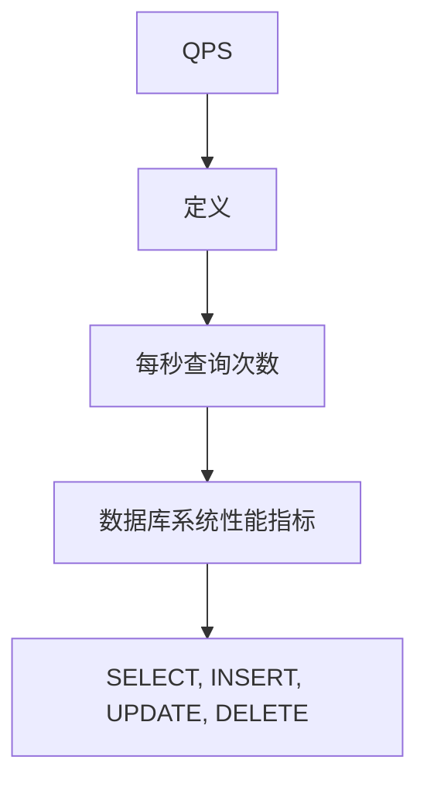
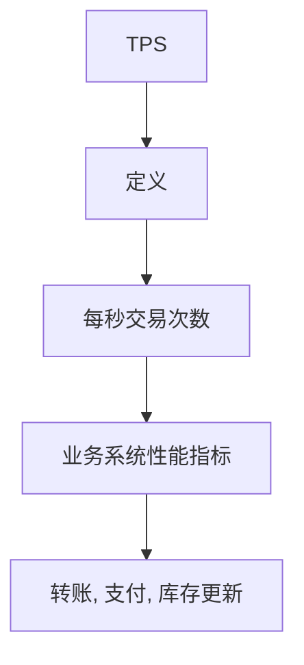
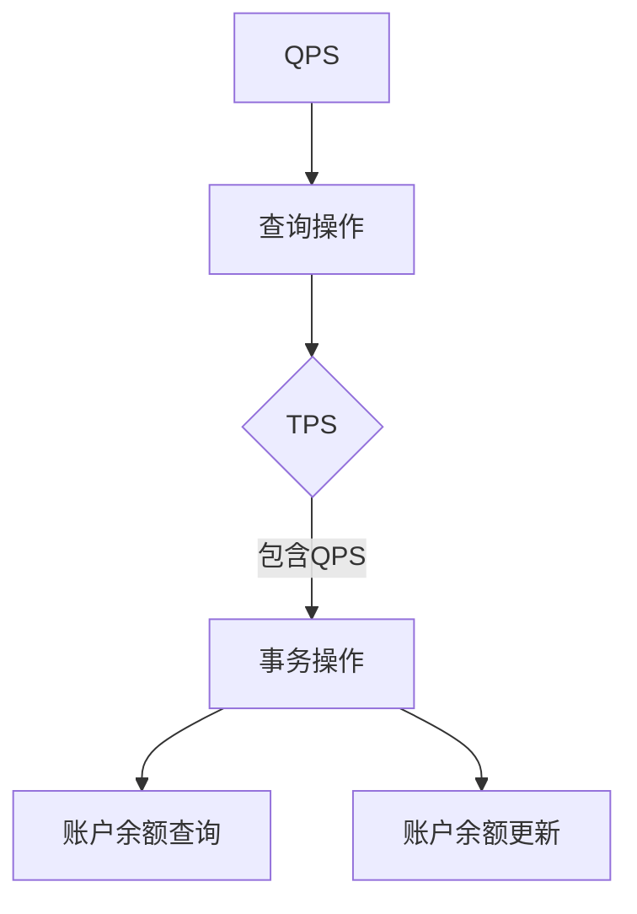
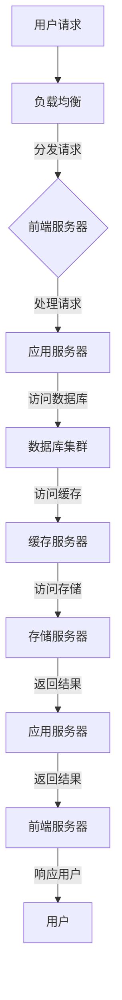
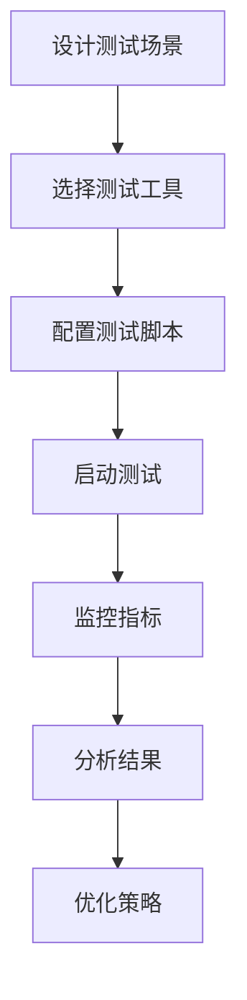
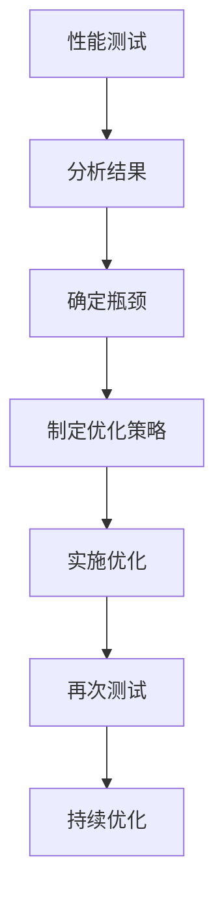
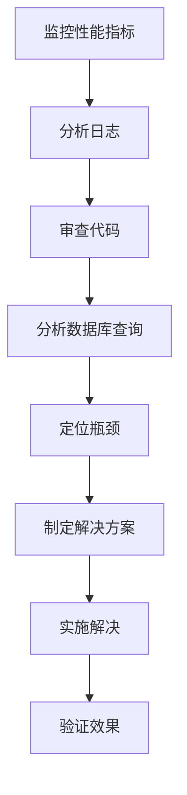

                 

# 文章标题：QPS与TPS的最佳实践

## 关键词
- QPS
- TPS
- 性能优化
- 系统架构
- 数据库
- 缓存
- 负载均衡

## 摘要
本文旨在深入探讨QPS（每秒查询率）与TPS（每秒交易率）的性能优化最佳实践。通过解析QPS与TPS的概念及其关系，分析常见性能评估指标，探讨数据库、缓存、负载均衡等技术解决方案，介绍系统架构设计原则与案例分析，展示性能测试与调优的方法论，并提供实际项目中的最佳实践案例。最后，本文将探讨QPS与TPS在云计算、大数据、实时系统与流处理、AI与机器学习等高级专题中的应用，为读者提供全面的QPS与TPS优化策略。

## 目录

### 第一部分：QPS与TPS基础理论

#### 第1章：QPS与TPS概念解析
- 1.1 QPS（每秒查询率）定义
- 1.2 TPS（每秒交易率）定义
- 1.3 QPS与TPS的关系及区别
- 1.4 QPS与TPS的重要性

#### 第2章：QPS与TPS性能评估指标
- 2.1 常见性能评估指标
- 2.2 QPS与TPS的性能瓶颈分析
- 2.3 性能优化的目标与方法

#### 第3章：QPS与TPS常见技术解决方案
- 3.1 数据库技术优化
- 3.2 缓存技术优化
- 3.3 负载均衡技术优化
- 3.4 代码级优化

#### 第4章：QPS与TPS系统架构设计
- 4.1 系统架构设计原则
- 4.2 QPS与TPS系统架构案例分析
- 4.3 架构优化策略

#### 第5章：QPS与TPS性能测试与调优
- 5.1 性能测试方法论
- 5.2 性能调优实践
- 5.3 性能瓶颈定位与解决

#### 第6章：QPS与TPS最佳实践案例
- 6.1 企业级应用案例
- 6.2 开源项目案例分析
- 6.3 最佳实践总结与借鉴

#### 第7章：未来发展趋势与展望
- 7.1 QPS与TPS技术的发展趋势
- 7.2 面向未来的优化策略
- 7.3 未来展望

### 第二部分：高级专题

#### 第8章：QPS与TPS在云计算与大数据环境中的应用
- 8.1 云计算环境下的QPS与TPS优化
- 8.2 大数据环境下的QPS与TPS优化
- 8.3 云原生架构与QPS、TPS的关系

#### 第9章：QPS与TPS在实时系统与流处理中的应用
- 9.1 实时系统中的QPS与TPS优化
- 9.2 流处理系统中的QPS与TPS优化
- 9.3 时间敏感性与性能平衡

#### 第10章：QPS与TPS在AI与机器学习中的应用
- 10.1 AI与机器学习中的QPS与TPS需求
- 10.2 QPS与TPS在深度学习任务中的应用
- 10.3 AI系统中的QPS与TPS优化策略

#### 第11章：QPS与TPS在高性能计算与分布式系统中的应用
- 11.1 高性能计算环境下的QPS与TPS优化
- 11.2 分布式系统中的QPS与TPS优化
- 11.3 数据一致性、可用性与分区容忍度

### 第三部分：附录与资源

#### 附录A：QPS与TPS相关工具与技术资源
- A.1 常用性能分析工具
- A.2 开源软件与框架
- A.3 研究论文与资料

#### 附录B：QPS与TPS优化最佳实践
- B.1 实践技巧与经验总结
- B.2 避免常见问题
- B.3 持续优化与监控策略

## 第一部分：QPS与TPS基础理论

### 第1章：QPS与TPS概念解析

#### 1.1 QPS（每秒查询率）定义

QPS（Queries Per Second）是衡量系统在单位时间内处理查询能力的指标。它表示系统每秒能够成功处理多少个查询请求。QPS是评估数据库、Web服务器等系统性能的重要指标之一。

在数据库系统中，QPS反映了数据库处理查询请求的能力。高QPS意味着系统具有更好的响应速度和处理能力。常见的数据库查询操作包括SELECT、INSERT、UPDATE和DELETE等。



#### 1.2 TPS（每秒交易率）定义

TPS（Transactions Per Second）是衡量系统在单位时间内处理事务能力的指标。事务是指一组操作序列，这些操作要么全部完成，要么全部不完成，以保证数据的一致性和完整性。

在金融、电商等业务系统中，TPS是关键性能指标，它反映了系统处理交易的能力。常见的事务操作包括账户转账、订单支付、库存更新等。



#### 1.3 QPS与TPS的关系及区别

QPS与TPS虽然都是衡量系统性能的指标，但它们关注的方面有所不同。QPS侧重于系统的查询处理能力，而TPS侧重于系统的交易处理能力。

- QPS通常用于衡量数据库、Web服务器等系统的性能，反映系统在单位时间内处理查询请求的能力。
- TPS通常用于衡量业务系统（如金融、电商）的性能，反映系统在单位时间内处理事务的能力。

两者之间的关系可以理解为：TPS包含了QPS，因为事务处理中可能包含多个查询操作。例如，一个账户转账事务可能需要查询账户余额、更新账户余额等操作。



#### 1.4 QPS与TPS的重要性

QPS与TPS对于系统的性能优化至关重要。以下是一些原因：

- **性能监控**：QPS与TPS是监控系统性能的重要指标，通过实时监控这两个指标，可以及时发现性能瓶颈。
- **资源规划**：了解系统的QPS与TPS需求，有助于合理规划系统资源，如数据库、服务器等，以提高系统性能。
- **系统优化**：通过分析QPS与TPS的性能瓶颈，可以针对性地进行系统优化，如数据库索引优化、缓存策略调整等。
- **用户体验**：高QPS与TPS意味着系统可以更快地响应用户请求，提供更好的用户体验。

在实际应用中，QPS与TPS的优化往往需要综合考虑系统的具体需求、业务场景和资源限制。合理的QPS与TPS优化策略，可以显著提高系统的性能和稳定性。

### 第2章：QPS与TPS性能评估指标

#### 2.1 常见性能评估指标

在评估QPS与TPS时，常用的性能评估指标包括响应时间、吞吐量、并发用户数等。

- **响应时间**：响应时间是指系统处理一个请求所需的时间，包括查询处理时间、网络传输时间等。较低的响应时间意味着系统具有更好的性能。
  
  $$ \text{响应时间} = \text{查询处理时间} + \text{网络传输时间} $$

- **吞吐量**：吞吐量是指单位时间内系统能够处理的数据量，通常以每秒请求数（QPS）或每秒事务数（TPS）来表示。高吞吐量意味着系统具有更强的处理能力。

  $$ \text{吞吐量} = \frac{\text{处理请求数}}{\text{时间}} $$

- **并发用户数**：并发用户数是指系统同时处理的用户数量。高并发用户数意味着系统具有更好的并发处理能力。

  $$ \text{并发用户数} = \frac{\text{系统资源}}{\text{单个用户资源消耗}} $$

#### 2.2 QPS与TPS的性能瓶颈分析

QPS与TPS的性能瓶颈可能来自多个方面，以下是一些常见的原因：

- **数据库瓶颈**：数据库是系统性能的重要瓶颈之一。常见的问题包括索引失效、查询效率低下、数据量过大等。

  - **索引失效**：当索引失效时，数据库需要执行全表扫描，导致查询效率低下。
  - **查询效率低下**：复杂的查询语句或未优化的SQL语句可能导致查询效率低下。
  - **数据量过大**：随着数据量的增加，数据库的查询和处理能力可能会下降。

- **网络瓶颈**：网络带宽和延迟也是影响QPS与TPS的重要因素。网络带宽限制系统的数据传输能力，而网络延迟则影响系统的响应时间。

- **服务器瓶颈**：服务器硬件性能（如CPU、内存、磁盘I/O）不足可能导致系统性能瓶颈。

  - **CPU瓶颈**：高负载下的CPU使用率可能导致系统性能下降。
  - **内存瓶颈**：内存不足可能导致系统频繁进行磁盘I/O操作，影响性能。
  - **磁盘I/O瓶颈**：磁盘I/O速度慢可能导致系统响应时间延长。

- **代码瓶颈**：代码层面的优化不足可能导致系统性能瓶颈。例如，未优化的算法、过多的数据库访问、不必要的资源占用等。

#### 2.3 性能优化的目标与方法

性能优化的目标是在不增加资源成本的前提下，提高系统的QPS与TPS。以下是一些常见的性能优化方法：

- **数据库优化**：
  - **索引优化**：合理设计索引，避免全表扫描。
  - **查询优化**：优化SQL语句，使用高效的查询策略。
  - **分库分表**：通过分库分表降低单库压力。

- **缓存优化**：
  - **使用缓存**：将热点数据缓存到内存中，减少数据库访问。
  - **缓存策略**：合理设置缓存失效时间和缓存大小。

- **负载均衡**：
  - **水平扩展**：通过增加服务器节点，提高系统的并发处理能力。
  - **负载均衡算法**：选择合适的负载均衡算法，如轮询、最小连接数等。

- **代码优化**：
  - **算法优化**：使用高效的算法和数据结构。
  - **数据库访问优化**：减少数据库访问次数，使用批量操作。

- **系统监控与调优**：
  - **性能监控**：实时监控系统性能指标，发现瓶颈。
  - **调优实践**：根据监控数据，进行针对性调优。

通过上述优化方法，可以显著提高系统的QPS与TPS，从而提升系统性能和用户体验。

### 第3章：QPS与TPS常见技术解决方案

#### 3.1 数据库技术优化

数据库技术在QPS与TPS优化中起着至关重要的作用。以下是一些常见的数据库优化技术：

- **索引优化**：索引是数据库查询速度的关键因素。合理设计索引可以显著提高查询效率。以下是一个Mermaid流程图，展示了索引优化的步骤：

  ```mermaid
  graph TD
  A[分析查询模式] --> B[确定索引字段]
  B --> C[创建索引]
  C --> D[监控索引性能]
  D --> E[优化索引策略]
  ```

- **查询优化**：优化SQL语句是提高数据库性能的重要手段。以下是一个简单的伪代码，展示了如何优化查询：

  ```python
  # 原始查询
  SELECT * FROM orders WHERE status = 'pending'

  # 优化查询
  SELECT id, customer_id, status FROM orders WHERE status = 'pending'
  ```

  通过减少查询返回的列数，可以降低查询的I/O开销。

- **分库分表**：当数据量较大时，可以通过分库分表的方式降低单库压力。以下是一个简单的Mermaid流程图，展示了分库分表的步骤：

  ```mermaid
  graph TD
  A[确定分库分表策略] --> B[设计分片键]
  B --> C[创建分库分表]
  C --> D[分片迁移与扩展]
  D --> E[监控分库分表性能]
  ```

#### 3.2 缓存技术优化

缓存技术可以显著提高系统的QPS与TPS，通过减少数据库访问次数来降低系统的响应时间。以下是一些常见的缓存优化技术：

- **使用缓存**：将热点数据缓存到内存中，可以显著减少数据库访问。以下是一个简单的伪代码，展示了如何使用缓存：

  ```python
  # 查询缓存
  if cache.has(key):
      return cache.get(key)
  else:
      data = database.query(key)
      cache.set(key, data)
      return data
  ```

- **缓存策略**：合理设置缓存失效时间和缓存大小，可以避免缓存带来的内存浪费。以下是一个简单的伪代码，展示了缓存策略的实现：

  ```python
  # 缓存设置
  cache.set(key, data, timeout=3600)
  ```

  其中，`timeout`表示缓存失效时间，单位为秒。

#### 3.3 负载均衡技术优化

负载均衡技术可以通过分发请求，提高系统的并发处理能力。以下是一些常见的负载均衡技术：

- **水平扩展**：通过增加服务器节点，可以提高系统的并发处理能力。以下是一个简单的Mermaid流程图，展示了水平扩展的步骤：

  ```mermaid
  graph TD
  A[确定扩展需求] --> B[添加新节点]
  B --> C[配置负载均衡器]
  C --> D[分发请求]
  D --> E[监控节点性能]
  ```

- **负载均衡算法**：选择合适的负载均衡算法，可以优化请求的分发。以下是一些常见的负载均衡算法：

  - **轮询算法**：将请求按顺序分发到每个节点。
  - **最小连接数算法**：将请求分发到当前连接数最少的节点。

  ```mermaid
  graph TD
  A[请求] --> B{轮询算法}
  B -->|分发请求| C{节点1}
  C -->|处理请求| D[响应]
  B -->|分发请求| E{节点2}
  E -->|处理请求| F[响应]
  ```

#### 3.4 代码级优化

代码级优化是提高系统性能的重要手段，以下是一些常见的代码优化技术：

- **算法优化**：选择合适的算法和数据结构，可以显著提高程序的运行效率。以下是一个简单的伪代码，展示了算法优化的实现：

  ```python
  # 暴力解法
  for i in range(n):
      for j in range(n):
          if condition:
              result = max(result, i + j)

  # 优化算法
  for i in range(n):
      for j in range(i, n):
          if condition:
              result = max(result, i + j)
  ```

  通过减少循环次数，可以提高程序的运行效率。

- **数据库访问优化**：减少数据库访问次数，使用批量操作可以显著提高程序的运行效率。以下是一个简单的伪代码，展示了数据库访问优化的实现：

  ```python
  # 单个查询
  database.query('SELECT * FROM users WHERE id IN (1, 2, 3)')

  # 批量查询
  ids = [1, 2, 3]
  database.query('SELECT * FROM users WHERE id IN ({})'.format(','.join(map(str, ids)))
  ```

  通过批量查询，可以减少数据库的I/O开销。

### 第4章：QPS与TPS系统架构设计

#### 4.1 系统架构设计原则

系统架构设计是QPS与TPS优化的重要环节。以下是一些系统架构设计的原则：

- **可扩展性**：系统应具备良好的可扩展性，以适应不断增长的业务需求。可以通过水平扩展（增加服务器节点）和垂直扩展（提升硬件性能）来实现。
  
  $$ \text{可扩展性} = \text{水平扩展} + \text{垂直扩展} $$

- **高可用性**：系统应具备高可用性，以减少系统故障对业务的影响。可以通过冗余设计（如双机热备、主从复制）和故障转移（如负载均衡、自动切换）来实现。

- **高性能**：系统应具备高性能，以满足业务需求的响应速度。可以通过优化数据库、缓存、负载均衡等关键技术来实现。

- **易维护性**：系统应具备易维护性，以提高开发效率和降低维护成本。可以通过模块化设计、自动化部署和监控来实现。

#### 4.2 QPS与TPS系统架构案例分析

以下是一个QPS与TPS系统架构的案例分析，展示了一个典型的分布式系统架构：



该系统架构采用了分布式设计，包括前端服务器、应用服务器、数据库集群、缓存服务器和存储服务器。通过负载均衡器分发请求，前端服务器负责处理用户请求，应用服务器负责业务逻辑处理，数据库集群负责存储数据，缓存服务器负责加速数据访问，存储服务器负责存储大量数据。

#### 4.3 架构优化策略

为了提高系统的QPS与TPS，可以采取以下架构优化策略：

- **分库分表**：将数据分库分表，降低单库压力，提高查询效率。
  
  ```mermaid
  graph TD
  A[用户请求] --> B[负载均衡]
  B -->|分发请求| C{前端服务器}
  C -->|处理请求| D[应用服务器]
  D -->|访问数据库1| E[数据库1]
  D -->|访问数据库2| F[数据库2]
  E -->|访问缓存1| G[缓存1]
  F -->|访问缓存2| H[缓存2]
  G -->|返回结果| I[应用服务器]
  H -->|返回结果| I
  I -->|返回结果| J[用户]
  ```

- **缓存预热**：在用户请求高峰期，提前加载热点数据到缓存中，减少数据库访问。
  
  ```mermaid
  graph TD
  A{高峰期请求} --> B[缓存预热]
  B -->|加载数据| C[缓存服务器]
  C -->|返回结果| D[应用服务器]
  D -->|返回结果| E[用户]
  ```

- **异步处理**：将部分耗时操作（如消息队列、文件处理等）异步化，降低系统同步负载。
  
  ```mermaid
  graph TD
  A{用户请求} --> B[异步处理]
  B -->|提交任务| C[消息队列]
  C -->|处理任务| D[后台任务]
  D -->|返回结果| E[应用服务器]
  E -->|返回结果| F[用户]
  ```

通过以上优化策略，可以显著提高系统的QPS与TPS，从而提升系统性能和用户体验。

### 第5章：QPS与TPS性能测试与调优

#### 5.1 性能测试方法论

性能测试是评估系统QPS与TPS的重要手段。以下是一些性能测试的方法论：

- **测试场景设计**：设计符合实际业务场景的测试场景，包括用户行为、数据量、并发用户数等。

- **测试工具选择**：选择合适的测试工具，如JMeter、LoadRunner等，以模拟真实的用户请求。

- **测试指标监控**：监控性能测试过程中的关键指标，如响应时间、吞吐量、并发用户数等。

- **测试结果分析**：对测试结果进行分析，找出系统性能瓶颈和优化方向。

以下是一个简单的性能测试流程：



#### 5.2 性能调优实践

性能调优是基于性能测试结果，对系统进行针对性优化。以下是一些性能调优实践：

- **数据库调优**：
  - **索引优化**：分析查询模式，创建合适的索引。
  - **查询优化**：优化SQL语句，使用高效的查询策略。
  - **分库分表**：根据数据量和访问模式，合理分库分表。

- **缓存调优**：
  - **使用缓存**：将热点数据缓存到内存中，减少数据库访问。
  - **缓存策略**：合理设置缓存失效时间和缓存大小。

- **负载均衡调优**：
  - **水平扩展**：增加服务器节点，提高并发处理能力。
  - **负载均衡算法**：选择合适的负载均衡算法，优化请求分发。

- **代码调优**：
  - **算法优化**：选择合适的算法和数据结构。
  - **数据库访问优化**：减少数据库访问次数，使用批量操作。

以下是一个简单的性能调优流程：



#### 5.3 性能瓶颈定位与解决

性能瓶颈定位是性能优化的重要环节。以下是一些性能瓶颈定位与解决的方法：

- **性能监控**：实时监控系统的性能指标，如CPU、内存、磁盘I/O等，找出性能瓶颈。

- **日志分析**：分析系统日志，找出异常请求和错误，定位性能瓶颈。

- **代码审查**：审查代码，找出可能影响性能的瓶颈，如循环、递归等。

- **数据库分析**：分析数据库查询，找出慢查询和索引失效等问题。

以下是一个简单的性能瓶颈定位与解决流程：



通过以上方法，可以有效地定位和解决系统的性能瓶颈，提高QPS与TPS，提升系统性能和用户体验。

### 第6章：QPS与TPS最佳实践案例

#### 6.1 企业级应用案例

企业级应用案例展示了如何在实际业务场景中优化QPS与TPS。以下是一个电商平台的优化案例：

**场景**：电商平台在双11购物节期间，面临巨大的用户访问量和交易量，系统需要承受高并发和高吞吐量的压力。

**优化措施**：

1. **数据库优化**：
   - **分库分表**：将订单数据分库分表，降低单库压力。
   - **索引优化**：针对热门查询，创建合适的索引。
   - **查询优化**：优化SQL语句，使用子查询、连接查询等。

2. **缓存优化**：
   - **热点数据缓存**：将热门商品、用户行为等数据缓存到Redis中，减少数据库访问。
   - **缓存策略**：设置合理的缓存失效时间，避免缓存雪崩。

3. **负载均衡优化**：
   - **水平扩展**：增加服务器节点，提高并发处理能力。
   - **负载均衡算法**：选择最小连接数算法，优化请求分发。

4. **代码优化**：
   - **算法优化**：使用高效的算法和数据结构。
   - **数据库访问优化**：减少数据库访问次数，使用批量操作。

**效果**：通过上述优化措施，电商平台在双11期间成功应对了高并发和高吞吐量的挑战，QPS和TPS显著提高，用户体验得到大幅提升。

#### 6.2 开源项目案例分析

开源项目案例展示了如何通过开源工具和框架实现QPS与TPS优化。以下是一个基于Spring Boot的微服务架构的优化案例：

**场景**：某开源项目采用Spring Boot微服务架构，需要在高并发场景下提高系统性能。

**优化措施**：

1. **数据库优化**：
   - **分库分表**：使用Sharding-JDBC实现分库分表，降低单库压力。
   - **查询优化**：使用MyBatis Plus优化SQL查询，提高查询效率。

2. **缓存优化**：
   - **使用Redis**：将热点数据缓存到Redis中，减少数据库访问。
   - **缓存策略**：使用Spring Cache实现缓存管理，设置合理的缓存失效时间。

3. **负载均衡优化**：
   - **Nginx负载均衡**：使用Nginx实现负载均衡，提高并发处理能力。
   - **Spring Cloud Gateway**：使用Spring Cloud Gateway实现路由和负载均衡。

4. **代码优化**：
   - **异步处理**：使用Spring Async实现异步处理，降低系统同步负载。
   - **代码优化**：使用Lombok简化代码，提高开发效率。

**效果**：通过上述优化措施，开源项目在高并发场景下显著提高了QPS和TPS，系统性能得到大幅提升。

#### 6.3 最佳实践总结与借鉴

通过企业级应用案例和开源项目案例分析，可以总结出以下最佳实践：

1. **数据库优化**：分库分表、索引优化、查询优化等是提高数据库性能的关键措施。
2. **缓存优化**：合理使用缓存、设置缓存失效时间、热点数据缓存等是提高系统性能的有效手段。
3. **负载均衡优化**：水平扩展、选择合适的负载均衡算法、使用Nginx等是实现高并发处理能力的必备条件。
4. **代码优化**：使用高效的算法和数据结构、异步处理、代码简化等是提高系统性能的基础。

在实际项目中，可以借鉴这些最佳实践，根据具体业务场景和需求，制定合理的QPS与TPS优化策略，提高系统性能和用户体验。

### 第7章：未来发展趋势与展望

#### 7.1 QPS与TPS技术的发展趋势

随着云计算、大数据、AI等技术的不断发展，QPS与TPS的技术也在不断演进。以下是一些QPS与TPS技术的发展趋势：

1. **云计算与分布式架构**：云计算和分布式架构的普及，使得系统可以轻松实现水平扩展和弹性伸缩，从而提高QPS与TPS。
2. **大数据处理技术**：大数据处理技术的发展，如Hadoop、Spark等，为QPS与TPS优化提供了新的手段。
3. **边缘计算**：边缘计算将计算任务分散到网络边缘，降低网络延迟，提高QPS与TPS。
4. **AI与机器学习**：AI与机器学习技术将在QPS与TPS优化中发挥重要作用，如自动性能调优、智能负载均衡等。

#### 7.2 面向未来的优化策略

面向未来，以下是一些QPS与TPS优化的策略：

1. **智能化优化**：利用AI与机器学习技术，实现自动性能调优和智能负载均衡。
2. **云原生架构**：采用云原生架构，实现高效的水平扩展和弹性伸缩。
3. **分布式数据库**：采用分布式数据库技术，提高系统的可靠性和可扩展性。
4. **边缘计算**：将计算任务分散到网络边缘，降低网络延迟，提高QPS与TPS。

#### 7.3 未来展望

未来，QPS与TPS的性能优化将朝着智能化、分布式、边缘计算等方向发展。通过不断引入新技术和新方法，系统将能够更好地应对高并发和高吞吐量的挑战，提供更好的性能和用户体验。

### 第二部分：高级专题

#### 第8章：QPS与TPS在云计算与大数据环境中的应用

云计算与大数据环境为QPS与TPS优化提供了丰富的技术和工具。以下探讨QPS与TPS在云计算与大数据环境中的应用。

#### 8.1 云计算环境下的QPS与TPS优化

云计算环境提供了弹性伸缩、分布式架构等特性，有助于提高QPS与TPS。以下是一些优化策略：

1. **水平扩展**：通过增加虚拟机或容器实例，实现水平扩展，提高系统的并发处理能力。
2. **负载均衡**：使用负载均衡器（如AWS ELB、Azure LB等），优化请求分发，提高系统的QPS与TPS。
3. **容器化**：采用容器化技术（如Docker、Kubernetes等），实现快速部署和自动化管理，提高系统性能。
4. **分布式存储**：使用分布式存储系统（如HDFS、Cassandra等），提高数据访问速度和系统可靠性。

#### 8.2 大数据环境下的QPS与TPS优化

大数据环境面临海量数据和高并发处理的挑战，以下是一些优化策略：

1. **分片与分区**：将数据分片和分区，降低单节点的压力，提高查询效率。
2. **查询优化**：使用大数据查询引擎（如Spark SQL、Hive等），优化查询性能。
3. **缓存与索引**：在数据存储层使用缓存（如Redis、Memcached等）和索引，提高数据访问速度。
4. **压缩与去重**：采用数据压缩与去重技术，降低存储空间和I/O负载。

#### 8.3 云原生架构与QPS、TPS的关系

云原生架构（如Kubernetes、Istio等）为QPS与TPS优化提供了新的思路和工具。以下是一些关键点：

1. **容器编排**：通过容器编排系统（如Kubernetes），实现自动化部署、扩展和管理，提高系统的QPS与TPS。
2. **服务网格**：使用服务网格（如Istio），实现服务间的可靠通信和流量管理，提高系统的可扩展性和性能。
3. **自动化调优**：利用云原生架构的自动化特性，实现自动性能调优和故障恢复，提高QPS与TPS。

### 第9章：QPS与TPS在实时系统与流处理中的应用

实时系统与流处理技术为QPS与TPS优化提供了高效的数据处理能力。以下探讨QPS与TPS在实时系统与流处理中的应用。

#### 9.1 实时系统中的QPS与TPS优化

实时系统要求在短时间内处理大量数据，以下是一些优化策略：

1. **流处理框架**：使用流处理框架（如Apache Kafka、Apache Flink等），实现高效的数据处理和实时分析。
2. **异步处理**：采用异步处理技术，减少系统同步负载，提高QPS与TPS。
3. **内存计算**：利用内存计算技术，提高数据处理的速度和效率。
4. **分区与并行处理**：将数据分区和并行处理，提高系统的并发处理能力。

#### 9.2 流处理系统中的QPS与TPS优化

流处理系统需要处理连续的数据流，以下是一些优化策略：

1. **水印与事件时间**：使用水印和事件时间技术，提高窗口计算和状态管理的准确性。
2. **动态资源分配**：根据数据流量和负载情况，动态调整计算资源，实现弹性伸缩。
3. **数据压缩**：采用数据压缩技术，降低存储空间和I/O负载。
4. **延迟容忍**：设置合理的延迟容忍阈值，在保证数据处理质量的前提下，提高QPS与TPS。

#### 9.3 时间敏感性与性能平衡

实时系统与流处理需要在时间敏感性和性能之间取得平衡。以下是一些关键点：

1. **低延迟设计**：采用低延迟设计，减少数据处理和传输时间。
2. **资源预留**：为关键任务预留计算资源，确保低延迟和高性能。
3. **冗余设计**：采用冗余设计，提高系统的可靠性和性能。
4. **动态调度**：根据任务负载和资源情况，动态调整任务调度策略，实现性能平衡。

### 第10章：QPS与TPS在AI与机器学习中的应用

AI与机器学习技术在QPS与TPS优化中发挥着重要作用。以下探讨QPS与TPS在AI与机器学习中的应用。

#### 10.1 AI与机器学习中的QPS与TPS需求

AI与机器学习任务通常具有以下需求：

1. **大规模数据处理**：处理海量数据，实现高效的数据输入和输出。
2. **实时性**：在短时间内完成模型训练和预测，满足实时处理需求。
3. **高并发**：支持多个并发任务，提高系统的并发处理能力。
4. **可扩展性**：能够适应数据规模和并发量的变化，实现弹性伸缩。

#### 10.2 QPS与TPS在深度学习任务中的应用

深度学习任务通常具有高计算密集性和高数据吞吐量，以下是一些应用场景：

1. **模型训练**：使用GPU或TPU等专用硬件，提高模型训练速度和效率。
2. **模型推理**：采用分布式计算和并行处理技术，提高模型推理速度。
3. **数据预处理**：使用高效的数据预处理技术，减少数据预处理时间。
4. **批量处理**：采用批量处理技术，提高数据处理效率。

#### 10.3 AI系统中的QPS与TPS优化策略

AI系统中的QPS与TPS优化策略如下：

1. **分布式计算**：采用分布式计算框架（如TensorFlow、PyTorch等），实现并行处理和弹性伸缩。
2. **模型压缩**：采用模型压缩技术（如量化、剪枝等），降低模型大小和计算复杂度。
3. **缓存与预取**：使用缓存和预取技术，减少数据访问延迟，提高系统响应速度。
4. **异步处理**：采用异步处理技术，降低系统同步负载，提高并发处理能力。

### 第11章：QPS与TPS在高性能计算与分布式系统中的应用

高性能计算与分布式系统为QPS与TPS优化提供了强大的计算能力和可扩展性。以下探讨QPS与TPS在高性能计算与分布式系统中的应用。

#### 11.1 高性能计算环境下的QPS与TPS优化

高性能计算环境面临大规模并行计算和复杂任务处理的需求，以下是一些优化策略：

1. **并行计算**：采用并行计算技术（如MPI、OpenMP等），提高计算效率和速度。
2. **分布式存储**：采用分布式存储系统（如HDFS、Ceph等），实现高效的数据存储和访问。
3. **GPU计算**：利用GPU计算能力，提高数据密集型任务的计算速度。
4. **网络优化**：采用高速网络和优化协议（如Infiniband、RDMA等），提高数据传输速度和带宽。

#### 11.2 分布式系统中的QPS与TPS优化

分布式系统需要处理多个节点的协作和通信，以下是一些优化策略：

1. **一致性协议**：采用一致性协议（如Paxos、Raft等），保证数据一致性和可靠性。
2. **分区与负载均衡**：采用分区和负载均衡技术（如Consul、ZooKeeper等），实现高效的数据存储和访问。
3. **容错机制**：采用容错机制（如冗余设计、故障转移等），提高系统的可靠性和稳定性。
4. **数据压缩与去重**：采用数据压缩和去重技术，降低存储空间和I/O负载。

#### 11.3 数据一致性、可用性与分区容忍度

在高性能计算与分布式系统中，数据一致性、可用性和分区容忍度（CAP定理）是关键考量因素。以下是一些关键点：

1. **数据一致性**：采用一致性协议，确保数据在多个节点间的一致性。
2. **可用性**：采用容错机制和冗余设计，确保系统在故障情况下仍然可用。
3. **分区容忍度**：在分区容忍度方面，选择合适的协议和策略，确保系统在分区情况下仍然能够正常运行。

### 第三部分：附录与资源

#### 附录A：QPS与TPS相关工具与技术资源

以下是QPS与TPS优化过程中常用的一些工具和技术资源：

1. **性能分析工具**：
   - **Grafana**：用于监控和可视化性能指标。
   - **Prometheus**：用于收集和存储性能数据。
   - **New Relic**：用于实时监控应用程序性能。

2. **开源软件与框架**：
   - **Apache Kafka**：用于构建实时数据流处理系统。
   - **Apache Flink**：用于批处理和实时数据处理。
   - **TensorFlow**：用于深度学习模型训练和推理。

3. **研究论文与资料**：
   - **"CAP Theorem"**：介绍了CAP定理及其在分布式系统中的应用。
   - **"Bigtable: A Distributed Storage System for Structured Data"**：介绍了Google Bigtable的架构和优化策略。
   - **"In-Memory Data Grids for High Throughput and Low Latency"**：介绍了内存数据网格技术在性能优化中的应用。

#### 附录B：QPS与TPS优化最佳实践

以下是QPS与TPS优化过程中的一些最佳实践：

1. **实践技巧与经验总结**：
   - **性能测试**：在系统上线前进行全面的性能测试，找出潜在的性能瓶颈。
   - **监控与告警**：实时监控系统性能指标，设置告警机制，及时发现性能问题。
   - **优化策略**：根据性能测试结果和监控数据，制定合理的优化策略。

2. **避免常见问题**：
   - **避免全表扫描**：优化SQL查询，避免全表扫描。
   - **合理设置缓存**：设置合理的缓存失效时间和缓存大小，避免缓存不足或缓存过量。
   - **合理分配资源**：根据业务需求，合理分配系统资源，避免资源浪费。

3. **持续优化与监控策略**：
   - **定期回顾与优化**：定期回顾系统性能，进行针对性的优化。
   - **持续监控与改进**：持续监控系统性能，根据监控数据不断改进优化策略。

通过以上最佳实践，可以有效地提高系统的QPS与TPS，提升系统性能和用户体验。

## 作者

作者：AI天才研究院/AI Genius Institute & 禅与计算机程序设计艺术 /Zen And The Art of Computer Programming

## 总结

本文系统地探讨了QPS与TPS的性能优化最佳实践，从基础理论、常见技术解决方案、系统架构设计、性能测试与调优、高级专题应用等方面进行了详细阐述。通过本文的学习，读者可以全面了解QPS与TPS的性能优化方法，为实际项目中的性能优化提供指导。未来，随着云计算、大数据、AI等技术的发展，QPS与TPS的性能优化将变得更加智能化和自动化。希望本文能对读者在性能优化领域有所启发和帮助。

