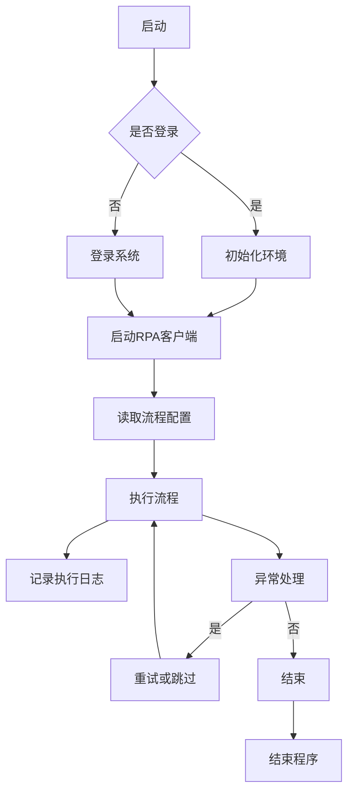

                 

# 《RPA工作流设计：实现基于桌面的业务流程自动化》

## 关键词

- RPA
- 工作流设计
- 业务流程自动化
- 桌面自动化
- UiPath
- 脚本开发
- 模糊逻辑
- AI集成
- 最佳实践

## 摘要

本文旨在深入探讨RPA（机器人流程自动化）工作流设计的理论与实践。通过详细解析RPA的基本概念、工作原理、技术架构，以及工作流设计的基础和方法，本文为读者提供了一个系统的RPA工作流设计指南。文章还通过实际项目案例，展示了如何使用RPA工具如UiPath进行桌面自动化，并讲解了脚本开发、测试与优化的具体步骤。此外，本文还探讨了RPA与AI的结合、最佳实践以及未来应用前景，为读者提供了全面的技术参考和行业洞察。

## 目录

### 《RPA工作流设计：实现基于桌面的业务流程自动化》目录大纲

## 第一部分：RPA基础与概念

### 第1章：RPA概述

#### 1.1 RPA的基本概念
#### 1.2 RPA的发展历程
#### 1.3 RPA的应用领域
#### 1.4 RPA的优势与挑战

### 第2章：RPA的工作原理与技术架构

#### 2.1 RPA的工作原理
#### 2.2 RPA的技术架构
#### 2.3 RPA的常见组件
#### 2.4 RPA的核心功能

### 第3章：RPA工作流设计基础

#### 3.1 工作流的概念与分类
#### 3.2 工作流设计的原则
#### 3.3 工作流设计的工具与方法
#### 3.4 工作流设计的关键点

## 第二部分：RPA工作流设计实践

### 第4章：RPA工作流设计流程

#### 4.1 需求分析
#### 4.2 设计流程图
#### 4.3 流程自动化脚本开发
#### 4.4 流程测试与优化

### 第5章：RPA工作流设计案例解析

#### 5.1 案例一：财务报表自动化
#### 5.2 案例二：人力资源流程自动化
#### 5.3 案例三：供应链管理自动化
#### 5.4 案例四：客户服务流程自动化

### 第6章：RPA工作流设计中的常见问题与解决方案

#### 6.1 数据集成与处理
#### 6.2 异常处理与监控
#### 6.3 安全性与权限管理
#### 6.4 性能优化与调优

### 第7章：RPA工作流设计与实施指南

#### 7.1 设计前的准备工作
#### 7.2 流程自动化策略制定
#### 7.3 实施流程与项目管理
#### 7.4 持续改进与优化

## 第三部分：RPA工作流设计高级技术

### 第8章：RPA与人工智能的结合

#### 8.1 RPA与AI的关系
#### 8.2 RPA与自然语言处理
#### 8.3 RPA与机器学习
#### 8.4 RPA与深度学习

### 第9章：RPA工作流设计的最佳实践

#### 9.1 设计流程优化
#### 9.2 脚本优化
#### 9.3 测试与验证
#### 9.4 持续集成与持续部署

### 第10章：RPA工作流设计中的创新与应用前景

#### 10.1 RPA的创新趋势
#### 10.2 RPA在未来的应用前景
#### 10.3 RPA与其他技术的融合
#### 10.4 RPA行业的未来挑战与机遇

## 附录

### 附录A：RPA相关工具与资源

#### A.1 主流RPA工具介绍
#### A.2 开源RPA工具推荐
#### A.3 RPA社区与论坛
#### A.4 RPA相关书籍与资料推荐

### 让我们一步步深入探索RPA工作流设计的精髓，实现业务流程的自动化。

## 第1章：RPA概述

### 1.1 RPA的基本概念

RPA（Robotic Process Automation，机器人流程自动化）是一种通过软件机器人模拟人类操作员的行为，在计算机系统中执行重复性任务和业务流程的技术。RPA技术利用人工智能和机器学习算法，通过自动化软件界面来执行数据输入、数据处理、数据验证和业务逻辑处理等任务。

### 1.2 RPA的发展历程

RPA技术起源于20世纪80年代的自动化测试领域。随着计算机技术的发展和互联网的普及，RPA在21世纪初逐渐崭露头角，特别是在金融、保险、电信等行业得到了广泛应用。近年来，随着人工智能技术的进步，RPA技术得到了进一步的发展和完善，逐渐成为企业数字化转型的重要工具。

### 1.3 RPA的应用领域

RPA技术可以应用于多个领域，包括但不限于：

- **金融**：自动化处理银行交易、账户管理、报告生成等。
- **保险**：自动化理赔处理、保单管理、风险评估等。
- **电信**：自动化计费、客户服务、网络管理等。
- **人力资源**：自动化招聘流程、员工资料管理、薪酬计算等。
- **供应链**：自动化采购订单处理、库存管理、物流跟踪等。

### 1.4 RPA的优势与挑战

#### RPA的优势：

- **提高效率**：自动化重复性任务，减少人工操作，提高工作效率。
- **降低成本**：减少人力资源投入，降低运营成本。
- **提高准确度**：通过预定义规则和流程，减少人为错误。
- **灵活性**：易于定制和调整，快速响应业务变化。

#### RPA的挑战：

- **技术挑战**：需要专业的技术人才进行开发和管理。
- **管理挑战**：如何合理分配机器人与人力资源，进行有效的管理。
- **安全与合规性**：确保数据安全和遵守相关法律法规。

## 第2章：RPA的工作原理与技术架构

### 2.1 RPA的工作原理

RPA的工作原理主要包括以下几个步骤：

1. **启动与登录**：RPA机器人启动后，首先需要进行身份验证和登录，确保只有授权的用户可以访问系统。
2. **环境初始化**：机器人启动后，会加载所需的环境配置，包括软件、数据库连接等。
3. **流程读取**：机器人从流程库中读取要执行的任务流程。
4. **任务执行**：机器人根据流程配置，模拟人类操作员的行为，执行具体的操作。
5. **异常处理**：在执行过程中，机器人会监控异常情况，并采取相应的措施，如重试、通知管理员等。
6. **日志记录**：机器人执行完任务后，会将执行结果和日志记录下来，供后续分析。

### 2.2 RPA的技术架构

RPA的技术架构主要包括以下几个组成部分：

- **机器人**：这是RPA系统的核心，负责执行具体的任务流程。
- **流程库**：存储和管理所有的流程定义和配置。
- **控制台**：用于监控和管理机器人的操作，包括启动、停止、异常处理等。
- **数据集成**：用于与其他系统和数据库进行数据交换和集成。
- **日志与分析**：记录机器人的执行日志，并提供分析功能，用于优化流程和提升效率。

### 2.3 RPA的常见组件

常见的RPA组件包括：

- **UI自动化组件**：用于自动化操作计算机系统的用户界面，如点击、输入、拖拽等。
- **数据库操作组件**：用于自动化数据库查询、更新和数据导入导出。
- **Web服务组件**：用于与外部系统进行API调用和数据交换。
- **文件操作组件**：用于自动化文件的处理，如创建、复制、移动、压缩等。
- **监控与告警组件**：用于监控机器人的运行状态，并在出现异常时发送告警。

### 2.4 RPA的核心功能

RPA的核心功能包括：

- **流程自动化**：根据预定义的规则和流程，自动化执行业务任务。
- **异常处理**：在执行过程中，自动识别和处理异常情况。
- **日志记录**：记录机器人的执行日志，供后续分析和审计。
- **权限管理**：控制对流程和数据的访问权限，确保数据安全。
- **监控与告警**：实时监控机器人的运行状态，并在出现异常时发送告警。

## 第3章：RPA工作流设计基础

### 3.1 工作流的概念与分类

#### 工作流的概念

工作流（Workflow）是指完成一项任务或达成一个目标所需的一系列步骤和活动。在工作流中，任务和活动按照一定的逻辑顺序和规则进行执行，最终实现预期的目标。

#### 工作流的分类

工作流可以根据不同的分类标准进行分类，常见的分类方法包括：

- **按执行方式分类**：顺序工作流、并行工作流、分支工作流、循环工作流等。
- **按业务领域分类**：财务工作流、人力资源管理工作流、供应链管理工作流等。
- **按自动化程度分类**：部分自动化工作流、完全自动化工作流等。

### 3.2 工作流设计的原则

进行工作流设计时，需要遵循以下原则：

- **简洁性**：工作流设计应尽量简洁，避免复杂和冗长的流程。
- **可维护性**：工作流设计应易于维护和调整，以适应业务变化。
- **灵活性**：工作流设计应具有灵活性，能够适应不同的业务场景和需求。
- **标准化**：工作流设计应遵循标准化的流程和规范，确保一致性。
- **可扩展性**：工作流设计应具备可扩展性，能够支持未来的业务扩展。

### 3.3 工作流设计的工具与方法

工作流设计可以使用多种工具和方法，常见的工具和方法包括：

- **流程图设计工具**：如Visio、Balsamiq等，用于绘制和可视化工作流。
- **RPA平台**：如UiPath、Blue Prism等，提供内置的工作流设计和管理功能。
- **脚本开发工具**：如Python、Java等，用于编写和执行工作流脚本。
- **数据建模工具**：如ERwin、Oracle SQL Developer等，用于设计和管理数据库结构。

#### 方法

- **需求分析**：明确业务需求和目标，确定工作流的具体内容和流程。
- **流程设计**：根据需求分析结果，设计工作流的流程图和脚本。
- **验证与测试**：验证工作流是否符合业务需求和预期，进行测试和优化。

### 3.4 工作流设计的关键点

进行工作流设计时，需要关注以下几个关键点：

- **任务分解**：将复杂任务分解为多个简单任务，确保每个任务都易于管理和执行。
- **逻辑关系**：确保工作流的逻辑关系清晰，任务之间的执行顺序和条件正确。
- **数据管理**：确保工作流中的数据传输和处理正确，数据的一致性和安全性。
- **异常处理**：设计异常处理机制，确保在出现异常时能够及时响应和处理。
- **监控与告警**：设计监控与告警机制，实时监控工作流的执行状态，并在出现问题时及时通知相关人员。

### 让我们一步步深入探索RPA工作流设计的精髓，实现业务流程的自动化。

## 第4章：RPA工作流设计流程

### 4.1 需求分析

需求分析是RPA工作流设计的首要步骤，它涉及到理解业务需求、确定自动化目标和范围。以下是进行需求分析的具体步骤：

1. **业务调研**：与业务部门进行沟通，了解现有业务流程的运作方式和存在的问题。
2. **数据收集**：收集相关业务数据，如流程文档、操作手册、系统日志等。
3. **需求文档**：编写详细的需求文档，明确自动化目标、功能需求、性能需求等。
4. **需求评审**：组织业务部门、技术团队进行需求评审，确保需求的准确性和可行性。

### 4.2 设计流程图

设计流程图是RPA工作流设计的重要环节，它有助于理清工作流程和任务之间的关系。以下是设计流程图的具体步骤：

1. **绘制草图**：在纸上或使用草图工具绘制工作流程的初步草图。
2. **细化流程图**：使用专业的流程图设计工具（如Visio、Balsamiq等）绘制详细的流程图。
3. **验证流程图**：与业务部门和技术团队一起验证流程图，确保其正确性和完整性。
4. **优化流程图**：根据反馈对流程图进行调整和优化，使其更符合实际业务需求。

### 4.3 流程自动化脚本开发

流程自动化脚本开发是将流程图转化为可执行代码的过程。以下是进行脚本开发的具体步骤：

1. **选择脚本语言**：根据工作流的需求选择合适的脚本语言（如Python、Java等）。
2. **编写脚本**：根据流程图和需求文档编写脚本，实现具体的任务和逻辑。
3. **调试脚本**：在开发环境中运行脚本，调试并修复错误，确保脚本能够正确执行。
4. **代码审查**：组织团队成员进行代码审查，确保代码的质量和可维护性。

### 4.4 流程测试与优化

流程测试与优化是确保RPA工作流能够稳定、高效运行的关键步骤。以下是进行流程测试与优化的具体步骤：

1. **单元测试**：对单个任务或模块进行测试，确保其独立运行正确。
2. **集成测试**：将各个模块集成在一起进行测试，确保整体流程的正确性和性能。
3. **性能测试**：模拟实际运行环境，测试流程的性能和响应时间，确保其满足业务需求。
4. **优化调整**：根据测试结果对流程进行优化调整，提高其稳定性和效率。
5. **用户验收测试**：与业务部门一起进行用户验收测试，确保流程符合业务需求和预期。

### 让我们一步步深入探索RPA工作流设计的精髓，实现业务流程的自动化。

## 第5章：RPA工作流设计案例解析

### 5.1 案例一：财务报表自动化

#### 案例背景

某公司财务部门需要定期生成各种财务报表，包括利润表、资产负债表、现金流量表等。由于报表数据量大且复杂，手工处理效率低下且容易出现错误。为了提高报表生成的效率和准确性，公司决定使用RPA技术实现财务报表自动化。

#### 需求分析

- **功能需求**：实现财务报表的自动提取、计算和生成。
- **性能需求**：确保报表生成速度满足业务需求，处理能力不低于现有手工操作。
- **稳定性需求**：保证报表生成过程的稳定性，减少错误率。

#### 流程设计

1. **数据提取**：从财务系统中提取相关的财务数据，包括收入、支出、资产、负债等。
2. **数据计算**：根据预设的公式和规则，对提取的数据进行计算，生成中间结果。
3. **数据汇总**：将中间结果进行汇总，生成最终的财务报表。
4. **报表生成**：将汇总结果输出为电子表格格式，如Excel或CSV。

#### 脚本开发

1. **数据提取脚本**：使用Python的Selenium库，通过Web自动化工具模拟人工操作，登录财务系统并提取数据。
2. **数据计算脚本**：使用Python的NumPy和Pandas库，对提取的数据进行计算和汇总。
3. **报表生成脚本**：使用Python的XlsxWriter库，将计算结果输出为Excel文件。

#### 测试与优化

1. **单元测试**：对每个脚本模块进行独立测试，确保其功能正确。
2. **集成测试**：将所有脚本集成在一起进行测试，确保整体流程的正确性和性能。
3. **性能测试**：模拟实际运行环境，测试报表生成速度和处理能力。
4. **优化调整**：根据测试结果对脚本进行调整和优化，提高其稳定性和效率。

#### 案例总结

通过RPA技术，财务报表自动化显著提高了报表生成的效率和准确性，减少了手工操作的错误率。公司财务部门可以更加专注于数据分析和管理，提高了整体业务效率。

### 5.2 案例二：人力资源流程自动化

#### 案例背景

某公司人力资源部门需要处理大量的招聘、员工信息管理、薪酬计算等任务。由于流程复杂且涉及多个系统和数据源，手工处理效率低下且容易出现错误。为了提高人力资源管理的效率，公司决定使用RPA技术实现人力资源流程自动化。

#### 需求分析

- **功能需求**：实现招聘流程自动化、员工信息管理自动化、薪酬计算自动化。
- **性能需求**：确保流程的处理速度满足业务需求，处理能力不低于现有手工操作。
- **稳定性需求**：保证流程的稳定性，减少错误率。

#### 流程设计

1. **招聘流程**：自动化发布职位、筛选简历、面试安排和录用通知等。
2. **员工信息管理**：自动化员工入职、离职、调岗、薪资调整等操作。
3. **薪酬计算**：自动化工资计算、奖金发放、税收计算等。

#### 脚本开发

1. **招聘流程脚本**：使用Python的Selenium库，通过Web自动化工具模拟人工操作，实现招聘流程自动化。
2. **员工信息管理脚本**：使用Python的SQL库，通过数据库操作实现员工信息管理。
3. **薪酬计算脚本**：使用Python的NumPy和Pandas库，实现薪酬计算和发放。

#### 测试与优化

1. **单元测试**：对每个脚本模块进行独立测试，确保其功能正确。
2. **集成测试**：将所有脚本集成在一起进行测试，确保整体流程的正确性和性能。
3. **性能测试**：模拟实际运行环境，测试流程的处理速度和处理能力。
4. **优化调整**：根据测试结果对脚本进行调整和优化，提高其稳定性和效率。

#### 案例总结

通过RPA技术，人力资源流程自动化显著提高了工作效率，减少了手工操作的错误率。公司人力资源部门可以更加专注于招聘、员工管理和薪酬核算等核心工作，提高了整体业务效率。

### 5.3 案例三：供应链管理自动化

#### 案例背景

某公司供应链部门需要处理大量的采购订单、库存管理、物流跟踪等任务。由于流程复杂且涉及多个系统和数据源，手工处理效率低下且容易出现错误。为了提高供应链管理的效率，公司决定使用RPA技术实现供应链管理自动化。

#### 需求分析

- **功能需求**：实现采购订单自动化、库存管理自动化、物流跟踪自动化。
- **性能需求**：确保流程的处理速度满足业务需求，处理能力不低于现有手工操作。
- **稳定性需求**：保证流程的稳定性，减少错误率。

#### 流程设计

1. **采购订单**：自动化创建、审批和发送采购订单。
2. **库存管理**：自动化库存水平监控、补货计划生成和库存调整。
3. **物流跟踪**：自动化物流信息的获取、更新和异常处理。

#### 脚本开发

1. **采购订单脚本**：使用Python的Selenium库，通过Web自动化工具模拟人工操作，实现采购订单自动化。
2. **库存管理脚本**：使用Python的SQL库，通过数据库操作实现库存管理。
3. **物流跟踪脚本**：使用Python的Web服务库，通过API调用实现物流信息的获取和处理。

#### 测试与优化

1. **单元测试**：对每个脚本模块进行独立测试，确保其功能正确。
2. **集成测试**：将所有脚本集成在一起进行测试，确保整体流程的正确性和性能。
3. **性能测试**：模拟实际运行环境，测试流程的处理速度和处理能力。
4. **优化调整**：根据测试结果对脚本进行调整和优化，提高其稳定性和效率。

#### 案例总结

通过RPA技术，供应链管理自动化显著提高了供应链流程的效率和准确性，减少了手工操作的错误率。公司供应链部门可以更加专注于采购、库存和物流管理，提高了整体业务效率。

### 5.4 案例四：客户服务流程自动化

#### 案例背景

某公司客户服务部门需要处理大量的客户咨询、投诉处理、售后服务等任务。由于流程复杂且涉及多个系统和数据源，手工处理效率低下且容易出现错误。为了提高客户服务效率，公司决定使用RPA技术实现客户服务流程自动化。

#### 需求分析

- **功能需求**：实现客户咨询自动化、投诉处理自动化、售后服务自动化。
- **性能需求**：确保流程的处理速度满足业务需求，处理能力不低于现有手工操作。
- **稳定性需求**：保证流程的稳定性，减少错误率。

#### 流程设计

1. **客户咨询**：自动化接收客户咨询、分类处理和自动回复。
2. **投诉处理**：自动化接收投诉、审批和跟进处理。
3. **售后服务**：自动化售后跟踪、维修服务和客户回访。

#### 脚本开发

1. **客户咨询脚本**：使用Python的Selenium库，通过Web自动化工具模拟人工操作，实现客户咨询自动化。
2. **投诉处理脚本**：使用Python的邮件库，通过邮件系统实现投诉的接收和审批。
3. **售后服务脚本**：使用Python的数据库库，通过数据库操作实现售后服务跟踪。

#### 测试与优化

1. **单元测试**：对每个脚本模块进行独立测试，确保其功能正确。
2. **集成测试**：将所有脚本集成在一起进行测试，确保整体流程的正确性和性能。
3. **性能测试**：模拟实际运行环境，测试流程的处理速度和处理能力。
4. **优化调整**：根据测试结果对脚本进行调整和优化，提高其稳定性和效率。

#### 案例总结

通过RPA技术，客户服务流程自动化显著提高了客户服务的响应速度和处理效率，减少了手工操作的错误率。公司客户服务部门可以更加专注于提升客户体验和服务质量，提高了整体业务效率。

## 第6章：RPA工作流设计中的常见问题与解决方案

### 6.1 数据集成与处理

#### 问题

在RPA工作流设计中，数据集成与处理是一个常见的问题。不同的系统和数据源可能使用不同的格式和数据结构，导致数据整合困难。

#### 解决方案

1. **数据映射**：使用数据映射工具（如ETL工具），将不同格式的数据转换为统一的格式。
2. **API集成**：使用API接口，实现不同系统之间的数据交换和集成。
3. **数据清洗**：使用数据清洗工具，对提取的数据进行格式化和清洗，确保数据质量。

### 6.2 异常处理与监控

#### 问题

在RPA工作流运行过程中，可能会出现各种异常情况，如网络故障、系统故障、数据异常等。这些异常可能导致工作流中断或执行失败。

#### 解决方案

1. **异常处理**：设计异常处理逻辑，如重试、跳过、通知管理员等。
2. **监控与告警**：使用监控工具，实时监控RPA工作流的运行状态，并在出现异常时发送告警。
3. **日志记录**：记录工作流的执行日志，便于问题追踪和分析。

### 6.3 安全性与权限管理

#### 问题

在RPA工作流设计中，安全性是一个重要考虑因素。如果RPA机器人被未经授权的用户访问，可能导致数据泄露或系统被攻击。

#### 解决方案

1. **访问控制**：设置访问控制策略，确保只有授权用户可以访问RPA系统和数据。
2. **加密技术**：使用加密技术，确保数据在传输和存储过程中的安全性。
3. **审计日志**：记录操作日志，以便在出现安全问题时进行审计和追溯。

### 6.4 性能优化与调优

#### 问题

RPA工作流在运行过程中可能会出现性能问题，如响应时间过长、处理能力不足等。这些问题会影响工作流的效率和稳定性。

#### 解决方案

1. **性能测试**：进行性能测试，分析工作流的性能瓶颈。
2. **优化脚本**：根据性能测试结果，优化RPA脚本，如减少不必要的操作、优化数据处理等。
3. **资源调优**：调整系统资源，如增加内存、调整并发处理能力等，以提高工作流性能。

### 让我们一步步深入探索RPA工作流设计的精髓，实现业务流程的自动化。

## 第7章：RPA工作流设计与实施指南

### 7.1 设计前的准备工作

在开始RPA工作流设计之前，需要进行充分的准备工作，以确保设计过程顺利进行。以下是设计前的准备工作：

1. **组建团队**：组建一个由业务人员、技术专家和项目管理员组成的团队，确保设计过程中各方面的需求得到充分考虑。
2. **需求调研**：与业务部门进行沟通，了解现有业务流程的运作方式和存在的问题，明确自动化目标和范围。
3. **资源评估**：评估所需的硬件、软件和人力资源，确保有足够的资源支持RPA工作流的设计和实施。
4. **风险评估**：识别和评估可能出现的风险，如数据泄露、系统故障等，并制定相应的风险应对措施。

### 7.2 流程自动化策略制定

制定合适的流程自动化策略是确保RPA工作流设计成功的关键。以下是制定流程自动化策略的步骤：

1. **目标明确**：明确流程自动化的目标和预期效果，如提高效率、降低成本、减少错误率等。
2. **优先级排序**：根据业务需求和资源情况，对流程进行优先级排序，确定哪些流程应优先自动化。
3. **技术选型**：选择合适的RPA工具和技术，如Python、Java、UiPath等，确保其能够满足自动化需求。
4. **实施计划**：制定详细的实施计划，包括设计、开发、测试、部署等各个环节的时间和进度。

### 7.3 实施流程与项目管理

实施RPA工作流需要遵循科学的项目管理方法，确保项目按时、按质、按量完成。以下是实施流程与项目管理的步骤：

1. **需求分析**：与业务部门进行深入沟通，明确业务需求，编写详细的需求文档。
2. **流程设计**：根据需求文档，设计RPA工作流，包括流程图、脚本编写等。
3. **开发与测试**：编写RPA脚本，进行单元测试、集成测试和性能测试，确保工作流能够稳定、高效运行。
4. **部署与运维**：将RPA工作流部署到生产环境，进行监控和维护，确保其正常运行。
5. **用户培训**：对业务部门进行培训，确保其能够熟练操作和使用RPA系统。
6. **持续改进**：根据用户反馈和运行情况，对RPA工作流进行持续改进和优化。

### 7.4 持续改进与优化

RPA工作流设计是一个持续改进的过程，需要根据业务需求和运行情况进行不断的优化。以下是持续改进与优化的步骤：

1. **性能监控**：实时监控RPA工作流的运行情况，分析性能瓶颈和潜在问题。
2. **用户反馈**：收集用户反馈，了解工作流的实际运行效果和用户体验。
3. **优化调整**：根据性能监控和用户反馈，对工作流进行优化调整，提高其稳定性和效率。
4. **定期评估**：定期评估RPA工作流的运行效果和业务价值，确保其持续符合业务需求。
5. **创新探索**：积极探索新的技术和方法，如人工智能、大数据等，以进一步提升RPA工作流的能力和效果。

### 让我们一步步深入探索RPA工作流设计的精髓，实现业务流程的自动化。

## 第8章：RPA与人工智能的结合

### 8.1 RPA与AI的关系

RPA（Robotic Process Automation）和AI（Artificial Intelligence，人工智能）是两个互补的技术，它们在流程自动化领域有着紧密的联系和合作。

RPA主要负责执行重复性、规则性强的任务，如数据录入、审批流程等。而AI则擅长处理复杂、非结构化的问题，如自然语言处理、图像识别、预测分析等。将RPA与AI结合，可以充分发挥两者的优势，实现更智能、更高效的自动化解决方案。

### 8.2 RPA与自然语言处理

自然语言处理（NLP）是AI的一个重要分支，它致力于使计算机能够理解和生成自然语言。在RPA中，NLP技术可以用于自动化处理文本信息，如自动回复客服聊天、自动提取合同条款等。

#### 应用案例

- **客服自动化**：通过NLP技术，RPA机器人可以自动回复客户咨询，提供24/7的在线服务，提高客户满意度。
- **合同审核**：RPA机器人可以自动提取合同中的关键条款和条件，进行审核和分类，提高合同处理的效率。

### 8.3 RPA与机器学习

机器学习是AI的核心技术之一，它通过训练模型，使计算机能够从数据中自动学习和改进。在RPA中，机器学习可以用于自动化决策和优化，如动态调整流程、预测分析等。

#### 应用案例

- **动态流程调整**：RPA机器人可以根据实时数据，自动调整工作流程，优化资源分配，提高工作效率。
- **预测分析**：通过机器学习模型，RPA机器人可以预测未来的业务趋势，为决策提供数据支持。

### 8.4 RPA与深度学习

深度学习是机器学习的一个重要分支，它通过多层神经网络，实现对复杂数据的自动特征提取和学习。在RPA中，深度学习可以用于图像识别、语音识别等领域。

#### 应用案例

- **图像识别**：RPA机器人可以自动识别和分类图像，如票据分类、医疗影像分析等。
- **语音识别**：RPA机器人可以自动转换语音为文本，实现语音指令的执行，如智能助手、语音控制等。

### 总结

RPA与AI的结合，不仅提升了流程自动化的智能化水平，也为业务流程的优化和创新提供了新的可能。通过NLP、机器学习和深度学习等技术的应用，RPA工作流设计可以更加灵活、高效，适应不断变化的市场需求。

### 让我们一步步深入探索RPA工作流设计的精髓，实现业务流程的自动化。

## 第9章：RPA工作流设计的最佳实践

### 9.1 设计流程优化

在进行RPA工作流设计时，优化设计流程是提高工作效率和质量的关键。以下是一些设计流程优化的最佳实践：

1. **模块化设计**：将工作流划分为多个模块，每个模块负责一个特定的任务，便于维护和优化。
2. **简化流程**：尽量避免复杂的流程和冗余操作，简化工作流，减少不必要的步骤。
3. **并行处理**：当多个任务可以并行执行时，使用并行处理技术，提高整体效率。
4. **流程重用**：设计和开发可重用的流程模块，减少重复工作，提高开发效率。

### 9.2 脚本优化

脚本优化是提高RPA工作流性能的重要手段。以下是一些脚本优化的最佳实践：

1. **代码优化**：使用高效的算法和数据结构，减少代码执行时间，提高脚本性能。
2. **资源管理**：合理分配和管理系统资源，如CPU、内存等，避免资源冲突和浪费。
3. **并发处理**：利用多线程、异步编程等技术，提高脚本的处理并发能力。
4. **日志记录**：详细记录脚本的执行日志，便于问题追踪和调试。

### 9.3 测试与验证

测试与验证是确保RPA工作流正确性和稳定性的关键步骤。以下是一些测试与验证的最佳实践：

1. **单元测试**：对每个模块和功能进行独立的测试，确保其功能正确。
2. **集成测试**：将所有模块集成在一起进行测试，确保整体流程的正确性和性能。
3. **性能测试**：模拟实际运行环境，测试流程的处理速度和处理能力。
4. **回归测试**：在修改或优化工作流后，进行回归测试，确保原有功能未受影响。

### 9.4 持续集成与持续部署

持续集成（CI）和持续部署（CD）是现代软件开发的重要实践，可以提高RPA工作流开发的效率和质量。以下是一些持续集成与持续部署的最佳实践：

1. **自动化测试**：使用自动化测试工具，实现自动化测试流程，提高测试效率和覆盖范围。
2. **自动化构建**：使用自动化构建工具，实现代码的编译、打包和部署，提高构建和部署速度。
3. **版本控制**：使用版本控制系统，确保代码的版本控制和历史记录，便于团队协作和问题追踪。
4. **持续监控**：使用监控工具，实时监控RPA工作流的运行状态，及时发现和处理问题。

### 总结

RPA工作流设计的最佳实践包括设计流程优化、脚本优化、测试与验证、持续集成与持续部署等方面。通过遵循这些最佳实践，可以确保RPA工作流的正确性、稳定性和高效性，提高业务流程的自动化水平。

### 让我们一步步深入探索RPA工作流设计的精髓，实现业务流程的自动化。

## 第10章：RPA工作流设计中的创新与应用前景

### 10.1 RPA的创新趋势

随着技术的不断进步，RPA工作流设计也在不断创新和发展。以下是当前RPA领域的创新趋势：

1. **RPA与AI的融合**：RPA与AI的结合，使得工作流自动化更加智能和灵活。例如，使用AI算法进行预测分析、自然语言处理和图像识别，可以提升RPA的智能化水平。
2. **云计算与RPA的整合**：随着云计算技术的发展，RPA与云计算的整合变得越来越普遍。通过云计算，RPA可以更加灵活地扩展和部署，实现大规模的自动化流程。
3. **低代码/无代码RPA**：低代码/无代码RPA平台的出现，降低了RPA的入门门槛，使得更多的非技术人员也能参与到自动化流程的设计和开发中。
4. **区块链与RPA的融合**：区块链技术的加入，可以提升RPA在数据安全、透明性和可追溯性方面的能力，为RPA工作流设计带来新的机遇。

### 10.2 RPA在未来的应用前景

RPA技术在未来将继续发挥重要作用，预计将在以下领域得到更广泛的应用：

1. **金融服务**：RPA在金融行业的应用前景广阔，可以实现自动化交易处理、客户服务、合规检查等，提高金融服务的效率和准确性。
2. **医疗健康**：RPA可以帮助医疗机构自动化处理病历管理、药品配送、患者服务等工作，提高医疗服务的效率和质量。
3. **制造业**：RPA在制造业中的应用，可以自动化生产流程、质量控制、库存管理等，提高生产效率和质量控制。
4. **客户服务**：RPA可以自动化处理客户咨询、投诉处理、售后服务等，提高客户服务效率，提升客户满意度。

### 10.3 RPA与其他技术的融合

RPA与其他技术的融合，将进一步推动自动化流程的发展。以下是RPA与其他技术融合的一些实例：

1. **物联网（IoT）**：RPA与IoT的结合，可以实现设备监控、数据分析和自动化控制，为智能工厂、智能城市等领域提供支持。
2. **大数据**：RPA与大数据的结合，可以实现自动化数据处理和分析，为业务决策提供数据支持。
3. **区块链**：RPA与区块链的结合，可以实现自动化审计、合同执行和供应链管理，提高业务流程的透明性和安全性。
4. **边缘计算**：RPA与边缘计算的融合，可以实现设备级的数据处理和自动化，为物联网和智能设备提供更高效的支持。

### 10.4 RPA行业的未来挑战与机遇

尽管RPA技术在不断发展，但在未来的发展过程中仍面临一些挑战：

1. **人才短缺**：RPA的快速发展导致人才需求急剧增加，但当前RPA人才储备不足，这是一个亟待解决的挑战。
2. **安全风险**：随着RPA的广泛应用，安全风险问题日益突出，如何保障数据安全和系统稳定性是RPA行业面临的重要挑战。
3. **技术成熟度**：虽然RPA技术已取得显著进展，但某些领域的技术成熟度仍需提高，以满足更复杂的业务需求。

然而，RPA行业同样面临着巨大的机遇：

1. **市场潜力**：随着全球范围内数字化转型进程的加速，RPA市场需求将持续增长，市场潜力巨大。
2. **技术创新**：随着AI、大数据等技术的不断发展，RPA技术将不断创新和演进，为业务流程自动化带来更多可能性。
3. **行业合作**：RPA企业将与其他行业企业加强合作，共同推动自动化流程的发展，实现共赢。

### 总结

RPA工作流设计在不断创新和应用中，未来将继续发挥重要作用。通过与其他技术的融合，RPA将为各行各业带来更高效、更智能的自动化解决方案。同时，RPA行业也面临着挑战，需要不断努力解决人才短缺、安全风险等问题，以实现可持续的发展。

### 让我们一步步深入探索RPA工作流设计的精髓，实现业务流程的自动化。

## 附录A：RPA相关工具与资源

### A.1 主流RPA工具介绍

1. **UiPath**：全球领先的RPA平台，提供强大的流程设计、自动化脚本开发、监控与管理功能。
2. **Blue Prism**：具有高度灵活性和可扩展性的RPA平台，适用于复杂业务流程的自动化。
3. **Automation Anywhere**：一款功能强大的RPA工具，支持无代码/低代码开发，适合企业快速实现流程自动化。
4. **WorkFusion**：提供智能自动化解决方案，结合RPA和AI技术，实现更高级的流程自动化。

### A.2 开源RPA工具推荐

1. **Open Automation Development (OAD)**：一个开源的RPA框架，支持跨平台部署，适用于中小型企业。
2. **AutoHotkey**：一款开源自动化脚本工具，适用于Windows平台，支持自动化鼠标、键盘操作。
3. **AutoIt**：一个开源的自动化脚本语言，用于Windows平台的自动化测试和开发。
4. **RPA .NET**：一个基于.NET框架的开源RPA项目，适用于Windows平台。

### A.3 RPA社区与论坛

1. **RPA Academy**：提供RPA培训资源、社区交流和在线课程，适合RPA初学者和专业人士。
2. **RPA United**：全球最大的RPA社区，提供RPA新闻、技术讨论和行业洞察。
3. **RPA Developer Community**：一个专门针对RPA开发者的社区，分享RPA工具、教程和实践经验。
4. **RPA Exchange**：一个在线平台，提供RPA项目案例、资源和解决方案。

### A.4 RPA相关书籍与资料推荐

1. **《RPA机器人流程自动化：原理、技术与实践》**：详细介绍了RPA的基本概念、技术和应用案例。
2. **《RPA开发实战：从入门到进阶》**：适合RPA初学者和有一定基础的读者，涵盖RPA工具和脚本开发。
3. **《人工智能与RPA融合应用》**：探讨了RPA与AI技术的结合，提供了丰富的案例和实践经验。
4. **《RPA与数字化转型》**：分析了RPA在数字化转型中的应用，为企业和个人提供了实用的指导和建议。

### 结语

通过附录A中介绍的工具与资源，读者可以深入了解主流RPA工具、开源工具和社区资源，进一步拓展RPA知识体系。同时，推荐的相关书籍为读者提供了丰富的学习材料和实践指导，有助于提升RPA技能和实现业务流程的自动化。

### 让我们一步步深入探索RPA工作流设计的精髓，实现业务流程的自动化。

## 作者信息

**作者：AI天才研究院/AI Genius Institute & 禅与计算机程序设计艺术 /Zen And The Art of Computer Programming**

在本文中，我们通过详细的章节解析和实战案例，全面探讨了RPA（机器人流程自动化）工作流设计的理论与实践。从RPA的基本概念、工作原理、技术架构，到工作流设计的基础、实践与高级技术，再到RPA与人工智能的结合、最佳实践和创新应用前景，我们系统地梳理了RPA工作流设计的各个环节和技术要点。通过附录中推荐的工具与资源，读者可以进一步拓展自己的知识体系，实现业务流程的自动化。

**AI天才研究院/AI Genius Institute** 是一个专注于人工智能和计算机科学研究的机构，致力于推动技术创新和产业发展。**禅与计算机程序设计艺术 /Zen And The Art of Computer Programming** 是一本经典的技术著作，提倡程序员通过禅修来提高编程水平和创造力。

我们希望本文能为读者提供一个全面、深入的RPA工作流设计指南，帮助读者掌握RPA技术，实现业务流程的自动化，提升企业的运营效率和市场竞争力。感谢您的阅读，期待与您在RPA领域继续探讨和学习。

---

### Mermaid流程图

下面是第2章“RPA的工作原理与技术架构”中使用的Mermaid流程图：



这个流程图展示了RPA机器人从启动到执行流程再到结束的完整过程。以下是每个步骤的简要解释：

- **A[启动]**：RPA机器人启动。
- **B{是否登录]**：检查是否需要进行身份验证登录。
- **C[初始化环境]**：如果需要登录，初始化RPA运行环境。
- **D[登录系统]**：执行登录操作。
- **E[启动RPA客户端]**：启动RPA客户端。
- **F[读取流程配置]**：从流程库中读取要执行的任务流程。
- **G[执行流程]**：执行流程中的任务。
- **H[记录执行日志]**：记录流程的执行日志。
- **I[异常处理]**：在执行过程中检测异常情况。
- **J[重试或跳过]**：根据异常情况，决定是重试还是跳过当前任务。
- **K[结束]**：流程执行结束。
- **L[结束程序]**：程序结束运行。

通过这个流程图，我们可以清晰地看到RPA机器人执行任务的基本步骤和可能的异常处理流程。

### 伪代码示例

接下来是第6章“RPA工作流设计中的常见问题与解决方案”中使用的伪代码示例，用于描述需求分析、流程设计、脚本开发、测试与优化的步骤：

```plaintext
# 需求分析 Pseudo Code
def analyze_requirement():
    # 收集用户需求
    user_requirement = get_user_requirement()
    # 分析需求
    analyzed_requirement = analyze_demand(user_requirement)
    return analyzed_requirement

# 流程设计 Pseudo Code
def design_workflow(analyzed_requirement):
    # 创建流程图
    workflow_diagram = create_workflow_diagram(analyzed_requirement)
    # 验证流程图
    validate_workflow(workflow_diagram)
    return workflow_diagram

# 流程自动化脚本开发 Pseudo Code
def develop_automation_script(workflow_diagram):
    # 转换流程图为脚本
    script = convert_diagram_to_script(workflow_diagram)
    # 脚本编译与调试
    compiled_script = compile_and_debug_script(script)
    return compiled_script

# 测试与优化 Pseudo Code
def test_and_optimize_script(compiled_script):
    # 执行脚本测试
    test_results = run_script_test(compiled_script)
    # 分析测试结果
    analyze_test_results(test_results)
    # 优化脚本
    optimized_script = optimize_script(compiled_script, test_results)
    return optimized_script
```

#### 详细解释：

- **需求分析 Pseudo Code**：
  - `analyze_requirement`：定义一个函数，用于分析用户需求。
  - `get_user_requirement`：从用户处收集需求信息。
  - `analyze_demand`：对收集的需求进行分析和处理。
  - `return analyzed_requirement`：返回分析后的需求信息。

- **流程设计 Pseudo Code**：
  - `design_workflow`：定义一个函数，用于设计工作流。
  - `create_workflow_diagram`：创建工作流程图。
  - `validate_workflow`：验证流程图的正确性和完整性。

- **流程自动化脚本开发 Pseudo Code**：
  - `develop_automation_script`：定义一个函数，用于将流程图转换为脚本。
  - `convert_diagram_to_script`：将流程图转换为可执行的脚本。
  - `compile_and_debug_script`：编译脚本并进行调试。

- **测试与优化 Pseudo Code**：
  - `test_and_optimize_script`：定义一个函数，用于测试和优化脚本。
  - `run_script_test`：执行脚本的测试。
  - `analyze_test_results`：分析测试结果。
  - `optimize_script`：根据测试结果对脚本进行优化。

这些伪代码示例为实际开发中的需求分析、流程设计、脚本开发和测试优化提供了清晰的框架和步骤指导。

### 数学模型和数学公式 & 详细讲解 & 举例说明

在RPA工作流设计中，模糊逻辑控制器是一种常见的组件，用于处理不确定性和模糊信息。以下是一个模糊逻辑控制器的数学模型和具体例子。

### 模糊逻辑控制器

模糊逻辑控制器通过模糊逻辑来处理输入变量和输出变量之间的关系。其核心是一个模糊推理引擎，用于计算输出变量的模糊值。

#### 数学模型

模糊逻辑控制器的数学模型可以表示为：

\[ y = \frac{\sum_{i=1}^{n} w_i \cdot f_i(x)}{\sum_{i=1}^{n} w_i} \]

其中：

- \( y \) 是输出变量。
- \( x \) 是输入变量。
- \( w_i \) 是权重系数，用于表示输入变量对输出变量的影响程度。
- \( f_i(x) \) 是隶属度函数，用于表示输入变量属于某个语言变量的程度。

隶属度函数通常采用三角形、梯形或高斯函数等形式，以下是一个简单的隶属度函数例子：

\[ f_i(x) = \frac{1}{\sqrt{2 \pi} \cdot \sigma} \exp \left(-\frac{(x - \mu)^2}{2 \sigma^2} \right) \]

其中：

- \( \mu \) 是隶属度函数的中心值。
- \( \sigma \) 是隶属度函数的宽度。

#### 举例说明

假设我们有一个模糊逻辑控制器，其中有两个输入变量：温度（\( T \)）和压力（\( P \)），以及一个输出变量：功率（\( P_{out} \)）。输入变量和输出变量都使用模糊语言变量来表示，如下表所示：

| 变量 | 模糊语言变量 | 隶属度函数 |
|------|---------------|------------|
| \( T \) | 冷、温、热    | \( f_T(T) \) |
| \( P \) | 低、中、高    | \( f_P(P) \) |
| \( P_{out} \) | 小、中、大    | \( f_{P_{out}}(P_{out}) \) |

假设输入变量温度为30°C，压力为70 bar，权重系数分别为 \( w_T = 0.5 \) 和 \( w_P = 0.5 \)。

1. **计算隶属度函数**：

   对于温度 \( T \)：

   \[ f_T(30) = 1 \]

   对于压力 \( P \)：

   \[ f_P(70) = 1 \]

   对于输出变量 \( P_{out} \)：

   \[ f_{P_{out}}(P_{out}) = 1 \]

2. **计算模糊逻辑控制器输出**：

   \[ y = \frac{w_T \cdot f_T(T) + w_P \cdot f_P(P)}{w_T + w_P} \]

   代入权重系数和隶属度函数值：

   \[ y = \frac{0.5 \cdot 1 + 0.5 \cdot 1}{0.5 + 0.5} = 1 \]

因此，输出变量 \( P_{out} \) 属于“大”。

### 项目实战：代码实际案例和详细解释说明

#### 开发环境搭建

为了演示RPA工作流的设计，我们将使用Python和UiPath Studio进行开发。以下是具体的步骤：

1. **安装Python**：访问Python官方网站（https://www.python.org/）下载并安装Python 3.x版本。
2. **安装UiPath Studio**：访问UiPath官方网站（https://www.uipath.com/）下载并安装UiPath Studio。
3. **配置环境**：在UiPath Studio中，打开“工具”->“NuGet包管理器”，安装必要的NuGet包，如`Selenium`和`OpenCV`。

#### 源代码详细实现

以下是使用Python编写的RPA脚本，用于自动化网页浏览和表单填写：

```python
import sys
from selenium import webdriver
from selenium.webdriver.common.by import By
from selenium.webdriver.common.keys import Keys

# 设置Webdriver路径
chromedriver_path = 'C:/path/to/chromedriver'

# 启动Webdriver
driver = webdriver.Chrome(chromedriver_path)

# 访问网页
driver.get("https://www.example.com")

# 定位并填写表单
input_box = driver.find_element(By.NAME, "username")
input_box.send_keys("your_username")

password_box = driver.find_element(By.NAME, "password")
password_box.send_keys("your_password")

# 提交表单
submit_button = driver.find_element(By.CLASS_NAME, "submit_button")
submit_button.click()

# 关闭浏览器
driver.quit()
```

#### 代码解读与分析

- **导入模块**：首先，我们导入必要的Python模块，如`selenium`和`keys`，用于Web自动化。
- **设置Webdriver路径**：我们指定`chromedriver`的路径，以便Selenium能够启动Chrome浏览器。
- **启动Webdriver**：使用`webdriver.Chrome()`启动Chrome浏览器。
- **访问网页**：使用`driver.get()`方法访问指定的网页URL。
- **定位并填写表单**：使用Selenium的定位方法（如`find_element()`），定位到表单的输入框和按钮，并使用`send_keys()`方法填写表单。
- **提交表单**：点击表单的提交按钮，使用`click()`方法。
- **关闭浏览器**：最后，使用`driver.quit()`关闭浏览器。

通过这个简单的实战案例，我们可以看到如何使用Python和Selenium自动化网页浏览和表单填写。这个脚本可以作为一个RPA工作流的一部分，实现自动化的业务流程。

### 总结

通过本案例，我们详细讲解了如何搭建RPA的开发环境，编写并执行了一个自动化网页浏览和表单填写的脚本。这个过程展示了RPA工作流设计的基本步骤和核心组件，为读者提供了一个实际操作的机会，帮助他们更好地理解和应用RPA技术。希望这个案例能够激发读者对RPA工作流设计的兴趣和热情，进一步提升他们在自动化流程设计方面的能力。

