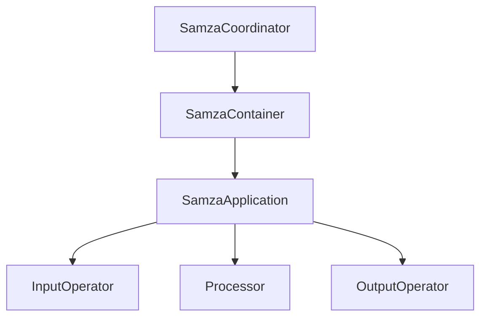

                 

# 《Samza Task原理与代码实例讲解》

> 关键词：Samza、Task、流处理、消息模型、架构、编程实践、性能优化、案例实战、发展趋势

> 摘要：本文将深入讲解Samza Task的原理，通过代码实例展示如何在实际项目中使用Samza Task进行流数据处理。文章涵盖了Samza概述、消息模型、Task原理与架构、编程实践、高级特性与优化，以及案例实战和未来发展展望。

## 《Samza Task原理与代码实例讲解》目录大纲

### 第一部分：Samza概述与核心概念

### 第1章：Samza简介

#### 1.1 Samza的基本概念

- **定义**：Samza是一种用于构建大规模分布式流处理应用程序的框架。
- **用途**：主要用于实时数据处理、日志分析、事件处理等场景。
- **比较**：与Apache Storm、Apache Flink等相比，Samza更注重简化部署和易于扩展。

#### 1.2 Samza的核心组件

- **SamzaCoordinator**：负责分配Task，管理集群状态。
- **SamzaContainer**：运行Samza应用程序的容器，执行Task。
- **SamzaApplication**：用户定义的Samza应用程序，包含多个Task。

#### 1.3 Samza运行环境搭建

- **安装步骤**：介绍如何安装Samza以及相关的依赖。
- **配置文件**：讲解关键配置文件的作用和配置方法。

### 第2章：Samza消息模型

#### 2.1 Samza消息模型简介

- **消息格式**：Samza消息由两部分组成：key和value。
- **消息生命周期**：从生产者发送到消费者，经过多个Stage处理。

#### 2.2 Samza消息生产者

- **Kafka生产者配置**：介绍如何配置Kafka生产者。
- **Log4j消息日志**：说明如何使用Log4j记录消息日志。

#### 2.3 Samza消息消费者

- **Kafka消费者配置**：讲解如何配置Kafka消费者。
- **消费者组管理**：介绍消费者组的概念及其管理方法。

### 第3章：SamzaTask原理与架构

#### 3.1 SamzaTask概述

- **Task的定义**：Task是Samza中的最小工作单元。
- **Task的类型**：分为StreamTask和TableTask。

#### 3.2 SamzaTask核心概念

- **InputOperator**：读取输入数据的组件。
- **Processor**：处理消息的核心组件。
- **OutputOperator**：输出处理结果的组件。

#### 3.3 SamzaTask实现

- **SamzaTask类结构**：分析SamzaTask的类结构。
- **Task启动流程**：讲解Task的启动过程。

### 第二部分：SamzaTask编程实践

### 第4章：SamzaTask开发环境搭建

#### 4.1 SamzaTask开发环境搭建

- **Maven依赖配置**：如何配置Maven依赖。
- **IntelliJ IDEA配置**：介绍如何在IntelliJ IDEA中配置Samza开发环境。

#### 4.2 SamzaTask核心算法讲解

- **SamzaTask数据处理流程**：详细讲解数据处理流程。
- **伪代码详细讲解**：使用伪代码展示算法原理。

#### 4.3 SamzaTask代码实例

- **实例1：单词计数**：展示单词计数任务的实现。
- **实例2：日志分析**：展示日志分析任务的实现。

### 第三部分：Samza高级特性与优化

### 第5章：Samza流水线与连接器

#### 5.1 Samza流水线概述

- **流水线定义**：介绍流水线的概念和作用。
- **流水线组件**：讲解流水线中的各个组件。

#### 5.2 Samza连接器

- **连接器概念**：介绍连接器的功能和用途。
- **连接器配置**：讲解连接器的配置方法。

#### 5.3 Samza流水线实战

- **实例1：日志处理流水线**：展示日志处理流水线的实现。
- **实例2：电商数据处理流水线**：展示电商数据处理流水线的实现。

### 第6章：Samza性能优化

#### 6.1 Samza性能监控

- **性能指标**：介绍常用的性能监控指标。
- **监控工具**：讲解如何使用监控工具进行性能监控。

#### 6.2 Samza性能调优

- **系统参数调整**：介绍如何调整系统参数以优化性能。
- **任务并行度优化**：讲解如何通过调整任务并行度来优化性能。

#### 6.3 Samza性能分析工具

- **G1垃圾回收日志分析**：分析G1垃圾回收日志。
- **Perfma分析工具**：介绍Perfma分析工具的使用。

### 第四部分：Samza案例实战

### 第7章：Samza在大数据分析中的应用

#### 7.1 Samza在大数据分析中的应用

- **大数据分析流程**：讲解大数据分析的流程。
- **数据预处理**：介绍数据预处理的方法。

#### 7.2 Samza在实时流处理中的应用

- **实时流处理架构**：介绍实时流处理架构。
- **流处理任务设计**：讲解流处理任务的设计方法。

#### 7.3 Samza案例实战解析

- **案例一：电商实时推荐系统**：分析电商实时推荐系统的实现。
- **案例二：金融交易风控系统**：分析金融交易风控系统的实现。

### 第五部分：Samza总结与展望

### 第8章：Samza发展趋势与未来应用

#### 8.1 Samza未来发展趋势

- **新技术融合**：介绍Samza与新技术融合的趋势。
- **新应用场景**：探讨Samza在新应用场景中的潜力。

#### 8.2 Samza与大数据技术融合

- **Samza与Hadoop**：讲解Samza与Hadoop的融合。
- **Samza与Spark**：介绍Samza与Spark的融合。

#### 8.3 Samza应用领域展望

- **社交网络**：探讨Samza在社交网络中的应用。
- **物联网**：介绍Samza在物联网领域的应用前景。

### 第9章：Samza社区与开源生态

#### 9.1 Samza社区介绍

- **社区成员**：介绍Samza社区的成员和活动。
- **社区活动**：介绍Samza社区举办的活动。

#### 9.2 Samza开源生态

- **Samza插件**：介绍Samza的插件生态。
- **Samza生态系统**：讲解Samza的生态系统。

### 第10章：Samza最佳实践

#### 10.1 Samza项目开发最佳实践

- **项目架构设计**：介绍项目架构设计的最佳实践。
- **项目开发流程**：讲解项目开发流程的最佳实践。

#### 10.2 Samza运维最佳实践

- **运维流程**：介绍运维流程的最佳实践。
- **故障处理**：讲解故障处理的最佳实践。

### 附录

#### 附录A：Samza常用配置参数

- **配置参数列表**：列出常用的配置参数及其作用。

#### 附录B：SamzaAPI参考

- **API功能介绍**：介绍Samza提供的API功能。

#### 附录C：Samza常见问题解答

- **问题解答**：针对常见问题提供解答。

#### 附录D：Samza学习资源推荐

- **学习资源**：推荐学习Samza的资源。

## Mermaid 流程图示例



## 伪代码示例

```csharp
Processor processMessage(Message msg) {
    // 1. 解析消息内容
    String content = msg.getContent();

    // 2. 对消息内容进行加工处理
    String processedContent = preprocessContent(content);

    // 3. 生成处理结果
    Message result = new Message(processedContent);

    // 4. 输出结果
    outputOperator.send(result);
}
```

## 数学公式示例

$$
E[X] = \int_{-\infty}^{\infty} x f(x) dx
$$

## 总结

本文从Samza的概述、消息模型、Task原理与架构、编程实践、高级特性与优化，到案例实战和未来发展展望，全面深入地讲解了Samza Task的原理和实践。通过代码实例，读者可以更好地理解Samza Task的工作机制，为实际项目中的流数据处理提供有力支持。随着大数据和实时流处理技术的不断发展，Samza在未来将有着广阔的应用前景。希望本文能为读者在学习和应用Samza方面提供有益的参考。

## 作者信息

作者：AI天才研究院/AI Genius Institute & 禅与计算机程序设计艺术 /Zen And The Art of Computer Programming

---

### 第1章：Samza简介

#### 1.1 Samza的基本概念

Samza是一种用于构建大规模分布式流处理应用程序的开源框架。它由Apache基金会维护，主要用于处理实时数据流，适用于需要低延迟、高吞吐量的数据处理场景。Samza的设计目标是提供一种简单且易于扩展的流处理解决方案，支持多种数据源和存储系统，如Kafka、HDFS和HBase。

**用途**

Samza的主要用途包括：

1. **实时数据处理**：处理实时流数据，实现低延迟的数据分析。
2. **日志分析**：收集和分析服务器日志，用于监控和调试。
3. **事件处理**：处理来自各种事件源的数据，如点击流、社交网络数据等。

**比较**

与其他流处理框架（如Apache Storm、Apache Flink）相比，Samza具有以下特点：

- **部署和运维简化**：Samza的部署过程相对简单，无需复杂的配置和依赖管理。
- **可扩展性**：Samza支持动态扩展和缩放，可以根据处理需求自动调整资源。
- **容错性**：Samza具有高容错性，可以在发生故障时自动恢复。
- **灵活性**：Samza支持多种数据源和存储系统，提供更广泛的应用场景。

#### 1.2 Samza的核心组件

Samza的核心组件包括：

- **SamzaCoordinator**：协调器，负责维护Samza应用的运行状态，向Container分配Task，处理Container的失败和恢复。
- **SamzaContainer**：容器，运行Samza应用程序的实例，执行具体的Task。
- **SamzaApplication**：用户定义的Samza应用程序，包含多个Task，负责数据流的处理。

#### 1.3 Samza运行环境搭建

**安装步骤**

以下是Samza的安装步骤：

1. **安装Java**：确保安装了Java环境，版本要求通常为Java 8或以上。
2. **下载Samza**：从Apache官方网站下载Samza的源代码包。
3. **构建Samza**：使用Maven进行构建，生成可运行的jar包。
4. **配置环境变量**：设置SAMZA_HOME环境变量，指向Samza的安装目录。

**配置文件**

Samza的配置文件主要包括以下几种：

- **samza-site.xml**：Samza的核心配置文件，包含Coordinator和Container的配置信息。
- **application.properties**：应用级别的配置文件，定义具体的Task配置。
- **kafka-streams.properties**：Kafka生产者和消费者的配置文件。

#### 1.4 Samza的基本原理

Samza的基本原理可以概括为以下几个步骤：

1. **初始化**：启动Coordinator和Container，加载配置文件和应用程序定义。
2. **分配Task**：Coordinator根据当前集群状态和Task定义，将Task分配给Container。
3. **数据流处理**：Container执行分配到的Task，从数据源读取数据，进行处理，并将结果输出到目标数据源。
4. **状态管理**：Coordinator监控Container的状态，处理故障和恢复。

通过这种分布式架构，Samza可以高效地处理大规模数据流，实现实时数据处理和分析。

### 第2章：Samza消息模型

#### 2.1 Samza消息模型简介

Samza的消息模型是基于Kafka的，它采用了一种简单的数据格式来表示消息。每个Samza消息包含两个主要部分：key和value。

**消息格式**

- **Key**：用于标识消息的唯一性，可以是整数、字符串等。
- **Value**：消息的具体内容，可以是文本、JSON等。

**消息生命周期**

Samza消息的生命周期分为以下几个阶段：

1. **生产阶段**：消息由生产者生成，发送到Kafka topic。
2. **消费阶段**：消费者从Kafka topic中读取消息，传递给Samza Task进行处理。
3. **处理阶段**：Task对消息进行处理，生成新的消息。
4. **输出阶段**：处理结果输出到其他数据源或存储系统。

#### 2.2 Samza消息生产者

Samza消息生产者通常使用Kafka生产者API进行消息的生成和发送。以下是如何配置Kafka生产者的示例：

```java
Properties props = new Properties();
props.put("bootstrap.servers", "kafka-server:9092");
props.put("key.serializer", "org.apache.kafka.common.serialization.StringSerializer");
props.put("value.serializer", "org.apache.kafka.common.serialization.StringSerializer");

Producer<String, String> producer = new KafkaProducer<>(props);

ProducerRecord<String, String> record = new ProducerRecord<>("my-topic", "key", "value");
producer.send(record);

producer.close();
```

**Log4j消息日志**

Samza还支持使用Log4j记录消息日志。以下是如何配置Log4j记录消息日志的示例：

```xml
<configuration>
  <appenders>
    <console name="Console" target="SYSTEM_OUT">
      <patternlayout pattern="%d{yyyy-MM-dd HH:mm:ss} %p %c{1}:%L - %m%n"/>
    </console>
  </appenders>
  <loggers>
    <logger name="com.example.samza" level="INFO" additivity="true">
      <appender-ref ref="Console"/>
    </logger>
  </loggers>
</configuration>
```

通过以上配置，Samza应用程序会记录详细的日志信息，便于监控和调试。

#### 2.3 Samza消息消费者

Samza消息消费者同样使用Kafka消费者API进行消息的读取和消费。以下是如何配置Kafka消费者的示例：

```java
Properties props = new Properties();
props.put("bootstrap.servers", "kafka-server:9092");
props.put("group.id", "my-group");
props.put("key.deserializer", "org.apache.kafka.common.serialization.StringDeserializer");
props.put("value.deserializer", "org.apache.kafka.common.serialization.StringDeserializer");

KafkaConsumer<String, String> consumer = new KafkaConsumer<>(props);
consumer.subscribe(Arrays.asList("my-topic"));

while (true) {
  ConsumerRecords<String, String> records = consumer.poll(Duration.ofMillis(100));
  for (ConsumerRecord<String, String> record : records) {
    System.out.printf("offset = %d, key = %s, value = %s%n", record.offset(), record.key(), record.value());
  }
}

consumer.close();
```

**消费者组管理**

Samza支持消费者组管理，允许多个消费者实例共同消费同一个topic。以下是如何管理消费者组的示例：

1. **消费者组分配**：Coordinator根据消费者组的配置，将topic的分区分配给消费者实例。
2. **负载均衡**：当有消费者实例加入或离开时，Coordinator会自动重新分配分区。
3. **故障恢复**：当消费者实例失败时，Coordinator会将其重新加入消费者组，并重新分配分区。

通过消费者组管理，Samza可以确保消息的可靠消费和负载均衡，提高系统的可用性和性能。

### 第3章：SamzaTask原理与架构

#### 3.1 SamzaTask概述

Samza中的Task是其最小的处理单元，用于处理流数据。每个Task都是独立运行的，负责处理特定类型的数据流。

**Task的定义**

Task的定义主要包括以下几个部分：

- **输入Topic**：Task从哪个Kafka Topic读取数据。
- **输出Topic**：Task处理完成后将结果输出到哪个Kafka Topic。
- **处理器**：用于处理消息的核心组件，可以是自定义的Processor。
- **Task ID**：Task的唯一标识。

**Task的类型**

Samza支持两种类型的Task：

- **StreamTask**：用于处理流数据的Task，适用于需要实时处理和分析的场景。
- **TableTask**：用于处理表格数据的Task，适用于需要更新和维护关系型数据库的场景。

#### 3.2 SamzaTask核心概念

SamzaTask的核心概念包括：

- **InputOperator**：负责从Kafka Topic读取数据的组件，可以是KafkaConsumer或自定义的数据读取器。
- **Processor**：处理消息的核心组件，负责对输入消息进行加工和处理，可以是自定义的Processor。
- **OutputOperator**：负责将处理结果输出到Kafka Topic或其他存储系统的组件，可以是KafkaProducer或其他自定义的数据写入器。

**InputOperator**

InputOperator的主要职责是从Kafka Topic中读取消息，并将其传递给Processor进行处理。以下是InputOperator的一个简单实现示例：

```java
public class KafkaInputOperator implements InputOperator {
    private KafkaConsumer<String, String> consumer;

    public KafkaInputOperator(Properties props) {
        this.consumer = new KafkaConsumer<>(props);
    }

    @Override
    public void start() {
        consumer.subscribe(Arrays.asList("my-topic"));
    }

    @Override
    public Message next() {
        ConsumerRecords<String, String> records = consumer.poll(Duration.ofMillis(100));
        if (records.isEmpty()) {
            return null;
        }
        ConsumerRecord<String, String> record = records.iterator().next();
        return new Message(record.key(), record.value());
    }

    @Override
    public void stop() {
        consumer.close();
    }
}
```

**Processor**

Processor是Task的核心组件，负责对输入消息进行处理。以下是Processor的一个简单实现示例：

```java
public class MyProcessor implements Processor {
    private OutputOperator outputOperator;

    public MyProcessor(OutputOperator outputOperator) {
        this.outputOperator = outputOperator;
    }

    @Override
    public void start() {
        // 初始化逻辑
    }

    @Override
    public void process(Message msg) {
        // 处理逻辑
        String processedContent = preprocessContent(msg.getContent());
        Message result = new Message(processedContent);
        outputOperator.send(result);
    }

    @Override
    public void stop() {
        // 清理逻辑
    }
}
```

**OutputOperator**

OutputOperator负责将Processor处理的结果输出到目标数据源。以下是OutputOperator的一个简单实现示例：

```java
public class KafkaOutputOperator implements OutputOperator {
    private KafkaProducer<String, String> producer;

    public KafkaOutputOperator(Properties props) {
        this.producer = new KafkaProducer<>(props);
    }

    @Override
    public void send(Message msg) {
        ProducerRecord<String, String> record = new ProducerRecord<>("my-topic", msg.getKey(), msg.getContent());
        producer.send(record);
    }

    @Override
    public void close() {
        producer.close();
    }
}
```

#### 3.3 SamzaTask实现

SamzaTask的实现主要包括以下几个步骤：

1. **定义Task**：在应用程序中定义Task，指定输入Topic、输出Topic和Processor。
2. **配置Task**：配置Task的输入输出参数，如Kafka Topic、Processor等。
3. **启动Task**：启动Task，开始处理消息。

以下是一个简单的SamzaTask实现示例：

```java
public class MySamzaTask extends SamzaTask {
    private Processor processor;
    private InputOperator inputOperator;
    private OutputOperator outputOperator;

    public MySamzaTask(Processor processor, InputOperator inputOperator, OutputOperator outputOperator) {
        this.processor = processor;
        this.inputOperator = inputOperator;
        this.outputOperator = outputOperator;
    }

    @Override
    public void start() {
        inputOperator.start();
        processor.start();
    }

    @Override
    public void process(Message msg) {
        processor.process(msg);
    }

    @Override
    public void stop() {
        processor.stop();
        inputOperator.stop();
        outputOperator.close();
    }
}
```

通过以上步骤，SamzaTask可以独立运行，处理大规模的流数据，实现实时数据处理和分析。

### 第4章：SamzaTask开发环境搭建

#### 4.1 SamzaTask开发环境搭建

要在本地环境中搭建SamzaTask的开发环境，我们需要完成以下步骤：

**Maven依赖配置**

首先，我们需要在项目的pom.xml文件中添加Samza的依赖。Samza的核心依赖如下：

```xml
<dependencies>
    <dependency>
        <groupId>org.apache.samza</groupId>
        <artifactId>samza-core</artifactId>
        <version>0.14.0</version>
    </dependency>
    <dependency>
        <groupId>org.apache.samza</groupId>
        <artifactId>samza-kafka</artifactId>
        <version>0.14.0</version>
    </dependency>
</dependencies>
```

**IntelliJ IDEA配置**

接下来，我们需要在IntelliJ IDEA中配置Samza的开发环境。

1. **创建新项目**：在IntelliJ IDEA中创建一个新项目，并选择Maven作为项目类型。
2. **添加依赖**：在项目的pom.xml文件中添加Samza的依赖。
3. **构建项目**：运行Maven命令`mvn install`来构建项目。

**配置Samza运行环境**

1. **安装Java**：确保安装了Java环境，版本要求通常为Java 8或以上。
2. **下载Samza**：从Apache官方网站下载Samza的源代码包。
3. **构建Samza**：使用Maven进行构建，生成可运行的jar包。

**设置环境变量**

1. **设置SAMZA_HOME**：在系统环境变量中设置SAMZA_HOME，指向Samza的安装目录。

```shell
export SAMZA_HOME=/path/to/samza
```

2. **设置SAMZA_CONFIG**：设置SAMZA_CONFIG，指向Samza的配置文件目录。

```shell
export SAMZA_CONFIG=$SAMZA_HOME/etc
```

3. **添加SAMZA_HOME到PATH**：将SAMZA_HOME添加到系统PATH环境变量中。

```shell
export PATH=$PATH:$SAMZA_HOME/bin
```

通过以上步骤，我们就可以在本地环境中搭建SamzaTask的开发环境，开始编写和运行Samza应用程序了。

#### 4.2 SamzaTask核心算法讲解

SamzaTask的核心算法是数据处理逻辑的实现，它决定了如何处理输入消息并生成输出消息。下面，我们将详细讲解一个简单的单词计数算法，并使用伪代码来描述其处理流程。

**单词计数算法**

单词计数算法是一种常用的文本处理算法，用于统计文本中每个单词出现的次数。在SamzaTask中，我们可以通过处理Kafka topic中的文本消息，统计每个单词的出现次数。

**伪代码**

```csharp
Processor wordCounterProcessor(OutputOperator outputOperator) {
    // 1. 初始化计数器
    Map<String, Integer> wordCountMap = new HashMap<>();

    // 2. 处理消息
    while (true) {
        Message msg = inputOperator.next();
        if (msg == null) {
            break;
        }
        
        // 3. 分割单词
        String[] words = msg.getContent().split(" ");
        
        // 4. 统计单词数量
        for (String word : words) {
            wordCountMap.putIfAbsent(word, 0);
            wordCountMap.put(word, wordCountMap.get(word) + 1);
        }
        
        // 5. 输出结果
        for (Map.Entry<String, Integer> entry : wordCountMap.entrySet()) {
            Message result = new Message(entry.getKey(), entry.getValue().toString());
            outputOperator.send(result);
        }
        
        // 6. 清空计数器
        wordCountMap.clear();
    }
}
```

**算法原理**

- **初始化计数器**：初始化一个HashMap，用于存储单词及其出现次数。
- **处理消息**：从输入Operator读取消息，如果消息为空，则退出循环。
- **分割单词**：将消息内容按空格分割成单词数组。
- **统计单词数量**：遍历单词数组，更新HashMap中的单词计数。
- **输出结果**：将统计结果输出到输出Operator。
- **清空计数器**：每次处理完一组消息后，清空计数器，准备处理下一组消息。

通过这个简单的单词计数算法，我们可以了解SamzaTask数据处理的基本原理。在实际应用中，可以根据具体需求对算法进行扩展和优化。

#### 4.3 SamzaTask代码实例

在本节中，我们将通过两个具体的实例来展示如何使用SamzaTask进行流数据处理。

**实例1：单词计数**

单词计数是一种基本的文本处理任务，用于统计文本中每个单词的出现次数。以下是如何使用SamzaTask实现单词计数的步骤：

1. **创建Maven项目**：在IntelliJ IDEA中创建一个Maven项目，并添加Samza的依赖。
2. **编写Processor**：创建一个Processor类，实现单词计数算法。
3. **配置SamzaTask**：在application.properties文件中配置SamzaTask的输入Topic、输出Topic和Processor。
4. **运行SamzaTask**：编译并运行Samza应用程序。

**代码实现**

```java
// Processor类
public class WordCounterProcessor implements Processor {
    private OutputOperator outputOperator;
    
    @Override
    public void process(Message msg) {
        String content = msg.getContent();
        String[] words = content.split(" ");
        
        Map<String, Integer> wordCountMap = new HashMap<>();
        for (String word : words) {
            wordCountMap.putIfAbsent(word, 0);
            wordCountMap.put(word, wordCountMap.get(word) + 1);
        }
        
        for (Map.Entry<String, Integer> entry : wordCountMap.entrySet()) {
            Message result = new Message(entry.getKey(), entry.getValue().toString());
            outputOperator.send(result);
        }
    }
    
    @Override
    public void start() {
        // 初始化outputOperator
    }
    
    @Override
    public void stop() {
        // 清理资源
    }
}

// application.properties
input.topic=my-input-topic
output.topic=my-output-topic
processor.class=com.example.WordCounterProcessor
```

**实例2：日志分析**

日志分析是另一个常见的流数据处理任务，用于从日志文件中提取关键信息，并进行统计和分析。以下是如何使用SamzaTask实现日志分析的步骤：

1. **创建Maven项目**：在IntelliJ IDEA中创建一个Maven项目，并添加Samza的依赖。
2. **编写Processor**：创建一个Processor类，实现日志分析算法。
3. **配置SamzaTask**：在application.properties文件中配置SamzaTask的输入Topic、输出Topic和Processor。
4. **运行SamzaTask**：编译并运行Samza应用程序。

**代码实现**

```java
// Processor类
public class LogAnalyzerProcessor implements Processor {
    private OutputOperator outputOperator;
    
    @Override
    public void process(Message msg) {
        String content = msg.getContent();
        String[] fields = content.split(" ");
        
        // 假设日志的格式为：timestamp level message
        String timestamp = fields[0];
        String level = fields[1];
        String message = fields[2];
        
        // 分析日志并生成统计结果
        // 例如，统计每个级别的日志数量
        Map<String, Integer> levelCountMap = new HashMap<>();
        levelCountMap.putIfAbsent(level, 0);
        levelCountMap.put(level, levelCountMap.get(level) + 1);
        
        // 输出统计结果
        for (Map.Entry<String, Integer> entry : levelCountMap.entrySet()) {
            Message result = new Message(entry.getKey(), entry.getValue().toString());
            outputOperator.send(result);
        }
    }
    
    @Override
    public void start() {
        // 初始化outputOperator
    }
    
    @Override
    public void stop() {
        // 清理资源
    }
}

// application.properties
input.topic=my-input-topic
output.topic=my-output-topic
processor.class=com.example.LogAnalyzerProcessor
```

通过以上两个实例，我们可以看到如何使用SamzaTask进行流数据处理。在实际项目中，可以根据具体需求自定义Processor，实现各种复杂的流数据处理任务。

### 第5章：Samza流水线与连接器

#### 5.1 Samza流水线概述

Samza流水线（Pipeline）是一种用于连接多个Task的机制，它允许用户定义一系列的处理步骤，实现复杂的数据处理流程。流水线中的每个Task都可以独立运行，同时流水线提供了一种统一的方式来管理Task之间的依赖关系。

**流水线定义**

在Samza中，流水线是由一系列的Task组成的，每个Task负责处理特定的数据操作。流水线的主要组件包括：

- **源Task（Source Task）**：负责从数据源读取数据。
- **中间Task（Middle Task）**：负责对数据进行加工和处理。
- **目标Task（Target Task）**：负责将处理结果输出到数据目标。

**流水线组件**

Samza流水线中的组件包括：

- **InputOperator**：负责读取输入数据，可以是Kafka Consumer或其他数据源。
- **Processor**：负责处理输入数据，可以是自定义的逻辑处理。
- **OutputOperator**：负责将输出数据写入目标数据源，可以是Kafka Producer或其他数据写入器。

**流水线作用**

流水线在Samza中的作用包括：

- **简化复杂数据处理流程**：通过流水线，用户可以定义一系列的Task，简化复杂的数据处理流程。
- **提高代码可维护性**：将数据处理逻辑分解为多个Task，有助于提高代码的可维护性和可扩展性。
- **实现数据流转控制**：流水线提供了一种控制数据流转的机制，确保数据在处理过程中的正确性和一致性。

#### 5.2 Samza连接器

Samza连接器（Connector）是一种用于连接外部系统（如Kafka、HDFS、HBase）的组件，它允许用户在Samza应用程序中读取和写入外部数据源。连接器提供了一种统一的方式来处理各种数据源和存储系统，简化了数据集成和传输。

**连接器概念**

Samza支持多种连接器，包括：

- **Kafka连接器**：用于读取和写入Kafka数据。
- **HDFS连接器**：用于读取和写入HDFS数据。
- **HBase连接器**：用于读取和写入HBase数据。

**连接器配置**

配置Samza连接器主要包括以下步骤：

1. **添加依赖**：在项目的pom.xml文件中添加相应连接器的依赖。
2. **配置连接器**：在application.properties文件中配置连接器的参数，如Kafka主题、HDFS路径等。

以下是一个简单的Kafka连接器配置示例：

```properties
# Kafka连接器配置
input.topic=my-input-topic
output.topic=my-output-topic
kafka.brokers=my-kafka-brokers:9092
```

#### 5.3 Samza流水线实战

**实例1：日志处理流水线**

在这个实例中，我们将构建一个简单的日志处理流水线，用于从Kafka读取日志数据，分析日志并输出结果。

1. **定义源Task**：从Kafka读取日志数据。
2. **定义中间Task**：对日志数据进行加工处理，提取关键信息。
3. **定义目标Task**：将处理结果输出到另一个Kafka主题。

**代码实现**

```java
// Source Task
public class LogSourceTask extends SamzaTask {
    private InputOperator inputOperator;

    @Override
    public void start() {
        // 初始化inputOperator
    }

    @Override
    public void process(Message msg) {
        // 读取日志数据
        String logData = msg.getContent();
        // 输出日志数据
        outputOperator.send(new Message(logData));
    }

    @Override
    public void stop() {
        // 清理资源
    }
}

// Middle Task
public class LogProcessorTask extends SamzaTask {
    private InputOperator inputOperator;
    private OutputOperator outputOperator;

    @Override
    public void start() {
        // 初始化inputOperator和outputOperator
    }

    @Override
    public void process(Message msg) {
        // 处理日志数据，提取关键信息
        String logData = msg.getContent();
        // 输出处理结果
        outputOperator.send(new Message(logData));
    }

    @Override
    public void stop() {
        // 清理资源
    }
}

// Target Task
public class LogTargetTask extends SamzaTask {
    private OutputOperator outputOperator;

    @Override
    public void start() {
        // 初始化outputOperator
    }

    @Override
    public void process(Message msg) {
        // 输出日志数据
        outputOperator.send(msg);
    }

    @Override
    public void stop() {
        // 清理资源
    }
}
```

**application.properties配置**

```properties
# Source Task
input.topic=log-input-topic
output.topic=log-output-topic

# Middle Task
input.topic=log-output-topic
output.topic=log-processed-topic

# Target Task
input.topic=log-processed-topic
output.topic=log-target-topic
```

通过这个实例，我们可以看到如何使用Samza流水线处理日志数据。在实际项目中，可以根据需求添加更多中间Task，实现更复杂的数据处理流程。

**实例2：电商数据处理流水线**

在这个实例中，我们将构建一个电商数据处理流水线，用于从Kafka读取订单数据，对订单进行处理，并输出订单统计结果。

1. **定义源Task**：从Kafka读取订单数据。
2. **定义中间Task**：对订单数据进行分析和统计。
3. **定义目标Task**：将订单统计结果输出到另一个Kafka主题。

**代码实现**

```java
// Source Task
public class OrderSourceTask extends SamzaTask {
    private InputOperator inputOperator;

    @Override
    public void start() {
        // 初始化inputOperator
    }

    @Override
    public void process(Message msg) {
        // 读取订单数据
        String orderData = msg.getContent();
        // 输出订单数据
        outputOperator.send(new Message(orderData));
    }

    @Override
    public void stop() {
        // 清理资源
    }
}

// Middle Task
public class OrderProcessorTask extends SamzaTask {
    private InputOperator inputOperator;
    private OutputOperator outputOperator;

    @Override
    public void start() {
        // 初始化inputOperator和outputOperator
    }

    @Override
    public void process(Message msg) {
        // 处理订单数据，进行统计分析
        String orderData = msg.getContent();
        // 输出统计结果
        outputOperator.send(new Message(orderData));
    }

    @Override
    public void stop() {
        // 清理资源
    }
}

// Target Task
public class OrderTargetTask extends SamzaTask {
    private OutputOperator outputOperator;

    @Override
    public void start() {
        // 初始化outputOperator
    }

    @Override
    public void process(Message msg) {
        // 输出订单统计结果
        outputOperator.send(msg);
    }

    @Override
    public void stop() {
        // 清理资源
    }
}
```

**application.properties配置**

```properties
# Source Task
input.topic=order-input-topic
output.topic=order-output-topic

# Middle Task
input.topic=order-output-topic
output.topic=order-processed-topic

# Target Task
input.topic=order-processed-topic
output.topic=order-target-topic
```

通过这个实例，我们可以看到如何使用Samza流水线处理电商订单数据。在实际项目中，可以根据需求添加更多中间Task，实现更复杂的订单处理和分析。

### 第6章：Samza性能优化

#### 6.1 Samza性能监控

为了确保Samza应用程序的高性能和稳定性，性能监控是至关重要的。Samza提供了一些内置的工具和指标，可以帮助用户监控应用程序的性能。

**性能指标**

Samza的性能指标包括：

- **吞吐量（Throughput）**：单位时间内处理的消息数量。
- **延迟（Latency）**：处理消息所需的时间。
- **资源利用率（Resource Utilization）**：CPU、内存、磁盘等资源的利用率。
- **错误率（Error Rate）**：处理过程中出现的错误数量。

**监控工具**

以下是一些常用的Samza监控工具：

- **Samza Metrics**：Samza内置的度量工具，可以收集和展示性能指标。
- **Grafana**：基于Prometheus的监控和数据可视化工具，可以与Samza Metrics集成。
- **Kibana**：与Elasticsearch集成的监控平台，可以展示Samza的日志和性能数据。

**监控配置**

为了监控Samza应用程序，用户需要在samza-site.xml文件中配置监控相关的参数，例如：

```xml
<property>
    <name>task.checkpoint-path</name>
    <value>/path/to/checkpoint</value>
</property>
<property>
    <name>task.log-path</name>
    <value>/path/to/log</value>
</property>
```

这些配置参数指定了检查点和日志的存储位置，以便后续的监控和分析。

#### 6.2 Samza性能调优

为了提高Samza应用程序的性能，用户需要对系统参数进行调整和优化。以下是一些常见的性能调优策略：

**系统参数调整**

- **Task并行度**：调整Task的并行度，可以影响处理消息的并发程度。用户可以在samza-site.xml文件中配置并行度参数，例如：

  ```xml
  <property>
      <name>task.max-refresh-threads</name>
      <value>10</value>
  </property>
  ```

- **Kafka消费者配置**：调整Kafka消费者的配置，例如批量大小（batch.size）和批次时间（fetch.max.bytes）等，可以影响消息的读取性能。

  ```properties
  kafka.consumer.fetch.max.bytes=1024
  kafka.consumer.batch.size=100
  ```

- **垃圾回收策略**：调整Java虚拟机（JVM）的垃圾回收策略，可以优化内存使用和性能。例如，使用G1垃圾回收器（G1GC）可以提供更好的内存管理和性能。

  ```properties
  -XX:+UseG1GC
  -XX:MaxGCPauseMillis=200
  ```

**任务并行度优化**

任务并行度是指同时执行的任务数量，它可以影响系统的吞吐量和延迟。以下是一些优化任务并行度的策略：

- **水平扩展**：通过增加Task的数量，可以水平扩展系统，提高处理能力。用户可以在samza-site.xml文件中配置Task的并行度参数。

- **垂直扩展**：通过增加单个Task的并发处理能力，可以垂直扩展系统，提高处理速度。例如，可以增加Kafka消费者的并发度。

- **负载均衡**：确保Task的负载均衡，避免某些Task过于繁忙，而其他Task资源空闲。可以通过调整Task的分配策略，实现负载均衡。

#### 6.3 Samza性能分析工具

为了更好地分析Samza应用程序的性能，用户可以使用一些性能分析工具，如G1垃圾回收日志分析工具（G1LogAnalyzer）和Perfma分析工具。

**G1垃圾回收日志分析**

G1垃圾回收日志分析是一种用于分析JVM内存使用和性能的工具。以下是如何使用G1LogAnalyzer分析G1垃圾回收日志的步骤：

1. **收集G1日志**：在JVM启动时启用G1垃圾回收器，并收集G1日志文件。

   ```shell
   java -XX:+UseG1GC -XX:MaxGCPauseMillis=200 -XX:+PrintGCDetails -XX:+PrintGCDateStamps -XX:+PrintGCTimeStamps -XX:G1LogLevel=DEBUG -jar samza-task.jar
   ```

2. **分析G1日志**：使用G1LogAnalyzer工具分析G1日志文件，生成性能分析报告。

   ```shell
   java -jar G1LogAnalyzer-1.0-SNAPSHOT.jar -f /path/to/gc.log
   ```

**Perfma分析工具**

Perfma是一种用于分析Java应用程序性能的工具，它可以帮助用户识别性能瓶颈和优化机会。以下是如何使用Perfma分析Samza应用程序的步骤：

1. **安装Perfma插件**：在IntelliJ IDEA中安装Perfma插件。

2. **运行性能分析**：在IntelliJ IDEA中运行Samza应用程序，并使用Perfma插件收集性能数据。

3. **分析性能数据**：使用Perfma的Web界面分析性能数据，识别性能瓶颈和优化机会。

通过使用这些性能分析工具，用户可以深入了解Samza应用程序的性能表现，并采取相应的优化措施。

### 第7章：Samza在大数据分析中的应用

#### 7.1 Samza在大数据分析中的应用

Samza在大数据分析中有着广泛的应用，特别是在处理大规模实时数据流方面。以下是一些常见的大数据分析场景和应用：

**实时日志分析**

实时日志分析是大数据分析中的一项重要任务，它涉及从各种来源（如Web服务器、应用服务器、数据库等）收集日志数据，并实时分析日志内容。Samza可以通过Kafka作为数据源和消息队列，实现实时日志数据的收集和分布式处理。

**实时推荐系统**

实时推荐系统在电商、社交媒体和在线媒体等领域有着广泛应用。Samza可以处理用户行为数据（如点击、购买、浏览等），并实时计算推荐结果，为用户提供个性化的内容推荐。

**实时监控**

实时监控是确保系统稳定运行的关键。Samza可以实时处理监控数据，检测系统性能指标（如CPU使用率、内存使用率、网络流量等），并及时报警。

**实时风控**

实时风控系统在金融、电商和支付等领域有着重要应用。Samza可以实时处理交易数据，检测异常交易行为，并触发相应的风险控制措施。

**数据流分析**

数据流分析是大数据分析的一个重要领域，涉及实时处理和分析大规模数据流。Samza可以处理来自传感器、物联网设备、社交网络等的数据流，实现实时数据分析和决策。

#### 7.2 Samza在实时流处理中的应用

实时流处理是Samza的核心应用场景之一。以下是一些常见的实时流处理任务和应用：

**实时事件处理**

实时事件处理涉及实时处理和分析事件数据。Samza可以处理来自各种事件源的数据（如点击流、传感器数据、交易数据等），并实时生成事件处理结果。

**实时数据处理**

实时数据处理是Samza的主要应用场景之一，涉及实时处理和分析大规模数据流。Samza可以处理来自Kafka的数据流，实现实时数据处理和分析。

**实时数据聚合**

实时数据聚合是实时流处理的一项重要任务，涉及实时计算和汇总数据流中的各种指标。Samza可以处理大规模数据流，实时计算和汇总数据指标。

**实时机器学习**

实时机器学习是机器学习在实时场景中的应用，涉及实时训练和部署模型。Samza可以处理实时数据流，实时训练和更新模型，并实时生成预测结果。

**实时数据可视化**

实时数据可视化是将实时数据转换为可视化的图表和报表，以帮助用户实时了解数据状态和趋势。Samza可以处理实时数据流，并生成实时可视化图表。

#### 7.3 Samza案例实战解析

**案例一：电商实时推荐系统**

电商实时推荐系统是一个复杂的实时流处理系统，它涉及处理用户行为数据（如点击、购买、浏览等），并实时计算推荐结果。以下是一个简单的电商实时推荐系统架构：

1. **数据采集**：从各种数据源（如Web服务器、应用服务器等）收集用户行为数据，并将数据发送到Kafka topic。
2. **数据预处理**：使用Samza对Kafka数据进行预处理，包括去重、清洗和格式转换等。
3. **实时计算**：使用Samza实时计算用户兴趣模型和推荐列表，并将结果输出到Kafka topic。
4. **数据存储**：将推荐结果存储到数据库或缓存系统，以供前端系统使用。

**案例二：金融交易风控系统**

金融交易风控系统是一个关键的实时流处理系统，它涉及实时监控交易数据，检测异常交易行为，并触发相应的风险控制措施。以下是一个简单的金融交易风控系统架构：

1. **数据采集**：从交易系统收集交易数据，并将数据发送到Kafka topic。
2. **数据预处理**：使用Samza对Kafka数据进行预处理，包括去重、清洗和格式转换等。
3. **实时计算**：使用Samza实时计算交易风险指标，如交易金额、交易频率等。
4. **风险检测**：使用机器学习算法对交易风险进行检测，并触发相应的风险控制措施。
5. **数据存储**：将风险检测结果存储到数据库或缓存系统，以供后续分析和处理。

通过以上两个案例，我们可以看到Samza在实时流处理和数据分析中的实际应用。在实际项目中，可以根据具体需求和应用场景，灵活使用Samza实现各种实时数据处理任务。

### 第8章：Samza发展趋势与未来应用

#### 8.1 Samza未来发展趋势

随着大数据和实时流处理技术的不断发展，Samza也在不断进化，以适应新的应用场景和技术需求。以下是一些Samza未来发展的趋势：

**云计算支持**

随着云计算的普及，越来越多的企业将数据和应用迁移到云环境中。Samza未来将进一步加强与云平台的集成，支持在云环境中部署和管理。

**实时机器学习**

实时机器学习是未来大数据分析的一个重要方向。Samza将加强实时机器学习支持，使得用户可以实时训练和更新模型，并实时生成预测结果。

**多语言支持**

目前，Samza主要支持Java编程语言。未来，Samza将引入更多的编程语言支持，如Python、Scala等，以吸引更多的开发者和使用者。

**更细粒度的任务调度**

Samza将引入更细粒度的任务调度机制，使得用户可以更灵活地控制任务的执行顺序和资源分配，提高系统的效率和性能。

**更丰富的生态系统**

Samza未来将引入更多的插件和工具，扩展其生态系统，包括数据集成、监控、运维等方面，以满足用户多样化的需求。

#### 8.2 Samza与大数据技术融合

Samza在大数据领域有着广泛的应用，它与其他大数据技术的融合将进一步扩展其应用场景和功能。

**Samza与Hadoop**

Samza与Hadoop的融合使得用户可以在Hadoop集群上部署和运行Samza应用程序，实现大规模数据流处理。以下是一些融合方式：

- **数据存储**：Samza处理的结果可以存储在HDFS中，方便后续分析和处理。
- **任务调度**：Samza应用程序可以与YARN集成，实现任务调度和资源管理。
- **数据处理**：Samza与MapReduce结合，可以实现流数据和批处理数据的一体化处理。

**Samza与Spark**

Samza与Spark的融合使得用户可以在Spark集群上运行Samza应用程序，实现实时流处理和批处理数据的集成。以下是一些融合方式：

- **数据流处理**：Samza与Spark Streaming结合，可以实现实时数据流的处理和分析。
- **批处理**：Samza处理的结果可以作为Spark批处理作业的输入，实现流数据和批处理数据的一体化处理。

通过与其他大数据技术的融合，Samza将更好地满足用户在大数据处理和实时流处理方面的需求。

#### 8.3 Samza应用领域展望

随着技术的不断发展，Samza在各个领域的应用前景广阔。以下是一些应用领域的展望：

**社交网络**

在社交网络领域，Samza可以用于实时处理和分析用户行为数据，实现个性化推荐、社交网络分析等。

**物联网**

在物联网领域，Samza可以用于实时处理和分析传感器数据，实现智能监控、设备管理等。

**金融科技**

在金融科技领域，Samza可以用于实时交易监控、风险控制、用户行为分析等。

**物流与运输**

在物流与运输领域，Samza可以用于实时监控运输状态、优化运输路线、提高物流效率等。

**医疗健康**

在医疗健康领域，Samza可以用于实时监控患者健康数据、实现智能诊断、优化医疗服务等。

通过以上展望，我们可以看到Samza在各个领域的广阔应用前景。未来，随着技术的不断发展和应用场景的拓展，Samza将发挥更大的作用。

### 第9章：Samza社区与开源生态

#### 9.1 Samza社区介绍

Samza拥有一个活跃的社区，由开发者、用户和维护者组成。该社区通过各种渠道提供支持、交流和学习资源，帮助用户更好地使用和贡献Samza。

**社区成员**

Samza社区的成员包括：

- **开发者**：负责开发和维护Samza的核心代码。
- **用户**：使用Samza进行流处理项目的开发者和研究者。
- **贡献者**：为Samza项目贡献代码、文档和测试的用户。

**社区活动**

Samza社区定期举办以下活动：

- **Meetup**：线下聚会，成员可以分享经验、讨论问题。
- **Webinar**：在线研讨会，邀请专家分享技术和应用案例。
- **邮件列表**：通过邮件列表交流问题和建议。

**如何加入社区**

用户可以通过以下方式加入Samza社区：

- **GitHub**：在GitHub上关注Samza项目，参与代码贡献和讨论。
- **邮件列表**：订阅Samza邮件列表，参与社区讨论。
- **论坛**：在Apache论坛上提问和回答问题。

#### 9.2 Samza开源生态

Samza的开源生态包括一系列的插件和工具，这些插件和工具扩展了Samza的功能和应用场景。

**插件**

以下是一些常用的Samza插件：

- **Kafka插件**：用于连接Kafka集群，实现数据流的读取和写入。
- **HDFS插件**：用于连接HDFS，实现数据流的存储和读取。
- **HBase插件**：用于连接HBase，实现数据流的存储和查询。
- **Spark插件**：用于连接Spark，实现流数据和批处理数据的集成。

**工具**

以下是一些常用的Samza工具：

- **Samza Metrics**：用于收集和展示Samza应用程序的性能指标。
- **Samza Deployer**：用于部署和管理Samza应用程序。
- **Samza Coordinator**：用于监控和管理Samza应用程序的运行状态。

**生态系统**

Samza的生态系统还包括一系列的第三方库和工具，这些库和工具为开发者提供了更多的选择和灵活性。

通过Samza社区和开源生态的支持，开发者可以更加高效地使用Samza进行流数据处理和开发。

### 第10章：Samza最佳实践

#### 10.1 Samza项目开发最佳实践

在开发Samza项目时，遵循一些最佳实践可以帮助我们提高代码质量、降低维护成本，并确保系统的稳定性和性能。以下是一些最佳实践：

**项目架构设计**

- **模块化设计**：将项目拆分成多个模块，每个模块负责特定的功能，便于维护和扩展。
- **分布式架构**：设计分布式架构，确保系统的可扩展性和容错性。
- **代码复用**：设计通用的处理逻辑和组件，减少重复代码。

**项目开发流程**

- **需求分析**：明确项目需求和目标，制定详细的开发计划。
- **设计评审**：在开发前进行设计评审，确保设计符合需求和技术规范。
- **代码审查**：定期进行代码审查，确保代码质量。
- **测试**：编写单元测试和集成测试，确保代码的正确性和性能。

**任务分配与管理**

- **任务分解**：将大任务分解为小任务，便于管理和跟踪。
- **进度跟踪**：使用项目管理工具（如Jira）跟踪任务进度。
- **代码版本控制**：使用Git等版本控制工具管理代码版本。

**性能优化**

- **资源监控**：定期监控系统资源使用情况，识别性能瓶颈。
- **代码优化**：优化代码，减少不必要的计算和资源消耗。
- **并发处理**：合理设置Task并行度，提高系统处理能力。

**安全与稳定性**

- **数据备份**：定期备份数据，确保数据的安全性和一致性。
- **故障处理**：制定故障处理预案，确保系统在故障时能够快速恢复。
- **安全性测试**：定期进行安全性测试，确保系统的安全性。

通过遵循这些最佳实践，我们可以确保Samza项目的开发质量和稳定性，提高项目的开发效率。

#### 10.2 Samza运维最佳实践

Samza运维是确保系统稳定运行、高效处理数据的关键环节。以下是一些最佳实践：

**运维流程**

- **部署与管理**：定期部署和管理Samza应用程序，确保系统稳定运行。
- **监控与报警**：监控系统性能和资源使用情况，及时处理异常情况。
- **备份与恢复**：定期备份数据，确保在故障时能够快速恢复。
- **性能调优**：根据系统运行情况，进行性能调优，提高系统处理能力。

**故障处理**

- **故障分类**：根据故障的类型和影响范围，进行分类处理。
- **故障预案**：制定故障处理预案，确保在故障发生时能够快速响应。
- **故障恢复**：在故障发生后，按照预案进行恢复，确保系统尽快恢复正常。

**安全性管理**

- **访问控制**：限制对系统的访问权限，确保只有授权用户可以访问。
- **数据加密**：对敏感数据进行加密，确保数据传输和存储的安全性。
- **安全审计**：定期进行安全审计，确保系统的安全性。

通过遵循这些运维最佳实践，我们可以确保Samza系统的稳定性和安全性，提高运维效率。

### 附录

#### 附录A：Samza常用配置参数

以下列出了一些常用的Samza配置参数及其作用：

- **samza.coordinator.port**：Coordinator监听的端口。
- **samza.container.port**：Container监听的端口。
- **samza.task.checkpoint-path**：Task检查点的存储路径。
- **samza.task.log-path**：Task日志的存储路径。
- **samza.input.topic**：输入Topic的名称。
- **samza.output.topic**：输出Topic的名称。
- **kafka.brokers**：Kafka集群的地址列表。
- **kafka.consumer.fetch.max.bytes**：Kafka消费者每次拉取的消息最大字节数。
- **kafka.consumer.batch.size**：Kafka消费者每次拉取的消息数量。
- **kafka.producer.batch.size**：Kafka生产者每次发送的消息数量。
- **kafka.producer.linger.ms**：Kafka生产者发送消息前的等待时间。

#### 附录B：Samza API参考

Samza提供了一系列的API，用于定义和操作Task。以下是一些关键的API参考：

- **Message**：表示Samza消息的类，包含key和value属性。
- **Processor**：处理消息的接口，包含process(Message msg)方法。
- **InputOperator**：读取输入数据的接口，包含next()方法。
- **OutputOperator**：输出处理结果的接口，包含send(Message msg)方法。
- **SamzaApplication**：表示Samza应用程序的类，包含start()和stop()方法。
- **Task**：表示Task的类，包含定义输入输出Topic和Processor的配置。

#### 附录C：Samza常见问题解答

以下是一些常见的Samza问题及其解答：

- **Q：如何解决Kafka连接失败的问题？**
  - A：确保Kafka集群正常运行，检查Kafka配置和Kafka生产者/消费者的地址。
- **Q：如何监控Samza应用程序的性能？**
  - A：使用Samza Metrics收集性能指标，并使用Grafana或Kibana进行可视化展示。
- **Q：如何处理Task失败的情况？**
  - A：Samza会自动重启失败的Task，并重新分配分区。用户可以配置检查点路径，确保在故障发生时能够恢复到之前的状态。

#### 附录D：Samza学习资源推荐

以下是一些推荐的学习资源，帮助用户更好地理解和使用Samza：

- **官方文档**：[https://samza.apache.org/documentation/latest/](https://samza.apache.org/documentation/latest/)
- **GitHub仓库**：[https://github.com/apache/samza](https://github.com/apache/samza)
- **在线教程**：[https://www.tutorialspoint.com/apache\_samza/apache\_samza\_introduction](https://www.tutorialspoint.com/apache_samza/apache_samza_introduction)
- **书籍推荐**：《Apache Samza：实时流处理实战》

通过以上资源，用户可以深入了解Samza的技术细节和应用场景，更好地掌握Samza的使用技巧。

