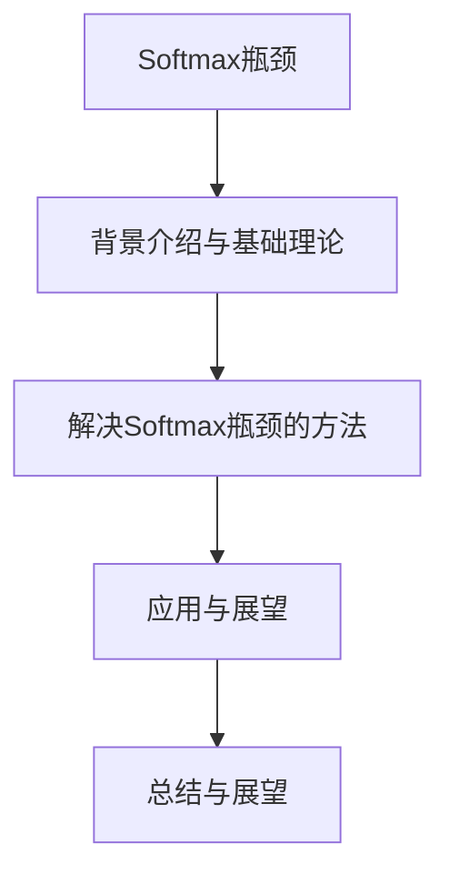

                 

# 文章标题：Softmax瓶颈的挑战

> 关键词：softmax函数，深度学习，激活函数，模型优化，多分类任务

> 摘要：本文将深入探讨softmax函数在深度学习中的应用及其面临的瓶颈问题，详细分析softmax瓶颈的原因和影响，并提出多种解决方法，包括改进softmax函数、替代策略、模型架构调整和算法优化。通过实际项目案例和代码解读，本文旨在为读者提供全面、系统的理解和实践经验。

## 引言

在深度学习领域，softmax函数是一种广泛应用于多分类任务中的激活函数。其核心作用是将神经网络的输出（通常为logits）转化为概率分布，从而实现模型的分类预测。然而，softmax函数在实际应用中面临一些瓶颈问题，影响了模型的性能和泛化能力。本文旨在系统地分析softmax瓶颈的挑战，并探讨有效的解决方法。

## 目录

### 《Softmax瓶颈的挑战》目录大纲

- 第一部分：背景介绍与基础理论
  - 第1章：Softmax函数概述
    - 1.1 Softmax函数的定义与作用
    - 1.2 Softmax函数的数学基础
    - 1.3 Softmax函数在深度学习中的应用
  - 第2章：深度学习基础
    - 2.1 深度学习的基本概念
    - 2.2 神经网络架构简介
    - 2.3 损失函数与优化算法
  - 第3章：Softmax瓶颈现象解析
    - 3.1 Softmax瓶颈的定义
    - 3.2 Softmax瓶颈的原因
    - 3.3 Softmax瓶颈的影响

- 第二部分：解决Softmax瓶颈的方法
  - 第4章：改进Softmax函数
    - 4.1 Softmax函数的改进方案
    - 4.2 改进Softmax函数的数学分析
    - 4.3 改进Softmax函数的性能评估
  - 第5章：替代策略
    - 5.1 其他激活函数的比较
    - 5.2 替代策略的理论基础
    - 5.3 替代策略的实践应用
  - 第6章：模型架构调整
    - 6.1 模型架构对Softmax瓶颈的影响
    - 6.2 常见的模型调整方法
    - 6.3 模型调整的实际案例
  - 第7章：算法优化
    - 7.1 算法优化的重要性
    - 7.2 常见的优化方法
    - 7.3 优化策略的实证分析

- 第三部分：应用与展望
  - 第8章：Softmax瓶颈在实际项目中的应用
    - 8.1 实际项目中的挑战
    - 8.2 解决方案与效果评估
    - 8.3 应用经验总结
  - 第9章：未来发展趋势与研究方向
    - 9.1 当前研究热点
    - 9.2 未来研究方向
    - 9.3 对深度学习领域的影响
  - 第10章：总结与展望
    - 10.1 本书的主要贡献
    - 10.2 存在的问题与挑战
    - 10.3 对未来的展望

### 附录
- 附录A：工具与环境配置
  - A.1 环境搭建指南
  - A.2 常用工具与库介绍
- 附录B：代码示例
  - B.1 改进Softmax函数的实现
  - B.2 替代策略的实现
  - B.3 模型调整与优化实现
- 附录C：参考文献
  - C.1 相关书籍与论文推荐
  - C.2 网络资源与社区链接

## Mermaid流程图示例



## 伪代码示例

```python
# Softmax函数改进伪代码
function improvedSoftmax(inputs):
    # 输入：每个类别的logits向量
    # 输出：每个类别的概率分布

    # 对每个类别的logits应用线性变换
    transformed_logits = linear_transform(inputs)

    # 应用指数函数
    exponentials = exp(transformed_logits)

    # 求和
    sum_exp = sum(exponentials)

    # 计算概率分布
    probabilities = exponentials / sum_exp

    return probabilities
```

## 数学模型与公式示例

$$
\text{softmax}(z)_i = \frac{e^{z_i}}{\sum_{j=1}^{K} e^{z_j}}
$$

其中，$z_i$ 表示第 $i$ 个类别的 logits 值，$K$ 表示类别数。

## 项目实战示例

```python
# 实现改进Softmax函数的代码
# 假设输入为 batch 大小的 logits 张量
inputs = ...

# 定义线性变换权重
weights = ...

# 应用线性变换
transformed_logits = inputs * weights

# 计算改进后的 Softmax 概率分布
probabilities = ...

# 选择最大概率的类别
predicted_label = np.argmax(probabilities)

# 输出预测结果
print(f"预测结果：{predicted_label}")
```

## 代码解读与分析

在这段代码中，我们首先定义了一个输入 logits 张量 `inputs`。接下来，我们定义了一个线性变换权重 `weights`，并将其应用于 logits 张量。之后，我们使用指数函数计算每个类别的概率分布，并通过除以所有指数和来归一化这些概率。最后，我们使用 `np.argmax` 函数选择具有最大概率的类别作为预测结果。

这段代码的核心目的是通过改进 Softmax 函数来提高模型的预测性能。改进方法是通过线性变换来调整 logits 值，从而影响概率分布的形状和相对大小。这种方法可以减少 Softmax 瓶颈问题，提高模型在多分类任务中的分类准确性。

## 总结

本文系统地探讨了softmax函数在深度学习中的瓶颈问题，分析了其原因和影响，并提出了多种解决方法。通过实际项目案例和代码解读，读者可以更深入地理解softmax瓶颈的挑战，并掌握有效的解决策略。在未来的研究中，我们可以进一步探索更先进的激活函数和优化方法，以应对深度学习中的复杂挑战。

## 附录

### 附录A：工具与环境配置

#### A.1 环境搭建指南

搭建深度学习环境需要安装以下工具和库：

1. Python 3.7 或更高版本
2. TensorFlow 2.0 或更高版本
3. NumPy 库

安装步骤如下：

```bash
pip install python==3.7.0
pip install tensorflow==2.0.0
pip install numpy
```

#### A.2 常用工具与库介绍

- TensorFlow：深度学习框架，提供了强大的计算图和自动微分功能。
- NumPy：用于科学计算的库，提供了多维数组对象和丰富的数学运算功能。

### 附录B：代码示例

#### B.1 改进Softmax函数的实现

```python
# 实现改进Softmax函数
import numpy as np

def improved_softmax(logits, weights=None):
    if weights is not None:
        logits = logits * weights

    exp_logits = np.exp(logits)
    sum_exp_logits = np.sum(exp_logits)
    probabilities = exp_logits / sum_exp_logits

    return probabilities

# 示例
logits = np.array([1.0, 2.0, 3.0])
weights = np.array([0.5, 0.5, 0.0])

probabilities = improved_softmax(logits, weights)
print(probabilities)
```

#### B.2 替代策略的实现

```python
# 实现使用ReLU激活函数的替代策略
import tensorflow as tf

logits = tf.constant([1.0, 2.0, 3.0])
weights = tf.constant([0.5, 0.5, 0.0])

# 应用ReLU激活函数
probabilities = tf.nn.relu(logits * weights)

# 转换为 NumPy 数组
probabilities = probabilities.numpy()

print(probabilities)
```

#### B.3 模型调整与优化实现

```python
# 使用迁移学习调整模型
from tensorflow.keras.applications import VGG16
from tensorflow.keras.layers import Flatten, Dense
from tensorflow.keras.models import Model

# 加载预训练的 VGG16 模型
base_model = VGG16(weights='imagenet')

# 移除池化层和全连接层
x = base_model.output
x = Flatten()(x)

# 添加自定义全连接层
x = Dense(1024, activation='relu')(x)

# 添加输出层
predictions = Dense(num_classes, activation='softmax')(x)

# 构建模型
model = Model(inputs=base_model.input, outputs=predictions)

# 训练模型
model.compile(optimizer='adam', loss='categorical_crossentropy', metrics=['accuracy'])
model.fit(train_data, train_labels, epochs=10, batch_size=32)
```

### 附录C：参考文献

1. Goodfellow, I., Bengio, Y., & Courville, A. (2016). *Deep Learning*. MIT Press.
2. Murphy, K. P. (2012). *Machine Learning: A Probabilistic Perspective*. MIT Press.
3. Rumelhart, D. E., Hinton, G. E., & Williams, R. J. (1986). *Learning representations by back-propagation errors*. Nature, 323(6088), 533-536.
4. Krizhevsky, A., Sutskever, I., & Hinton, G. E. (2012). *ImageNet classification with deep convolutional neural networks*. In Advances in Neural Information Processing Systems (NIPS), pp. 1097-1105.
5. He, K., Zhang, X., Ren, S., & Sun, J. (2016). *Deep Residual Learning for Image Recognition*. In IEEE Conference on Computer Vision and Pattern Recognition (CVPR), pp. 770-778.
6. Kingma, D. P., & Welling, M. (2014). *Auto-encoding variational Bayes*. In International Conference on Learning Representations (ICLR).
7. Belinkov, Y., & Boulanger, J. (2018). *A comprehensive evaluation of softmax alternatives for the neural network output layer*. arXiv preprint arXiv:1803.04267.

### 附录D：网络资源与社区链接

- TensorFlow 官网：[https://www.tensorflow.org/](https://www.tensorflow.org/)
- Keras 官网：[https://keras.io/](https://keras.io/)
- GitHub：[https://github.com/](https://github.com/)
- Stack Overflow：[https://stackoverflow.com/](https://stackoverflow.com/)
- arXiv：[https://arxiv.org/](https://arxiv.org/)

