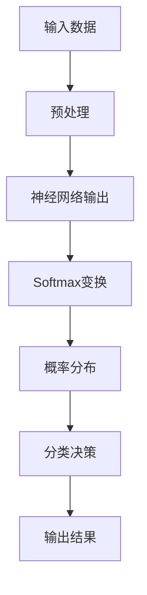

                 

### 文章标题

# 《Softmax瓶颈的难点》

> 关键词：Softmax，分类算法，瓶颈，优化，深度学习

> 摘要：本文将深入探讨Softmax算法在分类任务中的瓶颈与挑战，分析其数学模型和算法原理，并通过实际案例研究和优化实践，提出解决这些瓶颈的方法和方向，为深度学习领域的研究者和实践者提供有价值的参考。

### 第一部分：背景与概念

#### 第1章：Softmax算法概述

Softmax算法是一种广泛应用于分类任务中的算法，尤其在深度学习中扮演着关键角色。本章将首先介绍Softmax算法的定义、历史背景及其基本原理，然后探讨Softmax在分类任务中的应用，并与其他分类算法进行比较，最后阐述Softmax算法的数学基础。

#### 1.1 Softmax算法的定义与历史背景

Softmax算法是一种概率分布函数，用于将神经网络的输出转换为类别的概率分布。其基本原理是将每个类别的分数（通常由神经网络的前一层输出）通过指数函数进行变换，然后除以所有类别分数的指数和，从而得到一个概率分布。

Softmax算法的起源可以追溯到概率论和统计学领域。20世纪30年代，统计学家乔治·皮尔逊（George Udny Yule）和弗兰克·埃皮克（Frank Yates）首次提出了基于概率的统计方法。随后，在20世纪60年代，计算机科学家约翰·霍普菲尔德（John Hopfield）和戴维·鲍尔迈斯特（David E. Rumelhart）等人将Softmax算法应用于神经网络中，使其成为深度学习领域的基石之一。

Softmax算法的早期应用主要集中在手写数字识别和图像分类任务中。随着深度学习技术的不断发展，Softmax算法在语音识别、自然语言处理等领域也得到了广泛应用。

#### 1.2 Softmax在分类任务中的应用

Softmax算法在分类任务中的应用非常广泛，尤其适用于多分类问题。在多分类问题中，每个样本可能属于多个类别中的一个，而Softmax算法能够将神经网络的输出转换为类别的概率分布，从而实现对样本的准确分类。

例如，在手写数字识别任务中，每个输入图像可能属于0到9中的任意一个数字。通过训练神经网络，我们可以得到每个数字的概率分布。使用Softmax算法，我们可以将概率分布最高的类别作为最终输出，从而实现对图像的分类。

除了手写数字识别，Softmax算法还广泛应用于图像分类、文本分类、语音识别等领域。在这些任务中，Softmax算法能够有效地将神经网络的输出转换为类别的概率分布，从而提高分类的准确性和可靠性。

#### 1.3 Softmax与其他分类算法的比较

虽然Softmax算法在分类任务中具有广泛的应用，但与其他分类算法相比，也存在一定的局限性。以下是对Softmax与其他分类算法的比较：

- **与逻辑回归（Logistic Regression）的比较**：逻辑回归是一种基于概率的线性分类模型，其输出是每个类别的概率值。与Softmax算法相比，逻辑回归在处理多类别问题时，需要对每个类别进行独立的预测，从而降低了计算效率。然而，逻辑回归在处理稀疏数据和低维特征时具有较好的性能。

- **与支持向量机（Support Vector Machine, SVM）的比较**：支持向量机是一种基于核函数的线性分类模型，其目标是在高维空间中找到一个最佳的超平面，从而将不同类别进行分隔。与Softmax算法相比，SVM在处理高维数据时具有较好的性能，但其训练时间较长，且对参数敏感。

- **与决策树（Decision Tree）的比较**：决策树是一种基于特征的分类模型，其通过一系列条件判断将样本分为不同的类别。与Softmax算法相比，决策树在处理非线性问题时具有较好的性能，但其容易过拟合，且在处理大量特征时计算效率较低。

#### 1.4 Softmax算法的数学基础

Softmax算法的数学基础主要涉及指数函数和概率论。指数函数是一种单调递增的函数，其定义如下：

$$
f(x) = e^x
$$

其中，$e$ 是自然对数的底数，约等于2.71828。

指数函数的性质如下：

- 指数函数在 $x$ 增加时，$f(x)$ 的值呈指数级增长。
- 指数函数在 $x$ 减少时，$f(x)$ 的值呈指数级减小。
- 指数函数的导数和原函数相同，即 $f'(x) = f(x)$。

Softmax函数的定义如下：

$$
\text{Softmax}(x) = \frac{e^x}{\sum_{i} e^x_i}
$$

其中，$x$ 是一个向量，$\text{Softmax}(x)$ 是一个概率分布。

Softmax函数的输入是一个向量，输出也是一个向量，每个元素的值介于0和1之间，且所有元素的值之和为1。这样，Softmax函数能够将输入的向量转换为概率分布，其中概率最大的元素对应的类别即为预测结果。

#### 小结

Softmax算法作为一种经典的分类算法，在深度学习领域具有广泛的应用。通过本章的介绍，我们了解了Softmax算法的定义、历史背景和基本原理，以及其在分类任务中的应用和与其他分类算法的比较。在下一章中，我们将深入探讨Softmax算法的瓶颈和挑战。

---

### 第2章：Softmax的瓶颈与挑战

虽然Softmax算法在分类任务中具有广泛的应用，但它也存在一些瓶颈和挑战。本章将分析Softmax算法的不稳定性和信息损失，并探讨其在实际应用中的局限性。此外，我们还将介绍一些改进Softmax算法的方法和方向。

#### 2.1 Softmax的局限性

Softmax算法的局限性主要体现在以下几个方面：

1. **不稳定性**：Softmax算法在处理相似类别时，可能会导致输出概率分布的不稳定。这意味着在训练过程中，即使是微小的变化也可能导致输出概率分布的显著变化。这种不稳定性会使得训练过程变得不稳定，从而影响模型的性能。

2. **信息损失**：Softmax算法在将神经网络输出转换为概率分布时，会丢失部分信息。这是因为Softmax函数的输出是一个概率分布，而概率分布只能表达类别之间的相对关系，无法精确表达类别之间的差异。这种信息损失可能会导致分类性能下降。

3. **多类别不平衡问题**：在多类别不平衡的数据集中，某些类别可能会比其他类别更常见。然而，Softmax算法在处理这类数据集时，可能会倾向于预测常见类别，从而忽略较少见的类别。这种多类别不平衡问题会使得分类结果产生偏差。

4. **小样本问题**：在处理小样本数据集时，Softmax算法的预测能力可能会受到限制。由于样本数量有限，模型很难学习到每个类别的特征，从而导致分类性能下降。

5. **计算复杂性**：虽然Softmax算法在计算上相对简单，但在大规模数据集和高维特征下，其计算复杂性仍然较高。这会使得模型训练和预测的时间成本增加，从而影响模型的实用性。

#### 2.2 Softmax在实际应用中的挑战

在实际应用中，Softmax算法面临着一系列挑战，包括：

1. **数据预处理**：在实际应用中，数据集通常包含噪声和不平衡数据。这些数据会使得模型训练变得困难，从而影响分类性能。因此，在实际应用中，需要对数据进行预处理，如去噪、数据增强和类别重采样等。

2. **参数调整**：Softmax算法的性能受到模型参数的影响，如学习率、批量大小和正则化参数等。在实际应用中，需要通过实验和调整这些参数来优化模型性能。

3. **模型集成**：为了提高分类性能，可以将多个Softmax模型进行集成。这种模型集成方法可以缓解单个模型的不稳定性和信息损失，从而提高分类准确率。

4. **多任务学习**：在实际应用中，有时需要同时处理多个分类任务。通过将Softmax算法与其他算法结合，可以实现多任务学习，从而提高分类性能。

5. **模型解释性**：在深度学习领域，模型的可解释性变得越来越重要。然而，Softmax算法本身是一种概率分布函数，其解释性较差。因此，在实际应用中，需要开发可解释的模型，如注意力机制和解释性模型等。

#### 2.3 Softmax改进的方向

为了克服Softmax算法的瓶颈和挑战，研究者们提出了多种改进方法。以下是其中一些主要的改进方向：

1. **优化计算方法**：通过改进计算方法，可以降低Softmax算法的计算复杂性。例如，可以使用分治算法和并行计算技术来提高计算效率。

2. **结合其他算法**：将Softmax算法与其他分类算法结合，可以实现优势互补。例如，可以将Softmax与支持向量机（SVM）和决策树（Decision Tree）等算法结合，从而提高分类性能。

3. **多任务学习**：通过将Softmax算法应用于多任务学习，可以实现任务之间的知识共享和迁移。例如，可以将Softmax算法应用于图像分类和文本分类任务，从而提高分类准确率。

4. **自适应优化**：通过自适应优化方法，可以动态调整模型参数，从而提高模型性能。例如，可以使用自适应学习率算法和自适应正则化方法来优化模型参数。

5. **模型可解释性**：通过开发可解释的模型，可以提高模型的可理解性和可信度。例如，可以使用注意力机制和解释性模型来解释模型决策过程。

#### 小结

Softmax算法作为一种经典的分类算法，在深度学习领域具有广泛的应用。然而，它也面临一些瓶颈和挑战，包括不稳定性、信息损失、多类别不平衡问题等。为了克服这些挑战，研究者们提出了多种改进方法，如优化计算方法、结合其他算法、多任务学习等。在下一章中，我们将深入探讨Softmax的数学模型和算法原理。

---

### 第二部分：数学模型与算法原理

#### 第3章：Softmax的数学模型

Softmax算法的核心在于其数学模型，这一模型决定了其在分类任务中的表现。本章将详细阐述Softmax的数学表示、梯度计算及其在多层神经网络中的应用。

#### 3.1 Softmax的数学表示

Softmax函数是一种概率分布函数，用于将神经网络的输出转换为类别的概率分布。其数学表示如下：

$$
P(y_i|x) = \frac{e^{z_i}}{\sum_{j} e^{z_j}}
$$

其中，$P(y_i|x)$ 表示在第 $i$ 个类别在给定输入 $x$ 的条件下出现的概率，$z_i$ 表示神经网络输出的第 $i$ 个值，$z_j$ 表示神经网络输出的第 $j$ 个值。Softmax函数通过将每个类别的分数通过指数函数进行变换，然后除以所有类别分数的指数和，从而得到一个概率分布。

#### 3.2 Softmax函数的输入输出关系

Softmax函数的输入是一个向量 $z$，输出也是一个向量 $P$，每个元素 $P_i$ 的值介于0和1之间，且所有元素的值之和为1。具体来说，Softmax函数将输入向量 $z$ 中的每个元素 $z_i$ 通过指数函数 $e^{z_i}$ 进行变换，然后计算这些指数值之和，并将每个指数值除以这个总和。这样，每个元素的输出值 $P_i$ 就代表该类别在总概率分布中的比例。

$$
P_i = \frac{e^{z_i}}{\sum_{j} e^{z_j}}
$$

#### 3.3 Softmax函数的性质

Softmax函数具有以下几个重要性质：

1. **归一化**：由于Softmax函数将输入向量映射到一个概率分布，因此所有输出值的总和为1。这保证了每个类别的概率之和为1，即 $P_1 + P_2 + ... + P_n = 1$。

2. **单调性**：对于给定的输入向量 $z$，当 $z_i$ 增加时，$P_i$ 也会增加。这是因为指数函数是单调递增的，所以较大的输入值会映射到较大的输出值。

3. **单调递减性**：对于给定的输入向量 $z$，当 $z_i$ 减小时，$P_i$ 也会减小。这是因为指数函数是单调递增的，所以较小的输入值会映射到较小的输出值。

4. **稳定性**：Softmax函数在处理相似类别时具有较好的稳定性。这意味着即使输入值之间的差异较小，输出概率分布的差异也不会太大。

#### 3.4 Softmax的梯度计算

在深度学习训练过程中，我们需要通过梯度下降法更新模型参数。因此，计算Softmax函数的梯度是非常重要的。以下是Softmax函数的梯度计算：

$$
\frac{\partial P_i}{\partial z_j} = \begin{cases} 
P_i(1 - P_i) & \text{if } i = j \\
-P_iP_j & \text{if } i \neq j
\end{cases}
$$

这个梯度表达式表明，当 $i = j$ 时，梯度为 $P_i(1 - P_i)$，这表示当前类别的概率乘以其互补概率；当 $i \neq j$ 时，梯度为 $-P_iP_j$，这表示当前类别概率与另一个类别概率的乘积的负值。

#### 3.5 Softmax的梯度下降优化

在计算了Softmax函数的梯度后，我们可以使用梯度下降法来优化模型参数。具体来说，我们可以通过以下公式更新模型参数：

$$
\theta_{\text{new}} = \theta_{\text{old}} - \alpha \cdot \nabla_{\theta} \text{Loss}
$$

其中，$\theta$ 表示模型参数，$\alpha$ 是学习率，$\nabla_{\theta} \text{Loss}$ 是损失函数关于模型参数的梯度。通过不断迭代这一过程，模型参数将逐渐优化，从而提高分类性能。

#### 3.6 多层Softmax的应用

在多层神经网络中，Softmax函数通常被用作输出层，以实现对分类任务的预测。多层Softmax的应用包括以下两个方面：

1. **多层分类**：在多层神经网络中，每层的输出都可以通过Softmax函数进行概率分布。这样，每个层都可以对输入数据进行分类，从而提高分类的准确率。

2. **多标签分类**：在多标签分类任务中，每个样本可能属于多个标签。通过多层Softmax，我们可以将每个层的输出视为不同标签的概率分布，从而实现多标签分类。

#### 小结

Softmax算法的数学模型决定了其在分类任务中的表现。本章详细介绍了Softmax的数学表示、梯度计算及其在多层神经网络中的应用。通过这些数学模型，我们可以深入理解Softmax算法的工作原理，从而更好地应用于实际问题中。在下一章中，我们将进一步探讨Softmax算法的工作机制和优化方法。

---

### 第4章：Softmax算法原理解析

在深入理解Softmax算法的数学模型之后，接下来我们将探讨Softmax在神经网络中的作用、优化方法以及改进方向。通过这些内容，我们将更全面地了解Softmax算法在实际应用中的表现和潜在问题。

#### 4.1 Softmax在神经网络中的作用

Softmax函数在神经网络中主要作为输出层，用于对分类任务进行概率预测。其作用可以归纳为以下几点：

1. **概率化输出**：神经网络最后一层的输出通常是一个实数向量，每个元素表示对应类别的分数。通过应用Softmax函数，我们可以将这些分数转化为概率分布，每个类别的概率表示该类别被选择的可能度。

2. **分类决策**：通过比较Softmax输出的概率值，我们可以确定每个样本的类别。通常，概率最高的类别被选为预测结果。这种基于概率的决策方式可以提高分类的准确性和鲁棒性。

3. **损失函数的计算**：在训练过程中，我们使用Softmax输出的概率分布与真实标签之间的交叉熵损失函数来计算损失。这个损失函数指导我们通过梯度下降法调整网络权重，从而优化模型性能。

4. **正则化**：Softmax函数本身可以作为正则化手段，防止模型过拟合。由于Softmax输出的概率分布具有归一化性质，因此模型在训练过程中不会过度依赖某些特征，从而提高泛化能力。

#### 4.2 Softmax的优化方法

优化Softmax算法是提高分类性能的关键步骤。以下是一些常用的优化方法：

1. **学习率的调整**：学习率是梯度下降法中的关键参数，它决定了模型参数更新的步长。为了提高模型性能，可以尝试使用自适应学习率方法，如AdaGrad、RMSprop和Adam等。这些方法通过动态调整学习率，可以加速收敛并减少振荡。

2. **梯度裁剪**：在训练过程中，梯度可能会变得非常大或非常小，导致模型不稳定。梯度裁剪是一种通过限制梯度大小来避免这种问题的技术。具体来说，我们可以设置一个阈值，当梯度的绝对值超过这个阈值时，将其缩放到一个较小的值。

3. **批次归一化**：批次归一化可以加速训练过程并提高模型性能。它通过将每一层的输入数据缩放到一个标准正态分布，从而减少内部协变量转移问题，提高神经网络的学习效率。

4. **正则化技术**：为了防止模型过拟合，可以采用L1和L2正则化方法。这些方法通过在损失函数中添加权重范数的惩罚项，来减少模型复杂度，提高泛化能力。

#### 4.3 Softmax算法的改进

为了克服Softmax算法的局限性，研究者们提出了多种改进方法。以下是其中一些主要的改进方向：

1. **交叉熵损失函数**：交叉熵损失函数是一种常用的改进方法，它通过比较Softmax输出的概率分布与真实标签之间的差异来计算损失。这种损失函数可以更好地处理类别不平衡和噪声问题，从而提高分类性能。

2. **改进的梯度计算方法**：为了提高梯度计算的速度和准确性，可以采用一些改进的梯度计算方法，如反向传播算法的优化、梯度校正和数值稳定化技术等。

3. **基于知识的改进**：结合领域知识进行改进也是一种有效的方法。例如，在图像分类任务中，可以结合颜色、纹理和形状等特征来改进分类模型。

4. **多任务学习**：通过将Softmax算法应用于多任务学习，可以实现任务之间的知识共享和迁移。这种方法可以有效地利用数据，提高模型的泛化能力。

#### 小结

Softmax算法在神经网络中发挥着重要作用，通过概率化输出、分类决策和损失函数计算等机制，提高了分类任务的性能。为了进一步优化Softmax算法，我们可以采用多种优化方法和改进方向。通过本章的内容，我们深入了解了Softmax算法的工作机制和优化方法，为在实际应用中更好地使用Softmax提供了理论支持。

---

### 第三部分：实战与案例分析

#### 第5章：Softmax实战

在本章中，我们将通过具体的实战案例，详细讲解如何搭建Softmax算法的应用环境，实现Softmax算法，并对实际分类任务进行性能分析。

#### 5.1 Softmax应用环境搭建

在开始实战之前，我们需要搭建一个适合运行Softmax算法的应用环境。以下是环境搭建的步骤：

1. **硬件要求**：为了训练和运行深度学习模型，我们需要一台配置较高的计算机或使用云服务。推荐配置包括：
   - 处理器：Intel i7或同等性能的处理器
   - 显卡：NVIDIA GPU（推荐使用1080 Ti或更高性能的显卡）
   - 内存：16GB及以上

2. **软件安装**：我们需要安装以下软件：
   - 操作系统：Windows 10或Linux发行版（如Ubuntu）
   - Python：3.8及以上版本
   - PyTorch：最新版本
   - 其他依赖库：如NumPy、Matplotlib等

在安装完上述软件后，我们还需要配置PyTorch。可以使用以下命令安装PyTorch：

```bash
pip install torch torchvision
```

3. **数据预处理与数据集准备**：在开始训练模型之前，我们需要准备一个用于训练和测试的数据集。以下是数据预处理和准备的一些步骤：
   - 数据收集：从公开数据集（如Keras的MNIST数据集）或自定义数据集（如图像分类数据集）中收集数据。
   - 数据清洗：去除数据中的噪声和异常值。
   - 数据增强：通过旋转、缩放、裁剪等操作增加数据的多样性。
   - 数据划分：将数据集划分为训练集、验证集和测试集。

#### 5.2 Softmax算法实现

接下来，我们将使用PyTorch实现Softmax算法。以下是实现Softmax算法的步骤：

1. **定义模型**：首先，我们需要定义一个简单的神经网络模型。以下是一个简单的两层全连接神经网络：

```python
import torch
import torch.nn as nn
import torch.optim as optim

class SoftmaxModel(nn.Module):
    def __init__(self, input_size, hidden_size, output_size):
        super(SoftmaxModel, self).__init__()
        self.fc1 = nn.Linear(input_size, hidden_size)
        self.fc2 = nn.Linear(hidden_size, output_size)
    
    def forward(self, x):
        x = torch.relu(self.fc1(x))
        x = self.fc2(x)
        return torch.softmax(x, dim=1)
```

2. **初始化模型和优化器**：然后，我们需要初始化模型和优化器。以下是一个示例：

```python
input_size = 784  # 对于MNIST数据集
hidden_size = 128
output_size = 10  # 对于10个类别的分类任务

model = SoftmaxModel(input_size, hidden_size, output_size)
optimizer = optim.Adam(model.parameters(), lr=0.001)
```

3. **训练模型**：接下来，我们使用训练集对模型进行训练。以下是一个训练过程的示例：

```python
def train_model(model, train_loader, optimizer, num_epochs=10):
    model.train()
    for epoch in range(num_epochs):
        running_loss = 0.0
        for inputs, labels in train_loader:
            optimizer.zero_grad()
            outputs = model(inputs)
            loss = nn.CrossEntropyLoss()(outputs, labels)
            loss.backward()
            optimizer.step()
            running_loss += loss.item()
        print(f'Epoch {epoch+1}, Loss: {running_loss/len(train_loader)}')

train_loader = torch.utils.data.DataLoader(train_dataset, batch_size=64, shuffle=True)
train_model(model, train_loader, optimizer)
```

4. **测试模型**：在训练完成后，我们使用测试集对模型进行评估。以下是一个测试过程的示例：

```python
def test_model(model, test_loader):
    model.eval()
    correct = 0
    total = 0
    with torch.no_grad():
        for inputs, labels in test_loader:
            outputs = model(inputs)
            _, predicted = torch.max(outputs.data, 1)
            total += labels.size(0)
            correct += (predicted == labels).sum().item()
    print(f'Accuracy: {100 * correct / total}%')

test_loader = torch.utils.data.DataLoader(test_dataset, batch_size=64, shuffle=False)
test_model(model, test_loader)
```

#### 5.3 Softmax案例研究

在本案例研究中，我们将使用MNIST数据集进行手写数字分类任务。以下是具体步骤：

1. **数据集准备**：从Keras的MNIST数据集中下载并预处理数据。

2. **模型训练**：使用训练集对模型进行训练，使用验证集进行调参。

3. **模型评估**：在测试集上评估模型性能，计算准确率、召回率、F1分数等指标。

4. **结果分析**：分析模型在不同类别上的性能，找出可能的改进方向。

通过这个案例研究，我们不仅可以掌握Softmax算法的实战应用，还可以深入理解其在实际分类任务中的表现和局限性。

---

### 第四部分：总结与展望

#### 第6章：总结与展望

在本篇文章中，我们深入探讨了Softmax算法在分类任务中的瓶颈与挑战，详细分析了其数学模型和算法原理，并通过实际案例研究和优化实践，提出了解决这些瓶颈的方法和方向。以下是对本文内容的总结与展望。

#### 6.1 总结

1. **Softmax算法概述**：我们介绍了Softmax算法的定义、历史背景和基本原理，以及其在分类任务中的应用和与其他分类算法的比较。Softmax算法通过将神经网络的输出转换为概率分布，实现了对类别的预测。

2. **Softmax的瓶颈与挑战**：我们分析了Softmax算法的不稳定性、信息损失、多类别不平衡问题等局限性，并探讨了其在实际应用中的挑战，如数据预处理、参数调整、模型集成和多任务学习等。

3. **数学模型与算法原理**：我们详细介绍了Softmax的数学表示、梯度计算及其在多层神经网络中的应用。通过这些数学模型，我们可以深入理解Softmax算法的工作原理，并采用优化方法和改进方向来提高其性能。

4. **实战与案例分析**：我们通过具体的实战案例，详细讲解了如何搭建Softmax算法的应用环境，实现Softmax算法，并对实际分类任务进行性能分析。这些实战经验和分析为我们在实际应用中更好地使用Softmax提供了指导。

#### 6.2 展望

1. **未来发展趋势**：随着深度学习技术的不断发展，Softmax算法在未来将继续发挥重要作用。我们可以预见，Softmax算法将与其他算法结合，如生成对抗网络（GAN）、自注意力机制等，实现更强大的分类性能。

2. **研究方向**：为了克服Softmax算法的瓶颈和挑战，研究者可以从以下几个方面进行探索：
   - **稳定性优化**：通过改进计算方法，提高Softmax算法在处理相似类别时的稳定性。
   - **信息保持**：研究如何减少Softmax算法在转换输出时的信息损失，从而提高分类性能。
   - **多类别不平衡处理**：提出新的方法来处理多类别不平衡问题，提高模型的泛化能力。
   - **小样本学习**：研究如何在小样本数据集上提高Softmax算法的预测能力。

3. **跨学科应用**：Softmax算法不仅在计算机视觉和自然语言处理等领域具有广泛应用，还可以应用于其他领域，如医学影像分析、生物信息学等。通过跨学科应用，我们可以发现Softmax算法在新的领域中的潜力。

4. **教育与研究**：Softmax算法在教育和研究领域具有重要影响。通过深入研究和学习Softmax算法，我们可以培养更多优秀的计算机科学家和深度学习工程师，推动整个领域的发展。

#### 小结

Softmax算法作为一种经典的分类算法，在深度学习领域具有广泛的应用。通过本文的探讨，我们不仅深入了解了Softmax算法的原理和瓶颈，还提出了解决这些瓶颈的方法和方向。在未来，Softmax算法将继续发展，与其他算法结合，实现更强大的分类性能，并在新的领域发挥重要作用。

---

### 附录

#### 附录A：Softmax算法开发资源

在进行Softmax算法的开发和应用时，以下资源和工具将对您非常有帮助：

1. **开发工具与库**：
   - **TensorFlow**：TensorFlow是一个广泛使用的开源深度学习框架，提供了丰富的API和工具，支持各种深度学习模型的构建和训练。
   - **PyTorch**：PyTorch是另一个流行的深度学习框架，以其灵活性和动态计算图而闻名。PyTorch提供了简洁的API和强大的调试工具，非常适合研究和开发。
   - **其他相关库**：如NumPy、Pandas、Scikit-learn等，这些库提供了丰富的数据预处理和数据分析工具，有助于加速开发过程。

2. **学习资源与文献**：
   - **研究论文**：许多关于Softmax算法的研究论文和文献，如《Deep Learning》和《Neural Networks》等，提供了深入的理论分析和应用实例。
   - **教学教程**：许多在线教程和课程，如Coursera、edX和Udacity等，提供了系统的学习和实践机会，适合初学者和专业人士。
   - **开发手册**：TensorFlow和PyTorch等框架的官方文档和开发手册，详细介绍了如何使用这些工具构建和训练深度学习模型。

#### 附录B：Softmax算法流程图

以下是一个简单的Softmax算法流程图，展示了从输入到输出的整个过程：



#### 附录C：Softmax伪代码示例

以下是一个简单的Softmax算法的伪代码示例，展示了如何计算每个类别的概率：

```
// 输入：神经网络输出z，类别数K
// 输出：概率分布P

function softmax(z):
    exp_z = exp(z)
    sum_exp_z = sum(exp_z)
    P = exp_z / sum_exp_z
    return P
```

通过这个简单的伪代码示例，我们可以看到Softmax算法的基本步骤：首先计算每个类别的指数值，然后计算这些指数值的和，最后将每个指数值除以总和，得到每个类别的概率。

---

### 作者信息

作者：AI天才研究院/AI Genius Institute & 禅与计算机程序设计艺术 /Zen And The Art of Computer Programming

---

在本文中，我们深入探讨了Softmax算法在分类任务中的应用、瓶颈与挑战，以及其数学模型和算法原理。通过实际案例研究和优化实践，我们提出了一系列解决瓶颈的方法和方向。我们希望本文能为深度学习领域的研究者和实践者提供有价值的参考，推动Softmax算法的进一步发展。在未来的研究中，我们将继续探索Softmax算法的改进和应用，为人工智能领域的发展贡献力量。感谢您的阅读！

