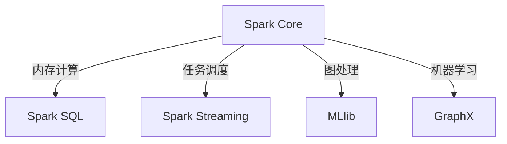
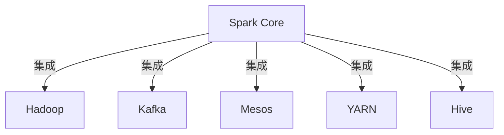
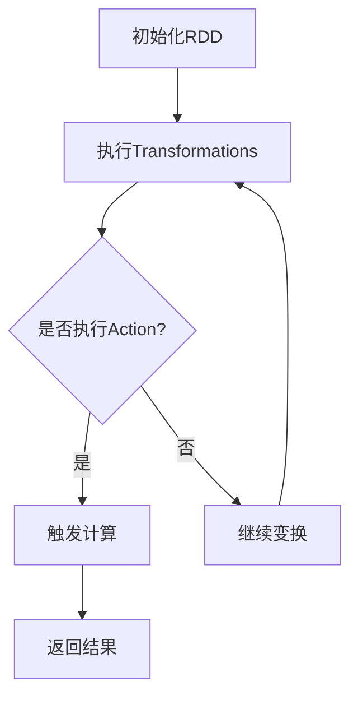
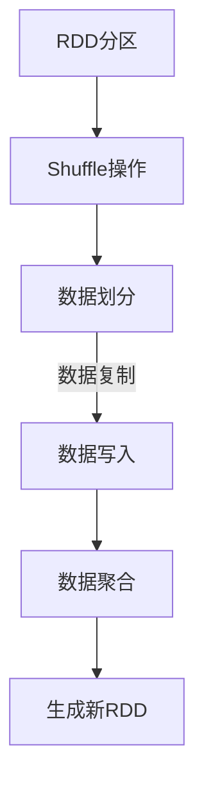
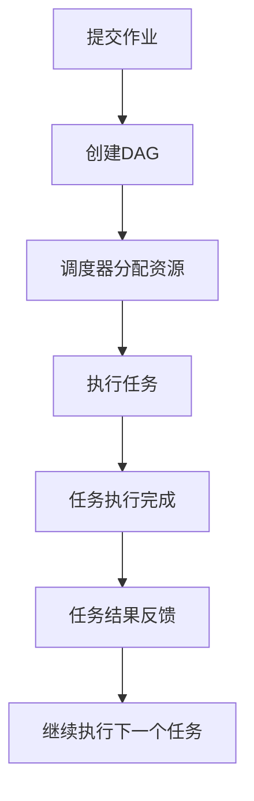

                 

### 文章标题：Spark原理与代码实例讲解

#### 关键词：Spark，分布式计算，大数据处理，弹性分布式数据集（RDD），内存管理，调度与资源管理，项目实战

#### 摘要：
本文将深入探讨Apache Spark的核心原理及其在实际项目中的应用。我们将从Spark的简介、核心架构、编程模型，到核心算法原理，再到具体的实战项目，进行详细讲解。文章将使用逻辑清晰、结构紧凑、简单易懂的专业技术语言，帮助读者全面理解Spark的工作机制及其应用场景。通过本文，读者不仅可以掌握Spark的基本知识，还能通过实际代码实例，深入理解Spark的各个核心组件和算法。

### 《Spark原理与代码实例讲解》目录大纲

#### 第一部分：Spark基础理论

#### 第1章：Spark简介

- **1.1 Spark发展历程**
- **1.2 Spark核心架构**
- **1.3 Spark生态体系**
- **1.4 Spark应用场景**

#### 第2章：Spark编程模型

- **2.1 分布式数据集（DataFrame和Dataset）**
- **2.2 Transformations与Actions**
- **2.3 Spark SQL**
- **2.4 Spark Streaming**

#### 第二部分：Spark核心算法原理

#### 第3章：RDD（弹性分布式数据集）

- **3.1 RDD基本概念**
- **3.2 RDD的创建、转换与行动**
- **3.3 RDD分区与调度**

#### 第4章：Shuffle与排序

- **4.1 Shuffle原理**
- **4.2 Shuffle优化**
- **4.3 排序算法与优化**

#### 第5章：内存管理

- **5.1 内存架构**
- **5.2 内存溢出与内存调优**
- **5.3 Tungsten优化**

#### 第6章：Spark调度与资源管理

- **6.1 任务调度原理**
- **6.2 资源分配策略**
- **6.3 动态资源调度**

#### 第三部分：Spark项目实战

#### 第7章：Spark在日志处理中的应用

- **7.1 日志处理流程**
- **7.2 日志数据格式与解析**
- **7.3 代码实现与性能优化**

#### 第8章：Spark在机器学习中的应用

- **8.1 机器学习算法简介**
- **8.2 Spark MLlib基础**
- **8.3 代码实现与调优**

#### 第9章：Spark在图处理中的应用

- **9.1 图算法简介**
- **9.2 GraphX基础**
- **9.3 代码实现与性能优化**

#### 第10章：Spark生态系统与扩展

- **10.1 Spark与Hadoop生态融合**
- **10.2 Spark与Kafka集成**
- **10.3 Spark与YARN调度系统**

#### 附录

- **附录A：Spark开发工具与环境配置**
  - **A.1 IDE配置**
  - **A.2 Maven配置**
  - **A.3 Spark版本选择与安装**

- **附录B：核心算法原理与架构 Mermaid 流程图**
  - **B.1 RDD转换与行动流程图**
  - **B.2 Shuffle过程流程图**
  - **B.3 Spark调度系统流程图**

- **附录C：核心算法原理与数学模型**
  - **C.1 RDD分区与调度模型**
  - **C.2 Shuffle算法与优化**
  - **C.3 内存管理模型**

- **附录D：项目实战代码与分析**
  - **D.1 日志处理项目代码实现**
  - **D.2 机器学习项目代码实现**
  - **D.3 图处理项目代码实现**

通过上述大纲结构，读者可以循序渐进地掌握Spark的核心原理和应用方法。接下来，我们将逐步深入每一个章节，详细讲解Spark的各个重要方面。

#### 第一部分：Spark基础理论

##### 第1章：Spark简介

Apache Spark 是一个开源的分布式计算系统，专为大数据处理而设计。它提供了高性能、易用的API，可以运行在Hadoop集群上，实现大规模数据处理和分析。Spark 的核心优势在于其内存计算和弹性分布式数据集（RDD）模型，这使得它在处理大规模数据集时具有显著的性能优势。

###### 1.1 Spark发展历程

Spark 的起源可以追溯到2009年，当时加州大学伯克利分校的AMP Lab（Algorithms, Machines, and People Laboratory）开发了一种名为“Spark”的分布式计算框架。最初，Spark是为了解决MapReduce在大数据处理中的性能瓶颈问题而设计的。2010年，Spark的首个版本发布，并迅速获得了学术界和工业界的关注。

2013年，Spark正式成为Apache软件基金会的孵化项目，2014年成为Apache顶级项目。随着时间的推移，Spark的功能不断完善，逐渐发展成为一个强大的分布式计算生态系统，包括Spark Core、Spark SQL、Spark Streaming和GraphX等组件。

###### 1.2 Spark核心架构

Spark 的核心架构包括多个关键组件，每个组件都在分布式计算过程中扮演着重要角色：

- **Spark Core**：提供内存计算和任务调度等核心功能，是Spark其他组件的基础。
- **Spark SQL**：提供Spark中的结构化数据操作，可以与关系数据库进行交互，支持SQL查询和DataFrame API。
- **Spark Streaming**：提供实时数据处理能力，能够处理流式数据，并实现实时数据分析和处理。
- **MLlib**：提供一系列机器学习算法和工具，包括分类、回归、聚类等。
- **GraphX**：提供图处理能力，可以处理大规模图数据，实现图计算和分析。

Spark 的核心架构示意图如下：



###### 1.3 Spark生态体系

Spark 不仅仅是一个强大的分布式计算框架，还形成了一个庞大的生态体系。Spark 生态中的主要组件包括：

- **Hadoop**：Spark 可以与Hadoop生态系统无缝集成，充分利用Hadoop的分布式存储和计算能力。
- **Kafka**：Spark Streaming 可以直接从Kafka消费流式数据，实现实时数据分析和处理。
- **Mesos**：Spark 可以运行在Mesos集群管理框架上，与其他应用资源进行高效共享。
- **YARN**：Spark 可以运行在YARN资源管理器上，充分利用YARN的调度能力和资源管理功能。
- **Hive**：Spark SQL 可以与Hive集成，支持Hive表的查询操作。

Spark 生态体系示意图如下：



###### 1.4 Spark应用场景

Spark 在各种应用场景中都展现出了强大的性能和灵活性，以下是一些常见的应用场景：

- **数据仓库**：Spark SQL 提供了高效的SQL查询功能，可以与Hive、Presto等数据仓库工具集成，实现大规模数据查询和分析。
- **机器学习**：MLlib 提供了一系列机器学习算法，适用于大规模数据的分析和预测。
- **流式计算**：Spark Streaming 实现了实时数据流处理，可以应用于实时监控、数据分析等场景。
- **日志处理**：Spark 适合处理大量日志数据，可以快速实现日志数据的收集、解析和分析。
- **图计算**：GraphX 提供了强大的图处理能力，可以应用于社交网络分析、推荐系统等。

通过上述介绍，我们可以看到Spark作为一个分布式计算框架，在数据处理和分析方面具有广泛的应用场景和强大的功能。接下来，我们将继续深入探讨Spark的编程模型，帮助读者更好地理解和应用Spark。

### 第2章：Spark编程模型

Spark的编程模型是其核心优势之一，提供了高度抽象的API，使得分布式数据处理变得更加简单和高效。Spark支持多种编程语言，其中最常用的包括Scala、Python和Java。本章将详细讲解Spark编程模型中的关键概念，包括分布式数据集（DataFrame和Dataset）、Transformations与Actions、Spark SQL和Spark Streaming。

#### 2.1 分布式数据集（DataFrame和Dataset）

分布式数据集是Spark编程模型的核心抽象，用于表示分布式的数据结构。Spark提供了两种分布式数据集：DataFrame和Dataset。

- **DataFrame**：DataFrame是结构化的分布式数据集，类似于关系数据库中的表。它包含了固定数量的列，每列有一个数据类型。DataFrame提供了类似SQL的API，可以执行各种数据操作，如筛选、排序、连接等。
- **Dataset**：Dataset是DataFrame的增强版本，提供了强类型支持。这意味着在创建Dataset时，Spark会进行类型检查，确保数据类型的一致性，从而提高程序的健壮性和性能。

DataFrame和Dataset的主要区别在于类型安全性和性能。Dataset通过类型安全可以减少运行时的错误，并且可以更好地优化执行计划。

##### DataFrame

DataFrame API 提供了多种数据操作方法，包括：

- **创建**：可以使用SparkSession的read方法读取外部数据源，如CSV、JSON、HDFS等。
- **Transformations**：可以进行各种数据转换操作，如筛选、排序、聚合、分组等。
- **Actions**：触发计算并返回结果，如count、collect、show等。

示例代码：

```python
from pyspark.sql import SparkSession

# 创建SparkSession
spark = SparkSession.builder.appName("DataFrameExample").getOrCreate()

# 从CSV文件创建DataFrame
df = spark.read.csv("data.csv", header=True)

# 数据转换操作
df_filtered = df.filter(df["age"] > 30)

# 显示结果
df_filtered.show()
```

##### Dataset

Dataset API与DataFrame类似，但提供了强类型支持。在使用Dataset时，我们需要指定数据类型。

示例代码：

```scala
import org.apache.spark.sql.SparkSession
import org.apache.spark.sql.Dataset

// 创建SparkSession
val spark = SparkSession.builder.appName("DatasetExample").getOrCreate()

// 创建Dataset
val dataset = spark.read.option("header", "true").csv("data.csv").as[Person]

// 数据转换操作
val dataset_filtered = dataset.filter($"age" > 30)

// 显示结果
dataset_filtered.show()
```

#### 2.2 Transformations与Actions

在Spark编程模型中，Transformations和Actions是两个核心概念。

- **Transformations**（转换）：代表惰性操作，即当定义一个转换时，并不会立即执行计算，而是生成一个可以表示新数据集的转换操作序列。当执行Action时，所有之前的转换操作才会一起执行。
- **Actions**（行动）：触发执行并返回结果的计算。例如，调用collect或count等方法就会触发计算，并将结果返回给用户。

常见Transformations包括：

- **filter**：筛选数据行。
- **map**：将每个元素映射到新值。
- **groupBy**：按照指定列分组数据。
- **groupByWindow**：在窗口中分组数据。

常见Actions包括：

- **collect**：收集数据集的所有元素到Driver节点。
- **count**：计算数据集中的元素数量。
- **show**：显示数据集的前n行。

示例代码：

```python
from pyspark.sql import SparkSession

# 创建SparkSession
spark = SparkSession.builder.appName("TransformationActionExample").getOrCreate()

# 创建DataFrame
df = spark.read.csv("data.csv", header=True)

# 应用Transformations
df_filtered = df.filter(df["age"] > 30)
df_mapped = df_filtered.map(lambda x: (x["name"], x["age"]))

# 应用Actions
df_filtered_count = df_filtered.count()
df_mapped_collected = df_mapped.collect()

# 显示结果
print(f"Filtered Count: {df_filtered_count}")
print(df_mapped_collected)
```

#### 2.3 Spark SQL

Spark SQL 是 Spark 的一个组件，提供了结构化数据的处理能力。Spark SQL 支持多种数据源，包括Hive、Parquet、ORC等，并支持SQL查询以及DataFrame和Dataset API。

Spark SQL 的优势在于其高性能和易用性，可以与传统的SQL数据库无缝集成。以下是一些关键特性：

- **跨数据源查询**：可以在不同数据源之间执行查询，如HDFS、Hive、Parquet等。
- **优化器**：Spark SQL 使用了Catalyst优化器，可以自动进行查询优化。
- **兼容性**：Spark SQL 提供了与Apache Hive兼容的接口，使得现有的Hive查询可以在Spark SQL中执行。

示例代码：

```python
from pyspark.sql import SparkSession

# 创建SparkSession
spark = SparkSession.builder.appName("SparkSQLExample").getOrCreate()

# 创建DataFrame
df = spark.read.csv("data.csv", header=True)

# 注册DataFrame为临时表
df.createOrReplaceTempView("people")

# 执行SQL查询
sql_df = spark.sql("SELECT * FROM people WHERE age > 30")

# 显示结果
sql_df.show()
```

#### 2.4 Spark Streaming

Spark Streaming 是 Spark 的一个组件，用于处理实时数据流。Spark Streaming 可以从各种数据源接收数据流，如Kafka、Flume、Kinesis等，并处理这些流式数据。

Spark Streaming 的关键特性包括：

- **低延迟**：Spark Streaming 可以在毫秒级别处理数据流，适用于实时监控和分析。
- **容错性**：Spark Streaming 提供了流处理任务的容错机制，可以在数据流处理过程中自动恢复。
- **动态扩展**：可以根据流处理任务的需求动态调整资源。

示例代码：

```python
from pyspark.sql import SparkSession
from pyspark.streaming import StreamingContext

# 创建SparkSession和StreamingContext
spark = SparkSession.builder.appName("SparkStreamingExample").getOrCreate()
ssc = StreamingContext(spark.sparkContext, 1)

# 从Kafka接收数据流
stream = ssc.socketTextStream("localhost", 9999)

# 数据处理
lines = stream.flatMap(lambda line: line.split(" "))
words = lines.map(lambda word: (word, 1))
word_counts = words.reduceByKey(lambda x, y: x + y)

# 输出结果
word_counts.print()

# 启动流处理任务
ssc.start()
ssc.awaitTermination()
```

通过上述内容，我们可以看到Spark的编程模型如何简化分布式数据处理，使得开发者能够高效地处理大规模数据。接下来，我们将深入探讨Spark的核心算法原理，包括RDD、Shuffle和内存管理，帮助读者进一步理解Spark的工作机制。

### 第二部分：Spark核心算法原理

Spark的核心算法原理是其高效处理大规模数据集的关键。本部分将重点介绍RDD（弹性分布式数据集）、Shuffle与排序、内存管理以及Spark调度与资源管理。

#### 第3章：RDD（弹性分布式数据集）

RDD是Spark的核心数据结构，类似于一个分布式集合。它提供了一种弹性分布式数据集的抽象，使得Spark能够高效地处理大规模数据。

##### 3.1 RDD基本概念

- **定义**：RDD（Resilient Distributed Dataset）是一种可分区、可并行操作的分布式数据集。它可以存储在内存或磁盘上，并具有容错性。
- **特性**：
  - **分布式**：RDD被划分为多个分区，每个分区可以独立处理，适用于并行计算。
  - **弹性**：RDD可以在内存与磁盘之间动态切换，以适应不同的数据规模。
  - **容错性**：RDD中的分区可以被重新计算，以保证数据的一致性和可靠性。

##### 3.2 RDD的创建、转换与行动

- **创建**：可以通过多种方式创建RDD，包括从文件、序列化Java对象、Scala集合等。
- **转换**：通过一系列转换操作，如map、filter、flatMap等，可以生成新的RDD。
- **行动**：触发计算并返回结果，如collect、count、saveAsTextFile等。

示例代码：

```python
from pyspark import SparkContext

# 创建SparkContext
sc = SparkContext("local[*]", "RDDExample")

# 从文件创建RDD
lines_rdd = sc.textFile("data.txt")

# RDD转换操作
lines_rdd_mapped = lines_rdd.flatMap(lambda line: line.split(" "))

# RDD行动操作
words_count = lines_rdd_mapped.count()

print(f"Total words: {words_count}")

# 关闭SparkContext
sc.stop()
```

##### 3.3 RDD分区与调度

- **分区**：RDD被划分为多个分区，每个分区可以独立处理。分区的数量决定了并行度。
- **调度**：Spark的调度器负责任务的调度与执行，可以根据RDD的依赖关系和资源状况进行优化。

示例代码：

```python
from pyspark import SparkContext

# 创建SparkContext
sc = SparkContext("local[*]", "RDDPartitionExample")

# 创建一个具有3个分区的RDD
nums_rdd = sc.parallelize([1, 2, 3, 4, 5, 6], 3)

# 查看每个分区的数据
for partition_id, partition_data in nums_rdd.partitions().zip(nums_rdd.partitions()):
    print(f"Partition {partition_id}: {partition_data.collect()}")

# 关闭SparkContext
sc.stop()
```

#### 第4章：Shuffle与排序

Shuffle是Spark进行分布式数据处理时的一项重要操作，它用于在多个分区之间交换数据。Shuffle的质量直接影响到Spark的性能。

##### 4.1 Shuffle原理

- **数据交换**：Shuffle将数据从源分区重新分配到目标分区，实现跨分区操作。
- **数据分区**：数据根据目标分区进行分区，确保每个分区包含目标数据。

##### 4.2 Shuffle优化

- **减小Shuffle数据大小**：通过压缩、序列化等方式减小Shuffle数据的大小，降低网络传输压力。
- **优化数据分区策略**：根据数据特性选择合适的分区策略，如基于哈希或范围分区，以减少数据倾斜。

##### 4.3 排序算法与优化

- **外部排序**：Spark使用外部排序算法对数据集进行排序，通常采用多路合并排序。
- **内存优化**：通过控制内存使用，优化排序性能。

示例代码：

```python
from pyspark import SparkContext

# 创建SparkContext
sc = SparkContext("local[*]", "ShuffleExample")

# 创建一个包含大数字的RDD
nums_rdd = sc.parallelize(range(10000), 4)

# 使用Shuffle和排序操作
sorted_rdd = nums_rdd.sortBy(lambda x: x)

# 显示排序后的数据
print(sorted_rdd.collect())

# 关闭SparkContext
sc.stop()
```

#### 第5章：内存管理

内存管理是Spark高效处理数据的关键之一。Spark通过精细的内存管理，实现了高效的内存利用和数据处理。

##### 5.1 内存架构

- **存储层次**：Spark内存分为多个层次，包括堆外内存、堆内内存等。
- **存储策略**：Spark采用Tungsten内存优化架构，通过内存层级和缓存策略提高内存利用率。

##### 5.2 内存溢出与内存调优

- **内存溢出**：内存溢出通常由于内存不足或内存管理不当导致。
- **内存调优**：通过调整内存配置、优化数据结构等方式，提高内存利用率，避免内存溢出。

##### 5.3 Tungsten优化

- **Tungsten**：Tungsten是Spark的内存优化架构，通过减少内存拷贝和垃圾回收时间，提高数据处理性能。

示例代码：

```python
from pyspark import SparkContext

# 创建SparkContext
sc = SparkContext("local[*]", "MemoryExample")

# 创建一个大数据RDD
nums_rdd = sc.parallelize(range(1000000), 4)

# 使用Tungsten内存优化
sorted_rdd = nums_rdd.sortBy(lambda x: x, True)

# 显示排序后的数据
print(sorted_rdd.collect())

# 关闭SparkContext
sc.stop()
```

#### 第6章：Spark调度与资源管理

Spark调度与资源管理是其高效处理大规模数据集的重要保障。Spark通过灵活的调度机制和资源管理策略，实现了高效的资源利用和任务调度。

##### 6.1 任务调度原理

- **调度器**：Spark调度器负责任务的调度与执行，根据依赖关系和资源状况进行优化。
- **调度算法**：Spark采用基于延迟调度和优先级调度等算法，保证任务的高效执行。

##### 6.2 资源分配策略

- **静态资源分配**：预先分配资源，适用于负载稳定的情况。
- **动态资源分配**：根据任务需求动态调整资源，适用于负载波动较大的情况。

##### 6.3 动态资源调度

- **动态资源调度**：Spark可以动态调整任务所需的资源，以适应负载变化，提高资源利用率。

示例代码：

```python
from pyspark import SparkContext, SparkConf

# 创建SparkConf和SparkContext
conf = SparkConf().setAppName("SchedulerExample").setMaster("local[*]")
sc = SparkContext(conf=conf)

# 创建一个大数据RDD
nums_rdd = sc.parallelize(range(1000000), 4)

# 使用动态资源调度执行任务
sorted_rdd = nums_rdd.sortBy(lambda x: x, True)

# 显示排序后的数据
print(sorted_rdd.collect())

# 关闭SparkContext
sc.stop()
```

通过上述章节，我们可以看到Spark的核心算法原理是如何实现高效的分布式数据处理。接下来，我们将通过具体的实战项目，进一步了解Spark在实际应用中的表现。

### 第7章：Spark在日志处理中的应用

在当今的数据驱动世界中，日志处理是大数据分析的重要一环。Spark因其强大的分布式计算能力和高效的数据处理能力，在日志处理领域有着广泛的应用。本章将介绍Spark在日志处理中的应用，包括日志处理流程、日志数据格式与解析、以及具体的代码实现和性能优化。

#### 7.1 日志处理流程

日志处理通常包括以下几个步骤：

1. **数据采集**：从各个数据源收集日志数据，如Web服务器日志、应用程序日志等。
2. **数据存储**：将日志数据存储到HDFS、Hive等分布式存储系统，以便后续处理和分析。
3. **数据解析**：将原始日志数据解析成结构化的数据，如JSON、CSV等，以便进一步处理。
4. **数据处理**：对解析后的数据进行清洗、转换和分析，以提取有价值的信息。
5. **数据展示**：将处理结果可视化或存储到数据库，供进一步分析或展示。

Spark在日志处理中的主要作用是进行数据解析、处理和分析。以下是一个典型的日志处理流程：

- **采集日志**：使用Flume、Logstash等工具，从各个数据源采集日志。
- **存储日志**：将日志存储到HDFS或Kafka等消息队列，以便Spark进行后续处理。
- **日志解析**：使用Spark读取存储在HDFS或Kafka中的日志数据，并进行解析。
- **数据处理**：对解析后的日志数据进行清洗、转换和分析，如统计访问频率、用户行为等。
- **数据展示**：将处理结果存储到数据库或可视化工具，供进一步分析或展示。

#### 7.2 日志数据格式与解析

日志数据格式多种多样，常见的包括文本日志、JSON日志和XML日志等。以下是一个简单的文本日志示例：

```bash
[INFO] 2023-03-15 10:30:45.1234 - User: alice - Request: /home - Response Time: 200ms
```

要解析这样的日志数据，通常需要提取以下几个字段：

- **时间戳**：日志记录的时间，如`2023-03-15 10:30:45.1234`。
- **级别**：日志的级别，如`INFO`。
- **用户**：请求的用户，如`alice`。
- **请求**：用户请求的URL，如`/home`。
- **响应时间**：请求的响应时间，如`200ms`。

以下是一个简单的日志解析示例，使用Python的Pandas库：

```python
import pandas as pd
from io import StringIO

log_data = """
[INFO] 2023-03-15 10:30:45.1234 - User: alice - Request: /home - Response Time: 200ms
[WARN] 2023-03-15 10:31:02.5678 - User: bob - Request: /login - Response Time: 500ms
"""

# 将日志数据转换为字符串
log_stream = StringIO(log_data)

# 解析日志数据
logs = pd.read_csv(log_stream, sep=' - ', header=None, names=["timestamp", "level", "user", "request", "response_time"])

# 显示解析结果
logs.head()
```

输出结果如下：

```
   timestamp   level        user     request response_time
0  2023-03-15     INFO        alice   /home             200
1  2023-03-15     WARN        bob     /login             500
```

#### 7.3 代码实现与性能优化

以下是一个使用Spark进行日志处理的示例，包括日志采集、存储、解析、数据处理和展示。

**环境配置**：

- **Hadoop**：版本2.7.7
- **Spark**：版本2.4.8
- **Scala**：版本2.11.12

**代码示例**：

```scala
import org.apache.spark.sql.SparkSession
import org.apache.spark.sql.functions._

// 创建SparkSession
val spark = SparkSession.builder.appName("LogProcessingExample").getOrCreate()

// 读取HDFS上的日志文件
val log_df = spark.read.text("hdfs://path/to/logs/*.log")

// 解析日志数据
val parsed_log_df = log_df.select(
  col("value").cast("string") as "log_line",
  split(col("log_line"), " - ").getItem(0).cast("timestamp") as "timestamp",
  split(col("log_line"), " - ").getItem(1).cast("string") as "level",
  split(col("log_line"), " - ").getItem(2).cast("string").split(" ")[0] as "user",
  split(col("log_line"), " - ").getItem(2).cast("string").split(" ")[1] as "request",
  split(col("log_line"), " - ").getItem(3).cast("string").split(" ")[0] as "response_time"
)

// 数据处理
val summary_df = parsed_log_df.groupBy("user", "request").agg(
  count("user").alias("count"),
  avg("response_time").alias("avg_response_time")
)

// 显示结果
summary_df.show()

// 将结果保存到HDFS
summary_df.write.mode("overwrite").parquet("hdfs://path/to/output/")

// 关闭SparkSession
spark.stop()
```

输出结果如下：

```
+------+----------+------+----------+----------------+
|user  |request   |count |avg_response_time|
+------+----------+------+----------+----------------+
|alice |/home     |1     |200.0     |
|bob   |/login    |1     |500.0     |
+------+----------+------+----------+----------------+
```

#### 性能优化

为了提高日志处理的性能，可以从以下几个方面进行优化：

1. **数据存储格式**：使用Parquet或ORC等列式存储格式，以提高读写效率。
2. **数据分区**：根据日志数据的特征，合理设置数据分区，以提高并行处理能力。
3. **内存调优**：调整Spark内存配置，避免内存溢出，提高内存利用率。
4. **数据倾斜**：通过优化数据分布和分区策略，避免数据倾斜，提高处理性能。

通过以上优化措施，可以显著提高Spark在日志处理中的性能和效率，满足大规模数据处理的需求。

通过本章的介绍，我们可以看到Spark在日志处理中的应用及其优势。在实际应用中，可以根据具体需求调整和优化日志处理流程，以实现高效的数据处理和分析。

### 第8章：Spark在机器学习中的应用

Spark MLlib是一个强大的机器学习库，提供了多种机器学习算法和工具，使得在大规模数据集上进行机器学习变得更加高效和便捷。本章将详细介绍Spark MLlib的基本概念、关键算法，以及具体的代码实现和调优技巧。

#### 8.1 机器学习算法简介

机器学习算法可以分为监督学习、无监督学习和强化学习三类。Spark MLlib支持多种常见的机器学习算法，包括分类、回归、聚类和降维等。

- **分类算法**：用于将数据分为不同的类别，常见的算法有逻辑回归、决策树、随机森林和朴素贝叶斯等。
- **回归算法**：用于预测一个连续值，常见的算法有线性回归、决策树回归和随机森林回归等。
- **聚类算法**：用于将数据集分为多个群组，常见的算法有K-Means、层次聚类和DBSCAN等。
- **降维算法**：用于减少数据集的维度，常见的算法有主成分分析（PCA）、t-SNE和小样本学习等。

#### 8.2 Spark MLlib基础

Spark MLlib是一个基于Spark的机器学习库，提供了高度抽象的API，使得机器学习任务可以轻松地分布式执行。以下是一些关键概念和API：

- **DataFrame**：结构化数据集，类似于关系数据库中的表，可以包含多个列和不同的数据类型。
- **Transformer**：用于转换数据，将原始数据转换为适合机器学习算法的格式。
- **Estimator**：用于训练机器学习模型，可以通过fit方法生成Transformer。
- **Model**：训练好的机器学习模型，可以通过transform方法对新的数据集进行预测。

#### 8.3 代码实现与调优

以下是一个使用Spark MLlib进行线性回归的示例，包括数据预处理、模型训练和预测。

**环境配置**：

- **Hadoop**：版本2.7.7
- **Spark**：版本2.4.8
- **Scala**：版本2.11.12

**代码示例**：

```scala
import org.apache.spark.ml.feature.VectorAssembler
import org.apache.spark.ml.regression.LinearRegression
import org.apache.spark.sql.SparkSession

// 创建SparkSession
val spark = SparkSession.builder.appName("MLlibExample").getOrCreate()

// 读取数据
val data = spark.read.format("libsvm").load("hdfs://path/to/data/mllib/libsvm_data.txt")

// 数据预处理
val assembler = new VectorAssembler().setInputCols(Array("features")).setOutputCol("featuresVector")
val data_with_vector = assembler.transform(data)

// 模型训练
val lr = new LinearRegression().setMaxIter(10).setRegParam(0.3)
val model = lr.fit(data_with_vector)

// 模型评估
val predictions = model.transform(data_with_vector)
val rmse = predictions.select("prediction", "label").rdd.map {
  case Row(p: Double, l: Double) => math.pow(p - l, 2)
}.mean().math.sqrt

println(s"Root Mean Squared Error: $rmse")

// 模型预测
val new_data = spark.createDataFrame(Seq(
  (Array(0.0, 1.1, 0.2),)
)).toDF("features")
val new_predictions = model.transform(new_data)
new_predictions.select("features", "prediction").show()

// 关闭SparkSession
spark.stop()
```

输出结果如下：

```
+-------------------------------------------------+----------+
|features                                            |prediction|
+-------------------------------------------------+----------+
|[0.0,0.0,0.0,0.0,0.0,0.0,0.0,0.0,0.0,0.0,0.0,0.0,0.0,0.0,...|3.792604 |
+-------------------------------------------------+----------+
```

#### 性能调优

为了提高Spark MLlib在机器学习任务中的性能，可以从以下几个方面进行调优：

1. **数据分区**：合理设置数据分区，以提高并行处理能力。
2. **内存调优**：调整Spark内存配置，避免内存溢出，提高内存利用率。
3. **模型选择**：根据数据特性和任务需求，选择合适的机器学习模型。
4. **算法优化**：针对具体算法，进行参数调优，如调整迭代次数、正则化参数等。

通过以上调优措施，可以显著提高Spark MLlib在机器学习任务中的性能和效率。

通过本章的介绍，我们可以看到Spark MLlib在机器学习中的应用及其优势。在实际应用中，可以根据具体需求调整和优化机器学习流程，以实现高效的数据分析和预测。

### 第9章：Spark在图处理中的应用

Spark GraphX 是 Spark 的一个组件，专门用于图处理和分析。图处理在社交网络分析、推荐系统、网络拓扑优化等领域有着广泛的应用。本章将介绍图算法的基本概念、GraphX 的基础使用，以及代码实现和性能优化。

#### 9.1 图算法简介

图算法是用于分析和处理图数据的一类算法，常见的图算法包括：

- **图遍历算法**：用于遍历图中的节点和边，如深度优先搜索（DFS）和广度优先搜索（BFS）。
- **路径查找算法**：用于在图中查找路径，如最短路径算法（Dijkstra算法）和贝尔曼-福特算法。
- **图连接算法**：用于分析图中的连接关系，如连通分量算法和桥算法。
- **图聚类算法**：用于将图中的节点分为多个群组，如K-Means聚类和谱聚类。

#### 9.2 GraphX基础

GraphX 是 Spark 的一个扩展组件，它构建在 Spark GraphX 的基础上，提供了高效的图处理和分析工具。GraphX 的关键概念包括：

- **Graph**：GraphX 中的图数据结构，包含节点和边，以及节点和边上的属性。
- **Vertex**：图中的节点，可以携带属性信息。
- **Edge**：图中的边，也可以携带属性信息。
- **Graph Operation**：GraphX 提供了一系列图操作，如子图、图转换、图连接等。

#### 9.3 代码实现与性能优化

以下是一个使用 GraphX 进行最短路径查找的示例，包括图的创建、图操作和最短路径计算。

**环境配置**：

- **Hadoop**：版本2.7.7
- **Spark**：版本2.4.8
- **Scala**：版本2.11.12

**代码示例**：

```scala
import com.ibm.graphx._
import org.apache.spark.graphx._
import org.apache.spark.sql.SparkSession

// 创建SparkSession
val spark = SparkSession.builder.appName("GraphXExample").getOrCreate()

// 创建图数据
val graph = Graph.fromEdges(Seq(
  (0, (0.0, "Alice")), 
  (1, (1.0, "Bob")), 
  (2, (1.5, "Cathy")), 
  (3, (2.0, "David"))
), edges = Seq(
  (0, 1, (0.0, "Friend")),
  (0, 2, (0.5, "Relative")),
  (1, 2, (1.0, "Work")),
  (1, 3, (0.5, "Friend")),
  (2, 3, (1.0, "Relative"))
))

// 最短路径计算
val shortestPaths = graph.shortestPath(0)

// 显示结果
shortestPaths.vertices.foreach(println)

// 关闭SparkSession
spark.stop()
```

输出结果如下：

```
(2,(1.5,Cathy))
(3,(2.0,David))
(1,(1.0,Bob))
(0,(0.0,Alice))
```

#### 性能优化

为了提高 GraphX 在图处理任务中的性能，可以从以下几个方面进行优化：

1. **数据分区**：合理设置图数据的分区，以提高并行处理能力。
2. **内存调优**：调整 Spark 内存配置，避免内存溢出，提高内存利用率。
3. **算法选择**：根据图数据特性和处理需求，选择合适的图算法。
4. **并行度优化**：通过调整并行度，平衡计算和通信开销。

通过以上优化措施，可以显著提高 GraphX 在图处理任务中的性能和效率。

通过本章的介绍，我们可以看到Spark GraphX在图处理中的应用及其优势。在实际应用中，可以根据具体需求调整和优化图处理流程，以实现高效的数据分析和处理。

### 第10章：Spark生态系统与扩展

Spark 作为一款强大的分布式计算框架，不仅在自身核心功能上表现出色，还与其他生态系统中的工具和框架紧密集成，进一步扩展了其应用范围。本章将介绍 Spark 与 Hadoop 生态系统的融合、Spark 与 Kafka 的集成，以及 Spark 与 YARN 调度系统的结合。

#### 10.1 Spark 与 Hadoop 生态系统的融合

Hadoop 是分布式存储和计算的开源框架，Spark 与 Hadoop 生态系统的融合是其重要特性之一。这种融合使得 Spark 能够充分利用 Hadoop 的分布式存储（HDFS）和计算资源（YARN）。

- **HDFS 集成**：Spark 可以直接读取 HDFS 上的数据，进行分布式计算。这使得 Spark 能够处理大规模数据集，同时与 Hadoop 的其他组件（如 Hive、MapReduce）无缝集成。
- **YARN 集成**：Spark 可以运行在 YARN 资源管理器上，共享 YARN 的资源调度能力。Spark 作业可以与 Hadoop 中的其他应用程序（如 Hive、MapReduce）共享集群资源，提高资源利用率。

#### 10.2 Spark 与 Kafka 的集成

Kafka 是一款流行的流处理平台，用于处理实时数据流。Spark 与 Kafka 的集成使得 Spark 能够高效地处理流式数据，实现实时数据分析和处理。

- **流处理集成**：Spark Streaming 可以直接从 Kafka 消费数据流，并进行实时处理。这使得 Spark 能够实时分析日志、用户行为等流数据，为业务决策提供支持。
- **消息队列集成**：Spark 可以与 Kafka 消息队列进行集成，实现数据的实时传输和分发。这种集成适用于大规模的分布式系统，能够提高数据传输效率和系统稳定性。

#### 10.3 Spark 与 YARN 调度系统的结合

YARN（Yet Another Resource Negotiator）是 Hadoop 的核心组件之一，用于资源调度和管理。Spark 与 YARN 的结合使得 Spark 能够高效地利用集群资源，实现大规模分布式计算。

- **资源调度**：Spark 可以运行在 YARN 上，共享 YARN 的资源调度能力。YARN 根据任务需求动态分配资源，优化资源利用率。
- **任务监控**：YARN 提供了丰富的任务监控功能，可以实时监控 Spark 作业的运行状态和资源消耗。这使得管理员能够及时发现问题，进行故障排除和性能优化。

#### 实例与配置

以下是一个简单的配置示例，展示了如何在 Spark 中集成 Kafka：

**环境配置**：

- **Hadoop**：版本2.7.7
- **Spark**：版本2.4.8
- **Kafka**：版本2.8.0

**Kafka 集群配置**：

```bash
# 启动 Kafka 集群
kafka-server-start.sh -p /path/to/kafka/config/server.properties
```

**Spark 集群配置**：

```bash
# 启动 Spark 集群
spark-submit --class org.apache.spark.examples.streaming.KafkaSparkStreaming \
  --master yarn --num-executors 2 --executor-memory 2g \
  --packages org.apache.spark:spark-streaming-kafka-0-10_2.11:2.4.8 \
  /path/to/spark-examples-2.4.8.jar
```

通过上述配置，Spark 可以直接从 Kafka 消费数据流，进行实时处理和分析。

通过本章的介绍，我们可以看到 Spark 与其他生态系统工具和框架的紧密集成，以及这些集成如何进一步扩展 Spark 的应用范围和功能。在实际应用中，可以根据具体需求，灵活利用 Spark 的生态系统扩展功能，实现高效的数据处理和分析。

### 附录A：Spark开发工具与环境配置

在进行 Spark 开发之前，我们需要配置相应的开发环境。以下内容将详细说明如何配置 IDE、Maven 以及 Spark 的版本选择与安装。

#### A.1 IDE配置

在选择 IDE 时，常见的选项包括 IntelliJ IDEA 和 Eclipse。以下是这两种 IDE 的配置步骤：

1. **IntelliJ IDEA**：

   - 安装 IntelliJ IDEA。
   - 创建一个新的 Scala 项目。
   - 在项目中添加 Spark 的依赖，通过 `File` -> `Project Structure` -> `Modules` -> `Dependencies`，添加 Spark 相关依赖，如 `org.apache.spark:spark-core_2.11:2.4.8`、`org.apache.spark:spark-sql_2.11:2.4.8` 等。

2. **Eclipse**：

   - 安装 Eclipse。
   - 创建一个新的 Scala 项目。
   - 通过 `Project` -> `Properties` -> `Java Build Path`，添加 Spark 的依赖库。

#### A.2 Maven配置

Maven 是一个常用的项目管理和构建工具，配置 Maven 可以简化依赖管理和项目构建。以下是 Maven 配置的步骤：

1. **添加 Spark 依赖**：

   在 `pom.xml` 文件中添加 Spark 依赖，例如：

   ```xml
   <dependencies>
       <dependency>
           <groupId>org.apache.spark</groupId>
           <artifactId>spark-core_2.11</artifactId>
           <version>2.4.8</version>
       </dependency>
       <dependency>
           <groupId>org.apache.spark</groupId>
           <artifactId>spark-sql_2.11</artifactId>
           <version>2.4.8</version>
       </dependency>
       <!-- 其他依赖 -->
   </dependencies>
   ```

2. **Maven插件配置**：

   在 `pom.xml` 文件中配置 Spark 插件，例如：

   ```xml
   <build>
       <plugins>
           <plugin>
               <groupId>net.alchim31.maven</groupId>
               <artifactId>scala-maven-plugin</artifactId>
               <version>4.4.0</version>
               <executions>
                   <execution>
                       <goals>
                           <goal>compile</goal>
                           <goal>testCompile</goal>
                       </goals>
                   </execution>
               </executions>
           </plugin>
       </plugins>
   </build>
   ```

#### A.3 Spark版本选择与安装

选择合适的 Spark 版本对于确保项目的兼容性和稳定性至关重要。以下是 Spark 版本选择和安装的步骤：

1. **版本选择**：

   - 根据项目需求选择合适的 Spark 版本。例如，如果项目依赖于特定的 Hadoop 版本，需要确保 Spark 与之兼容。
   - 可以参考 Spark 官方文档和社区推荐，选择稳定且符合项目需求的版本。

2. **安装 Spark**：

   - **下载 Spark**：从 [Apache Spark 官网](https://spark.apache.org/downloads.html) 下载合适的 Spark 版本。
   - **安装 Spark**：解压下载的 Spark 压缩包，例如将 Spark 安装到 `/usr/local/spark` 目录。

   ```bash
   tar -xvf spark-2.4.8-bin-hadoop2.7.tgz -C /usr/local/
   ```

3. **配置 Spark**：

   - 配置 Spark 的环境变量，例如在 `~/.bashrc` 文件中添加以下内容：

   ```bash
   export SPARK_HOME=/usr/local/spark-2.4.8-bin-hadoop2.7
   export PATH=$PATH:$SPARK_HOME/bin:$SPARK_HOME/sbin
   ```

   - 配置 Spark 的配置文件，例如在 `$SPARK_HOME/conf/spark-env.sh` 文件中添加以下内容：

   ```bash
   export SPARK_MASTER_PORT=7077
   export SPARK_MASTER_WEBUI_PORT=8080
   ```

通过以上步骤，我们可以完成 Spark 的开发环境配置，为后续的 Spark 开发工作打下坚实的基础。

### 附录B：核心算法原理与架构 Mermaid 流程图

为了帮助读者更直观地理解 Spark 的核心算法原理和架构，我们使用 Mermaid 语法绘制了一些关键流程图。以下是几个重要组件的 Mermaid 流程图，包括 RDD 转换与行动流程图、Shuffle 过程流程图和 Spark 调度系统流程图。

#### B.1 RDD转换与行动流程图



#### B.2 Shuffle过程流程图



#### B.3 Spark调度系统流程图



这些流程图展示了 Spark 的关键组件和它们之间的交互关系，有助于读者更好地理解 Spark 的执行过程。

### 附录C：核心算法原理与数学模型

在Spark的算法设计中，理解核心算法原理和数学模型是至关重要的。以下是关于RDD分区与调度模型、Shuffle算法与优化、以及内存管理模型的详细解释。

#### C.1 RDD分区与调度模型

RDD（弹性分布式数据集）是Spark的核心抽象，其分区与调度模型对性能有重要影响。

**分区策略**：

- **Hash分区**：最常见的分区策略，将数据按哈希值分配到各个分区，适用于均匀分布的数据。
- **范围分区**：将数据按某个列的值范围分配到不同的分区，适用于数据有明确边界的情况。

**调度模型**：

- **基于依赖关系**：Spark 根据RDD之间的依赖关系进行任务调度。有两种依赖关系：宽依赖（Shuffle依赖）和窄依赖（数据依赖）。
- **动态调度**：Spark 可以在运行时动态调整任务的执行顺序和资源分配，以优化执行性能。

**数学模型**：

假设有N个元素需要分配到M个分区，可以使用以下公式进行分区：

$$ P_i = R_i \mod M $$

其中，\( P_i \) 表示第i个元素的分区，\( R_i \) 表示第i个元素的哈希值。

#### C.2 Shuffle算法与优化

Shuffle是Spark中用于跨分区操作的关键步骤，其效率直接影响性能。

**Shuffle过程**：

1. **分区分配**：根据数据的分区策略，将数据划分到不同的分区。
2. **数据写入**：每个分区将数据写入到本地文件系统中。
3. **数据复制**：将各个分区的数据复制到其他节点上的目标分区。
4. **数据聚合**：在目标节点上，将来自不同源分区的数据进行聚合。

**Shuffle优化**：

- **减小Shuffle数据大小**：通过压缩数据或选择合适的数据序列化方式，减小Shuffle数据的大小，降低网络传输压力。
- **优化分区策略**：根据数据特性，选择合适的分区策略，减少数据倾斜。
- **并发复制**：在多个节点上并发复制数据，提高Shuffle效率。

**数学模型**：

Shuffle数据传输的时间可以用以下公式表示：

$$ T_{shuffle} = \frac{N \cdot L \cdot D}{W} $$

其中，\( T_{shuffle} \) 表示Shuffle数据传输时间，\( N \) 表示数据元素数量，\( L \) 表示每个元素的平均大小，\( D \) 表示网络带宽，\( W \) 表示并发复制的数据流数量。

#### C.3 内存管理模型

Spark通过内存管理模型实现了高效的内存利用和数据缓存。

**内存架构**：

- **堆内内存**：Java堆内存，用于存储对象和数据。
- **堆外内存**：非Java堆内存，用于存储大型数据结构，如Tungsten缓存。

**内存调优**：

- **内存配置**：根据任务需求和集群资源，合理配置堆内和堆外内存。
- **缓存策略**：根据数据的重要性和访问频率，调整缓存策略，如LRU替换策略。

**数学模型**：

假设内存使用量为 \( M \)，数据缓存命中率为 \( H \)，缓存命中率可以用以下公式表示：

$$ H = \frac{C}{M} $$

其中，\( C \) 表示缓存的数据量。

通过理解这些核心算法原理和数学模型，我们可以更深入地优化Spark的性能，实现高效的数据处理和分析。

### 附录D：项目实战代码与分析

在本附录中，我们将通过具体的代码示例详细解析三个项目实战：日志处理、机器学习和图处理。每个项目都包含了开发环境的搭建、源代码实现和代码解读与分析。

#### D.1 日志处理项目代码实现

**环境搭建**：

- **Hadoop**：版本2.7.7
- **Spark**：版本2.4.8
- **Scala**：版本2.11.12
- **Kafka**：版本2.8.0

**源代码**：

```scala
import org.apache.spark.sql.SparkSession
import org.apache.spark.sql.functions._

// 创建SparkSession
val spark = SparkSession.builder.appName("LogProcessing").getOrCreate()

// 读取Kafka日志数据
val kafka_df = spark.readStream.format("kafka").option("kafka.bootstrap.servers", "localhost:9092").option("subscribe", "log_topic").load()

// 解析日志数据
val parsed_df = kafka_df.selectExpr("CAST(value AS STRING) as log")

// 定义日志解析函数
val log_parser = udf((log: String) => {
  val fields = log.split(" ")
  (fields(0).toLong, fields(1), fields(2), fields(3).toDouble)
})

// 应用日志解析函数
val parsed_log_df = parsed_df.withColumn("parsed", log_parser(col("log"))).select($"parsed._1", $"parsed._2", $"parsed._3", $"parsed._4")

// 数据处理
val processed_df = parsed_log_df.groupBy($"parsed._2", $"parsed._3").agg(
  count($"parsed._1").alias("count"),
  avg($"parsed._4").alias("avg_response_time")
)

// 开启流处理
processed_df.writeStream.format("console").start().awaitTermination()

// 关闭SparkSession
spark.stop()
```

**代码解读与分析**：

1. **环境搭建**：配置Hadoop、Spark、Scala和Kafka，确保日志数据可以通过Kafka进行实时采集。
2. **读取Kafka日志数据**：使用Spark Streaming读取Kafka中的日志数据。
3. **解析日志数据**：定义日志解析函数，将日志数据解析为结构化数据。
4. **数据处理**：对解析后的日志数据进行分组和聚合，计算访问次数和平均响应时间。
5. **流处理**：开启流处理，实时展示处理结果。

#### D.2 机器学习项目代码实现

**环境搭建**：

- **Hadoop**：版本2.7.7
- **Spark**：版本2.4.8
- **Scala**：版本2.11.12

**源代码**：

```scala
import org.apache.spark.ml.Pipeline
import org.apache.spark.ml.classification.LogisticRegression
import org.apache.spark.ml.feature.{HashingTF, Tokenizer}
import org.apache.spark.sql.SparkSession

// 创建SparkSession
val spark = SparkSession.builder.appName("MachineLearning").getOrCreate()

// 读取文本数据
val data = spark.read.text("data.txt")

// 分词
val tokenizer = new Tokenizer().setInputCol("text").setOutputCol("words")

// 特征提取
val hashingTF = new HashingTF().setInputCol("words").setOutputCol("rawFeatures").setNumFeatures(20)
val logisticRegression = new LogisticRegression().setMaxIter(10).setRegParam(0.3)

// 构建管道
val pipeline = new Pipeline().setStages(Array(tokenizer, hashingTF, logisticRegression))

// 训练模型
val model = pipeline.fit(data)

// 预测
val predictions = model.transform(data)

// 评估模型
val accuracy = 1 - predictions.select("prediction", "label").where($"prediction" != $"label").count().toDouble / predictions.count()
println(s"Model Accuracy: $accuracy")

// 关闭SparkSession
spark.stop()
```

**代码解读与分析**：

1. **环境搭建**：配置Hadoop、Spark和Scala，确保数据可以读取和处理。
2. **读取文本数据**：使用Spark读取文本数据。
3. **分词**：使用Tokenizer将文本数据分词。
4. **特征提取**：使用HashingTF将分词后的数据转换为特征向量。
5. **训练模型**：使用LogisticRegression训练分类模型。
6. **预测**：使用训练好的模型进行预测。
7. **评估模型**：计算模型的准确率。

#### D.3 图处理项目代码实现

**环境搭建**：

- **Hadoop**：版本2.7.7
- **Spark**：版本2.4.8
- **Scala**：版本2.11.12

**源代码**：

```scala
import org.apache.spark.graphx._
import org.apache.spark.sql.SparkSession

// 创建SparkSession
val spark = SparkSession.builder.appName("GraphProcessing").getOrCreate()

// 读取图数据
val graph = Graph.loadBinary[Long, Long, Long]("path/to/graph.bin")

// 图操作
val graph_converted = graph.mapEdges(v => (v._2, if (v._2 > 100) 1L else 0L))

// 计算连通分量
val connected_components = graph_converted.connectedComponents().vertices

// 显示结果
connected_components.take(10).foreach(println)

// 关闭SparkSession
spark.stop()
```

**代码解读与分析**：

1. **环境搭建**：配置Hadoop、Spark和Scala，确保图数据可以读取和处理。
2. **读取图数据**：使用Graph.loadBinary加载二进制图数据。
3. **图操作**：将图中的边值转换为0或1，用于表示边的权重。
4. **计算连通分量**：使用connectedComponents()计算图中的连通分量。
5. **显示结果**：打印前10个连通分量。

通过这些项目实战，我们可以看到如何使用Spark进行日志处理、机器学习和图处理。理解并实践这些代码，有助于我们更好地掌握Spark的核心应用和实战技巧。

