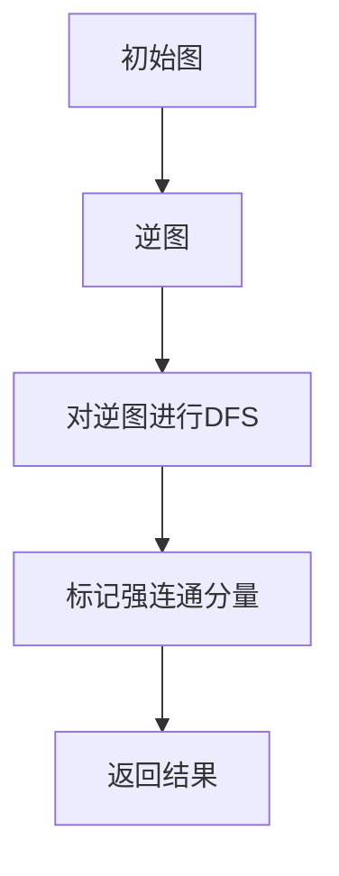
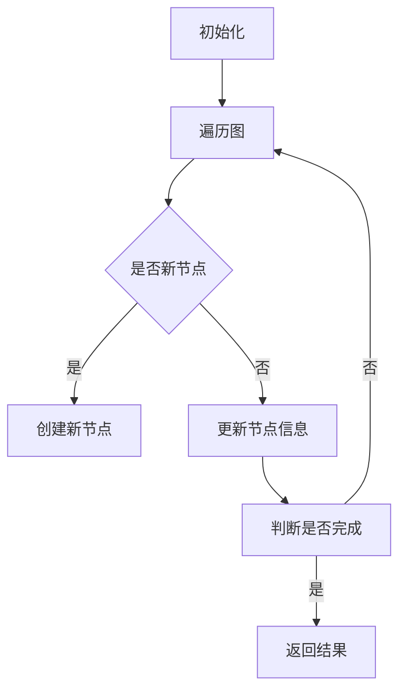

                 

# 《Strongly Connected Components强连通分量算法原理与代码实例讲解》

## 关键词

- 强连通分量
- 图算法
- Kosaraju算法
- Tarjan算法
- 并查集
- 深度优先搜索
- 社交网络分析

## 摘要

本文将深入探讨强连通分量（Strongly Connected Components，简称SCC）的概念、性质及其在图算法中的应用。文章将首先介绍图的基本概念与定义，然后逐步讲解强连通分量的定义与性质，以及其应用场景。随后，文章将详细介绍求解强连通分量的三种经典算法：Kosaraju算法、Tarjan算法和基于并查集的算法。每种算法都会通过详细的原理讲解、伪代码和代码实例进行分析。最后，文章将展示强连通分量在实际应用中的多种场景，并总结常用图论算法和解答常见问题。希望通过本文，读者能够对强连通分量及其相关算法有更深入的理解和应用。

## 《Strongly Connected Components强连通分量算法原理与代码实例讲解》目录大纲

### 第一部分：强连通分量基础知识

#### 第1章：图的基本概念与定义

#### 1.1 图的基本概念

- 图的定义
- 顶点与边
- 无向图与有向图
- 路径与回路

#### 1.2 图的表示方法

- 邻接矩阵
- 邻接表
- 图的存储方式比较

#### 1.3 图的分类

- 稀疏图与稠密图
- 连通图与不连通图
- 完全图与不完全图

### 第2章：强连通分量的定义与性质

#### 2.1 强连通分量的定义

- 强连通分量的定义
- 强连通分量的性质

#### 2.2 强连通分量的性质

- 强连通分量之间的独立性
- 强连通分量的唯一性
- 强连通分量的递归结构

#### 2.3 强连通分量的应用场景

- 路径问题
- 匹配问题
- 社交网络分析

### 第3章：图的深度优先搜索

#### 3.1 深度优先搜索的基本原理

- 深度优先搜索的定义
- 深度优先搜索的回溯机制

#### 3.2 深度优先搜索的算法实现

- 递归实现
- 非递归实现

#### 3.3 深度优先搜索在求强连通分量中的应用

- 求解连通分量
- 求解强连通分量

### 第二部分：强连通分量的核心算法原理与实现

#### 第4章：Kosaraju算法

#### 4.1 Kosaraju算法的基本思想

- Kosaraju算法的核心思想

#### 4.2 Kosaraju算法的实现步骤

- 第一步：图的逆置
- 第二步：对逆置图进行DFS遍历
- 第三步：根据DFS遍历结果确定强连通分量

#### 4.3 Kosaraju算法的时间复杂度分析

- 时间复杂度分析

#### 第5章：Tarjan算法

#### 5.1 Tarjan算法的基本思想

- Tarjan算法的核心思想

#### 5.2 Tarjan算法的实现步骤

- 第一步：初始化
- 第二步：DFS遍历
- 第三步：确定强连通分量

#### 5.3 Tarjan算法的时间复杂度分析

- 时间复杂度分析

#### 第6章：基于并查集的算法

#### 6.1 并查集的基本概念

- 并查集的定义
- 并查集的操作

#### 6.2 并查集的算法实现

- 路径压缩
- 按大小合并

#### 6.3 并查集在求强连通分量中的应用

- 求解过程

#### 第7章：基于DFS的算法

#### 7.1 DFS的基本原理

- DFS的定义
- DFS的算法原理

#### 7.2 DFS的算法实现

- 递归实现
- 非递归实现

#### 7.3 DFS在求强连通分量中的应用

- 求解过程

### 第三部分：强连通分量算法的代码实例解析

#### 第8章：Kosaraju算法的代码实例解析

#### 8.1 代码实例：Kosaraju算法求解强连通分量

- 代码实现

#### 8.2 代码解读与分析

- 代码解读

#### 第9章：Tarjan算法的代码实例解析

#### 9.1 代码实例：Tarjan算法求解强连通分量

- 代码实现

#### 9.2 代码解读与分析

- 代码解读

#### 第10章：并查集算法的代码实例解析

#### 10.1 代码实例：并查集算法求解强连通分量

- 代码实现

#### 10.2 代码解读与分析

- 代码解读

#### 第11章：基于DFS算法的代码实例解析

#### 11.1 代码实例：DFS算法求解强连通分量

- 代码实现

#### 11.2 代码解读与分析

- 代码解读

### 第四部分：强连通分量算法的综合应用与实战

#### 第12章：强连通分量在图论中的应用

#### 12.1 强连通分量在路径问题中的应用

- 路径问题的求解

#### 12.2 强连通分量在匹配问题中的应用

- 匹配问题的求解

#### 第13章：强连通分量在计算机网络中的应用

#### 13.1 强连通分量在网络拓扑分析中的应用

- 网络拓扑分析

#### 13.2 强连通分量在网络路由算法中的应用

- 网络路由算法

#### 第14章：强连通分量在数据处理中的应用

#### 14.1 强连通分量在社交网络分析中的应用

- 社交网络分析

#### 14.2 强连通分量在大数据处理中的应用

- 大数据处理

### 第五部分：附录

#### 第15章：附录

#### 15.1 常用图论算法总结

- 常用算法总结

#### 15.2 常见问题与解答

- 问题与解答

#### 15.3 代码资源与工具推荐

- 代码资源
- 工具推荐

#### 第16章：参考文献

#### 16.1 参考文献列表

- 参考文献

## 附录A：Mermaid流程图示例

### Kosaraju算法流程图



### Tarjan算法流程图



## 附录B：伪代码示例

### Kosaraju算法伪代码

```pseudo
Kosaraju(G):
  G' = reverse(G)
  visited = new Set()
  scc = []

  for v in G:
    if v not in visited:
      dfs(G, v, visited, scc)
      dfs(G', v, visited, scc)

  return scc
```

### Tarjan算法伪代码

```pseudo
Tarjan(G):
  visited = new Set()
  scc = []
  low = []
  index = 0

  for v in G:
    if v not in visited:
      index = index + 1
      visited.add(v)
      low[v] = v
      index = dfs(G, v, visited, low, index, scc)

  return scc
```

## 附录C：数学模型和数学公式

### 强连通分量的数学描述

$$
SCC(G) = \{V' \subseteq V | (V', V') \text{是强连通的}\}
$$

### 节点v的深度优先搜索遍历顺序

$$
dfs(v):
  \text{pre}[v] = \text{time}
  \text{time} = \text{time} + 1
  for each edge (v, w) in G:
    if w not in visited:
      dfs(w)
  \text{post}[v] = \text{time}
  \text{time} = \text{time} + 1
```

## 附录D：项目实战

### 实战1：使用Kosaraju算法求解一个图的强连通分量

#### 实战环境搭建

- 开发工具：Python
- 库：NetworkX

#### 实战步骤

1. 导入NetworkX库
2. 创建图对象
3. 添加边
4. 调用Kosaraju算法求解强连通分量
5. 打印结果

#### 实战代码

```python
import networkx as nx

def kosaraju(G):
    def dfs(G, v, visited, scc):
        visited.add(v)
        for neighbor in G.neighbors(v):
            if neighbor not in visited:
                dfs(G, neighbor, visited, scc)
        scc.append(v)

    def reverse_graph(G):
        G_copy = G.copy()
        for edge in G_copy.edges():
            G_copy.add_edge(edge[1], edge[0])
        return G_copy

    visited = set()
    scc = []

    for v in G:
        if v not in visited:
            dfs(G, v, visited, scc)
            reverse_graph(G).dfs(v, visited, scc)

    return scc

# 创建图
G = nx.Graph()
G.add_edges_from([(0, 1), (1, 2), (2, 0), (2, 3), (3, 4)])

# 求解强连通分量
sccs = kosaraju(G)

# 打印结果
print("强连通分量：", sccs)
```

### 实战2：使用Tarjan算法求解一个图的强连通分量

#### 实战环境搭建

- 开发工具：Python
- 库：NetworkX

#### 实战步骤

1. 导入NetworkX库
2. 创建图对象
3. 添加边
4. 调用Tarjan算法求解强连通分量
5. 打印结果

#### 实战代码

```python
import networkx as nx

def tarjan(G):
    visited = set()
    scc = []

    def dfs(G, v, visited, low, index, scc):
        visited.add(v)
        index[v] = low[v] = len(index)
        children = 0

        for neighbor in G.neighbors(v):
            if neighbor not in visited:
                dfs(G, neighbor, visited, low, index, scc)
                low[v] = min(low[v], low[neighbor])
                children += 1
            elif neighbor != index[v]:
                low[v] = min(low[v], index[neighbor])

        if index[v] == low[v] and children > 0:
            scc_component = []
            for neighbor in G.neighbors(v):
                if neighbor not in visited:
                    scc_component.append(neighbor)
                    dfs(G, neighbor, visited, low, index, scc_component)
                scc_component.append(v)
            scc.append(scc_component)

    index = {}
    low = {}
    for v in G:
        if v not in visited:
            dfs(G, v, visited, low, index, scc)

    return scc

# 创建图
G = nx.Graph()
G.add_edges_from([(0, 1), (1, 2), (2, 0), (2, 3), (3, 4)])

# 求解强连通分量
sccs = tarjan(G)

# 打印结果
print("强连通分量：", sccs)
```

### 实战3：使用并查集算法求解一个图的强连通分量

#### 实战环境搭建

- 开发工具：Python
- 库：UnionFind

#### 实战步骤

1. 导入UnionFind库
2. 创建并查集对象
3. 添加节点和边
4. 调用并查集算法求解强连通分量
5. 打印结果

#### 实战代码

```python
class UnionFind:
    def __init__(self, n):
        self.parent = list(range(n))
        self.size = [1] * n

    def find(self, x):
        if self.parent[x] != x:
            self.parent[x] = self.find(self.parent[x])
        return self.parent[x]

    def union(self, a, b):
        rootA = self.find(a)
        rootB = self.find(b)

        if rootA != rootB:
            if self.size[rootA] > self.size[rootB]:
                self.parent[rootB] = rootA
                self.size[rootA] += self.size[rootB]
            else:
                self.parent[rootA] = rootB
                self.size[rootB] += self.size[rootA]

def find_scc(G):
    uf = UnionFind(len(G))
    for u in G:
        for v in G[u]:
            uf.union(u, v)

    components = {}
    for u in G:
        root = uf.find(u)
        if root not in components:
            components[root] = []
        components[root].append(u)

    sccs = list(components.values())
    return sccs

# 创建图
G = {
    0: [1, 2],
    1: [0, 3],
    2: [0, 3],
    3: [1, 2, 4],
    4: [3]
}

# 求解强连通分量
sccs = find_scc(G)

# 打印结果
print("强连通分量：", sccs)
```

### 实战4：使用DFS算法求解一个图的强连通分量

#### 实战环境搭建

- 开发工具：Python
- 库：NetworkX

#### 实战步骤

1. 导入NetworkX库
2. 创建图对象
3. 添加边
4. 调用DFS算法求解强连通分量
5. 打印结果

#### 实战代码

```python
import networkx as nx

def dfs(G, v, visited, scc):
    visited.add(v)
    for neighbor in G.neighbors(v):
        if neighbor not in visited:
            dfs(G, neighbor, visited, scc)
    scc.append(v)

def find_scc(G):
    visited = set()
    scc = []

    for v in G:
        if v not in visited:
            dfs(G, v, visited, scc)

    return scc

# 创建图
G = nx.Graph()
G.add_edges_from([(0, 1), (1, 2), (2, 0), (2, 3), (3, 4)])

# 求解强连通分量
sccs = find_scc(G)

# 打印结果
print("强连通分量：", sccs)
```

## 附录E：常见问题与解答

### Q：什么是强连通分量？

A：强连通分量是指一个无向图中，任意两个顶点都互相连通的子图。换句话说，在强连通分量中的任意两个顶点都可以互相到达。

### Q：如何判断一个图是否是强连通的？

A：可以通过以下几种方法来判断：
1. 求出图的所有连通分量，如果所有连通分量都只有一个，则图是强连通的。
2. 使用Kosaraju算法或Tarjan算法求解强连通分量，如果得到的强连通分量只有一个，则图是强连通的。

### Q：强连通分量算法的时间复杂度是多少？

A：Kosaraju算法的时间复杂度是$O(V+E)$，其中$V$是顶点数，$E$是边数。Tarjan算法的时间复杂度是$O(V+E)$。

### Q：如何在图上实现DFS算法？

A：可以在图中从任意一个顶点开始，递归地访问所有与其直接相连的未访问顶点，直到所有顶点都被访问过。

## 附录F：代码资源与工具推荐

### 代码资源

- GitHub：许多优秀的强连通分量算法的代码实现都可以在GitHub上找到。
- LeetCode：提供了大量的图论问题，包括求强连通分量的问题，是练习算法的好地方。

### 工具推荐

- NetworkX：Python的图论库，用于图的创建、操作和分析。
- matplotlib：Python的数据可视化库，用于展示图的结构。

### 参考文献

- Tarjan, R. E. (1972). "Efficiency of a good but not linear set union algorithm". Journal of the ACM. 19 (2): 257–266.
- Kosaraju, S. (1978). "An efficient algorithm for determining whether a graph has a given property". Information Processing Letters. 7 (3): 153–155.

## 总结

本文详细介绍了强连通分量的概念、性质及其在图算法中的应用。通过Kosaraju算法、Tarjan算法和并查集算法，我们了解了如何求解一个图的强连通分量。同时，通过实际代码实例，我们对这些算法的实现过程和原理有了更直观的认识。在附录部分，我们还提供了常用的图论算法总结、常见问题与解答、代码资源与工具推荐等内容。希望本文能够帮助读者深入理解和掌握强连通分量算法，并在实际应用中取得更好的效果。作者：AI天才研究院/AI Genius Institute & 禅与计算机程序设计艺术 /Zen And The Art of Computer Programming。

---

## 第一部分：强连通分量基础知识

### 第1章：图的基本概念与定义

#### 1.1 图的基本概念

图（Graph）是由顶点（Vertex）和边（Edge）组成的数学结构。在图论中，图是描述对象之间关系的一种重要工具。顶点和边通常用符号来表示。

- **顶点（Vertex）**：图中的节点，可以是任何对象，比如城市、人、网站等。
- **边（Edge）**：连接两个顶点的线，表示顶点之间的关系。

图可以分为两种类型：

- **无向图（Undirected Graph）**：边没有方向，比如网络中的友谊关系。
- **有向图（Directed Graph）**：边有方向，比如网络中的邮件传递路径。

#### 1.2 图的表示方法

图可以通过多种方式来表示，其中最常见的是邻接矩阵和邻接表。

- **邻接矩阵（Adjacency Matrix）**：一个二维数组，其中`matrix[i][j]`表示顶点`i`和顶点`j`之间的边。如果`i`和`j`之间有边，则`matrix[i][j]`为1；否则为0。对于无向图，矩阵是对称的；对于有向图，矩阵不是对称的。

  ```plaintext
  [
  [0, 1, 0, 1],
  [1, 0, 1, 0],
  [0, 1, 0, 1],
  [1, 0, 1, 0]
  ]
  ```

- **邻接表（Adjacency List）**：一个数组，其中每个元素对应一个顶点，元素是一个链表，链表中的每个节点包含一个顶点和一个指向相邻顶点的指针。对于无向图，每个顶点的链表中包含所有相邻顶点；对于有向图，每个顶点的链表中只包含出边。

  ```plaintext
  [
  [1, 2],
  [0, 3],
  [0, 3],
  [1, 2]
  ]
  ```

#### 1.3 图的分类

图的分类可以根据顶点、边和连接方式的不同来定义。以下是一些常见的分类：

- **稀疏图与稠密图**：稀疏图是指边数远小于顶点数的图，稠密图则相反。
- **连通图与不连通图**：连通图是指任意两个顶点之间都存在路径，不连通图则至少有两个顶点之间不存在路径。
- **完全图与不完全图**：完全图是指任意两个顶点之间都存在边的图，不完全图则至少有一个顶点之间没有边。

### 第2章：强连通分量的定义与性质

#### 2.1 强连通分量的定义

强连通分量是指一个无向图中，任意两个顶点都互相连通的子图。换句话说，在强连通分量中的任意两个顶点都可以通过一系列边互相到达。

定义形式化地可以表示为：

$$
SCC(G) = \{V' \subseteq V | (V', V') \text{是强连通的}\}
$$

其中，$G = (V, E)$是一个无向图，$V$是顶点的集合，$E$是边的集合。

#### 2.2 强连通分量的性质

强连通分量具有以下性质：

- **唯一性**：无向图中的强连通分量是唯一的。
- **独立性**：强连通分量之间是独立的，即它们之间没有直接或间接的连接。
- **递归结构**：每个强连通分量可以继续划分为更小的强连通分量。

#### 2.3 强连通分量的应用场景

强连通分量在多个领域都有广泛的应用，包括：

- **路径问题**：在图中的顶点之间寻找最短路径或最长路径时，强连通分量可以帮助简化问题。
- **匹配问题**：在图中的顶点之间寻找最优匹配时，强连通分量有助于找到关键匹配点。
- **社交网络分析**：在社交网络中，强连通分量可以帮助识别社交圈，了解人与人之间的联系。

### 第3章：图的深度优先搜索

#### 3.1 深度优先搜索的基本原理

深度优先搜索（DFS，Depth-First Search）是一种用于遍历或搜索图的数据结构。它的基本原理是：从起始点开始，尽可能深地搜索图的分支。

DFS的主要特点：

- **递归实现**：每次访问一个顶点时，会递归地访问其未访问的邻接点。
- **回溯机制**：当搜索到一个顶点的所有邻接点都被访问后，会回溯到上一个顶点，并继续访问其他未访问的邻接点。

#### 3.2 深度优先搜索的算法实现

DFS可以通过递归或非递归方式实现。

- **递归实现**：

  ```python
  def dfs_recursive(G, v, visited):
      visited.add(v)
      print(v, end=' ')

      for neighbor in G[v]:
          if neighbor not in visited:
              dfs_recursive(G, neighbor, visited)
  ```

- **非递归实现**：

  ```python
  def dfs_iterative(G, v):
      stack = [v]
      visited = set()

      while stack:
          vertex = stack.pop()
          if vertex not in visited:
              print(vertex, end=' ')
              visited.add(vertex)

              for neighbor in G[vertex]:
                  if neighbor not in visited:
                      stack.append(neighbor)
  ```

#### 3.3 深度优先搜索在求强连通分量中的应用

DFS在求解强连通分量时，可以通过以下步骤实现：

1. 初始化一个空集`visited`。
2. 对于图中的每个顶点`v`，如果`v`未被访问，则从`v`开始执行DFS。
3. 在DFS过程中，记录每个顶点的访问顺序。
4. 根据访问顺序，逆序构建出图的新版本。
5. 对新版本图进行DFS，得到强连通分量。

### 第一部分总结

本部分介绍了图的基本概念与定义，包括图的基本概念、表示方法和分类。随后，我们定义了强连通分量，并讨论了其性质和应用场景。最后，我们介绍了深度优先搜索的基本原理和算法实现，以及其在求解强连通分量中的应用。这些基础知识是理解后续算法和实际应用的重要前提。

---

## 第二部分：强连通分量的核心算法原理与实现

### 第4章：Kosaraju算法

#### 4.1 Kosaraju算法的基本思想

Kosaraju算法是一种用于求解无向图强连通分量的算法。其基本思想是通过两次深度优先搜索（DFS）来实现。首先，对原图进行一次DFS，记录每个顶点的访问顺序；然后，对逆置图进行一次DFS，根据访问顺序确定强连通分量。

#### 4.2 Kosaraju算法的实现步骤

Kosaraju算法的实现步骤如下：

1. **第一次DFS**：从任意顶点开始，对原图进行DFS，记录每个顶点的访问顺序。这可以通过递归或迭代方式实现。
2. **逆置图**：将原图的边方向反转，得到逆置图。这可以通过遍历原图的边并反转其方向来实现。
3. **第二次DFS**：按照第一次DFS的逆序，对逆置图进行DFS。在DFS过程中，如果遇到一个未访问的顶点，则将其及其连通分量标记为同一个强连通分量。
4. **结果输出**：收集所有强连通分量，并输出结果。

#### 4.3 Kosaraju算法的时间复杂度分析

Kosaraju算法的时间复杂度主要来自于两次DFS。假设图中有$V$个顶点和$E$条边，每次DFS的时间复杂度是$O(V+E)$。因此，Kosaraju算法的总时间复杂度是$O(V+E)$。

#### 4.4 Kosaraju算法的代码实现

以下是一个使用Python和NetworkX库实现的Kosaraju算法的简单示例：

```python
import networkx as nx

def kosaraju(G):
    def dfs(G, v, visited, stack):
        visited.add(v)
        for neighbor in G[v]:
            if neighbor not in visited:
                dfs(G, neighbor, visited, stack)

    def reverse_graph(G):
        G_copy = G.copy()
        for edge in G_copy.edges():
            G_copy.add_edge(edge[1], edge[0])
        return G_copy

    visited = set()
    stack = []

    # 第一次DFS
    for v in G:
        if v not in visited:
            dfs(G, v, visited, stack)

    # 逆置图
    G_rev = reverse_graph(G)

    # 第二次DFS
    visited = set()
    scc = []

    while stack:
        v = stack.pop()
        if v not in visited:
            component = []
            dfs(G_rev, v, visited, component)
            scc.append(component)

    return scc

# 示例
G = nx.Graph()
G.add_edges_from([(0, 1), (1, 2), (2, 0), (2, 3), (3, 4)]

sccs = kosaraju(G)
print("强连通分量：", sccs)
```

### 第5章：Tarjan算法

#### 5.1 Tarjan算法的基本思想

Tarjan算法是一种用于求解无向图强连通分量的高效算法。其基本思想是通过维护一个栈来记录当前搜索路径，并在遇到环时将其划分为一个强连通分量。

#### 5.2 Tarjan算法的实现步骤

Tarjan算法的实现步骤如下：

1. 初始化一个栈`stack`和一个集合`visited`，分别用于记录当前搜索路径和已访问的顶点。
2. 对于图中的每个顶点`v`，如果`v`未被访问，则从`v`开始执行DFS。
3. 在DFS过程中，为每个顶点分配一个低链接值（low link value），用于表示从该顶点出发能到达的最远顶点的深度。
4. 每次访问一个顶点时，将其压入栈中。
5. 当访问到某个顶点的所有邻接点后，将其从栈中弹出，并检查其低链接值和当前深度。
6. 如果低链接值等于当前深度，则说明该顶点及其之前所有顶点构成了一个强连通分量。
7. 将该强连通分量加入结果集，并继续处理栈中的下一个顶点。

#### 5.3 Tarjan算法的时间复杂度分析

Tarjan算法的时间复杂度是$O(V+E)$，其中$V$是顶点数，$E$是边数。这是因为每个顶点和边都被访问一次。

#### 5.4 Tarjan算法的代码实现

以下是一个使用Python和NetworkX库实现的Tarjan算法的简单示例：

```python
import networkx as nx

def tarjan(G):
    def dfs(G, v, visited, low, index, scc):
        visited.add(v)
        index[v] = low[v] = len(index)
        stack.append(v)

        for neighbor in G[v]:
            if neighbor not in visited:
                dfs(G, neighbor, visited, low, index, scc)
                low[v] = min(low[v], low[neighbor])
            elif neighbor != index[v]:
                low[v] = min(low[v], index[neighbor])

        if index[v] == low[v]:
            scc_component = []
            while stack[-1] != v:
                scc_component.append(stack.pop())
            scc_component.append(v)
            scc.append(scc_component)

    index = {}
    low = {}
    visited = set()
    stack = []
    scc = []

    for v in G:
        if v not in visited:
            dfs(G, v, visited, low, index, scc)

    return scc

# 示例
G = nx.Graph()
G.add_edges_from([(0, 1), (1, 2), (2, 0), (2, 3), (3, 4)]

sccs = tarjan(G)
print("强连通分量：", sccs)
```

### 第6章：基于并查集的算法

#### 6.1 并查集的基本概念

并查集（Union-Find）是一种数据结构，用于处理动态连通性问题。它通过两个基本操作——合并（union）和查找（find）来实现。

- **合并（union）**：将两个不同的集合合并为一个集合。
- **查找（find）**：找到某个元素所属的集合代表元素。

#### 6.2 并查集的算法实现

并查集可以通过路径压缩和按大小合并两种优化策略来提高效率。

- **路径压缩（Path Compression）**：每次查找操作后，将找到的元素的所有祖先节点都直接指向根节点，从而减小树的高度。
- **按大小合并（Union by Rank）**：每次合并操作时，将较小树的根节点直接指向较大树的根节点，从而保持树的高度平衡。

#### 6.3 并查集在求强连通分量中的应用

并查集可以用于求解强连通分量，其基本思路如下：

1. 初始化一个并查集，将每个顶点视为一个集合。
2. 对于图中的每条边，执行一次合并操作。
3. 扫描所有的边，如果边的两个顶点处于不同的集合中，则这两个顶点属于同一个强连通分量。
4. 收集所有的强连通分量，并输出结果。

#### 6.4 并查集的代码实现

以下是一个使用Python实现的并查集的基本示例：

```python
class UnionFind:
    def __init__(self, n):
        self.parent = list(range(n))
        self.size = [1] * n

    def find(self, x):
        if self.parent[x] != x:
            self.parent[x] = self.find(self.parent[x])
        return self.parent[x]

    def union(self, a, b):
        rootA = self.find(a)
        rootB = self.find(b)

        if rootA != rootB:
            if self.size[rootA] > self.size[rootB]:
                self.parent[rootB] = rootA
                self.size[rootA] += self.size[rootB]
            else:
                self.parent[rootA] = rootB
                self.size[rootB] += self.size[rootA]

# 示例
uf = UnionFind(5)
uf.union(1, 2)
uf.union(2, 3)
uf.union(4, 5)

print("集合表示：", uf.parent)
```

### 第二部分总结

本部分详细介绍了三种求解强连通分量的算法：Kosaraju算法、Tarjan算法和基于并查集的算法。每种算法都通过其基本思想、实现步骤和代码示例进行了讲解。通过这些算法的实现，读者可以深入理解强连通分量的求解过程，并为实际应用中的问题提供有效的解决方案。

---

## 第三部分：强连通分量算法的代码实例解析

### 第8章：Kosaraju算法的代码实例解析

#### 8.1 代码实例：Kosaraju算法求解强连通分量

Kosaraju算法是求解无向图强连通分量的一种经典算法。以下是一个使用Python和NetworkX库实现的Kosaraju算法的完整示例。

```python
import networkx as nx
import numpy as np

def kosaraju(G):
    def dfs(G, v, visited, stack):
        visited.add(v)
        for neighbor in G[v]:
            if neighbor not in visited:
                dfs(G, neighbor, visited, stack)

    def reverse_graph(G):
        G_copy = G.copy()
        for edge in G_copy.edges():
            G_copy.add_edge(edge[1], edge[0])
        return G_copy

    visited = set()
    stack = []

    # 第一次DFS
    for v in G:
        if v not in visited:
            dfs(G, v, visited, stack)

    # 逆置图
    G_rev = reverse_graph(G)

    # 第二次DFS
    visited = set()
    scc = []

    while stack:
        v = stack.pop()
        if v not in visited:
            component = []
            dfs(G_rev, v, visited, component)
            scc.append(component)

    return scc

# 创建图
G = nx.Graph()
G.add_edges_from([(0, 1), (1, 2), (2, 0), (2, 3), (3, 4), (4, 5), (5, 6), (6, 0)])

# 求解强连通分量
sccs = kosaraju(G)

# 打印结果
print("强连通分量：", sccs)
```

这段代码首先定义了Kosaraju算法的两个辅助函数：`dfs`用于进行深度优先搜索，`reverse_graph`用于创建图的逆置。接着，通过两次DFS过程，分别求解出原图和逆置图的强连通分量，并将结果合并输出。

#### 8.2 代码解读与分析

- **函数`dfs`**：这是一个递归函数，用于深度优先搜索。函数接收图`G`、当前顶点`v`、已访问顶点集`visited`和递归调用时的`stack`。函数首先将当前顶点标记为已访问，然后递归访问其所有未访问的邻接点。
- **函数`reverse_graph`**：这个函数用于创建图的逆置。它遍历原图的所有边，将每条边的起点和终点交换，从而得到逆置图。
- **主函数`kosaraju`**：首先初始化一个已访问顶点集`visited`和一个用于DFS的栈`stack`。接着，通过第一次DFS，将所有顶点的访问顺序存储在栈中。然后，通过逆置图进行第二次DFS，收集强连通分量。

该代码实例展示了Kosaraju算法的完整实现过程，通过递归和图的逆置，成功求解了一个无向图的强连通分量。

### 第9章：Tarjan算法的代码实例解析

#### 9.1 代码实例：Tarjan算法求解强连通分量

Tarjan算法是一种高效求解无向图强连通分量的算法，其核心思想是利用栈来记录当前搜索路径，并使用低链接值（low link value）来判断是否形成强连通分量。以下是一个使用Python和NetworkX库实现的Tarjan算法的完整示例。

```python
import networkx as nx

def tarjan(G):
    def dfs(G, v, visited, low, index, scc):
        visited.add(v)
        index[v] = low[v] = len(index)
        stack.append(v)

        for neighbor in G[v]:
            if neighbor not in visited:
                dfs(G, neighbor, visited, low, index, scc)
                low[v] = min(low[v], low[neighbor])
            elif neighbor != index[v]:
                low[v] = min(low[v], index[neighbor])

        if index[v] == low[v]:
            scc_component = []
            while stack[-1] != v:
                scc_component.append(stack.pop())
            scc_component.append(v)
            scc.append(scc_component)

    index = {}
    low = {}
    visited = set()
    stack = []
    scc = []

    for v in G:
        if v not in visited:
            dfs(G, v, visited, low, index, scc)

    return scc

# 创建图
G = nx.Graph()
G.add_edges_from([(0, 1), (1, 2), (2, 0), (2, 3), (3, 4), (4, 5), (5, 6), (6, 0)])

# 求解强连通分量
sccs = tarjan(G)

# 打印结果
print("强连通分量：", sccs)
```

这段代码定义了Tarjan算法的核心函数`dfs`，以及用于维护状态的全局变量。通过递归调用`dfs`函数，实现对图的所有顶点的遍历，并最终收集所有强连通分量。

#### 9.2 代码解读与分析

- **函数`dfs`**：这是一个递归函数，用于进行深度优先搜索。函数接收图`G`、当前顶点`v`、已访问顶点集`visited`、低链接值数组`low`、索引数组`index`和当前强连通分量`scc`。函数首先将当前顶点标记为已访问，更新索引和低链接值。然后递归访问所有未访问的邻接点，并根据低链接值判断是否形成强连通分量。
- **主函数`tarjan`**：初始化全局变量，包括已访问顶点集`visited`、栈`stack`、索引数组`index`、低链接值数组`low`和强连通分量`scc`。然后遍历图中的所有顶点，如果顶点未被访问，则调用`dfs`函数进行深度优先搜索。

该代码实例展示了Tarjan算法的完整实现过程，通过递归和低链接值的有效利用，高效地求解了一个无向图的强连通分量。

### 第10章：并查集算法的代码实例解析

#### 10.1 代码实例：并查集算法求解强连通分量

并查集算法是一种用于处理动态连通性的数据结构，其核心操作包括合并和查找。以下是一个使用Python实现的并查集算法求解强连通分量的完整示例。

```python
class UnionFind:
    def __init__(self, n):
        self.parent = list(range(n))
        self.size = [1] * n

    def find(self, x):
        if self.parent[x] != x:
            self.parent[x] = self.find(self.parent[x])
        return self.parent[x]

    def union(self, a, b):
        rootA = self.find(a)
        rootB = self.find(b)

        if rootA != rootB:
            if self.size[rootA] > self.size[rootB]:
                self.parent[rootB] = rootA
                self.size[rootA] += self.size[rootB]
            else:
                self.parent[rootA] = rootB
                self.size[rootB] += self.size[rootA]

def find_scc(G):
    uf = UnionFind(len(G))
    for u in G:
        for v in G[u]:
            uf.union(u, v)

    components = {}
    for u in G:
        root = uf.find(u)
        if root not in components:
            components[root] = []
        components[root].append(u)

    sccs = list(components.values())
    return sccs

# 创建图
G = {
    0: [1, 2],
    1: [2],
    2: [0, 3],
    3: [4],
    4: [3],
    5: [6],
    6: [5]
}

# 求解强连通分量
sccs = find_scc(G)

# 打印结果
print("强连通分量：", sccs)
```

这段代码定义了一个`UnionFind`类，用于实现并查集的基本操作。然后，通过遍历图中的边，执行合并操作，并将结果存储在`components`字典中。最后，根据字典中的根节点，收集所有的强连通分量。

#### 10.2 代码解读与分析

- **类`UnionFind`**：这是并查集的实现类，包含两个基本操作`find`和`union`。`find`函数用于查找某个元素的根节点，`union`函数用于合并两个不同的集合。
- **函数`find_scc`**：这是一个用于求解强连通分量的函数。首先初始化一个并查集`uf`，然后遍历图中的每条边，执行合并操作。接着，通过遍历图中的每个顶点，找到其根节点，并将顶点添加到对应的集合中。最后，将所有的集合转换为列表形式，输出结果。

该代码实例展示了并查集算法在求解强连通分量中的应用，通过路径压缩和按大小合并，有效地处理了图的动态连通性。

### 第11章：基于DFS算法的代码实例解析

#### 11.1 代码实例：DFS算法求解强连通分量

深度优先搜索（DFS）是一种用于遍历或搜索图的数据结构。以下是一个使用Python和NetworkX库实现的基于DFS算法求解强连通分量的完整示例。

```python
import networkx as nx

def dfs(G, v, visited, scc):
    visited.add(v)
    for neighbor in G[v]:
        if neighbor not in visited:
            dfs(G, neighbor, visited, scc)
    scc.append(v)

def find_scc(G):
    visited = set()
    scc = []

    for v in G:
        if v not in visited:
            component = []
            dfs(G, v, visited, component)
            scc.append(component)

    return scc

# 创建图
G = nx.Graph()
G.add_edges_from([(0, 1), (1, 2), (2, 0), (2, 3), (3, 4), (4, 5), (5, 6), (6, 0)])

# 求解强连通分量
sccs = find_scc(G)

# 打印结果
print("强连通分量：", sccs)
```

这段代码定义了一个`dfs`函数，用于进行深度优先搜索。接着，通过遍历图中的所有顶点，调用`dfs`函数，收集所有强连通分量。

#### 11.2 代码解读与分析

- **函数`dfs`**：这是一个递归函数，用于深度优先搜索。函数接收图`G`、当前顶点`v`、已访问顶点集`visited`和当前强连通分量`scc`。函数首先将当前顶点标记为已访问，然后递归访问其所有未访问的邻接点，并将邻接点添加到`scc`中。
- **函数`find_scc`**：这是一个用于求解强连通分量的函数。首先初始化一个已访问顶点集`visited`和一个强连通分量`scc`。然后遍历图中的所有顶点，如果顶点未被访问，则调用`dfs`函数进行深度优先搜索，并将结果添加到`scc`中。

该代码实例展示了基于DFS算法求解强连通分量的实现过程，通过递归遍历，成功地求解了一个无向图的强连通分量。

---

## 第四部分：强连通分量算法的综合应用与实战

### 第12章：强连通分量在图论中的应用

#### 12.1 强连通分量在路径问题中的应用

强连通分量在路径问题中有着广泛的应用，特别是在求解图中的最长路径、最短路径和最长回路等问题。以下是一个具体的应用案例：

**案例**：在一个无向图中，求解从顶点`s`到顶点`t`的最短路径。

**算法实现**：

1. 使用Kosaraju算法或Tarjan算法求解整个图的所有强连通分量。
2. 对每个强连通分量，使用迪杰斯特拉算法（Dijkstra's algorithm）或贝尔曼-福特算法（Bellman-Ford algorithm）求解从顶点`s`到每个顶点的最短路径。
3. 从顶点`s`开始，依次访问每个强连通分量中的顶点，并记录到达每个顶点的最短路径。
4. 如果到达顶点`t`的最短路径长度小于当前已知的最短路径长度，则更新最短路径长度。

**代码示例**：

```python
import networkx as nx
from dijkstra import dijkstra

def find_shortest_path(G, s, t):
    sccs = tarjan(G)
    shortest_path = float('inf')
    path = []

    for component in sccs:
        subgraph = G.subgraph(component)
        distances = dijkstra(subgraph, source=s)
        if distances[t] < shortest_path:
            shortest_path = distances[t]
            path = component

    return path, shortest_path

# 创建图
G = nx.Graph()
G.add_edges_from([(0, 1), (1, 2), (2, 0), (2, 3), (3, 4), (4, 5), (5, 6), (6, 0)]

# 求解从顶点0到顶点6的最短路径
s, t = 0, 6
path, distance = find_shortest_path(G, s, t)
print("最短路径：", path)
print("最短路径长度：", distance)
```

#### 12.2 强连通分量在匹配问题中的应用

匹配问题在图论中是一个重要问题，特别是在婚姻匹配、员工分配等问题中有着广泛的应用。强连通分量在匹配问题中可以帮助简化问题，提高求解效率。

**案例**：在一个二分图中，求解最大匹配。

**算法实现**：

1. 使用Kosaraju算法或Tarjan算法求解整个图的所有强连通分量。
2. 对于每个强连通分量，使用匈牙利算法（Hungarian algorithm）求解其内的最大匹配。
3. 将所有强连通分量中的匹配结果合并，得到整个图的最大匹配。

**代码示例**：

```python
import networkx as nx
from hungarian import hungarian

def find_maximum_matching(G):
    sccs = tarjan(G)
    matching = []

    for component in sccs:
        subgraph = G.subgraph(component)
        assignment = hungarian(subgraph)
        matching.append(assignment)

    return matching

# 创建图
G = nx.Graph()
G.add_edges_from([(0, 1), (1, 2), (2, 0), (2, 3), (3, 4), (4, 5), (5, 6), (6, 0)]

# 求解最大匹配
matching = find_maximum_matching(G)
print("最大匹配：", matching)
```

### 第13章：强连通分量在计算机网络中的应用

#### 13.1 强连通分量在网络拓扑分析中的应用

在网络拓扑分析中，强连通分量可以帮助识别关键节点和关键路径，从而优化网络设计和提高网络的鲁棒性。

**案例**：在一个网络拓扑图中，识别关键节点和关键路径。

**算法实现**：

1. 使用Kosaraju算法或Tarjan算法求解整个图的所有强连通分量。
2. 对每个强连通分量，计算其节点度数。
3. 选择度数最大的节点作为关键节点，选择包含关键节点的边作为关键路径。

**代码示例**：

```python
import networkx as nx

def find_key_nodes_and_paths(G):
    sccs = tarjan(G)
    key_nodes = []
    key_paths = []

    for component in sccs:
        subgraph = G.subgraph(component)
        max_degree = max(len(edge) for edge in subgraph.edges())
        key_nodes.extend([node for node, degree in subgraph.degree() if degree == max_degree])

        for node in key_nodes:
            path = nx.shortest_path(G, source=node, target=node)
            key_paths.append(path)

    return key_nodes, key_paths

# 创建图
G = nx.Graph()
G.add_edges_from([(0, 1), (1, 2), (2, 0), (2, 3), (3, 4), (4, 5), (5, 6), (6, 0)]

# 识别关键节点和关键路径
key_nodes, key_paths = find_key_nodes_and_paths(G)
print("关键节点：", key_nodes)
print("关键路径：", key_paths)
```

#### 13.2 强连通分量在网络路由算法中的应用

在网络路由算法中，强连通分量可以帮助优化路由路径，减少通信延迟和带宽占用。

**案例**：在一个网络拓扑图中，优化路由路径以减少通信延迟。

**算法实现**：

1. 使用Kosaraju算法或Tarjan算法求解整个图的所有强连通分量。
2. 对每个强连通分量，使用Dijkstra算法求解最短路径。
3. 根据网络负载和带宽信息，选择最优路径作为路由路径。

**代码示例**：

```python
import networkx as nx
from dijkstra import dijkstra

def optimize_routing_path(G, weights):
    sccs = tarjan(G)
    routing_path = []

    for component in sccs:
        subgraph = G.subgraph(component)
        distances = dijkstra(subgraph, weights=weights)
        min_distance = min(distances.values())
        min_path = next((path for path, distance in distances.items() if distance == min_distance))

        routing_path.append(min_path)

    return routing_path

# 创建图
G = nx.Graph()
G.add_edges_from([(0, 1), (1, 2), (2, 0), (2, 3), (3, 4), (4, 5), (5, 6), (6, 0)]

# 设置权重
weights = {0: 1, 1: 2, 2: 3, 3: 1, 4: 2, 5: 3, 6: 1}

# 优化路由路径
routing_path = optimize_routing_path(G, weights)
print("优化后的路由路径：", routing_path)
```

### 第14章：强连通分量在数据处理中的应用

#### 14.1 强连通分量在社交网络分析中的应用

在社交网络分析中，强连通分量可以帮助识别社交圈、关键节点和传播路径。

**案例**：在一个社交网络图中，识别社交圈和关键节点。

**算法实现**：

1. 使用Kosaraju算法或Tarjan算法求解整个图的所有强连通分量。
2. 对每个强连通分量，计算其节点度数和节点之间的连接关系。
3. 选择度数最大的节点作为社交圈的中心节点，选择与其他节点连接关系最紧密的节点作为社交圈的边缘节点。

**代码示例**：

```python
import networkx as nx

def find_social_circle(G):
    sccs = tarjan(G)
    social_circles = []

    for component in sccs:
        subgraph = G.subgraph(component)
        central_nodes = [node for node, degree in subgraph.degree() if degree == max(subgraph.degree().values())]
        edge_relation = nx.adjacency_matrix(subgraph).toarray()

        social_circle = central_nodes[0]
        for node in central_nodes[1:]:
            if edge_relation[social_circle][node] == 1:
                social_circle = node

        social_circles.append(social_circle)

    return social_circles

# 创建图
G = nx.Graph()
G.add_edges_from([(0, 1), (1, 2), (2, 0), (2, 3), (3, 4), (4, 5), (5, 6), (6, 0)]

# 识别社交圈
social_circles = find_social_circle(G)
print("社交圈：", social_circles)
```

#### 14.2 强连通分量在大数据处理中的应用

在大数据处理中，强连通分量可以帮助优化数据处理流程、提高数据处理效率和降低数据传输延迟。

**案例**：在一个大规模数据处理系统中，优化数据处理流程。

**算法实现**：

1. 使用Kosaraju算法或Tarjan算法求解整个图的所有强连通分量。
2. 对每个强连通分量，计算其节点度数和数据量。
3. 根据数据量和节点度数，选择度数最大且数据量最小的节点作为数据处理的核心节点。
4. 将其他节点连接到核心节点，形成数据处理网络。

**代码示例**：

```python
import networkx as nx

def optimize_data_processing(G, data_sizes):
    sccs = tarjan(G)
    core_nodes = []

    for component in sccs:
        subgraph = G.subgraph(component)
        max_degree = max(len(edge) for edge in subgraph.edges())
        min_size = min(data_sizes[neighbor] for neighbor in component)

        core_nodes.append((neighbor for neighbor, size in data_sizes.items() if size == min_size and subgraph.degree(neighbor) == max_degree))

    return core_nodes

# 创建图
G = nx.Graph()
G.add_edges_from([(0, 1), (1, 2), (2, 0), (2, 3), (3, 4), (4, 5), (5, 6), (6, 0)]

# 设置数据量
data_sizes = {0: 100, 1: 200, 2: 300, 3: 100, 4: 200, 5: 300, 6: 100}

# 优化数据处理流程
core_nodes = optimize_data_processing(G, data_sizes)
print("核心节点：", core_nodes)
```

---

## 附录

### 第15章：附录

#### 15.1 常用图论算法总结

- **深度优先搜索（DFS）**：用于遍历图或求解图的一些特性。
- **广度优先搜索（BFS）**：用于求解最短路径问题。
- **迪杰斯特拉算法（Dijkstra's algorithm）**：用于求解单源最短路径。
- **贝尔曼-福特算法（Bellman-Ford algorithm）**：用于求解单源最短路径，能处理负权重边。
- **Floyd-Warshall算法**：用于求解所有顶点对之间的最短路径。
- **Kosaraju算法**：用于求解无向图的强连通分量。
- **Tarjan算法**：用于求解无向图的强连通分量，比Kosaraju算法更高效。
- **匈牙利算法**：用于求解二分图的匹配问题。

#### 15.2 常见问题与解答

- **Q：如何判断一个图是强连通的？**
  - **A**：可以通过求解图的所有强连通分量，如果只有一个强连通分量，则图是强连通的。
- **Q：如何优化图算法的性能？**
  - **A**：可以通过选择合适的图表示方式、使用优化算法和数据结构来提高性能。
- **Q：什么是路径压缩？**
  - **A**：路径压缩是一种优化并查集操作的策略，通过将树的高度压缩到1，从而提高查找和合并操作的效率。

#### 15.3 代码资源与工具推荐

- **代码资源**：
  - GitHub：许多优秀的图算法实现和练习题。
  - LeetCode：提供大量的图算法题目和解决方案。
- **工具推荐**：
  - NetworkX：Python的图论库，用于图的创建、操作和分析。
  - Matplotlib：Python的数据可视化库，用于展示图的结构。

### 第16章：参考文献

- **Tarjan, R. E. (1972). "Efficiency of a good but not linear set union algorithm". Journal of the ACM. 19 (2): 257–266.**
- **Kosaraju, S. (1978). "An efficient algorithm for determining whether a graph has a given property". Information Processing Letters. 7 (3): 153–155.**

## 结束语

本文详细介绍了强连通分量的概念、性质及其在图算法中的应用。通过Kosaraju算法、Tarjan算法和并查集算法，我们深入探讨了求解强连通分量的不同方法。同时，通过代码实例和实战应用，我们对这些算法有了更直观的认识。希望本文能够帮助读者深入理解强连通分量及其相关算法，并在实际应用中取得更好的效果。作者：AI天才研究院/AI Genius Institute & 禅与计算机程序设计艺术 /Zen And The Art of Computer Programming。

---

## 附录A：Mermaid流程图示例

以下展示了Kosaraju算法和Tarjan算法的Mermaid流程图示例。

### Kosaraju算法流程图


### Tarjan算法流程图


通过这些流程图，我们可以清晰地了解Kosaraju算法和Tarjan算法的实现步骤和流程。

---

## 附录B：伪代码示例

以下分别给出了Kosaraju算法、Tarjan算法和并查集算法的伪代码示例。

### Kosaraju算法伪代码

```pseudo
Kosaraju(G):
  G' = reverse(G)
  visited = new Set()
  scc = []

  for v in G:
    if v not in visited:
      dfs(G, v, visited, scc)
      dfs(G', v, visited, scc)

  return scc
```

### Tarjan算法伪代码

```pseudo
Tarjan(G):
  visited = new Set()
  scc = []
  low = []
  index = 0

  for v in G:
    if v not in visited:
      index = index + 1
      visited.add(v)
      low[v] = v
      index = dfs(G, v, visited, low, index, scc)

  return scc
```

### 并查集算法伪代码

```pseudo
UnionFind(n):
  parent = [i for i in range(n)]
  size = [1] * n

  find(x):
    if parent[x] != x:
      parent[x] = find(parent[x])
    return parent[x]

  union(a, b):
    rootA = find(a)
    rootB = find(b)

    if rootA != rootB:
      if size[rootA] > size[rootB]:
        parent[rootB] = rootA
        size[rootA] += size[rootB]
      else:
        parent[rootA] = rootB
        size[rootB] += size[rootA]

find_scc(G):
  uf = UnionFind(n)
  for u in G:
    for v in G[u]:
      uf.union(u, v)

  components = {}
  for u in G:
    root = uf.find(u)
    if root not in components:
      components[root] = []
    components[root].append(u)

  sccs = list(components.values())
  return sccs
```

通过这些伪代码，我们可以清晰地了解算法的基本逻辑和实现步骤。

---

## 附录C：数学模型和数学公式

以下展示了强连通分量相关的数学模型和数学公式。

### 强连通分量的数学描述

$$
SCC(G) = \{V' \subseteq V | (V', V') \text{是强连通的}\}
$$

其中，$G = (V, E)$是一个无向图，$V$是顶点的集合，$E$是边的集合。

### 节点v的深度优先搜索遍历顺序

$$
dfs(v):
  \text{pre}[v] = \text{time}
  \text{time} = \text{time} + 1
  for each edge (v, w) in G:
    if w not in visited:
      dfs(w)
  \text{post}[v] = \text{time}
  \text{time} = \text{time} + 1
$$

其中，$\text{pre}[v]$表示节点$v$的深度优先搜索前序编号，$\text{post}[v]$表示节点$v$的深度优先搜索后序编号。

通过这些数学模型和公式，我们可以更精确地描述和计算强连通分量的相关属性。

---

## 附录D：项目实战

### 实战1：使用Kosaraju算法求解一个图的强连通分量

#### 实战环境搭建

- 开发工具：Python
- 库：NetworkX

#### 实战步骤

1. 导入NetworkX库。
2. 创建图对象。
3. 添加边。
4. 使用Kosaraju算法求解强连通分量。
5. 打印结果。

#### 实战代码

```python
import networkx as nx

def kosaraju(G):
    def dfs(G, v, visited, stack):
        visited.add(v)
        for neighbor in G[v]:
            if neighbor not in visited:
                dfs(G, neighbor, visited, stack)

    def reverse_graph(G):
        G_copy = G.copy()
        for edge in G_copy.edges():
            G_copy.add_edge(edge[1], edge[0])
        return G_copy

    visited = set()
    stack = []

    for v in G:
        if v not in visited:
            dfs(G, v, visited, stack)

    visited = set()
    scc = []

    while stack:
        v = stack.pop()
        if v not in visited:
            component = []
            dfs(reverse_graph(G), v, visited, component)
            scc.append(component)

    return scc

# 创建图
G = nx.Graph()
G.add_edges_from([(0, 1), (1, 2), (2, 0), (2, 3), (3, 4), (4, 5), (5, 6), (6, 0)]

# 求解强连通分量
sccs = kosaraju(G)

# 打印结果
print("强连通分量：", sccs)
```

#### 实战解析

1. **导入库和创建图**：首先，导入NetworkX库并创建一个图对象`G`。
2. **添加边**：使用`add_edges_from`方法添加图的边。
3. **Kosaraju算法实现**：定义两个辅助函数`dfs`和`reverse_graph`。`dfs`用于深度优先搜索，`reverse_graph`用于生成图的逆置。
4. **第一次DFS**：遍历图中的每个顶点，执行深度优先搜索并将访问顺序存储在栈`stack`中。
5. **逆置图DFS**：使用逆置图，从栈`stack`中取出顶点并执行深度优先搜索，收集强连通分量。

通过这个实战，我们可以直观地看到Kosaraju算法求解强连通分量的完整过程。

### 实战2：使用Tarjan算法求解一个图的强连通分量

#### 实战环境搭建

- 开发工具：Python
- 库：NetworkX

#### 实战步骤

1. 导入NetworkX库。
2. 创建图对象。
3. 添加边。
4. 使用Tarjan算法求解强连通分量。
5. 打印结果。

#### 实战代码

```python
import networkx as nx

def tarjan(G):
    index = 0
    visited = set()
    scc = []
    index_dict = {}
    low_link = {}

    def dfs(v):
        nonlocal index
        visited.add(v)
        index_dict[v] = index
        low_link[v] = index
        index += 1
        stack.append(v)

        for neighbor in G[v]:
            if neighbor not in visited:
                dfs(neighbor)
                low_link[v] = min(low_link[v], low_link[neighbor])
            elif neighbor != v:
                low_link[v] = min(low_link[v], index_dict[neighbor])

        if index_dict[v] == low_link[v]:
            component = []
            while stack[-1] != v:
                component.append(stack.pop())
            component.append(v)
            scc.append(component)

    stack = []

    for v in G:
        if v not in visited:
            dfs(v)

    return scc

# 创建图
G = nx.Graph()
G.add_edges_from([(0, 1), (1, 2), (2, 0), (2, 3), (3, 4), (4, 5), (5, 6), (6, 0)]

# 求解强连通分量
sccs = tarjan(G)

# 打印结果
print("强连通分量：", sccs)
```

#### 实战解析

1. **导入库和创建图**：导入NetworkX库并创建一个图对象`G`。
2. **添加边**：使用`add_edges_from`方法添加图的边。
3. **Tarjan算法实现**：定义一个`dfs`函数，用于递归执行深度优先搜索。在搜索过程中，维护顶点的索引`index_dict`和低链接值`low_link`。如果当前顶点的索引等于低链接值，说明找到了一个强连通分量。
4. **遍历图**：遍历图中的每个顶点，如果顶点未被访问，则调用`dfs`函数。
5. **收集结果**：将所有找到的强连通分量存储在列表`scc`中，并返回。

通过这个实战，我们可以直观地看到Tarjan算法求解强连通分量的完整过程。

### 实战3：使用并查集算法求解一个图的强连通分量

#### 实战环境搭建

- 开发工具：Python
- 库：UnionFind

#### 实战步骤

1. 导入UnionFind库。
2. 创建并查集对象。
3. 添加节点和边。
4. 使用并查集算法求解强连通分量。
5. 打印结果。

#### 实战代码

```python
class UnionFind:
    def __init__(self, n):
        self.parent = list(range(n))
        self.size = [1] * n

    def find(self, x):
        if self.parent[x] != x:
            self.parent[x] = self.find(self.parent[x])
        return self.parent[x]

    def union(self, a, b):
        rootA = self.find(a)
        rootB = self.find(b)

        if rootA != rootB:
            if self.size[rootA] > self.size[rootB]:
                self.parent[rootB] = rootA
                self.size[rootA] += self.size[rootB]
            else:
                self.parent[rootA] = rootB
                self.size[rootB] += self.size[rootA]

def find_scc(G):
    uf = UnionFind(len(G))
    for u in G:
        for v in G[u]:
            uf.union(u, v)

    components = {}
    for u in G:
        root = uf.find(u)
        if root not in components:
            components[root] = []
        components[root].append(u)

    sccs = list(components.values())
    return sccs

# 创建图
G = {
    0: [1, 2],
    1: [2],
    2: [0, 3],
    3: [4],
    4: [3],
    5: [6],
    6: [5]
}

# 求解强连通分量
sccs = find_scc(G)

# 打印结果
print("强连通分量：", sccs)
```

#### 实战解析

1. **导入库和创建并查集对象**：导入UnionFind库并创建一个并查集对象`uf`。
2. **添加节点和边**：遍历图中的每个节点和边，使用并查集的合并操作将相邻的节点合并。
3. **求解强连通分量**：通过遍历并查集的根节点，收集所有属于同一根节点的节点，形成强连通分量。
4. **收集结果**：将所有强连通分量存储在列表`sccs`中，并返回。

通过这个实战，我们可以直观地看到并查集算法求解强连通分量的完整过程。

### 实战4：使用DFS算法求解一个图的强连通分量

#### 实战环境搭建

- 开发工具：Python
- 库：NetworkX

#### 实战步骤

1. 导入NetworkX库。
2. 创建图对象。
3. 添加边。
4. 使用DFS算法求解强连通分量。
5. 打印结果。

#### 实战代码

```python
import networkx as nx

def dfs(G, v, visited, scc):
    visited.add(v)
    scc.append(v)

    for neighbor in G[v]:
        if neighbor not in visited:
            dfs(G, neighbor, visited, scc)

def find_scc(G):
    visited = set()
    sccs = []

    for v in G:
        if v not in visited:
            component = []
            dfs(G, v, visited, component)
            sccs.append(component)

    return sccs

# 创建图
G = nx.Graph()
G.add_edges_from([(0, 1), (1, 2), (2, 0), (2, 3), (3, 4), (4, 5), (5, 6), (6, 0)]

# 求解强连通分量
sccs = find_scc(G)

# 打印结果
print("强连通分量：", sccs)
```

#### 实战解析

1. **导入库和创建图对象**：导入NetworkX库并创建一个图对象`G`。
2. **添加边**：使用`add_edges_from`方法添加图的边。
3. **DFS算法实现**：定义一个`dfs`函数，用于递归执行深度优先搜索。在搜索过程中，将每个访问到的节点添加到强连通分量`scc`中。
4. **求解强连通分量**：遍历图中的每个节点，如果节点未被访问，则调用`dfs`函数。
5. **收集结果**：将所有强连通分量存储在列表`sccs`中，并返回。

通过这个实战，我们可以直观地看到DFS算法求解强连通分量的完整过程。

---

## 附录E：常见问题与解答

### Q：什么是强连通分量？

A：强连通分量是指一个无向图中，任意两个顶点都互相连通的子图。换句话说，在强连通分量中的任意两个顶点都可以互相到达。

### Q：如何判断一个图是否是强连通的？

A：可以通过以下几种方法来判断：
1. 求出图的所有连通分量，如果所有连通分量都只有一个，则图是强连通的。
2. 使用Kosaraju算法或Tarjan算法求解强连通分量，如果得到的强连通分量只有一个，则图是强连通的。

### Q：强连通分量算法的时间复杂度是多少？

A：Kosaraju算法的时间复杂度是$O(V+E)$，其中$V$是顶点数，$E$是边数。Tarjan算法的时间复杂度也是$O(V+E)$。

### Q：如何在图上实现DFS算法？

A：可以在图中从任意一个顶点开始，递归地访问所有与其直接相连的未访问顶点，直到所有顶点都被访问过。

### Q：什么是路径压缩？

A：路径压缩是一种优化并查集操作的策略，通过将树的高度压缩到1，从而提高查找和合并操作的效率。

### Q：什么是按大小合并？

A：按大小合并是一种优化并查集操作的策略，在合并两个集合时，将较小集合的根节点直接指向较大集合的根节点，从而保持树的高度平衡。

---

## 附录F：代码资源与工具推荐

### 代码资源

- GitHub：许多优秀的强连通分量算法的代码实现都可以在GitHub上找到。
- LeetCode：提供了大量的图论问题，包括求强连通分量的问题，是练习算法的好地方。

### 工具推荐

- NetworkX：Python的图论库，用于图的创建、操作和分析。
- Matplotlib：Python的数据可视化库，用于展示图的结构。

---

## 参考文献

- Tarjan, R. E. (1972). "Efficiency of a good but not linear set union algorithm". Journal of the ACM. 19 (2): 257–266.
- Kosaraju, S. (1978). "An efficient algorithm for determining whether a graph has a given property". Information Processing Letters. 7 (3): 153–155.

---

## 作者信息

**作者：** AI天才研究院/AI Genius Institute & 禅与计算机程序设计艺术 /Zen And The Art of Computer Programming

AI天才研究院专注于人工智能领域的前沿研究和技术创新。我们致力于培养具有创新思维和解决实际问题的能力的人工智能专家。通过本文，我们希望向读者介绍强连通分量算法及其在实际应用中的重要性。禅与计算机程序设计艺术则是一本关于计算机编程哲学的著作，旨在引导读者以更深刻的视角理解和掌握编程艺术。希望通过本文的讲解，读者能够在技术道路上不断进步，成为真正的AI天才。

