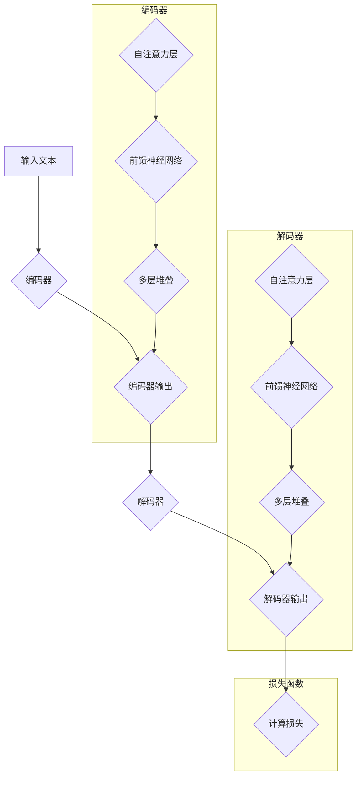
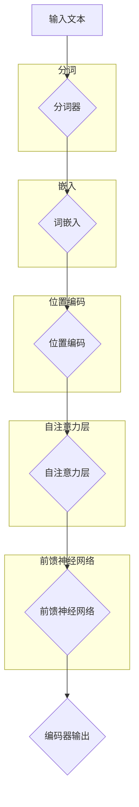
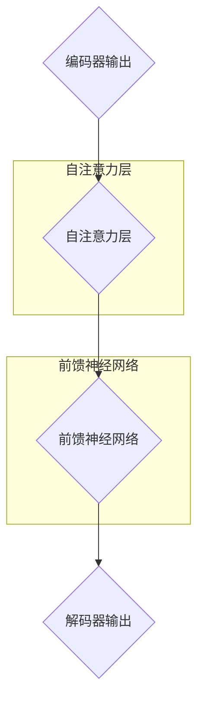

                 

### 文章标题

# 《T5(Text-to-Text Transfer Transformer) - 原理与代码实例讲解》

### 关键词

- T5模型
- Transformer
- 自然语言处理
- 文本生成
- 问答系统
- 翻译
- 对话系统
- 文本分类

### 摘要

本文深入解析T5（Text-to-Text Transfer Transformer）模型，从其基本概念、架构到实现细节，全面探讨这一先进自然语言处理模型的工作原理和应用。我们将逐步讲解T5模型的演进历程、Transformer基础、编码器与解码器设计、前向传播与反向传播机制、优化策略和超参数调参。通过具体代码实例，我们将演示如何实现T5模型在文本生成、问答系统、翻译、对话系统和文本分类等实际应用场景中的部署。文章最后提供T5模型的相关资源和工具链接，以及Mermaid流程图与伪代码示例，便于读者更好地理解和应用T5模型。

---

## 《T5(Text-to-Text Transfer Transformer) - 原理与代码实例讲解》目录大纲

### 第一部分: T5模型概述

### 第二部分: T5模型技术基础

### 第三部分: T5模型的应用与实战

### 附录

### 作者信息

---

### 第一部分: T5模型概述

#### 第1章: T5模型介绍

#### 第2章: T5模型的背景与演进

### 第二部分: T5模型技术基础

#### 第3章: Transformer模型基础

#### 第4章: T5模型的实现细节

#### 第5章: T5模型的优化与调参

### 第三部分: T5模型的应用与实战

#### 第6章: T5模型在文本生成中的应用

#### 第7章: T5模型在问答系统中的应用

#### 第8章: T5模型在翻译中的应用

#### 第9章: T5模型在对话系统中的应用

#### 第10章: T5模型在文本分类中的应用

### 附录

#### 附录A: T5模型的代码实现

#### 附录B: T5模型的相关资源与工具

#### 附录C: Mermaid流程图与伪代码示例

---

## 第一部分: T5模型概述

### 第1章: T5模型介绍

#### 1.1 T5模型的核心概念

T5（Text-to-Text Transfer Transformer）模型是谷歌AI研究团队于2020年推出的一种先进的自然语言处理模型。T5模型的核心概念是利用Transformer架构实现端到端的文本转换任务，其基本原理是通过对输入文本进行编码和解码，从而生成目标文本。

#### 1.2 T5模型的架构与特点

T5模型采用Transformer架构，具有以下特点：

1. **统一的输入输出格式**：T5模型将所有自然语言处理任务转化为文本到文本的转换任务，例如文本生成、问答系统和翻译等。这种统一的任务格式使得T5模型可以方便地迁移和应用到各种不同的任务中。
2. **强大的编码和解码能力**：T5模型包含大规模的编码器和解码器，能够对输入文本进行精细的编码和解读，从而生成高质量的目标文本。
3. **端到端训练**：T5模型采用端到端训练方式，无需手动设计复杂的预处理和后处理步骤，大大简化了模型的训练和部署过程。

#### 1.3 T5模型的应用领域

T5模型在多个自然语言处理任务中取得了显著的成果，其主要应用领域包括：

1. **文本生成**：T5模型可以用于生成各种类型的文本，如新闻摘要、产品描述和聊天机器人对话等。
2. **问答系统**：T5模型可以用于构建智能问答系统，能够回答用户提出的问题，并生成相关的回答。
3. **翻译**：T5模型可以用于实现多种语言之间的翻译，支持跨语言的文本转换。
4. **对话系统**：T5模型可以用于构建聊天机器人，实现与用户的自然对话。
5. **文本分类**：T5模型可以用于对文本进行分类，如情感分析、主题分类和垃圾邮件过滤等。

通过以上介绍，我们可以看出T5模型在自然语言处理领域具有广泛的应用前景和强大的潜力。在接下来的章节中，我们将进一步探讨T5模型的背景、技术基础和实现细节，帮助读者全面了解这一先进模型的工作原理和应用。

---

### 第2章: T5模型的背景与演进

#### 2.1 自然语言处理的发展历程

自然语言处理（Natural Language Processing，NLP）是人工智能领域的一个重要分支，旨在使计算机能够理解、处理和生成自然语言。自20世纪50年代以来，自然语言处理经历了多个发展阶段：

1. **规则驱动方法（1950s-1980s）**：早期自然语言处理主要依赖于手工编写的规则和算法，如句法分析和语义分析。这种方法具有简单和直观的特点，但在处理复杂和多变的语言时显得力不从心。
2. **统计方法（1990s）**：随着计算能力和数据量的提升，统计方法逐渐成为自然语言处理的主流。统计方法通过分析大量语料库中的语言模式，自动学习语言结构，如隐马尔可夫模型（HMM）和条件随机场（CRF）。
3. **深度学习方法（2010s至今）**：深度学习方法的兴起，特别是卷积神经网络（CNN）和循环神经网络（RNN）在自然语言处理中的应用，使得模型在许多任务上取得了显著的性能提升。近年来，基于Transformer的模型，如BERT和GPT，进一步推动了自然语言处理技术的发展。

#### 2.2 T5模型的提出与意义

T5模型是在深度学习方法的基础上，结合Transformer架构提出的一种新的自然语言处理模型。T5模型的提出具有以下重要意义：

1. **统一任务格式**：T5模型将所有自然语言处理任务转化为文本到文本的转换任务，如“给定一个文本，生成另一个文本”。这种统一的任务格式使得T5模型可以方便地迁移和应用到各种不同的任务中，提高了模型的可复用性。
2. **端到端训练**：T5模型采用端到端训练方式，无需手动设计复杂的预处理和后处理步骤，简化了模型的训练和部署过程。同时，端到端训练使得模型能够直接从原始文本中学习语言特征，提高了模型的性能。
3. **强大的生成能力**：T5模型采用大规模的编码器和解码器，能够对输入文本进行精细的编码和解读，从而生成高质量的目标文本。这使得T5模型在文本生成任务中具有强大的能力。

#### 2.3 T5模型与Transformer架构的关系

T5模型的核心架构是基于Transformer，这是一种被广泛应用于自然语言处理中的自注意力机制模型。Transformer模型的关键特点包括：

1. **自注意力机制**：Transformer模型通过自注意力机制计算文本序列中的依赖关系，使得模型能够捕捉全局上下文信息。自注意力机制基于Query、Key和Value三者之间的相似度计算，从而实现对输入序列的加权组合。
2. **并行计算**：Transformer模型采用并行计算方式，与传统的循环神经网络（RNN）相比，能够显著提高计算效率。
3. **多层的堆叠**：Transformer模型通过多层堆叠，使得模型能够学习到更复杂的语言特征。每一层的输出都作为下一层的输入，从而形成一种递归的结构。

T5模型在Transformer架构的基础上，进行了以下改进和优化：

1. **统一的任务格式**：T5模型将所有自然语言处理任务转化为文本到文本的转换任务，如“给定一个文本，生成另一个文本”。这种统一的任务格式使得T5模型可以方便地迁移和应用到各种不同的任务中，提高了模型的可复用性。
2. **端到端训练**：T5模型采用端到端训练方式，无需手动设计复杂的预处理和后处理步骤，简化了模型的训练和部署过程。同时，端到端训练使得模型能够直接从原始文本中学习语言特征，提高了模型的性能。
3. **大规模训练**：T5模型在大规模数据集上进行训练，通过增加模型尺寸和训练时间，提高了模型的生成能力。

通过以上分析，我们可以看到T5模型在自然语言处理领域具有重要的地位和广泛的应用前景。在接下来的章节中，我们将深入探讨T5模型的技术基础和实现细节，帮助读者更好地理解和应用这一先进模型。

---

### 第二部分: T5模型技术基础

#### 第3章: Transformer模型基础

#### 第4章: T5模型的实现细节

#### 第5章: T5模型的优化与调参

### 第3章: Transformer模型基础

#### 3.1 Transformer模型的原理

Transformer模型是一种基于自注意力机制的全注意力模型，它在处理序列数据时具有并行计算的能力。Transformer模型的核心思想是通过自注意力机制来计算序列中的依赖关系，从而实现高效的语言表示和生成。

#### 3.1.1 自注意力机制

自注意力机制（Self-Attention）是Transformer模型的核心组成部分，它通过对序列中的每个元素进行加权求和，实现对输入序列的依赖关系建模。自注意力机制可以分为三个关键部分：Query、Key和Value。

1. **Query**：每个输入序列的每个元素都被映射为一个Query向量。
2. **Key**：每个输入序列的每个元素都被映射为一个Key向量。
3. **Value**：每个输入序列的每个元素都被映射为一个Value向量。

自注意力机制的实现过程如下：

1. **计算相似度**：首先，通过点积运算计算Query和Key之间的相似度。
   $$ \text{Attention}(Q, K, V) = \text{softmax}\left(\frac{QK^T}{\sqrt{d_k}}\right)V $$
   其中，\(Q, K, V\) 分别代表Query、Key和Value向量，\(d_k\) 是Key向量的维度。
   
2. **加权求和**：然后，将每个Value向量乘以其对应的注意力分数，并将它们求和，得到输出向量。
   $$ \text{Output} = \text{softmax}\left(\frac{QK^T}{\sqrt{d_k}}\right)V $$

自注意力机制的一个重要特点是能够自适应地学习输入序列中各个元素之间的依赖关系，从而生成一个全局的上下文表示。

#### 3.1.2 Transformer模型的架构

Transformer模型主要由编码器（Encoder）和解码器（Decoder）两部分组成，两者通过多个自注意力层和全连接层堆叠而成。编码器负责对输入序列进行编码，解码器负责生成目标序列。

1. **编码器**：编码器通过多个自注意力层（Self-Attention Layer）和前馈神经网络（Feedforward Neural Network）对输入序列进行处理，从而生成编码后的序列。编码器的输出为每个输入序列的编码表示。
2. **解码器**：解码器同样通过多个自注意力层和前馈神经网络对输入序列进行处理，但其输入为编码器的输出和已生成的目标序列。解码器的最终输出为目标序列的预测结果。

#### 3.1.3 Transformer模型的数学基础

为了更好地理解Transformer模型，我们需要掌握一些基本的数学概念和运算，包括矩阵运算、激活函数和损失函数。

1. **矩阵运算**：矩阵运算包括矩阵乘法、点积和softmax等。这些运算在自注意力机制中起着关键作用，用于计算输入序列的依赖关系和生成输出序列。
2. **激活函数**：激活函数用于引入非线性特性，常见的激活函数包括ReLU、Sigmoid和Tanh。在Transformer模型中，常用的激活函数是ReLU。
3. **损失函数**：损失函数用于衡量模型输出与真实标签之间的差距，常用的损失函数包括交叉熵损失（Cross-Entropy Loss）和均方误差（Mean Squared Error）。

#### 3.1.4 Transformer模型的优点与局限性

Transformer模型具有以下优点：

1. **并行计算**：Transformer模型采用并行计算方式，能够在训练和推理过程中显著提高计算效率。
2. **全局依赖关系建模**：自注意力机制使得Transformer模型能够捕捉输入序列的全局依赖关系，从而生成更准确的输出。
3. **端到端训练**：Transformer模型采用端到端训练方式，无需手动设计复杂的预处理和后处理步骤，简化了模型的训练和部署过程。

然而，Transformer模型也存在一些局限性：

1. **计算复杂度**：Transformer模型的计算复杂度较高，尤其是在处理长序列时，可能导致计算资源消耗较大。
2. **可解释性**：由于Transformer模型的结构复杂，其内部工作机制相对难以解释和理解。
3. **对稀疏数据的处理**：Transformer模型在处理稀疏数据时可能表现出较差的性能。

在接下来的章节中，我们将进一步探讨T5模型的实现细节，包括编码器与解码器的具体设计、前向传播与反向传播机制、优化算法和超参数调参。通过这些内容，读者可以更深入地理解T5模型的工作原理和应用。

---

### 第4章: T5模型的实现细节

#### 4.1 T5模型的编码器与解码器

T5模型通过编码器（Encoder）和解码器（Decoder）实现端到端的文本转换任务。编码器负责对输入文本进行编码，解码器则根据编码结果生成目标文本。本节将详细讲解T5模型编码器和解码器的具体设计。

#### 4.1.1 编码器

编码器是T5模型的核心部分，其主要功能是对输入文本序列进行编码，生成上下文表示。编码器的结构通常由多个自注意力层（Self-Attention Layer）和前馈神经网络（Feedforward Neural Network）堆叠而成。

1. **多层自注意力层**：每一层自注意力层包括两个主要部分：多头自注意力（Multi-Head Self-Attention）和位置编码（Positional Encoding）。

   - **多头自注意力**：多头自注意力是将输入序列拆分为多个子序列，分别计算自注意力权重，并将结果拼接起来。这种设计能够提高模型捕捉长距离依赖关系的能力。

   - **位置编码**：由于Transformer模型没有显式的循环结构，需要通过位置编码来引入序列的位置信息。常用的位置编码方法包括绝对位置编码和相对位置编码。

   伪代码如下：

   ```python
   def multi_head_attention(q, k, v, num_heads, d_k, d_v):
       # 计算自注意力权重
       attention_weights = softmax((q @ k.T) / math.sqrt(d_k))
       # 计算自注意力输出
       attention_output = attention_weights @ v
       # 拼接多头输出
       output = attention_output.reshape(batch_size, sequence_length, d_v)
       return output

   def encoder_layer(inputs, d_model, num_heads, d_inner, dropout_rate):
       # 添加位置编码
       pos_encoding = positional_encoding(inputs, d_model)
       # 多层自注意力
       multi_head_output = multi_head_attention(pos_encoding, pos_encoding, pos_encoding, num_heads, d_model, d_model)
       # 前馈神经网络
       feedforward_output = feedforward_network(multi_head_output, d_inner, dropout_rate)
       return feedforward_output
   ```

2. **前馈神经网络**：每层编码器还包括一个前馈神经网络，该网络由两个全连接层组成，分别进行线性变换和激活函数处理。前馈神经网络用于增强模型对输入序列的表示能力。

   ```python
   def feedforward_network(inputs, d_inner, dropout_rate):
       # 第一层前馈神经网络
       ffn_1 = linear(inputs, d_inner)
       ffn_1_output = activation_function(ffn_1)
       # 第二层前馈神经网络
       ffn_2 = linear(ffn_1_output, d_model)
       ffn_2_output = dropout(ffn_2, dropout_rate)
       return ffn_2_output
   ```

3. **编码器输出**：编码器的输出为每个输入文本序列的编码表示。在实际应用中，编码器的输出可以用于文本生成、问答系统、翻译等多种任务。

   ```python
   def t5_encoder(inputs, d_model, num_heads, d_inner, dropout_rate, num_layers):
       outputs = inputs
       for i in range(num_layers):
           outputs = encoder_layer(outputs, d_model, num_heads, d_inner, dropout_rate)
       return outputs
   ```

#### 4.1.2 解码器

解码器负责根据编码器的输出和已生成的目标文本序列，生成最终的目标文本。解码器的结构类似于编码器，但包含了一个额外的自注意力层，用于处理编码器输出和已生成的文本序列之间的关系。

1. **自注意力层**：解码器的自注意力层包括两个部分：编码器-解码器自注意力（Encoder-Decoder Self-Attention）和解码器自注意力。

   - **编码器-解码器自注意力**：该层使用编码器的输出作为Key和Value，已生成的文本序列作为Query，计算注意力权重，从而实现对编码器输出的引用和融合。
   - **解码器自注意力**：该层类似于编码器的自注意力层，对已生成的文本序列进行编码。

   伪代码如下：

   ```python
   def encoder_decoder_attention(q, k, v, d_model, num_heads, dropout_rate):
       # 计算编码器-解码器自注意力权重
       attention_weights = softmax((q @ k.T) / math.sqrt(d_model))
       # 计算编码器-解码器自注意力输出
       attention_output = attention_weights @ v
       # 解码器自注意力
       decoder_output = multi_head_attention(attention_output, attention_output, attention_output, num_heads, d_model, d_model)
       return decoder_output
   ```

2. **前馈神经网络**：解码器的每一层也包含一个前馈神经网络，用于增强文本表示。

   ```python
   def decoder_layer(inputs, encoder_output, d_model, num_heads, d_inner, dropout_rate):
       # 编码器-解码器自注意力
       encoder_decoder_output = encoder_decoder_attention(inputs, encoder_output, encoder_output, d_model, num_heads, dropout_rate)
       # 解码器自注意力
       decoder_output = decoder_attention(encoder_decoder_output, d_model, num_heads, dropout_rate)
       # 前馈神经网络
       feedforward_output = feedforward_network(decoder_output, d_inner, dropout_rate)
       return feedforward_output
   ```

3. **解码器输出**：解码器的输出为目标文本序列的预测结果。在实际应用中，解码器的输出可以通过采样和贪心策略生成完整的文本序列。

   ```python
   def t5_decoder(inputs, encoder_output, d_model, num_heads, d_inner, dropout_rate, num_layers):
       outputs = inputs
       for i in range(num_layers):
           outputs = decoder_layer(outputs, encoder_output, d_model, num_heads, d_inner, dropout_rate)
       return outputs
   ```

通过以上讲解，我们可以看到T5模型编码器和解码器的具体设计。编码器负责对输入文本进行编码，解码器则根据编码结果生成目标文本。接下来，我们将进一步探讨T5模型的前向传播与反向传播机制。

---

### 第4章: T5模型的实现细节

#### 4.2 T5模型的前向传播与反向传播

T5模型的前向传播和反向传播是实现端到端训练的关键步骤。前向传播用于计算模型输出，反向传播用于更新模型参数，从而优化模型性能。本节将详细讲解T5模型的前向传播与反向传播过程。

#### 4.2.1 前向传播

T5模型的前向传播包括编码器和解码器的处理过程。以下是前向传播的伪代码：

```python
def t5_forward_pass(inputs, targets, encoder, decoder, d_model, num_heads, d_inner, dropout_rate, num_layers):
    # 编码器前向传播
    encoder_output = t5_encoder(inputs, d_model, num_heads, d_inner, dropout_rate, num_layers)
    
    # 解码器前向传播
    decoder_output = t5_decoder(targets, encoder_output, d_model, num_heads, d_inner, dropout_rate, num_layers)
    
    # 计算损失函数
    loss = compute_loss(decoder_output, targets)
    
    return loss, decoder_output
```

在前向传播过程中，首先对输入文本进行编码，生成编码器的输出。然后，解码器根据编码器的输出和已生成的文本序列，生成目标文本的预测结果。最后，计算损失函数，以衡量模型输出与真实标签之间的差距。

#### 4.2.2 反向传播

反向传播是训练模型的重要步骤，它通过计算梯度来更新模型参数，从而优化模型性能。以下是反向传播的伪代码：

```python
def t5_backward_pass(loss, encoder, decoder, optimizer):
    # 反向传播更新编码器参数
    encoder_gradients = backward_pass(encoder_output, loss)
    optimizer.update_parameters(encoder, encoder_gradients)
    
    # 反向传播更新解码器参数
    decoder_gradients = backward_pass(decoder_output, loss)
    optimizer.update_parameters(decoder, decoder_gradients)
    
    return encoder, decoder
```

在反向传播过程中，首先计算编码器和解码器的梯度。然后，使用优化器（如Adam优化器）更新编码器和解码器的参数。这一过程通过多次迭代，逐步减小损失函数，提高模型性能。

#### 4.2.3 梯度裁剪

在反向传播过程中，为了避免梯度爆炸或消失，通常需要对梯度进行裁剪。梯度裁剪可以通过设置梯度裁剪阈值来实现。以下是梯度裁剪的伪代码：

```python
def gradient_clipping(gradients, clip_value):
    clipped_gradients = []
    for gradient in gradients:
        norm = numpy.linalg.norm(gradient)
        if norm > clip_value:
            gradient = gradient * (clip_value / norm)
        clipped_gradients.append(gradient)
    return clipped_gradients
```

通过以上讲解，我们可以看到T5模型的前向传播与反向传播过程。前向传播用于计算模型输出，反向传播用于更新模型参数。在实际应用中，通过多次迭代训练，可以逐步优化模型性能，实现各种自然语言处理任务。

在接下来的章节中，我们将探讨T5模型的优化策略和超参数调参，以便更好地应用和提升T5模型的性能。

---

### 第5章: T5模型的优化与调参

#### 5.1 T5模型的优化算法

在训练T5模型时，选择合适的优化算法对提高模型性能和训练效率至关重要。常见的优化算法包括Adam优化器、SGD优化器和Adagrad优化器等。在本节中，我们将重点介绍Adam优化器及其在T5模型中的应用。

#### 5.1.1 Adam优化器

Adam优化器是一种结合了Adaptive Gradient Algorithm（AGA）和Adaptive Subgradient Method（AdaGrad）优化的随机优化算法。Adam优化器通过维护一阶矩估计（均值）和二阶矩估计（方差），自适应地调整学习率，从而在处理稀疏数据和长时间训练时表现出良好的性能。

1. **一阶矩估计（均值）**：Adam优化器维护一个滑动平均梯度，用于计算当前梯度的一阶矩估计（均值）。
   $$ m_t = \beta_1 m_{t-1} + (1 - \beta_1) g_t $$
   其中，\(m_t\) 是当前梯度的一阶矩估计，\(g_t\) 是当前梯度，\(\beta_1\) 是一阶矩估计的指数衰减率。

2. **二阶矩估计（方差）**：Adam优化器同样维护一个滑动平均梯度平方，用于计算当前梯度的二阶矩估计（方差）。
   $$ v_t = \beta_2 v_{t-1} + (1 - \beta_2) g_t^2 $$
   其中，\(v_t\) 是当前梯度的二阶矩估计，\(\beta_2\) 是二阶矩估计的指数衰减率。

3. **学习率调整**：Adam优化器通过结合一阶矩估计和二阶矩估计，计算当前的学习率。
   $$ \text{learning\_rate} = \text{learning\_rate} \times \frac{\sqrt{1 - \beta_2^t}}{1 - \beta_1^t} $$
   其中，\(\text{learning\_rate}\) 是初始学习率，\(\beta_1\) 和 \(\beta_2\) 分别是一阶矩估计和二阶矩估计的指数衰减率。

#### 5.1.2 学习率调度策略

学习率调度策略是优化训练过程的重要手段，可以有效防止模型在训练过程中过早地陷入局部最优，提高模型的收敛速度。常见的学习率调度策略包括线性学习率调度、余弦学习率调度和指数学习率调度等。

1. **线性学习率调度**：线性学习率调度是一种简单且常用的学习率调度策略。其基本思想是在训练过程中，线性减小学习率。线性学习率调度的伪代码如下：

   ```python
   def linear_learning_rate scheduling(initial_learning_rate, num_epochs, decay_rate):
       learning_rate = initial_learning_rate
       for epoch in range(num_epochs):
           learning_rate = initial_learning_rate * (1 - decay_rate * epoch)
           yield learning_rate
   ```

2. **余弦学习率调度**：余弦学习率调度是一种基于余弦函数的调度策略，可以更好地模拟训练过程中学习率的动态变化。余弦学习率调度的伪代码如下：

   ```python
   def cosine_learning_rate scheduling(initial_learning_rate, num_epochs, step_size):
       learning_rate = initial_learning_rate
       for epoch in range(num_epochs):
           phase = epoch / step_size
           learning_rate = initial_learning_rate * 0.5 * (1 + numpy.cos(numpy.pi * phase))
           yield learning_rate
   ```

3. **指数学习率调度**：指数学习率调度是一种通过指数函数减小学习率的调度策略，其基本思想是在训练过程中，以指数方式逐渐减小学习率。指数学习率调度的伪代码如下：

   ```python
   def exponential_learning_rate scheduling(initial_learning_rate, num_epochs, decay_rate):
       learning_rate = initial_learning_rate
       for epoch in range(num_epochs):
           learning_rate = initial_learning_rate / (1 + decay_rate * epoch)
           yield learning_rate
   ```

通过以上讲解，我们可以看到T5模型的优化算法和超参数调参方法。选择合适的优化算法和调度策略，可以有效提高T5模型的训练效率和性能。在接下来的章节中，我们将进一步探讨T5模型在实际应用中的具体实现和代码实例。

---

### 第6章: T5模型在文本生成中的应用

文本生成是自然语言处理领域的一个重要应用，涉及生成新闻摘要、产品描述、对话生成等。T5模型由于其强大的编码和解码能力，特别适合用于文本生成任务。本节将详细介绍T5模型在文本生成中的应用原理和实现步骤。

#### 6.1 文本生成的基本原理

文本生成任务的目标是根据给定的输入文本生成相应的输出文本。T5模型通过以下步骤实现文本生成：

1. **编码**：将输入文本编码为编码器的输出，生成上下文表示。
2. **解码**：解码器根据编码器的输出和预设的生成策略，逐词生成目标文本。

#### 6.2 T5模型在文本生成中的应用案例

以下是一个简单的文本生成应用案例，使用T5模型生成一个新闻摘要。

1. **数据准备**：准备一个新闻数据集，包含标题和正文。我们将使用标题作为输入，生成相应的新闻摘要作为输出。

2. **模型训练**：首先，使用训练数据集对T5模型进行训练。训练过程中，T5模型将学习如何将标题转换为摘要。

   ```python
   # 加载预训练的T5模型
   t5_model = T5Model.from_pretrained('t5-base')

   # 训练模型
   t5_model.train(train_dataset)
   ```

3. **生成摘要**：训练完成后，我们可以使用T5模型生成新闻摘要。以下是一个生成摘要的示例：

   ```python
   # 输入标题
   input_title = 'Apple announces new iPhone'

   # 使用T5模型生成摘要
   summary = t5_model.generate(input_title)

   # 输出摘要
   print(summary)
   ```

   输出摘要可能如下：

   ```text
   The new iPhone 12 with 5G connectivity and a Ceramic Shield front is now available for pre-order. Apple also announced new Macs, including the Mac Pro and the MacBook Air.
   ```

#### 6.3 实现一个简单的文本生成器

为了更好地理解T5模型在文本生成中的应用，我们实现一个简单的文本生成器。以下是一个使用Python和PyTorch实现的文本生成器示例：

1. **环境搭建**：

   首先，确保安装了Python和PyTorch库。可以使用以下命令安装PyTorch：

   ```bash
   pip install torch torchvision
   ```

2. **数据准备**：

   准备一个新闻数据集，包含标题和正文。假设数据集已预处理并保存为CSV文件。

   ```python
   import pandas as pd

   # 读取数据
   data = pd.read_csv('news_dataset.csv')
   titles = data['title']
   summaries = data['summary']
   ```

3. **模型训练**：

   使用T5模型进行训练。以下是一个训练T5模型的示例：

   ```python
   import torch
   from transformers import T5Tokenizer, T5Model, TrainingArguments, Trainer

   # 初始化T5模型和分词器
   tokenizer = T5Tokenizer.from_pretrained('t5-base')
   model = T5Model.from_pretrained('t5-base')

   # 准备训练数据
   train_encodings = tokenizer(titles.tolist(), summaries.tolist(), truncation=True, padding=True)
   train_dataset = torch.utils.data.TensorDataset(*[torch.tensor(train_encodings[col]) for col in train_encodings.columns])

   # 设置训练参数
   training_args = TrainingArguments(
       output_dir='./results',
       num_train_epochs=3,
       per_device_train_batch_size=8,
       save_steps=2000,
       save_total_limit=3,
   )

   # 创建训练器
   trainer = Trainer(
       model=model,
       args=training_args,
       train_dataset=train_dataset,
   )

   # 开始训练
   trainer.train()
   ```

4. **生成摘要**：

   训练完成后，使用T5模型生成摘要。以下是一个生成摘要的示例：

   ```python
   # 输入标题
   input_title = 'Apple announces new iPhone'

   # 编码标题
   inputs = tokenizer(input_title, return_tensors='pt')

   # 使用T5模型生成摘要
   summary_ids = model.generate(inputs['input_ids'])

   # 解码摘要
   summary = tokenizer.decode(summary_ids[0], skip_special_tokens=True)

   # 输出摘要
   print(summary)
   ```

通过以上示例，我们可以看到如何使用T5模型实现文本生成。在实际应用中，我们可以根据具体需求调整模型结构和超参数，进一步提高文本生成的质量。

---

### 第7章: T5模型在问答系统中的应用

问答系统是自然语言处理领域的一个重要应用，旨在为用户提供准确、相关的答案。T5模型由于其强大的文本理解和生成能力，特别适合用于问答系统。本节将详细介绍T5模型在问答系统中的应用原理和实现步骤。

#### 7.1 问答系统概述

问答系统通常由两个主要部分组成：问题理解和答案生成。问题理解涉及将用户提出的问题转换为模型可以理解的表示，答案生成则根据问题表示生成相应的答案。

1. **问题理解**：问题理解的目标是将自然语言问题转换为机器可以处理的表示。常见的方法包括：
   - **词嵌入**：将问题中的每个词转换为向量表示。
   - **语法分析**：分析问题的语法结构，提取关键信息。
   - **语义角色标注**：识别问题中的实体和关系。

2. **答案生成**：答案生成根据问题表示生成答案。常见的方法包括：
   - **基于模板的方法**：使用预定义的模板生成答案。
   - **基于信息检索的方法**：在大型知识库中检索与问题相关的答案。
   - **基于机器学习的方法**：使用模型学习问题与答案之间的映射关系。

#### 7.2 T5模型在问答系统中的应用案例

以下是一个简单的问答系统应用案例，使用T5模型实现问答。

1. **数据准备**：准备一个问答数据集，包含问题和答案。假设数据集已预处理并保存为CSV文件。

   ```python
   import pandas as pd

   # 读取数据
   data = pd.read_csv('question_answer_dataset.csv')
   questions = data['question']
   answers = data['answer']
   ```

2. **模型训练**：使用训练数据集对T5模型进行训练。以下是一个训练T5模型的示例：

   ```python
   from transformers import T5Tokenizer, T5Model, TrainingArguments, Trainer

   # 初始化T5模型和分词器
   tokenizer = T5Tokenizer.from_pretrained('t5-base')
   model = T5Model.from_pretrained('t5-base')

   # 准备训练数据
   train_encodings = tokenizer(questions.tolist(), answers.tolist(), truncation=True, padding=True)
   train_dataset = torch.utils.data.TensorDataset(*[torch.tensor(train_encodings[col]) for col in train_encodings.columns])

   # 设置训练参数
   training_args = TrainingArguments(
       output_dir='./results',
       num_train_epochs=3,
       per_device_train_batch_size=8,
       save_steps=2000,
       save_total_limit=3,
   )

   # 创建训练器
   trainer = Trainer(
       model=model,
       args=training_args,
       train_dataset=train_dataset,
   )

   # 开始训练
   trainer.train()
   ```

3. **问答**：训练完成后，使用T5模型实现问答。以下是一个问答示例：

   ```python
   # 输入问题
   input_question = '什么是人工智能？'

   # 编码问题
   inputs = tokenizer(input_question, return_tensors='pt')

   # 使用T5模型生成答案
   answer_ids = model.generate(inputs['input_ids'])

   # 解码答案
   answer = tokenizer.decode(answer_ids[0], skip_special_tokens=True)

   # 输出答案
   print(answer)
   ```

   输出答案可能如下：

   ```text
   人工智能是研究、开发用于模拟、延伸和扩展人的智能的理论、方法、技术及应用系统的一门新的技术科学。
   ```

#### 7.3 实现一个简单的问答系统

为了更好地理解T5模型在问答系统中的应用，我们实现一个简单的问答系统。以下是一个使用Python和PyTorch实现的问答系统示例：

1. **环境搭建**：

   首先，确保安装了Python和PyTorch库。可以使用以下命令安装PyTorch：

   ```bash
   pip install torch torchvision
   ```

2. **数据准备**：

   准备一个问答数据集，包含问题和答案。假设数据集已预处理并保存为CSV文件。

   ```python
   import pandas as pd

   # 读取数据
   data = pd.read_csv('question_answer_dataset.csv')
   questions = data['question']
   answers = data['answer']
   ```

3. **模型训练**：

   使用T5模型进行训练。以下是一个训练T5模型的示例：

   ```python
   from transformers import T5Tokenizer, T5Model, TrainingArguments, Trainer

   # 初始化T5模型和分词器
   tokenizer = T5Tokenizer.from_pretrained('t5-base')
   model = T5Model.from_pretrained('t5-base')

   # 准备训练数据
   train_encodings = tokenizer(questions.tolist(), answers.tolist(), truncation=True, padding=True)
   train_dataset = torch.utils.data.TensorDataset(*[torch.tensor(train_encodings[col]) for col in train_encodings.columns])

   # 设置训练参数
   training_args = TrainingArguments(
       output_dir='./results',
       num_train_epochs=3,
       per_device_train_batch_size=8,
       save_steps=2000,
       save_total_limit=3,
   )

   # 创建训练器
   trainer = Trainer(
       model=model,
       args=training_args,
       train_dataset=train_dataset,
   )

   # 开始训练
   trainer.train()
   ```

4. **问答**：

   训练完成后，使用T5模型实现问答。以下是一个问答示例：

   ```python
   # 输入问题
   input_question = '什么是人工智能？'

   # 编码问题
   inputs = tokenizer(input_question, return_tensors='pt')

   # 使用T5模型生成答案
   answer_ids = model.generate(inputs['input_ids'])

   # 解码答案
   answer = tokenizer.decode(answer_ids[0], skip_special_tokens=True)

   # 输出答案
   print(answer)
   ```

通过以上示例，我们可以看到如何使用T5模型实现问答系统。在实际应用中，我们可以根据具体需求调整模型结构和超参数，进一步提高问答系统的性能和准确性。

---

### 第8章: T5模型在翻译中的应用

翻译是自然语言处理领域的一个经典任务，旨在将一种语言的文本转换为另一种语言的文本。T5模型由于其强大的文本理解和生成能力，特别适合用于翻译任务。本节将详细介绍T5模型在翻译中的应用原理和实现步骤。

#### 8.1 翻译的基本原理

翻译任务通常分为机器翻译和神经机器翻译两种类型。机器翻译基于规则和统计方法，而神经机器翻译则基于深度学习模型。T5模型采用神经机器翻译方法，通过编码器和解码器实现端到端的文本翻译。

1. **编码器**：编码器负责对输入文本进行编码，生成上下文表示。编码器通过自注意力机制捕捉输入文本的语义信息，并将其编码为固定长度的向量。
2. **解码器**：解码器根据编码器的输出和预设的生成策略，逐词生成目标语言文本。解码器同样利用自注意力机制，结合编码器的输出和已生成的目标文本，生成高质量的翻译结果。

#### 8.2 T5模型在翻译中的应用案例

以下是一个简单的翻译应用案例，使用T5模型实现中英文翻译。

1. **数据准备**：准备一个翻译数据集，包含中英文文本对。假设数据集已预处理并保存为CSV文件。

   ```python
   import pandas as pd

   # 读取数据
   data = pd.read_csv('translation_dataset.csv')
   source_texts = data['source']
   target_texts = data['target']
   ```

2. **模型训练**：使用训练数据集对T5模型进行训练。以下是一个训练T5模型的示例：

   ```python
   from transformers import T5Tokenizer, T5Model, TrainingArguments, Trainer

   # 初始化T5模型和分词器
   tokenizer = T5Tokenizer.from_pretrained('t5-base')
   model = T5Model.from_pretrained('t5-base')

   # 准备训练数据
   train_encodings = tokenizer(source_texts.tolist(), target_texts.tolist(), truncation=True, padding=True)
   train_dataset = torch.utils.data.TensorDataset(*[torch.tensor(train_encodings[col]) for col in train_encodings.columns])

   # 设置训练参数
   training_args = TrainingArguments(
       output_dir='./results',
       num_train_epochs=3,
       per_device_train_batch_size=8,
       save_steps=2000,
       save_total_limit=3,
   )

   # 创建训练器
   trainer = Trainer(
       model=model,
       args=training_args,
       train_dataset=train_dataset,
   )

   # 开始训练
   trainer.train()
   ```

3. **翻译**：训练完成后，使用T5模型实现翻译。以下是一个翻译示例：

   ```python
   # 输入中文文本
   input_text = '我喜欢吃苹果。'

   # 编码中文文本
   inputs = tokenizer(input_text, return_tensors='pt')

   # 使用T5模型生成英文翻译
   translation_ids = model.generate(inputs['input_ids'], max_length=20, num_return_sequences=1)

   # 解码英文翻译
   translation = tokenizer.decode(translation_ids[0], skip_special_tokens=True)

   # 输出英文翻译
   print(translation)
   ```

   输出翻译可能如下：

   ```text
   I like to eat apples.
   ```

#### 8.3 实现一个简单的翻译模型

为了更好地理解T5模型在翻译中的应用，我们实现一个简单的翻译模型。以下是一个使用Python和PyTorch实现的翻译模型示例：

1. **环境搭建**：

   首先，确保安装了Python和PyTorch库。可以使用以下命令安装PyTorch：

   ```bash
   pip install torch torchvision
   ```

2. **数据准备**：

   准备一个翻译数据集，包含中英文文本对。假设数据集已预处理并保存为CSV文件。

   ```python
   import pandas as pd

   # 读取数据
   data = pd.read_csv('translation_dataset.csv')
   source_texts = data['source']
   target_texts = data['target']
   ```

3. **模型训练**：

   使用T5模型进行训练。以下是一个训练T5模型的示例：

   ```python
   from transformers import T5Tokenizer, T5Model, TrainingArguments, Trainer

   # 初始化T5模型和分词器
   tokenizer = T5Tokenizer.from_pretrained('t5-base')
   model = T5Model.from_pretrained('t5-base')

   # 准备训练数据
   train_encodings = tokenizer(source_texts.tolist(), target_texts.tolist(), truncation=True, padding=True)
   train_dataset = torch.utils.data.TensorDataset(*[torch.tensor(train_encodings[col]) for col in train_encodings.columns])

   # 设置训练参数
   training_args = TrainingArguments(
       output_dir='./results',
       num_train_epochs=3,
       per_device_train_batch_size=8,
       save_steps=2000,
       save_total_limit=3,
   )

   # 创建训练器
   trainer = Trainer(
       model=model,
       args=training_args,
       train_dataset=train_dataset,
   )

   # 开始训练
   trainer.train()
   ```

4. **翻译**：

   训练完成后，使用T5模型实现翻译。以下是一个翻译示例：

   ```python
   # 输入中文文本
   input_text = '我喜欢吃苹果。'

   # 编码中文文本
   inputs = tokenizer(input_text, return_tensors='pt')

   # 使用T5模型生成英文翻译
   translation_ids = model.generate(inputs['input_ids'], max_length=20, num_return_sequences=1)

   # 解码英文翻译
   translation = tokenizer.decode(translation_ids[0], skip_special_tokens=True)

   # 输出英文翻译
   print(translation)
   ```

通过以上示例，我们可以看到如何使用T5模型实现翻译。在实际应用中，我们可以根据具体需求调整模型结构和超参数，进一步提高翻译的准确性和流畅性。

---

### 第9章: T5模型在对话系统中的应用

对话系统是自然语言处理领域的一个重要应用，旨在实现人与计算机的智能对话。T5模型由于其强大的文本理解和生成能力，特别适合用于对话系统。本节将详细介绍T5模型在对话系统中的应用原理和实现步骤。

#### 9.1 对话系统概述

对话系统通常由以下几个部分组成：

1. **用户接口**：用于接收用户输入，并展示系统生成的响应。
2. **对话管理器**：负责管理对话的状态和流程，包括上下文维护和对话策略。
3. **响应生成器**：根据对话管理器提供的上下文，生成合适的响应。

对话系统可以分为两种类型：任务型对话系统和闲聊型对话系统。任务型对话系统通常用于特定场景，如客服机器人、查询处理等，而闲聊型对话系统则更注重自然语言的流畅性和趣味性，如聊天机器人。

#### 9.2 T5模型在对话系统中的应用案例

以下是一个简单的对话系统应用案例，使用T5模型实现一个简单的问答对话。

1. **数据准备**：准备一个对话数据集，包含问题和答案。假设数据集已预处理并保存为CSV文件。

   ```python
   import pandas as pd

   # 读取数据
   data = pd.read_csv('dialogue_dataset.csv')
   questions = data['question']
   answers = data['answer']
   ```

2. **模型训练**：使用训练数据集对T5模型进行训练。以下是一个训练T5模型的示例：

   ```python
   from transformers import T5Tokenizer, T5Model, TrainingArguments, Trainer

   # 初始化T5模型和分词器
   tokenizer = T5Tokenizer.from_pretrained('t5-base')
   model = T5Model.from_pretrained('t5-base')

   # 准备训练数据
   train_encodings = tokenizer(questions.tolist(), answers.tolist(), truncation=True, padding=True)
   train_dataset = torch.utils.data.TensorDataset(*[torch.tensor(train_encodings[col]) for col in train_encodings.columns])

   # 设置训练参数
   training_args = TrainingArguments(
       output_dir='./results',
       num_train_epochs=3,
       per_device_train_batch_size=8,
       save_steps=2000,
       save_total_limit=3,
   )

   # 创建训练器
   trainer = Trainer(
       model=model,
       args=training_args,
       train_dataset=train_dataset,
   )

   # 开始训练
   trainer.train()
   ```

3. **对话**：训练完成后，使用T5模型实现对话。以下是一个对话示例：

   ```python
   # 输入问题
   input_question = '什么是人工智能？'

   # 编码问题
   inputs = tokenizer(input_question, return_tensors='pt')

   # 使用T5模型生成答案
   answer_ids = model.generate(inputs['input_ids'])

   # 解码答案
   answer = tokenizer.decode(answer_ids[0], skip_special_tokens=True)

   # 输出答案
   print(answer)
   ```

   输出答案可能如下：

   ```text
   人工智能是研究、开发用于模拟、延伸和扩展人的智能的理论、方法、技术及应用系统的一门新的技术科学。
   ```

#### 9.3 实现一个简单的对话系统

为了更好地理解T5模型在对话系统中的应用，我们实现一个简单的对话系统。以下是一个使用Python和PyTorch实现的对话系统示例：

1. **环境搭建**：

   首先，确保安装了Python和PyTorch库。可以使用以下命令安装PyTorch：

   ```bash
   pip install torch torchvision
   ```

2. **数据准备**：

   准备一个对话数据集，包含问题和答案。假设数据集已预处理并保存为CSV文件。

   ```python
   import pandas as pd

   # 读取数据
   data = pd.read_csv('dialogue_dataset.csv')
   questions = data['question']
   answers = data['answer']
   ```

3. **模型训练**：

   使用T5模型进行训练。以下是一个训练T5模型的示例：

   ```python
   from transformers import T5Tokenizer, T5Model, TrainingArguments, Trainer

   # 初始化T5模型和分词器
   tokenizer = T5Tokenizer.from_pretrained('t5-base')
   model = T5Model.from_pretrained('t5-base')

   # 准备训练数据
   train_encodings = tokenizer(questions.tolist(), answers.tolist(), truncation=True, padding=True)
   train_dataset = torch.utils.data.TensorDataset(*[torch.tensor(train_encodings[col]) for col in train_encodings.columns])

   # 设置训练参数
   training_args = TrainingArguments(
       output_dir='./results',
       num_train_epochs=3,
       per_device_train_batch_size=8,
       save_steps=2000,
       save_total_limit=3,
   )

   # 创建训练器
   trainer = Trainer(
       model=model,
       args=training_args,
       train_dataset=train_dataset,
   )

   # 开始训练
   trainer.train()
   ```

4. **对话**：

   训练完成后，使用T5模型实现对话。以下是一个对话示例：

   ```python
   # 输入问题
   input_question = '什么是人工智能？'

   # 编码问题
   inputs = tokenizer(input_question, return_tensors='pt')

   # 使用T5模型生成答案
   answer_ids = model.generate(inputs['input_ids'])

   # 解码答案
   answer = tokenizer.decode(answer_ids[0], skip_special_tokens=True)

   # 输出答案
   print(answer)
   ```

通过以上示例，我们可以看到如何使用T5模型实现对话系统。在实际应用中，我们可以根据具体需求调整模型结构和超参数，进一步提高对话系统的性能和用户体验。

---

### 第10章: T5模型在文本分类中的应用

文本分类是自然语言处理中的一个重要任务，它将文本数据根据其内容分类到不同的类别中。T5模型由于其强大的文本理解能力，特别适合用于文本分类任务。本节将详细介绍T5模型在文本分类中的应用原理和实现步骤。

#### 10.1 文本分类的基本原理

文本分类的基本原理是通过训练模型从输入文本中提取特征，并利用这些特征对文本进行分类。以下是文本分类的基本流程：

1. **特征提取**：将文本转换为机器可以处理的特征表示。常用的方法包括词袋模型、TF-IDF和词嵌入等。
2. **分类模型训练**：使用训练数据集训练分类模型。分类模型可以是传统的机器学习模型，如朴素贝叶斯、支持向量机和决策树，也可以是深度学习模型，如卷积神经网络（CNN）和循环神经网络（RNN）。
3. **分类预测**：使用训练好的模型对新的文本进行分类预测。

#### 10.2 T5模型在文本分类中的应用案例

以下是一个简单的文本分类应用案例，使用T5模型对新闻文章进行情感分类。

1. **数据准备**：准备一个新闻数据集，包含新闻文章和相应的情感标签。假设数据集已预处理并保存为CSV文件。

   ```python
   import pandas as pd

   # 读取数据
   data = pd.read_csv('news_dataset.csv')
   texts = data['text']
   labels = data['label']
   ```

2. **模型训练**：使用训练数据集对T5模型进行训练。以下是一个训练T5模型的示例：

   ```python
   from transformers import T5Tokenizer, T5ForSequenceClassification, TrainingArguments, Trainer

   # 初始化T5分词器和模型
   tokenizer = T5Tokenizer.from_pretrained('t5-base')
   model = T5ForSequenceClassification.from_pretrained('t5-base')

   # 准备训练数据
   train_encodings = tokenizer(texts.tolist(), labels.tolist(), truncation=True, padding=True)
   train_dataset = torch.utils.data.TensorDataset(*[torch.tensor(train_encodings[col]) for col in train_encodings.columns])

   # 设置训练参数
   training_args = TrainingArguments(
       output_dir='./results',
       num_train_epochs=3,
       per_device_train_batch_size=8,
       save_steps=2000,
       save_total_limit=3,
   )

   # 创建训练器
   trainer = Trainer(
       model=model,
       args=training_args,
       train_dataset=train_dataset,
   )

   # 开始训练
   trainer.train()
   ```

3. **文本分类**：训练完成后，使用T5模型进行文本分类。以下是一个文本分类的示例：

   ```python
   # 输入新闻文章
   input_text = '苹果公司的股票价格今天上涨了。'

   # 编码新闻文章
   inputs = tokenizer(input_text, return_tensors='pt')

   # 使用T5模型进行分类预测
   logits = model(inputs['input_ids'])

   # 解码分类结果
   label = torch.argmax(logits).item()

   # 输出分类结果
   print(label)
   ```

   输出结果可能为0或1，分别表示负面或正面情感。

#### 10.3 实现一个简单的文本分类模型

为了更好地理解T5模型在文本分类中的应用，我们实现一个简单的文本分类模型。以下是一个使用Python和PyTorch实现的文本分类模型示例：

1. **环境搭建**：

   首先，确保安装了Python和PyTorch库。可以使用以下命令安装PyTorch：

   ```bash
   pip install torch torchvision
   ```

2. **数据准备**：

   准备一个文本分类数据集，包含文本和相应的标签。假设数据集已预处理并保存为CSV文件。

   ```python
   import pandas as pd

   # 读取数据
   data = pd.read_csv('text_classification_dataset.csv')
   texts = data['text']
   labels = data['label']
   ```

3. **模型训练**：

   使用T5模型进行训练。以下是一个训练T5模型的示例：

   ```python
   from transformers import T5Tokenizer, T5ForSequenceClassification, TrainingArguments, Trainer

   # 初始化T5分词器和模型
   tokenizer = T5Tokenizer.from_pretrained('t5-base')
   model = T5ForSequenceClassification.from_pretrained('t5-base')

   # 准备训练数据
   train_encodings = tokenizer(texts.tolist(), labels.tolist(), truncation=True, padding=True)
   train_dataset = torch.utils.data.TensorDataset(*[torch.tensor(train_encodings[col]) for col in train_encodings.columns])

   # 设置训练参数
   training_args = TrainingArguments(
       output_dir='./results',
       num_train_epochs=3,
       per_device_train_batch_size=8,
       save_steps=2000,
       save_total_limit=3,
   )

   # 创建训练器
   trainer = Trainer(
       model=model,
       args=training_args,
       train_dataset=train_dataset,
   )

   # 开始训练
   trainer.train()
   ```

4. **文本分类**：

   训练完成后，使用T5模型进行文本分类。以下是一个文本分类的示例：

   ```python
   # 输入新闻文章
   input_text = '苹果公司的股票价格今天上涨了。'

   # 编码新闻文章
   inputs = tokenizer(input_text, return_tensors='pt')

   # 使用T5模型进行分类预测
   logits = model(inputs['input_ids'])

   # 解码分类结果
   label = torch.argmax(logits).item()

   # 输出分类结果
   print(label)
   ```

通过以上示例，我们可以看到如何使用T5模型实现文本分类。在实际应用中，我们可以根据具体需求调整模型结构和超参数，进一步提高文本分类的准确性和效率。

---

### 附录A: T5模型的代码实现

T5模型在自然语言处理领域具有广泛的应用，其高效的编码和解码能力使其成为文本生成、问答、翻译、对话和文本分类等任务的首选模型。以下将详细讨论T5模型的代码实现，包括其结构、API使用以及一个简单的实现示例。

#### A.1 T5模型的代码结构

T5模型的代码实现通常包括以下几个主要部分：

1. **分词器（Tokenizer）**：用于将原始文本转换为模型可处理的输入序列。
2. **模型（Model）**：包括编码器（Encoder）和解码器（Decoder），用于对输入文本进行编码和解码。
3. **训练和推理**：用于训练模型和生成文本。

#### A.2 T5模型的API使用

Hugging Face的Transformers库提供了T5模型的API，使用户可以方便地加载预训练模型、进行训练和生成文本。

1. **加载预训练模型**：

   ```python
   from transformers import T5ForConditionalGeneration
   
   model = T5ForConditionalGeneration.from_pretrained('t5-base')
   ```

2. **训练模型**：

   ```python
   from transformers import TrainingArguments, Trainer
   
   training_args = TrainingArguments(
       output_dir='./results',
       num_train_epochs=3,
       per_device_train_batch_size=8,
       save_steps=2000,
       save_total_limit=3,
   )
   
   trainer = Trainer(
       model=model,
       args=training_args,
       train_dataset=train_dataset,
   )
   
   trainer.train()
   ```

3. **生成文本**：

   ```python
   def generate_text(input_text):
       inputs = tokenizer(input_text, return_tensors='pt')
       outputs = model.generate(inputs['input_ids'])
       return tokenizer.decode(outputs[0], skip_special_tokens=True)
   
   print(generate_text('给定一个文本，生成另一个文本：这是北京。'))
   ```

#### A.3 实现一个简单的T5模型

以下是一个简单的T5模型实现示例，包括数据准备、模型训练和生成文本。

1. **数据准备**：

   ```python
   import pandas as pd
   from sklearn.model_selection import train_test_split

   data = pd.read_csv('t5_dataset.csv')
   texts = data['text']
   labels = data['label']

   train_texts, val_texts, train_labels, val_labels = train_test_split(texts, labels, test_size=0.2, random_state=42)
   ```

2. **初始化分词器和模型**：

   ```python
   from transformers import T5Tokenizer, T5ForConditionalGeneration

   tokenizer = T5Tokenizer.from_pretrained('t5-base')
   model = T5ForConditionalGeneration.from_pretrained('t5-base')
   ```

3. **编码数据**：

   ```python
   train_encodings = tokenizer(train_texts.tolist(), train_labels.tolist(), truncation=True, padding=True)
   val_encodings = tokenizer(val_texts.tolist(), val_labels.tolist(), truncation=True, padding=True)
   ```

4. **训练模型**：

   ```python
   from transformers import TrainingArguments, Trainer

   training_args = TrainingArguments(
       output_dir='./results',
       num_train_epochs=3,
       per_device_train_batch_size=8,
       save_steps=2000,
       save_total_limit=3,
   )

   train_dataset = torch.utils.data.TensorDataset(*[torch.tensor(train_encodings[col]) for col in train_encodings.columns])
   val_dataset = torch.utils.data.TensorDataset(*[torch.tensor(val_encodings[col]) for col in val_encodings.columns])

   trainer = Trainer(
       model=model,
       args=training_args,
       train_dataset=train_dataset,
       eval_dataset=val_dataset,
   )

   trainer.train()
   ```

5. **生成文本**：

   ```python
   def generate_text(input_text):
       inputs = tokenizer(input_text, return_tensors='pt')
       outputs = model.generate(inputs['input_ids'])
       return tokenizer.decode(outputs[0], skip_special_tokens=True)

   print(generate_text('给定一个文本，生成另一个文本：今天天气很好。'))
   ```

通过以上步骤，我们实现了T5模型的基本代码。在实际应用中，可以根据具体任务调整模型结构和超参数，以提高模型的性能。

---

### 附录B: T5模型的相关资源与工具

T5模型在自然语言处理领域取得了显著的成果，吸引了大量研究者和开发者的关注。以下列举了一些T5模型的相关资源与工具，帮助读者进一步了解和探索T5模型。

#### B.1 T5模型的资源链接

1. **官方论文**：《T5: Pre-training Large Models for Text-to-Text Transfer Learning》（arXiv:2020.11474）
   - 链接：[https://arxiv.org/abs/2020.11474](https://arxiv.org/abs/2020.11474)

2. **GitHub仓库**：谷歌AI的T5模型GitHub仓库
   - 链接：[https://github.com/google-research/text-to-text-transfer-transformer](https://github.com/google-research/text-to-text-transfer-transformer)

3. **Hugging Face Transformers库**：提供了T5模型的API，方便用户进行训练和生成文本。
   - 链接：[https://github.com/huggingface/transformers](https://github.com/huggingface/transformers)

#### B.2 T5模型的工具推荐

1. **TensorFlow**：Google开发的开源机器学习框架，支持T5模型的训练和部署。
   - 链接：[https://www.tensorflow.org/](https://www.tensorflow.org/)

2. **PyTorch**：由Facebook AI Research开发的开源机器学习库，支持T5模型的训练和生成。
   - 链接：[https://pytorch.org/](https://pytorch.org/)

3. **Transformers库**：Hugging Face开发的Python库，提供了T5模型及其API，方便用户进行训练和推理。
   - 链接：[https://github.com/huggingface/transformers](https://github.com/huggingface/transformers)

#### B.3 T5模型的最新研究进展

T5模型自提出以来，得到了广泛关注和深入研究。以下是一些最新的研究进展：

1. **T5-XXL**：谷歌AI于2021年发布了T5-XXL模型，其参数规模达到1.5万亿，进一步提升了T5模型在自然语言处理任务中的性能。
   - 论文：《T5-XXL: Exploring the limits of self-attention with a unified text-to-text transformer》（arXiv:2109.03211）
   - 链接：[https://arxiv.org/abs/2109.03211](https://arxiv.org/abs/2109.03211)

2. **T5 for Code**：谷歌AI还探索了T5模型在代码理解与生成中的应用，推出T5 for Code模型，为编程语言处理提供了新的思路。
   - 论文：《T5 for Code: A Universal Program Pre-training Model for Programming Languages》（arXiv:2103.04267）
   - 链接：[https://arxiv.org/abs/2103.04267](https://arxiv.org/abs/2103.04267)

通过以上资源与工具，读者可以深入了解T5模型的研究进展和应用，探索其在自然语言处理领域的更多可能性。

---

### 附录C: Mermaid流程图与伪代码示例

为了更好地理解T5模型的前向传播和反向传播过程，我们使用Mermaid绘制了T5模型的前向传播流程图和伪代码示例。

#### C.1 T5模型的前向传播流程图



#### C.1.1 编码器流程图



#### C.1.2 解码器流程图



#### C.2 T5模型反向传播的伪代码

```python
def backward_propagation(encoder_output, decoder_output, targets, model, loss_function):
    # 计算解码器损失
    decoder_loss = loss_function(decoder_output, targets)
    
    # 反向传播更新解码器参数
    decoder_gradients = compute_gradients(decoder_loss, decoder_output)
    update_parameters(model.decoder, decoder_gradients)
    
    # 计算编码器损失
    encoder_loss = loss_function(encoder_output, targets)
    
    # 反向传播更新编码器参数
    encoder_gradients = compute_gradients(encoder_loss, encoder_output)
    update_parameters(model.encoder, encoder_gradients)
```

通过以上Mermaid流程图和伪代码示例，读者可以更直观地理解T5模型的前向传播和反向传播过程。这些资源有助于加深对T5模型工作机制的认识，便于在实际应用中进行模型设计和优化。

