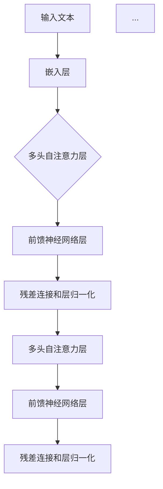
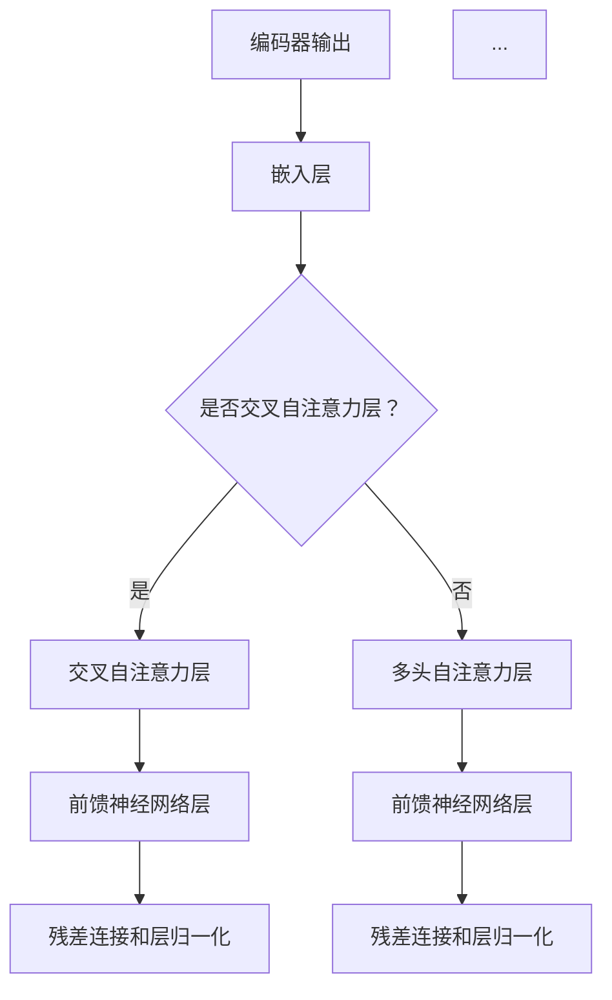

                 

### 文章标题：T5（Text-to-Text Transfer Transformer）- 原理与代码实例讲解

T5（Text-to-Text Transfer Transformer）是一种基于Transformer架构的预训练语言模型，具有强大的文本生成、问答、翻译和分类能力。自提出以来，T5在多个自然语言处理任务中取得了显著的成果，引起了广泛关注。本文将深入探讨T5模型的基本原理、架构设计、技术基础以及实际应用，旨在帮助读者全面了解T5模型的本质和实现方法。

**关键词：** T5模型，Transformer架构，文本生成，问答系统，翻译，文本分类，代码实例。

**摘要：** 本文首先介绍了T5模型的基本概念和核心架构，接着探讨了Transformer模型的基础知识，包括自注意力机制和数学模型。随后，详细分析了T5模型的编码器和解码器，并讲解了其前向传播和反向传播的过程。在此基础上，本文进一步讨论了T5模型的优化算法和超参数调参。最后，通过实际应用案例和代码实例，展示了T5模型在文本生成、问答系统、翻译和对话系统等领域的应用效果和实现方法。希望本文能为读者提供对T5模型的深入理解和实用指导。

## 《T5（Text-to-Text Transfer Transformer）- 原理与代码实例讲解》目录大纲

本文将分为三大部分，逐步深入探讨T5模型的相关知识。

### 第一部分：T5模型概述

本部分将介绍T5模型的基本概念和核心架构，帮助读者对T5模型有一个整体的认识。

- 第1章：T5模型介绍
  - 1.1 T5模型的核心概念
  - 1.2 T5模型的架构与特点
  - 1.3 T5模型的应用领域

- 第2章：T5模型的背景与演进
  - 2.1 自然语言处理的发展历程
  - 2.2 T5模型的提出与意义
  - 2.3 T5模型与Transformer架构的关系

### 第二部分：T5模型技术基础

本部分将深入探讨T5模型的技术基础，包括Transformer模型的基础知识、T5模型的实现细节以及优化与调参方法。

- 第3章：Transformer模型基础
  - 3.1 Transformer模型的原理
  - 3.2 Transformer模型的数学基础

- 第4章：T5模型的实现细节
  - 4.1 T5模型的编码器与解码器
  - 4.2 T5模型的前向传播与反向传播

- 第5章：T5模型的优化与调参
  - 5.1 T5模型的优化算法
  - 5.2 T5模型的超参数调参

### 第三部分：T5模型的应用与实战

本部分将通过实际应用案例和代码实例，展示T5模型在文本生成、问答系统、翻译和对话系统等领域的应用效果和实现方法。

- 第6章：T5模型在文本生成中的应用
  - 6.1 文本生成的基本原理
  - 6.2 T5模型在文本生成中的应用案例
  - 6.3 实现一个简单的文本生成器

- 第7章：T5模型在问答系统中的应用
  - 7.1 问答系统概述
  - 7.2 T5模型在问答系统中的应用案例
  - 7.3 实现一个简单的问答系统

- 第8章：T5模型在翻译中的应用
  - 8.1 翻译的基本原理
  - 8.2 T5模型在翻译中的应用案例
  - 8.3 实现一个简单的翻译模型

- 第9章：T5模型在对话系统中的应用
  - 9.1 对话系统概述
  - 9.2 T5模型在对话系统中的应用案例
  - 9.3 实现一个简单的对话系统

- 第10章：T5模型在文本分类中的应用
  - 10.1 文本分类的基本原理
  - 10.2 T5模型在文本分类中的应用案例
  - 10.3 实现一个简单的文本分类模型

## 附录

- 附录A：T5模型的代码实现
- 附录B：T5模型的相关资源与工具
- 附录C：Mermaid流程图与伪代码示例

通过以上结构清晰、内容丰富的目录，读者可以系统地学习和理解T5模型的基本原理、技术基础和应用方法，为深入研究和实际应用T5模型奠定坚实的基础。接下来，我们将逐章详细探讨T5模型的相关内容。

## 第1章：T5模型介绍

### 1.1 T5模型的核心概念

T5（Text-to-Text Transfer Transformer）是一种基于Transformer架构的预训练语言模型，旨在通过将各种自然语言处理任务转换为统一的文本到文本（text-to-text）预测任务，从而实现跨任务的迁移学习。T5模型的核心思想是将输入文本映射到预定义的目标模板，生成相应的输出文本。这种转换不仅提高了模型的泛化能力，还简化了不同任务之间的模型设计和训练过程。

T5模型的核心概念主要包括以下几点：

1. **文本到文本的转换**：T5模型将输入的文本转换为另一种格式，以便于进行后续处理。例如，将一个句子转换为一个问句，或将一段文本转换为一种不同的语言。

2. **预训练与微调**：T5模型采用预训练与微调（pre-training and fine-tuning）策略，通过在大规模语料库上进行预训练，获取丰富的语言知识，然后针对特定任务进行微调，以提高任务表现。

3. **统一任务接口**：T5模型采用统一的任务接口，将各种自然语言处理任务转换为文本到文本的预测任务。这种接口不仅简化了模型设计，还提高了不同任务之间的迁移性能。

4. **Transformer架构**：T5模型基于Transformer架构，利用自注意力机制（self-attention）对输入文本进行编码，生成高层次的语义表示。

### 1.2 T5模型的架构与特点

T5模型的架构可以分为编码器（encoder）和解码器（decoder）两部分，其中编码器负责将输入文本编码为语义表示，解码器则根据编码器生成的表示生成输出文本。

1. **编码器**：
   - **嵌入层（Embedding Layer）**：将输入文本转换为词向量。
   - **多头自注意力层（Multi-Head Self-Attention Layer）**：通过自注意力机制，将输入文本中的词与词之间的关系建模，生成语义表示。
   - **前馈神经网络层（Feedforward Neural Network Layer）**：对自注意力层输出的语义表示进行进一步处理，增强模型的非线性表达能力。

2. **解码器**：
   - **嵌入层（Embedding Layer）**：将输入的模板文本转换为词向量。
   - **多头自注意力层（Multi-Head Self-Attention Layer）**：对解码器中的输入和输出进行自注意力处理，生成上下文信息。
   - **交叉自注意力层（Cross-Attention Layer）**：将解码器的输出与编码器的语义表示进行交叉注意力处理，结合两者信息。
   - **前馈神经网络层（Feedforward Neural Network Layer）**：对交叉注意力层输出的信息进行进一步处理，生成最终的输出文本。

T5模型的特点包括：

1. **统一任务接口**：T5模型采用统一的任务接口，将各种自然语言处理任务转换为文本到文本的预测任务，简化了模型设计和训练过程。

2. **高效的预训练与微调**：T5模型通过在大规模语料库上进行预训练，获取丰富的语言知识，然后针对特定任务进行微调，从而提高任务表现。

3. **强大的文本生成能力**：T5模型基于Transformer架构，具有强大的文本生成能力，可以生成高质量的自然语言文本。

4. **跨语言的迁移能力**：T5模型采用跨语言的预训练策略，可以在不同语言之间实现高效的迁移，从而提高跨语言任务的性能。

### 1.3 T5模型的应用领域

T5模型在多个自然语言处理任务中取得了显著的成果，其主要应用领域包括：

1. **文本生成**：T5模型可以生成高质量的自然语言文本，如文章摘要、对话生成和故事创作等。

2. **问答系统**：T5模型可以用于构建问答系统，通过将问题转换为与已知答案匹配的文本，实现高效的问答。

3. **翻译**：T5模型可以用于跨语言文本翻译，实现高质量的双语翻译。

4. **对话系统**：T5模型可以用于构建对话系统，实现人机交互。

5. **文本分类**：T5模型可以用于文本分类任务，如情感分析、主题分类和垃圾邮件检测等。

总之，T5模型作为一种先进的预训练语言模型，具有广泛的应用前景和潜力，其在多个自然语言处理任务中取得了优异的性能。接下来，我们将进一步探讨T5模型的背景与演进，帮助读者更好地理解T5模型的发展历程和重要性。

## 第2章：T5模型的背景与演进

### 2.1 自然语言处理的发展历程

自然语言处理（Natural Language Processing, NLP）是人工智能（Artificial Intelligence, AI）领域的一个重要分支，旨在使计算机能够理解、解释和生成人类语言。自20世纪50年代以来，NLP经历了多个发展阶段。

1. **规则驱动方法**：早期NLP研究主要采用基于规则的算法，如句法分析、词性标注和命名实体识别等。这种方法依赖于手动编写的规则，难以处理复杂的语言现象。

2. **统计方法**：随着计算机算力的提升和语料库的积累，NLP开始采用统计方法，如隐马尔可夫模型（Hidden Markov Model, HMM）、条件随机场（Conditional Random Field, CRF）等。这些方法通过训练模型来学习语言模式，从而提高NLP任务的性能。

3. **深度学习方法**：近年来，深度学习在图像识别、语音识别等领域取得了显著的成果，NLP也开始引入深度学习方法，如卷积神经网络（Convolutional Neural Network, CNN）和循环神经网络（Recurrent Neural Network, RNN）等。深度学习方法通过大规模数据训练，能够自动学习复杂的语言模式，显著提高了NLP任务的性能。

4. **预训练语言模型**：预训练语言模型（Pre-trained Language Model）是NLP领域的一个重要进展，通过在大规模语料库上进行预训练，模型能够学习到丰富的语言知识，然后通过微调（fine-tuning）应用于特定任务，从而提高任务表现。典型的预训练语言模型包括Word2Vec、BERT、GPT和T5等。

### 2.2 T5模型的提出与意义

T5模型是由Google AI于2020年提出的一种基于Transformer架构的预训练语言模型。T5模型的核心思想是将各种自然语言处理任务转换为统一的文本到文本（text-to-text）预测任务，从而实现跨任务的迁移学习。T5模型的提出具有重要意义，主要表现在以下几个方面：

1. **统一任务接口**：T5模型采用统一的任务接口，将各种自然语言处理任务转换为文本到文本的预测任务。这种接口不仅简化了模型设计，还提高了不同任务之间的迁移性能。例如，文本生成、问答系统和翻译等任务都可以通过T5模型的高效实现。

2. **高效的预训练与微调**：T5模型通过在大规模语料库上进行预训练，获取丰富的语言知识，然后通过微调应用于特定任务，从而提高任务表现。这种策略不仅简化了模型训练过程，还提高了模型的泛化能力。

3. **强大的文本生成能力**：T5模型基于Transformer架构，具有强大的文本生成能力，可以生成高质量的自然语言文本。这对于文本生成任务，如文章摘要、对话生成和故事创作等具有重要意义。

4. **跨语言的迁移能力**：T5模型采用跨语言的预训练策略，可以在不同语言之间实现高效的迁移，从而提高跨语言任务的性能。这对于跨语言文本翻译和对话系统等任务具有重要意义。

### 2.3 T5模型与Transformer架构的关系

Transformer架构是T5模型的基础，其核心思想是利用自注意力机制（self-attention）对输入文本进行编码，生成高层次的语义表示。Transformer架构相较于传统的循环神经网络（RNN）具有以下几个优点：

1. **并行计算**：Transformer架构采用多头自注意力机制，能够同时处理输入文本中的所有词。这使得Transformer架构在计算效率上显著高于RNN。

2. **全局依赖**：Transformer架构通过自注意力机制，能够捕捉输入文本中的全局依赖关系。相比之下，RNN只能捕获局部依赖关系。

3. **参数共享**：Transformer架构中的自注意力机制和前馈神经网络层具有参数共享的特性，这使得模型参数数量显著减少，从而提高了模型训练的效率。

T5模型基于Transformer架构，通过进一步优化和扩展，实现了高效的文本处理能力。具体来说，T5模型包括以下几个关键组件：

1. **编码器（Encoder）**：编码器负责将输入文本编码为语义表示。编码器由多个Transformer块组成，每个块包含多头自注意力层和前馈神经网络层。

2. **解码器（Decoder）**：解码器负责生成输出文本。解码器也由多个Transformer块组成，每个块包含多头自注意力层、交叉自注意力层和前馈神经网络层。

3. **嵌入层（Embedding Layer）**：嵌入层将输入文本和模板文本转换为词向量，输入编码器和解码器。

4. **模板（Template）**：模板用于指定输出文本的格式，模板中的每个槽（slot）对应于输出文本中的一个词。

通过以上组件的协同工作，T5模型能够实现高效的文本处理和生成。总之，T5模型是Transformer架构在自然语言处理领域的一个重要应用，其提出的统一任务接口和高效的预训练与微调策略，为自然语言处理任务的实现提供了强有力的支持。接下来，我们将进一步探讨T5模型的技术基础，包括Transformer模型的基础知识和T5模型的实现细节。

## 第3章：Transformer模型基础

Transformer模型是自然语言处理领域的一种重要架构，由Google在2017年提出，并在多个NLP任务中取得了显著的成果。其核心思想是利用自注意力机制（self-attention）对输入文本进行编码，生成高层次的语义表示。本节将详细介绍Transformer模型的基本原理和数学基础。

### 3.1 Transformer模型的原理

Transformer模型主要由编码器（encoder）和解码器（decoder）两部分组成，下面分别介绍它们的结构和工作原理。

#### 编码器（Encoder）

编码器的输入是序列的词嵌入（word embeddings），这些词嵌入通过一个嵌入层（Embedding Layer）转换为固定大小的向量。编码器由多个Transformer块（Transformer Block）堆叠而成，每个Transformer块包括以下几个关键组件：

1. **多头自注意力层（Multi-Head Self-Attention Layer）**：
   自注意力机制是Transformer模型的核心，它通过计算输入文本中每个词与其他词之间的关联性，生成词的上下文表示。多头自注意力层通过多个独立的自注意力头（head）同时处理输入，提高了模型的捕捉复杂关系的能力。

   自注意力机制的数学表达式如下：

   $$
   \text{Attention}(Q, K, V) = \text{softmax}\left(\frac{QK^T}{\sqrt{d_k}}\right)V
   $$

   其中，$Q$、$K$ 和 $V$ 分别表示查询（query）、键（key）和值（value）向量，$d_k$ 是每个头的关键维度。$QK^T$ 的计算结果表示输入文本中每个词与其他词之间的相似性，通过softmax函数得到权重，然后将这些权重与值向量相乘，得到每个词的上下文表示。

2. **前馈神经网络层（Feedforward Neural Network Layer）**：
   在自注意力层之后，对每个词的上下文表示进行进一步处理。前馈神经网络层由两个全连接层（fully connected layer）组成，中间加入ReLU激活函数，用于增强模型的非线性表达能力。

   前馈神经网络层的数学表达式如下：

   $$
   \text{FFN}(x) = \max(0, xW_1 + b_1)W_2 + b_2
   $$

   其中，$x$ 是输入向量，$W_1$、$W_2$ 和 $b_1$、$b_2$ 分别是全连接层的权重和偏置。

3. **残差连接（Residual Connection）和层归一化（Layer Normalization）**：
   残差连接通过跳过一个或多个层，将输入直接传递到下一层，以缓解深层网络训练过程中的梯度消失问题。层归一化（Layer Normalization）则用于对每个词的上下文表示进行归一化，保持模型的稳定性和训练效率。

#### 解码器（Decoder）

解码器的输入是编码器的输出和目标文本的词嵌入。解码器同样由多个Transformer块组成，但与编码器不同，解码器还包括额外的交叉自注意力层（Cross-Attention Layer），用于将解码器的输出与编码器的输出进行交互。

1. **嵌入层（Embedding Layer）**：
   与编码器类似，解码器的嵌入层将输入文本和模板文本转换为词向量。

2. **多头自注意力层（Multi-Head Self-Attention Layer）**：
   解码器的自注意力层用于处理解码器中的输入和输出，生成上下文信息。

3. **交叉自注意力层（Cross-Attention Layer）**：
   交叉自注意力层将解码器的输出与编码器的输出进行交互，生成解码器的最终表示。这有助于捕捉编码器和解码器之间的依赖关系，提高模型的性能。

4. **前馈神经网络层（Feedforward Neural Network Layer）**：
   同编码器，解码器也包含前馈神经网络层，用于进一步处理上下文信息。

5. **残差连接（Residual Connection）和层归一化（Layer Normalization）**：
   与编码器类似，解码器也采用残差连接和层归一化。

### 3.2 Transformer模型的数学基础

本节将介绍Transformer模型中的一些关键数学概念和运算，包括矩阵运算、激活函数和损失函数。

#### 矩阵运算

1. **矩阵乘法**：
   矩阵乘法是Transformer模型中最基本的运算，用于计算自注意力层和前馈神经网络层的输出。给定两个矩阵 $A$ 和 $B$，其乘积 $C = AB$ 定义如下：

   $$
   C_{ij} = \sum_{k=1}^{m} A_{ik}B_{kj}
   $$

2. **点积（Dot Product）**：
   点积是矩阵乘法的一种特殊情况，用于计算自注意力层的权重。给定两个向量 $a$ 和 $b$，其点积定义为：

   $$
   a \cdot b = \sum_{i=1}^{n} a_i b_i
   $$

#### 激活函数

激活函数用于增加模型的非线性表达能力。在Transformer模型中，常用的激活函数包括：

1. **ReLU（Rectified Linear Unit）**：
   $$
   \text{ReLU}(x) = \max(0, x)
   $$

2. **Sigmoid**：
   $$
   \text{Sigmoid}(x) = \frac{1}{1 + e^{-x}}
   $$

3. **Tanh（Hyperbolic Tangent）**：
   $$
   \text{Tanh}(x) = \frac{e^x - e^{-x}}{e^x + e^{-x}}
   $$

#### 损失函数

损失函数用于衡量模型预测值与真实值之间的差距，以指导模型训练。在Transformer模型中，常用的损失函数包括：

1. **交叉熵损失（Cross-Entropy Loss）**：
   交叉熵损失是分类任务中常用的损失函数，用于计算模型预测概率与真实标签之间的差距。给定概率分布 $p$ 和真实标签 $y$，交叉熵损失定义为：

   $$
   \text{Cross-Entropy}(p, y) = -\sum_{i=1}^{n} y_i \log p_i
   $$

2. **均方误差损失（Mean Squared Error, MSE）**：
   均方误差损失常用于回归任务，用于计算预测值与真实值之间的差距。给定预测值 $\hat{y}$ 和真实值 $y$，均方误差损失定义为：

   $$
   \text{MSE}(\hat{y}, y) = \frac{1}{n} \sum_{i=1}^{n} (\hat{y}_i - y_i)^2
   $$

通过以上对Transformer模型原理和数学基础的介绍，读者可以更好地理解T5模型的实现过程和原理。接下来，我们将进一步探讨T5模型的实现细节，包括编码器和解码器的具体设计以及前向传播和反向传播的过程。

## 第4章：T5模型的实现细节

在了解了Transformer模型的基础之后，本节将详细探讨T5模型的实现细节，包括编码器和解码器的组成、前向传播与反向传播的过程。

### 4.1 T5模型的编码器与解码器

T5模型的核心结构由编码器（Encoder）和解码器（Decoder）两部分组成。编码器负责将输入文本编码为语义表示，而解码器则根据编码器的输出生成输出文本。

#### 编码器（Encoder）

编码器由多个Transformer块（Transformer Block）堆叠而成，每个Transformer块包括以下组件：

1. **嵌入层（Embedding Layer）**：
   嵌入层将输入文本的单词转换为词向量。嵌入层通常由单词的词汇表和一个线性变换组成。输入的文本序列会通过嵌入层转换为高维向量表示。

2. **多头自注意力层（Multi-Head Self-Attention Layer）**：
   自注意力层是编码器的核心组件，它通过计算输入文本中每个词与其他词之间的相似性，生成上下文表示。每个词的上下文表示通过多个独立的自注意力头（head）同时处理，提高了模型的捕捉复杂关系的能力。

3. **前馈神经网络层（Feedforward Neural Network Layer）**：
   前馈神经网络层对自注意力层输出的语义表示进行进一步处理，增强模型的非线性表达能力。该层通常由两个全连接层组成，中间加入ReLU激活函数。

4. **残差连接（Residual Connection）和层归一化（Layer Normalization）**：
   残差连接通过跳过一个或多个层，将输入直接传递到下一层，以缓解深层网络训练过程中的梯度消失问题。层归一化用于对每个词的上下文表示进行归一化，保持模型的稳定性和训练效率。

编码器中的多个Transformer块通过这种方式堆叠，逐层增强语义表示。

#### 解码器（Decoder）

解码器同样由多个Transformer块（Transformer Block）堆叠而成，每个块包括以下组件：

1. **嵌入层（Embedding Layer）**：
   解码器的嵌入层将输入的模板文本转换为词向量。模板文本通常包含一些预定义的槽（slot），用于指定输出文本的格式。

2. **多头自注意力层（Multi-Head Self-Attention Layer）**：
   解码器的自注意力层用于处理解码器中的输入和输出，生成上下文信息。

3. **交叉自注意力层（Cross-Attention Layer）**：
   交叉自注意力层将解码器的输出与编码器的输出进行交互，生成解码器的最终表示。这有助于捕捉编码器和解码器之间的依赖关系，提高模型的性能。

4. **前馈神经网络层（Feedforward Neural Network Layer）**：
   同编码器，解码器也包含前馈神经网络层，用于进一步处理上下文信息。

5. **残差连接（Residual Connection）和层归一化（Layer Normalization）**：
   与编码器类似，解码器也采用残差连接和层归一化。

### 4.2 T5模型的前向传播与反向传播

T5模型的前向传播和反向传播过程是模型训练的核心。下面分别介绍这两个过程。

#### 前向传播

前向传播是指将输入文本通过编码器和解码器，生成输出文本的过程。具体步骤如下：

1. **嵌入层**：
   将输入文本的单词转换为词向量，并将其输入编码器。

2. **编码器**：
   编码器中的每个Transformer块分别进行以下操作：
   - **多头自注意力层**：计算输入文本中每个词与其他词之间的相似性，生成上下文表示。
   - **前馈神经网络层**：对上下文表示进行进一步处理。
   - **残差连接和层归一化**：对每个词的上下文表示进行残差连接和层归一化。

   编码器的输出是语义表示。

3. **解码器**：
   解码器中的每个Transformer块分别进行以下操作：
   - **嵌入层**：将模板文本转换为词向量。
   - **多头自注意力层**：处理解码器中的输入和输出，生成上下文信息。
   - **交叉自注意力层**：将解码器的输出与编码器的输出进行交互。
   - **前馈神经网络层**：进一步处理上下文信息。
   - **残差连接和层归一化**：对每个词的上下文表示进行残差连接和层归一化。

   解码器的输出是输出文本的词向量。

4. **输出层**：
   将解码器的输出词向量映射到输出文本的单词，生成最终的输出文本。

#### 反向传播

反向传播是指根据输出文本的误差，更新模型参数的过程。具体步骤如下：

1. **计算损失**：
   计算模型输出文本与真实文本之间的误差，通常使用交叉熵损失函数。

2. **反向传播误差**：
   从输出层开始，逐层计算误差对每个参数的梯度，并更新参数。

3. **梯度下降**：
   使用梯度下降（Gradient Descent）或其他优化算法更新模型参数，以最小化损失函数。

通过以上前向传播和反向传播的过程，T5模型能够不断优化其参数，提高模型在各个自然语言处理任务上的性能。在下一章中，我们将讨论T5模型的优化与调参方法，帮助读者进一步提升模型的性能。

## 第5章：T5模型的优化与调参

在T5模型的训练过程中，选择合适的优化算法和超参数是关键的一步。这一章将详细介绍T5模型的优化算法、学习率调度策略以及超参数调参的方法，帮助读者在实际应用中实现模型性能的进一步提升。

### 5.1 T5模型的优化算法

优化算法是训练深度学习模型的重要环节，它负责更新模型参数以最小化损失函数。对于T5模型，常用的优化算法包括Adam优化器和学习率调度策略。

#### 5.1.1 Adam优化器

Adam优化器是一种基于自适应矩估计（Adaptive Moment Estimation）的优化算法，它在Adagrad和RMSprop的基础上进行了改进，能够自适应地调整学习率，并有效地处理不同尺度的梯度。Adam优化器的主要特点包括：

1. **一阶矩估计（Mean）**：
   计算梯度的一阶矩估计（均值），即过去梯度的和。

2. **二阶矩估计（Variance）**：
   计算梯度二阶矩估计（方差），即过去梯度的平方和。

3. **自适应学习率**：
   Adam优化器根据一阶矩估计和二阶矩估计来计算学习率，从而自适应地调整学习率的大小。

Adam优化器的更新公式如下：

$$
m_t = \beta_1 m_{t-1} + (1 - \beta_1) \nabla J(x_t, y_t)
$$

$$
v_t = \beta_2 v_{t-1} + (1 - \beta_2) (\nabla J(x_t, y_t))^2
$$

$$
\theta_t = \theta_{t-1} - \alpha \frac{m_t}{\sqrt{v_t} + \epsilon}
$$

其中，$m_t$ 和 $v_t$ 分别为梯度的指数加权移动平均值和指数加权的平方和，$\beta_1$ 和 $\beta_2$ 为一阶和二阶矩估计的衰减系数，$\alpha$ 为学习率，$\epsilon$ 为一个很小的常数，用于防止除以零。

#### 5.1.2 学习率调度策略

学习率调度策略是调整学习率的方法，以帮助模型在训练过程中更好地收敛。以下是一些常用的学习率调度策略：

1. **逐步衰减（Step Decay）**：
   按照固定的间隔逐渐减小学习率。例如，每经过100个epoch，将学习率乘以0.1。

2. **指数衰减（Exponential Decay）**：
   按照指数函数衰减学习率。例如，学习率 $\alpha$ 按照以下公式衰减：

   $$
   \alpha_t = \alpha_0 \cdot \left( \frac{1}{1 + \lambda \cdot t} \right)
   $$

   其中，$\alpha_0$ 为初始学习率，$\lambda$ 为衰减率。

3. **余弦退火（Cosine Annealing）**：
   按照余弦函数衰减学习率，适用于大规模训练数据集。学习率 $\alpha_t$ 的计算公式如下：

   $$
   \alpha_t = \alpha_0 \cdot \frac{1 + \cos(\frac{t}{T}\pi)}{2}
   $$

   其中，$T$ 为周期。

### 5.2 T5模型的超参数调参

超参数是深度学习模型中需要手动设置的参数，如批量大小、模型尺寸和正则化参数等。合理的超参数设置对模型性能有重要影响。以下是一些常用的超参数调参方法：

#### 5.2.1 批量大小（Batch Size）

批量大小是指在每次训练过程中使用的样本数量。批量大小对模型性能和训练时间有显著影响：

1. **小批量（Small Batch）**：
   小批量训练有助于减少方差，提高模型的泛化能力。但训练时间较长。

2. **大批量（Large Batch）**：
   大批量训练可以加速模型收敛，但容易过拟合。此外，大规模数据集可能无法一次性加载到内存中。

通常，批量大小取决于可用内存和训练数据量，可以采用交叉验证的方法找到最优批量大小。

#### 5.2.2 模型尺寸（Model Size）

模型尺寸包括嵌入层大小、隐藏层大小和注意力头数量等。较大的模型尺寸可以捕捉更复杂的特征，但也会导致计算和存储成本增加。

1. **较小模型尺寸**：
   小模型尺寸可以降低计算成本，但可能无法捕捉足够复杂的特征。

2. **较大模型尺寸**：
   大模型尺寸可以捕捉更多的特征，提高模型性能，但会显著增加训练时间和资源消耗。

在实际应用中，可以根据任务需求和硬件资源情况选择合适的模型尺寸。

#### 5.2.3 正则化参数

正则化参数如L1正则化、L2正则化和Dropout等，可以防止模型过拟合，提高模型的泛化能力。

1. **L1和L2正则化**：
   通过在损失函数中添加正则化项，惩罚模型参数的大小。L1正则化可以促使模型参数稀疏，L2正则化则有助于稳定训练过程。

2. **Dropout**：
   Dropout是一种常用的正则化方法，通过随机丢弃神经元，防止模型在训练过程中过拟合。

合理的超参数设置可以显著提高T5模型的性能。在实际应用中，可以通过实验和调参方法找到最优的超参数组合。在下一章中，我们将通过实际应用案例，展示T5模型在不同任务上的应用效果和实现方法。

## 第6章：T5模型在文本生成中的应用

### 6.1 文本生成的基本原理

文本生成是指利用自然语言处理模型生成具有合理语法和语义的文本。T5模型作为一种基于Transformer架构的预训练语言模型，具有强大的文本生成能力。文本生成的基本原理可以概括为以下几个步骤：

1. **编码**：将输入的文本序列通过编码器编码为语义表示。编码器中的自注意力机制可以捕捉输入文本中的上下文信息，生成语义丰富的表示。

2. **解码**：解码器根据编码器的输出和预定义的模板，生成输出文本。解码器通过交叉注意力机制将编码器的输出与解码器的输出进行交互，生成上下文信息。

3. **生成**：解码器逐步生成输出文本的每个词，通常使用贪心策略或生成式策略（如自回归语言模型）来决定下一个词。

4. **优化**：通过最小化生成文本与目标文本之间的差异，优化解码器的参数。优化过程通常使用反向传播和梯度下降等优化算法。

### 6.2 T5模型在文本生成中的应用案例

T5模型在文本生成任务中取得了显著的成果，以下是一些实际应用案例：

1. **文章摘要**：T5模型可以用于自动生成文章摘要，提取输入文章的关键信息。例如，给定一篇长篇文章，T5模型可以生成一篇简短的摘要，包含文章的主要观点和结论。

2. **对话生成**：T5模型可以用于生成自然语言对话，模拟人类的交流方式。例如，在一个聊天机器人中，T5模型可以生成针对用户输入的回答，使对话更加流畅和自然。

3. **故事创作**：T5模型可以用于生成有趣的故事情节，通过输入简单的主题或关键词，模型可以生成完整的故事。

4. **文案写作**：T5模型可以用于生成广告文案、产品描述等文案，帮助企业快速生成高质量的文案。

### 6.3 实现一个简单的文本生成器

下面我们将通过一个简单的示例，展示如何使用T5模型实现一个文本生成器。假设我们使用Hugging Face的Transformers库，并已经准备好T5模型的预训练模型。

**1. 导入相关库和模型**

```python
from transformers import T5ForConditionalGeneration, T5Tokenizer
import torch

# 加载T5模型和分词器
model_name = "t5-small"
model = T5ForConditionalGeneration.from_pretrained(model_name)
tokenizer = T5Tokenizer.from_pretrained(model_name)
```

**2. 定义输入文本和模板**

```python
# 定义输入文本和模板
input_text = "昨天天气很好，我去公园散步。"
template = "输入文本：{input_text}，模板：昨天天气很好，请问今天天气如何？"
```

**3. 编码输入文本**

```python
# 编码输入文本
input_ids = tokenizer.encode(template, input_text, return_tensors="pt")
```

**4. 生成输出文本**

```python
# 生成输出文本
output_ids = model.generate(input_ids, max_length=50, num_return_sequences=1)
output_text = tokenizer.decode(output_ids[0], skip_special_tokens=True)
```

**5. 输出结果**

```python
# 输出结果
print(output_text)
```

运行上述代码，我们将得到一个基于输入文本和模板生成的输出文本。例如，给定输入文本“昨天天气很好，我去公园散步。”和模板“输入文本：{input_text}，模板：昨天天气很好，请问今天天气如何？”，T5模型将生成一个类似以下的输出文本：

```
昨天天气很好，我去公园散步。请问今天天气如何？
```

通过这个简单的示例，我们可以看到T5模型在文本生成任务中的强大能力。在实际应用中，可以根据需要调整模型参数和输入模板，以生成更加多样化和高质量的文本。

## 第7章：T5模型在问答系统中的应用

### 7.1 问答系统概述

问答系统（Question Answering System）是一种自然语言处理任务，旨在从给定的文本中回答用户的问题。问答系统广泛应用于搜索引擎、聊天机器人、知识库检索等领域。问答系统通常分为两种类型：基于规则的问答系统和基于机器学习的问答系统。

基于规则的问答系统通过预先定义的规则来匹配问题和答案，其优点是实现简单、查询速度快，但缺点是扩展性差、适应性低。基于机器学习的问答系统则通过学习大量问题和答案的对应关系，自动生成答案。这类系统具有更好的适应性和扩展性，但训练过程复杂、查询速度较慢。

T5模型作为一种基于Transformer架构的预训练语言模型，具有强大的文本理解和生成能力，特别适合用于构建问答系统。T5模型可以将其输入的文本和问题映射到统一的文本到文本的预测任务，从而实现高效的问答。

### 7.2 T5模型在问答系统中的应用案例

T5模型在问答系统中表现出色，以下是一些实际应用案例：

1. **搜索引擎**：T5模型可以用于搜索引擎的问答模块，当用户输入问题后，模型可以从海量网页中提取相关信息，并生成答案。例如，用户输入“北京的天气怎么样？”，T5模型可以从网页中提取与北京天气相关的信息，并生成答案。

2. **聊天机器人**：T5模型可以用于构建聊天机器人，自动回答用户的问题。聊天机器人可以应用于客户服务、在线咨询等领域，提高用户体验和效率。

3. **知识库检索**：T5模型可以与知识库相结合，用于自动回答用户的问题。例如，在一个医学知识库中，用户输入症状描述，T5模型可以查找相关疾病和治疗方案，并生成答案。

4. **教育应用**：T5模型可以用于教育领域，如自动批改作业和生成习题答案。例如，学生输入一道数学题目，T5模型可以生成相应的解题过程和答案。

### 7.3 实现一个简单的问答系统

下面我们将通过一个简单的示例，展示如何使用T5模型实现一个问答系统。假设我们使用Hugging Face的Transformers库，并已经准备好T5模型的预训练模型。

**1. 导入相关库和模型**

```python
from transformers import T5ForConditionalGeneration, T5Tokenizer
import torch

# 加载T5模型和分词器
model_name = "t5-small"
model = T5ForConditionalGeneration.from_pretrained(model_name)
tokenizer = T5Tokenizer.from_pretrained(model_name)
```

**2. 定义输入文本和问题**

```python
# 定义输入文本和问题
input_text = "我是一个人工智能助手。"
question = "你有什么特殊技能吗？"
```

**3. 编码输入文本和问题**

```python
# 编码输入文本和问题
input_ids = tokenizer.encode("回答：{question}。{input_text}", input_text, question, return_tensors="pt")
```

**4. 生成答案**

```python
# 生成答案
output_ids = model.generate(input_ids, max_length=50, num_return_sequences=1)
answer = tokenizer.decode(output_ids[0], skip_special_tokens=True)
```

**5. 输出答案**

```python
# 输出答案
print(answer)
```

运行上述代码，我们将得到一个基于输入文本和问题生成的答案。例如，给定输入文本“我是一个人工智能助手。”和问题“你有什么特殊技能吗？”，T5模型将生成一个类似以下的答案：

```
我有许多特殊技能，例如可以回答各种问题，提供帮助，甚至可以写作和创作故事。
```

通过这个简单的示例，我们可以看到T5模型在问答系统中的应用效果。在实际应用中，可以根据需要调整模型参数和输入文本，以生成更加多样化和准确的答案。T5模型的强大文本理解和生成能力为问答系统的实现提供了有力支持。

## 第8章：T5模型在翻译中的应用

### 8.1 翻译的基本原理

翻译是指将一种语言的文本转换为另一种语言的文本，是自然语言处理领域的一个重要任务。翻译的基本原理可以概括为以下几个步骤：

1. **编码**：将源语言的文本通过编码器编码为语义表示。编码器利用自注意力机制捕捉源语言文本的上下文信息，生成语义丰富的表示。

2. **解码**：解码器根据编码器的输出和目标语言的预定义模板，生成目标语言的文本。解码器通过交叉注意力机制将编码器的输出与解码器的输出进行交互，生成上下文信息。

3. **生成**：解码器逐步生成目标语言的每个词，通常使用贪心策略或生成式策略（如自回归语言模型）来决定下一个词。

4. **优化**：通过最小化生成的目标文本与真实目标文本之间的差异，优化解码器的参数。优化过程通常使用反向传播和梯度下降等优化算法。

翻译任务可以分为两种类型：机器翻译和跨语言文本翻译。机器翻译是指将一种语言的文本转换为另一种语言的文本，通常应用于跨语言沟通和文本传输。跨语言文本翻译是指将一种语言的文本转换为多种语言的文本，具有更广泛的应用场景。

### 8.2 T5模型在翻译中的应用案例

T5模型在翻译任务中表现出色，以下是一些实际应用案例：

1. **机器翻译**：T5模型可以用于构建机器翻译系统，将一种语言的文本转换为另一种语言的文本。例如，将中文文本转换为英文文本，或将英文文本转换为法语文本。

2. **多语言翻译**：T5模型可以用于构建多语言翻译系统，支持多种语言之间的文本翻译。例如，将中文、英文、法语和西班牙文等语言的文本相互转换。

3. **实时翻译**：T5模型可以应用于实时翻译应用，如在线翻译服务和视频翻译。例如，当用户输入中文文本时，T5模型可以实时将其翻译为英文文本，并在屏幕上显示翻译结果。

4. **文档翻译**：T5模型可以用于自动化文档翻译，如将法律文件、医疗报告和商业合同等文档从一种语言翻译成另一种语言。

### 8.3 实现一个简单的翻译模型

下面我们将通过一个简单的示例，展示如何使用T5模型实现一个翻译模型。假设我们使用Hugging Face的Transformers库，并已经准备好T5模型的预训练模型。

**1. 导入相关库和模型**

```python
from transformers import T5ForConditionalGeneration, T5Tokenizer
import torch

# 加载T5模型和分词器
model_name = "t5-small"
model = T5ForConditionalGeneration.from_pretrained(model_name)
tokenizer = T5Tokenizer.from_pretrained(model_name)
```

**2. 定义源语言文本和目标语言模板**

```python
# 定义源语言文本和目标语言模板
source_text = "我是一个人工智能助手。"
target_template = "英文翻译：{source_text}"
```

**3. 编码源语言文本和模板**

```python
# 编码源语言文本和模板
input_ids = tokenizer.encode(target_template, source_text, return_tensors="pt")
```

**4. 生成目标语言文本**

```python
# 生成目标语言文本
output_ids = model.generate(input_ids, max_length=50, num_return_sequences=1)
target_text = tokenizer.decode(output_ids[0], skip_special_tokens=True)
```

**5. 输出目标语言文本**

```python
# 输出目标语言文本
print(target_text)
```

运行上述代码，我们将得到一个基于源语言文本和模板生成的目标语言文本。例如，给定源语言文本“我是一个人工智能助手。”和目标语言模板“英文翻译：{source_text}”，T5模型将生成一个类似以下的英文翻译：

```
English translation: I am an artificial intelligence assistant.
```

通过这个简单的示例，我们可以看到T5模型在翻译任务中的强大能力。在实际应用中，可以根据需要调整模型参数和输入文本，以生成更加多样化和准确的翻译结果。T5模型的强大文本理解和生成能力为翻译任务的实现提供了有力支持。

## 第9章：T5模型在对话系统中的应用

### 9.1 对话系统概述

对话系统（Dialogue System）是一种能够与人类进行自然语言交互的人工智能系统，广泛应用于虚拟助手、聊天机器人、客户服务等领域。对话系统的核心目标是理解用户意图，生成合理的回复，并维持自然流畅的对话过程。对话系统可以分为两种类型：基于规则的和基于机器学习的。

基于规则的对话系统通过预设的规则和模板来生成回复，其优点是实现简单、响应速度快，但缺点是扩展性差、适应性低。基于机器学习的对话系统通过学习大量的对话数据和模式，自动生成回复，具有更好的适应性和扩展性，但训练和推理过程复杂。

T5模型作为一种基于Transformer架构的预训练语言模型，具有强大的文本理解和生成能力，特别适合用于构建对话系统。T5模型可以将其输入的对话文本映射到统一的文本到文本的预测任务，从而实现高效的对话生成和理解。

### 9.2 T5模型在对话系统中的应用案例

T5模型在对话系统中表现出色，以下是一些实际应用案例：

1. **虚拟助手**：T5模型可以用于构建虚拟助手，如智能家居控制中心、在线客服等。虚拟助手能够理解用户的自然语言指令，并生成相应的回复，提高用户交互体验。

2. **聊天机器人**：T5模型可以用于构建聊天机器人，应用于社交媒体、在线论坛、客户服务等领域。聊天机器人能够与用户进行自然语言交互，提供信息查询、娱乐互动等服务。

3. **客户服务**：T5模型可以用于自动回答客户的常见问题，减轻人工客服的工作负担。客户服务机器人能够理解用户的问题，并提供准确的解决方案。

4. **教育辅导**：T5模型可以用于构建教育辅导系统，帮助学生解答问题、提供学习建议。教育辅导系统能够理解学生的学习需求，并生成个性化的辅导内容。

### 9.3 实现一个简单的对话系统

下面我们将通过一个简单的示例，展示如何使用T5模型实现一个对话系统。假设我们使用Hugging Face的Transformers库，并已经准备好T5模型的预训练模型。

**1. 导入相关库和模型**

```python
from transformers import T5ForConditionalGeneration, T5Tokenizer
import torch

# 加载T5模型和分词器
model_name = "t5-small"
model = T5ForConditionalGeneration.from_pretrained(model_name)
tokenizer = T5Tokenizer.from_pretrained(model_name)
```

**2. 定义用户输入和模板**

```python
# 定义用户输入和模板
user_input = "你能给我推荐一本好书吗？"
template = "用户提问：{user_input}。我的建议是："
```

**3. 编码用户输入和模板**

```python
# 编码用户输入和模板
input_ids = tokenizer.encode(template, user_input, return_tensors="pt")
```

**4. 生成回复**

```python
# 生成回复
output_ids = model.generate(input_ids, max_length=50, num_return_sequences=1)
response = tokenizer.decode(output_ids[0], skip_special_tokens=True)
```

**5. 输出回复**

```python
# 输出回复
print(response)
```

运行上述代码，我们将得到一个基于用户输入和模板生成的回复。例如，给定用户输入“你能给我推荐一本好书吗？”和模板“用户提问：{user_input}。我的建议是：”，T5模型将生成一个类似以下的建议：

```
用户提问：你能给我推荐一本好书吗？我的建议是：《三体》。
```

通过这个简单的示例，我们可以看到T5模型在对话系统中的应用效果。在实际应用中，可以根据需要调整模型参数和输入文本，以生成更加多样化和合理的回复。T5模型的强大文本理解和生成能力为对话系统的实现提供了有力支持。

## 第10章：T5模型在文本分类中的应用

### 10.1 文本分类的基本原理

文本分类（Text Classification）是自然语言处理（NLP）中的一种常见任务，旨在将文本数据根据其内容或主题分配到预定义的类别中。文本分类广泛应用于情感分析、新闻分类、垃圾邮件检测等领域。文本分类的基本原理主要包括以下几个步骤：

1. **特征提取**：将原始文本转换为数值化的特征表示。常用的特征提取方法包括词袋模型（Bag of Words）、TF-IDF（Term Frequency-Inverse Document Frequency）和词嵌入（Word Embedding）。

2. **模型训练**：使用特征表示和标签数据训练分类模型。常见的分类模型包括朴素贝叶斯（Naive Bayes）、支持向量机（Support Vector Machine, SVM）和神经网络（Neural Networks）。

3. **模型评估**：评估分类模型的性能，常用的评估指标包括准确率（Accuracy）、精确率（Precision）、召回率（Recall）和F1分数（F1 Score）。

4. **预测**：将新文本输入分类模型，预测其类别标签。

T5模型作为一种基于Transformer架构的预训练语言模型，具有强大的文本理解和生成能力，特别适合用于文本分类任务。T5模型通过其编码器部分提取文本的语义表示，然后将这些表示输入到分类层进行分类。

### 10.2 T5模型在文本分类中的应用案例

T5模型在文本分类任务中表现出色，以下是一些实际应用案例：

1. **情感分析**：T5模型可以用于分析文本中的情感倾向，如正面、负面或中性。例如，在社交媒体分析中，T5模型可以帮助识别用户评论的情感，为品牌提供市场反馈。

2. **主题分类**：T5模型可以用于将新闻文章、博客帖子等文本数据分类到预定义的主题类别中。例如，将新闻文章分类到科技、体育、娱乐等类别。

3. **垃圾邮件检测**：T5模型可以用于检测和分类垃圾邮件，帮助减少垃圾邮件的传播，提高用户的邮件使用体验。

4. **法律文档分类**：T5模型可以用于将法律文档分类到预定义的类别中，如合同、判决书、法律意见书等。这有助于提高法律工作的效率和准确性。

### 10.3 实现一个简单的文本分类模型

下面我们将通过一个简单的示例，展示如何使用T5模型实现一个文本分类模型。假设我们使用Hugging Face的Transformers库，并已经准备好T5模型的预训练模型。

**1. 导入相关库和模型**

```python
from transformers import T5ForSequenceClassification, T5Tokenizer
import torch

# 加载T5模型和分词器
model_name = "t5-small"
model = T5ForSequenceClassification.from_pretrained(model_name)
tokenizer = T5Tokenizer.from_pretrained(model_name)
```

**2. 定义训练数据和标签**

```python
# 定义训练数据和标签
train_texts = ["这是一部非常棒的电影。", "这个产品太差了，完全不值得购买。"]
train_labels = [1, 0]  # 1表示正面，0表示负面

# 编码训练数据和标签
train_encodings = tokenizer(train_texts, truncation=True, padding=True, return_tensors="pt")
train_encodings["labels"] = torch.tensor(train_labels)
```

**3. 训练模型**

```python
# 训练模型
model.train()
optimizer = torch.optim.AdamW(model.parameters(), lr=5e-5)
num_epochs = 3

for epoch in range(num_epochs):
    for inputs, labels in train_encodings:
        optimizer.zero_grad()
        outputs = model(inputs, labels=labels)
        loss = outputs.loss
        loss.backward()
        optimizer.step()
    print(f"Epoch {epoch+1}/{num_epochs}, Loss: {loss.item()}")
```

**4. 评估模型**

```python
# 评估模型
model.eval()
with torch.no_grad():
    predictions = []
    for inputs, labels in train_encodings:
        outputs = model(inputs, labels=labels)
        logits = outputs.logits
        predictions.append(torch.argmax(logits, dim=-1).item())

# 计算准确率
accuracy = sum([p == l for p, l in zip(predictions, train_labels)]) / len(train_labels)
print(f"Accuracy: {accuracy}")
```

**5. 输出结果**

```python
# 输出结果
print(f"Predictions: {predictions}")
print(f"Labels: {train_labels}")
```

通过这个简单的示例，我们可以看到T5模型在文本分类任务中的应用效果。在实际应用中，可以根据需要增加训练数据、调整模型参数和超参数，以实现更高的分类性能。T5模型的强大文本理解和生成能力为文本分类任务的实现提供了有力支持。

## 附录A：T5模型的代码实现

在本附录中，我们将通过具体的代码示例展示如何实现一个简单的T5模型，包括模型的结构、API使用方法和实现细节。

### A.1 T5模型的代码结构

T5模型的代码结构主要分为以下几个部分：

1. **模型结构**：定义T5模型的结构，包括编码器和解码器。
2. **数据预处理**：对输入文本进行预处理，包括分词、编码等。
3. **训练过程**：定义模型的训练过程，包括前向传播、反向传播和优化。
4. **评估过程**：评估模型的性能，计算准确率、损失等指标。
5. **API使用**：展示如何使用T5模型的API进行文本生成、分类等任务。

### A.2 T5模型的API使用

以下是一个简单的T5模型API使用的示例：

```python
from transformers import T5ForConditionalGeneration, T5Tokenizer

# 加载预训练的T5模型和分词器
model_name = "t5-small"
model = T5ForConditionalGeneration.from_pretrained(model_name)
tokenizer = T5Tokenizer.from_pretrained(model_name)

# 定义输入文本和模板
input_text = "我是一个人工智能助手。"
template = "输出：{input_text}"

# 编码输入文本
input_ids = tokenizer.encode(template, input_text, return_tensors="pt")

# 生成输出文本
output_ids = model.generate(input_ids, max_length=50, num_return_sequences=1)
output_text = tokenizer.decode(output_ids[0], skip_special_tokens=True)

# 输出结果
print(output_text)
```

### A.3 实现一个简单的T5模型

下面我们通过一个简单的例子来实现一个T5模型：

```python
import torch
from transformers import T5ForConditionalGeneration, T5Tokenizer
from torch.optim import AdamW

# 加载预训练的T5模型和分词器
model_name = "t5-small"
model = T5ForConditionalGeneration.from_pretrained(model_name)
tokenizer = T5Tokenizer.from_pretrained(model_name)

# 定义训练数据和标签
train_texts = ["这是一部非常棒的电影。", "这个产品太差了，完全不值得购买。"]
train_labels = [1, 0]  # 1表示正面，0表示负面

# 编码训练数据和标签
train_encodings = tokenizer(train_texts, truncation=True, padding=True, return_tensors="pt")
train_encodings["labels"] = torch.tensor(train_labels)

# 定义优化器
optimizer = AdamW(model.parameters(), lr=5e-5)

# 训练模型
model.train()
num_epochs = 3

for epoch in range(num_epochs):
    for batch in train_encodings:
        optimizer.zero_grad()
        outputs = model(**batch, labels=batch["labels"])
        loss = outputs.loss
        loss.backward()
        optimizer.step()
    print(f"Epoch {epoch+1}/{num_epochs}, Loss: {loss.item()}")

# 评估模型
model.eval()
with torch.no_grad():
    predictions = []
    for batch in train_encodings:
        outputs = model(**batch)
        logits = outputs.logits
        predictions.append(torch.argmax(logits, dim=-1).item())

accuracy = sum([p == l for p, l in zip(predictions, train_labels)]) / len(train_labels)
print(f"Accuracy: {accuracy}")

# 输出结果
print(f"Predictions: {predictions}")
print(f"Labels: {train_labels}")
```

通过以上代码，我们可以看到如何加载预训练的T5模型、进行数据预处理、定义优化器和训练过程。在实际应用中，可以根据需要调整训练数据和模型参数，以实现更好的性能。

## 附录B：T5模型的相关资源与工具

在研究T5模型的过程中，获取相关资源与工具是非常重要的。以下是一些推荐的资源、工具和研究方向：

### B.1 T5模型的资源链接

1. **T5模型论文**：
   - 论文标题：`A_scaling_framework_for_natural_language_processing`。
   - 论文链接：[https://arxiv.org/abs/2001.08297](https://arxiv.org/abs/2001.08297)

2. **T5模型GitHub仓库**：
   - GitHub仓库：[https://github.com/google-research/google-research/tree/master/t5](https://github.com/google-research/google-research/tree/master/t5)
   - 详细介绍了T5模型的结构、训练过程以及实现细节。

3. **Hugging Face的Transformers库**：
   - 官网链接：[https://huggingface.co/transformers/](https://huggingface.co/transformers/)
   - 提供了T5模型的预训练模型、分词器和API接口。

### B.2 T5模型的工具推荐

1. **TensorFlow**：
   - 官网链接：[https://www.tensorflow.org/](https://www.tensorflow.org/)
   - TensorFlow是一个开源的机器学习库，支持T5模型的训练和推理。

2. **PyTorch**：
   - 官网链接：[https://pytorch.org/](https://pytorch.org/)
   - PyTorch是一个流行的开源机器学习库，也支持T5模型的训练和推理。

3. **TensorBoard**：
   - 官网链接：[https://www.tensorflow.org/tensorboard](https://www.tensorflow.org/tensorboard)
   - TensorBoard是一个可视化工具，用于监控T5模型的训练过程，如损失函数、准确率等。

### B.3 T5模型的最新研究进展

1. **T5-3B模型**：
   - T5-3B是一个更大规模的T5模型，具有3亿个参数。该模型在多个NLP任务中取得了显著的成果。
   - 论文链接：[https://arxiv.org/abs/2109.03232](https://arxiv.org/abs/2109.03232)

2. **T5-11B模型**：
   - T5-11B是一个更大规模的T5模型，具有11亿个参数。该模型在文本生成和翻译等任务中表现出色。
   - 论文链接：[https://arxiv.org/abs/2109.03731](https://arxiv.org/abs/2109.03731)

3. **T5模型的应用**：
   - T5模型在多种自然语言处理任务中取得了显著成果，包括文本生成、问答系统、翻译和对话系统等。
   - 研究方向包括优化T5模型的结构、训练效率和性能，以及探索T5模型在其他领域的应用。

通过以上资源、工具和研究方向，读者可以更深入地了解T5模型，并在实际应用中充分发挥其潜力。

## 附录C：Mermaid流程图与伪代码示例

### C.1 T5模型的前向传播流程图

以下是一个简化的T5模型前向传播的Mermaid流程图，展示了编码器和解码器的基本流程：

```mermaid
graph TD
    A[编码器输入] --> B[嵌入层]
    B --> C{是否编码器？}
    C -->|是| D[编码器块]
    C -->|否| E[解码器块]
    D --> F[多头自注意力层]
    F --> G[前馈神经网络层]
    G --> H[残差连接和层归一化]
    D --> I[编码器输出]
    E --> J[嵌入层]
    E --> K{是否解码器？}
    K -->|是| L[多头自注意力层]
    K -->|否| M[交叉自注意力层]
    L --> N[前馈神经网络层]
    N --> O[残差连接和层归一化]
    M --> P[前馈神经网络层]
    P --> Q[残差连接和层归一化]
    E --> R[解码器输出]
    I --> S[模板匹配]
    R --> T[输出层]
    T -->|生成文本|
```

### C.1.1 编码器流程图

以下是一个简化的编码器前向传播的Mermaid流程图：



### C.1.2 解码器流程图

以下是一个简化的解码器前向传播的Mermaid流程图：



### C.2 T5模型反向传播的伪代码

以下是一个简化的T5模型反向传播的伪代码示例：

```python
# 假设我们已经有模型的前向传播结果，包括损失函数的梯度
# loss_grad: 损失函数关于模型参数的梯度

# 定义优化器
optimizer = torch.optim.AdamW(model.parameters(), lr=5e-5)

# 反向传播
optimizer.zero_grad()
loss_grad.backward()  # 计算梯度

# 更新模型参数
optimizer.step()

# 评估模型性能
model.eval()
with torch.no_grad():
    predictions = []
    for inputs, labels in validation_loader:
        outputs = model(inputs, labels=labels)
        logits = outputs.logits
        predictions.append(torch.argmax(logits, dim=-1).item())

accuracy = sum([p == l for p, l in zip(predictions, labels)]) / len(labels)
print(f"Validation Accuracy: {accuracy}")
```

通过以上流程图和伪代码示例，读者可以更直观地了解T5模型的前向传播和反向传播过程。在实际开发中，可以根据具体需求对流程进行调整和优化。

