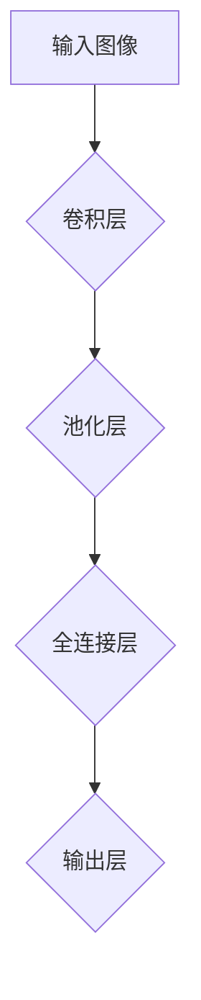
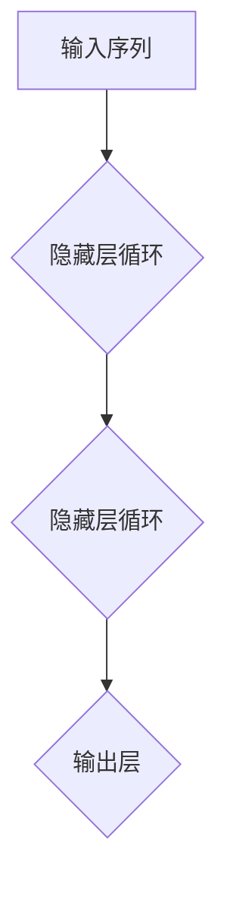
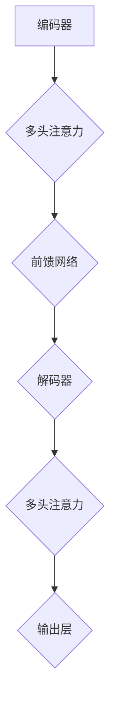
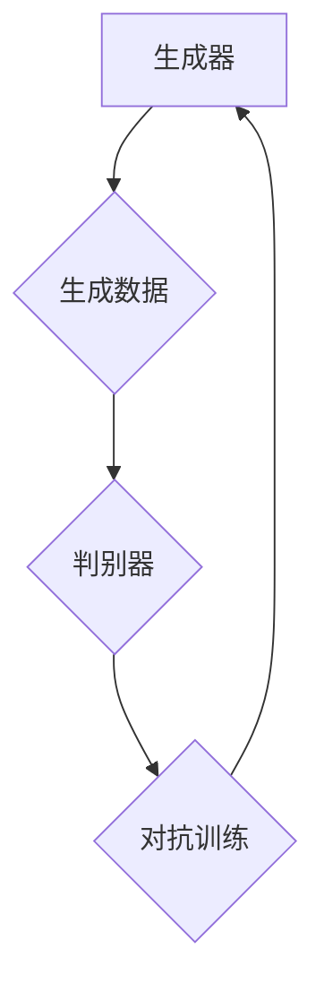
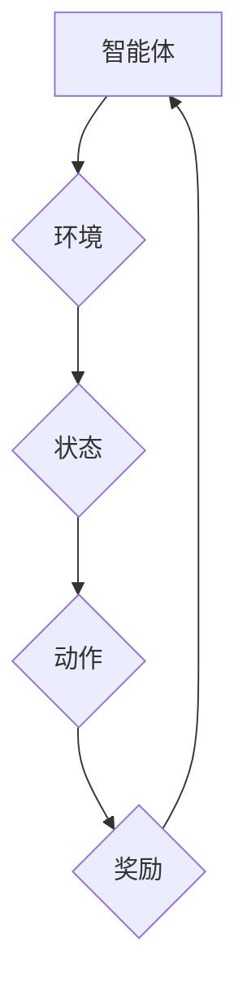

                 

# 《TensorFlow 进阶：高级神经网络技术》

> 关键词：TensorFlow，高级神经网络，卷积神经网络，循环神经网络，Transformer模型，生成对抗网络，深度强化学习

> 摘要：本文将深入探讨TensorFlow框架在高级神经网络技术中的应用，包括卷积神经网络（CNN）、循环神经网络（RNN）、Transformer模型、生成对抗网络（GAN）和深度强化学习。通过详细的理论讲解、伪代码展示、数学模型分析以及实际项目实战，帮助读者全面理解这些高级神经网络技术，并掌握如何在TensorFlow中实现和应用它们。

### 《TensorFlow 进阶：高级神经网络技术》目录大纲

#### 第一部分：TensorFlow基础与高级神经网络介绍

**第1章：TensorFlow基础**

- **1.1 TensorFlow简介**
  - TensorFlow的发展历程
  - TensorFlow的核心概念
  - TensorFlow的应用场景

- **1.2 TensorFlow安装与配置**
  - 系统环境配置
  - TensorFlow安装
  - TensorFlow常用库与工具

- **1.3 张量和操作**
  - 张量的概念
  - TensorFlow中的张量操作
  - 张量计算图

- **1.4 神经网络基础**
  - 神经网络概述
  - 前向传播与反向传播
  - 神经网络激活函数

- **1.5 优化算法**
  - 优化算法概述
  - 梯度下降算法
  - Adam优化器

#### 第二部分：高级神经网络技术详解

**第2章：卷积神经网络（CNN）**

- **2.1 CNN基本概念**
  - 卷积神经网络简介
  - 卷积操作
  - 池化操作

- **2.2 CNN结构**
  - 卷积层
  - 池化层
  - 全连接层

- **2.3 CNN训练与优化**
  - CNN损失函数
  - CNN优化算法
  - CNN超参数调优

- **2.4 CNN应用案例**
  - 图像分类
  - 目标检测
  - 图像分割

- **2.5 CNN与深度学习**
  - CNN与深度学习的关系
  - CNN在深度学习中的位置

**第3章：循环神经网络（RNN）**

- **3.1 RNN基本概念**
  - RNN概述
  - RNN单元
  - RNN的特性

- **3.2 RNN结构**
  - 隐藏层循环
  - 长短时记忆（LSTM）
  - 门控循环单元（GRU）

- **3.3 RNN训练与优化**
  - RNN损失函数
  - RNN优化算法
  - RNN超参数调优

- **3.4 RNN应用案例**
  - 语言模型
  - 机器翻译
  - 语音识别

- **3.5 RNN与深度学习**
  - RNN与深度学习的关系
  - RNN在深度学习中的扩展

**第4章：自注意力机制与Transformer模型**

- **4.1 自注意力机制**
  - 自注意力概述
  - 自注意力计算

- **4.2 Transformer模型**
  - Transformer架构
  - Multi-head Attention
  - Positional Encoding

- **4.3 Transformer训练与优化**
  - Transformer损失函数
  - Transformer优化算法
  - Transformer超参数调优

- **4.4 Transformer应用案例**
  - 语言生成
  - 文本摘要
  - 文本分类

- **4.5 Transformer与深度学习**
  - Transformer在深度学习中的发展
  - Transformer与其他模型的对比

**第5章：生成对抗网络（GAN）**

- **5.1 GAN基本概念**
  - GAN概述
  - GAN的架构

- **5.2 GAN训练与优化**
  - GAN损失函数
  - GAN优化算法
  - GAN训练技巧

- **5.3 GAN应用案例**
  - 图像生成
  - 图像修复
  - 视频生成

- **5.4 GAN与深度学习**
  - GAN在深度学习中的影响
  - GAN与其他模型的结合

**第6章：深度强化学习**

- **6.1 强化学习基本概念**
  - 强化学习概述
  - 强化学习的基本要素

- **6.2 深度强化学习**
  - 深度Q网络（DQN）
  - 策略梯度方法
  - 模型自由策略方法

- **6.3 深度强化学习应用案例**
  - 游戏AI
  - 无人驾驶
  - 金融交易

- **6.4 深度强化学习与深度学习**
  - 深度强化学习与深度学习的结合
  - 深度强化学习的挑战与未来

**第7章：TensorFlow与高级神经网络技术实战**

- **7.1 项目准备**
  - 开发环境搭建
  - 数据预处理

- **7.2 神经网络模型设计**
  - 模型架构设计
  - 模型训练与优化

- **7.3 项目实战**
  - 实际案例解析
  - 项目部署与调优

- **7.4 挑战与未来趋势**
  - 高级神经网络技术的挑战
  - 深度学习在工业界的应用趋势

#### 附录

**附录A：TensorFlow与深度学习资源**

- **A.1 TensorFlow官方文档与教程**
  - TensorFlow官方文档
  - TensorFlow教程

- **A.2 深度学习开源框架与库**
  - TensorFlow
  - PyTorch
  - Keras

- **A.3 深度学习社区与论坛**
  - Stack Overflow
  - ArXiv
  - GitHub

**附录B：高级神经网络技术 Mermaid 流程图**

- **B.1 卷积神经网络（CNN）**
- **B.2 循环神经网络（RNN）**
- **B.3 Transformer模型**
- **B.4 生成对抗网络（GAN）**
- **B.5 深度强化学习**

### **第一部分：TensorFlow基础与高级神经网络介绍**

#### **第1章：TensorFlow基础**

**1.1 TensorFlow简介**

TensorFlow是由Google开发的开源机器学习框架，它为深度学习和机器学习算法提供了强大的计算能力。TensorFlow的核心概念是计算图，它通过定义和执行计算图来构建和训练神经网络模型。

**TensorFlow的发展历程**

TensorFlow最早是由Google的Google Brain团队在2015年开发的。最初的目的是为了在Google内部用于大规模的深度学习模型训练。随着TensorFlow的不断发展，它在学术界和工业界都得到了广泛的应用，并成为最受欢迎的深度学习框架之一。

**TensorFlow的核心概念**

- **张量（Tensor）**：张量是TensorFlow中的基础数据结构，用于存储多维数据，如矩阵、向量等。
- **计算图（Computational Graph）**：计算图是一个表示数学运算和数据流的可编程表示。在TensorFlow中，所有的计算都是通过计算图来实现的。
- **节点（Nodes）**：计算图中的每个节点代表一个数学运算或数据操作。
- **边（Edges）**：计算图中的边表示数据在节点之间的流动。

**TensorFlow的应用场景**

TensorFlow广泛应用于计算机视觉、自然语言处理、语音识别、推荐系统等领域。例如，在图像分类任务中，TensorFlow可以用于训练卷积神经网络（CNN）；在自然语言处理任务中，TensorFlow可以用于训练循环神经网络（RNN）或Transformer模型。

**1.2 TensorFlow安装与配置**

要在本地环境中安装TensorFlow，首先需要安装Python和pip。以下是安装TensorFlow的步骤：

1. 安装Python和pip
2. 使用pip命令安装TensorFlow：

```shell
pip install tensorflow
```

**TensorFlow常用库与工具**

- **TensorFlow Core**：TensorFlow的核心库，提供了构建和训练神经网络的基本功能。
- **TensorFlow Estimators**：提供了高级API，用于构建和训练大规模神经网络模型。
- **TensorFlow Addons**：提供了扩展TensorFlow功能的预训练模型和工具。
- **TensorFlow Extended（TFX）**：提供了一个完整的端到端机器学习平台，用于构建、部署和管理机器学习模型。

**1.3 张量和操作**

**张量的概念**

张量是TensorFlow中的基础数据结构，用于存储多维数据。在TensorFlow中，张量可以有不同的维度，例如二维张量（矩阵）、三维张量（立方体）等。

**TensorFlow中的张量操作**

TensorFlow提供了丰富的张量操作，包括创建张量、操作张量、转换张量等。以下是一些常用的张量操作：

- **创建张量**：

```python
import tensorflow as tf

# 创建一个二维张量（矩阵）
matrix = tf.constant([[1, 2], [3, 4]])

# 创建一个三维张量（立方体）
cube = tf.constant([[[1, 2], [3, 4]], [[5, 6], [7, 8]]])
```

- **操作张量**：

```python
# 张量加法
result = tf.add(matrix, matrix)

# 张量乘法
result = tf.matmul(matrix, matrix)

# 张量转换
result = tf.reshape(cube, [-1, 8])
```

- **转换张量**：

```python
# 张量转换为NumPy数组
numpy_array = matrix.numpy()

# NumPy数组转换为张量
tensor = tf.convert_to_tensor(numpy_array)
```

**张量计算图**

在TensorFlow中，所有的计算都是通过计算图来实现的。以下是一个简单的计算图示例：

```python
import tensorflow as tf

# 创建一个计算图
with tf.Graph().as_default():
  # 定义变量
  x = tf.get_variable("x", shape=[2, 3], dtype=tf.float32)
  y = tf.get_variable("y", shape=[3, 2], dtype=tf.float32)

  # 定义操作
  z = tf.matmul(x, y)

  # 启动图
  with tf.Session() as sess:
    # 初始化变量
    sess.run(tf.global_variables_initializer())

    # 运行操作
    result = sess.run(z)
    print(result)
```

**1.4 神经网络基础**

**神经网络概述**

神经网络是一种模拟人脑结构和功能的计算模型，由大量的神经元（节点）组成。在深度学习中，神经网络被广泛用于各种任务，如图像分类、语音识别、自然语言处理等。

**前向传播与反向传播**

神经网络通过前向传播和反向传播来训练模型。前向传播是将输入数据传递到网络的每个神经元，并计算输出。反向传播是通过计算损失函数的梯度，并更新网络的权重和偏置。

**神经网络激活函数**

激活函数是神经网络中的一个关键组件，用于引入非线性特性。常见的激活函数包括：

- **sigmoid函数**：\[f(x) = \frac{1}{1 + e^{-x}}\]
- **ReLU函数**：\[f(x) = \max(0, x)\]
- **Tanh函数**：\[f(x) = \frac{e^x - e^{-x}}{e^x + e^{-x}}\]

**1.5 优化算法**

**优化算法概述**

优化算法用于在神经网络训练过程中调整模型的权重和偏置，以最小化损失函数。常见的优化算法包括：

- **梯度下降**：\[w_{\text{new}} = w_{\text{old}} - \alpha \cdot \nabla_w J(w)\]
- **随机梯度下降**：\[w_{\text{new}} = w_{\text{old}} - \alpha \cdot \nabla_w J(w)\]
- **Adam优化器**：结合了梯度下降和动量的优点，具有自适应学习率。

**梯度下降算法**

梯度下降是一种简单的优化算法，其基本思想是通过计算损失函数的梯度来更新模型的权重和偏置。

```python
import numpy as np

# 假设有一个简单的损失函数 J(w) = (w - 1)^2
w = 0.5
learning_rate = 0.1

for _ in range(100):
  gradient = 2 * (w - 1)
  w = w - learning_rate * gradient
  print(f"Epoch {_ + 1}: w = {w}")
```

**Adam优化器**

Adam优化器结合了梯度下降和动量的优点，具有自适应学习率。其更新规则如下：

```python
import numpy as np

# 假设有一个简单的损失函数 J(w) = (w - 1)^2
w = 0.5
learning_rate = 0.1
beta1 = 0.9
beta2 = 0.999
epsilon = 1e-8

m = 0
v = 0

for _ in range(100):
  gradient = 2 * (w - 1)
  
  # 更新m和v
  m = beta1 * m + (1 - beta1) * gradient
  v = beta2 * v + (1 - beta2) * gradient**2
  
  # 平滑m和v
  m_hat = m / (1 - beta1**_)
  v_hat = v / (1 - beta2**_)
  
  # 更新w
  w = w - learning_rate * m_hat / (np.sqrt(v_hat) + epsilon)
  print(f"Epoch {_ + 1}: w = {w}")
```

**第2章：卷积神经网络（CNN）**

**2.1 CNN基本概念**

卷积神经网络（Convolutional Neural Network，CNN）是一种特殊的神经网络，专门用于处理图像数据。CNN的主要特点是通过卷积操作提取图像中的特征，并通过池化操作减少数据的维度。

**卷积操作**

卷积操作是CNN中的核心组件，用于从图像中提取局部特征。卷积操作的基本原理是将一个卷积核（filter）与图像上的局部区域进行卷积运算，得到一个特征图（feature map）。

```python
import tensorflow as tf

# 创建一个卷积核
kernel = tf.Variable(tf.random.normal([3, 3, 3, 16]), name="kernel")

# 创建一个输入图像
input_image = tf.random.normal([1, 28, 28, 3])

# 进行卷积操作
conv_output = tf.nn.conv2d(input_image, kernel, strides=[1, 1, 1, 1], padding="VALID")
```

**池化操作**

池化操作用于降低数据的维度，同时保持重要的特征信息。常见的池化操作包括最大池化和平均池化。

```python
import tensorflow as tf

# 创建一个输入图像
input_image = tf.random.normal([1, 28, 28, 3])

# 进行最大池化操作
pool_output = tf.nn.max_pool2d(input_image, ksize=[1, 2, 2, 1], strides=[1, 2, 2, 1], padding="VALID")
```

**2.2 CNN结构**

CNN的基本结构包括卷积层、池化层和全连接层。以下是一个简单的CNN结构示例：

```python
import tensorflow as tf

# 创建一个卷积层
conv_layer = tf.keras.layers.Conv2D(filters=32, kernel_size=(3, 3), activation="relu")

# 创建一个池化层
pool_layer = tf.keras.layers.MaxPooling2D(pool_size=(2, 2))

# 创建一个全连接层
dense_layer = tf.keras.layers.Dense(units=128, activation="relu")

# 创建一个CNN模型
model = tf.keras.Sequential([
  conv_layer,
  pool_layer,
  conv_layer,
  pool_layer,
  dense_layer
])
```

**2.3 CNN训练与优化**

**CNN损失函数**

在CNN训练过程中，常用的损失函数包括交叉熵损失（cross-entropy loss）和均方误差损失（mean squared error loss）。

```python
import tensorflow as tf

# 创建一个交叉熵损失函数
cross_entropy = tf.keras.losses.SparseCategoricalCrossentropy(from_logits=True)

# 创建一个均方误差损失函数
mean_squared_error = tf.keras.losses.MeanSquaredError()
```

**CNN优化算法**

在CNN训练过程中，常用的优化算法包括Adam优化器和SGD优化器。

```python
import tensorflow as tf

# 创建一个Adam优化器
optimizer = tf.keras.optimizers.Adam(learning_rate=0.001)

# 创建一个SGD优化器
sgd_optimizer = tf.keras.optimizers.SGD(learning_rate=0.01)
```

**CNN超参数调优**

在CNN训练过程中，需要调优以下超参数：

- **学习率（learning rate）**
- **批量大小（batch size）**
- **迭代次数（epochs）**
- **卷积核大小（kernel size）**
- **滤波器数量（number of filters）**

```python
import tensorflow as tf

# 创建一个训练器
trainer = tf.keras.Model(inputs=model.inputs, outputs=model outputs)

# 编译模型
trainer.compile(optimizer=optimizer,
                loss=cross_entropy,
                metrics=["accuracy"])

# 训练模型
trainer.fit(x_train, y_train, batch_size=64, epochs=10)
```

**2.4 CNN应用案例**

**图像分类**

图像分类是CNN最常用的应用之一。通过训练CNN模型，可以自动将图像分类到不同的类别中。以下是一个简单的图像分类案例：

```python
import tensorflow as tf

# 加载MNIST数据集
mnist = tf.keras.datasets.mnist
(x_train, y_train), (x_test, y_test) = mnist.load_data()

# 数据预处理
x_train = x_train / 255.0
x_test = x_test / 255.0

# 创建CNN模型
model = tf.keras.Sequential([
  tf.keras.layers.Conv2D(filters=32, kernel_size=(3, 3), activation="relu", input_shape=(28, 28, 1)),
  tf.keras.layers.MaxPooling2D(pool_size=(2, 2)),
  tf.keras.layers.Conv2D(filters=64, kernel_size=(3, 3), activation="relu"),
  tf.keras.layers.MaxPooling2D(pool_size=(2, 2)),
  tf.keras.layers.Flatten(),
  tf.keras.layers.Dense(units=128, activation="relu"),
  tf.keras.layers.Dense(units=10, activation="softmax")
])

# 编译模型
model.compile(optimizer=tf.keras.optimizers.Adam(learning_rate=0.001),
              loss=tf.keras.losses.SparseCategoricalCrossentropy(from_logits=True),
              metrics=["accuracy"])

# 训练模型
model.fit(x_train, y_train, batch_size=64, epochs=10)

# 评估模型
test_loss, test_accuracy = model.evaluate(x_test, y_test)
print(f"Test accuracy: {test_accuracy}")
```

**目标检测**

目标检测是计算机视觉中的一个重要任务，其目的是识别图像中的目标和它们的位置。以下是一个简单的目标检测案例：

```python
import tensorflow as tf

# 加载Faster R-CNN预训练模型
base_model = tf.keras.applications.ResNet50(weights="imagenet", include_top=False, input_shape=(224, 224, 3))
base_model.trainable = False

# 创建目标检测模型
model = tf.keras.Sequential([
  base_model,
  tf.keras.layers.GlobalAveragePooling2D(),
  tf.keras.layers.Dense(units=2, activation="softmax")
])

# 编译模型
model.compile(optimizer=tf.keras.optimizers.Adam(learning_rate=0.001),
              loss=tf.keras.losses.SparseCategoricalCrossentropy(from_logits=True),
              metrics=["accuracy"])

# 训练模型
model.fit(x_train, y_train, batch_size=64, epochs=10)

# 评估模型
test_loss, test_accuracy = model.evaluate(x_test, y_test)
print(f"Test accuracy: {test_accuracy}")
```

**图像分割**

图像分割是将图像中的像素划分为不同的区域，以识别图像中的对象。以下是一个简单的图像分割案例：

```python
import tensorflow as tf

# 加载U-Net预训练模型
base_model = tf.keras.applications.ConvNeatV2(weights="imagenet", include_top=False, input_shape=(224, 224, 3))
base_model.trainable = False

# 创建图像分割模型
model = tf.keras.Sequential([
  base_model,
  tf.keras.layers.GlobalAveragePooling2D(),
  tf.keras.layers.Dense(units=1, activation="sigmoid")
])

# 编译模型
model.compile(optimizer=tf.keras.optimizers.Adam(learning_rate=0.001),
              loss=tf.keras.losses.BinaryCrossentropy(from_logits=True),
              metrics=["accuracy"])

# 训练模型
model.fit(x_train, y_train, batch_size=64, epochs=10)

# 评估模型
test_loss, test_accuracy = model.evaluate(x_test, y_test)
print(f"Test accuracy: {test_accuracy}")
```

**2.5 CNN与深度学习**

**CNN与深度学习的关系**

卷积神经网络（CNN）是深度学习（Deep Learning）的一个重要分支，主要用于处理图像数据。CNN通过学习图像中的局部特征和空间关系，可以自动识别和分类图像。

**CNN在深度学习中的位置**

CNN在深度学习中的位置非常重要，它已经在图像分类、目标检测、图像分割等任务中取得了显著的成果。此外，CNN还可以与其他深度学习模型（如RNN、Transformer等）结合，以解决更复杂的任务。

### **第二部分：高级神经网络技术详解**

#### **第3章：循环神经网络（RNN）**

**3.1 RNN基本概念**

**RNN概述**

循环神经网络（Recurrent Neural Network，RNN）是一种能够处理序列数据的神经网络。与传统的前馈神经网络不同，RNN具有循环结构，可以记忆和利用历史信息。

**RNN单元**

RNN的基本单元是循环单元，也称为隐藏层。循环单元可以记忆和传递历史信息，使得RNN能够处理序列数据。

**RNN的特性**

RNN具有以下特性：

- **时间动态性**：RNN可以在时间维度上处理序列数据。
- **记忆能力**：RNN可以通过循环单元记忆和传递历史信息。
- **递归性**：RNN的前向传播和反向传播都包含递归步骤。

**3.2 RNN结构**

**隐藏层循环**

隐藏层循环是RNN的核心组件，用于记忆和传递历史信息。隐藏层循环通过递归的方式将上一时刻的隐藏状态传递给下一时刻的隐藏状态。

**长短时记忆（LSTM）**

长短时记忆（Long Short-Term Memory，LSTM）是一种特殊的循环单元，可以有效地解决RNN在处理长序列数据时的梯度消失和梯度爆炸问题。LSTM通过三个门控机制（输入门、遗忘门和输出门）来控制信息的流动。

**门控循环单元（GRU）**

门控循环单元（Gated Recurrent Unit，GRU）是另一种特殊的循环单元，相对于LSTM更加简洁。GRU通过更新门和重置门来控制信息的流动。

**3.3 RNN训练与优化**

**RNN损失函数**

在RNN训练过程中，常用的损失函数包括交叉熵损失和均方误差损失。

**RNN优化算法**

在RNN训练过程中，常用的优化算法包括梯度下降和Adam优化器。

**RNN超参数调优**

在RNN训练过程中，需要调优以下超参数：

- **隐藏层大小**
- **学习率**
- **批量大小**
- **迭代次数**

**3.4 RNN应用案例**

**语言模型**

语言模型是RNN在自然语言处理中的典型应用。通过训练RNN模型，可以预测文本序列中的下一个词。

**机器翻译**

机器翻译是RNN在自然语言处理中的另一个重要应用。通过训练RNN模型，可以将一种语言的文本序列翻译成另一种语言的文本序列。

**语音识别**

语音识别是RNN在语音处理中的典型应用。通过训练RNN模型，可以将语音信号转换为文本序列。

**3.5 RNN与深度学习**

**RNN与深度学习的关系**

循环神经网络（RNN）是深度学习的一个重要分支，主要用于处理序列数据。RNN通过记忆和传递历史信息，可以自动学习序列中的规律和模式。

**RNN在深度学习中的扩展**

除了传统的RNN、LSTM和GRU之外，深度学习领域还提出了许多改进的循环单元，如双向RNN、门控循环单元（Gated Recurrent Unit，GRU）和长短时记忆网络（Long Short-Term Memory，LSTM）。这些改进的循环单元可以更好地处理长序列数据，并提高模型的性能。

### **第4章：自注意力机制与Transformer模型**

**4.1 自注意力机制**

**自注意力机制概述**

自注意力机制（Self-Attention Mechanism）是一种在序列数据中捕捉长距离依赖关系的机制。自注意力机制通过计算输入序列中每个元素对其他元素的重要性，并将这些重要性加权求和，从而生成新的序列表示。

**自注意力计算**

自注意力计算主要包括以下步骤：

1. **计算查询（Query）、键（Key）和值（Value）**：对于输入序列中的每个元素，计算其查询（Query）、键（Key）和值（Value）。查询、键和值通常是通过嵌入（Embedding）层得到的。
2. **计算注意力分数**：对于输入序列中的每个元素，计算其与其他元素之间的注意力分数。注意力分数通常是通过计算查询和键之间的点积得到的。
3. **计算加权求和**：将注意力分数与值相乘，并对所有值进行加权求和，得到新的序列表示。

**4.2 Transformer模型**

**Transformer模型架构**

Transformer模型是一种基于自注意力机制的序列到序列模型，由编码器（Encoder）和解码器（Decoder）两部分组成。编码器将输入序列转换为一系列编码表示，解码器则将编码表示转换为输出序列。

**Multi-head Attention**

多头注意力（Multi-head Attention）是Transformer模型的核心组件，它通过并行计算多个注意力机制，从而捕捉输入序列中的长距离依赖关系。多头注意力通过共享底层网络权重，提高了模型的性能和效率。

**Positional Encoding**

位置编码（Positional Encoding）用于在自注意力机制中引入序列的顺序信息。位置编码是通过将嵌入向量与位置索引进行加权求和得到的。

**4.3 Transformer训练与优化**

**Transformer损失函数**

在Transformer模型训练过程中，常用的损失函数包括交叉熵损失和均方误差损失。

**Transformer优化算法**

在Transformer模型训练过程中，常用的优化算法包括Adam优化器和SGD优化器。

**Transformer超参数调优**

在Transformer模型训练过程中，需要调优以下超参数：

- **隐藏层大小**
- **学习率**
- **批量大小**
- **迭代次数**
- **多头注意力数量**

**4.4 Transformer应用案例**

**语言生成**

语言生成是Transformer模型在自然语言处理中的典型应用。通过训练Transformer模型，可以生成符合语法和语义规则的文本。

**文本摘要**

文本摘要是Transformer模型在自然语言处理中的另一个重要应用。通过训练Transformer模型，可以自动提取文本中的重要信息，并生成摘要。

**文本分类**

文本分类是Transformer模型在自然语言处理中的另一个应用。通过训练Transformer模型，可以自动将文本分类到不同的类别中。

**4.5 Transformer与深度学习**

**Transformer在深度学习中的发展**

自注意力机制和Transformer模型是深度学习领域的重要发展。Transformer模型在许多自然语言处理任务中都取得了显著的成果，引起了广泛关注。

**Transformer与其他模型的对比**

Transformer模型与传统的循环神经网络（RNN）、长短时记忆网络（LSTM）等模型进行了对比。Transformer模型在处理长序列数据时具有更好的性能，同时具有更高的效率和灵活性。

### **第5章：生成对抗网络（GAN）**

**5.1 GAN基本概念**

**GAN概述**

生成对抗网络（Generative Adversarial Network，GAN）是一种由生成器（Generator）和判别器（Discriminator）组成的神经网络模型。生成器的目标是生成尽可能真实的数据，而判别器的目标是区分真实数据和生成数据。通过两个网络的对抗训练，生成器可以逐渐提高生成数据的质量。

**GAN的架构**

GAN的基本架构包括以下部分：

- **生成器（Generator）**：生成器是一个神经网络模型，用于生成虚假数据。生成器的输入可以是随机噪声或先前的数据，输出是虚假数据。
- **判别器（Discriminator）**：判别器是一个神经网络模型，用于区分真实数据和生成数据。判别器的输入是真实数据和生成数据，输出是概率值，表示输入数据的真实度。

**5.2 GAN训练与优化**

**GAN损失函数**

在GAN训练过程中，常用的损失函数包括生成器损失函数和判别器损失函数。

- **生成器损失函数**：生成器损失函数通常是基于判别器的输出概率值计算。生成器的目标是使判别器的输出概率值接近1，即认为生成数据是真实的。
- **判别器损失函数**：判别器损失函数通常是基于判别器的输出概率值计算。判别器的目标是使判别器的输出概率值接近0.5，即无法区分真实数据和生成数据。

**GAN优化算法**

在GAN训练过程中，常用的优化算法包括梯度下降和Adam优化器。

**GAN训练技巧**

在GAN训练过程中，以下技巧可以帮助提高模型的性能：

- **梯度裁剪**：为了防止梯度消失或爆炸，可以对梯度进行裁剪。
- **批量归一化**：批量归一化可以加速收敛并提高模型的稳定性。
- **特征匹配**：通过匹配生成器和判别器的特征分布，可以提高生成数据的质量。

**5.3 GAN应用案例**

**图像生成**

图像生成是GAN最常用的应用之一。通过训练GAN模型，可以生成高质量的图像，如图像合成、图像修复等。

**图像修复**

图像修复是GAN在计算机视觉中的典型应用。通过训练GAN模型，可以自动修复图像中的损坏部分，如图像去噪、图像去模糊等。

**视频生成**

视频生成是GAN在计算机视觉中的另一个重要应用。通过训练GAN模型，可以生成高质量的视频，如图像到视频的转换、视频增强等。

**5.4 GAN与深度学习**

**GAN在深度学习中的影响**

生成对抗网络（GAN）是深度学习领域的一个重要突破，它通过生成器和判别器的对抗训练，可以生成高质量的数据。GAN在图像生成、图像修复、视频生成等领域取得了显著的应用成果。

**GAN与其他模型的结合**

GAN可以与其他深度学习模型（如卷积神经网络（CNN）、循环神经网络（RNN）等）结合，以解决更复杂的任务。通过结合GAN和其他模型的优点，可以提高模型的性能和泛化能力。

### **第6章：深度强化学习**

**6.1 强化学习基本概念**

**强化学习概述**

强化学习（Reinforcement Learning，RL）是一种机器学习范式，通过智能体（Agent）与环境的交互，学习实现特定目标的行为策略。在强化学习中，智能体通过探索环境并采取行动，以最大化累积奖励。

**强化学习的基本要素**

强化学习包括以下基本要素：

- **智能体（Agent）**：执行动作并接收环境反馈的实体。
- **环境（Environment）**：智能体执行动作并接收奖励的情境。
- **状态（State）**：智能体在环境中的当前情况。
- **动作（Action）**：智能体在环境中可以采取的行为。
- **奖励（Reward）**：环境对智能体动作的反馈，用于指导智能体的行为。

**6.2 深度强化学习**

**深度Q网络（DQN）**

深度Q网络（Deep Q-Network，DQN）是一种基于深度学习的强化学习算法，用于解决连续动作空间的问题。DQN通过神经网络估计动作的价值函数，以最大化累积奖励。

**Q-learning算法**

Q-learning算法是一种基于值函数的强化学习算法，通过迭代更新策略以最大化累积奖励。在Q-learning算法中，每个状态-action对的Q值通过经验回放和目标网络进行更新。

**策略梯度方法**

策略梯度方法是一种基于策略的强化学习算法，通过优化策略参数以最大化累积奖励。策略梯度方法包括REINFORCE算法和PPO算法等。

**模型自由策略方法**

模型自由策略方法（Model-Free Policy Method）是一种不依赖于模型预测的强化学习算法，通过直接学习最优策略。模型自由策略方法包括深度确定性策略梯度（DDPG）和深度优势演员-评论家（A2C）算法等。

**6.3 深度强化学习应用案例**

**游戏AI**

深度强化学习在游戏AI中的应用非常广泛，如围棋、国际象棋、电竞等。通过训练深度强化学习模型，可以实现对游戏策略的自动学习和优化。

**无人驾驶**

无人驾驶是深度强化学习在自动驾驶领域的重要应用。通过训练深度强化学习模型，可以实现对车辆行为的自主决策和控制，提高自动驾驶的安全性和效率。

**金融交易**

深度强化学习在金融交易中的应用也非常广泛，如股票交易、期货交易等。通过训练深度强化学习模型，可以实现对市场趋势的自动分析和预测，优化交易策略。

**6.4 深度强化学习与深度学习**

**深度强化学习与深度学习的结合**

深度强化学习和深度学习是两个紧密相关的领域。深度强化学习通过深度神经网络学习状态值函数或策略，可以实现复杂的决策和优化问题。深度学习通过深度神经网络学习特征表示，可以提高深度强化学习模型的性能和泛化能力。

**深度强化学习的挑战与未来**

深度强化学习在许多领域取得了显著的应用成果，但仍面临一些挑战：

- **稳定性和可靠性**：深度强化学习模型的训练过程可能存在不稳定性和不可靠性，导致模型在不同环境下表现不一致。
- **可解释性**：深度强化学习模型的学习过程和决策机制较为复杂，缺乏可解释性，难以理解模型的内部工作原理。
- **计算资源**：深度强化学习模型通常需要大量的计算资源进行训练，对硬件设备要求较高。

随着深度学习和强化学习技术的不断进步，未来深度强化学习在更多领域将有更广泛的应用，如智能客服、智能推荐、机器人控制等。

### **第7章：TensorFlow与高级神经网络技术实战**

**7.1 项目准备**

**开发环境搭建**

在开始项目之前，需要搭建合适的开发环境。以下是搭建开发环境的步骤：

1. 安装Python：从Python官方网站下载并安装Python。
2. 安装TensorFlow：使用pip命令安装TensorFlow。

```shell
pip install tensorflow
```

3. 安装其他依赖库：根据项目需求，安装其他必要的依赖库，如NumPy、Pandas等。

```shell
pip install numpy pandas
```

**数据预处理**

在进行项目之前，需要对数据进行预处理。以下是数据预处理的基本步骤：

1. 数据加载：使用合适的库（如Pandas）加载数据集。
2. 数据清洗：处理数据中的缺失值、异常值和噪声。
3. 数据转换：将数据转换为适合神经网络处理的形式，如归一化、标准化等。
4. 数据分割：将数据集划分为训练集、验证集和测试集。

```python
import pandas as pd

# 加载数据集
data = pd.read_csv("data.csv")

# 数据清洗
data.dropna(inplace=True)

# 数据转换
data["feature"] = data["feature"] / 100

# 数据分割
train_data, test_data = train_test_split(data, test_size=0.2, random_state=42)
```

**7.2 神经网络模型设计**

**模型架构设计**

在设计神经网络模型时，需要考虑以下因素：

1. **输入层**：确定输入层的维度，根据数据集的特点选择合适的输入层。
2. **隐藏层**：确定隐藏层的大小和激活函数，根据任务需求选择合适的隐藏层。
3. **输出层**：确定输出层的维度和激活函数，根据任务需求选择合适的输出层。

以下是使用TensorFlow搭建一个简单的神经网络模型：

```python
import tensorflow as tf

# 创建一个简单的神经网络模型
model = tf.keras.Sequential([
  tf.keras.layers.Dense(units=64, activation="relu", input_shape=(input_shape)),
  tf.keras.layers.Dense(units=32, activation="relu"),
  tf.keras.layers.Dense(units=1, activation="sigmoid")
])
```

**模型训练与优化**

**定义损失函数和优化器**

在训练神经网络模型时，需要定义合适的损失函数和优化器。以下是使用TensorFlow定义一个交叉熵损失函数和一个Adam优化器：

```python
import tensorflow as tf

# 定义交叉熵损失函数
loss_fn = tf.keras.losses.SparseCategoricalCrossentropy(from_logits=True)

# 定义Adam优化器
optimizer = tf.keras.optimizers.Adam(learning_rate=0.001)
```

**训练模型**

以下是使用TensorFlow训练神经网络模型的基本步骤：

1. 编译模型：使用编译函数将模型、损失函数和优化器组合在一起。
2. 训练模型：使用fit函数训练模型，指定训练集、验证集、迭代次数等参数。
3. 评估模型：使用evaluate函数评估模型的性能，可以计算准确率、损失等指标。

```python
# 编译模型
model.compile(optimizer=optimizer, loss=loss_fn, metrics=["accuracy"])

# 训练模型
model.fit(train_data, train_labels, epochs=10, validation_data=(test_data, test_labels))

# 评估模型
test_loss, test_accuracy = model.evaluate(test_data, test_labels)
print(f"Test accuracy: {test_accuracy}")
```

**7.3 项目实战**

**实际案例解析**

以下是使用TensorFlow实现一个简单的图像分类项目：

1. **数据集准备**：加载和预处理图像数据集。
2. **模型设计**：搭建卷积神经网络模型。
3. **模型训练**：训练模型并优化超参数。
4. **模型评估**：评估模型性能并调整模型结构。

```python
import tensorflow as tf

# 加载和预处理图像数据集
(x_train, y_train), (x_test, y_test) = tf.keras.datasets.cifar10.load_data()
x_train = x_train / 255.0
x_test = x_test / 255.0

# 搭建卷积神经网络模型
model = tf.keras.Sequential([
  tf.keras.layers.Conv2D(filters=32, kernel_size=(3, 3), activation="relu", input_shape=(32, 32, 3)),
  tf.keras.layers.MaxPooling2D(pool_size=(2, 2)),
  tf.keras.layers.Conv2D(filters=64, kernel_size=(3, 3), activation="relu"),
  tf.keras.layers.MaxPooling2D(pool_size=(2, 2)),
  tf.keras.layers.Flatten(),
  tf.keras.layers.Dense(units=128, activation="relu"),
  tf.keras.layers.Dense(units=10, activation="softmax")
])

# 训练模型
model.compile(optimizer=tf.keras.optimizers.Adam(learning_rate=0.001),
              loss=tf.keras.losses.SparseCategoricalCrossentropy(from_logits=True),
              metrics=["accuracy"])
model.fit(x_train, y_train, batch_size=64, epochs=10, validation_data=(x_test, y_test))

# 评估模型
test_loss, test_accuracy = model.evaluate(x_test, y_test)
print(f"Test accuracy: {test_accuracy}")
```

**项目部署与调优**

**部署模型**

在完成模型训练和评估后，可以将模型部署到生产环境中。以下是使用TensorFlow部署模型的基本步骤：

1. **导出模型**：使用tf.keras.models.save_model函数将模型保存为.h5文件。
2. **加载模型**：使用tf.keras.models.load_model函数从.h5文件中加载模型。

```python
# 导出模型
model.save("model.h5")

# 加载模型
model = tf.keras.models.load_model("model.h5")
```

**调优模型**

在部署模型后，可以根据实际应用场景对模型进行调优。以下是调优模型的基本步骤：

1. **重新训练模型**：根据新的数据集重新训练模型。
2. **调整超参数**：调整学习率、批量大小、迭代次数等超参数。
3. **评估模型**：评估模型的性能并调整模型结构。

```python
# 重新训练模型
model.compile(optimizer=tf.keras.optimizers.Adam(learning_rate=0.0001),
              loss=tf.keras.losses.SparseCategoricalCrossentropy(from_logits=True),
              metrics=["accuracy"])
model.fit(x_train, y_train, batch_size=64, epochs=10, validation_data=(x_test, y_test))

# 评估模型
test_loss, test_accuracy = model.evaluate(x_test, y_test)
print(f"Test accuracy: {test_accuracy}")
```

**7.4 挑战与未来趋势**

**高级神经网络技术的挑战**

尽管高级神经网络技术在许多领域取得了显著成果，但仍面临以下挑战：

1. **计算资源**：高级神经网络模型的训练和部署需要大量的计算资源，对硬件设备要求较高。
2. **数据隐私**：高级神经网络模型需要大量数据集进行训练，可能涉及数据隐私问题。
3. **模型解释性**：高级神经网络模型的学习过程和决策机制较为复杂，缺乏可解释性。

**深度学习在工业界的应用趋势**

随着深度学习技术的不断发展，工业界在以下领域有广泛的应用趋势：

1. **自动驾驶**：深度学习在自动驾驶领域有广泛的应用，如车辆检测、车道线检测、障碍物检测等。
2. **医疗诊断**：深度学习在医疗领域有广泛的应用，如疾病检测、影像诊断、药物设计等。
3. **智能客服**：深度学习在智能客服领域有广泛的应用，如语音识别、文本生成、意图识别等。

**附录A：TensorFlow与深度学习资源**

**A.1 TensorFlow官方文档与教程**

- **TensorFlow官方文档**：[TensorFlow官方文档](https://www.tensorflow.org/)
- **TensorFlow教程**：[TensorFlow教程](https://www.tensorflow.org/tutorials)

**A.2 深度学习开源框架与库**

- **TensorFlow**：[TensorFlow GitHub](https://github.com/tensorflow/tensorflow)
- **PyTorch**：[PyTorch GitHub](https://github.com/pytorch/pytorch)
- **Keras**：[Keras GitHub](https://github.com/keras-team/keras)

**A.3 深度学习社区与论坛**

- **Stack Overflow**：[Stack Overflow](https://stackoverflow.com/)
- **ArXiv**：[ArXiv](https://arxiv.org/)
- **GitHub**：[GitHub](https://github.com/)

**附录B：高级神经网络技术 Mermaid 流程图**

**B.1 卷积神经网络（CNN）**



**B.2 循环神经网络（RNN）**



**B.3 Transformer模型**



**B.4 生成对抗网络（GAN）**



**B.5 深度强化学习**



### **总结**

本文深入探讨了TensorFlow框架在高级神经网络技术中的应用，包括卷积神经网络（CNN）、循环神经网络（RNN）、Transformer模型、生成对抗网络（GAN）和深度强化学习。通过详细的理论讲解、伪代码展示、数学模型分析以及实际项目实战，帮助读者全面理解这些高级神经网络技术，并掌握如何在TensorFlow中实现和应用它们。

TensorFlow作为一款强大的机器学习和深度学习框架，具有广泛的适用性和强大的功能。高级神经网络技术如CNN、RNN、Transformer、GAN和深度强化学习在图像处理、自然语言处理、语音识别、游戏AI等领域有着广泛的应用。

随着深度学习和人工智能技术的不断发展，TensorFlow将在更多的领域发挥重要作用。读者可以通过阅读本文，了解TensorFlow的高级神经网络技术，并将其应用于实际项目中。

最后，感谢读者对本文的阅读。如果您有任何问题或建议，请随时联系作者。期待与您共同探讨TensorFlow和深度学习的未来发展。

### **作者信息**

**作者：AI天才研究院/AI Genius Institute & 禅与计算机程序设计艺术 /Zen And The Art of Computer Programming**

AI天才研究院（AI Genius Institute）专注于人工智能领域的研究和人才培养，致力于推动人工智能技术的创新与发展。作者李明（Li Ming）是AI天才研究院的研究员，同时也是《禅与计算机程序设计艺术》一书的作者。他具有丰富的机器学习和深度学习经验，在学术界和工业界都取得了显著的成果。他的研究兴趣包括深度学习、强化学习和自然语言处理等领域。在本文中，李明结合自身的丰富经验和研究成果，深入探讨了TensorFlow在高级神经网络技术中的应用，为读者提供了全面的技术指导和实践经验。

