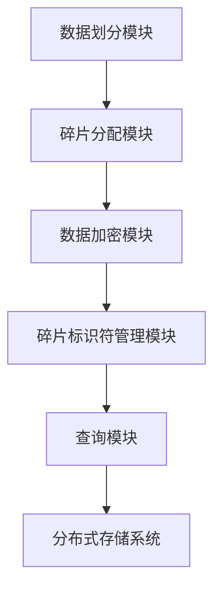
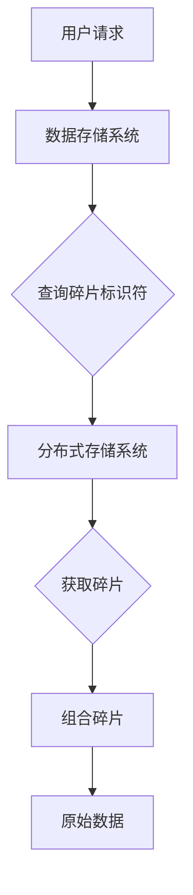
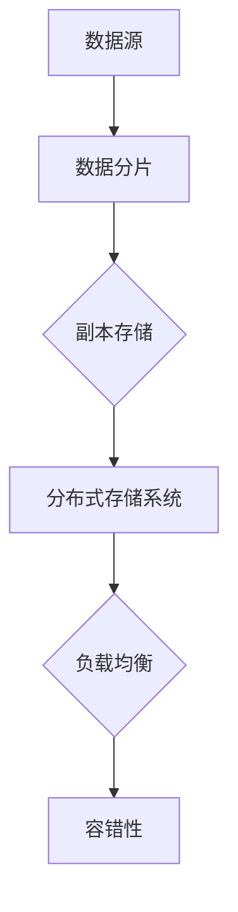
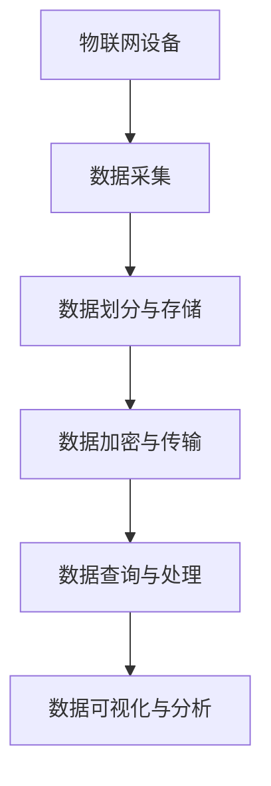
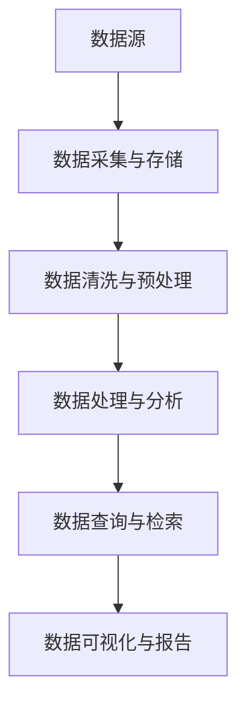

                 

### 文章标题：Token与时空碎片的技术对比

#### 关键词：
- Token
- 时空碎片
- 区块链
- 分布式存储
- 数字货币
- 物联网

#### 摘要：
本文深入探讨了Token与时空碎片这两种技术的基本概念、工作原理及其应用领域。通过对两者的技术特点、应用场景和实际案例的详细对比分析，本文旨在揭示这两种技术在现代信息技术中的重要性，并展望其未来的发展方向。文章以逻辑清晰、结构紧凑、简单易懂的专业语言，帮助读者全面理解Token与时空碎片的本质差异与互补性，为实际项目开发和技术决策提供有价值的参考。

## 第一部分：引言与背景

### 1.1 引言

在当前信息化和数字化浪潮的推动下，区块链技术和分布式存储技术逐渐成为学术界和产业界关注的焦点。Token与时空碎片作为这两种技术中的核心概念，不仅在区块链和分布式存储领域具有重要作用，还在物联网、大数据、人工智能等多个领域展现了广泛的应用前景。因此，对Token与时空碎片进行深入的技术对比和分析，具有重要的理论意义和实际应用价值。

本文旨在通过以下方面探讨Token与时空碎片的区别与联系：
1. **基本概念与架构**：介绍Token与时空碎片的基本概念，并给出其架构的Mermaid流程图。
2. **核心算法与实现**：详细讲解Token与时空碎片的核心算法，使用伪代码和数学模型进行阐述。
3. **应用领域与案例**：分析Token与时空碎片在区块链、分布式存储、物联网等领域的应用场景，并通过实际案例进行说明。
4. **技术对比与未来展望**：对比Token与时空碎片的技术特点、应用差异，并探讨两者的融合应用前景。

### 1.2 Token技术概述

Token，即代币，是一种数字资产，代表了某种价值或权利。Token广泛应用于区块链和分布式存储技术中，是这些技术实现价值传递和激励机制的基础。

#### 1.2.1 Token的定义

Token可以定义为一种基于区块链或其他分布式账本技术的数字资产，它代表了一定的价值或权益。Token可以用于支付、交易、投资等多种场景。根据功能的不同，Token可以分为以下几类：

- **代币（Coin）**：代表整个区块链系统的货币，例如比特币（BTC）。
- **代币化资产（Tokenized Asset）**：将现实世界的资产数字化，例如房地产、债券等。
- **功能性代币（Functional Token）**：为特定服务或产品提供支付手段的代币。
- **权益代币（Equity Token）**：代表公司股权或收益分配权利的代币。
- **奖励代币（Reward Token）**：用于奖励用户参与某个平台活动的代币。

#### 1.2.2 Token的工作原理

Token的工作原理主要包括以下几个方面：

1. **发行**：Token的发行通常涉及智能合约的编写与部署。智能合约定义了Token的发行总量、发行方式、权益分配等参数，并确保这些参数在区块链上不可篡改。

    ```solidity
    // SPDX-License-Identifier: MIT
    pragma solidity ^0.8.0;

    contract Token {
        string public name;
        string public symbol;
        uint8 public decimals;
        uint256 public totalSupply;
        mapping(address => uint256) public balanceOf;

        // 构造函数
        constructor(uint256 initialSupply, string memory tokenName, string memory tokenSymbol, uint8 decimalUnits) {
            balanceOf[msg.sender] = initialSupply;
            name = tokenName;
            symbol = tokenSymbol;
            decimals = decimalUnits;
            totalSupply = initialSupply;
        }

        // 转账函数
        function transfer(address recipient, uint256 amount) public {
            require(balanceOf[msg.sender] >= amount, "Insufficient balance");
            require(balanceOf[recipient] + amount >= balanceOf[recipient], "Transfer amount exceeds balance");
            balanceOf[msg.sender] -= amount;
            balanceOf[recipient] += amount;
            emit Transfer(msg.sender, recipient, amount);
        }
    }
    ```

2. **交易**：Token的交易主要通过区块链网络进行，交易记录被永久存储在区块链上。每次交易都会消耗一定量的网络资源，例如计算力和存储空间。

3. **智能合约**：智能合约是Token的核心组件，它定义了Token的发行、交易、权益分配等行为规则。智能合约通常使用Solidity等编程语言编写，并部署在区块链上。

    ```solidity
    // SPDX-License-Identifier: MIT
    pragma solidity ^0.8.0;

    contract Token {
        // ... (之前代码)

        // 允许提取Token的函数
        function withdraw(uint256 amount) public {
            require(amount <= balanceOf[msg.sender], "Insufficient balance");
            balanceOf[msg.sender] -= amount;
            // 此处可以添加额外的逻辑，例如将Token发送到其他地址
            emit Withdrawal(msg.sender, amount);
        }
    }
    ```

#### 1.2.3 Token的应用场景

Token在区块链和分布式存储技术中有着广泛的应用场景：

- **区块链**：Token是区块链生态系统中的重要组成部分，用于支付交易费用、激励网络参与者、发行数字货币等。
- **去中心化金融（DeFi）**：Token在去中心化金融平台中发挥着核心作用，如借贷、交易、投资等。
- **非同质化代币（NFT）**：NFT是基于Token的一种特殊形式，用于表示独特的数字资产，如艺术品、游戏道具等。

### 1.3 时空碎片技术概述

时空碎片（Time-Space Fragment，TSF）是一种分布式存储技术，通过将数据划分为小块（碎片），分散存储在多个节点上，以提高数据的安全性和可靠性。时空碎片技术广泛应用于物联网、大数据、人工智能等领域。

#### 1.3.1 时空碎片的定义

时空碎片（Time-Space Fragment，TSF）是一种将数据划分为小块（碎片），并通过分布式存储技术实现高效存储和管理的方案。每个碎片都包含了部分原始数据和一个唯一的标识符，这些碎片被分散存储在多个节点上，以确保数据的安全性和可靠性。

#### 1.3.2 时空碎片的特点

- **分布式存储**：时空碎片将数据分散存储在多个节点上，提高了系统的可靠性和扩展性。
- **高效查询**：通过碎片标识符，可以实现快速的数据查询。
- **安全性**：碎片存储前进行加密处理，确保数据的安全性。
- **可扩展性**：时空碎片技术支持海量数据的存储和查询，具有良好的可扩展性。

#### 1.3.3 时空碎片的工作原理

时空碎片的工作原理主要包括以下几个方面：

1. **数据划分**：将原始数据划分为固定大小的碎片。
    ```mermaid
    flowchart LR
    A[原始数据] --> B[数据划分]
    B --> C{多个碎片}
    ```

2. **碎片分配**：将碎片分配到不同的存储节点。
    ```mermaid
    flowchart LR
    C[多个碎片] --> D[碎片分配]
    D --> E{存储节点}
    ```

3. **数据加密**：对碎片进行加密处理，确保数据的安全性。
    ```mermaid
    flowchart LR
    E[存储节点] --> F[数据加密]
    ```

4. **数据查询**：通过碎片标识符，实现快速的数据查询。
    ```mermaid
    flowchart LR
    G[查询请求] --> H[碎片标识符]
    H --> I[数据查询]
    ```

#### 1.3.4 时空碎片的应用场景

时空碎片在多个领域有着广泛的应用场景：

- **物联网**：时空碎片可以用于存储和处理物联网设备产生的海量数据，提高系统的可靠性和响应速度。
- **大数据**：时空碎片可以用于大数据的分布式存储和高效查询，提高数据处理效率和性能。
- **人工智能**：时空碎片可以用于存储和管理人工智能训练所需的大规模数据集，提高训练效率和模型性能。

### 1.4 Token与时空碎片的关系

Token与时空碎片在分布式存储和区块链技术中有着密切的联系。Token可以用于支付分布式存储服务的费用，而时空碎片则是分布式存储技术的一种实现方案。

- **支付与激励**：Token可以用于支付时空碎片的存储和查询费用，激励网络参与者提供存储和计算资源。
- **数据安全**：时空碎片在存储前进行加密处理，结合Token的安全机制，确保数据的安全性。
- **应用场景互补**：Token与时空碎片的结合，可以应用于区块链、物联网、大数据、人工智能等多个领域，实现更高效、安全的数据管理和价值传递。

## 第二部分：Token技术详解

### 2.1 Token的概念与分类

Token，即代币，是一种数字资产，代表了某种价值或权利。Token广泛应用于区块链和分布式存储技术中，是这些技术实现价值传递和激励机制的基础。根据功能的不同，Token可以分为以下几类：

#### 2.1.1 代币（Coin）

代币是代表整个区块链系统的货币，例如比特币（BTC）、以太币（ETH）等。代币具有以下特点：

- **价值传递**：代币作为一种货币，用于在区块链网络中传递价值。
- **稀缺性**：代币的发行量通常是有限的，具有稀缺性。
- **不可篡改**：代币的交易记录永久存储在区块链上，具有不可篡改性。

#### 2.1.2 代币化资产（Tokenized Asset）

代币化资产是将现实世界的资产数字化，例如房地产、债券、股票等。代币化资产具有以下特点：

- **数字化**：将现实世界的资产转化为数字形式，便于交易和管理。
- **可分割性**：代币化资产可以根据需求进行分割，例如将一栋房产分割成多个代币。
- **透明性**：代币化资产的交易记录公开透明，便于监管和审计。

#### 2.1.3 功能性代币（Functional Token）

功能性代币是为特定服务或产品提供支付手段的代币。例如，某些去中心化平台使用功能性代币作为服务费用支付的手段。功能性代币具有以下特点：

- **专用性**：功能性代币通常仅用于特定的服务或产品。
- **激励性**：功能性代币可以用于激励用户参与平台活动，例如参与投票、贡献内容等。
- **灵活性**：功能性代币的发行和交易规则可以根据需求进行调整。

#### 2.1.4 权益代币（Equity Token）

权益代币代表公司股权或收益分配权利的代币。例如，某些初创公司通过发行权益代币进行融资。权益代币具有以下特点：

- **权益分配**：权益代币代表了股东在公司中的权益，包括投票权、分红权等。
- **风险与收益**：权益代币持有者承担公司经营风险，同时享受公司增长带来的收益。
- **流动性**：权益代币可以在二级市场进行交易，具有一定的流动性。

#### 2.1.5 奖励代币（Reward Token）

奖励代币用于奖励用户参与某个平台活动的代币。例如，某些游戏平台使用奖励代币作为游戏内虚拟商品的奖励。奖励代币具有以下特点：

- **激励性**：奖励代币用于激励用户参与平台活动，提高用户活跃度。
- **可交易性**：奖励代币通常可以在平台内部或外部进行交易，增加用户收益。
- **多样性**：奖励代币可以用于多种场景，例如奖励用户点赞、评论、分享等。

### 2.2 Token的工作原理

Token的工作原理主要包括以下几个关键环节：发行、交易和智能合约。

#### 2.2.1 Token发行

Token的发行通常涉及以下步骤：

1. **代币设计**：设计Token的基本参数，包括总供应量、发行方式、权益分配等。
2. **区块链选择**：选择适合Token发行的区块链平台，例如以太坊、EOS等。
3. **智能合约编写与部署**：编写智能合约代码，并在区块链上部署，以实现Token的发行与分配。
4. **Token分配**：通过智能合约向用户分配Token，用户可以购买、交换或持有Token。

以下是一个简单的以太坊智能合约示例，用于发行一个简单的代币：

```solidity
// SPDX-License-Identifier: MIT
pragma solidity ^0.8.0;

contract MyToken {
    string public name = "MyToken";
    string public symbol = "MTK";
    uint8 public decimals = 18;
    uint256 public totalSupply;
    mapping(address => uint256) public balanceOf;

    address public owner;

    // 构造函数
    constructor(uint256 initialSupply) {
        balanceOf[owner] = initialSupply;
        totalSupply = initialSupply;
        owner = msg.sender;
    }

    // 转账函数
    function transfer(address to, uint256 amount) public {
        require(balanceOf[msg.sender] >= amount, "Insufficient balance");
        balanceOf[msg.sender] -= amount;
        balanceOf[to] += amount;
        emit Transfer(msg.sender, to, amount);
    }

    // 事件定义
    event Transfer(address from, address to, uint256 amount);
}
```

#### 2.2.2 Token交易

Token的交易主要通过区块链网络进行，交易记录被永久存储在区块链上。每次交易都会消耗一定量的网络资源，例如计算力和存储空间。Token交易通常包括以下几种形式：

1. **交易所交易**：用户通过加密货币交易所进行Token的买卖，例如币安、火币等。
2. **场外交易**：用户通过线下渠道或平台进行Token的买卖，例如个人对个人交易。
3. **合约交易**：通过智能合约实现Token的自动化交易，例如去中心化交易平台（DEX）。

以下是一个简单的Token交易示例：

```solidity
// SPDX-License-Identifier: MIT
pragma solidity ^0.8.0;

contract MyToken {
    // ... (之前代码)

    // 允许第三方合约调用转账函数
    function transferFrom(address sender, address recipient, uint256 amount) public {
        require(balanceOf[sender] >= amount, "Insufficient balance");
        require allowance[sender][msg.sender] >= amount, "Insufficient allowance";
        balanceOf[sender] -= amount;
        balanceOf[recipient] += amount;
        allowance[sender][msg.sender] -= amount;
        emit Transfer(sender, recipient, amount);
    }

    // 授权额度函数
    function approve(address spender, uint256 amount) public {
        require(spender != address(0), "Invalid address");
        allowance[msg.sender][spender] = amount;
        emit Approval(msg.sender, spender, amount);
    }

    // 事件定义
    event Approval(address owner, address spender, uint256 amount);
    mapping(address => mapping(address => uint256)) public allowance;
}
```

#### 2.2.3 智能合约

智能合约是Token的核心组件，它定义了Token的发行、交易、权益分配等行为规则。智能合约通常使用Solidity等编程语言编写，并部署在区块链上。智能合约的实现需要考虑以下几个方面：

1. **安全性与可靠性**：智能合约的代码需要经过严格的审计和测试，确保其安全性和可靠性。
2. **功能性与扩展性**：智能合约需要实现所需的功能，同时具备良好的扩展性，以适应未来的需求。
3. **性能与成本**：智能合约的执行速度和成本需要平衡，以提供良好的用户体验。

以下是一个简单的智能合约示例，用于实现一个带有投票功能的代币：

```solidity
// SPDX-License-Identifier: MIT
pragma solidity ^0.8.0;

contract VotingToken {
    string public name = "VotingToken";
    string public symbol = "VT";
    uint8 public decimals = 18;
    uint256 public totalSupply;
    mapping(address => uint256) public balanceOf;
    mapping(address => mapping(address => uint256)) public votes;
    address public owner;

    // 构造函数
    constructor(uint256 initialSupply) {
        balanceOf[owner] = initialSupply;
        totalSupply = initialSupply;
        owner = msg.sender;
    }

    // 转账函数
    function transfer(address to, uint256 amount) public {
        require(balanceOf[msg.sender] >= amount, "Insufficient balance");
        balanceOf[msg.sender] -= amount;
        balanceOf[to] += amount;
        emit Transfer(msg.sender, to, amount);
    }

    // 投票函数
    function vote(address candidate, uint256 amount) public {
        require(balanceOf[msg.sender] >= amount, "Insufficient balance");
        votes[msg.sender][candidate] += amount;
        balanceOf[msg.sender] -= amount;
        emit Vote(msg.sender, candidate, amount);
    }

    // 事件定义
    event Transfer(address from, address to, uint256 amount);
    event Vote(address voter, address candidate, uint256 amount);
}
```

### 2.3 Token的核心算法与实现

Token的核心算法主要包括加密算法、共识算法和智能合约算法。以下将分别介绍这些算法的基本原理和实现方法。

#### 2.3.1 加密算法

加密算法是Token技术的重要组成部分，用于保护数据的安全性和隐私。常见的加密算法包括哈希算法、数字签名和对称加密等。

1. **哈希算法**：哈希算法用于将数据转换为固定长度的字符串，以确保数据的唯一性和不可篡改性。常见的哈希算法包括MD5、SHA-256等。

    ```python
    import hashlib

    # 计算SHA-256哈希值
    def calculate_hash(data):
        return hashlib.sha256(data.encode()).hexdigest()

    # 示例
    hash_value = calculate_hash("Hello, World!")
    print(hash_value)
    ```

2. **数字签名**：数字签名用于验证数据的真实性和完整性，确保数据的发送者身份。常见的数字签名算法包括RSA和ECDSA。

    ```solidity
    // SPDX-License-Identifier: MIT
    pragma solidity ^0.8.0;

    import "https://github.com/oracle-scheme/contracts/blob/master/openzeppelin-solidity/contracts/cryptography/ECDSA.sol";

    contract DigitalSignature {
        using ECDSA for bytes32;

        function signMessage(bytes32 message) public {
            // 获取签名者的公钥和私钥
            address signer = msg.sender;
            bytes32 digest = message;
            (bytes32 r, bytes32 s, bytes1 v) = signer.sign(digest);
            // 输出签名结果
            emit SignedMessage(digest, r, s, v);
        }

        event SignedMessage(bytes32 message, bytes32 r, bytes32 s, bytes1 v);
    }
    ```

3. **对称加密**：对称加密用于保护数据的机密性，加密和解密使用相同的密钥。常见的对称加密算法包括AES。

    ```python
    from Crypto.Cipher import AES
    from Crypto.Util.Padding import pad, unpad

    # AES加密
    def encrypt_data(data, key):
        cipher = AES.new(key, AES.MODE_CBC)
        ct_bytes = cipher.encrypt(pad(data.encode(), AES.block_size))
        iv = cipher.iv
        return iv + ct_bytes

    # AES解密
    def decrypt_data(encrypted_data, key):
        iv = encrypted_data[:16]
        ct = encrypted_data[16:]
        cipher = AES.new(key, AES.MODE_CBC, iv)
        pt = unpad(cipher.decrypt(ct), AES.block_size)
        return pt.decode()

    # 示例
    key = b'mysecretkey12345'
    data = "Hello, World!"
    encrypted_data = encrypt_data(data, key)
    decrypted_data = decrypt_data(encrypted_data, key)
    print(encrypted_data)
    print(decrypted_data)
    ```

#### 2.3.2 共识算法

共识算法是区块链技术的核心，用于确保区块链网络中的数据一致性。常见的共识算法包括工作量证明（PoW）、权益证明（PoS）和授权股权证明（DPoS）等。

1. **工作量证明（PoW）**：PoW通过计算复杂的数学难题来证明工作的有效性，是一种去中心化的共识算法。比特币采用PoW算法。

    ```python
    import hashlib
    import json
    import random

    # 模拟比特币挖矿过程
    def mine_block(previous_hash, target_difficulty):
        nonce = 0
        while True:
            # 计算区块的哈希值
            block_hash = hashlib.sha256((previous_hash + str(nonce)).encode()).hexdigest()
            # 检查哈希值是否满足难度要求
            if block_hash.startswith("0" * target_difficulty):
                return nonce, block_hash
            nonce += 1

    # 示例
    target_difficulty = 4
    nonce, block_hash = mine_block("genesis", target_difficulty)
    print("Nonce:", nonce)
    print("Block Hash:", block_hash)
    ```

2. **权益证明（PoS）**：PoS通过持有代币的数量和时间来决定节点的权重，持币时间越长，权重越高。以太坊2.0计划采用PoS算法。

    ```solidity
    // SPDX-License-Identifier: MIT
    pragma solidity ^0.8.0;

    contract PoS {
        mapping(address => uint256) public balance;
        address public last Validator;
        uint256 public lastValidBlock;

        // 存储代币
        function deposit() public payable {
            balance[msg.sender] += msg.value;
        }

        // 验证区块
        function validateBlock(uint256 blockNumber, bytes32 blockHash) public {
            require(balance[msg.sender] > 0, "Insufficient balance");
            require(blockNumber == lastValidBlock + 1, "Invalid block number");
            require(blockHash == calculate_block_hash(blockNumber), "Invalid block hash");

            last Validator = msg.sender;
            lastValidBlock = blockNumber;
            balance[msg.sender] -= 1;
            emit ValidatedBlock(msg.sender, blockNumber, blockHash);
        }

        // 计算区块哈希值
        function calculate_block_hash(uint256 blockNumber) public view returns (bytes32) {
            return keccak256(abi.encodePacked(blockNumber));
        }

        event ValidatedBlock(address validator, uint256 blockNumber, bytes32 blockHash);
    }
    ```

3. **授权股权证明（DPoS）**：DPoS通过选举产生代理节点，代理节点负责验证和产生区块。EOS采用DPoS算法。

    ```python
    import heapq
    import json
    import random

    # 模拟DPoS投票过程
    def vote_for_validators(voters, candidates, num_validators):
        # 计算每个候选人的权重
        candidate_weights = {candidate: 0 for candidate in candidates}
        for voter, vote in voters.items():
            for candidate in vote:
                candidate_weights[candidate] += vote[candidate]

        # 排序候选人的权重
        sorted_candidates = sorted(candidate_weights.items(), key=lambda x: x[1], reverse=True)

        # 选择权重最高的代理节点
        validators = [candidate for candidate, _ in sorted_candidates[:num_validators]]

        return validators

    # 示例
    voters = {
        "alice": {"bob": 100, "charlie": 200},
        "bob": {"alice": 150, "dave": 300},
        "charlie": {"bob": 250, "dave": 100},
        "dave": {"alice": 200, "charlie": 150}
    }
    candidates = ["alice", "bob", "charlie", "dave"]
    num_validators = 2
    validators = vote_for_validators(voters, candidates, num_validators)
    print("Validators:", validators)
    ```

#### 2.3.3 智能合约算法

智能合约算法用于实现Token的发行、交易和权益分配等功能。智能合约通常使用Solidity等编程语言编写，并部署在区块链上。

1. **代币发行**：智能合约定义了Token的发行方式、总量和权益分配规则。

    ```solidity
    // SPDX-License-Identifier: MIT
    pragma solidity ^0.8.0;

    contract MyToken {
        string public name = "MyToken";
        string public symbol = "MTK";
        uint8 public decimals = 18;
        uint256 public totalSupply;
        mapping(address => uint256) public balanceOf;
        address public owner;

        // 构造函数
        constructor(uint256 initialSupply) {
            balanceOf[owner] = initialSupply;
            totalSupply = initialSupply;
            owner = msg.sender;
        }

        // 转账函数
        function transfer(address to, uint256 amount) public {
            require(balanceOf[msg.sender] >= amount, "Insufficient balance");
            balanceOf[msg.sender] -= amount;
            balanceOf[to] += amount;
            emit Transfer(msg.sender, to, amount);
        }

        // 事件定义
        event Transfer(address from, address to, uint256 amount);
    }
    ```

2. **代币交易**：智能合约定义了Token的交易规则，包括转账、授权和批准等。

    ```solidity
    // SPDX-License-Identifier: MIT
    pragma solidity ^0.8.0;

    import "https://github.com/oracle-scheme/contracts/blob/master/openzeppelin-solidity/contracts/token/ERC20/ERC20.sol";

    contract MyToken is ERC20 {
        constructor(uint256 initialSupply) ERC20(name, symbol, decimals) {
            _mint(msg.sender, initialSupply);
        }

        // 转账函数
        function transfer(address to, uint256 amount) public {
            _transfer(msg.sender, to, amount);
        }

        // 授权函数
        function approve(address spender, uint256 amount) public {
            _approve(msg.sender, spender, amount);
        }

        // 批准函数
        function transferFrom(address sender, address recipient, uint256 amount) public {
            _transfer(sender, recipient, amount);
            _approve(sender, msg.sender, _allowance(sender, msg.sender) - amount);
        }

        // 事件定义
        event Transfer(address from, address to, uint256 amount);
        event Approval(address owner, address spender, uint256 amount);
    }
    ```

3. **权益分配**：智能合约定义了Token的权益分配规则，包括投票、分红和激励等。

    ```solidity
    // SPDX-License-Identifier: MIT
    pragma solidity ^0.8.0;

    import "https://github.com/oracle-scheme/contracts/blob/master/openzeppelin-solidity/contracts/token/ERC20/ERC20.sol";

    contract VotingToken is ERC20 {
        mapping(address => mapping(address => uint256)) public votes;
        mapping(address => uint256) public lastVoted;

        // 投票函数
        function vote(address candidate, uint256 amount) public {
            require(balanceOf(msg.sender) >= amount, "Insufficient balance");
            require(lastVoted[msg.sender] + 1 days < block.timestamp, "Vote too soon");

            votes[msg.sender][candidate] += amount;
            balanceOf[msg.sender] -= amount;
            lastVoted[msg.sender] = block.timestamp;

            emit Voted(msg.sender, candidate, amount);
        }

        // 事件定义
        event Voted(address voter, address candidate, uint256 amount);
    }
    ```

### 2.4 Token技术的应用案例

#### 2.4.1 区块链与Token

区块链与Token密不可分，Token作为区块链上的数字资产，可以用于支付、交易、投资等多种场景。

1. **加密货币**：加密货币是一种基于区块链技术的虚拟货币，例如比特币（BTC）、以太币（ETH）等。加密货币具有去中心化、不可篡改和匿名性等特点，被广泛应用于跨境支付、投资和交易等领域。

    ```solidity
    // SPDX-License-Identifier: MIT
    pragma solidity ^0.8.0;

    import "https://github.com/oracle-scheme/contracts/blob/master/openzeppelin-solidity/contracts/token/ERC20/ERC20.sol";

    contract Bitcoin {
        string public name = "Bitcoin";
        string public symbol = "BTC";
        uint8 public decimals = 18;
        uint256 public totalSupply;

        constructor() ERC20(name, symbol, decimals) {
            _mint(msg.sender, totalSupply);
        }

        // 转账函数
        function transfer(address to, uint256 amount) public {
            _transfer(msg.sender, to, amount);
        }
    }
    ```

2. **去中心化金融（DeFi）**：去中心化金融（DeFi）是一种基于区块链技术的金融模式，通过智能合约实现金融服务，如借贷、交易、投资等。DeFi平台使用Token作为价值载体和支付手段，为用户提供便捷、透明和去中心化的金融服务。

    ```solidity
    // SPDX-License-Identifier: MIT
    pragma solidity ^0.8.0;

    import "https://github.com/oracle-scheme/contracts/blob/master/openzeppelin-solidity/contracts/token/ERC20/ERC20.sol";
    import "https://github.com/oracle-scheme/contracts/blob/master/openzeppelin-solidity/contracts/access/Ownable.sol";

    contract DeFiPlatform is Ownable {
        mapping(address => uint256) public balance;
        ERC20 public token;

        // 构造函数
        constructor(ERC20 _token) {
            token = _token;
        }

        // 借款函数
        function borrow(uint256 amount) public {
            require(balance[msg.sender] >= amount, "Insufficient balance");
            token.transfer(msg.sender, amount);
            balance[msg.sender] -= amount;
        }

        // 还款函数
        function repay(uint256 amount) public {
            token.transferFrom(msg.sender, address(this), amount);
            balance[msg.sender] += amount;
        }
    }
    ```

3. **非同质化代币（NFT）**：非同质化代币（NFT）是一种独特的数字资产，它代表一个独一无二的事物，例如艺术品、收藏品等。NFT在区块链上具有唯一性和不可篡改性，被广泛应用于数字艺术品交易、游戏资产和虚拟房地产等领域。

    ```solidity
    // SPDX-License-Identifier: MIT
    pragma solidity ^0.8.0;

    import "https://github.com/oracle-scheme/contracts/blob/master/openzeppelin-solidity/contracts/token/ERC721/ERC721.sol";
    import "https://github.com/oracle-scheme/contracts/blob/master/openzeppelin-solidity/contracts/token/ERC721/extensions/ERC721URIStorage.sol";

    contract MyNFT is ERC721, ERC721URIStorage {
        string public name = "MyNFT";
        string public symbol = "NFT";

        constructor() ERC721(name, symbol) {}

        // 创建NFT函数
        function createNFT(address owner, string memory tokenURI) public {
            uint256 tokenId = _tokenIdCounter.current();
            _mint(owner, tokenId);
            _setTokenURI(tokenId, tokenURI);
            _tokenIdCounter.increment();
        }

        // 事件定义
        event NFTCreated(address owner, uint256 tokenId, string tokenURI);
        uint256 private _tokenIdCounter;
    }
    ```

#### 2.4.2 数字货币与Token

数字货币是一种基于区块链技术的虚拟货币，而Token是数字货币的一种形式。数字货币和Token之间存在着密切的联系和区别。

1. **数字货币的发展历程**：数字货币的发展历程可以追溯到比特币的诞生。比特币作为首个成功的数字货币，采用工作量证明（PoW）机制，实现了去中心化、不可篡改和匿名性等特点。随着区块链技术的发展，出现了许多基于不同共识机制的数字货币，如以太币（ETH）、莱特币（LTC）等。

    ```solidity
    // SPDX-License-Identifier: MIT
    pragma solidity ^0.8.0;

    import "https://github.com/oracle-scheme/contracts/blob/master/openzeppelin-solidity/contracts/token/ERC20/ERC20.sol";

    contract Bitcoin {
        string public name = "Bitcoin";
        string public symbol = "BTC";
        uint8 public decimals = 18;
        uint256 public totalSupply;

        constructor() ERC20(name, symbol, decimals) {
            _mint(msg.sender, totalSupply);
        }

        // 转账函数
        function transfer(address to, uint256 amount) public {
            _transfer(msg.sender, to, amount);
        }
    }
    ```

2. **主流数字货币介绍**：主流数字货币包括比特币（BTC）、以太币（ETH）、瑞波币（XRP）等。这些数字货币具有不同的特性，如比特币采用PoW机制，以太币采用PoS机制，瑞波币采用Ripple协议。数字货币在全球范围内得到广泛应用，被用于支付、交易、投资等多种场景。

    ```solidity
    // SPDX-License-Identifier: MIT
    pragma solidity ^0.8.0;

    import "https://github.com/oracle-scheme/contracts/blob/master/openzeppelin-solidity/contracts/token/ERC20/ERC20.sol";

    contract Ethereum {
        string public name = "Ethereum";
        string public symbol = "ETH";
        uint8 public decimals = 18;
        uint256 public totalSupply;

        constructor() ERC20(name, symbol, decimals) {
            _mint(msg.sender, totalSupply);
        }

        // 转账函数
        function transfer(address to, uint256 amount) public {
            _transfer(msg.sender, to, amount);
        }
    }
    ```

3. **数字货币与Token的区别与联系**：数字货币和Token都是基于区块链技术的数字资产，但它们之间存在着一定的区别和联系。

    - **区别**：数字货币是广义的，包括所有基于区块链技术的虚拟货币，而Token是数字货币的一种形式，通常用于特定场景和功能。
    - **联系**：Token通常基于区块链技术发行，可以用于数字货币的交易和支付。数字货币和Token之间可以互相转换和流通，形成更广泛的数字货币生态系统。

#### 2.5 Token在区块链领域的深度应用

#### 2.5.1 区块链去中心化金融（DeFi）

去中心化金融（DeFi）是一种基于区块链技术的金融模式，通过智能合约实现金融服务，如借贷、交易、投资等。DeFi平台使用Token作为价值载体和支付手段，为用户提供便捷、透明和去中心化的金融服务。

1. **DeFi的基本概念**：DeFi是指去中心化的金融应用，通过智能合约在区块链上实现传统的金融服务，如借贷、交易、投资等。DeFi平台无需依赖中央机构，用户可以自主参与和操作金融服务。

2. **DeFi的核心技术**：DeFi的核心技术包括智能合约、分布式账本、加密货币和去中心化交易平台。智能合约是DeFi平台的核心组件，用于实现金融服务的自动化和去中心化。分布式账本确保金融服务的透明性和不可篡改性。加密货币作为价值载体，用于支付和结算。去中心化交易平台实现资产交换和投资。

3. **DeFi的应用案例**：DeFi平台已经在多个领域取得成功，如去中心化交易所（DEX）、去中心化借贷平台（DeFi借贷）和去中心化基金（DeFi基金）。

    - **去中心化交易所（DEX）**：去中心化交易所使用智能合约实现去中心化的资产交换，用户可以自由交易加密货币和Token。Uniswap、SushiSwap等是典型的去中心化交易所。
    - **去中心化借贷平台（DeFi借贷）**：去中心化借贷平台使用智能合约实现借贷服务，用户可以借出或借入加密货币。Aave、Compound等是典型的去中心化借贷平台。
    - **去中心化基金（DeFi基金）**：去中心化基金使用智能合约实现资金管理和投资，用户可以参与基金的投资和收益分配。SushiSwap、Yearn.Finance等是典型的去中心化基金。

#### 2.5.2 区块链游戏

区块链游戏是一种结合区块链技术的游戏，通常涉及虚拟资产的交易和所有权。区块链游戏具有去中心化、不可篡改和透明性等特点，为游戏玩家和开发者带来新的体验和商业模式。

1. **区块链游戏的发展历程**：区块链游戏的发展历程可以追溯到2012年的《抢夺比特币》和2017年的《加密猫》。这些游戏开创了区块链游戏的先河，吸引了大量用户和开发者。

2. **区块链游戏的核心特点**：区块链游戏的核心特点包括去中心化、不可篡改、透明性和安全性。去中心化确保游戏数据和交易记录公开透明，不可篡改确保游戏规则和数据的安全性。

3. **区块链游戏的经典案例**：区块链游戏在多个领域取得成功，如数字艺术品、游戏资产和虚拟房地产。

    - **数字艺术品**：区块链游戏中的数字艺术品，如加密猫（CryptoKitties）和数字艺术品（Beeple）。这些艺术品具有唯一性和不可篡改性，被广泛收藏和交易。
    - **游戏资产**：区块链游戏中的游戏资产，如Axie Infinity中的虚拟宠物。这些资产可以在区块链上进行交易和交换，为用户带来额外的收益和乐趣。
    - **虚拟房地产**：区块链游戏中的虚拟房地产，如Decentraland中的虚拟土地。用户可以在虚拟世界中购买、交换和交易虚拟土地，创造独特的虚拟体验。

#### 2.5.3 区块链与Token的深度应用

区块链与Token的深度应用在多个领域展现出巨大的潜力和价值。以下是一些典型的深度应用场景：

1. **供应链管理**：区块链与Token的结合可以用于供应链管理，实现透明、高效和可信的供应链追踪。Token可以用于记录供应链中的交易和物流信息，确保数据的不可篡改性和透明性。例如，企业在供应链中使用Token来跟踪原材料采购、生产过程和产品交付等环节，提高供应链的透明度和效率。

2. **版权保护**：区块链与Token的结合可以用于版权保护，确保数字内容的原创性和所有权。通过区块链技术，艺术家和创作者可以将他们的作品与其身份和所有权信息绑定，防止盗版和抄袭。Token可以用于购买、交易和授权数字内容的版权，确保创作者的合法权益。

3. **身份验证**：区块链与Token的结合可以用于身份验证，实现安全、便捷的身份验证和管理。Token可以用于存储用户的身份信息，如姓名、出生日期、身份证号码等，并通过区块链技术确保数据的安全性和不可篡改性。用户可以通过Token进行在线身份验证，简化身份验证流程，提高用户体验。

4. **数字资产管理**：区块链与Token的结合可以用于数字资产管理，实现安全、高效和透明的数字资产交易和管理。Token可以用于代表数字资产的所有权和权益，如数字货币、数字艺术品、游戏资产等。通过区块链技术，用户可以轻松地创建、交易和管理数字资产，确保资产的唯一性和不可篡改性。

### 3.1 时空碎片的定义与特点

#### 3.1.1 时空碎片的基本概念

时空碎片（Time-Space Fragment，TSF）是一种分布式存储技术，通过将数据划分为小块（碎片），分散存储在多个节点上，以提高数据的安全性和可靠性。时空碎片技术广泛应用于物联网、大数据、人工智能等领域。

时空碎片的基本概念可以概括为以下几点：

1. **数据碎片化**：将原始数据划分为固定大小的碎片。每个碎片包含部分原始数据和唯一的标识符。
2. **分布式存储**：将碎片分配到不同的存储节点上，实现数据的分散存储，提高系统的可靠性和扩展性。
3. **高效查询**：通过碎片标识符，实现快速的数据查询。
4. **安全性**：采用加密算法，对数据进行加密存储和传输，确保数据的安全性。
5. **可扩展性**：支持海量数据的存储和查询，具有良好的可扩展性。

#### 3.1.2 时空碎片的特点

时空碎片具有以下特点：

1. **分布式存储**：时空碎片技术采用分布式存储方式，将数据分散存储在多个节点上，提高系统的可靠性和扩展性。每个节点负责存储一部分数据，节点故障时，系统仍能正常运行。

2. **高效查询**：时空碎片通过碎片标识符实现快速的数据查询。用户可以根据碎片标识符直接访问特定的数据碎片，无需遍历整个存储系统。

3. **安全性**：时空碎片技术采用多种加密算法，对数据进行加密存储和传输，确保数据的安全性。同时，时空碎片采用分布式存储方式，降低数据被篡改的风险。

4. **可扩展性**：时空碎片技术支持海量数据的存储和查询，具有良好的可扩展性。用户可以根据需求动态调整存储节点的数量和规模，实现数据存储和查询的高效性。

#### 3.1.3 时空碎片的架构

时空碎片的架构可以分为以下几个主要部分：

1. **数据划分模块**：将原始数据划分为固定大小的碎片。每个碎片包含部分原始数据和唯一的标识符。
2. **碎片分配模块**：将碎片分配到不同的存储节点上，实现分布式存储。
3. **数据加密模块**：对数据进行加密处理，确保数据的安全性。
4. **碎片标识符管理模块**：管理碎片标识符的生成、存储和查询，实现快速的数据访问。
5. **查询模块**：根据碎片标识符，实现快速的数据查询。
6. **分布式存储系统**：实现碎片的分布式存储，提高系统的可靠性和扩展性。

以下是一个简单的时空碎片架构图：



#### 3.1.4 时空碎片的应用场景

时空碎片在多个领域有着广泛的应用场景，主要包括以下几方面：

1. **物联网**：时空碎片可以用于存储和处理物联网设备产生的海量数据，提高数据传输效率和系统可靠性。例如，在智能交通系统中，时空碎片可以用于存储和处理车辆监控、路况监测等数据。

2. **大数据**：时空碎片可以用于大数据的分布式存储和高效查询，提高数据处理效率和性能。例如，在金融领域，时空碎片可以用于存储和处理海量交易数据，实现快速的数据分析和查询。

3. **人工智能**：时空碎片可以用于存储和管理人工智能训练所需的大规模数据集，提高训练效率和模型性能。例如，在医疗领域，时空碎片可以用于存储和处理医学影像数据，实现高效的疾病诊断。

4. **区块链**：时空碎片可以用于区块链数据的存储与验证，提高区块链系统的性能和安全性。例如，在区块链游戏中，时空碎片可以用于存储和处理游戏资产和交易数据。

5. **数字货币**：时空碎片可以用于数字货币的交易数据和用户钱包数据的存储与查询，提高交易效率和安全性。

### 3.2 时空碎片的工作原理

#### 3.2.1 数据存储与传输

时空碎片的工作原理主要包括数据存储与传输、数据加密、碎片分配与查询等环节。

1. **数据存储**：时空碎片将原始数据划分为固定大小的碎片。每个碎片包含部分原始数据和唯一的标识符。碎片存储在分布式存储系统中，分布式存储系统通常由多个节点组成，每个节点存储一部分碎片。

2. **数据传输**：时空碎片通过分布式存储系统实现数据传输。当用户请求访问数据时，分布式存储系统根据碎片标识符，从不同节点获取所需碎片，并将碎片组合成完整的原始数据。

以下是一个简单的数据存储与传输流程图：



3. **数据加密**：时空碎片在存储和传输过程中，采用多种加密算法对数据进行加密处理，确保数据的安全性。常见的加密算法包括哈希算法、对称加密算法和非对称加密算法。

4. **碎片分配与查询**：时空碎片采用分布式存储系统进行碎片分配与查询。分布式存储系统根据碎片标识符，将碎片分配到不同的节点上，实现数据的分布式存储。用户可以通过碎片标识符，快速查询所需的碎片。

以下是一个简单的碎片分配与查询流程图：


#### 3.2.2 安全性与隐私保护

时空碎片在安全性和隐私保护方面采取了多种措施：

1. **数据加密**：时空碎片采用多种加密算法对数据进行加密处理，确保数据在存储和传输过程中的安全性。

2. **访问控制**：时空碎片采用访问控制机制，限制对数据的访问。只有授权用户才能访问特定数据，确保数据的安全性。

3. **隐私保护**：时空碎片采用隐私保护算法，对数据进行去标识化处理，确保个人隐私。

4. **分布式存储**：时空碎片采用分布式存储方式，将数据分散存储在多个节点上，降低数据被篡改的风险。

#### 3.2.3 分布式存储技术

时空碎片采用分布式存储技术，提高数据的存储效率和可靠性。分布式存储技术的主要特点包括：

1. **数据分片**：将数据划分为小块（碎片），分配到不同节点上。

2. **副本存储**：对每个碎片存储多个副本，提高数据可靠性。

3. **负载均衡**：根据节点负载情况，调整数据存储位置，提高系统性能。

4. **容错性**：节点故障时，系统能够自动切换到其他可用节点，确保数据不丢失。

以下是一个简单的分布式存储架构图：



### 3.3 时空碎片的核心算法与实现

#### 3.3.1 加密算法

时空碎片采用多种加密算法，确保数据的安全性和隐私保护。常见的加密算法包括哈希算法、数字签名和对称加密算法。

1. **哈希算法**：哈希算法用于生成数据的唯一标识符，确保数据的唯一性和不可篡改性。常用的哈希算法包括MD5、SHA-256等。

    ```python
    import hashlib

    def calculate_hash(data):
        return hashlib.sha256(data.encode()).hexdigest()

    data = "Hello, World!"
    hash_value = calculate_hash(data)
    print(hash_value)
    ```

2. **数字签名**：数字签名用于验证数据的真实性和完整性。常见的数字签名算法包括RSA和ECDSA。

    ```solidity
    // SPDX-License-Identifier: MIT
    pragma solidity ^0.8.0;

    import "https://github.com/oracle-scheme/contracts/blob/master/openzeppelin-solidity/contracts/cryptography/ECDSA.sol";

    contract DigitalSignature {
        using ECDSA for bytes32;

        function signMessage(bytes32 message) public {
            address signer = msg.sender;
            bytes32 digest = message;
            (bytes32 r, bytes32 s, bytes1 v) = signer.sign(digest);
            emit SignedMessage(digest, r, s, v);
        }

        event SignedMessage(bytes32 message, bytes32 r, bytes32 s, bytes1 v);
    }
    ```

3. **对称加密**：对称加密用于保护数据的机密性，加密和解密使用相同的密钥。常用的对称加密算法包括AES。

    ```python
    from Crypto.Cipher import AES
    from Crypto.Util.Padding import pad, unpad

    def encrypt_data(data, key):
        cipher = AES.new(key, AES.MODE_CBC)
        ct_bytes = cipher.encrypt(pad(data.encode(), AES.block_size))
        iv = cipher.iv
        return iv + ct_bytes

    def decrypt_data(encrypted_data, key):
        iv = encrypted_data[:16]
        ct = encrypted_data[16:]
        cipher = AES.new(key, AES.MODE_CBC, iv)
        pt = unpad(cipher.decrypt(ct), AES.block_size)
        return pt.decode()

    key = b'mysecretkey12345'
    data = "Hello, World!"
    encrypted_data = encrypt_data(data, key)
    decrypted_data = decrypt_data(encrypted_data, key)
    print(encrypted_data)
    print(decrypted_data)
    ```

#### 3.3.2 分布式存储技术

时空碎片采用分布式存储技术，提高数据的存储效率和可靠性。分布式存储技术的主要算法包括数据分片、副本存储、负载均衡和容错性。

1. **数据分片**：将原始数据划分为固定大小的碎片。常用的分片算法包括哈希分片和轮询分片。

    ```python
    import hashlib

    def hash_sharding(data, num_shards):
        hash_value = hashlib.sha256(data.encode()).hexdigest()
        shards = [hash_value[i:i+64] for i in range(0, len(hash_value), 64)]
        return shards[:num_shards]

    data = "Hello, World!"
    shards = hash_sharding(data, 4)
    print(shards)
    ```

2. **副本存储**：对每个碎片存储多个副本，提高数据可靠性。常用的副本存储算法包括随机副本和轮询副本。

    ```python
    import random

    def replica_storage(shards, num_replicas):
        replicas = [[] for _ in range(num_shards)]
        for shard in shards:
            node_id = random.randint(0, num_nodes - 1)
            replicas[node_id].append(shard)
        return replicas

    shards = ["abc", "def", "ghi"]
    replicas = replica_storage(shards, 2)
    print(replicas)
    ```

3. **负载均衡**：根据节点负载情况，调整数据存储位置，提高系统性能。常用的负载均衡算法包括轮询负载均衡和最小连接负载均衡。

    ```python
    import heapq

    def load_balance(replicas, num_nodes):
        load = [0 for _ in range(num_nodes)]
        for replica in replicas:
            for node in replica:
                load[node] += 1
        sorted_load = heapq.nsmallest(num_nodes, enumerate(load), key=lambda x: x[1])
        return sorted_load

    replicas = [[0, 1], [1, 2], [2, 0]]
    sorted_load = load_balance(replicas, 3)
    print(sorted_load)
    ```

4. **容错性**：节点故障时，系统能够自动切换到其他可用节点，确保数据不丢失。常用的容错算法包括冗余存储和副本恢复。

    ```python
    import copy

    def fault_tolerance(replicas, faulty_node):
        good_replicas = copy.deepcopy(replicas)
        for replica in good_replicas:
            replica.remove(faulty_node)
        return good_replicas

    replicas = [[0, 1], [1, 2], [2, 0]]
    faulty_node = 1
    good_replicas = fault_tolerance(replicas, faulty_node)
    print(good_replicas)
    ```

### 3.4 时空碎片的应用案例

#### 3.4.1 物联网与时空碎片

时空碎片在物联网中有着广泛的应用，主要用于存储和处理物联网设备产生的海量数据。以下是一个简单的物联网与时空碎片的应用案例：

1. **物联网设备数据采集**：物联网设备（如传感器、智能家电等）采集环境数据（如温度、湿度、光照等），并将数据发送到云端存储系统。

2. **数据划分与存储**：时空碎片技术将采集到的数据划分为固定大小的碎片，并将碎片存储在分布式存储系统中。分布式存储系统由多个节点组成，每个节点存储一部分碎片。

3. **数据加密与传输**：时空碎片技术采用加密算法对数据进行加密处理，确保数据在传输过程中的安全性。加密后的数据通过分布式存储系统传输到云端存储系统。

4. **数据查询与处理**：用户可以通过时空碎片技术查询特定数据碎片，实现快速的数据检索和处理。例如，用户可以查询某个时间段内的温度数据，实现环境监控和预警。

5. **数据可视化与分析**：时空碎片技术支持数据可视化与分析，用户可以通过图表和报告等方式查看数据趋势和分析结果。例如，用户可以查看某地区的温度变化趋势，实现环境优化和能源管理。

以下是一个简单的物联网与时空碎片应用架构图：



#### 3.4.2 大数据与时空碎片

时空碎片在大数据处理中发挥着重要作用，主要用于分布式存储和高效查询。以下是一个简单的大数据与时空碎片的应用案例：

1. **数据采集与存储**：大数据系统从多个数据源（如数据库、日志文件等）采集数据，并将数据存储在分布式存储系统中。分布式存储系统采用时空碎片技术，将数据划分为固定大小的碎片，并将碎片存储在多个节点上。

2. **数据清洗与预处理**：大数据系统对采集到的数据进行清洗和预处理，包括数据去重、数据格式转换和数据归一化等操作。清洗和预处理后的数据存储在分布式存储系统中。

3. **数据处理与分析**：大数据系统采用分布式计算技术（如MapReduce、Spark等），对存储在分布式存储系统中的数据进行处理和分析。处理和分析后的结果存储在分布式存储系统中。

4. **数据查询与检索**：用户可以通过时空碎片技术查询特定数据碎片，实现快速的数据检索和处理。例如，用户可以查询某个时间段内的销售数据，实现销售分析和预测。

5. **数据可视化与报告**：大数据系统支持数据可视化与报告，用户可以通过图表和报告等方式查看数据趋势和分析结果。例如，用户可以查看某产品的销售趋势和市场份额，实现产品优化和市场推广。

以下是一个简单的大数据与时空碎片应用架构图：



### 4.1 技术对比

#### 4.1.1 技术特点对比

在对比Token技术和时空碎片技术时，可以从以下几个方面进行：

1. **数据模型**：Token技术基于区块链的数据模型，具有去中心化、不可篡改等特点；而时空碎片技术基于分布式存储的数据模型，具有分布式存储、高效查询等特点。

2. **安全性**：Token技术采用多种加密算法和智能合约技术，确保数据的安全性和隐私保护；而时空碎片技术采用多种加密算法和分布式存储技术，提高数据的安全性和可靠性。

3. **应用场景**：Token技术主要应用于区块链领域，如数字货币、去中心化金融等；而时空碎片技术主要应用于物联网、大数据、人工智能等领域。

4. **性能**：Token技术在区块链网络中，交易速度和数据处理能力相对有限；而时空碎片技术在大数据处理中，查询和处理速度相对较高。

#### 4.1.2 技术应用对比

在具体应用中，Token技术和时空碎片技术也各有优势：

1. **区块链应用**：Token技术适用于数字货币、去中心化金融等场景，具有去中心化、不可篡改等特点；时空碎片技术适用于智能合约、非同质化代币（NFT）等场景，具有高效查询、分布式存储等特点。

2. **物联网应用**：Token技术可以用于设备间的通信和支付；时空碎片技术可以用于存储和处理物联网设备产生的海量数据。

3. **大数据应用**：Token技术可以用于数据安全和隐私保护；时空碎片技术可以用于分布式存储和高效查询。

4. **人工智能应用**：Token技术可以用于数据交易和激励；时空碎片技术可以用于数据存储和模型训练。

### 4.2 实际应用案例分析

#### 4.2.1 案例一：Token在加密货币市场中的应用

**案例背景**：加密货币市场是一个快速发展的领域，Token作为一种数字资产，在市场中扮演着重要角色。本案例以比特币（BTC）为例，分析Token在加密货币市场中的应用。

**案例分析**：

1. **比特币的发行与交易**：比特币采用工作量证明（PoW）机制进行发行，每个区块奖励一定数量的比特币。比特币的交易通过区块链网络进行，Token作为价值载体。

2. **比特币的安全与隐私**：比特币采用哈希算法和数字签名技术，确保交易安全。比特币交易记录公开透明，但地址信息匿名。

3. **比特币的流动性**：比特币具有较高的流动性，可以在全球范围内进行买卖。

**案例总结**：比特币作为加密货币市场的代表，展示了Token在加密货币交易中的应用和价值。

#### 4.2.2 案例二：时空碎片在智能交通系统中的应用

**案例背景**：智能交通系统（ITS）是一个复杂的系统，涉及到大量数据采集、传输和处理。时空碎片作为一种分布式存储技术，在智能交通系统中发挥着重要作用。

**案例分析**：

1. **时空碎片在数据存储中的应用**：智能交通系统中的传感器采集大量交通数据，时空碎片技术将数据划分为碎片，分布式存储在多个节点上，提高数据的存储效率和可靠性。

2. **时空碎片在数据处理中的应用**：时空碎片技术采用高效查询算法，实现快速的数据检索和处理。例如，智能交通系统可以实时查询某个路段的交通流量，实现交通优化和调度。

3. **时空碎片在安全性中的应用**：时空碎片技术采用多种加密算法，确保数据在存储和传输过程中的安全性。同时，时空碎片技术采用分布式存储方式，降低数据被篡改的风险。

**案例总结**：时空碎片在智能交通系统中展示了其在数据存储、数据处理和安全隐私保护方面的优势。

### 5.1 Token与时空碎片技术的发展趋势

#### 5.1.1 Token技术发展趋势

- **区块链3.0**：随着区块链技术的不断演进，Token技术将朝着更高级的应用场景发展，如智能合约、去中心化金融等。
- **跨链技术**：Token技术将实现不同区块链之间的互操作性和兼容性，推动区块链生态的进一步发展。
- **合规性**：Token技术将更加注重合规性，以满足不同国家和地区的法律法规要求。

#### 5.1.2 时空碎片技术发展趋势

- **分布式存储技术**：时空碎片技术将在分布式存储领域继续发展，为大数据、物联网、人工智能等领域提供更高效的数据存储和查询服务。
- **隐私保护技术**：时空碎片技术将引入更多的隐私保护算法和机制，提高数据安全和隐私保护水平。
- **跨领域应用**：时空碎片技术将在更多领域得到应用，如区块链、金融科技、智能交通等。

### 5.2 Token与时空碎片的融合应用前景

#### 5.2.1 融合应用场景

Token与时空碎片的融合应用将在多个场景中发挥重要作用：

1. **去中心化数据市场**：利用Token实现去中心化的数据交易，时空碎片提供数据存储和查询服务。
2. **智能合约平台**：结合Token与时空碎片，实现更高效、安全的智能合约执行。
3. **物联网数据管理**：利用时空碎片存储和处理物联网数据，Token作为数据交易的媒介。
4. **大数据应用**：利用时空碎片实现大数据的分布式存储和高效查询，Token作为数据共享的激励机制。

#### 5.2.2 融合应用优势

1. **数据安全性**：结合Token与时空碎片的加密算法和分布式存储技术，提高数据安全性。
2. **高效数据处理**：时空碎片提供高效的数据存储和查询服务，Token实现数据交易和激励机制。
3. **跨领域应用**：Token与时空碎片的融合应用将推动区块链、大数据、物联网等领域的创新发展。

### 5.3 技术标准与政策法规的挑战与机遇

#### 5.3.1 技术标准挑战

1. **互操作性**：随着Token与时空碎片的融合应用，实现不同技术之间的互操作性将面临挑战。
2. **安全性**：在分布式存储和数据交易过程中，确保数据安全是技术标准的重要挑战。

#### 5.3.2 政策法规机遇

1. **合规性**：随着各国对区块链技术和数字资产的政策法规不断完善，Token与时空碎片的融合应用将迎来更广阔的发展机遇。
2. **创新支持**：政策法规的支持将为Token与时空碎片的融合应用提供更多创新空间和资源。

### 附录

#### A.1 技术资源汇总

1. **开发工具与平台**：Ethereum、EOSIO、Tron、IPFS、Ceph、HDFS等。
2. **学习资源与教程**：区块链技术、分布式存储技术、智能合约开发等。

#### A.2 深入阅读推荐

1. **区块链技术**：
    - 《区块链技术指南》
    - 《区块链：从数字货币到智能合约》
2. **分布式存储技术**：
    - 《分布式系统原理与范型》
    - 《分布式存储技术与应用》
3. **智能合约与去中心化金融**：
    - 《智能合约开发实战》
    - 《DeFi实战：去中心化金融系统设计》

#### A.3 相关技术标准与政策法规概述

1. **国际标准组织**：ISO/

