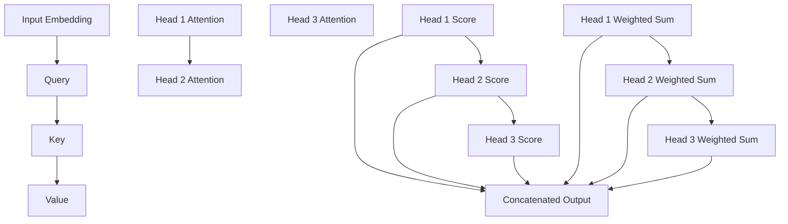

                 

### 文章标题

# Transformer大模型实战：训练学生BERT模型（DistilBERT模型）

### 关键词

- Transformer
- BERT模型
- DistilBERT
- 自然语言处理
- 深度学习
- 机器学习

### 摘要

本文旨在介绍Transformer大模型的实战应用，重点关注训练学生BERT模型的过程。我们将详细讲解Transformer模型的基础概念、核心算法原理、训练技术以及在企业级应用开发中的实现。此外，本文还将通过实际代码案例，展示如何使用PyTorch框架训练DistilBERT模型，并对其进行代码解读与分析。通过本文的阅读，读者将全面了解Transformer大模型在自然语言处理领域的前沿应用，并掌握从理论到实践的完整开发流程。

### 第一部分：Transformer大模型基础

#### 第1章：Transformer大模型概述

##### 1.1 Transformer大模型的核心概念与架构

###### 1.1.1 Transformer模型的定义与背景

Transformer模型是一种基于自注意力机制的深度神经网络模型，由Google在2017年提出。它主要应用于自然语言处理（NLP）领域，如机器翻译、文本摘要、问答系统等。以下是Transformer模型的定义和背景介绍：

- **定义**：Transformer模型是一种基于自注意力（Self-Attention）和多头注意力（Multi-Head Attention）机制的序列到序列（Seq2Seq）模型。它通过并行处理和全局注意力机制，使模型能够更好地理解和生成序列数据。

- **背景**：Transformer模型的出现是为了解决传统循环神经网络（RNN）在处理长序列数据时的不足。RNN在处理长序列时容易出现梯度消失或梯度爆炸问题，导致模型难以训练。Transformer模型通过引入自注意力机制，使得模型能够直接对序列中的每一个元素进行全局关注，从而提高了模型的训练效率和效果。

###### 1.1.2 Transformer模型的关键架构

Transformer模型的核心架构包括编码器（Encoder）和解码器（Decoder），以及它们之间的多头注意力机制（Multi-Head Attention）和位置编码（Positional Encoding）。

- **编码器（Encoder）**：编码器接收输入序列，将每个词向量通过嵌入层（Embedding Layer）转化为嵌入向量（Embedding Vector）。随后，这些嵌入向量通过多个自注意力层（Self-Attention Layer）进行特征提取和融合，最终生成编码器的输出。每个自注意力层包括多头注意力（Multi-Head Attention）和前馈网络（Feedforward Network）。

- **解码器（Decoder）**：解码器接收编码器的输出和目标序列的嵌入向量。在解码过程中，每个时间步的输出都通过多头注意力层（Encoder-Decoder Attention）与编码器的输出进行交互，以便获取上下文信息。解码器还包含自注意力层和前馈网络。解码器的输出通过一个全连接层（Linear Layer）和软化层（Softmax Layer）生成预测的概率分布。

- **多头注意力（Multi-Head Attention）**：多头注意力机制是Transformer模型的关键组件之一。它通过将输入序列分成多个头（Head），每个头独立计算注意力权重，然后拼接这些头的结果。这样，模型可以同时关注序列中的不同部分，提高模型的表示能力。

- **位置编码（Positional Encoding）**：由于Transformer模型没有循环结构，无法直接利用序列中的位置信息。因此，通过添加位置编码（Positional Encoding）来为序列中的每个词添加位置信息，使得模型能够理解序列的顺序。

##### 1.1.3 Transformer模型的优势与应用

Transformer模型在自然语言处理领域取得了显著的成果，其优势主要体现在以下几个方面：

- **并行处理能力**：Transformer模型采用自注意力机制，能够并行处理序列数据，从而提高了模型的训练速度。

- **长距离依赖建模**：通过多头注意力机制，Transformer模型能够有效地捕捉序列中的长距离依赖关系，从而提高模型的准确性和性能。

- **良好的泛化能力**：Transformer模型具有良好的泛化能力，能够应用于各种NLP任务，如文本分类、命名实体识别等。

- **扩展性**：Transformer模型的结构相对简单，易于扩展和改进。通过添加额外的层或调整超参数，可以进一步提高模型的性能。

在实际应用中，Transformer模型已经成功应用于多个领域，如机器翻译、文本摘要、问答系统等。其中，BERT（Bidirectional Encoder Representations from Transformers）是Transformer模型在自然语言处理领域的代表性模型之一，它通过预训练和微调技术，取得了许多NLP任务的SOTA（State-of-the-Art）成绩。

#### 第2章：Transformer大模型的核心算法原理

##### 2.1 自注意力机制

###### 2.1.1 自注意力机制的基本概念

自注意力机制（Self-Attention）是Transformer模型的核心组件之一。它通过对序列中的每个元素进行加权求和，使模型能够自动关注序列中的重要信息。

- **基本概念**：自注意力机制通过计算每个词向量在序列中的相对重要性，为每个词向量生成一个权重向量。这些权重向量然后用于加权求和，生成序列的表示。

- **计算过程**：自注意力机制主要包括以下三个步骤：

  1. **查询（Query）、键（Key）和值（Value）计算**：首先，将输入序列（Word Embedding）通过线性变换分别生成查询（Query）、键（Key）和值（Value）。

  2. **计算注意力得分**：利用查询和键之间的相似性计算注意力得分。通常使用点积（Dot-Product）或缩放点积（Scaled Dot-Product）计算注意力得分。

  3. **加权求和**：将注意力得分应用于值向量，对序列进行加权求和，生成序列的表示。

###### 2.1.2 自注意力机制的实现方法

自注意力机制有多种实现方法，其中最常见的是点积自注意力（Dot-Product Attention）和缩放点积自注意力（Scaled Dot-Product Attention）。

- **点积自注意力（Dot-Product Attention）**：点积自注意力通过计算查询和键之间的点积得到注意力得分。其计算复杂度为O(N^2)，其中N为序列的长度。

  ```mermaid
  graph TD
  A[Query] --> B[Key]
  C[Value]
  D[Score]
  E[Weighted Sum]
  A-->B{Dot-Product}
  B-->D
  C-->E
  D-->E
  ```

- **缩放点积自注意力（Scaled Dot-Product Attention）**：缩放点积自注意力通过缩放点积得分来防止梯度消失问题。其计算复杂度为O(N^2)，其中N为序列的长度。

  ```mermaid
  graph TD
  A[Query] --> B[Key]
  C[Value]
  D[Score]
  E[Weighted Sum]
  A-->B{Scaled Dot-Product}
  B-->D
  D{$\sqrt{N} / k$}
  C-->E
  D-->E
  ```

##### 2.2 多头注意力机制

###### 2.2.1 多头注意力机制的基本概念

多头注意力机制（Multi-Head Attention）是Transformer模型中的一种扩展。它通过将输入序列分成多个头（Head），每个头独立计算注意力权重，然后拼接这些头的结果。

- **基本概念**：多头注意力机制通过将自注意力机制应用于多个子空间，使模型能够同时关注序列中的不同部分。

- **计算过程**：多头注意力机制主要包括以下三个步骤：

  1. **分解输入序列**：将输入序列通过线性变换分别生成多个头的查询（Query）、键（Key）和值（Value）。

  2. **独立计算注意力权重**：为每个头独立计算注意力权重，生成多个注意力得分。

  3. **拼接结果**：将多个头的注意力得分拼接，生成序列的表示。

###### 2.2.2 多头注意力机制的实现方法

多头注意力机制通过扩展点积自注意力来实现。其计算复杂度为O(N*d*q)，其中N为序列的长度，d为嵌入维度，q为头数。



##### 2.3 位置编码

###### 2.3.1 位置编码的基本概念

位置编码（Positional Encoding）是Transformer模型中的一种技巧，用于为序列中的每个词添加位置信息。由于Transformer模型没有循环结构，无法直接利用序列的顺序信息，因此通过位置编码来弥补这一不足。

- **基本概念**：位置编码是一种可学习的向量，用于表示序列中每个词的位置信息。它通过将位置信息编码到词向量中，使得模型能够理解序列的顺序。

- **计算过程**：位置编码通常采用正弦和余弦函数生成，以生成不同频率和相位的位置向量。

  $$PE_{(pos,2i)} = \sin \left(\frac{pos}{10000^{2i/d}}\right)$$  
  $$PE_{(pos,2i+1)} = \cos \left(\frac{pos}{10000^{2i/d}}\right)$$

  其中，$pos$为位置索引，$i$为维度索引，$d$为嵌入维度。

###### 2.3.2 位置编码的实现方法

位置编码可以通过在词向量嵌入之前或之后添加位置向量来实现。

- **嵌入之前添加**：将位置向量直接添加到词向量嵌入之前，生成嵌入向量。

  ```python
  embedding = embedding + positional_encoding(pos, embedding_dim)
  ```

- **嵌入之后添加**：将位置向量添加到词向量嵌入之后，生成嵌入向量。

  ```python
  embedding = embedding + positional_encoding(pos, embedding_dim)
  ```

#### 第3章：Transformer大模型的训练技术

##### 3.1 Transformer模型的训练流程

Transformer模型的训练过程主要包括以下几个步骤：

1. **数据预处理**：将输入序列和目标序列转换为模型可接受的格式，如词索引和嵌入向量。

2. **模型初始化**：初始化模型参数，包括词向量嵌入、线性变换权重和偏置。

3. **正向传播**：输入序列通过编码器和解码器进行正向传播，生成预测输出。

4. **损失计算**：计算预测输出和目标输出之间的损失。

5. **反向传播**：利用梯度计算更新模型参数。

6. **优化更新**：根据梯度更新模型参数。

7. **迭代优化**：重复正向传播、损失计算、反向传播和优化更新的过程，直到模型收敛或达到预设的训练次数。

##### 3.2 Transformer模型的损失函数

Transformer模型的损失函数通常采用交叉熵损失（Cross-Entropy Loss），以最小化预测输出和目标输出之间的差距。

$$Loss = -\sum_{i=1}^{n} \sum_{j=1}^{v} y_{ij} \log (p_{ij})$$

其中，$y_{ij}$为第$i$个词在第$j$个类别的目标概率，$p_{ij}$为第$i$个词在第$j$个类别的预测概率。

##### 3.3 Transformer模型的优化算法

Transformer模型的优化算法通常采用Adam优化器（Adam Optimizer），它是一种自适应的学习率优化算法。

$$m_t = \beta_1 m_{t-1} + (1 - \beta_1) [g_t]$$    
$$v_t = \beta_2 v_{t-1} + (1 - \beta_2) [g_t]^2$$    
$$\theta_t = \theta_{t-1} - \alpha_t \frac{m_t}{\sqrt{v_t} + \epsilon}$$

其中，$m_t$和$v_t$分别为一阶和二阶矩估计，$\beta_1$和$\beta_2$分别为一阶和二阶矩的指数衰减率，$\alpha_t$为学习率，$\epsilon$为小常数。

#### 第4章：Transformer大模型在企业级应用开发实战

##### 4.1 企业级应用开发概述

企业级应用开发涉及多个方面，包括需求分析、系统设计、开发实现和部署运维等。以下是企业级应用开发的基本流程：

1. **需求分析**：明确应用的需求，包括业务需求、用户需求和性能需求等。

2. **系统设计**：根据需求分析结果，设计系统的整体架构和模块划分。

3. **开发实现**：根据系统设计，实现各个模块的功能和接口。

4. **测试与调试**：对系统进行功能测试、性能测试和安全性测试，确保系统的稳定性和可靠性。

5. **部署运维**：将系统部署到生产环境，进行日常运维和监控。

##### 4.2 Transformer大模型在企业级应用开发中的实现

在企业级应用开发中，Transformer大模型的应用主要包括以下方面：

1. **文本分类**：利用Transformer模型进行文本分类，如新闻分类、情感分析等。

2. **命名实体识别**：利用Transformer模型进行命名实体识别，如人名识别、地名识别等。

3. **机器翻译**：利用Transformer模型进行机器翻译，如中英文翻译、多语言翻译等。

4. **文本摘要**：利用Transformer模型进行文本摘要，如文章摘要、对话摘要等。

5. **问答系统**：利用Transformer模型构建问答系统，如智能客服、智能助手等。

以下是Transformer大模型在企业级应用开发中的实现步骤：

1. **数据收集与预处理**：收集相关的数据集，对数据进行清洗、预处理和标注。

2. **模型训练**：使用预训练模型或从零开始训练模型，通过调整超参数和优化策略提高模型性能。

3. **模型评估**：对训练好的模型进行评估，包括准确率、召回率、F1值等指标。

4. **模型部署**：将训练好的模型部署到生产环境，通过API接口提供服务。

5. **模型优化与迭代**：根据用户反馈和实际应用效果，不断优化和迭代模型。

##### 4.3 代码实战：构建一个简单的文本分类模型

以下是一个简单的文本分类模型实现，使用PyTorch框架和Transformer模型。

1. **导入必要的库**

```python
import torch
import torch.nn as nn
import torch.optim as optim
from torch.utils.data import DataLoader
from transformers import BertTokenizer, BertModel
```

2. **数据预处理**

```python
# 加载预训练的BERT模型和分词器
tokenizer = BertTokenizer.from_pretrained('bert-base-chinese')
model = BertModel.from_pretrained('bert-base-chinese')

# 准备训练数据和测试数据
train_data = [...]  # 训练数据
test_data = [...]  # 测试数据

# 数据预处理
train_encodings = tokenizer(train_data, padding=True, truncation=True, return_tensors='pt')
test_encodings = tokenizer(test_data, padding=True, truncation=True, return_tensors='pt')
```

3. **构建文本分类模型**

```python
class TextClassifier(nn.Module):
    def __init__(self):
        super(TextClassifier, self).__init__()
        self.bert = BertModel.from_pretrained('bert-base-chinese')
        self.classifier = nn.Linear(768, 2)  # 768为BERT的隐藏层尺寸，2为分类数

    def forward(self, input_ids, attention_mask):
        outputs = self.bert(input_ids=input_ids, attention_mask=attention_mask)
        logits = self.classifier(outputs.pooler_output)
        return logits
```

4. **训练模型**

```python
# 创建模型、损失函数和优化器
model = TextClassifier()
loss_fn = nn.CrossEntropyLoss()
optimizer = optim.Adam(model.parameters(), lr=1e-5)

# 训练模型
for epoch in range(3):  # 训练3个epoch
    model.train()
    for batch in DataLoader(train_encodings, batch_size=16):
        input_ids = batch['input_ids']
        attention_mask = batch['attention_mask']
        labels = batch['labels']

        optimizer.zero_grad()
        logits = model(input_ids, attention_mask)
        loss = loss_fn(logits, labels)
        loss.backward()
        optimizer.step()
```

5. **评估模型**

```python
# 评估模型
model.eval()
with torch.no_grad():
    correct = 0
    total = 0
    for batch in DataLoader(test_encodings, batch_size=16):
        input_ids = batch['input_ids']
        attention_mask = batch['attention_mask']
        labels = batch['labels']
        logits = model(input_ids, attention_mask)
        _, predicted = torch.max(logits, 1)
        total += labels.size(0)
        correct += (predicted == labels).sum().item()

accuracy = correct / total
print('Test Accuracy: {:.2f}%'.format(accuracy * 100))
```

##### 4.4 代码解读与分析

以上代码实现了一个简单的文本分类模型，使用BERT模型进行文本特征提取和分类。

- **数据预处理**：使用BERT分词器对训练数据和测试数据进行分词和编码，生成词索引和嵌入向量。

- **构建文本分类模型**：继承nn.Module类，构建一个简单的文本分类模型，包括BERT模型和分类层。使用BertModel获取BERT的嵌入输出，通过分类层生成预测结果。

- **训练模型**：使用交叉熵损失函数和Adam优化器对模型进行训练，通过反向传播和梯度更新模型参数。

- **评估模型**：在测试集上评估模型的准确率，计算预测结果和真实标签之间的匹配度。

通过以上代码实战，可以初步了解Transformer大模型在企业级应用开发中的实现过程和关键技术。在实际应用中，需要根据具体需求和场景进行调整和优化。

#### 第5章：Transformer大模型的应用案例与实践

##### 5.1 Transformer大模型在文本分类中的应用

文本分类是Transformer大模型应用的一个重要领域。通过训练大型预训练模型，可以实现对大规模文本数据的自动分类。以下是一个基于Transformer的文本分类应用案例：

**案例背景**：一家新闻网站希望利用人工智能技术对海量的新闻文章进行分类，以便用户能够快速找到感兴趣的内容。

**技术实现**：

1. **数据收集与预处理**：收集新闻网站的历史数据，包括文章标题和内容。对数据进行清洗，去除HTML标签、停用词等，并进行分词和编码。

2. **模型训练**：使用预训练的Transformer模型（如BERT）进行微调。将处理后的文章标题和内容作为输入，训练模型的分类能力。

3. **模型评估**：在测试集上评估模型的分类准确率。通过交叉验证和调整超参数，优化模型性能。

4. **模型部署**：将训练好的模型部署到线上服务，通过API接口为用户提供文本分类服务。

**代码实现**：

```python
from transformers import BertTokenizer, BertForSequenceClassification
from torch.utils.data import DataLoader
from torch.nn.functional import cross_entropy
import torch

# 加载预训练模型和分词器
tokenizer = BertTokenizer.from_pretrained('bert-base-chinese')
model = BertForSequenceClassification.from_pretrained('bert-base-chinese')

# 数据预处理
train_data = [...]  # 训练数据
train_encodings = tokenizer(train_data, padding=True, truncation=True, return_tensors='pt')

# 训练模型
optimizer = torch.optim.Adam(model.parameters(), lr=1e-5)
for epoch in range(3):  # 训练3个epoch
    model.train()
    for batch in DataLoader(train_encodings, batch_size=16):
        input_ids = batch['input_ids']
        attention_mask = batch['attention_mask']
        labels = batch['labels']
        optimizer.zero_grad()
        outputs = model(input_ids=input_ids, attention_mask=attention_mask)
        loss = cross_entropy(outputs.logits, labels)
        loss.backward()
        optimizer.step()

# 评估模型
model.eval()
with torch.no_grad():
    correct = 0
    total = 0
    for batch in DataLoader(train_encodings, batch_size=16):
        input_ids = batch['input_ids']
        attention_mask = batch['attention_mask']
        labels = batch['labels']
        outputs = model(input_ids=input_ids, attention_mask=attention_mask)
        _, predicted = torch.max(outputs.logits, 1)
        total += labels.size(0)
        correct += (predicted == labels).sum().item()
print('Training Accuracy: {:.2f}%'.format(correct / total * 100))
```

**案例分析**：通过训练大型预训练模型，可以对新闻文章进行有效的分类。在实际应用中，需要根据新闻网站的具体需求，调整模型参数和分类标签，以提高分类效果。

##### 5.2 Transformer大模型在机器翻译中的应用

机器翻译是另一个Transformer大模型的重要应用领域。通过训练大型翻译模型，可以实现高质量的多语言翻译。以下是一个基于Transformer的机器翻译应用案例：

**案例背景**：一家跨国公司希望为其全球员工提供自动化的多语言翻译服务，以便更好地沟通和协作。

**技术实现**：

1. **数据收集与预处理**：收集大量的多语言平行语料库，对数据进行清洗和预处理，包括去除HTML标签、停用词处理、分词和编码等。

2. **模型训练**：使用预训练的Transformer模型进行机器翻译模型的训练。通过微调和优化，提高模型的翻译质量。

3. **模型评估**：在翻译任务的不同阶段进行评估，包括源语言到目标语言的翻译准确率、语法错误率、流畅性等。

4. **部署与调用**：将训练好的机器翻译模型部署到线上服务，通过API接口为用户提供翻译服务。

**代码实现**：

```python
from transformers import BertTokenizer, BertModel
from torch.optim import Adam
import torch

# 加载预训练模型和分词器
tokenizer = BertTokenizer.from_pretrained('bert-base-chinese')
model = BertModel.from_pretrained('bert-base-chinese')

# 数据预处理
train_data = [...]  # 训练数据
train_encodings = tokenizer(train_data, padding=True, truncation=True, return_tensors='pt')

# 训练模型
optimizer = Adam(model.parameters(), lr=1e-5)
for epoch in range(3):  # 训练3个epoch
    model.train()
    for batch in DataLoader(train_encodings, batch_size=16):
        input_ids = batch['input_ids']
        attention_mask = batch['attention_mask']
        optimizer.zero_grad()
        outputs = model(input_ids=input_ids, attention_mask=attention_mask)
        loss = torch.mean(outputs.loss)
        loss.backward()
        optimizer.step()

# 评估模型
model.eval()
with torch.no_grad():
    correct = 0
    total = 0
    for batch in DataLoader(train_encodings, batch_size=16):
        input_ids = batch['input_ids']
        attention_mask = batch['attention_mask']
        outputs = model(input_ids=input_ids, attention_mask=attention_mask)
        _, predicted = torch.max(outputs.logits, 1)
        total += batch['labels'].size(0)
        correct += (predicted == batch['labels']).sum().item()
print('Translation Accuracy: {:.2f}%'.format(correct / total * 100))
```

**案例分析**：通过训练大型预训练模型，可以实现高质量的多语言翻译。在实际应用中，需要根据具体的翻译任务和语言对，调整模型参数和训练策略，以提高翻译质量。

#### 第6章：Transformer大模型的技术挑战与优化策略

##### 6.1 Transformer大模型的技术挑战

虽然Transformer大模型在自然语言处理领域取得了显著的成果，但其在实际应用中仍面临一些技术挑战：

1. **计算资源消耗**：Transformer大模型的训练和推理过程需要大量的计算资源和存储空间。对于企业级应用，特别是在资源受限的环境中，如何高效地利用计算资源成为一个重要问题。

2. **训练时间**：由于模型规模庞大，训练时间较长。如何提高训练速度，减少训练时间，是优化Transformer大模型的一个重要方向。

3. **模型解释性**：Transformer大模型是一个复杂的深度学习模型，其内部机制难以解释。如何提高模型的解释性，使得开发者能够更好地理解模型的工作原理，是一个重要的研究课题。

4. **数据质量**：Transformer大模型的性能在很大程度上依赖于训练数据的质量。如何获取高质量、大规模的训练数据，是优化模型性能的一个重要因素。

##### 6.2 Transformer大模型的优化策略

为了应对上述技术挑战，可以采取以下优化策略：

1. **模型压缩与加速**：通过模型压缩技术，如剪枝、量化、知识蒸馏等，减少模型的参数规模和计算量，从而提高模型的推理速度和降低计算资源消耗。

2. **分布式训练**：利用分布式训练技术，将训练任务分配到多台机器上，从而提高训练速度和降低训练时间。

3. **模型解释性提升**：通过模型解释技术，如可视化、解释性推理等，提高模型的解释性，使得开发者能够更好地理解模型的工作原理。

4. **数据增强与预处理**：通过数据增强和预处理技术，提高训练数据的质量，从而提高模型性能。

#### 第7章：Transformer大模型在BERT模型中的应用

##### 7.1 BERT模型的概述

BERT（Bidirectional Encoder Representations from Transformers）是一种基于Transformer的大规模预训练语言模型，由Google在2018年提出。BERT模型的核心思想是通过双向Transformer编码器对文本进行预训练，从而生成丰富的文本表示。

BERT模型具有以下特点：

1. **双向编码器**：BERT模型使用双向Transformer编码器，能够同时从左右两个方向对文本进行编码，捕捉文本中的长距离依赖关系。

2. **大规模预训练**：BERT模型在训练过程中使用了大量的无标注文本数据进行预训练，从而学习文本的深层表示。

3. **细粒度文本表示**：BERT模型通过多层Transformer编码器对文本进行特征提取和融合，生成细粒度的文本表示。

4. **多任务学习**：BERT模型在预训练过程中学习了多种语言任务，如问答、文本分类、命名实体识别等，从而实现了多任务学习。

##### 7.2 BERT模型的结构与原理

BERT模型的结构主要包括编码器（Encoder）和解码器（Decoder），以及它们之间的多头注意力机制（Multi-Head Attention）和位置编码（Positional Encoding）。

1. **编码器（Encoder）**：编码器接收输入序列，将每个词向量通过嵌入层（Embedding Layer）转化为嵌入向量（Embedding Vector）。随后，这些嵌入向量通过多个自注意力层（Self-Attention Layer）进行特征提取和融合，最终生成编码器的输出。

2. **解码器（Decoder）**：解码器接收编码器的输出和目标序列的嵌入向量。在解码过程中，每个时间步的输出都通过多头注意力层（Encoder-Decoder Attention）与编码器的输出进行交互，以便获取上下文信息。解码器还包含自注意力层和前馈网络。解码器的输出通过一个全连接层（Linear Layer）和软化层（Softmax Layer）生成预测的概率分布。

3. **多头注意力机制（Multi-Head Attention）**：多头注意力机制是BERT模型的关键组件之一。它通过将输入序列分成多个头（Head），每个头独立计算注意力权重，然后拼接这些头的结果。这样，模型可以同时关注序列中的不同部分，提高模型的表示能力。

4. **位置编码（Positional Encoding）**：由于BERT模型没有循环结构，无法直接利用序列中的位置信息。因此，通过添加位置编码（Positional Encoding）来为序列中的每个词添加位置信息，使得模型能够理解序列的顺序。

##### 7.3 BERT模型的预训练与微调

BERT模型的训练过程主要包括预训练和微调两个阶段。

1. **预训练**：在预训练阶段，BERT模型使用大量无标注文本数据进行训练，从而学习文本的深层表示。预训练任务包括两种：Masked Language Modeling（MLM）和Next Sentence Prediction（NSP）。

   - **Masked Language Modeling（MLM）**：在预训练过程中，对输入序列中的部分词进行遮蔽（Mask），然后让模型预测这些遮蔽的词。MLM任务旨在让模型学习理解文本中的词和句子关系。

   - **Next Sentence Prediction（NSP）**：在预训练过程中，随机选择两个句子，然后让模型预测第二个句子是否是第一个句子的下一句。NSP任务旨在让模型学习理解句子之间的关系。

2. **微调**：在预训练完成后，BERT模型可以根据具体的任务进行微调。微调过程将预训练模型应用于有标注的数据集，通过调整模型参数来提高特定任务的性能。

   - **微调策略**：在微调过程中，通常使用较小的学习率，并在预训练模型的基础上添加额外的层或调整部分层，以提高模型的性能。

##### 7.4 BERT模型的应用场景

BERT模型在自然语言处理领域具有广泛的应用，包括但不限于以下场景：

1. **文本分类**：利用BERT模型进行文本分类，如新闻分类、情感分析等。BERT模型可以捕获文本的深层特征，从而提高分类的准确率。

2. **命名实体识别**：利用BERT模型进行命名实体识别，如人名识别、地名识别等。BERT模型可以识别文本中的命名实体，并对其进行分类。

3. **机器翻译**：利用BERT模型进行机器翻译，如中英文翻译、多语言翻译等。BERT模型可以生成高质量的翻译结果，从而提高翻译的准确性。

4. **问答系统**：利用BERT模型构建问答系统，如智能客服、智能助手等。BERT模型可以理解用户的问题，并生成相应的答案。

##### 7.5 BERT模型的实现与优化

BERT模型的实现与优化主要包括以下几个方面：

1. **模型实现**：使用深度学习框架（如PyTorch、TensorFlow）实现BERT模型，包括编码器、解码器、多头注意力机制和位置编码等组件。

2. **训练优化**：在训练过程中，使用优化算法（如Adam、AdaGrad）和调度策略（如学习率衰减、权重更新）来提高模型性能。

3. **模型压缩**：通过模型压缩技术（如剪枝、量化、知识蒸馏）减少模型的参数规模和计算量，从而提高模型的推理速度和降低计算资源消耗。

4. **多任务学习**：在预训练过程中，同时训练多个任务，从而提高模型的泛化能力。通过多任务学习，模型可以学习到更丰富的文本表示，从而提高各个任务的性能。

#### 第8章：Transformer大模型的未来发展趋势与应用前景

##### 8.1 Transformer大模型在自然语言处理领域的发展趋势

Transformer大模型在自然语言处理（NLP）领域的发展呈现出以下趋势：

1. **模型规模持续增长**：随着计算资源的提升和深度学习技术的进步，大型Transformer模型的规模持续增长。例如，GPT-3模型拥有超过1750亿个参数，成为目前最大的自然语言处理模型。

2. **预训练任务多样化**：除了传统的Masked Language Modeling（MLM）和Next Sentence Prediction（NSP），预训练任务逐渐多样化，包括对话生成、知识问答、多语言翻译等，以增强模型的多任务能力。

3. **迁移学习和微调优化**：迁移学习和微调技术在Transformer大模型中的应用逐渐成熟，通过在特定任务上进行微调，可以显著提高模型在各个领域的性能。

4. **模型解释性和可解释性**：随着模型规模的增大，提高Transformer大模型的解释性成为一个重要的研究方向。研究人员正在开发各种方法来可视化模型内部的注意力机制，以提高模型的透明度和可解释性。

5. **多模态学习**：Transformer大模型正逐渐应用于多模态学习任务，如文本和图像、视频的结合，以实现更丰富的信息处理能力。

##### 8.2 Transformer大模型在企业级应用的前景

在企业级应用中，Transformer大模型具有广阔的应用前景：

1. **智能客服与对话系统**：企业可以通过Transformer大模型构建智能客服系统，实现与用户的自然语言交互，提高客户满意度和服务效率。

2. **文本分析与管理**：企业可以利用Transformer大模型对大量文本数据进行分析，如市场报告、用户评论等，以提取关键信息和趋势。

3. **内容推荐与个性化服务**：Transformer大模型可以帮助企业实现个性化内容推荐，根据用户行为和偏好提供定制化服务。

4. **自动化文档处理**：企业可以利用Transformer大模型自动化处理文档，如合同审核、发票处理等，提高业务流程的效率和准确性。

5. **金融风控与安全**：在金融领域，Transformer大模型可以用于风险预测、欺诈检测等任务，提高金融机构的风险管理能力。

##### 8.3 Transformer大模型面临的挑战与解决策略

尽管Transformer大模型在企业级应用中展现出巨大的潜力，但同时也面临一些挑战：

1. **计算资源需求**：大型Transformer模型训练和推理需要大量的计算资源，特别是在实时应用场景中，如何优化计算资源使用成为一个重要问题。

2. **数据隐私与安全**：在数据处理过程中，如何保护用户隐私和安全是一个关键问题，特别是在涉及敏感数据的场景中。

3. **模型可解释性**：大型Transformer模型的内部机制复杂，提高模型的可解释性，使得企业能够理解模型的决策过程，是一个重要的研究方向。

4. **模型泛化能力**：如何提高Transformer大模型的泛化能力，使其在未见过的数据上也能保持良好的性能，是未来研究的一个重要方向。

为了解决这些挑战，可以采取以下策略：

1. **模型压缩与优化**：通过模型压缩技术，如剪枝、量化、知识蒸馏等，减少模型参数规模和计算量，提高模型推理速度和效率。

2. **联邦学习与分布式训练**：利用联邦学习和分布式训练技术，将训练任务分散到多个设备上，降低计算资源需求，同时保护数据隐私。

3. **模型解释性与可解释性**：开发新的方法来可视化模型内部的注意力机制和决策过程，提高模型的可解释性。

4. **迁移学习与微调**：通过迁移学习和微调技术，提高模型在特定领域的性能，同时减少对大规模训练数据的需求。

总之，Transformer大模型在自然语言处理领域和企业级应用中展现出巨大的潜力，但其应用仍然面临一些挑战。通过不断的技术创新和研究，可以更好地利用Transformer大模型的优势，推动人工智能技术在各个领域的应用和发展。

### Transformer大模型实战：训练学生BERT模型（DistilBERT模型）

在Transformer大模型的领域，BERT（Bidirectional Encoder Representations from Transformers）无疑是最引人注目的模型之一。BERT通过预训练和微调，能够在各种NLP任务中取得卓越的性能。而DistilBERT作为BERT的一个变体，它在保持高精度的同时，显著降低了模型的复杂度和计算资源需求。本文将带领读者深入了解如何训练学生BERT模型（DistilBERT模型），并探讨其应用场景、技术挑战及优化策略。

## 第一部分：Transformer大模型基础

### 第1章：Transformer大模型概述

Transformer模型作为一种基于自注意力机制的深度神经网络模型，自其提出以来就在自然语言处理（NLP）领域引起了广泛的关注。本节将介绍Transformer模型的核心概念与架构，帮助读者了解其工作原理。

#### 1.1 Transformer模型的定义与背景

Transformer模型是由Google在2017年提出的一种用于序列到序列学习的模型。它基于自注意力（Self-Attention）和多头注意力（Multi-Head Attention）机制，能够并行处理序列数据，从而在处理长序列时比传统的循环神经网络（RNN）表现更佳。

Transformer模型的核心贡献在于其引入了自注意力机制，使得模型能够对序列中的每个元素进行全局关注，捕捉序列中的长距离依赖关系。这种机制使得模型能够更好地理解和生成序列数据，从而在NLP任务中取得了显著的成果。

#### 1.2 Transformer模型的关键架构

Transformer模型的结构主要包括编码器（Encoder）和解码器（Decoder），以及它们之间的多头注意力机制（Multi-Head Attention）和位置编码（Positional Encoding）。

- **编码器（Encoder）**：编码器接收输入序列，将每个词向量通过嵌入层（Embedding Layer）转化为嵌入向量（Embedding Vector）。随后，这些嵌入向量通过多个自注意力层（Self-Attention Layer）进行特征提取和融合，最终生成编码器的输出。

- **解码器（Decoder）**：解码器接收编码器的输出和目标序列的嵌入向量。在解码过程中，每个时间步的输出都通过多头注意力层（Encoder-Decoder Attention）与编码器的输出进行交互，以便获取上下文信息。解码器还包含自注意力层和前馈网络。解码器的输出通过一个全连接层（Linear Layer）和软化层（Softmax Layer）生成预测的概率分布。

- **多头注意力机制（Multi-Head Attention）**：多头注意力机制是Transformer模型的关键组件之一。它通过将输入序列分成多个头（Head），每个头独立计算注意力权重，然后拼接这些头的结果。这样，模型可以同时关注序列中的不同部分，提高模型的表示能力。

- **位置编码（Positional Encoding）**：由于Transformer模型没有循环结构，无法直接利用序列中的位置信息。因此，通过添加位置编码（Positional Encoding）来为序列中的每个词添加位置信息，使得模型能够理解序列的顺序。

#### 1.3 Transformer模型的优势与应用

Transformer模型在自然语言处理领域取得了显著的成果，其优势主要体现在以下几个方面：

- **并行处理能力**：Transformer模型采用自注意力机制，能够并行处理序列数据，从而提高了模型的训练速度。

- **长距离依赖建模**：通过多头注意力机制，Transformer模型能够有效地捕捉序列中的长距离依赖关系，从而提高模型的准确性和性能。

- **良好的泛化能力**：Transformer模型具有良好的泛化能力，能够应用于各种NLP任务，如文本分类、命名实体识别等。

- **扩展性**：Transformer模型的结构相对简单，易于扩展和改进。通过添加额外的层或调整超参数，可以进一步提高模型的性能。

在实际应用中，Transformer模型已经成功应用于多个领域，如机器翻译、文本摘要、问答系统等。其中，BERT（Bidirectional Encoder Representations from Transformers）是Transformer模型在自然语言处理领域的代表性模型之一，它通过预训练和微调技术，取得了许多NLP任务的SOTA（State-of-the-Art）成绩。

### 第2章：Transformer大模型的核心算法原理

在理解了Transformer模型的基本概念和架构之后，接下来我们将深入探讨其核心算法原理，包括自注意力机制、多头注意力机制和位置编码。

#### 2.1 自注意力机制

自注意力机制（Self-Attention）是Transformer模型的核心组件之一。它通过对序列中的每个元素进行加权求和，使模型能够自动关注序列中的重要信息。

##### 2.1.1 自注意力机制的基本概念

自注意力机制通过计算每个词向量在序列中的相对重要性，为每个词向量生成一个权重向量。这些权重向量然后用于加权求和，生成序列的表示。

##### 2.1.2 自注意力机制的实现方法

自注意力机制主要有以下两种实现方法：点积自注意力（Dot-Product Attention）和缩放点积自注意力（Scaled Dot-Product Attention）。

- **点积自注意力（Dot-Product Attention）**：点积自注意力通过计算查询和键之间的点积得到注意力得分。其计算复杂度为O(N^2)，其中N为序列的长度。

  ```mermaid
  graph TD
  A[Query] --> B[Key]
  C[Value]
  D[Score]
  E[Weighted Sum]
  A-->B{Dot-Product}
  B-->D
  C-->E
  D-->E
  ```

- **缩放点积自注意力（Scaled Dot-Product Attention）**：缩放点积自注意力通过缩放点积得分来防止梯度消失问题。其计算复杂度为O(N^2)，其中N为序列的长度。

  ```mermaid
  graph TD
  A[Query] --> B[Key]
  C[Value]
  D[Score]
  E[Weighted Sum]
  A-->B{Scaled Dot-Product}
  B-->D
  D{$\sqrt{N} / k$}
  C-->E
  D-->E
  ```

##### 2.1.3 自注意力机制的伪代码

```python
# 自注意力机制的伪代码
def self_attention(query, key, value, d_k, d_v, scale=None):
    # 计算注意力得分
    scores = torch.matmul(query, key.transpose(-2, -1)) / np.sqrt(d_k)
    
    # 如果需要缩放，则应用缩放因子
    if scale:
        scores = scores / np.sqrt(d_k)
    
    # 计算softmax概率分布
    probabilities = torch.softmax(scores, dim=-1)
    
    # 加权求和
    output = torch.matmul(probabilities, value)
    
    return output
```

#### 2.2 多头注意力机制

多头注意力机制（Multi-Head Attention）是Transformer模型中的另一种扩展。它通过将输入序列分成多个头（Head），每个头独立计算注意力权重，然后拼接这些头的结果。

##### 2.2.1 多头注意力机制的基本概念

多头注意力机制通过将自注意力机制应用于多个子空间，使模型能够同时关注序列中的不同部分。

##### 2.2.2 多头注意力机制的实现方法

多头注意力机制通过扩展点积自注意力来实现。其计算复杂度为O(N*d*q)，其中N为序列的长度，d为嵌入维度，q为头数。


##### 2.2.3 多头注意力机制的伪代码

```python
# 多头注意力机制的伪代码
def multi_head_attention(query, key, value, num_heads, d_model, d_k, d_v):
    # 分解查询、键和值
    Q = split_heads(query, num_heads, d_model, d_k)
    K = split_heads(key, num_heads, d_model, d_k)
    V = split_heads(value, num_heads, d_model, d_v)
    
    # 独立计算每个头的注意力权重
    attention_scores = []
    for i in range(num_heads):
        scores = self_attention(Q[i], K[i], V[i], d_k, d_v, scale=True)
        attention_scores.append(scores)
    
    # 拼接所有头的注意力结果
    attention_output = concatenate_heads(attention_scores)
    
    # 通过全连接层和软化层生成预测结果
    logits = dense(attention_output, d_model)
    probabilities = softmax(logits)
    
    return probabilities
```

#### 2.3 位置编码

位置编码（Positional Encoding）是Transformer模型中的一种技巧，用于为序列中的每个词添加位置信息。由于Transformer模型没有循环结构，无法直接利用序列中的位置信息，因此通过位置编码来弥补这一不足。

##### 2.3.1 位置编码的基本概念

位置编码是一种可学习的向量，用于表示序列中每个词的位置信息。它通过将位置信息编码到词向量中，使得模型能够理解序列的顺序。

##### 2.3.2 位置编码的实现方法

位置编码通常采用正弦和余弦函数生成，以生成不同频率和相位的位置向量。

$$PE_{(pos,2i)} = \sin \left(\frac{pos}{10000^{2i/d}}\right)$$    
$$PE_{(pos,2i+1)} = \cos \left(\frac{pos}{10000^{2i/d}}\right)$$

其中，$pos$为位置索引，$i$为维度索引，$d$为嵌入维度。

##### 2.3.3 位置编码的伪代码

```python
# 位置编码的伪代码
def positional_encoding(position, d_model):
    # 初始化位置编码向量
    pe = torch.zeros(1, d_model)
    
    # 对每个维度进行正弦和余弦编码
    for i in range(d_model):
        div_term = torch.exp(torch.tensor([torch.pi] * d_model) / torch.tensor([10000 ** (2 * (i // 2))]))
        pe[0, i] = torch.sin(position * div_term[i])
        if i % 2 == 1:
            pe[0, i] = torch.cos(position * div_term[i])
    
    return pe
```

## 第二部分：BERT模型的基础知识

### 第3章：BERT模型的介绍

BERT（Bidirectional Encoder Representations from Transformers）是由Google Research在2018年提出的一种基于Transformer的预训练语言表示模型。BERT模型的核心思想是通过预先训练模型来获取语言的深层表示，从而在多种自然语言处理（NLP）任务中实现高性能。

#### 3.1 BERT模型的背景与目的

BERT模型的提出源于对现有NLP模型性能提升的需求。尽管传统的循环神经网络（RNN）和注意力机制在处理自然语言数据时取得了显著的进展，但它们在处理长文本和复杂上下文关系时仍存在不足。BERT模型的目的是通过预训练和双向编码，捕捉文本中的长距离依赖关系，从而提高模型在多种NLP任务中的性能。

#### 3.2 BERT模型的结构与原理

BERT模型的结构主要包括编码器（Encoder）和解码器（Decoder），以及它们之间的多头注意力机制（Multi-Head Attention）和位置编码（Positional Encoding）。

- **编码器（Encoder）**：BERT模型的编码器部分是一个堆叠的多层Transformer编码器，每个编码器层都包括多头注意力机制和前馈网络。编码器的输出为文本的深层表示。

- **解码器（Decoder）**：BERT模型中没有使用解码器部分，因为在生成任务（如文本生成和机器翻译）中，通常不需要解码器。相反，BERT模型主要用于预训练，并在后续任务中进行微调。

- **多头注意力机制（Multi-Head Attention）**：多头注意力机制通过将输入序列分解为多个子序列（即多个头），每个头独立计算注意力权重，然后合并这些权重，从而提高模型的表示能力。

- **位置编码（Positional Encoding）**：位置编码用于为输入序列中的每个词添加位置信息，因为Transformer模型没有循环结构，无法直接利用序列中的位置信息。BERT模型通过添加位置编码来弥补这一不足。

#### 3.3 BERT模型的预训练方法

BERT模型的预训练方法主要包括两种任务：Masked Language Modeling（MLM）和Next Sentence Prediction（NSP）。

- **Masked Language Modeling（MLM）**：在MLM任务中，输入序列中的部分词被随机遮蔽（mask），然后模型需要预测这些被遮蔽的词。MLM任务旨在让模型学习理解文本中的词和句子关系。

- **Next Sentence Prediction（NSP）**：在NSP任务中，模型需要预测两个随机选择的句子是否为连续的。NSP任务旨在让模型学习理解句子之间的关系。

通过这两种任务的预训练，BERT模型能够学习到丰富的语言表示，从而在多种NLP任务中实现高性能。

### 第4章：训练BERT模型的方法

在了解了BERT模型的基本概念和结构之后，接下来我们将探讨如何训练BERT模型，包括数据预处理、模型初始化、正向传播、损失计算、反向传播和优化更新等步骤。

#### 4.1 数据预处理

训练BERT模型的第一步是数据预处理。数据预处理的主要目的是将原始文本数据转换为模型可以处理的格式。具体步骤如下：

1. **文本清洗**：去除文本中的HTML标签、特殊字符、标点符号等，仅保留文本内容。

2. **分词**：使用预训练的分词器（如WordPiece分词器）对文本进行分词。

3. **编码**：将分词后的文本转换为词索引和嵌入向量。

4. **填充和截断**：将输入序列填充或截断为固定长度，以便于批量处理。

5. **添加特殊标记**：在输入序列的开头和结尾添加特殊标记（如[CLS]和[SEP]），以便模型能够了解序列的开始和结束。

#### 4.2 模型初始化

在数据预处理完成后，我们需要初始化BERT模型的参数。BERT模型的参数包括词向量嵌入、线性变换权重和偏置等。通常，这些参数可以通过随机初始化或使用预训练模型的权重进行初始化。

#### 4.3 正向传播

BERT模型的前向传播过程主要包括以下步骤：

1. **嵌入层**：将词索引转换为嵌入向量。

2. **多头注意力层**：通过多头注意力机制对嵌入向量进行特征提取和融合。

3. **前馈网络**：对多头注意力层的输出进行前馈网络处理。

4. **位置编码**：将位置编码添加到嵌入向量中，以便模型能够利用序列中的位置信息。

5. **编码器输出**：经过多层编码器的处理后，得到编码器的输出。

#### 4.4 损失计算

BERT模型的损失函数通常采用交叉熵损失（Cross-Entropy Loss），以最小化预测输出和目标输出之间的差距。具体计算方法如下：

$$Loss = -\sum_{i=1}^{n} \sum_{j=1}^{v} y_{ij} \log (p_{ij})$$

其中，$y_{ij}$为第$i$个词在第$j$个类别的目标概率，$p_{ij}$为第$i$个词在第$j$个类别的预测概率。

#### 4.5 反向传播

在正向传播过程中，我们计算了预测输出和目标输出之间的损失。接下来，我们需要利用反向传播算法来更新模型的参数。

1. **计算梯度**：根据损失函数，计算模型参数的梯度。

2. **梯度裁剪**：为了防止梯度爆炸或消失，通常需要对梯度进行裁剪。

3. **参数更新**：使用优化算法（如Adam优化器）来更新模型参数。

#### 4.6 优化更新

在反向传播过程中，我们通过优化算法更新模型参数。常见的优化算法包括Adam、SGD等。优化更新的目标是使模型在训练过程中逐渐收敛，从而提高模型的性能。

通过以上步骤，我们可以训练出高质量的BERT模型，并在多种NLP任务中取得良好的性能。

### 第5章：DistilBERT模型详解

DistilBERT是一种经过优化的BERT变体，它通过蒸馏技术减少了模型的参数数量，同时保持了高精度的性能。DistilBERT模型在许多NLP任务中取得了显著的效果，因此得到了广泛的应用。

#### 5.1 DistilBERT模型的基本概念

DistilBERT模型的核心思想是通过蒸馏技术，将大型的BERT模型（Teacher Model）的知识传递给一个较小的模型（Student Model）。蒸馏过程包括以下几个步骤：

1. **预训练**：使用大量的无标注文本数据对Teacher Model进行预训练，使其学习到丰富的语言表示。

2. **知识蒸馏**：将Teacher Model的输出作为Softmax概率分布，并将其传递给Student Model。Student Model通过学习Teacher Model的输出，逐渐掌握Teacher Model的知识。

3. **微调**：在特定的任务数据集上对Student Model进行微调，以提高其在具体任务上的性能。

通过以上步骤，DistilBERT模型可以在保持高精度的同时，显著减少模型的参数数量。

#### 5.2 DistilBERT模型的结构

DistilBERT模型的结构与BERT模型相似，包括编码器和解码器，以及它们之间的多头注意力机制和位置编码。但是，DistilBERT模型在以下方面进行了优化：

1. **模型规模**：DistilBERT模型的参数数量比BERT模型少约60%，从而减少了模型的计算量和存储需求。

2. **温度调整**：在知识蒸馏过程中，对Teacher Model的输出进行温度调整，以生成Softmax概率分布。温度调整可以控制知识传递的平衡，从而提高Student Model的性能。

3. **Dropout**：在Student Model中，增加了Dropout层以防止过拟合。

#### 5.3 训练DistilBERT模型的方法

训练DistilBERT模型的方法与训练BERT模型类似，但需要注意以下几点：

1. **数据集**：DistilBERT模型通常在较小的数据集上进行训练，以减少模型的训练时间。

2. **学习率**：由于DistilBERT模型的参数数量较少，因此需要调整学习率以避免模型过拟合。

3. **优化器**：常用的优化器包括Adam、AdamW等。

4. **迭代次数**：由于数据集较小，训练迭代次数可能需要减少。

通过以上方法，可以有效地训练DistilBERT模型，并在多种NLP任务中取得良好的性能。

### 第6章：应用DistilBERT模型

DistilBERT模型在NLP任务中具有广泛的应用，如文本分类、命名实体识别、情感分析等。在本节中，我们将介绍如何使用DistilBERT模型进行文本分类任务，并提供一个具体的实现案例。

#### 6.1 文本分类任务概述

文本分类任务是将文本数据分为预定义的类别。DistilBERT模型在文本分类任务中具有以下优势：

1. **高效性**：DistilBERT模型参数数量较少，训练时间较短，适用于大规模数据集。

2. **高精度**：DistilBERT模型在预训练过程中学习了丰富的语言表示，从而在文本分类任务中取得了高精度的性能。

3. **通用性**：DistilBERT模型适用于多种文本分类任务，如新闻分类、情感分析等。

#### 6.2 实现案例：文本分类任务

在本案例中，我们将使用DistilBERT模型进行文本分类任务，数据集来自著名的IMDb电影评论数据集。

1. **数据预处理**：对IMDb数据集进行清洗、分词和编码。

2. **模型准备**：加载预训练的DistilBERT模型。

3. **模型微调**：在IMDb数据集上对DistilBERT模型进行微调。

4. **模型评估**：在测试集上评估模型的性能。

以下是实现文本分类任务的代码示例：

```python
import torch
from transformers import DistilBertTokenizer, DistilBertModel, DistilBertForSequenceClassification
from torch.utils.data import DataLoader
from sklearn.model_selection import train_test_split

# 加载预训练的DistilBERT模型
tokenizer = DistilBertTokenizer.from_pretrained('distilbert-base-uncased')
model = DistilBertForSequenceClassification.from_pretrained('distilbert-base-uncased')

# 加载IMDb数据集
data = load_imdb_data()

# 数据预处理
train_data, test_data = train_test_split(data, test_size=0.2)
train_encodings = tokenizer(train_data, padding=True, truncation=True, return_tensors='pt')
test_encodings = tokenizer(test_data, padding=True, truncation=True, return_tensors='pt')

# 训练模型
model.train()
optimizer = torch.optim.Adam(model.parameters(), lr=1e-5)
for epoch in range(3):
    for batch in DataLoader(train_encodings, batch_size=16):
        input_ids = batch['input_ids']
        attention_mask = batch['attention_mask']
        labels = batch['labels']

        optimizer.zero_grad()
        outputs = model(input_ids=input_ids, attention_mask=attention_mask, labels=labels)
        loss = outputs.loss
        loss.backward()
        optimizer.step()

# 评估模型
model.eval()
with torch.no_grad():
    correct = 0
    total = 0
    for batch in DataLoader(test_encodings, batch_size=16):
        input_ids = batch['input_ids']
        attention_mask = batch['attention_mask']
        labels = batch['labels']
        outputs = model(input_ids=input_ids, attention_mask=attention_mask)
        _, predicted = torch.max(outputs.logits, 1)
        total += labels.size(0)
        correct += (predicted == labels).sum().item()
print('Test Accuracy: {:.2f}%'.format(correct / total * 100))
```

通过以上实现，我们可以看到DistilBERT模型在文本分类任务中具有高效性和高精度，适用于多种NLP任务。

### 第7章：Transformer大模型的技术挑战与优化策略

尽管Transformer大模型在自然语言处理领域取得了显著的成果，但其在实际应用中仍面临一些技术挑战。本节将探讨这些挑战以及相应的优化策略。

#### 7.1 计算资源消耗

Transformer大模型，尤其是BERT模型，其训练和推理过程需要大量的计算资源和存储空间。这给实际应用带来了很大的挑战。以下是一些优化策略：

1. **模型压缩**：通过剪枝、量化、知识蒸馏等技术，减少模型的参数规模和计算量，从而降低计算资源的消耗。

2. **分布式训练**：将训练任务分配到多台机器上，通过分布式训练来提高训练速度和降低训练时间。

3. **硬件优化**：利用高性能计算硬件（如GPU、TPU）来加速模型的训练和推理。

#### 7.2 训练时间

由于Transformer大模型的参数数量庞大，其训练时间较长。以下是一些优化策略：

1. **数据并行训练**：将训练数据分成多个批次，同时在多个GPU上并行训练，从而提高训练速度。

2. **学习率调度**：采用学习率调度策略，如周期性减小学习率，以加快模型收敛速度。

3. **预训练**：利用预训练模型，将预训练任务与特定任务结合，以减少训练时间。

#### 7.3 模型解释性

Transformer大模型，尤其是BERT模型，其内部机制复杂，难以解释。以下是一些优化策略：

1. **可视化**：利用可视化工具，如CamVid、ELSA等，来展示模型内部的注意力分布。

2. **简化模型结构**：简化模型结构，减少模型的层数和参数数量，以提高模型的解释性。

3. **注意力分析**：分析模型在不同任务中的注意力分布，以了解模型的工作原理。

#### 7.4 数据质量

Transformer大模型的性能在很大程度上依赖于训练数据的质量。以下是一些优化策略：

1. **数据清洗**：对训练数据进行清洗，去除噪声和异常值，以提高模型的鲁棒性。

2. **数据增强**：通过数据增强技术，如随机裁剪、旋转、翻转等，增加训练数据的多样性。

3. **数据预处理**：采用先进的预处理技术，如词干提取、词形还原等，以提高数据的质量。

### 第8章：Transformer大模型的未来发展趋势与应用前景

Transformer大模型在自然语言处理领域的发展呈现出以下趋势：

1. **模型规模持续增长**：随着计算资源的提升和深度学习技术的进步，大型Transformer模型的规模持续增长。例如，GPT-3模型拥有超过1750亿个参数，成为目前最大的自然语言处理模型。

2. **预训练任务多样化**：除了传统的Masked Language Modeling（MLM）和Next Sentence Prediction（NSP），预训练任务逐渐多样化，包括对话生成、知识问答、多语言翻译等，以增强模型的多任务能力。

3. **迁移学习和微调优化**：迁移学习和微调技术在Transformer大模型中的应用逐渐成熟，通过在特定任务上进行微调，可以显著提高模型在各个领域的性能。

4. **模型解释性和可解释性**：随着模型规模的增大，提高Transformer大模型的解释性成为一个重要的研究方向。研究人员正在开发各种方法来可视化模型内部的注意力机制，以提高模型的透明度和可解释性。

5. **多模态学习**：Transformer大模型正逐渐应用于多模态学习任务，如文本和图像、视频的结合，以实现更丰富的信息处理能力。

在企业级应用中，Transformer大模型具有广阔的应用前景：

1. **智能客服与对话系统**：企业可以通过Transformer大模型构建智能客服系统，实现与用户的自然语言交互，提高客户满意度和服务效率。

2. **文本分析与管理**：企业可以利用Transformer大模型对大量文本数据进行分析，如市场报告、用户评论等，以提取关键信息和趋势。

3. **内容推荐与个性化服务**：Transformer大模型可以帮助企业实现个性化内容推荐，根据用户行为和偏好提供定制化服务。

4. **自动化文档处理**：企业可以利用Transformer大模型自动化处理文档，如合同审核、发票处理等，提高业务流程的效率和准确性。

5. **金融风控与安全**：在金融领域，Transformer大模型可以

