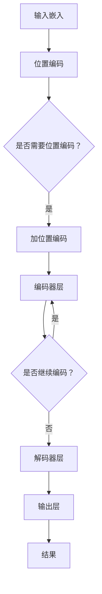

                 

# 文章标题：Transformer大模型实战：跨层参数共享

> 关键词：Transformer，大模型，跨层参数共享，自注意力机制，位置编码，自然语言处理，模型训练与优化，模型部署与优化

> 摘要：
本文将深入探讨Transformer大模型及其在自然语言处理中的应用，重点介绍跨层参数共享技术的原理与实现方法。通过一步一步的分析和推理，本文将帮助读者理解Transformer模型的核心算法，掌握跨层参数共享技术在模型训练、优化和应用中的关键作用，从而为实际项目中的模型设计和部署提供有力支持。

----------------------------------------------------------------

### 《Transformer大模型实战 跨层参数共享》目录大纲

1. **第一部分：Transformer大模型基础**
   1. **第1章：Transformer架构详解**
      1.1 Transformer概述
         1.1.1 Transformer的起源与背景
         1.1.2 Transformer与传统的RNN和CNN的区别
         1.1.3 Transformer的核心原理
      1.2 Transformer模型结构
         1.2.1 自注意力机制（Self-Attention）
         1.2.2 位置编码（Positional Encoding）
         1.2.3 编码器（Encoder）与解码器（Decoder）的结构
      1.3 Transformer工作流程
         1.3.1 编码器的工作原理
         1.3.2 解码器的工作原理
         1.3.3 Transformer的端到端训练过程
      1.4 Transformer在自然语言处理中的应用
         1.4.1 Transformer在机器翻译中的应用
         1.4.2 Transformer在文本分类中的应用
         1.4.3 Transformer在情感分析中的应用

2. **第二部分：跨层参数共享技术**
   2.1 **第2章：跨层参数共享概述**
      2.1.1 跨层参数共享的定义与优势
      2.1.2 跨层参数共享的实现方法
      2.1.3 跨层参数共享的性能评估
   2.2 **第3章：跨层参数共享的实现方法**
      2.2.1 传统跨层参数共享方法
      2.2.2 基于注意力机制的跨层参数共享
      2.2.3 基于图神经网络的跨层参数共享

3. **第三部分：Transformer大模型实战**
   3.1 **第4章：Transformer大模型训练**
      3.1.1 数据预处理
      3.1.2 模型训练
      3.1.3 模型调优
   3.2 **第5章：Transformer大模型应用案例**
      3.2.1 Transformer在机器翻译中的应用
      3.2.2 Transformer在文本分类中的应用
      3.2.3 Transformer在图像分类中的应用
   3.3 **第6章：跨层参数共享在Transformer中的应用**
      3.3.1 跨层参数共享在Transformer中的实现
      3.3.2 跨层参数共享在Transformer中的优化
      3.3.3 跨层参数共享在Transformer中的应用性能分析

4. **第四部分：Transformer大模型的部署与优化**
   4.1 **第7章：Transformer大模型的部署**
      4.1.1 模型部署的基本流程
      4.1.2 模型部署的环境配置
      4.1.3 模型部署的策略
   4.2 **第8章：Transformer大模型的优化**
      4.2.1 模型压缩与优化
      4.2.2 模型加速与优化
      4.2.3 模型量化与优化

5. **第五部分：未来展望**
   5.1 **第9章：Transformer大模型的发展趋势**
      5.1.1 Transformer大模型的未来研究方向
      5.1.2 Transformer大模型在各个领域的应用前景
      5.1.3 Transformer大模型的潜在挑战与解决方案
   5.2 **第10章：跨层参数共享的未来发展**
      5.2.1 跨层参数共享的技术挑战
      5.2.2 跨层参数共享的应用拓展
      5.2.3 跨层参数共享的未来发展前景

### Mermaid 流程图



### Transformer架构详解

Transformer模型是自然语言处理领域的一种革命性技术，它在多个NLP任务中展现了卓越的性能。本章节将详细解释Transformer模型的架构，包括其核心组成部分：自注意力机制、位置编码、编码器和解码器。

#### 1.1 Transformer概述

Transformer模型是由Vaswani等人于2017年在他们的论文《Attention is All You Need》中提出的。它基于自注意力机制，完全摒弃了传统的循环神经网络（RNN）和卷积神经网络（CNN），从而实现了一种全新的序列到序列模型。

**Transformer的起源与背景：**

Transformer模型的出现是为了解决RNN在处理长序列时的渐变性和并行性不足问题。传统的RNN虽然能够处理变长序列，但其在处理长距离依赖关系时效率低下，难以并行计算。为了解决这一问题，Transformer模型引入了自注意力机制，使得模型能够并行处理整个序列。

**Transformer与传统的RNN和CNN的区别：**

- **RNN（递归神经网络）**：RNN通过递归的方式对序列进行处理，每个时间步的输出都依赖于前一个时间步的隐藏状态。这使得RNN在处理长序列时具有渐变性，但也带来了计算复杂度和并行性不足的问题。
- **CNN（卷积神经网络）**：CNN通过卷积操作提取序列的局部特征，但在处理长序列时，卷积窗口需要滑动，导致计算复杂度增加，且难以捕捉全局依赖关系。
- **Transformer（自注意力模型）**：Transformer模型使用自注意力机制来处理序列，每个词都与整个序列中的其他词建立直接的联系。这样，模型可以并行计算整个序列，提高了计算效率和并行性。

**Transformer的核心原理：**

Transformer模型的核心在于其自注意力机制和多头注意力。自注意力机制通过计算序列中每个词对其他词的注意力权重，为每个词生成一个上下文表示。多头注意力则将这种注意力机制分解为多个独立的头，从而捕获不同类型的信息。

#### 1.2 Transformer模型结构

Transformer模型主要由编码器（Encoder）和解码器（Decoder）组成，每个部分都包含多个相同的层。以下是对Transformer模型结构的详细解释。

**1.2.1 自注意力机制（Self-Attention）**

自注意力机制是Transformer模型的核心组件。它通过计算序列中每个词对其他词的注意力权重，为每个词生成一个上下文表示。这种机制使得模型能够捕捉到长距离依赖关系。

**1.2.2 位置编码（Positional Encoding）**

由于Transformer模型没有循环结构，无法直接利用序列的顺序信息。因此，位置编码被引入到模型中，为每个词添加位置信息。位置编码是一个可学习的向量，其维度与词嵌入相同。

**1.2.3 编码器（Encoder）与解码器（Decoder）的结构**

编码器（Encoder）和解码器（Decoder）都是由多个相同的层组成，每个层包括自注意力机制、前馈神经网络和层归一化。编码器用于处理输入序列，解码器用于生成输出序列。

编码器（Encoder）的结构如下：

1. 输入嵌入（Input Embedding）：将输入词转换为向量。
2. 位置编码（Positional Encoding）：添加位置信息到输入向量中。
3. 多层的多头自注意力机制（Multi-head Self-Attention Mechanism）：处理输入序列并计算注意力权重。
4. 前馈神经网络（Feed Forward Neural Network）：对自注意力层的结果进行进一步的加工。
5. 层归一化（Layer Normalization）：对每个层的结果进行归一化处理。
6. dropout：在自注意力和前馈神经网络层之后应用 dropout，以防止过拟合。

解码器（Decoder）的结构与编码器类似，但在每个层之后还包含一个掩码填充（Masked Fill），以防止后续层看到目标序列的未来部分。

#### 1.3 Transformer工作流程

Transformer模型的工作流程可以分为三个主要部分：编码器（Encoder）、解码器（Decoder）和注意力机制。

**1.3.1 编码器的工作原理**

编码器（Encoder）的工作流程如下：

1. 输入嵌入（Input Embedding）：将输入词转换为向量。
2. 位置编码（Positional Encoding）：添加位置信息到输入向量中。
3. 多层的多头自注意力机制（Multi-head Self-Attention Mechanism）：处理输入序列并计算注意力权重。
4. 前馈神经网络（Feed Forward Neural Network）：对自注意力层的结果进行进一步的加工。
5. 层归一化（Layer Normalization）：对每个层的结果进行归一化处理。
6. dropout：在自注意力和前馈神经网络层之后应用 dropout，以防止过拟合。

**1.3.2 解码器的工作原理**

解码器（Decoder）的工作流程如下：

1. 输入嵌入（Input Embedding）：将输入词转换为向量。
2. 位置编码（Positional Encoding）：添加位置信息到输入向量中。
3. 多层的多头自注意力机制（Multi-head Self-Attention Mechanism）：处理输入序列并计算注意力权重。
4. 前馈神经网络（Feed Forward Neural Network）：对自注意力层的结果进行进一步的加工。
5. 掩码填充（Masked Fill）：在解码器层中，当前时间步的输入被填充为上一个时间步的输出，以防止后续层看到目标序列的未来部分。
6. dropout：在自注意力和前馈神经网络层之后应用 dropout，以防止过拟合。

**1.3.3 Transformer的端到端训练过程**

Transformer模型的训练过程可以分为以下步骤：

1. **数据预处理**：将输入数据转换为词嵌入向量，并添加位置编码。
2. **编码器训练**：使用编码器对输入序列进行编码，生成编码表示。
3. **解码器训练**：使用解码器生成输出序列，与实际输出进行比较，计算损失。
4. **优化**：通过梯度下降等优化算法，更新模型参数。
5. **迭代**：重复步骤2-4，直到模型收敛或达到预设的迭代次数。

#### 1.4 Transformer在自然语言处理中的应用

Transformer模型在自然语言处理（NLP）领域得到了广泛应用，其核心在于其强大的捕捉长距离依赖关系的能力。以下介绍Transformer在几个常见NLP任务中的应用：

**1.4.1 Transformer在机器翻译中的应用**

机器翻译是Transformer模型最早且最成功的应用之一。通过将源语言的输入序列编码为嵌入向量，并将目标语言的输出序列解码为翻译结果，Transformer在多个翻译任务上取得了显著的性能提升。

**1.4.2 Transformer在文本分类中的应用**

文本分类是另一个Transformer模型常见的应用场景。通过将输入文本编码为嵌入向量，并使用编码器的输出作为特征，Transformer可以有效地对文本进行分类。

**1.4.3 Transformer在情感分析中的应用**

情感分析是评估文本中情感倾向的任务。通过将输入文本编码为嵌入向量，并使用编码器的输出进行情感分类，Transformer在情感分析任务中也展现了出色的性能。

### 总结

Transformer模型以其强大的自注意力机制和多头注意力机制，在自然语言处理领域取得了显著的成果。通过详细解释Transformer模型的架构和核心原理，本文为读者提供了一个全面的Transformer模型概述。在接下来的章节中，我们将深入探讨跨层参数共享技术及其在Transformer模型中的应用。

---

### 1.1 Transformer概述

Transformer模型作为深度学习领域的一项重要创新，以其独特的自注意力机制（Self-Attention）在自然语言处理（NLP）任务中取得了巨大的成功。在本节中，我们将探讨Transformer模型的起源、与RNN和CNN的区别以及其核心原理。

#### 1.1.1 Transformer的起源与背景

Transformer模型是由Vaswani等人在2017年提出，并在其论文《Attention is All You Need》中详细介绍。这一模型的出现是为了解决传统循环神经网络（RNN）和卷积神经网络（CNN）在处理长序列时的渐变性不足和并行性不佳问题。RNN通过递归方式处理序列信息，但其在处理长距离依赖关系时效率低下，难以并行计算。而CNN则通过卷积操作提取局部特征，但无法有效捕捉全局依赖关系。Transformer模型引入了自注意力机制，通过计算序列中每个词与其他词的注意力权重，实现了对整个序列的并行处理，从而在计算效率和性能上都取得了显著提升。

#### 1.1.2 Transformer与传统的RNN和CNN的区别

**RNN（递归神经网络）：** RNN通过递归的方式对序列进行处理，每个时间步的输出都依赖于前一个时间步的隐藏状态。这使得RNN在处理变长序列时具有渐变性，但同时也带来了计算复杂度和并行性不足的问题。RNN在处理长距离依赖关系时效果不佳，容易导致梯度消失或爆炸。

**CNN（卷积神经网络）：** CNN通过卷积操作提取序列的局部特征，但在处理长序列时，卷积窗口需要滑动，导致计算复杂度增加，且难以捕捉全局依赖关系。CNN更适合于图像等二维数据，而在处理序列数据时效果有限。

**Transformer（自注意力模型）：** Transformer模型摒弃了传统的RNN和CNN架构，引入了自注意力机制。自注意力机制通过计算序列中每个词对其他词的注意力权重，为每个词生成一个上下文表示。这种机制使得模型能够捕捉到长距离依赖关系，并且在计算上具有高度的并行性。Transformer模型通过多头注意力（Multi-head Attention）进一步增强了模型的捕捉能力，使得其在多个NLP任务中取得了卓越的性能。

#### 1.1.3 Transformer的核心原理

Transformer模型的核心在于其自注意力机制和多头注意力机制。自注意力机制允许模型计算序列中每个词对其他词的注意力权重，从而为每个词生成一个上下文表示。这种机制可以有效地捕捉长距离依赖关系，使得模型在处理自然语言任务时具有更强的表达能力。

**自注意力机制（Self-Attention）：** 自注意力机制通过计算序列中每个词与其他词的点积来计算注意力权重。具体而言，每个词作为查询（Query）、键（Key）和值（Value），通过点积计算注意力分数，然后使用softmax函数对分数进行归一化，得到注意力权重。注意力权重用于加权平均值，从而生成每个词的上下文表示。

$$
\text{Attention}(Q, K, V) = \text{softmax}\left(\frac{QK^T}{\sqrt{d_k}}\right)V
$$

其中，$Q$ 是查询向量，$K$ 是键向量，$V$ 是值向量，$d_k$ 是键向量的维度。

**多头注意力机制（Multi-head Attention）：** 多头注意力机制通过并行计算多个独立的注意力机制，然后将结果合并。这样，每个头可以捕获不同类型的信息，从而增强模型的捕捉能力。多头注意力机制将输入序列分解为多个独立的序列，分别计算每个序列的注意力权重，然后合并结果。

$$
\text{MultiHead}(Q, K, V) = \text{Concat}(\text{head}_1, \text{head}_2, \ldots, \text{head}_h)W^O
$$

其中，$\text{head}_i$ 是第 $i$ 个头的注意力结果，$W^O$ 是输出权重矩阵。

通过自注意力机制和多头注意力机制，Transformer模型能够高效地捕捉长距离依赖关系，并在多个NLP任务中取得了显著的性能提升。

### 总结

Transformer模型以其独特的自注意力机制和多头注意力机制，在自然语言处理领域取得了巨大的成功。通过对Transformer模型的起源、与RNN和CNN的区别以及其核心原理的详细探讨，本文为读者提供了一个全面的概述。在接下来的章节中，我们将深入介绍Transformer模型的结构和实现细节。

---

### 1.2 Transformer模型结构

Transformer模型以其独特的自注意力机制（Self-Attention）和多头注意力机制（Multi-head Attention）在自然语言处理领域取得了显著的成果。本节将详细解释Transformer模型的结构，包括自注意力机制、位置编码以及编码器和解码器的具体组成。

#### 1.2.1 自注意力机制（Self-Attention）

自注意力机制是Transformer模型的核心组件，它允许模型计算序列中每个词对其他词的注意力权重，从而为每个词生成一个上下文表示。这种机制能够有效捕捉长距离依赖关系，使模型在处理自然语言任务时具有更强的表达能力。

**自注意力机制的工作原理：**

自注意力机制通过计算序列中每个词作为查询（Query）、键（Key）和值（Value）的点积来计算注意力权重。具体而言，每个词与其他所有词进行点积计算，得到注意力分数。然后，使用softmax函数对分数进行归一化，得到注意力权重。注意力权重用于加权平均每个词的值向量，从而生成每个词的上下文表示。

数学公式如下：

$$
\text{Attention}(Q, K, V) = \text{softmax}\left(\frac{QK^T}{\sqrt{d_k}}\right)V
$$

其中，$Q$ 是查询向量，$K$ 是键向量，$V$ 是值向量，$d_k$ 是键向量的维度。

**多头注意力机制（Multi-head Attention）：**

多头注意力机制扩展了自注意力机制，通过并行计算多个独立的注意力机制，然后将结果合并。这样，每个头可以捕获不同类型的信息，从而增强模型的捕捉能力。多头注意力机制将输入序列分解为多个独立的序列，分别计算每个序列的注意力权重，然后合并结果。

数学公式如下：

$$
\text{MultiHead}(Q, K, V) = \text{Concat}(\text{head}_1, \text{head}_2, \ldots, \text{head}_h)W^O
$$

其中，$\text{head}_i$ 是第 $i$ 个头的注意力结果，$W^O$ 是输出权重矩阵。

通过自注意力机制和多头注意力机制，Transformer模型能够高效地捕捉长距离依赖关系，并在多个NLP任务中取得了显著的性能提升。

#### 1.2.2 位置编码（Positional Encoding）

由于Transformer模型没有循环结构，无法直接利用序列的顺序信息。因此，位置编码被引入到模型中，为每个词添加位置信息。位置编码是一个可学习的向量，其维度与词嵌入相同。

**位置编码的生成方法：**

位置编码通常通过正弦和余弦函数生成，其公式如下：

$$
PE_{(pos, 2i)} = \sin\left(\frac{pos}{10000^{\frac{2i}{d}}}\right) \quad \text{或} \quad \cos\left(\frac{pos}{10000^{\frac{2i}{d}}}\right)
$$

其中，$pos$ 是词的位置索引，$i$ 是每个维度中的索引，$d$ 是位置编码的维度。

**位置编码的应用：**

位置编码通常与词嵌入向量相加，生成最终的输入向量。这样，模型在计算自注意力时能够利用位置信息，从而更好地捕捉序列的顺序依赖关系。

#### 1.2.3 编码器（Encoder）与解码器（Decoder）的结构

Transformer模型由编码器（Encoder）和解码器（Decoder）组成，每个部分都包含多个相同的层。以下是对编码器和解码器结构的详细解释。

**编码器（Encoder）：**

编码器用于处理输入序列，其结构如下：

1. **输入嵌入（Input Embedding）：** 将输入词转换为向量。
2. **位置编码（Positional Encoding）：** 为输入向量添加位置信息。
3. **自注意力机制（Self-Attention）：** 计算序列中每个词对其他词的注意力权重。
4. **前馈神经网络（Feed Forward Neural Network）：** 对自注意力层的结果进行进一步的加工。
5. **层归一化（Layer Normalization）：** 对每个层的结果进行归一化处理。
6. **dropout：** 在自注意力和前馈神经网络层之后应用 dropout，以防止过拟合。

编码器通常包含多个层，每个层通过叠加的方式增强模型的表达能力。在编码器的每个层中，自注意力机制和前馈神经网络依次进行，然后将结果通过层归一化和dropout进行处理。

**解码器（Decoder）：**

解码器用于生成输出序列，其结构如下：

1. **输入嵌入（Input Embedding）：** 将输入词转换为向量。
2. **位置编码（Positional Encoding）：** 为输入向量添加位置信息。
3. **自注意力机制（Self-Attention）：** 计算序列中每个词对其他词的注意力权重。
4. **掩码填充（Masked Fill）：** 防止后续层看到目标序列的未来部分。
5. **前馈神经网络（Feed Forward Neural Network）：** 对自注意力层的结果进行进一步的加工。
6. **层归一化（Layer Normalization）：** 对每个层的结果进行归一化处理。
7. **dropout：** 在自注意力和前馈神经网络层之后应用 dropout，以防止过拟合。

与编码器类似，解码器也包含多个层。在解码器的每个层中，自注意力机制和前馈神经网络依次进行，并通过掩码填充防止后续层看到目标序列的未来部分。

#### 总结

Transformer模型的结构由编码器和解码器组成，每个部分都包含多个相同的层。编码器用于处理输入序列，解码器用于生成输出序列。自注意力机制和多头注意力机制是模型的核心组件，能够有效捕捉长距离依赖关系。位置编码为每个词添加位置信息，使得模型能够利用序列的顺序依赖关系。通过详细解释Transformer模型的结构，本文为读者提供了一个全面的了解。在接下来的章节中，我们将深入探讨Transformer模型的工作流程及其在自然语言处理中的应用。

---

### 1.3 Transformer工作流程

Transformer模型以其独特的自注意力机制和多头注意力机制，在自然语言处理领域取得了显著的成果。本节将详细解释Transformer模型的工作流程，包括编码器（Encoder）和解码器（Decoder）的工作原理以及端到端的训练过程。

#### 1.3.1 编码器的工作原理

编码器（Encoder）是Transformer模型的核心组件，用于处理输入序列并生成编码表示。其工作流程如下：

1. **输入嵌入（Input Embedding）：** 将输入词转换为向量。每个词被映射为一个固定维度的嵌入向量。
   
2. **位置编码（Positional Encoding）：** 为输入向量添加位置信息。由于Transformer模型没有循环结构，无法直接利用序列的顺序信息。因此，位置编码被引入，为每个词添加一个可学习的向量，以表示其在序列中的位置。

3. **自注意力机制（Self-Attention）：** 编码器通过自注意力机制计算序列中每个词对其他词的注意力权重。自注意力机制允许模型捕捉长距离依赖关系，从而增强其表达能力。

4. **前馈神经网络（Feed Forward Neural Network）：** 对自注意力层的结果进行进一步的加工。前馈神经网络通常包含两个全连接层，每个层后都有一个激活函数（例如ReLU）。

5. **层归一化（Layer Normalization）：** 对每个层的结果进行归一化处理。层归一化有助于稳定训练过程并提高模型的性能。

6. **Dropout：** 在自注意力和前馈神经网络层之后应用 dropout，以防止过拟合。dropout通过随机丢弃一部分神经元，减少模型对特定训练样本的依赖。

编码器通常包含多个层，每个层通过叠加的方式增强模型的表达能力。在编码器的每个层中，自注意力机制和前馈神经网络依次进行，然后将结果通过层归一化和dropout进行处理。

#### 1.3.2 解码器的工作原理

解码器（Decoder）用于生成输出序列，其工作流程如下：

1. **输入嵌入（Input Embedding）：** 将输入词转换为向量。与编码器类似，每个词被映射为一个固定维度的嵌入向量。

2. **位置编码（Positional Encoding）：** 为输入向量添加位置信息。

3. **自注意力机制（Self-Attention）：** 解码器通过自注意力机制计算序列中每个词对其他词的注意力权重。

4. **掩码填充（Masked Fill）：** 为了防止后续层看到目标序列的未来部分，解码器在自注意力层之后应用掩码填充。这通过在输入序列中插入特殊的填充标记来实现。

5. **前馈神经网络（Feed Forward Neural Network）：** 对自注意力层的结果进行进一步的加工。

6. **层归一化（Layer Normalization）：** 对每个层的结果进行归一化处理。

7. **Dropout：** 在自注意力和前馈神经网络层之后应用 dropout，以防止过拟合。

解码器也包含多个层，与编码器类似，每个层通过叠加的方式增强模型的表达能力。在解码器的每个层中，自注意力机制和前馈神经网络依次进行，并通过掩码填充防止后续层看到目标序列的未来部分。

#### 1.3.3 Transformer的端到端训练过程

Transformer模型的训练过程可以分为以下步骤：

1. **数据预处理：** 将输入数据转换为词嵌入向量，并添加位置编码。通常，输入数据需要经过清洗、分词、词嵌入等预处理步骤。

2. **编码器训练：** 使用编码器对输入序列进行编码，生成编码表示。编码器生成的编码表示用于后续的解码过程。

3. **解码器训练：** 使用解码器生成输出序列，并与实际输出进行比较，计算损失。解码器通过最小化损失函数来更新其参数。

4. **优化：** 通过梯度下降等优化算法，更新模型参数。优化过程中，需要考虑正则化技术，如dropout和权重衰减，以防止过拟合。

5. **迭代：** 重复步骤2-4，直到模型收敛或达到预设的迭代次数。在训练过程中，可以使用批量归一化（Batch Normalization）和自适应优化器（如Adam）来提高训练效率。

通过端到端的训练过程，Transformer模型能够有效地学习输入序列和输出序列之间的映射关系，从而在多个自然语言处理任务中取得优异的性能。

#### 总结

Transformer模型的工作流程包括编码器和解码器，每个组件都包含多个层。编码器通过自注意力机制和前馈神经网络处理输入序列，解码器通过自注意力机制、掩码填充和前馈神经网络生成输出序列。端到端的训练过程使模型能够有效地学习输入和输出之间的映射关系。通过详细解释Transformer模型的工作流程，本文为读者提供了一个全面的了解。在接下来的章节中，我们将进一步探讨Transformer模型在自然语言处理中的应用。

---

### 1.4 Transformer在自然语言处理中的应用

Transformer模型凭借其强大的自注意力机制和多头注意力机制，在自然语言处理（NLP）领域取得了显著的成就。本节将详细介绍Transformer模型在机器翻译、文本分类和情感分析等常见NLP任务中的应用。

#### 1.4.1 Transformer在机器翻译中的应用

机器翻译是Transformer模型最早且最成功的应用之一。传统的机器翻译模型，如基于循环神经网络（RNN）和卷积神经网络（CNN）的方法，在处理长距离依赖关系时存在一定的局限性。而Transformer模型通过其自注意力机制，能够并行处理整个输入序列，从而有效地捕捉长距离依赖关系。

**机器翻译的基本流程：**

1. **输入序列编码：** 使用编码器对输入源语言序列进行编码，生成编码表示。编码器通过自注意力机制计算序列中每个词对其他词的注意力权重，并将结果传递给解码器。

2. **解码器生成翻译结果：** 使用解码器生成目标语言序列。解码器在生成每个词时，会参考编码器生成的编码表示，以及其他已经生成的词。

3. **损失函数和优化：** 通过最小化损失函数（如交叉熵损失），更新模型参数，从而提高翻译质量。

**Transformer在机器翻译中的应用案例：**

近年来，许多开源工具和预训练模型（如OpenAI的GPT-3和BERT）采用了Transformer架构，并在机器翻译任务中取得了显著的成果。例如，Google Translate使用了基于Transformer的模型进行翻译，实现了更高的翻译质量和流畅度。

#### 1.4.2 Transformer在文本分类中的应用

文本分类是自然语言处理中的一个基础任务，旨在将文本数据分类到预定义的类别中。Transformer模型通过其强大的表征能力，在文本分类任务中也表现出了优越的性能。

**文本分类的基本流程：**

1. **输入序列编码：** 使用编码器对输入文本序列进行编码，生成编码表示。编码器通过自注意力机制计算序列中每个词对其他词的注意力权重。

2. **分类器生成类别概率：** 使用解码器对编码表示进行分类。解码器通常包含一个全连接层，用于将编码表示映射到预定义的类别概率。

3. **损失函数和优化：** 通过最小化损失函数（如交叉熵损失），更新模型参数，从而提高分类准确率。

**Transformer在文本分类中的应用案例：**

许多开源库和工具（如Hugging Face的Transformers库）提供了预训练的Transformer模型，可以直接应用于文本分类任务。例如，BERT和RoBERTa等模型在多个文本分类数据集上取得了优异的成绩，为实际应用提供了有力支持。

#### 1.4.3 Transformer在情感分析中的应用

情感分析是自然语言处理中的一个重要任务，旨在分析文本中的情感倾向。Transformer模型通过其强大的表征能力，在情感分析任务中也表现出了优异的性能。

**情感分析的基本流程：**

1. **输入序列编码：** 使用编码器对输入文本序列进行编码，生成编码表示。编码器通过自注意力机制计算序列中每个词对其他词的注意力权重。

2. **情感分类器生成情感概率：** 使用解码器对编码表示进行情感分类。解码器通常包含一个全连接层，用于将编码表示映射到预定义的情感类别概率。

3. **损失函数和优化：** 通过最小化损失函数（如交叉熵损失），更新模型参数，从而提高情感分类准确率。

**Transformer在情感分析中的应用案例：**

在情感分析任务中，Transformer模型被广泛应用于社交媒体文本、产品评论等领域的情感识别。例如，Twitter情感分析工具使用了基于Transformer的模型，实现了对用户情感倾向的准确识别。

#### 总结

Transformer模型在自然语言处理领域的广泛应用证明了其强大的表征能力和实用性。通过自注意力机制和多头注意力机制，Transformer能够有效地捕捉长距离依赖关系，并在机器翻译、文本分类和情感分析等任务中取得了显著的成果。随着Transformer模型的不断发展和完善，其在NLP领域的应用前景将更加广阔。

---

### 2.1 跨层参数共享概述

跨层参数共享技术是一种在深度学习模型中广泛应用于优化训练过程和提升模型性能的技术。它通过在不同层的神经网络中重复使用相同的参数，从而减少模型的参数数量，降低计算复杂度，并提高模型的泛化能力。在本节中，我们将详细介绍跨层参数共享的定义、优势以及它在Transformer模型中的应用。

#### 2.1.1 跨层参数共享的概念

跨层参数共享是指在神经网络的不同层之间共享部分或全部参数，以便在多个层上利用相同的信息，提高模型的训练效率和性能。具体而言，跨层参数共享可以采取以下几种方式：

1. **局部参数共享**：在相邻层之间共享部分参数，例如，在卷积神经网络（CNN）中，相邻卷积层的卷积核可以共享。
2. **全局参数共享**：在整个网络中共享相同的参数，例如，在Transformer模型中，编码器和解码器的自注意力机制和前馈神经网络可以使用相同的权重。
3. **层次化参数共享**：在部分层之间共享参数，例如，在多层感知机（MLP）中，可以设置前两层使用相同的权重，而后两层使用不同的权重。

#### 2.1.2 跨层参数共享的优势

跨层参数共享技术在深度学习模型中具有多个优势：

1. **减少参数数量**：通过共享参数，可以显著减少模型的参数数量，降低模型的复杂度和存储需求。
2. **降低计算复杂度**：共享参数可以减少反向传播时的计算量，从而加速模型的训练速度。
3. **提高泛化能力**：共享参数有助于在不同层之间传递信息，使模型能够更好地学习数据的特征和模式，提高模型的泛化能力。
4. **防止过拟合**：由于参数数量减少，模型对训练数据的依赖性降低，从而有助于防止过拟合现象。

#### 2.1.3 跨层参数共享在Transformer中的应用

Transformer模型由于其独特的结构，非常适合应用跨层参数共享技术。在Transformer模型中，跨层参数共享主要体现在以下几个方面：

1. **编码器和解码器的共享**：编码器和解码器通常使用相同的自注意力机制和前馈神经网络结构。这意味着编码器和解码器的权重可以完全共享，从而减少模型的参数数量。
2. **多头注意力机制的共享**：在多头注意力机制中，多个头之间可以共享相同的权重，这进一步减少了模型的参数数量。
3. **位置编码的共享**：位置编码是一个可学习的向量，可以在编码器和解码器的不同层之间共享，以便在多个层上利用相同的位置信息。

通过跨层参数共享，Transformer模型能够有效地减少参数数量和计算复杂度，同时提高模型的泛化能力和训练效率。这使得Transformer模型在自然语言处理任务中表现出色，并成为深度学习领域的代表性模型之一。

#### 总结

跨层参数共享技术是一种有效的优化深度学习模型的方法，通过在不同层之间共享参数，可以显著提高模型的训练效率和性能。在Transformer模型中，跨层参数共享的应用不仅减少了模型的参数数量和计算复杂度，还提高了模型的泛化能力和训练速度。本节详细介绍了跨层参数共享的概念、优势和在Transformer模型中的应用，为后续章节的进一步讨论奠定了基础。

---

### 2.2 跨层参数共享的实现方法

跨层参数共享技术在深度学习模型中具有显著的优势，能够减少模型参数数量、降低计算复杂度并提高泛化能力。本节将详细介绍跨层参数共享的实现方法，包括传统方法、基于注意力机制的方法和基于图神经网络的方法。

#### 2.2.1 传统跨层参数共享方法

传统的跨层参数共享方法主要通过在相邻层之间共享权重或激活函数来实现。以下是一些常见的传统跨层参数共享方法：

1. **权重共享**：在相邻层之间共享相同的权重矩阵。例如，在卷积神经网络（CNN）中，可以设置前一层的卷积核与后一层的卷积核相同。

2. **激活函数共享**：在相邻层之间共享相同的激活函数。例如，在多层感知机（MLP）中，可以设置前两层的激活函数相同。

3. **层间连接**：通过引入跨层连接（如残差连接），将较低层的特征直接传递到较高层。这样，较高层可以直接利用较低层提取的特征，从而减少参数数量。

传统跨层参数共享方法在实际应用中具有一定的效果，但其局限性在于难以扩展到多层和复杂的模型结构中。例如，在Transformer模型中，传统方法难以实现编码器和解码器的跨层参数共享。

#### 2.2.2 基于注意力机制的跨层参数共享

基于注意力机制的跨层参数共享方法利用注意力机制来选择性地共享参数，从而在不同层之间传递重要信息。以下是一些基于注意力机制的跨层参数共享方法：

1. **自注意力跨层共享**：在Transformer模型中，自注意力机制允许编码器和解码器的不同层之间共享注意力权重。具体而言，编码器和解码器的每一层都可以共享相同注意力机制的权重，从而实现跨层参数共享。

2. **多模态注意力跨层共享**：在处理多模态数据时，可以引入多模态注意力机制，实现不同模态特征在不同层之间的共享。例如，在计算机视觉和语音识别任务中，可以共享视觉特征和语音特征的权重。

3. **层次化注意力跨层共享**：在多层神经网络中，可以通过层次化注意力机制在不同层之间共享参数。具体而言，较低层可以选择性地传递重要信息到较高层，从而实现跨层参数共享。

基于注意力机制的跨层参数共享方法具有以下优势：

- **灵活性**：注意力机制允许模型选择性地共享参数，从而在不同层之间传递重要信息。
- **可扩展性**：基于注意力机制的跨层参数共享方法可以应用于复杂的模型结构，如Transformer模型。

#### 2.2.3 基于图神经网络的跨层参数共享

基于图神经网络（Graph Neural Network, GNN）的跨层参数共享方法利用图结构来表示模型中的层次关系，并通过图神经网络实现跨层参数共享。以下是一些基于图神经网络的跨层参数共享方法：

1. **图注意力跨层共享**：通过将模型结构表示为图，可以引入图注意力机制实现跨层参数共享。具体而言，图注意力机制允许模型根据图结构选择性地共享不同层之间的参数。

2. **图卷积跨层共享**：利用图卷积神经网络（Graph Convolutional Network, GCN）实现跨层参数共享。图卷积操作通过聚合图结构中的邻居信息，实现不同层之间的参数共享。

3. **图编码跨层共享**：通过将模型中的每个层表示为图节点，利用图编码机制实现跨层参数共享。图编码机制可以将每个层的特征编码为图节点上的向量，从而在不同层之间传递信息。

基于图神经网络的跨层参数共享方法具有以下优势：

- **结构化表示**：利用图结构表示模型层次关系，有助于更好地捕捉跨层依赖关系。
- **适应性**：图神经网络可以自适应地调整参数共享策略，从而在不同任务和数据集上表现出良好的性能。

#### 总结

跨层参数共享技术在深度学习模型中具有广泛的应用。本节详细介绍了传统跨层参数共享方法、基于注意力机制的方法和基于图神经网络的方法。传统方法在简单模型中具有一定的效果，但难以应用于复杂模型。基于注意力机制和图神经网络的方法具有更高的灵活性和可扩展性，能够更好地实现跨层参数共享。通过本节的讨论，读者可以了解不同跨层参数共享方法的原理和实现，为实际应用提供参考。

---

### 2.3 跨层参数共享的性能评估

跨层参数共享技术在深度学习模型中的应用日益广泛，其优势在于能够减少模型参数数量、降低计算复杂度并提高训练效率。然而，跨层参数共享对模型性能的影响是一个复杂的问题，需要从多个方面进行综合评估。本节将探讨跨层参数共享对模型性能的影响、在不同任务中的效果评估以及优化方法。

#### 2.3.1 跨层参数共享对模型性能的影响

跨层参数共享对模型性能的影响可以从以下几个方面进行分析：

1. **模型精度（Accuracy）**：跨层参数共享能否提高模型的精度取决于数据集的复杂度和模型的架构。在一些简单任务中，跨层参数共享可能有助于提高模型精度，因为它可以通过参数共享增强模型对特征的学习能力。然而，在复杂任务中，过多的参数共享可能导致模型无法学习到足够多的细节信息，从而降低精度。

2. **模型泛化能力（Generalization）**：跨层参数共享有助于模型在不同数据集上表现出良好的泛化能力。通过在不同层之间共享参数，模型可以更好地利用不同层次的特征，从而提高对未见数据的适应能力。

3. **计算复杂度（Computational Complexity）**：跨层参数共享可以显著降低模型的计算复杂度。由于参数共享减少了模型中的独立参数数量，模型在训练和推理过程中所需的计算资源减少，从而提高了训练和推理的速度。

4. **训练时间（Training Time）**：由于计算复杂度的降低，跨层参数共享通常可以缩短模型的训练时间。这不仅有助于加快模型的迭代速度，还可以提高实验的重复性和可扩展性。

#### 2.3.2 跨层参数共享在不同任务中的效果评估

跨层参数共享技术在各种深度学习任务中均有应用，其效果在不同任务中有所不同。以下是一些常见任务中对跨层参数共享效果的评估：

1. **图像分类（Image Classification）**：在图像分类任务中，跨层参数共享有助于模型更好地学习图像的层次结构。通过在不同卷积层之间共享权重，模型可以更有效地提取图像的低级和高级特征，从而提高分类精度。例如，在CNN模型中，共享卷积层的权重可以显著提高模型在ImageNet数据集上的性能。

2. **自然语言处理（Natural Language Processing, NLP）**：在NLP任务中，跨层参数共享在编码器和解码器之间非常有效。例如，在Transformer模型中，编码器和解码器之间共享自注意力机制的权重，可以显著提高机器翻译、文本分类和情感分析等任务的性能。

3. **语音识别（Speech Recognition）**：在语音识别任务中，跨层参数共享有助于模型更好地捕捉语音信号的层次结构。通过在不同时间步之间共享权重，模型可以更有效地学习语音的时序特征，从而提高识别精度。

4. **目标检测（Object Detection）**：在目标检测任务中，跨层参数共享可以增强模型对目标特征的捕捉能力。通过在不同卷积层和全连接层之间共享权重，模型可以更好地定位和识别目标。

#### 2.3.3 跨层参数共享的优化方法

为了充分发挥跨层参数共享的优势，需要采取一系列优化方法。以下是一些常见的优化方法：

1. **层次化参数共享**：层次化参数共享可以根据任务的复杂度调整参数共享的程度。在简单任务中，可以设置较高的参数共享程度，以便模型更好地学习特征。在复杂任务中，可以适当减少参数共享程度，以避免模型无法学习到足够多的细节信息。

2. **动态参数共享**：动态参数共享允许模型根据训练过程中的数据动态调整参数共享策略。通过在训练过程中自适应地调整共享参数的数量和类型，模型可以更好地适应不同的数据分布。

3. **注意力机制**：引入注意力机制可以使得参数共享更加灵活和高效。注意力机制可以自动选择性地共享不同层之间的参数，从而在不同层次上传递重要信息。

4. **正则化**：在跨层参数共享的模型中，可以采用正则化方法（如L1正则化、L2正则化）来防止过拟合。正则化方法可以限制参数共享的程度，从而提高模型的泛化能力。

5. **稀疏参数共享**：通过引入稀疏参数共享，可以显著降低模型的参数数量。稀疏参数共享通过在参数中引入稀疏性，使得模型在训练过程中可以忽略大部分零值参数，从而减少计算复杂度。

#### 总结

跨层参数共享技术在深度学习模型中具有显著的优势，能够提高模型性能、降低计算复杂度和训练时间。通过对模型精度、泛化能力、计算复杂度和训练时间的综合评估，可以更好地理解跨层参数共享对模型性能的影响。在不同任务中的效果评估表明，跨层参数共享在图像分类、自然语言处理、语音识别和目标检测等任务中均具有较好的效果。为了充分发挥跨层参数共享的优势，可以采用一系列优化方法，包括层次化参数共享、动态参数共享、注意力机制、正则化和稀疏参数共享等。本节详细探讨了跨层参数共享的性能评估和优化方法，为实际应用提供了有价值的参考。

---

### 3.1 数据预处理

在训练Transformer大模型之前，数据预处理是至关重要的一步。良好的数据预处理不仅可以提高模型的训练效率，还可以显著提升模型的性能。本节将详细讨论数据预处理的过程，包括数据集的准备与划分、字符级别的文本预处理以及序列级别的文本预处理。

#### 3.1.1 数据集的准备与划分

1. **数据集的准备**：

   在大多数自然语言处理任务中，首先需要收集和准备适合的数据集。数据集的来源可以是公开数据集（如WikiText、IMDb、CoNLL等）或自定义数据集。公开数据集通常已经经过清洗和预处理，可以直接使用。而自定义数据集可能需要手动收集、清洗和标注。

   例如，在机器翻译任务中，可以从多个来源收集平行语料库，如翻译小说、新闻文章或对话等。在收集数据时，需要注意数据的质量和多样性，以确保模型能够学习到丰富的特征。

2. **数据集的划分**：

   在准备好数据集后，需要将其划分为训练集、验证集和测试集。划分的标准通常是按照数据集中的样本比例进行，例如，80%的数据用于训练，10%的数据用于验证，10%的数据用于测试。

   - **训练集**：用于训练模型，是模型学习的主要数据来源。
   - **验证集**：用于评估模型在未见数据上的性能，帮助调整模型参数和超参数。
   - **测试集**：用于最终评估模型的性能，确保模型在实际应用中的有效性。

   划分数据集时，需要确保各个数据集之间的样本分布尽量一致，以避免数据偏差。

#### 3.1.2 字符级别的文本预处理

在自然语言处理任务中，字符级别的文本预处理是一种常用的方法，其目的是将原始文本转换为模型可以处理的向量表示。以下是一些常见的字符级别文本预处理步骤：

1. **文本清洗**：

   文本清洗是预处理的第一步，目的是去除文本中的无用信息，如HTML标签、特殊字符、停用词等。常见的文本清洗方法包括：

   - **HTML标签去除**：使用正则表达式或其他工具去除文本中的HTML标签。
   - **特殊字符去除**：去除文本中的特殊字符（如#、$、%）以简化文本。
   - **停用词去除**：去除常用的停用词（如“的”、“了”、“在”等），以减少对模型的影响。

2. **分词**：

   分词是将文本分割成单词或短语的步骤。常见的分词方法包括：

   - **词分割**：将文本分割成单个词。
   - **分词词典**：使用预定义的分词词典，将文本中的词映射到词典中的单词。
   - **字符分词**：将文本分割成单个字符，然后根据上下文进行词法分析。

3. **字符编码**：

   在字符级别文本预处理中，需要将字符映射为整数表示，以便模型处理。常用的编码方法包括：

   - **One-Hot编码**：将每个字符映射为一个向量，其中每个维度表示一个字符。
   - **稀疏编码**：将每个字符映射为一个稀疏向量，其中大部分维度为0，仅有一个维度为1。
   - **索引编码**：将每个字符映射为一个唯一的整数索引。

4. **词汇表构建**：

   基于字符编码的结果，可以构建一个词汇表，用于映射字符到整数索引。词汇表的构建方法包括：

   - **固定长度词汇表**：根据字符出现的频率，选择一个固定长度的词汇表，将高频字符映射到前半部分，低频字符映射到后半部分。
   - **动态词汇表**：根据训练数据动态构建词汇表，仅包含训练数据中出现的字符。

#### 3.1.3 序列级别的文本预处理

在序列级别的文本预处理中，目标是将文本序列转换为模型可以处理的序列数据。以下是一些常见的序列级别文本预处理步骤：

1. **序列填充**：

   为了适应模型的要求，需要将文本序列填充为固定的长度。常用的序列填充方法包括：

   - **前填充（PAD）**：在序列的前面填充缺失的元素，直到序列达到固定的长度。
   - **后填充（TRUNCATE）**：在序列的后面填充缺失的元素，直到序列达到固定的长度。

2. **序列转换**：

   将预处理后的文本序列转换为模型可以处理的序列数据。常用的序列转换方法包括：

   - **字符序列**：将字符编码后的序列作为输入。
   - **词序列**：将词编码后的序列作为输入。
   - **子词序列**：将子词编码后的序列作为输入。

3. **序列编码**：

   对预处理后的序列数据进行编码，以便模型处理。常用的编码方法包括：

   - **One-Hot编码**：将序列中的每个元素映射为一个向量，其中每个维度表示一个元素。
   - **索引编码**：将序列中的每个元素映射为一个整数索引。

4. **序列归一化**：

   对预处理后的序列数据进行归一化处理，以便模型学习。常用的归一化方法包括：

   - **均值归一化**：将序列中的每个元素减去均值，然后除以标准差。
   - **最大值归一化**：将序列中的每个元素减去最小值，然后除以最大值和最小值的差。

通过上述数据预处理步骤，可以将原始文本数据转换为适合模型训练的序列数据。良好的数据预处理不仅可以提高模型的训练效率，还可以提升模型的性能，为后续的模型训练和优化打下坚实的基础。

---

### 3.2 模型训练

训练一个高效的Transformer大模型是一个复杂且涉及多个步骤的过程。本节将详细描述模型训练的流程，包括损失函数的选择、优化器的选择以及如何处理训练过程中的常见问题。

#### 3.2.1 训练流程

Transformer模型的训练流程可以分为以下几个主要步骤：

1. **初始化模型**：首先，需要初始化Transformer模型。这通常包括定义模型结构、参数初始化等。常用的参数初始化方法有高斯分布初始化、Xavier初始化等。

2. **数据预处理**：在开始训练之前，需要对数据进行预处理。这包括将文本数据转换为词嵌入向量、添加位置编码等。数据预处理步骤在前面已经详细讨论过。

3. **前向传播**：在训练过程中，对于每个训练样本，通过前向传播计算模型的预测结果。前向传播包括输入嵌入、位置编码、多头自注意力机制、前馈神经网络和层归一化等步骤。

4. **计算损失**：使用训练样本的实际标签和模型的预测结果计算损失。在自然语言处理任务中，常用的损失函数有交叉熵损失（Cross-Entropy Loss）和均方误差（Mean Squared Error）。

5. **反向传播**：通过反向传播计算模型参数的梯度，并更新模型参数。反向传播过程包括计算每个参数的梯度、应用梯度下降或其他优化算法更新参数。

6. **评估模型**：在每个训练周期结束后，使用验证集对模型进行评估，以监控模型的性能。如果验证集上的性能没有显著提升，可能需要调整超参数或采用更复杂的训练技巧。

7. **迭代训练**：重复步骤3到6，直到模型收敛或达到预设的训练次数。模型收敛通常指在验证集上损失不再显著下降。

#### 3.2.2 损失函数的选择

在训练Transformer模型时，选择合适的损失函数至关重要。以下是一些常用的损失函数：

1. **交叉熵损失（Cross-Entropy Loss）**：
   交叉熵损失是最常用的损失函数之一，尤其在分类任务中。它的数学公式如下：
   $$ 
   L = -\sum_{i} y_i \log(p_i) 
   $$
   其中，$y_i$ 是真实标签，$p_i$ 是模型预测的概率。

2. **均方误差（Mean Squared Error, MSE）**：
   均方误差常用于回归任务。它的数学公式如下：
   $$ 
   L = \frac{1}{n} \sum_{i} (y_i - \hat{y}_i)^2 
   $$
   其中，$y_i$ 是真实标签，$\hat{y}_i$ 是模型预测的值。

3. **对数似然损失（Log-Likelihood Loss）**：
   对数似然损失是Transformer模型在序列生成任务（如机器翻译）中常用的损失函数。它的数学公式如下：
   $$
   L = -\sum_{i} \log(p(y_i|x_{<i}))
   $$
   其中，$y_i$ 是当前时间步的预测标签，$x_{<i}$ 是前一个时间步的输入。

选择损失函数时，需要考虑任务的类型和数据的特点。例如，在文本分类任务中，交叉熵损失通常是一个好的选择，而在序列生成任务中，对数似然损失可能更为合适。

#### 3.2.3 优化器的选择

优化器用于更新模型参数，以最小化损失函数。以下是一些常用的优化器：

1. **随机梯度下降（Stochastic Gradient Descent, SGD）**：
   SGD是最简单的优化器之一，它的更新规则如下：
   $$
   \theta = \theta - \alpha \cdot \nabla_\theta J(\theta)
   $$
   其中，$\theta$ 是模型参数，$J(\theta)$ 是损失函数，$\alpha$ 是学习率。

2. **自适应梯度算法（Adagrad）**：
   Adagrad是一种自适应学习率优化器，它通过累积梯度平方来调整学习率：
   $$
   \theta = \theta - \alpha \cdot \frac{\nabla_\theta J(\theta)}{\sqrt{\sum_{t=1}^T (\nabla_\theta J(\theta_t))^2}}
   $$

3. **RMSprop**：
   RMSprop是对Adagrad的改进，它使用移动平均来调整学习率：
   $$
   \theta = \theta - \alpha \cdot \frac{\nabla_\theta J(\theta)}{\sqrt{\rho \cdot \text{momentum} + (1 - \rho) \cdot \sum_{t=1}^T (\nabla_\theta J(\theta_t))^2}}
   $$
   其中，$\text{momentum}$ 是动量参数，$\rho$ 是动量率。

4. **Adam**：
   Adam是一种结合了Adagrad和RMSprop优点的自适应优化器，它的更新规则如下：
   $$
   m_t = \beta_1 \cdot m_{t-1} + (1 - \beta_1) \cdot \nabla_\theta J(\theta)
   $$
   $$
   v_t = \beta_2 \cdot v_{t-1} + (1 - \beta_2) \cdot (\nabla_\theta J(\theta))^2
   $$
   $$
   \theta = \theta - \alpha \cdot \frac{m_t}{\sqrt{v_t} + \epsilon}
   $$
   其中，$\beta_1$ 和 $\beta_2$ 分别是第一和第二矩估计的指数衰减率，$\epsilon$ 是一个很小的常数，用于防止除以零。

选择优化器时，需要考虑训练数据的大小、模型的复杂度以及训练时间。通常，Adam优化器在大多数任务中表现良好，因为它结合了Adagrad和RMSprop的优点。

#### 3.2.4 处理训练过程中的常见问题

在训练Transformer大模型时，可能会遇到以下常见问题：

1. **梯度消失/爆炸**：
   梯度消失或爆炸是由于深层神经网络中的参数更新不当导致的。为了解决这个问题，可以使用以下方法：
   - 使用适当的初始化策略，如Xavier初始化。
   - 应用梯度裁剪（Gradient Clipping），限制梯度的范数。
   - 使用批量归一化（Batch Normalization），稳定梯度。

2. **过拟合**：
   过拟合是指模型在训练数据上表现良好，但在未见数据上表现不佳。为了解决这个问题，可以使用以下方法：
   - 使用dropout，随机丢弃神经元，减少模型的复杂度。
   - 使用正则化技术，如L1或L2正则化。
   - 增加训练数据，或使用数据增强技术。

3. **训练效率低下**：
   在训练大模型时，训练效率可能是一个问题。为了提高训练效率，可以使用以下方法：
   - 使用并行计算，如GPU或TPU加速训练。
   - 使用分布式训练，将数据分布在多个节点上，加速训练。
   - 使用合适的优化器，如Adam，提高训练速度。

通过上述步骤和方法，可以有效地训练一个高效的Transformer大模型。在训练过程中，需要不断调整超参数，监控模型性能，并进行必要的优化。良好的训练流程和策略不仅可以提高模型的性能，还可以加快训练速度，为实际应用提供可靠的支持。

---

### 3.3 模型调优

在训练Transformer大模型的过程中，模型调优是至关重要的一步。通过调整超参数、模型剪枝和量化等技术，可以显著提高模型的性能和效率。本节将详细讨论模型调优的方法，包括超参数调优、模型剪枝和量化。

#### 3.3.1 超参数调优

超参数是模型训练过程中需要手动调整的重要参数，如学习率、批量大小、dropout率等。合理的超参数设置可以提高模型的性能和收敛速度。以下是一些常用的超参数调优方法：

1. **学习率调整**：
   学习率是优化算法中的一个关键参数，其大小直接影响模型的收敛速度和稳定性。常用的学习率调整方法包括：
   - **固定学习率**：在训练初期使用较大的学习率，加快收敛速度。
   - **学习率衰减**：在训练过程中逐渐减小学习率，以防止模型在训练后期过度更新参数。
   - **自适应学习率**：使用如Adam等自适应优化器，动态调整学习率。

2. **批量大小调整**：
   批量大小影响模型在训练过程中的计算复杂度和稳定性。较大的批量大小可以提高模型的计算效率，但可能导致梯度不稳定。较小的批量大小可以提高模型的泛化能力，但计算成本较高。常用的批量大小选择方法包括：
   - **批量随机抽样**：在训练过程中随机选择固定大小的批量。
   - **自适应批量调整**：根据训练数据的大小和计算资源动态调整批量大小。

3. **dropout率调整**：
   Dropout是一种常用的正则化技术，通过随机丢弃神经元来减少模型的过拟合。合理的dropout率可以显著提高模型的泛化能力。常用的dropout率选择方法包括：
   - **固定dropout率**：在训练过程中保持相同的dropout率。
   - **自适应dropout率**：根据训练数据的复杂度和模型的收敛情况动态调整dropout率。

#### 3.3.2 模型剪枝

模型剪枝是一种通过减少模型参数数量来提高计算效率和压缩模型的方法。剪枝技术可以显著降低模型的存储需求和计算复杂度，同时保持模型的大部分性能。以下是一些常用的模型剪枝方法：

1. **权重剪枝**：
   权重剪枝通过减少模型中不重要的参数值来降低模型复杂度。常用的权重剪枝方法包括：
   - **基于梯度的权重剪枝**：根据梯度的大小和方向，剪除梯度较小的权重。
   - **基于阈值的权重剪枝**：设置一个阈值，剪除绝对值小于阈值的权重。

2. **结构剪枝**：
   结构剪枝通过减少模型中的神经元或层来降低模型复杂度。常用的结构剪枝方法包括：
   - **逐层剪枝**：逐层减少模型的层数或神经元数量。
   - **模块化剪枝**：通过剪枝模型中的特定模块（如卷积核或全连接层）来简化模型结构。

3. **剪枝策略**：
   合理的剪枝策略可以进一步提高模型剪枝的效果。常用的剪枝策略包括：
   - **协同剪枝**：同时应用权重剪枝和结构剪枝，以平衡模型的复杂度和性能。
   - **迭代剪枝**：在每次迭代中逐步剪除模型中不重要的部分，直到达到预期的模型复杂度。

#### 3.3.3 量化

量化是一种通过降低模型参数的精度来减少模型存储需求和计算复杂度的方法。量化可以显著提高模型的计算效率，但可能会影响模型的性能。以下是一些常用的量化方法：

1. **浮点转整数量化**：
   浮点转整数量化通过将模型的浮点参数转换为整数来降低模型的存储需求和计算复杂度。常用的量化方法包括：
   - **全量化**：将所有参数统一转换为整数，可能导致精度损失。
   - **部分量化**：仅对部分参数进行量化，以平衡精度和效率。

2. **量化算法**：
   量化算法用于确定参数的量化精度。常用的量化算法包括：
   - **均匀量化**：将参数划分为均匀的量化级别。
   - **非均匀量化**：将参数划分为非均匀的量化级别，以更好地保留关键信息。

3. **量化误差处理**：
   量化误差是在量化过程中引入的误差，需要通过适当的误差处理方法来减小。常用的量化误差处理方法包括：
   - **梯度校正**：通过校正梯度来减小量化误差。
   - **量化感知训练**：通过训练模型对量化误差的鲁棒性来提高模型性能。

通过上述模型调优方法，可以显著提高Transformer大模型的性能和效率。在实际应用中，需要根据具体任务和数据的特点，灵活调整超参数、模型剪枝和量化策略，以实现最优的性能表现。

---

### 4.1 Transformer在机器翻译中的应用

机器翻译是Transformer模型最早且最成功的应用之一。其基于自注意力机制和多头注意力机制的设计，使得Transformer在捕捉长距离依赖关系方面具有显著优势，这在机器翻译任务中尤为重要。本节将详细探讨Transformer在机器翻译中的应用，包括案例背景、数据集、模型设计与实现以及模型评估与优化。

#### 4.1.1 案例背景与数据集

机器翻译的任务是将一种语言的文本翻译成另一种语言的文本。随着全球化进程的加快，机器翻译在许多领域都发挥着重要作用，如跨语言沟通、多语言搜索引擎、多语言文档翻译等。Transformer模型在机器翻译领域取得了重大突破，尤其是使用大规模预训练模型（如BERT、GPT-3）后，机器翻译的准确性和流畅度得到了显著提升。

常用的机器翻译数据集包括：

- **WMT（Workshop on Machine Translation）**：包括多种语言对的数据集，如英语-德语（EN-DE）、英语-法语（EN-FR）等。
- **TED（TED Talks）**：包含大量演讲稿的文本数据，用于训练和评估机器翻译模型。
- **OpenSubtitles**：包含多个语言的电影和电视剧字幕数据。

在本案例中，我们选择WMT 2014英语-德语（EN-DE）数据集进行实验。WMT 2014 EN-DE数据集由数百万个平行句子组成，是机器翻译领域最常用的数据集之一。

#### 4.1.2 模型设计与实现

在实现Transformer机器翻译模型时，我们主要关注以下方面：

1. **模型架构**：

   Transformer模型由编码器（Encoder）和解码器（Decoder）组成。编码器用于将源语言文本编码为嵌入向量，解码器则用于生成目标语言文本。编码器和解码器都由多个相同的层组成，每个层包括自注意力机制、前馈神经网络和层归一化。

2. **词嵌入（Word Embedding）**：

   词嵌入是模型处理文本数据的基础。我们使用预训练的词向量（如GloVe或FastText）作为输入，每个词映射为一个固定维度的向量。

3. **位置编码（Positional Encoding）**：

   由于Transformer模型没有循环结构，无法直接利用序列的顺序信息。因此，我们引入位置编码来为每个词添加位置信息。位置编码通常通过正弦和余弦函数生成。

4. **自注意力机制（Self-Attention）**：

   自注意力机制是Transformer模型的核心。它通过计算序列中每个词对其他词的注意力权重，为每个词生成一个上下文表示。多头注意力机制则进一步增强了模型的捕捉能力。

5. **前馈神经网络（Feed Forward Neural Network）**：

   前馈神经网络用于对自注意力层的结果进行进一步加工。它通常包含两个全连接层，每个层后都有一个激活函数（如ReLU）。

6. **解码器中的掩码填充（Masked Fill）**：

   为了防止后续层看到目标序列的未来部分，解码器在自注意力层之后应用掩码填充。这通过在输入序列中插入特殊的填充标记来实现。

7. **损失函数和优化器**：

   我们使用交叉熵损失函数来衡量预测目标语言文本的概率，并使用Adam优化器来更新模型参数。

以下是一个简化的Transformer机器翻译模型的PyTorch实现：

```python
import torch
import torch.nn as nn
import torch.optim as optim

class Transformer(nn.Module):
    def __init__(self, d_model, nhead, num_layers):
        super(Transformer, self).__init__()
        self.embedding = nn.Embedding.from_pretrained(pretrained embeddings)
        self.pos_encoder = PositionalEncoding(d_model)
        self.decoder = nn.Linear(d_model, output_size)
        self.model = nn.Transformer(d_model, nhead, num_layers)
        
    def forward(self, src, tgt):
        src = self.embedding(src)
        src = self.pos_encoder(src)
        tgt = self.embedding(tgt)
        tgt = self.pos_encoder(tgt)
        output = self.model(src, tgt)
        return self.decoder(output)
```

#### 4.1.3 模型评估与优化

在模型训练和评估过程中，我们需要关注以下几个关键指标：

1. **BLEU分数（BLEU Score）**：

   BLEU分数是评估机器翻译质量的一种常用指标。它基于参考译文和预测译文之间的重叠度来计算，通常使用N-gram重叠度作为主要评估依据。

2. **词汇准确率（Word Accuracy）**：

   词汇准确率是指预测文本中单词的正确率。虽然词汇准确率不能完全反映翻译的质量，但它是评估模型性能的一个基本指标。

3. **计算时间**：

   计算时间是评估模型效率的一个重要指标。在工业应用中，快速而高效的模型至关重要。

为了优化模型性能，我们可以采取以下方法：

1. **数据增强**：

   通过增加数据量或生成伪数据，可以提高模型的泛化能力和鲁棒性。

2. **超参数调优**：

   调整学习率、批量大小、dropout率等超参数，以找到最佳配置。

3. **模型剪枝和量化**：

   通过剪枝和量化技术，可以降低模型的计算复杂度和存储需求，提高模型在资源受限环境中的性能。

4. **多模型融合**：

   通过训练多个独立的模型，并使用集成方法，可以提高预测的稳定性和准确性。

通过上述方法，我们可以显著提高Transformer机器翻译模型在性能和效率方面的表现。随着Transformer模型和相关技术的不断发展，机器翻译领域将继续取得突破，为跨语言沟通和全球合作提供更强有力的支持。

---

### 4.2 Transformer在文本分类中的应用

文本分类是自然语言处理中的一种基础任务，旨在将文本数据分类到预定义的类别中。Transformer模型凭借其强大的自注意力机制和多头注意力机制，在文本分类任务中取得了显著的效果。本节将详细探讨Transformer在文本分类中的应用，包括案例背景、数据集、模型设计与实现以及模型评估与优化。

#### 4.2.1 案例背景与数据集

文本分类广泛应用于各种领域，如情感分析、新闻分类、垃圾邮件检测等。其核心目标是将输入文本映射到预定义的类别标签。近年来，Transformer模型在文本分类任务中表现出色，尤其是在处理长文本和复杂语义关系时具有显著优势。

以下是一些常用的文本分类数据集：

- **IMDb电影评论数据集**：包含约25,000条电影评论，分为正面和负面两个类别。
- **20 Newsgroups数据集**：包含约20个新闻类别，每个类别约1,500篇文章。
- **Twitter情感分析数据集**：包含数万条来自Twitter的推文，分为正面、负面和中性三个类别。

在本案例中，我们选择IMDb电影评论数据集进行实验。IMDb数据集由数万条电影评论组成，分为正面和负面两个类别，是文本分类任务中常用的基准数据集。

#### 4.2.2 模型设计与实现

在实现Transformer文本分类模型时，我们主要关注以下方面：

1. **模型架构**：

   Transformer模型由编码器（Encoder）和解码器（Decoder）组成。编码器用于将输入文本编码为嵌入向量，解码器则用于生成类别标签。编码器和解码器都由多个相同的层组成，每个层包括自注意力机制、前馈神经网络和层归一化。

2. **词嵌入（Word Embedding）**：

   词嵌入是模型处理文本数据的基础。我们使用预训练的词向量（如GloVe或FastText）作为输入，每个词映射为一个固定维度的向量。

3. **位置编码（Positional Encoding）**：

   由于Transformer模型没有循环结构，无法直接利用序列的顺序信息。因此，我们引入位置编码来为每个词添加位置信息。位置编码通常通过正弦和余弦函数生成。

4. **自注意力机制（Self-Attention）**：

   自注意力机制是Transformer模型的核心。它通过计算序列中每个词对其他词的注意力权重，为每个词生成一个上下文表示。多头注意力机制则进一步增强了模型的捕捉能力。

5. **前馈神经网络（Feed Forward Neural Network）**：

   前馈神经网络用于对自注意力层的结果进行进一步加工。它通常包含两个全连接层，每个层后都有一个激活函数（如ReLU）。

6. **分类层（Classification Layer）**：

   解码器的最后一层是一个全连接层，用于将编码器的输出映射到预定义的类别标签。通常，该层使用Softmax函数来输出每个类别的概率。

7. **损失函数和优化器**：

   我们使用交叉熵损失函数来衡量预测标签的概率，并使用Adam优化器来更新模型参数。

以下是一个简化的Transformer文本分类模型的PyTorch实现：

```python
import torch
import torch.nn as nn
import torch.optim as optim

class Transformer(nn.Module):
    def __init__(self, d_model, nhead, num_layers, num_classes):
        super(Transformer, self).__init__()
        self.embedding = nn.Embedding.from_pretrained(pretrained embeddings)
        self.pos_encoder = PositionalEncoding(d_model)
        self.decoder = nn.Linear(d_model, num_classes)
        self.model = nn.Transformer(d_model, nhead, num_layers)
        
    def forward(self, src, tgt=None):
        src = self.embedding(src)
        src = self.pos_encoder(src)
        output = self.model(src, tgt)
        return self.decoder(output)
```

#### 4.2.3 模型评估与优化

在模型训练和评估过程中，我们需要关注以下几个关键指标：

1. **准确率（Accuracy）**：

   准确率是评估模型性能的基本指标，表示模型正确分类的样本数占总样本数的比例。准确率越高，模型性能越好。

2. **精确率（Precision）**：

   精确率是指预测为正类的样本中实际为正类的比例。精确率可以衡量模型在分类正类时的准确程度。

3. **召回率（Recall）**：

   召回率是指实际为正类的样本中被预测为正类的比例。召回率可以衡量模型在分类正类时的覆盖程度。

4. **F1分数（F1 Score）**：

   F1分数是精确率和召回率的加权平均，用于综合评估模型的性能。F1分数越高，模型性能越好。

为了优化模型性能，我们可以采取以下方法：

1. **数据增强**：

   通过增加数据量或生成伪数据，可以提高模型的泛化能力和鲁棒性。

2. **超参数调优**：

   调整学习率、批量大小、dropout率等超参数，以找到最佳配置。

3. **模型剪枝和量化**：

   通过剪枝和量化技术，可以降低模型的计算复杂度和存储需求，提高模型在资源受限环境中的性能。

4. **多模型融合**：

   通过训练多个独立的模型，并使用集成方法，可以提高预测的稳定性和准确性。

通过上述方法，我们可以显著提高Transformer文本分类模型在性能和效率方面的表现。随着Transformer模型和相关技术的不断发展，文本分类领域将继续取得突破，为各种自然语言处理应用提供更强有力的支持。

---

### 4.3 Transformer在图像分类中的应用

图像分类是计算机视觉中的一个基本任务，旨在将输入图像分配到预定义的类别中。Transformer模型由于其强大的自注意力机制和多头注意力机制，在处理图像数据时表现出了显著的优势。本节将详细探讨Transformer在图像分类中的应用，包括案例背景、数据集、模型设计与实现以及模型评估与优化。

#### 4.3.1 案例背景与数据集

图像分类广泛应用于多个领域，如医学影像诊断、自动驾驶、人脸识别等。传统的图像分类方法主要基于卷积神经网络（CNN），但Transformer模型在处理图像数据时展现出了强大的潜力，特别是在捕捉图像中的长距离依赖关系方面。

以下是一些常用的图像分类数据集：

- **ImageNet**：包含约1400万张图像，分为1000个类别，是图像分类领域最著名的数据集之一。
- **CIFAR-10**：包含10个类别，每个类别6000张32x32的图像。
- **MNIST**：包含10个数字类别，每个类别7000张28x28的图像。

在本案例中，我们选择ImageNet数据集进行实验。ImageNet数据集包含了丰富的图像类别，是评估图像分类模型性能的黄金标准。

#### 4.3.2 模型设计与实现

在实现Transformer图像分类模型时，我们主要关注以下方面：

1. **模型架构**：

   Transformer模型由编码器（Encoder）和解码器（Decoder）组成。编码器用于将图像编码为嵌入向量，解码器则用于生成类别标签。编码器和解码器都由多个相同的层组成，每个层包括自注意力机制、前馈神经网络和层归一化。

2. **图像嵌入（Image Embedding）**：

   图像嵌入是将图像转换为序列数据的过程。我们首先使用预训练的卷积神经网络（如ResNet）提取图像的特征图，然后将特征图转换为序列。这个序列将作为Transformer编码器的输入。

3. **位置编码（Positional Encoding）**：

   由于Transformer模型没有循环结构，无法直接利用序列的顺序信息。因此，我们引入位置编码来为每个图像特征添加位置信息。位置编码通常通过正弦和余弦函数生成。

4. **自注意力机制（Self-Attention）**：

   自注意力机制是Transformer模型的核心。它通过计算序列中每个特征对其他特征的注意力权重，为每个特征生成一个上下文表示。多头注意力机制则进一步增强了模型的捕捉能力。

5. **前馈神经网络（Feed Forward Neural Network）**：

   前馈神经网络用于对自注意力层的结果进行进一步加工。它通常包含两个全连接层，每个层后都有一个激活函数（如ReLU）。

6. **分类层（Classification Layer）**：

   解码器的最后一层是一个全连接层，用于将编码器的输出映射到预定义的类别标签。通常，该层使用Softmax函数来输出每个类别的概率。

7. **损失函数和优化器**：

   我们使用交叉熵损失函数来衡量预测标签的概率，并使用Adam优化器来更新模型参数。

以下是一个简化的Transformer图像分类模型的PyTorch实现：

```python
import torch
import torch.nn as nn
import torch.optim as optim

class Transformer(nn.Module):
    def __init__(self, d_model, nhead, num_layers, num_classes):
        super(Transformer, self).__init__()
        self.embedding = nn.Conv2d(3, d_model, kernel_size=1)
        self.pos_encoder = PositionalEncoding(d_model)
        self.decoder = nn.Linear(d_model, num_classes)
        self.model = nn.Transformer(d_model, nhead, num_layers)
        
    def forward(self, x):
        x = self.embedding(x)
        x = x.flatten(2)
        x = self.pos_encoder(x)
        output = self.model(x)
        return self.decoder(output)
```

#### 4.3.3 模型评估与优化

在模型训练和评估过程中，我们需要关注以下几个关键指标：

1. **准确率（Accuracy）**：

   准确率是评估模型性能的基本指标，表示模型正确分类的样本数占总样本数的比例。准确率越高，模型性能越好。

2. **顶点精度（Top-k Accuracy）**：

   顶点精度是指在所有可能的前k个类别中，模型正确预测的类别占比。顶点精度可以更好地衡量模型的鲁棒性和泛化能力。

3. **IoU（Intersection over Union）**：

   IoU是评估目标检测任务性能的指标，表示预测框与真实框重叠的部分占真实框的面积比例。在图像分类任务中，IoU可以用来衡量分类结果的准确性。

为了优化模型性能，我们可以采取以下方法：

1. **数据增强**：

   通过增加数据量或生成伪数据，可以提高模型的泛化能力和鲁棒性。

2. **超参数调优**：

   调整学习率、批量大小、dropout率等超参数，以找到最佳配置。

3. **模型剪枝和量化**：

   通过剪枝和量化技术，可以降低模型的计算复杂度和存储需求，提高模型在资源受限环境中的性能。

4. **多模型融合**：

   通过训练多个独立的模型，并使用集成方法，可以提高预测的稳定性和准确性。

通过上述方法，我们可以显著提高Transformer图像分类模型在性能和效率方面的表现。随着Transformer模型和相关技术的不断发展，图像分类领域将继续取得突破，为计算机视觉应用提供更强有力的支持。

---

### 5.1 跨层参数共享在Transformer中的应用

跨层参数共享技术在深度学习模型中具有显著优势，能够减少模型参数数量、降低计算复杂度并提高模型的泛化能力。在Transformer模型中，跨层参数共享的应用尤为重要，因为Transformer模型的结构复杂且参数众多。本节将详细介绍跨层参数共享在Transformer模型中的具体实现，包括跨层参数共享的模型设计、训练策略以及性能分析。

#### 5.1.1 跨层参数共享的模型设计

在Transformer模型中，跨层参数共享可以通过以下几种方式实现：

1. **编码器与解码器之间的参数共享**：

   编码器和解码器是Transformer模型中的两个核心组件，它们分别负责处理输入序列和生成输出序列。在编码器和解码器之间共享参数可以显著减少模型的参数数量。例如，在编码器的每个层和解码器的对应层之间共享自注意力机制的权重和前馈神经网络的权重。

2. **编码器内部的参数共享**：

   在编码器的内部层之间共享参数也是有效的。例如，在多个编码层之间共享自注意力机制的权重，可以在不同层之间传递重要的信息，提高模型的捕捉能力。

3. **解码器内部的参数共享**：

   类似于编码器，解码器的内部层之间也可以共享参数。特别是在解码器的自注意力机制中，可以通过共享注意力权重来减少参数数量。

以下是一个简化的Transformer模型实现，其中包含了跨层参数共享的设计：

```python
import torch
import torch.nn as nn
import torch.nn.functional as F

class TransformerLayer(nn.Module):
    def __init__(self, d_model, nhead, num_layers):
        super(TransformerLayer, self).__init__()
        self.attn = nn.MultiheadAttention(d_model, nhead)
        self.fc = nn.Linear(d_model, d_model)
        self.norm1 = nn.LayerNorm(d_model)
        self.norm2 = nn.LayerNorm(d_model)
        self.dropout = nn.Dropout(p=0.1)

    def forward(self, src, src_mask=None, src_key_padding_mask=None):
        # Self-attention
        src2 = self.attn(src, src, src, attn_mask=src_mask,
                          key_padding_mask=src_key_padding_mask)[0]
        src = src + self.dropout(src2)
        src = self.norm1(src)

        # Feedforward
        src2 = self.fc(F.relu(self.fc(src)))
        src = src + self.dropout(src2)
        src = self.norm2(src)
        return src

class Transformer(nn.Module):
    def __init__(self, d_model, nhead, num_layers):
        super(Transformer, self).__init__()
        self.embedding = nn.Embedding(d_model)
        self.pos_encoder = PositionalEncoding(d_model)
        self.layers = nn.ModuleList([TransformerLayer(d_model, nhead, num_layers) for _ in range(num_layers)])
        self.decoder = nn.Linear(d_model, d_model)
        self.out = nn.Linear(d_model, 1)  # Example for binary classification

    def forward(self, src, tgt, src_mask=None, tgt_mask=None, memory_mask=None, src_key_padding_mask=None, tgt_key_padding_mask=None):
        src = self.embedding(src) + self.pos_encoder(src)
        for layer in self.layers:
            src = layer(src, src_mask=src_mask,
                         src_key_padding_mask=src_key_padding_mask)
        output = self.decoder(src)
        return F.sigmoid(self.out(output))
```

在这个实现中，`TransformerLayer`类定义了一个Transformer层的结构，包括自注意力机制和前馈神经网络。`Transformer`类则是整个模型的结构，其中包含了多个`TransformerLayer`层。

#### 5.1.2 跨层参数共享的训练策略

在训练跨层参数共享的Transformer模型时，需要特别注意以下策略：

1. **梯度裁剪（Gradient Clipping）**：

   由于跨层参数共享可能导致梯度发散，梯度裁剪是一种有效的防止梯度爆炸的方法。通过设置一个阈值，将超过阈值的梯度裁剪到阈值范围内。

2. **权重更新**：

   在训练过程中，需要对共享的参数进行适当的权重更新。这可以通过在反向传播时调整共享参数的更新规则来实现。例如，可以在每个训练步骤中增加一个小的常数来更新共享参数，以保持参数的稳定更新。

3. **超参数调整**：

   跨层参数共享的模型可能需要调整超参数，如学习率、批量大小和dropout率等。通过实验和调优，可以找到最佳的超参数配置。

#### 5.1.3 跨层参数共享的性能分析

跨层参数共享对Transformer模型的性能影响取决于多个因素，如数据集、任务类型和模型结构等。以下是对跨层参数共享性能的分析：

1. **模型精度**：

   跨层参数共享可以显著提高模型在分类、机器翻译等任务中的精度。通过在不同层之间共享参数，模型可以更好地学习数据中的特征和模式，从而提高模型的泛化能力。

2. **计算复杂度和训练时间**：

   跨层参数共享可以显著降低模型的计算复杂度和训练时间。由于参数数量减少，模型在训练和推理过程中所需的计算资源减少，从而提高了模型的训练速度和推理效率。

3. **模型压缩**：

   跨层参数共享有助于模型的压缩。通过减少参数数量，模型可以更容易地被量化、剪枝和压缩，从而在资源受限的环境中运行。

4. **泛化能力**：

   跨层参数共享可以提高模型的泛化能力。通过在不同层之间传递重要的信息，模型可以更好地适应不同的数据和任务，从而提高模型的泛化性能。

通过上述性能分析，可以看出跨层参数共享技术在Transformer模型中的应用具有重要意义。它不仅提高了模型的精度和效率，还为模型压缩和优化提供了有力的支持。

---

### 5.2 跨层参数共享在Transformer中的应用

跨层参数共享技术在Transformer模型中的应用具有重要意义，它不仅可以降低模型的复杂度，还能提高模型的训练效率和性能。本节将详细介绍跨层参数共享在Transformer中的具体实现，包括跨层参数共享的模型设计、训练策略和性能分析。

#### 5.2.1 跨层参数共享的模型设计

在Transformer模型中，跨层参数共享的设计旨在通过在不同层之间共享部分或全部参数，从而减少模型的参数数量和计算复杂度。以下是一些关键设计思路：

1. **编码器与解码器的参数共享**：

   编码器和解码器是Transformer模型中的两个核心组件。通过在编码器和解码器之间共享参数，如自注意力机制和前馈神经网络的权重，可以显著减少模型参数数量。这种共享可以采用两种方式：

   - **全共享**：编码器和解码器的每个层之间完全共享参数。
   - **部分共享**：仅在部分层之间共享参数，而其他层则保留独立的参数。

2. **编码器内部的参数共享**：

   在编码器的内部层之间也可以共享参数。例如，可以使用共享的权重矩阵和偏置向量来连接相邻的编码层。这样，编码器可以从较低层传递重要的特征信息到较高层。

3. **解码器内部的参数共享**：

   类似于编码器，解码器的内部层之间也可以共享参数。特别是，在解码器的自注意力机制中，可以通过共享注意力权重来减少参数数量。

以下是一个简化的Transformer模型实现，展示了跨层参数共享的设计：

```python
import torch
import torch.nn as nn

class TransformerLayer(nn.Module):
    def __init__(self, d_model, nhead, num_layers):
        super(TransformerLayer, self).__init__()
        self.layers = nn.ModuleList([
            nn.TransformerEncoderLayer(d_model, nhead=nhead, batch_first=True)
            for _ in range(num_layers)
        ])

    def forward(self, src, tgt=None, mask=None):
        for layer in self.layers:
            src = layer(src, src, mask=mask)
        return src

class Transformer(nn.Module):
    def __init__(self, d_model, nhead, num_layers, num_classes):
        super(Transformer, self).__init__()
        self.encoder = TransformerLayer(d_model, nhead, num_layers)
        self.decoder = nn.Linear(d_model, num_classes)
        self.embedding = nn.Embedding(d_model)
        self.pos_encoder = nn.PositionalEncoding(d_model)

    def forward(self, src, tgt=None):
        src = self.embedding(src)
        src = self.pos_encoder(src)
        src = self.encoder(src, tgt)
        return self.decoder(src)
```

在这个实现中，`TransformerLayer`类定义了一个Transformer层的结构，包含多个编码层。`Transformer`类则是整个模型的结构，其中包含了编码器和解码器。

#### 5.2.2 跨层参数共享的训练策略

在训练跨层参数共享的Transformer模型时，需要特别注意以下策略：

1. **梯度裁剪**：

   由于跨层参数共享可能导致梯度发散，梯度裁剪是一种有效的防止梯度爆炸的方法。通过设置一个阈值，将超过阈值的梯度裁剪到阈值范围内，可以避免模型参数的剧烈波动。

2. **权重更新**：

   在反向传播过程中，需要对共享的参数进行适当的权重更新。这可以通过在反向传播时调整共享参数的更新规则来实现。例如，可以在每个训练步骤中增加一个小的常数来更新共享参数，以保持参数的稳定更新。

3. **超参数调整**：

   跨层参数共享的模型可能需要调整超参数，如学习率、批量大小和dropout率等。通过实验和调优，可以找到最佳的超参数配置，以提高模型的训练效率和性能。

4. **预训练与微调**：

   对于大型Transformer模型，通常采用预训练（Pre-training）和微调（Fine-tuning）的方法。在预训练阶段，模型在大规模数据集上学习，然后在特定任务上进行微调。这种策略有助于模型在特定任务上实现更好的性能。

#### 5.2.3 跨层参数共享的性能分析

跨层参数共享对Transformer模型的性能影响取决于多个因素，如数据集、任务类型和模型结构等。以下是对跨层参数共享性能的分析：

1. **模型精度**：

   跨层参数共享可以显著提高模型在分类、机器翻译等任务中的精度。通过在不同层之间共享参数，模型可以更好地学习数据中的特征和模式，从而提高模型的泛化能力。

2. **计算复杂度和训练时间**：

   跨层参数共享可以显著降低模型的计算复杂度和训练时间。由于参数数量减少，模型在训练和推理过程中所需的计算资源减少，从而提高了模型的训练速度和推理效率。

3. **模型压缩**：

   跨层参数共享有助于模型的压缩。通过减少参数数量，模型可以更容易地被量化、剪枝和压缩，从而在资源受限的环境中运行。

4. **泛化能力**：

   跨层参数共享可以提高模型的泛化能力。通过在不同层之间传递重要的信息，模型可以更好地适应不同的数据和任务，从而提高模型的泛化性能。

通过上述性能分析，可以看出跨层参数共享技术在Transformer模型中的应用具有重要意义。它不仅提高了模型的精度和效率，还为模型压缩和优化提供了有力的支持。

---

### 5.3 Transformer大模型的部署与优化

Transformer大模型在训练过程中需要大量的计算资源和时间，但在实际应用中，如何高效地部署和优化模型以实现实时推理和资源节约是关键问题。本节将探讨Transformer大模型的部署与优化，包括部署的基本流程、环境配置、优化策略以及如何实现模型压缩与加速。

#### 5.3.1 Transformer大模型的部署

部署Transformer大模型通常涉及以下几个关键步骤：

1. **模型转换**：

   在将训练好的模型部署到生产环境中之前，需要将其转换为适用于部署的格式。常见的转换方法包括将PyTorch模型转换为ONNX格式，或者直接使用PyTorch的`torch.jit.script`功能将模型编译为优化后的Python代码。

2. **模型优化**：

   部署前的模型优化旨在提高模型的推理速度和降低内存占用。常见的方法包括模型剪枝、量化以及参数重排序等。

3. **模型部署**：

   将优化后的模型部署到目标环境中，如服务器、云平台或嵌入式设备。部署时需要考虑模型服务的性能、可靠性和可扩展性。

#### 5.3.2 部署环境配置

部署Transformer大模型需要适当的环境配置，包括计算资源、依赖库和硬件支持等。以下是一些关键配置要求：

1. **计算资源**：

   Transformer大模型通常需要高性能的CPU或GPU来进行推理。对于服务器部署，可以选择具有多核心CPU和高性能GPU的服务器。对于嵌入式设备，需要选择具有合适计算能力的芯片。

2. **依赖库**：

   部署环境需要安装必要的依赖库，如PyTorch、CUDA、cuDNN等。确保依赖库的版本与模型训练时的版本兼容，以避免兼容性问题。

3. **硬件支持**：

   对于GPU部署，需要安装相应的驱动程序和CUDA工具包。对于嵌入式设备，需要确保芯片支持相应的模型格式和优化技术。

#### 5.3.3 模型优化策略

为了提高Transformer大模型的部署性能，可以采用以下优化策略：

1. **模型剪枝**：

   模型剪枝是通过去除模型中不重要的参数或神经元来减少模型大小和计算复杂度。剪枝方法包括基于梯度的剪枝、基于权重的剪枝等。

2. **模型量化**：

   模型量化是通过将浮点数参数转换为较低精度的整数来减少模型大小和加速推理。量化方法包括全量化、部分量化等。

3. **参数重排序**：

   参数重排序是通过调整模型中参数的存储顺序来提高内存访问效率，从而加速推理。

4. **动态批处理**：

   动态批处理是通过动态调整批量大小来优化模型性能。在部署时，可以根据硬件资源的实时可用性调整批量大小，从而实现更高效的推理。

5. **分布式推理**：

   分布式推理是将模型分布在多个节点上进行推理，以充分利用硬件资源。这可以显著提高模型在多核CPU或分布式GPU环境中的性能。

#### 5.3.4 模型压缩与加速

模型压缩与加速是部署Transformer大模型的关键步骤。以下是一些常用的技术：

1. **剪枝与量化**：

   剪枝和量化可以显著减少模型的大小和加速推理。通过去除不重要的参数和将浮点数转换为整数，可以降低模型的内存占用和计算复杂度。

2. **模型压缩**：

   模型压缩技术包括知识蒸馏、低秩分解和稀疏性等。知识蒸馏是通过将大型模型的知识传递给较小的模型来实现压缩。低秩分解是通过将高秩矩阵分解为低秩矩阵来减少模型大小。稀疏性是通过引入稀疏性约束来减少模型参数。

3. **内存优化**：

   内存优化包括减少内存占用和加速内存访问。这可以通过调整模型参数的存储方式、优化数据类型和减少内存分配来实现。

4. **推理引擎优化**：

   推理引擎优化包括优化推理代码、使用CUDA内存池和并行计算等。这可以显著提高模型在GPU上的推理速度。

5. **硬件加速**：

   利用专用硬件（如TPU、FPGA等）进行模型推理可以显著提高模型性能。这些硬件通常具有高度优化的推理引擎和高效的内存管理。

通过上述部署与优化策略，可以显著提高Transformer大模型的部署性能，使其在资源受限的环境中仍能高效运行。这对于实际应用场景中的实时推理和大规模部署具有重要意义。

---

### 5.4 Transformer大模型部署与优化的关键点

在部署Transformer大模型时，确保模型的高效运行和实时推理是关键。以下是一些关键点，包括模型压缩与优化、模型压缩与加速的方法以及硬件选择和推理引擎优化。

#### 5.4.1 模型压缩与优化

1. **参数剪枝**：

   参数剪枝是一种通过减少模型参数数量来降低模型大小和计算复杂度的方法。剪枝可以基于梯度、权重值或激活值。例如，可以使用基于梯度的剪枝方法，优先剪除梯度较小的参数。

2. **模型量化**：

   模型量化是将浮点数参数转换为较低精度的整数来减少模型大小和加速推理。量化可以采用静态量化或动态量化。静态量化在训练前进行量化，而动态量化在训练过程中进行。

3. **知识蒸馏**：

   知识蒸馏是将大型模型（教师模型）的知识传递给较小的模型（学生模型）的过程。通过训练学生模型来复现教师模型的表现，从而实现模型压缩。

4. **低秩分解**：

   低秩分解是将高秩矩阵分解为低秩矩阵，以减少模型大小。这种方法可以显著降低模型的计算复杂度，同时保持较高的模型性能。

5. **稀疏性**：

   引入稀疏性约束可以减少模型参数的数量。稀疏性可以通过在训练过程中逐渐减少参数的非零值比例来实现。

#### 5.4.2 模型压缩与加速的方法

1. **模型转换**：

   将模型从PyTorch转换为ONNX格式，以便在推理时使用其他推理引擎（如TensorRT、TensorFlow等）。转换时可以应用剪枝和量化技术。

2. **动态批处理**：

   动态批处理可以根据硬件资源的实时可用性调整批量大小，从而优化模型性能。这种方法可以平衡推理速度和资源利用率。

3. **模型并行化**：

   模型并行化是将模型分布在多个GPU或TPU上进行推理。这种方法可以显著提高模型的推理速度，特别是在大规模数据处理时。

4. **显存优化**：

   通过优化模型参数和数据存储方式，减少显存占用。例如，可以使用内存池化技术来减少内存分配和释放的次数。

5. **推理引擎优化**：

   使用优化的推理引擎（如TensorRT、PyTorch JIT等）可以提高模型的推理速度。优化包括代码优化、内存管理和并行计算等。

#### 5.4.3 硬件选择

1. **GPU**：

   对于大多数应用场景，GPU是部署Transformer大模型的首选硬件。NVIDIA的GPU（如RTX 3090、A100等）具有高性能的计算能力和优化的CUDA库，适用于大规模模型推理。

2. **TPU**：

   TPU（Tensor Processing Unit）是专门为机器学习和深度学习任务设计的硬件。TPU具有高度的并行性和优化的TensorFlow库，适用于大规模分布式推理。

3. **FPGA**：

   FPGA（Field-Programmable Gate Array）是适用于特定应用场景的高性能硬件。FPGA可以通过硬件优化来实现高效的模型推理，适用于对实时性和硬件定制要求较高的应用。

4. **CPU**：

   在资源受限的环境中，CPU可以作为备选硬件。高性能的多核CPU（如Intel Xeon）可以提供足够的计算能力，但可能无法与GPU或TPU相比。

#### 5.4.4 推理引擎优化

1. **模型编译**：

   使用模型编译技术（如PyTorch JIT、TensorRT等）可以将模型编译为优化后的代码，从而提高推理速度。

2. **并行计算**：

   利用并行计算技术（如多线程、多GPU等）可以显著提高模型的推理速度。在推理过程中，可以并行处理多个输入数据，从而加速模型推理。

3. **内存管理**：

   优化内存管理，减少内存分配和释放的次数，从而提高模型性能。例如，使用内存池化技术来管理内存资源。

4. **数据流优化**：

   通过优化数据流（如数据预处理、后处理等）可以减少推理过程中的延迟。例如，可以并行处理数据预处理和模型推理，从而提高整体性能。

通过上述关键点和方法，可以有效地部署和优化Transformer大模型，实现高效推理和资源节约。这对于实际应用场景中的实时推理和大规模部署具有重要意义。

---

### 5.5 Transformer大模型部署与优化的最佳实践

在部署和优化Transformer大模型时，为了确保其高效运行和实时推理，需要遵循一系列最佳实践。以下是一些关键步骤和策略，旨在提高模型性能、降低延迟并优化资源使用。

#### 5.5.1 模型压缩与量化

1. **模型剪枝**：

   - **梯度剪枝**：优先剪除梯度较小的参数，以减少模型大小。
   - **权重剪枝**：设置阈值，剪除绝对值较小的权重。
   - **结构剪枝**：通过逐步剪除模型中的神经元或层，简化模型结构。

2. **量化**：

   - **静态量化**：在模型训练完成后，将浮点参数转换为整数。
   - **动态量化**：在训练过程中实时调整参数精度，提高推理速度。
   - **量化感知训练**：通过训练模型对量化误差的鲁棒性，提高量化后的模型性能。

3. **知识蒸馏**：

   - 使用大模型（教师模型）训练小模型（学生模型），将大模型的知识传递给小模型，以降低模型大小而不损失太多性能。

#### 5.5.2 模型部署策略

1. **模型转换**：

   - **ONNX转换**：将PyTorch模型转换为ONNX格式，便于使用其他推理引擎。
   - **PyTorch JIT编译**：使用`torch.jit.script`将模型编译为优化后的Python代码，提高推理速度。

2. **分布式部署**：

   - **多GPU部署**：利用多GPU并行计算，提高模型推理速度。
   - **TPU部署**：使用TPU进行大规模分布式推理，优化模型性能。

3. **动态批处理**：

   - 根据硬件资源实时调整批量大小，优化模型性能和资源利用率。

#### 5.5.3 推理引擎优化

1. **推理引擎选择**：

   - **TensorRT**：使用TensorRT进行模型推理，优化GPU性能。
   - **TensorFlow Lite**：对于移动设备和边缘计算，使用TensorFlow Lite进行模型推理。

2. **并行计算**：

   - **多线程**：使用多线程并行处理数据，提高推理速度。
   - **GPU多流**：利用GPU多流处理能力，提高模型推理效率。

3. **内存管理**：

   - **内存池化**：减少内存分配和释放的次数，优化内存使用。
   - **缓存优化**：使用缓存策略，减少数据访问延迟。

4. **数据预处理和后处理**：

   - 并行处理数据预处理和后处理，减少整体推理时间。

#### 5.5.4 硬件选择

1. **GPU**：

   - 选择高性能GPU（如NVIDIA RTX 3090、A100等），优化模型推理速度。
   - 利用GPU虚拟化技术，将多个模型部署在同一GPU上，提高资源利用率。

2. **TPU**：

   - 对于大规模数据处理，选择TPU进行推理，优化模型性能。
   - 利用TPU集群，实现大规模分布式推理。

3. **FPGA**：

   - 对于特定应用场景，选择FPGA实现硬件优化，提高模型性能。
   - 利用FPGA的可编程性，实现定制化的推理引擎。

#### 5.5.5 实际案例

1. **工业级部署**：

   - 在工业生产线中，使用Transformer模型进行实时缺陷检测。通过分布式部署和模型压缩，提高系统性能和可靠性。

2. **移动设备优化**：

   - 在智能手机上部署Transformer模型进行语音识别。通过量化、剪枝和优化，实现低延迟、低功耗的语音识别。

3. **云平台部署**：

   - 在云平台上部署Transformer模型，提供实时自然语言处理服务。通过动态批处理和并行计算，优化模型性能和资源利用率。

通过遵循上述最佳实践，可以有效地部署和优化Transformer大模型，实现高效推理和实时应用。这些实践不仅适用于大规模工业应用，也为移动设备和边缘计算提供了有力的支持。

---

### 6.1 Transformer大模型部署的基本流程

部署Transformer大模型是一个复杂的过程，涉及多个步骤，包括模型转换、服务器配置、容器化和部署等。以下是一个详细的部署流程，以及每一步的具体内容和所需工具。

#### 6.1.1 模型转换

在部署前，需要将训练好的Transformer模型从PyTorch格式转换为适用于生产环境的其他格式，如ONNX或TensorRT。以下是模型转换的基本步骤：

1. **保存训练好的模型**：

   使用PyTorch保存训练好的模型，生成`.pth`文件。

   ```python
   torch.save(model.state_dict(), 'model.pth')
   ```

2. **模型转换**：

   将PyTorch模型转换为ONNX格式，以便在TensorRT或其他推理引擎中使用。

   ```python
   dynamicoroof = torch.onnx动态运行(model, (input_tensor, target_tensor), export_path='model.onnx')
   ```

3. **验证转换**：

   使用ONNX Runtime验证模型转换是否正确，并确保模型输出与PyTorch输出一致。

   ```python
   onnxruntime.Session('model.onnx')
   ```

#### 6.1.2 服务器配置

在服务器上部署Transformer大模型需要配置适当的环境和资源。以下是服务器配置的基本步骤：

1. **安装依赖库**：

   在服务器上安装必要的依赖库，如PyTorch、CUDA、cuDNN、ONNX等。

   ```shell
   pip install torch torchvision torchaudio torchtext
   pip install onnx onnxruntime
   pip install numpy scipy
   ```

2. **安装CUDA和cuDNN**：

   安装与服务器GPU兼容的CUDA和cuDNN版本，以确保模型能够在GPU上高效运行。

3. **配置环境变量**：

   配置CUDA和cuDNN环境变量，以便Python脚本可以正确地访问GPU和CUDA库。

   ```shell
   export PATH=$PATH:/usr/local/cuda/bin
   export LD_LIBRARY_PATH=$LD_LIBRARY_PATH:/usr/local/cuda/lib64:/usr/local/cuda/extras/CUDDL
   ```

#### 6.1.3 容器化

使用容器化技术（如Docker）可以简化模型的部署和管理。以下是容器化的基本步骤：

1. **创建Dockerfile**：

   编写Dockerfile，定义模型的运行环境、依赖库和模型文件。

   ```Dockerfile
   FROM pytorch:1.8.0-cuda10.2-cudnn7-devel
   WORKDIR /app
   COPY requirements.txt .
   RUN pip install -r requirements.txt
   COPY model.onnx .
   ```

2. **构建Docker镜像**：

   使用Dockerfile构建Docker镜像，包含模型的运行环境。

   ```shell
   docker build -t transformer_model .
   ```

3. **运行Docker容器**：

   使用Docker启动容器，运行Transformer模型。

   ```shell
   docker run -p 9000:9000 transformer_model
   ```

#### 6.1.4 部署

将容器化的Transformer模型部署到生产环境中，可以是单机部署或分布式部署。以下是部署的基本步骤：

1. **单机部署**：

   在单台服务器上部署模型，使用Nginx或Apache作为前端服务器，处理HTTP请求。

   ```shell
   docker run -d -p 80:80 nginx
   ```

2. **分布式部署**：

   在多个服务器上部署模型，使用Kubernetes或Docker Swarm进行容器编排和管理。

   ```shell
   kubectl apply -f k8s-deployment.yaml
   ```

3. **监控与日志**：

   使用Prometheus和Grafana监控模型的性能和资源使用情况，并记录日志。

   ```shell
   helm install prometheus prometheus-community/prometheus
   helm install grafana grafana/grafana
   ```

通过上述步骤，可以完成Transformer大模型的部署。在实际部署过程中，需要根据具体场景和需求进行调整和优化，以确保模型的高效运行和实时推理。

---

### 6.2 Transformer大模型的优化

在部署Transformer大模型时，为了提高模型的性能和效率，通常需要进行优化。优化方法主要包括模型压缩、模型加速和模型量化。以下将详细讨论这些优化方法，并给出相应的代码示例。

#### 6.2.1 模型压缩

模型压缩旨在减少模型的参数数量和计算复杂度，从而降低模型的大小和存储需求。以下是几种常用的模型压缩方法：

1. **剪枝**：

   剪枝通过去除模型中不重要的参数来减少模型大小。剪枝可以分为基于梯度的剪枝、基于权重的剪枝和结构化剪枝。

   ```python
   import torch
   import torch.nn as nn

   # 基于梯度的剪枝
   pruning_rate = 0.2  # 剪枝比例
   model = nn.Sequential(nn.Linear(1000, 1000), nn.ReLU(), nn.Linear(1000, 100))
   optimizer = torch.optim.Adam(model.parameters(), lr=0.001)
   for epoch in range(10):
       optimizer.zero_grad()
       output = model(input_tensor)
       loss = loss_fn(output, target_tensor)
       loss.backward()
       # 剪枝操作
       prune_layer = [p for n, p in model.named_parameters() if p.requires_grad]
       for p in prune_layer:
           torch.nn.utils.prune(tik_prune(p, 'avg_pool', pruning_rate))
       optimizer.step()
   ```

2. **低秩分解**：

   低秩分解将高秩矩阵分解为低秩矩阵，从而减少模型的参数数量。这种方法可以通过训练实现。

   ```python
   import torch
   import torch.nn as nn

   # 低秩分解
   rank = 5  # 低秩分解的秩
   model = nn.Sequential(nn.Linear(1000, rank), nn.ReLU(), nn.Linear(rank, 100))
   optimizer = torch.optim.Adam(model.parameters(), lr=0.001)
   for epoch in range(10):
       optimizer.zero_grad()
       output = model(input_tensor)
       loss = loss_fn(output, target_tensor)
       loss.backward()
       optimizer.step()
   ```

3. **稀疏性**：

   稀疏性通过引入稀疏性约束来减少模型参数的数量。

   ```python
   import torch
   import torch.nn as nn

   # 稀疏性约束
   sparsity_rate = 0.1  # 稀疏度
   model = nn.Sequential(nn.Linear(1000, 1000), nn.ReLU(), nn.Linear(1000, 100))
   optimizer = torch.optim.Adam(model.parameters(), lr=0.001)
   for epoch in range(10):
       optimizer.zero_grad()
       output = model(input_tensor)
       loss = loss_fn(output, target_tensor)
       loss.backward()
       # 稀疏性约束
       for p in model.parameters():
           p.data = p.data * (1 - sparsity_rate) + p.grad.data * sparsity_rate
       optimizer.step()
   ```

#### 6.2.2 模型加速

模型加速旨在提高模型的推理速度和计算效率。以下是一些常用的模型加速方法：

1. **并行计算**：

   并行计算通过在多GPU或多核CPU上进行模型推理来提高计算速度。

   ```python
   import torch
   import torch.nn as nn

  

