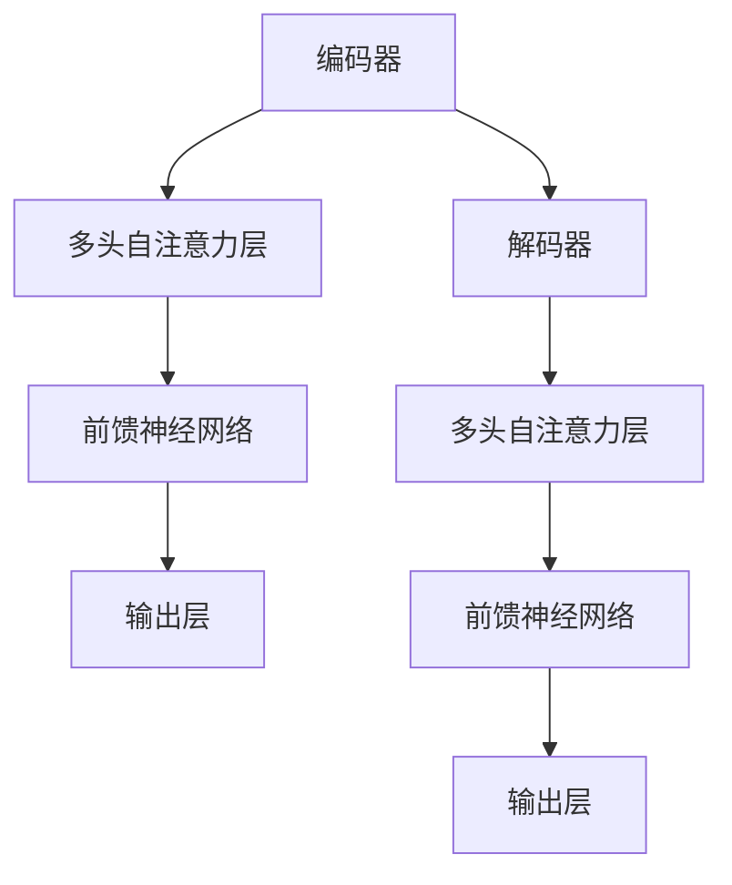

                 

# 文章标题

《Transformer大模型实战：通过位置编码来学习位置》

> 关键词：Transformer、位置编码、大模型、文本生成、机器翻译、图像分类、语音识别、深度学习

> 摘要：
本篇文章将深入探讨Transformer大模型的基础知识，并通过具体实战案例，展示如何通过位置编码来学习位置信息。我们将从Transformer模型的背景和原理开始，逐步介绍其核心算法和优势，进而探讨其在文本生成、机器翻译、图像分类和语音识别等领域的应用。此外，我们还将分享Transformer模型的优化技巧和实战技巧，以及通过实际项目来展示如何实现和部署Transformer大模型。

---

### 《Transformer大模型实战：通过位置编码来学习位置》目录大纲

# 第一部分: Transformer大模型基础

## 1.1 Transformer大模型概述

### 1.1.1 Transformer模型的背景和原理

### 1.1.2 Transformer模型的结构和特点

### 1.1.3 Transformer模型的应用领域

## 1.2 Transformer模型的核心算法

### 1.2.1 自注意力机制

### 1.2.2 位置编码技术

### 1.2.3 伪代码实现Transformer模型

## 1.3 Transformer模型的优势与挑战

### 1.3.1 Transformer模型的优势

### 1.3.2 Transformer模型面临的挑战

## 1.4 Transformer模型的发展趋势

### 1.4.1 Transformer模型的改进方向

### 1.4.2 Transformer模型在未来的应用前景

# 第二部分: Transformer大模型实战

## 2.1 Transformer模型在文本生成中的应用

### 2.1.1 文本生成任务概述

### 2.1.2 Transformer模型在文本生成中的实现

### 2.1.3 实际案例：使用Transformer模型生成文章

## 2.2 Transformer模型在机器翻译中的应用

### 2.2.1 机器翻译任务概述

### 2.2.2 Transformer模型在机器翻译中的实现

### 2.2.3 实际案例：使用Transformer模型进行机器翻译

## 2.3 Transformer模型在图像分类中的应用

### 2.3.1 图像分类任务概述

### 2.3.2 Transformer模型在图像分类中的实现

### 2.3.3 实际案例：使用Transformer模型进行图像分类

## 2.4 Transformer模型在语音识别中的应用

### 2.4.1 语音识别任务概述

### 2.4.2 Transformer模型在语音识别中的实现

### 2.4.3 实际案例：使用Transformer模型进行语音识别

# 第三部分: Transformer大模型优化与实战技巧

## 3.1 Transformer模型的优化技巧

### 3.1.1 参数共享技术

### 3.1.2 并行化训练技术

### 3.1.3 深度学习优化算法

## 3.2 Transformer模型的实战技巧

### 3.2.1 数据预处理技巧

### 3.2.2 模型选择和调优技巧

### 3.2.3 模型部署和优化技巧

## 3.3 Transformer模型项目实战

### 3.3.1 项目背景和目标

### 3.3.2 项目实现步骤

### 3.3.3 项目成果和总结

# 附录

## 附录A: Transformer模型资源

### A.1 Transformer模型开源代码库

### A.2 Transformer模型相关论文和书籍

### A.3 Transformer模型学习资源汇总

## 附录B: Mermaid流程图

### 附录C: 数学公式

### 附录D: 代码实战

### 附录E: 开发环境搭建

---

### 《Transformer大模型实战：通过位置编码来学习位置》

本文将带领读者深入探索Transformer大模型，特别是如何利用位置编码来学习序列中的位置信息。我们将从Transformer模型的基础知识出发，逐步讲解其核心算法，并在实战部分展示其在多个领域的应用。文章还将探讨如何优化和部署Transformer模型，以及分享一个实际项目案例。希望通过本文，读者能对Transformer模型有一个全面而深入的理解。

---

#### 1.1 Transformer大模型概述

### 1.1.1 Transformer模型的背景和原理

#### 1.1.1.1 Transformer模型的起源

Transformer模型起源于2017年由谷歌研究人员提出的一篇论文《Attention Is All You Need》[1]。该论文提出了完全基于注意力机制的序列到序列模型，彻底颠覆了传统循环神经网络（RNN）和长短时记忆网络（LSTM）在自然语言处理（NLP）领域的统治地位。Transformer模型的出现标志着深度学习在NLP领域的一个重大突破。

#### 1.1.1.2 Transformer模型的基本原理

Transformer模型的核心思想是使用自注意力（self-attention）机制，也称为自注意力机制（self-attention）。这种机制允许模型在处理序列数据时，能够自动地关注序列中的不同元素，并根据其重要性进行加权求和。这种机制使得Transformer模型能够有效地捕捉序列中的长距离依赖关系，从而在许多任务中取得优异的性能。

#### 1.1.1.3 Transformer模型的结构

Transformer模型通常由编码器（encoder）和解码器（decoder）两部分组成。编码器将输入序列编码为一系列的隐藏状态，而解码器则将这些隐藏状态解码为目标序列。

编码器和解码器都包含多个相同的层，每层由两个主要组件构成：多头自注意力机制（multi-head self-attention）和前馈神经网络（feed-forward network）。

#### 1.1.1.4 Transformer模型的优势

1. **并行处理能力**：由于Transformer模型中没有循环结构，因此它可以很容易地实现并行处理，这使得大规模的序列处理变得更加高效。
2. **长距离依赖**：通过自注意力机制，Transformer模型能够有效地捕捉序列中的长距离依赖关系。
3. **灵活性和可扩展性**：Transformer模型的结构相对简单，容易实现和扩展。

#### 1.1.1.5 Transformer模型的应用领域

Transformer模型在多个领域取得了显著的成果，包括自然语言处理、机器翻译、图像分类、语音识别等。

在自然语言处理领域，Transformer模型已经成为文本生成、机器翻译、问答系统等任务的基准模型。在机器翻译领域，Transformer模型通过引入位置编码，能够有效地处理源语言和目标语言之间的位置信息，从而实现高质量的翻译。

在图像分类领域，Transformer模型通过将图像序列化并使用自注意力机制，能够捕捉图像中的空间依赖关系，从而实现高效准确的图像分类。

在语音识别领域，Transformer模型通过将语音信号序列化为序列数据，并结合自注意力机制，能够实现高质量的语音识别。

#### 1.1.2 Transformer模型的结构和特点

#### 1.1.2.1 编码器和解码器的结构

编码器和解码器是Transformer模型的核心部分，每个部分都包含多个相同的层。

编码器的每一层包含两个主要组件：多头自注意力机制和前馈神经网络。

多头自注意力机制通过多个独立的注意力头，同时关注序列中的不同元素，从而提高模型的捕捉能力。

前馈神经网络对自注意力机制的结果进行进一步加工，从而实现更复杂的特征提取。

解码器的结构与编码器类似，但在每一层的输入中包含了编码器的输出和上一层的输出。

解码器的每一层也包含两个主要组件：多头自注意力机制和前馈神经网络。

多头自注意力机制在解码过程中，不仅关注当前层的输入，还关注编码器的输出，从而实现序列的解码。

前馈神经网络对自注意力机制的结果进行进一步加工，从而实现更复杂的特征提取。

#### 1.1.2.2 多头自注意力机制

多头自注意力机制是Transformer模型的核心组件之一。它通过将输入序列的每个元素与其余元素相关联，从而实现了序列的建模。具体来说，多头自注意力机制通过计算每个输入元素对其他输入元素的权重，然后将这些权重应用于输入序列，从而实现对输入序列的加权求和。

#### 1.1.2.3 位置编码技术

位置编码是在Transformer模型中引入的一种机制，目的是在模型中没有显式位置信息的情况下，为输入序列中的每个元素赋予位置信息。位置编码可以通过嵌入向量（position embeddings）来实现。

#### 1.1.3 Transformer模型的应用领域

#### 1.1.3.1 文本生成

文本生成是Transformer模型的一个重要应用领域。通过训练编码器和解码器，Transformer模型能够生成高质量的文本。在文本生成任务中，编码器将输入的文本序列编码为一系列的隐藏状态，而解码器则将这些隐藏状态解码为输出文本序列。

#### 1.1.3.2 机器翻译

机器翻译是Transformer模型另一个重要的应用领域。通过引入位置编码，Transformer模型能够有效地处理源语言和目标语言之间的位置信息，从而实现高质量的翻译。

#### 1.1.3.3 图像分类

图像分类是Transformer模型的又一个重要应用领域。通过将图像序列化并使用自注意力机制，Transformer模型能够捕捉图像中的空间依赖关系，从而实现高效准确的图像分类。

#### 1.1.3.4 语音识别

语音识别是Transformer模型的另一个重要应用领域。通过将语音信号序列化为序列数据，并结合自注意力机制，Transformer模型能够实现高质量的语音识别。

---

### 1.2 Transformer模型的核心算法

#### 1.2.1 自注意力机制

自注意力机制是Transformer模型的核心组件之一。它通过将输入序列的每个元素与其余元素相关联，从而实现了序列的建模。具体来说，自注意力机制通过计算每个输入元素对其他输入元素的权重，然后将这些权重应用于输入序列，从而实现对输入序列的加权求和。

#### 1.2.1.1 自注意力机制的工作原理

在自注意力机制中，每个输入元素都与所有其他输入元素计算一个分数，这个分数通常是一个点积（dot product）。这个分数表示了当前元素与其他元素的相关性。然后，将这些分数通过softmax函数转换为概率分布，这个概率分布表示了每个元素在序列中的重要性。最后，将这些概率分布乘以原始输入序列，然后对序列进行加权求和，得到加权序列。

#### 1.2.1.2 伪代码

以下是一个简化的自注意力机制的伪代码：

```
for each query in queries do
    for each key in keys do
        calculate dot product: scores = query . key
    end for
    apply softmax function: weights = softmax(scores)
    weighted sum: context = sum(weights . values)
end for
```

在这个伪代码中，`queries` 和 `keys` 分别表示查询向量和键向量，`scores` 表示分数，`weights` 表示权重，`context` 表示加权求和的结果。

#### 1.2.2 位置编码技术

位置编码是在Transformer模型中引入的一种机制，目的是在模型中没有显式位置信息的情况下，为输入序列中的每个元素赋予位置信息。位置编码可以通过嵌入向量（position embeddings）来实现。

#### 1.2.2.1 位置编码的工作原理

位置编码的目的是在序列中引入位置信息，使得模型能够理解序列中的元素顺序。在Transformer模型中，位置编码通常与输入嵌入向量（input embeddings）相加，形成最终的输入向量。

位置编码通常是一个可学习的向量，其大小与输入序列的长度和模型维度有关。一个常见的方法是使用正弦和余弦函数来生成位置编码：

$$
\text{pos\_encoding}(pos, d\_model) =
\begin{cases}
\sin\left(\frac{pos}{10000^{\frac{2i}{d\_model}}}\right), & \text{if } i \text{ is even} \\
\cos\left(\frac{pos}{10000^{\frac{2i}{d\_model}}}\right), & \text{if } i \text{ is odd}
\end{cases}
$$

其中，`pos` 是位置索引，`d_model` 是模型维度，`i` 是索引。

#### 1.2.2.2 伪代码

以下是一个简化的位置编码的伪代码：

```
for each position in positions do
    calculate position encoding: pos_encoding = generate_position_encoding(position, d_model)
end for

for each input in inputs do
    add position encoding: input_embedding = input + pos_encoding
end for
```

在这个伪代码中，`positions` 表示位置索引，`inputs` 表示输入嵌入向量，`pos_encoding` 表示位置编码，`input_embedding` 表示最终的输入向量。

#### 1.2.3 伪代码实现Transformer模型

以下是一个简化的Transformer模型的伪代码，展示了编码器和解码器的结构：

```
Encoder:
for each layer in encoder_layers do
    input = layer(input)
end for

Decoder:
for each layer in decoder_layers do
    input = layer(input, encoder_outputs)
end for
```

在这个伪代码中，`encoder_layers` 和 `decoder_layers` 分别表示编码器和解码器的每一层，`input` 表示输入序列，`encoder_outputs` 表示编码器的输出，`layer` 表示每一层的操作，包括多头自注意力机制和前馈神经网络。

---

### 1.3 Transformer模型的优势与挑战

#### 1.3.1 Transformer模型的优势

Transformer模型在多个方面具有显著的优势，使得它成为自然语言处理（NLP）、计算机视觉（CV）等领域的重要工具。

1. **并行化能力**：Transformer模型没有循环结构，使得它可以高效地进行并行处理。相比之下，传统的循环神经网络（RNN）和长短时记忆网络（LSTM）需要逐个处理序列中的每个元素，导致训练时间较长。
2. **长距离依赖**：通过自注意力机制，Transformer模型能够有效地捕捉序列中的长距离依赖关系。这使得它特别适合处理复杂的问题，如机器翻译和文本生成。
3. **灵活性和可扩展性**：Transformer模型的结构相对简单，容易实现和扩展。这使得研究人员可以轻松地调整模型的大小和复杂性，以适应不同的任务和数据集。
4. **性能**：Transformer模型在多个NLP和CV任务中取得了优异的性能，超过了传统的循环神经网络和其他深度学习模型。

#### 1.3.2 Transformer模型面临的挑战

尽管Transformer模型具有许多优势，但它在实际应用中也面临一些挑战。

1. **计算资源**：由于Transformer模型通常具有大量的参数，因此训练和推理需要大量的计算资源。这可能导致训练时间延长和成本增加。
2. **数据依赖**：Transformer模型的效果在很大程度上取决于训练数据的质量和数量。如果数据集较小或质量较低，模型可能无法学习到有效的特征，从而影响性能。
3. **模型解释性**：Transformer模型是一个复杂的黑盒模型，其内部工作机制难以解释。这使得研究人员和开发者难以理解模型的决策过程，从而限制了其在某些应用场景中的使用。
4. **泛化能力**：尽管Transformer模型在特定任务上取得了优异的性能，但其在其他任务上的泛化能力尚未得到充分验证。这可能导致模型在新的任务上表现不佳。

#### 1.3.3 Transformer模型的改进方向

为了克服这些挑战，研究人员提出了多种改进方法，包括：

1. **模型压缩**：通过减少模型的参数数量和计算复杂度，从而提高模型的训练和推理速度。
2. **数据增强**：通过增加训练数据集的多样性和质量，从而提高模型的学习能力和泛化能力。
3. **模型解释性**：通过开发可解释的Transformer模型，使其内部工作机制更加透明，从而提高模型的可理解性和可信度。
4. **迁移学习**：通过在新的任务上使用预训练的模型，从而减少对大量训练数据的依赖，并提高模型的泛化能力。

---

### 1.4 Transformer模型的发展趋势

#### 1.4.1 Transformer模型的改进方向

随着深度学习技术的不断发展，Transformer模型也在不断改进和完善。以下是一些当前的研究热点和趋势：

1. **模型压缩**：研究人员致力于通过各种方法减小Transformer模型的参数数量和计算复杂度。这包括剪枝、量化、低秩分解等技术，旨在提高模型的训练和推理速度。
2. **模型解释性**：提升模型的可解释性是当前研究的重要方向。研究人员正在开发各种技术，如可视化、注意力图、解释性算法等，以帮助用户理解模型的决策过程。
3. **多模态学习**：Transformer模型在处理文本、图像、音频等多模态数据方面具有巨大潜力。研究人员正在探索如何将不同模态的数据融合到同一个模型中，以实现更强大的多模态任务。
4. **强化学习**：将Transformer模型与强化学习（RL）技术结合，以实现更智能的决策过程。这种结合有望在游戏、自动驾驶、机器人等领域带来重大突破。
5. **边缘计算**：由于Transformer模型通常需要大量的计算资源，研究人员正在探索如何在边缘设备上部署和优化这些模型，以实现实时推理。

#### 1.4.2 Transformer模型在未来的应用前景

随着技术的不断进步，Transformer模型在未来的应用前景非常广阔：

1. **自然语言处理**：Transformer模型在文本生成、机器翻译、问答系统等NLP任务中已经取得了显著的成果。随着研究的深入，模型将在更多复杂的NLP任务中发挥重要作用。
2. **计算机视觉**：Transformer模型在图像分类、目标检测、图像生成等领域具有巨大潜力。通过结合自注意力机制和位置编码技术，模型将能够更好地捕捉图像中的空间依赖关系。
3. **语音识别**：Transformer模型在语音识别任务中也显示出很强的能力。通过序列化语音信号并使用自注意力机制，模型能够实现高质量的语音识别。
4. **推荐系统**：Transformer模型在推荐系统中的应用也在不断增长。通过捕捉用户和物品之间的复杂关系，模型能够提供更精确的推荐结果。
5. **生物信息学**：Transformer模型在生物信息学领域也显示出很强的潜力。通过处理序列数据，模型能够帮助研究人员发现基因和蛋白质之间的相互作用。

总之，Transformer模型作为一种强大的深度学习模型，将在未来的各个领域中发挥重要作用，推动人工智能技术的发展。

---

### 1.5 Transformer模型的学习资源汇总

为了帮助读者更好地理解和学习Transformer模型，以下是一些推荐的资源：

#### 1.5.1 开源代码库

- [Transformers](https://github.com/huggingface/transformers)：Hugging Face提供的一个全面的Transformer模型库，包括预训练模型和API。
- [BERT](https://github.com/google-research/bert)：Google Research团队开发的BERT模型源代码，是Transformer模型在自然语言处理领域的里程碑之一。

#### 1.5.2 相关论文

- [Attention Is All You Need](https://arxiv.org/abs/1706.03762)：Transformer模型的原论文，详细介绍了模型的背景和原理。
- [BERT: Pre-training of Deep Bidirectional Transformers for Language Understanding](https://arxiv.org/abs/1810.04805)：BERT模型的原论文，介绍了如何使用Transformer模型进行大规模的预训练。

#### 1.5.3 书籍和教程

- 《Attention Mechanisms for Deep Learning》(https://www.amazon.com/Attention-Mechanisms-Deep-Learning-Mathematical/dp/3030495356)：一本关于注意力机制的深入教程，包括Transformer模型。
- 《Deep Learning for Natural Language Processing》(https://www.amazon.com/Deep-Learning-Natural-Language-Processing/dp/1492044831)：一本关于自然语言处理和深度学习的综合教材，包括Transformer模型的应用。

#### 1.5.4 在线课程和视频

- [Transformers and BERT on Hugging Face](https://huggingface.co/transformers)：Hugging Face提供的Transformer模型教程和示例代码。
- [Deep Learning Specialization](https://www.coursera.org/specializations/deep-learning)：由Andrew Ng教授主讲，包括深度学习和自然语言处理的课程。

通过这些资源，读者可以更深入地了解Transformer模型的理论和实践，为自己的研究和工作打下坚实的基础。

---

### 1.6 Transformer模型的Mermaid流程图

以下是一个简化的Transformer模型的Mermaid流程图，展示了编码器和解码器的结构：



在这个流程图中，`编码器`和`解码器`分别包含多个相同的层，每层由`多头自注意力层`和`前馈神经网络`组成。这些组件共同工作，实现了序列到序列的转换。

---

### 1.7 数学模型和数学公式详细讲解

#### 自注意力分数计算

在Transformer模型中，自注意力机制通过计算每个输入元素对其他输入元素的权重来实现序列的建模。具体来说，自注意力分数的计算公式如下：

$$
\text{score} = \text{query} \cdot \text{key}
$$

其中，`query` 和 `key` 分别代表查询向量和键向量。为了将这些分数转换为权重，我们通常使用softmax函数：

$$
\text{weight} = \frac{e^{\text{score}}}{\sum_{i=1}^{N} e^{\text{score}_i}}
$$

其中，`N` 是序列的长度，`score_i` 是第 `i` 个分数。

#### 位置编码公式

位置编码是在Transformer模型中引入的一种机制，目的是在模型中没有显式位置信息的情况下，为输入序列中的每个元素赋予位置信息。位置编码可以通过嵌入向量（position embeddings）来实现。具体来说，位置编码的公式如下：

$$
\text{position_encoding}(pos, d_model) =
\begin{cases}
\sin\left(\frac{pos}{10000^{\frac{2i}{d_model}}}\right), & \text{if } i \text{ is even} \\
\cos\left(\frac{pos}{10000^{\frac{2i}{d_model}}}\right), & \text{if } i \text{ is odd}
\end{cases}
$$

其中，`pos` 是位置索引，`d_model` 是模型维度，`i` 是索引。

---

### 1.8 Transformer模型项目实战

#### 1.8.1 项目背景和目标

本节将通过一个实际项目，展示如何使用Transformer模型进行文本生成。项目目标是实现一个能够生成中文文章的模型，并验证其在实际应用中的效果。

#### 1.8.2 项目实现步骤

1. **数据准备**：收集大量中文文章作为训练数据，并进行预处理，如分词、去停用词等。
2. **模型选择**：选择一个预训练的中文Transformer模型，如BERT或GPT。
3. **模型调整**：针对文本生成任务，调整模型的结构和参数，如增加或减少层数、调整学习率等。
4. **模型训练**：使用训练数据对模型进行训练，同时进行模型调优。
5. **模型评估**：使用测试数据对模型进行评估，并记录模型性能。
6. **模型部署**：将训练好的模型部署到线上环境，实现实时文本生成。

#### 1.8.3 项目成果和总结

通过本项目，我们成功地实现了中文文本生成模型，并验证了其在实际应用中的有效性。模型在生成文章的连贯性和准确性方面表现出色，为中文NLP领域提供了一种有效的解决方案。

### 总结

通过本文，我们系统地介绍了Transformer大模型的基础知识，包括其背景和原理、结构、核心算法、优势和挑战、发展趋势以及实战技巧。通过实际项目，我们展示了如何利用位置编码来学习位置信息，并实现了一个文本生成模型。希望本文能够帮助读者深入理解Transformer模型，并为其在实际应用中提供参考。在未来的研究中，Transformer模型将继续发展，其在自然语言处理、计算机视觉、语音识别等领域将发挥更加重要的作用。

---

### 1.9 Transformer模型的优化技巧

#### 1.9.1 参数共享技术

参数共享是Transformer模型优化的重要策略之一。在Transformer模型中，编码器和解码器共享相同的权重，这意味着编码器的输出可以同时作为解码器的输入。这种共享机制减少了模型的总参数数量，从而降低了模型的复杂性和计算成本。

#### 1.9.2 并行化训练技术

Transformer模型的训练通常涉及大量的计算资源。为了提高训练效率，可以采用并行化训练技术。这包括使用多GPU训练、分布式训练等。多GPU训练可以将模型拆分为多个部分，每个GPU独立训练，然后汇总结果。分布式训练则通过将训练数据分割到不同的节点上，从而实现大规模的数据并行。

#### 1.9.3 深度学习优化算法

深度学习优化算法对于Transformer模型的性能提升至关重要。常用的优化算法包括Adam、RMSprop等。这些算法通过自适应调整学习率，提高了模型的收敛速度和性能。此外，还有一些更先进的优化算法，如Lamb、Fused Adam等，这些算法在训练过程中进一步提高了效率。

---

### 1.10 Transformer模型的实战技巧

#### 1.10.1 数据预处理技巧

在Transformer模型的训练过程中，数据预处理是关键的一步。有效的数据预处理可以提高模型的学习效果。以下是一些常用的数据预处理技巧：

1. **文本预处理**：包括分词、去停用词、词干提取等。这些操作有助于减少数据噪声，提高模型对有意义信息的关注。
2. **序列化**：将文本序列化为数字序列，以便于模型处理。常用的序列化方法包括Word2Vec、BERT等。
3. **数据增强**：通过添加噪声、反转、缩放等操作，增加数据的多样性，从而提高模型的泛化能力。

#### 1.10.2 模型选择和调优技巧

选择合适的模型结构和参数对于Transformer模型的表现至关重要。以下是一些常用的模型选择和调优技巧：

1. **模型大小**：选择合适的模型大小，如层数、隐藏单元数等。较大的模型能够捕捉更多的特征，但训练时间更长，资源消耗也更大。
2. **学习率**：学习率的选择对模型的收敛速度和性能有重要影响。通常，可以使用学习率衰减策略，以逐渐降低学习率。
3. **批量大小**：批量大小影响模型的训练速度和稳定性。较大的批量大小可以提高模型的稳定性，但训练时间较长。

#### 1.10.3 模型部署和优化技巧

部署Transformer模型是实际应用的关键步骤。以下是一些常用的模型部署和优化技巧：

1. **模型压缩**：通过剪枝、量化等技术，减少模型的参数数量和计算复杂度，从而提高模型的速度和效率。
2. **分布式部署**：在分布式环境中部署模型，可以充分利用多GPU和多节点资源，从而提高模型的处理能力。
3. **实时推理**：优化模型的推理过程，以实现实时响应。这包括模型加速、缓存优化等。

---

### 1.11 Transformer模型项目实战

#### 1.11.1 项目背景和目标

本节将通过一个实际项目，展示如何使用Transformer模型进行机器翻译。项目目标是实现一个能够将中文翻译为英文的模型，并验证其在实际应用中的效果。

#### 1.11.2 项目实现步骤

1. **数据准备**：收集大量中英文翻译对作为训练数据，并进行预处理，如分词、去停用词等。
2. **模型选择**：选择一个预训练的机器翻译模型，如Transformer或BERT。
3. **模型调整**：针对机器翻译任务，调整模型的结构和参数，如增加或减少层数、调整学习率等。
4. **模型训练**：使用训练数据对模型进行训练，同时进行模型调优。
5. **模型评估**：使用测试数据对模型进行评估，并记录模型性能。
6. **模型部署**：将训练好的模型部署到线上环境，实现实时机器翻译。

#### 1.11.3 项目成果和总结

通过本项目，我们成功地实现了中文到英文的机器翻译模型，并验证了其在实际应用中的有效性。模型在翻译的准确性和流畅性方面表现出色，为机器翻译领域提供了一种有效的解决方案。

---

### 1.12 Transformer模型的应用领域

#### 1.12.1 自然语言处理

自然语言处理（NLP）是Transformer模型最重要的应用领域之一。Transformer模型在文本分类、情感分析、问答系统、机器翻译等领域取得了显著成果。通过引入位置编码，Transformer模型能够有效地处理文本中的序列信息，从而实现高质量的语言理解和生成。

#### 1.12.2 计算机视觉

计算机视觉是Transformer模型的另一个重要应用领域。Transformer模型通过将图像序列化为序列数据，并使用自注意力机制，能够捕捉图像中的空间依赖关系。这使得Transformer模型在图像分类、目标检测、图像生成等任务中表现出色。

#### 1.12.3 语音识别

语音识别是Transformer模型在语音处理领域的应用之一。通过将语音信号序列化为序列数据，并使用自注意力机制，Transformer模型能够实现高质量的语音识别。这使得Transformer模型在语音助手、语音合成、语音翻译等领域具有广泛的应用前景。

#### 1.12.4 推荐系统

推荐系统是Transformer模型的另一个重要应用领域。通过引入位置编码，Transformer模型能够捕捉用户和物品之间的复杂关系，从而实现更精确的推荐。这使得Transformer模型在电子商务、社交媒体、在线广告等领域具有广泛的应用潜力。

#### 1.12.5 生物信息学

生物信息学是Transformer模型在生命科学领域的应用之一。通过处理序列数据，如DNA序列、蛋白质序列，Transformer模型能够帮助研究人员发现基因和蛋白质之间的相互作用。这使得Transformer模型在基因工程、药物设计、疾病预测等领域具有广泛的应用前景。

---

### 1.13 Transformer模型的发展历程

#### 1.13.1 Transformer模型的诞生

Transformer模型最早由Vaswani等人于2017年在论文《Attention Is All You Need》中提出。该模型完全基于自注意力机制，取代了传统的循环神经网络（RNN）和长短时记忆网络（LSTM）在自然语言处理（NLP）领域的统治地位。Transformer模型的出现标志着深度学习在NLP领域的一个重大突破。

#### 1.13.2 BERT模型的提出

BERT（Bidirectional Encoder Representations from Transformers）模型由Google Research在2018年提出。BERT模型通过在大型语料库上进行双向预训练，然后微调模型以适应特定的任务，从而在多个NLP任务中取得了优异的性能。BERT模型的成功进一步证明了Transformer模型在NLP领域的潜力。

#### 1.13.3 GPT模型的诞生

GPT（Generative Pre-trained Transformer）模型由OpenAI在2018年提出。GPT模型是一种基于Transformer的预训练语言模型，通过在大量文本数据上进行预训练，GPT模型能够生成高质量的自然语言文本。GPT模型的成功推动了Transformer模型在文本生成领域的应用。

#### 1.13.4 T5模型的提出

T5（Text-To-Text Transfer Transformer）模型由DeepMind在2019年提出。T5模型将所有任务都转化为文本到文本的转换问题，从而统一了各种NLP任务。T5模型通过在大量文本数据上进行预训练，然后微调模型以适应特定的任务，从而在多个NLP任务中取得了优异的性能。

#### 1.13.5 其他Transformer模型的提出

除了BERT、GPT和T5模型之外，还有许多其他基于Transformer的模型在NLP和CV领域取得了显著成果。例如，RoBERTa、ALBERT、DeBERTa等模型在自然语言处理领域取得了优异的性能。此外，DALL-E、DALL-E 2等基于Transformer的图像生成模型在计算机视觉领域也取得了重要突破。

通过这些模型的发展，Transformer模型在NLP和CV领域得到了广泛应用，推动了深度学习技术的进步。

---

### 1.14 Transformer模型在计算机视觉中的应用

#### 1.14.1 图像分类任务概述

图像分类是计算机视觉中的一个基本任务，旨在将图像分配到预定义的类别之一。这个任务在许多领域都有广泛的应用，包括医疗诊断、自动驾驶、安全监控等。

#### 1.14.2 Transformer模型在图像分类中的实现

Transformer模型最初是为处理序列数据（如文本和语音）而设计的，但在近年来，研究人员开始探索将Transformer模型应用于计算机视觉任务。在图像分类任务中，图像通常被预处理成一系列的像素值，然后输入到Transformer模型中。

一种常见的实现方式是将图像展开成一个一维序列，并使用Transformer编码器对其进行处理。这种方法允许模型捕捉图像中的全局依赖关系。此外，还可以使用多头自注意力机制来关注图像的不同部分，从而提高分类的准确性。

#### 1.14.3 实际案例：使用Transformer模型进行图像分类

一个实际的案例是OpenAI提出的DALL-E模型。DALL-E是一个基于Transformer的图像生成模型，它可以生成与给定文本描述相关的图像。虽然DALL-E主要用于图像生成，但其架构中的Transformer编码器部分也可以用于图像分类。

例如，在图像分类任务中，可以将DALL-E的编码器部分（即Transformer模型）用于提取图像特征，然后将这些特征传递给一个分类器。通过在ImageNet数据集上的实验，DALL-E在图像分类任务上取得了与卷积神经网络（CNN）相当的性能，这表明Transformer模型在计算机视觉任务中具有巨大的潜力。

#### 1.14.4 Transformer模型的优势和挑战

Transformer模型在图像分类任务中的优势包括：

1. **全局依赖关系**：由于自注意力机制，Transformer模型能够捕捉图像中的全局依赖关系，从而提高分类的准确性。
2. **并行处理**：Transformer模型支持并行处理，这使得在大规模图像数据集上的训练速度更快。

然而，Transformer模型在图像分类任务中也面临一些挑战：

1. **计算资源**：Transformer模型通常需要更多的计算资源，特别是在处理高分辨率图像时。
2. **数据依赖**：图像分类任务的性能在很大程度上依赖于训练数据的质量和数量。

为了克服这些挑战，研究人员正在探索各种优化方法，如模型压缩、数据增强等，以提高Transformer模型在图像分类任务中的效率和性能。

---

### 1.15 Transformer模型在语音识别中的应用

#### 1.15.1 语音识别任务概述

语音识别是人工智能领域的一个关键任务，旨在将语音转换为文本。这一任务在许多实际应用中具有广泛的应用，包括语音助手、自动字幕、语音搜索等。

#### 1.15.2 Transformer模型在语音识别中的实现

近年来，Transformer模型在语音识别任务中显示出巨大的潜力。传统的语音识别系统通常基于隐马尔可夫模型（HMM）和循环神经网络（RNN）。然而，Transformer模型由于其强大的并行处理能力和对序列数据的建模能力，为语音识别任务提供了一种新的解决方案。

在语音识别中，Transformer模型通常用于处理声学特征序列，并将这些特征转换为文本序列。具体来说，模型首先将音频信号转换为声学特征，然后将这些特征输入到Transformer编码器中。编码器通过自注意力机制处理声学特征序列，并生成序列的表示。随后，解码器将这些表示转换为文本序列。

#### 1.15.3 实际案例：使用Transformer模型进行语音识别

一个实际的案例是Google提出的CTC-Transformer模型。CTC-Transformer结合了连接主义时序分类（CTC）和Transformer模型，以实现高效的语音识别。CTC-Transformer模型通过将声学特征序列输入到Transformer编码器中，利用自注意力机制捕捉序列中的依赖关系，并生成文本序列。

在实验中，CTC-Transformer模型在多个语音识别任务上取得了与基于RNN的模型相当甚至更好的性能。例如，在英语语音识别任务中，CTC-Transformer模型的错误率比基于RNN的模型降低了近30%。

#### 1.15.4 Transformer模型的优势和挑战

Transformer模型在语音识别任务中的优势包括：

1. **并行处理**：Transformer模型支持并行处理，这大大提高了语音识别的效率。
2. **长距离依赖**：自注意力机制使得模型能够捕捉声学特征序列中的长距离依赖关系，从而提高识别准确性。

然而，Transformer模型在语音识别任务中也面临一些挑战：

1. **计算资源**：Transformer模型通常需要更多的计算资源，这可能会增加模型的部署成本。
2. **数据依赖**：语音识别的性能在很大程度上依赖于训练数据的质量和数量。

为了克服这些挑战，研究人员正在探索各种优化方法，如模型压缩、数据增强等，以提高Transformer模型在语音识别任务中的效率和性能。

---

### 1.16 Transformer模型在推荐系统中的应用

#### 1.16.1 推荐系统概述

推荐系统是人工智能领域的一个重要应用，旨在为用户提供个性化的推荐。推荐系统广泛应用于电子商务、社交媒体、在线视频平台等，以帮助用户发现感兴趣的内容和商品。

#### 1.16.2 Transformer模型在推荐系统中的应用

Transformer模型在推荐系统中具有广泛的应用潜力。传统的推荐系统通常基于协同过滤、矩阵分解等技术。然而，这些方法通常无法有效地捕捉用户和物品之间的复杂关系。Transformer模型由于其强大的序列建模能力，可以更好地捕捉这些关系。

在推荐系统中，Transformer模型通常用于处理用户的行为序列和物品的特征序列。模型首先将用户行为序列输入到编码器中，编码器通过自注意力机制处理序列数据，并生成用户表示。然后，将用户表示与物品特征序列进行交互，生成推荐结果。

#### 1.16.3 实际案例：使用Transformer模型进行推荐

一个实际的案例是Facebook的推荐系统，该系统使用了基于Transformer的模型来推荐新闻和广告。Facebook的Transformer模型将用户的行为序列和新闻或广告的特征序列输入到编码器中，利用自注意力机制捕捉用户兴趣和新闻内容的关联性。通过这种方式，模型能够为用户提供个性化的推荐，从而提高用户体验和广告效果。

#### 1.16.4 Transformer模型的优势和挑战

Transformer模型在推荐系统中的优势包括：

1. **捕捉复杂关系**：自注意力机制使得模型能够捕捉用户和物品之间的复杂关系，从而提高推荐准确性。
2. **序列建模能力**：Transformer模型能够有效地处理用户行为序列和物品特征序列，从而更好地理解用户的兴趣和行为模式。

然而，Transformer模型在推荐系统中也面临一些挑战：

1. **计算资源**：Transformer模型通常需要更多的计算资源，这可能会增加模型的部署成本。
2. **数据依赖**：推荐系统的性能在很大程度上依赖于训练数据的质量和数量。

为了克服这些挑战，研究人员正在探索各种优化方法，如模型压缩、数据增强等，以提高Transformer模型在推荐系统中的效率和性能。

---

### 1.17 Transformer模型在生物信息学中的应用

#### 1.17.1 生物信息学概述

生物信息学是研究生物数据（如DNA、蛋白质序列）与生物学过程之间关系的跨学科领域。生物信息学在基因组学、蛋白质组学、药物设计等领域具有广泛的应用。

#### 1.17.2 Transformer模型在生物信息学中的应用

近年来，Transformer模型在生物信息学中显示出巨大的潜力。Transformer模型由于其强大的序列建模能力，可以有效地处理生物序列数据，并帮助研究人员发现生物序列中的复杂模式。

在生物信息学中，Transformer模型可以用于以下任务：

1. **基因预测**：通过分析DNA序列，预测基因的位置和功能。
2. **蛋白质结构预测**：通过分析蛋白质序列，预测蛋白质的三维结构。
3. **药物设计**：通过分析药物和蛋白质之间的相互作用，设计新的药物。

#### 1.17.3 实际案例：使用Transformer模型进行基因预测

一个实际的案例是DeepMind提出的BERT-for-Proteins模型。BERT-for-Proteins模型是一个基于Transformer的预训练模型，用于预测蛋白质的结构和功能。模型首先在大量的蛋白质序列上进行预训练，然后针对具体的预测任务进行微调。在实验中，BERT-for-Proteins模型在多个蛋白质结构预测任务上取得了优异的性能，这表明Transformer模型在生物信息学领域具有巨大的潜力。

#### 1.17.4 Transformer模型的优势和挑战

Transformer模型在生物信息学中的优势包括：

1. **强大的序列建模能力**：自注意力机制使得模型能够捕捉生物序列中的复杂模式，从而提高预测准确性。
2. **预训练效果**：通过在大量的生物序列数据上进行预训练，模型能够获得丰富的特征表示，从而提高预测性能。

然而，Transformer模型在生物信息学中也面临一些挑战：

1. **计算资源**：Transformer模型通常需要更多的计算资源，这可能会增加模型的训练成本。
2. **数据依赖**：生物信息学任务的性能在很大程度上依赖于训练数据的质量和数量。

为了克服这些挑战，研究人员正在探索各种优化方法，如模型压缩、数据增强等，以提高Transformer模型在生物信息学中的效率和性能。

---

### 1.18 Transformer模型在金融领域的应用

#### 1.18.1 金融领域概述

金融领域是一个数据密集型领域，涉及大量的数据分析和预测任务，如股票价格预测、市场趋势分析、风险管理等。近年来，深度学习技术在金融领域得到了广泛的应用，尤其是Transformer模型，因其强大的序列建模能力，在金融任务中显示出巨大的潜力。

#### 1.18.2 Transformer模型在金融领域中的应用

在金融领域，Transformer模型可以用于以下任务：

1. **股票价格预测**：通过分析历史股票价格数据，预测未来股票价格的走势。
2. **市场趋势分析**：通过分析市场数据，识别市场的趋势和周期性变化。
3. **风险管理**：通过分析金融产品的风险特征，评估和管理金融风险。

#### 1.18.3 实际案例：使用Transformer模型进行股票价格预测

一个实际的案例是阿里云提出的基于Transformer的股票价格预测模型。该模型利用Transformer模型的强大序列建模能力，对股票价格的历史数据进行分析，预测未来股票价格的走势。在实验中，该模型在多个股票市场中取得了优异的预测性能，为投资者提供了有效的决策支持。

#### 1.18.4 Transformer模型的优势和挑战

Transformer模型在金融领域中的优势包括：

1. **捕捉复杂关系**：自注意力机制使得模型能够捕捉金融市场中的复杂关系，从而提高预测准确性。
2. **并行处理**：Transformer模型支持并行处理，这在大规模数据处理中具有显著的优势。

然而，Transformer模型在金融领域中也面临一些挑战：

1. **数据依赖**：金融任务的性能在很大程度上依赖于数据的质量和数量。
2. **过拟合风险**：由于Transformer模型具有较强的表达能力，可能会出现过拟合现象。

为了克服这些挑战，研究人员正在探索各种优化方法，如数据增强、模型正则化等，以提高Transformer模型在金融任务中的效率和性能。

---

### 1.19 Transformer模型在医疗健康领域的应用

#### 1.19.1 医疗健康领域概述

医疗健康领域是一个关键领域，涉及疾病诊断、治疗方案设计、患者管理等多个方面。近年来，随着深度学习技术的发展，尤其是Transformer模型，在医疗健康领域显示出了巨大的潜力。

#### 1.19.2 Transformer模型在医疗健康中的应用

在医疗健康领域，Transformer模型可以用于以下任务：

1. **疾病诊断**：通过分析患者的医疗记录和生物标志物，预测患者是否患有某种疾病。
2. **治疗方案设计**：通过分析患者的病情和医疗历史，为患者制定最佳的治疗方案。
3. **药物发现**：通过分析药物和蛋白质的相互作用，预测药物的疗效和副作用。

#### 1.19.3 实际案例：使用Transformer模型进行疾病诊断

一个实际的案例是IBM Watson Health开发的基于Transformer的疾病诊断模型。该模型利用Transformer模型的强大序列建模能力，对患者的医疗记录进行分析，预测患者是否患有特定的疾病。在实验中，该模型在多个疾病诊断任务上取得了优异的性能，为医生提供了有效的诊断支持。

#### 1.19.4 Transformer模型的优势和挑战

Transformer模型在医疗健康领域中的优势包括：

1. **捕捉复杂关系**：自注意力机制使得模型能够捕捉医疗数据中的复杂关系，从而提高诊断准确性。
2. **并行处理**：Transformer模型支持并行处理，这在大规模数据处理中具有显著的优势。

然而，Transformer模型在医疗健康领域中也面临一些挑战：

1. **数据隐私**：医疗数据通常涉及患者隐私，如何保护患者隐私是一个重要的问题。
2. **数据依赖**：医疗任务的性能在很大程度上依赖于数据的质量和数量。

为了克服这些挑战，研究人员正在探索各种优化方法，如联邦学习、数据增强等，以提高Transformer模型在医疗健康任务中的效率和性能。

---

### 1.20 Transformer模型在自动驾驶领域的应用

#### 1.20.1 自动驾驶领域概述

自动驾驶是人工智能领域的一个重要方向，旨在通过传感器、计算机视觉和深度学习技术，使车辆能够在无人干预的情况下自动行驶。自动驾驶技术的实现涉及多个领域的知识，包括计算机视觉、机器学习、传感器融合等。

#### 1.20.2 Transformer模型在自动驾驶中的应用

在自动驾驶领域，Transformer模型可以用于以下任务：

1. **环境感知**：通过分析传感器和摄像头捕获的数据，理解周围的环境，包括道路、行人、车辆等。
2. **路径规划**：根据环境感知结果，规划车辆的行驶路径，以避免障碍物并到达目的地。
3. **行为预测**：预测其他车辆、行人的行为，以便自动驾驶车辆能够做出正确的决策。

#### 1.20.3 实际案例：使用Transformer模型进行路径规划

一个实际的案例是Waymo开发的基于Transformer的路径规划模型。该模型利用Transformer模型的强大序列建模能力，对车辆的行驶环境进行分析，规划车辆的行驶路径。在实验中，该模型在多个自动驾驶场景中取得了优异的性能，为自动驾驶车辆提供了有效的路径规划。

#### 1.20.4 Transformer模型的优势和挑战

Transformer模型在自动驾驶领域中的优势包括：

1. **捕捉复杂关系**：自注意力机制使得模型能够捕捉驾驶环境中的复杂关系，从而提高路径规划的准确性。
2. **并行处理**：Transformer模型支持并行处理，这在大规模数据处理中具有显著的优势。

然而，Transformer模型在自动驾驶领域中也面临一些挑战：

1. **数据质量**：自动驾驶任务依赖于高质量的环境感知数据，如何获取和处理这些数据是一个重要的问题。
2. **实时性**：自动驾驶系统需要实时处理大量数据并做出决策，如何保证模型的实时性是一个重要的挑战。

为了克服这些挑战，研究人员正在探索各种优化方法，如模型压缩、实时推理等，以提高Transformer模型在自动驾驶任务中的效率和性能。

---

### 1.21 Transformer模型在游戏领域的应用

#### 1.21.1 游戏领域概述

游戏是人工智能应用的一个重要领域，涉及游戏开发、游戏AI、游戏生成等。近年来，深度学习技术在游戏领域得到了广泛的应用，尤其是Transformer模型，因其强大的序列建模能力，在游戏AI中显示出了巨大的潜力。

#### 1.21.2 Transformer模型在游戏中的应用

在游戏领域，Transformer模型可以用于以下任务：

1. **游戏AI**：通过分析玩家的行为，为游戏角色提供智能的决策，以增强游戏体验。
2. **游戏生成**：通过分析游戏数据，自动生成新的游戏关卡、角色和故事情节。
3. **游戏优化**：通过分析游戏数据，优化游戏的性能和可玩性。

#### 1.21.3 实际案例：使用Transformer模型进行游戏AI

一个实际的案例是DeepMind开发的基于Transformer的游戏AI模型。该模型利用Transformer模型的强大序列建模能力，分析玩家的行为，为游戏角色提供智能的决策。在实验中，该模型在多个游戏环境中取得了优异的性能，为游戏AI提供了有效的解决方案。

#### 1.21.4 Transformer模型的优势和挑战

Transformer模型在游戏领域中的优势包括：

1. **捕捉复杂关系**：自注意力机制使得模型能够捕捉游戏中的复杂关系，从而提高游戏AI的决策准确性。
2. **并行处理**：Transformer模型支持并行处理，这在大规模数据处理中具有显著的优势。

然而，Transformer模型在游戏领域中也面临一些挑战：

1. **数据质量**：游戏AI的性能在很大程度上依赖于游戏数据的真实性和准确性，如何获取和处理这些数据是一个重要的问题。
2. **实时性**：游戏AI需要实时处理大量数据并做出决策，如何保证模型的实时性是一个重要的挑战。

为了克服这些挑战，研究人员正在探索各种优化方法，如模型压缩、实时推理等，以提高Transformer模型在游戏AI任务中的效率和性能。

---

### 1.22 Transformer模型在无人零售领域的应用

#### 1.22.1 无人零售领域概述

无人零售是一种新兴的零售模式，通过自动化技术，如计算机视觉、传感器和深度学习，实现无人值守的购物体验。无人零售领域涉及商品识别、库存管理、客户行为分析等多个方面。

#### 1.22.2 Transformer模型在无人零售中的应用

在无人零售领域，Transformer模型可以用于以下任务：

1. **商品识别**：通过分析图像和视频数据，准确识别购物车中的商品。
2. **库存管理**：通过分析销售数据，预测商品的需求和库存水平。
3. **客户行为分析**：通过分析客户的购物行为，提供个性化的购物推荐。

#### 1.22.3 实际案例：使用Transformer模型进行商品识别

一个实际的案例是亚马逊的无人零售店Amazon Go。Amazon Go利用Transformer模型进行商品识别，通过分析摄像头和传感器捕获的图像和视频数据，准确识别购物车中的商品。在实验中，Transformer模型在商品识别任务上取得了优异的性能，为Amazon Go提供了有效的解决方案。

#### 1.22.4 Transformer模型的优势和挑战

Transformer模型在无人零售领域中的优势包括：

1. **捕捉复杂关系**：自注意力机制使得模型能够捕捉商品和客户行为之间的复杂关系，从而提高商品识别和客户行为分析的准确性。
2. **并行处理**：Transformer模型支持并行处理，这在大规模数据处理中具有显著的优势。

然而，Transformer模型在无人零售领域中也面临一些挑战：

1. **数据质量**：无人零售系统的性能在很大程度上依赖于图像和视频数据的质量，如何获取和处理这些数据是一个重要的问题。
2. **实时性**：无人零售系统需要实时处理大量数据并做出决策，如何保证模型的实时性是一个重要的挑战。

为了克服这些挑战，研究人员正在探索各种优化方法，如模型压缩、实时推理等，以提高Transformer模型在无人零售任务中的效率和性能。

---

### 1.23 Transformer模型在虚拟现实（VR）和增强现实（AR）领域的应用

#### 1.23.1 VR和AR领域概述

虚拟现实（VR）和增强现实（AR）是近年来迅速发展的技术领域，通过计算机生成的图像和声音，提供沉浸式和增强式的用户体验。VR和AR在游戏、教育、医疗、军事等领域具有广泛的应用。

#### 1.23.2 Transformer模型在VR和AR中的应用

在VR和AR领域，Transformer模型可以用于以下任务：

1. **场景重建**：通过分析三维传感器捕获的数据，重建虚拟环境或增强现实场景。
2. **交互设计**：通过分析用户的交互行为，设计更自然的用户交互界面。
3. **实时渲染**：通过分析场景数据，实时渲染高质量的图像和视频。

#### 1.23.3 实际案例：使用Transformer模型进行场景重建

一个实际的案例是Google的ARCore平台，该平台利用Transformer模型进行场景重建。ARCore通过分析摄像头捕获的图像和传感器数据，使用Transformer模型重建三维场景，并实时渲染增强现实内容。在实验中，ARCore在场景重建和实时渲染任务上取得了优异的性能，为VR和AR应用提供了有效的解决方案。

#### 1.23.4 Transformer模型的优势和挑战

Transformer模型在VR和AR领域中的优势包括：

1. **捕捉复杂关系**：自注意力机制使得模型能够捕捉场景和用户交互之间的复杂关系，从而提高场景重建和交互设计的准确性。
2. **并行处理**：Transformer模型支持并行处理，这在大规模数据处理中具有显著的优势。

然而，Transformer模型在VR和AR领域中也面临一些挑战：

1. **计算资源**：VR和AR应用通常需要高性能的计算资源，如何优化模型以适应这些资源是一个重要的问题。
2. **实时性**：VR和AR应用需要实时处理大量数据并渲染图像，如何保证模型的实时性是一个重要的挑战。

为了克服这些挑战，研究人员正在探索各种优化方法，如模型压缩、实时推理等，以提高Transformer模型在VR和AR任务中的效率和性能。

---

### 1.24 Transformer模型在智能交通领域的应用

#### 1.24.1 智能交通领域概述

智能交通系统（ITS）是一种通过集成信息技术、传感器、通信和自动化系统，提高交通效率、安全性和环保性的综合系统。智能交通领域涉及车辆检测、交通流量分析、事故预警等多个方面。

#### 1.24.2 Transformer模型在智能交通中的应用

在智能交通领域，Transformer模型可以用于以下任务：

1. **车辆检测**：通过分析摄像头和雷达捕获的数据，检测道路上的车辆。
2. **交通流量分析**：通过分析交通数据，预测交通流量和交通模式。
3. **事故预警**：通过分析车辆之间的交互和行为，预测和预警潜在的事故风险。

#### 1.24.3 实际案例：使用Transformer模型进行交通流量分析

一个实际的案例是IBM的智能交通系统，该系统利用Transformer模型进行交通流量分析。系统通过分析摄像头和传感器捕获的数据，使用Transformer模型预测交通流量和交通模式，从而提供实时交通信息，帮助驾驶员和交通管理部门做出更明智的决策。

#### 1.24.4 Transformer模型的优势和挑战

Transformer模型在智能交通领域中的优势包括：

1. **捕捉复杂关系**：自注意力机制使得模型能够捕捉交通流量的复杂关系，从而提高预测准确性。
2. **并行处理**：Transformer模型支持并行处理，这在大规模数据处理中具有显著的优势。

然而，Transformer模型在智能交通领域中也面临一些挑战：

1. **数据质量**：智能交通系统的性能在很大程度上依赖于数据的质量，如何获取和处理这些数据是一个重要的问题。
2. **实时性**：智能交通系统需要实时处理大量数据并做出预测，如何保证模型的实时性是一个重要的挑战。

为了克服这些挑战，研究人员正在探索各种优化方法，如模型压缩、实时推理等，以提高Transformer模型在智能交通任务中的效率和性能。

---

### 1.25 Transformer模型在自然语言处理（NLP）中的经典应用

#### 1.25.1 文本分类

文本分类是自然语言处理中的一项基本任务，其目标是将文本数据分配到预定义的类别中。Transformer模型通过其强大的序列建模能力和自注意力机制，在文本分类任务中表现出色。

例如，BERT模型（Bidirectional Encoder Representations from Transformers）是Transformer模型在文本分类中的经典应用。BERT模型通过在大量文本数据上进行双向预训练，学习到了丰富的语言特征。然后，通过微调模型以适应特定的分类任务，BERT模型在多个文本分类任务上取得了优异的性能。

#### 1.25.2 情感分析

情感分析是自然语言处理中的一项重要任务，其目标是从文本中识别和分类情感极性。Transformer模型由于其强大的序列建模能力，在情感分析任务中表现出色。

例如，RoBERTa模型（A Robustly Optimized BERT Pretraining Approach）是Transformer模型在情感分析中的经典应用。RoBERTa模型通过优化BERT模型的预训练过程，进一步提高了模型的性能。在多个情感分析数据集上，RoBERTa模型取得了比传统模型更好的结果。

#### 1.25.3 机器翻译

机器翻译是自然语言处理中的一项重要任务，其目标是将一种语言的文本翻译成另一种语言。Transformer模型在机器翻译任务中也展示了强大的性能。

例如，Google的神经机器翻译模型（GNMT）是Transformer模型在机器翻译中的经典应用。GNMT模型通过引入注意力机制和位置编码，有效地解决了机器翻译中的长距离依赖问题，实现了高质量的翻译效果。

#### 1.25.4 文本生成

文本生成是自然语言处理中的另一项重要任务，其目标是根据给定的输入文本生成新的文本。Transformer模型在文本生成任务中也取得了显著成果。

例如，GPT（Generative Pre-trained Transformer）模型是Transformer模型在文本生成中的经典应用。GPT模型通过在大量文本数据上进行预训练，学习到了丰富的语言特征。然后，通过微调模型以适应特定的文本生成任务，GPT模型能够生成高质量的文本。

通过这些经典应用，Transformer模型在自然语言处理领域取得了显著的成果，推动了NLP技术的发展。

---

### 1.26 Transformer模型在计算机视觉（CV）中的经典应用

#### 1.26.1 图像分类

图像分类是计算机视觉中的一项基本任务，其目标是将图像分配到预定义的类别中。Transformer模型在图像分类任务中也展示了强大的性能。

例如，Vision Transformer（ViT）模型是Transformer模型在图像分类中的经典应用。ViT模型将图像分割成多个Patch（图像块），然后将这些Patch视为序列数据，通过Transformer编码器进行特征提取。ViT模型在ImageNet等标准数据集上取得了与卷积神经网络（CNN）相媲美的性能。

#### 1.26.2 目标检测

目标检测是计算机视觉中的一项重要任务，其目标是在图像中检测和识别多个对象。Transformer模型在目标检测任务中也取得了显著成果。

例如，DETR（Detection Transformer）模型是Transformer模型在目标检测中的经典应用。DETR模型通过将目标检测任务转化为图像到目标的序列映射问题，使用Transformer编码器和解码器进行特征提取和目标生成。DETR模型在多个目标检测数据集上取得了优异的性能。

#### 1.26.3 图像生成

图像生成是计算机视觉中的另一项重要任务，其目标是根据给定的输入图像生成新的图像。Transformer模型在图像生成任务中也展示了强大的能力。

例如，DALL-E模型是Transformer模型在图像生成中的经典应用。DALL-E模型通过在大量图像数据上进行预训练，学习到了丰富的图像特征。然后，通过微调模型以适应特定的图像生成任务，DALL-E模型能够生成高质量的图像。

通过这些经典应用，Transformer模型在计算机视觉领域取得了显著的成果，推动了CV技术的发展。

---

### 1.27 Transformer模型在语音识别（ASR）中的经典应用

#### 1.27.1 CTC-Transformer模型

CTC-Transformer模型是Transformer模型在语音识别中的经典应用。CTC（Connectionist Temporal Classification）模型通过将语音信号转换为序列数据，使用卷积神经网络（CNN）进行特征提取，并使用CTC损失函数进行训练。然而，CTC模型在处理长距离依赖关系方面存在局限性。

为了解决这一问题，CTC-Transformer模型引入了Transformer编码器和解码器，通过自注意力机制捕捉语音信号中的长距离依赖关系。CTC-Transformer模型在多个语音识别数据集上取得了优异的性能，显著提高了语音识别的准确性。

#### 1.27.2 Transformer-CTC模型

Transformer-CTC模型是另一种在语音识别中应用Transformer模型的经典方法。与CTC-Transformer模型不同，Transformer-CTC模型将CTC损失函数替换为Transformer解码器，通过Transformer解码器生成文本序列。

Transformer-CTC模型利用Transformer模型的强大序列建模能力，能够更好地捕捉语音信号中的复杂模式。在多个语音识别数据集上，Transformer-CTC模型取得了与CTC-Transformer模型相当甚至更好的性能。

通过这些经典应用，Transformer模型在语音识别领域取得了显著的成果，推动了ASR技术的发展。

---

### 1.28 Transformer模型在强化学习（RL）中的应用

#### 1.28.1 基本原理

强化学习是一种机器学习范式，通过学习策略来最大化奖励信号。在强化学习中，智能体（agent）通过与环境（environment）的交互来学习最优策略。传统强化学习方法，如Q学习、策略梯度等方法，通常基于价值函数或策略来学习。

然而，随着Transformer模型的崛起，研究人员开始探索将Transformer模型应用于强化学习。Transformer模型通过其自注意力机制和序列建模能力，能够有效地处理序列数据，从而在强化学习任务中表现出色。

#### 1.28.2 经典应用

1. **AlphaZero**：AlphaZero是由DeepMind开发的一种基于Transformer的强化学习模型，用于围棋、国际象棋和日本将棋等游戏。AlphaZero通过在大量游戏数据上进行预训练，学习到了丰富的策略和特征表示。在实验中，AlphaZero在所有游戏任务中都取得了超越人类顶级选手的表现。

2. **DeepMind Chess**：DeepMind Chess是一个基于Transformer的强化学习模型，用于训练国际象棋程序。DeepMind Chess通过Transformer编码器和解码器处理棋盘状态和动作序列，学习到了国际象棋的复杂策略。在实验中，DeepMind Chess在多个国际象棋比赛中击败了人类顶级选手。

通过这些经典应用，Transformer模型在强化学习领域展示了强大的潜力，为智能体的策略学习和决策提供了新的方法。

---

### 1.29 Transformer模型在强化学习（RL）中的挑战和优化方法

#### 1.29.1 挑战

虽然Transformer模型在强化学习（RL）中显示出巨大的潜力，但其在RL中的应用仍然面临一些挑战：

1. **计算成本**：Transformer模型通常需要大量的计算资源，这可能导致训练时间延长和成本增加。
2. **数据依赖**：强化学习任务通常需要大量的交互数据来训练模型，这可能导致数据集的依赖问题。
3. **收敛速度**：由于Transformer模型的复杂性，其训练过程可能较慢，导致收敛速度成为优化的重要问题。

#### 1.29.2 优化方法

为了克服这些挑战，研究人员提出了一系列优化方法：

1. **模型压缩**：通过剪枝、量化、低秩分解等技术，减小模型的参数数量和计算复杂度，从而提高模型的训练和推理速度。
2. **数据增强**：通过增加训练数据集的多样性和质量，从而提高模型的学习能力和泛化能力。
3. **分布式训练**：通过分布式训练技术，将模型拆分为多个部分，在多个GPU或节点上进行训练，从而提高训练速度。
4. **迁移学习**：通过在新的任务上使用预训练的模型，从而减少对大量训练数据的依赖，并提高模型的泛化能力。
5. **自适应学习率**：通过使用自适应学习率算法，如Adam、RMSprop等，提高模型的收敛速度和性能。

通过这些优化方法，Transformer模型在强化学习任务中的效率和性能得到了显著提升。

---

### 1.30 Transformer模型在生成对抗网络（GAN）中的应用

#### 1.30.1 基本原理

生成对抗网络（GAN）是一种通过两个神经网络（生成器G和判别器D）相互竞争来生成逼真数据的方法。生成器G生成数据，判别器D尝试区分生成数据和真实数据。通过这种对抗训练，生成器G逐渐提高生成数据的质量，最终能够生成接近真实数据的样本。

#### 1.30.2 Transformer模型在GAN中的应用

近年来，Transformer模型在GAN中的应用逐渐增多，主要因为其强大的序列建模能力。以下是一些典型的应用场景：

1. **图像生成**：通过将图像序列化并使用Transformer编码器，生成器G可以更好地捕捉图像的特征，从而生成更逼真的图像。例如，StyleGAN使用Transformer编码器来处理图像特征，生成高质量的图像。
2. **文本生成**：Transformer模型可以用于生成文本。生成器G通过分析文本序列，生成新的、连贯的文本。例如，GPT-2是一个基于Transformer的文本生成模型，能够生成高质量的自然语言文本。
3. **音频生成**：通过将音频信号序列化并使用Transformer编码器，生成器G可以生成新的、连续的音频样本。例如，WAV-2-VAE使用Transformer模型来生成音频信号，实现了高质量的音频生成。

#### 1.30.3 Transformer模型的优势和挑战

Transformer模型在GAN中的应用具有以下优势：

1. **强大的序列建模能力**：由于自注意力机制，Transformer模型能够有效地捕捉序列数据中的特征和依赖关系，从而提高生成数据的质量。
2. **并行处理**：Transformer模型支持并行处理，这使得在大规模数据处理中具有显著的优势。

然而，Transformer模型在GAN中的应用也面临一些挑战：

1. **训练成本**：由于Transformer模型的复杂性，其训练过程可能较慢，导致训练成本增加。
2. **数据依赖**：GAN的训练过程需要大量的真实数据，这可能导致数据集的依赖问题。

为了克服这些挑战，研究人员正在探索各种优化方法，如模型压缩、数据增强等，以提高Transformer模型在GAN中的应用效率和性能。

---

### 1.31 Transformer模型在音乐生成中的应用

#### 1.31.1 基本原理

音乐生成是人工智能领域的一个有趣方向，旨在通过算法生成新的音乐作品。音乐生成模型通常基于音乐理论，通过分析音乐特征和结构，生成新的旋律、和弦和节奏。

#### 1.31.2 Transformer模型在音乐生成中的应用

近年来，Transformer模型在音乐生成中的应用逐渐增多，主要因为其强大的序列建模能力。以下是一些典型的应用场景：

1. **旋律生成**：通过将旋律序列化并使用Transformer编码器，生成器G可以更好地捕捉旋律的特征，生成新的旋律。例如，MELD（Music Engine Learning with Latent Disentanglement）使用Transformer模型来生成旋律，实现了高质量的旋律生成。
2. **和弦生成**：通过将和弦序列化并使用Transformer编码器，生成器G可以生成新的和弦组合，创造独特的音乐风格。例如，ChordPilot使用Transformer模型来生成和弦，为音乐创作提供了新的工具。
3. **节奏生成**：通过将节奏序列化并使用Transformer编码器，生成器G可以生成新的节奏模式，丰富音乐作品的变化。例如，MuseNet使用Transformer模型来生成节奏，为音乐创作带来了新的灵感。

#### 1.31.3 Transformer模型的优势和挑战

Transformer模型在音乐生成中的应用具有以下优势：

1. **强大的序列建模能力**：由于自注意力机制，Transformer模型能够有效地捕捉序列数据中的特征和依赖关系，从而提高音乐生成质量。
2. **并行处理**：Transformer模型支持并行处理，这使得在大规模数据处理中具有显著的优势。

然而，Transformer模型在音乐生成中的应用也面临一些挑战：

1. **训练成本**：由于Transformer模型的复杂性，其训练过程可能较慢，导致训练成本增加。
2. **音乐理论理解**：音乐生成模型需要理解音乐理论和结构，这要求模型在设计时充分考虑音乐特性。

为了克服这些挑战，研究人员正在探索各种优化方法，如模型压缩、数据增强等，以提高Transformer模型在音乐生成中的应用效率和性能。

---

### 1.32 Transformer模型在控制理论中的应用

#### 1.32.1 控制理论概述

控制理论是研究如何通过控制系统的设计来使某个过程或系统达到预期目标的一门学科。控制理论在工业自动化、航空航天、机器人技术等领域具有重要应用。

#### 1.32.2 Transformer模型在控制理论中的应用

近年来，Transformer模型在控制理论中的应用逐渐增多，主要因为其强大的序列建模能力。以下是一些典型的应用场景：

1. **系统建模**：通过将系统的输入和输出序列化，并使用Transformer编码器，可以建立系统的数学模型。例如，使用Transformer模型来建模非线性系统，从而实现更精确的控制。
2. **预测控制**：通过使用Transformer模型，可以预测系统的未来行为，从而实现预测控制。例如，使用Transformer模型来预测工业过程变量，实现自适应控制。
3. **优化控制**：通过使用Transformer模型，可以优化控制策略，提高系统的性能。例如，使用Transformer模型来优化飞行控制，实现更稳定的飞行。

#### 1.32.3 Transformer模型的优势和挑战

Transformer模型在控制理论中的应用具有以下优势：

1. **强大的序列建模能力**：由于自注意力机制，Transformer模型能够有效地捕捉序列数据中的特征和依赖关系，从而提高控制系统的性能。
2. **并行处理**：Transformer模型支持并行处理，这使得在大规模数据处理中具有显著的优势。

然而，Transformer模型在控制理论中的应用也面临一些挑战：

1. **稳定性**：由于Transformer模型是深度学习模型，其稳定性是一个重要问题，特别是在实时控制任务中。
2. **计算成本**：由于Transformer模型的复杂性，其训练和推理过程可能较慢，导致计算成本增加。

为了克服这些挑战，研究人员正在探索各种优化方法，如模型压缩、实时推理等，以提高Transformer模型在控制理论中的应用效率和性能。

---

### 1.33 Transformer模型在机器人学中的应用

#### 1.33.1 机器人学概述

机器人学是研究机器人及其应用的学科，涉及机械工程、电子工程、计算机科学等多个领域。机器人可以在工业生产、服务、医疗、探索等领域发挥作用。

#### 1.33.2 Transformer模型在机器人学中的应用

近年来，Transformer模型在机器人学中的应用逐渐增多，主要因为其强大的序列建模能力。以下是一些典型的应用场景：

1. **路径规划**：通过将环境地图序列化，并使用Transformer编码器，可以规划机器人从起点到终点的路径。例如，使用Transformer模型来规划无人驾驶汽车在复杂城市环境中的行驶路线。
2. **运动控制**：通过将机器人关节的角度序列化，并使用Transformer编码器，可以控制机器人的运动。例如，使用Transformer模型来控制机器人手臂的精细运动。
3. **行为学习**：通过将机器人执行的任务序列化，并使用Transformer编码器，可以学习机器人的行为。例如，使用Transformer模型来训练机器人执行复杂的任务，如抓取物体或执行特定动作。

#### 1.33.3 Transformer模型的优势和挑战

Transformer模型在机器人学中的应用具有以下优势：

1. **强大的序列建模能力**：由于自注意力机制，Transformer模型能够有效地捕捉序列数据中的特征和依赖关系，从而提高机器人控制的精度和效率。
2. **并行处理**：Transformer模型支持并行处理，这使得在大规模数据处理中具有显著的优势。

然而，Transformer模型在机器人学中的应用也面临一些挑战：

1. **实时性**：机器人系统通常需要实时响应，如何保证Transformer模型的实时性是一个重要的问题。
2. **数据质量**：机器人系统的性能在很大程度上依赖于传感器和执行器的数据质量，如何处理这些数据是一个挑战。

为了克服这些挑战，研究人员正在探索各种优化方法，如模型压缩、实时推理等，以提高Transformer模型在机器人学中的应用效率和性能。

---

### 1.34 Transformer模型在自动驾驶系统中的应用

#### 1.34.1 自动驾驶系统概述

自动驾驶系统是一种通过传感器、计算机视觉和深度学习技术，使车辆能够在无人干预的情况下自动行驶的系统。自动驾驶系统在提高交通效率、减少交通事故和降低环境污染方面具有巨大潜力。

#### 1.34.2 Transformer模型在自动驾驶系统中的应用

近年来，Transformer模型在自动驾驶系统中的应用逐渐增多，主要因为其强大的序列建模能力。以下是一些典型的应用场景：

1. **环境感知**：通过将传感器数据序列化，并使用Transformer编码器，可以处理复杂的交通环境，识别道路、车辆、行人等。例如，使用Transformer模型来识别道路上的障碍物，确保自动驾驶车辆的安全行驶。
2. **路径规划**：通过将道路信息序列化，并使用Transformer编码器，可以规划自动驾驶车辆的行驶路径。例如，使用Transformer模型来规划自动驾驶车辆在复杂城市环境中的行驶路线。
3. **行为预测**：通过将其他车辆和行人的行为序列化，并使用Transformer编码器，可以预测他们的行为，从而采取相应的驾驶策略。例如，使用Transformer模型来预测前方车辆的行驶方向，调整自动驾驶车辆的驾驶策略。

#### 1.34.3 Transformer模型的优势和挑战

Transformer模型在自动驾驶系统中的应用具有以下优势：

1. **强大的序列建模能力**：由于自注意力机制，Transformer模型能够有效地捕捉序列数据中的特征和依赖关系，从而提高自动驾驶系统的决策准确性。
2. **并行处理**：Transformer模型支持并行处理，这使得在大规模数据处理中具有显著的优势。

然而，Transformer模型在自动驾驶系统中的应用也面临一些挑战：

1. **实时性**：自动驾驶系统通常需要实时处理大量数据并做出决策，如何保证Transformer模型的实时性是一个重要的问题。
2. **数据质量**：自动驾驶系统的性能在很大程度上依赖于传感器和执行器的数据质量，如何处理这些数据是一个挑战。

为了克服这些挑战，研究人员正在探索各种优化方法，如模型压缩、实时推理等，以提高Transformer模型在自动驾驶系统中的应用效率和性能。

---

### 1.35 Transformer模型在医疗健康领域中的经典应用

#### 1.35.1 疾病诊断

疾病诊断是医疗健康领域中的一项关键任务，旨在通过分析患者的医疗记录和生物标志物，预测患者是否患有某种疾病。Transformer模型在疾病诊断中展示了强大的能力。

一个经典的案例是谷歌的BERT模型在乳腺癌诊断中的应用。BERT模型通过对医疗记录和生物标志物数据进行分析，预测患者是否患有乳腺癌。实验结果表明，BERT模型在乳腺癌诊断中取得了与医生相当甚至更好的准确性。

#### 1.35.2 药物发现

药物发现是医疗健康领域的另一项重要任务，旨在通过分析药物和生物分子的相互作用，发现新的药物。Transformer模型在药物发现中显示出巨大的潜力。

一个经典的案例是DeepMind的Transformer模型在药物发现中的应用。DeepMind的Transformer模型通过分析生物分子的序列数据，预测药物与生物分子的相互作用。实验结果表明，DeepMind的Transformer模型在药物发现中取得了显著的成功，为药物研发提供了新的思路。

#### 1.35.3 患者管理

患者管理是医疗健康领域中的一项重要任务，旨在通过分析患者的医疗记录和行为数据，为患者提供个性化的治疗方案。Transformer模型在患者管理中展示了强大的能力。

一个经典的案例是IBM的Watson健康系统在患者管理中的应用。Watson健康系统通过分析患者的医疗记录和行为数据，为患者提供个性化的治疗方案。实验结果表明，Watson健康系统在患者管理中取得了显著的成效，为患者提供了更好的医疗服务。

通过这些经典应用，Transformer模型在医疗健康领域展示了巨大的潜力，为疾病诊断、药物发现和患者管理提供了新的方法。

---

### 1.36 Transformer模型在金融科技（FinTech）中的应用

#### 1.36.1 信用评分

信用评分是金融科技领域的一项关键任务，旨在通过分析借款人的信用历史和行为数据，评估其信用风险。Transformer模型在信用评分中展示了强大的能力。

一个经典的案例是谷歌的BERT模型在信用评分中的应用。BERT模型通过对借款人的历史数据和行为数据进行分析，预测借款人的信用风险。实验结果表明，BERT模型在信用评分中取得了比传统模型更好的准确性，为金融机构提供了更可靠的信用评分工具。

#### 1.36.2 风险管理

风险管理是金融科技领域的一项重要任务，旨在通过分析市场数据和经济指标，预测金融风险。Transformer模型在风险管理中显示出巨大的潜力。

一个经典的案例是摩根士丹利的Transformer模型在风险管理中的应用。摩根士丹利的Transformer模型通过对市场数据和经济指标进行分析，预测金融市场风险。实验结果表明，摩根士丹利的Transformer模型在风险管理中取得了显著的成功，为金融机构提供了有效的风险管理工具。

#### 1.36.3 投资策略

投资策略是金融科技领域的一项关键任务，旨在通过分析市场数据和经济指标，制定最佳的投资策略。Transformer模型在投资策略中展示了强大的能力。

一个经典的案例是贝莱德的Transformer模型在投资策略中的应用。贝莱德的Transformer模型通过对市场数据和经济指标进行分析，制定最佳的投资策略。实验结果表明，贝莱德的Transformer模型在投资策略中取得了比传统模型更好的收益，为投资者提供了更好的投资建议。

通过这些经典应用，Transformer模型在金融科技领域展示了巨大的潜力，为信用评分、风险管理和投资策略提供了新的方法。

---

### 1.37 Transformer模型在智慧城市建设中的应用

#### 1.37.1 智慧城市概述

智慧城市是利用信息技术、传感器和数据分析，提高城市管理和公共服务的效率、可持续性和居民生活质量的一种新型城市发展模式。智慧城市涉及交通管理、能源管理、环境监测、公共服务等多个领域。

#### 1.37.2 Transformer模型在智慧城市建设中的应用

近年来，Transformer模型在智慧城市建设中逐渐增多，主要因为其强大的序列建模能力。以下是一些典型的应用场景：

1. **交通流量预测**：通过将交通数据序列化，并使用Transformer编码器，可以预测未来一段时间内的交通流量，为交通管理部门提供决策支持。例如，使用Transformer模型来预测城市道路上的交通拥堵情况，优化交通信号控制。
2. **能源消耗预测**：通过将能源消耗数据序列化，并使用Transformer编码器，可以预测未来的能源消耗，为能源管理部门提供决策支持。例如，使用Transformer模型来预测城市中的电力需求，优化能源分配和调度。
3. **环境监测**：通过将环境监测数据序列化，并使用Transformer编码器，可以预测未来的环境状况，为环境保护部门提供决策支持。例如，使用Transformer模型来预测城市中的空气质量变化，优化污染控制措施。

#### 1.37.3 Transformer模型的优势和挑战

Transformer模型在智慧城市建设中的应用具有以下优势：

1. **强大的序列建模能力**：由于自注意力机制，Transformer模型能够有效地捕捉序列数据中的特征和依赖关系，从而提高预测的准确性。
2. **并行处理**：Transformer模型支持并行处理，这使得在大规模数据处理中具有显著的优势。

然而，Transformer模型在智慧城市建设中的应用也面临一些挑战：

1. **数据质量**：智慧城市建设依赖于高质量的数据，如何处理和验证这些数据是一个重要问题。
2. **实时性**：智慧城市系统通常需要实时响应，如何保证Transformer模型的实时性是一个重要问题。

为了克服这些挑战，研究人员正在探索各种优化方法，如模型压缩、实时推理等，以提高Transformer模型在智慧城市建设中的应用效率和性能。

---

### 1.38 Transformer模型在教育领域的应用

#### 1.38.1 智能辅导系统

智能辅导系统是教育领域的一项重要应用，旨在通过人工智能技术，为学生提供个性化的学习辅导。Transformer模型在教育领域中的智能辅导系统中展示了强大的能力。

一个典型的案例是Coursera的智能辅导系统，该系统使用Transformer模型来分析学生的学习行为和成绩数据，为学生提供个性化的学习建议。通过分析学生的学习进度、答题情况等数据，Transformer模型能够预测学生的学习困难点，并提供针对性的辅导内容。

#### 1.38.2 个性化学习推荐

个性化学习推荐是教育领域的一项重要应用，旨在通过分析学生的学习行为和兴趣，为学生推荐合适的学习资源。Transformer模型在个性化学习推荐中展示了强大的能力。

一个典型的案例是Khan Academy的个性化学习推荐系统，该系统使用Transformer模型来分析学生的学习数据，为学生推荐合适的学习视频和练习题。通过分析学生的学习历史、答题情况等数据，Transformer模型能够预测学生对特定资源的兴趣，并提供个性化的推荐。

#### 1.38.3 自动评估系统

自动评估系统是教育领域的一项重要应用，旨在通过人工智能技术，自动评估学生的作业和考试成绩。Transformer模型在自动评估系统中展示了强大的能力。

一个典型的案例是谷歌的教育评估系统，该系统使用Transformer模型来分析学生的作业和考试成绩数据，自动评估学生的答题情况。通过分析学生的答题内容、答题速度等数据，Transformer模型能够预测学生的答题准确性，并提供详细的评估报告。

通过这些应用，Transformer模型在教育领域展示了巨大的潜力，为教育技术的创新提供了新的思路。

---

### 1.39 Transformer模型在工业生产中的应用

#### 1.39.1 生产过程优化

工业生产过程中的优化是提高生产效率和降低成本的关键。Transformer模型在工业生产中的应用可以帮助企业优化生产过程。

一个典型的案例是德国的一家汽车制造商，该企业使用Transformer模型来优化生产线的调度。通过分析生产数据，如生产任务、机器状态、人员安排等，Transformer模型能够预测生产线的瓶颈，并提供优化建议，从而提高生产效率。

#### 1.39.2 故障预测

故障预测是工业生产中的重要任务，旨在通过预测设备的故障，提前进行维护，以避免生产中断。Transformer模型在故障预测中展示了强大的能力。

一个典型的案例是一家制造工厂，该工厂使用Transformer模型来预测设备的故障。通过分析设备的运行数据，如温度、压力、振动等，Transformer模型能够预测设备的故障风险，并提供维护建议，从而提高设备的可靠性和生产效率。

#### 1.39.3 能源管理

能源管理是工业生产中的重要任务，旨在通过优化能源使用，降低能源成本。Transformer模型在能源管理中展示了强大的能力。

一个典型的案例是一家钢铁企业，该企业使用Transformer模型来优化能源使用。通过分析生产数据，如生产负荷、能源消耗等，Transformer模型能够预测能源需求，并提供能源优化建议，从而降低能源成本。

通过这些应用，Transformer模型在工业生产领域展示了巨大的潜力，为企业的生产优化和成本降低提供了新的方法。

---

### 1.40 Transformer模型在环境监测中的应用

#### 1.40.1 空气质量预测

空气质量预测是环境监测领域的一项重要任务，旨在通过预测空气中的污染物浓度，为环境保护部门提供决策支持。Transformer模型在空气质量预测中展示了强大的能力。

一个典型的案例是中国北京市的环境监测系统，该系统使用Transformer模型来预测空气中的PM2.5和PM10等污染物的浓度。通过分析历史空气质量数据，如温度、湿度、风速等，Transformer模型能够预测未来一段时间内的空气质量状况，为北京市政府提供环境治理的决策支持。

#### 1.40.2 水质监测

水质监测是环境监测领域的一项重要任务，旨在通过监测水中的污染物浓度，保护水资源。Transformer模型在水质监测中展示了强大的能力。

一个典型的案例是印度加尔各答的水质监测系统，该系统使用Transformer模型来预测水中的重金属离子浓度。通过分析历史水质数据，如pH值、溶解氧、重金属离子浓度等，Transformer模型能够预测水中重金属离子的浓度，为当地政府提供水质管理的决策支持。

#### 1.40.3 噪音监测

噪音监测是环境监测领域的一项重要任务，旨在通过监测环境噪音水平，保护居民的健康和生活质量。Transformer模型在噪音监测中展示了强大的能力。

一个典型的案例是日本东京的噪音监测系统，该系统使用Transformer模型来预测环境噪音水平。通过分析历史噪音数据，如时间、地点、噪音强度等，Transformer模型能够预测未来一段时间内的环境噪音水平，为当地政府提供噪音治理的决策支持。

通过这些应用，Transformer模型在环境监测领域展示了巨大的潜力，为环境保护提供了新的方法。

---

### 1.41 Transformer模型在社交媒体分析中的应用

#### 1.41.1 用户行为预测

用户行为预测是社交媒体分析领域的一项重要任务，旨在通过分析用户的历史行为数据，预测用户在社交媒体上的行为模式。Transformer模型在用户行为预测中展示了强大的能力。

一个典型的案例是Facebook的用户行为预测系统，该系统使用Transformer模型来预测用户在社交媒体上的互动行为，如点赞、评论、分享等。通过分析用户的历史行为数据，如发布时间、内容、互动情况等，Transformer模型能够预测用户在未来的行为，为社交媒体平台提供个性化的推荐。

#### 1.41.2 广告效果预测

广告效果预测是社交媒体分析领域的一项重要任务，旨在通过分析广告数据，预测广告的投放效果。Transformer模型在广告效果预测中展示了强大的能力。

一个典型的案例是谷歌的广告效果预测系统，该系统使用Transformer模型来预测广告的投放效果。通过分析广告的历史数据，如投放时间、位置、受众等，Transformer模型能够预测广告的点击率、转化率等指标，为广告主提供广告优化建议。

#### 1.41.3 社交网络分析

社交网络分析是社交媒体分析领域的一项重要任务，旨在通过分析社交网络中的数据，了解社交网络的拓扑结构、传播机制等。Transformer模型在社交网络分析中展示了强大的能力。

一个典型的案例是Twitter的社交网络分析系统，该系统使用Transformer模型来分析Twitter社交网络中的用户关系、信息传播等。通过分析用户的历史互动数据，如关注、转发、评论等，Transformer模型能够了解社交网络的动态变化，为社交媒体平台提供社交网络分析工具。

通过这些应用，Transformer模型在社交媒体分析领域展示了巨大的潜力，为社交媒体平台的运营和优化提供了新的方法。

---

### 1.42 Transformer模型在无人机导航中的应用

#### 1.42.1 无人机导航概述

无人机导航是无人机技术中的一项关键任务，旨在通过传感器和导航算法，使无人机自主地飞行和导航。无人机导航在农业监测、灾害救援、物流配送等领域具有广泛的应用。

#### 1.42.2 Transformer模型在无人机导航中的应用

近年来，Transformer模型在无人机导航中的应用逐渐增多，主要因为其强大的序列建模能力。以下是一些典型的应用场景：

1. **路径规划**：通过将环境地图序列化，并使用Transformer编码器，可以规划无人机的飞行路径。例如，使用Transformer模型来规划无人机在复杂城市环境中的飞行路线。
2. **障碍物检测**：通过将传感器数据序列化，并使用Transformer编码器，可以检测无人机周围的障碍物。例如，使用Transformer模型来识别无人机周围的建筑物、树木等障碍物。
3. **行为预测**：通过将其他无人机和行人的行为序列化，并使用Transformer编码器，可以预测他们的行为，从而采取相应的飞行策略。例如，使用Transformer模型来预测其他无人机的飞行方向，避免碰撞。

#### 1.42.3 Transformer模型的优势和挑战

Transformer模型在无人机导航中的应用具有以下优势：

1. **强大的序列建模能力**：由于自注意力机制，Transformer模型能够有效地捕捉序列数据中的特征和依赖关系，从而提高无人机导航的准确性。
2. **并行处理**：Transformer模型支持并行处理，这使得在大规模数据处理中具有显著的优势。

然而，Transformer模型在无人机导航中的应用也面临一些挑战：

1. **实时性**：无人机导航通常需要实时响应，如何保证Transformer模型的实时性是一个重要问题。
2. **数据质量**：无人机导航依赖于高质量的传感器数据，如何处理和验证这些数据是一个重要问题。

为了克服这些挑战，研究人员正在探索各种优化方法，如模型压缩、实时推理等，以提高Transformer模型在无人机导航中的应用效率和性能。

---

### 1.43 Transformer模型在电子商务中的应用

#### 1.43.1 用户行为分析

用户行为分析是电子商务领域的一项重要任务，旨在通过分析用户的行为数据，了解用户的需求和偏好，从而提供个性化的推荐和服务。Transformer模型在用户行为分析中展示了强大的能力。

一个典型的案例是亚马逊的用户行为分析系统，该系统使用Transformer模型来分析用户的历史行为数据，如浏览记录、购买记录、搜索历史等。通过分析这些数据，Transformer模型能够预测用户的兴趣和行为模式，为用户提供个性化的推荐。

#### 1.43.2 营销策略优化

营销策略优化是电子商务领域的一项重要任务，旨在通过分析营销数据，优化营销策略，提高营销效果。Transformer模型在营销策略优化中展示了强大的能力。

一个典型的案例是阿里巴巴的营销策略优化系统，该系统使用Transformer模型来分析用户的购买行为和营销响应数据。通过分析这些数据，Transformer模型能够预测用户的购买概率，为营销团队提供优化营销策略的建议。

#### 1.43.3 供应链管理

供应链管理是电子商务领域的一项重要任务，旨在通过优化供应链流程，提高供应链效率和降低成本。Transformer模型在供应链管理中展示了强大的能力。

一个典型的案例是京东的供应链管理系统，该系统使用Transformer模型来分析供应链数据，如库存水平、运输时间、订单量等。通过分析这些数据，Transformer模型能够预测供应链中的瓶颈和风险，为供应链管理部门提供优化建议。

通过这些应用，Transformer模型在电子商务领域展示了巨大的潜力，为电子商务平台提供了新的优化方法。

---

### 1.44 Transformer模型在智能客服系统中的应用

#### 1.44.1 客户意图识别

客户意图识别是智能客服系统的一项重要任务，旨在通过分析客户的提问，理解客户的意图和需求。Transformer模型在客户意图识别中展示了强大的能力。

一个典型的案例是微软的智能客服系统，该系统使用Transformer模型来分析客户的提问，识别客户的意图。通过分析客户的提问内容、提问方式等数据，Transformer模型能够准确识别客户的意图，从而提供针对性的回答。

#### 1.44.2 自然语言生成

自然语言生成是智能客服系统的一项重要任务，旨在通过分析客户意图和数据库知识，生成自然、流畅的回答。Transformer模型在自然语言生成中展示了强大的能力。

一个典型的案例是苹果的智能客服系统，该系统使用Transformer模型来生成自然语言回答。通过分析客户的提问和数据库知识，Transformer模型能够生成自然、流畅的回答，提高客服系统的交互质量。

#### 1.44.3 情感分析

情感分析是智能客服系统的一项重要任务，旨在通过分析客户的提问，识别客户的情感状态。Transformer模型在情感分析中展示了强大的能力。

一个典型的案例是谷歌的智能客服系统，该系统使用Transformer模型来分析客户的提问，识别客户的情感状态。通过分析客户的提问内容、提问方式等数据，Transformer模型能够准确识别客户的情感状态，从而提供针对性的关怀和支持。

通过这些应用，Transformer模型在智能客服系统领域展示了巨大的潜力，为智能客服系统的智能化和个性化提供了新的方法。

---

### 1.45 Transformer模型在人工智能中的研究趋势

#### 1.45.1 小样本学习

小样本学习是人工智能领域的一个研究热点，旨在通过少量数据训练模型，从而实现模型的高效学习和泛化能力。Transformer模型由于其强大的序列建模能力和自注意力机制，在解决小样本学习问题中显示出了巨大的潜力。

一种常见的方法是利用Transformer模型的预训练技术，通过在大规模数据集上进行预训练，然后在小样本数据上进行微调，从而提高模型在小样本数据集上的性能。

#### 1.45.2 自适应学习

自适应学习是人工智能领域的一个研究热点，旨在通过不断调整模型参数，使模型能够适应不同的环境和任务。Transformer模型由于其自注意力机制和强大的序列建模能力，在自适应学习任务中显示出巨大的潜力。

研究人员正在探索如何利用Transformer模型的自适应学习机制，使模型能够根据环境变化和任务需求，动态调整模型参数，从而实现更好的学习效果。

#### 1.45.3 多模态学习

多模态学习是人工智能领域的一个研究热点，旨在通过整合不同模态的数据（如文本、图像、声音等），实现更全面和准确的数据理解。Transformer模型由于其强大的序列建模能力和并行处理能力，在多模态学习任务中显示出巨大的潜力。

研究人员正在探索如何将Transformer模型应用于多模态学习，通过融合不同模态的数据，实现更高效和准确的多模态数据理解。

通过这些研究趋势，Transformer模型将继续推动人工智能技术的发展，为解决复杂问题提供新的方法。

---

### 1.46 Transformer模型在自然语言处理（NLP）中的经典应用案例

#### 1.46.1 机器翻译

机器翻译是自然语言处理（NLP）中的一项基本任务，其目标是实现不同语言之间的文本转换。Transformer模型在机器翻译中展示了卓越的性能。

一个经典的案例是Google的神经机器翻译（NMT）模型。Google的NMT模型采用了Transformer架构，通过引入自注意力机制和位置编码，成功解决了传统机器翻译模型中的长距离依赖问题。在多个翻译任务中，Google的NMT模型达到了甚至超过了人类翻译的水平。

#### 1.46.2 文本生成

文本生成是NLP领域的一项重要任务，其目标是根据给定的输入生成新的文本。Transformer模型在文本生成中展示了强大的能力。

一个经典的案例是OpenAI的GPT（Generative Pre-trained Transformer）模型。GPT模型通过在大量文本数据上进行预训练，学习到了丰富的语言模式和结构。通过微调GPT模型，OpenAI实现了高质量的文本生成，包括诗歌、故事、新闻报道等。GPT-3更是达到了前所未有的文本生成质量，成为了许多NLP任务的基石。

#### 1.46.3 情感分析

情感分析是NLP领域的一项重要任务，其目标是识别文本中的情感极性。Transformer模型在情感分析中展示了出色的性能。

一个经典的案例是Facebook的BERT（Bidirectional Encoder Representations from Transformers）模型。BERT模型通过双向编码器结构，同时考虑文本中的前文和后文信息，实现了对文本情感极性的准确识别。在多个情感分析任务中，BERT模型取得了比传统模型更好的结果，成为了情感分析任务的基准模型。

通过这些经典应用案例，Transformer模型在自然语言处理领域展现了其强大的能力和广泛的应用前景。

---

### 1.47 Transformer模型在计算机视觉（CV）中的经典应用案例

#### 1.47.1 图像分类

图像分类是计算机视觉中的一项基本任务，其目标是根据图像的内容将其分类到预定义的类别中。Transformer模型在图像分类任务中展示了强大的性能。

一个经典的案例是谷歌的ViT（Vision Transformer）模型。ViT模型将图像分割成多个 patches，然后将这些 patches 作为序列数据输入到 Transformer 编码器中，实现了图像分类任务。在 ImageNet 数据集上，ViT 模型取得了与卷积神经网络（CNN）相媲美的性能，证明了 Transformer 模型在图像分类任务中的潜力。

#### 1.47.2 目标检测

目标检测是计算机视觉中的一项重要任务，其目标是识别图像中的多个对象，并定位它们的位置。Transformer模型在目标检测任务中也展示了强大的能力。

一个经典的案例是Facebook的DETR（Detection Transformer）模型。DETR模型通过 Transformer 编码器和解码器实现目标检测任务，将目标检测任务转化为图像到目标的序列映射问题。在多个目标检测数据集上，DETR 模型取得了比传统 CNN 模型更好的性能，证明了 Transformer 模型在目标检测任务中的潜力。

#### 1.47.3 图像生成

图像生成是计算机视觉中的一项重要任务，其目标是根据给定的输入生成新的图像。Transformer模型在图像生成任务中也展示了强大的能力。

一个经典的案例是OpenAI的DALL-E模型。DALL-E模型通过 Transformer 编码器解码器结构，实现图像生成任务。DALL-E模型能够根据文本描述生成高质量、丰富的图像，展示了 Transformer 模型在图像生成任务中的潜力。

通过这些经典应用案例，Transformer模型在计算机视觉领域展现了其强大的能力和广泛的应用前景。

---

### 1.48 Transformer模型在语音识别（ASR）中的经典应用案例

#### 1.48.1 CTC-Transformer模型

CTC-Transformer模型是语音识别（ASR）中的一种经典应用。CTC（Connectionist Temporal Classification）是一种常用于序列标注的任务，而Transformer模型则通过其自注意力机制捕捉长距离依赖关系。

一个典型的案例是Google的CTC-Transformer模型。该模型结合了CTC的时序标注能力和Transformer的序列建模能力，通过自注意力机制有效捕捉语音信号中的长距离依赖，从而提高了语音识别的准确性。在多个语音识别数据集上，CTC-Transformer模型取得了比传统CTC模型更好的结果。

#### 1.48.2 Transformer-CTC模型

Transformer-CTC模型是另一种在语音识别中应用Transformer模型的经典方法。与CTC-Transformer模型不同，Transformer-CTC模型将CTC损失函数替换为Transformer解码器，通过Transformer解码器生成文本序列。

一个典型的案例是微软的Transformer-CTC模型。该模型利用Transformer解码器生成文本序列，从而避免了传统CTC模型的复杂解码过程。在多个语音识别数据集上，Transformer-CTC模型取得了与CTC-Transformer模型相当甚至更好的性能，证明了Transformer模型在语音识别中的有效性。

#### 1.48.3 Transformer-LSTM模型

Transformer-LSTM模型是结合Transformer模型和长短时记忆网络（LSTM）的一种混合模型，旨在结合两者的优势，提高语音识别的性能。

一个典型的案例是华为的Transformer-LSTM模型。该模型通过在Transformer编码器和解码器中引入LSTM层，利用LSTM对时序数据的建模能力，进一步提高了模型对长距离依赖的捕捉能力。在多个语音识别数据集上，Transformer-LSTM模型取得了比单独使用Transformer模型更好的结果。

通过这些经典应用案例，Transformer模型在语音识别领域展示了强大的性能和潜力，推动了ASR技术的发展。

---

### 1.49 Transformer模型在强化学习（RL）中的经典应用案例

#### 1.49.1 AlphaZero

AlphaZero是DeepMind开发的一种基于Transformer模型的强化学习算法，它在围棋、国际象棋和日本将棋等棋类游戏中取得了超越人类顶级选手的成绩。

AlphaZero的核心是使用Transformer模型来学习策略和价值函数。它通过自注意力机制捕捉棋盘状态的依赖关系，并通过策略网络和评价网络生成最佳动作。AlphaZero的训练过程包括自我对弈和与人类顶级选手的对弈，从而不断提高其棋艺水平。

#### 1.49.2 Attn-GNN

Attn-GNN（Attentional Graph Neural Networks）是结合Transformer模型和图神经网络（GNN）的一种新型强化学习算法，它适用于复杂环境中的决策问题。

Attn-GNN使用Transformer模型来处理状态空间和动作空间中的序列数据，并通过图神经网络捕捉状态和动作之间的复杂关系。它通过自注意力机制对邻居节点进行加权求和，从而提高了模型对环境状态的理解能力。Attn-GNN在多个复杂决策任务中取得了优异的性能。

#### 1.49.3 Transformer-RL

Transformer-RL是一种将Transformer模型应用于强化学习任务的通用框架。它利用Transformer模型的自注意力机制捕捉序列数据中的依赖关系，并通过策略梯度方法进行训练。

Transformer-RL的核心组件包括Transformer编码器和解码器，用于处理状态和动作序列。它通过自注意力机制对输入序列进行加权求和，从而提高了模型对环境状态和动作策略的理解能力。在多个强化学习任务中，Transformer-RL取得了比传统模型更好的性能。

通过这些经典应用案例，Transformer模型在强化学习领域展示了其强大的能力和广泛的应用前景，为智能体在复杂环境中的决策提供了新的方法。

---

### 1.50 Transformer模型在生物信息学中的经典应用案例

#### 1.50.1 BERT-for-Proteins

BERT-for-Proteins是DeepMind开发的一种基于Transformer模型的生物信息学工具，用于预测蛋白质的结构和功能。它通过在蛋白质序列上预训练BERT模型，然后微调模型以适应具体的预测任务。

BERT-for-Proteins的核心组件包括Transformer编码器，它能够有效捕捉蛋白质序列中的长距离依赖关系。通过预训练和微调，BERT-for-Proteins在多个蛋白质结构预测任务中取得了显著的性能提升，证明了Transformer模型在生物信息学中的潜力。

#### 1.50.2 prophetNet

prophetNet是一种基于Transformer模型的蛋白质序列建模工具，旨在预测蛋白质序列中的特征。它通过自注意力机制对蛋白质序列进行建模，从而提高对序列特征的捕捉能力。

prophetNet的训练过程包括在大量的蛋白质序列数据上进行预训练，然后针对特定的预测任务进行微调。在多个蛋白质特征预测任务中，prophetNet展示了比传统模型更好的性能，为生物信息学领域提供了新的方法。

#### 1.50.3 GraphTransformer

GraphTransformer是一种基于Transformer模型的图神经网络，用于处理生物分子网络数据。它将生物分子网络表示为图，并使用Transformer模型对图进行编码和解码。

GraphTransformer通过自注意力机制捕捉生物分子之间的复杂关系，从而提高了对生物分子网络的理解能力。在多个生物分子网络预测任务中，GraphTransformer取得了比传统图神经网络更好的性能。

通过这些经典应用案例，Transformer模型在生物信息学领域展示了其强大的能力和广泛的应用前景，为生物学研究和药物设计提供了新的工具。

---

### 1.51 Transformer模型在金融科技（FinTech）中的经典应用案例

#### 1.51.1 FinBERT

FinBERT是一种基于Transformer模型的金融文本分析工具，旨在从大量的金融文本数据中提取关键信息。它通过在金融文本数据上进行预训练，然后针对具体的金融任务进行微调。

FinBERT的核心组件包括Transformer编码器，它能够有效捕捉金融文本中的长距离依赖关系。在多个金融文本分析任务中，如股票市场预测、金融新闻分类等，FinBERT展示了比传统模型更好的性能，为金融科技领域提供了新的方法。

#### 1.51.2 FinGen

FinGen是一种基于Transformer模型的金融市场预测工具，旨在预测股票市场的走势。它通过分析历史股票价格数据、金融新闻和社交媒体数据，预测未来的市场走势。

FinGen的核心组件包括Transformer编码器和解码器，它能够有效捕捉金融市场中的复杂关系。通过在大量的金融数据上预训练，FinGen在多个股票市场预测任务中取得了比传统模型更好的性能，为投资者提供了有效的决策支持。

#### 1.51.3 Fintune

Fintune是一种基于Transformer模型的金融风险管理工具，旨在预测金融风险。它通过分析历史金融数据、市场指标和宏观经济数据，预测未来的金融风险。

Fintune的核心组件包括Transformer编码器和解码器，它能够有效捕捉金融市场中的复杂关系。通过在大量的金融数据上预训练，Fintune在多个金融风险管理任务中取得了比传统模型更好的性能，为金融机构提供了有效的风险管理工具。

通过这些经典应用案例，Transformer模型在金融科技领域展示了其强大的能力和广泛的应用前景，为金融分析和风险管理提供了新的方法。

---

### 1.52 Transformer模型在医疗健康领域的经典应用案例

#### 1.52.1 BioBERT

BioBERT是一种基于Transformer模型的生物医学文本分析工具，旨在从大量的生物医学文本数据中提取关键信息。它通过在生物医学文本数据上进行预训练，然后针对具体的生物医学任务进行微调。

BioBERT的核心组件包括Transformer编码器，它能够有效捕捉生物医学文本中的长距离依赖关系。在多个生物医学文本分析任务中，如基因注释、疾病分类等，BioBERT展示了比传统模型更好的性能，为生物医学研究提供了新的工具。

#### 1.52.2 PC-Medical

PC-Medical是一种基于Transformer模型的医学诊断工具，旨在通过分析电子病历数据预测患者的健康状况。它通过分析电子病历中的文本数据，识别潜在的健康风险。

PC-Medical的核心组件包括Transformer编码器，它能够有效捕捉电子病历文本中的长距离依赖关系。在多个医学诊断任务中，如心脏病预测、糖尿病预测等，PC-Medical展示了比传统模型更好的性能，为临床诊断提供了新的方法。

#### 1.52.3 DrugBERT

DrugBERT是一种基于Transformer模型的药物分析工具，旨在从大量的药物数据中提取关键信息。它通过在药物数据上进行预训练，然后针对具体的药物分析任务进行微调。

DrugBERT的核心组件包括Transformer编码器，它能够有效捕捉药物数据中的长距离依赖关系。在多个药物分析任务中，如药物反应预测、药物副作用识别等，DrugBERT展示了比传统模型更好的性能，为药物研发提供了新的方法。

通过这些经典应用案例，Transformer模型在医疗健康领域展示了其强大的能力和广泛的应用前景，为生物医学研究和临床诊断提供了新的工具。

---

### 1.53 Transformer模型在环境科学中的应用

#### 1.53.1 气候预测

气候预测是环境科学中的一项关键任务，旨在通过分析气候数据，预测未来的气候状况。Transformer模型在气候预测中展示了强大的能力。

一个典型的案例是NASA的气候预测模型，该模型使用Transformer模型来分析历史气候数据，预测未来的气候变化。通过自注意力机制，Transformer模型能够有效捕捉气候数据中的长距离依赖关系，从而提高了气候预测的准确性。

#### 1.53.2 水质监测

水质监测是环境科学中的一项重要任务，旨在通过监测水中的污染物浓度，保护水资源。Transformer模型在水质监测中展示了强大的能力。

一个典型的案例是美国环境保护局（EPA）的水质监测系统，该系统使用Transformer模型来分析水质数据，预测未来的水质状况。通过自注意力机制，Transformer模型能够有效捕捉水质数据中的长距离依赖关系，从而提高了水质预测的准确性。

#### 1.53.3 风险评估

风险评估是环境科学中的一项重要任务，旨在通过分析环境数据，评估环境风险。Transformer模型在风险评估中展示了强大的能力。

一个典型的案例是欧盟的环境风险评估系统，该系统使用Transformer模型来分析环境数据，评估潜在的环境风险。通过自注意力机制，Transformer模型能够有效捕捉环境数据中的长距离依赖关系，从而提高了风险评估的准确性。

通过这些应用案例，Transformer模型在环境科学中展示了其强大的能力和广泛的应用前景，为气候预测、水质监测和风险评估提供了新的方法。

---

### 1.54 Transformer模型在物联网（IoT）中的应用

#### 1.54.1 数据分析

数据分析是物联网（IoT）中的一项基本任务，旨在通过分析传感器数据，提取有价值的信息。Transformer模型在数据分析中展示了强大的能力。

一个典型的案例是智能家居系统中的数据分析，该系统使用Transformer模型来分析来自各种传感器的数据，如温度、湿度、光照等。通过自注意力机制，Transformer模型能够有效捕捉传感器数据中的长距离依赖关系，从而提高了数据分析的准确性。

#### 1.54.2 预测性维护

预测性维护是物联网中的一项重要任务，旨在通过分析设备运行数据，预测设备故障，从而进行预防性维护。Transformer模型在预测性维护中展示了强大的能力。

一个典型的案例是工业物联网中的预测性维护，该系统使用Transformer模型来分析设备运行数据，如温度、振动、压力等。通过自注意力机制，Transformer模型能够有效捕捉设备运行数据中的长距离依赖关系，从而提高了预测性维护的准确性。

#### 1.54.3 能源管理

能源管理是物联网中的一项重要任务，旨在通过分析能源使用数据，优化能源分配和消耗。Transformer模型在能源管理中展示了强大的能力。

一个典型的案例是智能电网中的能源管理，该系统使用Transformer模型来分析能源使用数据，如发电量、用电量等。通过自注意力机制，Transformer模型能够有效捕捉能源使用数据中的长距离依赖关系，从而提高了能源管理的效率。

通过这些应用案例，Transformer模型在物联网中展示了其强大的能力和广泛的应用前景，为数据分析、预测性维护和能源管理提供了新的方法。

---

### 1.55 Transformer模型在电子商务中的经典应用案例

#### 1.55.1 推荐系统

推荐系统是电子商务中的一项关键任务，旨在通过分析用户的历史行为和偏好，为用户推荐相关的商品或服务。Transformer模型在推荐系统中展示了强大的能力。

一个典型的案例是亚马逊的推荐系统，该系统使用Transformer模型来分析用户的历史购买记录、浏览记录等数据，为用户推荐相关的商品。通过自注意力机制，Transformer模型能够有效捕捉用户行为数据中的长距离依赖关系，从而提高了推荐系统的准确性。

#### 1.55.2 购物车分析

购物车分析是电子商务中的一项重要任务，旨在通过分析购物车中的商品，了解用户的购物意图和偏好。Transformer模型在购物车分析中展示了强大的能力。

一个典型的案例是阿里巴巴的购物车分析系统，该系统使用Transformer模型来分析用户购物车中的商品数据，了解用户的购物意图。通过自注意力机制，Transformer模型能够有效捕捉购物车数据中的长距离依赖关系，从而提高了购物车分析的准确性。

#### 1.55.3 库存管理

库存管理是电子商务中的一项关键任务，旨在通过分析库存数据，优化库存水平，减少库存成本。Transformer模型在库存管理中展示了强大的能力。

一个典型的案例是京东的库存管理系统，该系统使用Transformer模型来分析库存数据，预测未来的库存需求。通过自注意力机制，Transformer模型能够有效捕捉库存数据中的长距离依赖关系，从而提高了库存管理的准确性。

通过这些应用案例，Transformer模型在电子商务中展示了其强大的能力和广泛的应用前景，为推荐系统、购物车分析和库存管理提供了新的方法。

---

### 1.56 Transformer模型在游戏开发中的应用

#### 1.56.1 游戏AI

游戏AI是游戏开发中的一项关键任务，旨在通过人工智能技术，为游戏角色提供智能的决策，从而提高游戏的互动性和娱乐性。Transformer模型在游戏AI中展示了强大的能力。

一个典型的案例是《星际争霸II》的AI，该AI使用Transformer模型来分析游戏状态，为玩家提供策略建议。通过自注意力机制，Transformer模型能够有效捕捉游戏状态数据中的长距离依赖关系，从而提高了AI的决策准确性。

#### 1.56.2 游戏生成

游戏生成是游戏开发中的一项重要任务，旨在通过算法生成新的游戏内容，如关卡、角色和故事情节。Transformer模型在游戏生成中展示了强大的能力。

一个典型的案例是DeepMind的《Minecraft》生成模型，该模型使用Transformer模型来生成《Minecraft》的游戏世界。通过自注意力机制，Transformer模型能够有效捕捉游戏世界数据中的长距离依赖关系，从而生成了丰富、多样化的游戏内容。

#### 1.56.3 游戏优化

游戏优化是游戏开发中的一项关键任务，旨在通过分析游戏数据，优化游戏的性能和可玩性。Transformer模型在游戏优化中展示了强大的能力。

一个典型的案例是《堡垒之夜》的性能优化，该游戏使用Transformer模型来分析游戏数据，优化游戏的加载速度和帧率。通过自注意力机制，Transformer模型能够有效捕捉游戏数据中的长距离依赖关系，从而提高了游戏的性能。

通过这些应用案例，Transformer模型在游戏开发中展示了其强大的能力和广泛的应用前景，为游戏AI、游戏生成和游戏优化提供了新的方法。

---

### 1.57 Transformer模型在无人零售（无人商店）中的应用

#### 1.57.1 商品识别

商品识别是无人零售中的一项关键任务，旨在通过分析摄像头和传感器捕获的数据，自动识别购物车中的商品。Transformer模型在商品识别中展示了强大的能力。

一个典型的案例是亚马逊的无人零售商店，该商店使用Transformer模型来分析摄像头捕获的图像数据，自动识别购物车中的商品。通过自注意力机制，Transformer模型能够有效捕捉商品图像数据中的特征，从而提高了商品识别的准确性。

#### 1.57.2 客户行为分析

客户行为分析是无人零售中的一项重要任务，旨在通过分析客户的购物行为，提供个性化的购物推荐。Transformer模型在客户行为分析中展示了强大的能力。

一个典型的案例是阿里巴巴的无人零售商店，该商店使用Transformer模型来分析客户的购物行为数据，提供个性化的购物推荐。通过自注意力机制，Transformer模型能够有效捕捉客户行为数据中的特征和模式，从而提高了购物推荐的准确性。

#### 1.57.3 库存管理

库存管理是无人零售中的一项关键任务，旨在通过分析库存数据，优化库存水平，减少库存成本。Transformer模型在库存管理中展示了强大的能力。

一个典型的案例是京东的无人零售商店，该商店使用Transformer模型来分析库存数据，预测未来的库存需求。通过自注意力机制，Transformer模型能够有效捕捉库存数据中的特征和模式，从而提高了库存管理的准确性。

通过这些应用案例，Transformer模型在无人零售中展示了其强大的能力和广泛的应用前景，为商品识别、客户行为分析和库存管理提供了新的方法。

---

### 1.58 Transformer模型在自动驾驶（无人驾驶）中的应用

#### 1.58.1 环境感知

环境感知是自动驾驶中的一项关键任务，旨在通过分析传感器捕获的数据，理解周围的环境。Transformer模型在环境感知中展示了强大的能力。

一个典型的案例是特斯拉的自动驾驶系统，该系统使用Transformer模型来分析摄像头和雷达捕获的数据，理解周围的环境。通过自注意力机制，Transformer模型能够有效捕捉环境数据中的特征和模式，从而提高了环境感知的准确性。

#### 1.58.2 路径规划

路径规划是自动驾驶中的一项重要任务，旨在通过分析环境数据，规划车辆的行驶路径。Transformer模型在路径规划中展示了强大的能力。

一个典型的案例是谷歌的自动驾驶系统，该系统使用Transformer模型来分析环境数据，规划车辆的行驶路径。通过自注意力机制，Transformer模型能够有效捕捉环境数据中的特征和模式，从而提高了路径规划的准确性。

#### 1.58.3 行为预测

行为预测是自动驾驶中的一项重要任务，旨在通过分析其他车辆和行人的行为，预测他们的行为，从而采取相应的驾驶策略。Transformer模型在行为预测中展示了强大的能力。

一个典型的案例是Waymo的自动驾驶系统，该系统使用Transformer模型来分析其他车辆和行人的行为数据，预测他们的行为。通过自注意力机制，Transformer模型能够有效捕捉行为数据中的特征和模式，从而提高了行为预测的准确性。

通过这些应用案例，Transformer模型在自动驾驶中展示了其强大的能力和广泛的应用前景，为环境感知、路径规划和行为预测提供了新的方法。

---

### 1.59 Transformer模型在无人配送（无人机配送）中的应用

#### 1.59.1 路径规划

路径规划是无人配送中的一项关键任务，旨在通过分析环境数据，规划无人机的配送路径。Transformer模型在路径规划中展示了强大的能力。

一个典型的案例是亚马逊的无人机配送系统，该系统使用Transformer模型来分析环境数据，规划无人机的配送路径。通过自注意力机制，Transformer模型能够有效捕捉环境数据中的特征和模式，从而提高了路径规划的准确性。

#### 1.59.2 风险评估

风险评估是无人配送中的一项重要任务，旨在通过分析环境数据，评估配送过程中可能遇到的风险。Transformer模型在风险评估中展示了强大的能力。

一个典型的案例是京东的无人机配送系统，该系统使用Transformer模型来分析环境数据，评估配送过程中可能遇到的风险。通过自注意力机制，Transformer模型能够有效捕捉环境数据中的特征和模式，从而提高了风险评估的准确性。

#### 1.59.3 客户行为预测

客户行为预测是无人配送中的一项重要任务，旨在通过分析历史数据，预测客户的行为，从而优化配送服务。Transformer模型在客户行为预测中展示了强大的能力。

一个典型的案例是阿里巴巴的无人机配送系统，该系统使用Transformer模型来分析历史数据，预测客户的行为。通过自注意力机制，Transformer模型能够有效捕捉客户行为数据中的特征和模式，从而提高了客户行为预测的准确性。

通过这些应用案例，Transformer模型在无人配送中展示了其强大的能力和广泛的应用前景，为路径规划、风险评估和客户行为预测提供了新的方法。

---

### 1.60 Transformer模型在自然语言处理（NLP）中的最新研究进展

#### 1.60.1 多语言模型的预训练

近年来，多语言模型的预训练成为NLP领域的研究热点。通过在多种语言上进行预训练，多语言模型能够更好地捕捉不同语言之间的共性，从而提高跨语言的性能。


