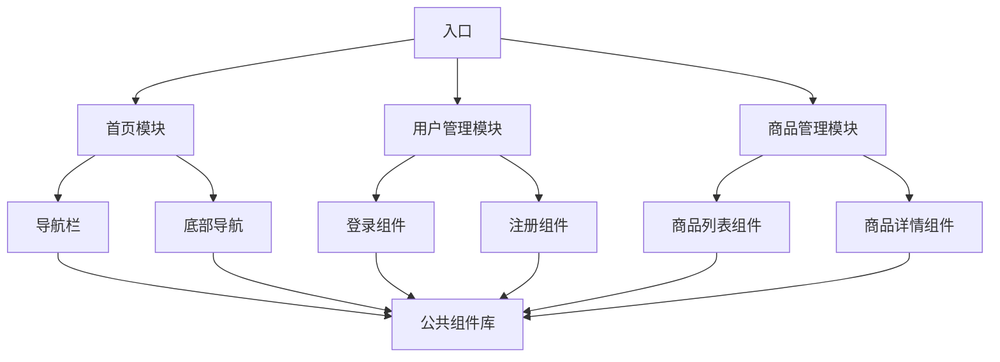

                 

### 《Web前端工程化最佳实践》

> **关键词：** Web前端工程化、模块化、组件化、性能优化、构建工具

> **摘要：** 本文章旨在探讨Web前端工程化的最佳实践，包括工程化背景与意义、开发环境搭建、模块化与组件化开发、代码质量与性能优化、构建与部署等方面的内容。通过详细的分析和实践，帮助读者深入了解并掌握前端工程化的核心技术和方法，提高开发效率和项目质量。

### 第一部分：Web前端工程化概述

#### 第1章：Web前端工程化背景与意义

#### 1.1 前端工程化的定义与起源

前端工程化是指在前端开发过程中，引入一系列工程化工具、方法和流程，以提高开发效率、提升代码质量和保障项目可维护性。其起源可以追溯到Web开发早期，随着项目规模和复杂度的增加，前端开发者逐渐意识到需要采用更系统化的方式来管理和开发前端代码。

- **早期开发**：在Web开发早期，前端开发主要依赖于HTML、CSS和JavaScript，开发者通过手动编写和调试代码来完成页面设计和功能实现。这种开发方式效率较低，难以管理复杂的项目结构和代码依赖。

- **模块化引入**：随着模块化思想的兴起，开发者开始使用模块化工具（如CommonJS、AMD等）来管理代码模块，提高代码复用性和可维护性。

- **工程化发展**：随着前端技术的发展，前端工程化逐渐成为一个独立的研究领域，涉及到的工具和框架也越来越丰富（如Webpack、Gulp、npm等），涵盖了项目搭建、模块化、组件化、代码质量与性能优化等方面。

#### 1.2 前端工程化的发展历程

前端工程化的发展历程可以分为以下几个阶段：

- **早期阶段**：在Web开发早期，前端开发主要依赖于HTML、CSS和JavaScript，开发者通过手动编写和调试代码来完成页面设计和功能实现。这种开发方式效率较低，难以管理复杂的项目结构和代码依赖。

- **模块化阶段**：随着模块化思想的兴起，开发者开始使用模块化工具（如CommonJS、AMD等）来管理代码模块，提高代码复用性和可维护性。这一阶段标志着前端开发从传统的手动开发向工程化方向转变。

- **工程化阶段**：随着前端技术的发展，前端工程化逐渐成为一个独立的研究领域，涉及到的工具和框架也越来越丰富（如Webpack、Gulp、npm等），涵盖了项目搭建、模块化、组件化、代码质量与性能优化等方面。这一阶段前端工程化进入成熟期，成为现代Web开发的重要组成部分。

#### 1.3 前端工程化的目标与优势

前端工程化的目标主要包括以下几点：

- **提高开发效率**：通过引入自动化工具和流程，减少重复性工作，提高开发效率。

- **提升代码质量**：通过代码规范、代码质量检查和代码格式化工具，提高代码的可读性和可维护性。

- **保障项目可维护性**：通过模块化和组件化，将代码拆分成可复用、可独立开发和维护的模块和组件，降低项目复杂度。

前端工程化的优势主要体现在以下几个方面：

- **提高开发效率**：自动化工具和流程可以大大减少开发人员的工作量，提高开发效率。例如，使用Webpack可以自动化打包和压缩代码，减少手动操作。

- **提升代码质量**：代码规范和质量检查工具可以帮助开发人员遵循统一的代码风格，避免常见错误，提高代码质量。

- **保障项目可维护性**：通过模块化和组件化，将代码拆分成可复用、可独立开发和维护的模块和组件，降低项目复杂度，便于后续维护和扩展。

#### 1.4 前端工程化的主要挑战

尽管前端工程化带来了诸多优势，但在实际应用过程中也面临一些挑战：

- **性能优化**：随着项目规模的增大，页面加载速度和交互性能成为重要的挑战。如何优化代码、资源和网络请求是前端开发者需要关注的问题。

- **代码管理**：前端工程化涉及到大量的代码和依赖，如何高效地管理代码和依赖是开发者需要解决的问题。

- **开发流程**：前端工程化带来了新的开发流程和协作模式，如何适应和优化这些流程是开发者需要思考的问题。

在本章中，我们探讨了Web前端工程化的定义与起源、发展历程、目标与优势以及主要挑战。接下来，我们将进一步探讨前端开发环境搭建、模块化与组件化开发、代码质量与性能优化、构建与部署等方面的内容，帮助读者深入了解并掌握前端工程化的最佳实践。

#### 第2章：前端开发环境搭建

在前端工程化的过程中，开发环境的搭建是一个基础且重要的环节。一个良好的开发环境可以为开发者提供高效的开发体验，减少不必要的麻烦，并确保项目的稳定性与可维护性。在本章中，我们将介绍Node.js的安装与配置、npm与yarn的使用指南以及Webpack的配置与优化。

### 2.1 Node.js安装与配置

Node.js是一个基于Chrome V8引擎的JavaScript运行环境，使得JavaScript不仅仅可以运行在浏览器中，也可以在服务器端运行。因此，在前端工程化中，Node.js扮演着至关重要的角色。

#### Node.js安装

Node.js的安装非常简单，可以通过其官方网站[https://nodejs.org/](https://nodejs.org/)下载相应的安装包，并按照提示进行安装。对于Windows用户，可以选择安装程序；对于macOS和Linux用户，可以选择编译安装。

以下是Windows环境下Node.js的安装步骤：

1. 访问Node.js官网下载安装程序。
2. 双击安装程序，并选择自定义安装。
3. 在“安装类型”中选择“Custom”，自定义安装路径。
4. 勾选“npm package manager”，确保安装npm。
5. 点击“Install”开始安装。
6. 安装完成后，在命令行中输入`node -v`和`npm -v`检查版本信息。

对于macOS和Linux用户，可以通过包管理器进行安装，以下是macOS下使用Homebrew安装Node.js的示例：

```shell
brew install node
```

安装完成后，可以通过以下命令检查版本：

```shell
node -v
npm -v
```

#### Node.js配置

安装完成后，需要配置Node.js的环境变量。以下是Windows环境下的配置步骤：

1. 打开“控制面板”。
2. 选择“系统和安全”，然后点击“系统”。
3. 在系统设置中，点击“高级系统设置”。
4. 在“系统属性”对话框中，点击“环境变量”。
5. 在“系统变量”中找到“Path”变量，点击“编辑”。
6. 在变量值中添加Node.js的安装路径（例如`C:\Program Files\nodejs`）。
7. 点击“确定”保存设置。

对于macOS和Linux用户，环境变量的配置通常在`.bashrc`或`.zshrc`文件中完成。以下是一个`.bashrc`文件中配置Node.js环境变量的示例：

```shell
export PATH=$PATH:/usr/local/bin:/usr/local/lib/node_modules
```

保存文件后，在命令行中执行`source ~/.bashrc`使配置生效。

### 2.2 npm与yarn使用指南

npm（Node Package Manager）和yarn是Node.js的包管理工具，用于管理项目的依赖和包。以下是它们的基本使用指南。

#### npm基础

npm的基础操作包括安装依赖、管理包和运行脚本等。

- **安装依赖**：

```shell
npm install [package-name]
```

这将安装指定包并添加到`package.json`文件中。

- **运行脚本**：

npm允许通过`package.json`中的scripts字段定义和运行各种脚本。例如：

```json
"scripts": {
  "start": "node index.js",
  "build": "webpack --config webpack.config.js"
}
```

运行脚本：

```shell
npm run start
npm run build
```

- **全局包安装**：

npm支持全局包的安装，例如全局安装Webpack：

```shell
npm install webpack -g
```

#### yarn优势

yarn是一个现代的JavaScript包管理工具，相对于npm有以下几个优势：

- **依赖安装速度**：yarn使用**锁文件（lockfile）**机制，确保依赖的安装顺序和版本一致性，从而加快安装速度。
- **并行安装**：yarn支持并行安装依赖，提高安装效率。
- **缓存**：yarn具有缓存机制，可以缓存已下载的依赖，减少重复下载。

#### 版本控制

npm和yarn都支持语义化版本控制（Semantic Versioning），通过`package.json`中的`version`字段定义包的版本。语义化版本号由三部分组成：主版本号、次版本号和修订号，分别表示功能的重大变化、新增功能和修复问题。

例如：

```json
"version": "1.2.3"
```

- **主版本号**：当增加新功能或引入不兼容的更改时，增加主版本号。
- **次版本号**：当增加功能或进行不兼容的API更改时，增加次版本号。
- **修订号**：当进行错误修复或改进时，增加修订号。

#### 版本管理

在项目管理中，版本管理是非常重要的。npm和yarn都提供了多种版本管理方式：

- **指定版本**：

```shell
npm install [package-name]@[version]
yarn add [package-name]@[version]
```

- **范围版本**：

```shell
npm install [package-name]@>1.0.0
yarn add [package-name]@^1.0.0
```

这些命令可以安装满足指定范围的版本。

#### 2.3 Webpack配置与优化

Webpack是一个模块打包工具，用于将多种资源（如JavaScript、CSS、图片等）打包为一个或多个静态文件，从而优化加载性能。以下是Webpack的基本配置与优化。

#### Webpack基本概念

- **入口（Entry）**：指定需要被打包的文件或目录，例如：

```javascript
module.exports = {
  entry: './src/index.js'
};
```

- **出口（Output）**：指定打包后的文件输出路径，例如：

```javascript
module.exports = {
  output: {
    filename: 'bundle.js',
    path: path.resolve(__dirname, 'dist')
  }
};
```

- **加载器（Loader）**：用于转换特定类型的资源，例如，使用`css-loader`和`style-loader`处理CSS文件。

- **插件（Plugin）**：用于在Webpack构建过程中执行特定任务，例如，`CleanWebpackPlugin`用于清理输出目录。

#### Webpack配置文件

Webpack的配置文件通常是一个名为`webpack.config.js`的JavaScript文件。以下是基本配置示例：

```javascript
const path = require('path');

module.exports = {
  entry: './src/index.js',
  output: {
    filename: 'bundle.js',
    path: path.resolve(__dirname, 'dist')
  },
  module: {
    rules: [
      {
        test: /\.css$/,
        use: ['style-loader', 'css-loader']
      }
    ]
  },
  plugins: [
    new CleanWebpackPlugin(),
    new HtmlWebpackPlugin({
      template: './src/index.html'
    })
  ]
};
```

#### Webpack性能优化

- **代码分割（Code Splitting）**：通过将代码分割成多个部分，可以按需加载模块，减少初始加载时间。

- **缓存（Caching）**：通过配置缓存策略，可以加快再次构建的速度。

- **压缩（Minification）**：通过压缩JavaScript和CSS文件，减少文件大小。

- **懒加载（Lazy Loading）**：通过动态导入模块，实现按需加载，提高页面性能。

本章详细介绍了前端开发环境搭建的过程，包括Node.js的安装与配置、npm与yarn的使用指南以及Webpack的配置与优化。通过这些基础配置，开发者可以搭建一个高效、稳定且易于维护的前端开发环境，为后续的工程化实践奠定坚实的基础。

#### 第3章：模块化开发基础

模块化开发是前端工程化的核心概念之一，它通过将代码拆分成可复用、可独立开发的模块，提高了代码的可维护性和可扩展性。本章将详细介绍三种常见的模块化开发方式：ES6模块导入导出、CommonJS模块化以及AMD模块化。

### 3.1 ES6模块导入导出

ES6（ECMAScript 2015）引入了模块化标准，使得模块化开发变得简单而强大。ES6模块化的核心是`import`和`export`语句。

#### ES6模块化的基本概念与语法

- **导入（Import）**：使用`import`语句导入模块。

```javascript
// 导入特定变量
import { myFunction } from './module1.js';

// 导入所有变量
import * as module1 from './module1.js';

// 导入默认导出
import myDefaultExport from './module1.js';
```

- **导出（Export）**：使用`export`语句导出模块。

```javascript
// 导出特定变量
export function myFunction() {
  // ...
}

// 导出默认变量
export default class MyClass {
  // ...
}
```

#### 示例代码

假设有一个名为`module1.js`的模块，其中定义了一个函数和一个类：

```javascript
// module1.js
export function myFunction() {
  console.log('Hello from myFunction!');
}

export default class MyClass {
  constructor() {
    console.log('Hello from MyClass!');
  }
}
```

在另一个文件（如`app.js`）中，可以导入并使用这些模块：

```javascript
// app.js
import myFunction from './module1.js';
import MyClass from './module1.js';

myFunction();
const myClassInstance = new MyClass();
```

#### ES6模块化的优势

- **静态解析**：ES6模块在编译时就可以确定依赖关系，使得性能更好。
- **树摇（Tree Shaking）**：通过静态解析，可以消除未使用的代码，减少打包文件的大小。
- **模块独立性**：每个模块都可以独立开发，减少全局变量的污染。

### 3.2 CommonJS模块化

CommonJS是一种早期的模块化标准，主要用于服务器端JavaScript。它通过`require`和`module.exports`实现模块化。

#### CommonJS模块化的原理与使用方法

- **导入（Import）**：使用`require`函数导入模块。

```javascript
// 导入特定变量
const myModule = require('./module1');

// 导入所有变量
const { myFunction } = require('./module1');
```

- **导出（Export）**：使用`module.exports`导出模块。

```javascript
// 导出特定变量
exports.myFunction = function() {
  console.log('Hello from myFunction!');
};

// 导出默认变量
module.exports = function() {
  console.log('Hello from default export!');
};
```

#### 示例代码

假设有一个名为`module1.js`的模块：

```javascript
// module1.js
function myFunction() {
  console.log('Hello from myFunction!');
}

module.exports = myFunction;
```

在另一个文件（如`app.js`）中，可以导入并使用这些模块：

```javascript
// app.js
const myFunction = require('./module1');
myFunction();
```

#### CommonJS的特点

- **动态解析**：CommonJS模块在运行时加载，因此可以在模块中使用动态导入。
- **同步加载**：CommonJS模块是同步加载的，这可能会影响性能。

### 3.3 AMD模块化

AMD（Asynchronous Module Definition）是一种异步模块定义标准，主要用于浏览器环境中。它通过`define`函数实现模块化。

#### AMD模块化的原理与使用方法

- **导入（Import）**：使用`define`函数定义模块。

```javascript
// 定义模块
define(['./module1'], function(module1) {
  function myFunction() {
    console.log('Hello from myFunction!');
  }
  return myFunction;
});

// 引入模块
require(['./module1'], function(module1) {
  module1.myFunction();
});
```

#### 示例代码

假设有一个名为`module1.js`的模块：

```javascript
// module1.js
define(function() {
  return {
    myFunction: function() {
      console.log('Hello from myFunction!');
    }
  };
});
```

在另一个文件（如`app.js`）中，可以导入并使用这些模块：

```javascript
// app.js
require(['./module1'], function(module1) {
  module1.myFunction();
});
```

#### AMD的特点

- **异步加载**：AMD模块是异步加载的，可以在浏览器环境中提高性能。
- **依赖声明**：在定义模块时明确声明依赖，便于模块管理。

通过本章的介绍，我们了解了ES6模块导入导出、CommonJS模块化和AMD模块化三种不同的模块化开发方式。每种方式都有其独特的优势和适用场景，开发者可以根据项目需求选择合适的模块化方式。在下一章中，我们将进一步探讨前端组件化的概念与优势。

#### 第4章：前端组件化

前端组件化是现代Web开发中的一项重要技术，它通过将界面和功能拆分成独立的组件，使得开发过程更加模块化、高效和可维护。组件化开发不仅提高了代码的可复用性，还降低了项目的复杂度。本章将详细介绍前端组件化的概念、优势，以及使用Vue.js、React和Angular等框架进行组件化开发的具体方法。

### 4.1 组件化开发的概念与优势

#### 组件化开发的概念

组件化开发，即基于组件的软件开发方法，它将用户界面和功能拆分成多个独立的、可复用的组件。每个组件负责实现特定的功能，内部状态独立，可以独立开发、测试和部署。组件之间通过明确的接口进行通信，从而实现了模块化、可扩展和可维护的开发模式。

#### 组件化开发的优势

1. **可复用性**：组件可以独立开发、测试和部署，提高了代码的复用性，减少了重复劳动。

2. **可维护性**：组件内部状态独立，便于管理和维护，降低了项目复杂度。

3. **开发效率**：通过组件化开发，可以并行开发不同组件，提高开发效率。

4. **可测试性**：组件独立，便于进行单元测试和集成测试，确保代码质量。

5. **灵活性**：组件可以灵活组合，满足不同业务需求，提高了系统的灵活性。

### 4.2 Vue.js组件开发

Vue.js是一个流行的前端框架，它通过简洁的API和响应式数据绑定，提供了组件化开发的强大支持。以下是Vue.js组件开发的基本方法。

#### Vue.js简介

Vue.js的核心思想是组件化开发，它通过`<template>`、`<script>`和`<style>`标签实现了组件的封装。Vue.js的组件具有以下特点：

1. **声明式渲染**：通过数据绑定和计算属性，实现视图和数据的同步更新。
2. **组件通信**：提供事件和插槽机制，实现组件间的数据通信。
3. **响应式数据系统**：通过响应式数据系统，实现高效的数据更新和渲染。

#### 组件创建

在Vue.js中，可以通过以下步骤创建和使用组件：

1. **定义组件**：

```html
<!-- MyComponent.vue -->
<template>
  <div>
    <h2>{{ title }}</h2>
    <p>{{ message }}</p>
  </div>
</template>

<script>
export default {
  data() {
    return {
      title: 'My Component',
      message: 'Hello Vue.js!'
    };
  }
};
</script>

<style scoped>
div {
  border: 1px solid #ccc;
  padding: 16px;
}
</style>
```

2. **注册组件**：

```javascript
// main.js
import MyComponent from './MyComponent.vue';

new Vue({
  el: '#app',
  components: {
    MyComponent
  }
});
```

3. **使用组件**：

```html
<!-- app.vue -->
<template>
  <div id="app">
    <MyComponent />
  </div>
</template>
```

#### 组件通信

Vue.js提供了多种组件通信方式：

1. **父组件向子组件传递数据**：通过属性（props）传递。
2. **子组件向父组件传递数据**：通过事件（events）传递。
3. **兄弟组件通信**：通过父组件或Vuex实现。

### 4.3 React组件化开发

React是由Facebook开发的一个用于构建用户界面的JavaScript库，它通过虚拟DOM和组件化架构，提供了高效的界面渲染和组件化开发能力。

#### React简介

React的核心思想是组件化开发，通过JSX语法实现组件的声明式编写。React组件具有以下特点：

1. **声明式渲染**：通过虚拟DOM实现高效的界面渲染。
2. **组件通信**：通过props和state实现组件间的数据通信。
3. **单向数据流**：数据从父组件传递到子组件，确保数据流的清晰和可预测。

#### 组件创建

在React中，可以通过以下步骤创建和使用组件：

1. **定义组件**：

```javascript
// MyComponent.js
import React from 'react';

const MyComponent = () => {
  return (
    <div>
      <h2>Hello React!</h2>
    </div>
  );
};

export default MyComponent;
```

2. **使用组件**：

```javascript
// App.js
import React from 'react';
import MyComponent from './MyComponent';

const App = () => {
  return (
    <div>
      <MyComponent />
    </div>
  );
};

export default App;
```

#### 组件通信

React提供了多种组件通信方式：

1. **父组件向子组件传递数据**：通过属性（props）传递。
2. **子组件向父组件传递数据**：通过回调函数传递。
3. **兄弟组件通信**：通过Context或Redux实现。

### 4.4 Angular组件化

Angular是由Google开发的一个用于构建大型单页应用程序的前端框架，它通过声明式模板和依赖注入，提供了强大的组件化开发能力。

#### Angular简介

Angular的核心思想是组件化开发，通过组件（Component）、指令（Directive）和服务（Service）等概念，实现了模块化和高内聚。Angular组件具有以下特点：

1. **声明式模板**：通过双标签`<ng-template>`实现组件的声明式编写。
2. **依赖注入**：通过依赖注入实现组件间的数据通信。
3. **数据绑定**：通过双向数据绑定实现视图和数据的同步更新。

#### 组件创建

在Angular中，可以通过以下步骤创建和使用组件：

1. **定义组件**：

```typescript
// my-component.component.ts
import { Component } from '@angular/core';

@Component({
  selector: 'app-my-component',
  templateUrl: './my-component.component.html',
  styleUrls: ['./my-component.component.css']
})
export class MyComponentComponent {
  title = 'Hello Angular!';
}
```

2. **使用组件**：

```html
<!-- app.component.html -->
<div>
  <app-my-component></app-my-component>
</div>
```

#### 组件通信

Angular提供了多种组件通信方式：

1. **父组件向子组件传递数据**：通过属性（@Input）传递。
2. **子组件向父组件传递数据**：通过事件（@Output）传递。
3. **兄弟组件通信**：通过服务（Service）或事件总线（Event Bus）实现。

通过本章的介绍，我们了解了前端组件化的概念、优势以及Vue.js、React和Angular等框架的组件化开发方法。组件化开发不仅提高了代码的可复用性和可维护性，还提高了开发效率和项目的灵活性。在下一章中，我们将探讨代码质量与性能优化的重要性和具体策略。

#### 第5章：代码质量与性能优化

代码质量和性能优化是Web前端工程化中至关重要的一环。良好的代码质量不仅能够提高开发效率，还能降低维护成本，确保项目的稳定性和可靠性。性能优化则直接影响用户的使用体验，是提升Web应用竞争力的重要因素。本章将详细介绍代码风格的重要性、CSS预处理器与框架的使用、JavaScript代码规范以及代码质量工具。

### 5.1 前端代码风格的重要性

良好的代码风格是确保代码可读性、可维护性和协作开发的重要保障。以下是几个关键原因：

- **可读性**：一致的代码风格使得代码更易于理解和阅读，尤其是在多人协作项目中，良好的代码风格有助于团队成员快速上手和维护代码。

- **可维护性**：一致的代码风格可以减少代码冲突和误解，便于后续的代码修改和扩展。

- **协作开发**：良好的代码风格有助于团队成员遵循统一的规范，提高协作效率。

### 5.2 CSS预处理器与框架

CSS预处理器和框架是提升CSS开发效率和质量的重要工具。以下是一些常用的CSS预处理器和框架：

#### CSS预处理器

- **Sass**：Sass是一个强大的CSS预处理器，它扩展了CSS的功能，支持变量、嵌套、混合宏等功能。Sass语法更加灵活，能够提高CSS代码的可维护性。

- **Less**：Less也是一种流行的CSS预处理器，它同样支持变量、嵌套、混合等功能。Less的语法与CSS相似，易于学习和使用。

#### CSS框架

- **Bootstrap**：Bootstrap是一个广泛使用的CSS框架，提供了丰富的组件和样式，使得快速构建响应式网页变得更加容易。

- **Foundation**：Foundation是一个现代化的CSS框架，专注于移动优先的布局和响应式设计。

### 5.3 JavaScript代码规范

JavaScript代码规范是确保代码质量的关键。以下是一些常见的JavaScript代码规范：

- **变量命名**：使用有意义的变量名，避免使用缩写和混合大小写。

- **代码注释**：合理使用注释，对复杂的逻辑和算法进行解释。

- **代码组织**：保持代码结构清晰，逻辑独立，便于维护。

- **函数长度**：限制函数长度，避免过长和复杂的函数。

### 5.4 代码质量工具

为了确保代码质量，可以使用多种代码质量工具进行检查和修复。以下是一些常用的代码质量工具：

- **ESLint**：ESLint是一个强大的JavaScript代码检查工具，可以检查语法错误、代码风格问题等。ESLint提供了丰富的配置选项，可以满足不同的开发需求。

- **Prettier**：Prettier是一个代码格式化工具，用于格式化JavaScript、CSS和HTML代码。Prettier可以帮助团队保持一致的代码风格。

- **JSHint**：JSHint是一个JavaScript代码质量检查工具，用于检查潜在的错误和不符合最佳实践的代码。JSHint提供了丰富的规则集，可以自定义配置。

通过本章的介绍，我们了解了代码质量与性能优化的重要性，包括代码风格的重要性、CSS预处理器与框架的使用、JavaScript代码规范以及代码质量工具。在下一章中，我们将探讨性能优化策略，包括资源加载优化、网络请求优化、布局与渲染优化以及热更新与懒加载。

### 5.1 前端代码风格的重要性

在前端开发中，代码风格不仅仅是一种美观的要求，更是保证代码可读性、可维护性和可协作性的重要因素。一个良好的代码风格能够为项目带来以下几方面的好处：

#### 提高代码可读性

- **一致性**：良好的代码风格可以帮助团队成员快速理解和阅读代码，尤其是在多人协作的项目中，一致的代码风格减少了混淆和困惑。
- **易理解**：合理命名和结构化的代码可以使得代码逻辑更加直观，便于新成员快速上手和理解项目结构。

#### 提高代码可维护性

- **减少错误**：一致的代码风格可以减少由于风格不一致导致的小错误，如拼写错误或格式错误。
- **便于修改**：良好的代码风格使得代码更加模块化，便于后续的代码修改和扩展，减少了维护成本。

#### 提高协作开发效率

- **统一规范**：良好的代码风格可以帮助团队遵循统一的规范，提高开发效率和代码质量。
- **减少沟通成本**：一致的代码风格减少了团队成员之间的沟通成本，使得协作更加顺畅。

在实际开发中，我们可以通过以下方式来维护良好的代码风格：

- **代码格式化工具**：使用如Prettier、ESLint等代码格式化工具来自动格式化代码，确保代码的统一性和一致性。
- **代码检查工具**：使用如ESLint、StyleCI等代码检查工具来检测和修复代码中的潜在问题。
- **代码审查**：定期进行代码审查，通过团队成员之间的互相检查和反馈，发现和修复代码风格问题。

### 5.2 CSS预处理器与框架

CSS预处理器和框架是前端开发中提升代码质量和开发效率的重要工具。CSS预处理器扩展了CSS的功能，使得编写样式更加灵活和高效。以下是一些常用的CSS预处理器和框架：

#### CSS预处理器

1. **Sass**
   - **特点**：Sass是一个强大、灵活的CSS预处理器，它支持变量、嵌套、混合、继承等功能，能够提高CSS代码的可维护性和复用性。
   - **使用方法**：
     ```scss
     // _variables.scss
     $primary-color: #333;

     // styles.scss
     @import 'variables';
     .container {
       background-color: $primary-color;
     }
     ```

2. **Less**
   - **特点**：Less与Sass类似，也提供了变量、嵌套、混合等功能，语法简单直观，易于学习。
   - **使用方法**：
     ```less
     // variables.less
     @primary-color: #333;

     // styles.less
     .container {
       background-color: @primary-color;
     }
     ```

#### CSS框架

1. **Bootstrap**
   - **特点**：Bootstrap是一个广泛使用的响应式前端框架，提供了大量的UI组件和样式，使得快速构建响应式网页变得更加容易。
   - **使用方法**：
     - 引入Bootstrap的CSS文件：
       ```html
       <link rel="stylesheet" href="https://cdn.jsdelivr.net/npm/bootstrap@5.2.3/dist/css/bootstrap.min.css">
       ```

2. **Foundation**
   - **特点**：Foundation是一个现代化的前端框架，专注于移动优先的布局和响应式设计，提供了丰富的UI组件和样式。
   - **使用方法**：
     - 引入Foundation的CSS文件：
       ```html
       <link rel="stylesheet" href="https://cdn.jsdelivr.net/npm/foundation-sites@7.0.5/dist/css/foundation.min.css">
       ```

#### 选择合适的CSS预处理器或框架

- **项目需求**：根据项目需求选择适合的CSS预处理器或框架。例如，对于需要快速启动的项目，可以选择Bootstrap；对于需要高度定制化的项目，可以选择Sass或Less。
- **团队技能**：考虑团队成员对预处理器或框架的熟悉程度，选择他们擅长的工具。

### 5.3 JavaScript代码规范

JavaScript代码规范是确保代码质量和可维护性的关键。以下是一些常见的JavaScript代码规范：

1. **变量命名**
   - **命名规则**：使用有意义的变量名，避免使用缩写和混合大小写。
   - **示例**：
     ```javascript
     let totalQuantity = 0;
     const税率 = 0.1;
     ```

2. **代码注释**
   - **注释规则**：在复杂逻辑或算法中添加注释，对代码进行解释。
   - **示例**：
     ```javascript
     /**
      * 计算订单总价
      * @param {number} price - 商品价格
      * @param {number} quantity - 商品数量
      * @returns {number} 订单总价
      */
     function calculateTotalPrice(price, quantity) {
       return price * quantity;
     }
     ```

3. **代码组织**
   - **模块化**：将代码分割成多个模块，每个模块负责特定的功能。
   - **结构化**：保持代码结构清晰，逻辑独立，便于维护。
   - **示例**：
     ```javascript
     // utils.js
     export function sum(a, b) {
       return a + b;
     }

     // main.js
     import { sum } from './utils';
     console.log(sum(1, 2)); // 输出 3
     ```

4. **函数长度**
   - **限制函数长度**：函数过长和过于复杂会影响可读性和可维护性，应限制函数长度。
   - **分解复杂函数**：将复杂的函数分解为多个小函数，便于理解和维护。
   - **示例**：
     ```javascript
     // 复杂函数
     function calculateOrderTotal(price, quantity, discount) {
       const total = price * quantity;
       const discountAmount = total * discount;
       return total - discountAmount;
     }

     // 分解函数
     function calculateTotal(price, quantity) {
       return price * quantity;
     }

     function applyDiscount(total, discount) {
       return total - (total * discount);
     }

     function calculateOrderTotal(price, quantity, discount) {
       const total = calculateTotal(price, quantity);
       return applyDiscount(total, discount);
     }
     ```

### 5.4 代码质量工具

为了确保代码质量，可以使用多种代码质量工具进行检查和修复。以下是一些常用的代码质量工具：

1. **ESLint**
   - **功能**：ESLint是一个强大的JavaScript代码检查工具，可以检测语法错误、代码风格问题等。
   - **安装**：通过npm安装ESLint。
     ```bash
     npm install eslint --save-dev
     ```
   - **配置**：配置`.eslintrc`文件，设置检查规则和配置选项。
     ```json
     {
       "extends": "eslint:recommended",
       "rules": {
         "indent": ["error", 2],
         "linebreak-style": ["error", "unix"],
         "quotes": ["error", "double"]
       }
     }
     ```

2. **Prettier**
   - **功能**：Prettier是一个代码格式化工具，用于格式化JavaScript、CSS和HTML代码。
   - **安装**：通过npm安装Prettier。
     ```bash
     npm install prettier --save-dev
     ```
   - **配置**：配置`.prettierrc`文件，设置格式化规则和配置选项。
     ```json
     {
       "semi": false,
       "trailingComma": "es5",
       "singleQuote": true,
       "printWidth": 80
     }
     ```

3. **JSHint**
   - **功能**：JSHint是一个JavaScript代码质量检查工具，用于检查潜在的错误和不符合最佳实践的代码。
   - **安装**：通过npm安装JSHint。
     ```bash
     npm install jshint --save-dev
     ```
   - **配置**：配置`.jshintrc`文件，设置检查规则和配置选项。
     ```json
     {
       "globals": {
         "jQuery": true,
         "console": true
       },
       "strict": true,
       "newcap": true
     }
     ```

通过本章的介绍，我们了解了前端代码质量与性能优化的重要性，包括代码风格的重要性、CSS预处理器与框架的使用、JavaScript代码规范以及代码质量工具。良好的代码质量和性能优化不仅能够提升项目的开发效率和用户体验，还能为团队协作和项目长期维护提供有力保障。在下一章中，我们将探讨性能优化策略，包括资源加载优化、网络请求优化、布局与渲染优化以及热更新与懒加载。

### 6.1 资源加载优化

资源加载优化是提高Web应用性能的关键环节，它直接影响用户的体验和网站的加载速度。有效的资源加载优化策略能够减少带宽消耗，加快页面渲染速度，提高用户满意度。以下是一些常见的资源加载优化策略：

#### 懒加载

懒加载（Lazy Loading）是一种延迟加载资源的技术，它只在资源需要时才加载，从而减少初始加载时间。懒加载适用于图片、视频、脚本等大文件资源。

- **图片懒加载**：通过JavaScript或CSS来实现，当图片进入视口时才加载。
- **示例代码**：
  ```javascript
  document.addEventListener('DOMContentLoaded', () => {
    const images = document.querySelectorAll('img[data-src]');
    images.forEach(img => {
      if (img.getBoundingClientRect().top < window.innerHeight) {
        img.src = img.dataset.src;
        img.removeAttribute('data-src');
      }
    });
  });
  ```

#### 预加载

预加载（Preloading）是一种提前加载资源的技术，它可以在用户需要时快速提供资源，从而减少加载时间。预加载适用于重要资源，如导航栏图片、当前页面图片等。

- **HTML预加载标签**：使用`<link rel="preload">`标签提前加载重要资源。
- **示例代码**：
  ```html
  <link rel="preload" href="image.jpg" as="image">
  ```

#### 资源压缩

资源压缩是一种通过减小文件大小来优化资源加载的技术。常见的压缩方法包括GZIP压缩、CSS和JavaScript压缩等。

- **GZIP压缩**：服务器对响应的数据进行GZIP压缩，减少传输数据量。
- **示例配置**：
  ```http
  # Apache
  <FilesMatch \.html$>
    SetOutputFilter DEFLATE
  </FilesMatch>

  # Nginx
  gzip on;
  gzip_types text/html;
  ```

#### 资源缓存

资源缓存是一种将资源存储在浏览器缓存中的技术，使得用户在再次访问时可以快速获取资源，从而减少加载时间。

- **浏览器缓存**：通过设置合适的HTTP缓存头，延长资源缓存时间。
- **示例配置**：
  ```http
  ExpiresActive On
  ExpiresDefault "access plus 1 week"
  ```

#### CDN加速

内容分发网络（CDN）是一种将静态资源分发到全球多个节点，从而提高资源加载速度的技术。CDN可以减少用户与服务器之间的距离，提高访问速度。

- **CDN选择**：选择合适的CDN服务提供商，优化资源加载速度。
- **示例配置**：
  ```html
  <link rel="stylesheet" href="https://cdn.example.com/css/style.css">
  ```

通过以上策略，可以显著提高Web应用的资源加载速度，提升用户体验。接下来，我们将进一步探讨网络请求优化策略。

### 6.2 网络请求优化

网络请求优化是提升Web应用性能的重要环节，合理的请求优化策略可以减少请求次数、降低请求延迟，从而提高用户访问速度和体验。以下是一些常见的网络请求优化策略：

#### 请求合并

请求合并（Request Merging）是一种将多个请求合并成一个请求的技术，从而减少请求次数。这种方法适用于不经常变化的资源，如CSS和JavaScript文件。

- **合并CSS文件**：使用工具如Gulp或Webpack将多个CSS文件合并为一个。
- **示例代码**：
  ```javascript
  // webpack.config.js
  module.exports = {
    plugins: [
      new Webpack.optimize合并插件({
        filename: 'all.css',
        paths: ['./src/css/*.css'],
        minify: true
      })
    ]
  };
  ```

#### 请求缓存

请求缓存（Request Caching）是一种将请求结果缓存到本地或服务器的技术，从而减少重复请求。合理设置缓存时间可以显著提高响应速度。

- **浏览器缓存**：通过设置HTTP缓存头来控制浏览器缓存。
- **示例配置**：
  ```http
  Cache-Control: public, max-age=31536000
  ```

#### 资源压缩

资源压缩是一种通过减小文件大小来优化网络请求的技术。常见的压缩方法包括GZIP压缩、CSS和JavaScript压缩等。

- **GZIP压缩**：服务器对响应的数据进行GZIP压缩，减少传输数据量。
- **示例配置**：
  ```http
  # Apache
  <FilesMatch \.html$>
    SetOutputFilter DEFLATE
  </FilesMatch>

  # Nginx
  gzip on;
  gzip_types text/html;
  ```

#### CDN使用

内容分发网络（CDN）是一种将静态资源分发到全球多个节点，从而提高资源加载速度的技术。CDN可以减少用户与服务器之间的距离，提高访问速度。

- **CDN选择**：选择合适的CDN服务提供商，优化资源加载速度。
- **示例配置**：
  ```html
  <link rel="stylesheet" href="https://cdn.example.com/css/style.css">
  ```

#### 预渲染

预渲染（Pre-rendering）是一种在用户访问页面之前提前加载页面的技术，从而减少页面加载时间。这种方法适用于搜索引擎优化（SEO）和高频使用的页面。

- **服务器端预渲染**：使用服务器端渲染（SSR）技术，如Nuxt.js或Next.js，提前渲染页面。
- **示例配置**：
  ```javascript
  // next.config.js
  module.exports = {
    target: 'server',
    ssr: true
  };
  ```

通过以上策略，可以显著优化网络请求，提高Web应用的性能和用户体验。接下来，我们将探讨布局与渲染优化策略。

### 6.3 布局与渲染优化

布局与渲染优化是提高Web应用性能的关键环节，它直接影响页面的加载速度和用户体验。以下是一些有效的布局与渲染优化策略：

#### 使用响应式布局

响应式布局（Responsive Layout）是一种能够根据不同设备和屏幕尺寸自动调整页面布局的技术。通过响应式布局，可以确保Web应用在不同设备上都有良好的表现。

- **媒体查询（Media Queries）**：使用媒体查询来针对不同屏幕尺寸调整样式。
- **示例代码**：
  ```css
  @media (max-width: 768px) {
    .container {
      width: 100%;
    }
  }
  ```

#### CSS精灵图（CSS Sprites）

CSS精灵图（CSS Sprites）是一种将多个图片整合到一张大图中，并通过背景定位来显示所需图片的技术。这种方法可以减少HTTP请求次数，提高页面加载速度。

- **制作精灵图**：将多个小图标合并到一张大图中。
- **背景定位**：通过背景定位来显示所需图标。
- **示例代码**：
  ```css
  .icon {
    background: url('sprites.png') no-repeat;
    background-position: 0 -32px;
  }
  ```

#### 使用Web字体

Web字体（Web Fonts）是一种在网页中使用自定义字体的技术，它可以通过减小文件大小和提高字体渲染速度来优化页面性能。

- **字体文件压缩**：对字体文件进行压缩，减小文件大小。
- **字体缓存**：通过设置合适的HTTP缓存头来延长字体缓存时间。
- **示例代码**：
  ```css
  @import url('https://fonts.googleapis.com/css2?family=Noto+Sans:wght@400;700&display=swap');
  ```

#### 减少DOM深度

减少DOM深度（Reduce DOM Depth）是一种通过优化HTML结构来提高页面渲染速度的技术。DOM深度越小，浏览器的渲染速度越快。

- **扁平化结构**：使用扁平化的HTML结构，减少嵌套层级。
- **示例代码**：
  ```html
  <div class="container">
    <header>
      <nav>
        <!-- 导航菜单 -->
      </nav>
    </header>
    <main>
      <!-- 主要内容 -->
    </main>
    <footer>
      <!-- 页脚 -->
    </footer>
  </div>
  ```

#### 异步加载脚本

异步加载脚本（Asynchronous Script Loading）是一种在不需要立即执行的情况下延迟加载JavaScript脚本的技术，从而减少脚本加载对页面渲染的影响。

- **异步脚本**：使用`async`或`defer`属性来异步加载脚本。
- **示例代码**：
  ```html
  <script async src="https://cdn.example.com/script.js"></script>
  <script defer src="https://cdn.example.com/another-script.js"></script>
  ```

#### 使用WebAssembly

WebAssembly（WASM）是一种新型虚拟机，它可以在Web浏览器中高效执行代码。通过将部分计算密集型任务转换为WebAssembly，可以显著提高页面性能。

- **编译JavaScript到WebAssembly**：使用工具如Emscripten将JavaScript代码编译为WebAssembly。
- **示例代码**：
  ```javascript
  // 使用WebAssembly编译的JavaScript代码
  import { add } from './module.wasm';

  add(1, 2); // 输出 3
  ```

通过以上策略，可以有效优化布局与渲染性能，提高Web应用的加载速度和用户体验。接下来，我们将探讨热更新与懒加载策略。

### 6.4 热更新与懒加载

热更新与懒加载是提升Web应用开发效率和用户体验的重要策略。热更新允许开发者在不重启应用的情况下更新代码，而懒加载则延迟加载资源，以减少初始加载时间和提高性能。以下是这两种策略的具体实现方法：

#### 热更新

热更新（Hot Update）是一种在应用运行时实时更新代码而不中断用户体验的技术。以下是一些实现热更新的方法：

1. **WebSockets**：通过WebSockets实时传输更新文件到客户端，并使用JavaScript动态加载和替换更新后的代码。
   - **示例步骤**：
     ```javascript
     // 建立WebSocket连接
     const socket = new WebSocket('ws://example.com/socket');

     // 监听连接成功事件
     socket.addEventListener('open', (event) => {
       socket.send('start-update');
     });

     // 监听服务器发送的更新文件
     socket.addEventListener('message', (event) => {
       const file = event.data;
       // 使用JavaScript动态加载更新文件
       eval(file);
     });
     ```

2. **Service Workers**：利用Service Workers缓存和更新资源，从而实现热更新。
   - **示例步骤**：
     ```javascript
     // 注册Service Worker
     if ('serviceWorker' in navigator) {
       window.addEventListener('load', () => {
         navigator.serviceWorker.register('/service-worker.js').then((registration) => {
           console.log('Service Worker registered:', registration);
         });
       });
     }

     // service-worker.js
     self.addEventListener('message', (event) => {
       if (event.data.type === 'update') {
         // 下载并安装更新文件
         fetch(event.data.url).then((response) => {
           response.arrayBuffer().then((buffer) => {
             self.caches.open('update-cache').then((cache) => {
               cache.put('app.js', new Uint8Array(buffer));
               self.skipWaiting();
             });
           });
         });
       }
     });
     ```

#### 懒加载

懒加载（Lazy Loading）是一种按需加载资源的技术，它可以在用户需要时才加载相应的资源，从而减少初始加载时间和提高性能。以下是几种常见的懒加载实现方法：

1. **图片懒加载**：当图片出现在视口范围内时，才加载图片。
   - **示例步骤**：
     ```javascript
     // 使用IntersectionObserver实现懒加载
     let lazyImages = [].slice.call(document.querySelectorAll("img.lazy"));

     if ("IntersectionObserver" in window) {
       let lazyImageObserver = new IntersectionObserver(function (entries, observer) {
         entries.forEach(function (entry) {
           if (entry.isIntersecting) {
             let lazyImage = entry.target;
             lazyImage.src = lazyImage.dataset.src;
             lazyImage.classList.remove("lazy");
             lazyImageObserver.unobserve(lazyImage);
           }
         });
       });

       lazyImages.forEach(function (lazyImage) {
         lazyImageObserver.observe(lazyImage);
       });
     } else {
       // Fallback for browsers without IntersectionObserver support
       lazyImages.forEach(function (lazyImage) {
         lazyImage.src = lazyImage.dataset.src;
       });
     }
     ```

2. **组件懒加载**：在Vue.js或React等框架中，通过动态导入实现组件的懒加载。
   - **Vue.js示例**：
     ```javascript
     // 在Vue组件中实现懒加载
     components: {
       MyComponent: () => import(/* webpackChunkName: "my-component" */ './MyComponent.vue')
     }
     ```

3. **懒加载脚本**：在需要时动态加载脚本，减少初始加载时间。
   - **示例步骤**：
     ```javascript
     // 动态加载脚本
     function loadScript(url) {
       return new Promise((resolve, reject) => {
         const script = document.createElement("script");
         script.src = url;
         script.onload = resolve;
         script.onerror = reject;
         document.body.appendChild(script);
       });
     }

     loadScript("https://cdn.example.com/script.js")
       .then(() => {
         console.log("Script loaded successfully");
       })
       .catch((error) => {
         console.error("Error loading script", error);
       });
     ```

通过热更新与懒加载，开发者可以在不牺牲用户体验的情况下提高开发效率和性能。在下一章中，我们将探讨构建与部署环节的最佳实践。

### 7.1 构建工具的选择

在前端工程化过程中，构建工具扮演着至关重要的角色。它们能够自动化项目构建过程，包括打包、压缩、优化等步骤，从而提高开发效率和项目质量。目前市面上有许多流行的构建工具，如Webpack、Gulp和Grunt等。本文将详细介绍这些构建工具的选择和配置方法，以帮助开发者选择最适合自己项目的构建工具。

#### Webpack

Webpack是一个功能强大的模块打包工具，它能够将多个模块打包成一个或多个静态文件。Webpack的核心优势在于其强大的插件系统，可以通过插件来扩展其功能，从而满足不同的开发需求。

- **安装**：首先需要全局安装Webpack：

  ```bash
  npm install webpack -g
  ```

  然后在项目目录中安装Webpack依赖：

  ```bash
  npm install webpack webpack-cli --save-dev
  ```

- **配置**：Webpack的配置文件通常是一个名为`webpack.config.js`的JavaScript文件。以下是一个基本的Webpack配置示例：

  ```javascript
  const path = require('path');

  module.exports = {
    entry: './src/index.js',
    output: {
      filename: 'bundle.js',
      path: path.resolve(__dirname, 'dist'),
    },
    module: {
      rules: [
        {
          test: /\.css$/,
          use: ['style-loader', 'css-loader'],
        },
        {
          test: /\.jsx?$/,
          exclude: /node_modules/,
          use: 'babel-loader',
        },
      ],
    },
    plugins: [
      new webpack粕oronWebpackPlugin(),
    ],
    devServer: {
      contentBase: './dist',
      open: true,
    },
  };
  ```

#### Gulp

Gulp是一个基于流的任务运行器，它能够自动化项目的各种任务，如编译、压缩、测试等。Gulp的优点在于其简洁的语法和灵活的插件系统。

- **安装**：首先需要全局安装Gulp：

  ```bash
  npm install gulp -g
  ```

  然后在项目目录中安装Gulp依赖：

  ```bash
  npm install gulp gulp-cli --save-dev
  ```

- **配置**：Gulp的配置文件通常是一个名为`gulpfile.js`的JavaScript文件。以下是一个基本的Gulp配置示例：

  ```javascript
  const gulp = require('gulp');
  const babel = require('gulp-babel');
  const sass = require('gulp-sass');
  const uglify = require('gulp-uglify');
  const clean = require('gulp-clean');

  gulp.task('clean', function () {
    return gulp.src('dist', { read: false, allowError: false }).pipe(clean());
  });

  gulp.task('scripts', function () {
    return gulp.src('src/*.js')
      .pipe(babel({ presets: ['@babel/preset-env'] }))
      .pipe(uglify())
      .pipe(gulp.dest('dist'));
  });

  gulp.task('styles', function () {
    return gulp.src('src/*.scss')
      .pipe(sass().on('error', sass.logError))
      .pipe(gulp.dest('dist'));
  });

  gulp.task('watch', function () {
    gulp.watch('src/*.js', { interval: 1000 }, ['scripts']);
    gulp.watch('src/*.scss', { interval: 1000 }, ['styles']);
  });

  gulp.task('default', gulp.series('clean', 'scripts', 'styles', 'watch'));
  ```

#### Grunt

Grunt也是一个基于流的任务运行器，与Gulp类似，它能够自动化项目的各种任务。Grunt的优点在于其丰富的插件生态和强大的多任务并行处理能力。

- **安装**：首先需要全局安装Grunt：

  ```bash
  npm install grunt -g
  ```

  然后在项目目录中安装Grunt依赖：

  ```bash
  npm install grunt-contrib-clean grunt-contrib-uglify grunt-contrib-sass --save-dev
  ```

- **配置**：Grunt的配置文件通常是一个名为`Gruntfile.js`的JavaScript文件。以下是一个基本的Grunt配置示例：

  ```javascript
  module.exports = function (grunt) {
    grunt.initConfig({
      clean: ['dist'],
      uglify: {
        options: {
          compress: true,
          mangle: true,
        },
        target: {
          files: {
            'dist/bundle.min.js': ['src/*.js'],
          },
        },
      },
      sass: {
        target: {
          files: {
            'dist/style.css': 'src/style.scss',
          },
        },
      },
    });

    grunt.loadNpmTasks('grunt-contrib-clean');
    grunt.loadNpmTasks('grunt-contrib-uglify');
    grunt.loadNpmTasks('grunt-contrib-sass');

    grunt.registerTask('default', ['clean', 'uglify', 'sass']);
  };
  ```

#### 选择合适的构建工具

选择合适的构建工具主要取决于项目的需求和个人偏好。以下是一些选择构建工具时需要考虑的因素：

- **项目规模**：对于大型项目，Webpack可能是一个更好的选择，因为它提供了更多的插件和扩展性。对于小型项目，Gulp或Grunt可能更加简洁和容易上手。
- **开发体验**：Webpack的零配置特性使得它成为初学者的首选，而Gulp和Grunt则提供了更多的自定义和灵活性。
- **性能和资源消耗**：Gulp和Grunt在处理大量任务时可能会占用更多资源，而Webpack在打包大型项目时可能更高效。

在本章中，我们详细介绍了Webpack、Gulp和Grunt这三种常见的构建工具，包括它们的安装方法和配置示例。在下一章中，我们将探讨构建流程与配置，以及自动化部署和Continuous Integration（CI）。

### 7.2 构建流程与配置

在前端工程化中，构建流程与配置是确保项目高效开发和部署的重要环节。一个良好的构建流程和配置能够自动化项目的编译、打包、压缩、优化等任务，从而提高开发效率和代码质量。以下将详细介绍Webpack、Gulp和Grunt的基本构建流程和配置方法，并提供一些优化建议。

#### Webpack的基本构建流程与配置

Webpack是一个功能强大的模块打包工具，它通过将各种资源（如JavaScript、CSS、图片等）打包为一个或多个静态文件，优化了页面加载速度和资源管理。以下是一个基本的Webpack构建流程和配置示例：

1. **安装Webpack和相关的Loader和Plugin**：

   ```bash
   npm install webpack webpack-cli --save-dev
   ```

   如果需要处理CSS或图片等资源，还需要安装相应的Loader：

   ```bash
   npm install style-loader css-loader --save-dev
   npm install file-loader --save-dev
   ```

2. **创建Webpack配置文件（webpack.config.js）**：

   ```javascript
   const path = require('path');
   const HtmlWebpackPlugin = require('html-webpack-plugin');

   module.exports = {
     mode: 'development', // 设置模式为开发模式或生产模式
     entry: './src/index.js', // 入口文件
     output: {
       filename: 'bundle.js', // 输出文件名
       path: path.resolve(__dirname, 'dist'), // 输出路径
     },
     module: {
       rules: [
         {
           test: /\.css$/,
           use: ['style-loader', 'css-loader'],
         },
         {
           test: /\.(png|jpe?g|gif)$/i,
           use: [
             {
               loader: 'file-loader',
             },
           ],
         },
       ],
     },
     plugins: [
       new HtmlWebpackPlugin({
         template: './src/index.html', // 模板文件
       }),
     ],
     devServer: {
       contentBase: './dist', // 内容基本目录
       open: true, // 自动打开浏览器
     },
   };
   ```

3. **运行Webpack**：

   ```bash
   npm run build
   ```

   执行此命令后，Webpack会读取配置文件，对项目进行编译和打包，并将生成的静态文件输出到`dist`目录。

#### Gulp的基本构建流程与配置

Gulp是一个基于流的任务运行器，它通过定义一系列的Task来自动化项目构建过程。以下是一个基本的Gulp构建流程和配置示例：

1. **安装Gulp和相关的插件**：

   ```bash
   npm install gulp --save-dev
   npm install gulp-sass gulp-uglify gulp-clean-css --save-dev
   ```

2. **创建Gulp配置文件（gulpfile.js）**：

   ```javascript
   const gulp = require('gulp');
   const sass = require('gulp-sass')(require('node-sass'));
   const uglify = require('gulp-uglify');
   const cleanCSS = require('gulp-clean-css');

   gulp.task('clean', function () {
     return gulp.src('dist', { read: false, allowError: false }).pipe(clean());
   });

   gulp.task('styles', function () {
     return gulp.src('src/*.scss').pipe(sass()).pipe(cleanCSS()).pipe(gulp.dest('dist'));
   });

   gulp.task('scripts', function () {
     return gulp.src('src/*.js').pipe(uglify()).pipe(gulp.dest('dist'));
   });

   gulp.task('default', gulp.series('clean', 'styles', 'scripts'));
   ```

3. **运行Gulp**：

   ```bash
   gulp
   ```

   执行此命令后，Gulp会依次执行定义的Task，对项目进行编译、压缩和清理等操作。

#### Grunt的基本构建流程与配置

Grunt与Gulp类似，也是一个基于流的任务运行器，它通过定义一系列的任务来自动化项目构建过程。以下是一个基本的Grunt构建流程和配置示例：

1. **安装Grunt和相关的插件**：

   ```bash
   npm install grunt --save-dev
   npm install grunt-contrib-sass grunt-contrib-uglify grunt-contrib-clean --save-dev
   ```

2. **创建Grunt配置文件（Gruntfile.js）**：

   ```javascript
   module.exports = function (grunt) {
     grunt.initConfig({
       clean: ['dist'],
       sass: {
         target: {
           files: {
             'dist/style.css': 'src/style.scss',
           },
         },
       },
       uglify: {
         target: {
           files: {
             'dist/bundle.min.js': 'src/bundle.js',
           },
         },
       },
     });

     grunt.loadNpmTasks('grunt-contrib-clean');
     grunt.loadNpmTasks('grunt-contrib-sass');
     grunt.loadNpmTasks('grunt-contrib-uglify');

     grunt.registerTask('default', ['clean', 'sass', 'uglify']);
   };
   ```

3. **运行Grunt**：

   ```bash
   grunt
   ```

   执行此命令后，Grunt会按照配置文件中的任务顺序执行构建过程。

#### 优化建议

1. **缓存**：在构建过程中，可以使用缓存来加快构建速度。例如，可以使用Gulp的`cache`插件或Webpack的`CachePlugin`。

2. **并行处理**：在构建过程中，可以并行处理多个任务来提高效率。例如，使用Gulp的`parallel`任务或Webpack的`thread-loader`。

3. **代码分割**：通过Webpack的代码分割功能，可以将代码分割成多个部分，实现按需加载，提高页面加载速度。

4. **压缩**：在打包和压缩过程中，可以使用不同的压缩工具（如UglifyJS或Terser）来减小文件大小。

5. **监控**：可以使用Webpack的`watch`模式或Gulp的`watch`任务来监控文件变化，并自动重新构建。

通过本章的介绍，我们了解了Webpack、Gulp和Grunt的基本构建流程和配置方法，以及一些优化建议。在下一章中，我们将探讨自动化部署和Continuous Integration（CI）。

### 7.3 自动化部署

自动化部署是现代Web开发中提高开发和运维效率的重要环节。通过自动化部署，可以减少手动操作，确保代码的一致性和可靠性。本文将详细介绍自动化部署的流程、工具选择及实施方法，以及Continuous Integration（CI）的基本概念和实践。

#### 自动化部署的流程

自动化部署通常包括以下步骤：

1. **代码仓库**：首先，需要将代码存储在版本控制系统（如Git）中，以便进行版本管理和协作开发。

2. **持续集成（CI）**：CI是一种自动化构建和测试流程，它可以确保每次代码提交后，都会进行自动构建和测试，确保代码质量。

3. **构建与测试**：CI系统会从代码仓库拉取最新代码，进行构建和测试，确保构建成功且代码符合预期。

4. **部署**：构建成功后，CI系统会将应用程序部署到生产环境或预生产环境。

5. **监控**：部署完成后，系统会监控应用程序的健康状况和性能，确保其正常运行。

#### 工具选择

以下是一些常用的自动化部署工具和CI服务：

1. **Jenkins**：Jenkins是一个开源的CI/CD工具，它支持多种插件和集成，适用于各种项目和场景。

2. **Travis CI**：Travis CI是一个云端的CI服务，支持Git平台（如GitHub、GitLab等），适用于开源项目和私有项目。

3. **GitHub Actions**：GitHub Actions是GitHub提供的一款CI/CD工具，它可以与GitHub仓库紧密集成，方便管理和操作。

4. **GitLab CI/CD**：GitLab CI/CD是GitLab自带的一款CI/CD工具，可以与GitLab仓库紧密结合，提供从代码仓库到生产环境的自动化部署。

#### 实施方法

以下是一个使用Jenkins进行自动化部署的示例：

1. **安装Jenkins**：在服务器上安装Jenkins，并配置Jenkins为服务。

2. **创建Job**：在Jenkins中创建一个新的Job，配置Git源和构建步骤。

3. **配置Git源**：

   ```xml
   <scm class="hudson.plugins.git.GitSCM" plugin="git@2.33.1">
     <configVersion>2</configVersion>
     <userRemoteConfigs>
       <hudson.plugins.git.UserRemoteConfig>
         <url>git@github.com:username/repository.git</url>
       </hudson.plugins.git.UserRemoteConfig>
     </userRemoteConfigs>
     <branches>
       <hudson.plugins.git.BranchSpec>
         <name>main</name>
       </hudson.plugins.git.BranchSpec>
     </branches>
     <doGenerateSubmoduleConfig>false</doGenerateSubmoduleConfig>
     <submoduleCfg class="empty-list"/>
   </scm>
   ```

4. **配置构建步骤**：

   ```xml
   <builders>
     <hudson.tasks.Shell>
       <command>mvn clean install</command>
     </hudson.tasks.Shell>
   </builders>
   ```

5. **配置部署步骤**：

   ```xml
   <post-build-actions>
     <hudson.tasks.Shell>
       <command>scp -r dist/* user@server:/path/to/deployment</command>
     </hudson.tasks.Shell>
   </post-build-actions>
   ```

6. **保存Job**：保存配置并运行Job，验证自动化部署流程是否成功。

#### Continuous Integration（CI）

Continuous Integration（CI）是一种软件开发实践，旨在通过频繁的集成和自动化测试，确保代码库始终处于可部署状态。以下是CI的一些关键概念和实践：

1. **频繁集成**：开发者频繁地将自己的代码集成到主代码库中，以便及时发现和解决问题。

2. **自动化测试**：CI系统会自动执行预定义的测试用例，确保每次集成后的代码都符合预期。

3. **持续交付**：通过CI和自动化部署，实现持续交付，确保每次集成后的代码都可以快速部署到生产环境。

4. **工具集成**：CI工具通常可以与版本控制系统、构建工具和部署工具集成，实现全流程自动化。

在下一章中，我们将探讨大型前端项目的工程化实践，包括项目架构设计、技术选型与优化、团队协作与代码管理，以及项目监控与性能分析。

### 8.1 项目架构设计

大型前端项目的架构设计是确保项目可扩展性、可维护性和高可用性的关键。合理的项目架构能够提高开发效率，降低风险，同时便于后续的维护和扩展。以下是一些关键的项目架构设计原则和步骤：

#### 项目架构设计原则

1. **模块化与组件化**：将项目拆分成多个模块和组件，每个模块和组件负责特定的功能，易于管理和维护。

2. **分层架构**：采用分层架构，将项目分为表示层、业务逻辑层和数据访问层，确保各个层次之间的清晰分离。

3. **服务化**：将一些核心功能和服务化，以便于分布式部署和水平扩展。

4. **高内聚低耦合**：确保每个模块和组件具有高内聚性，同时保持低耦合性，降低模块间的依赖。

5. **安全性**：确保架构设计考虑安全性，包括数据安全、用户认证和权限控制等方面。

6. **可测试性**：设计易于测试的组件和接口，确保代码质量和稳定性。

#### 项目架构设计步骤

1. **需求分析**：详细分析项目需求，明确项目功能、性能和可扩展性要求。

2. **技术选型**：根据需求分析结果，选择合适的前端框架、构建工具和数据库等。

3. **架构设计**：制定项目架构设计文档，包括模块划分、技术栈选择、数据流和接口设计等。

4. **原型设计**：基于架构设计文档，制作项目原型，进行交互设计和用户界面设计。

5. **代码规范**：制定代码规范，包括命名规范、编码风格和注释要求等。

6. **技术评审**：组织技术评审会议，审查架构设计文档和原型，确保设计方案符合项目需求和最佳实践。

#### 模块划分与职责分配

在大型前端项目中，模块的合理划分和职责分配是确保项目高效开发和维护的重要一环。以下是一些建议：

1. **功能模块划分**：根据项目功能，将项目拆分成多个功能模块，如首页模块、用户管理模块、商品管理模块等。

2. **组件库**：建立组件库，收集和整理常用的UI组件和功能组件，方便开发人员复用。

3. **公共模块**：提取公共模块，如导航栏、底部导航、弹窗等，确保代码的可复用性和一致性。

4. **业务逻辑模块**：将业务逻辑拆分成独立的模块，便于管理和测试。

5. **数据服务模块**：将数据访问和业务逻辑分离，确保数据服务的独立性和可扩展性。

#### 架构图示例

以下是一个大型前端项目的架构图示例，展示了项目的主要模块和组件：



通过以上架构设计原则和步骤，可以确保大型前端项目具有良好的结构、可维护性和高扩展性。在下一章中，我们将探讨技术选型与优化，以及团队协作与代码管理。

### 8.2 技术选型与优化

在大型前端项目的开发过程中，技术选型与优化是确保项目高质量、高效率、高可维护性的关键环节。正确的技术选型能够提高开发效率，优化项目性能，降低维护成本。以下将介绍一些常见的技术选型策略，以及如何优化项目的性能和代码质量。

#### 技术选型策略

1. **业务需求优先**：根据业务需求选择合适的技术栈。例如，如果项目需要快速迭代，可以选择React或Vue.js等动态框架；如果项目需要高并发处理，可以选择Angular。

2. **团队熟悉度**：选择团队熟悉且擅长的技术栈，以减少学习成本和开发风险。

3. **生态支持**：选择拥有丰富生态支持的技术，便于解决开发过程中的问题。

4. **性能要求**：根据性能要求选择合适的技术，例如，对于性能敏感的项目，可以选择Webpack进行代码打包和优化。

5. **可扩展性和可维护性**：选择易于扩展和维护的技术，确保项目能够长期运行。

#### 性能优化策略

1. **代码优化**：

   - **减少重绘和回流**：优化DOM操作，减少不必要的重绘和回流。
   - **减少DOM树深度**：减少嵌套的DOM元素，降低渲染复杂度。
   - **使用虚拟DOM**：使用Vue.js或React等框架的虚拟DOM机制，提高渲染性能。

2. **资源压缩**：

   - **GZIP压缩**：服务器端对响应的数据进行GZIP压缩，减少传输数据量。
   - **CSS和JavaScript压缩**：使用Webpack或Gulp等工具压缩CSS和JavaScript文件，减小文件体积。

3. **懒加载与预加载**：

   - **懒加载**：按需加载图片、视频等大文件资源，减少初始加载时间。
   - **预加载**：预加载重要资源，如导航栏图片、当前页面图片等，减少用户等待时间。

4. **缓存策略**：

   - **浏览器缓存**：合理设置HTTP缓存头，延长资源缓存时间。
   - **服务端缓存**：使用Redis等缓存技术，缓存常用数据，减少数据库访问。

5. **代码分割与动态导入**：

   - **代码分割**：通过Webpack等工具实现代码分割，按需加载模块，提高页面加载速度。
   - **动态导入**：使用Webpack的动态导入功能，实现按需加载组件，减少初始加载时间。

#### 代码质量优化

1. **代码规范**：

   - **统一命名规范**：遵循统一的变量、函数和类命名规范，提高代码可读性。
   - **注释规范**：合理使用注释，对复杂逻辑和算法进行详细解释。

2. **代码审查**：

   - **定期代码审查**：组织团队成员进行定期代码审查，发现和修复潜在问题。
   - **代码规范检查**：使用ESLint等工具检查代码规范，确保代码质量。

3. **代码格式化**：

   - **自动格式化**：使用Prettier等工具自动格式化代码，保持代码风格一致性。
   - **代码重构**：定期进行代码重构，优化代码结构和逻辑。

4. **测试**：

   - **单元测试**：编写单元测试，确保代码功能的正确性。
   - **集成测试**：编写集成测试，确保模块和组件之间的协同工作。

5. **性能测试**：

   - **性能测试工具**：使用Jest、Mocha等测试框架进行性能测试，分析性能瓶颈。

#### 案例分析

以下是一个实际项目中的技术选型与优化案例分析：

- **项目背景**：一个电商网站，需要支持大量用户同时在线，并且要求页面响应速度快。

- **技术选型**：

  - **框架**：选择Vue.js，因为其易于上手且社区活跃。
  - **构建工具**：选择Webpack，因为其强大的插件系统可以满足项目性能优化需求。
  - **数据库**：选择MongoDB，因为其灵活的数据模型和良好的性能。

- **性能优化**：

  - **代码优化**：使用Vue.js的虚拟DOM机制，减少重绘和回流。
  - **资源压缩**：使用Webpack进行代码打包和压缩，减少文件体积。
  - **懒加载**：按需加载图片和视频资源，减少初始加载时间。
  - **缓存策略**：使用浏览器缓存和Redis缓存，提高数据访问速度。

- **代码质量**：

  - **代码规范**：遵循Vue.js官方代码规范，使用ESLint进行代码规范检查。
  - **代码审查**：每周组织代码审查，发现和修复潜在问题。
  - **测试**：使用Jest编写单元测试和集成测试，确保代码质量。

通过以上技术选型与优化策略，电商网站在保证功能完整性的同时，实现了高效的开发和优化的性能，满足了大量用户的访问需求。在下一章中，我们将探讨团队协作与代码管理，以及项目监控与性能分析。

### 8.3 团队协作与代码管理

在大型前端项目中，团队协作与代码管理是确保项目顺利进行、代码质量和开发效率的关键环节。以下将介绍如何通过代码管理工具、版本控制系统、代码评审和团队协作工具，提高团队协作效率，确保代码质量和项目稳定性。

#### 代码管理工具

代码管理工具是团队协作的基础，以下是一些常用的代码管理工具：

1. **Git**：Git是一个分布式版本控制系统，广泛用于代码管理和版本控制。通过Git，团队成员可以方便地进行代码的提交、分支管理、合并和代码评审。

2. **GitHub**：GitHub是一个基于Git的平台，提供代码托管、团队协作、代码评审和项目管理等功能。GitHub支持多人协作，可以方便地跟踪代码变更和项目管理。

3. **GitLab**：GitLab是一个自托管的Git平台，与GitHub类似，提供代码托管、团队协作、代码评审和项目管理等功能。GitLab支持在企业内部部署，确保数据安全和可控。

#### 版本控制系统

版本控制系统（VCS）是代码管理的重要工具，以下是一些常见的版本控制系统：

1. **Git**：Git是最流行的版本控制系统，支持分布式工作流程，便于团队协作和代码管理。

2. **Subversion（SVN）**：SVN是一个集中式的版本控制系统，易于使用，但相比Git，其在团队协作和分支管理方面功能有限。

3. **Mercurial**：Mercurial是一个开源的分布式版本控制系统，类似于Git，支持分布式工作流程和强大的分支管理。

#### 代码评审

代码评审是确保代码质量和协作开发的重要环节，以下是一些代码评审工具：

1. **GitHub Pull Requests**：GitHub Pull Requests允许团队成员提交代码变更，并在代码合并前进行评审。通过评论和代码差异对比，团队成员可以审查和讨论代码变更。

2. **GitLab Merge Requests**：GitLab Merge Requests与GitHub Pull Requests类似，提供代码变更的提交、评审和合并功能。

3. **CodeReview**：CodeReview是一个独立的代码评审工具，支持多种版本控制系统，提供代码差异对比、评论和评审功能。

#### 团队协作工具

团队协作工具是提高团队协作效率和沟通质量的关键，以下是一些常用的团队协作工具：

1. **Slack**：Slack是一个实时沟通工具，支持团队内部的即时通讯、文件共享和协作讨论。

2. **Trello**：Trello是一个可视化任务管理工具，可以帮助团队管理任务、跟踪进度和协作。

3. **JIRA**：JIRA是一个敏捷开发管理工具，提供任务管理、问题跟踪和团队协作功能。

4. **Zoom**：Zoom是一个视频会议工具，支持远程团队的视频沟通和协作。

#### 实践建议

以下是一些建议，以帮助团队更好地进行协作和代码管理：

1. **明确团队规范**：制定明确的代码规范和协作流程，确保团队成员遵循统一的规范。

2. **定期代码评审**：定期组织代码评审，确保代码质量和协作效果。

3. **使用自动化工具**：利用Git、GitHub、GitLab等工具的自动化功能，提高开发效率。

4. **保持沟通**：通过Slack、Trello、JIRA等工具保持团队沟通，确保信息传递畅通。

5. **持续集成和部署**：通过CI/CD工具实现自动化构建和部署，确保代码质量和项目稳定性。

通过以上团队协作与代码管理实践，可以显著提高团队协作效率，确保代码质量和项目稳定性。在下一章中，我们将探讨项目监控与性能分析。

### 8.4 项目监控与性能分析

在大型前端项目中，项目监控与性能分析是确保项目稳定性和用户体验的关键环节。通过监控和性能分析，可以及时发现和解决潜在问题，优化项目性能，提升用户体验。以下将介绍项目监控与性能分析的方法和工具，以及如何优化项目性能。

#### 项目监控

1. **实时监控**：通过实时监控系统，可以实时监测项目的运行状态，包括服务器负载、网络流量、数据库性能等。常见的实时监控工具有Prometheus、Grafana等。

   - **Prometheus**：Prometheus是一个开源的监控解决方案，可以收集和存储指标数据，提供实时监控和分析功能。
   - **Grafana**：Grafana是一个开源的监控仪表板工具，可以与Prometheus集成，提供直观的监控图表和告警功能。

2. **日志监控**：通过日志监控，可以记录项目的运行日志，帮助分析错误和性能瓶颈。常见的日志监控工具有ELK（Elasticsearch、Logstash、Kibana）和Graylog等。

3. **性能监控**：通过性能监控，可以实时监测项目的性能指标，包括响应时间、吞吐量、错误率等。常见的性能监控工具有New Relic、AppDynamics等。

#### 性能分析

1. **性能分析工具**：使用性能分析工具，可以深入分析项目的性能瓶颈。常见的性能分析工具有Chrome DevTools、WebPageTest等。

   - **Chrome DevTools**：Chrome DevTools是Chrome浏览器的开发者工具，提供详细的性能分析功能，包括网络分析、资源加载分析、内存分析等。
   - **WebPageTest**：WebPageTest是一个在线性能分析工具，可以模拟真实的用户访问，并提供详细的性能分析报告。

2. **性能优化策略**：

   - **代码优化**：通过代码优化，减少不必要的DOM操作、重绘和回流，提高页面渲染性能。
   - **资源优化**：通过资源压缩、懒加载和预加载等策略，减少资源加载时间和带宽消耗。
   - **网络优化**：通过优化网络请求，减少请求次数和延迟，提高页面加载速度。
   - **缓存策略**：通过合理的缓存策略，延长资源缓存时间，提高访问速度。

#### 优化项目性能

1. **性能测试**：在项目开发过程中，定期进行性能测试，发现和解决性能瓶颈。可以使用JMeter、LoadRunner等性能测试工具。

2. **自动化监控与告警**：通过自动化监控工具，如Prometheus和Grafana，设置性能告警，及时发现和解决问题。

3. **持续优化**：在项目运行过程中，持续进行性能优化，根据用户反馈和性能监控数据，不断调整优化策略。

通过项目监控与性能分析，可以确保大型前端项目的稳定性和高性能，提升用户体验。在下一章中，我们将探讨移动端与Web App工程化的最佳实践。

### 9.1 移动端开发工具与框架

移动端开发工具与框架的选择对移动应用的性能、用户体验和开发效率至关重要。随着移动设备的普及，移动端应用的开发已成为前端开发的重要组成部分。以下将介绍一些常用的移动端开发工具与框架，包括原生开发、跨平台开发和Web App开发的比较，以及如何选择适合项目需求的工具与框架。

#### 移动端开发工具与框架

1. **原生开发**：

   - **iOS**：使用Swift或Objective-C进行原生开发，适用于需要高度性能和特定平台功能的复杂应用。
   - **Android**：使用Kotlin或Java进行原生开发，适用于需要高性能和丰富功能的复杂应用。

2. **跨平台开发**：

   - **React Native**：由Facebook开发，使用JavaScript和React进行跨平台开发，适用于需要高度一致性的用户界面和性能要求较高的应用。
   - **Flutter**：由Google开发，使用Dart语言进行跨平台开发，适用于需要高度定制化和高性能的应用。

3. **Web App开发**：

   - **Apache Cordova**：通过HTML5、CSS3和JavaScript构建移动应用，可以在多个平台上运行，适用于不需要原生性能但需要快速开发和部署的应用。
   - **Ionic**：基于Angular或React开发的移动应用框架，提供了丰富的组件和样式，适用于快速构建响应式移动应用。

#### 原生开发、跨平台开发与Web App开发的比较

1. **原生开发**：

   - **优势**：原生开发可以充分利用移动设备的性能和特定平台功能，提供最佳的用户体验。
   - **劣势**：开发成本高，需要掌握多种编程语言和平台工具，开发周期较长。

2. **跨平台开发**：

   - **优势**：跨平台开发可以减少开发成本，提高开发效率，适用于快速开发和迭代。
   - **劣势**：性能和用户体验可能不如原生开发，对于特定平台的功能支持有限。

3. **Web App开发**：

   - **优势**：开发成本最低，适用于不需要原生性能但需要快速开发和部署的应用。
   - **劣势**：性能和用户体验可能较差，无法充分利用移动设备的功能。

#### 如何选择适合项目需求的工具与框架

1. **项目需求**：根据项目的需求，如性能、功能、用户体验等，选择适合的工具与框架。例如，对于需要高度一致性的用户体验和性能要求较高的应用，可以选择React Native或Flutter。

2. **开发资源**：考虑团队的技术栈和资源，选择团队熟悉且擅长的工具与框架。例如，如果团队熟悉JavaScript和React，可以选择React Native。

3. **维护与部署**：考虑项目的维护和部署方式，选择适合的框架。例如，如果需要快速部署和迭代，可以选择Cordova。

4. **社区支持与生态**：选择具有丰富社区支持和生态的框架，便于解决开发过程中的问题。例如，React Native和Flutter都有广泛的社区和丰富的资源。

通过了解和选择合适的移动端开发工具与框架，可以高效地开发高质量、高性能的移动应用。在下一章中，我们将探讨Web App的开发与优化，以及前后端分离与数据交互。

### 9.2 Web App的开发与优化

Web App作为一种跨平台的解决方案，因其低成本、快速开发和广泛兼容性而受到越来越多开发者的青睐。本节将介绍Web App的开发流程、核心技术和优化策略，帮助开发者构建高性能、高可用的Web App。

#### Web App的开发流程

1. **需求分析与规划**：在开始开发前，详细分析用户需求，明确功能模块、性能要求和用户体验目标。根据分析结果制定开发计划和时间表。

2. **技术选型**：根据项目需求，选择合适的前端框架（如Vue.js、React、Angular等）和后端技术（如Node.js、Django、Flask等）。技术选型应考虑团队熟悉度、社区支持、性能和扩展性。

3. **前端开发**：

   - **界面设计**：设计符合用户需求的界面，并使用设计工具（如Sketch、Adobe XD等）制作原型。
   - **组件化开发**：采用组件化开发模式，将界面和功能拆分成多个独立组件，提高代码复用性和可维护性。
   - **响应式设计**：确保Web App在不同设备和屏幕尺寸上都有良好的表现，提升用户体验。

4. **后端开发**：

   - **API设计**：根据前端组件的需求，设计后端API，实现数据存储、业务逻辑处理和接口调用的功能。
   - **数据库选择**：选择合适的数据库（如MySQL、MongoDB、Redis等），确保数据存储和查询的性能。

5. **测试与调试**：进行单元测试、集成测试和性能测试，确保代码质量和项目稳定性。

6. **部署与运维**：将Web App部署到服务器，配置域名、SSL证书等，并设置自动化部署和监控。

#### 核心技术

1. **前端框架**：

   - **Vue.js**：Vue.js是一个渐进式JavaScript框架，易于上手，适合构建大型单页应用（SPA）。
   - **React**：React是一个用于构建用户界面的JavaScript库，提供虚拟DOM和组件化开发，适用于复杂应用。
   - **Angular**：Angular是一个由Google开发的前端框架，提供双向数据绑定、依赖注入和模块化开发，适合大型企业级应用。

2. **后端技术**：

   - **Node.js**：Node.js是一个基于Chrome V8引擎的JavaScript运行环境，适用于构建高性能、高并发的后端应用。
   - **Express.js**：Express.js是一个Node.js的Web应用框架，提供简洁的API，用于快速开发Web应用。
   - **数据库**：选择合适的数据库，如关系型数据库（MySQL、PostgreSQL）或NoSQL数据库（MongoDB、Redis），确保数据存储和查询的性能。

3. **前后端分离**：采用前后端分离架构，将前端和后端的接口解耦，实现独立开发和部署，提高开发效率和项目可维护性。

4. **Web Sockets**：使用Web Sockets实现实时通信，适用于需要实时数据更新的应用，如聊天应用、在线游戏等。

#### 优化策略

1. **性能优化**：

   - **资源压缩**：对CSS、JavaScript和图片等资源进行压缩，减少文件体积。
   - **懒加载**：按需加载图片、视频等大文件资源，减少初始加载时间。
   - **缓存策略**：合理设置浏览器缓存和服务器缓存，延长资源缓存时间。
   - **代码分割**：使用Webpack等构建工具实现代码分割，按需加载模块。

2. **用户体验优化**：

   - **响应式设计**：确保Web App在不同设备和屏幕尺寸上都有良好的表现。
   - **页面加载速度**：优化页面加载速度，提高用户体验。
   - **交互反馈**：提供及时的交互反馈，如加载动画、提示信息等。

3. **安全性优化**：

   - **数据加密**：对敏感数据进行加密存储和传输。
   - **防SQL注入**：使用参数化查询或ORM框架，防止SQL注入攻击。
   - **防止XSS攻击**：对输入数据进行转义，防止XSS攻击。

4. **自动化部署**：

   - **CI/CD**：采用持续集成和持续部署（CI/CD）工具，实现自动化构建、测试和部署，提高开发效率和项目质量。
   - **自动化监控**：配置自动化监控系统，实时监测Web App的性能和健康状况。

通过以上开发流程、核心技术和优化策略，可以构建高性能、高可用的Web App，提升用户体验和项目质量。在下一章中，我们将探讨Web前端工程化的未来趋势。

### 9.3 前后端分离与数据交互

随着Web应用的不断发展，前后端分离逐渐成为现代Web开发的主流架构。这种架构使得前端和后端可以独立开发和部署，提高了开发效率和项目可维护性。本文将介绍前后端分离的基本概念、数据交互方法以及如何实现高效的数据通信。

#### 前后端分离的基本概念

前后端分离是指将前端（即用户界面和交互）与后端（即数据处理和存储）分离成两个独立的模块。前端负责展示用户界面和交互，而后端负责数据处理和存储。这种架构具有以下优点：

1. **独立开发**：前后端可以独立开发、测试和部署，减少了开发中的依赖和耦合。
2. **易于维护**：前后端分离使得代码更加模块化，便于维护和更新。
3. **提高效率**：前后端可以并行开发，提高了开发效率。

#### 数据交互方法

在前后端分离的架构中，数据交互是关键的一环。以下是一些常见的数据交互方法：

1. **RESTful API**：RESTful API是一种基于HTTP协议的数据交互方式，通过GET、POST、PUT、DELETE等HTTP方法进行数据操作。RESTful API具有简洁、易用和易于扩展的特点。

2. **GraphQL**：GraphQL是一种基于查询语言的数据交互方式，允许客户端指定需要的数据，从而减少不必要的请求和数据传输。GraphQL具有灵活、高效和易于扩展的特点。

3. **Web Sockets**：Web Sockets是一种实时通信协议，允许服务器和客户端之间建立持久的连接，进行实时数据传输。适用于需要实时数据更新的应用，如聊天应用、在线游戏等。

#### 如何实现高效的数据通信

为了实现高效的数据通信，以下是一些建议：

1. **接口设计**：

   - **RESTful API**：遵循RESTful设计原则，确保接口设计简洁、易用。
   - **接口文档**：编写详细的接口文档，包括接口定义、参数说明、返回值等，便于前端开发人员使用。

2. **数据缓存**：

   - **浏览器缓存**：合理设置浏览器缓存，延长数据缓存时间。
   - **服务器缓存**：使用Redis等缓存技术，缓存常用数据，减少数据库访问。

3. **数据压缩**：

   - **GZIP压缩**：服务器端对响应的数据进行GZIP压缩，减小传输数据量。
   - **JSON压缩**：使用JSON压缩工具，如JSONMinify，减小JSON数据的体积。

4. **批量请求**：

   - **批量查询**：将多个查询合并为一个请求，减少请求次数。
   - **批量操作**：将多个操作合并为一个请求，减少操作次数。

5. **异步通信**：

   - **异步请求**：使用异步请求，避免阻塞UI渲染，提高用户体验。
   - **Promise/A+规范**：遵循Promise/A+规范，确保异步操作的可靠性和兼容性。

6. **监控与优化**：

   - **性能监控**：使用性能监控工具，如New Relic、AppDynamics，监控接口性能和响应时间。
   - **接口优化**：根据监控数据，识别性能瓶颈，进行接口优化。

通过前后端分离和数据交互方法，可以构建高效、灵活的Web应用。在下一章中，我们将探讨Web前端工程化的未来趋势。

### 9.3 前后端分离与数据交互

随着Web应用复杂度的增加，前后端分离已成为一种流行的架构模式。这种模式通过将前端（用户界面）与后端（数据处理）分离，提高了系统的可维护性、扩展性和开发效率。本文将深入探讨前后端分离的基本概念、数据交互方法以及如何实现高效的数据通信。

#### 前后端分离的基本概念

前后端分离的核心思想是将Web应用的逻辑分解为前端和后端两部分：

- **前端**：主要负责用户交互和展示，通过HTML、CSS和JavaScript构建用户界面，与用户进行互动。前端通过API与后端进行数据通信。
- **后端**：主要负责数据处理和存储，通过服务器端脚本（如Node.js、Python、Java等）处理业务逻辑，与数据库进行交互，并将数据返回给前端。

前后端分离的优点包括：

1. **独立开发**：前端和后端可以独立开发，不同团队可以并行工作，提高开发效率。
2. **易于维护**：分离的结构使得代码模块化，便于维护和更新。
3. **灵活扩展**：前后端分离便于系统扩展，例如，可以单独升级前端或后端，而不会影响另一部分。

#### 数据交互方法

前后端的数据交互主要通过API（应用程序编程接口）进行。以下是一些常用的数据交互方法：

1. **RESTful API**：
   - **概念**：REST（Representational State Transfer）是一种设计Web服务的风格，通过HTTP方法（GET、POST、PUT、DELETE等）进行数据操作。
   - **优点**：简单易用，符合Web标准，易于扩展。
   - **示例**：
     ```http
     GET /users
     POST /users
     PUT /users/1
     DELETE /users/1
     ```

2. **GraphQL**：
   - **概念**：GraphQL是一种查询语言，允许客户端指定需要的数据，从而减少不必要的请求和数据传输。
   - **优点**：灵活，可以精确控制查询，减少冗余数据传输。
   - **示例**：
     ```graphql
     query {
       user(id: 1) {
         id
         name
         email
       }
     }
     ```

3. **Web Sockets**：
   - **概念**：Web Sockets是一种全双工通信协议，允许服务器和客户端之间进行实时通信。
   - **优点**：适用于需要实时数据传输的应用，如聊天应用、实时数据监控等。
   - **示例**：
     ```javascript
     var socket = new WebSocket('ws://example.com/socket');
     socket.onmessage = function(event) {
       console.log(event.data);
     };
     ```

#### 如何实现高效的数据通信

为了实现高效的数据通信，可以采用以下策略：

1. **优化API设计**：
   - **简洁性**：确保API设计简洁，易于理解和使用。
   - **一致性**：保持API风格和命名的一致性，提高开发者体验。
   - **文档化**：提供详细的API文档，包括接口定义、参数说明、返回值等。

2. **数据缓存**：
   - **浏览器缓存**：合理设置HTTP缓存头，延长数据缓存时间。
   - **服务器缓存**：使用Redis等缓存技术，缓存常用数据，减少数据库访问。

3. **数据压缩**：
   - **GZIP压缩**：服务器端对响应的数据进行GZIP压缩，减小传输数据量。
   - **JSON压缩**：使用JSON压缩工具，如JSONMinify，减小JSON数据的体积。

4. **批量请求**：
   - **批量查询**：将多个查询合并为一个请求，减少请求次数。
   - **批量操作**：将多个操作合并为一个请求，减少操作次数。

5. **异步通信**：
   - **异步请求**：使用异步请求，避免阻塞UI渲染，提高用户体验。
   - **Promise/A+规范**：遵循Promise/A+规范，确保异步操作的可靠性和兼容性。

6. **监控与优化**：
   - **性能监控**：使用性能监控工具，如New Relic、AppDynamics，监控接口性能和响应时间。
   - **接口优化**：根据监控数据，识别性能瓶颈，进行接口优化。

通过前后端分离和数据交互方法的合理应用，可以构建高效、灵活的Web应用，满足现代Web开发的复杂需求。在下一章中，我们将探讨Web前端工程化的未来趋势。

### 10.1 人工智能与前端工程化

人工智能（AI）正在改变各个行业的运作方式，Web前端工程化也不例外。随着AI技术的不断进步，前端开发者开始将AI集成到Web应用中，以提升用户体验、增强功能并提高开发效率。以下是一些AI在前端工程化中的应用和影响。

#### 自动化代码生成

AI技术可以自动生成前端代码，提高开发效率。例如，通过机器学习算法，AI可以分析现有的代码库，生成类似代码模板，从而帮助开发者快速构建新功能。此外，AI还可以优化代码，提出改进建议，减少代码冗余和错误。

#### 智能代码编辑

智能代码编辑工具利用AI技术，提供实时代码建议和错误修复。这些工具可以识别开发者意图，自动完成代码片段，提供参数提示和错误检查，减少手动编码的工作量，提高开发质量和速度。

#### 用户体验优化

AI技术可以帮助前端开发者优化用户体验。例如，通过机器学习算法，AI可以分析用户行为和偏好，动态调整页面布局和交互方式，提供个性化的用户体验。此外，AI还可以实时监测用户反馈，自动调整页面内容，提高用户满意度。

#### 自动性能优化

AI可以自动优化前端性能。例如，通过分析用户的网络环境和设备性能，AI可以动态调整资源加载策略，实现懒加载、预加载等优化措施，提高页面加载速度和响应性能。

#### 安全防护

AI技术在网络安全方面也具有重要作用。通过机器学习模型，AI可以识别和防范恶意代码注入、跨站脚本攻击等安全威胁，提供实时保护。

#### 未来展望

随着AI技术的不断发展，前端工程化的未来将更加智能化和自动化。以下是一些未来展望：

1. **AI驱动的开发工具**：AI将驱动开发工具的发展，提供更智能的代码编辑、性能分析和优化工具，提高开发效率。

2. **个性化用户体验**：AI将实现更加个性化的用户体验，通过实时分析和调整，满足用户的不同需求和偏好。

3. **智能性能优化**：AI将自动优化前端性能，实现实时监控和动态调整，确保最佳性能。

4. **安全防护**：AI将在网络安全领域发挥更大作用，通过实时监测和预防，提供全面的安全保障。

5. **跨领域集成**：AI将与其他领域（如物联网、大数据等）集成，推动Web前端工程化的跨领域应用和创新。

通过AI的集成和应用，前端工程化将迎来新的发展机遇，为开发者提供更智能、更高效的开发体验。

### 10.2 新型Web技术展望

随着互联网技术的不断发展，新型Web技术不断涌现，为前端开发者提供了更多创新的可能性和更丰富的工具。以下是一些重要的新型Web技术及其对前端工程化的影响。

#### WebAssembly（WASM）

WebAssembly是一种新型的代码格式，旨在提高Web应用的运行速度和性能。WASM允许开发者将C/C++等编译语言编写的代码直接运行在Web浏览器中，从而实现高性能的计算。通过WASM，前端开发者可以充分利用服务器端的计算资源，提高Web应用的响应速度和用户体验。

- **性能提升**：WASM可以将编译后的代码直接运行在浏览器中，减少JavaScript解释和执行的时间，从而大幅提高性能。
- **跨平台支持**：WASM支持多种编程语言，开发者可以轻松地将现有代码库迁移到Web平台，实现跨平台应用。
- **硬件加速**：WASM可以利用浏览器的硬件加速功能，实现更高效的图形渲染和计算任务。

#### Service Workers

Service Workers是一种运行在后台的JavaScript线程，用于处理网络请求和缓存资源。通过Service Workers，开发者可以实现离线访问、背景同步和数据缓存等功能，提高Web应用的稳定性和性能。

- **离线访问**：Service Workers可以在用户离线时提供关键功能，确保Web应用始终可用。
- **数据缓存**：Service Workers可以缓存静态资源，减少网络请求次数，提高页面加载速度。
- **背景同步**：Service Workers可以在后台进行数据同步，确保数据一致性。

#### Progressive Web Apps（PWA）

Progressive Web Apps（PWA）是一种结合了Web应用和原生应用的特性，提供卓越用户体验的新型应用。PWA可以通过HTTPS协议、Service Workers和Web App Manifest等实现，为用户提供快速、可靠和安装式的应用体验。

- **快速启动**：PWA具有快速启动和低延迟的特点，提供类似原生应用的启动速度。
- **可靠连接**：PWA可以缓存关键资源，确保在弱网环境下仍能提供流畅的用户体验。
- **安装式体验**：PWA可以通过Web App Manifest实现安装式体验，用户可以像安装原生应用一样安装PWA。

#### WebVR

WebVR是一种用于开发虚拟现实（VR）应用的Web技术标准。通过WebVR，开发者可以创建交互式、沉浸式的VR体验，在Web浏览器中实现高质量的VR内容。

- **沉浸式体验**：WebVR提供了强大的交互功能，用户可以在虚拟环境中进行自由探索和互动。
- **跨平台支持**：WebVR支持多种VR设备和浏览器，为开发者提供了广泛的平台选择。
- **开发便捷**：WebVR使用标准的Web技术（如HTML、CSS和JavaScript），开发者可以轻松上手。

#### WebAR

WebAR是一种将增强现实（AR）功能集成到Web应用中的新型技术。通过WebAR，开发者可以创建交互式、沉浸式的AR体验，为用户提供独特的视觉体验。

- **无缝集成**：WebAR与WebVR类似，使用标准的Web技术，开发者可以轻松地将AR功能集成到现有应用中。
- **跨平台支持**：WebAR支持多种AR设备和浏览器，为用户提供广泛的平台选择。
- **互动性强**：WebAR提供了丰富的互动功能，用户可以在虚拟环境中进行操作和互动。

通过新型Web技术的引入和发展，前端开发者可以打造更丰富、更强大的Web应用，为用户提供卓越的用户体验。在下一部分，我们将探讨前端工程化的未来挑战与机遇。

### 10.3 前端工程化的未来挑战与机遇

随着Web技术的不断发展，前端工程化面临着一系列新的挑战和机遇。以下将探讨这些挑战和机遇，并讨论如何应对未来可能出现的挑战。

#### 挑战

1. **性能优化难题**：随着Web应用的复杂度和用户需求的增加，性能优化变得越来越困难。开发者需要不断探索新的优化策略和工具，以确保应用在多种设备和网络环境下都能提供良好的性能。

2. **安全性问题**：随着Web应用的普及，安全问题越来越受到关注。开发者需要不断更新安全策略和工具，防范各种安全威胁，如跨站脚本攻击（XSS）、SQL注入等。

3. **跨平台兼容性问题**：不同的设备和浏览器对Web技术的支持存在差异，开发者需要确保应用在各种平台上都能正常运行。随着新型Web技术的引入，跨平台兼容性问题可能会更加复杂。

4. **开发效率提升**：随着项目规模和复杂度的增加，开发效率的提升成为一个重要的挑战。开发者需要不断探索新的开发模式和工作流程，以提高开发效率和项目质量。

5. **团队协作与沟通**：前端工程化涉及多个团队和角色，团队协作和沟通变得尤为重要。开发者需要确保团队成员之间能够有效沟通，共同解决问题。

#### 机遇

1. **人工智能的集成**：人工智能技术的发展为前端工程化带来了新的机遇。开发者可以利用AI技术实现自动化代码生成、智能代码编辑、用户体验优化等功能，提高开发效率。

2. **新型Web技术的应用**：新型Web技术（如WebAssembly、Service Workers、PWA等）为开发者提供了更多的工具和可能性，可以打造更丰富、更强大的Web应用。

3. **云计算与边缘计算**：云计算和边缘计算的发展为前端工程化提供了强大的基础设施支持。开发者可以利用云服务和边缘计算实现应用的高可用性和高性能。

4. **持续集成与持续部署**：持续集成（CI）和持续部署（CD）等现代化开发实践将进一步提升开发效率和项目质量。开发者可以通过CI/CD实现自动化构建、测试和部署，确保代码质量和项目稳定性。

#### 应对策略

1. **持续学习与更新**：前端开发者需要不断学习新技术和最佳实践，保持与行业发展的同步。

2. **优化开发流程**：通过采用敏捷开发、自动化测试等现代开发实践，优化开发流程，提高开发效率和项目质量。

3. **团队协作与沟通**：建立有效的团队协作和沟通机制，确保团队成员能够高效协作，共同应对挑战。

4. **性能监控与优化**：利用性能监控工具和优化策略，持续监控和优化应用性能。

5. **安全意识培养**：提高安全意识，定期进行安全培训，确保团队具备应对安全威胁的能力。

通过应对这些挑战和抓住机遇，前端开发者可以不断提升自身的技术水平，为用户打造更优质、更安全的Web应用。

### 附录

#### 附录A：常用工具与资源列表

##### A.1 常用前端框架与库

- **Vue.js**：https://vuejs.org/
- **React**：https://reactjs.org/
- **Angular**：https://angular.io/
- **jQuery**：https://jquery.com/
- **Bootstrap**：https://getbootstrap.com/
- **Foundation**：https://get.foundation/

##### A.2 常用构建工具

- **Webpack**：https://webpack.js.org/
- **Gulp**：https://gulpjs.com/
- **Grunt**：https://gruntjs.com/

##### A.3 开发者社区与学习资源

- **MDN Web Docs**：https://developer.mozilla.org/
- **Stack Overflow**：https://stackoverflow.com/
- **GitHub**：https://github.com/
- **掘金**：https://juejin.cn/

以上工具和资源为前端开发者提供了丰富的技术支持和学习资源，有助于开发者提升技术能力和解决开发过程中遇到的问题。通过使用这些工具和资源，开发者可以更好地实践前端工程化的最佳实践，提升项目的开发效率和代码质量。

### 作者信息

作者：AI天才研究院/AI Genius Institute & 禅与计算机程序设计艺术 /Zen And The Art of Computer Programming

感谢您阅读本文，希望本文能够帮助您深入了解并掌握Web前端工程化的最佳实践。如果您有任何疑问或建议，欢迎在评论区留言，我们期待与您的交流与互动。祝您在Web前端工程化的道路上不断进步，取得更大的成就！

