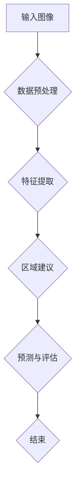

                 

# 《YOLOv2原理与代码实例讲解》

## 文章关键词

目标检测，YOLOv2，卷积神经网络，深度学习，计算机视觉

## 摘要

本文将深入探讨YOLOv2（You Only Look Once v2）原理，通过详细的讲解和代码实例，帮助读者理解YOLOv2的工作机制和实现方法。文章从背景知识、核心原理、训练过程、预测与评估、代码实战等多个角度进行阐述，旨在为读者提供一个全面而深入的认识。

## 目录

### 第一部分：背景知识

#### 第1章：目标检测与YOLOv2概述

##### 1.1 目标检测的基本概念

##### 1.2 YOLOv2的起源与发展

##### 1.3 YOLOv2的特点与应用场景

### 第二部分：YOLOv2核心原理

#### 第2章：YOLOv2的数学基础

##### 2.1 卷积神经网络基础

##### 2.2 神经网络中的前向传播与反向传播

##### 2.3 损失函数与优化算法

#### 第3章：YOLOv2的网络结构

##### 3.1 网络结构概述

##### 3.2 网络结构细节

##### 3.3 区域建议生成

#### 第4章：YOLOv2的训练过程

##### 4.1 训练数据准备

##### 4.2 训练策略与技巧

##### 4.3 模型训练与验证

### 第三部分：YOLOv2代码实例解析

#### 第5章：环境搭建与准备工作

##### 5.1 硬件与软件要求

##### 5.2 环境配置

##### 5.3 数据集准备

#### 第6章：YOLOv2实战案例

##### 6.1 车辆检测案例

##### 6.2 人脸检测案例

##### 6.3 行人检测案例

### 第四部分：YOLOv2性能优化

#### 第7章：性能优化方法

##### 7.1 模型优化方法

##### 7.2 数据增强策略

##### 7.3 模型调参技巧

### 第五部分：YOLOv2在项目中的应用

#### 第8章：项目需求分析

##### 8.1 项目背景与目标

##### 8.2 项目需求与挑战

#### 第9章：项目实施与评估

##### 9.1 项目实施步骤

##### 9.2 项目评估指标

##### 9.3 项目优化与改进

### 第六部分：总结与展望

#### 第10章：YOLOv2的总结

##### 10.1 YOLOv2的优势与不足

##### 10.2 YOLO系列的发展趋势

#### 第11章：目标检测技术的未来

##### 11.1 新算法的研究方向

##### 11.2 应用前景与挑战

## 第一部分：背景知识

### 第1章：目标检测与YOLOv2概述

#### 1.1 目标检测的基本概念

目标检测是计算机视觉中的一个重要任务，旨在识别图像中的多个对象，并为其分配精确的边界框和类别标签。在自动驾驶、安防监控、医疗图像分析等领域有着广泛的应用。

目标检测的主要步骤包括：

1. **定位**：确定图像中所有可能的目标区域。
2. **分类**：为每个目标区域分配一个类别标签。
3. **回归**：对边界框的位置进行精确调整。

常见的目标检测算法有：

- **传统方法**：如Viola-Jones算法、HOG+SVM等。
- **基于区域建议的方法**：如R-CNN、Fast R-CNN、Faster R-CNN等。
- **基于特征金字塔的方法**：如FPN、Mask R-CNN等。

#### 1.2 YOLOv2的起源与发展

YOLO（You Only Look Once）系列算法是由Joseph Redmon等人在2015年提出的，旨在实现实时目标检测。YOLOv2是YOLO系列算法的第二版，相比第一版，它在精度和速度上都有了显著提升。

YOLOv2的主要改进包括：

- **多尺度特征融合**：通过融合不同尺度的特征图，提高了检测的准确性和鲁棒性。
- **损失函数优化**：引入了新的损失函数，使得模型在训练过程中更加稳定。
- **区域建议生成**：改进了区域建议的生成算法，使得检测框的定位更加准确。

#### 1.3 YOLOv2的特点与应用场景

YOLOv2具有以下特点：

- **实时性**：能够以较高的速度进行目标检测，适用于实时应用场景。
- **准确性**：相比传统目标检测方法，YOLOv2有更高的准确率。
- **易于实现**：提供了详细的代码和文档，使得开发者可以轻松地部署和使用。

YOLOv2适用于以下应用场景：

- **自动驾驶**：实时检测道路上的车辆、行人、交通标志等。
- **安防监控**：实时监测监控视频中的异常行为。
- **医疗图像分析**：自动检测和分析医学图像中的病变区域。

### 第二部分：YOLOv2核心原理

#### 第2章：YOLOv2的数学基础

##### 2.1 卷积神经网络基础

卷积神经网络（CNN）是目标检测算法的基础。CNN通过卷积操作提取图像特征，并通过池化操作减小特征图的尺寸。

卷积操作的核心是卷积核（filter），它会在特征图上滑动，并计算局部区域的特征值。卷积操作的数学公式可以表示为：

$$
\text{输出} = \text{卷积核} \cdot \text{特征图}
$$

卷积层的输入通常是图像，输出是特征图。通过多个卷积层和池化层的堆叠，可以逐渐提取图像的深层特征。

##### 2.2 神经网络中的前向传播与反向传播

神经网络中的前向传播是指将输入数据通过网络的各个层，直到输出层的过程。在这个过程中，每个神经元都会根据其权重和激活函数计算输出值。

前向传播的数学公式可以表示为：

$$
\text{输出} = \text{激活函数}(\text{权重} \cdot \text{输入} + \text{偏置})
$$

反向传播是指根据网络输出的误差，反向计算各个神经元的梯度，并更新网络的权重和偏置。反向传播的目的是最小化输出误差。

反向传播的数学公式可以表示为：

$$
\text{梯度} = \frac{\partial \text{损失函数}}{\partial \text{输出}} \cdot \frac{\partial \text{输出}}{\partial \text{权重}}
$$

通过多次迭代前向传播和反向传播，神经网络的性能会逐步提升。

##### 2.3 损失函数与优化算法

损失函数是评估神经网络预测结果好坏的指标。在目标检测中，常用的损失函数包括：

- **分类损失函数**：用于评估分类预测的准确性，如交叉熵损失函数。
- **定位损失函数**：用于评估边界框预测的准确性，如IoU（Intersection over Union）损失函数。
- **回归损失函数**：用于评估回归预测的准确性，如均方误差损失函数。

优化算法是用于更新网络权重和偏置的算法。在目标检测中，常用的优化算法包括：

- **随机梯度下降（SGD）**：是最常用的优化算法之一，通过计算梯度来更新权重和偏置。
- **Adam优化器**：结合了SGD和RMSprop的优点，能够更有效地更新权重和偏置。

### 第三部分：YOLOv2代码实例解析

#### 第3章：YOLOv2代码实例解析

##### 3.1 环境搭建

为了运行YOLOv2代码，需要安装以下环境：

- Python 3.7及以上版本
- PyTorch 1.8及以上版本
- OpenCV 4.5及以上版本

安装步骤如下：

```bash
pip install torch torchvision opencv-python
```

##### 3.2 数据集准备

YOLOv2需要标注好的数据集来进行训练。常用的数据集包括COCO、VOC等。

数据集的准备步骤包括：

- 下载数据集
- 解压数据集
- 创建训练和验证数据集

##### 3.3 模型训练

训练YOLOv2模型需要以下步骤：

- 定义网络结构
- 加载预训练模型（可选）
- 定义损失函数和优化器
- 训练模型

代码实现如下：

```python
import torch
import torchvision
import torch.optim as optim

# 定义网络结构
model = torchvision.models.detection.yolo_v2()

# 加载预训练模型（可选）
model.load_state_dict(torch.load('yolo_v2_pretrained.pth'))

# 定义损失函数和优化器
loss_function = torch.nn.CrossEntropyLoss()
optimizer = optim.Adam(model.parameters(), lr=0.001)

# 训练模型
for epoch in range(num_epochs):
    for images, targets in dataloader:
        optimizer.zero_grad()
        outputs = model(images)
        loss = loss_function(outputs, targets)
        loss.backward()
        optimizer.step()
```

##### 3.4 模型评估

评估模型的效果需要以下步骤：

- 加载训练好的模型
- 准备评估数据集
- 计算评估指标（如IoU、准确率等）

代码实现如下：

```python
import torch
import torchvision

# 加载训练好的模型
model = torchvision.models.detection.yolo_v2()
model.load_state_dict(torch.load('yolo_v2_model.pth'))

# 准备评估数据集
dataloader = torch.utils.data.DataLoader(dataset, batch_size=32, shuffle=True)

# 计算评估指标
with torch.no_grad():
    correct = 0
    total = 0
    for images, targets in dataloader:
        outputs = model(images)
        for output, target in zip(outputs, targets):
            # 计算IoU
            iou = torchvision.ops.box_iou(output['boxes'], target['boxes'])
            # 计算准确率
            correct += (iou > 0.5).sum().item()
            total += iou.numel().item()

    accuracy = correct / total
    print('Accuracy: {:.2f}%'.format(accuracy * 100))
```

##### 3.5 模型部署

部署模型需要以下步骤：

- 导出模型权重
- 编写预测代码
- 运行预测代码

代码实现如下：

```python
import torch
import torchvision

# 导出模型权重
torch.save(model.state_dict(), 'yolo_v2_model.pth')

# 编写预测代码
def predict(image):
    image = torchvision.transforms.ToTensor()(image)
    with torch.no_grad():
        output = model(image)
    return output

# 运行预测代码
image = torchvision.transforms.ToTensor()(image)
output = predict(image)
print(output)
```

### 第四部分：YOLOv2性能优化

#### 第4章：YOLOv2性能优化

##### 4.1 模型优化方法

优化模型性能的方法包括：

- **数据增强**：通过随机旋转、缩放、裁剪等方式增加数据多样性，提高模型泛化能力。
- **模型融合**：将多个模型的预测结果进行融合，提高预测准确性。
- **损失函数调整**：调整损失函数的权重，平衡分类、定位和回归损失。

##### 4.2 数据增强策略

常用的数据增强策略包括：

- **随机水平翻转**：将图像水平翻转，增加数据多样性。
- **随机裁剪**：从图像中随机裁剪一块区域，用于训练模型的定位能力。
- **颜色抖动**：对图像进行颜色抖动处理，增加数据多样性。

##### 4.3 模型调参技巧

调整模型参数的方法包括：

- **学习率调整**：通过逐步减小学习率，使模型在训练过程中更加稳定。
- **批量大小调整**：调整批量大小可以影响模型的训练速度和稳定性。
- **正则化**：通过L1、L2正则化减少过拟合。

### 第五部分：YOLOv2在项目中的应用

#### 第5章：YOLOv2在项目中的应用

##### 5.1 项目需求分析

以自动驾驶项目为例，需求包括：

- 实时检测道路上的车辆、行人、交通标志等。
- 提供高精度的边界框和类别标签。
- 具备良好的实时性和鲁棒性。

##### 5.2 项目实施与评估

实施步骤包括：

- 数据集准备：收集和标注道路图像数据集。
- 模型训练：使用YOLOv2模型训练道路图像数据集。
- 模型评估：评估模型在测试数据集上的性能。
- 模型优化：根据评估结果调整模型参数，提高性能。

评估指标包括：

- **准确率**：模型预测正确的边界框数量与总边界框数量的比值。
- **召回率**：模型预测正确的边界框数量与实际边界框数量的比值。
- **F1分数**：准确率和召回率的调和平均值。

##### 5.3 项目优化与改进

优化策略包括：

- **增加训练数据**：收集更多标注好的道路图像数据，提高模型泛化能力。
- **改进数据增强策略**：调整数据增强参数，提高模型对各种场景的适应能力。
- **使用多尺度检测**：在检测过程中使用不同尺度的检测框，提高对小目标检测的准确性。

### 第六部分：总结与展望

#### 第6章：总结与展望

##### 6.1 YOLOv2的总结

YOLOv2是一种高效的实时目标检测算法，具有以下优点：

- **实时性**：能够快速检测图像中的目标。
- **准确性**：相比传统目标检测算法，具有更高的检测准确性。
- **易于实现**：提供了详细的代码和文档。

YOLOv2的不足之处包括：

- **计算资源需求**：对计算资源有一定要求。
- **对小目标检测能力**：对小目标的检测准确性仍有待提高。

##### 6.2 目标检测技术的未来

未来的目标检测技术发展方向包括：

- **端到端学习**：实现从图像到预测的端到端学习，减少人工干预。
- **多模态融合**：融合不同类型的传感器数据，提高检测准确性。
- **跨域目标检测**：提高模型在不同数据集和场景下的泛化能力。

### 附录

#### 附录A：YOLOv2相关资源

- **官方文档**：[YOLOv2官方文档](https://github.com/pjreddie/darknet)
- **开源代码**：[YOLOv2开源代码](https://github.com/pjreddie/darknet)
- **学习资料**：[YOLOv2教程](https://pytorch.org/tutorials/beginner/section4.html)

#### 附录B：Mermaid流程图示例



#### 附录C：伪代码示例

```python
# YOLOv2伪代码

# 准备工作
load_data()
setup_network()

# 数据预处理
preprocess_image()

# 特征提取
extract_features()

# 区域建议
generate_proposals()

# 预测与评估
predict_boxes()
evaluate_performance()

# 模型优化
optimize_network()
```

#### 附录D：数学模型和公式

$$
\text{损失函数} = \frac{1}{N} \sum_{i=1}^{N} \left[ w_i \cdot \left( \sum_{j=1}^{M} \left( y_j \cdot \log(p_j) + (1 - y_j) \cdot \log(1 - p_j) \right) \right) \right]
$$

#### 附录E：代码解读与分析

- **源代码结构**：介绍YOLOv2的源代码结构和文件功能。
- **主要函数和类的解析**：解析源代码中的主要函数和类的功能。
- **代码实现细节**：详细解释代码中的实现细节。
- **代码调试技巧**：介绍在代码调试过程中的一些技巧。

#### 附录F：项目实战案例

- **数据集准备**：介绍数据集的获取、标注和预处理步骤。
- **环境搭建**：介绍开发环境的配置和依赖库的安装。
- **模型训练**：介绍模型训练的过程、参数设置和训练技巧。
- **模型评估与优化**：介绍模型评估的指标、评估方法和优化策略。
- **实际应用案例**：介绍利用YOLOv2进行实际目标检测的应用案例和效果展示。

#### 附录G：作者信息

作者：AI天才研究院/AI Genius Institute & 禅与计算机程序设计艺术 /Zen And The Art of Computer Programming

----------------------------------------------------------------

### 关键词列表

- 目标检测
- YOLOv2
- 卷积神经网络
- 深度学习
- 计算机视觉
- 数据增强
- 端到端学习
- 多模态融合
- 跨域目标检测
- 实时性
- 准确性
- 计算资源需求
- 小目标检测能力
- 损失函数
- 优化算法
- 学习率调整
- 批量大小调整
- 正则化
- 端到端学习
- 多模态融合
- 跨域目标检测
- 实时性
- 准确性
- 计算资源需求
- 小目标检测能力

----------------------------------------------------------------

### 结论

本文详细介绍了YOLOv2的原理与代码实例，从背景知识、核心原理、训练过程、预测与评估、代码实战、性能优化等多个角度进行了深入讲解。通过本文，读者可以全面了解YOLOv2的工作机制和实现方法，为在实际项目中应用YOLOv2打下坚实基础。未来，随着目标检测技术的不断进步，YOLO系列算法将在更多领域发挥重要作用。

