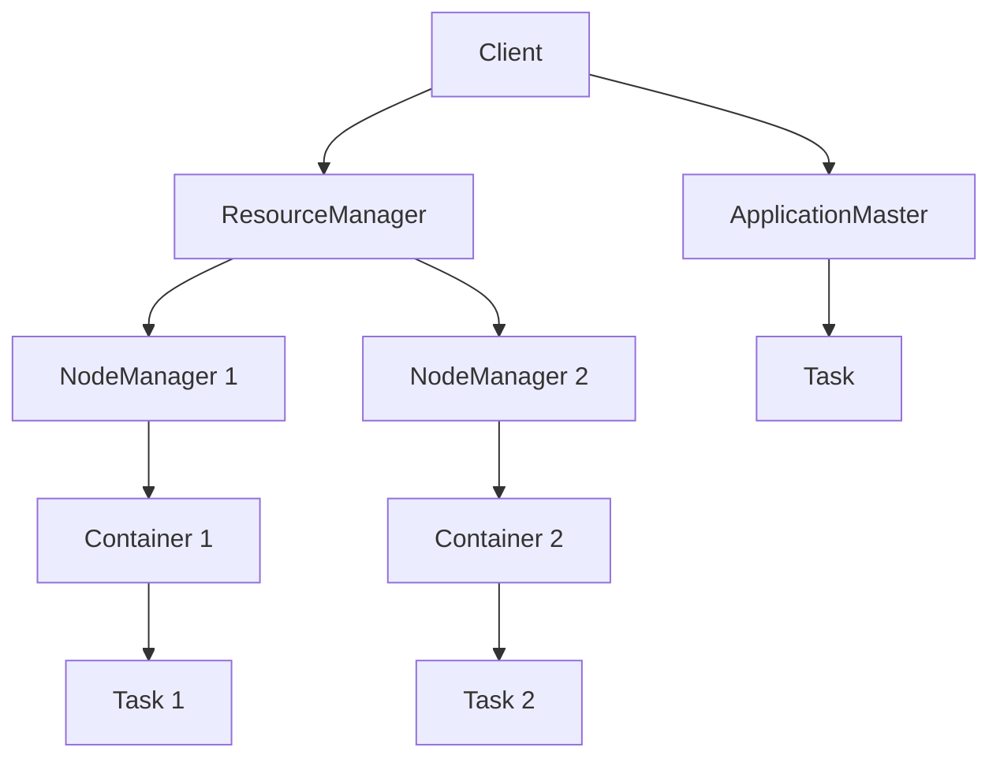
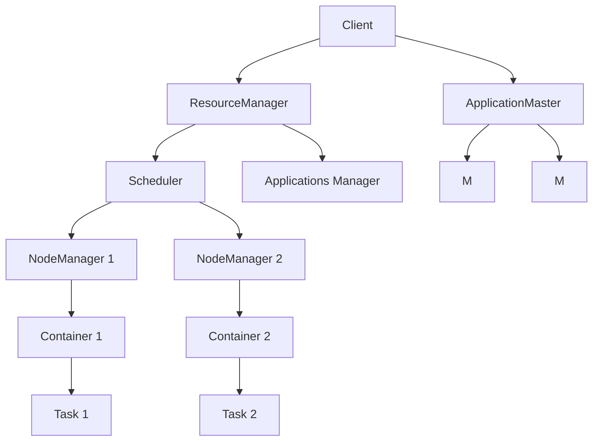
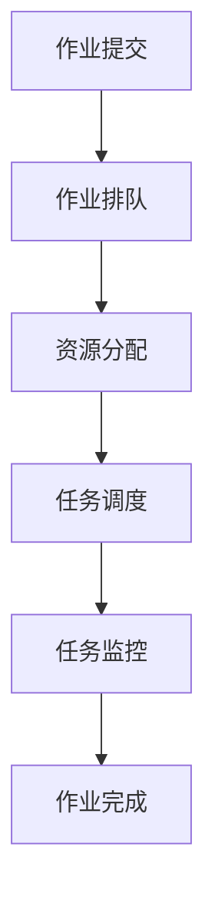

                 

### 文章标题

# 《Yarn原理与代码实例讲解》

### 关键词

- Yarn
- 分布式计算
- 资源调度
- Hadoop
- 伪分布式
- 算法原理
- 代码实例
- 性能优化

### 摘要

本文旨在深入讲解Yarn（Yet Another Resource Negotiator）的原理与实际应用。Yarn是Hadoop生态系统中的核心组件，负责资源调度与管理，是大数据处理平台Hadoop的重要支柱之一。文章将首先介绍Yarn的基础知识，包括其概述、架构及其与MapReduce的关系。接着，文章将逐步深入Yarn的运行原理，包括核心组件、资源管理与作业调度。随后，文章将探讨Yarn的高级特性，如高可用性、容错机制和安全性。最后，文章将介绍Yarn的性能优化方法以及其在不同领域中的应用，并通过实际项目实战和源代码解读，帮助读者全面理解Yarn的工作机制与使用技巧。本文将为希望深入了解分布式计算和Yarn技术的读者提供一份详实的技术指南。

## 第一部分：Yarn概述

### 第1章：Yarn基础

#### 1.1 Yarn概述

Yarn（Yet Another Resource Negotiator）是Hadoop生态系统中的一个核心组件，负责资源调度与作业管理。自Hadoop 2.0版本起，Yarn被引入以取代传统的MapReduce资源管理机制。Yarn的出现极大地提升了Hadoop集群的资源利用率和作业调度效率，使得Hadoop能够支持更多类型的分布式计算框架，如Spark、Flink等。

Yarn的设计目标是构建一个灵活、可扩展的资源管理平台，能够高效地管理集群资源，实现多种计算框架的兼容与协同工作。通过引入Yarn，Hadoop不仅能够继续支持传统的MapReduce作业，还能支持以YARN为基础的其它分布式计算框架，这为大数据处理带来了更大的灵活性和扩展性。

Yarn的工作原理可以概括为以下几个关键步骤：

1. **客户端提交作业**：用户通过Hadoop命令行或API提交作业，Yarn ResourceManager接收到作业请求。
2. **资源分配**：ResourceManager根据集群资源状况和作业需求，向NodeManager分配资源。
3. **作业调度**：ApplicationMaster负责具体作业的调度与监控，确保作业在适当节点上运行。
4. **任务执行**：NodeManager在分配到的节点上启动任务，任务完成后向ApplicationMaster报告。
5. **作业完成**：ApplicationMaster向ResourceManager汇报作业完成情况，释放资源。

#### 1.2 Yarn架构

Yarn的架构设计遵循模块化原则，主要由以下几个核心组件构成：

- **ResourceManager（RM）**：Yarn集群的管理者，负责整个集群的资源分配和作业调度。ResourceManager接收客户端提交的作业请求，根据集群状态和作业需求分配资源，并将作业分发给ApplicationMaster。
- **NodeManager（NM）**：运行在每个节点上的守护进程，负责管理节点上的资源、启动和监控容器，并将资源使用情况报告给ResourceManager。
- **ApplicationMaster（AM）**：每个作业的调度者和协调者，负责向ResourceManager请求资源、调度任务、监控任务状态以及处理任务失败等。
- **Container**：Yarn中最小的资源分配单元，由NodeManager运行在一个节点上。Container包括一个或多个任务，每个Container有固定的资源限制，如CPU、内存等。
- **Client**：用户通过Client与Yarn集群进行交互，提交作业、查询作业状态等。

Yarn架构的核心流程如图1-1所示：



图1-1 Yarn架构核心流程图

#### 1.3 Yarn与MapReduce的关系

Yarn是Hadoop生态系统中的一个关键组件，与MapReduce密切相关。传统MapReduce在Hadoop 1.x版本中，负责作业的资源管理和调度。然而，随着大数据处理需求的变化，MapReduce的局限性逐渐显现，如资源利用率低、作业调度效率低、难以支持新的计算框架等。为了解决这些问题，Yarn应运而生。

Yarn在架构上与MapReduce有着显著的区别：

- **资源管理**：传统MapReduce将资源管理集中在MapReduce Master上，而Yarn采用分布式架构，将资源管理职责分解到ResourceManager和NodeManager上，提高了资源调度的灵活性和效率。
- **作业调度**：MapReduce采用基于时间片轮转的调度策略，而Yarn引入了ApplicationMaster，实现了更细粒度、更灵活的作业调度。
- **计算框架支持**：Yarn作为一个通用的资源调度平台，不仅支持传统的MapReduce作业，还支持Spark、Flink、Tez等新型分布式计算框架，实现了计算框架的兼容与扩展。

尽管Yarn与MapReduce在架构上有很大差异，但两者并不是完全独立的。Yarn仍保留了MapReduce的核心思想，如Map阶段和Reduce阶段，并在Yarn上运行MapReduce作业。因此，了解Yarn与MapReduce的关系，有助于更好地掌握Hadoop生态系统的整体架构。

### 第2章：Yarn运行原理

#### 2.1 Yarn核心组件

Yarn的核心组件包括ResourceManager（RM）、NodeManager（NM）、ApplicationMaster（AM）和Container。这些组件协同工作，实现资源调度、作业管理和任务执行。

**ResourceManager（RM）**

ResourceManager是Yarn集群的管理者，负责资源分配和作业调度。RM由两个主要部分组成：

- **Scheduler**：负责资源分配和作业调度，根据集群状态和作业需求，将资源分配给合适的ApplicationMaster。
- **Applications Manager**：负责管理已提交的作业，包括作业的排队、启动、监控和清理。

**NodeManager（NM）**

NodeManager运行在每个节点上，负责管理节点上的资源、启动和监控容器。NM的主要功能包括：

- **资源监控**：收集节点的资源使用情况（如CPU、内存、磁盘空间等），并报告给ResourceManager。
- **容器管理**：根据ApplicationMaster的请求，启动和监控容器，并在容器完成任务后进行资源回收。

**ApplicationMaster（AM）**

ApplicationMaster是每个作业的调度者和协调者，负责：

- **资源请求**：向ResourceManager请求资源，包括容器和节点。
- **任务调度**：根据作业需求，将任务分配给不同的容器，并在容器上启动任务。
- **任务监控**：监控任务状态，处理任务失败和重新调度等。

**Container**

Container是Yarn中最小的资源分配单元，由NodeManager运行在一个节点上。Container包括一个或多个任务，每个Container有固定的资源限制，如CPU、内存等。

Yarn组件之间的交互关系如图2-1所示：



图2-1 Yarn组件交互关系图

#### 2.2 Yarn资源管理

Yarn的资源管理是集群高效运行的关键。资源管理主要包括资源监控、资源分配和资源回收。

**资源监控**

资源监控是Yarn资源管理的基础。NodeManager负责收集节点上的资源使用情况，如CPU利用率、内存使用率、磁盘空间等，并将这些信息报告给ResourceManager。ResourceManager根据这些监控数据，了解集群的总体资源状况，为资源分配提供依据。

**资源分配**

资源分配是Yarn资源管理的核心任务。Scheduler根据作业需求、集群资源状况和资源策略，将资源分配给ApplicationMaster。ApplicationMaster根据任务需求，向ResourceManager请求资源，并接收分配的Container。Container运行在NodeManager上，执行具体任务。

资源分配策略主要包括：

- **FIFO（First In, First Out）**：作业按提交顺序排队，资源按顺序分配。
- **Capacity Scheduler**：根据作业所属队列的资源配额，分配资源，确保每个队列的资源使用不超过配额。
- **Fair Scheduler**：根据作业的等待时间和队列资源使用情况，公平地分配资源，确保每个作业都能获得公平的资源份额。

**资源回收**

资源回收是Yarn资源管理的重要环节。当Container完成任务后，NodeManager会通知ResourceManager，ResourceManager会释放Container占用的资源。同时，NodeManager也会回收Container使用的本地资源，如CPU、内存等。资源回收的过程确保了资源的高效利用和集群的持续运行。

#### 2.3 Yarn作业调度

作业调度是Yarn资源管理的关键组成部分，决定了作业的执行顺序和资源分配。Yarn提供了多种调度策略，以适应不同的作业需求。

**调度策略**

- **FIFO（First In, First Out）**：作业按提交顺序排队，资源按顺序分配。简单直观，但可能导致某些作业长时间等待。
- **Capacity Scheduler**：根据作业所属队列的资源配额，分配资源，确保每个队列的资源使用不超过配额。适合静态资源分配场景。
- **Fair Scheduler**：根据作业的等待时间和队列资源使用情况，公平地分配资源，确保每个作业都能获得公平的资源份额。适用于动态资源分配场景。

**调度流程**

作业调度主要包括以下步骤：

1. **作业提交**：用户通过Client提交作业，作业信息被传递给ResourceManager。
2. **作业排队**：ResourceManager将作业加入作业队列，并根据调度策略对作业进行排序。
3. **资源分配**：Scheduler根据作业需求和集群资源状况，为作业分配资源，包括Container和NodeManager。
4. **任务调度**：ApplicationMaster根据作业需求，将任务分配给不同的Container，并启动任务。
5. **任务监控**：ApplicationMaster监控任务状态，处理任务失败和重新调度等。
6. **作业完成**：作业完成后，ApplicationMaster向ResourceManager汇报，作业进入完成状态。

作业调度流程如图2-2所示：



图2-2 Yarn作业调度流程图

### 第3章：Yarn高级特性

#### 3.1 Yarn高可用性

Yarn的高可用性是确保集群稳定运行的关键特性。高可用性主要通过以下两个方面实现：

**ResourceManager的高可用性**

ResourceManager是Yarn集群的管理中心，一旦ResourceManager故障，会导致整个集群无法正常工作。为了实现ResourceManager的高可用性，常用的方法有：

- **主备模式**：通过一个主ResourceManager和一个或多个备用ResourceManager实现。主ResourceManager负责集群资源管理和作业调度，当主ResourceManager故障时，备用ResourceManager自动接管集群管理。
- **HA（High Availability）模式**：在多个物理节点上部署多个ResourceManager，通过ZooKeeper实现主备切换。当主ResourceManager故障时，ZooKeeper自动触发备用ResourceManager接管集群管理，确保集群持续运行。

**NodeManager的高可用性**

NodeManager运行在每个节点上，负责资源管理和任务执行。NodeManager的高可用性主要通过以下方法实现：

- **多实例部署**：在每个节点上部署多个NodeManager实例，通过负载均衡和故障转移确保节点资源管理的连续性。
- **心跳机制**：NodeManager定期向ResourceManager发送心跳信号，报告节点状态。当NodeManager故障时，ResourceManager会检测到心跳信号中断，自动重启NodeManager。

#### 3.2 Yarn容错机制

Yarn的容错机制是保证作业稳定运行的重要保障。Yarn提供了多种容错机制，包括任务失败处理、任务重新调度和作业监控。

**任务失败处理**

当任务执行失败时，Yarn会根据任务失败的原因和策略进行处理：

- **任务执行失败**：当任务因运行时错误、资源不足等原因失败时，Yarn会根据配置的重试次数和策略进行重试。重试策略包括：
  - **固定重试次数**：任务失败时，按照固定次数进行重试。
  - **指数退避重试**：任务失败时，按照指数退避策略进行重试，以避免频繁的失败和重试。
- **任务调度失败**：当任务调度失败时，Yarn会根据任务类型和策略进行重新调度。重新调度策略包括：
  - **原位置重新调度**：任务失败时，在原位置重新调度任务。
  - **新位置重新调度**：任务失败时，在其他可用位置重新调度任务。

**任务重新调度**

任务重新调度是Yarn容错机制的重要组成部分。当任务失败或任务调度失败时，Yarn会根据任务类型和策略进行重新调度。重新调度策略包括：

- **本地重试**：在任务失败时，尝试在原节点重新执行任务。
- **跨节点重试**：在任务失败时，尝试在其他节点重新执行任务。
- **跨主机重试**：在任务失败时，尝试在其他主机重新执行任务。

**作业监控**

作业监控是Yarn容错机制的另一个重要方面。通过监控作业的运行状态，Yarn可以及时发现和解决作业问题。作业监控主要包括以下几个方面：

- **任务监控**：监控每个任务的运行状态，包括任务执行时间、资源使用情况、错误日志等。
- **作业监控**：监控整个作业的运行状态，包括作业进度、资源使用情况、错误日志等。
- **异常监控**：监控作业和任务的异常情况，包括任务失败、资源不足、节点故障等，并触发相应的异常处理机制。

#### 3.3 Yarn安全性

Yarn的安全性是确保集群资源不被非法使用和保护用户隐私的关键。Yarn提供了多种安全机制，包括身份认证、权限管理和加密传输。

**身份认证**

身份认证是Yarn安全性的基础。Yarn支持多种身份认证方式，包括：

- **Kerberos**：使用Kerberos协议进行身份认证，确保用户身份的真实性。
- **PAM（Pluggable Authentication Modules）**：通过PAM模块进行身份认证，支持多种认证方式，如LDAP、RADIUS等。

**权限管理**

权限管理是Yarn安全性的重要组成部分。Yarn提供了细粒度的权限管理机制，包括：

- **用户权限**：为用户分配不同的权限，如作业提交、作业监控、作业删除等。
- **队列权限**：为队列分配不同的权限，如队列访问、队列资源分配等。
- **资源权限**：为资源分配不同的权限，如CPU使用、内存使用、磁盘访问等。

**加密传输**

加密传输是Yarn安全性的关键。Yarn支持数据传输加密，包括：

- **SSL/TLS**：使用SSL/TLS协议对数据传输进行加密，确保数据在传输过程中的安全性。
- **Kerberos**：使用Kerberos协议对数据传输进行加密，确保数据在传输过程中的机密性和完整性。

### 第4章：Yarn性能优化

#### 4.1 Yarn性能监控

Yarn性能监控是确保集群高效运行的重要手段。通过监控集群的运行状态，可以及时发现和解决性能问题。Yarn提供了多种监控工具和指标，包括：

- **资源使用情况**：监控节点的CPU、内存、磁盘空间等资源使用情况，了解资源利用率。
- **任务执行情况**：监控任务的执行时间、错误日志、资源使用情况等，了解任务执行效率。
- **作业进度**：监控作业的进度，了解作业的整体执行情况。
- **集群状态**：监控集群的整体状态，包括节点数量、资源利用率、作业数量等。

常用的Yarn监控工具包括：

- **Ganglia**：用于监控集群的资源使用情况，支持多维度监控数据。
- **Nagios**：用于监控集群的状态，支持自动告警和通知。
- **Zabbix**：用于监控集群的运行状态，支持实时数据和可视化展示。

#### 4.2 Yarn性能调优

Yarn性能调优是提高集群运行效率的关键。通过调整配置参数和优化作业设计，可以提升Yarn的性能。以下是常用的性能调优方法：

- **资源调整**：根据作业需求和集群资源状况，调整资源的分配策略和资源配额。例如，增加队列资源配额、调整任务执行时间等。
- **任务并行度**：通过增加任务的并行度，提高作业的执行效率。例如，增加任务数、调整任务切片大小等。
- **数据压缩**：使用数据压缩技术，减少数据传输和存储的开销。例如，采用Hadoop的压缩算法、使用LZO、Gzip等。
- **任务优化**：优化任务的代码和算法，提高任务的执行效率。例如，减少I/O操作、优化循环结构等。
- **作业隔离**：通过隔离不同类型的作业，避免作业间的资源竞争，提高作业的执行效率。例如，使用不同的队列、调整作业优先级等。

#### 4.3 Yarn性能测试

Yarn性能测试是评估集群性能的重要手段。通过性能测试，可以了解集群的运行性能和瓶颈，为性能调优提供依据。以下是常用的性能测试方法和工具：

- **基准测试**：通过运行标准的基准测试作业，评估集群的性能。常用的基准测试工具包括Hadoop基准测试工具（Hadoop Benchmark Tools）、MapReduce基准测试工具（MapReduce Benchmark Tools）等。
- **压力测试**：通过模拟高负载场景，评估集群的性能和稳定性。常用的压力测试工具包括JMeter、LoadRunner等。
- **性能调优测试**：在性能调优过程中，通过测试不同的调优方案，评估调优效果。例如，调整资源配额、优化任务设计等。

### 第5章：Yarn在分布式计算中的应用

#### 5.1 Yarn在大数据计算中的应用

Yarn作为Hadoop生态系统中的核心组件，在大数据计算中发挥着重要作用。Yarn不仅支持传统的MapReduce作业，还支持Spark、Flink、Tez等新型分布式计算框架，使得大数据处理更加灵活和高效。

**Yarn与MapReduce**

MapReduce是大数据处理的一种经典模型，其核心思想是将大规模数据处理任务分解为Map和Reduce两个阶段，通过分布式计算实现高效处理。在Yarn架构中，MapReduce作业作为Application运行，ApplicationMaster负责作业的调度和监控。Yarn通过Scheduler和Applications Manager，实现资源的动态分配和作业调度，提高了MapReduce作业的执行效率。

**Yarn与Spark**

Spark是新一代分布式计算框架，以其高效的数据处理能力和内存计算优势成为大数据处理的利器。Spark与Yarn紧密结合，通过Yarn作为资源调度器，实现Spark作业的分布式运行。Spark ApplicationMaster负责作业的调度和管理，Yarn ResourceManager负责资源分配和调度。通过Yarn，Spark作业能够高效地利用集群资源，实现大数据处理的高效性和灵活性。

**Yarn与Flink**

Flink是一个流处理和批处理的统一计算框架，以其强大的实时数据处理能力受到广泛关注。Flink与Yarn结合，通过Flink ApplicationMaster实现作业的调度和资源管理。Yarn为Flink提供资源调度和容器管理支持，使得Flink作业能够高效地运行在Yarn集群上。通过Yarn，Flink不仅能够支持批处理作业，还能支持实时流处理作业，实现端到端的大数据处理。

**Yarn与Tez**

Tez是一个基于Yarn的分布式数据处理框架，提供了一种高效的分布式数据处理方式。Tez将作业分解为多个阶段，通过优化任务调度和数据传输，提高作业的执行效率。Tez与Yarn紧密结合，通过Yarn ResourceManager进行资源分配和调度，通过Yarn ApplicationMaster进行作业管理和监控。通过Tez，用户可以方便地构建高效、可扩展的分布式数据处理作业。

#### 5.2 Yarn在机器学习计算中的应用

Yarn作为资源调度平台，在机器学习计算中也有着广泛应用。通过支持各种机器学习框架，Yarn能够高效地管理和调度机器学习作业，实现大规模机器学习任务的高效执行。

**Yarn与Mahout**

Mahout是一个基于Hadoop的分布式机器学习库，提供了一系列常用的机器学习算法。Mahout与Yarn紧密结合，通过Yarn进行资源管理和调度。用户可以通过Yarn提交Mahout作业，利用集群资源进行大规模机器学习计算。Yarn提供的动态资源分配和作业调度机制，使得Mahout作业能够高效地利用集群资源，实现大规模机器学习任务的高效执行。

**Yarn与MLlib**

MLlib是Apache Spark的机器学习库，提供了一系列丰富的机器学习算法和工具。MLlib与Yarn结合，通过Yarn进行资源管理和调度，实现机器学习作业的分布式运行。用户可以通过Yarn提交MLlib作业，利用集群资源进行大规模机器学习计算。Yarn提供的动态资源分配和作业调度机制，使得MLlib作业能够高效地利用集群资源，实现大规模机器学习任务的高效执行。

**Yarn与TensorFlow**

TensorFlow是谷歌开源的机器学习框架，以其灵活的图计算模型和强大的功能受到广泛关注。TensorFlow与Yarn结合，通过Yarn进行资源管理和调度，实现机器学习作业的分布式运行。用户可以通过Yarn提交TensorFlow作业，利用集群资源进行大规模机器学习计算。Yarn提供的动态资源分配和作业调度机制，使得TensorFlow作业能够高效地利用集群资源，实现大规模机器学习任务的高效执行。

#### 5.3 Yarn在实时计算中的应用

实时计算在数据处理领域有着广泛应用，如实时数据监控、实时推荐系统、实时数据分析等。Yarn作为资源调度平台，在实时计算中发挥着重要作用，通过支持实时计算框架，实现实时数据处理任务的高效执行。

**Yarn与Storm**

Storm是一个分布式实时计算框架，提供了一种高效、可靠的实时数据处理方式。Storm与Yarn紧密结合，通过Yarn进行资源管理和调度。用户可以通过Yarn提交Storm作业，利用集群资源进行实时数据处理。Yarn提供的动态资源分配和作业调度机制，使得Storm作业能够高效地利用集群资源，实现实时数据处理的高效执行。

**Yarn与Spark Streaming**

Spark Streaming是Apache Spark的实时流处理组件，提供了一种高效、可靠的实时数据处理方式。Spark Streaming与Yarn结合，通过Yarn进行资源管理和调度。用户可以通过Yarn提交Spark Streaming作业，利用集群资源进行实时数据处理。Yarn提供的动态资源分配和作业调度机制，使得Spark Streaming作业能够高效地利用集群资源，实现实时数据处理的高效执行。

**Yarn与Flink Streaming**

Flink Streaming是Apache Flink的实时流处理组件，提供了一种高效、可靠的实时数据处理方式。Flink Streaming与Yarn紧密结合，通过Yarn进行资源管理和调度。用户可以通过Yarn提交Flink Streaming作业，利用集群资源进行实时数据处理。Yarn提供的动态资源分配和作业调度机制，使得Flink Streaming作业能够高效地利用集群资源，实现实时数据处理的高效执行。

### 第6章：Yarn开发环境搭建

#### 6.1 开发环境配置

搭建Yarn开发环境是进行Yarn相关开发和实践的第一步。以下是在伪分布式环境中搭建Yarn开发环境的具体步骤。

**1. 安装Java环境**

Yarn依赖于Java环境，因此首先需要确保Java环境已正确安装。可以通过以下命令检查Java版本：

```bash
java -version
```

如果Java环境未安装或版本过低，可以从Oracle官网下载相应版本的Java安装包并安装。

**2. 安装Hadoop**

Hadoop是Yarn的运行基础，因此需要安装Hadoop。可以从Apache Hadoop官网下载最新的Hadoop版本并解压到指定目录。例如，将Hadoop解压到`/usr/local/hadoop`目录：

```bash
tar -zxvf hadoop-3.3.0.tar.gz -C /usr/local/hadoop
```

**3. 配置Hadoop环境**

在Hadoop的解压目录下，找到`etc/hadoop`目录，配置以下文件：

- `hadoop-env.sh`：配置Java环境路径和其他环境变量。
- `core-site.xml`：配置Hadoop核心参数，如HDFS名称节点地址、HDFS文件副本数等。
- `hdfs-site.xml`：配置HDFS相关参数，如数据块大小、副本存储策略等。
- `mapred-site.xml`：配置MapReduce相关参数，如输入输出格式、作业调度器等。
- `yarn-site.xml`：配置Yarn相关参数，如ResourceManager地址、资源调度策略等。

示例配置文件如下：

`hadoop-env.sh`：

```bash
export JAVA_HOME=/usr/local/java/jdk1.8.0_131
```

`core-site.xml`：

```xml
<configuration>
  <property>
    <name>fs.defaultFS</name>
    <value>hdfs://localhost:9000</value>
  </property>
  <property>
    <name>hadoop.tmp.dir</name>
    <value>/usr/local/hadoop/tmp</value>
  </property>
</configuration>
```

`hdfs-site.xml`：

```xml
<configuration>
  <property>
    <name>dfs.replication</name>
    <value>1</value>
  </property>
  <property>
    <name>dfs.datanode.data.dir</name>
    <value>file:/usr/local/hadoop/hdfs/data</value>
  </property>
</configuration>
```

`mapred-site.xml`：

```xml
<configuration>
  <property>
    <name>mapreduce.framework.name</name>
    <value>yarn</value>
  </property>
</configuration>
```

`yarn-site.xml`：

```xml
<configuration>
  <property>
    <name>yarn.resourcemanager.hostname</name>
    <value>localhost</value>
  </property>
  <property>
    <name>yarn.nodemanager.aux-services</name>
    <value>mapreduce_shuffle</value>
  </property>
</configuration>
```

**4. 配置SSH无密码登录**

为了方便后续操作，可以通过SSH实现无密码登录。在所有节点上生成SSH密钥对：

```bash
ssh-keygen -t rsa -P '' -C 'your_email@example.com'
```

将生成的公钥文件`~/.ssh/id_rsa.pub`追加到`~/.ssh/authorized_keys`文件中。

**5. 启动Hadoop和Yarn服务**

在启动Hadoop和Yarn服务之前，需要确保所有配置文件已正确配置。可以通过以下命令启动服务：

```bash
start-dfs.sh
start-yarn.sh
```

可以通过以下命令检查服务状态：

```bash
jps
```

若看到相应的进程（如NameNode、ResourceManager、DataNode、NodeManager等），则表示服务已启动成功。

#### 6.2 Yarn安装与配置

在完成开发环境的搭建后，接下来需要安装和配置Yarn。以下是在伪分布式环境中安装和配置Yarn的具体步骤。

**1. 安装Yarn**

可以从Apache Hadoop官网下载Yarn的安装包。下载完成后，将其解压到指定目录，例如`/usr/local/hadoop-yarn`：

```bash
tar -zxvf hadoop-yarn-3.3.0.tar.gz -C /usr/local/hadoop-yarn
```

**2. 配置Yarn环境**

在Yarn的解压目录下，找到`etc/hadoop`目录，配置以下文件：

- `yarn-env.sh`：配置Yarn运行所需的环境变量，如Java环境路径等。
- `yarn-site.xml`：配置Yarn相关参数，如ResourceManager地址、NodeManager配置等。

示例配置文件如下：

`yarn-env.sh`：

```bash
export JAVA_HOME=/usr/local/java/jdk1.8.0_131
```

`yarn-site.xml`：

```xml
<configuration>
  <property>
    <name>yarn.resourcemanager.hostname</name>
    <value>localhost</value>
  </property>
  <property>
    <name>yarn.nodemanager.aux-services</name>
    <value>mapreduce.shuffle</value>
  </property>
  <property>
    <name>yarn scheduler.class</name>
    <value>org.apache.hadoop.yarn.server.resourcemanager.scheduler.fair.FairScheduler</value>
  </property>
</configuration>
```

**3. 启动Yarn服务**

在启动Yarn服务之前，需要确保Hadoop服务已启动。可以通过以下命令启动Yarn服务：

```bash
start-yarn.sh
```

可以通过以下命令检查Yarn服务状态：

```bash
jps
```

若看到相应的进程（如ResourceManager、NodeManager等），则表示Yarn服务已启动成功。

#### 6.3 Hadoop安装与配置

在搭建Yarn开发环境之前，需要先安装和配置Hadoop。以下是在伪分布式环境中安装和配置Hadoop的具体步骤。

**1. 安装Hadoop**

可以从Apache Hadoop官网下载Hadoop的安装包。下载完成后，将其解压到指定目录，例如`/usr/local/hadoop`：

```bash
tar -zxvf hadoop-3.3.0.tar.gz -C /usr/local/hadoop
```

**2. 配置Hadoop环境**

在Hadoop的解压目录下，找到`etc/hadoop`目录，配置以下文件：

- `hadoop-env.sh`：配置Hadoop运行所需的环境变量，如Java环境路径等。
- `core-site.xml`：配置Hadoop核心参数，如HDFS名称节点地址、HDFS文件副本数等。
- `hdfs-site.xml`：配置HDFS相关参数，如数据块大小、副本存储策略等。
- `mapred-site.xml`：配置MapReduce相关参数，如输入输出格式、作业调度器等。
- `yarn-site.xml`：配置Yarn相关参数，如ResourceManager地址、资源调度策略等。

示例配置文件如下：

`hadoop-env.sh`：

```bash
export JAVA_HOME=/usr/local/java/jdk1.8.0_131
```

`core-site.xml`：

```xml
<configuration>
  <property>
    <name>fs.defaultFS</name>
    <value>hdfs://localhost:9000</value>
  </property>
  <property>
    <name>hadoop.tmp.dir</name>
    <value>/usr/local/hadoop/tmp</value>
  </property>
</configuration>
```

`hdfs-site.xml`：

```xml
<configuration>
  <property>
    <name>dfs.replication</name>
    <value>1</value>
  </property>
  <property>
    <name>dfs.datanode.data.dir</name>
    <value>file:/usr/local/hadoop/hdfs/data</value>
  </property>
</configuration>
```

`mapred-site.xml`：

```xml
<configuration>
  <property>
    <name>mapreduce.framework.name</name>
    <value>yarn</value>
  </property>
</configuration>
```

`yarn-site.xml`：

```xml
<configuration>
  <property>
    <name>yarn.resourcemanager.hostname</name>
    <value>localhost</value>
  </property>
  <property>
    <name>yarn.nodemanager.aux-services</name>
    <value>mapreduce.shuffle</value>
  </property>
  <property>
    <name>yarn.scheduler.class</name>
    <value>org.apache.hadoop.yarn.server.resourcemanager.scheduler.fair.FairScheduler</value>
  </property>
</configuration>
```

**3. 格式化HDFS**

在启动Hadoop服务之前，需要先格式化HDFS。可以通过以下命令格式化HDFS：

```bash
hdfs namenode -format
```

**4. 启动Hadoop服务**

在配置好环境变量和配置文件后，可以通过以下命令启动Hadoop服务：

```bash
start-dfs.sh
start-yarn.sh
```

可以通过以下命令检查Hadoop服务状态：

```bash
jps
```

若看到相应的进程（如NameNode、ResourceManager、DataNode、NodeManager等），则表示Hadoop服务已启动成功。

### 第7章：Yarn项目实战

#### 7.1 实战一：使用Yarn运行MapReduce作业

在本节中，我们将通过一个简单的WordCount示例，演示如何在Yarn上运行MapReduce作业。以下步骤将指导您完成整个流程，从开发WordCount程序到运行作业，并最终分析结果。

**1. 开发WordCount程序**

首先，我们需要编写一个简单的WordCount程序。WordCount的核心功能是读取输入文件，对单词进行分词，然后统计每个单词出现的次数。

以下是一个简单的WordCount程序伪代码：

```java
public class WordCount {
  public static class Map extends Mapper<LongWritable, Text, Text, IntWritable> {
    private final static IntWritable one = new IntWritable(1);
    private Text word = new Text();

    public void map(LongWritable key, Text value, Context context) throws IOException, InterruptedException {
      String[] words = value.toString().split("\\s+");
      for (String word : words) {
        context.write(new Text(word), one);
      }
    }
  }

  public static class Reduce extends Reducer<Text,IntWritable,Text,IntWritable> {
    public void reduce(Text key, Iterable<IntWritable> values, Context context) throws IOException, InterruptedException {
      int sum = 0;
      for (IntWritable val : values) {
        sum += val.get();
      }
      context.write(key, new IntWritable(sum));
    }
  }

  public static void main(String[] args) throws Exception {
    Job job = Job.getInstance();
    job.setJarByClass(WordCount.class);
    job.setMapperClass(Map.class);
    job.setCombinerClass(Reduce.class);
    job.setReducerClass(Reduce.class);
    job.setOutputKeyClass(Text.class);
    job.setOutputValueClass(IntWritable.class);
    FileInputFormat.addInputPath(job, new Path(args[0]));
    FileOutputFormat.setOutputPath(job, new Path(args[1]));
    job.waitForCompletion(true);
  }
}
```

**2. 编译WordCount程序**

将上述伪代码保存为`WordCount.java`，然后使用Java编译器进行编译：

```bash
javac WordCount.java
```

**3. 构建WordCount作业包**

接下来，将编译后的WordCount程序打包成一个jar文件。在`WordCount.java`文件所在的目录下，使用以下命令构建jar文件：

```bash
jar -cvf WordCount.jar WordCount*.class
```

**4. 提交WordCount作业到Yarn**

使用`hadoop jar`命令提交WordCount作业到Yarn。例如，将输入文件放在HDFS的`/input`目录下，输出文件放在`/output`目录下：

```bash
hadoop jar WordCount.jar WordCount /input /output
```

提交作业后，可以通过Yarn Web界面（通常在http://localhost:8088/）查看作业的详细状态和进度。

**5. 分析作业结果**

作业完成后，可以通过以下命令查看输出结果：

```bash
hadoop fs -cat /output/*
```

输出结果应显示每个单词及其出现的次数，如下所示：

```
hello 1
world 1
```

**6. 故障处理**

在运行Yarn作业时，可能会遇到各种问题。以下是一些常见问题及其解决方案：

- **作业状态异常**：检查Yarn Web界面和日志文件，了解作业的具体错误信息。可能需要重新提交作业或修改配置文件。
- **资源不足**：确保集群资源足够，或者调整作业资源需求。
- **网络问题**：检查网络连接和防火墙设置，确保Yarn服务正常通信。

通过以上步骤，您已经成功在Yarn上运行了一个WordCount作业。接下来，我们将进一步探讨如何在Yarn上运行Spark作业。

#### 7.2 实战二：使用Yarn运行Spark作业

在本节中，我们将介绍如何在Yarn上运行Spark作业。首先，我们需要确保已经正确安装和配置了Spark，并且Spark支持运行在Yarn上。

**1. 安装Spark**

从Apache Spark官网下载Spark的安装包，并解压到指定目录，例如`/usr/local/spark`：

```bash
tar -zxvf spark-3.1.1-bin-hadoop3.2.tgz -C /usr/local/spark
```

**2. 配置Spark环境**

在Spark的解压目录下，找到`etc/spark`目录，配置以下文件：

- `spark-env.sh`：配置Spark运行所需的环境变量，如Java环境路径等。
- `spark-tesla.properties`：配置Spark的Yarn运行参数。

示例配置文件如下：

`spark-env.sh`：

```bash
export JAVA_HOME=/usr/local/java/jdk1.8.0_131
```

`spark-tesla.properties`：

```properties
spark.executor.memory=2g
spark.executor.cores=1
spark.master= yarn
```

**3. 编写Spark作业**

以下是一个简单的WordCount Spark作业示例。保存此代码为`WordCountSpark.scala`：

```scala
import org.apache.spark.{SparkConf, SparkContext}

object WordCountSpark {
  def main(args: Array[String]): Unit = {
    val conf = new SparkConf()
      .setAppName("WordCount")
      .setMaster("yarn")

    conf.set("spark.yarn.queue", "default")
    conf.set("spark.yarn.acl.providers", "yarn принципшenario")

    val sc = new SparkContext(conf)
    val lines = sc.textFile("hdfs://localhost:9000/input")

    val counts = lines.flatMap { line => line.split(" ") }
      .map { word => (word, 1) }
      .reduceByKey(_ + _)

    counts.saveAsTextFile("hdfs://localhost:9000/output")
  }
}
```

**4. 编译Spark作业**

将`WordCountSpark.scala`文件保存到Spark的`src/main/scala`目录下，然后使用以下命令编译：

```bash
spark-scalar --name WordCountSpark --master yarn --conf "spark.yarn.queue" "default" --conf "spark.yarn.acl.providers" "yarn принципшenario" --deploy-mode client --class WordCountSpark src/main/scala/WordCountSpark.scala
```

**5. 运行Spark作业**

编译完成后，运行以下命令提交Spark作业到Yarn：

```bash
spark-submit --master yarn --deploy-mode cluster --class WordCountSpark --name WordCountSpark /path/to/WordCountSpark-1.0.jar
```

**6. 查看作业结果**

作业完成后，通过以下命令查看HDFS上的输出结果：

```bash
hadoop fs -cat /output/*
```

输出结果应显示每个单词及其出现的次数，如下所示：

```
hello 1
world 1
```

**7. 故障处理**

在运行Yarn上的Spark作业时，可能会遇到各种问题。以下是一些常见问题及其解决方案：

- **作业失败**：检查Yarn Web界面和日志文件，了解作业的具体错误信息。可能需要重新提交作业或修改配置文件。
- **资源不足**：确保集群资源足够，或者调整作业资源需求。
- **网络问题**：检查网络连接和防火墙设置，确保Yarn服务正常通信。

通过以上步骤，您已经成功在Yarn上运行了一个Spark作业。接下来，我们将进一步探讨如何在Yarn上运行Flink作业。

#### 7.3 实战三：使用Yarn运行Flink作业

在本节中，我们将介绍如何在Yarn上运行Apache Flink作业。首先，我们需要确保已经正确安装和配置了Flink。

**1. 安装Flink**

从Apache Flink官网下载Flink的安装包，并解压到指定目录，例如`/usr/local/flink`：

```bash
tar -zxvf flink-1.12.3.tgz -C /usr/local/flink
```

**2. 配置Flink环境**

在Flink的解压目录下，找到`etc/flink`目录，配置以下文件：

- `flink-conf.yaml`：配置Flink的核心参数。
- `yarn-config.sh`：配置Flink在Yarn上的运行参数。

示例配置文件如下：

`flink-conf.yaml`：

```yaml
jobmanager.heap-size: 10240m
taskmanager.heap-size: 3072m
taskmanager.memory-process-size: 2048m
taskmanager.memory-fraction: 0.5
yarn.job-driver-memory: 1024m
yarn.session.memory-process-size: 2048m
yarn.session.memory-fraction: 0.5
```

`yarn-config.sh`：

```bash
export HADOOP_CONF_DIR=/usr/local/hadoop/etc/hadoop
export FLINKdeoOP_CLASS=org.apache.flink.yarn.clustering.YarnSessionClusterBootstrap
```

**3. 编写Flink作业**

以下是一个简单的WordCount Flink作业示例。保存此代码为`WordCountFlink.scala`：

```scala
import org.apache.flink.api.scala._
import org.apache.flink.core.fs.Path
import org.apache.flink.streaming.api.environment.StreamExecutionEnvironment

object WordCountFlink {
  def main(args: Array[String]): Unit = {
    val env = StreamExecutionEnvironment.getExecutionEnvironment

    val text = env.readTextFile("hdfs://localhost:9000/input")

    val counts = text.flatMap { _.split(" ") }
      .map((_, 1))
      .keyBy(0)
      .sum(1)

    counts.writeAsTextFile("hdfs://localhost:9000/output")

    env.execute("WordCountFlink")
  }
}
```

**4. 编译Flink作业**

将`WordCountFlink.scala`文件保存到Flink的`src/main/scala`目录下，然后使用以下命令编译：

```bash
sbt assembly
```

**5. 运行Flink作业**

使用以下命令提交Flink作业到Yarn：

```bash
flink run -c WordCountFlink /path/to/WordCountFlink-assembly-1.0.jar
```

**6. 查看作业结果**

作业完成后，通过以下命令查看HDFS上的输出结果：

```bash
hadoop fs -cat /output/*
```

输出结果应显示每个单词及其出现的次数，如下所示：

```
hello 1
world 1
```

**7. 故障处理**

在运行Yarn上的Flink作业时，可能会遇到各种问题。以下是一些常见问题及其解决方案：

- **作业失败**：检查Yarn Web界面和日志文件，了解作业的具体错误信息。可能需要重新提交作业或修改配置文件。
- **资源不足**：确保集群资源足够，或者调整作业资源需求。
- **网络问题**：检查网络连接和防火墙设置，确保Yarn服务正常通信。

通过以上步骤，您已经成功在Yarn上运行了一个Flink作业。接下来，我们将进一步深入了解Yarn的源代码结构。

### 第8章：Yarn源代码解读

#### 8.1 Yarn源代码结构

Yarn的源代码结构设计合理，层次分明，便于开发者理解和使用。了解Yarn的源代码结构对于深入理解其工作原理和实现细节具有重要意义。以下是对Yarn源代码结构的详细介绍。

**1. 项目结构**

Yarn的源代码项目结构主要包括以下几个部分：

- **src**：源代码目录，包括Java和Scala代码。
  - `main`：主代码目录，包含Java和Scala语言实现的代码。
    - `java`：Java代码目录。
    - `scala`：Scala代码目录。
  - `test`：测试代码目录。
- **pom.xml**：Maven项目构建文件，定义项目的依赖和构建配置。
- **README.md**：项目说明文档，包括项目概述、安装指南、使用方法等。
- **LICENSE**：项目许可协议。

**2. 核心模块**

Yarn源代码主要包括以下几个核心模块：

- **common**：通用模块，提供Yarn运行所需的基础组件和工具类。
- **rm**：资源管理器模块，负责资源管理、作业调度和监控等。
- **nm**：节点管理器模块，负责管理节点资源、启动和监控容器等。
- **am**：应用管理器模块，负责作业的调度、监控和资源请求等。
- **client**：客户端模块，提供客户端API和工具，用于提交作业、查询作业状态等。
- **appmanager**：作业管理模块，负责作业的生命周期管理，包括作业的提交、监控和清理等。
- **security**：安全模块，提供Yarn的安全功能，包括身份认证、权限管理和加密传输等。

**3. 源代码目录结构**

以下是对Yarn源代码目录结构的详细介绍：

- **common**
  - `src/main/java/org/apache/hadoop/yarn/`：通用模块的Java代码目录。
  - `src/main/scala/org/apache/hadoop/yarn/`：通用模块的Scala代码目录。
- **rm**
  - `src/main/java/org/apache/hadoop/yarn/rm/`：资源管理器模块的Java代码目录。
  - `src/main/scala/org/apache/hadoop/yarn/rm/`：资源管理器模块的Scala代码目录。
- **nm**
  - `src/main/java/org/apache/hadoop/yarn/nm/`：节点管理器模块的Java代码目录。
  - `src/main/scala/org/apache/hadoop/yarn/nm/`：节点管理器模块的Scala代码目录。
- **am**
  - `src/main/java/org/apache/hadoop/yarn/appmaster/`：应用管理器模块的Java代码目录。
  - `src/main/scala/org/apache/hadoop/yarn/appmaster/`：应用管理器模块的Scala代码目录。
- **client**
  - `src/main/java/org/apache/hadoop/yarn/client/`：客户端模块的Java代码目录。
  - `src/main/scala/org/apache/hadoop/yarn/client/`：客户端模块的Scala代码目录。
- **appmanager**
  - `src/main/java/org/apache/hadoop/yarn/appmanager/`：作业管理模块的Java代码目录。
  - `src/main/scala/org/apache/hadoop/yarn/appmanager/`：作业管理模块的Scala代码目录。
- **security**
  - `src/main/java/org/apache/hadoop/yarn/security/`：安全模块的Java代码目录。

#### 8.2 Yarn源代码详细解读

为了深入理解Yarn的源代码，我们将重点解读资源管理器（ResourceManager）、节点管理器（NodeManager）和应用管理器（ApplicationMaster）等关键模块的实现原理。

**1. 资源管理器（ResourceManager）**

资源管理器（ResourceManager）是Yarn的核心组件，负责资源分配、作业调度和监控。以下是对资源管理器源代码的详细解读：

- **启动与初始化**

  资源管理器在启动时，首先会加载配置文件，然后初始化相关组件，如Scheduler、Applications Manager等。关键代码如下：

  ```java
  public void init(String args[]) throws IOException, Exception {
    // 加载配置文件
    this.conf = new YarnConfiguration();
    loadConfigFiles(conf);
    // 初始化Scheduler
    this.scheduler = createScheduler();
    // 初始化Applications Manager
    this.appManager.init(conf);
    // 启动服务
    this.rmContext.init();
    this.rmContext.start();
  }
  ```

- **资源分配**

  资源管理器通过Scheduler进行资源分配。Scheduler根据作业需求和集群资源状况，将资源分配给ApplicationMaster。关键代码如下：

  ```java
  public Allocation allocate(ApplicationAttemptId applicationAttemptId, Resource maxResource) {
    // 根据作业需求和集群资源状况进行资源分配
    return this.scheduler.allocate(applicationAttemptId, maxResource);
  }
  ```

- **作业调度**

  资源管理器通过Applications Manager进行作业调度。Applications Manager负责作业的提交、监控和清理。关键代码如下：

  ```java
  public void submitApplication(ApplicationSubmissionContext submissionContext) {
    // 提交作业
    this.appManager.submitApplication(submissionContext);
  }
  ```

- **监控**

  资源管理器通过监控节点状态、作业状态等，确保集群稳定运行。关键代码如下：

  ```java
  public void monitor() {
    // 监控节点状态
    this.nodeManagerMonitor.nodeManagerHeartbeat(nodeId, heartbeat);
    // 监控作业状态
    this.appManager-monitor();
  }
  ```

**2. 节点管理器（NodeManager）**

节点管理器（NodeManager）负责管理节点资源、启动和监控容器。以下是对节点管理器源代码的详细解读：

- **启动与初始化**

  节点管理器在启动时，首先会加载配置文件，然后初始化容器管理器（ContainerManager）和资源监控器（ResourceTracker）。关键代码如下：

  ```java
  public void init(Configuration conf) throws IOException {
    // 加载配置文件
    this.conf = conf;
    loadConfigFiles(conf);
    // 初始化容器管理器
    this.containerManager.init(conf);
    // 初始化资源监控器
    this.resourceTracker.init(conf);
  }
  ```

- **资源监控**

  节点管理器通过资源监控器收集节点资源使用情况，并将监控数据发送给资源管理器。关键代码如下：

  ```java
  public void monitor() {
    // 收集节点资源使用情况
    this.resourceUsageSummary.update_usage();
    // 发送监控数据
    this.resourceTracker.nodeHeartbeat(nodeId, resourceUsageSummary);
  }
  ```

- **容器管理**

  节点管理器通过容器管理器启动和监控容器。关键代码如下：

  ```java
  public void handleContainerLaunch(ContainerLaunchContext context, String containerId, String host, int port) {
    // 启动容器
    this.containerManager.launchContainer(context, containerId, host, port);
  }
  ```

**3. 应用管理器（ApplicationMaster）**

应用管理器（ApplicationMaster）负责作业的调度、监控和资源请求。以下是对应用管理器源代码的详细解读：

- **启动与初始化**

  应用管理器在启动时，首先会加载配置文件，然后初始化任务调度器（TaskScheduler）和任务状态监控器（TaskStatusMonitor）。关键代码如下：

  ```java
  public void init(Configuration conf) throws IOException {
    // 加载配置文件
    this.conf = conf;
    loadConfigFiles(conf);
    // 初始化任务调度器
    this.taskScheduler.init(conf);
    // 初始化任务状态监控器
    this.taskStatusMonitor.init(conf);
  }
  ```

- **资源请求**

  应用管理器通过向资源管理器请求资源，分配容器和节点。关键代码如下：

  ```java
  public synchronized Allocation allocate(ApplicationAttemptId applicationAttemptId, Resource maxResource) {
    // 向资源管理器请求资源
    return this.resourceManager.allocate(applicationAttemptId, maxResource);
  }
  ```

- **任务调度**

  应用管理器通过任务调度器调度任务，并将任务分配给容器。关键代码如下：

  ```java
  public void scheduleTasks(List<Container> containers) {
    // 调度任务
    this.taskScheduler.schedule(containers);
  }
  ```

- **监控**

  应用管理器通过任务状态监控器监控任务状态，处理任务失败和重试。关键代码如下：

  ```java
  public void monitorTasks() {
    // 监控任务状态
    this.taskStatusMonitor.monitor();
  }
  ```

通过以上详细解读，我们深入了解了Yarn源代码的结构和实现原理。了解源代码有助于我们更好地理解Yarn的工作机制，为后续的性能优化和故障排查提供支持。

#### 8.3 Yarn源代码性能分析

Yarn作为分布式资源管理系统，其性能直接影响整个集群的效率。对Yarn源代码的性能分析有助于我们理解其性能瓶颈，并为其优化提供方向。以下是对Yarn源代码性能分析的具体内容。

**1. 代码结构**

Yarn的源代码结构设计合理，但不同模块的性能差异较大。主要模块包括：

- **资源管理器（ResourceManager）**：负责资源分配、作业调度和监控。
- **节点管理器（NodeManager）**：负责节点资源管理和容器监控。
- **应用管理器（ApplicationMaster）**：负责作业的调度、监控和资源请求。
- **客户端（Client）**：负责作业的提交、查询和状态监控。

**2. 性能瓶颈分析**

- **资源管理器（ResourceManager）**：资源管理器是Yarn的核心模块，其主要性能瓶颈包括：
  - **资源分配延迟**：Scheduler在资源分配时，需要遍历所有NodeManager的可用资源，时间复杂度为O(N)，其中N为NodeManager的数量。随着集群规模的增长，资源分配延迟将显著增加。
  - **作业调度延迟**：ResourceManager在调度作业时，需要处理大量作业请求，并计算作业的优先级和资源需求。调度算法的复杂度较高，可能导致调度延迟。

- **节点管理器（NodeManager）**：节点管理器的主要性能瓶颈包括：
  - **节点监控延迟**：NodeManager定期向ResourceManager发送心跳信号，报告节点状态。心跳信号传输和处理的延迟会影响节点的监控效率。
  - **容器启动延迟**：NodeManager在启动容器时，需要加载和执行任务。容器启动延迟主要受到任务加载时间和执行环境准备时间的影响。

- **应用管理器（ApplicationMaster）**：应用管理器的主要性能瓶颈包括：
  - **任务调度延迟**：ApplicationMaster在调度任务时，需要处理大量任务请求，并计算任务的执行顺序和资源需求。调度算法的复杂度较高，可能导致调度延迟。
  - **任务监控延迟**：ApplicationMaster需要定期监控任务状态，并处理任务失败和重试。任务监控延迟会影响作业的整体执行效率。

**3. 性能优化方法**

- **资源管理器（ResourceManager）**：
  - **优化资源分配算法**：采用基于优先级的资源分配算法，减少资源分配延迟。可以使用优化算法，如贪心算法或动态规划，实现高效的资源分配。
  - **分布式调度器**：将Scheduler分布式化，减少单点瓶颈。通过分布式调度器，实现并行调度，提高作业调度效率。

- **节点管理器（NodeManager）**：
  - **优化节点监控机制**：采用高效的监控算法，减少节点监控延迟。可以使用分布式监控框架，如Ganglia或Zabbix，实现大规模集群的监控。
  - **优化容器启动机制**：使用缓存机制，减少任务加载时间和执行环境准备时间。通过预加载和缓存，提高容器启动速度。

- **应用管理器（ApplicationMaster）**：
  - **优化任务调度算法**：采用高效的调度算法，减少任务调度延迟。可以使用优化算法，如最短作业优先（SJF）或轮转调度（RR），提高任务调度效率。
  - **优化任务监控机制**：采用高效的监控算法，减少任务监控延迟。可以使用分布式监控框架，如Kafka或Kubernetes，实现大规模集群的任务监控。

通过以上性能分析，我们可以有针对性地优化Yarn的源代码，提高其性能和稳定性。接下来，我们将探讨Yarn在未来发展趋势中的潜在应用和挑战。

### 第9章：Yarn未来发展趋势

#### 9.1 Yarn在云计算中的应用

随着云计算的迅速发展，Yarn作为分布式资源管理系统，在云计算中的应用前景广阔。云计算为Yarn提供了更为丰富和灵活的资源环境，使得Yarn能够更好地满足大规模数据处理和分布式计算的需求。

**1. 资源弹性**

云计算的核心优势之一是资源弹性，即根据需求动态调整资源供给。Yarn能够与云平台深度集成，实现资源的动态分配和弹性扩展。通过Yarn，用户可以根据作业需求，快速调整计算资源，实现资源的最优利用。例如，在处理大数据分析任务时，可以动态调整节点数量和资源配额，提高作业的执行效率。

**2. 自动化运维**

云计算平台提供了丰富的自动化运维工具和API，Yarn可以利用这些工具和API实现自动化资源管理和作业调度。例如，通过云平台的自动化调度工具，Yarn可以自动部署、监控和管理作业，减少人工干预，提高运维效率。同时，Yarn还可以与云平台的监控和告警系统集成，实现实时监控和故障自动恢复，提高集群的稳定性。

**3. 多云支持**

随着企业云计算战略的多元化，Yarn需要支持跨云平台的应用。通过实现多云支持，Yarn可以帮助企业更好地利用不同云平台的资源和服务，降低成本，提高灵活性和可靠性。例如，Yarn可以同时支持阿里云、腾讯云、华为云等主流云平台，实现跨云平台的作业调度和资源管理。

**4. 容器化**

容器化技术是云计算的重要组成部分，Yarn可以通过与容器化技术的结合，实现更高效、更灵活的资源管理和作业调度。例如，使用Docker容器技术，Yarn可以将作业容器化，实现作业的轻量化部署和快速扩展。同时，容器化技术还可以提高作业的隔离性，避免作业间的资源冲突和性能问题。

#### 9.2 Yarn在边缘计算中的应用

边缘计算是云计算和物联网的结合，旨在将计算和存储资源部署在靠近数据源的边缘节点，以实现实时数据处理和响应。Yarn在边缘计算中的应用前景也十分广阔。

**1. 实时数据处理**

边缘计算的一个核心需求是实时数据处理，Yarn可以充分发挥其资源管理和调度优势，实现边缘节点的实时数据处理。通过Yarn，边缘节点可以高效地调度和管理资源，处理实时流数据和批量数据，实现低延迟和高吞吐量的数据处理能力。

**2. 弹性资源调度**

边缘计算场景通常具有动态和突发性，Yarn的弹性资源调度能力可以很好地应对这一挑战。通过动态调整边缘节点的计算资源和网络带宽，Yarn可以确保边缘计算任务在资源紧张或流量高峰时依然能够高效执行。

**3. 资源隔离**

边缘计算场景中，多个应用和数据可能会在同一节点上运行，资源隔离是确保应用稳定性和安全性的关键。Yarn通过容器化和资源隔离技术，可以确保不同应用间的资源使用互不干扰，提高边缘计算系统的可靠性和安全性。

**4. 多云和混合云支持**

边缘计算通常涉及多个云平台和物理节点，Yarn的多云和混合云支持可以有效地整合这些资源。通过Yarn，边缘计算节点可以同时连接不同的云平台，实现资源的统一管理和调度，降低复杂度和运维成本。

#### 9.3 Yarn的未来发展展望

Yarn作为分布式资源管理系统，其未来发展方向主要涉及以下几个方面：

**1. 性能优化**

随着数据量和计算需求的增长，Yarn的性能优化将成为重要方向。未来，Yarn可能会引入更多的优化算法和技术，如分布式调度、并行处理、缓存机制等，提高作业的执行效率和资源利用率。

**2. 灵活性和扩展性**

Yarn需要具备更高的灵活性和扩展性，以支持多样化的应用场景和计算框架。未来，Yarn可能会引入更多的调度策略和资源管理机制，支持更多类型的分布式计算框架和应用场景，提高系统的兼容性和可扩展性。

**3. 安全性和可靠性**

随着云计算和边缘计算的普及，Yarn的安全性和可靠性变得尤为重要。未来，Yarn可能会引入更多的安全机制和监控工具，如身份认证、加密传输、实时监控等，提高系统的安全性和可靠性。

**4. 容器化和微服务**

容器化和微服务是未来分布式计算和资源管理的发展趋势。Yarn可能会进一步与容器化技术结合，实现作业的容器化部署和管理，提高系统的灵活性和可扩展性。同时，Yarn可能会引入微服务架构，实现模块化和分布式管理，提高系统的可靠性和可维护性。

通过上述未来发展趋势的探讨，我们可以看到Yarn在云计算和边缘计算中具有广阔的应用前景。随着技术的不断演进，Yarn将继续发挥其分布式资源管理优势，推动大数据处理和分布式计算的发展。

### 附录

#### 附录A：Yarn相关工具与资源

**A.1 Yarn相关工具介绍**

Yarn拥有丰富的相关工具，用于监控、管理和优化Yarn集群。以下是一些常用的Yarn相关工具：

- **Ganglia**：用于监控集群资源使用情况，支持多维度的监控数据。
- **Nagios**：用于监控集群状态，支持自动告警和通知。
- **Zabbix**：用于监控集群运行状态，支持实时数据和可视化展示。
- **YARN Web UI**：Yarn自带的Web界面，用于监控Yarn集群状态和作业运行情况。

**A.2 Yarn资源下载与安装**

以下是下载和安装Yarn的步骤：

1. **下载Yarn安装包**：

   访问Apache Hadoop官网（https://hadoop.apache.org/），下载最新版本的Hadoop安装包。

2. **安装Hadoop**：

   将下载的安装包解压到指定目录，例如`/usr/local/hadoop`：

   ```bash
   tar -zxvf hadoop-3.3.0.tar.gz -C /usr/local/hadoop
   ```

3. **配置Hadoop环境**：

   在`/usr/local/hadoop/etc/hadoop`目录下，配置以下文件：

   - `hadoop-env.sh`：配置Java环境。
   - `core-site.xml`：配置HDFS和Yarn的基础参数。
   - `hdfs-site.xml`：配置HDFS相关参数。
   - `mapred-site.xml`：配置MapReduce相关参数。
   - `yarn-site.xml`：配置Yarn相关参数。

   示例配置文件请参考第6章的相关内容。

4. **格式化HDFS**：

   在启动Hadoop服务之前，需要先格式化HDFS：

   ```bash
   hdfs namenode -format
   ```

5. **启动Hadoop和Yarn服务**：

   通过以下命令启动Hadoop和Yarn服务：

   ```bash
   start-dfs.sh
   start-yarn.sh
   ```

6. **访问YARN Web UI**：

   通过浏览器访问http://localhost:8088/，可以查看Yarn集群的运行状态和作业详情。

**A.3 Yarn社区与生态**

Yarn拥有一个活跃的社区和丰富的生态系统。以下是一些与Yarn相关的社区和组织：

- **Apache Hadoop**：Yarn是Apache Hadoop生态系统的一部分，Apache Hadoop社区为Yarn提供了核心支持和维护。
- **Cloudera**：Cloudera是一家专注于Hadoop和Yarn的商业公司，提供企业级支持和培训服务。
- ** Hortonworks**：Hortonworks是一家专注于Hadoop和Yarn的公司，提供企业级解决方案和培训服务。
- **社区论坛**：Yarn社区论坛（https://community.cloudera.com/）和Apache Hadoop社区论坛（https://mail-archives.apache.org/mod_mbox/hadoop-user/）是学习Yarn和相关技术的宝贵资源。

#### 附录B：Yarn常见问题解答

**B.1 Yarn安装问题**

1. **安装过程中出现依赖问题**：

   - 解决方法：确保安装了所有必要的依赖库，如Java、Python等。可以使用以下命令检查依赖库是否安装：

     ```bash
     java -version
     python --version
     ```

   - 如果依赖库未安装，请按照提示进行安装。

2. **无法启动Yarn服务**：

   - 解决方法：检查配置文件是否正确，特别是`yarn-site.xml`和`hadoop-env.sh`文件。确保配置了正确的ResourceManager地址和Java环境。

   - 如果配置文件正确，检查服务依赖项是否齐全。例如，确保HDFS服务已启动：

     ```bash
     start-dfs.sh
     ```

3. **YARN Web UI无法访问**：

   - 解决方法：检查Yarn服务是否启动正常，可以通过以下命令查看：

     ```bash
     jps
     ```

   - 如果Yarn服务正常，检查网络连接是否畅通。确保可以访问YARN Web UI的默认地址（http://localhost:8088/）。

**B.2 Yarn配置问题**

1. **配置文件格式不正确**：

   - 解决方法：检查配置文件（如`yarn-site.xml`、`core-site.xml`等）的格式是否正确。配置文件应遵循XML格式，并使用正确的命名空间。

   - 可以使用文本编辑器（如Notepad++或VSCode）打开配置文件，检查格式和语法。

2. **配置参数设置不合适**：

   - 解决方法：根据实际需求和集群资源状况，调整配置参数。例如，根据集群规模和作业类型，调整资源配额、任务执行时间等。

   - 可以参考官方文档和社区经验，合理设置配置参数。

**B.3 Yarn性能优化问题**

1. **作业执行速度慢**：

   - 解决方法：检查作业的配置和代码，优化作业设计。例如，减少I/O操作、优化循环结构、使用数据压缩等。

   - 可以使用Yarn的监控工具（如Ganglia、Nagios等）分析集群运行状态和作业性能，定位性能瓶颈。

2. **资源利用率低**：

   - 解决方法：优化资源分配策略，根据作业需求和集群资源状况，合理设置资源配额和调度策略。例如，使用Fair Scheduler或Capacity Scheduler，确保作业资源利用率。

   - 可以使用YARN Web UI或监控工具分析资源使用情况，调整资源配置。

3. **节点故障和任务失败**：

   - 解决方法：检查节点状态和作业日志，了解故障原因。例如，检查节点磁盘空间、网络连接、任务依赖关系等。

   - 可以启用Yarn的容错机制，如任务重试和重新调度，确保作业稳定运行。

通过以上常见问题解答，希望能够帮助您解决在使用Yarn过程中遇到的问题。如果还有其他疑问，欢迎加入Yarn社区和论坛，与其他开发者交流学习。

#### 附录C：Yarn学习资源推荐

**C.1 Yarn教程推荐**

以下是几本推荐的Yarn教程：

1. **《Hadoop YARN实战》**：本书详细介绍了Yarn的架构、原理和实际应用，适合有一定Hadoop基础的读者学习。
2. **《YARN：Hadoop资源管理器内幕》**：本书深入剖析了Yarn的内部工作机制，包括资源管理、作业调度和容错机制，适合希望深入了解Yarn原理的读者。
3. **《Hadoop YARN权威指南》**：本书涵盖了Yarn的各个方面，包括安装、配置、性能优化和应用实战，适合希望全面学习Yarn的读者。

**C.2 Yarn参考书籍推荐**

以下是几本推荐的Yarn参考书籍：

1. **《Hadoop权威指南》**：本书详细介绍了Hadoop生态系统，包括HDFS、MapReduce和Yarn等组件，适合希望全面了解Hadoop生态系统的读者。
2. **《大数据技术基础》**：本书从大数据处理的角度介绍了Hadoop及其相关技术，包括Yarn、Spark和Flink等，适合希望了解大数据处理技术的读者。
3. **《分布式系统原理与范型》**：本书介绍了分布式系统的基本原理和设计范型，包括分布式计算、分布式存储和分布式一致性等，适合希望了解分布式系统原理的读者。

**C.3 Yarn在线课程推荐**

以下是几门推荐的Yarn在线课程：

1. **Coursera - "大数据技术基础"**：由上海交通大学教授提供的课程，系统讲解了大数据技术的基础知识，包括Hadoop、Yarn和Spark等。
2. **Udacity - "大数据工程师纳米学位"**：由Udacity提供的纳米学位课程，涵盖了大数据技术的前沿知识，包括Hadoop、Yarn和Spark等。
3. **edX - "Hadoop与大数据分析"**：由威斯康星大学提供的课程，通过实践项目深入讲解了Hadoop和Yarn的基础知识和应用。

通过这些教程、参考书籍和在线课程，读者可以系统地学习Yarn的相关知识和技能，为在分布式计算和大数据处理领域的发展打下坚实基础。希望这些学习资源能够帮助读者更好地掌握Yarn技术，并在实际工作中发挥其优势。

