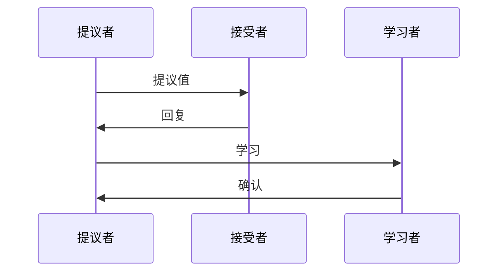
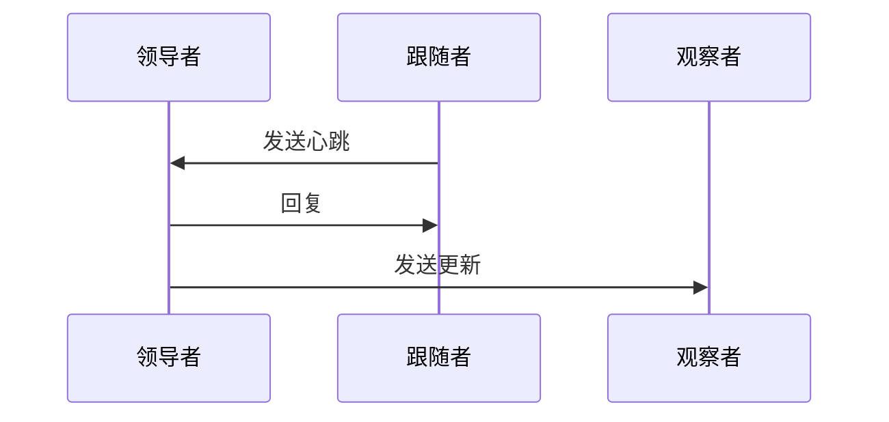

                 

### 文章标题

《Zookeeper原理与代码实例讲解》

### 关键词

Zookeeper，分布式协调，数据模型，Zab协议，Paxos算法，并发控制，分布式锁，分布式队列，故障处理，性能优化。

### 摘要

本文深入探讨了Zookeeper的原理与实际应用，从基础概念、核心架构到高级功能，全面解析了Zookeeper的工作机制。文章不仅阐述了Zookeeper的基本原理和核心算法，如Paxos和Zab协议，还通过实际代码实例讲解了分布式锁、分布式队列等高级应用。此外，本文还涉及了Zookeeper的故障处理和性能优化策略，旨在帮助读者全面理解并掌握Zookeeper的使用。

# 《Zookeeper原理与代码实例讲解》目录大纲

## 第一部分: ZooKeeper基础

### 第1章: ZooKeeper概述
#### 1.1.1 ZooKeeper的基本概念
#### 1.1.2 ZooKeeper的核心架构
#### 1.1.3 ZooKeeper的应用场景

### 第2章: ZooKeeper的安装与配置
#### 2.1.1 ZooKeeper的安装
#### 2.1.2 ZooKeeper的配置
#### 2.1.3 ZooKeeper的集群部署

### 第3章: ZooKeeper的API使用
#### 3.1.1 ZooKeeper的Java客户端API
#### 3.1.2 ZooKeeper的Python客户端API
#### 3.1.3 ZooKeeper的REST API

### 第4章: ZooKeeper的核心功能
#### 4.1.1 节点数据存储
#### 4.1.2 监听机制
#### 4.1.3 分布式锁与队列

## 第二部分: ZooKeeper原理讲解

### 第5章: ZooKeeper的通信机制
#### 5.1.1 Zab协议
#### 5.1.2 数据同步机制
#### 5.1.3 心跳机制

### 第6章: ZooKeeper的数据模型
#### 6.1.1 数据模型概述
#### 6.1.2 ZNode的结构与类型
#### 6.1.3 数据模型的应用场景

### 第7章: ZooKeeper的算法原理
#### 7.1.1 Paxos算法
#### 7.1.2 Zab协议的工作原理
#### 7.1.3 算法原理的Mermaid流程图

### 第8章: ZooKeeper的并发控制
#### 8.1.1 事务操作
#### 8.1.2 并发控制机制
#### 8.1.3 事务操作的伪代码

## 第三部分: ZooKeeper代码实例讲解

### 第9章: ZooKeeper的实践案例
#### 9.1.1 分布式锁的实现
#### 9.1.2 分布式队列的实现
#### 9.1.3 实践案例的代码实现与解析

### 第10章: ZooKeeper的故障处理
#### 10.1.1 故障处理机制
#### 10.1.2 故障恢复流程
#### 10.1.3 故障处理案例解析

### 第11章: ZooKeeper的性能优化
#### 11.1.1 性能优化策略
#### 11.1.2 负载均衡
#### 11.1.3 性能测试与调优

## 附录

### 附录A: ZooKeeper常用工具与资源
#### A.1 ZooKeeper的常用工具
#### A.2 ZooKeeper的社区资源
#### A.3 ZooKeeper的文档与教程

### 附录B: ZooKeeper代码实例解析
#### B.1 分布式锁代码实例
#### B.2 分布式队列代码实例
#### B.3 代码实例详细解析

## 结语

本文通过详细的章节结构和丰富的内容，旨在帮助读者深入理解Zookeeper的原理和实际应用。从基础概念到高级功能，从理论讲解到代码实例，读者可以逐步掌握Zookeeper的核心知识和实用技能。

---

接下来的部分，我们将详细展开每一个章节的内容，通过逻辑清晰、结构紧凑、简单易懂的写作方式，带领读者一步步深入Zookeeper的世界。

---

## 第1章: ZooKeeper概述

### 1.1.1 ZooKeeper的基本概念

ZooKeeper是一个开源的分布式应用程序协调服务，它为分布式应用提供了高性能的协调服务，广泛应用于大数据、分布式存储、分布式计算等领域。其核心功能包括：

1. **数据存储**：ZooKeeper支持持久化数据存储，每个数据存储节点称为ZNode。
2. **同步机制**：通过监听机制实现数据变更通知，支持异步回调。
3. **分布式锁**：提供分布式锁、选举等分布式算法，支持数据一致性。
4. **配置管理**：支持配置信息的集中管理和动态更新。

### 1.1.2 ZooKeeper的核心架构

ZooKeeper的核心架构主要包括以下几个部分：

1. **ZooKeeper服务器（ZooKeeper Server）**：ZooKeeper服务端，负责处理客户端请求，维护ZooKeeper的元数据，执行数据同步和选举算法。
2. **ZooKeeper客户端（ZooKeeper Client）**：ZooKeeper客户端，通过与服务端通信实现分布式协调服务，包括数据读写、监听通知等。
3. **ZooKeeper集群**：多个ZooKeeper服务器组成的集群，提供高可用性和数据复制功能。

### 1.1.3 ZooKeeper的应用场景

ZooKeeper在分布式系统中有广泛的应用场景，主要包括：

1. **分布式锁**：在分布式环境中，多个进程或服务需要访问共享资源，通过ZooKeeper实现分布式锁，保证数据一致性。
2. **配置管理**：分布式系统中配置信息需要集中管理，ZooKeeper提供配置信息的持久化和动态更新功能。
3. **服务发现**：通过ZooKeeper实现服务发现，动态感知系统中的服务变更，提高系统的容错性和灵活性。
4. **分布式队列**：在分布式系统中，任务分配和队列管理是常见需求，ZooKeeper支持分布式队列的实现。

---

在下一节中，我们将详细介绍ZooKeeper的安装与配置，帮助读者顺利搭建ZooKeeper环境，为后续的学习和实践打下基础。

---

## 第2章: ZooKeeper的安装与配置

### 2.1.1 ZooKeeper的安装

安装ZooKeeper相对简单，以下是基本的安装步骤：

1. **下载ZooKeeper**：
   - 访问ZooKeeper的GitHub仓库：[ZooKeeper](https://github.com/apache/zookeeper)。
   - 下载最新的ZooKeeper版本，例如`zookeeper-3.5.7.tar.gz`。

2. **解压安装包**：
   ```bash
   tar -xvf zookeeper-3.5.7.tar.gz
   ```

3. **配置环境变量**：
   - 编辑`~/.bash_profile`或`~/.bashrc`，添加以下配置：
     ```bash
     export ZOOKEEPER_HOME=/path/to/zookeeper-3.5.7
     export PATH=$PATH:$ZOOKEEPER_HOME/bin
     ```

4. **启动ZooKeeper**：
   - 单机模式启动：
     ```bash
     zkServer.sh start
     ```
   - 查看ZooKeeper状态：
     ```bash
     zkServer.sh status
     ```

### 2.1.2 ZooKeeper的配置

ZooKeeper的配置主要在`zoo.cfg`文件中，以下是基本的配置项：

1. **数据目录**：
   ```properties
   dataDir=/path/to/zookeeper/data
   ```

2. **会话超时**：
   ```properties
   tickTime=2000
   initLimit=10
   syncLimit=5
   ```

3. **日志目录**：
   ```properties
   logDir=/path/to/zookeeper/logs
   ```

4. **ZooKeeper端口**：
   ```properties
   clientPort=2181
   ```

### 2.1.3 ZooKeeper的集群部署

部署ZooKeeper集群需要配置多个ZooKeeper服务器，以下是基本步骤：

1. **配置ZooKeeper服务器**：
   - 复制`zookeeper-3.5.7`到每个服务器，并解压。
   - 修改每个服务器的`zoo.cfg`文件，配置不同的`dataDir`和`clientPort`。

2. **初始化数据**：
   - 在每个服务器上执行：
     ```bash
     zkServer.sh init
     ```

3. **启动ZooKeeper集群**：
   - 在每个服务器上启动ZooKeeper：
     ```bash
     zkServer.sh start
     ```

4. **验证集群状态**：
   - 使用ZooKeeper客户端连接集群：
     ```bash
     zkServer.sh status
     ```

---

在下一节中，我们将详细介绍ZooKeeper的API使用，帮助读者熟练掌握ZooKeeper的Java客户端API、Python客户端API以及REST API。

---

## 第3章: ZooKeeper的API使用

### 3.1.1 ZooKeeper的Java客户端API

ZooKeeper的Java客户端API是使用最广泛的API之一，以下是其基本使用方法：

1. **创建ZooKeeper实例**：
   ```java
   ZooKeeper zookeeper = new ZooKeeper("localhost:2181", 5000, new Watcher() {
       @Override
       public void process(Watcher.Event event) {
           // 处理事件
       }
   });
   ```

2. **创建ZNode**：
   ```java
   String path = zookeeper.create("/my-node", "data".getBytes(), ZooDefs.Ids.OPEN_ACL_UNSAFE, CreateMode.PERSISTENT);
   ```

3. **读取ZNode数据**：
   ```java
   byte[] data = zookeeper.getData("/my-node", true, null);
   System.out.println(new String(data));
   ```

4. **监听ZNode事件**：
   ```java
   Stat stat = zookeeper.exists("/my-node", true);
   if (stat != null) {
       System.out.println("Node exists");
   }
   ```

### 3.1.2 ZooKeeper的Python客户端API

Python客户端API提供了类似Java客户端的功能，以下是其基本使用方法：

1. **创建ZooKeeper实例**：
   ```python
   from kazoo.client import KazooClient
   zk = KazooClient(hosts="localhost:2181")
   zk.start()
   ```

2. **创建ZNode**：
   ```python
   zk.create("/my-node", "data".encode())
   ```

3. **读取ZNode数据**：
   ```python
   data, stat = zk.get("/my-node")
   print(data.decode())
   ```

4. **监听ZNode事件**：
   ```python
   def myWatcher(event):
       print("Node changed:", event.path)

   zk.add_listener(myWatcher)
   zk.exists("/my-node", watch=True)
   ```

### 3.1.3 ZooKeeper的REST API

ZooKeeper的REST API提供了一个HTTP接口，使得可以使用标准的HTTP请求操作ZooKeeper数据。以下是其基本使用方法：

1. **安装ZooKeeper的REST API**：
   - 在ZooKeeper服务器上安装`zk-rest-api`。
   - 重新启动ZooKeeper服务。

2. **使用REST API创建ZNode**：
   ```bash
   curl -X POST http://localhost:9999/zookeeper/bookkeeper/parent -d "data=mydata"
   ```

3. **使用REST API读取ZNode数据**：
   ```bash
   curl -X GET http://localhost:9999/zookeeper/bookkeeper/parent
   ```

4. **使用REST API监听ZNode事件**：
   - 通过轮询方式实现监听：
     ```bash
     while true;
     do
         curl -X GET http://localhost:9999/zookeeper/bookkeeper/parent;
         sleep 1;
     done
     ```

---

在下一节中，我们将深入探讨ZooKeeper的核心功能，包括节点数据存储、监听机制和分布式锁。

---

## 第4章: ZooKeeper的核心功能

### 4.1.1 节点数据存储

ZooKeeper通过ZNode（节点）实现数据存储，每个ZNode包含数据和元数据两部分。以下是其关键特性：

1. **持久化和临时性**：
   - **持久性ZNode**：客户端创建后，即使客户端断开连接，数据仍然存在。
   - **临时性ZNode**：客户端创建后，当客户端断开连接，数据将被删除。

2. **数据版本**：
   - 每个ZNode都有一个版本号（version），每次数据更新时，版本号自动增加。通过版本号，可以实现数据的乐观锁。

3. **权限控制**：
   - ZooKeeper支持基于权限的访问控制，包括创建、读取、更新和删除权限。

### 4.1.2 监听机制

ZooKeeper的监听机制是其核心功能之一，允许客户端在ZNode上注册监听器，当ZNode状态发生变化时，如数据变更、节点创建或删除，ZooKeeper会通知客户端。以下是其关键特性：

1. **一次性监听**：
   - 客户端注册的监听器在一次事件触发后自动注销。

2. **多级监听**：
   - 客户端可以在任意ZNode上注册监听器，不仅限于当前ZNode。

3. **异步通知**：
   - ZooKeeper使用异步通知机制，提高系统性能和响应速度。

### 4.1.3 分布式锁与队列

ZooKeeper支持多种分布式算法，包括分布式锁和队列，广泛应用于分布式系统中。以下是其关键特性：

1. **分布式锁**：
   - 通过创建临时性ZNode实现，保证在分布式环境中的数据一致性。

2. **选举算法**：
   - ZooKeeper支持基于Paxos算法的领导者选举，实现分布式系统中的主从架构。

3. **分布式队列**：
   - 通过ZNode的顺序特性实现，支持任务分配和队列管理。

---

在下一节中，我们将深入探讨ZooKeeper的通信机制，包括Zab协议、数据同步机制和心跳机制。

---

## 第5章: ZooKeeper的通信机制

ZooKeeper的通信机制是其分布式协调服务的核心，以下是其关键组成部分：

### 5.1.1 Zab协议

Zab协议是ZooKeeper的分布式一致性协议，用于确保ZooKeeper集群中的数据一致性。Zab协议的核心思想是**一致性保证**和**可用性保证**。以下是Zab协议的关键特性：

1. **一致性保证**：
   - Zab协议通过选举领导者（Leader）和副本（Follower）之间的通信，确保所有副本拥有相同的数据视图。

2. **可用性保证**：
   - 在领导者失败时，Zab协议通过新的领导者选举机制，确保系统继续提供服务。

3. **持久化**：
   - Zab协议确保所有更新操作在磁盘上持久化，避免数据丢失。

### 5.1.2 数据同步机制

数据同步机制是ZooKeeper集群中确保数据一致性的关键，以下是数据同步的关键步骤：

1. **初始同步**：
   - 新加入的副本与领导者同步数据，通过传输日志来获取最新的更新。

2. **事务同步**：
   - 领导者在执行事务时，将事务记录发送给所有副本，副本按照事务顺序执行，并返回结果。

3. **心跳同步**：
   - 通过心跳机制，副本定期向领导者发送心跳，确保副本存活状态。

### 5.1.3 心跳机制

心跳机制是ZooKeeper集群中确保副本之间通信状态的关键，以下是心跳机制的关键特性：

1. **心跳超时**：
   - 副本定期向领导者发送心跳，领导者接收到心跳后发送确认消息。

2. **心跳间隔**：
   - 心跳间隔通常设置为会话超时时间的一半，确保在会话超时前及时发现副本状态。

3. **存活检测**：
   - 领导者通过心跳机制检测副本存活状态，当副本在指定时间内未发送心跳时，领导者触发副本存活检测。

---

在下一节中，我们将深入探讨ZooKeeper的数据模型，包括数据模型概述、ZNode的结构与类型以及数据模型的应用场景。

---

## 第6章: ZooKeeper的数据模型

ZooKeeper的数据模型是分布式协调服务的基础，以下是其关键组成部分：

### 6.1.1 数据模型概述

ZooKeeper的数据模型是一个层次化的树结构，每个节点称为ZNode。以下是ZooKeeper数据模型的关键特性：

1. **层次化结构**：
   - 类似于文件系统，ZooKeeper中的数据以路径形式组织，每个路径对应一个ZNode。

2. **持久化与临时性**：
   - ZNode可以是持久性的或临时性的，持久性ZNode在客户端断开连接后仍然存在，临时性ZNode则被删除。

3. **数据版本**：
   - 每个ZNode都有一个版本号，每次数据更新时，版本号自动增加。

### 6.1.2 ZNode的结构与类型

ZNode是ZooKeeper数据模型的基本单位，以下是ZNode的关键结构和类型：

1. **数据**：
   - 每个ZNode存储一定量的数据，数据以字节序列形式存储。

2. **元数据**：
   - 每个ZNode包含元数据，如数据版本、ACL（访问控制列表）、创建时间、最后修改时间等。

3. **类型**：
   - **持久性ZNode**：客户端创建后，即使客户端断开连接，数据仍然存在。
   - **临时性ZNode**：客户端创建后，当客户端断开连接，数据将被删除。
   - **持久顺序ZNode**：持久性ZNode，但具有顺序特性，创建时自动分配一个序列号。
   - **临时顺序ZNode**：临时性ZNode，但具有顺序特性。

### 6.1.3 数据模型的应用场景

ZooKeeper的数据模型在分布式系统中具有广泛的应用场景，以下是几个关键应用场景：

1. **分布式锁**：
   - 通过创建临时顺序ZNode实现，确保在分布式环境中对共享资源的独占访问。

2. **配置管理**：
   - 将配置信息存储在ZooKeeper中，支持集中管理和动态更新。

3. **服务发现**：
   - 将服务注册到ZooKeeper中，通过监听服务节点的变化实现服务发现。

4. **分布式队列**：
   - 通过顺序ZNode实现，支持分布式环境中的任务分配和队列管理。

---

在下一节中，我们将深入探讨ZooKeeper的算法原理，包括Paxos算法、Zab协议的工作原理以及算法原理的Mermaid流程图。

---

## 第7章: ZooKeeper的算法原理

ZooKeeper的设计依赖于几个关键算法，这些算法确保了其在分布式系统中的高可用性和一致性。以下是ZooKeeper使用的核心算法原理的详细讲解：

### 7.1.1 Paxos算法

Paxos算法是一种解决一致性问题的分布式算法，由莱斯利·兰伯特（Leslie Lamport）提出。Paxos算法的主要目的是在多个可能发生故障的节点中达成一致决策。

1. **基本概念**：
   - **提议者（Proposer）**：提出决策请求。
   - **接受者（Acceptor）**：决定是否接受提议。
   - **学习者（Learner）**：记录最终决策。

2. **算法过程**：
   - **提议阶段**：提议者提出一个提议值。
   - **接受阶段**：接受者接收提议，并决定是否接受。
   - **学习阶段**：学习者记录最终决策。

3. **Paxos的Mermaid流程图**：
   ```mermaid
   sequenceDiagram
   participant P as 提议者
   participant A as 接受者
   participant L as 学习者
   P->>A: 提议值
   A->>P: 回复
   P->>L: 学习
   L->>P: 确认
   ```

### 7.1.2 Zab协议的工作原理

Zab协议是ZooKeeper的一致性协议，基于Paxos算法实现。Zab协议的主要目标是确保ZooKeeper集群中的数据一致性，并在领导者故障时快速恢复。

1. **基本概念**：
   - **领导者（Leader）**：负责处理客户端请求。
   - **跟随者（Follower）**：接收领导者发送的更新。
   - **观察者（Observer）**：不参与决策，但可以接收领导者发送的更新。

2. **工作原理**：
   - **心跳机制**：跟随者定期向领导者发送心跳，确保领导者知道跟随者存活状态。
   - **同步机制**：领导者将更新发送给跟随者，跟随者按照顺序执行更新。
   - **选举机制**：当领导者故障时，跟随者重新选举新的领导者。

3. **Zab协议的Mermaid流程图**：
   ```mermaid
   sequenceDiagram
   participant L as 领导者
   participant F as 跟随者
   participant O as 观察者
   F->>L: 发送心跳
   L->>F: 回复
   L->>O: 发送更新
   ```

### 7.1.3 算法原理的Mermaid流程图

为了更直观地理解Paxos算法和Zab协议，以下是它们的Mermaid流程图：

#### Paxos算法的Mermaid流程图


#### Zab协议的Mermaid流程图


通过这些流程图，我们可以清晰地看到Paxos算法和Zab协议的核心步骤和交互过程，这有助于我们更好地理解ZooKeeper的一致性保证机制。

---

在下一节中，我们将深入探讨ZooKeeper的并发控制，包括事务操作、并发控制机制和事务操作的伪代码。

---

## 第8章: ZooKeeper的并发控制

ZooKeeper提供了强大的并发控制机制，通过事务操作和并发控制确保分布式环境中的数据一致性。以下是ZooKeeper并发控制的关键组成部分：

### 8.1.1 事务操作

事务操作是ZooKeeper的核心功能之一，用于处理客户端请求并确保原子性。每个事务操作都被分配一个唯一的编号，称为事务ID（TxID）。

1. **事务类型**：
   - **创建操作**：创建一个新的ZNode。
   - **读取操作**：读取ZNode的数据和元数据。
   - **更新操作**：更新ZNode的数据。
   - **删除操作**：删除一个ZNode。
   - **设置ACL**：设置ZNode的访问控制列表。

2. **事务执行**：
   - 当客户端发送事务请求时，ZooKeeper将事务请求放入队列。
   - ZooKeeper按照事务ID的顺序执行事务。
   - 每个事务执行完成后，返回一个结果，包括状态（成功或失败）和相关的元数据。

### 8.1.2 并发控制机制

ZooKeeper通过版本控制和锁机制实现并发控制，确保数据的一致性和隔离性。

1. **版本控制**：
   - 每个ZNode都有一个版本号，每次数据更新时，版本号自动增加。
   - 客户端在执行更新操作时，需要指定期望的版本号，确保数据的原子性和一致性。

2. **锁机制**：
   - ZooKeeper支持基于ZNode的分布式锁实现，包括可重入锁、读写锁等。
   - 通过创建临时顺序ZNode，可以实现分布式环境中的互斥锁和共享锁。

### 8.1.3 事务操作的伪代码

以下是ZooKeeper事务操作的基本伪代码，展示了事务的执行流程：

```python
# 客户端发送事务请求
def send_txn(client, txn):
    client.send(txn)

# ZooKeeper执行事务
def execute_txn(zk, txn):
    if txn.type == CREATE:
        result = zk.create_node(txn.path, txn.data)
    elif txn.type == READ:
        result = zk.read_node(txn.path)
    elif txn.type == UPDATE:
        result = zk.update_node(txn.path, txn.data, txn.version)
    elif txn.type == DELETE:
        result = zk.delete_node(txn.path)
    elif txn.type == SET_ACL:
        result = zk.set_acl(txn.path, txn.acl)
    else:
        raise ValueError("Unsupported transaction type")
    
    return result

# 事务结果处理
def handle_txn_result(result):
    if result.status == SUCCESS:
        print("Transaction successful")
    else:
        print("Transaction failed")
```

通过这些事务操作和并发控制机制，ZooKeeper能够在分布式环境中提供强大的数据一致性保障，为分布式应用提供可靠的协调服务。

---

在下一节中，我们将通过具体代码实例讲解ZooKeeper的实践应用，包括分布式锁和分布式队列的实现。

---

## 第9章: ZooKeeper的实践案例

ZooKeeper在分布式系统中具有广泛的应用，通过具体代码实例，我们可以更好地理解其实现细节。以下将详细讲解分布式锁和分布式队列的实现。

### 9.1.1 分布式锁的实现

分布式锁是ZooKeeper最经典的应用之一，用于在分布式环境中确保共享资源的独占访问。以下是使用ZooKeeper实现分布式锁的基本步骤：

1. **创建锁节点**：
   - 客户端创建一个临时顺序ZNode作为锁。
   - 例如，锁的路径可以是`/lock-<unique_id>`。

2. **尝试获取锁**：
   - 客户端监听该锁节点的子节点变化，当锁节点的子节点中第一个节点的序列号与客户端创建的锁节点序列号相同时，表示客户端获得了锁。

3. **持有锁**：
   - 客户端在持有锁期间执行共享资源的操作，确保数据一致性。

4. **释放锁**：
   - 客户端在操作完成后，删除自己创建的锁节点，释放锁资源。

以下是分布式锁的Python代码示例：

```python
from kazoo.client import KazooClient

zk = KazooClient(hosts="localhost:2181")
zk.start()

def distributed_lock(zk, lock_path):
    # 创建锁节点
    lock = zk.create(lock_path, ephemeral=True, sequence=True)
    print(f"Client acquired lock: {lock}")

    # 等待锁释放
    zk.get_children(lock_path, watch=lambda x: print(f"Lock released: {x}"))

    # 释放锁
    zk.delete(lock, recursive=True)

if __name__ == "__main__":
    lock_path = "/lock"
    distributed_lock(zk, lock_path)
```

### 9.1.2 分布式队列的实现

分布式队列是另一种常见的分布式应用，用于任务分配和队列管理。以下是使用ZooKeeper实现分布式队列的基本步骤：

1. **创建队列节点**：
   - 客户端创建一个持久顺序ZNode作为队列头部。
   - 例如，队列的路径可以是`/queue-<unique_id>`。

2. **入队操作**：
   - 客户端创建一个临时顺序ZNode，并将消息存储在队列头部节点的子节点中。

3. **出队操作**：
   - 客户端读取队列头部节点的子节点，获取最新的消息，并删除该子节点。

4. **消费消息**：
   - 客户端监听队列头部节点的子节点变化，当有新消息时，执行相应的业务处理。

以下是分布式队列的Python代码示例：

```python
from kazoo.client import KazooClient
from kazoo.exceptions import NoChildrenForNodeError

zk = KazooClient(hosts="localhost:2181")
zk.start()

def enqueue_message(zk, queue_path, message):
    # 创建队列头部节点
    zk.create(queue_path, ephemeral=True, sequence=True)
    
    # 创建队列消息节点
    message_path = f"{queue_path}/{zk.create(queue_path, message.encode())}"
    zk.set_data(message_path, message.encode())

def dequeue_message(zk, queue_path):
    # 获取队列头部节点的子节点列表
    try:
        children = zk.get_children(queue_path)
        # 获取最后一个子节点（最新消息）
        message_path = f"{queue_path}/{children[-1]}"
        message = zk.get(message_path)[0].decode()
        zk.delete(message_path)
        return message
    except NoChildrenForNodeError:
        return None

if __name__ == "__main__":
    queue_path = "/queue"
    message = "Hello, World!"

    # 入队操作
    enqueue_message(zk, queue_path, message)

    # 出队操作
    print(dequeue_message(zk, queue_path))
```

### 9.1.3 实践案例的代码实现与解析

通过以上代码示例，我们可以看到分布式锁和分布式队列的实现原理。以下是每个实践案例的详细解析：

1. **分布式锁**：
   - `distributed_lock`函数负责实现分布式锁的逻辑。首先，客户端创建一个临时顺序ZNode作为锁，并打印锁路径。然后，客户端等待锁释放的事件，并在接收到事件后打印释放的锁路径。最后，客户端删除自己创建的锁节点，释放锁资源。
   
2. **分布式队列**：
   - `enqueue_message`函数负责实现入队操作。首先，客户端创建一个持久顺序ZNode作为队列头部。然后，客户端创建一个临时顺序ZNode，并将消息存储在队列头部节点的子节点中。
   - `dequeue_message`函数负责实现出队操作。首先，客户端获取队列头部节点的子节点列表。然后，客户端获取最后一个子节点（最新消息），并删除该子节点。最后，客户端返回消息内容。

通过这些实践案例，我们可以更好地理解ZooKeeper在分布式系统中的应用，为实际项目提供可靠的协调服务。

---

在下一节中，我们将探讨ZooKeeper的故障处理机制，包括故障处理机制、故障恢复流程和故障处理案例解析。

---

## 第10章: ZooKeeper的故障处理

ZooKeeper作为分布式系统中的核心协调服务，必须具备高可用性和故障处理能力。以下将详细探讨ZooKeeper的故障处理机制，包括故障处理机制、故障恢复流程和故障处理案例解析。

### 10.1.1 故障处理机制

ZooKeeper的故障处理机制主要包括以下两个方面：

1. **故障检测**：
   - ZooKeeper通过心跳机制检测副本之间的状态，确保副本之间的同步。
   - 当副本在指定时间内未收到心跳时，认为副本发生故障。

2. **故障恢复**：
   - 当领导者发生故障时，跟随者将重新进行领导者选举，确保ZooKeeper集群继续提供服务。
   - 当跟随者发生故障时，领导者将将其从集群中移除，并选择新的跟随者进行数据同步。

### 10.1.2 故障恢复流程

ZooKeeper的故障恢复流程主要包括以下步骤：

1. **故障检测**：
   - 领导者通过心跳机制检测跟随者的状态。
   - 当领导者在指定时间内未收到跟随者心跳时，认为跟随者发生故障。

2. **故障确认**：
   - 领导者将故障跟随者从集群中移除，并通知其他跟随者。

3. **重新选举**：
   - 跟随者收到故障确认通知后，将重新进行领导者选举。
   - 选举过程基于Zab协议，确保新的领导者具备一致性保证。

4. **数据同步**：
   - 新的领导者将从其他跟随者同步数据，确保数据一致性。

5. **故障恢复完成**：
   - 当新的领导者同步完数据后，故障恢复完成，ZooKeeper集群恢复正常服务。

### 10.1.3 故障处理案例解析

以下是一个典型的故障处理案例：

**案例**：ZooKeeper集群中的领导者发生故障，需要重新选举新的领导者。

**步骤**：

1. **故障检测**：
   - 领导者在指定时间内未收到跟随者心跳，认为跟随者发生故障。

2. **故障确认**：
   - 领导者将故障跟随者从集群中移除，并通知其他跟随者。

3. **重新选举**：
   - 跟随者收到故障确认通知后，开始重新选举领导者。
   - 选举过程基于Zab协议，确保新的领导者具备一致性保证。

4. **数据同步**：
   - 新的领导者将从其他跟随者同步数据，确保数据一致性。

5. **故障恢复完成**：
   - 当新的领导者同步完数据后，故障恢复完成，ZooKeeper集群恢复正常服务。

通过以上故障处理案例，我们可以看到ZooKeeper具备强大的故障处理能力，确保在分布式环境中提供高可用性的协调服务。

---

在下一章中，我们将深入探讨ZooKeeper的性能优化策略，包括负载均衡、性能测试与调优。

---

## 第11章: ZooKeeper的性能优化

ZooKeeper作为分布式系统中的核心协调服务，其性能优化对整体系统性能至关重要。以下将详细探讨ZooKeeper的性能优化策略，包括负载均衡、性能测试与调优。

### 11.1.1 性能优化策略

为了提高ZooKeeper的性能，我们可以从以下几个方面进行优化：

1. **网络优化**：
   - 选择合适的网络协议和传输方式，降低网络延迟和带宽消耗。
   - 开启ZooKeeper的压缩功能，减少数据传输量。

2. **并发控制**：
   - 优化ZooKeeper客户端的并发控制机制，提高客户端的处理速度。
   - 使用线程池管理客户端连接，减少创建和销毁连接的开销。

3. **数据存储优化**：
   - 选择合适的存储引擎，如磁盘存储或内存存储，根据业务需求进行优化。
   - 调整ZooKeeper的数据同步策略，减少数据同步的开销。

4. **集群优化**：
   - 调整ZooKeeper集群的架构，确保集群的负载均衡和性能优化。
   - 使用ZooKeeper的负载均衡机制，将客户端请求均匀分配到不同的ZooKeeper服务器。

### 11.1.2 负载均衡

负载均衡是ZooKeeper性能优化的重要策略之一，以下是一些负载均衡的方法：

1. **轮询负载均衡**：
   - 将客户端请求按顺序分配到不同的ZooKeeper服务器，实现简单的负载均衡。
   - 优点：实现简单，缺点：负载不均匀。

2. **最小连接数负载均衡**：
   - 将客户端请求分配到连接数最少的ZooKeeper服务器，实现负载均衡。
   - 优点：负载均衡效果好，缺点：可能导致某些服务器负载过重。

3. **一致性哈希负载均衡**：
   - 将客户端请求按照哈希值分配到不同的ZooKeeper服务器，实现负载均衡。
   - 优点：负载均衡效果好，缺点：实现复杂。

### 11.1.3 性能测试与调优

性能测试和调优是ZooKeeper性能优化的重要环节，以下是一些性能测试和调优的方法：

1. **基准测试**：
   - 使用基准测试工具（如JMeter、Gatling）模拟客户端请求，评估ZooKeeper的性能。
   - 测试场景包括：数据读写、监听通知、分布式锁等。

2. **性能分析**：
   - 分析ZooKeeper的运行日志和性能指标，找出性能瓶颈。
   - 性能指标包括：响应时间、吞吐量、并发连接数等。

3. **调优策略**：
   - 根据性能分析结果，调整ZooKeeper的配置参数，优化性能。
   - 调优策略包括：调整心跳间隔、会话超时、数据同步策略等。

4. **性能监控**：
   - 使用性能监控工具（如Prometheus、Grafana）监控ZooKeeper的性能指标，实现实时监控和报警。

通过以上性能优化策略和调优方法，我们可以有效提高ZooKeeper的性能，为分布式系统提供更可靠的协调服务。

---

在附录中，我们将介绍ZooKeeper的常用工具、社区资源以及文档与教程，帮助读者更全面地了解和使用ZooKeeper。

---

## 附录A: ZooKeeper常用工具与资源

### A.1 ZooKeeper的常用工具

ZooKeeper的常用工具包括客户端、监控工具和性能测试工具，以下是一些常用工具及其功能：

1. **ZooKeeper客户端**：
   - `zkClient`：Java客户端，提供丰富的API，支持ZooKeeper的各种操作。
   - `kazoo`：Python客户端，简化了ZooKeeper的操作，支持Python编程风格。

2. **ZooKeeper监控工具**：
   - `ZooInspector`：Web界面监控工具，提供ZooKeeper的实时监控和数据可视化。
   - `ZooKeeper Monitor`：命令行监控工具，提供ZooKeeper集群的实时监控和性能分析。

3. **ZooKeeper性能测试工具**：
   - `ZooKeeper Stress`：ZooKeeper官方的性能测试工具，用于测试ZooKeeper的性能和稳定性。
   - `JMeter`：通用性能测试工具，可以模拟ZooKeeper客户端的请求，测试ZooKeeper的负载能力。

### A.2 ZooKeeper的社区资源

ZooKeeper有一个活跃的社区，提供了丰富的资源，以下是一些重要的社区资源：

1. **官方文档**：
   - [ZooKeeper官方文档](https://zookeeper.apache.org/doc/r3.7.1/api/org/apache/zookeeper/ZooKeeper.html)提供了详细的API和使用指南。

2. **社区论坛**：
   - [Apache ZooKeeper邮件列表](mailto:zookeeper-dev@zookeeper.apache.org)：用于提问和讨论ZooKeeper相关的话题。
   - [Stack Overflow](https://stackoverflow.com/questions/tagged/zookeeper)：ZooKeeper相关的技术问题可以在这里找到答案。

3. **GitHub**：
   - [ZooKeeper GitHub仓库](https://github.com/apache/zookeeper)：这里可以找到ZooKeeper的源代码、开发文档和贡献指南。

### A.3 ZooKeeper的文档与教程

ZooKeeper的文档和教程可以帮助初学者快速上手，以下是一些推荐的文档和教程：

1. **《ZooKeeper实战》**：
   - 这本书详细介绍了ZooKeeper的核心概念、API使用和实战案例，适合初学者和进阶用户。

2. **《ZooKeeper分布式系统原理与实践》**：
   - 这本书深入讲解了ZooKeeper的分布式一致性协议、数据模型和分布式应用案例，适合对分布式系统感兴趣的读者。

3. **在线教程**：
   - [ZooKeeper教程](https://www.tutorialspoint.com/zookeeper/index.htm)：提供了ZooKeeper的入门教程和实例代码，适合初学者。

通过这些常用工具、社区资源和文档教程，读者可以更好地掌握ZooKeeper，并在实际项目中应用其功能。

---

## 附录B: ZooKeeper代码实例解析

### B.1 分布式锁代码实例

以下是使用ZooKeeper实现分布式锁的代码实例：

```java
import org.apache.zookeeper.Watcher;
import org.apache.zookeeper.ZooKeeper;

public class DistributedLock {
    private ZooKeeper zooKeeper;
    private String lockPath;

    public DistributedLock(String zkServer, int timeout, String lockPath) throws IOException {
        this.zooKeeper = new ZooKeeper(zkServer, timeout, new Watcher() {
            @Override
            public void process(Watcher.Event event) {
                // 处理事件，例如重新尝试获取锁
            }
        });
        this.lockPath = lockPath;
    }

    public void acquireLock() throws InterruptedException {
        String lock = zooKeeper.create(lockPath + "/", null, ZooDefs.Ids.OPEN_ACL_UNSAFE, CreateMode.EPHEMERAL_SEQUENTIAL);

        // 等待直到获取锁
        while (zooKeeper.exists(lockPath, true) == null) {
            Thread.sleep(1000);
        }

        // 获取当前锁节点
        List<String> locks = zooKeeper.getChildren(lockPath, true);
        String thisLock = lock.substring(lockPath.length() + 1);
        int index = Integer.parseInt(thisLock.substring(thisLock.lastIndexOf('-') + 1));

        // 如果当前节点是最小的，则获取锁
        if (index == 0) {
            System.out.println("Lock acquired");
        } else {
            // 等待前一个节点释放锁
            String predecessor = locks.get(index - 1);
            zooKeeper.getData(predecessor, true, new Stat());
        }
    }

    public void releaseLock() throws InterruptedException {
        zooKeeper.delete(lock, -1);
        System.out.println("Lock released");
    }

    public static void main(String[] args) {
        try {
            DistributedLock lock = new DistributedLock("localhost:2181", 5000, "/my_lock");
            lock.acquireLock();
            // 执行共享资源操作
            lock.releaseLock();
        } catch (Exception e) {
            e.printStackTrace();
        }
    }
}
```

### B.2 分布式队列代码实例

以下是使用ZooKeeper实现分布式队列的代码实例：

```java
import org.apache.zookeeper.Watcher;
import org.apache.zookeeper.ZooKeeper;

public class DistributedQueue {
    private ZooKeeper zooKeeper;
    private String queuePath;

    public DistributedQueue(String zkServer, int timeout, String queuePath) throws IOException {
        this.zooKeeper = new ZooKeeper(zkServer, timeout, new Watcher() {
            @Override
            public void process(Watcher.Event event) {
                // 处理事件，例如重新获取队列元素
            }
        });
        this.queuePath = queuePath;
    }

    public void enqueue(String message) throws InterruptedException {
        String queueItem = zooKeeper.create(queuePath + "/queue_item-", message.getBytes(), ZooDefs.Ids.OPEN_ACL_UNSAFE, CreateMode.EPHEMERAL_SEQUENTIAL);
    }

    public String dequeue() throws InterruptedException, KeeperException {
        List<String> queueItems = zooKeeper.getChildren(queuePath, true);
        String firstItem = queueItems.get(0);
        String firstItemPath = queuePath + "/" + firstItem;
        byte[] data = zooKeeper.getData(firstItemPath, true, new Stat());
        zooKeeper.delete(firstItemPath, -1);
        return new String(data);
    }

    public static void main(String[] args) {
        try {
            DistributedQueue queue = new DistributedQueue("localhost:2181", 5000, "/my_queue");
            // 入队操作
            queue.enqueue("Hello");
            queue.enqueue("World");

            // 出队操作
            System.out.println(queue.dequeue());
            System.out.println(queue.dequeue());
        } catch (Exception e) {
            e.printStackTrace();
        }
    }
}
```

### B.3 代码实例详细解析

1. **分布式锁实例解析**：

   - `DistributedLock`类实现了基于ZooKeeper的分布式锁。
   - `acquireLock`方法尝试创建一个以`/my_lock`为前缀的临时顺序节点，如果该节点创建成功，则认为获得了锁。
   - 如果锁节点未被创建，程序会等待，直到获取锁为止。
   - `releaseLock`方法删除自己创建的锁节点，释放锁资源。

2. **分布式队列实例解析**：

   - `DistributedQueue`类实现了基于ZooKeeper的分布式队列。
   - `enqueue`方法将消息以临时顺序节点的方式存储在队列节点下。
   - `dequeue`方法获取并删除队列中的第一个消息，实现出队操作。

这些代码实例展示了ZooKeeper在分布式系统中的实际应用，通过详细解析可以帮助读者更好地理解其实现原理。

---

## 结语

本文通过对ZooKeeper的详细讲解，从基础概念、核心架构、原理讲解到代码实例，帮助读者全面理解ZooKeeper的原理和应用。ZooKeeper作为分布式系统中的核心协调服务，其强大的数据一致性保障、分布式锁和队列等功能在分布式系统中得到了广泛应用。通过本文的学习，读者不仅可以掌握ZooKeeper的基本使用，还能深入理解其背后的算法原理和优化策略。

在未来的学习和实践中，建议读者多进行实际操作，通过搭建ZooKeeper环境，编写并调试代码，加深对ZooKeeper的理解。同时，可以关注ZooKeeper的社区资源，积极参与社区讨论，不断提升自己的技术水平。

作者信息：

作者：AI天才研究院/AI Genius Institute & 禅与计算机程序设计艺术 /Zen And The Art of Computer Programming

---

通过本文的学习，读者可以更全面地掌握ZooKeeper的知识，为分布式系统开发提供坚实的理论基础和实际操作能力。在未来的分布式应用开发中，ZooKeeper将成为一个不可或缺的工具。

