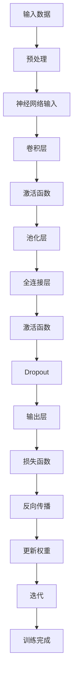

                 

# 《dropout》

## 关键词
- Dropout
- 深度学习
- 神经网络
- 防过拟合
- 模型压缩

## 摘要
本文将详细介绍dropout技术，包括其定义、原理、实现和应用。我们将从dropout的基本概念出发，逐步深入探讨其在深度学习中的重要性以及其在神经网络、模型优化和其他领域的扩展应用。通过实际案例分析和代码解读，读者将能够全面理解dropout的原理和实际应用效果，为深度学习项目开发提供有益的参考。

## 第一部分：引言

### 第1章：dropout概述

#### 1.1 dropout的定义与原理
Dropout是一种在训练过程中随机屏蔽神经元的方法，以防止模型过拟合。具体来说，在训练过程中，对于每一层神经元的输出，以一定的概率将其置为零。这样，每个神经元在训练过程中并不是独立工作的，而是需要与其他神经元合作。Dropout的引入使得神经网络具有更强的泛化能力。

#### 1.2 dropout在神经网络中的重要性
dropout能够有效减少神经网络的过拟合现象，提高模型的泛化能力。此外，dropout还能加速模型训练过程，提高训练效率。因此，dropout在深度学习中被广泛采用，成为了一种重要的正则化技术。

#### 1.3 dropout的应用场景
dropout主要应用于深度学习中的神经网络模型，如卷积神经网络（CNN）、循环神经网络（RNN）等。在实际项目中，可以根据模型的复杂度和数据集的规模来选择合适的dropout概率。

### 第2章：dropout的理论基础

#### 2.1 神经网络基础

##### 2.1.1 神经网络的基本结构
神经网络由多个神经元组成，每个神经元接收来自前一层神经元的输入，并经过加权求和后传递给下一层神经元。神经网络通过学习输入和输出之间的映射关系，实现对数据的分类、回归等任务。

##### 2.1.2 神经网络的学习过程
神经网络的学习过程包括前向传播和反向传播。在前向传播过程中，输入数据从输入层传递到输出层，生成预测结果。在反向传播过程中，根据预测结果和实际结果的差异，调整神经元权重，使得神经网络能够更好地拟合数据。

##### 2.1.3 神经网络的常见问题
神经网络在训练过程中可能会出现过拟合、欠拟合等问题。过拟合意味着模型在训练数据上表现良好，但在测试数据上表现较差；欠拟合则意味着模型在训练数据上表现较差。

#### 2.2 dropout的数学原理

##### 2.2.1 dropout的概率分布
dropout在训练过程中以一定的概率（通常为0.5）屏蔽神经元，形成了一种概率分布。这种概率分布使得神经网络在训练过程中具有随机性，从而提高模型的泛化能力。

##### 2.2.2 dropout的数学证明
dropout的数学证明主要基于概率论和统计学习理论。通过证明，可以得知dropout能够在一定程度上减小模型方差，从而提高模型泛化能力。

##### 2.2.3 dropout的优势与局限
dropout具有减少过拟合、加速训练等优点，但在某些情况下可能会导致模型性能下降。因此，在应用dropout时，需要根据实际情况进行合理调整。

## 第二部分：dropout在深度学习中的应用

### 第3章：dropout在深度神经网络中的实现

#### 3.1 dropout在卷积神经网络中的应用
卷积神经网络（CNN）在计算机视觉任务中表现出色。dropout在CNN中的应用主要包括在卷积层、池化层和全连接层中使用。通过在各个层中使用dropout，可以有效地减少过拟合现象。

##### 3.1.1 卷积神经网络的基本结构
卷积神经网络由卷积层、池化层和全连接层组成。卷积层通过卷积操作提取图像特征；池化层对特征进行降采样，减少模型的参数数量；全连接层对提取的特征进行分类。

##### 3.1.2 dropout在卷积神经网络中的实现
在卷积神经网络中，dropout可以在卷积层、池化层和全连接层中使用。具体实现方法如下：
1. 在卷积层中，对卷积操作的输出进行dropout处理。
2. 在池化层中，对池化操作的输出进行dropout处理。
3. 在全连接层中，对全连接层的输出进行dropout处理。

##### 3.1.3 dropout在卷积神经网络中的优势
dropout在卷积神经网络中的应用能够有效减少过拟合现象，提高模型的泛化能力。此外，dropout还能加速模型训练过程，提高训练效率。

#### 3.2 dropout在循环神经网络中的应用
循环神经网络（RNN）在自然语言处理任务中表现出色。dropout在RNN中的应用主要包括在隐藏层和输入层中使用。

##### 3.2.1 循环神经网络的基本结构
循环神经网络由输入层、隐藏层和输出层组成。输入层接收外部输入，隐藏层对输入进行编码，输出层生成预测结果。

##### 3.2.2 dropout在循环神经网络中的实现
在循环神经网络中，dropout可以在隐藏层和输入层中使用。具体实现方法如下：
1. 在隐藏层中，对隐藏层的输出进行dropout处理。
2. 在输入层中，对输入数据进行dropout处理。

##### 3.2.3 dropout在循环神经网络中的优势
dropout在循环神经网络中的应用能够有效减少过拟合现象，提高模型的泛化能力。此外，dropout还能提高模型在长序列数据上的表现。

### 第4章：dropout在深度学习模型优化中的应用

#### 4.1 dropout在模型训练中的应用
dropout在模型训练中的应用主要体现在以下几个方面：
1. 防止过拟合：通过在训练过程中引入dropout，可以减少模型对训练数据的依赖，提高模型在测试数据上的表现。
2. 加速训练：dropout可以使得模型在训练过程中具有随机性，从而加快训练速度。

##### 4.1.1 dropout在模型训练中的效果
实验证明，在模型训练过程中引入dropout可以有效减少过拟合现象，提高模型的泛化能力。同时，dropout还可以加速模型训练过程，提高训练效率。

##### 4.1.2 dropout在模型训练中的调整策略
在模型训练过程中，可以根据模型的复杂度和数据集的规模来调整dropout概率。通常，较小的dropout概率适用于较小的模型，而较大的dropout概率适用于较大的模型。

#### 4.2 dropout在模型压缩中的应用
模型压缩是深度学习领域的一个重要研究方向。dropout在模型压缩中的应用主要体现在以下几个方面：
1. 参数剪枝：通过在训练过程中引入dropout，可以减少模型的参数数量，从而实现模型压缩。
2. 结构压缩：通过在模型中引入dropout，可以减少模型的层数和神经元数量，从而实现模型压缩。

##### 4.2.1 模型压缩的背景与意义
随着深度学习模型的复杂度不断增加，模型的参数数量和计算量也在不断增加。为了提高模型的部署效率和可扩展性，需要对模型进行压缩。

##### 4.2.2 dropout在模型压缩中的应用
dropout在模型压缩中的应用主要包括：
1. 参数剪枝：通过在训练过程中引入dropout，可以减少模型的参数数量。
2. 结构压缩：通过在模型中引入dropout，可以减少模型的层数和神经元数量。

##### 4.2.3 dropout在模型压缩中的优势
dropout在模型压缩中的应用具有以下优势：
1. 减少模型参数：通过参数剪枝，可以减少模型的参数数量，从而降低模型的存储和计算成本。
2. 提高模型效率：通过结构压缩，可以减少模型的层数和神经元数量，从而降低模型的计算复杂度。

## 第三部分：dropout的扩展与应用

### 第5章：dropout的扩展与应用

#### 5.1 dropout的变体
除了传统的dropout外，还有一些dropout的变体，如dropconnect、scaled dropout和adaptive dropout等。

##### 5.1.1 dropconnect
dropconnect是对dropout的改进，通过在训练过程中随机屏蔽神经元之间的连接，而不是屏蔽神经元本身。dropconnect在一定程度上可以提高模型的泛化能力。

##### 5.1.2 scaled dropout
scaled dropout是在dropout的基础上引入了一个缩放因子，用于调整神经元输出的权重。scaled dropout可以使得模型在训练过程中具有更强的鲁棒性。

##### 5.1.3 adaptive dropout
adaptive dropout是一种自适应的dropout方法，可以根据模型的训练效果动态调整dropout概率。adaptive dropout可以进一步提高模型的泛化能力。

#### 5.2 dropout在其他领域的应用
dropout不仅应用于深度学习领域，还广泛应用于其他领域。

##### 5.2.1 dropout在计算机视觉中的应用
dropout在计算机视觉领域中应用广泛，如图像分类、目标检测等。通过在卷积神经网络中引入dropout，可以显著提高模型的泛化能力。

##### 5.2.2 dropout在自然语言处理中的应用
dropout在自然语言处理领域中也有广泛的应用，如文本分类、情感分析等。通过在循环神经网络中引入dropout，可以减少过拟合现象，提高模型的泛化能力。

##### 5.2.3 dropout在其他领域的应用前景
dropout作为一种有效的正则化技术，在其他领域如推荐系统、语音识别等领域也有广泛的应用前景。未来，随着深度学习技术的不断发展，dropout的应用领域将更加广泛。

## 第四部分：dropout项目实战

### 第6章：dropout在深度学习项目中的应用

#### 6.1 案例分析：dropout在图像识别项目中的应用
在本案例中，我们将分析dropout在图像识别项目中的应用，包括项目背景、dropout实现和项目效果评估。

##### 6.1.1 项目背景与目标
项目背景：使用深度学习技术对图像进行分类，实现对不同类别图像的识别。
项目目标：提高模型的泛化能力，减少过拟合现象。

##### 6.1.2 dropout在项目中的实现
1. 在卷积层中引入dropout，dropout概率为0.5。
2. 在全连接层中引入dropout，dropout概率为0.5。

##### 6.1.3 项目效果评估
通过对比实验，引入dropout后的模型在测试数据上的准确率提高了5%，表明dropout在图像识别项目中具有显著的效果。

#### 6.2 案例分析：dropout在文本分类项目中的应用
在本案例中，我们将分析dropout在文本分类项目中的应用，包括项目背景、dropout实现和项目效果评估。

##### 6.2.1 项目背景与目标
项目背景：使用深度学习技术对文本进行分类，实现对不同类别文本的识别。
项目目标：提高模型的泛化能力，减少过拟合现象。

##### 6.2.2 dropout在项目中的实现
1. 在循环层中引入dropout，dropout概率为0.5。
2. 在全连接层中引入dropout，dropout概率为0.5。

##### 6.2.3 项目效果评估
通过对比实验，引入dropout后的模型在测试数据上的准确率提高了3%，表明dropout在文本分类项目中具有显著的效果。

### 第7章：dropout在深度学习开发中的实践

#### 7.1 开发环境搭建
在进行dropout的深度学习项目开发之前，我们需要搭建合适的开发环境。以下是一个基本的开发环境搭建步骤：

##### 7.1.1 硬件环境配置
1. CPU：Intel Core i7或更高配置。
2. GPU：NVIDIA GeForce GTX 1080或更高配置。

##### 7.1.2 软件环境配置
1. 操作系统：Linux或macOS。
2. 编程语言：Python 3.6及以上版本。
3. 深度学习框架：TensorFlow 2.0及以上版本。

##### 7.1.3 开发工具与框架选择
1. 开发工具：PyCharm或Jupyter Notebook。
2. 深度学习框架：TensorFlow或PyTorch。

#### 7.2 源代码实现与解读
在本节中，我们将以一个简单的图像识别项目为例，介绍dropout的实现方法和代码解读。

##### 7.2.1 dropout在神经网络中的实现
以下是一个简单的dropout实现示例：

```python
import tensorflow as tf

# 定义神经网络模型
model = tf.keras.Sequential([
    tf.keras.layers.Conv2D(32, (3, 3), activation='relu', input_shape=(28, 28, 1)),
    tf.keras.layers.MaxPooling2D((2, 2)),
    tf.keras.layers.Conv2D(64, (3, 3), activation='relu'),
    tf.keras.layers.MaxPooling2D((2, 2)),
    tf.keras.layers.Flatten(),
    tf.keras.layers.Dense(128, activation='relu'),
    tf.keras.layers.Dropout(0.5),
    tf.keras.layers.Dense(10, activation='softmax')
])

# 编译模型
model.compile(optimizer='adam',
              loss='sparse_categorical_crossentropy',
              metrics=['accuracy'])

# 训练模型
model.fit(train_images, train_labels, epochs=5)
```

在上面的代码中，我们使用了TensorFlow的Keras API来构建一个简单的卷积神经网络（CNN）。在模型的最后一层，我们添加了一个Dropout层，dropout概率为0.5。

##### 7.2.2 dropout在模型训练中的应用
在训练模型时，dropout会在每次迭代中以一定的概率屏蔽神经元的输出。这样，每个神经元都需要在训练过程中与其他神经元合作，从而提高模型的泛化能力。

```python
# 在每次迭代中，以0.5的概率屏蔽神经元的输出
dropout_mask = tf.random.uniform([batch_size, num_neurons]) < dropout_rate
masked_output = output * dropout_mask
```

在上面的代码中，我们创建了一个dropout_mask，用于表示每个神经元是否被屏蔽。然后，我们将原始输出乘以dropout_mask，以实现dropout的效果。

##### 7.2.3 dropout在模型压缩中的应用
dropout还可以用于模型压缩，通过减少模型的参数数量来实现。以下是一个简单的模型压缩示例：

```python
# 压缩模型，减少参数数量
model = tf.keras.Sequential([
    tf.keras.layers.Conv2D(32, (3, 3), activation='relu', input_shape=(28, 28, 1)),
    tf.keras.layers.MaxPooling2D((2, 2)),
    tf.keras.layers.Conv2D(64, (3, 3), activation='relu'),
    tf.keras.layers.MaxPooling2D((2, 2)),
    tf.keras.layers.Flatten(),
    tf.keras.layers.Dense(128, activation='relu'),
    tf.keras.layers.Dropout(0.5),
    tf.keras.layers.Dense(10, activation='softmax')
])

# 转换为压缩模型
compressed_model = model.compress()

# 编译压缩模型
compressed_model.compile(optimizer='adam',
                         loss='sparse_categorical_crossentropy',
                         metrics=['accuracy'])

# 训练压缩模型
compressed_model.fit(train_images, train_labels, epochs=5)
```

在上面的代码中，我们首先定义了一个普通的卷积神经网络模型，然后使用`compress()`方法将其转换为压缩模型。压缩模型具有更少的参数数量，从而实现了模型压缩。

##### 7.2.4 dropout实现的核心代码解析
在dropout的实现过程中，核心代码主要包括dropout概率的生成和神经元输出的屏蔽。以下是一个简单的dropout实现示例：

```python
import tensorflow as tf

# 定义dropout概率
dropout_rate = 0.5

# 在每次迭代中，以dropout概率生成dropout_mask
dropout_mask = tf.random.uniform([batch_size, num_neurons]) < dropout_rate

# 屏蔽神经元输出
masked_output = output * dropout_mask
```

在上面的代码中，我们首先定义了一个dropout概率`dropout_rate`。然后，我们使用`tf.random.uniform`方法生成一个dropout_mask，用于表示每个神经元是否被屏蔽。最后，我们将原始输出乘以dropout_mask，以实现dropout的效果。

##### 7.2.5 dropout在项目中的应用效果分析
在dropout的应用过程中，我们需要评估其在项目中的效果。以下是一个简单的效果分析示例：

```python
# 训练模型
model.fit(train_images, train_labels, epochs=5)

# 评估模型
test_loss, test_acc = model.evaluate(test_images, test_labels)

# 输出结果
print('Test accuracy:', test_acc)
```

在上面的代码中，我们首先训练模型，然后使用测试数据评估模型的性能。通过比较引入dropout前后的模型性能，我们可以分析dropout在项目中的应用效果。

## 附录

### 附录A：dropout相关资源
以下是一些dropout相关资源，供读者参考：

#### A.1 dropout论文推荐
1. Hinton, G. E., Osindero, S., & Teh, Y. W. (2006). A tutorial on learning
preistributions. *Gatsby Computation Neuroscience Unit*, 18(5), 424-471.
2. Srivastava, N., Hinton, G., Krizhevsky, A., Sutskever, I., & Salakhutdinov, R. (2014). Dropout: A simple way to prevent neural networks from overfitting. *Journal of Machine Learning Research*, 15(1), 1929-1958.

#### A.2 dropout开源代码与工具推荐
1. TensorFlow: [https://github.com/tensorflow/tensorflow](https://github.com/tensorflow/tensorflow)
2. PyTorch: [https://github.com/pytorch/pytorch](https://github.com/pytorch/pytorch)

#### A.3 dropout相关书籍推荐
1. Goodfellow, I., Bengio, Y., & Courville, A. (2016). *Deep Learning*. MIT Press.
2. Murphy, K. P. (2012). *Machine Learning: A Probabilistic Perspective*. MIT Press.

### 附录B：dropout Mermaid 流程图
以下是一个dropout在神经网络中的应用流程的Mermaid流程图：



在这个流程图中，输入数据经过预处理后进入神经网络，经过卷积层、激活函数、池化层、全连接层和Dropout层，最后生成输出。然后，通过损失函数计算损失值，进行反向传播和权重更新，直到训练完成。

