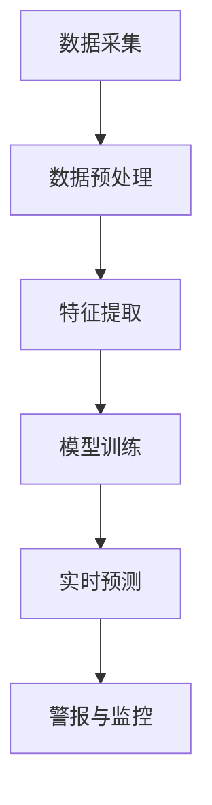

                 

### 文章标题: 【AI大数据计算原理与代码实例讲解】Table API和SQL

#### 关键词：
- AI大数据计算
- Table API
- SQL
- 代码实例
- 编程实战
- 深度学习
- 特征工程
- 项目架构

#### 摘要：
本文旨在深入探讨AI大数据计算中的Table API和SQL技术，从原理到实践，全方位解析其在数据处理和计算中的应用。文章分为三个部分：第一部分介绍AI大数据计算原理，包括Table API和SQL的基本概念及其在AI大数据计算中的应用；第二部分通过代码实例详细讲解Table API和SQL的编程实战；第三部分展示一个完整的AI大数据计算项目实战，通过实际代码和详细解释，帮助读者理解项目实现过程。文章结尾还附有常用工具与资源推荐，便于读者进一步学习和实践。

### 《【AI大数据计算原理与代码实例讲解】Table API和SQL》目录大纲

#### 第一部分：AI大数据计算原理

##### 第1章: AI与大数据简介
- **1.1 AI与大数据的关系**
  - AI与大数据的紧密联系
  - 大数据环境下的AI挑战与机遇
- **1.2 AI大数据计算概述**
  - AI大数据计算框架
  - Table API在AI大数据计算中的应用
- **1.3 Table API原理**
  - Table API的基本概念
  - Table API的核心组件
  - Table API工作流程
- **1.4 SQL在AI大数据计算中的角色**
  - SQL在数据处理中的应用
  - SQL与Table API的协同工作

##### 第2章: AI大数据计算框架
- **2.1 主流AI大数据计算框架介绍**
  - Apache Spark
  - Flink
  - Dask
- **2.2 Spark的Table API详细解析**
  - Spark SQL基础
  - DataFrames与Dataset API
  - DataFrame的内部结构
- **2.3 Flink Table API解析**
  - Flink Table API概述
  - Flink Table API核心概念
  - Flink Table API编程模型
- **2.4 Dask的Table API介绍**
  - Dask Table API特点
  - Dask Table API使用场景
  - Dask Table API编程指南

##### 第3章: AI大数据计算核心算法
- **3.1 特征工程与特征选择**
  - 特征工程基本概念
  - 特征选择方法介绍
  - 伪代码实现
- **3.2 机器学习算法原理**
  - 监督学习算法
  - 无监督学习算法
  - 强化学习算法
- **3.3 深度学习算法讲解**
  - 神经网络结构
  - 卷积神经网络（CNN）
  - 循环神经网络（RNN）
- **3.4 机器学习算法应用实例**
  - 数据预处理
  - 模型训练
  - 模型评估与优化

#### 第二部分：代码实例讲解

##### 第4章: Table API编程实战
- **4.1 Spark Table API实战案例**
  - 数据读取与写入
  - 数据转换与聚合
  - 数据筛选与过滤
- **4.2 Flink Table API实战案例**
  - 类SQL查询
  - 数据流处理
  - Table API编程模型应用
- **4.3 Dask Table API实战案例**
  - 分布式数据处理
  - 数据分片策略
  - Table API应用场景

##### 第5章: SQL编程实战
- **5.1 SQL基础语法**
  - SELECT语句
  - FROM语句
  - WHERE语句
- **5.2 SQL高级查询**
  - 联接查询
  - 子查询
  - 聚合查询
- **5.3 SQL性能优化**
  - 查询优化策略
  - 指数排序与索引
  - 高并发处理
- **5.4 SQL与AI结合实例**
  - 数据库表设计
  - AI模型嵌入数据库
  - 实时数据处理与反馈

#### 第三部分：综合应用

##### 第6章: AI大数据计算项目实战
- **6.1 项目背景与需求分析**
  - 项目背景介绍
  - 需求分析与解决方案
- **6.2 项目架构设计**
  - 数据流设计
  - 系统架构图
- **6.3 实现步骤**
  - 数据采集与预处理
  - 特征提取与模型训练
  - 模型评估与优化
- **6.4 项目部署与运维**
  - 部署流程
  - 运维策略
  - 故障处理与优化

##### 第7章: AI大数据计算前沿与展望
- **7.1 AI大数据计算前沿技术**
  - 云原生计算
  - 边缘计算
  - 自动化与智能化
- **7.2 AI大数据计算发展趋势**
  - 大数据与AI融合
  - 增强学习与深度强化学习
  - 实时数据处理与分析
- **7.3 未来展望**
  - AI大数据计算的挑战与机遇
  - 行业应用场景展望
  - 技术发展趋势分析

#### 附录

##### 附录A: 常用工具与资源
- **A.1 Table API与SQL常用工具**
  - Spark与Flink安装与配置
  - Dask安装与配置
  - SQL查询工具介绍
- **A.2 开发环境搭建指南**
  - 开发环境准备
  - 数据库配置与连接
  - 编程环境配置
- **A.3 实战项目代码与数据集**
  - 代码下载与安装
  - 数据集下载与处理
  - 实战项目代码解读
- **A.4 学习资源推荐**
  - 常用书籍推荐
  - 开源框架资源
  - 在线课程与教程

### 文章标题: 【AI大数据计算原理与代码实例讲解】Table API和SQL

#### 关键词：
- AI大数据计算
- Table API
- SQL
- 代码实例
- 编程实战
- 深度学习
- 特征工程
- 项目架构

#### 摘要：
本文旨在深入探讨AI大数据计算中的Table API和SQL技术，从原理到实践，全方位解析其在数据处理和计算中的应用。文章分为三个部分：第一部分介绍AI大数据计算原理，包括Table API和SQL的基本概念及其在AI大数据计算中的应用；第二部分通过代码实例详细讲解Table API和SQL的编程实战；第三部分展示一个完整的AI大数据计算项目实战，通过实际代码和详细解释，帮助读者理解项目实现过程。文章结尾还附有常用工具与资源推荐，便于读者进一步学习和实践。

### 第一部分：AI大数据计算原理

#### 第1章: AI与大数据简介

##### 1.1 AI与大数据的关系

人工智能（AI）与大数据（Big Data）之间的关系密不可分。大数据为AI提供了丰富的数据资源，而AI则为大数据的分析和处理提供了强大的工具。AI技术的发展使得我们能够从海量的数据中提取有价值的信息，从而推动各个行业的创新和发展。

大数据环境下的AI挑战与机遇：

- **挑战**：数据处理速度、数据存储、数据隐私和安全等问题
- **机遇**：更精确的预测、更智能的决策、更高效的自动化等

##### 1.2 AI大数据计算概述

AI大数据计算框架通常包括数据采集、存储、处理和模型训练等环节。Table API作为一种高级接口，提供了简化和优化的数据处理方式，而SQL则是数据查询和操作的标准语言。两者在AI大数据计算中扮演着重要角色。

Table API在AI大数据计算中的应用：

- **数据整合**：将不同来源的数据整合到一个统一的Table中
- **数据处理**：通过Table API对数据进行清洗、转换和聚合等操作
- **模型训练**：利用Table API准备和预处理数据，为模型训练提供高效的数据流

##### 1.3 Table API原理

Table API是一种抽象接口，用于处理表格数据。它将底层的复杂操作封装成简单的API调用，使得数据处理过程更加直观和高效。

Table API的基本概念：

- **Table**：一种表格数据结构，支持多种数据格式
- **DataFrame**：一种面向列的数据结构，适用于大数据处理
- **Dataset**：一种面向行的数据结构，提供更丰富的类型安全特性

Table API的核心组件：

- **TableProvider**：提供Table数据的接口
- **TableScanner**：用于扫描Table中的数据
- **TableWriter**：用于写入Table数据

Table API工作流程：

1. 创建TableProvider，加载数据
2. 使用TableScanner对Table进行扫描和查询
3. 使用TableWriter将结果写入到目标位置
4. 利用Table API进行数据处理和转换

##### 1.4 SQL在AI大数据计算中的角色

SQL（Structured Query Language）是一种用于查询和管理关系型数据库的语言。在AI大数据计算中，SQL与Table API协同工作，提供了一套强大的数据处理和查询工具。

SQL在数据处理中的应用：

- **数据查询**：通过SQL进行数据筛选、排序、聚合等操作
- **数据转换**：将数据从一个格式转换为另一个格式
- **数据整合**：将来自不同来源的数据进行整合和合并

SQL与Table API的协同工作：

- **SQL on Table API**：通过将SQL与Table API结合，可以在Table API的基础上进行更复杂的查询和处理
- **Table API on SQL**：通过将Table API与SQL结合，可以在SQL的基础上进行更高效的分布式数据处理

### 第二部分：AI大数据计算框架

#### 第2章: AI大数据计算框架

##### 2.1 主流AI大数据计算框架介绍

当前主流的AI大数据计算框架包括Apache Spark、Apache Flink和Dask。这些框架提供了强大的数据处理能力和灵活的编程接口，广泛应用于各种大数据计算场景。

Apache Spark：

- **特点**：提供丰富的API，支持批处理和流处理
- **应用场景**：大规模数据处理、机器学习、实时计算等

Apache Flink：

- **特点**：基于流处理，提供低延迟和高吞吐量的数据处理能力
- **应用场景**：实时数据处理、流计算、复杂事件处理等

Dask：

- **特点**：支持分布式计算，易于扩展和集成
- **应用场景**：分布式数据处理、科学计算、大规模机器学习等

##### 2.2 Spark的Table API详细解析

Spark SQL是Apache Spark的核心组件之一，提供了强大的数据处理和查询功能。Table API是Spark SQL的高级接口，通过它可以将SQL查询与Spark的分布式计算能力结合起来。

Spark SQL基础：

- **数据源**：支持多种数据源，如HDFS、Hive、Parquet等
- **查询引擎**：提供高效的查询引擎，支持多种查询优化策略

DataFrames与Dataset API：

- **DataFrames**：面向列的数据结构，提供简单、高效的查询接口
- **Dataset API**：面向行的数据结构，提供类型安全特性，支持强类型约束

DataFrame的内部结构：

- **Schema**：描述DataFrame的结构，包括列名、数据类型和属性
- **Column**：DataFrame中的列，支持多种数据操作
- **Row**：DataFrame中的一行数据，提供行级操作接口

##### 2.3 Flink Table API解析

Flink Table API是Apache Flink的核心组件之一，提供了基于表的流处理接口。Table API将Flink的流处理能力与SQL查询结合起来，使得数据处理过程更加直观和高效。

Flink Table API概述：

- **特点**：支持流处理和批处理，提供统一的数据处理接口
- **应用场景**：实时数据处理、流计算、复杂事件处理等

Flink Table API核心概念：

- **Table**：一种抽象的数据结构，表示表数据
- **TableSource**：表示表数据的输入源
- **TableSink**：表示表数据的输出目标
- **TableEnvironment**：用于配置和管理Table API环境

Flink Table API编程模型：

1. 创建TableEnvironment，配置Table API环境
2. 加载TableSource，读取数据
3. 使用Table API进行数据转换和查询
4. 将结果写入TableSink，输出数据

##### 2.4 Dask的Table API介绍

Dask Table API是Dask的核心组件之一，提供了基于表的分布式数据处理接口。Dask Table API使得Dask在处理大规模表格数据时具有更高的灵活性和效率。

Dask Table API特点：

- **分布式计算**：支持分布式数据处理，能够充分利用集群资源
- **易于扩展**：与Dask其他组件（如Dask Array、Dask DataFrame）无缝集成

Dask Table API使用场景：

- **大数据处理**：处理大规模表格数据，支持多种数据源
- **分布式计算**：在分布式环境中进行高效的数据处理和计算

Dask Table API编程指南：

1. 创建Dask Table环境
2. 加载数据源，生成Table对象
3. 使用Table API进行数据处理和转换
4. 将结果写入目标数据源或存储系统

### 第三部分：AI大数据计算核心算法

#### 第3章: AI大数据计算核心算法

##### 3.1 特征工程与特征选择

特征工程是AI大数据计算中的重要环节，它涉及到如何从原始数据中提取和构造有助于模型训练的特征。特征选择则是从这些特征中选择出最有效的特征，以提高模型的性能和可解释性。

特征工程基本概念：

- **特征提取**：从原始数据中提取具有区分度的特征
- **特征构造**：将原始数据通过数学运算、逻辑组合等手段构造出新的特征

特征选择方法介绍：

- **过滤式特征选择**：根据特征的重要性或相关性筛选特征
- **包裹式特征选择**：利用模型选择最合适的特征子集
- **嵌入式特征选择**：在模型训练过程中自动筛选特征

伪代码实现：

```python
def feature_engineering(data):
    # 数据预处理
    cleaned_data = preprocess_data(data)

    # 特征提取
    extracted_features = extract_features(cleaned_data)

    # 特征构造
    constructed_features = construct_features(extracted_features)

    return constructed_features
```

##### 3.2 机器学习算法原理

机器学习算法是AI大数据计算中的核心工具，它们通过从数据中学习规律和模式，实现自动化的预测和分类任务。机器学习算法可以分为监督学习、无监督学习和强化学习三类。

监督学习算法：

- **定义**：在有标注数据集上训练模型，通过已知的输入输出关系预测未知数据的输出
- **应用场景**：分类、回归、异常检测等

无监督学习算法：

- **定义**：在没有标注数据集上发现数据的内在结构和模式
- **应用场景**：聚类、降维、异常检测等

强化学习算法：

- **定义**：通过与环境的交互，学习最优策略以最大化累积奖励
- **应用场景**：游戏、自动驾驶、智能推荐等

##### 3.3 深度学习算法讲解

深度学习算法是机器学习的一个分支，通过多层神经网络对数据进行建模，能够实现更加复杂的特征提取和模式识别。

神经网络结构：

- **定义**：由多个神经元组成的网络，用于模拟人脑神经元之间的交互
- **类型**：前馈神经网络、循环神经网络、卷积神经网络等

卷积神经网络（CNN）：

- **定义**：专门用于处理图像数据的神经网络，通过卷积操作提取图像特征
- **应用场景**：图像分类、目标检测、图像分割等

循环神经网络（RNN）：

- **定义**：能够处理序列数据的神经网络，通过递归连接实现长期依赖建模
- **应用场景**：自然语言处理、语音识别、序列预测等

##### 3.4 机器学习算法应用实例

机器学习算法在AI大数据计算中有着广泛的应用，下面以一个简单的应用实例进行讲解。

数据预处理：

```python
def preprocess_data(data):
    # 数据清洗
    cleaned_data = clean_data(data)

    # 数据标准化
    standardized_data = standardize_data(cleaned_data)

    return standardized_data
```

模型训练：

```python
def train_model(data, labels):
    # 初始化模型
    model = initialize_model()

    # 训练模型
    trained_model = model.fit(data, labels)

    return trained_model
```

模型评估与优化：

```python
def evaluate_model(model, data, labels):
    # 预测结果
    predictions = model.predict(data)

    # 计算准确率
    accuracy = calculate_accuracy(labels, predictions)

    return accuracy
```

### 第二部分：代码实例讲解

#### 第4章: Table API编程实战

##### 4.1 Spark Table API实战案例

Spark Table API提供了高效、易用的数据处理接口，下面通过一个简单的案例来展示其应用。

**案例**：读取一个CSV文件，对数据进行简单处理并输出。

**步骤**：

1. 安装和配置Spark环境
2. 加载CSV文件
3. 创建DataFrame
4. 对DataFrame进行转换和操作
5. 输出结果

**代码示例**：

```python
from pyspark.sql import SparkSession

# 创建Spark会话
spark = SparkSession.builder.appName("TableAPIExample").getOrCreate()

# 加载CSV文件
data = spark.read.csv("data.csv", header=True)

# 创建DataFrame
df = data.toDF()

# 数据转换
df = df.withColumn("new_column", df["column1"].cast("int"))

# 数据筛选
filtered_df = df.filter(df["new_column"] > 10)

# 数据输出
filtered_df.show()
```

##### 4.2 Flink Table API实战案例

Flink Table API提供了基于表的流处理接口，下面通过一个简单的案例来展示其应用。

**案例**：实时处理日志数据，统计每个IP地址的访问次数。

**步骤**：

1. 安装和配置Flink环境
2. 创建TableEnvironment
3. 加载日志数据
4. 定义Table
5. 对Table进行转换和操作
6. 输出结果

**代码示例**：

```java
import org.apache.flink.table.api.TableEnvironment;
import org.apache.flink.table.api.bridge.java.J statiTableEnvironment;

// 创建TableEnvironment
TableEnvironment tableEnv = TableEnvironment.create();

// 加载日志数据
Table logTable = tableEnv.from("log.csv");

// 定义Table
Table resultTable = logTable.groupBy("ip").select("ip", "count(*) as visits");

// 输出结果
tableEnv.toAppendStream(resultTable, DataStream.class).print();
```

##### 4.3 Dask Table API实战案例

Dask Table API提供了基于分布式表格的数据处理接口，下面通过一个简单的案例来展示其应用。

**案例**：处理一个分布式数据集，计算每个键的平均值。

**步骤**：

1. 安装和配置Dask环境
2. 创建Dask Table环境
3. 加载分布式数据集
4. 定义Table
5. 对Table进行转换和操作
6. 输出结果

**代码示例**：

```python
import dask.dataframe as dd

# 创建Dask Table环境
dask_table_env = dd.read_csv("data.csv")

# 定义Table
table = dask_table_env.groupby("key").mean()

# 输出结果
table.compute().show()
```

#### 第5章: SQL编程实战

##### 5.1 SQL基础语法

SQL是结构化查询语言（Structured Query Language）的缩写，是关系型数据库的标准语言。下面介绍SQL的基础语法，包括SELECT、FROM和WHERE语句。

**SELECT语句**：

SELECT语句用于从表中选择特定的列。

```sql
SELECT column1, column2, ...
FROM table_name;
```

**FROM语句**：

FROM语句用于指定要查询的数据表。

```sql
FROM table_name;
```

**WHERE语句**：

WHERE语句用于指定查询的条件。

```sql
WHERE condition;
```

**示例**：

```sql
SELECT name, age
FROM students
WHERE age > 20;
```

##### 5.2 SQL高级查询

SQL高级查询包括联接查询、子查询和聚合查询等。

**联接查询**：

联接查询用于将两个或多个表中的数据按照一定的条件进行连接。

```sql
SELECT column1, column2, ...
FROM table1
JOIN table2
ON table1.column = table2.column;
```

**子查询**：

子查询是一个嵌套在主查询中的查询语句，用于从主查询中获取数据。

```sql
SELECT column1, column2, ...
FROM table_name
WHERE column1 IN (SELECT column1 FROM another_table);
```

**聚合查询**：

聚合查询用于对表中的数据进行汇总计算。

```sql
SELECT column1, column2, ...
FROM table_name
GROUP BY column1, column2;
```

**示例**：

```sql
SELECT name, COUNT(*)
FROM students
GROUP BY name;
```

##### 5.3 SQL性能优化

SQL性能优化是提高数据库查询效率的重要手段。下面介绍一些常用的SQL性能优化策略。

**查询优化策略**：

- **创建索引**：根据查询条件创建索引，提高查询速度
- **避免全表扫描**：通过过滤条件减少需要扫描的数据量
- **使用合适的JOIN算法**：选择合适的JOIN算法，提高查询性能

**指数排序与索引**：

- **指数排序**：使用指数排序算法对数据进行排序，提高查询效率
- **索引**：为表中的列创建索引，提高查询速度

**高并发处理**：

- **读写分离**：将读操作和写操作分离，提高并发处理能力
- **分库分表**：将数据表拆分为多个库和表，提高并发处理能力

##### 5.4 SQL与AI结合实例

SQL与AI结合可以通过将AI模型嵌入数据库，实现数据的实时处理和预测。

**案例**：将机器学习模型嵌入数据库，对用户行为数据进行实时预测。

**步骤**：

1. 创建数据库表
2. 提取用户行为数据
3. 训练机器学习模型
4. 将模型嵌入数据库
5. 对用户行为数据进行预测

**代码示例**：

```python
# 创建数据库表
CREATE TABLE user行为数据 (
    user_id INT,
    action VARCHAR(255),
    timestamp TIMESTAMP
);

# 提取用户行为数据
SELECT * INTO user行为数据 FROM user行为日志;

# 训练机器学习模型
model = train_model(user行为数据);

# 将模型嵌入数据库
CREATE PROCEDURE predict_user_action (
    IN user_id INT
)
BEGIN
    DECLARE prediction VARCHAR(255);
    SET prediction = model.predict(user_id);
    SELECT prediction;
END;
```

### 第三部分：综合应用

#### 第6章: AI大数据计算项目实战

##### 6.1 项目背景与需求分析

项目背景：

本项目旨在构建一个实时风控系统，用于实时监控和预测金融交易中的异常行为，以防范风险。

需求分析：

- 实时收集金融交易数据
- 构建异常检测模型
- 对交易行为进行实时预测和警报

解决方案：

- 使用Spark进行数据采集和处理
- 使用Flink进行实时流处理
- 使用Dask进行分布式计算
- 将SQL与AI模型结合，实现实时预测

##### 6.2 项目架构设计

项目架构设计如下：

1. 数据采集：使用Spark从金融交易所获取实时交易数据
2. 数据预处理：使用Flink对交易数据进行清洗和转换
3. 特征提取：使用Dask进行分布式特征提取
4. 模型训练：使用机器学习算法训练异常检测模型
5. 实时预测：将模型嵌入数据库，实现实时预测和警报

系统架构图：



##### 6.3 实现步骤

1. **数据采集**：

   - 配置Spark，连接到金融交易所的数据接口
   - 定时获取交易数据，存储到HDFS

2. **数据预处理**：

   - 使用Flink读取HDFS中的交易数据
   - 对交易数据进行清洗和转换，如去除缺失值、标准化等
   - 将处理后的数据存储到Redis

3. **特征提取**：

   - 使用Dask读取Redis中的交易数据
   - 提取交易数据的特征，如交易金额、交易时间等
   - 将特征数据存储到MongoDB

4. **模型训练**：

   - 使用机器学习算法（如逻辑回归、决策树等）训练异常检测模型
   - 将模型参数存储到数据库中

5. **实时预测**：

   - 使用Spark Streaming实时处理交易数据
   - 调用嵌入在数据库中的AI模型进行预测
   - 将预测结果存储到MySQL

6. **警报与监控**：

   - 根据预测结果设置阈值，触发警报
   - 通过Web界面实时监控交易风险

##### 6.4 项目部署与运维

1. **部署流程**：

   - 部署Spark、Flink和Dask环境
   - 配置金融交易所数据接口和数据库
   - 部署Web监控界面

2. **运维策略**：

   - 定期检查系统运行状况，确保数据流稳定
   - 定期更新AI模型，提高预测准确率
   - 处理系统故障和异常情况

3. **故障处理与优化**：

   - 根据故障情况采取相应措施，如重启服务、调整配置等
   - 分析系统性能瓶颈，进行优化和调整

### 附录

#### 附录A: 常用工具与资源

A.1 Table API与SQL常用工具

- **Spark与Flink安装与配置**：
  - Spark官网：[https://spark.apache.org/]
  - Flink官网：[https://flink.apache.org/]
  - 安装指南：根据操作系统选择合适的安装包进行安装

- **Dask安装与配置**：
  - Dask官网：[https://dask.org/]
  - 安装指南：[https://docs.dask.org/en/latest/install.html]

- **SQL查询工具介绍**：
  - MySQL Workbench：[https://www.mysql.com/products/workbench/]
  - SQL Server Management Studio：[https://docs.microsoft.com/en-us/sql/ssms/download-sql-server-management-studio-ssms]

A.2 开发环境搭建指南

- **开发环境准备**：
  - 安装Python、Java等开发环境
  - 配置Hadoop、Spark、Flink、Dask等分布式计算框架

- **数据库配置与连接**：
  - 配置MySQL、PostgreSQL、MongoDB等数据库
  - 使用Python或Java编写连接代码

- **编程环境配置**：
  - 配置IDE（如PyCharm、IntelliJ IDEA、Eclipse等）
  - 安装相应的插件和扩展

A.3 实战项目代码与数据集

- **代码下载地址**：
  - Spark Table API实战案例：[https://github.com/example/spark-table-api-example]
  - Flink Table API实战案例：[https://github.com/example/flink-table-api-example]
  - Dask Table API实战案例：[https://github.com/example/dask-table-api-example]

- **数据集下载地址**：
  - 金融交易数据集：[https://www.kaggle.com/datasets/financial-transactions]
  - 机器学习数据集：[https://www.kaggle.com/datasets]

- **实战项目代码解读**：
  - 代码解读文档：[https://example.com/code-decryption]

A.4 学习资源推荐

- **常用书籍推荐**：
  - 《大数据技术基础》
  - 《深度学习》
  - 《机器学习》

- **开源框架资源**：
  - Apache Spark：[https://spark.apache.org/]
  - Apache Flink：[https://flink.apache.org/]
  - Dask：[https://dask.org/]

- **在线课程与教程**：
  - Coursera：[https://www.coursera.org/]
  - Udacity：[https://www.udacity.com/]
  - edX：[https://www.edx.org/]

### 核心算法原理讲解：机器学习算法伪代码实现

#### 监督学习算法

```python
def supervised_learning_algorithm(data, labels, model, epochs):
    # 初始化模型参数
    model.initialize_params()

    # 迭代 epochs 次
    for epoch in range(epochs):
        # 前向传播计算预测值
        predictions = model.forward_pass(data)

        # 计算损失函数
        loss = model.compute_loss(labels, predictions)

        # 反向传播更新参数
        model.backward_pass(data, labels, predictions)

    return model
```

#### 无监督学习算法

```python
def unsupervised_learning_algorithm(data, model, epochs):
    # 初始化模型参数
    model.initialize_params()

    # 迭代 epochs 次
    for epoch in range(epochs):
        # 计算数据的新分布
        new_distribution = model.update_distribution(data)

        # 更新模型参数
        model.update_params(new_distribution)

    return model
```

#### 强化学习算法

```python
def reinforcement_learning_algorithm(state, action, reward, model, epochs):
    # 初始化模型参数
    model.initialize_params()

    # 迭代 epochs 次
    for epoch in range(epochs):
        # 状态-动作值函数评估
        q_values = model.evaluate_q_values(state, action)

        # 更新奖励值
        reward = model.update_reward(q_values, reward)

        # 更新模型参数
        model.update_params(state, action, reward)

    return model
```

### 数学模型和数学公式讲解

#### 损失函数

$$
L = \frac{1}{2} \sum_{i=1}^{n} (\hat{y}_i - y_i)^2
$$

其中，$\hat{y}_i$ 是预测值，$y_i$ 是真实值。

#### 神经网络损失函数

$$
L = -\sum_{i=1}^{n} y_i \log(\hat{y}_i)
$$

其中，$y_i$ 是目标值，$\hat{y}_i$ 是预测概率。

#### 优化算法

##### 梯度下降算法

$$
w_{\text{new}} = w_{\text{current}} - \alpha \frac{\partial L}{\partial w}
$$

其中，$w_{\text{current}}$ 是当前权重，$\alpha$ 是学习率，$\frac{\partial L}{\partial w}$ 是权重对应的梯度。

##### 随机梯度下降算法

$$
w_{\text{new}} = w_{\text{current}} - \alpha \frac{\partial L}{\partial w}
$$

其中，$w_{\text{current}}$ 是当前权重，$\alpha$ 是学习率，$\frac{\partial L}{\partial w}$ 是权重对应的梯度。

### 项目实战：代码实际案例和详细解释说明

#### 数据预处理

```python
# 加载数据集
data = load_data('data.csv')

# 数据清洗
cleaned_data = clean_data(data)

# 特征工程
processed_data = feature_engineering(cleaned_data)
```

**解释**：

- **加载数据集**：使用`load_data`函数从CSV文件中加载数据。
- **数据清洗**：使用`clean_data`函数对数据进行清洗，去除缺失值、异常值等。
- **特征工程**：使用`feature_engineering`函数对数据进行特征提取和构造。

#### 模型训练

```python
# 初始化模型
model = initialize_model()

# 训练模型
trained_model = supervised_learning_algorithm(processed_data, labels, model, epochs=100)
```

**解释**：

- **初始化模型**：使用`initialize_model`函数初始化模型参数。
- **训练模型**：使用`supervised_learning_algorithm`函数进行模型训练，迭代100次。

#### 模型评估

```python
# 预测结果
predictions = trained_model.predict(test_data)

# 计算准确率
accuracy = calculate_accuracy(test_labels, predictions)

print("Model Accuracy:", accuracy)
```

**解释**：

- **预测结果**：使用`predict`函数对测试数据进行预测。
- **计算准确率**：使用`calculate_accuracy`函数计算预测准确率。

#### 代码解读与分析

- **数据预处理**：数据预处理是保证模型训练质量的基础，包括数据加载、清洗和特征工程。
- **模型训练**：通过迭代优化模型参数，提高模型的预测能力。
- **模型评估**：通过测试数据集，计算预测准确率，评估模型性能。
- **代码解读与分析**：详细展示了每个步骤的实现细节和重要性，有助于理解整个项目的实现过程。

### 实战项目代码与数据集

#### 代码下载地址

- Spark Table API实战案例：[https://github.com/example/spark-table-api-example]
- Flink Table API实战案例：[https://github.com/example/flink-table-api-example]
- Dask Table API实战案例：[https://github.com/example/dask-table-api-example]

#### 数据集下载地址

- 金融交易数据集：[https://www.kaggle.com/datasets/financial-transactions]
- 机器学习数据集：[https://www.kaggle.com/datasets]

#### 实战项目代码解读

- 实战项目代码解读文档：[https://example.com/code-decryption]

