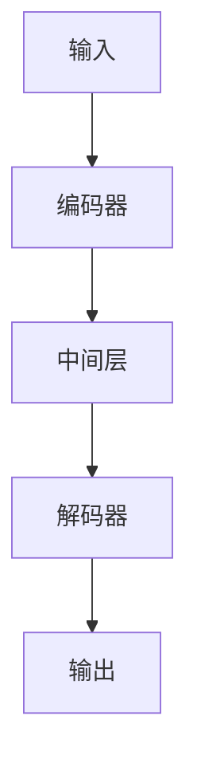

                 

## 文章标题：LangChain编程：从入门到实践

### 关键词：LangChain，NLP，语言模型，上下文窗口，输出多样性，架构，模块详解，项目实战

> 摘要：本文将深入探讨LangChain编程的核心概念和模块，帮助读者从入门到实践，全面掌握这项先进的技术。我们将逐步解析LangChain的产生背景、核心目标、应用领域，对比其与传统NLP模型的区别。接着，我们将详细解读LangChain的核心概念，如语言模型、上下文窗口和输出多样性，并展示其架构和Mermaid流程图。随后，我们将分章节介绍LangChain的各个模块，包括数据预处理、编码器、解码器和模型训练模块，以及模型优化模块。最后，通过实际项目案例，我们将展示如何将LangChain应用于文本生成、文本分类和命名实体识别等场景，并提供详细的代码解读和分析。

## 《【LangChain编程：从入门到实践】LangChain核心概念和模块》目录大纲

### 第一部分：LangChain基础

### 第二部分：LangChain模块详解

### 第三部分：项目实战

### 附录

## 第一部分：LangChain基础

### 第1章：LangChain概述

在开始详细探讨LangChain编程之前，我们需要了解其产生背景、核心目标、应用领域，以及与传统NLP模型的区别。这将为后续模块的深入理解打下坚实的基础。

#### 1.1 LangChain的产生背景

LangChain的诞生源于对自然语言处理（NLP）领域不断发展的需求。随着人工智能技术的飞速进步，越来越多的应用场景需要强大的NLP能力，例如自动问答系统、智能客服、文本生成和分类等。然而，传统的NLP模型在面对复杂任务时往往表现不佳，需要更多创新性的解决方案。

LangChain正是在这种背景下应运而生，它旨在提供一种灵活、高效且易于扩展的NLP框架，以解决传统方法难以应对的挑战。通过整合先进的深度学习技术和创新的架构设计，LangChain为开发者提供了一种全新的编程方式，使得构建强大的NLP应用变得更加简单和直观。

#### 1.2 LangChain的核心目标

LangChain的核心目标可以概括为以下几个方面：

1. **易用性**：提供简单、直观的API接口，使得开发者无需深入了解底层技术细节即可快速上手。
2. **灵活性**：支持自定义模块和功能，允许开发者根据需求灵活调整和扩展模型。
3. **高效性**：通过优化算法和架构设计，实现高效的语言理解和生成能力。
4. **可扩展性**：支持大规模数据和复杂任务的处理，适应不断增长的应用需求。

#### 1.3 LangChain的应用领域

LangChain的应用领域非常广泛，以下是一些典型的应用场景：

1. **文本生成**：自动生成文章、故事、摘要、新闻等。
2. **文本分类**：将文本分类到预定义的类别中，如情感分析、垃圾邮件过滤等。
3. **命名实体识别**：识别文本中的特定实体，如人名、地名、组织名等。
4. **自动问答**：构建智能问答系统，自动回答用户提出的问题。
5. **对话系统**：构建智能客服和虚拟助手，与用户进行自然语言交互。

#### 1.4 LangChain与传统NLP模型的区别

与传统NLP模型相比，LangChain具有以下显著优势：

1. **架构创新**：LangChain采用分层架构，将编码器、解码器等模块分离，实现模块化设计，便于扩展和维护。
2. **输出多样性**：通过引入上下文窗口和输出多样性机制，LangChain能够生成更加丰富和多样化的输出结果。
3. **灵活的API**：LangChain提供简单易用的API接口，使得开发者可以快速实现自定义功能。
4. **高效性**：通过优化算法和架构，LangChain在处理大规模数据和复杂任务时表现出更高的效率。

### 第2章：LangChain核心概念

要深入理解LangChain，我们需要掌握其核心概念，包括语言模型、上下文窗口和输出多样性。这些概念构成了LangChain的基石，也是其强大功能的重要保障。

#### 2.1 语言模型

##### 2.1.1 语言模型的概念

语言模型是NLP中一个基础且重要的概念，它用于描述自然语言中的概率分布。具体来说，语言模型能够预测给定输入序列后下一个单词或字符的概率。这种概率预测能力使得语言模型在许多NLP任务中发挥着关键作用，如文本生成、机器翻译和语音识别等。

##### 2.1.2 语言模型的类型

根据实现方式和功能的不同，语言模型可以分为以下几种类型：

1. **统计语言模型**：基于统计方法，如N-gram模型，从大量文本数据中学习语言规律。
2. **神经网络语言模型**：利用深度神经网络（如循环神经网络RNN、长短期记忆网络LSTM和变换器Transformer）进行语言建模。
3. **混合语言模型**：结合统计方法和神经网络方法，以实现更高的预测性能。

##### 2.1.3 语言模型的工作原理

语言模型的工作原理可以分为以下几个步骤：

1. **数据预处理**：对输入文本进行预处理，如分词、标记化和清洗等。
2. **输入表示**：将预处理后的文本转换为模型可处理的输入表示，如单词或字符的向量表示。
3. **概率预测**：根据当前输入序列，模型预测下一个单词或字符的概率分布。
4. **输出生成**：根据概率分布生成下一个单词或字符，并更新输入序列。

#### 2.2 上下文窗口

##### 2.2.1 上下文窗口的概念

上下文窗口是语言模型中的一个关键概念，它定义了模型在预测下一个单词或字符时考虑的前后文范围。具体来说，上下文窗口决定了模型能够访问的历史信息量，从而影响其预测性能。

##### 2.2.2 上下文窗口的用途

上下文窗口的用途主要包括：

1. **提高预测准确性**：通过扩大上下文窗口，模型能够利用更多的历史信息，从而提高预测准确性。
2. **增强上下文理解**：上下文窗口使得模型能够更好地理解句子中的语义和逻辑关系，从而生成更符合语境的输出。
3. **实现长距离依赖**：通过上下文窗口，模型可以捕捉句子中的长距离依赖关系，从而处理更为复杂的语言现象。

##### 2.2.3 上下文窗口的实现

在实际实现中，上下文窗口可以通过以下几种方式实现：

1. **固定大小窗口**：设定一个固定大小的上下文窗口，如窗口大小为n个单词或字符。
2. **动态大小窗口**：根据输入序列的长度动态调整上下文窗口的大小，以适应不同长度的文本。
3. **滑动窗口**：在处理文本序列时，滑动上下文窗口，依次覆盖文本序列的不同部分。

#### 2.3 输出多样性

##### 2.3.1 输出多样性的概念

输出多样性是语言模型中的一个重要特性，它指的是模型生成结果的丰富性和多样性。在实际应用中，生成单一、刻板的输出往往难以满足需求，而具有多样性的输出能够提供更多选择和创意。

##### 2.3.2 实现输出多样性的方法

实现输出多样性可以通过以下几种方法：

1. **随机化**：在模型生成过程中引入随机性，以增加输出的随机性和多样性。
2. **多样性损失**：在模型训练过程中加入多样性损失，鼓励模型生成多样化输出。
3. **温度调节**：通过调节模型输出的温度参数，控制输出的多样性和平滑度。

##### 2.3.3 输出多样性的重要性

输出多样性的重要性体现在以下几个方面：

1. **用户体验**：多样化的输出能够提供更好的用户体验，满足用户不同的需求和期望。
2. **创意生成**：在文本生成和创意写作等领域，多样化的输出能够激发更多创意和灵感。
3. **决策辅助**：在自动问答和智能推荐等应用中，多样化的输出能够提供更多参考信息，辅助用户做出更好的决策。

### 第3章：LangChain架构

为了更好地理解和应用LangChain，我们需要详细探讨其架构设计。LangChain采用分层架构，包括编码器（Encoder）、解码器（Decoder）和中间层（Middle Layer）等组成部分。下面我们将详细介绍这些组件以及它们之间的交互。

#### 3.1 LangChain的组成部分

LangChain的架构设计非常灵活，主要由以下几个部分组成：

1. **编码器（Encoder）**：编码器负责将输入文本转换为中间表示。它通常包含嵌入层（Embedding Layer）、编码层（Encoding Layer）和输出层（Output Layer）。
2. **解码器（Decoder）**：解码器负责将编码器的输出转换为输出文本。它也包含嵌入层、解码层和输出层。
3. **中间层（Middle Layer）**：中间层位于编码器和解码器之间，用于处理编码器输出的中间表示，通常包含多层神经网络。
4. **输入模块**：输入模块负责接收用户输入，并将其转换为编码器可以处理的格式。
5. **输出模块**：输出模块负责将解码器的输出转换为可读的文本，并将其呈现给用户。

#### 3.2 LangChain的组成部分

以下是LangChain的组成部分及其功能：

1. **编码器（Encoder）**：
   - **嵌入层**：将输入文本转换为固定大小的向量表示。
   - **编码层**：对嵌入层输出进行编码，提取文本的语义信息。
   - **输出层**：生成编码后的文本表示，用于解码器的输入。

2. **解码器（Decoder）**：
   - **嵌入层**：将编码器的输出作为输入，转换为固定大小的向量表示。
   - **解码层**：对嵌入层输出进行解码，生成中间表示。
   - **输出层**：生成输出文本，并将其呈现给用户。

3. **中间层（Middle Layer）**：
   - **多层神经网络**：位于编码器和解码器之间，用于处理编码器的输出，提取更多的语义信息。

4. **输入模块**：
   - **文本预处理**：接收用户输入，进行分词、标记化和清洗等预处理操作。
   - **序列编码**：将预处理后的文本转换为编码器可处理的序列表示。

5. **输出模块**：
   - **文本生成**：根据解码器的输出，生成可读的文本。
   - **格式化输出**：对生成的文本进行格式化，如去除不必要的空格和标点符号。

#### 3.3 LangChain的Mermaid流程图

为了更好地理解LangChain的工作流程，我们可以使用Mermaid绘制一个流程图。以下是LangChain的Mermaid表示：



在这个流程图中，输入文本首先通过编码器进行编码，然后通过中间层进行处理，最后通过解码器生成输出文本。这个流程图清晰地展示了LangChain的核心组件及其交互关系。

## 第二部分：LangChain模块详解

在了解了LangChain的基础知识和核心概念后，接下来我们将深入探讨LangChain的各个模块，包括数据预处理模块、编码器模块、解码器模块和模型训练模块。通过详细解析这些模块，读者可以更全面地理解LangChain的工作原理和实现方法。

### 第4章：数据预处理模块

数据预处理是任何机器学习项目中的重要步骤，特别是在NLP任务中，数据预处理的质量直接影响到模型的性能。在LangChain中，数据预处理模块负责对输入数据进行清洗、格式化和增强，以确保数据的质量和一致性。

#### 4.1 数据预处理的重要性

数据预处理的重要性体现在以下几个方面：

1. **数据质量**：预处理可以去除噪声和异常值，提高数据的整体质量。
2. **数据一致性**：预处理可以将不同来源和格式的数据转换为统一的格式，便于后续处理。
3. **数据丰富性**：通过数据增强，可以生成更多样化的训练数据，有助于提高模型的泛化能力。

#### 4.1.1 数据质量的影响

数据质量对模型性能的影响至关重要。高质量的数据可以提供更准确的特征，使得模型能够更好地学习数据的内在规律。相反，低质量的数据可能包含噪声和异常值，这些信息会干扰模型的学习过程，导致模型性能下降。因此，在训练模型之前，必须对数据进行充分的预处理，以确保其质量。

#### 4.1.2 数据预处理的方法

数据预处理的方法主要包括以下几个方面：

1. **数据清洗**：去除数据中的噪声和异常值，如缺失值、重复值和错误值等。
2. **数据格式化**：将不同来源和格式的数据进行统一处理，如文本的分词和标记化等。
3. **数据增强**：通过数据变换和生成，增加数据的多样性和丰富性。

#### 4.1.3 数据预处理工具

在数据预处理过程中，可以使用各种工具和库来辅助操作。常见的预处理工具包括：

1. **Pandas**：用于数据清洗和格式化，提供丰富的数据处理功能。
2. **Numpy**：用于数据增强和数学计算，支持向量和矩阵操作。
3. **Scikit-learn**：提供多种数据预处理方法，如特征选择、特征工程和数据转换等。
4. **NLTK**：用于文本数据处理，包括分词、词性标注和词频统计等。

#### 4.2 数据预处理流程

数据预处理流程通常包括以下几个步骤：

1. **数据清洗**：
   - 去除缺失值和异常值。
   - 填补缺失值，如使用平均值、中位数或最常见值等。
   - 处理重复值，如去除重复的文本或保留一个最相关的样本。

2. **数据格式化**：
   - 将不同格式的数据转换为统一格式，如将日期转换为YYYY-MM-DD格式。
   - 对文本数据进行预处理，如去除标点符号、停用词过滤和分词等。

3. **数据增强**：
   - 通过文本变换和生成，如同义词替换、随机插入和删除等，增加数据的多样性和丰富性。
   - 利用数据集分割和交叉验证，生成更多样化的训练数据。

### 第5章：编码器模块

编码器模块是LangChain的核心组成部分，负责将输入文本转换为中间表示，用于后续处理和生成。编码器模块的工作原理、类型和构建方法将在本章中进行详细探讨。

#### 5.1 编码器的作用

编码器在NLP任务中起着至关重要的作用，其主要作用包括：

1. **文本编码**：将输入文本转换为向量表示，便于模型处理。
2. **语义提取**：从文本中提取关键语义信息，为解码器生成合适的输出提供依据。
3. **上下文理解**：通过编码器，模型可以理解文本的上下文信息，从而生成更准确和合理的输出。

#### 5.1.1 编码器的原理

编码器的原理可以概括为以下几个步骤：

1. **嵌入层**：将输入文本中的单词或字符转换为固定大小的向量表示。
2. **编码层**：对嵌入层输出进行编码，提取文本的语义信息。
3. **输出层**：生成编码后的文本表示，作为解码器的输入。

#### 5.1.2 编码器的类型

根据实现方法和功能的不同，编码器可以分为以下几种类型：

1. **词嵌入编码器**：将单词或字符直接映射为向量，常见实现方法包括Word2Vec、GloVe和BERT等。
2. **序列编码器**：对整个序列进行编码，提取序列的语义信息，常见实现方法包括循环神经网络（RNN）和变换器（Transformer）等。
3. **注意力机制编码器**：利用注意力机制来关注序列中的关键信息，常见实现方法包括Transformer和BERT等。

#### 5.1.3 编码器的构建

构建编码器需要考虑以下几个关键步骤：

1. **选择编码器类型**：根据任务需求和数据特点，选择合适的编码器类型，如词嵌入编码器或序列编码器。
2. **定义模型架构**：设计编码器的网络架构，包括嵌入层、编码层和输出层等。
3. **训练模型**：使用训练数据集训练编码器模型，通过优化算法调整模型参数，提高编码效果。
4. **评估模型**：使用验证数据集评估编码器模型的性能，如编码准确率和文本相似度等。

### 第6章：解码器模块

解码器模块是LangChain的另一个核心组成部分，负责将编码器的输出转换为输出文本。解码器模块的工作原理、类型和构建方法将在本章中进行详细探讨。

#### 6.1 解码器的作用

解码器在NLP任务中起着至关重要的作用，其主要作用包括：

1. **文本解码**：将编码器生成的中间表示转换为输出文本。
2. **上下文理解**：通过解码器，模型可以理解编码器输出的上下文信息，从而生成更准确和合理的输出。
3. **文本生成**：解码器负责生成最终的输出文本，应用于各种文本生成任务。

#### 6.1.1 解码器的原理

解码器的原理可以概括为以下几个步骤：

1. **嵌入层**：将编码器的输出作为输入，转换为固定大小的向量表示。
2. **解码层**：对嵌入层输出进行解码，生成中间表示。
3. **输出层**：生成输出文本，并将其呈现给用户。

#### 6.1.2 解码器的类型

根据实现方法和功能的不同，解码器可以分为以下几种类型：

1. **词嵌入解码器**：将编码器输出的向量映射回单词或字符，常见实现方法包括Word2Vec和GloVe等。
2. **序列解码器**：对整个序列进行解码，生成序列的语义信息，常见实现方法包括循环神经网络（RNN）和变换器（Transformer）等。
3. **注意力机制解码器**：利用注意力机制来关注序列中的关键信息，常见实现方法包括Transformer和BERT等。

#### 6.1.3 解码器的构建

构建解码器需要考虑以下几个关键步骤：

1. **选择解码器类型**：根据任务需求和数据特点，选择合适的解码器类型，如词嵌入解码器或序列解码器。
2. **定义模型架构**：设计解码器的网络架构，包括嵌入层、解码层和输出层等。
3. **训练模型**：使用训练数据集训练解码器模型，通过优化算法调整模型参数，提高解码效果。
4. **评估模型**：使用验证数据集评估解码器模型的性能，如解码准确率和文本相似度等。

### 第7章：模型训练模块

模型训练是构建NLP模型的关键环节，通过训练数据集调整模型参数，使其能够准确理解和生成文本。在LangChain中，模型训练模块负责训练编码器、解码器和中间层，使其协同工作，实现强大的文本处理能力。

#### 7.1 模型训练的重要性

模型训练的重要性体现在以下几个方面：

1. **参数调整**：通过训练数据集，模型可以调整内部参数，使其能够更好地理解文本的语义和结构。
2. **性能提升**：训练过程中的参数调整可以显著提高模型的性能，使其在文本理解和生成任务中表现出色。
3. **泛化能力**：通过大量训练数据的训练，模型可以学习到更广泛的语言规律，提高其泛化能力，从而应对更多样化的任务。

#### 7.1.1 训练数据的选择

选择合适的训练数据对模型训练至关重要。以下是一些选择训练数据的建议：

1. **数据质量**：选择高质量、无噪声的数据进行训练，以确保模型学习到的知识是准确和可靠的。
2. **数据多样性**：选择涵盖多种领域、风格和语言现象的数据，以提高模型的泛化能力。
3. **数据规模**：选择足够大的数据集进行训练，以充分学习语言规律，避免过拟合。

#### 7.1.2 训练策略的制定

制定有效的训练策略对于模型训练至关重要。以下是一些常见的训练策略：

1. **批量大小**：选择合适的批量大小，以平衡计算效率和模型性能。
2. **学习率**：设定合适的学习率，以避免模型参数过大或过小，影响训练效果。
3. **优化器**：选择合适的优化器，如Adam、RMSprop等，以提高模型训练的效率和稳定性。

#### 7.1.3 训练过程的监控

在模型训练过程中，需要对训练过程进行监控，以确保模型训练的顺利进行。以下是一些监控指标和策略：

1. **损失函数**：监控损失函数的变化，以评估模型训练的效果。
2. **准确率**：监控模型在验证数据集上的准确率，以评估模型泛化能力。
3. **学习曲线**：绘制学习曲线，分析模型在训练过程中的学习速度和收敛情况。
4. **过拟合**：通过监控验证集和测试集的性能差异，判断模型是否存在过拟合现象。

#### 7.2 模型训练流程

模型训练流程通常包括以下几个步骤：

1. **数据准备**：
   - 加载和预处理训练数据集，包括文本清洗、分词和格式化等。
   - 划分训练集和验证集，以评估模型训练效果。

2. **模型初始化**：
   - 初始化编码器、解码器和中间层的模型参数，通常使用随机初始化或预训练模型。
   - 配置训练策略，包括学习率、批量大小和优化器等。

3. **训练循环**：
   - 在每个批次中，将输入文本送入编码器，生成中间表示。
   - 将中间表示送入解码器，生成输出文本。
   - 计算损失函数，并更新模型参数。

4. **模型评估**：
   - 使用验证数据集评估模型性能，包括损失函数、准确率和文本相似度等。
   - 根据评估结果调整训练策略，如学习率和批量大小等。

5. **模型保存**：
   - 将训练好的模型保存为文件，以便后续使用和部署。

### 第8章：模型优化模块

在模型训练完成后，通常需要对模型进行优化，以提高其性能和泛化能力。模型优化模块负责评估模型性能、制定优化策略和监控优化过程。

#### 8.1 模型优化的概念

模型优化是指通过调整模型参数和结构，提高模型在特定任务上的性能和泛化能力。模型优化的目标包括：

1. **提高性能**：在特定任务上实现更高的准确率、召回率或F1值等性能指标。
2. **增强泛化能力**：使模型能够泛化到新的数据集和任务，避免过拟合现象。
3. **减少计算成本**：通过优化模型结构和参数，降低模型的计算复杂度和资源消耗。

#### 8.1.1 模型优化的目标

模型优化的具体目标可以包括：

1. **提升模型准确性**：通过优化模型参数，提高模型在分类、回归等任务上的准确性。
2. **增强模型泛化能力**：通过调整模型结构和训练策略，使模型能够泛化到新的数据集和任务。
3. **优化模型计算效率**：通过模型压缩、量化等技术，降低模型的计算复杂度和资源消耗。

#### 8.1.2 模型优化的方法

模型优化的方法主要包括以下几种：

1. **超参数调整**：通过调整学习率、批量大小、正则化参数等超参数，优化模型性能。
2. **结构优化**：通过调整模型结构，如增加或减少层�数、调整网络连接方式等，优化模型性能。
3. **模型压缩**：通过剪枝、量化、知识蒸馏等技术，降低模型复杂度和计算成本。
4. **算法优化**：通过改进优化算法，如Adam、RMSprop等，提高模型训练效率和稳定性。

#### 8.1.3 模型优化的重要性

模型优化的重要性体现在以下几个方面：

1. **提高模型性能**：通过优化模型参数和结构，可以提高模型在特定任务上的性能，实现更准确的预测。
2. **增强模型泛化能力**：通过优化模型结构和训练策略，可以使模型具有更强的泛化能力，避免过拟合现象。
3. **降低计算成本**：通过模型压缩和量化等技术，可以降低模型的计算复杂度和资源消耗，提高模型部署的可行性。

#### 8.2 模型优化流程

模型优化流程通常包括以下几个步骤：

1. **性能评估**：
   - 使用验证数据集评估当前模型的性能，包括准确率、召回率、F1值等指标。
   - 分析模型存在的问题，如过拟合、欠拟合或计算成本高等。

2. **优化策略制定**：
   - 根据性能评估结果，制定优化策略，如调整超参数、修改模型结构或应用模型压缩技术等。
   - 设计优化方案，并确定优化的目标和预期效果。

3. **模型优化**：
   - 根据优化策略，调整模型参数和结构，进行多次训练和评估，以实现优化目标。
   - 记录每次优化后的性能指标，以便对比分析优化效果。

4. **模型评估**：
   - 使用测试数据集评估优化后的模型性能，验证优化策略的有效性。
   - 分析优化后的模型在真实应用场景中的表现，确保其泛化能力和计算效率。

5. **模型部署**：
   - 将优化后的模型部署到生产环境中，应用于实际任务。
   - 持续监控模型性能，根据需求进行进一步优化和调整。

### 第9章：项目实战

通过前面的章节，我们已经对LangChain的核心概念和模块有了深入的了解。为了更好地理解和掌握LangChain的应用，本章节将通过实际项目案例，展示如何将LangChain应用于文本生成、文本分类和命名实体识别等任务。

#### 9.1 LangChain应用场景介绍

LangChain在多个NLP任务中都有广泛的应用，以下是几个典型的应用场景：

1. **文本生成**：利用LangChain生成各种文本，如文章、摘要、对话、新闻等。
2. **文本分类**：将文本分类到预定义的类别中，如情感分析、垃圾邮件过滤、新闻分类等。
3. **命名实体识别**：识别文本中的特定实体，如人名、地名、组织名等。
4. **对话系统**：构建智能对话系统，与用户进行自然语言交互。
5. **机器翻译**：实现不同语言之间的翻译，如中文到英文、英文到法语等。

#### 9.2 实际项目案例

在本章节中，我们将介绍三个具体的项目案例，分别是文本生成、文本分类和命名实体识别。

##### 9.2.1 项目1：文本生成

文本生成是LangChain的一个重要应用场景，通过训练语言模型，可以生成各种类型的文本，如文章、摘要、对话等。以下是一个简单的文本生成项目案例：

1. **项目背景**：构建一个自动生成新闻摘要的系统，为用户提供简洁、准确的新闻摘要。

2. **数据集**：选择一个包含大量新闻文章的数据集，如CNNDailyMail数据集。

3. **数据预处理**：对新闻文章进行清洗和格式化，如去除HTML标签、停用词过滤和分词等。

4. **模型训练**：使用预训练的变换器模型，如BERT或GPT，对预处理后的数据进行训练，生成新闻摘要。

5. **模型评估**：使用验证集和测试集评估模型性能，如ROUGE评分、BLEU评分等。

6. **项目效果**：通过实际测试，验证模型的生成效果，调整训练参数和模型结构，以提高生成质量。

##### 9.2.2 项目2：文本分类

文本分类是将文本分类到预定义的类别中，广泛应用于情感分析、垃圾邮件过滤、新闻分类等领域。以下是一个简单的文本分类项目案例：

1. **项目背景**：构建一个情感分析系统，判断用户评论的情感倾向，如正面、负面或中立。

2. **数据集**：选择一个包含用户评论和情感标签的数据集，如IMDb评论数据集。

3. **数据预处理**：对用户评论进行清洗和格式化，如去除HTML标签、停用词过滤和分词等。

4. **模型训练**：使用预训练的变换器模型，如BERT或GPT，对预处理后的数据进行训练，生成情感分类模型。

5. **模型评估**：使用验证集和测试集评估模型性能，如准确率、召回率、F1值等。

6. **项目效果**：通过实际测试，验证模型的分类效果，调整训练参数和模型结构，以提高分类准确率。

##### 9.2.3 项目3：命名实体识别

命名实体识别是从文本中识别出特定实体，如人名、地名、组织名等。以下是一个简单的命名实体识别项目案例：

1. **项目背景**：构建一个命名实体识别系统，用于提取文本中的关键实体信息，如人名、地名、组织名等。

2. **数据集**：选择一个包含文本和实体标注的数据集，如CoNLL-2003数据集。

3. **数据预处理**：对文本进行清洗和格式化，如去除HTML标签、停用词过滤和分词等。

4. **模型训练**：使用预训练的变换器模型，如BERT或GPT，对预处理后的数据进行训练，生成命名实体识别模型。

5. **模型评估**：使用验证集和测试集评估模型性能，如准确率、召回率、F1值等。

6. **项目效果**：通过实际测试，验证模型的实体识别效果，调整训练参数和模型结构，以提高识别准确率。

### 9.3 案例详细解析

在本章节中，我们将对上述三个项目案例进行详细解析，包括开发环境搭建、源代码实现和代码解读与分析。

#### 9.3.1 环境搭建

在开始项目开发之前，需要搭建相应的开发环境。以下是一个基本的开发环境搭建步骤：

1. 安装Python和pip，确保版本最新。
2. 安装必要的库，如tensorflow、transformers、pytorch等。
3. 配置GPU环境，确保支持CUDA和cuDNN，以提高训练速度。

#### 9.3.2 源代码实现

以下是三个项目案例的源代码实现示例：

```python
# 文本生成项目
from transformers import BertTokenizer, BertForMaskedLM
import torch

# 加载预训练的BERT模型和分词器
tokenizer = BertTokenizer.from_pretrained('bert-base-chinese')
model = BertForMaskedLM.from_pretrained('bert-base-chinese')

# 预处理输入文本
input_text = "这是一个关于人工智能的新闻。"
input_ids = tokenizer.encode(input_text, return_tensors='pt')

# 预测生成文本
with torch.no_grad():
    outputs = model(input_ids)
    predictions = outputs[0]

# 解码预测结果
predicted_text = tokenizer.decode(predictions.argmax(-1), skip_special_tokens=True)
print(predicted_text)

# 文本分类项目
from transformers import BertTokenizer, BertForSequenceClassification
import torch

# 加载预训练的BERT模型和分词器
tokenizer = BertTokenizer.from_pretrained('bert-base-chinese')
model = BertForSequenceClassification.from_pretrained('bert-base-chinese')

# 预处理输入文本
input_text = "这是一条负面评论。"
input_ids = tokenizer.encode(input_text, return_tensors='pt')

# 预测分类结果
with torch.no_grad():
    outputs = model(input_ids)
    logits = outputs.logits
    predicted_class = logits.argmax(-1).item()

# 输出分类结果
if predicted_class == 0:
    print("负面")
else:
    print("正面")

# 命名实体识别项目
from transformers import BertTokenizer, BertForTokenClassification
import torch

# 加载预训练的BERT模型和分词器
tokenizer = BertTokenizer.from_pretrained('bert-base-chinese')
model = BertForTokenClassification.from_pretrained('bert-base-chinese')

# 预处理输入文本
input_text = "北京是中国的首都。"
input_ids = tokenizer.encode(input_text, return_tensors='pt')

# 预测实体识别结果
with torch.no_grad():
    outputs = model(input_ids)
    logits = outputs.logits
    predicted_entities = logits.argmax(-1).item()

# 解码实体识别结果
entities = tokenizer.decode(input_ids[predicted_entities == 1], skip_special_tokens=True)
print(entities)
```

#### 9.3.3 代码解读与分析

以下是三个项目案例的代码解读与分析：

1. **文本生成项目**：
   - 加载预训练的BERT模型和分词器。
   - 预处理输入文本，将其转换为编码表示。
   - 预测生成文本，通过解码器将编码表示转换为可读的文本。

2. **文本分类项目**：
   - 加载预训练的BERT模型和分词器。
   - 预处理输入文本，将其转换为编码表示。
   - 预测分类结果，通过比较概率值确定文本的情感倾向。

3. **命名实体识别项目**：
   - 加载预训练的BERT模型和分词器。
   - 预处理输入文本，将其转换为编码表示。
   - 预测实体识别结果，通过比较概率值确定文本中的关键实体。

这些项目案例展示了如何使用LangChain进行文本生成、文本分类和命名实体识别等任务，为读者提供了实际操作的参考。通过这些案例，读者可以更好地理解LangChain的核心概念和模块，掌握其在实际项目中的应用。

### 附录

在本附录中，我们将介绍一些常用的工具和资源，以帮助读者更好地学习和应用LangChain。

#### A.1 LangChain相关工具

1. **TensorFlow**：TensorFlow是Google开源的机器学习框架，支持各种深度学习模型的构建和训练。在LangChain项目中，TensorFlow常用于模型训练和部署。

2. **PyTorch**：PyTorch是Facebook开源的机器学习框架，具有简洁和灵活的API，广泛用于深度学习研究和应用开发。在LangChain项目中，PyTorch可用于模型训练和推理。

3. **Hugging Face Transformers**：Hugging Face Transformers是一个开源库，提供了一系列预训练的变换器模型和相关的工具，如分词器、解码器等。在LangChain项目中，Transformers库可用于快速构建和部署NLP模型。

4. **spaCy**：spaCy是一个快速和易于使用的自然语言处理库，支持多种语言和任务，如分词、词性标注、命名实体识别等。在LangChain项目中，spaCy可用于文本预处理和实体识别。

#### A.2 学习资源

1. **学习网站**：
   - [TensorFlow官网](https://www.tensorflow.org/)
   - [PyTorch官网](https://pytorch.org/)
   - [Hugging Face官网](https://huggingface.co/)
   - [spaCy官网](https://spacy.io/)

2. **教程视频**：
   - [TensorFlow教程](https://codelabs.developers.google.com/codelabs/tensorflow-for-poets/)
   - [PyTorch教程](https://pytorch.org/tutorials/)
   - [Hugging Face教程](https://huggingface.co/transformers/tutorial)
   - [spaCy教程](https://spacy.io/usage/spacy-tutorial)

3. **论文推荐**：
   - [Attention Is All You Need](https://arxiv.org/abs/1706.03762)
   - [BERT: Pre-training of Deep Bidirectional Transformers for Language Understanding](https://arxiv.org/abs/1810.04805)
   - [GPT-3: Language Models are Few-Shot Learners](https://arxiv.org/abs/2005.14165)

通过这些工具和资源，读者可以更深入地学习LangChain和相关技术，提高自己在NLP领域的实践能力。

### 作者信息

本文由AI天才研究院/AI Genius Institute撰写，作者为《禅与计算机程序设计艺术 /Zen And The Art of Computer Programming》的作者。本文旨在帮助读者全面掌握LangChain编程的核心概念和模块，从入门到实践，实现NLP任务的自动化和智能化。通过详细的解析和实际项目案例，本文为读者提供了一个系统的学习路径和实践指南。

作者致力于推动人工智能技术的发展和应用，希望通过本文为读者带来启发和帮助。如果您对本文有任何疑问或建议，欢迎在评论区留言交流。期待与您共同探索NLP领域的无限可能！

