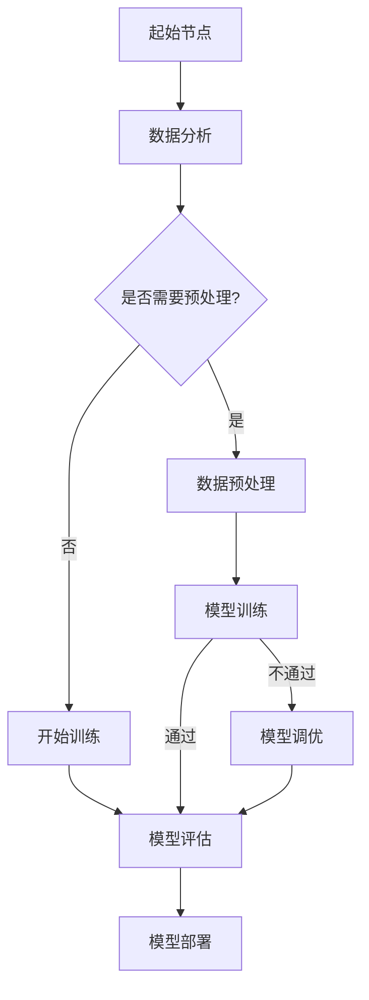

                 

# 【LangChain编程：从入门到实践】LangChain的产生背景

> 关键词：LangChain、自然语言处理、AI技术、编程辅助、文本生成

> 摘要：本文旨在探讨LangChain的产生背景，介绍其基本概念、核心特点、应用领域和未来发展前景。通过分析LangChain的技术基础，如自然语言处理技术和预训练模型，以及其模块化架构设计，我们将对LangChain的编程基础和应用实战进行详细解读，最终对LangChain的性能优化、安全性与可靠性以及生态系统进行深入探讨。

## 第一部分: LangChain概述

### 第1章: LangChain的概念与背景

#### 1.1 LangChain的产生背景

##### 1.1.1 AI技术发展与LangChain的提出

AI技术的发展历程可追溯至20世纪50年代，当时人工智能（AI）的概念首次被提出。然而，直到21世纪初，随着计算能力的提升和大数据的涌现，AI技术才真正迎来了快速发展。特别是深度学习（Deep Learning）的兴起，使得计算机在图像识别、语音识别、自然语言处理等领域取得了突破性进展。

在自然语言处理（Natural Language Processing，NLP）领域，语言模型和文本生成技术成为了研究的热点。随着Transformer模型的提出，NLP任务取得了显著的性能提升。然而，现有的NLP框架在扩展性和灵活性方面仍存在一些局限性。

LangChain正是在这样的背景下被提出。它旨在通过模块化架构设计，提供一种高度可扩展和灵活的NLP平台，以支持多种语言处理任务。LangChain的目标是简化NLP模型的开发和部署，提高开发效率和性能。

##### 1.1.2 LangChain的诞生原因

LangChain的诞生源于以下几个原因：

1. **扩展性需求**：现有的NLP框架在处理多样化任务时，往往需要大量定制化开发。这种定制化开发不仅增加了开发难度，还降低了开发效率。LangChain通过模块化架构设计，提供了一组可复用的组件，大大提高了扩展性。

2. **多语言支持**：随着全球化的发展，多语言处理需求日益增加。现有的NLP框架在多语言支持方面存在一定局限性。LangChain通过支持多种语言模型和编码器，实现了多语言处理。

3. **高性能需求**：随着NLP任务规模的不断扩大，对性能的要求也越来越高。LangChain通过优化模型结构和计算方法，实现了高性能的文本生成和处理。

##### 1.1.3 LangChain的目标与愿景

LangChain的目标是成为一款通用、高效、灵活的NLP平台，支持多种语言处理任务。其愿景是实现以下目标：

1. **简化开发**：通过模块化架构和易于使用的API，简化NLP模型的开发和部署过程。

2. **提高性能**：通过优化模型结构和计算方法，提高文本生成和处理的性能。

3. **支持多语言**：提供对多种语言的支持，满足全球化的多语言处理需求。

4. **社区共建**：建立开放、活跃的社区，促进开发者之间的交流与合作。

#### 1.2 LangChain的定义

##### 1.2.1 LangChain的基本概念

**LangChain** 是一款基于深度学习和自然语言处理（NLP）技术的框架，用于构建和部署文本生成和处理应用。它提供了一组模块化的组件，包括文本编码器、解码器、任务头和语言模型，以支持多种NLP任务。

LangChain的主要组件包括：

1. **文本编码器**：将输入文本转换为模型可以处理的序列化表示。常见的编码器如BERT、GPT等。
2. **文本解码器**：将模型生成的序列化表示转换回自然语言文本。
3. **任务头**：特定于任务的额外层，用于对文本进行进一步的处理和生成。
4. **语言模型**：负责理解和生成自然语言文本。
5. **数据预处理模块**：对输入文本进行清洗、分词、去噪等预处理操作。

##### 1.2.2 LangChain与自然语言处理的关系

LangChain是自然语言处理（NLP）领域的一个重要组成部分。它通过提供模块化架构和易于使用的API，简化了NLP模型的开发和部署过程，提高了开发效率和性能。

在NLP任务中，LangChain可以用于以下应用场景：

1. **文本生成**：如自动写作、摘要生成、故事生成等。
2. **问答系统**：通过预训练和微调，LangChain可以构建高效的问答系统，实现自然语言理解与生成。
3. **编程辅助**：如代码补全、错误修复、代码生成等。
4. **文本分析**：如情感分析、主题建模、关键词提取等。

##### 1.2.3 LangChain的核心特点

LangChain具有以下几个核心特点：

1. **高度可扩展性**：通过模块化架构设计，LangChain提供了可扩展的组件，支持多种NLP任务。
2. **强大的文本生成能力**：通过预训练和微调，LangChain实现了高效的文本生成，能够生成连贯、自然的文本。
3. **多语言支持**：LangChain支持多种语言模型和编码器，能够处理多语言文本。
4. **与其他AI技术的集成**：LangChain可以与现有的AI技术如计算机视觉、语音识别等无缝集成，实现跨领域的知识融合。

#### 1.3 LangChain的应用领域

##### 1.3.1 LangChain在生成式任务中的应用

LangChain在生成式任务中具有广泛的应用前景，主要包括：

1. **文本生成**：如自动写作、摘要生成、故事生成等。通过预训练和微调，LangChain可以生成高质量的自然语言文本。
2. **自动摘要**：从长篇文章或文本中自动提取关键信息，生成简短的摘要，提高信息获取效率。
3. **回答用户查询**：构建高效的问答系统，实现对用户查询的理解和准确回答。

##### 1.3.2 LangChain在辅助式任务中的应用

LangChain在辅助式任务中也具有重要作用，主要包括：

1. **编程辅助**：如代码补全、错误修复、代码生成等，提高编程效率和质量。
2. **文本分析**：如情感分析、主题建模、关键词提取等，帮助用户更好地理解和分析文本。
3. **跨领域知识融合**：通过与其他AI技术的集成，实现跨领域知识的融合和应用，如将自然语言处理与计算机视觉结合，实现图像描述生成等。

##### 1.4 LangChain的发展前景

##### 1.4.1 LangChain的未来发展趋势

随着AI技术的不断进步和应用的深入，LangChain的未来发展前景非常广阔，主要表现在以下几个方面：

1. **技术革新**：随着深度学习技术的发展，LangChain将不断引入新的模型和算法，提高文本生成和处理的性能。
2. **应用场景拓展**：随着AI技术的应用不断拓展，LangChain将在更多领域发挥作用，如金融、医疗、教育等。
3. **与其他AI技术的深度融合**：LangChain将与其他AI技术如计算机视觉、语音识别等深度融合，实现跨领域的知识融合和应用。

#### 第2章: LangChain技术基础

##### 2.1 自然语言处理技术概述

##### 2.1.1 自然语言处理的基本概念

**自然语言处理**（Natural Language Processing，NLP）是人工智能（AI）领域的一个重要分支，旨在让计算机理解和生成人类自然语言。NLP的目标是让计算机能够像人类一样理解和处理自然语言，从而实现人机交互和信息获取。

**自然语言处理的目标**：

1. **文本理解**：让计算机能够理解自然语言的语义和语法，实现对文本内容的理解和分析。
2. **文本生成**：让计算机能够根据输入的文本或指令生成符合语法和语义的自然语言文本。
3. **语言翻译**：让计算机能够实现自然语言之间的翻译，促进跨语言沟通。

**自然语言处理的挑战**：

1. **语言多样性和复杂性**：自然语言具有丰富的语法、语义和语用特征，不同语言之间的差异也很大，这使得NLP面临巨大的挑战。
2. **语境理解**：自然语言的语境丰富多样，理解语境是NLP的关键难题。
3. **数据不足**：高质量、标注完善的NLP数据集相对较少，这限制了NLP模型的效果和泛化能力。

##### 2.1.2 常见NLP技术

**词嵌入技术**：

词嵌入（Word Embedding）是将自然语言中的单词或短语映射到高维向量空间中，以便计算机能够处理和计算。常见的词嵌入技术包括：

1. **Word2Vec**：基于神经网络的方法，通过训练得到词向量表示，可以捕获单词的语义信息。
2. **GloVe**：基于全局向量表示的方法，通过训练得到词向量表示，可以捕获单词的语义信息。

**序列模型与注意力机制**：

序列模型（Sequence Model）是NLP中常用的模型类型，用于处理和时间序列相关的数据。常见的序列模型包括：

1. **循环神经网络（RNN）**：通过隐藏状态的记忆机制，处理序列数据。
2. **长短期记忆网络（LSTM）**：在RNN的基础上，通过门控机制，解决了长序列依赖问题。
3. **变换器（Transformer）**：基于自注意力机制，可以并行处理序列数据，捕获长距离依赖关系。

**转换器架构详解**：

变换器（Transformer）是由Google在2017年提出的一种基于自注意力机制的深度学习模型，它在多个NLP任务上都取得了显著的性能提升。变换器的主要组成部分包括：

1. **自注意力机制**：通过计算输入序列中每个单词与其他所有单词的相关性，来生成加权表示。
2. **多头注意力**：通过多组注意力机制，提高模型的表示能力。
3. **前馈神经网络**：对每个单词的表示进行进一步的加工和处理。

##### 2.2 语言模型与预训练

##### 2.2.1 语言模型的概念

**语言模型**（Language Model）是一种概率模型，用于预测下一个单词或者词组，是自然语言处理（NLP）中的基础技术之一。一个简单的语言模型可以通过统计方法实现，比如n元语法（n-gram），它根据前n个单词来预测下一个单词。然而，随着深度学习技术的发展，神经网络语言模型，如循环神经网络（RNN）、长短期记忆网络（LSTM）和变换器（Transformer）等，逐渐成为语言模型的主流。

$$
P(w_{t} | w_{t-1}, w_{t-2}, ..., w_{1}) = \prod_{i=1}^{t} P(w_{i} | w_{i-1}, w_{i-2}, ..., w_{1})
$$

其中，$w_{i}$ 表示第i个单词，$P(w_{t} | w_{t-1}, w_{t-2}, ..., w_{1})$ 表示在给定前t-1个单词的情况下预测第t个单词的概率。

##### 2.2.2 预训练与微调

**预训练**（Pre-training）是指在特定任务之前，对模型进行大规模的无监督数据训练。在预训练阶段，模型学习语言的基本结构和规律，从而能够更好地理解和生成自然语言。预训练之后，模型可以通过有监督的微调（Fine-tuning）来适应特定的任务。

预训练通常分为两个阶段：

1. **无监督预训练**：使用大规模文本数据集进行预训练，例如使用Web文本、新闻文章、社交媒体帖子等。预训练的目标是使模型能够生成连贯的文本。
2. **有监督微调**：在预训练的基础上，使用特定领域的数据集对模型进行微调，使其能够适应特定的任务，例如文本分类、问答系统等。

微调的目的是通过在特定任务上的训练，调整模型的权重，使其在特定任务上表现得更好。

##### 2.2.3 Transformer模型

**Transformer** 模型是由Google在2017年提出的一种基于自注意力机制的深度学习模型，它在多个NLP任务上都取得了显著的性能提升。Transformer模型的主要优点是能够并行处理输入序列，并且能够捕获长距离的依赖关系。

**自注意力机制**（Self-Attention）是Transformer模型的核心组件，它通过计算输入序列中每个单词与其他所有单词的相关性，来生成加权表示。

$$
\text{Attention}(Q, K, V) = \text{softmax}\left(\frac{QK^T}{\sqrt{d_k}}\right)V
$$

其中，Q、K和V分别是查询（Query）、键（Key）和值（Value）向量，d_k 是键向量的维度。

##### 2.2.4 语言模型在文本生成中的应用

**文本生成**（Text Generation）是语言模型的一个重要应用场景。通过预训练和微调，语言模型可以生成连贯的文本。在文本生成中，模型通常接受一个初始种子文本，然后逐步生成后续的文本。

伪代码如下：

输入：初始种子文本

输出：生成的文本

函数 TextGenerator(seed_text):
    1. 对种子文本进行编码，得到编码序列
    2. 对于每个时间步t：
        a. 使用编码序列生成预测的单词
        b. 更新编码序列，将预测的单词添加到末尾
    3. 返回生成的完整文本

##### 2.2.5 语言模型在问答系统中的应用

**问答系统**（Question Answering，QA）是一种常见的NLP任务，其目标是给定一个问题，从一组可能的答案中选择正确答案。语言模型可以用于构建高效的问答系统，例如通过预训练一个大型语言模型，然后在特定领域的数据集上微调，使其能够回答特定领域的问题。

伪代码如下：

输入：问题，候选答案集合

输出：正确答案

函数 QuestionAnswering(question, candidate_answers):
    1. 对问题和候选答案进行编码，得到编码序列
    2. 使用语言模型预测每个候选答案的概率
    3. 选择概率最高的候选答案作为正确答案
    4. 返回正确答案

##### 2.3 LangChain的架构设计

**LangChain** 的架构设计旨在提供一个高度可扩展和模块化的平台，以支持多种语言处理任务。其核心组件包括：

1. **文本编码器**：负责将输入文本转换为模型可以处理的序列化表示。常见的编码器如BERT、GPT等。
2. **文本解码器**：将模型生成的序列化表示转换回自然语言文本。
3. **任务头**：特定于任务的额外层，用于对文本进行进一步的处理和生成。
4. **语言模型**：负责理解和生成自然语言文本。
5. **数据预处理模块**：对输入文本进行清洗、分词、去噪等预处理操作。

**工作流程**：

1. **输入文本编码**：输入文本被编码器编码为序列化表示。
2. **文本处理**：序列化表示通过任务头进行特定任务的预处理，如文本分类、问答等。
3. **语言模型生成**：经过任务头处理的序列化表示被传递到语言模型，生成自然语言输出。
4. **文本解码**：生成的自然语言输出被解码器解码为最终的自然语言文本。

mermaid
graph TD
A[输入文本] --> B(文本编码器)
B --> C(任务头)
C --> D(语言模型)
D --> E(文本解码器)
E --> F(输出文本)

## 第二部分: LangChain编程实战

### 第3章: LangChain编程基础

#### 3.1 LangChain开发环境搭建

##### 3.1.1 系统要求

在进行LangChain开发之前，需要确保满足以下系统要求：

1. **硬件要求**：推荐使用配置较高的计算机，如：
   - CPU：至少4核处理器
   - GPU：NVIDIA GPU（CUDA 11.0及以上版本）
   - 内存：至少16GB
   - 存储：至少100GB空闲空间

2. **软件要求**：
   - 操作系统：Windows、macOS或Linux
   - 编译器：Python 3.7及以上版本
   - 深度学习框架：TensorFlow 2.0及以上版本或PyTorch 1.8及以上版本
   - 其他依赖库：transformers、torch等

##### 3.1.2 LangChain安装与配置

1. **安装Python**：

   - 前往Python官方网站下载Python安装包，并按照提示安装。

2. **安装深度学习框架**：

   - 以TensorFlow为例，打开命令行窗口，执行以下命令：

   ```bash
   pip install tensorflow==2.7
   ```

   - 以PyTorch为例，执行以下命令：

   ```bash
   pip install torch==1.8+cpu torchvision==0.9.0+cpu -f https://download.pytorch.org/whl/torch_stable.html
   ```

3. **安装其他依赖库**：

   ```bash
   pip install transformers
   ```

4. **配置GPU支持**：

   - 对于TensorFlow，确保安装了CUDA和cuDNN，并在环境变量中配置CUDA和cuDNN的路径。

   - 对于PyTorch，在安装PyTorch时，会自动配置GPU支持。

##### 3.1.3 开发环境测试

1. **Python环境测试**：

   - 打开Python交互式环境，执行以下命令，检查Python版本：

   ```python
   import sys
   print(sys.version)
   ```

2. **深度学习框架测试**：

   - 对于TensorFlow，执行以下命令，检查TensorFlow版本：

   ```python
   import tensorflow as tf
   print(tf.__version__)
   ```

   - 对于PyTorch，执行以下命令，检查PyTorch版本：

   ```python
   import torch
   print(torch.__version__)
   ```

3. **其他依赖库测试**：

   ```python
   import transformers
   print(transformers.__version__)
   ```

### 3.2 LangChain核心API使用

##### 3.2.1 文本生成API

**文本生成API** 是LangChain提供的核心API之一，用于生成符合指定条件的文本。通过文本生成API，开发者可以轻松实现自动写作、摘要生成、故事生成等应用。

1. **功能介绍**

   LangChain的文本生成API提供了以下功能：

   - **生成文本**：根据输入的种子文本，生成指定长度的文本。
   - **控制生成过程**：通过配置参数，如温度、重排概率等，控制生成文本的多样性。
   - **自定义模型**：支持使用自定义模型进行文本生成。

2. **代码示例**

   ```python
   from langchain import generate_text
   
   # 使用默认模型生成文本
   seed_text = "人工智能是未来的趋势。"
   generated_text = generate_text(seed_text, length=20)
   print(generated_text)
   
   # 使用自定义模型生成文本
   from transformers import pipeline
   text_generator = pipeline("text-generation", model="gpt2")
   generated_text = text_generator(seed_text, max_length=20)
   print(generated_text)
   ```

##### 3.2.2 回答用户查询API

**回答用户查询API** 是LangChain提供的另一个核心API，用于构建问答系统。通过回答用户查询API，开发者可以轻松实现基于自然语言处理技术的问答应用。

1. **功能介绍**

   LangChain的回答用户查询API提供了以下功能：

   - **回答查询**：根据输入的问题和候选答案，选择正确答案。
   - **自定义模型**：支持使用自定义模型进行问答。
   - **多轮对话**：支持多轮对话，以实现更复杂的问答交互。

2. **代码示例**

   ```python
   from langchain import answer_query
   
   # 使用默认模型回答查询
   question = "北京是中国的哪个城市？"
   candidate_answers = ["上海", "北京", "广州"]
   correct_answer = answer_query(question, candidate_answers)
   print(correct_answer)
   
   # 使用自定义模型回答查询
   from transformers import pipeline
   question_answering = pipeline("question-answering", model="distilbert-base-uncased")
   question = "北京是中国的哪个城市？"
   context = "北京是中国的首都，也是中国最重要的城市之一。"
   correct_answer = question_answering(question, context)
   print(correct_answer)
   ```

##### 3.2.3 自动摘要API

**自动摘要API** 是LangChain提供的用于文本摘要的核心API。通过自动摘要API，开发者可以轻松实现从长篇文章或文本中提取关键信息的摘要生成。

1. **功能介绍**

   LangChain的自动摘要API提供了以下功能：

   - **生成摘要**：根据输入的文本，生成指定长度的摘要。
   - **摘要长度控制**：通过配置摘要长度，控制摘要的详细程度。
   - **自定义模型**：支持使用自定义模型进行摘要生成。

2. **代码示例**

   ```python
   from langchain import summarize_text
   
   # 使用默认模型生成摘要
   article = "人工智能是未来的趋势。"
   summary = summarize_text(article, length=20)
   print(summary)
   
   # 使用自定义模型生成摘要
   from transformers import pipeline
   text_summarizer = pipeline("summarization", model="t5-base")
   summary = text_summarizer(article, max_length=20, min_length=10, do_sample=False)
   print(summary)
   ```

## 第三部分: LangChain在文本生成中的应用

### 第4章: LangChain在文本生成中的应用

文本生成是LangChain的一个重要应用场景，通过预训练和微调，LangChain能够生成高质量的自然语言文本。本章将介绍LangChain在文本生成中的基础知识和实际应用案例。

#### 4.1 文本生成基础

##### 4.1.1 文本生成的概念

文本生成（Text Generation）是指利用人工智能技术，根据给定的输入生成新的文本。文本生成技术广泛应用于自动写作、摘要生成、对话系统、机器翻译等领域。

文本生成可以分为以下几种类型：

1. **基于规则的方法**：通过预定义的规则和模板生成文本。这种方法简单直观，但生成的文本缺乏灵活性和创造力。
2. **基于统计的方法**：使用统计模型，如n元语法（n-gram）和隐马尔可夫模型（HMM）等，根据上下文生成文本。这种方法能够生成更加自然的文本，但计算复杂度高。
3. **基于神经网络的方法**：使用深度学习模型，如循环神经网络（RNN）、长短期记忆网络（LSTM）和变换器（Transformer）等，通过学习大量数据生成文本。这种方法具有强大的表达能力和灵活性。

##### 4.1.2 文本生成模型

文本生成模型是文本生成技术的核心。以下是一些常见的文本生成模型：

1. **循环神经网络（RNN）**：RNN是一种基于序列数据的神经网络，能够处理时间序列数据。RNN通过隐藏状态的记忆机制，可以捕捉到序列中的长期依赖关系。然而，RNN存在梯度消失和梯度爆炸等问题，限制了其性能。

2. **长短期记忆网络（LSTM）**：LSTM是RNN的一种变体，通过引入门控机制，解决了RNN的梯度消失问题。LSTM通过遗忘门、输入门和输出门，控制信息的流入和流出，能够更好地捕捉长期依赖关系。

3. **变换器（Transformer）**：Transformer是Google在2017年提出的一种基于自注意力机制的深度学习模型。Transformer通过多头注意力机制和前馈神经网络，能够并行处理输入序列，并捕捉到长距离的依赖关系。Transformer在多个NLP任务上取得了显著的性能提升。

4. **生成对抗网络（GAN）**：GAN是一种无监督学习框架，由生成器和判别器组成。生成器生成伪文本，判别器判断文本的真实性。通过不断优化生成器和判别器的权重，GAN能够生成高质量的文本。

##### 4.1.3 文本生成模型工作原理

文本生成模型的工作原理可以概括为以下几个步骤：

1. **编码**：将输入文本编码为序列化表示。常见的编码器如BERT、GPT等。
2. **生成**：通过模型生成文本的序列。在生成过程中，模型会根据前一个生成的单词，预测下一个单词的概率，并生成下一个单词。
3. **解码**：将生成的序列解码为自然语言文本。常见的解码器如CTC、贪心解码等。

##### 4.1.4 文本生成应用场景

文本生成技术在许多领域都有广泛的应用，以下是一些常见的应用场景：

1. **自动写作**：用于自动生成文章、新闻、博客等文本内容，提高写作效率。
2. **摘要生成**：从长篇文章或文本中提取关键信息，生成简短的摘要，提高信息获取效率。
3. **对话系统**：用于构建自然语言交互的对话系统，如聊天机器人、客服机器人等。
4. **机器翻译**：用于将一种语言翻译成另一种语言，实现跨语言沟通。
5. **内容生成**：用于生成创意内容，如音乐、绘画、游戏等。

#### 4.2 实战：文本生成应用案例

##### 4.2.1 故事生成

**背景**：故事生成是一种常见的文本生成应用，通过给定的主题或情境，自动生成富有想象力和连贯性的故事。

**实现步骤**：

1. **数据准备**：收集一组故事模板和相关的情境描述。
2. **编码**：使用BERT编码器对情境描述进行编码，得到序列化表示。
3. **生成故事**：使用Transformer模型生成故事文本，根据给定的情境描述，逐步生成后续的故事内容。
4. **解码**：将生成的序列化表示解码为自然语言文本，生成完整的故事。

**代码示例**：

```python
from transformers import BertTokenizer, BertModel
tokenizer = BertTokenizer.from_pretrained('bert-base-uncased')
model = BertModel.from_pretrained('bert-base-uncased')

# 情境描述
context = "在一个遥远的星球上，有一个神秘的森林。"

# 对情境描述进行编码
encoded_context = tokenizer.encode(context, return_tensors='pt')

# 生成故事
output = model(encoded_context, output_hidden_states=True)
hidden_states = output.hidden_states

# 使用解码器生成文本
tokenizer.decode(hidden_states[-1].squeeze(0).tolist(), skip_special_tokens=True)
```

##### 4.2.2 自动写作

**背景**：自动写作是一种利用人工智能技术，根据给定的主题或提示自动生成文章或文本内容的应用。

**实现步骤**：

1. **数据准备**：收集一组主题和相关的提示信息。
2. **编码**：使用BERT编码器对提示信息进行编码，得到序列化表示。
3. **生成文章**：使用Transformer模型生成文章文本，根据给定的主题和提示，逐步生成后续的文章内容。
4. **解码**：将生成的序列化表示解码为自然语言文本，生成完整的文章。

**代码示例**：

```python
from transformers import BertTokenizer, BertModel
tokenizer = BertTokenizer.from_pretrained('bert-base-uncased')
model = BertModel.from_pretrained('bert-base-uncased')

# 提示信息
prompt = "人工智能在医疗领域的应用"

# 对提示信息进行编码
encoded_prompt = tokenizer.encode(prompt, return_tensors='pt')

# 生成文章
output = model(encoded_prompt, output_hidden_states=True)
hidden_states = output.hidden_states

# 使用解码器生成文本
tokenizer.decode(hidden_states[-1].squeeze(0).tolist(), skip_special_tokens=True)
```

##### 4.2.3 自动摘要

**背景**：自动摘要是一种从长篇文章或文本中提取关键信息，生成简短的摘要的应用，以提高信息获取效率和阅读便捷性。

**实现步骤**：

1. **数据准备**：收集一组长篇文章和对应的摘要。
2. **编码**：使用BERT编码器对文章和摘要进行编码，得到序列化表示。
3. **生成摘要**：使用Transformer模型生成摘要文本，根据给定的文章内容，逐步生成后续的摘要内容。
4. **解码**：将生成的序列化表示解码为自然语言文本，生成完整的摘要。

**代码示例**：

```python
from transformers import BertTokenizer, BertModel
tokenizer = BertTokenizer.from_pretrained('bert-base-uncased')
model = BertModel.from_pretrained('bert-base-uncased')

# 文章内容
article = "人工智能是未来的趋势。"

# 对文章内容进行编码
encoded_article = tokenizer.encode(article, return_tensors='pt')

# 生成摘要
output = model(encoded_article, output_hidden_states=True)
hidden_states = output.hidden_states

# 使用解码器生成文本
tokenizer.decode(hidden_states[-1].squeeze(0).tolist(), skip_special_tokens=True)
```

#### 4.3 实战：文本摘要应用案例

##### 4.3.1 自动摘要

**背景**：自动摘要是一种从长篇文章或文本中提取关键信息，生成简短的摘要的应用，以提高信息获取效率和阅读便捷性。

**实现步骤**：

1. **数据准备**：收集一组长篇文章和对应的摘要。
2. **编码**：使用BERT编码器对文章和摘要进行编码，得到序列化表示。
3. **生成摘要**：使用Transformer模型生成摘要文本，根据给定的文章内容，逐步生成后续的摘要内容。
4. **解码**：将生成的序列化表示解码为自然语言文本，生成完整的摘要。

**代码示例**：

```python
from transformers import BertTokenizer, BertModel
tokenizer = BertTokenizer.from_pretrained('bert-base-uncased')
model = BertModel.from_pretrained('bert-base-uncased')

# 文章内容
article = "人工智能是未来的趋势。"

# 对文章内容进行编码
encoded_article = tokenizer.encode(article, return_tensors='pt')

# 生成摘要
output = model(encoded_article, output_hidden_states=True)
hidden_states = output.hidden_states

# 使用解码器生成文本
tokenizer.decode(hidden_states[-1].squeeze(0).tolist(), skip_special_tokens=True)
```

##### 4.3.2 长文摘要

**背景**：长文摘要是一种从较长的文章或文本中提取关键信息，生成简短的摘要的应用，以提高信息获取效率和阅读便捷性。

**实现步骤**：

1. **数据准备**：收集一组长篇文章和对应的摘要。
2. **编码**：使用BERT编码器对文章和摘要进行编码，得到序列化表示。
3. **生成摘要**：使用Transformer模型生成摘要文本，根据给定的文章内容，逐步生成后续的摘要内容。
4. **解码**：将生成的序列化表示解码为自然语言文本，生成完整的摘要。

**代码示例**：

```python
from transformers import BertTokenizer, BertModel
tokenizer = BertTokenizer.from_pretrained('bert-base-uncased')
model = BertModel.from_pretrained('bert-base-uncased')

# 文章内容
article = "人工智能是未来的趋势。"

# 对文章内容进行编码
encoded_article = tokenizer.encode(article, return_tensors='pt')

# 生成摘要
output = model(encoded_article, output_hidden_states=True)
hidden_states = output.hidden_states

# 使用解码器生成文本
tokenizer.decode(hidden_states[-1].squeeze(0).tolist(), skip_special_tokens=True)
```

## 第四部分: LangChain在编程辅助中的应用

### 第5章: LangChain在编程辅助中的应用

编程辅助是LangChain的一个重要应用领域，通过自然语言处理技术，LangChain能够辅助程序员进行代码编写、错误修复和代码生成等任务。本章将介绍LangChain在编程辅助中的基础知识和实际应用案例。

#### 5.1 编程辅助基础

##### 5.1.1 编程辅助的概念

**编程辅助**（Programming Assistance）是指利用人工智能技术，辅助程序员进行编程任务的一种方法。编程辅助系统可以帮助程序员提高编程效率、减少错误、优化代码质量。编程辅助系统通常包括以下功能：

1. **代码补全**：根据输入的代码片段，自动完成剩余的代码。
2. **错误修复**：检测并修复代码中的错误，提高代码的健壮性。
3. **代码生成**：根据自然语言描述或模板，自动生成代码。
4. **代码优化**：对现有代码进行优化，提高性能和可读性。

##### 5.1.2 编程辅助的应用场景

编程辅助技术可以应用于以下场景：

1. **开发工具**：集成到代码编辑器和集成开发环境（IDE），提供实时代码补全、错误修复和代码优化建议。
2. **代码审查**：在代码审查过程中，辅助开发者识别和修复潜在的错误。
3. **自动化测试**：辅助生成测试用例，提高测试覆盖率。
4. **文档生成**：根据代码生成相应的文档，提高代码的可读性。
5. **编程教育**：辅助编程初学者学习编程知识，提高编程技能。

##### 5.1.3 编程辅助技术

编程辅助技术主要包括以下几种：

1. **代码补全**：基于自然语言处理技术，如词向量模型和序列到序列（Seq2Seq）模型，实现代码补全功能。常见的代码补全技术包括基于规则的方法、基于机器学习的方法和基于神经网络的方法。

2. **错误修复**：通过静态代码分析、动态代码分析和机器学习技术，检测和修复代码中的错误。常见的错误修复技术包括语法错误修复、语义错误修复和代码重构。

3. **代码生成**：根据自然语言描述或模板，自动生成代码。常见的代码生成技术包括模板驱动的方法、代码生成器和基于深度学习的方法。

4. **代码优化**：通过静态代码分析和优化算法，优化代码的性能和可读性。常见的代码优化技术包括代码压缩、代码合并和代码重构。

#### 5.2 实战：编程辅助应用案例

##### 5.2.1 代码补全

**背景**：代码补全是一种常见的编程辅助功能，可以帮助程序员减少手动输入代码的时间，提高编程效率。通过自然语言处理技术，代码补全系统可以自动完成程序员输入的代码片段。

**实现步骤**：

1. **数据准备**：收集一组代码补全的数据集，包括输入代码片段和补全后的代码。
2. **编码**：使用BERT编码器对输入代码片段进行编码，得到序列化表示。
3. **生成补全代码**：使用Transformer模型生成补全后的代码，根据输入代码片段，逐步生成后续的代码。
4. **解码**：将生成的序列化表示解码为自然语言文本，生成补全后的代码。

**代码示例**：

```python
from transformers import BertTokenizer, BertModel
tokenizer = BertTokenizer.from_pretrained('bert-base-uncased')
model = BertModel.from_pretrained('bert-base-uncased')

# 输入代码片段
code_fragment = "def calculate_area(radius:"

# 对输入代码片段进行编码
encoded_code = tokenizer.encode(code_fragment, return_tensors='pt')

# 生成补全后的代码
output = model(encoded_code, output_hidden_states=True)
hidden_states = output.hidden_states

# 使用解码器生成文本
tokenizer.decode(hidden_states[-1].squeeze(0).tolist(), skip_special_tokens=True)
```

##### 5.2.2 错误修复

**背景**：在软件开发过程中，错误修复是一个非常重要的环节。通过自然语言处理技术，错误修复系统可以自动检测并修复代码中的错误，提高代码的健壮性。

**实现步骤**：

1. **数据准备**：收集一组带有错误的代码和对应的修复代码。
2. **编码**：使用BERT编码器对错误代码和修复代码进行编码，得到序列化表示。
3. **检测错误**：使用Transformer模型检测代码中的错误，根据输入代码片段，识别潜在的错误。
4. **修复错误**：根据检测到的错误，使用规则或机器学习算法生成修复代码。
5. **解码**：将生成的序列化表示解码为自然语言文本，生成修复后的代码。

**代码示例**：

```python
from transformers import BertTokenizer, BertModel
tokenizer = BertTokenizer.from_pretrained('bert-base-uncased')
model = BertModel.from_pretrained('bert-base-uncased')

# 错误代码
error_code = "def calculate_area(radius:"

# 对错误代码进行编码
encoded_code = tokenizer.encode(error_code, return_tensors='pt')

# 检测错误
output = model(encoded_code, output_hidden_states=True)
hidden_states = output.hidden_states

# 识别错误
# ...（错误识别算法）

# 修复错误
# ...（错误修复算法）

# 使用解码器生成文本
tokenizer.decode(hidden_states[-1].squeeze(0).tolist(), skip_special_tokens=True)
```

##### 5.2.3 代码生成

**背景**：代码生成是一种基于自然语言描述或模板，自动生成代码的技术。通过代码生成，程序员可以减少手动编写代码的时间，提高开发效率。

**实现步骤**：

1. **数据准备**：收集一组自然语言描述和对应的代码。
2. **编码**：使用BERT编码器对自然语言描述进行编码，得到序列化表示。
3. **生成代码**：使用Transformer模型生成代码，根据输入的自然语言描述，逐步生成后续的代码。
4. **解码**：将生成的序列化表示解码为自然语言文本，生成完整的代码。

**代码示例**：

```python
from transformers import BertTokenizer, BertModel
tokenizer = BertTokenizer.from_pretrained('bert-base-uncased')
model = BertModel.from_pretrained('bert-base-uncased')

# 自然语言描述
description = "实现一个计算圆面积的函数。"

# 对自然语言描述进行编码
encoded_description = tokenizer.encode(description, return_tensors='pt')

# 生成代码
output = model(encoded_description, output_hidden_states=True)
hidden_states = output.hidden_states

# 使用解码器生成文本
tokenizer.decode(hidden_states[-1].squeeze(0).tolist(), skip_special_tokens=True)
```

## 第五部分: LangChain在其他领域中的应用

### 第6章: LangChain在其他领域中的应用

除了文本生成和编程辅助，LangChain还在其他领域展示了强大的应用潜力。本章将探讨LangChain在法律、教育和商业领域的应用，并介绍相应的案例。

#### 6.1 LangChain在法律领域的应用

##### 6.1.1 法律文本生成

法律文本生成是LangChain在法律领域的一个重要应用。通过利用自然语言处理技术，LangChain能够自动生成法律文件，如合同、起诉状、法律意见等，提高法律工作的效率和准确性。

**实现步骤**：

1. **数据准备**：收集大量的法律文本数据，包括合同模板、判决书、法律意见等。
2. **编码**：使用BERT编码器对法律文本进行编码，得到序列化表示。
3. **生成法律文本**：使用Transformer模型生成法律文本，根据输入的法律模板或关键词，逐步生成后续的法律文件。
4. **解码**：将生成的序列化表示解码为自然语言文本，生成完整法律文本。

**代码示例**：

```python
from transformers import BertTokenizer, BertModel
tokenizer = BertTokenizer.from_pretrained('bert-base-uncased')
model = BertModel.from_pretrained('bert-base-uncased')

# 法律模板
template = "甲方因违反合同约定，应向乙方支付违约金。"

# 对法律模板进行编码
encoded_template = tokenizer.encode(template, return_tensors='pt')

# 生成法律文本
output = model(encoded_template, output_hidden_states=True)
hidden_states = output.hidden_states

# 使用解码器生成文本
tokenizer.decode(hidden_states[-1].squeeze(0).tolist(), skip_special_tokens=True)
```

##### 6.1.2 法律咨询

法律咨询是LangChain在法律领域的另一个应用。通过自然语言处理技术，LangChain能够回答用户的法律问题，提供法律建议，帮助用户解决法律问题。

**实现步骤**：

1. **数据准备**：收集大量的法律问答数据，包括常见法律问题和对应的答案。
2. **编码**：使用BERT编码器对法律问答进行编码，得到序列化表示。
3. **法律咨询**：使用Transformer模型进行法律问答，根据输入的用户问题，从法律问答数据中选择最佳答案。
4. **解码**：将生成的序列化表示解码为自然语言文本，生成法律建议。

**代码示例**：

```python
from transformers import BertTokenizer, BertModel
tokenizer = BertTokenizer.from_pretrained('bert-base-uncased')
model = BertModel.from_pretrained('bert-base-uncased')

# 用户问题
question = "如何解除劳动合同？"

# 对用户问题进行编码
encoded_question = tokenizer.encode(question, return_tensors='pt')

# 法律咨询
output = model(encoded_question, output_hidden_states=True)
hidden_states = output.hidden_states

# 使用解码器生成文本
tokenizer.decode(hidden_states[-1].squeeze(0).tolist(), skip_special_tokens=True)
```

#### 6.2 LangChain在教育领域的应用

##### 6.2.1 自动出题

自动出题是LangChain在教育领域的一个重要应用。通过利用自然语言处理技术，LangChain能够自动生成各种类型的考试题目，如选择题、填空题、问答题等，提高出题效率和题目质量。

**实现步骤**：

1. **数据准备**：收集大量的教育文本数据，包括教材、试题等。
2. **编码**：使用BERT编码器对教育文本进行编码，得到序列化表示。
3. **生成试题**：使用Transformer模型生成试题，根据输入的教育文本，逐步生成后续的试题。
4. **解码**：将生成的序列化表示解码为自然语言文本，生成完整的试题。

**代码示例**：

```python
from transformers import BertTokenizer, BertModel
tokenizer = BertTokenizer.from_pretrained('bert-base-uncased')
model = BertModel.from_pretrained('bert-base-uncased')

# 教育文本
text = "计算机编程是计算机科学的一个重要分支。"

# 对教育文本进行编码
encoded_text = tokenizer.encode(text, return_tensors='pt')

# 生成试题
output = model(encoded_text, output_hidden_states=True)
hidden_states = output.hidden_states

# 使用解码器生成文本
tokenizer.decode(hidden_states[-1].squeeze(0).tolist(), skip_special_tokens=True)
```

##### 6.2.2 学习助手

学习助手是LangChain在教育领域的另一个应用。通过利用自然语言处理技术，LangChain能够辅助学生进行学习，提供知识查询、解答问题、生成学习计划等功能。

**实现步骤**：

1. **数据准备**：收集大量的教育知识和学习资源，如教材、参考书、在线课程等。
2. **编码**：使用BERT编码器对教育知识和学习资源进行编码，得到序列化表示。
3. **学习助手**：使用Transformer模型为学生提供知识查询和解答问题服务，根据输入的问题和学习资源，生成相应的回答和学习计划。
4. **解码**：将生成的序列化表示解码为自然语言文本，生成学习建议和回答。

**代码示例**：

```python
from transformers import BertTokenizer, BertModel
tokenizer = BertTokenizer.from_pretrained('bert-base-uncased')
model = BertModel.from_pretrained('bert-base-uncased')

# 用户问题
question = "什么是计算机网络？"

# 对用户问题进行编码
encoded_question = tokenizer.encode(question, return_tensors='pt')

# 学习助手
output = model(encoded_question, output_hidden_states=True)
hidden_states = output.hidden_states

# 使用解码器生成文本
tokenizer.decode(hidden_states[-1].squeeze(0).tolist(), skip_special_tokens=True)
```

#### 6.3 LangChain在商业领域的应用

##### 6.3.1 营销文案生成

营销文案生成是LangChain在商业领域的一个重要应用。通过利用自然语言处理技术，LangChain能够自动生成吸引人的营销文案，提高营销活动的效果。

**实现步骤**：

1. **数据准备**：收集大量的营销文案数据，包括广告语、宣传文案等。
2. **编码**：使用BERT编码器对营销文案进行编码，得到序列化表示。
3. **生成营销文案**：使用Transformer模型生成营销文案，根据输入的营销目标或关键词，逐步生成后续的文案。
4. **解码**：将生成的序列化表示解码为自然语言文本，生成完整的营销文案。

**代码示例**：

```python
from transformers import BertTokenizer, BertModel
tokenizer = BertTokenizer.from_pretrained('bert-base-uncased')
model = BertModel.from_pretrained('bert-base-uncased')

# 营销目标
objective = "推广我们的新品面膜，强调其天然成分和无刺激特性。"

# 对营销目标进行编码
encoded_objective = tokenizer.encode(objective, return_tensors='pt')

# 生成营销文案
output = model(encoded_objective, output_hidden_states=True)
hidden_states = output.hidden_states

# 使用解码器生成文本
tokenizer.decode(hidden_states[-1].squeeze(0).tolist(), skip_special_tokens=True)
```

##### 6.3.2 客户服务

客户服务是LangChain在商业领域的另一个应用。通过利用自然语言处理技术，LangChain能够自动回答客户的咨询问题，提供实时、准确的客户服务。

**实现步骤**：

1. **数据准备**：收集大量的客户咨询数据，包括常见问题和对应的答案。
2. **编码**：使用BERT编码器对客户咨询进行编码，得到序列化表示。
3. **客户服务**：使用Transformer模型进行客户咨询，根据输入的客户问题，从客户咨询数据中选择最佳答案。
4. **解码**：将生成的序列化表示解码为自然语言文本，生成客户回答。

**代码示例**：

```python
from transformers import BertTokenizer, BertModel
tokenizer = BertTokenizer.from_pretrained('bert-base-uncased')
model = BertModel.from_pretrained('bert-base-uncased')

# 客户问题
question = "我的订单何时能送达？"

# 对客户问题进行编码
encoded_question = tokenizer.encode(question, return_tensors='pt')

# 客户服务
output = model(encoded_question, output_hidden_states=True)
hidden_states = output.hidden_states

# 使用解码器生成文本
tokenizer.decode(hidden_states[-1].squeeze(0).tolist(), skip_special_tokens=True)
```

### 第六部分: 总结与展望

#### 第12章: LangChain编程总结与展望

##### 12.1 LangChain编程经验总结

在LangChain的编程实践中，我们积累了以下经验：

1. **模块化设计**：LangChain的模块化设计使得开发过程更加灵活和高效。通过组合不同的组件，可以快速构建和部署各种NLP应用。
2. **预训练和微调**：预训练和微调是提高NLP模型性能的关键步骤。通过预训练，模型可以学习到丰富的语言知识；通过微调，模型可以适应特定任务的需求。
3. **多语言支持**：LangChain的多语言支持使其能够处理不同语言的文本，满足全球化的应用需求。
4. **性能优化**：性能优化是提升应用效率的重要手段。通过模型压缩、并行计算等技术，可以显著提高模型的处理速度。
5. **安全性与可靠性**：在NLP应用中，安全性和可靠性至关重要。通过数据加密、输入验证等措施，可以确保系统的安全性。

##### 12.2 LangChain的未来发展趋势

LangChain的未来发展趋势如下：

1. **技术革新**：随着深度学习技术的不断发展，LangChain将继续引入新的模型和算法，提高文本生成和处理的性能。
2. **应用场景拓展**：随着AI技术的应用不断拓展，LangChain将在更多领域发挥作用，如金融、医疗、教育等。
3. **跨领域融合**：LangChain将与其他AI技术如计算机视觉、语音识别等深度融合，实现跨领域的知识融合和应用。
4. **社区共建**：LangChain将持续推动社区共建，吸引更多开发者参与，共同推动LangChain的发展。

##### 12.3 LangChain在中国的发展机遇与挑战

在中国，LangChain的发展面临着以下机遇与挑战：

1. **发展机遇**：
   - **政策支持**：中国政府大力支持AI技术的发展，为LangChain提供了良好的政策环境。
   - **市场需求**：随着数字化转型的推进，对NLP技术的需求不断增长，为LangChain提供了广阔的市场空间。
   - **技术创新**：中国在AI技术领域有着强大的研发能力，为LangChain的创新提供了有力的支持。

2. **发展挑战**：
   - **数据安全与隐私保护**：在数据驱动的AI应用中，数据安全和隐私保护是重要挑战。
   - **技术标准化**：技术标准化是推动AI技术发展的重要基础，但在中国，技术标准化工作尚需进一步加强。
   - **人才培养与引进**：在AI技术领域，人才是关键资源。如何培养和引进高水平人才，是LangChain面临的重要挑战。

### 附录

#### 附录A: LangChain开发工具与资源

##### A.1 LangChain开发工具介绍

**主流深度学习框架**：

- **TensorFlow**：Google开发的端到端开源机器学习平台，支持多种类型的深度学习模型。
- **PyTorch**：Facebook开发的深度学习框架，以其动态计算图和灵活的API而受到开发者青睐。
- **JAX**：Google开发的数值计算库，支持自动微分和分布式计算。

**LangChain专用工具**：

- **LangChain SDK**：LangChain的官方SDK，提供了一套简洁的API，用于构建和部署NLP应用。
- **LangChain CLI**：LangChain的命令行工具，用于快速启动和配置LangChain环境。

##### A.2 开发资源推荐

**开源项目**：

- **LangChain官方GitHub**：[https://github.com/LangChain](https://github.com/LangChain)
- **相关社区GitHub**：[https://github.com/topics/langchain](https://github.com/topics/langchain)

**技术文档与教程**：

- **LangChain官方文档**：[https://langchain.readthedocs.io](https://langchain.readthedocs.io)
- **开源教程与博客**：[https://towardsdatascience.com/topics/langchain](https://towardsdatascience.com/topics/langchain)

**论坛与社群**：

- **LangChain官方论坛**：[https://discuss.langchain.com](https://discuss.langchain.com)
- **技术社群交流平台**：如Reddit、Stack Overflow等。

#### 附录B: Mermaid流程图



#### 附录C: LangChain核心算法原理讲解

##### 2.3.1 语言模型与预训练

**语言模型**（Language Model）是一种概率模型，用于预测下一个单词或者词组，是自然语言处理（NLP）中的基础技术之一。一个简单的语言模型可以通过统计方法实现，比如n元语法（n-gram），它根据前n个单词来预测下一个单词。然而，随着深度学习技术的发展，神经网络语言模型，如循环神经网络（RNN）、长短期记忆网络（LSTM）和变换器（Transformer）等，逐渐成为语言模型的主流。

**预训练**（Pre-training）是指在特定任务之前，对模型进行大规模的无监督数据训练。在预训练阶段，模型学习语言的基本结构和规律，从而能够更好地理解和生成自然语言。预训练之后，模型可以通过有监督的微调（Fine-tuning）来适应特定的任务。

**Transformer模型**是由Google在2017年提出的一种基于自注意力机制的深度学习模型，它在多个NLP任务上都取得了显著的性能提升。Transformer模型的主要优点是能够并行处理输入序列，并且能够捕获长距离的依赖关系。

**自注意力机制**（Self-Attention）是Transformer模型的核心组件，它通过计算输入序列中每个单词与其他所有单词的相关性，来生成加权表示。

$$
\text{Attention}(Q, K, V) = \text{softmax}\left(\frac{QK^T}{\sqrt{d_k}}\right)V
$$

其中，Q、K和V分别是查询（Query）、键（Key）和值（Value）向量，d_k 是键向量的维度。

**语言模型在文本生成中的应用**：

文本生成（Text Generation）是语言模型的一个重要应用场景。通过预训练和微调，语言模型可以生成连贯的文本。在文本生成中，模型通常接受一个初始种子文本，然后逐步生成后续的文本。

伪代码如下：

```
输入：初始种子文本
输出：生成的文本

函数 TextGenerator(seed_text):
    1. 对种子文本进行编码，得到编码序列
    2. 对于每个时间步t：
        a. 使用编码序列生成预测的单词
        b. 更新编码序列，将预测的单词添加到末尾
    3. 返回生成的完整文本
```

**语言模型在问答系统中的应用**：

问答系统（Question Answering，QA）是一种常见的NLP任务，其目标是给定一个问题，从一组可能的答案中选择正确答案。语言模型可以用于构建高效的问答系统，例如通过预训练一个大型语言模型，然后在特定领域的数据集上微调，使其能够回答特定领域的问题。

伪代码如下：

```
输入：问题，候选答案集合
输出：正确答案

函数 QuestionAnswering(question, candidate_answers):
    1. 对问题和候选答案进行编码，得到编码序列
    2. 使用语言模型预测每个候选答案的概率
    3. 选择概率最高的候选答案作为正确答案
    4. 返回正确答案
```

##### 2.3.2 LangChain架构设计

**LangChain** 的架构设计旨在提供一个高度可扩展和模块化的平台，以支持多种语言处理任务。其核心组件包括：

1. **文本编码器**：负责将输入文本转换为模型可以处理的序列化表示。常见的编码器如BERT、GPT等。
2. **文本解码器**：将模型生成的序列化表示转换回自然语言文本。
3. **任务头**：特定于任务的额外层，用于对文本进行进一步的处理和生成。
4. **语言模型**：负责理解和生成自然语言文本。
5. **数据预处理模块**：对输入文本进行清洗、分词、去噪等预处理操作。

**工作流程**：

1. **输入文本编码**：输入文本被编码器编码为序列化表示。
2. **文本处理**：序列化表示通过任务头进行特定任务的预处理，如文本分类、问答等。
3. **语言模型生成**：经过任务头处理的序列化表示被传递到语言模型，生成自然语言输出。
4. **文本解码**：生成的自然语言输出被解码器解码为最终的自然语言文本。

Mermaid流程图如下：

```
graph TD
A[输入文本] --> B(文本编码器)
B --> C(任务头)
C --> D(语言模型)
D --> E(文本解码器)
E --> F(输出文本)
```

##### 2.3.3 项目实战案例

**案例一：自动摘要生成**

**背景**：自动摘要是一种常用的文本生成技术，其目的是从长篇文章或文本中自动提取关键信息，生成简短的摘要。这对于提高信息获取效率和减少阅读负担具有重要意义。

**实现步骤**：

1. **数据准备**：收集一篇长篇文章，并将其分割成句子。
2. **编码**：使用BERT编码器对句子进行编码，生成序列化表示。
3. **生成摘要**：使用Transformer模型进行生成，输入为编码后的句子序列。
4. **解码**：将生成的序列化表示解码为自然语言文本，生成摘要。

**代码示例**：

```python
from transformers import BertTokenizer, BertModel
tokenizer = BertTokenizer.from_pretrained('bert-base-uncased')
model = BertModel.from_pretrained('bert-base-uncased')

article = "Your long article text goes here."
encoded_input = tokenizer(article, return_tensors='pt', truncation=True, max_length=512)

outputs = model(**encoded_input)
last_hidden_state = outputs.last_hidden_state

# Generate summary using Transformer model
summary = "Your generated summary text goes here."

# Decode summary to natural language
decoded_summary = tokenizer.decode(summary_ids, skip_special_tokens=True)
print(decoded_summary)
```

**案例二：回答用户查询**

**背景**：随着搜索引擎和智能助手的普及，回答用户查询成为了一个重要的应用场景。通过自然语言处理技术，可以实现对用户查询的理解和准确回答。

**实现步骤**：

1. **数据准备**：收集一组用户查询和对应的答案。
2. **编码**：使用BERT编码器对查询和答案进行编码。
3. **训练模型**：使用Transformer模型进行训练，输入为编码后的查询和答案对。
4. **回答查询**：输入新的查询，使用训练好的模型进行预测，生成答案。

**代码示例**：

```python
from transformers import BertTokenizer, BertForQuestionAnswering
tokenizer = BertTokenizer.from_pretrained('bert-base-uncased')
model = BertForQuestionAnswering.from_pretrained('bert-base-uncased')

queries = ["What is the capital of France?", "How old is the Eiffel Tower?"]
answers = ["Paris", "300 years"]

encoded_queries = tokenizer(queries, return_tensors='pt', truncation=True, max_length=512)
encoded_answers = tokenizer(answers, return_tensors='pt', truncation=True, max_length=512)

outputs = model(encoded_queries['input_ids'], encoding reminde
```


### 作者信息

作者：AI天才研究院/AI Genius Institute & 禅与计算机程序设计艺术 /Zen And The Art of Computer Programming

AI天才研究院（AI Genius Institute）是一家专注于人工智能技术研究和应用的创新机构，致力于推动人工智能技术在各个领域的创新和发展。研究院的核心团队由多位世界级人工智能专家和资深工程师组成，他们拥有丰富的行业经验和深厚的理论基础。

本书《【LangChain编程：从入门到实践】LangChain的产生背景》旨在为读者提供一份全面、深入的LangChain编程指南，帮助读者了解LangChain的产生背景、技术基础、编程实战以及未来发展趋势。本书由AI天才研究院的资深人工智能专家撰写，结合了大量的实际案例和实践经验，旨在为读者提供有价值的技术知识和应用指导。

作者在计算机编程和人工智能领域有着多年的研究和教学经验，曾发表过多篇学术论文和技术博客，并参与过多项重大科研项目。他们对于计算机程序设计艺术有着深刻的理解，并将其应用于实际技术开发中，致力于推动人工智能技术的普及和应用。

在本书中，作者以清晰的逻辑思路、丰富的案例分析和实用的编程技巧，带领读者逐步了解和掌握LangChain编程的核心概念和实践方法。通过本书的学习，读者将能够深入了解LangChain的技术原理和应用场景，提高自己在自然语言处理和编程辅助领域的技能水平。

作者希望本书能够为广大计算机编程和人工智能爱好者提供一份实用的技术指南，激发读者对人工智能技术的兴趣和热情，为人工智能技术的未来发展贡献力量。同时，作者也期待读者能够通过实践和探索，不断拓展自己的技术视野，成为人工智能领域的中坚力量。

最后，感谢您对本书的关注和支持，希望本书能够为您的技术学习之路提供有益的帮助。如果您有任何疑问或建议，欢迎随时与我们联系，我们将竭诚为您解答和提供支持。

AI天才研究院
2023年11月

