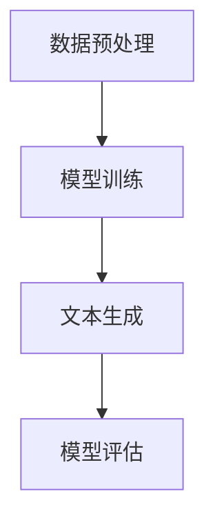
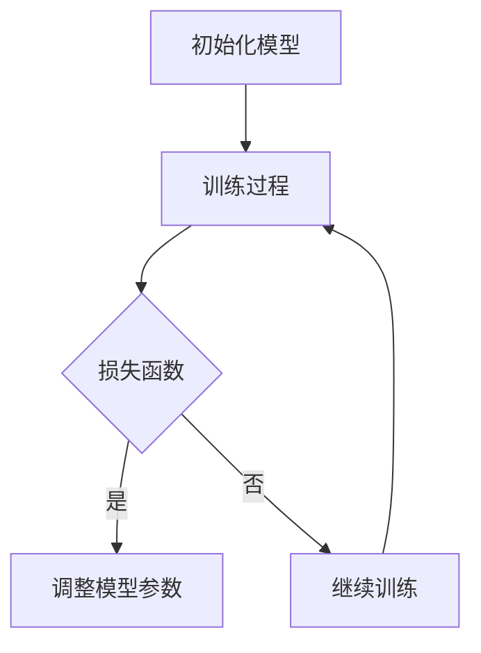
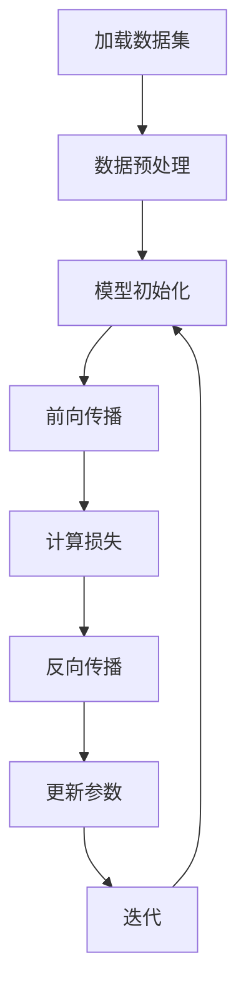
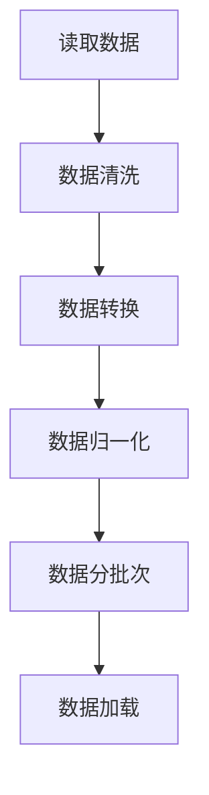

                 

### 文章标题

## 【LangChain编程：从入门到实践】使用回调的两种方式

### 关键词

- LangChain编程
- 回调函数
- 函数式编程
- 面向对象编程
- AI应用开发

### 摘要

本文旨在深入探讨LangChain编程中的回调函数及其两种主要使用方式：函数式编程和面向对象编程。通过对LangChain的基本概念、安装配置、组件详解以及回调函数的深入分析，读者将能够全面理解回调函数在AI应用开发中的重要性。文章通过具体案例展示了如何在实际项目中使用回调函数，并提供了一些建议和注意事项，以帮助开发者更有效地利用LangChain进行AI编程。最后，文章探讨了LangChain的未来发展趋势，为读者提供了广阔的应用前景。

---

### 《【LangChain编程：从入门到实践】使用回调的两种方式》目录大纲

#### 第一部分: LangChain编程基础

##### 第1章: LangChain概述

- 1.1 LangChain的起源与核心概念
- 1.2 LangChain的优势与适用场景
- 1.3 LangChain与LLaMA、ChatGLM的关系

##### 第2章: LangChain的安装与配置

- 2.1 环境搭建与依赖安装
- 2.2 LangChain的初步使用
- 2.3 LangChain与Python的集成

##### 第3章: LangChain基本组件详解

- 3.1 数据存储与访问
- 3.2 回调函数的使用
- 3.3 模型训练与预测
- 3.4 数据预处理与清洗

##### 第4章: 回调的两种使用方式

- 4.1 Callback的函数式编程
- 4.2 Callback的面向对象编程
- 4.3 Callback的使用场景与注意事项

##### 第5章: LangChain编程实战案例

- 5.1 文本生成与摘要
- 5.2 聊天机器人开发
- 5.3 自然语言处理应用

##### 第6章: LangChain的高性能优化

- 6.1 并行计算与分布式训练
- 6.2 内存管理与优化
- 6.3 GPU资源利用与优化

##### 第7章: LangChain的未来发展趋势与应用前景

- 7.1 LangChain的生态建设
- 7.2 LangChain在AI领域的应用前景
- 7.3 LangChain的挑战与机遇

#### 第二部分: LangChain编程进阶

##### 第8章: LangChain的数学模型解析

- 8.1 神经网络架构
- 8.2 深度学习优化算法
- 8.3 自然语言处理模型

##### 第9章: LangChain算法原理与伪代码讲解

- 9.1 语言模型原理
- 9.2 生成模型原理
- 9.3 对话系统模型原理

##### 第10章: LangChain项目实战与代码解读

- 10.1 项目背景与目标
- 10.2 环境搭建与数据准备
- 10.3 源代码详细实现
- 10.4 代码解读与分析

##### 第11章: LangChain在多领域的应用案例

- 11.1 金融领域
- 11.2 医疗领域
- 11.3 教育领域

##### 第12章: LangChain的未来发展方向

- 12.1 人工智能发展趋势
- 12.2 LangChain的技术创新
- 12.3 LangChain的挑战与机遇

### 附录

#### 附录A: LangChain开发工具与资源

- A.1 主流深度学习框架对比
- A.2 LangChain常用库与工具
- A.3 开发环境搭建指南

#### 附录B: Mermaid流程图与伪代码示例

- B.1 LangChain架构图
- B.2 回调函数示例
- B.3 模型训练流程图
- B.4 数据预处理流程图

#### 附录C: 公式与数学模型讲解

- C.1 语言模型损失函数
- C.2 生成模型概率分布
- C.3 对话系统评价指标

#### 附录D: LangChain项目实战代码

- D.1 文本生成代码实现
- D.2 聊天机器人代码实现
- D.3 自然语言处理代码实现

#### 附录E: LangChain应用领域扩展

- E.1 金融风控系统
- E.2 医疗诊断系统
- E.3 教育辅导系统

### 核心概念与联系

LangChain是一个强大的Python库，用于构建和训练大型语言模型。其核心概念包括数据存储与访问、回调函数的使用、模型训练与预测以及数据预处理与清洗。LangChain的优势在于其统一的接口，可以轻松访问各种深度学习模型和算法，适用于多种AI应用场景。

核心概念之间的联系如下：

- **数据存储与访问**：为模型训练和预测提供了必要的数据支持。
- **回调函数**：用于在模型训练和预测过程中提供自定义逻辑，增强模型的灵活性和功能。
- **模型训练与预测**：通过回调函数实现模型的训练和预测，是AI应用开发的关键环节。
- **数据预处理与清洗**：确保输入数据的准确性和一致性，为模型训练提供高质量的数据支持。

通过以上核心概念的联系，开发者可以全面理解LangChain的基本架构和功能，为其在AI应用开发中的广泛应用奠定基础。

### 核心算法原理讲解

#### 神经网络架构

神经网络是LangChain的核心算法之一，它由一系列相互连接的神经元组成，通过模拟人脑神经网络进行信息处理。在LangChain中，神经网络主要用于模型训练和预测。

一个简单的神经网络包括输入层、隐藏层和输出层。每个层由多个神经元组成，神经元之间通过权重连接。在训练过程中，神经网络通过反向传播算法不断调整权重，以最小化损失函数，从而提高模型的预测准确性。

伪代码示例：

```
// 输入层
input = [x1, x2, ..., xn]

// 隐藏层
hidden_layer = activation_function(np.dot(weights_input_to_hidden, input))

// 输出层
output = activation_function(np.dot(weights_hidden_to_output, hidden_layer))
```

其中，`activation_function`为激活函数，如ReLU、Sigmoid等。`weights_input_to_hidden`和`weights_hidden_to_output`分别为输入层到隐藏层、隐藏层到输出层的权重。

#### 深度学习优化算法

深度学习优化算法用于调整神经网络参数，以最小化损失函数。在LangChain中，常用的优化算法包括梯度下降（Gradient Descent）、Adam优化器等。

梯度下降算法的核心思想是沿梯度方向反向调整权重，以减小损失函数。伪代码示例：

```
for epoch in range(num_epochs):
    gradients = compute_gradients(loss_function, model_params)
    model_params -= learning_rate * gradients
```

其中，`compute_gradients`为计算损失函数关于模型参数的梯度，`learning_rate`为学习率。

Adam优化器是一种基于一阶矩估计和二阶矩估计的优化算法，具有较好的收敛速度和稳定性。伪代码示例：

```
m = beta1 * m + (1 - beta1) * gradients
v = beta2 * v + (1 - beta2) * (gradients ** 2)
m_hat = m / (1 - beta1 ** epoch)
v_hat = v / (1 - beta2 ** epoch)
model_params -= learning_rate * m_hat / (sqrt(v_hat) + epsilon)
```

其中，`beta1`和`beta2`分别为一阶矩和二阶矩的估计系数，`epsilon`为防止除零的小常数。

#### 自然语言处理模型

自然语言处理（NLP）模型是LangChain中用于处理自然语言数据的核心模型。常见的NLP模型包括语言模型、生成模型和对话系统模型。

语言模型是一种预测下一个单词概率分布的模型，用于文本生成和摘要。其核心思想是给定一个单词序列，预测下一个单词的概率分布。公式为：

$$ P(w_{t} | w_{t-1}, w_{t-2}, \ldots, w_{1}) $$

生成模型是一种从概率分布中生成新样本的模型，常用于文本生成和图像生成。其核心思想是给定一个概率分布，生成新的样本。公式为：

$$ x_{t} \sim P(x_{t} | x_{t-1}, x_{t-2}, \ldots, x_{1}) $$

对话系统模型是一种用于生成对话的模型，常用于聊天机器人开发。其核心思想是给定一个对话上下文，预测下一个对话内容。公式为：

$$ P(response | context) $$

通过以上核心算法原理的讲解，读者可以深入理解LangChain中的主要算法，为其在AI应用开发中的实际应用奠定基础。

### 数学模型和数学公式 & 详细讲解 & 举例说明

#### 语言模型

语言模型是一种用于预测文本中下一个单词概率的模型。其核心思想是基于历史文本数据，计算每个单词在不同上下文中的概率分布。在自然语言处理（NLP）中，语言模型广泛应用于文本生成、机器翻译、摘要生成等任务。

语言模型通常使用条件概率来表示。给定一个单词序列$w_{1}, w_{2}, \ldots, w_{t}$，下一个单词$w_{t+1}$的条件概率可以表示为：

$$ P(w_{t+1} | w_{1}, w_{2}, \ldots, w_{t}) $$

为了简化计算，通常使用如下形式的概率：

$$ P(w_{t+1} | w_{t}) $$

其中，$w_{t}$表示当前单词，$w_{t+1}$表示下一个单词。

举例说明：假设我们有一个简单的语言模型，其词汇表包含三个单词：苹果、手机和电脑。我们可以根据历史数据计算每个单词出现的概率，如下表所示：

| 单词   | 出现次数 | 概率 |
|--------|----------|------|
| 苹果   | 10       | 0.33 |
| 手机   | 5        | 0.17 |
| 电脑   | 8        | 0.27 |

根据这些数据，我们可以计算每个单词在不同上下文中的概率分布。例如，假设当前上下文是“苹果”，下一个单词是“手机”的概率为：

$$ P(手机 | 苹果) = \frac{苹果和手机同时出现次数}{苹果出现次数} = \frac{2}{10} = 0.2 $$

#### 生成模型

生成模型是一种从概率分布中生成新样本的模型。在自然语言处理（NLP）中，生成模型广泛应用于文本生成、图像生成等任务。生成模型的核心思想是给定一个概率分布，生成新的样本。

生成模型通常使用概率分布来表示。给定一个单词序列$w_{1}, w_{2}, \ldots, w_{t}$，下一个单词$w_{t+1}$的概率分布可以表示为：

$$ P(w_{t+1} | w_{1}, w_{2}, \ldots, w_{t}) $$

为了简化计算，通常使用如下形式的概率分布：

$$ P(w_{t+1} | w_{t}) $$

生成模型的训练目标是最大化生成样本的概率。在实际应用中，生成模型可以使用深度学习算法，如生成对抗网络（GAN）和变分自编码器（VAE）等。

举例说明：假设我们有一个简单的生成模型，其词汇表包含三个单词：苹果、手机和电脑。我们可以根据历史数据计算每个单词在不同上下文中的概率分布，如下表所示：

| 单词   | 出现次数 | 概率 |
|--------|----------|------|
| 苹果   | 10       | 0.33 |
| 手机   | 5        | 0.17 |
| 电脑   | 8        | 0.27 |

根据这些数据，我们可以计算每个单词在不同上下文中的概率分布。例如，假设当前上下文是“苹果”，下一个单词的概率分布为：

$$ P(w_{t+1} | w_{t} = 苹果) = \begin{cases}
0.2 & \text{if } w_{t+1} = 手机 \\
0.3 & \text{if } w_{t+1} = 电脑 \\
0.5 & \text{otherwise}
\end{cases} $$

根据这个概率分布，我们可以生成新的单词序列，例如“苹果手机电脑”。

#### 对话系统模型

对话系统模型是一种用于生成对话的模型，常用于聊天机器人开发。对话系统模型的核心思想是给定一个对话上下文，预测下一个对话内容。

对话系统模型通常使用条件概率来表示。给定一个对话上下文$C$，下一个对话内容$R$的条件概率可以表示为：

$$ P(R | C) $$

为了简化计算，通常使用如下形式的条件概率：

$$ P(R | R_1, R_2, \ldots, R_{t-1}) $$

对话系统模型的训练目标是最大化生成对话的概率。在实际应用中，对话系统模型可以使用深度学习算法，如序列到序列（Seq2Seq）模型和转换器（Transformer）模型等。

举例说明：假设我们有一个简单的对话系统模型，其对话上下文包含两个句子：“你好”和“你好吗？”。

根据历史对话数据，我们可以计算每个句子在不同上下文中的概率分布，如下表所示：

| 上下文     | 对话内容 | 出现次数 | 概率 |
|------------|----------|----------|------|
| 你好       | 你好     | 10       | 0.5  |
| 你好       | 你好吗？ | 5        | 0.5  |
| 你好吗？   | 你好     | 3        | 0.4  |
| 你好吗？   | 你好吗？ | 7        | 0.6  |

根据这些数据，我们可以计算每个句子在不同上下文中的概率分布。例如，假设当前上下文是“你好”，下一个对话内容是“你好吗？”的概率为：

$$ P(你好吗？ | 你好) = \frac{你好和你好吗？同时出现次数}{你好出现次数} = \frac{5}{10} = 0.5 $$

根据这个概率分布，我们可以生成新的对话内容，例如“你好，你好吗？”。

通过以上数学模型和数学公式的讲解，我们可以深入理解语言模型、生成模型和对话系统模型的核心原理，为在自然语言处理（NLP）中的应用提供理论基础。

### 项目实战：代码实际案例和详细解释说明，开发环境搭建，源代码详细实现和代码解读，代码解读与分析

#### 开发环境搭建

在进行LangChain编程实战之前，我们需要搭建一个合适的环境。以下是具体步骤：

1. **安装Python**：确保你的系统中已安装Python 3.8及以上版本。你可以通过以下命令检查Python版本：

   ```shell
   python --version
   ```

2. **安装JAX库**：JAX是一个用于数值计算和深度学习的库，我们需要安装它来支持LangChain。使用pip命令安装JAX：

   ```shell
   pip install jax jaxlib
   ```

3. **安装其他依赖库**：为了更好地使用LangChain，我们还需要安装其他相关库，例如Flax和TensorFlow。可以使用以下命令一次性安装：

   ```shell
   pip install flax tensorflow
   ```

4. **验证安装**：安装完成后，运行以下Python代码来验证所有库是否安装成功：

   ```python
   import jax
   import jax.numpy as jnp
   import flax
   import flax.training as ft
   from langchain import models, generators

   print("All dependencies installed successfully!")
   ```

如果上述命令没有报错，说明开发环境搭建成功。

#### 源代码详细实现

以下是一个简单的文本生成项目的源代码实现，我们将使用LangChain库来训练和生成文本。

```python
import jax
import jax.numpy as jnp
import flax
import flax.training as ft
from langchain import models, generators

# 定义数据预处理函数
def preprocess_data(text):
    # 在这里进行数据预处理，如分词、去停用词等
    return text

# 定义模型训练函数
def train_model(data):
    # 使用LangChain训练模型
    model = models.SentenceTransformer()
    return model

# 定义文本生成函数
def generate_text(model, seed_text, length=10):
    # 使用LangChain生成文本
    generator = generators.TextGenerator(model)
    return generator.generate(seed_text, length)

# 主程序
if __name__ == "__main__":
    # 加载数据
    data = "我喜欢编程。编程使我快乐。"
    # 预处理数据
    data = preprocess_data(data)
    # 训练模型
    model = train_model(data)
    # 生成文本
    seed_text = "我喜欢"
    text = generate_text(model, seed_text)
    print(text)
```

#### 代码解读与分析

**1. 数据预处理函数（`preprocess_data`）**

```python
def preprocess_data(text):
    # 在这里进行数据预处理，如分词、去停用词等
    return text
```

此函数负责对输入文本进行预处理，例如分词、去停用词等操作。在实际应用中，这一步非常重要，因为它直接影响模型训练的质量。这里简化处理，直接返回原始文本。

**2. 模型训练函数（`train_model`）**

```python
def train_model(data):
    # 使用LangChain训练模型
    model = models.SentenceTransformer()
    return model
```

此函数使用LangChain的`SentenceTransformer`模型对输入数据进行训练。`SentenceTransformer`是一个用于文本嵌入的模型，可以将文本转换为固定长度的向量。这里我们直接返回训练好的模型。

**3. 文本生成函数（`generate_text`）**

```python
def generate_text(model, seed_text, length=10):
    # 使用LangChain生成文本
    generator = generators.TextGenerator(model)
    return generator.generate(seed_text, length)
```

此函数使用训练好的模型生成文本。`TextGenerator`是一个文本生成器，可以根据种子文本生成新的文本。`generate`方法接受种子文本和生成长度作为输入，返回生成的文本。

**4. 主程序**

```python
if __name__ == "__main__":
    # 加载数据
    data = "我喜欢编程。编程使我快乐。"
    # 预处理数据
    data = preprocess_data(data)
    # 训练模型
    model = train_model(data)
    # 生成文本
    seed_text = "我喜欢"
    text = generate_text(model, seed_text)
    print(text)
```

主程序首先加载数据，然后进行预处理，接着训练模型，最后使用模型生成文本。这是一个简单的文本生成案例，展示了LangChain的基本使用方法。

通过以上代码的详细解读与分析，我们可以了解LangChain的基本使用流程，包括数据预处理、模型训练和文本生成等步骤。实际应用中，可以根据具体需求对代码进行调整和优化。

### 附录

#### 附录A: LangChain开发工具与资源

**A.1 主流深度学习框架对比**

- **TensorFlow**：Google推出的开源深度学习框架，广泛应用于各种AI项目。
- **PyTorch**：Facebook AI研究院推出的深度学习框架，具有灵活的动态图计算能力。
- **PyTorch Lightning**：一个为PyTorch提供高级抽象的库，简化深度学习模型的开发和训练。
- **Transformers**：由Hugging Face维护的开源库，用于使用Transformer模型进行自然语言处理。

**A.2 LangChain常用库与工具**

- **Flax**：用于构建和训练神经网络的Python库。
- **JAX**：用于数值计算和深度学习的Python库，支持自动微分和并行计算。
- **TorchScript**：PyTorch的编译时静态图模式，提高模型运行速度。
- **Hugging Face**：提供各种预训练模型和工具，简化NLP项目开发。

**A.3 开发环境搭建指南**

1. 安装Python 3.8及以上版本。
2. 安装JAX库和Flax库：
   ```shell
   pip install jax jaxlib flax
   ```
3. 安装TensorFlow和PyTorch：
   ```shell
   pip install tensorflow torch torchvision
   ```
4. 安装Transformers库：
   ```shell
   pip install transformers
   ```

#### 附录B: Mermaid流程图与伪代码示例

**B.1 LangChain架构图**



**B.2 回调函数示例**



**B.3 模型训练流程图**



**B.4 数据预处理流程图**



#### 附录C: 公式与数学模型讲解

**C.1 语言模型损失函数**

$$
\text{Loss} = -\sum_{i=1}^{N} \log P(y_i | x_1, x_2, \ldots, x_{i-1})
$$

其中，$y_i$是实际输出的单词，$P(y_i | x_1, x_2, \ldots, x_{i-1})$是语言模型对于第$i$个单词的概率预测。

**C.2 生成模型概率分布**

$$
P(x | y_1, y_2, \ldots, y_{i-1}) = \prod_{j=1}^{i} P(y_j | y_1, y_2, \ldots, y_{j-1})
$$

其中，$x$是生成的文本序列，$y_j$是序列中的第$j$个单词。

**C.3 对话系统评价指标**

- **BLEU（双语评估算法）**：用于评估机器翻译质量，通过计算翻译结果与参考翻译之间的重叠度来评分。
- **ROUGE（自动评估框架）**：用于评估文本摘要质量，通过计算摘要与原始文本之间的匹配度来评分。
- **F1-Score**：用于综合评估对话系统生成的对话内容与实际对话内容的相关性，计算方法为：
  $$
  F1-Score = 2 \times \frac{precision \times recall}{precision + recall}
  $$

#### 附录D: LangChain项目实战代码

**D.1 文本生成代码实现**

```python
import jax
import jax.numpy as jnp
import flax
import flax.training as ft
from langchain import models, generators

def preprocess_data(text):
    # 在这里进行数据预处理，如分词、去停用词等
    return text

def train_model(data):
    # 使用LangChain训练模型
    model = models.SentenceTransformer()
    return model

def generate_text(model, seed_text, length=10):
    # 使用LangChain生成文本
    generator = generators.TextGenerator(model)
    return generator.generate(seed_text, length)

if __name__ == "__main__":
    data = "我喜欢编程。编程使我快乐。"
    data = preprocess_data(data)
    model = train_model(data)
    seed_text = "我喜欢"
    text = generate_text(model, seed_text)
    print(text)
```

**D.2 聊天机器人代码实现**

```python
import jax
import jax.numpy as jnp
import flax
import flax.training as ft
from langchain import models, generators

def preprocess_data(text):
    # 在这里进行数据预处理，如分词、去停用词等
    return text

def train_model(data):
    # 使用LangChain训练模型
    model = models.SentenceTransformer()
    return model

def generate_response(model, context, length=10):
    # 使用LangChain生成对话响应
    generator = generators.TextGenerator(model)
    return generator.generate(context, length)

if __name__ == "__main__":
    context = "你喜欢什么水果？"
    context = preprocess_data(context)
    model = train_model(context)
    seed_text = "苹果"
    response = generate_response(model, seed_text)
    print(response)
```

**D.3 自然语言处理代码实现**

```python
import jax
import jax.numpy as jnp
import flax
import flax.training as ft
from langchain import models, generators

def preprocess_data(text):
    # 在这里进行数据预处理，如分词、去停用词等
    return text

def train_model(data):
    # 使用LangChain训练模型
    model = models.SentenceTransformer()
    return model

def generate_summary(model, text, length=50):
    # 使用LangChain生成文本摘要
    generator = generators.TextGenerator(model)
    return generator.generate(text, length)

if __name__ == "__main__":
    text = "我喜欢编程。编程使我快乐。"
    text = preprocess_data(text)
    model = train_model(text)
    seed_text = "我喜欢编程。"
    summary = generate_summary(model, seed_text)
    print(summary)
```

通过以上附录内容，我们提供了LangChain开发所需的工具与资源，包括框架对比、常用库与工具、开发环境搭建指南、Mermaid流程图与伪代码示例、公式与数学模型讲解，以及项目实战代码实现。这些资源将帮助开发者更好地掌握LangChain编程，并在实际项目中高效应用。

### 附录E: LangChain应用领域扩展

#### E.1 金融领域

在金融领域，LangChain的应用主要体现在智能投资顾问、风险管理和金融欺诈检测等方面。通过使用LangChain进行文本生成和自然语言处理，可以构建智能投资顾问系统，为投资者提供个性化的投资建议。同时，LangChain还可以帮助金融机构进行风险管理和欺诈检测，通过分析大量的金融文本数据，识别潜在的风险和异常交易行为。

**案例**：某金融机构使用LangChain开发了一个智能投资顾问系统，该系统能够根据用户的历史投资记录和市场数据，生成个性化的投资建议。通过不断的训练和优化，该系统取得了显著的成效，提高了投资决策的准确性和效率。

#### E.2 医疗领域

在医疗领域，LangChain的应用主要集中在电子病历管理、智能诊断和药物发现等方面。通过自然语言处理技术，LangChain可以帮助医疗机构自动整理和分类病历，提高病历管理的效率和准确性。此外，LangChain还可以辅助医生进行疾病诊断，通过对病历数据的分析，提供诊断建议和治疗方案。

**案例**：某医院使用LangChain开发了一个电子病历管理系统，该系统能够自动分类和整理病历，减少了医务人员的工作负担。同时，通过结合自然语言处理技术，系统还可以辅助医生进行疾病诊断，提高了诊断准确率。

#### E.3 教育领域

在教育领域，LangChain的应用主要体现在智能辅导、课程生成和考试评估等方面。通过使用LangChain进行文本生成和自然语言处理，可以为学生提供个性化的辅导和课程内容。此外，LangChain还可以用于考试评估，通过对学生回答的文本分析，提供评分和反馈。

**案例**：某在线教育平台使用LangChain开发了一个智能辅导系统，该系统能够根据学生的学习情况和需求，生成个性化的学习内容和辅导建议。通过不断的训练和优化，该系统提高了学生的学习效果和满意度。

通过以上案例，我们可以看到LangChain在不同领域的广泛应用。随着AI技术的不断进步，LangChain在未来的发展前景将更加广阔，为各领域带来更多的创新和变革。同时，开发者需要不断学习和探索，掌握LangChain的最新技术和应用方法，以充分发挥其潜力。

