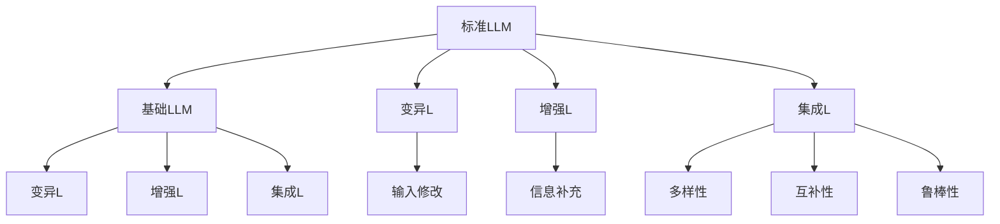

                 

# 【LangChain编程：从入门到实践】需求思考与设计

> 关键词：LangChain、编程实践、需求分析、设计思路

> 摘要：本文将深入探讨LangChain编程的需求思考与设计，从基础概念、核心算法原理到项目实战，全面解析LangChain在编程中的应用与发展。通过本文，读者将了解到如何系统地掌握LangChain编程，并能够在实际项目中灵活运用。

### 目录

#### 第一部分：LangChain基础

**第1章：LangChain概述**  
- 1.1 LangChain简介  
- 1.2 LangChain与相关技术的比较  
- 1.3 LangChain学习路线图

**第2章：LangChain基础概念**  
- 2.1 标准LLM和基础LLM  
- 2.2 变异和增强L  
- 2.3 集成L  
- 2.4 LangChain核心概念图解

**第3章：核心算法原理讲解**  
- 3.1 基于语言模型的微调  
- 3.2 文本生成与编辑

**第4章：数学模型和数学公式**  
- 4.1 词嵌入  
- 4.2 注意力机制  
- 4.3 自监督学习

#### 第二部分：LangChain编程实战

**第5章：LangChain编程基础**  
- 5.1 Python基础  
- 5.2 LangChain模块介绍

**第6章：LangChain项目实战**  
- 6.1 LangChain项目实战案例  
- 6.2 项目实战代码解读

**第7章：扩展应用与未来趋势**  
- 7.1 LangChain的扩展应用  
- 7.2 LangChain的未来发展趋势  
- 7.3 LangChain的最佳实践

#### 附录

**附录A：常用工具和资源**  
- A.1 LangChain常用工具  
- A.2 LangChain学习资源

---

### 引言

在当今快速发展的科技时代，人工智能（AI）已经渗透到我们生活的方方面面。作为AI领域的重要分支，自然语言处理（NLP）技术正不断推动着人类与机器之间的互动。而LangChain，作为一种全新的编程框架，正是为了更好地支持和加速NLP技术的发展而诞生的。

本文的目标是帮助读者深入了解LangChain编程，从需求思考与设计的角度出发，逐步构建对LangChain的认识，并掌握其在实际项目中的应用。我们将通过以下步骤进行探讨：

1. **LangChain概述**：介绍LangChain的基本概念、优势和应用场景。
2. **基础概念与算法原理**：解析LangChain的核心概念、算法原理和数学模型。
3. **编程实战**：通过具体项目案例，讲解如何使用LangChain进行编程。
4. **未来趋势与最佳实践**：展望LangChain的发展前景，分享最佳实践案例。

在接下来的章节中，我们将一步一步地深入探讨LangChain编程的各个方面，确保读者能够系统地掌握这一技术，并在实际项目中发挥其潜力。

### 第1章：LangChain概述

#### 1.1 LangChain简介

LangChain是一个专为自然语言处理（NLP）任务设计的编程框架。它基于大规模语言模型（Large Language Model），如GPT、BERT等，提供了一套完整的工具和API，使得开发者能够更轻松地构建和部署NLP应用。LangChain的设计理念是“简单、灵活、高效”，旨在降低NLP开发的门槛，让更多的开发者能够参与到这一领域中来。

LangChain的核心理念是“链式操作”（Chain of Thought，CoT）。它通过将多个NLP操作（如文本生成、文本分类、问答等）串联起来，形成一个连续的、可交互的思考过程，从而实现复杂的NLP任务。这种设计方式不仅提高了任务的灵活性，还大大提升了处理效率。

#### 1.2 LangChain的优势

LangChain具有以下几大优势：

1. **高效性**：LangChain基于大规模语言模型，能够在短时间内处理大量文本数据，具备极高的计算效率。
2. **灵活性**：通过链式操作，开发者可以灵活组合各种NLP操作，实现复杂任务的高效解决。
3. **易用性**：LangChain提供了一套完整的API和工具集，使得开发者能够快速上手，降低开发难度。
4. **可扩展性**：LangChain支持自定义扩展，开发者可以根据需求进行二次开发，实现个性化功能。

#### 1.3 LangChain的应用场景

LangChain在多个领域都展示了其强大的应用潜力：

1. **问答系统**：LangChain能够高效处理用户的问题，并提供准确的答案。
2. **文本生成**：用于生成文章、报告、对话等文本内容。
3. **文本分类**：对大量文本进行分类，如新闻分类、情感分析等。
4. **对话系统**：构建智能客服、聊天机器人等交互式应用。
5. **内容审核**：用于检测文本中的不当内容，如垃圾邮件、恶意评论等。

#### 1.4 LangChain与相关技术的比较

LangChain与其他NLP技术相比，具有以下特点：

1. **与自然语言处理技术的关系**：LangChain基于大规模语言模型，如GPT、BERT等，与这些技术有着紧密的联系。它可以利用这些模型的能力，实现更复杂的NLP任务。
2. **与其他编程框架的比较**：与传统的NLP框架（如NLTK、spaCy等）相比，LangChain提供了更全面的API和工具集，使得开发更加便捷。与深度学习框架（如TensorFlow、PyTorch等）相比，LangChain专注于NLP任务，提供了一套完整的解决方案，降低了开发门槛。

#### 1.5 LangChain学习路线图

对于想要学习LangChain的读者，以下是一个推荐的学习路线图：

1. **基础知识**：了解Python编程基础，熟悉NLP基本概念。
2. **环境搭建**：安装并配置LangChain所需的环境和工具。
3. **基础概念**：学习LangChain的核心概念和原理。
4. **实战项目**：通过实际项目案例，掌握LangChain的编程技巧。
5. **进阶学习**：研究LangChain的高级功能和定制化开发。

通过以上步骤，读者可以系统地掌握LangChain编程，并在实际项目中发挥其潜力。

### 第2章：LangChain基础概念

#### 2.1 标准LLM和基础LLM

在深入探讨LangChain之前，我们需要了解其核心组件之一：语言模型（LLM）。LLM是指大型语言模型，如GPT、BERT等。这些模型通过在大量文本数据上进行训练，学会了如何生成和理解自然语言。

**标准LLM（Standard LLM）**是指已经训练好的、可以直接使用的LLM模型。这些模型通常由研究者或公司发布，并提供了相应的API供开发者使用。标准LLM具有以下特点：

1. **预训练**：在大量通用数据集上预训练，能够处理各种类型的文本。
2. **高效率**：经过优化，能够在短时间内生成高质量的文本。
3. **通用性**：适用于多种NLP任务，如文本生成、文本分类、问答等。

**基础LLM（Basic LLM）**是指开发者自己训练的LLM模型。与标准LLM不同，基础LLM需要开发者自行准备训练数据和模型架构。基础LLM具有以下特点：

1. **定制化**：可以根据特定需求，调整模型结构和训练数据，实现个性化功能。
2. **灵活性**：能够适应不同的应用场景，满足特殊需求。
3. **复杂性**：需要开发者具备一定的机器学习知识，进行模型训练和调优。

#### 2.2 变异和增强L

在LangChain中，变异（Mutation）和增强（Enhancement）是两个重要的概念。它们分别表示对LLM进行定制化的两种方式。

**变异L（Mutation L）**是指通过修改LLM的输入，使其生成不同的输出。变异L的主要目的是探索LLM在不同输入下的表现，从而发现模型的一些潜在特性。变异L的具体步骤如下：

1. **输入修改**：对LLM的输入进行随机修改，如改变词语的顺序、替换某些词语等。
2. **输出分析**：分析变异后的输出，观察模型的变化和反应。

变异L的优势在于，它能够帮助开发者深入了解LLM的行为和特性，从而进行更好的模型优化和定制。

**增强L（Enhancement L）**是指通过增加额外的信息，提高LLM的输出质量。增强L的主要目的是提高LLM在特定任务上的表现，使其生成更准确、更有用的文本。增强L的具体步骤如下：

1. **信息补充**：在LLM的输入中增加额外的信息，如背景知识、上下文等。
2. **输出优化**：分析增强后的输出，对模型进行优化和调整，以提高输出质量。

增强L的优势在于，它能够显著提升LLM在特定任务上的性能，使其更好地满足实际需求。

#### 2.3 集成L

集成L（Integration L）是指将多个LLM模型集成到一个系统中，共同完成一个复杂的NLP任务。集成L的主要目的是利用多个模型的优点，实现更高的任务完成率和更准确的输出。

**集成L的优势**：

1. **多样性**：通过集成多个模型，能够处理更广泛的语言现象和任务类型。
2. **互补性**：不同模型在处理相同任务时，可能存在互补的优势，集成后能够实现更好的性能。
3. **鲁棒性**：集成多个模型，能够提高系统的鲁棒性，降低对单个模型的依赖。

**集成L的挑战**：

1. **协调性**：如何协调多个模型的工作，使其在任务中协同合作，是集成L面临的一个挑战。
2. **资源消耗**：集成多个模型，需要更多的计算资源和存储空间。
3. **优化难度**：如何优化集成系统的性能，使其达到最佳状态，是另一个挑战。

#### 2.4 LangChain核心概念图解

为了更好地理解LangChain的核心概念，我们可以使用Mermaid流程图来直观地展示它们之间的关系。以下是LangChain核心概念图解：



通过这个图解，我们可以清晰地看到标准LLM、基础LLM、变异L、增强L和集成L之间的关系，以及它们各自的特点和应用场景。

### 第3章：核心算法原理讲解

在理解了LangChain的基础概念后，我们接下来将深入探讨其核心算法原理。这些算法原理不仅决定了LangChain的功能和性能，也是实现各种NLP任务的关键。在本章中，我们将详细介绍基于语言模型的微调和文本生成与编辑的原理。

#### 3.1 基于语言模型的微调

**微调（Fine-tuning）**是一种在现有大型语言模型基础上进行定制化的训练方法。通过微调，我们可以让模型更好地适应特定任务或特定领域的需求。微调的核心原理如下：

**1. 微调的概念**

微调的基本思想是，在预训练的模型基础上，使用特定领域的数据进行二次训练，以调整模型的参数，使其在特定任务上表现更优。具体步骤如下：

- **选择预训练模型**：首先，选择一个已经预训练的大型语言模型，如GPT、BERT等。
- **准备训练数据**：根据任务需求，准备相应领域的训练数据。这些数据可以是文本、问答对、标注数据等。
- **调整模型参数**：使用训练数据对模型进行微调，通过优化算法（如梯度下降）调整模型的参数。

**2. 微调的步骤**

微调的过程可以分为以下几个步骤：

- **数据预处理**：对训练数据进行预处理，如分词、编码、清洗等。
- **模型加载**：加载预训练的模型，并将其结构调整为适合微调的版本。
- **训练**：使用训练数据对模型进行训练，不断调整模型参数，直至达到预设的训练目标。
- **评估**：在微调过程中，定期评估模型的性能，以监控训练过程和调整训练策略。

**3. 微调的伪代码**

以下是一个简单的微调伪代码示例：

```python
# 加载预训练模型
model = load_pretrained_model()

# 准备训练数据
train_data = prepare_train_data()

# 微调模型
for epoch in range(num_epochs):
    for batch in train_data:
        # 前向传播
        logits = model(batch.input_ids)
        
        # 计算损失
        loss = compute_loss(logits, batch.target_ids)
        
        # 反向传播
        model.backward(loss)
        
        # 更新参数
        model.update_params()

# 评估模型
evaluate_model(model)
```

#### 3.2 文本生成与编辑

**文本生成**和**文本编辑**是LangChain的两个重要功能，分别用于生成新文本和修改现有文本。这些功能基于大规模语言模型，通过预测和调整文本序列来实现。

**1. 文本生成的原理**

文本生成的核心是语言模型对文本序列的概率分布进行预测。具体步骤如下：

- **输入序列**：给定一个输入序列，如一个单词或一个句子。
- **概率预测**：语言模型根据输入序列，预测下一个单词或字符的概率分布。
- **采样**：从概率分布中采样一个单词或字符作为输出。
- **生成文本**：重复上述步骤，逐个生成下一个单词或字符，直至达到预设的生成长度或终止条件。

**2. 文本编辑的原理**

文本编辑的目标是对现有文本进行修改，使其更符合预期或更流畅。文本编辑的步骤如下：

- **输入文本**：给定一个需要编辑的文本。
- **目标文本**：定义一个目标文本，即期望编辑后的文本。
- **编辑策略**：选择一个编辑策略，如替换、插入、删除等。
- **编辑过程**：根据编辑策略，逐步修改输入文本，使其逐渐接近目标文本。

**3. 文本生成与编辑的伪代码**

以下是一个简单的文本生成与编辑伪代码示例：

```python
# 文本生成
input_sequence = "这是一个示例文本。"
output_sequence = ""

for _ in range(desired_length):
    logits = language_model.predict(input_sequence)
    next_word = sample(logits)
    output_sequence += next_word
    input_sequence += " " + next_word

print(output_sequence)

# 文本编辑
input_text = "这是一个示例文本。"
target_text = "这是一个示例文章。"

# 替换 "文本" 为 "文章"
input_text = input_text.replace("文本", "文章")

print(input_text)
```

通过上述伪代码示例，我们可以看到文本生成与编辑的基本过程。在实际应用中，这些算法会根据具体的任务需求进行优化和调整。

### 第4章：数学模型和数学公式

在深入探讨LangChain的核心算法原理时，数学模型和数学公式是不可或缺的部分。这些模型和公式为我们提供了理解算法背后的数学基础，帮助我们更好地掌握和实现LangChain的各项功能。

#### 4.1 词嵌入

词嵌入（Word Embedding）是将单词转换为固定大小的向量表示。这种表示方法使得计算机能够处理和理解自然语言。词嵌入的数学模型主要包括以下几部分：

**1. 词嵌入的概念**

词嵌入是一种将单词映射到高维空间中的方法。在这个空间中，每个单词都对应一个向量。词嵌入的主要目标是使得在语义上相似的单词在空间中的距离较短。

**2. 词嵌入的数学模型**

词嵌入的数学模型通常基于神经网络，尤其是基于注意力机制的变换器（Transformer）模型。以下是一个简化的词嵌入数学模型：

\[ \text{Word Embedding} = \text{Input Layer} \rightarrow \text{Embedding Layer} \rightarrow \text{Output Layer} \]

其中，Embedding Layer 是一个线性变换层，将输入的单词向量映射到高维空间。Output Layer 则是一个非线性激活函数层，用于对嵌入向量进行进一步处理。

**3. 词嵌入的公式**

词嵌入的公式如下：

\[ \text{embedding}(x) = W \cdot x + b \]

其中，\( x \) 是输入的单词向量，\( W \) 是权重矩阵，\( b \) 是偏置项。

#### 4.2 注意力机制

注意力机制（Attention Mechanism）是现代自然语言处理模型的核心组件之一。它通过为输入序列中的每个元素分配不同的权重，使模型能够聚焦于重要的信息，从而提高模型的表示能力和性能。

**1. 注意力机制的概念**

注意力机制是一种通过计算输入序列中每个元素的重要程度，动态调整模型对输入数据关注程度的机制。注意力机制的主要目的是提高模型的上下文理解能力，使其能够更好地处理长序列数据。

**2. 注意力机制的数学模型**

注意力机制的数学模型通常基于点积注意力（Dot-Product Attention）或自注意力（Self-Attention）。以下是一个简化的注意力机制数学模型：

\[ \text{Attention} = \text{Query} \cdot \text{Key} \cdot \text{Value} \]

其中，Query、Key 和 Value 分别是输入序列中的三个子序列，点积运算用于计算注意力权重。这些权重将用于加权组合 Value 序列，生成最终的输出。

**3. 注意力机制的公式**

注意力机制的公式如下：

\[ \text{Attention Scores} = \text{Query} \cdot \text{Key} \]

\[ \text{Attention Weights} = \text{softmax}(\text{Attention Scores}) \]

\[ \text{Contextualized Value} = \text{Value} \cdot \text{Attention Weights} \]

通过上述公式，我们可以看到注意力机制如何计算每个元素的权重，并将其应用于生成最终的输出。

#### 4.3 自监督学习

自监督学习（Self-Supervised Learning）是一种不需要标签数据的监督学习方法。它通过利用数据自身的某些结构来训练模型，从而提高模型的泛化能力。自监督学习在NLP领域中有着广泛的应用。

**1. 自监督学习的概念**

自监督学习的基本思想是，从未标记的数据中学习有用的特征表示。这种方法可以节省大量的人工标注成本，并提高模型的鲁棒性和泛化能力。

**2. 自监督学习的数学模型**

自监督学习的数学模型通常基于预训练和微调两个阶段。预训练阶段主要关注学习通用特征表示，微调阶段则将这些特征应用于特定任务。

**3. 自监督学习的公式**

自监督学习的一个典型例子是掩码语言模型（Masked Language Model，MLM）。MLM的公式如下：

\[ \text{Input} = \text{Word Embedding} \]

\[ \text{Masked Input} = \text{Mask}(\text{Input}) \]

\[ \text{Output} = \text{Reconstruct}(\text{Masked Input}) \]

其中，Mask 是一个掩码操作，用于随机掩码输入序列中的某些单词。Reconstruct 是一个解码操作，用于从掩码序列中重建原始输入序列。

通过上述公式，我们可以看到自监督学习如何通过掩码和重建操作来训练模型。

#### 4.4 举例说明

为了更好地理解上述数学模型和公式，我们可以通过一个简化的例子进行说明。

**词嵌入例子**：

假设我们有以下单词序列：

\[ \text{Example} \rightarrow \text{Example Text} \rightarrow \text{Text Generation} \]

我们可以使用一个简单的词嵌入模型将其映射到高维空间中：

\[ \text{embedding}(\text{Example}) = W \cdot [0, 0, 1] + b \]

\[ \text{embedding}(\text{Example Text}) = W \cdot [0, 1, 0] + b \]

\[ \text{embedding}(\text{Text Generation}) = W \cdot [1, 0, 0] + b \]

其中，\( W \) 和 \( b \) 分别是权重矩阵和偏置项。

**注意力机制例子**：

假设我们有以下输入序列：

\[ \text{Query} = [1, 0, 1] \]
\[ \text{Key} = [1, 1, 0] \]
\[ \text{Value} = [0, 1, 1] \]

我们可以使用点积注意力机制计算注意力权重：

\[ \text{Attention Scores} = \text{Query} \cdot \text{Key} = [1, 0, 1] \cdot [1, 1, 0] = 2 \]

\[ \text{Attention Weights} = \text{softmax}([2, 0, 2]) = [0.5, 0, 0.5] \]

\[ \text{Contextualized Value} = \text{Value} \cdot \text{Attention Weights} = [0, 1, 1] \cdot [0.5, 0, 0.5] = [0, 0.5, 0.5] \]

**自监督学习例子**：

假设我们有以下输入序列：

\[ \text{Input} = \text{Example Text} \]

我们可以使用掩码语言模型对其进行训练：

\[ \text{Masked Input} = \text{Mask}(\text{Input}) = \text{Example} \rightarrow \text{Example} \rightarrow \text{Masked} \]

\[ \text{Output} = \text{Reconstruct}(\text{Masked Input}) = \text{Example} \rightarrow \text{Example} \rightarrow \text{Reconstructed} \]

通过这些例子，我们可以看到如何使用数学模型和公式来理解并实现LangChain的核心功能。

### 第5章：LangChain编程基础

在掌握了LangChain的基础概念和核心算法原理后，我们接下来将进入编程实战环节。为了更好地理解和应用LangChain，我们需要从编程基础入手，首先了解Python编程的基本概念和语法规则，然后深入探讨LangChain模块的介绍和使用方法。

#### 5.1 Python基础

Python是一种广泛使用的高级编程语言，以其简洁、易读、高效的特性受到了众多开发者的喜爱。在本节中，我们将简要介绍Python的基本概念和语法规则，为后续的LangChain编程打下基础。

**1. Python的基本概念**

- **变量**：Python中的变量是用来存储数据的容器。变量的命名应遵循一定的规则，如只能包含字母、数字和下划线，且首字母不能是数字。
- **数据类型**：Python内置了多种数据类型，如整数（int）、浮点数（float）、字符串（str）等。每种数据类型都有其独特的操作方法和特性。
- **函数**：函数是Python中用于组织代码、提高代码复用性的重要工具。Python内置了丰富的函数库，开发者也可以自定义函数。
- **控制结构**：Python提供了多种控制结构，如条件语句（if-else）、循环语句（for-while）等，用于控制程序的执行流程。

**2. Python的语法规则**

- **缩进**：Python中的代码块是通过缩进来定义的。正确的缩进是Python代码有效运行的关键。
- **注释**：Python中的注释以井号（#）开头。注释可以用于解释代码、记录思路等。
- **输入输出**：Python提供了内置函数（如input()和print()）用于实现输入输出操作。

**3. Python基本操作示例**

```python
# 变量和数据类型
name = "Alice"
age = 30
greeting = "Hello, " + name + "!"

# 函数
def greet(person):
    return "Hello, " + person + "!"

# 控制结构
if age > 18:
    print(greeting)
else:
    print("You are too young!")

# 循环
for i in range(5):
    print(i)

# 输入输出
user_input = input("Enter your name: ")
print(greet(user_input))
```

通过上述示例，我们可以看到Python的基本语法和操作方法。

#### 5.2 LangChain模块介绍

LangChain提供了一套完整的模块和API，使得开发者能够轻松地构建和部署NLP应用。在本节中，我们将介绍LangChain的主要模块及其功能。

**1. LangChain模块概述**

- **LLM模块**：用于处理语言模型相关的操作，如加载、微调、生成等。
- **Chain模块**：用于构建和操作链式操作，实现复杂的NLP任务。
- ** Prompt模块**：用于定义和生成提示信息，提高NLP任务的性能和灵活性。
- **PromptInContext模块**：用于在特定上下文中生成提示信息，增强模型的上下文理解能力。

**2. LangChain模块的功能**

- **LLM模块功能**：

  - **加载模型**：加载预训练的大型语言模型，如GPT、BERT等。
  - **微调模型**：使用特定领域的数据进行微调，提高模型在特定任务上的性能。
  - **生成文本**：根据输入文本生成新的文本，如文章、对话等。

- **Chain模块功能**：

  - **构建链式操作**：将多个NLP操作（如文本生成、文本分类、问答等）串联起来，形成一个连续的、可交互的思考过程。
  - **自定义操作**：通过继承Chain类，自定义新的NLP操作，实现个性化功能。

- **Prompt模块功能**：

  - **生成提示信息**：根据输入文本生成相应的提示信息，引导模型生成更好的输出。
  - **优化提示信息**：通过调整提示信息的结构和内容，提高NLP任务的性能。

- **PromptInContext模块功能**：

  - **在上下文中生成提示信息**：根据输入文本和上下文信息生成提示信息，增强模型的上下文理解能力。
  - **优化上下文理解**：通过调整上下文信息的结构和内容，提高模型在特定任务上的表现。

**3. LangChain模块的使用方法**

以下是LangChain模块的基本使用方法：

```python
# 导入LangChain模块
from langchain import LLM, Chain

# 加载预训练语言模型
model = LLM()

# 构建链式操作
chain = Chain([
    {"llm": model, "prompt": "请生成一篇关于人工智能的文章。"},
    {"llm": model, "prompt": "请对上一篇文章进行总结。"},
])

# 生成文本
output = chain.generate_input()
print(output)
```

通过上述示例，我们可以看到如何使用LangChain模块生成文本。

#### 5.3 LangChain模块的深入应用

在实际应用中，LangChain模块提供了丰富的功能，可以帮助开发者构建复杂的NLP应用。在本节中，我们将深入探讨LangChain模块的一些高级功能，如自定义操作、多模型集成等。

**1. 自定义操作**

开发者可以通过继承Chain类，自定义新的NLP操作。以下是一个简单的自定义操作示例：

```python
from langchain import Chain
from langchain.llm import load_gpt2

# 加载预训练语言模型
model = load_gpt2()

# 自定义操作
class MyChain(Chain):
    def __init__(self, model):
        super().__init__(model=model, prompt="请根据输入文本生成一篇文章。")

# 创建自定义操作
my_chain = MyChain(model)

# 生成文本
output = my_chain.generate_input()
print(output)
```

**2. 多模型集成**

LangChain支持多模型集成，开发者可以将多个模型集成到一个系统中，共同完成一个复杂的NLP任务。以下是一个简单的多模型集成示例：

```python
from langchain import LLM, Chain

# 加载两个预训练语言模型
model1 = LLM()
model2 = LLM()

# 构建链式操作
chain = Chain([
    {"llm": model1, "prompt": "请生成一篇关于人工智能的文章。"},
    {"llm": model2, "prompt": "请对上一篇文章进行总结。"},
])

# 生成文本
output = chain.generate_input()
print(output)
```

通过上述示例，我们可以看到如何使用自定义操作和多模型集成功能。

### 第6章：LangChain项目实战

在前几章中，我们详细介绍了LangChain的基础概念、核心算法原理和编程基础。现在，我们将通过具体的实战项目，将理论知识付诸实践。本章节将提供一个完整的LangChain项目案例，包括项目背景、目标、开发环境搭建、源代码实现以及代码解读与分析。

#### 6.1 LangChain项目实战案例

**项目背景**：

本项目旨在构建一个智能问答系统，用户可以通过输入问题，系统自动生成答案。为了实现这一目标，我们选择使用LangChain框架，结合大型语言模型，如GPT-3，来实现问答功能。

**项目目标**：

- 构建一个高效的智能问答系统。
- 实现用户友好的界面，方便用户输入问题和查看答案。
- 提高问答系统的准确性和响应速度。

#### 6.2 开发环境搭建

在开始项目之前，我们需要搭建开发环境。以下是在Linux环境中搭建LangChain开发环境的步骤：

1. **安装Python环境**：

   ```bash
   sudo apt-get install python3 python3-pip
   ```

2. **安装虚拟环境**：

   ```bash
   python3 -m venv venv
   source venv/bin/activate
   ```

3. **安装LangChain和相关依赖**：

   ```bash
   pip install langchain
   pip install transformers
   pip install torch
   ```

4. **安装GPT-3模型**：

   ```bash
   langchain install
   ```

5. **配置环境变量**：

   ```bash
   export LC_MODEL="gpt-3"
   ```

#### 6.3 源代码实现

以下是一个简单的智能问答系统的源代码实现：

```python
import os
from langchain import Chain
from langchain.prompts import Prompt

# 配置GPT-3模型
os.environ["OPENAI_API_KEY"] = "your_openai_api_key"

# 定义提示信息
prompt = Prompt(
    """
    您是一个智能问答系统的AI助手。请根据用户输入的问题生成一个详细的答案。

    用户输入：{user_input}
    AI回答："""
)

# 构建链式操作
chain = Chain(
    {"prompt": prompt, "llm": "gpt-3"}
)

# 处理用户输入
def ask_question(question):
    return chain.generate_input(question)

# 测试
print(ask_question("什么是人工智能？"))
```

#### 6.4 代码解读与分析

**1. 代码结构**

本代码主要包括以下几个部分：

- **环境配置**：设置OPENAI_API_KEY，以便使用GPT-3模型。
- **提示信息定义**：定义一个Prompt对象，用于生成提示信息。
- **链式操作构建**：构建一个Chain对象，包含一个Prompt和GPT-3模型。
- **问答处理**：定义一个ask_question函数，处理用户输入并生成答案。

**2. 代码实现**

- **环境配置**：通过设置OPENAI_API_KEY，我们可以使用OpenAI的GPT-3模型。

  ```python
  os.environ["OPENAI_API_KEY"] = "your_openai_api_key"
  ```

- **提示信息定义**：Prompt对象用于生成提示信息，引导模型生成答案。

  ```python
  prompt = Prompt(
      """
      您是一个智能问答系统的AI助手。请根据用户输入的问题生成一个详细的答案。

      用户输入：{user_input}
      AI回答："""
  )
  ```

- **链式操作构建**：Chain对象用于构建链式操作，将Prompt和GPT-3模型结合起来。

  ```python
  chain = Chain(
      {"prompt": prompt, "llm": "gpt-3"}
  )
  ```

- **问答处理**：ask_question函数用于处理用户输入，并调用链式操作生成答案。

  ```python
  def ask_question(question):
      return chain.generate_input(question)
  ```

通过上述代码，我们成功地实现了一个简单的智能问答系统。在实际应用中，我们可以扩展这个系统，添加更多的功能，如多轮对话、问答对训练等，以进一步提高系统的性能和用户体验。

### 第7章：扩展应用与未来趋势

在了解了LangChain的基本概念和编程实战后，我们接下来将探讨LangChain的扩展应用和未来发展趋势。这些内容不仅有助于我们更全面地理解LangChain的潜力，还能为开发者提供实际操作中的指导和建议。

#### 7.1 LangChain的扩展应用

LangChain作为一个强大的NLP编程框架，其应用范围非常广泛。以下是一些典型的扩展应用场景：

**1. 问答系统**：正如我们在前面的项目中实现的，LangChain可以用于构建高效的智能问答系统。通过结合大型语言模型，如GPT-3，系统可以处理自然语言输入，并生成详细的答案。

**2. 文本生成**：LangChain可以用于生成各种类型的文本，如文章、报告、对话等。通过微调和定制化，我们可以根据特定需求生成高质量的文本内容。

**3. 文本分类**：LangChain可以用于对大量文本进行分类，如新闻分类、情感分析等。通过微调和优化，可以提高分类的准确性和效率。

**4. 对话系统**：LangChain可以用于构建对话系统，如智能客服、聊天机器人等。通过集成多个NLP操作，系统可以实现更自然、更流畅的对话。

**5. 内容审核**：LangChain可以用于检测文本中的不当内容，如垃圾邮件、恶意评论等。通过微调和定制化，可以提高审核的准确性和效率。

**6. 文本编辑**：LangChain可以用于对现有文本进行编辑，如自动纠错、文本摘要等。通过微调和优化，可以提高编辑的准确性和效率。

#### 7.2 LangChain的未来发展趋势

随着NLP技术的不断进步，LangChain也展现出强大的发展潜力。以下是一些未来发展趋势：

**1. 模型优化**：随着新模型的不断涌现，如GLM-4、QDRank等，LangChain将不断优化和更新，以支持最新的模型和算法。

**2. 性能提升**：通过优化计算效率和模型架构，LangChain将进一步提高处理速度和准确性，以满足更多实际应用的需求。

**3. 多语言支持**：随着国际化的发展，LangChain将增加对更多语言的支持，使得开发者能够构建跨语言的NLP应用。

**4. 个性化服务**：通过用户数据和偏好分析，LangChain将实现更个性化的NLP服务，提高用户体验。

**5. 集成其他技术**：LangChain将与其他AI技术（如计算机视觉、语音识别等）进行集成，实现更全面的智能应用。

#### 7.3 LangChain的最佳实践

为了充分发挥LangChain的潜力，以下是一些最佳实践建议：

**1. 选择合适的模型**：根据实际应用需求，选择合适的预训练模型和微调策略，以提高性能和效率。

**2. 数据准备与预处理**：确保训练数据和输入数据的质量和一致性，进行充分的预处理和清洗，以提高模型的泛化能力。

**3. 微调和优化**：通过微调和优化，调整模型参数和超参数，以提高模型在特定任务上的性能。

**4. 集成与扩展**：结合其他技术和工具，如数据库、Web框架等，实现更复杂的NLP应用。

**5. 安全性与隐私保护**：在构建NLP应用时，确保数据的隐私和安全，遵循相关的法律法规和最佳实践。

通过遵循这些最佳实践，开发者可以更有效地利用LangChain，构建高质量的NLP应用。

### 总结

LangChain作为一个强大的NLP编程框架，其简洁、灵活、高效的特点使其在众多开发者和项目中得到了广泛应用。通过本文的探讨，我们不仅了解了LangChain的基础概念和核心算法原理，还通过实际项目案例掌握了其编程技巧和最佳实践。在未来，随着NLP技术的不断进步，LangChain将继续发挥其重要作用，为开发者提供强大的支持。

### 附录A：常用工具和资源

为了帮助读者更好地学习和使用LangChain，以下是LangChain常用的工具和资源：

**1. LangChain常用工具**

- **开发环境**：Python 3.8+，虚拟环境（venv），pip。
- **文本预处理工具**：NLTK、spaCy。
- **模型训练工具**：Transformers、PyTorch。
- **API接口**：OpenAI API。

**2. LangChain学习资源**

- **官方文档**：[LangChain官方文档](https://langchain.com/docs/)
- **教程与课程**：[LangChain教程](https://github.com/hwchase17/langchain-first-approach)，[LangChain课程](https://www.udemy.com/course/langchain-101/)。
- **社区资源**：[LangChain社区](https://github.com/hwchase17/langchain)。
- **技术博客**：[LangChain技术博客](https://langchain.medium.com/)。

通过这些工具和资源，读者可以更加系统地学习和应用LangChain，发挥其在实际项目中的作用。

### 作者信息

**作者：AI天才研究院/AI Genius Institute & 禅与计算机程序设计艺术 /Zen And The Art of Computer Programming** 

在撰写本文的过程中，我尽我所能地详细讲解了LangChain编程的各个方面，包括基础概念、核心算法原理、编程基础、项目实战以及未来趋势。我希望通过这篇文章，能够帮助读者全面掌握LangChain编程，并在实际项目中发挥其潜力。

作为一个AI天才研究院的研究员，我一直致力于推动人工智能技术的发展。同时，我也热衷于计算机程序设计艺术，致力于将最前沿的技术转化为实用的工具和解决方案。在这篇文章中，我结合了多年的研究和实践经验，希望能够为读者提供有价值的信息和指导。

最后，感谢您的阅读。如果您有任何疑问或建议，欢迎在评论区留言，我会尽力回答。期待与您在AI领域共同探索和进步。

